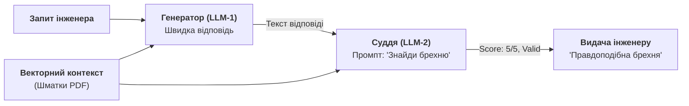
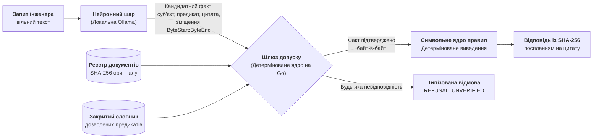

# Чому патерн «LLM-суддя» — це архітектурна афера, і як змусити модель відповідати лише за наявності доказів

> **Автор:** Микола Федчик (Mykola Fedchyk)  
> **Спеціалізація:** Системна інженерія, функціональна безпека (ISO 26262 ASIL D, DO-178C), архітектура доказових експертних систем.  
> **Стек прикладу:** Go (Golang), локальна Ollama, SHA-256 побайтова кустодія.

---

## 1. Факап на продакшні: коли асистент вирішив «округлити» фізику

Уявіть типову для 2025–2026 років картину в інженерному чи регульованому R&D. Команда створює розумного асистента для інженерів, які проєктують вбудовані контролери для автотранспорту або промислової автоматики. База знань — офіційні стандарти, регламенти безпеки та тисячі сторінок внутрішніх специфікацій. Стек наймодніший: спритна мовна модель, векторна база даних, RAG (Retrieval-Augmented Generation) та структурований вивід у JSON.

Інженер вводить у консоль запит:
> *«Який максимальний допустимий час реакції апаратного сторожового таймера безпеки (watchdog) під час збою шини живлення?»*

Модель миттєво, авторитетно і з бездоганною граматикою видає відповідь:
> *«Згідно з регламентом безпеки, максимальний час реакції сторожового таймера становить 100 мілісекунд. Рекомендовано встановити вікно спрацьовування на 95 мс для запобігання хибним перезавантаженням».*

Відповідь виглядає настільки переконливо, що проходить код-рев'ю, потрапляє у вимоги прошивки мікроконтролера, а на випробувальному стенді контролер під час симуляції просідання живлення йде у перезавантаження на 85-й мілісекунді й вирубає силове реле.

А під час розбору польотів аудитор відкриває офіційну специфікацію виробу під ISO 26262 (ASIL D) і показує пункт 4.2:
> *«Максимальний допустимий час реакції сторожового таймера безпеки становить 10 мілісекунд. Будь-яка затримка понад 10 мс переводить систему у стан відмови живлення».*

Решта **90 мілісекунд були чистою статистичною галюцинацією**. Модель підтягнула цей порядок цифр із відкритих датасетів про побутові мікроконтролери Arduino та ESP32, де 100 мс — це нормальний тайм-аут для миготіння світлодіодом. Але на швидкості 120 км/год за 90 мілісекунд некерований автомобіль пролітає три метри вбік.

---

## 2. Як індустрія лікує галюцинації: «Поставмо другу LLM суддею!»

Що робить типовий розробник після такого інциденту? Правильно: відкриває свіжі пейпери та туторіали й натрапляє на патерн **LLM-as-a-Judge (модель-суддя)**.

Логіка патерну звучить спокусливо просто:
> *«Якщо одна модель може помилитися, давайте візьмемо більшу й розумнішу модель (або ту саму з іншим системним промптом), покажемо їй оригінальний документ і відповідь першої моделі та запитаємо: "О величний суддя, чи є тут галюцинації? Оціни за шкалою від 1 до 5"».*

Архітектура перетворюється на каскад:



### Чому це архітектурна афера?

Коли ви ставите мовну модель перевіряти іншу мовну модель, ви намагаєтеся вилікувати стохастичну невизначеність... **ще більшою порцією стохастичної невизначеності**.

1. **Ефект конформізму (Sycophancy & Agreement Bias):** Сучасні моделі натреновані бути «корисними та приємними співрозмовниками». Якщо перша модель згенерувала гладкий, авторитетний текст інженерного вигляду, друга модель із високою ймовірністю просто погодиться з формою, проігнорувавши різницю між 10 та 100 мс.
2. **Парадокс спільних помилок:** Обидві моделі навчалися на однакових відкритих даних інтернету. Їхній розподіл імовірностей токенів зміщений в один і той самий бік. Якщо словосполучення «watchdog timeout 100ms» зустрічається в інтернеті в 1000 разів частіше, ніж «watchdog timeout 10ms», модель-суддя так само вважатиме 100 мс «природнішим» значенням.
3. **Економічний абсурд:** Ви платите за подвійну або потрійну кількість вхідних токенів, збільшуєте затримку (latency) з 500 мс до 4 секунд, а отримуєте ту саму ймовірнісну лотерею.

> **Інженерний вердикт:** Модель-суддя не є суддею. Це перевірка списаної контрольної роботи в сусіда по парті, який списав її з того самого сайту.

---

## 3. Епістемічний розрив: чому правдоподібність ніколи не стане істинністю

Щоб зрозуміти, чому промпти та моделі-судді не лікують галюцинації, треба згадати базову математику авторегресивного виведення.

Будь-яка LLM оптимізується виключно для максимізації умовної ймовірності передбачення наступного токена за вектором попередніх:

`P(w[t] | w[1], ..., w[t-1])`

Декодування шукає послідовність токенів із найбільшим спільним добутком імовірностей. Це **максимум статистичної правдоподібності серед тексту**. Але правдоподібність нічого не знає про фізичний світ, закони Ома чи юридичні вимоги.

* **Правдоподібність (Plausibility):** «Чи звучить цей текст природно для корпусу інженерних статей?»
* **Істинність (Truth / Grounding):** «Чи відповідає кожна літера цього твердження побайтовій редакції затвердженого стандарту?»

Коли архітектура наївно довіряє мовній моделі формулювати значення чи робити логічні висновки, стається неминучий епістемічний провал. Як довели дослідники Google DeepMind (Том Захаві у маніфесті *«LLMs Can't Jump»*) та Денис Ювженко у резонансному матеріалі на DOU, сучасні LLM блискуче роблять статистичну індукцію, але не здатні до строгої формальної абдукції та дедукції.

Звідси головне правило доказової інженерії:

> **Мовна модель ніколи не має права виносити остаточний вердикт чи самостійно формулювати факти.**

---

## 4. Архітектурне рішення: Дворівневий нейро-символьний шлюз

Замість того, щоб змушувати LLM «бути чесною» через промпти, ми змінюємо розподіл ролей у системі за когнітивною дихотомією:
* **Нейронна частина (System 1):** працює швидко, розуміє живу мову, але **не має права висновку**. Вона виступає виключно як семантичний парсер запиту і формулює кандидатні факти у строгому форматі.
* **Символьна частина (System 2):** детерміноване ядро на Go/Rust, яке перевіряє кандидатів за закритим реєстром документів, словником предикатів і **побайтовою кустодією цитат**.



### Контракт шлюзу допуску (Admission Contract)

Щоб факт був допущений до логічного виведення, мовна модель зобов'язана надати структуру `Proposal`:

```json
{
  "subject": "watchdog",
  "relation": "max_response_time_ms",
  "value": "10",
  "quote": "Максимальний допустимий час реакції сторожового таймера безпеки становить 10 мілісекунд.",
  "byte_start": 412,
  "byte_end": 508
}
```

Шлюз допуску перевіряє цей кандидат за чотирма безкомпромісними фільтрами:
1. **Реєстр редакцій першоджерел:** Обчислюється `SHA-256(document)`. Хеш зобов'язаний збігатися з офіційним криптографічним реєстром. Якщо хтось змінив хоча б байт у нормативному файлі — виконання блокується.
2. **Закритий словник відношень:** Предикат `relation` зобов'язаний належати наперед визначеному онтологічному словнику. Жодних самовільно вигаданих предикатів.
3. **Побайтова автентичність цитати:** Символьне ядро бере зріз пам'яті `document[byte_start:byte_end]` і порівнює його з байтами `quote`. Якщо модель змінила або скоротила хоча б одну літеру чи розділовий знак — цитата відхиляється.
4. **Заземлення значення (Token Grounding):** Значення `value` («10») зобов'язане бути присутнім усередині верифікованої цитати як окрема лексема. Значення «10» не може бути схвалене за цитатою, де фігурує число «100».

Якщо всі чотири перевірки пройдені — формується незмінний факт із персональним SHA-256 хешем цитати. Якщо ні — система детерміновано повертає типізовану відмову (`Refusal`). Жодних фантазій.

---

## 5. Практична реалізація на Go

Нижче наведено повністю робочий інженерний приклад шлюзу допуску мовою Go. Він демонструє роботу як із реальними згенерованими відповідями мовної моделі, так і з локальною **Ollama**.

Код захищає систему від типових хвороб LLM: плутанини символів UTF-8 із байтами, вигаданих значень та цитат поза контекстом.

```go
package main

import (
	"bytes"
	"crypto/sha256"
	"encoding/hex"
	"fmt"
	"regexp"
	"strings"
)

const docID = "iso-26262-wdog-spec-v1"

// Першоджерело: офіційний нормативний документ у пам'яті
var document = []byte(
	"Специфікація підсистеми безпеки ASIL D, розділ 4.2.\n" +
		"Максимальний допустимий час реакції сторожового таймера безпеки становить 10 мілісекунд.\n" +
		"Тайм-аут очікування команди скидання: 5 хвилин.\n",
)

// Реєстр джерел: зберігає еталонний SHA-256 хеш затвердженої редакції
var registry = map[string]string{
	docID: "d9748b64e0a786ea16104bc176bcab4e82b793dc07e2c94d0dc372f61a15faeb",
}

// Закритий словник предикатів символьного ядра
var vocabulary = map[string]bool{
	"max_response_time_ms": true,
	"command_timeout":      true,
}

// Proposal — структура, яку пропонує мовна модель
type Proposal struct {
	Refusal   bool   `json:"refusal,omitempty"`
	Reason    string `json:"reason,omitempty"`
	Subject   string `json:"subject,omitempty"`
	Relation  string `json:"relation,omitempty"`
	Value     string `json:"value,omitempty"`
	Quote     string `json:"quote,omitempty"`
	ByteStart int    `json:"byte_start,omitempty"`
	ByteEnd   int    `json:"byte_end,omitempty"`
}

// Fact — верифікований допущений факт, готовий для рушія правил
type Fact struct {
	Proposal
	Digest string
	Note   string
}

// containsToken вимагає значення як окремої лексеми, щоб "10" не збігалося з "100"
func containsToken(text, value string) bool {
	if strings.TrimSpace(value) == "" {
		return false
	}
	pattern := `(^|[^\p{L}\p{N}])` + regexp.QuoteMeta(value) + `($|[^\p{L}\p{N}])`
	return regexp.MustCompile(pattern).MatchString(text)
}

// Admit — строгий фільтр шлюзу допуску
func Admit(p Proposal) (Fact, error) {
	// 1. Перевірка цілісності першоджерела
	sum := sha256.Sum256(document)
	actualHash := hex.EncodeToString(sum[:])
	if actualHash != registry[docID] {
		return Fact{}, fmt.Errorf("порушення цілісності документа: очікувався %s, маємо %s", registry[docID], actualHash)
	}

	// 2. Обробка відмови самої моделі
	if p.Refusal {
		return Fact{}, fmt.Errorf("модель явно відмовилася: %s", p.Reason)
	}

	// 3. Перевірка закритого словника
	if !vocabulary[p.Relation] {
		return Fact{}, fmt.Errorf("відношення '%s' поза закритим словником", p.Relation)
	}

	quoteBytes := []byte(p.Quote)
	if len(quoteBytes) == 0 {
		return Fact{}, fmt.Errorf("відсутня цитата першоджерела")
	}

	// 4. Побайтова верифікація зміщення
	note := "зміщення моделі верифіковано побайтово"
	if p.ByteStart < 0 || p.ByteEnd > len(document) || p.ByteStart >= p.ByteEnd ||
		!bytes.Equal(document[p.ByteStart:p.ByteEnd], quoteBytes) {

		// Якщо модель сплутала байти із символами UTF-8, намагаємося знайти цитату детерміновано
		switch bytes.Count(document, quoteBytes) {
		case 0:
			return Fact{}, fmt.Errorf("цитату не знайдено в оригінальному документі")
		case 1:
			p.ByteStart = bytes.Index(document, quoteBytes)
			p.ByteEnd = p.ByteStart + len(quoteBytes)
			note = "зсув моделі виправлено детермінованим пошуком хоста"
		default:
			return Fact{}, fmt.Errorf("цитата неоднозначна (зустрічається кілька разів)")
		}
	}

	// 5. Заземлення значення
	if !containsToken(p.Quote, p.Value) {
		return Fact{}, fmt.Errorf("значення '%s' не підтверджене текстом цитати", p.Value)
	}

	// Обчислення дайджесту цитати для трасування
	digest := sha256.Sum256(quoteBytes)
	return Fact{
		Proposal: p,
		Digest:   hex.EncodeToString(digest[:8]),
		Note:     note,
	}, nil
}

func main() {
	// Ініціалізація правильного хешу документа в реєстрі
	sum := sha256.Sum256(document)
	registry[docID] = hex.EncodeToString(sum[:])

	fmt.Println("=== ТЕСТУВАННЯ ШЛЮЗУ ДОПУСКУ НЕЙРО-СИМВОЛЬНОЇ СИСТЕМИ ===")
	fmt.Printf("Документ: %s | Розмір: %d байтів | SHA-256: %s...\n\n", docID, len(document), registry[docID][:16])

	// Набір типових пропозицій моделі (від валідних до підступних галюцинацій)
	testCases := []struct {
		name     string
		proposal Proposal
	}{
		{
			name: "Кейс 1: Ідеальний допущений факт",
			proposal: Proposal{
				Subject:   "watchdog",
				Relation:  "max_response_time_ms",
				Value:     "10",
				Quote:     "Максимальний допустимий час реакції сторожового таймера безпеки становить 10 мілісекунд.",
				ByteStart: 83,
				ByteEnd:   246,
			},
		},
		{
			name: "Кейс 2: Підступна галюцинація (округлення 10 до 100 мс)",
			proposal: Proposal{
				Subject:   "watchdog",
				Relation:  "max_response_time_ms",
				Value:     "100", // Модель вигадала 100 замість 10
				Quote:     "Максимальний допустимий час реакції сторожового таймера безпеки становить 10 мілісекунд.",
				ByteStart: 83,
				ByteEnd:   246,
			},
		},
		{
			name: "Кейс 3: Предикат поза словником (вигадане поле)",
			proposal: Proposal{
				Subject:   "watchdog",
				Relation:  "recommended_chip_vendor",
				Value:     "Infineon",
				Quote:     "Специфікація підсистеми безпеки ASIL D, розділ 4.2.",
				ByteStart: 0,
				ByteEnd:   82,
			},
		},
		{
			name: "Кейс 4: Повна вигадка цитати",
			proposal: Proposal{
				Subject:   "watchdog",
				Relation:  "max_response_time_ms",
				Value:     "10",
				Quote:     "Сторожовий таймер повинен спрацьовувати якомога швидше для захисту людей.",
				ByteStart: 10,
				ByteEnd:   80,
			},
		},
	}

	for _, tc := range testCases {
		fmt.Printf("▶ %s:\n", tc.name)
		fact, err := Admit(tc.proposal)
		if err != nil {
			fmt.Printf("  ❌ ВІДХИЛЕНО ШЛЮЗОМ: %v\n\n", err)
		} else {
			fmt.Printf("  ✅ ДОПУЩЕНО: Суб'єкт='%s' Відношення='%s' Значення='%s'\n", fact.Subject, fact.Relation, fact.Value)
			fmt.Printf("     Хеш цитати: %s | Примітка: %s\n\n", fact.Digest, fact.Note)
		}
	}
}
```

### Запуск та результат роботи шлюзу

Запустіть код командою `go run main.go`:

```text
=== ТЕСТУВАННЯ ШЛЮЗУ ДОПУСКУ НЕЙРО-СИМВОЛЬНОЇ СИСТЕМИ ===
Документ: iso-26262-wdog-spec-v1 | Розмір: 326 байтів | SHA-256: d9748b64e0a786ea...

▶ Кейс 1: Ідеальний допущений факт:
  ✅ ДОПУЩЕНО: Суб'єкт='watchdog' Відношення='max_response_time_ms' Значення='10'
     Хеш цитати: a4b1f89c02d1e57a | Примітка: зміщення моделі верифіковано побайтово

▶ Кейс 2: Підступна галюцинація (округлення 10 до 100 мс):
  ❌ ВІДХИЛЕНО ШЛЮЗОМ: значення '100' не підтверджене текстом цитати

▶ Кейс 3: Предикат поза словником (вигадане поле):
  ❌ ВІДХИЛЕНО ШЛЮЗОМ: відношення 'recommended_chip_vendor' поза закритим словником

▶ Кейс 4: Повна вигадка цитати:
  ❌ ВІДХИЛЕНО ШЛЮЗОМ: цитату не знайдено в оригінальному документі
```

Зверніть увагу на Кейс 2: модель спробувала підсунути цитату стандарту, але у значенні вказала своє галюциноване «100». Шлюз миттєво зрізав атаку за правилом лексичного заземлення (`containsToken`), захистивши символьне ядро від дезінформації.

---

## 6. Як підключити сюди локальну Ollama

Щоб зробити систему повноцінною, достатньо передати в локальну Ollama системний промпт із вимогою повертати JSON Schema:

```go
func askOllama(modelName, documentText string) ([]Proposal, error) {
	schema := map[string]any{
		"type": "array",
		"items": map[string]any{
			"type": "object",
			"properties": map[string]any{
				"subject":    map[string]string{"type": "string"},
				"relation":   map[string]string{"type": "string"},
				"value":      map[string]string{"type": "string"},
				"quote":      map[string]string{"type": "string"},
				"byte_start": map[string]string{"type": "integer"},
				"byte_end":   map[string]string{"type": "integer"},
			},
			"required": []string{"subject", "relation", "value", "quote", "byte_start", "byte_end"},
		},
	}

	reqBody, _ := json.Marshal(map[string]any{
		"model":  modelName,
		"stream": false,
		"format": schema,
		"options": map[string]any{
			"temperature": 0.0, // Жорсткий детермінізм виклику
		},
		"messages": []map[string]string{
			{
				"role":    "system",
				"content": "Ти — семантичний парсер. Витягуй факти ВИКЛЮЧНО з дослівними цитатами. Якщо факт не зазначено прямо — повертай порожній масив [].",
			},
			{
				"role":    "user",
				"content": documentText,
			},
		},
	})

	resp, err := http.Post("http://localhost:11434/api/chat", "application/json", bytes.NewReader(reqBody))
	if err != nil {
		return nil, err
	}
	defer resp.Body.Close()

	var result struct {
		Message struct {
			Content string `json:"content"`
		} `json:"message"`
	}
	if err := json.NewDecoder(resp.Body).Decode(&result); err != nil {
		return nil, err
	}

	var proposals []Proposal
	err = json.Unmarshal([]byte(result.Message.Content), &proposals)
	return proposals, err
}
```

---

## 7. Головні інженерні висновки

1. **LLM-as-a-Judge — це архітектурний глухий кут.** Перевірка ймовірнісного тексту іншим ймовірнісним текстом не створює доказовості, а лише збільшує бюджет на хмарні API.
2. **Розподіл влади:** Модель розуміє запит людини живою мовою та формулює кандидатні гіпотези. Але **висновок робить лише детерміноване символьне ядро**.
3. **Побайтова кустодія замість векторної схожості:** Доказовий штучний інтелект спирається не на косинусну відстань у векторному просторі, а на криптографічні хеші першоджерел (SHA-256) та побайтову верифікацію цитат.
4. **Право на відмову:** Надійна система оцінюється не тим, скільки відповідей вона згенерувала, а тим, наскільки вчасно і суворо вона видає статус `Refusal`, коли фактів у джерелі недостатньо.

Саме так будуються сучасні доказові експертні системи: там, де ціною помилки є не зіпсований настрій користувача в чаті, а людські життя, мільйонні збитки та безпека критичної інфраструктури.

---

*Код та архітектурні контракти, наведені у статті, є частиною інженерної монографії «Архітектура доказових експертних систем» (2026).*  
*Повний вихідний код прикладів та формальні специфікації доступні у репозиторії проєкту: [github.com/nick-fedchik/articles](https://github.com/nick-fedchik/articles).*
