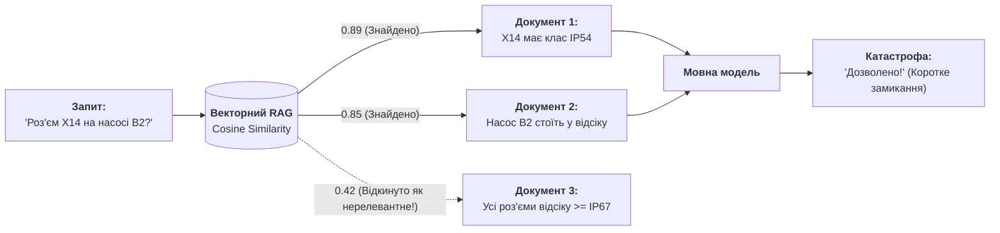
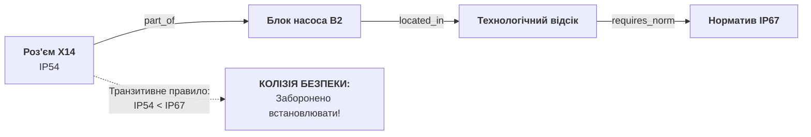

# RAG вичерпав себе: чому векторні бази не знають транзитивності, і як рятує інженерний граф знань (EKG)

> **Автор:** Микола Федчик (Mykola Fedchyk)  
> **Цикл публікацій:** Доказовий штучний інтелект та місійно-критичні системи (Частина 2).  
> **Попередня частина:** [Чому патерн «LLM-суддя» — це архітектурна афера, і як змусити модель відповідати лише за наявності доказів](DOU-01-LLM-Judge-Trap-And-Evidence-Gateway-UA.md)  
> **Стек прикладу:** Go (Golang), реляційний граф зв'язків, алгоритми виявлення прогалин знань (Knowledge Gaps).

---

## 1. Факап на продакшні: коли векторний пошук «не помітив» катастрофи

У [першій частині нашого циклу](DOU-01-LLM-Judge-Trap-And-Evidence-Gateway-UA.md) ми розібрали, чому патерн «LLM-суддя» є ілюзією, і як за допомогою побайтового шлюзу допуску на Go відсікати галюцинації мовної моделі на рівні окремих фактів. Але щойно розробники впроваджують шлюз допуску, вони стикаються з наступною, ще підступнішою стіною.

Уявіть реальну ситуацію в інженерному чи регульованому виробництві (промислове обладнання, енергетика, автотранспорт або MilTech). Команда завантажила у векторну базу даних (Qdrant, Pinecone, Chroma або pgvector) бібліотеку з 500 технічних регламентів, стандартів безпеки та карт збирання.

Молодий інженер-конструктор вводить у корпоративного RAG-асистента запит:
> *«Чи дозволено встановлювати з'єднувальний роз'єм X14 на блоці керування насосом B2?»*

RAG робить усе строго за підручником:
1. Перетворює запит на 1536-вимірний вектор ембеддінгу.
2. Шукає топ-5 найбільш семантично схожих чанків тексту за косинусною відстанню.
3. Знаходить ідеальні збіги:
   - **Документ 1 (Паспорт роз'єму):** *«Електричний роз'єм X14 сертифіковано за класом захисту оболонки IP54»*.
   - **Документ 2 (Специфікація насоса):** *«Блок керування насосом B2 призначений для монтажу в нижній секції технологічного відсіку»*.
4. Віддає чанки в LLM. Модель бачить релевантні тексти і бадьоро відповідає:
   > *«Так, встановлення роз'єму X14 на блоці керування B2 дозволено. Роз'єм має сертифікований захист IP54, що відповідає вимогам до промислових з'єднань».*

Інженер затверджує креслення. На випробуваннях під час першого ж гідродинамічного тесту технологічний відсік заливає водою, роз'єм IP54 коротить, силова плата насоса вигорає.

А потім приходить аудитор з технічного нагляду, відкриває **Документ 3 (Загальний регламент безпеки технологічних приміщень)**, якого RAG взагалі не підтягнув у контекст, і показує пункт 8.1:
> *«Усі кабельні вводи та роз'єми в технологічних відсіках зобов'язані мати клас захисту не нижче IP67 у зв'язку з ризиком конденсації та розливу охолоджувальної рідини».*

---

## 2. Анатомія провалу: чому вектори сліпі до логіки

Чому класичний RAG пропустив критичну норму?

Тому що в пункті 8.1 документа 3 **не було жодного слова про «роз'єм X14» чи «блок B2»!** Там було написано загальне правило для сутності «технологічний відсік». 

З погляду математики векторних просторів:
- Косинусна відстань між фразою *«Чи дозволено роз'єм X14 на блоці B2»* та фразою *«Вимоги до герметичності технологічних приміщень»* виявилася завеликою (скажімо, 0.42). 
- Векторна база відкинула цей чанк як «нерелевантний» і вивела в топ документи з прямими словесними збігами «X14» та «B2».



### Три смертні гріхи наївного RAG:

1. **Відсутність транзитивності:** Векторний простір не вміє робити висновок:  
   `X14 монтується на B2` $\land$ `B2 розташований у Відсіку` $\implies$ `X14 розташований у Відсіку`.  
   Вектор — це просто координата хмари точок смислового поля, а не логічний квантор.
2. **Сліпота до ієрархій та спадкування (is-a):** Роз'єм X14 є різновидом класу `Кабельний роз'єм`, а клас `Кабельний роз'єм` успадковує всі обмеження нормативу безпеки. Векторна модель не бачить відношення «вид—рід».
3. **Нездатність до відмови за замовчуванням (Open World Trap):** Якщо зв'язок між компонентами не описаний в одному абзаці, RAG підштовхує модель заповнити прогалину власною галюцинацією, замість того щоб повідомити: *«Мені бракує проміжного ребра графа для підтвердження сумісності»*.

---

## 3. Інженерний граф знань (EKG): зв'язки замість ембеддінгів

Щоб система не втрачала критичних зв'язків, ми замінюємо неструктуроване сховище чанків на **Інженерний граф знань (Engineering Knowledge Graph, EKG)**.

В EKG знання подаються не випадковими шматками тексту, а типізованими твердженнями у вигляді реляційних триплетів:

`⟨ Суб'єкт, Відношення, Об'єкт ⟩`

Кожне відношення береться зі строгого закритого словника онтології:
- `located_in` (фізичне розташування вузла);
- `has_subsystem` / `part_of` (структурна декомпозиція виробу);
- `requires_min_ingress_protection` (нормативні вимоги стандарту);
- `certified_ingress_protection` (паспортні дані компонента).

У такій структурі наша задача перетворюється з ворожіння на векторах на **детермінований пошук шляху в графі (Graph Pathfinding & Reachability)**:



### Як це працює в інженерному конвеєрі:
1. **Транзитивний транслятор:** Якщо $A \xrightarrow{\text{part\_of}} B$ і $B \xrightarrow{\text{located\_in}} C$, система автоматично виводить факт $A \xrightarrow{\text{located\_in}} C$.
2. **Формальний компаратор:** Граф знаходить норматив для зони $C$ (`min_ip = IP67`) та паспортний атрибут роз'єму $A$ (`actual_ip = IP54`).
3. **Логічний вердикт:** Детерміноване правило порівнює класи захисту: $\text{IP54} < \text{IP67}$. Висновок: **ВСТАНОВЛЕННЯ СУВОРО ЗАБОРОНЕНО**. Помилка усувається ще на етапі проєктування.

---

## 4. Діалог Сократа: що робити, коли знань бракує?

А що станеться, якщо конструктор запитає про сумісність нового роз'єму X99, про який у базі немає інформації щодо класу захисту?

Звичайний RAG у такій ситуації вигадає найімовірніший варіант або покладеться на загальні знання моделі.

Доказова система застосовує **метод діалогу Сократа (Socratic Knowledge Clarification)**:
1. Граф виявляє розрив ланцюжка доведення: шлях від `X99` до нормативу безпеки відсіку обривається на кроці перевірки `certified_ingress_protection`.
2. Система **не галюцинує і не мовчить**. Вона формулює прецизійний запит до інженера для ліквідації конкретної прогалини:
   > *«Для перевірки сумісності роз'єму X99 з технологічним відсіком насоса B2 необхідно вказати клас захисту IP для X99. Введіть сертифікований клас або надайте посилання на паспорт компонента».*

Це перетворює систему з ненадійного чат-бота на **автономного аудитора інженерних рішень**.

---

## 5. Практична реалізація графа та детектора колізій на Go

Нижче наведено робочий код інженерного графа знань мовою Go. Він демонструє:
- зберігання типізованих вузлів та зв'язків;
- транзитивне виведення розташування компонентів;
- виявлення порушення норм безпеки;
- активацію діалогу Сократа при виявленні неповної інформації.

```go
package main

import (
	"fmt"
	"strings"
)

// IPClass описує числовий рівень захисту оболонки
type IPClass int

const (
	IP00 IPClass = 0
	IP54 IPClass = 54
	IP65 IPClass = 65
	IP67 IPClass = 67
	IP68 IPClass = 68
)

// RelationType — типізовані відношення онтології
type RelationType string

const (
	RelPartOf    RelationType = "part_of"
	RelLocatedIn RelationType = "located_in"
)

// Edge — орієнтоване ребро графа знань
type Edge struct {
	From string
	Rel  RelationType
	To   string
}

// KnowledgeGraph — структура інженерного графа знань
type KnowledgeGraph struct {
	Edges          []Edge
	ComponentIP    map[string]IPClass
	ZoneRequiredIP map[string]IPClass
}

func NewKnowledgeGraph() *KnowledgeGraph {
	return &KnowledgeGraph{
		Edges:          make([]Edge, 0),
		ComponentIP:    make(map[string]IPClass),
		ZoneRequiredIP: make(map[string]IPClass),
	}
}

func (g *KnowledgeGraph) AddEdge(from string, rel RelationType, to string) {
	g.Edges = append(g.Edges, Edge{From: from, Rel: rel, To: to})
}

// FindLocation детерміновано знаходить кінцеву фізичну зону розташування вузла за транзитивними зв'язками
func (g *KnowledgeGraph) FindLocation(component string) (string, []string) {
	path := []string{component}
	current := component

	for {
		foundNext := false
		for _, e := range g.Edges {
			if e.From == current && (e.Rel == RelPartOf || e.Rel == RelLocatedIn) {
				current = e.To
				path = append(path, current)
				foundNext = true
				break
			}
		}
		if !foundNext {
			break
		}
		// Якщо дійшли до зони, де визначені вимоги захисту — це кінцева локація
		if _, ok := g.ZoneRequiredIP[current]; ok {
			return current, path
		}
	}

	return "", path
}

// AuditCompatibility здійснює строгу перевірку допуску компонента за нормами безпеки
func (g *KnowledgeGraph) AuditCompatibility(component string) {
	fmt.Printf("=== АУДИТ ДОПУСКУ ДЛЯ ВУЗЛА: %s ===\n", component)

	// 1. Пошук фізичної зони експлуатації через транзитивні зв'язки
	zone, path := g.FindLocation(component)
	if zone == "" {
		fmt.Printf("❌ ВІДМОВА (Socratic Gap): Неможливо встановити кінцеву зону монтажу для %s.\n", component)
		fmt.Printf("   Діалог Сократа: Додайте зв'язок 'part_of' або 'located_in' для компонентів ланцюжка [%s].\n\n", strings.Join(path, " -> "))
		return
	}

	fmt.Printf("📍 Транзитивний ланцюжок розташування: %s\n", strings.Join(path, " -> "))
	requiredIP := g.ZoneRequiredIP[zone]
	fmt.Printf("📋 Вимога нормативу зони '%s': мінімум IP%d\n", zone, requiredIP)

	// 2. Перевірка наявності сертифікованого паспорта компонента
	actualIP, hasIP := g.ComponentIP[component]
	if !hasIP {
		fmt.Printf("⚠️  ВІДМОВА (Socratic Gap): Для вузла '%s' відсутній сертифікований клас захисту IP.\n", component)
		fmt.Printf("   Діалог Сократа: Вкажіть фактичний клас IP з паспорта виробу для прийняття рішення.\n\n")
		return
	}

	fmt.Printf("🔍 Фактичний клас захисту '%s': IP%d\n", component, actualIP)

	// 3. Формальний компаратор вимог безпеки
	if actualIP >= requiredIP {
		fmt.Printf("✅ СХВАЛЕНО: Вузол %s відповідає вимогам зони безпеки (IP%d >= IP%d).\n\n", component, actualIP, requiredIP)
	} else {
		fmt.Printf("🛑 ЗАБОРОНЕНО (Порушення норми): Клас IP%d є недостатнім для зони '%s' (вимагається мінімум IP%d)!\n\n",
			actualIP, zone, requiredIP)
	}
}

func main() {
	graph := NewKnowledgeGraph()

	// 1. Нормативна база безпеки: регламент приміщень
	graph.ZoneRequiredIP["tech_bay_lower"] = IP67

	// 2. Топологія виробу: роз'єм X14 -> блок насоса B2 -> нижній відсік
	graph.AddEdge("connector_X14", RelPartOf, "pump_unit_B2")
	graph.AddEdge("pump_unit_B2", RelLocatedIn, "tech_bay_lower")

	// Паспортні дані роз'ємів
	graph.ComponentIP["connector_X14"] = IP54 // Реальний клас захисту X14
	graph.ComponentIP["connector_X67"] = IP67 // Посилений герметичний роз'єм

	// Кейс 1: Наївний RAG схвалив би, але EKG блокує через транзитивну колізію
	graph.AuditCompatibility("connector_X14")

	// Кейс 2: Посилений роз'єм, який успішно проходить аудит
	graph.AddEdge("connector_X67", RelPartOf, "pump_unit_B2")
	graph.AuditCompatibility("connector_X67")

	// Кейс 3: Новий роз'єм без паспорта (активація діалогу Сократа)
	graph.AddEdge("connector_X99_prototype", RelPartOf, "pump_unit_B2")
	graph.AuditCompatibility("connector_X99_prototype")
}
```

### Результат виконання програми

Запустіть код командою `go run main.go`:

```text
=== АУДИТ ДОПУСКУ ДЛЯ ВУЗЛА: connector_X14 ===
📍 Транзитивний ланцюжок розташування: connector_X14 -> pump_unit_B2 -> tech_bay_lower
📋 Вимога нормативу зони 'tech_bay_lower': мінімум IP67
🔍 Фактичний клас захисту 'connector_X14': IP54
🛑 ЗАБОРОНЕНО (Порушення норми): Клас IP54 є недостатнім для зони 'tech_bay_lower' (вимагається мінімум IP67)!

=== АУДИТ ДОПУСКУ ДЛЯ ВУЗЛА: connector_X67 ===
📍 Транзитивний ланцюжок розташування: connector_X67 -> pump_unit_B2 -> tech_bay_lower
📋 Вимога нормативу зони 'tech_bay_lower': мінімум IP67
🔍 Фактичний клас захисту 'connector_X67': IP67
✅ СХВАЛЕНО: Вузол connector_X67 відповідає вимогам зони безпеки (IP67 >= IP67).

=== АУДИТ ДОПУСКУ ДЛЯ ВУЗЛА: connector_X99_prototype ===
📍 Транзитивний ланцюжок розташування: connector_X99_prototype -> pump_unit_B2 -> tech_bay_lower
📋 Вимога нормативу зони 'tech_bay_lower': мінімум IP67
⚠️  ВІДМОВА (Socratic Gap): Для вузла 'connector_X99_prototype' відсутній сертифікований клас захисту IP.
   Діалог Сократа: Вкажіть фактичний клас IP з паспорта виробу для прийняття рішення.
```

---

## 6. Як поєднати LLM та EKG в єдиний конвеєр

Чи означає це, що мовні моделі більше не потрібні? Зовсім ні. Ми використовуємо найкраще з обох світів:

1. **LLM на вході (Information Extraction):** Під час завантаження нових PDF-документів та стандартів локальна LLM через граматично-скероване декодування видобуває типізовані зв'язки `⟨ Subject, Relation, Object ⟩` разом із побайтовими цитатами (як ми показували у Главі 15 та першій статті циклу).
2. **EKG в ядрі (Reasoning & Validation):** Граф знань будує транзитивні замикання, перевіряє цілісність топології та шукає логічні суперечності за мікросекунди за допомогою детермінованих алгоритмів обходу графів.
3. **LLM на виході (Explanation Engine):** Коли граф підтвердив шлях доведення і виніс вердикт `СХВАЛЕНО` або `ЗАБОРОНЕНО`, мовна модель генерує природне інженерне пояснення для людини, спираючись **виключно на перевірені вузли графа**.

---

## 7. Головні висновки для архітектора

1. **Векторний пошук не є базою знань.** Вектори знаходять схожі слова, але принципово сліпі до логічного виведення, ієрархій та вимог стандартів.
2. **Транзитивність рятує життя.** У складних інженерних системах норматив і компонент майже ніколи не згадуються в одному документі. Без транзитивного графа система неминуче допустить катастрофу на виробництві.
3. **Діалог Сократа замість галюцинацій.** Якщо системі бракує факту для повного доведення, вона повинна детерміновано зупинятися і ставити точне запитання інженеру, а не придумувати зручну відповідь.

У наступній, третій статті нашого циклу ми перейдемо до найвищого рівня критичності: **чому сучасні автопілоти та бойові автономні дрони (MilTech) ніколи не пустять нейромережу керувати сервоприводами напряму, і як будується апаратний Safety Shield на FPGA та контролерах AURIX ASIL D**.

---

*Код графа та математичні моделі асоціативних правил (AMIE / PCA) є частиною монографії «Архітектура доказових експертних систем» (2026).*  
*Повний репозиторій статей та коду: [github.com/nick-fedchik/articles](https://github.com/nick-fedchik/articles).*
