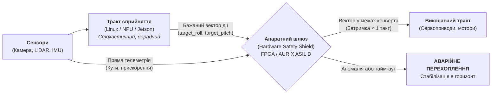

# ШІ в оборонці та на борту: чому автопілоти ніколи не пустять нейромережу керувати напряму (і що таке Hardware Safety Interlock)

> **Автор:** Микола Федчик (Mykola Fedchyk)  
> **Цикл публікацій:** Доказовий штучний інтелект та місійно-критичні системи (Частина 3).  
> **Попередні частини:**  
> • [Частина 1: Чому патерн «LLM-суддя» — це архітектурна афера](DOU-01-LLM-Judge-Trap-And-Evidence-Gateway-UA.md)  
> • [Частина 2: RAG вичерпав себе: чому векторні бази не знають транзитивності](DOU-02-RAG-Limits-And-Engineering-Knowledge-Graphs-UA.md)  
> **Спеціалізація:** Вбудовані системи (Infineon AURIX ASIL D, ARM Cortex-M/R, FPGA), місійно-критична функціональна безпека (ISO 26262, DO-178C), MilTech.

---

## 1. Ейфорія «End-to-End автопілотів» і перша стіна на полігоні

У перших двох частинах нашого циклу ми розібралися, як навести лад у текстах, цитатах та інженерних графах знань. Але зараз в українському Defense-Tech та світовому автопромі розгортається значно небезпечніша хвиля хайпу: **«End-to-End автономність»**.

Ідея звучить революційно просто:
> *«Навіщо нам складні класичні системи навігації та польотні контролери з десятками PID-регуляторів? Поставмо на дрон або наземну платформу потужний одноплатник (наприклад, NVIDIA Jetson AGX Orin або периферійний NPU), натягнімо нейромережу комп'ютерного зору (YOLO або Vision-Language-Action модель), і хай вона бере картинку з камери та напряму генерує PWM-сигнали для моторів і сервоприводів рулів!»*

На демо-відео в сонячну погоду над порожнім полем це виглядає приголомшливо: дрон впевнено летить за мішенню, розпізнає силуети й самостійно маневрує.

А тепер реальний полігон:
1. Дрон виходить на бойовий курс, розвертається проти низького вечірнього сонця.
2. Прямий відблиск пробиває об'єктив камери — картинка на 2 кадри заливається білим шумом (класична Out-of-Distribution аномалія).
3. Нейромережа на NPU раптово втрачає впевненість, драйвер прискорювача у Linux-стеку ловить тайм-аут ядра на перерозподілі тензорної пам'яті, а затримка виведення (Inference Latency) підстрибує з 15 мс до **380 мс**.
4. Останній вектор керування, який нейромережа встигла виплюнути перед зависанням — кут крену **85 градусів** та максимальна тяга правого рушія.
5. На швидкості 140 км/год за 380 мілісекунд апарат встигає виконати неконтрольовану бочку, зривається в штопор і на повній швидкості врізається в ґрунт.

Інженери чухають потилиці й кажуть: *«Треба донавчити нейромережу на кадрах із сонцем, додати ще 50 тисяч фотографій і збільшити модель!»*.

Це фатальна помилка мислення.

---

## 2. Теорема Батлера–Фінеллі: чому надійність ШІ неможливо «налітати»

В авіоніці (DO-178C DAL A) та автомобілебудуванні (ISO 26262 ASIL D) діє фундаментальна інженерна вимога: допустима ймовірність катастрофічної відмови системи становить не більше ніж **1 відмова на $10^9$ годин роботи** (одна мільярдна на годину польоту або поїздки).

У класичному софті на C або Ada/SPARK це доводиться формальними методами: статичним аналізом коду, доказами недосяжності переповнення буфера, перевіркою всіх гілок execution path та детермінованим циклом керування без динамічного виділення пам'яті (`malloc`).

Але як довести таку надійність для стохастичної нейромережі на мільйони ваг?

У фундаментальній праці Рікі Батлера та Джорджа Фінеллі (*«The Infeasibility of Quantifying the Reliability of Life-Critical Real-Time Software»*, NASA Langley Research Center) математично доведено:
> **Кількісно підтвердити надвисоку надійність ($10^{-9}$) складного статистичного ПЗ за допомогою емпіричного тестування фізично неможливо.**

Щоб статистично довести рівень відмов $10^{-9}$ із довірчим інтервалом 95%, вам знадобиться безперервно тестувати систему на стенді протягом **понад 100 000 років** без жодного збою!

Якщо ви взяли нейромережу з точністю розпізнавання 98% (що вважається чудовим результатом у Data Science), це означає, що **в 2 випадках зі 100 модель помилиться**. На полі бою або на трасі це означає катастрофу кожні кілька хвилин.

Звідси залізний закон функціональної безпеки:

> **Нейромережа на борту ніколи не має права прямого доступу до виконавчих приводів.**

---

## 3. Архітектура порятунку: Відокремлення сприйняття від дії

Рішення полягає не в тому, щоб відмовитися від нейромереж, а в **архітектурному розведенні системи на два непересічні середовища**:



### 1. Тракт сприйняття (Perception Pipeline)
* **Залізо:** Обчислювачі загального призначення (NVIDIA Jetson, Intel NPU, Rockchip RK3588 під керуванням ОС Linux).
* **Природа обчислень:** Імовірнісна, стохастична.
* **Функція:** Нейромережа аналізує картинку, шукає орієнтири, розпізнає цілі та генерує **дорадчу рекомендацію** (наприклад: *«Рекомендую довернути вправо на 15 градусів зі швидкістю 20 м/с»*).

### 2. Виконавчий тракт та апаратний шлюз безпеки (Hardware Safety Shield)
* **Залізо:** Спеціалізована мікросхема FPGA (Xilinx Artix-7, Lattice) або спеціалізований автомобільний мікроконтролер безпеки (Infineon AURIX TC49x / ARM Cortex-R52 з lockstep-ядрами).
* **Природа обчислень:** Строго детермінована, без операційної системи, без динамічної пам'яті, з гарантованим часом реакції **менше 1 такту шини або $< 100\,\mu\text{s}$**.
* **Функція:** Фізичний захисний бар'єр між ШІ та моторами.

---

## 4. Конверт валідності: як апаратний шлюз фільтрує божевілля ШІ

Апаратний шлюз пропускає рекомендації нейромережі крізь жорсткий математичний фільтр — **Конверт фізичної валідності (Operational Flight Envelope)**:

1. **Конверт кутів та перевантажень:**
   - Кут крену (Roll): не більше ніж $\pm 35^\circ$.
   - Кут тангажу (Pitch): від $-20^\circ$ до $+25^\circ$.
   - Нормальне перевантаження: не більше $2.5g$.
   - Швидкість зміни кутів: не більше $60^\circ/\text{s}$.
2. **Апаратний сторожовий таймер детермінізму (Watchdog):**
   - Нейромережа зобов'язана надсилати оновлений вектор кожні $20\,\text{ms}$ ($50\,\text{Hz}$).
   - Якщо через просідання NPU чи зависання черги Linux вектор затримується хоча б на **$50\,\text{ms}$** — апаратний таймер миттєво відсікає лінію зв'язку з NPU (Fail-Closed).
3. **Безаварійний режим (Fail-Safe State):**
   - У момент відсікання апаратний шлюз активує резервний детермінований пропорційно-інтегральний регулятор (PID), який отримує дані безпосередньо з дубльованого гіроскопа й ставить апарат у стійкий горизонтальний політ на безпечній швидкості.

Навіть якщо нейромережа збожеволіє, накаже увійти в піке чи повністю зависне — **апаратний шлюз фізично не дозволить виконати руйнівну команду**.

---

## 5. Симулятор апаратного шлюзу на Go

Нижче наведено робочий інженерний модуль на Go, що моделює роботу апаратного шлюзу безпеки (Hardware Safety Interlock). Він перевіряє команди від нейромережі, контролює джитер затримок та миттєво перехоплює керування при аномаліях.

```go
package main

import (
	"fmt"
	"math"
	"time"
)

// ActuatorCommand — команда, що надходить на сервоприводи
type ActuatorCommand struct {
	RollDeg     float64 // Крен (-35..+35)
	PitchDeg    float64 // Тангаж (-20..+25)
	ThrottlePct float64 // Тяга (0..100)
}

// AIProposal — дорадча рекомендація від нейромережі
type AIProposal struct {
	Command   ActuatorCommand
	Timestamp time.Time
}

// SafetyEnvelope — фізичні межі безпечного польоту
type SafetyEnvelope struct {
	MaxRollDeg     float64
	MinPitchDeg    float64
	MaxPitchDeg    float64
	MaxThrottlePct float64
	MaxLatencyMs   int64
}

// HardwareSafetyShield — апаратний шлюз захисту
type HardwareSafetyShield struct {
	Envelope        SafetyEnvelope
	LastValidTime   time.Time
	FailSafeTrigger bool
}

func NewSafetyShield() *HardwareSafetyShield {
	return &HardwareSafetyShield{
		Envelope: SafetyEnvelope{
			MaxRollDeg:     35.0,
			MinPitchDeg:    -20.0,
			MaxPitchDeg:    25.0,
			MaxThrottlePct: 90.0,
			MaxLatencyMs:   50, // Тайм-аут сторожовика: 50 мс
		},
		LastValidTime: time.Now(),
	}
}

// EvaluateAndDispatch — перевірка за 1 такт і відправка на приводи
func (s *HardwareSafetyShield) EvaluateAndDispatch(proposal AIProposal, now time.Time) (ActuatorCommand, string) {
	// 1. Перевірка апаратного сторожового таймера (Watchdog Latency)
	latency := now.Sub(proposal.Timestamp).Milliseconds()
	if latency > s.Envelope.MaxLatencyMs {
		s.FailSafeTrigger = true
		return s.engageFailSafe("ТАЙМ-АУТ ДЕТЕРМІНІЗМУ: Затримка NPU склала " + fmt.Sprintf("%d мс > %d мс", latency, s.Envelope.MaxLatencyMs))
	}

	// 2. Валідація кута крену (Roll Envelope)
	if math.Abs(proposal.Command.RollDeg) > s.Envelope.MaxRollDeg {
		s.FailSafeTrigger = true
		return s.engageFailSafe(fmt.Sprintf("ПОРУШЕННЯ КРЕНУ: Запитано %.1f° (ліміт ±%.1f°)", proposal.Command.RollDeg, s.Envelope.MaxRollDeg))
	}

	// 3. Валідація кута тангажу (Pitch Envelope)
	if proposal.Command.PitchDeg < s.Envelope.MinPitchDeg || proposal.Command.PitchDeg > s.Envelope.MaxPitchDeg {
		s.FailSafeTrigger = true
		return s.engageFailSafe(fmt.Sprintf("ПОРУШЕННЯ ТАНГАЖУ: Запитано %.1f° (діапазон %.1f°..%.1f°)",
			proposal.Command.PitchDeg, s.Envelope.MinPitchDeg, s.Envelope.MaxPitchDeg))
	}

	// 4. Валідація тяги
	if proposal.Command.ThrottlePct > s.Envelope.MaxThrottlePct || proposal.Command.ThrottlePct < 0 {
		s.FailSafeTrigger = true
		return s.engageFailSafe(fmt.Sprintf("ПОРУШЕННЯ ТЯГИ: Запитано %.1f%% (максимум %.1f%%)", proposal.Command.ThrottlePct, s.Envelope.MaxThrottlePct))
	}

	// Команда повністю безпечна: пропускаємо на сервоприводи
	s.LastValidTime = now
	s.FailSafeTrigger = false
	return proposal.Command, "✅ СХВАЛЕНО: Команда в межах польотного конверта"
}

// engageFailSafe — апаратне перехоплення керування у безпечний режим
func (s *HardwareSafetyShield) engageFailSafe(reason string) (ActuatorCommand, string) {
	safeCmd := ActuatorCommand{
		RollDeg:     0.0,  // Горизонт
		PitchDeg:    3.0,  // Легкий підйом для підтримки висоти
		ThrottlePct: 55.0, // Крейсерська безпечна тяга
	}
	logMsg := fmt.Sprintf("🛑 ПЕРЕХОПЛЕННЯ КЕРУВАННЯ (Fail-Safe)! Причина: %s -> Активовано безпечний горизонт", reason)
	return safeCmd, logMsg
}

func main() {
	shield := NewSafetyShield()
	now := time.Now()

	fmt.Println("=== СИМУЛЯЦІЯ АПАРАТНОГО ШЛЮЗУ БЕЗПЕКИ (HARDWARE SAFETY SHIELD) ===")

	testVectors := []struct {
		name     string
		proposal AIProposal
	}{
		{
			name: "Кейс 1: Штатний маневр ухилення від перешкоди",
			proposal: AIProposal{
				Command:   ActuatorCommand{RollDeg: 18.5, PitchDeg: -4.0, ThrottlePct: 70.0},
				Timestamp: now.Add(-10 * time.Millisecond), // Затримка 10 мс (норма)
			},
		},
		{
			name: "Кейс 2: Збій нейромережі — спроба перевороту в штопор (Roll 85°)",
			proposal: AIProposal{
				Command:   ActuatorCommand{RollDeg: 85.0, PitchDeg: -10.0, ThrottlePct: 80.0},
				Timestamp: now.Add(-15 * time.Millisecond),
			},
		},
		{
			name: "Кейс 3: Зависання драйвера Linux на NPU (Тайм-аут 280 мс)",
			proposal: AIProposal{
				Command:   ActuatorCommand{RollDeg: 5.0, PitchDeg: 2.0, ThrottlePct: 60.0},
				Timestamp: now.Add(-280 * time.Millisecond), // Затримка 280 мс!
			},
		},
		{
			name: "Кейс 4: Команда пікірування в землю (Pitch -45°)",
			proposal: AIProposal{
				Command:   ActuatorCommand{RollDeg: 0.0, PitchDeg: -45.0, ThrottlePct: 95.0},
				Timestamp: now.Add(-5 * time.Millisecond),
			},
		},
	}

	for _, tv := range testVectors {
		fmt.Printf("\n▶ %s:\n", tv.name)
		executedCmd, status := shield.EvaluateAndDispatch(tv.proposal, now)
		fmt.Println("  Статус:", status)
		fmt.Printf("  Фактична команда на сервоприводи: Крен=%.1f°, Тангаж=%.1f°, Тяга=%.1f%%\n",
			executedCmd.RollDeg, executedCmd.PitchDeg, executedCmd.ThrottlePct)
	}
}
```

### Результат роботи програми

Запустіть симулятор командою `go run main.go`:

```text
=== СИМУЛЯЦІЯ АПАРАТНОГО ШЛЮЗУ БЕЗПЕКИ (HARDWARE SAFETY SHIELD) ===

▶ Кейс 1: Штатний маневр ухилення від перешкоди:
  Статус: ✅ СХВАЛЕНО: Команда в межах польотного конверта
  Фактична команда на сервоприводи: Крен=18.5°, Тангаж=-4.0°, Тяга=70.0%

▶ Кейс 2: Збій нейромережі — спроба перевороту в штопор (Roll 85°):
  Статус: 🛑 ПЕРЕХОПЛЕННЯ КЕРУВАННЯ (Fail-Safe)! Причина: ПОРУШЕННЯ КРЕНУ: Запитано 85.0° (ліміт ±35.0°) -> Активовано безпечний горизонт
  Фактична команда на сервоприводи: Крен=0.0°, Тангаж=3.0°, Тяга=55.0%

▶ Кейс 3: Зависання драйвера Linux на NPU (Тайм-аут 280 мс):
  Статус: 🛑 ПЕРЕХОПЛЕННЯ КЕРУВАННЯ (Fail-Safe)! Причина: ТАЙМ-АУТ ДЕТЕРМІНІЗМУ: Затримка NPU склала 280 мс > 50 мс -> Активовано безпечний горизонт
  Фактична команда на сервоприводи: Крен=0.0°, Тангаж=3.0°, Тяга=55.0%

▶ Кейс 4: Команда пікірування в землю (Pitch -45°):
  Статус: 🛑 ПЕРЕХОПЛЕННЯ КЕРУВАННЯ (Fail-Safe)! Причина: ПОРУШЕННЯ ТАНГАЖУ: Запитано -45.0° (діапазон -20.0°..25.0°) -> Активовано безпечний горизонт
  Фактична команда на сервоприводи: Крен=0.0°, Тангаж=3.0°, Тяга=55.0%
```

---

## 6. Висновки для розробників MilTech та Robotics

1. **Не довіряйте софтверному стеку Linux на лінії вогню.** Будь-яка складна операційна система загального призначення здатна створити непередбачувану затримку в кількасот мілісекунд через планувальник задач чи драйвер відеоприскорювача.
2. **Апаратний шлюз — це єдиний спосіб сертифікації ШІ.** Тільки наявність детермінованого бар'єра на FPGA або контролері ASIL D дозволяє розгорнути штучний інтелект у місійно-критичних виробах.
3. **ШІ — це радник, а не пілот.** Штучний інтелект повинен шукати цілі, оптимізувати маршрути та розпізнавати патерни, але фізичний периметр безпеки завжди зобов'язаний контролюватися математично доведеною логікою.

У наступній, фінальній частині нашого циклу ми розберемо: **чому класичний підхід до QA безсилий перед базами правил і що таке 4-рівнева піраміда тестування знань (KTP)**.

---

*Архітектурні патерни апаратних шлюзів безпеки та специфікація EPU на FPGA є частиною монографії «Архітектура доказових експертних систем» (2026).*  
*Повний репозиторій статей та коду: [github.com/nick-fedchik/articles](https://github.com/nick-fedchik/articles).*
