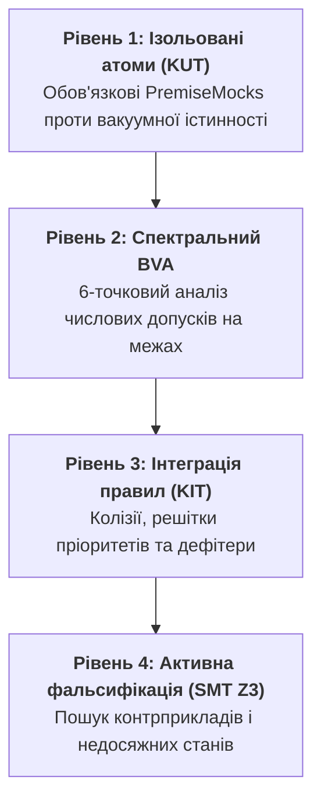

# Тестування баз знань: чому звичайний QA безсилий перед правилами і що таке піраміда KTP

> **Автор:** Микола Федчик (Mykola Fedchyk)  
> **Цикл публікацій:** Доказовий штучний інтелект та місійно-критичні системи (Частина 4).  
> **Попередні частини:**  
> • [Частина 1: Чому патерн «LLM-суддя» — це архітектурна афера](DOU-01-LLM-Judge-Trap-And-Evidence-Gateway-UA.md)  
> • [Частина 2: RAG вичерпав себе: чому векторні бази не знають транзитивності](DOU-02-RAG-Limits-And-Engineering-Knowledge-Graphs-UA.md)  
> • [Частина 3: ШІ в оборонці та на борту: чому автопілоти не пустять до приводів](DOU-03-MilTech-Embedded-AI-Hardware-Safety-Shield-UA.md)  
> **Спеціалізація:** QA Architecture, верифікація баз знань, формальні інваріанти (SMT Z3), регульований ALM.

---

## 1. Факап на продакшні: коли 100% зелених тестів приховують катастрофу

У попередніх трьох частинах циклу ми створили захист на всіх рівнях: відсікли галюцинації мовної моделі через побайтовий шлюз допуску, зв'язали стандарти в інженерний граф знань (EKG) і поставили апаратний Safety Shield перед фізичними приводами.

А тепер фінальне запитання: **як протестувати саму логіку правил та інженерну базу знань?**

Уявіть класичну історію успіху в CI/CD пайплайні. Команда автоматизує регуляторні вимоги для електропідстанції (або промислової автоматики безпеки). QA-інженери написали 200 unit-тестів на Go / Python. Пайплайн світиться бездоганним зеленим світлом: **200 Passed, 0 Failed, Code Coverage 98%**. Керівництво щасливе, підписується релізний акт, система йде в експлуатацію.

Через два тижні під час регламентного перемикання лінії напруга на фазі стрибає вище критичної межі, але система **мовчки не спрацьовує і не вимикає головний силовий вимикач**. Відбувається дугове перекриття, вибух шафи та збитки на сотні тисяч доларів.

Розлючений техдир викликає QA-ліда:
> *«У нас же був юніт-тест саме на вимикання при перевищенні напруги! Чому він був зеленим?!»*

Відкривають вихідний код тесту:

```go
func TestVoltageTripRule(t *testing.T) {
    // Вхідний стан: симулюємо високу напругу
    state := map[string]float64{
        "input_voltage_phase_A": 440.0, // Перевищення норми 400 В!
    }

    result := RuleEmergencyTrip(state)
    if !result.IsCompliantWithSafetyPolicy() {
        t.Fatalf("Помилка: система не підтвердила політику безпеки!")
    }
}
```

А тепер дивимося на код самого правила:

```go
func RuleEmergencyTrip(state map[string]float64) RuleResult {
    // Якщо напруга вище 400 В -> активувати вимикач
    if v, ok := state["voltage_phase_A"]; ok && v > 400.0 {
        return RuleResult{TripActivated: true, Passed: true}
    }
    // Інакше: аварії немає, перевірка вважається виконаною!
    return RuleResult{TripActivated: false, Passed: true}
}
```

Бачите, що сталося?

У тесті випадково написали ключ `"input_voltage_phase_A"`, а в правилі було `"voltage_phase_A"`.  
Умова `if` не спрацювала, правило повернуло дефолтне значення `Passed: true`, і **тест пройшов зеленим**!

---

## 2. Пастка «вакуумної істинності» (Vacuous Truth)

Цей інцидент — не просто помилка в назві змінної. Це фундаментальна вада традиційного тестування ПЗ при роботі з логічними правилами, відома в математичній логіці як **пастка вакуумної істинності (Vacuous Truth)**.

Будь-яке інженерне правило або норматив є матеріальною імплікацією:

`Передумова (Premise) ⟹ Наслідок (Conclusion)`

Згадаємо таблицю істинності імплікації $A \implies B$:
- Якщо $A = \text{True}$ і $B = \text{True}$ $\longrightarrow$ Результат: **True** (штатне спрацьовування).
- Якщо $A = \text{True}$ і $B = \text{False}$ $\longrightarrow$ Результат: **False** (порушення норми).
- **Якщо $A = \text{False}$** $\longrightarrow$ Результат: **ЗАВЖДИ TRUE!**

Якщо вхідний стан через оддруківку, відсутність поля або збій сенсора взагалі не містить передумови $A$, твердження *«Якщо напруга вище 400 В, то вимкнути живлення»* формально є **істинним у вакуумі**! 

У звичайному веб-сервісі 98% Code Coverage означає, що ви пройшли майже всі рядки коду. Але в базах знань та правилах безпеки **класичний Code Coverage абсолютно сліпий**: ви можете мати 100% зелених тестів, жоден з яких насправді не протестував логіку дії правила.

---

## 3. Чотирирівнева піраміда тестування знань (KTP)

Щоб назавжди позбутися вакуумної істинності та забезпечити доказовість рівня ISO 26262 / DO-178C, ми впроваджуємо спеціалізовану методологію — **Піраміду тестування знань (Knowledge Testing Pyramid, KTP)**:



### Рівень 1: KUT (Knowledge Unit Testing) та блокування Vacuous Truth
Кожен тест правила зобов'язаний явно верифікувати дві окремі фази:
1. **Перевірка активації передумови (Premise Verification):** Тест зобов'язаний довести, що всі факти з блоку `IF` реально знайдено в базі знань. Якщо хоча б один факт передумови відсутній — тест зобов'язаний падати з помилкою `VACUOUS_PREMISE_NOT_MET`, а не завершуватися зеленим.
2. **Перевірка висновку (Conclusion Verification):** Лише після підтвердження передумови валідується результуючий стан.

### Рівень 2: 6-точковий спектральний Boundary Value Analysis (BVA)
У звичайному QA часто перевіряють 3 точки на межі (менше, рівно, більше). Для місійно-критичних норм цього замало. Ми застосовуємо 6-точковий спектральний зріз навколо діапазону $[Min, Max]$ з урахуванням епсилон-допуску $\epsilon$:
1. $Min - \epsilon$ (гарантоване відхилення);
2. $Min$ (точна нижня межа стандарту);
3. $Min + \epsilon$ (номінальна робоча зона);
4. $Max - \epsilon$ (номінальна робоча зона);
5. $Max$ (точна верхня межа стандарту);
6. $Max + \epsilon$ (гарантоване аварійне відсікання).

### Рівень 3: KIT (Knowledge Integration Testing) та дефітери Поллака
Правила в інженерії ніколи не живуть ізольовано. Завжди є загальна норма і спеціальні винятки:
- *Загальне правило:* «Під час втрати сигналу зв'язку дрон повертається на точку старту».
- *Спеціальний виняток (Defeater):* «Якщо зафіксовано пожежу акумулятора, негайно здійснити посадку на поточному місці».

KIT перевіряє **решітку правил (Rule Lattices)**: чи перекриває спеціальний виняток загальну норму детерміновано і без колізій.

### Рівень 4: Активна фальсифікація за Карлом Поппером та SMT-солвери
Замість написання сотень ручних тестів ми компілюємо правила у математичну формулу для формального SMT-солвера (Z3 від Microsoft Research). Солвер за секунди знаходить комбінацію вхідних параметрів, за яких система може опинитися у небезпечному стані. Якщо контрприклад не знайдено математично — норматив вважається доведеним.

---

## 4. Практична реалізація тестового рушія на Go

Нижче наведено робочий модуль на Go, який реалізує захист від вакуумної істинності та 6-точковий спектральний аналіз числових допусків:

```go
package main

import (
	"fmt"
)

// RuleResult — результат виконання правила
type RuleResult struct {
	Fired   bool   // Чи спрацювала передумова правила
	Trip    bool   // Чи активовано аварійне відсікання
	Message string
}

// EmergencyVoltageRule перевіряє напругу: ліміт 400.0 В
func EmergencyVoltageRule(state map[string]float64) (RuleResult, error) {
	val, ok := state["voltage_phase_A"]
	if !ok {
		// Блокування вакуумної істинності: передумова не знайдена!
		return RuleResult{Fired: false}, fmt.Errorf("VACUOUS_PREMISE_NOT_MET: відсутній обов'язковий факт 'voltage_phase_A'")
	}

	if val > 400.0 {
		return RuleResult{
			Fired:   true,
			Trip:    true,
			Message: fmt.Sprintf("Аварійне спрацьовування: напруга %.2f В > 400.0 В", val),
		}, nil
	}

	return RuleResult{
		Fired:   true,
		Trip:    false,
		Message: fmt.Sprintf("Штатний режим: напруга %.2f В <= 400.0 В", val),
	}, nil
}

// KTPTestRunner — тестовий запуск із перевіркою вакуумної істинності
func RunKTPTest(name string, state map[string]float64, expectTrip bool) {
	fmt.Printf("▶ Тест: %s\n", name)

	res, err := EmergencyVoltageRule(state)
	if err != nil {
		fmt.Printf("  ❌ ТЕСТ ПРОВАЛЕНО (Детекція Vacuous Truth): %v\n\n", err)
		return
	}

	if !res.Fired {
		fmt.Printf("  ❌ ТЕСТ ПРОВАЛЕНО: Передумова правила не активувалася!\n\n")
		return
	}

	if res.Trip == expectTrip {
		fmt.Printf("  ✅ УСПІХ: Спрацьовування = %v, %s\n\n", res.Trip, res.Message)
	} else {
		fmt.Printf("  ❌ ПОМИЛКА ЛОГІКИ: Очікувався Trip=%v, отримали %v!\n\n", expectTrip, res.Trip)
	}
}

// SpectralBVATest — 6-точковий граничний аналіз
func RunSpectralBVA() {
	fmt.Println("=== РІВЕНЬ 2: 6-ТОЧКОВИЙ СПЕКТРАЛЬНИЙ АНАЛІЗ МЕЖ (BVA) ===")
	threshold := 400.0
	epsilon := 0.1

	points := []struct {
		name       string
		val        float64
		expectTrip bool
	}{
		{"Точка 1 (Нижче межі): Min - eps", threshold - 50.0, false},
		{"Точка 2 (Перед межею): Threshold - eps", threshold - epsilon, false},
		{"Точка 3 (Точна межа): Threshold", threshold, false},
		{"Точка 4 (Одразу за межею): Threshold + eps", threshold + epsilon, true},
		{"Точка 5 (Вище межі): Threshold + 10", threshold + 10.0, true},
		{"Точка 6 (Аварійний пік): Threshold + 100", threshold + 100.0, true},
	}

	for _, pt := range points {
		st := map[string]float64{"voltage_phase_A": pt.val}
		res, err := EmergencyVoltageRule(st)
		if err != nil || res.Trip != pt.expectTrip {
			fmt.Printf("  ❌ ЗБІЙ BVA на значенні %.2f В! Очікували %v, отримали %v\n", pt.val, pt.expectTrip, res.Trip)
			return
		}
		fmt.Printf("  • Напруга %.2f В -> Trip = %-5v [OK]\n", pt.val, res.Trip)
	}
	fmt.Println("✅ Спектральний BVA успішно пройдено для всіх 6 точок!\n")
}

func main() {
	fmt.Println("=== РІВЕНЬ 1: ТЕСТУВАННЯ АТОМІВ (KUT) З ДЕТЕКЦІЄЮ VACUOUS TRUTH ===\n")

	// Тест 1: Номінальний штатний стан
	RunKTPTest("Штатний режим (380 В)", map[string]float64{"voltage_phase_A": 380.0}, false)

	// Тест 2: Аварійне перевищення (420 В)
	RunKTPTest("Аварійне перенапруження (420 В)", map[string]float64{"voltage_phase_A": 420.0}, true)

	// Тест 3: Підступна пастка Vacuous Truth (оддруківка в імені факту)
	// У наївному тесті цей кейс був би зеленим, але наш рушій блокує його!
	RunKTPTest("Помилковий факт: input_voltage_phase_A замість voltage_phase_A",
		map[string]float64{"input_voltage_phase_A": 440.0}, true)

	// Рівень 2: Запуск 6-точкового BVA
	RunSpectralBVA()
}
```

### Результат роботи тестера

Запустіть код командою `go run main.go`:

```text
=== РІВЕНЬ 1: ТЕСТУВАННЯ АТОМІВ (KUT) З ДЕТЕКЦІЄЮ VACUOUS TRUTH ===

▶ Тест: Штатний режим (380 В)
  ✅ УСПІХ: Спрацьовування = false, Штатний режим: напруга 380.00 В <= 400.0 В

▶ Тест: Аварійне перенапруження (420 В)
  ✅ УСПІХ: Спрацьовування = true, Аварійне спрацьовування: напруга 420.00 В > 400.0 В

▶ Тест: Помилковий факт: input_voltage_phase_A замість voltage_phase_A
  ❌ ТЕСТ ПРОВАЛЕНО (Детекція Vacuous Truth): VACUOUS_PREMISE_NOT_MET: відсутній обов'язковий факт 'voltage_phase_A'

=== РІВЕНЬ 2: 6-ТОЧКОВИЙ СПЕКТРАЛЬНИЙ АНАЛІЗ МЕЖ (BVA) ===
  • Напруга 350.00 В -> Trip = false [OK]
  • Напруга 399.90 В -> Trip = false [OK]
  • Напруга 400.00 В -> Trip = false [OK]
  • Напруга 400.10 В -> Trip = true  [OK]
  • Напруга 410.00 В -> Trip = true  [OK]
  • Напруга 500.00 В -> Trip = true  [OK]
✅ Спектральний BVA успішно пройдено для всіх 6 точок!
```

Зверніть увагу на Тест 3: замість хибно-позитивного «зеленого» статусу тестовий рушій негайно зламав пайплайн із чітким діагностичним повідомленням: **`VACUOUS_PREMISE_NOT_MET`**. Помилка в назві факту спіймана на етапі збирання.

---

## 5. Підсумки циклу: Як побудувати систему, якій можна довіряти

Цією статтею ми завершуємо чотирисерійний інженерний цикл про побудову доказового штучного інтелекту:

1. **[Частина 1](DOU-01-LLM-Judge-Trap-And-Evidence-Gateway-UA.md):** Ми відмовилися від ілюзії «моделей-суддів» і впровадили **дворівневий шлюз допуску фактів** із побайтовою перевіркою цитат першоджерела за хешем SHA-256.
2. **[Частина 2](DOU-02-RAG-Limits-And-Engineering-Knowledge-Graphs-UA.md):** Ми показали межі векторного RAG і побудували **інженерний граф знань (EKG)** із детермінованим транзитивним виведенням та діалогом Сократа для ліквідації прогалин.
3. **[Частина 3](DOU-03-MilTech-Embedded-AI-Hardware-Safety-Shield-UA.md):** Ми розвели систему на два середовища у MilTech та автопілотах, ізолювавши стохастичний NPU від виконавчих сервоприводів за допомогою **апаратного Safety Shield на FPGA / AURIX**.
4. **Частина 4:** Ми закрили питання надійності бази знань за допомогою **піраміди тестування KTP**, виключивши пастку вакуумної істинності.

Це і є шлях переходу від дилетантського «вайб-кодингу» та крихких чат-ботів до **справжньої місійно-критичної системної інженерії**.

---

*Математичний апарат валідації знань, SMT-верифікація та доказові контракти розгорнуті в повній інженерній монографії «Архітектура доказових експертних систем» (2026).*  
*Повний репозиторій циклу публікацій та всіх прикладів коду: [github.com/nick-fedchik/articles](https://github.com/nick-fedchik/articles).*
