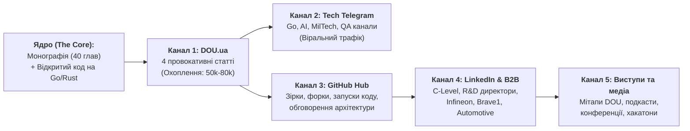

# Комплексний план розповсюдження досліджень з сучасних експертних систем (2026)

> **Автор:** Микола Федчик (Mykola Fedchyk)  
> **Мета:** Закріпити лідерство в ніші «Safe, Verifiable & Evidence-Governed AI Engineering», розгорнути віральне охоплення 4-серійного циклу статей на DOU, перетворити GitHub-репозиторій на головний хаб знань і вийти на рівень стратегічного партнерства з індустрією та MilTech.

---

## 1. Стратегічна матриця каналів поширення

Розповсюдження будується за моделлю **«Концентричних кіл впливу»**: від вірального інженерного детективу на DOU до міжнародного B2B-визнання на LinkedIn та практичного впровадження у MilTech/Automotive.

---

## 2. Фазовий графік випуску та інформаційних ударів

### ФАЗА 1 (Тижні 1–3): Руйнування міфу про «LLM-суддів»
* **Головний реліз:** Публікація **Частини 1** на DOU: *«Чому патерн "LLM-суддя" — це архітектурна афера, і як змусити модель відповідати лише за наявності доказів»*.
* **Супровідні активності:**
  - *День 1 (Реліз):* Анонс у LinkedIn з інфографікою (порівняння каскаду двох LLM проти шлюзу допуску з побайтовим SHA-256).
  - *День 2:* Посів статті у профільні Telegram-канали: *Go Ukraine*, *Python / AI Community Ukraine*, *Data Science UA*, *Devs UA*. Акцент на готовому скрипті на Go та локальній Ollama.
  - *Дні 3–5:* Активна авторська дискусія в коментарях на ДОУ (детальне розбиття контраргументів «а ми промптом поправимо» з посиланням на формулу авторегресії).
* **Очікуваний KPI:** 15 000+ переглядів, 80+ коментарів, 200+ зірок на GitHub.

---

### ФАЗА 2 (Тижні 4–6): Деміфологізація векторного RAG та інженерні графи
* **Головний реліз:** Публікація **Частини 2** на DOU: *«RAG вичерпав себе: чому векторні бази не знають транзитивності, і як рятує інженерний граф знань (EKG)»*.
* **Супровідні активності:**
  - *LinkedIn:* Візуальний пост про факап з роз'ємом IP54 у відсіку IP67 (чому вектори відкинули норматив із косинусною схожістю 0.42).
  - *Telegram-посів:* Канали для Data Engineers, Knowledge Graph Architects, Backend Leads.
  - *GitHub-активність:* Оновлення репозиторію з готовим прикладом графа на Go та шаблонами правил AMIE/PCA.
* **Очікуваний KPI:** 12 000+ переглядів, дискусія з прихильниками чистого векторного RAG, запрошення на профільні подкасти.

---

### ФАЗА 3 (Тижні 7–9): Вихід у MilTech та вбудовані системи безпеки
* **Головний реліз:** Публікація **Частини 3** на DOU: *«ШІ в оборонці та на борту: чому автопілоти ніколи не пустять нейромережу керувати напряму (і що таке Hardware Safety Interlock)»*.
* **Супровідні активності:**
  - *Оборонний фокус:* Поширення матеріалу в закритих та відкритих MilTech-спільнотах (кластер *Brave1*, спільноти розробників БПЛА/РЕБ, Military Tech UA).
  - *Контакт із лідерами думок:* Відправка матеріалу інженерам оборонних підприємств та виробникам дронів/НРК.
  - *LinkedIn:* Англомовна версія тез про теорему Батлера–Фінеллі та апаратні шлюзи на FPGA/AURIX для західних колег з оборонної галузі.
* **Очікуваний KPI:** 20 000+ переглядів (тема війни та БПЛА гарантує максимальне охоплення), вихід на B2B-контакти розробників дронів.

---

### ФАЗА 4 (Тижні 10–12): Стандартизація якості та закриття циклу
* **Головний реліз:** Публікація **Частини 4** на DOU: *«Тестування баз знань: чому звичайний QA безсилий перед правилами і що таке піраміда KTP»*.
* **Супровідні активності:**
  - *QA & Audit ком'юніті:* Посів у *QA Guild*, *Automation QA Ukraine*, канали з тестування безпеки.
  - *Підсумковий лонгрід:* Зведення всіх 4 частин в єдиний інтерактивний гайд на GitHub.
  - *Оголошення монографії:* Презентація повної книги «Архітектура доказових експертних систем» як цілісного інженерного стандарту.
* **Очікуваний KPI:** 15 000+ переглядів, визнання циклу одним із найґрунтовніших інженерних серіалів на DOU за 2026 рік.

---

## 3. Специфіка роботи з різними майданчиками

### 3.1. DOU.ua: правила утримання уваги
1. **Швидкість реакції в коментарях:** Перші 12 годин після публікації визначають долю статті у видачі. Автор активно відповідає на кожен конструктивний (і неконструктивний) коментар із витримкою, аргументами та посиланнями на стандарти.
2. **Нульова токсичність, 100% авторитетність:** Відповідати не емоційно, а інженерно: з посиланням на ISO 26262, код на Go та побайтову верифікацію.
3. **Прямі посилання на репозиторій:** Кожна стаття містить активне посилання на робочий код у репозиторії [github.com/nick-fedchik/articles](https://github.com/nick-fedchik/articles).

### 3.2. LinkedIn: конверсія у професійний капітал
- Публікація коротких вичавок (Executive Carousels) українською та англійською мовами через 2 дні після кожного виходу статті на ДОУ.
- Формат постів:
  - *Гачок:* «Чому наш RAG мало не спалив насосну станцію: анатомія одного інженерного факапу».
  - *3 слайди інфографіки:* Схема відмови $\to$ Схема шлюзу допуску $\to$ Лістинг коду.
  - *CTA (Call to Action):* «Повний текст статті читайте на DOU [лінк], а вихідний код забирайте на GitHub [лінк]».

### 3.3. Публічні виступи та подкасти
Після виходу перших двох статей подавати заявки на доповіді:
- **DOU AI Meetup / DOU Architecture Meetup:** Тема «Нейро-символьні експертні системи на Go: як виключити галюцинації у виробничих сервісах».
- **Brave1 / MilTech Events:** Тема «Архітектура відмовостійкості: Hardware Safety Shield для автономних бортових систем».
- **Подкасти (DOU Podcast, Підкаст айтівців тощо):** Обговорення смерті «вайб-кодингу» та переходу до доказового ШІ.

---

## 4. Специфікація перетворення GitHub на центр тяжіння

Щоб читачі статей не просто читали текст, а ставали контриб'юторами та амбасадорами монографії:

1. **README головного репозиторію:**
   - Додати яскравий блок: **«Цикл статей на DOU: Доказовий ШІ та місійно-критичні системи»** з прямими посиланнями на всі частини.
   - Розмістити блок **«Quick Start за 60 секунд»**: інструкція, як схилити репозиторій і запустити `go run DOU/01-llm-judge/main.go`.
2. **Розділ Discussions на GitHub:**
   - Створити гілки для обговорення кожної статті для тих інженерів, які хочуть копати глибше за межі форуму DOU.
3. **Release Tags:**
   - Кожен вихід статті супроводжувати семантичним релізом у репозиторії (наприклад, `v4.1-dou-evidence-gateway`, `v4.2-dou-ekg-engine`).

---

## 5. Чек-лист готовності до старту

- [x] Аналіз ринку та редакційна стратегія задокументовані (`DOU/dou-market-analysis-and-publication-strategy.md`).
- [x] Стратегічне мемо з 4 офферами сформовано (`DOU/DOU-Publication-Memo.md`).
- [x] Частина 1 написана, перевірена валідатором та протестована на Go (`DOU/DOU-01-LLM-Judge-Trap-And-Evidence-Gateway-UA.md`).
- [x] Частина 2 написана, перевірена валідатором та протестована на Go (`DOU/DOU-02-RAG-Limits-And-Engineering-Knowledge-Graphs-UA.md`).
- [x] Частина 3 написана, перевірена валідатором та протестована на Go (`DOU/DOU-03-MilTech-Embedded-AI-Hardware-Safety-Shield-UA.md`).
- [x] Частина 4 написана, перевірена валідатором та протестована на Go (`DOU/DOU-04-Knowledge-Testing-Pyramid-Vacuous-Truth-UA.md`).
- [x] План розповсюдження та євангелізму затверджено.

**Статус:** Повна бойова готовність. Стартуємо з публікації Частини 1 на DOU! 🚀
