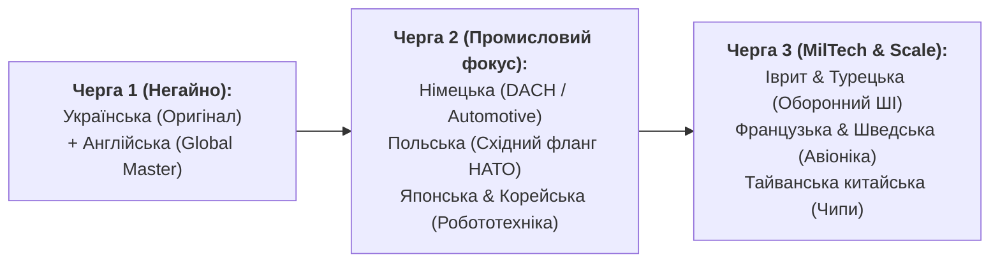

# Топ-20 мов для глобального розповсюдження контенту та досліджень

> **Автор:** Микола Федчик (Mykola Fedchyk)  
> **Призначення:** Стратегічний таргет-лист локалізації та дистрибуції монографії «Архітектура доказових експертних систем», циклу статей на DOU та відкритих інженерних специфікацій (2026 рік).  
> **Критерії відбору:** Концентрація R&D-центрів функціональної безпеки (ISO 26262, DO-178C), розвиток оборонних інновацій (MilTech/DefTech), напівпровідникова індустрія, авіоніка та інженерні хаби вбудованого ПЗ.

---

## 1. Топ-20 природних (людських) мов для локалізації

| Ранг | Мова | Регіон / Країни | Стратегічна інженерна цінність та цільові корпорації/сектори |
| :---: | :--- | :--- | :--- |
| **1** | **Англійська (English)** | Світ (США, Велика Британія, ЄС, Канада, Австралія) | **Абсолютний пріоритет №1.** Головна мова світового інжинірингу, препринтів arXiv, GitHub, комітетів стандартизації (IEEE, ACM, SAE, RTCA, ISO). Доступ до глобального венчурного капіталу та BigTech. |
| **2** | **Українська (Ukrainian)** | Україна | **Оригінальна мова досліджень.** Світовий епіцентр сучасної технологічної війни та швидкого впровадження MilTech (кластер Brave1, сотні виробників БПЛА, РЕБ, НРК). Платформа DOU.ua як головний полігон спільноти. |
| **3** | **Німецька (Deutsch)** | Німеччина, Австрія, Швейцарія (DACH) | **Світова столиця функціональної безпеки.** Батьківщина стандартів ISO 26262, AUTOSAR, ASPICE. Штаб-квартири Infineon Technologies, Bosch, Siemens, BMW, Mercedes-Benz, dSPACE, Vector Informatik. |
| **4** | **Японська (日本語 / Japanese)** | Японія | **Світовий лідер надійної робототехніки та промислової автоматизації.** Висока культура формальної надійності та нульових дефектів (Toyota, Denso, Fanuc, Sony, Renesas, Mitsubishi Electric). |
| **5** | **Французька (Français)** | Франція, Бельгія, Канада | **Європейський центр аерокосмічних стандартів (DO-178C / ED-12C).** Концерни Airbus, Thales Group, Dassault Aviation, Safran, STMicroelectronics, CEA-List (формальні методи верифікації Frama-C). |
| **6** | **Корейська (한국어 / Korean)** | Південна Корея | **Гігант мікроелектроніки, автопрому та наземної оборонки.** Samsung Electronics, SK Hynix, Hyundai Motor Group, Hanwha Aerospace/Defense, LIG Nex1. |
| **7** | **Традиційна китайська (繁體中文)** | Тайвань, Гонконг, Сінгапур | **Епіцентр світового кремнієвого виробництва чипів.** TSMC, MediaTek, Realtek, а також азійські інвестиційні фонди апаратних прискорювачів ШІ. |
| **8** | **Польська (Polski)** | Польща | **Найбільший східноєвропейський оборонний та R&D хаб.** Масштабні програми переозброєння (PGZ, WB Group), висока концентрація інженерних центрів автомотови та авіоніки. |
| **9** | **Іврит (עברית / Hebrew)** | Ізраїль | **Світовий флагман бойового ШІ, кібербезпеки та сенсорики.** Rafael Advanced Defense Systems, Elbit Systems, Israel Aerospace Industries (IAI), венчурний сектор DeepTech. |
| **10** | **Турецька (Türkçe)** | Туреччина | **Провідний світовий хаб безпілотних та автономних систем.** Baykar Technologies, Aselsan, Roketsan, TAI, HAVELSAN. Величезний запит на автономність в умовах РЕБ (GNSS-Denied). |
| **11** | **Шведська (Svenska)** | Швеція | **Традиція безкомпромісної інженерної безпеки.** Винищувачі та авіоніка Saab (Gripen), телеком Ericsson, автотранспорт Volvo Group, оборонні системи BAE Systems Bofors. |
| **12** | **Нідерландська (Nederlands)** | Нідерланди | **Серце європейської літографії та чипмейкінгу.** ASML (монополіст EUV-літографії), NXP Semiconductors (автомобільні процесори), Philips Healthcare. |
| **13** | **Італійська (Italiano)** | Італія | **Аерокосмічний та прецизійний кластер.** Leonardo S.p.A. (авіоніка, гелікоптери, радари), STMicroelectronics, автоспорт та автомобільна інженерія (Ferrari, Marelli). |
| **14** | **Іспанська (Español)** | Іспанія, Латинська Америка | **Оборонні консорціуми та глобальний іспаномовний ринок.** Indra Sistemas, Navantia, європейські програми FCAS, ринки промислової автоматизації Мексики та Чилі. |
| **15** | **Португальська (Português)** | Бразилія, Португалія | **Авіабудування Південної півкулі.** Третій у світі виробник цивільних і військових літаків Embraer (KC-390, Super Tucano), енергетичний та логістичний сектор. |
| **16** | **Чеська (Čeština)** | Чехія | **Центральноєвропейське важке машинобудування та оборонка.** Czechoslovak Group (CSG), Aero Vodochody, Škoda Auto / VW Group R&D, авіаційне моторобудування. |
| **17** | **Норвезька (Norsk)** | Норвегія | **Високоточна автономність, ракетобудування та морські дрони.** Kongsberg Defence & Aerospace (ракети NSM/JSM), Nammo, автономні підводні апарати HUGIN. |
| **18** | **Грецька (Ελληνικά / Greek)** | Греція, Кіпр | **Колиска логіки та світовий морський флот.** Батьківщина сократичного діалогу (Глава 34) та аристотелівської силогістики (Глава 31). Найбільший у світі торговельний флот (>20% світового дедвейту — попит на автономну навігацію без GPS), оборонні витрати НАТО (~3.7% ВВП), авіоніка та інститут FORTH. |
| **19** | **Фінська (Suomi)** | Фінляндія | **Критична кіберстійкість, радіозв'язок та промислова робототехніка.** Nokia (радіоінфраструктура), Patria (бронетехніка та бойові системи), Wärtsilä, Kone. |
| **20** | **Естонська (Eesti)** | Естонія | **Світовий лідер цифрового суверенітету та робототехніки.** Milrem Robotics (наземні бойові дрони THeMIS), штаб кібероборони НАТО (CCDCOE), флагман GovTech. |

---

## 2. Три черги (Tiers) практичної локалізації контенту

Немає сенсу перекладати все одночасно. Розгортання розбивається на три прагматичні фази:

### Черга 1: Фундамент (Українська + Англійська)
* **Українська:** Публікації на DOU.ua, залучення спільноти, тестування фабул, військова кібернетика в умовах поточної війни.
* **Англійська:** Повний переклад монографії для arXiv/GitHub, англомовні статті на Medium/Substack/Hacker News, адаптація постів для глобального LinkedIn.

### Черга 2: Промисловий фокус (Німецька, Польська, Японська, Корейська)
* **Німецька:** Прямий вихід на комітети ASIL D, німецькі автоконцерни та партнерів Infineon.
* **Польська:** Позиціонування як спільного стандарту надійності для східноєвропейських оборонних програм.
* **Японська та Корейська:** Вихід на інженерні команди робототехніки, де критична безпомилковість алгоритмів.

### Черга 3: MilTech-еліта (Іврит, Турецька, Французька, Шведська, Традиційна китайська)
* Таргетовані дайджести та технічні whitepapers для виробників автономних дронів, радарних комплексів та кремнієвих кристалів.

---

## 3. Бонус: Топ-20 інженерних мов програмування та специфікації коду

Для повноти картини — топ-20 мов, у яких формулюються робочі приклади, формальні правила та апаратні специфікації нашого контенту:

1. **Go (Golang)** — Головна мова сервісів знань, мікросекундних шлюзів допуску та симуляторів.
2. **Rust** — Мова безпечного пам'яті рантайму, детермінованих парсерів та ядра безпеки.
3. **C (C99 / C11 / MISRA C)** — Фундамент автомобільних прошивок (Infineon AURIX, AUTOSAR MCAL).
4. **C++ (C++14 / AUTOSAR C++14)** — Комп'ютерний зір, лідарна одометрія, вузли ROS2 на борту.
5. **Python** — Тракт експериментів, робота з локальними LLM (Ollama API), науковий аналіз даних.
6. **Ada / SPARK** — Золотий стандарт доказової верифікації авіоніки (DO-178C DAL A).
7. **Verilog / SystemVerilog** — Апаратний синтез ядра EPU та Hardware Safety Interlock на FPGA.
8. **VHDL** — Європейський та аерокосмічний стандарт проєктування цифрових схем.
9. **SMT-LIB2 (Z3 / CVC5)** — Формальні інваріанти, математичне доведення несуперечливості правил.
10. **Datalog / Prolog** — Декларативне логічне виведення, реляційні запити над графом знань.
11. **Lean 4** — Інтерактивне математичне доведення теорем (рівень DeepMind AlphaProof).
12. **JSON Schema / GBNF** — Граматично-скероване декодування виводу нейромереж.
13. **Turtle / OWL / RDF** — Онтологічні стандарти зв'язування даних інженерного графа.
14. **Bash / POSIX Shell** — Скрипти автоматизації інспекції та компіляції дистрибутивів.
15. **SQL / Cypher** — Детерміновані реляційні та графові вибірки.
16. **LLVM IR** — Проміжне представлення для компіляції пакетів знань у машинний код.
17. **Zig** — Перспективний системний детермінований стек без прихованих алокацій.
18. **Julia** — Наукове моделювання фізичних фазових переходів та синергетики систем.
19. **Cap'n Proto / FlatBuffers / Protobuf** — Нульове копіювання при міжпроцесному обміні знаннями.
20. **WebAssembly (WASM)** — Ізольовані пісочниці безпечного виконання дорадчих плагінів.

---

*Цей документ є стратегічним орієнтиром міжнародної експансії та ліцензування монографії «Архітектура доказових експертних систем» (2026).*
