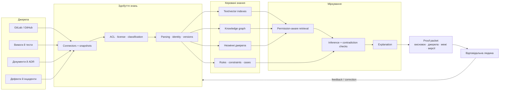
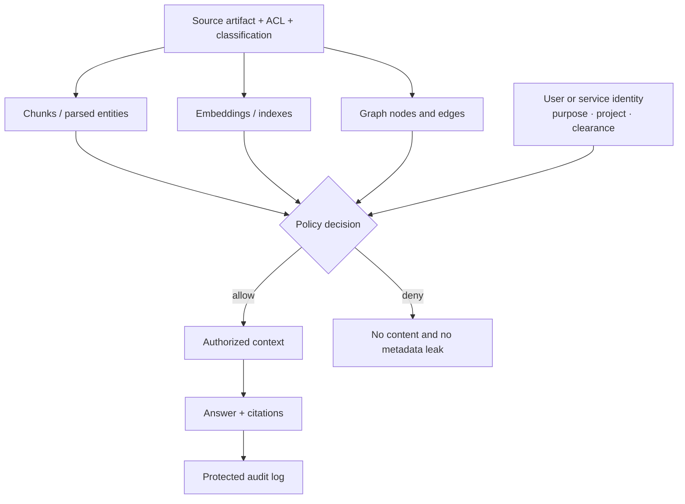
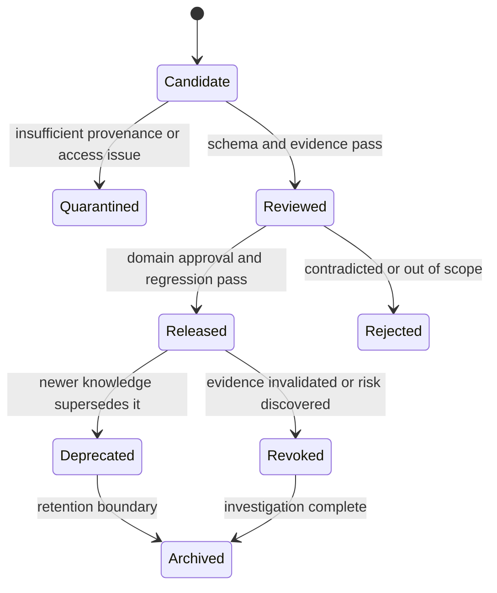

# Експертні системи для R&D: від корпоративного хаосу до керованих знань

> **Серія:** [Експертні системи для R&D](README.md) · стаття 01 із 22  
> **Наступна стаття:** [02 — Від теореми Байєса до доказових рішень ШІ](02-Expert-Systems-Evolution-Evidence-UA.md)  
> **Зміст серії:** [README](README.md)  
> **Рівень:** розробники — базовий  
> **Після статті:** відрізняти чатбот, пошук, RAG і граф знань від експертної системи; описати мінімальний об'єкт знання; спроєктувати невеликий proof-of-concept із вимірюваним результатом.  
> **Подача матеріалу:** українські пояснення; англійський термін подається після першого точного відповідника.

У зрілому R&D-проєкті відповідь на просте запитання «чому цей модуль зроблений
саме так?» може бути розсипана між кодом, вимогою, архітектурним рішенням,
обговоренням у merge request, тестовим звітом, дефектом трирічної давності й
пам'яттю інженера, який уже працює в іншій команді. Знайти сім документів ще не
означає зрозуміти, який із них чинний, чи стосується він поточної версії та хто
має право затвердити зміну.

**Проблема цієї статті — перетворити розрізнені інженерні артефакти на
перевірювану відповідь, не видаючи релевантний текст або впевнену фразу мовної
моделі за знання.** Для цього потрібні не лише пошук і генерація тексту, а
типізовані твердження, походження даних, зв'язки, правила, версії, права доступу
та процедура висновку.

Це вступний навчальний матеріал і референсний дизайн, а не універсальна
production-архітектура чи доказ відповідності галузевому стандарту. Ми
розберемо один наскрізний приклад, мінімальний контракт знання, базову схему
системи, метрики й відмінності між Automotive, Aviation, Medicine,
Military/Defence та Legislation. Наступні статті поступово формалізують
математику, архітектуру, інфраструктуру, здобуття знань і перевірку.

## Один приклад замість абстрактної «корпоративної пам'яті»

Нехай розробник змінює таймаут у модулі `PowerSupervisor`. Пошук знаходить
вимогу `REQ-142`, старий дефект `BUG-817`, коментар у коді та 40 сторінок
специфікації. Але для рішення треба встановити:

1. яка ревізія `REQ-142` чинна для продукту `R7`;
2. яке архітектурне рішення пояснює початкове значення таймауту;
3. чи `BUG-817` справді мав ту саму причину;
4. які тести підтверджують вимогу на поточному hardware;
5. чи потребує зміна safety/security review;
6. хто має право дозволити зміну й зафіксувати виняток.


Ця схема вже корисніша за папку документів: вона показує тип зв'язку. Проте
стрілка теж може бути помилковою або застарілою. Тому кожен вузол і зв'язок
мають джерело, автора або процес походження, час спостереження, область
застосування, версію та статус перевірки.

## Що таке експертна система

Класична експертна система відділяє **базу знань** від **машини виведення**.
Перша містить факти, правила та моделі предметної області; друга застосовує їх
до конкретного випадку. Зріла система також має механізми здобуття знань,
пояснення висновку й взаємодії з користувачем. Саме відділення знань від
алгоритму їх застосування було одним із важливих інженерних результатів ранніх
систем DENDRAL і MYCIN.

У сучасному корпоративному R&D визначення можна розширити:

> **Експертна система — це спеціалізована інформаційна система, яка зберігає
> кероване подання доменних знань, застосовує явну процедуру міркування,
> формує перевірюваний висновок із джерелами й обмеженнями та не приховує межу
> між рекомендацією системи і рішенням відповідальної людини.**

Вона може використовувати SQL, повнотекстовий і векторний пошук, граф знань,
правила, байєсівські моделі, constraint solvers, case-based reasoning, SLM/LLM
та інші ML-компоненти. Наявність будь-якої з цих технологій окремо ще не робить
сервіс експертною системою.

## Чатбот, пошук, RAG і експертна система — не синоніми

| Інструмент | Сильна сторона | Чого бракує для експертної системи |
|---|---|---|
| Чатбот | Зручний діалог і формулювання відповіді природною мовою | Доступ до чинних джерел, формальна процедура висновку, provenance і право відмовитися |
| Повнотекстовий пошук | Точне знаходження слів, кодів вимог, ідентифікаторів і фраз | Семантичні зв'язки, доменні правила та висновок |
| Векторний пошук | Пошук близьких за змістом фрагментів, навіть коли слова різні | Доказ, що схожий фрагмент чинний, авторитетний і застосовний |
| RAG | Передає знайдені фрагменти мовній моделі для grounded-відповіді | Сам retrieval не гарантує повноти, а генерація — логічної коректності та повноважень |
| Граф знань | Явно зберігає сутності, типи зв'язків, версії та походження | Сам граф не визначає, яке рішення допустиме або який конфлікт критичний |
| Rule engine | Відтворювано застосовує явні правила | Якість залежить від повноти фактів, правил, винятків і conflict resolution |
| Експертна система | Поєднує керовані знання, міркування, доказове пояснення та межі дії | Потребує постійного knowledge lifecycle, V&V, контролю доступу та власників |

RAG може бути інтерфейсом до знань. Граф — їх структурним поданням. LLM —
мовним аналізатором або генератором пояснення. Rule engine — одним із механізмів
виведення. Архітектурна помилка починається тоді, коли назву компонента
підміняють властивістю всієї системи.

## Документ не дорівнює знанню

Для людини доменне знання часто звучить як «цей драйвер нестабільний після зміни
таймінгів». Для машини треба розділити щонайменше п'ять типів об'єктів:

| Тип | Приклад | Що обов'язково зберегти |
|---|---|---|
| Спостереження (*observation*) | «у test run 184 стався reset через 37 ms» | джерело, event time, умови, одиниці, якість |
| Твердження (*claim*) | «таймаут 40 ms недостатній для revision C» | автор, scope, status, confidence, час дії |
| Доказ (*evidence*) | trace, test report, datasheet section | незмінний locator, version/hash, access policy |
| Правило (*rule*) | «якщо revision C і cold start, потрібен timeout ≥ 55 ms» | premises, conclusion, exceptions, owner, tests |
| Рекомендація або рішення | «змінити timeout до 60 ms після safety review» | використані факти й правила, альтернативи, approver, outcome |

Спостереження не є твердженням про причину. Твердження не стає істинним лише
тому, що його написав досвідчений інженер. Документ може бути доказом, але лише
в межах своєї версії й області застосування. Правило без тестів і власника — це
заморожена думка, а не кероване знання.

### Мінімальний об'єкт знання

Для першого proof-of-concept не потрібна велика ontology. Достатньо контракту,
який не дозволяє втратити найважливіше:

```json
{
  "id": "claim:power-timeout:r7-cold-start",
  "type": "claim",
  "statement": "Revision C needs at least 55 ms during cold start",
  "subject": "component:PowerSupervisor",
  "scope": {
    "product": "R7",
    "hardware_revision": "C",
    "mode": "cold_start"
  },
  "evidence": [
    "test-report:TR-2026-184",
    "trace:scope-441"
  ],
  "status": "verified_for_scope",
  "valid_from": "2026-07-18T00:00:00Z",
  "valid_to": null,
  "owner": "team:power-safety",
  "access_policy": "project:R7/safety-engineering",
  "derived_from": ["REQ-142@v5", "ADR-31@v3"],
  "supersedes": "claim:power-timeout:r7-cold-start@1",
  "schema_version": "knowledge-object@1.0"
}
```

`status=verified_for_scope` навмисно не означає «істина всюди». Таке твердження
може бути правильним для revision C і хибним для revision D. `valid_to=null`
означає, що кінцеву дату ще не встановлено, а не те, що знання вічне.
`access_policy` має поширюватися і на похідні індекси, embeddings, кеші та
згенеровані відповіді.

## Мінімальна архітектура: від джерела до proof packet



### 1. Джерела та snapshots

Connector не повинен читати «поточний документ» без ідентифікатора ревізії.
Для відтворення висновку потрібен snapshot або стабільний locator: commit SHA,
document revision, test-run ID, artifact digest. Інакше завтра те саме посилання
показуватиме інший зміст.

### 2. Система здобуття знань

Система здобуття знань (*Knowledge Acquisition System, KAS*) не «стягує все».
Вона виявляє джерела, перевіряє право обробки, зберігає походження, виділяє
сутності та зв'язки, створює candidates і передає їх на автоматичну або людську
перевірку. Детально цей контур розглядає [стаття
10](10-Knowledge-Acquisition-System-UA.md).

### 3. Кілька подань одного знання

Raw artifact потрібен для доказу, text index — для точного пошуку, embedding —
для семантичної близькості, graph — для залежностей, rule/case base — для
міркування. Це не чотири копії істини, а чотири індекси або подання, які мають
посилатися на те саме versioned source.

### 4. Retrieval і inference

Комбінований retrieval може ранжувати кандидати так:

$$
S(d,q)=
\alpha S_{text}+\beta S_{vector}+\gamma S_{graph}+
\delta S_{authority}-\lambda S_{stale},
$$

де всі часткові оцінки нормалізовано до сумісного діапазону, а коефіцієнти
налаштовано на реальних запитах. $S_{text}$ винагороджує точний збіг,
$S_{vector}$ — близькість змісту, $S_{graph}$ — структурний зв'язок,
$S_{authority}$ — авторитетність джерела, $S_{stale}$ — застарілість.

Це **ranking score, не ймовірність істини**. Документ із найбільшим $S$ лише
перший кандидат на перевірку. Hard constraints — відсутність доступу, несумісна
версія або заборонений тип джерела — застосовують до ранжування чи як окремий
gate; їх не можна компенсувати високою семантичною схожістю.

### 5. Proof packet замість «відповіді моделі»

Корисний результат містить:

- питання й context snapshot;
- знайдені observations, claims і evidence;
- застосовані rules або cases з версіями;
- суперечності й відкинуті альтернативи;
- висновок, confidence/calibration або явне `unknown`;
- область застосування й обмеження;
- model, retriever, prompt, knowledge і policy versions;
- рішення людини та outcome, якщо вони вже відомі.

LLM може пояснити пакет природною мовою. Але список джерел, rule trace і
authority повинні формуватися структурованим контуром, а не згадуватися моделлю
з контексту.

## Де тут сучасні ML і мовні моделі

ML корисний там, де жорстке правило неефективне: класифікувати документ,
розпізнати сутність, побудувати embedding, знайти схожий інцидент, оцінити
аномалію, зіставити schema або запропонувати candidate rule. SLM/LLM добре
працюють як мовний інтерфейс, parser неоднорідного тексту, засіб чернеткового
узагальнення й пояснення.

Межа проста:

- model output спочатку має статус `candidate` або `observation`;
- retrieval result не стає автоматично `evidence_for_conclusion`;
- generated citation перевіряється за source ID і span;
- модель не розширює ACL і не визначає власні повноваження;
- відповідь без достатнього evidence завершується `unknown`, питанням або
  передаванням експерту;
- update моделі чи prompt — versioned release, а не невидима зміна поведінки.

У [статті 09](09-Engineering-Artifacts-As-Data-UA.md) наведено практичний
експеримент автора з майже десятьма тисячами технічних специфікацій: видобуті
об'єкти знань порівнюються із сирими текстовими фрагментами як retrieval- і
LLM-context. Це приклад того, як архітектурну тезу треба перевіряти на corpus,
queries, labels, metrics і зафіксованих версіях, а не подавати як універсальний
ефект.

## Наскрізна рамка п'яти доменів

Одна й та сама платформа не повинна переносити однакові правила між Automotive,
Aviation, Medicine, Military/Defence та Legislation. Спільною може бути
інженерія знань; hazards, evidence, authority і допустима автоматизація різні.

| Домен | Практична проблема для експертної системи | Типові знання й докази | Межа автоматизації та остаточні повноваження |
|---|---|---|---|
| Automotive | traceability вимога → design → code → test; impact analysis; diagnosis; підтримка HARA/TARA і safety/security case | requirements, architecture, FMEA/FMEDA, test reports, field incidents, ISO 26262 та ISO/SAE 21434 work products, Automotive SPICE information items | система знаходить прогалини й формує evidence packet; safety manager, cybersecurity owner, assessor або уповноважений release gate приймає формальне рішення |
| Aviation | configuration/evidence traceability, maintenance diagnosis, occurrence analysis, підтримка safety assessment | aircraft/system requirements, configuration baselines, verification evidence, maintenance manuals, occurrence reports, approved data | advisory функції починають із lower-risk scope; перенесення в safety-related або onboard use потребує окремого assurance/certification path; відповідальність не переходить до LLM |
| Medicine | clinical decision support, guideline matching, contraindication checks, provenance медичних даних | patient-specific data, clinical guidelines, device intended use, validation studies, population slices, model limitations | система підтримує, але не приховує basis і intended use; clinician, regulated workflow та applicable medical-device rules визначають дію |
| Military/Defence | ситуаційна обізнаність, логістика, технічна діагностика, maintenance, knowledge support для command-and-control | sensor/report provenance, technical manuals, readiness data, policies, authority, classified sources, after-action evidence | система не привласнює command authority; human oversight, lawfulness, governability, security domain і TEV&V задають межу |
| Legislation | пошук чинної норми, consolidation, impact analysis законопроєкту, виявлення колізій, compliance mapping і пояснення legal reasoning | офіційні тексти, редакції та дати чинності, юрисдикція, визначення, посилання між нормами, судові рішення, preparatory materials | система пропонує аналіз із цитатами й temporal scope; законодавець, суд, регулятор, адвокат або інша юридично відповідальна особа зберігає владне рішення |

### Automotive

Станом на цю редакцію опублікованою серією functional safety залишається ISO
26262:2018, а третя редакція вже розробляється на стадії DIS. ISO/SAE
21434:2021 опублікована й проходить систематичний перегляд. Automotive SPICE
PAM/PRM 4.0 визначає process outcomes та assessment indicators, але прямо
застерігає не трактувати indicators як обов'язковий checklist або фіксовану
структуру work products. Тому експертна система може збирати й зіставляти
objective evidence, але не має права сама оголосити процес compliant.

### Aviation

FAA Roadmap for AI Safety Assurance пропонує поступове впровадження, відрізняє
статичний після розробки learned AI від learning AI, що адаптується під час
експлуатації, і вимагає працювати в наявній системі aviation safety assurance.
EASA AI Roadmap і concept papers так само розвивають шляхи assurance для ML.
Практичний перший крок експертної системи тут — не flight control, а
configuration knowledge, maintenance, evidence navigation, occurrence
classification і підготовка матеріалу для фахівця.

### Medicine

FDA Clinical Decision Support Software Guidance, оновлена фінальною редакцією
у січні 2026 року, розрізняє певні non-device CDS functions і software
functions, що залишаються device software. Тому назва «порадник лікаря» сама по
собі нічого не вирішує: важливі intended use, користувач, input/output і те, чи
може медичний працівник незалежно переглянути basis рекомендації. GMLP окремо
вимагає representative data, незалежних train/test sets, clinically relevant
testing, оцінювання human-AI team і керування performance після deployment.

### Military/Defence

NATO Revised AI Strategy 2024 називає lawfulness, responsibility and
accountability, explainability and traceability, reliability, governability та
bias mitigation й вимагає розвивати TEV&V. Британський JSP 936 задає governance
та assurance throughout lifecycle для defence AI. Для цієї серії це означає
фокус на доказовій підтримці рішень, технічній готовності, логістиці,
діагностиці та керуванні знаннями. Детальніше розподіл Edge AI, backend і
людських повноважень розглянуто у [статті
22](22-Cybernetics-Expert-Systems-Edge-Backend-UA.md).

### Legislation

Для законодавства критичні не лише текстова схожість і дата публікації. Треба
відрізняти ухвалення, набрання чинності, застосовність до події, консолідовану
редакцію, перехідні положення, територіальну й предметну юрисдикцію,
lex-specialis/lex-posterior relations та правовий статус джерела. European
Legislation Identifier (ELI) дає стабільні HTTP identifiers і metadata для
machine-readable legislation. LegalRuleML 1.0 моделює юридичні норми, policies
та reasoning, але формальне подання не усуває неоднозначність тлумачення.

Експертна система тут може показати, яка редакція діяла на потрібну дату, які
норми змінює законопроєкт, де виникає можлива колізія та на яких офіційних
джерелах побудовано висновок. Вона не повинна називати generated legal opinion
остаточним рішенням і має чітко відділяти текст норми, machine-parsed structure,
interpretive claim, precedent та акт уповноваженого органу. Якщо така система
сама є AI system у регульованому use case, додатково перевіряють застосовні
вимоги, зокрема Regulation (EU) 2024/1689, а не припускають виняток із назви
«legal research».

У наступних статтях ця таблиця стане тестом повноти: кожний математичний метод,
тип бази знань, learning loop або action layer оцінюватиметься для всіх п'яти
доменів, але без штучного припущення, що межі ризику в них однакові.

## Права доступу мають проходити крізь усі похідні дані

Типова помилка — правильно захистити документ і відкрити всім його embedding,
chunk, cached answer або graph edge. Permission-aware retrieval означає, що
користувач бачить лише ті похідні об'єкти, які дозволені політикою вихідних
джерел і контекстом запиту.



Мінімальні controls:

- identity, project/tenant і purpose-aware authorization;
- ACL propagation до chunks, vectors, graph edges, caches і logs;
- source deletion/retention propagation;
- encryption і secrets isolation;
- audit запитів, retrieval і сформованих conclusions;
- захист від data/knowledge poisoning та prompt injection;
- license, privacy, export/classification і contractual constraints;
- незалежна перевірка policy та negative access tests.

Локальне розгортання може зменшити передачу даних назовні, але саме по собі не
забезпечує least privilege, correctness або захист від внутрішнього порушника.

## Що система дає різним ролям

| Роль | Корисне запитання | Який результат має бути перевірюваним |
|---|---|---|
| Software engineer | «Чому цей API має таке обмеження?» | ADR, requirement, commit, tests, чинна версія й owner |
| QA / verification | «Які регресії та тести зачіпає зміна?» | risk slices, coverage gap, historical defects, test evidence |
| Hardware / embedded engineer | «Чи сумісні errata, register map і driver?» | component/revision scope, measurements, datasheet spans, board constraints |
| System / safety / security engineer | «Який evidence підтримує claim?» | traceability, assumptions, hazards/threats, verification status, unresolved conflicts |
| Project / product manager | «Які залежності блокують release?» | source-backed blockers, decision history, ownership і uncertainty |
| Новий учасник команди | «З чого почати й кому ставити питання?» | curated learning path, critical flows, current documents, experts і freshness |

Ефект onboarding не треба обіцяти наперед. Його можна перевірити часом до
першого самостійного внеску, кількістю звернень до senior engineer, часткою
відповідей із підтвердженим джерелом і повторними помилками. Якщо час зменшився,
а production defects зросли, «швидше навчання» було хибною оптимізацією.

## Хто володіє дисципліною знань

Навіть добра технічна архітектура деградує без мандату й бюджету. Потрібні
щонайменше чотири різні відповідальності:

- **domain owner** визначає, що означають твердження, scope і правила;
- **source owner** відповідає за authoritative artifact та його lifecycle;
- **platform owner** забезпечує ingestion, identity, indexes, runtime і audit;
- **assurance owner** визначає evaluation, release gates, incident response і
  допустиме використання.

Одна людина може мати кілька ролей у малому pilot, але система повинна зберігати,
в якій ролі вона схвалила зміну. Власник платформи не стає автоматично
медичним, safety, legal або defence authority.



Knowledge lifecycle треба вбудувати в Definition of Done, merge request,
release gate, incident review і change control. Інакше база наповнюється перед
аудитом, а потім стає архівом останньої успішної перевірки.

## Як виміряти, що система справді корисна

«Користувачам подобається чат» — недостатня метрика. До pilot фіксують baseline
і визначають критерії успіху.

Покриття необхідної простежуваності:

$$
C_{trace}=\frac{N_{validated\ required\ links}}
{N_{required\ links}}.
$$

Наприклад, якщо для десяти safety requirements потрібні зв'язки з design і
tests, маємо двадцять required links. Якщо перевірено п'ятнадцять,
$C_{trace}=0.75$. Високе покриття не доводить правильність самих вимог, але
показує видиму прогалину.

Частка непідтверджених відповідей:

$$
R_{unsupported}=\frac{N_{answers\ without\ sufficient\ evidence}}
{N_{answered\ queries}}.
$$

Важливо не покращити її штучно, відповідаючи лише на легкі запити. Тому поруч
рахують coverage:

$$
C_{answer}=\frac{N_{answered\ queries}}
{N_{eligible\ queries}},
$$

а `unknown` оцінюють окремо: чи система правильно відмовилась, чи просто не
знайшла наявне знання.

Практичний набір метрик:

- median/p95 time-to-evidence і time-to-decision;
- answer correctness на versioned наборі реальних запитів;
- citation precision і source/span correctness;
- traceability coverage та stale-link rate;
- retrieval Recall@k для known relevant artifacts;
- false confidence і якість abstention;
- ACL leakage attempts і policy-denial correctness;
- час експерта на review одного knowledge candidate;
- повторні defects або повторно виконані investigations;
- adoption за ролями, а не загальна кількість повідомлень.

Кожну метрику рахують за domain/risk slice. Середня accuracy може приховати, що
система добре відповідає на wiki-питання і погано — на safety-critical.

## Перший proof-of-concept без «платформи на все підприємство»

1. Оберіть одне дороге повторюване запитання, наприклад impact analysis для
   зміни вимоги.
2. Зафіксуйте 30–100 реальних queries, правильні evidence sets, очікуваний
   result і допустиме `unknown`.
3. Підключіть два-три versioned джерела, не весь корпоративний контент.
4. Введіть мінімальний knowledge-object contract і stable identifiers.
5. Зробіть точний пошук baseline; лише потім додавайте vectors, graph або LLM.
6. Реалізуйте permission-aware retrieval і negative access tests до демо.
7. Формуйте proof packet, а не лише natural-language answer.
8. Додайте domain owner review і журнал corrections.
9. Порівняйте pilot із baseline за correctness, evidence time, coverage і risk.
10. Розширюйте джерела та повноваження тільки через окремий release review.

Мінімальні артефакти pilot: scope, source register, data/knowledge schema,
permission model, evaluation set, baseline report, threat/failure model,
versioned manifest, owner matrix і rollback/deletion procedure.

## Ризики й типові невдалі скорочення

| Скорочення | Що ламається | Найменша корисна протидія |
|---|---|---|
| «Під'єднаємо LLM до всіх документів» | stale/confidential data, prompt injection, немає version scope | source inventory, ACL, snapshots, narrow pilot |
| «Top-1 retrieval і є відповіддю» | релевантність підміняє доказ | evidence typing, contradiction check, proof packet |
| «Граф автоматично побудує модель домену» | помилкові entities/edges стають видимою псевдоточністю | schema, provenance, SHACL-подібні constraints, review |
| «Висока accuracy дозволяє автоматичну дію» | модельний score підміняє authority і safety | окремий action contract, human gate, V&V |
| «Усе локально, тому безпечно» | немає least privilege, audit, patching або isolation | threat model і security controls незалежно від deployment |
| «Експерт підтвердив — це ground truth» | expertise має scope, люди помиляються й не погоджуються | authority, evidence, dissent, expiry, multiple review для high risk |
| «Більше документів — краще» | retrieval noise, дублікати, cost і leakage | source quality tiers, deduplication, usefulness evaluation |
| «Система доводить compliance» | tool output підміняє assessment/certification | evidence support із явною межею відповідальності |

## Висновок

Сучасна експертна система для R&D — не «LLM із доступом до Confluence». Це
інформаційна система, де observation, claim, evidence, rule і decision мають
різні типи; джерела й похідні подання зберігають provenance та ACL; inference
відтворюється; explanation показує межі; остаточні повноваження не ховаються в
моделі.

Починати варто не з вибору vector database або найбільшої моделі, а з одного
дорогого питання: який proof packet потрібен людині, щоб прийняти краще рішення?
Після цього стають видимими джерела, knowledge contract, links, правила,
метрики, ризики й owner. Технологічний стек обирається вже під них.

У п'яти наскрізних доменах спільним залишається кероване знання, але не
authority: automotive release, aviation safety approval, clinical decision,
military command і legal act або interpretation мають різні правові та
професійні межі. Експертна система цінна не тоді, коли стирає ці межі, а коли
робить evidence, uncertainty і відповідальність видимими.

## Питання до читачів

- Яке інженерне запитання у вашій команді найдорожче повторювати?
- Що є authoritative source, а що лише корисною підказкою?
- Який мінімальний knowledge object ви можете версіонувати вже сьогодні?
- Чи поширюється ACL джерела на chunks, embeddings, graph edges і answers?
- Який висновок система повинна вміти завершити як `unknown`?
- Хто має право release або revoke доменне правило?
- Яка метрика доведе користь без приховування critical failure?
- Як змінюється межа автоматизації у вашому домені?

## Посилання на інших авторів, стандарти й офіційну документацію

- Edward A. Feigenbaum. [*The Art of Artificial Intelligence: Themes and Case Studies of Knowledge Engineering*](https://doi.org/10.21236/ADA046289), IJCAI 1977. Першоджерело про здобуття, подання, використання знань і пояснення міркування в knowledge-based systems.
- Bruce G. Buchanan, Edward H. Shortliffe (ред.). [*Rule-Based Expert Systems: The MYCIN Experiments of the Stanford Heuristic Programming Project*](https://i.stanford.edu/pub/cstr/reports/cs/tr/82/926/CS-TR-82-926.pdf), Stanford, 1984.
- Patrick Lewis та ін. [*Retrieval-Augmented Generation for Knowledge-Intensive NLP Tasks*](https://arxiv.org/abs/2005.11401), NeurIPS 2020.
- Timothy Lebo, Satya Sahoo, Deborah McGuinness (ред.). [*PROV-O: The PROV Ontology*](https://www.w3.org/TR/prov-o/), W3C Recommendation, 2013.
- W3C. [*Shapes Constraint Language (SHACL)*](https://www.w3.org/TR/shacl/), Recommendation 2017; для новіших draft-можливостей перевіряйте статус SHACL 1.2, не називаючи Working Draft стандартом.
- Margaret Mitchell та ін. [*Model Cards for Model Reporting*](https://doi.org/10.1145/3287560.3287596), FAT* 2019.
- Timnit Gebru та ін. [*Datasheets for Datasets*](https://doi.org/10.1145/3458723), *Communications of the ACM*, 2021.
- NIST. [*Artificial Intelligence Risk Management Framework 1.0*](https://doi.org/10.6028/NIST.AI.100-1), 2023; NIST позначає версію 1.0 як таку, що переглядається, тому в проєкті треба pin-ити використану редакцію.
- ISO/IEC. [*ISO/IEC 42001:2023 — Artificial intelligence management system*](https://www.iso.org/standard/42001).
- ISO. [*ISO 26262:2018 — Road vehicles: Functional safety*](https://www.iso.org/standard/68383.html); опублікована друга редакція, третя редакція перебуває в розробленні.
- ISO та SAE International. [*ISO/SAE 21434:2021 — Road vehicles: Cybersecurity engineering*](https://www.iso.org/standard/70918.html); на час цієї редакції стандарт проходить systematic review.
- VDA QMC. [*Automotive SPICE Process Assessment / Reference Model 4.0*](https://vda-qmc.de/wp-content/uploads/2023/12/Automotive-SPICE-PAM-v40.pdf), 2023.
- FAA. [*Roadmap for Artificial Intelligence Safety Assurance, Version I*](https://www.faa.gov/aircraft/air_cert/step/roadmap_for_AI_safety_assurance), 2024.
- EASA. [*Artificial Intelligence and Aviation*](https://www.easa.europa.eu/en/light/topics/artificial-intelligence-and-aviation-0): AI Roadmap 2.0, concept papers і MLEAP.
- FDA. [*Clinical Decision Support Software Guidance*](https://www.fda.gov/regulatory-information/search-fda-guidance-documents/clinical-decision-support-software), фінальна редакція, січень 2026 року.
- FDA / IMDRF. [*Good Machine Learning Practice for Medical Device Development: Guiding Principles*](https://www.fda.gov/medical-devices/software-medical-device-samd/good-machine-learning-practice-medical-device-development-guiding-principles), фінальний IMDRF document, 2025.
- NATO. [*Summary of NATO's Revised Artificial Intelligence Strategy*](https://www.nato.int/en/about-us/official-texts-and-resources/official-texts/2024/07/10/summary-of-natos-revised-artificial-intelligence-ai-strategy), 2024.
- UK Ministry of Defence. [*JSP 936: Dependable Artificial Intelligence in Defence*](https://www.gov.uk/government/publications/jsp-936-dependable-artificial-intelligence-ai-in-defence-part-1-directive), 2024.
- Publications Office of the European Union. [*European Legislation Identifier (ELI)*](https://eur-lex.europa.eu/content/help/eurlex-content/eli.html?locale=en): standardized identifiers, metadata й machine-readable exchange of legislation.
- OASIS Open. [*LegalRuleML Core Specification 1.0*](https://docs.oasis-open.org/legalruleml/legalruleml-core-spec/v1.0/os/legalruleml-core-spec-v1.0-os.html), OASIS Standard, 2021.
- European Union. [*Regulation (EU) 2024/1689 — Artificial Intelligence Act*](https://eur-lex.europa.eu/eli/reg/2024/1689/oj), офіційний текст.
- GitLab. [*GitLab Flavored Markdown*](https://docs.gitlab.com/user/markdown/): CommonMark/GFM, Mermaid, tables and KaTeX-compatible mathematical syntax.
