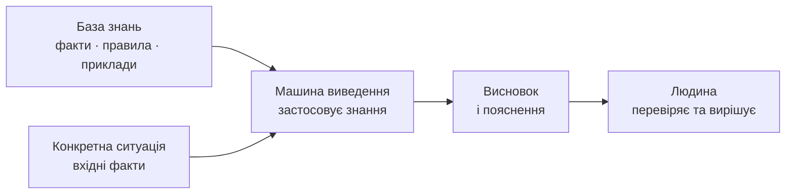
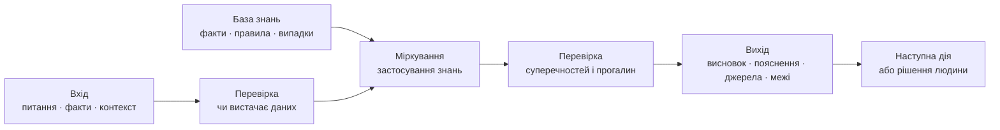
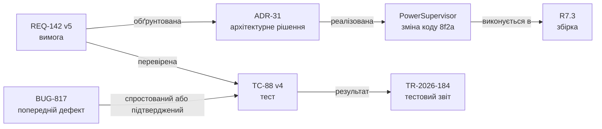
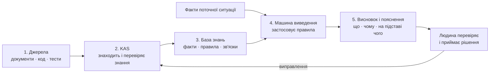
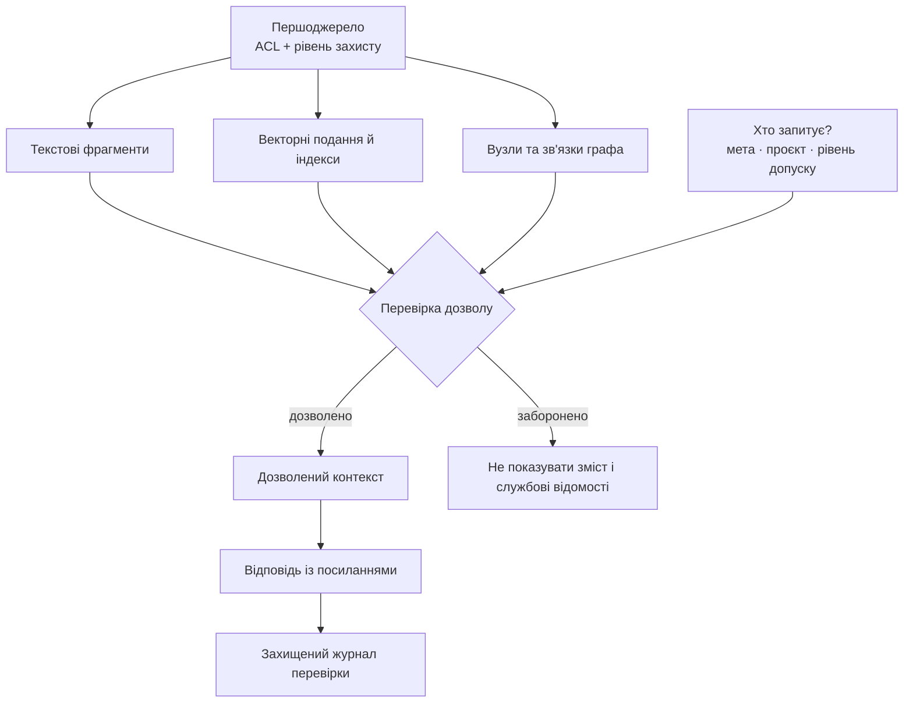
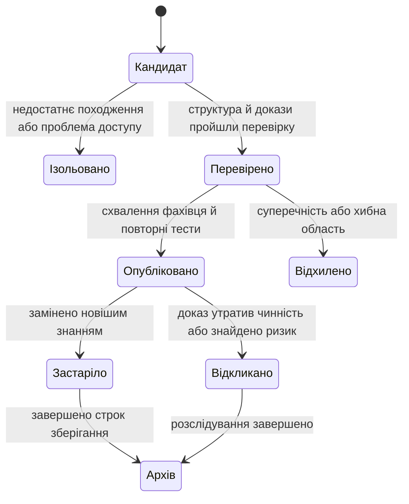

# Експертні системи для досліджень і розробки (R&D): від хаосу до керованих знань

> **Серія:** [Експертні системи для R&D](README.md) · стаття 01 із 22  
> **Наступна стаття:** [02 — Від теореми Байєса до доказових рішень ШІ](02-Expert-Systems-Evolution-Evidence-UA.md)  
> **Зміст серії:** [README](README.md)  
> **Рівень:** розробники — базовий  
> **Після статті:** пояснити, хто такий експерт і де закінчуються його повноваження; своїми словами визначити експертну систему, базу знань і машину виведення; відрізнити таку систему від пошуку та чатбота.  
> **Подача матеріалу:** експерт → експертне знання → експертна система; нові терміни пояснюються перед використанням.

## Хто такий експерт

Слово «експерт» часто вживають як назву посади або комплімент. Для цієї серії
важливе точніше значення.

> **Експерт — це людина, яка має глибокі знання й перевірений практичний досвід
> у визначеній предметній області, уміє розв'язувати нетипові задачі та може
> пояснити підстави свого висновку.**

Наприклад, інженер може бути експертом із живлення конкретного сімейства
пристроїв. Він знає не лише написані вимоги, а й типові відмови, винятки,
обмеження вимірювань і наслідки зміни. Водночас це не робить його автоматично
експертом із медицини, авіації або законодавства.

Практично важливі п'ять ознак експерта:

1. **Знання:** людина володіє фактами, поняттями, правилами й методами галузі.
2. **Досвід:** вона бачила достатньо реальних випадків, зокрема невдалих.
3. **Міркування:** може перейти від фактів конкретної ситуації до висновку.
4. **Пояснення:** здатна показати, чому обрала один висновок і відкинула інший.
5. **Розуміння меж:** знає, коли даних недостатньо або потрібен інший фахівець.

Експерт може помилятися. Його досвід має межі, а знання можуть застаріти. Тому
надійне експертне рішення спирається не лише на авторитет людини, а й на
перевірювані факти, джерела та процедуру перегляду.

## Хто або що не є експертом

- Людина не стає експертом лише через посаду, сертифікат або впевнену манеру
  говорити.
- Той, хто прочитав один документ, може переказати його, але ще не обов'язково
  вміє застосувати знання до нового випадку.
- Пошукова система знаходить інформацію, але сама не має практичного досвіду й
  не відповідає за висновок.
- Чатбот або мовна модель може писати переконливо, але переконливість тексту не
  доводить правильність міркування.
- Великий архів документів містить відомості, але сам не визначає, які з них
  чинні та як розв'язати суперечність.

Треба також розрізняти **компетентність** і **повноваження**. Експерт може
підготувати рекомендацію, але формальне рішення про випуск продукту, лікування
пацієнта або застосування норми закону приймає визначена відповідальна особа.

## Навіщо переносити частину експертних знань у програму

Уявімо звичайну ситуацію. Розробник бачить у коді число `40` і запитує: «Чому
час очікування — таймаут — саме 40 мілісекунд? Чи можу я змінити його на 60?»
Відповідь може бути розкидана між вимогою, коментарем у коді, результатами
тестів, старим дефектом і пам'яттю інженера, який уже працює в іншій команді.

Звичайний пошук знайде документи зі згадкою про таймаут. Чатбот зможе переказати
їх зрозумілою мовою. Але інженерові треба більше: встановити, яка версія вимоги
чинна, який тест її підтверджує, чи немає суперечностей і хто має право
дозволити зміну.

**Проблема цієї статті — пояснити, як програма може не лише знайти інформацію,
а й застосувати накопичені знання до конкретної ситуації та показати шлях до
висновку.** Такий клас програм називають експертними системами.

Це перша й найпростіша стаття серії. Вона не вимагає знань машинного навчання,
вищої математики або спеціальних стандартів. **Дослідження та розробка
(Research and Development, R&D)** означає роботу над новими продуктами й
технологіями. Складніші математичні, архітектурні й галузеві питання поступово
з'являться в наступних частинах.

## Від експерта до експертної системи

У різних підручниках межі поняття можуть відрізнятися. У цій серії
використовуємо таке інженерне визначення:

> **Експертна система — це програма, яка зберігає частину знань експертів у
> певній предметній області, застосовує їх до конкретної ситуації та пояснює
> отриманий висновок.**

Вона не перетворює комп'ютер на людину-експерта. У програми немає власного
життєвого досвіду, професійної відповідальності або інтуїції. Натомість вона
допомагає багаторазово й однаково застосовувати явно записану частину
експертних знань.

Предметна область — це обмежене коло завдань, наприклад діагностика пристрою,
перевірка комплектності випуску нової версії — релізу, підбір способу ремонту
або пошук чинної норми закону. Експертна система не є «електронним експертом з
усього». Вона корисна саме тому, що працює у визначених межах.

## Чому це окремий клас програм

Калькулятор виконує задану формулу. Пошуковик повертає документи. Звичайна
інформаційна система зберігає й показує дані. Експертна система має інше
завдання: **побудувати висновок для конкретного випадку на основі знань
предметної області та пояснити цей висновок**.

Її можна впізнати за простими характеристиками:

| Характеристика | Що це означає для користувача |
|---|---|
| Визначена предметна область | Система чесно описує, які задачі вона розв'язує, а які — ні |
| Окремо збережені знання | Факти й правила можна переглядати, оновлювати та перевіряти |
| Міркування над конкретним випадком | Однакові знання застосовуються до нових вхідних фактів |
| Пояснюваний висновок | Можна побачити використані факти, правила й джерела |
| Робота з неповнотою | Система може відповісти «даних недостатньо», а не вигадувати |
| Оновлення знань | Новий досвід можна додати без повного переписування програми |
| Визначені повноваження | Видно, де закінчується рекомендація системи й починається рішення людини |

Найважливіша технічна ознака — знання предметної області відділено від
механізму, який їх застосовує. Тепер можна назвати дві основні частини цього
класу програм.

У найпростішій експертній системі є дві головні частини:

1. **База знань** зберігає те, що відомо про предметну область.
2. **Машина виведення** застосовує ці знання до фактів конкретної ситуації.

Результат показують користувачеві разом із поясненням. Тому базову будову можна
уявити так:



### Що таке база знань

**База знань** — це не просто папка з документами й не обов'язково одна база даних.
Це впорядковане подання того, що система має право використовувати під час
міркування:

- факти: «цей виріб має апаратну ревізію C»;
- правила: «для ревізії C під час холодного старту таймаут має бути не меншим
  за 55 мілісекунд»;
- зв'язки: «вимогу `REQ-142` перевіряє тест `TC-88`»;
- відомі випадки: «подібний збій уже виникав у версії R6»;
- джерела й межі: хто це встановив, для якої версії та доки твердження чинне.

Документи можуть бути джерелами для бази знань, але самі документи ще не
утворюють її. Система повинна розуміти хоча б тип відомості, її версію та
зв'язок з іншими відомостями.

### Що таке машина виведення

**Машина виведення** — це програмний механізм, який бере факти конкретної
ситуації, знаходить придатні правила й отримує новий висновок. Вона не
обов'язково є нейронною мережею або мовною моделлю.

Найпростіший приклад правила:

```text
ЯКЩО апаратна ревізія = C
І режим запуску = холодний старт
І таймаут < 55 мс,
ТО потрібна зміна таймауту та повторний тест.
```

Якщо на вході система отримала ревізію C, холодний старт і таймаут 40 мс,
машина виведення зіставить ці факти з умовами правила. Її висновок буде не
«мені здається, 60 краще», а «правило спрацювало через три такі факти; перед
зміною потрібен повторний тест».

Реальні машини виведення працюють не лише з правилами `ЯКЩО—ТО`. Вони можуть
використовувати логіку, ймовірності, обмеження, графи зв'язків і попередні
випадки. Але принцип залишається тим самим: **знання зберігаються окремо від
механізму, який їх застосовує**.

## Вхід, робота всередині та вихід

Тепер можна подивитися на експертну систему як на звичайну програму: щось
надходить на вхід, усередині відбувається опрацювання, а на виході з'являється
результат.



### Що надходить на вхід

Вхід — це не лише запитання користувача. Зазвичай система отримує:

- **мету або запитання:** що треба встановити;
- **факти конкретного випадку:** що вже відомо про цей виріб, пацієнта,
  документ або подію;
- **контекст:** версію, час, режим роботи, юрисдикцію чи інші межі;
- **обмеження:** які джерела дозволено використати та хто ставить запитання.

Для прикладу з таймаутом вхід може бути таким:

```text
Запитання: чи можна змінити таймаут із 40 до 60 мс?
Виріб: R7
Апаратна ревізія: C
Режим: холодний старт
Чинна вимога: REQ-142, версія 5
```

База знань не вводиться користувачем заново для кожного запиту. Вона вже є
всередині системи й містить перевірені правила, зв'язки та попередні випадки.

### Що приблизно відбувається всередині

Без занурення в алгоритми роботу можна описати п'ятьма кроками:

1. Система перевіряє, чи зрозуміле запитання і чи вистачає вхідних фактів.
2. Знаходить у базі знань відомості, що стосуються саме цього випадку.
3. Застосовує придатні правила або порівнює випадок із відомими прикладами.
4. Перевіряє, чи немає суперечностей, застарілих джерел або відсутніх доказів.
5. Формує висновок і пояснення зрозумілою для користувача мовою.

Якщо важливого факту немає, правильна поведінка — поставити додаткове питання
або відповісти «даних недостатньо». Вигадана відповідь не стає експертною лише
тому, що вона добре сформульована.

### Що отримуємо на виході

На виході має бути не одне слово «так» або «ні», а результат, який можна
перевірити:

- висновок або чесна відмова через нестачу даних;
- факти й правила, на яких він побудований;
- точні джерела та їхні версії;
- відомі суперечності, припущення й межі застосування;
- рекомендована наступна дія;
- вказівка, хто має право прийняти остаточне рішення.

## Що таке експертна відповідь

> **Експертна відповідь — це висновок для конкретного випадку, поданий разом
> із достатнім поясненням: які факти враховано, які знання застосовано, на які
> джерела спирається висновок, чого система не знає та що робити далі.**

Назва «експертна» не гарантує істинності. Така відповідь може виявитися
помилковою, якщо вхідні дані або знання помилкові. Її перевага в іншому: шлях
до висновку видимий, тому помилку можна знайти, обговорити й виправити.

Для нашого прикладу відповідь може виглядати так:

```text
Висновок: значення 40 мс не задовольняє правило для ревізії C у режимі
холодного старту. Значення 60 мс перевищує мінімум 55 мс, але зміна потребує
повторного тесту.

Враховані факти: виріб R7; ревізія C; холодний старт; поточне значення 40 мс.
Застосоване правило: для ревізії C у холодному старті таймаут має бути ≥ 55 мс.
Джерела: REQ-142 v5; ADR-31 v3; тест TC-88 v4.
Не перевірено: поведінку в інших режимах і вплив на суміжні компоненти.
Наступна дія: встановити 60 мс у тестовій збірці та повторити TC-88.
Остаточне рішення: відповідальний інженер після результату тесту.
```

### Чим експертна відповідь відрізняється від інших

| Вид відповіді | Що отримує користувач | Чого може бракувати |
|---|---|---|
| Коротка відповідь людини | «Так, змінюй на 60» | підстав, джерел, меж і фіксації відповідальності |
| Результат пошуку | перелік документів про таймаут | готового висновку для конкретного випадку |
| Відповідь чатбота | зв'язний і зрозумілий текст | перевірених правил, чинних версій і чесного опису прогалин |
| Експертна відповідь | висновок, шлях міркування, джерела, обмеження й наступна дія | гарантії істинності без перевірки якості вхідних знань |

Отже, експертність відповіді визначається не довжиною, складними словами або
впевненим тоном. Вона визначається тим, чи можна перевірити шлях від вхідних
фактів і знань до висновку.

## Де експертна система міститься серед інших програм

У звичайній програмі правила часто заховані безпосередньо в коді. У довідковій
системі користувач сам читає знайдені документи й робить висновок. Експертна
система займає проміжне місце: вона не забирає відповідальність у людини, але
збирає потрібні знання, застосовує явні правила й показує обґрунтування.

```text
довідкова система:   запит → документи → людина робить висновок
експертна система:   факти + знання → машина виведення → пояснений висновок → людина вирішує
```

## Один приклад замість абстрактної «корпоративної пам'яті»

Нехай розробник змінює таймаут у модулі `PowerSupervisor`. Пошук знаходить
вимогу `REQ-142`, старий дефект `BUG-817`, коментар у коді та 40 сторінок
специфікації. Але для рішення треба встановити:

1. яка ревізія `REQ-142` чинна для продукту `R7`;
2. яке архітектурне рішення пояснює початкове значення таймауту;
3. чи `BUG-817` справді мав ту саму причину;
4. які тести підтверджують вимогу на поточному апаратному забезпеченні;
5. чи потребує зміна перегляду з функціональної безпеки та кібербезпеки;
6. хто має право дозволити зміну й зафіксувати виняток.



Ця схема вже корисніша за папку документів: вона показує тип зв'язку. Проте
стрілка теж може бути помилковою або застарілою. Тому кожен вузол і зв'язок
мають джерело, автора або процес походження, час спостереження, область
застосування, версію та статус перевірки.

## З яких частин складається повна експертна система

База знань і машина виведення утворюють ядро, але для практичної роботи цього
замало. Потрібні ще три частини:

- **отримання знань** — перенесення перевірених відомостей із документів,
  вимірювань і досвіду людей до бази знань;
- **пояснення** — показ фактів, правил і джерел, через які виник висновок;
- **інтерфейс користувача** — форма, звіт, програмний інтерфейс або діалог, де
  людина ставить питання й отримує результат.

Отже, повна система виконує простий цикл:

```text
отримати знання → упорядкувати їх → застосувати до ситуації → пояснити висновок → отримати перевірку людини
```

Ранні експертні системи DENDRAL для хімічного аналізу й MYCIN для медичних
консультацій показали практичну цінність такого поділу: знання предметної
області можна поповнювати й перевіряти окремо від загального механізму
міркування. У сучасній реалізації всередині можуть бути звичайна база даних,
пошук, граф зв'язків, статистична модель або мовна модель. Жоден із цих
компонентів окремо ще не є експертною системою.

## Чим експертна система відрізняється від пошуку й чатбота

Спочатку введемо лише потрібні терміни:

- **чатбот** веде діалог природною мовою;
- **повнотекстовий пошук** знаходить точні слова та фрази;
- **пошук за змістом**, або векторний пошук, знаходить схожі за змістом
  фрагменти, навіть якщо в них використано інші слова;
- **генерація з пошуковим доповненням (retrieval-augmented generation, RAG)**
  спочатку знаходить фрагменти документів, а потім передає їх мовній моделі для
  підготовки відповіді;
- **граф знань** подає об'єкти та зв'язки між ними як мережу;
- **механізм правил** автоматично застосовує явно записані правила.

Тепер їх можна порівняти без припущення, що читач уже знає скорочення:

| Інструмент | Що він робить добре | Чого він сам не робить |
|---|---|---|
| Чатбот | Допомагає сформулювати питання й відповідь зрозумілою мовою | Не гарантує, що відповідь спирається на чинні факти |
| Повнотекстовий пошук | Знаходить назву, код вимоги, номер помилки або точну фразу | Не робить висновок замість користувача |
| Пошук за змістом | Знаходить схожі фрагменти за різних формулювань | Не доводить, що схожий фрагмент правильний і чинний |
| RAG | Поєднує пошук із підготовкою зв'язної відповіді | Не гарантує повноти джерел або правильності міркування |
| Граф знань | Показує об'єкти, їхні версії та зв'язки | Не вирішує сам, яке правило застосувати |
| Механізм правил | Однаково застосовує записані правила до однакових фактів | Не виправляє неповні або хибні правила |
| Експертна система | Поєднує знання, виведення, пояснення й межі відповідальності | Потребує постійного оновлення та перевірки знань |

Отже, RAG може бути зручним способом роботи з документами, граф — способом
показати зв'язки, а мовна модель — способом зрозуміти питання та пояснити
результат. Експертною стає вся система лише тоді, коли вона має керовані
знання, визначений спосіб міркування і перевірюване пояснення.

## Документ не дорівнює знанню

Для людини знання предметної області часто звучить як «ця програма керування
пристроєм нестабільна після зміни часових параметрів». Для машини треба
розділити щонайменше п'ять типів об'єктів:

| Тип | Приклад | Що обов'язково зберегти |
|---|---|---|
| Спостереження (*observation*) | «у прогоні тесту 184 стався перезапуск через 37 мс» | джерело, час події, умови, одиниці та якість вимірювання |
| Твердження (*claim*) | «таймаут 40 мс недостатній для апаратної ревізії C» | автор, область застосування, статус, рівень упевненості й час дії |
| Доказове джерело (*evidence*) | журнал подій, звіт тесту, розділ технічного опису | стале посилання, версія або хеш і правила доступу |
| Правило (*rule*) | «якщо ревізія C і холодний старт, потрібен таймаут ≥ 55 мс» | умови, висновок, винятки, власник правила й перевірки |
| Рекомендація або рішення | «змінити таймаут до 60 мс після перегляду безпеки» | використані факти й правила, альтернативи, відповідальна особа й результат |

Спостереження не є твердженням про причину. Твердження не стає істинним лише
тому, що його написав досвідчений інженер. Документ може бути доказом, але лише
в межах своєї версії й області застосування. Правило без тестів і власника — це
заморожена думка, а не кероване знання.

### Мінімальний об'єкт знання

Для першої **перевірки задуму (Proof of Concept, PoC)** не потрібна велика
онтологія — формальна модель понять і зв'язків предметної області. Достатньо
узгодженої структури запису, яка не дозволяє втратити найважливіше:

<details>
<summary>Необов'язковий технічний приклад у форматі JSON</summary>

**Текстовий формат обміну даними (JavaScript Object Notation, JSON)** дає змогу
передати той самий об'єкт знань між програмами.

```json
{
  "id": "claim:power-timeout:r7-cold-start",
  "type": "claim",
  "statement": "Revision C needs at least 55 ms during cold start",
  "subject": "component:PowerSupervisor",
  "scope": {
    "product": "R7",
    "hardware_revision": "C",
    "mode": "cold_start"
  },
  "evidence": [
    "test-report:TR-2026-184",
    "trace:scope-441"
  ],
  "status": "verified_for_scope",
  "valid_from": "2026-07-18T00:00:00Z",
  "valid_to": null,
  "owner": "team:power-safety",
  "access_policy": "project:R7/safety-engineering",
  "derived_from": ["REQ-142@v5", "ADR-31@v3"],
  "supersedes": "claim:power-timeout:r7-cold-start@1",
  "schema_version": "knowledge-object@1.0"
}
```

`status=verified_for_scope` навмисно не означає «істина всюди». Таке твердження
може бути правильним для ревізії C і хибним для ревізії D. `valid_to=null`
означає, що кінцеву дату ще не встановлено, а не те, що знання вічне.
`access_policy` задає політику доступу. Вона має поширюватися і на похідні
індекси, векторні представлення (*embeddings*), кеші та згенеровані відповіді.
Англійські назви полів у прикладі — це контракт для програмного обміну; читачеві
не треба запам'ятовувати їх, щоб зрозуміти принцип.

</details>

## Мінімальна архітектура: від джерела до пакета обґрунтування

На першому знайомстві не потрібні десятки компонентів. Достатньо простежити,
як відомість із документа перетворюється на пояснений висновок.

На схемі **система здобуття знань (Knowledge Acquisition System, KAS)** є
компонентом, який переносить перевірені відомості з джерел до бази знань.



Розберімо ці п'ять кроків без внутрішніх технічних деталей.

### 1. Джерела

Джерелами є вимоги, код, результати тестів, описи рішень, дефекти, технічні
керівництва й досвід фахівців. Для кожного джерела треба знати його версію:
інакше завтра за тим самим посиланням може бути вже інший текст.

### 2. Система здобуття знань

KAS не «стягує все». Вона знаходить джерела, перевіряє право їх обробляти,
зберігає відомості про походження, виділяє об'єкти та зв'язки, створює
записи-кандидати й передає
їх на автоматичну або людську перевірку. Детально цей контур розглядає [стаття
10](10-Knowledge-Acquisition-System-UA.md).

### 3. База знань

Перевірені факти, правила, зв'язки та відомі випадки потрапляють до бази знань.
Вони не втрачають посилання на першоджерело. Якщо документ оновили або
відкликали, система повинна знати, які твердження треба переглянути.

### 4. Машина виведення

Користувач описує поточну ситуацію або ставить запитання. Машина виведення
знаходить придатні знання, перевіряє умови правил і будує висновок. Саме тут
відбувається відмінність від простого пошуку: знайдений документ стає не
готовою відповіддю, а одним із матеріалів для міркування.

### 5. Пакет обґрунтування замість «відповіді моделі»

**Пакетом обґрунтування (proof packet)** у цій серії називаємо висновок разом
із матеріалами, які дають людині змогу його перевірити. Він містить:

- сам висновок;
- факти та правила, які до нього привели;
- точні джерела й їхні версії;
- відомі суперечності й те, чого бракує;
- межі застосування;
- відповідальну за остаточне рішення людину.

Велика мовна модель може пояснити пакет природною мовою. Але список джерел,
слід застосування правил і повноваження мають формуватися визначеними
компонентами системи, а не відтворюватися моделлю з пам'яті.

Це і є мінімальна архітектура. Складні способи пошуку, спеціалізовані сховища
та розподілене виконання потрібні не кожному першому проєкту. Вони вводяться
поступово у [статті 06 про архітектуру](06-Expert-Systems-Architecture-UA.md)
та [статті 13 про шлях від питання до доказової відповіді](13-Knowledge-Acquisition-From-Question-To-Evidence-UA.md).

## Що достатньо запам'ятати після першого знайомства

Якщо ви вперше читаєте про експертні системи, на цьому етапі достатньо п'яти
ідей:

1. **База знань** зберігає перевірені відомості та правила предметної області.
2. **Машина виведення** застосовує ці знання до фактів конкретної ситуації.
3. **Пояснення** показує, які факти, правила й джерела привели до висновку.
4. **Людина** зберігає остаточні повноваження там, де рішення має правові,
   безпекові або професійні наслідки.
5. **Експертна відповідь** містить не лише висновок, а й ураховані факти,
   підстави, джерела, обмеження та наступну дію.

Цього вже досить, щоб відрізнити експертну систему від папки документів,
пошуковика або чатбота. Друга половина статті — необов'язкова карта практичних
питань, до яких серія повернеться докладніше: машинне навчання, різні галузі,
права доступу, відповідальні ролі та вимірювання користі. Нові терміни не треба
запам'ятовувати за один раз.

## Де тут машинне навчання й мовні моделі

**Машинне навчання (Machine Learning, ML)** корисне там, де жорстке правило
неефективне: класифікувати документ, розпізнати назву компонента, побудувати
векторне представлення, знайти схожий інцидент або виявити аномалію.

**Мала мовна модель (Small Language Model, SLM)** і **велика мовна модель
(Large Language Model, LLM)** можуть слугувати мовним інтерфейсом, засобом
розбору неоднорідного тексту, підготовки чернетки та пояснення.

Межа проста:

- результат моделі спочатку має статус «кандидат» або «спостереження»;
- результат пошуку не стає автоматично доказом для висновку;
- згенероване посилання перевіряється за джерелом і точним фрагментом;
- модель не розширює списки контролю доступу й не визначає власні повноваження;
- відповідь без достатніх доказів завершується «даних недостатньо», питанням або
  передаванням експерту;
- оновлення моделі чи її інструкції є версійованою зміною, а не невидимою
  зміною поведінки.

У [статті 09](09-Engineering-Artifacts-As-Data-UA.md) наведено практичний
експеримент автора з майже десятьма тисячами технічних специфікацій: видобуті
об'єкти знань порівнюються із сирими текстовими фрагментами як матеріал для
пошуку і контекст мовної моделі. Це приклад того, як архітектурну тезу треба
перевіряти на визначеному корпусі документів, запитах, правильних відповідях,
метриках і зафіксованих версіях, а не подавати як універсальний ефект.

## Наскрізна рамка п'яти доменів

**Простими словами, це огляд того, де застосовують експертні системи.**
Найлегше зрозуміти їхню користь на конкретних задачах. Нижче —
п'ять галузей, до яких серія повертатиметься в наступних статтях. Одна й та
сама загальна будова системи придатна для кожної з них, але знання, ризики та
повноваження в них різні. Наприклад, правило ремонту автомобіля не можна
перенести в авіацію, а медичну пораду — у законодавство.

| Галузь | Приклад задачі | Що надходить на вхід | Що система повертає | Хто приймає рішення |
|---|---|---|---|---|
| Автомобільна інженерія (*Automotive*) | знайти причину відмови або оцінити вплив зміни | будова автомобіля, коди несправностей, вимоги, версії компонентів і результати тестів | імовірні причини, пов'язані вимоги, потрібні перевірки та відсутні докази | інженер із розробки, діагностики або безпеки |
| Авіація (*Aviation*) | допомогти з технічним обслуговуванням і аналізом події | конфігурація повітряного судна, повідомлення про відмови, журнал робіт і затверджені керівництва | обґрунтована послідовність перевірок, можливі причини та прогалини у відомостях | уповноважений авіаційний фахівець |
| Медицина (*Medicine*) | підтримати діагностику або перевірити протипоказання | симптоми, результати досліджень, ліки, історія пацієнта й клінічні настанови | можливі пояснення, попередження та рекомендацію з указаними підставами | медичний працівник у межах своїх повноважень |
| Військові й оборонні технології (*Military/Defence*) | зіставити повідомлення, оцінити технічний стан або спланувати забезпечення | дані сенсорів, повідомлення, стан техніки, запаси, керівництва й правила | суперечності у відомостях, оцінку стану та варіанти подальших дій | командир або інша уповноважена посадова особа |
| Законодавство (*Legislation*) | знайти норму, чинну для певної ситуації та дати | факти справи, дата, юрисдикція, офіційні тексти законів і їхні редакції | перелік застосовних норм, точні посилання, можливі колізії та невизначеність | юрист, суд, регулятор або інший уповноважений орган |

Спільна ознака всіх п'яти прикладів: система не просто знаходить документ, а
застосовує знання до конкретного випадку й пояснює результат. Водночас вона не
отримує автоматично професійні або владні повноваження людини.

### Автомобільна інженерія (Automotive)

Тут експертна система може збирати та зіставляти об'єктивні докази для
процесів функціональної безпеки, кібербезпеки й оцінювання розробки. Проте вона
не може сама оголосити продукт або процес відповідним стандарту. Серед
орієнтирів — ISO 26262:2018, ISO/SAE 21434:2021 та Automotive SPICE 4.0;
використану редакцію кожного документа потрібно фіксувати.

У цій галузі багато промислових рішень закриті й не мають загальновідомої
назви. Типовий приклад — система сервісної діагностики: вона зіставляє код
несправності, модель і версію автомобіля, результати вимірювань та відомі
випадки, а потім пропонує механіку порядок перевірок. Це експертна підтримка,
але не автоматичне підтвердження справності автомобіля.

### Авіація (Aviation)

Дорожня карта забезпечення безпеки штучного інтелекту Федерального управління
цивільної авіації США (*Federal Aviation Administration, FAA*) і матеріали
Агентства авіаційної безпеки Європейського Союзу (*European Union Aviation
Safety Agency, EASA*) наголошують на поступовому впровадженні та окремому
обґрунтуванні безпеки. Тому практичний перший крок — не керування польотом, а
робота зі знаннями про конфігурацію, обслуговування, події та матеріали
перевірки для фахівця.

Близький приклад з аерокосмічної галузі — створена в NASA система
**Livingstone** для пошуку несправностей за моделлю технічного об'єкта. Її
випробовували у складі програмного забезпечення космічного апарата Deep Space
One. Це корисний приклад модельної діагностики, а не доказ того, що таку саму
систему можна без окремої перевірки перенести на цивільний літак.

### Медицина (Medicine)

Настанова Управління з продовольства і медикаментів США (*Food and Drug
Administration, FDA*) щодо програм підтримки клінічних рішень, фінально
оновлена в січні 2026 року, показує, що назви «порадник лікаря» недостатньо.
Важливі призначення програми, її користувачі, вхідні та вихідні дані й
можливість медичного працівника самостійно перевірити підстави рекомендації.

Відома історична система **MYCIN** пропонувала лікареві допомогу з
діагностикою бактеріальних інфекцій і вибором лікування. Це був впливовий
дослідницький проєкт, а не звичайна система, що самостійно лікувала пацієнтів.
Його цінність для навчання — у явних правилах, оцінюванні впевненості та
можливості пояснити ланцюг міркування.

### Військові й оборонні технології (Military/Defence)

Оновлена стратегія НАТО щодо штучного інтелекту 2024 року та британський
документ JSP 936 вимагають відповідальності, пояснюваності, надійності,
керованості та перевірки. Для цієї серії це означає фокус на доказовій підтримці
рішень, технічній готовності, логістиці, діагностиці та керуванні знаннями.
Розподіл обчислень біля сенсорів, у роботах і на серверній частині докладніше
розглянуто у [статті 22](22-Cybernetics-Expert-Systems-Edge-Backend-UA.md).

Відомий історичний приклад системи на основі знань — **DART** (*Dynamic
Analysis and Replanning Tool*), яку застосовували для підтримки планування
перевезень і постачання. Вона добре показує користь експертних знань у
логістиці, але не є прикладом автономного прийняття бойових рішень.

### Законодавство (Legislation)

Для законодавства критичні не лише текстова схожість і дата публікації. Треба
відрізняти ухвалення, набрання чинності, застосовність до події, консолідовану
редакцію, перехідні положення, територіальну й предметну юрисдикцію,
правило переваги спеціальної норми та правило переваги пізнішої норми, а також
правовий статус джерела. **Європейський ідентифікатор законодавства (European
Legislation Identifier, ELI)** дає сталі вебідентифікатори й структуровані
відомості про законодавство. **Мова подання юридичних правил (LegalRuleML)**
допомагає формально записувати норми й властивості правил, але не усуває
неоднозначність тлумачення.

Експертна система тут може показати, яка редакція діяла на потрібну дату, які
норми змінює законопроєкт, де виникає можлива колізія та на яких офіційних
джерелах побудовано висновок. Вона не повинна називати згенеровану юридичну
думку остаточним рішенням і має відділяти текст норми, машинно виділену
структуру, твердження про тлумачення, судову практику та акт уповноваженого
органу. Якщо сама система підпадає під регулювання штучного інтелекту, додатково
перевіряють застосовні вимоги, зокрема Регламент ЄС 2024/1689.

Серед відомих дослідницьких прикладів — **TAXMAN**, що моделювала міркування
щодо оподаткування реорганізації компаній, і **HYPO**, що порівнювала правові
справи за суттєвими ознаками та прецедентами. Вони показали різні способи
подання юридичних знань, але не були джерелами права й не замінювали судове або
професійне рішення.

У наступних статтях ця таблиця стане тестом повноти: кожний математичний метод,
тип бази знань, контур навчання або шар дії оцінюватиметься для всіх п'яти
доменів, але без штучного припущення, що межі ризику в них однакові.

## Інші галузі застосування

Експертні системи корисні не лише у п'яти наскрізних галузях цієї серії. Вони
особливо доречні там, де складне запитання регулярно повторюється, знання можна
перевірити й упорядкувати, а користувачеві потрібно пояснити висновок.

| Галузь | Яку проблему допомагає розв'язати система | Відомий приклад або типовий результат |
|---|---|---|
| Хімія | визначити можливу структуру речовини за результатами вимірювань | **DENDRAL** — одна з перших відомих експертних систем |
| Геологія та пошук корисних копалин | оцінити, де доцільно продовжити дослідження або буріння | **PROSPECTOR** зіставляв геологічні спостереження з правилами й невизначеністю |
| Налаштування складної техніки | підібрати сумісний склад обладнання з великої кількості варіантів | **XCON** допомагала конфігурувати комп'ютерні системи DEC |
| Виробництво | знайти причину браку, відмови верстата або порушення процесу | перелік можливих причин, потрібних вимірювань і безпечних дій для інженера |
| Енергетика | пояснити тривоги, несправності й ризики для обладнання або мережі | оцінка стану, пріоритет перевірок і рекомендація оператору |
| Кібербезпека | зіставити журнали подій, вразливості, будову мережі та правила реагування | пояснений перелік можливих атак і пріоритетних перевірок для аналітика |
| Фінанси, банківська справа та страхування | перевірити відповідність правилам, ознаки шахрайства або умови виплати | попередження з указаними правилами й фактами для уповноваженого працівника |
| Сільське господарство | розпізнати хворобу рослини, обрати догляд або режим поливу | можливий діагноз і перелік наступних спостережень для агронома чи фермера |
| Технічна підтримка | провести користувача або майстра через послідовну діагностику | питання, перевірки та інструкції, що змінюються залежно від попередніх відповідей |

Історичні назви в таблиці важливі не як готові вироби для сучасного
впровадження, а як зрозумілі приклади різних задач: DENDRAL тлумачила
вимірювання, PROSPECTOR працювала з неповними геологічними ознаками, а XCON
застосовувала правила сумісності. Сучасна система може використовувати інші
алгоритми й обладнання, проте все одно повинна мати визначену задачу, перевірені
знання, пояснюваний результат і відповідального користувача.

Експертна система менш придатна, якщо задача не має зрозумілої мети, знання
неможливо перевірити, умови змінюються швидше за їх оновлення або ніхто не
відповідає за результат. У такому разі впевнений текст лише приховує проблему,
а не розв'язує її.

## Права доступу мають проходити крізь усі похідні дані

Типова помилка — правильно захистити документ, але відкрити всім його текстові
фрагменти, векторні представлення, збережені відповіді або зв'язки у графі.
**Пошук з урахуванням прав доступу (permission-aware retrieval)** означає, що
користувач бачить лише ті похідні дані, які йому дозволено бачити у
першоджерелі. **Список контролю доступу (Access Control List, ACL)** описує,
хто саме має право читати або змінювати об'єкт.



Мінімальні засоби захисту:

- перевірка особи, проєкту й мети запиту;
- перенесення ACL на фрагменти, вектори, зв'язки графа, кеші та журнали;
- видалення похідних даних після видалення або завершення строку зберігання
  джерела;
- шифрування та ізоляція секретів;
- журналювання запитів, пошуку й сформованих висновків;
- захист від навмисного псування даних і прихованих інструкцій у документах;
- дотримання ліцензійних, приватних, експортних і договірних обмежень;
- перевірки, які підтверджують не лише дозволений, а й заборонений доступ.

Локальне розгортання може зменшити передачу даних назовні, але саме по собі не
забезпечує принцип найменших необхідних повноважень, правильність роботи або
захист від внутрішнього порушника.

## Що система дає різним ролям

| Роль | Корисне запитання | Який результат має бути перевірюваним |
|---|---|---|
| Розробник програмного забезпечення | «Чому програмний інтерфейс має таке обмеження?» | рішення про архітектуру, вимога, зміна коду, тести, чинна версія й відповідальна особа |
| Фахівець із перевірки якості | «Які регресії та тести зачіпає зміна?» | прогалина покриття, попередні дефекти й результати тестів |
| Розробник апаратного або вбудованого ПЗ | «Чи сумісні ревізія компонента, опис регістрів і драйвер?» | межі застосовності, вимірювання, точні фрагменти технічного опису й обмеження плати |
| Системний інженер або фахівець із безпеки | «Які докази підтримують твердження?» | простежуваність, припущення, небезпеки, загрози, стан перевірки й невирішені суперечності |
| Керівник проєкту або продукту | «Які залежності блокують випуск?» | підтверджені джерелами блокери, історія рішень, відповідальні та невизначеність |
| Новий учасник команди | «З чого почати й кому ставити питання?» | навчальний маршрут, критичні процеси, чинні документи, експерти й дата оновлення |

Ефект входження нової людини в команду не треба обіцяти наперед. Його можна
перевірити часом до першого самостійного внеску, кількістю звернень до
досвідченого інженера, часткою відповідей із підтвердженим джерелом і повторними
помилками. Якщо час зменшився, а кількість дефектів зросла, «швидше навчання»
було хибною оптимізацією.

## Хто володіє дисципліною знань

Навіть добра технічна архітектура деградує без мандату й бюджету. Потрібні
щонайменше чотири різні відповідальності:

- **власник предметної області (domain owner)** визначає значення тверджень,
  межі їх застосування та правила;
- **власник джерела (source owner)** відповідає за авторитетне першоджерело та
  його актуальність;
- **власник технічної платформи (platform owner)** забезпечує завантаження,
  ідентифікацію, індекси, виконання та журналювання;
- **власник перевірки (assurance owner)** визначає оцінювання, умови випуску,
  реагування на інциденти й допустиме використання.

Одна людина може мати кілька ролей у малій пробній реалізації, але система
повинна зберігати, в якій ролі вона схвалила зміну. Власник технічної платформи
не стає автоматично медичним, юридичним, безпековим або військовим експертом.



**Життєвий цикл знання (knowledge lifecycle)** треба вбудувати в критерії
готовності роботи, перегляд змін, умови випуску, аналіз інцидентів і керування
змінами. Інакше базу знань наповнюють лише перед перевіркою, після чого вона
стає архівом останнього успішного аудиту.

## Як виміряти, що система справді корисна

«Користувачам подобається чат» — недостатня метрика. До пробного впровадження
фіксують початковий стан, з яким потім порівнюватимуть результат, і визначають
критерії успіху.

Покриття необхідної простежуваності:

$$
C_{trace}=\frac{L_{validated}}{L_{required}},
\qquad L_{required}>0.
$$

Тут $L_{required}$ — кількість необхідних зв'язків, а $L_{validated}$ —
кількість перевірених. Наприклад, якщо для десяти вимог безпеки потрібні зв'язки
з архітектурними рішеннями й тестами, маємо двадцять необхідних зв'язків. Якщо
перевірено п'ятнадцять, $C_{trace}=15/20=0{,}75$. Високе покриття не доводить
правильність самих вимог, але показує видиму прогалину.

Частка непідтверджених відповідей:

$$
R_{unsupported}=\frac{A_{unsupported}}{A_{answered}},
\qquad A_{answered}>0.
$$

Важливо не покращити її штучно, відповідаючи лише на легкі запити. Тому поруч
рахують частку запитів, на які система взагалі дала змістовну відповідь:

$$
C_{answer}=\frac{A_{answered}}{Q_{eligible}},
\qquad Q_{eligible}>0,
$$

де $Q_{eligible}$ — запити в заявлених межах системи. Відповідь «даних
недостатньо» оцінюють окремо: чи система правильно відмовилась, чи просто не
знайшла наявне знання.

Практичний набір метрик:

- медіанний час і 95-й процентиль часу до знаходження доказів та рішення;
- правильність відповідей на зафіксованому наборі реальних запитів;
- точність посилань на джерело та конкретний фрагмент;
- покриття простежуваності й частка застарілих зв'язків;
- частка відомих релевантних матеріалів, знайдених серед перших результатів;
- частота хибної впевненості та якість обґрунтованої відмови;
- спроби витоку через порушення прав доступу;
- час експерта на перевірку одного кандидата до бази знань;
- повторні дефекти або повторно виконані розслідування;
- використання системи різними ролями, а не лише кількість повідомлень.

Кожну метрику рахують окремо для різних класів завдань і ризику. Середня
правильність може приховати, що система добре відповідає на довідкові питання,
але погано — на критичні питання безпеки.

## Перша перевірка задуму без «платформи на все підприємство»

1. Оберіть одне дороге повторюване запитання, наприклад аналіз впливу зміни
   вимоги.
2. Зафіксуйте 30–100 реальних запитів, правильні набори доказів, очікуваний
   результат і допустиму відповідь «даних недостатньо».
3. Підключіть два-три джерела з визначеними версіями, а не весь вміст
   підприємства.
4. Введіть мінімальну структуру об'єкта знань і сталі ідентифікатори.
5. Зробіть точний пошук як початковий варіант; лише потім додавайте пошук за
   змістом, граф або мовну модель.
6. Реалізуйте пошук з урахуванням прав і перевірки забороненого доступу до
   демонстрації.
7. Формуйте пакет обґрунтування, а не лише текстову відповідь.
8. Додайте перевірку власником предметної області та журнал виправлень.
9. Порівняйте результат із початковим станом за правильністю, часом пошуку
   доказів, покриттям і ризиком.
10. Розширюйте джерела й повноваження лише після окремого перегляду.

Мінімальні матеріали пробної реалізації: межі завдання, перелік джерел,
структура даних і знань, модель прав доступу, набір перевірочних запитів,
початкові вимірювання, модель загроз і відмов, перелік версій, матриця
відповідальних і процедура відкочування або видалення.

## Ризики й типові невдалі скорочення

| Скорочення | Що ламається | Найменша корисна протидія |
|---|---|---|
| «Під'єднаємо LLM до всіх документів» | застарілі або конфіденційні дані, приховані шкідливі інструкції, невідомі версії | перелік джерел, ACL, знімки версій і вузька пробна реалізація |
| «Перший результат пошуку і є відповіддю» | схожість підміняє доказ | поділ типів відомостей, перевірка суперечностей і пакет обґрунтування |
| «Граф автоматично побудує модель предметної області» | помилкові об'єкти й зв'язки створюють видимість точності | погоджена структура, відомості про походження та людська перевірка |
| «Висока правильність дозволяє автоматичну дію» | оцінка моделі підміняє повноваження й безпеку | окремий контракт дії, людське підтвердження та перевірка системи |
| «Усе локально, тому безпечно» | немає найменших повноважень, журналювання, оновлень або ізоляції | модель загроз і засоби захисту незалежно від місця розгортання |
| «Експерт підтвердив — це безумовна істина» | компетенція має межі, люди помиляються й не погоджуються | повноваження, докази, фіксація незгоди, строк чинності й додаткова перевірка для високого ризику |
| «Більше документів — краще» | шум пошуку, дублікати, витрати й витік | рівні якості джерел, усунення дублікатів і перевірка користі |
| «Система доводить відповідність стандарту» | результат інструмента підміняє незалежне оцінювання або сертифікацію | підтримка доказами з явною межею відповідальності |

## Висновок

Сучасна експертна система для досліджень і розробки — не просто «велика мовна
модель із доступом до корпоративних документів». Її ядро утворюють база знань і
машина виведення. Система розрізняє спостереження, твердження, доказові джерела,
правила й рішення; зберігає походження відомостей і права доступу; відтворює
шлях міркування та показує межі висновку.

Починати варто не з вибору векторної бази даних або найбільшої моделі, а з
одного дорогого питання: що саме потрібно показати людині, щоб вона могла
перевірити висновок? Після цього стають видимими джерела, структура знань,
зв'язки, правила, метрики, ризики й відповідальні. Технології обирають уже під
ці потреби.

У п'яти наскрізних галузях спільним залишається кероване знання, але не
повноваження. Випуск автомобільного компонента, схвалення авіаційної безпеки,
клінічне рішення, військова команда й юридичний акт мають різні правові та
професійні межі. Експертна система цінна не тоді, коли стирає ці межі, а коли
робить докази, невизначеність і відповідальність видимими.

## Питання до читачів

- Яке інженерне запитання у вашій команді найдорожче повторювати?
- Що є авторитетним першоджерелом, а що лише корисною підказкою?
- Який мінімальний об'єкт знань ви можете зберігати з версією вже сьогодні?
- Чи поширюються права джерела на текстові фрагменти, вектори, зв'язки графа й
  відповіді?
- На яке питання система повинна чесно відповісти «даних недостатньо»?
- Хто має право опублікувати або відкликати правило предметної області?
- Яка метрика доведе користь, не приховуючи критичної помилки?
- Як змінюється межа автоматизації у вашому домені?

## Короткий словник

| Український термін | Англійський відповідник | Коротке пояснення |
|---|---|---|
| Експерт | *expert* | Людина з глибокими знаннями й перевіреним досвідом у визначеній предметній області |
| Предметна область | *domain* | Обмежене коло об'єктів, понять, правил і задач |
| Компетентність | *expertise* | Знання та здатність обґрунтовано розв'язувати задачі предметної області |
| Повноваження | *authority* | Формальне право прийняти або затвердити рішення |
| Експертна система | *expert system* | Програма, що застосовує збережені знання до конкретного випадку й пояснює висновок |
| База знань | *knowledge base* | Перевірені факти, правила, зв'язки й випадки, придатні для машинного міркування |
| Машина виведення | *inference engine* | Механізм, який застосовує знання до фактів конкретної ситуації |
| Система здобуття знань | *Knowledge Acquisition System, KAS* | Контур перенесення знань із джерел до бази знань із перевіркою походження та прав |
| Пошук інформації | *information retrieval* | Знаходження документів або фрагментів, пов'язаних із запитом |
| Векторне представлення | *embedding* | Числовий вектор, що приблизно відображає зміст об'єкта для пошуку за схожістю |
| Граф знань | *knowledge graph* | Подання об'єктів і типізованих зв'язків між ними |
| Пакет обґрунтування | *proof packet* | Висновок разом із фактами, правилами, джерелами, версіями та обмеженнями |
| Походження даних | *provenance* | Відомості про джерело, автора, спосіб отримання й перетворення даних |
| Список контролю доступу | *Access Control List, ACL* | Перелік дозволів на читання або зміну об'єкта |
| Перевірка задуму | *Proof of Concept, PoC* | Невелика реалізація для перевірки, чи дає підхід вимірювану користь |
| Велика мовна модель | *Large Language Model, LLM* | Модель для опрацювання й генерації тексту; компонент, а не вся експертна система |

## Посилання на інших авторів, стандарти й офіційну документацію

- Edward A. Feigenbaum. [*The Art of Artificial Intelligence: Themes and Case Studies of Knowledge Engineering*](https://doi.org/10.21236/ADA046289), IJCAI 1977. Першоджерело про здобуття, подання, використання знань і пояснення міркування в системах на основі знань.
- Bruce G. Buchanan, Edward H. Shortliffe (ред.). [*Rule-Based Expert Systems: The MYCIN Experiments of the Stanford Heuristic Programming Project*](https://i.stanford.edu/pub/cstr/reports/cs/tr/82/926/CS-TR-82-926.pdf), Stanford, 1984.
- Sandra C. Hayden, Adam J. Sweet, Scott E. Christa. [*Livingstone Model-Based Diagnosis of Earth Observing One Infusion Experiment*](https://ntrs.nasa.gov/citations/20050019523), NASA, 2004. Опис модельної діагностики Livingstone та її зв'язку з льотними експериментами NASA.
- Austin Tate. [*Overview: ARPA-Rome Laboratory Knowledge-Based Planning and Scheduling Initiative*](https://cdn.aaai.org/ARPI/1996/ARPI96-001.pdf), 1996. Містить опис DART як засобу підтримки транспортного планування для розгортання сил.
- John Gaschnig. [*An Application of the Prospector System to DOE's National Uranium Resource Evaluation*](https://cdn.aaai.org/AAAI/1980/AAAI80-084.pdf), AAAI, 1980.
- John McDermott. [*R1: A Rule-Based Configurer of Computer Systems*](https://doi.org/10.1016/0004-3702(82)90021-2), *Artificial Intelligence*, 1982. Першоджерело про систему, яку згодом широко називали XCON.
- L. Thorne McCarty. [*Some Requirements for a Computer-Based Legal Consultant*](https://s.aaai.org/Library/AAAI/1980/aaai80-085.php), AAAI, 1980. Обговорення задач юридичної експертної системи на прикладі TAXMAN.
- Kevin D. Ashley. [*Modeling Legal Arguments: Reasoning with Cases and Hypotheticals*](https://mitpress.mit.edu/9780262011143/modeling-legal-arguments/), MIT Press, 1991. Докладний опис системи HYPO.
- Patrick Lewis та ін. [*Retrieval-Augmented Generation for Knowledge-Intensive NLP Tasks*](https://arxiv.org/abs/2005.11401), NeurIPS 2020.
- Timothy Lebo, Satya Sahoo, Deborah McGuinness (ред.). [*PROV-O: The PROV Ontology*](https://www.w3.org/TR/prov-o/), W3C Recommendation, 2013.
- W3C. [*Shapes Constraint Language (SHACL)*](https://www.w3.org/TR/shacl/), рекомендація 2017 року; для новіших проєктних можливостей перевіряйте статус SHACL 1.2 і не називайте робочу чернетку стандартом.
- Margaret Mitchell та ін. [*Model Cards for Model Reporting*](https://doi.org/10.1145/3287560.3287596), FAT* 2019.
- Timnit Gebru та ін. [*Datasheets for Datasets*](https://doi.org/10.1145/3458723), *Communications of the ACM*, 2021.
- NIST. [*Artificial Intelligence Risk Management Framework 1.0*](https://doi.org/10.6028/NIST.AI.100-1), 2023; NIST позначає версію 1.0 як таку, що переглядається, тому в проєкті треба фіксувати використану редакцію.
- ISO/IEC. [*ISO/IEC 42001:2023 — Artificial intelligence management system*](https://www.iso.org/standard/42001).
- ISO. [*ISO 26262:2018 — Road vehicles: Functional safety*](https://www.iso.org/standard/68383.html); опублікована друга редакція, третя редакція перебуває в розробленні.
- ISO та SAE International. [*ISO/SAE 21434:2021 — Road vehicles: Cybersecurity engineering*](https://www.iso.org/standard/70918.html); на час цієї редакції стандарт проходить systematic review.
- VDA QMC. [*Automotive SPICE Process Assessment / Reference Model 4.0*](https://vda-qmc.de/wp-content/uploads/2023/12/Automotive-SPICE-PAM-v40.pdf), 2023.
- FAA. [*Roadmap for Artificial Intelligence Safety Assurance, Version I*](https://www.faa.gov/aircraft/air_cert/step/roadmap_for_AI_safety_assurance), 2024.
- EASA. [*Artificial Intelligence and Aviation*](https://www.easa.europa.eu/en/light/topics/artificial-intelligence-and-aviation-0): AI Roadmap 2.0, concept papers і MLEAP.
- FDA. [*Clinical Decision Support Software Guidance*](https://www.fda.gov/regulatory-information/search-fda-guidance-documents/clinical-decision-support-software), фінальна редакція, січень 2026 року.
- FDA / IMDRF. [*Good Machine Learning Practice for Medical Device Development: Guiding Principles*](https://www.fda.gov/medical-devices/software-medical-device-samd/good-machine-learning-practice-medical-device-development-guiding-principles), остаточний документ IMDRF, 2025.
- NATO. [*Summary of NATO's Revised Artificial Intelligence Strategy*](https://www.nato.int/en/about-us/official-texts-and-resources/official-texts/2024/07/10/summary-of-natos-revised-artificial-intelligence-ai-strategy), 2024.
- UK Ministry of Defence. [*JSP 936: Dependable Artificial Intelligence in Defence*](https://www.gov.uk/government/publications/jsp-936-dependable-artificial-intelligence-ai-in-defence-part-1-directive), 2024.
- Publications Office of the European Union. [*European Legislation Identifier (ELI)*](https://eur-lex.europa.eu/content/help/eurlex-content/eli.html?locale=en): стандартизовані ідентифікатори, метадані й машинно-читаний обмін законодавством.
- OASIS Open. [*LegalRuleML Core Specification 1.0*](https://docs.oasis-open.org/legalruleml/legalruleml-core-spec/v1.0/os/legalruleml-core-spec-v1.0-os.html), OASIS Standard, 2021.
- European Union. [*Regulation (EU) 2024/1689 — Artificial Intelligence Act*](https://eur-lex.europa.eu/eli/reg/2024/1689/oj), офіційний текст.
- GitLab. [*GitLab Flavored Markdown*](https://docs.gitlab.com/user/markdown/): правила Markdown, Mermaid-схем, таблиць і математичного синтаксису KaTeX.
