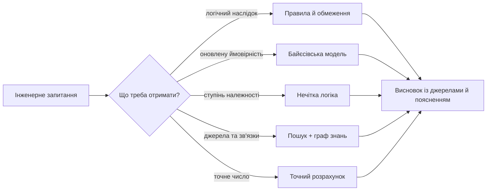
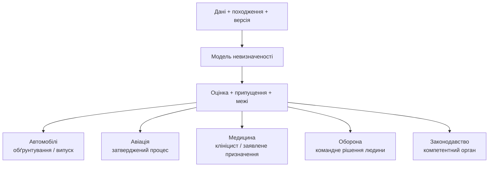

# Експертні системи: від теореми Байєса до доказових рішень ШІ

> **Серія:** [Експертні системи для R&D](README.md) · стаття 02 із 22  
> **Попередня стаття:** [01 — Експертні системи для R&D: від корпоративного хаосу до керованих знань](01-Expert-Systems-for-RD.md)  
> **Наступна стаття:** [03 — Експертна система, доказова рекомендація ШІ і корпоративна пам'ять: три кути одного трикутника](03-Expert-System-And-Evidence-Memory-UA.md)  
> **Зміст серії:** [README](README.md)  
> **Рівень:** Розробники: базовий рівень  
> **Після статті:** зіставити правило, ймовірність, граф, пошук і LLM з типом інженерного висновку.  
> **Подача матеріалу:** історія методу → проста модель → обмеження та перевірка.

Уявіть звичайний ранок перед випуском нової версії програми. Один важливий
тест упав, але після повторного запуску пройшов. Чи можна випускати версію?
Пошук знайде звіти, чатбот сформулює переконливу пораду, але відповідальному
інженерові потрібне інше: зрозуміти, наскільки цей сигнал змінив ризик, які
правила діють і яких перевірок досі бракує.

Саме такі задачі експертні системи розв'язували задовго до сучасних мовних
моделей. Вони виросли з логіки, теорії ймовірностей, правил, графів знань і
пошуку навколо дуже практичного питання: **як зробити так, щоб система не
просто відповідала, а могла показати, чому вона так відповіла?**

Це важливо саме зараз. Великі мовні моделі добре пишуть текст. Але у складній інженерії, медицині, фінансах, безпеці, кібербезпеці або регульованій інженерії красивий текст не є доказом. Якщо система каже "реліз готовий", "ризик прийнятний", "вимога покрита", "дефект не критичний" або "це рішення краще", наступне питання має бути не "наскільки впевнено це звучить", а "які факти, правила, джерела, припущення і обмеження стоять за цим висновком".

Саме тут історія експертних систем знову стає актуальною.

**Проблема цієї статті — навчитися вибирати математичний механізм під тип
невизначеності, а не під модну назву технології.** Правило, ймовірність,
нечітка належність, оцінка відповідності результату пошуку й упевненість
мовної моделі — різні величини. Якщо змішати їх в одне число, система створить видимість точності,
але не дасть перевірюваного рішення.

Це навчальний історико-технічний огляд для розробника, а не повний курс
теорії ймовірностей або формальна оцінка безпеки, медична чи юридична оцінка. Кожну
формулу нижче подано в нативному LaTeX-синтаксисі: GitHub відтворює її через
MathJax, GitLab — через KaTeX. Після формули пояснюються символи, припущення,
числовий приклад і межа застосування.

Для мене ця тема не є суто теоретичною. Я прийшов до неї від давнього читання книжки Дж. Елти, М. Кумбс «Экспертные системы: Концепции и примеры» на початку 1990-х, через власний досвід розбудови інформаційних систем, інформаційну безпеку, керування розробкою, регульовану автомобільну інженерію, трасування вимог, інформаційну та кібербезпеку і сучасні ШІ-асистовані робочі процеси. Тому в цій статті експертна система розглядається не як музейна технологія і не як модний додаток до мовної моделі, а як практичний спосіб зробити рішення доказовими, пояснюваними і придатними до аудиту.

## Як читати цю статтю без спеціальної підготовки

Для першого знайомства не потрібно пам'ятати всі формули або назви методів.
Тримайте в голові одне запитання: **який саме висновок ми хочемо отримати і
чому маємо йому довіряти?**

Основний маршрут для початківця:

1. правила показують, як отримати однозначний висновок із відомих фактів;
2. числовий приклад із Байєсом показує, як нове спостереження змінює оцінку
   ризику;
3. розділ про доказовість показує, що треба повернути разом із відповіддю;
4. простий тест наприкінці допомагає перевірити будь-якого «ШІ-порадника».

Розділи про LISP, PROLOG, Демпстера—Шафера та детальні пошукові формули — це
поглиблення. Їх можна переглянути по діагоналі й повернутися до них, коли
виникне практична потреба.

Кілька термінів, потрібних уже на початку:

| Термін | Просте пояснення |
|---|---|
| Факт | відомість про конкретний випадок, яку система приймає як вхідні дані |
| Правило | явний зв'язок виду «якщо виконані умови, то випливає висновок» |
| Виведення | застосування правил або математичної моделі до фактів |
| Гіпотеза | можливе пояснення, яке ми перевіряємо, наприклад «реліз проблемний» |
| Невизначеність | ситуація, у якій наявних відомостей недостатньо для однозначного висновку |
| Свідчення, або доказова ознака (*evidence*) | нове спостереження, документ чи вимірювання, що підтримує або послаблює гіпотезу |
| Ймовірність | число від $0$ до $1$, яке в межах визначеної моделі описує невизначеність події |
| Детерміноване обчислення | обчислення, яке для однакових вхідних даних і версії формули дає однаковий результат |

## Карта методів: що саме вони дають інженеру

Перш ніж іти в історію, корисно розрізнити ролі методів. Жоден із них не є універсальною відповіддю:

| Метод | Найкраще відповідає на запит | Чого сам по собі не гарантує |
|---|---|---|
| Правила й логічне виведення | Чи виконано явну умову, що випливає з перевірюваних фактів? | Повноти правил і коректності вхідних фактів. |
| Байєсівська модель | Як новий сигнал змінює оцінку ризику за визначеною моделлю ймовірностей? | Правильності апріорних даних і припущень про залежності. |
| Нечітка логіка | Наскільки об'єкт належить до проєктно визначеного поняття на кшталт «достатньо готовий»? | Що проста частка або оцінка вже є нечіткою множиною. |
| Граф знань | Які артефакти, версії та зв'язки формують ланцюг доказів? | Рішення або рекомендації без додаткових правил. |
| Пошук і підготовка джерел для мовної моделі | Які документи або фрагменти варто подати людині чи моделі для відповіді? | Істинності відповіді, повноти джерел або правильності оцінки їх відповідності запиту. |
| Детерміноване обчислення | Який результат дає зафіксована формула для зафіксованих входів? | Коректності самої формули, вхідних даних і меж її застосування. |



## До великих мовних моделей були правила, логіка і докази

Перший шар експертних систем — формальна логіка. У найпростішому вигляді це
знайоме правило відокремлення, або *modus ponens*:

$$
\frac{A\rightarrow B,\qquad A}{B}.
$$

Риска читається як «із тверджень над нею випливає твердження під нею».
$A\rightarrow B$ — правило, $A$ — встановлений факт, а $B$ — логічний
висновок. Це не ймовірність: за прийнятої логіки й істинності засновків
висновок або випливає, або ні.

У технічній системі це може звучати так:

```text
Якщо зміна зачіпає вимогу безпеки,
то потрібен аналіз впливу.

Зміна CR-17 зачіпає вимогу безпеки SR-42.
Отже, для CR-17 потрібен аналіз впливу.
```

Це не ШІ у сучасному маркетинговому сенсі. Але це вже машинне міркування над фактами і правилами.

У 1950–1960-х роках уже сформовані раніше булева алгебра, логіка висловлювань
і логіка предикатів стали основою цифрових обчислень та автоматичного
доведення теорем. Важливою віхою став резолюційний принцип Джона Робінсона
1965 року для автоматичного доведення в логіці першого порядку. Ідея була
амбітна: якщо знання записані формально, машина може виводити нові твердження.

На практиці швидко з'ясувалося, що реальний світ не дуже любить чисту формальність. Експерти часто мислять не повними теоремами, а правилами, винятками, евристиками, неповними доказами і словами "зазвичай", "майже завжди", "якщо немає інших обмежень". Так з'явився другий великий шар - продукційні правила.

## Продукційні правила: класичне "IF-THEN"

Слово «продукційне» тут не стосується виробництва або промислового
середовища. **Продукційне правило** — це формально записана конструкція
«якщо виконана умова, то зробити висновок або дію». У 1970-х і 1980-х роках
навколо таких правил будували багато експертних систем:

```text
IF умова
THEN висновок або дія
```

Класичні приклади - DENDRAL для хімічного аналізу, MYCIN для медичної діагностики, PROSPECTOR для геології, XCON/R1 для конфігурації комп'ютерних систем. Це були не чатботи. Це були системи, у яких знання експертів переводилися в правила, а механізм виведення застосовував ці правила до конкретного випадку.

Два базові режими міркування з того часу використовуються досі.

Пряме виведення - рух від фактів до висновків:

$$
F_0=\{A,B,C\},
\qquad
R=\{A\land B\rightarrow D,\;D\land C\rightarrow E\},
$$

$$
F_1=F_0\cup\{D\},
\qquad
F_2=F_1\cup\{E\}.
$$

Тобто система починає з множини фактів $F_0$, застосовує перше правило й
одержує $D$, а потім застосовує друге та одержує $E$.

Це зручно для перевірок: що в цьому проєкті не так, які правила порушені, які прогалини є.

Зворотне виведення - рух від цілі назад до фактів:

$$
E
\Longleftarrow D\land C
\Longleftarrow (A\land B)\land C.
$$

Ціль $E$ розкладається на підцілі $D$ і $C$, а $D$ — на $A$ і $B$. Після
цього система перевіряє, чи підтверджені початкові факти $A$, $B$ і $C$.

Це зручно для консультації: що треба зробити, щоб досягти контрольного пункту готовності, рівня відповідності або релізної готовності.

Сучасні системи підтримки рішень часто несвідомо повертаються до цієї логіки. Наприклад, якщо ціль - "підготувати релізний пакет", система може йти назад: потрібні тести, закриті дефекти, погоджені ризики, актуальна базова версія, підтверджені вимоги, відсутність блокуючих зауважень. Якщо чогось немає, виникає не просто текстова порада, а конкретна дія.

## LISP і PROLOG: дві культури раннього ШІ

> Цей історичний розділ необов'язковий для розуміння решти статті. Його мета —
> показати, звідки походять явні правила та пошук логічного доведення, а не
> навчити програмувати цими мовами.

Окремо варто згадати LISP і PROLOG. Це не просто старі мови програмування, які люблять згадувати на історичних лекціях. Для експертних систем вони були практичними інструментами мислення.

LISP був природним середовищем для символьного ШІ: списки, дерева, рекурсія, динамічна побудова структур, правила як дані. У LISP-звичному стилі знання легко ставало програмою, а програма - структурою, яку можна змінювати, передавати і виконувати. Саме тому багато ранніх систем ШІ, механізмів правил і дослідницьких прототипів жили в LISP-світі або в мовах, натхненних ним.

Умовне правило для релізного рішення в LISP-подібному стилі могло б виглядати так:

```lisp
(defrule reliz-zablokovano-krytychnym-defektom
	(and (reliz ?r)
			 (defekt ?d)
			 (vplyvaye ?d ?r)
			 (seryoznist ?d krytychna)
			 (stan ?d vidkrytyy))
	(assert (status-relizu ?r zablokovano)))
```

Для інженера тут цікаве не синтаксичне ретро. Цікаво те, що правило є явним артефактом. Його можна прочитати, протестувати, змінити, версіонувати. Воно не заховане в довгій інструкції до моделі.

PROLOG пішов іншим шляхом: логічне програмування. Ви описуєте факти і правила, а система сама шукає доведення. Це дуже близько до зворотного виведення.

```prolog
vymoga_bezpeky(sr_42).
zachipaye(cr_17, sr_42).

potrebuye_analizu_vplyvu(Zmina) :-
		zachipaye(Zmina, Vymoga),
		vymoga_bezpeky(Vymoga).
```

Запит:

```prolog
?- potrebuye_analizu_vplyvu(cr_17).
```

Відповідь:

```text
true
```

А якщо запитати:

```prolog
?- potrebuye_analizu_vplyvu(X).
```

система може знайти всі зміни, для яких потрібен аналіз впливу. Це вже не просто пошук у документах. Це міркування над базою фактів.

<details>
<summary>Приклад для фахівців: проєктні перевірки доказів безпеки й кібербезпеки</summary>

Це не «реалізація ISO 26262 у PROLOG» і не текст стандарту. Нижче — приклад локальної політики проєкту: вона виявляє прогалини у зв'язках між вимогою, перевіркою та результатом тесту. Реальні робочі продукти, критерії випуску й аргументація відповідності визначаються застосовним стандартом, контрактом і обґрунтуванням безпеки.

```prolog
safety_goal(sg_brake_assist).
asil(sg_brake_assist, d).

functional_safety_requirement(fsr_detect_sensor_fault).
technical_safety_requirement(tsr_enter_degraded_mode).
technical_safety_requirement(tsr_report_diagnostic_fault).

derived_from(fsr_detect_sensor_fault, sg_brake_assist).
derived_from(tsr_enter_degraded_mode, fsr_detect_sensor_fault).
derived_from(tsr_report_diagnostic_fault, fsr_detect_sensor_fault).

verified_by(tsr_enter_degraded_mode, test_tsr_014).
test_passed(test_tsr_014).

includes(release_2026_05, tsr_enter_degraded_mode).
includes(release_2026_05, tsr_report_diagnostic_fault).

missing_safety_evidence(Req, safety_trace) :-
	technical_safety_requirement(Req),
	\+ derived_from(Req, _).

missing_safety_evidence(Req, verification) :-
	technical_safety_requirement(Req),
	\+ verified_by(Req, _).

missing_safety_evidence(Req, failed_test) :-
	verified_by(Req, Test),
	\+ test_passed(Test).

release_requires_safety_review(Release) :-
	includes(Release, Req),
	missing_safety_evidence(Req, _).
```

Такий фрагмент не замінює інженера з функціональної безпеки. Він робить інше: швидко відповідає, які вимоги мають прогалини у доказах за локальною політикою. Запит може бути дуже прямим:

```prolog
?- missing_safety_evidence(tsr_report_diagnostic_fault, Reason).
```

Або ширшим:

```prolog
?- release_requires_safety_review(release_2026_05).
```

Для прикладу в cybersecurity-домені політика може перевіряти зв'язок між цілями, сценаріями загроз, рішеннями з обробки ризику, вимогами й перевірками:

```prolog
cybersecurity_goal(csg_secure_update).
threat_scenario(ts_update_tampering).
risk_treatment(ts_update_tampering, reduce).

cybersecurity_requirement(csr_signed_update).
cybersecurity_requirement(csr_secure_diagnostics).
derived_from(csr_signed_update, csg_secure_update).
derived_from(csr_secure_diagnostics, csg_secure_update).
treats(csr_signed_update, ts_update_tampering).
treats(csr_secure_diagnostics, ts_update_tampering).

verified_by(csr_signed_update, security_test_021).
test_passed(security_test_021).

changes(change_88, csr_secure_diagnostics).

missing_cybersecurity_evidence(Req, threat_trace) :-
	cybersecurity_requirement(Req),
	\+ treats(Req, _).

missing_cybersecurity_evidence(Req, risk_treatment) :-
	cybersecurity_requirement(Req),
	treats(Req, Threat),
	\+ risk_treatment(Threat, _).

missing_cybersecurity_evidence(Req, security_verification) :-
	cybersecurity_requirement(Req),
	\+ verified_by(Req, _).

cybersecurity_review_required(Change) :-
	changes(Change, Req),
	missing_cybersecurity_evidence(Req, _).
```

Тут PROLOG корисний не тому, що він "розумніший" за сучасні мови. Він корисний тим, що запит до знань читається майже як формальна вимога: якщо зміна зачіпає кібербезпекову вимогу, а ланцюг загроза -> рішення з ризику -> вимога -> перевірка неповний, потрібен перегляд.

В оборонних технологіях той самий підхід можна застосовувати обережно і без прив'язки до небезпечної функціональності: наприклад, для захищеного зв'язку, сенсорного модуля, навігаційної підсистеми або польового оновлення. PROLOG може перевіряти не "як виконати місію", а чи є докази для рішення:

```prolog
mission_requirement(mr_secure_field_update).
cybersecurity_requirement(csr_offline_signature_check).
safety_requirement(sr_fail_safe_on_update_error).
safety_requirement(sr_operator_confirmation).

derived_from(csr_offline_signature_check, mr_secure_field_update).
derived_from(sr_fail_safe_on_update_error, mr_secure_field_update).
derived_from(sr_operator_confirmation, mr_secure_field_update).

verified_by(csr_offline_signature_check, security_test_044).
verified_by(sr_fail_safe_on_update_error, safety_test_031).

contains(field_update_2026_05, csr_offline_signature_check).
contains(field_update_2026_05, sr_fail_safe_on_update_error).
contains(field_update_2026_05, sr_operator_confirmation).

requires_independent_review(Change) :-
	changes(Change, Req),
	cybersecurity_requirement(Req).

requires_independent_review(Change) :-
	changes(Change, Req),
	safety_requirement(Req).

field_release_blocked(Item) :-
	contains(Item, Req),
	\+ verified_by(Req, _).
```

Це дуже практичний сучасний сценарій: правила можна зберігати у версіях, факти підтягувати з інженерних систем, а результатом має бути не "ШІ сказав, що все добре", а список конкретних прогалин: немає перевірки, немає зв'язку з ризиком, немає незалежного перегляду, немає погодження.

</details>

Для систем прийняття рішень LISP і PROLOG показали дві важливі речі. LISP показав, як будувати гнучкі символьні системи і механізми правил. PROLOG показав, як формально ставити питання до знань: що доводиться, чого бракує, які факти потрібні для висновку. Сучасні системи часто написані вже не на цих мовах, але архітектурна ідея залишилася: база знань, правила, виведення, пояснення.

## Байєс: як оновлювати впевненість після доказу

Теорема Байєса набагато старша за експертні системи, але для ШІ вона стала
одним із фундаментальних способів говорити про невизначеність. У цьому розділі
слово «доказ» означає спостереження або свідчення (*evidence*), а не формальне
математичне доведення.

Основна формула має такий вигляд:

$$
\Pr(H\mid E)
=
\frac{\Pr(E\mid H)\Pr(H)}{\Pr(E)},
\qquad \Pr(E)>0.
$$

Формулу варто спочатку прочитати словами: **оновлена ймовірність гіпотези
після нового спостереження дорівнює правдоподібності цього спостереження за
умови гіпотези, помноженій на початкову ймовірність гіпотези та поділеній на
загальну ймовірність спостереження**.

Позначення читаються так:

| Символ | Людською мовою |
|---|---|
| $H$ | гіпотеза, яку перевіряємо, наприклад «реліз проблемний» |
| $E$ | нове спостереження, наприклад «критичний регресійний тест упав» |
| $\Pr(H)$ | оцінка ймовірності гіпотези до спостереження $E$ |
| $\Pr(E\mid H)$ | як часто $E$ очікується, якщо $H$ справді виконується |
| $\Pr(H\mid E)$ | оновлена оцінка гіпотези після спостереження $E$ |

Вертикальна риска в $\Pr(H\mid E)$ читається «за умови». Вона не означає
ділення. Критично також не переплутати дві умовні ймовірності:

$$
\Pr(E\mid H)\ne\Pr(H\mid E)
$$

у загальному випадку. Наприклад, тест може часто падати для проблемних
релізів, але більшість усіх падінь може припадати на непов'язані нестабільні
тести, якщо проблемні релізи рідкісні.

### Звідки береться знаменник

Якщо можливі лише дві взаємовиключні ситуації — $H$ і $\neg H$, — повна
ймовірність спостереження дорівнює:

$$
\Pr(E)
=\Pr(E\mid H)\Pr(H)
+\Pr(E\mid\neg H)\Pr(\neg H),
\qquad \Pr(\neg H)=1-\Pr(H).
$$

Цей знаменник нормує результат: після оновлення ймовірності всіх можливих
гіпотез знову мають утворювати коректний розподіл.

### Числовий приклад без стрибка через алгебру

Нехай історична модель для певного класу релізів задає:

$$
\Pr(H)=0{,}05,
\qquad
\Pr(E\mid H)=0{,}80,
\qquad
\Pr(E\mid\neg H)=0{,}10.
$$

Уявімо не абстрактні частки, а $1000$ схожих релізів:

| Стан релізу | Кількість | Тест $E$ упав | Тест не впав |
|---|---:|---:|---:|
| Проблемний, $H$ | $50$ | $40$ | $10$ |
| Нормальний, $\neg H$ | $950$ | $95$ | $855$ |
| **Разом** | **$1000$** | **$135$** | **$865$** |

Серед $135$ релізів із падінням тесту лише $40$ є проблемними. Тому:

$$
\Pr(H\mid E)
=\frac{40}{135}
=\frac{8}{27}
\approx0{,}296
=29{,}6\%.
$$

Той самий результат безпосередньо за теоремою Байєса:

$$
\begin{aligned}
\Pr(E)
  &=0{,}80\cdot0{,}05+0{,}10\cdot0{,}95\\
  &=0{,}135,\\[4pt]
\Pr(H\mid E)
  &=\frac{0{,}80\cdot0{,}05}{0{,}135}
   \approx0{,}296.
\end{aligned}
$$

Отже, спостереження підвищило оцінку ризику з $5\%$ до приблизно $29{,}6\%$.
Це суттєве оновлення, але не автоматичний доказ проблемності й не команда
заборонити реліз.

```mermaid
flowchart LR
    accTitle: Байєсівське оновлення ризику релізу
    accDescr: Апріорна оцінка разом із правдоподібністю нового спостереження утворює апостеріорну оцінку, після чого політика визначає наступну перевірку, а не автоматичний вирок.

    PRIOR["До тесту<br>ризик 5%"] --> UPDATE["Байєсівське оновлення"]
    LIKE["Падіння тесту<br>80% за H · 10% за не-H"] --> UPDATE
    UPDATE --> POST["Після тесту<br>ризик 29,6%"]
    POST --> POLICY{"Політика рішення"}
    POLICY -->|"замало доказів"| TEST["Додатковий тест"]
    POLICY -->|"перевищено поріг"| REVIEW["Людський перегляд"]
```



### Відношення правдоподібностей: наскільки сильний сигнал

Окремо від апріорної ймовірності можна виміряти силу самого спостереження:

$$
\operatorname{LR}^{+}
=\frac{\Pr(E\mid H)}{\Pr(E\mid\neg H)}
=\frac{0{,}80}{0{,}10}
=8.
$$

Додатне відношення правдоподібностей $\operatorname{LR}^{+}=8$ означає: таке
падіння тесту у вісім разів імовірніше за проблемного релізу, ніж за
нормального. Воно не означає «ризик дорівнює $80\%$» і не містить базової
частоти проблемних релізів.

Зручною є форма через шанси (*odds*):

$$
\underbrace{\frac{\Pr(H\mid E)}{1-\Pr(H\mid E)}}_{\text{апостеріорні шанси}}
=
\underbrace{\frac{\Pr(H)}{1-\Pr(H)}}_{\text{апріорні шанси}}
\cdot
\underbrace{\frac{\Pr(E\mid H)}{\Pr(E\mid\neg H)}}_{\operatorname{LR}^{+}}.
$$

Для прикладу:

$$
\frac{0{,}05}{0{,}95}\cdot8
=\frac{8}{19}
\quad\Longrightarrow\quad
\Pr(H\mid E)=\frac{8}{8+19}=\frac{8}{27}.
$$

### Кілька сигналів: коли множення дозволене

Для двох спостережень $E_1$ і $E_2$ загальна формула не потребує припущення про
незалежність:

$$
\Pr(H\mid E_1,E_2)
=\frac{\Pr(E_1,E_2\mid H)\Pr(H)}{\Pr(E_1,E_2)}.
$$

Послідовне оновлення теж коректне, якщо на другому кроці використати умовну
правдоподібність, яка вже враховує перший сигнал:

$$
\Pr(H\mid E_1,E_2)
=\frac{
  \Pr(E_2\mid H,E_1)\Pr(H\mid E_1)
}{
  \Pr(E_2\mid E_1)
}.
$$

Лише за обґрунтованої умовної незалежності $E_1$ і $E_2$ за обох станів можна
множити відношення правдоподібностей:

$$
\operatorname{Odds}(H\mid E_1,E_2)
=\operatorname{Odds}(H)
\operatorname{LR}_1
\operatorname{LR}_2.
$$

Провалений тест і відкритий дефект часто мають спільну причину. Якщо трактувати
їх як незалежні, система двічі порахує частину одного свідчення й завищить
ризик.

### Що треба зберегти, щоб число можна було перевірити

Апостеріорна ймовірність має сенс лише разом із паспортом моделі:

- визначеннями $H$ та $E$;
- джерелом і часовим вікном для $\Pr(H)$ та умовних ймовірностей;
- способом обробки пропущених даних і зміни базової частоти;
- припущеннями про залежності між сигналами;
- версією моделі та результатами калібрування;
- політикою, що перетворює оцінку на додатковий тест або людський перегляд.

Саме останній пункт відділяє оцінювання від рішення. Байєсівська модель оновлює
ймовірність; вона не визначає сама, хто має право випустити автомобільний
компонент, допустити повітряне судно, обрати лікування, віддати команду або
встановити юридичний наслідок.

Але повна байєсівська модель потребує апріорних та умовних ймовірностей, які в
складному домені важко оцінити й підтримувати. Експерти часто можуть чесно
сказати «це сильний сигнал», але не можуть обґрунтувати точне
$\Pr(E\mid H)=0{,}73$. Тому поряд із байєсівським підходом розвивалися
евристичні та множинні моделі невизначеності.

## Коефіцієнти впевненості: інженерний компроміс MYCIN

Творці MYCIN (Едвард Шортліфф та колеги) зіткнулися з проблемою: класичний Байєсівський підхід вимагав знання величезної кількості апріорних та умовних ймовірностей, яких у лікарів просто не було. Крім того, лікарі мислять не суворими ймовірностями, а категоріями «це підтверджує» або «це спростовує» гіпотезу.
Тому MYCIN використовував коефіцієнти впевненості. Ідея була не будувати повну байєсівську модель, а дати експертам спосіб виразити ступінь підтримки або заперечення гіпотези.

Спрощено:

$$
CF(H,E)=MB(H,E)-MD(H,E),
$$

де $MB,MD\in[0,1]$ - відповідно міра підтримки та міра заперечення гіпотези, тому $CF\in[-1,1]$. Це евристична шкала MYCIN, а не шкала ймовірності.

Якщо два позитивні докази підтримують одну гіпотезу, їх можна комбінувати приблизно так:

$$
CF_{1\oplus2}=CF_1+CF_2(1-CF_1),
\qquad 0\le CF_1,CF_2\le1.
$$

Це правило тут застосоване лише до двох додатних коефіцієнтів. Коефіцієнт упевненості не є апостеріорною ймовірністю, а його комбінування має власні припущення; тому його не можна без перевірки змішувати з байєсівськими оцінками.

Наприклад, перший доказ підтримує гіпотезу «реліз має інтеграційний ризик» із коефіцієнтом $CF_1=0{,}6$. Друге окремо отримане свідчення має $CF_2=0{,}5$:

$$
CF_{1\oplus2}
=0{,}6+0{,}5(1-0{,}6)
=0{,}6+0{,}2
=0{,}8.
$$

У людській мові це означає: два середньо-сильні докази разом дають уже сильну підставу для експертного перегляду. Не автоматичну заборону релізу, а саме сильний сигнал для людського рішення.

Це не суворий Байєс. Але це зручно для системи, яка працює з експертними правилами, неповною інформацією і потребою пояснювати результат.

Сьогодні коефіцієнти впевненості рідко використовують буквально у старій формі. Але сама ідея жива. Ми бачимо її в оцінках впевненості, діапазонах впевненості, порогах для людського перегляду, оцінюванні ризику і достатності доказів. Коли система каже "впевненість середня, бо є джерела, але бракує тестового звіту", це нащадок тієї ж лінії мислення.

## Нечітка логіка: коли світ не чорний і не білий

Лотфі Заде у 1965 році запропонував нечіткі множини. У класичній множині елемент або належить множині, або ні. Нечітка множина $A$ задається функцією належності

$$
\mu_A:X\to[0,1], \qquad x\mapsto\mu_A(x).
$$

Значення $\mu_A(x)=0$ означає відсутність належності до поняття $A$, а $\mu_A(x)=1$ - повну належність. Проміжне значення описує ступінь належності, але саме по собі не є ймовірністю події.

Наприклад, температура 80 градусів може належати множині "висока температура" зі ступенем 0.7, а 95 градусів - зі ступенем 0.95.

В інженерній підтримці рішень важливо не змішувати виміряний показник і нечітку належність. Наприклад, 84% тестового покриття — це спостережувана частка. Вона стає ступенем належності до поняття «достатньо готовий» лише після того, як команда визначить і погодить функцію належності:

Позначимо спостережувані показники як $c_t=0{,}84$ для тестового покриття, $c_a=0{,}60$ для погоджень і $c_d=0{,}70$ для стану дефектів. Після застосування трьох окремо погоджених функцій належності маємо:

$$
\begin{aligned}
\mu_{\text{тести}}(c_t)&=0{,}70,\\
\mu_{\text{погодження}}(c_a)&=0{,}40,\\
\mu_{\text{дефекти}}(c_d)&=0{,}60.
\end{aligned}
$$

Ці значення — умовний приклад проєктно погоджених відображень, а не універсальна формула. Для політики "реліз готовий тільки настільки, наскільки готова найслабша критична умова" можна вибрати нечітку кон'юнкцію як мінімум:

$$
\mu_{\text{готовність релізу}}
=\min(0{,}70;\,0{,}40;\,0{,}60)
=0{,}40.
$$

Тобто формально реліз не "червоний" і не "зелений". У цьому прикладі його ступінь готовності 0.40, а найслабше місце — погодження. Мінімум — лише один із можливих способів агрегації; інший домен може вимагати іншої нечіткої операції або жорсткого блокувального правила.

Це дуже корисно там, де межі природно розмиті: керування, промислова автоматика, кліматичні системи, оцінка якості, ризики, пріоритети. У проєктах це теж знайомо: вимога може бути "частково покрита", ризик - "помірно високий", готовність - "майже достатня, але з блокерами".

Сьогодні нечітку логіку не завжди так називають. Часто в системах є лише шкали, оцінювання, нормалізовані значення та пороги — це корисно, але не тотожне нечіткій логіці. Спільна інтуїція така: не вся технічна реальність зводиться до `true/false`.

## Демпстер-Шафер: докази без повної впевненості

Ще один історичний підхід до невизначеності - теорія Демпстера-Шафера. Вона дозволяє працювати не лише з ймовірністю конкретної гіпотези, а з масою довіри до множин гіпотез. Це корисно, коли доказ підтримує не одну конкретну відповідь, а клас можливих відповідей.

Нехай $\Theta$ - скінченна множина взаємовиключних гіпотез, а базовий розподіл маси $m:2^\Theta\to[0,1]$ задовольняє $m(\varnothing)=0$ і $\sum_{A\subseteq\Theta}m(A)=1$. Маса може бути призначена не лише одній гіпотезі, а й множині гіпотез - так модель явно зберігає незнання.

Для двох розподілів $m_1$ і $m_2$ нормалізоване правило Демпстера має вигляд:

$$
\begin{aligned}
K&=\sum_{B\cap C=\varnothing}m_1(B)m_2(C),\\
m_{1\oplus2}(A)
&=\frac{\displaystyle\sum_{B\cap C=A}m_1(B)m_2(C)}{1-K},
\qquad A\ne\varnothing,\;K<1.
\end{aligned}
$$

Тут $K$ - маса конфлікту між джерелами доказів. Для множини $A$ можна також обчислити нижню й верхню межі підтримки:

$$
\operatorname{Bel}(A)=\sum_{B\subseteq A}m(B),
\qquad
\operatorname{Pl}(A)=\sum_{B\cap A\ne\varnothing}m(B)
=1-\operatorname{Bel}(\bar A).
$$

Інтервал $[\operatorname{Bel}(A),\operatorname{Pl}(A)]$ відділяє підтверджену підтримку від того, що ще лише не спростовано. Правило не варто застосовувати до довільних залежних джерел: воно потребує обґрунтованої моделі того, як утворилися докази, а за великого конфлікту політика його нормалізації має бути явною. За $K=1$ нормалізоване правило взагалі не визначене.

У промислових системах цей апарат не став таким масовим, як простіші моделі оцінювання, бо він складніший для пояснення і підтримки. Але ідея важлива: різні джерела можуть підтримувати висновок по-різному, частина доказів може конфліктувати, а система має вміти сказати не тільки "так" або "ні", а й "докази неповні" або "джерела суперечать одне одному".

Для сучасних доказових систем ШІ це дуже актуально. Якщо тест каже одне, статус задачі інше, а вимога змінилася після базової версії, система не має вибирати найкрасивіший текст. Вона має показати конфлікт.

## Графи знань: від семантичних мереж до графів знань

У 1960-70-х роках активно розвивалися семантичні мережі і фрейми - способи представити знання як поняття, властивості і зв'язки. Наприклад:

```text
Вимога R-17 перевіряється_тестом T-9
Тест T-9 впав_на_базовій_версії B-3
Дефект D-4 зачіпає_вимогу R-17
```

Це вже не просто текст. Це граф.

Сучасні графи знань, онтології, графи простежуваності, графи залежностей - прямі нащадки цієї ідеї. Вони потрібні там, де важливі зв'язки: вимога до тесту, тест до дефекту, дефект до ризику, ризик до релізного рішення, рішення до погодження.

Для мовних моделей це особливо важливо. Мовна модель може узагальнити текст, але граф дає їй структуру реальності. Без графа вона бачить купу документів. З графом вона бачить ланцюг доказів.

## Байєсівські мережі: причинні графи ймовірностей

У 1980-х роках байєсівський підхід отримав сильний розвиток через байєсівські мережі, пов'язані з роботами Джуди Перла. Це граф, у якому вузли - випадкові величини, а ребра - залежності. Спільний розподіл можна розкласти так:

$$
P(X_1,\ldots,X_n)
=\prod_{i=1}^{n}P\!\left(X_i\mid\operatorname{Pa}(X_i)\right).
$$

Тут $\operatorname{Pa}(X_i)$ - батьківські вузли $X_i$ у спрямованому ациклічному графі. Розклад коректний, коли структура графа кодує відповідні умовні незалежності; кожна локальна таблиця або модель $P(X_i\mid\operatorname{Pa}(X_i))$ має бути нормованим умовним розподілом.

Це потужна ідея: складну ймовірнісну модель можна розбити на локальні залежності.

Байєсівські мережі і сьогодні використовуються в діагностиці, інженерії надійності, аналізі ризиків, виявленні шахрайства, аналізі безпеки, медичних системах підтримки рішень. Але вони не стали універсальним ядром усіх систем ШІ. Причина та сама: модель треба будувати, калібрувати, підтримувати, пояснювати. Для багатьох інженерних процесів дешевше й надійніше поєднати правила, графи, оцінювання і людський перегляд.

## Пошук: від TF-IDF до векторних представлень

Окрема лінія розвитку експертних систем - пошук релевантних джерел. Бо жодне міркування не має сенсу, якщо система не знайшла правильні факти.

Класична векторна модель простору представляла документ і запит як вектори. Схожість рахували через косинусну схожість:

$$
\cos(\mathbf a,\mathbf b)
=\frac{\mathbf a^{\mathsf T}\mathbf b}
       {\lVert\mathbf a\rVert_2\,\lVert\mathbf b\rVert_2},
\qquad \mathbf a\ne\mathbf0,\;\mathbf b\ne\mathbf0.
$$

Як це працює інтуїтивно? Нехай запит представлений вектором $\mathbf q=(1;0)$, а два документи - векторами $\mathbf d_1=(0{,}8;0{,}6)$ і $\mathbf d_2=(0{,}1;0{,}99)$. Тоді

$$
\begin{aligned}
\cos(\mathbf q,\mathbf d_1)
  &=\frac{1\cdot0{,}8+0\cdot0{,}6}
          {1\cdot\sqrt{0{,}8^2+0{,}6^2}}
   =0{,}8,\\
\cos(\mathbf q,\mathbf d_2)
  &=\frac{0{,}1}{\sqrt{0{,}1^2+0{,}99^2}}
   \approx0{,}1005.
\end{aligned}
$$

Отже, `D1` значно ближчий до запиту. У сучасних векторних представленнях вектор має не два виміри, а сотні або тисячі, але ідея лишається тією самою: близькість у векторному просторі приблизно відображає схожість змісту.

Як із тексту виникає такий вектор? Токенізатор $\tau$ спочатку перетворює рядок $x$ на послідовність ідентифікаторів токенів,

$$
\tau(x)=(t_1,\ldots,t_n), \qquad t_i\in\{1,\ldots,|V|\},
$$

де $V$ - словник токенізатора. Таблиця embeddings
$E\in\mathbb{R}^{|V|\times d}$ дає початковий вектор
$\mathbf e_i=E[t_i]\in\mathbb{R}^d$ для кожного токена. Контекстний encoder
перетворює всю послідовність на вектори $\mathbf h_i$:

$$
(\mathbf h_1,\ldots,\mathbf h_n)
=f_\theta(\mathbf e_1,\ldots,\mathbf e_n),
\qquad \mathbf h_i\in\mathbb{R}^d.
$$

Один із простих способів отримати вектор фрагмента - усереднити контекстні вектори лише неслужбових токенів і нормувати результат:

$$
\bar{\mathbf h}=\frac{1}{|M|}\sum_{i\in M}\mathbf h_i,
\qquad
\mathbf z(x)=\frac{\bar{\mathbf h}}{\lVert\bar{\mathbf h}\rVert_2}.
$$

Тут $M$ - множина токенів, які бере участь у pooling. Це навчальна схема, а не універсальна реалізація: конкретна embedding-модель може використовувати спеціальний токен, learned pooling або іншу функцію. Головний інженерний наслідок: зміна токенізатора, encoder-а, pooling чи нормування змінює простір, тому індекс і запит не можна без перевірки кодувати різними версіями моделі.

Паралельно розвивалася лексична гілка - TF-IDF, BM25 і зрілі повнотекстові рушії. Один зі згладжених варіантів TF-IDF можна записати так:

$$
\operatorname{tfidf}(t,d)
=\operatorname{tf}(t,d)
 \left[\ln\!\left(\frac{N+1}{n_t+1}\right)+1\right],
$$

де $N$ - кількість документів, а $n_t$ - кількість документів із термом $t$. BM25 додатково насичує внесок частоти терма і нормує довжину документа:

$$
\operatorname{BM25}(q,d)
=\sum_{t\in q}
\underbrace{\ln\!\left(1+\frac{N-n_t+0{,}5}{n_t+0{,}5}\right)}_{\operatorname{IDF}(t)}
\frac{f(t,d)(k_1+1)}
     {f(t,d)+k_1\!\left(1-b+b\frac{|d|}{\operatorname{avgdl}}\right)}.
$$

Тут $f(t,d)$ - частота терма, $|d|$ - довжина документа, $\operatorname{avgdl}$ - середня довжина, а $k_1>0$ і $b\in[0,1]$ - параметри. Існують різні реалізаційні варіанти IDF, тому необроблені оцінки BM25 з різних рушіїв не слід трактувати як одну шкалу або ймовірність. Сьогодні до лексичного пошуку додалися щільні векторні представлення, але базова ідея не змінилася: знайти документи або фрагменти, які мають найбільше відношення до питання.

*TF-IDF (Term Frequency-Inverse Document Frequency) — це статистичний метод оцінки значущості слова в тексті, який є частиною колекції документів. BM25 (Best Matching 25) — поширена лексична функція ранжування для повнотекстового пошуку; вона не є універсально «головним» інструментом і потребує налаштування для конкретного корпусу.*

Сучасна **генерація з пошуковим підкріпленням**, або **RAG**, стоїть саме на цій історичній лінії. Мовна модель не повинна відповідати з "пам'яті моделі" там, де потрібні корпоративні або проєктні факти. Вона має отримати релевантні джерела, процитувати їх і не виходити за межі доступних доказів.

У технічних доменах одного семантичного пошуку мало. Потрібен гібрид: точний збіг для ідентифікаторів, BM25 для ключових слів, векторні представлення для сенсу, граф для зв'язків. Якщо інженер шукає `Com_SendSignal`, `ISO 26262-6:2018 7.4.5` або код помилки, система не має "семантично приблизно" зрозуміти запит. Вона має знайти точний символ.

## Міркування за схожими випадками: ми вже бачили таку історію?

У 1980-90-х роках сформувалося **міркування за схожими випадками**, або CBR. Його логіка дуже людська: коли з'являється новий випадок, знайди схожий старий, подивись, що тоді спрацювало, адаптуй рішення і збережи новий досвід.

Класичний цикл CBR:

```text
знайти -> використати -> переглянути -> зберегти
```

У сучасній інженерії це надзвичайно корисно. Схожий дефект, схожа затримка постачальника, схоже аудиторське зауваження, схожий ризик інтеграції, схожий конфлікт базової версії. Проблема не в тому, що організації не мають уроків із минулих проєктів. Проблема в тому, що ці уроки не з'являються в момент рішення.

Сьогодні CBR еволюціонував у пошук схожості по історичних випадках: текстова схожість, структурні поля, ідентифікатори, онтологія, графові зв'язки, оцінка зворотного зв'язку. Мовна модель тут корисна, але не як оракул. Вона допомагає сформулювати випадок, знайти схожість і пояснити різницю між ситуаціями.

## Багатокритеріальний аналіз рішень: коли є кілька поганих варіантів

Багато реальних рішень не мають ідеальної відповіді. Вибір архітектури, постачальника, релізного сценарію, стратегії пом'якшення ризику або плану розробки - це не задача "довести теорему". Це задача порівняти альтернативи.

Один із практичних апаратів - зважене оцінювання. Для альтернативи $a$, нормованого значення критерію $x_i(a)\in[0,1]$ і невід'ємної ваги $w_i$:

$$
S(a)=\frac{\sum_{i=1}^{m}w_i x_i(a)}{\sum_{i=1}^{m}w_i},
\qquad w_i\ge0,\quad\sum_iw_i>0.
$$

Наприклад, треба обрати релізний сценарій із трьох альтернатив. Критерії: бізнес-цінність, ризик постачання, готовність з погляду відповідності. Нехай ваги такі:

Нехай ваги бізнес-цінності, низького ризику постачання й готовності з погляду відповідності дорівнюють відповідно $0{,}4$, $0{,}3$ і $0{,}3$. Вони вже дають суму 1, тому знаменник у прикладі можна опустити.

Альтернатива A: швидкий реліз із високою цінністю, але середньою готовністю:

$$
S(A)=0{,}4\cdot0{,}90+0{,}3\cdot0{,}45+0{,}3\cdot0{,}60
=0{,}675.
$$

Альтернатива B: повільніший реліз із кращою картиною відповідності:

$$
S(B)=0{,}4\cdot0{,}70+0{,}3\cdot0{,}70+0{,}3\cdot0{,}85
=0{,}745.
$$

Альтернатива C: мінімальний реліз із низьким ризиком, але меншою цінністю:

$$
S(C)=0{,}4\cdot0{,}50+0{,}3\cdot0{,}90+0{,}3\cdot0{,}80
=0{,}710.
$$

За цією моделлю перемагає B. Але головне не сама перемога. Головне, що видно механіку рішення. Якщо бізнес збільшить вагу швидкості виходу на ринок або знизить вагу готовності з погляду відповідності, результат може змінитися. Це і є простий аналіз сценарію "що буде, якщо", а не магічна рекомендація.

Критерії можуть бути різні: вартість, час, ризик, відповідність вимогам, зрілість технології, підтримуваність, доступність команди, вплив на безпеку або кібербезпеку. Поверх цього додаються невизначеність, пропущені значення, аналіз чутливості і сценарії "що буде, якщо".

Цей підхід не "математично магічний". Його сила в прозорості. Якщо альтернатива перемогла, видно чому. Якщо змінити вагу критерію, видно, чи зміниться рекомендація. Якщо бракує даних, це не ховається в красивому підсумку.

## Детерміновані ядра: де мовна модель не має права рахувати

Окремо треба сказати про формули. У системах безпеки або відповідності є обчислення, які не можна віддавати мовній моделі як генеративну задачу. Наприклад, FMEDA-метрики, SPFM, LFM, PMHF, ASIL-декомпозиція, фінансові або контрактні формули.

Тут потрібна не "розумна відповідь", а детерміноване обчислювальне ядро:

```text
вхідні дані -> версія формули -> результат -> аудиторський запис
```

Приклад із метрик безпеки. У навчальному записі метрика одноточкових відмов SPFM має враховувати не лише одноточкові, а й залишкові відмови:

$$
\operatorname{SPFM}
=1-\frac{\sum\lambda_{\mathrm{SPF}}+\sum\lambda_{\mathrm{RF}}}
         {\sum\lambda_{\mathrm{total}}}.
$$

Тут $\lambda_{\mathrm{SPF}}$ - інтенсивності одноточкових відмов, $\lambda_{\mathrm{RF}}$ - залишкових відмов, а знаменник охоплює узгоджену область аналізу апаратних засобів, пов'язаних із безпекою. Якщо всі величини задані в однакових одиницях, наприклад FIT, $\sum\lambda_{\mathrm{total}}=100$, $\sum\lambda_{\mathrm{SPF}}=2$ і $\sum\lambda_{\mathrm{RF}}=1$, тоді

$$
\operatorname{SPFM}=1-\frac{2+1}{100}=0{,}97=97\%.
$$

Це навчальна форма, а не заміна нормативного FMEDA-розрахунку: класифікацію відмов, область метрики й актуальну редакцію вимог треба брати з застосовної частини ISO 26262. Тут немає простору для «модель подумала». Є формула, одиниці, вхідні дані, версія стандарту, припущення і результат. Якщо вхідні дані зміняться, результат має відтворювано змінитися. Якщо формула змінилася - має бути видно, яка версія формули застосовувалася.

Формула має мати версію, джерело, обмеження застосування, хеш вхідних даних, припущення і запис виконання. Мовна модель може пояснити результат людською мовою. Але сам результат має рахувати звичайний перевірений код.

Це хороший приклад того, як сучасна система ШІ повертається до старої інженерної дисципліни: там, де потрібна відтворюваність, генерація поступається детермінізму.

## Що еволюціонувало

Якщо звести всю історію в одну таблицю, вийде так:

| Історичний підхід | Що було тоді | Що маємо зараз |
|---|---|---|
| Логіка і правила | `IF-THEN`, пряме і зворотне виведення | Механізми правил, політики перевірки, перевірка відповідності |
| LISP і символьний ШІ | Правила як дані, списки, дерева, символьна обробка | Мови правил, подання знань, пояснювана автоматизація |
| PROLOG і логічне програмування | Факти, правила, запити, зворотне виведення | Запитувані бази знань, цільове міркування, виведення політик |
| Теорема Байєса | Оновлення ймовірності після доказу | Оцінювання ризику, калібрування впевненості, байєсівські мережі у спеціальних доменах |
| Коефіцієнти впевненості | Практична впевненість без повного Байєса | Оцінки впевненості, діапазони впевненості, пороги людського перегляду |
| Нечітка логіка | Нечіткі межі й ступені належності | Нормалізовані оцінки, рівні готовності, діапазони ризику |
| Демпстер-Шафер | Комбінування неповних доказів | Обробка конфліктів доказів, явне повідомлення невизначеності |
| Семантичні мережі | Граф понять і зв'язків | Графи знань, онтології, графи простежуваності |
| Пояснювальний механізм | Пояснення MYCIN: чому та як | Сліди міркування, журнали аудиту, пояснення з посиланням на джерела |
| Міркування за схожими випадками | Пошук схожих випадків | Повторне використання уроків, пошук схожості, векторні представлення |
| Пошук інформації | TF-IDF, BM25, векторний простір | Гібридний пошук, RAG, точний пошук символів, щільні вектори |
| Аналіз рішень | Зважені критерії | Досьє рішень, сценарії "що буде, якщо", аналіз чутливості |
| Формальні обчислення | Окремі моделі і формули | Детерміновані ядра з версіями й аудитом |

Тобто сучасна експертна система не заперечує старі методи. Вона збирає їх у нову архітектуру.

## П'ять доменів: одна математика, різні межі рішення

У [першій статті](01-Expert-Systems-for-RD.md#наскрізна-рамка-пяти-доменів)
ми визначили п'ять контрольних доменів серії. Тут вони потрібні, щоб перевірити
не перелік технологій, а правильність інтерпретації чисел.

| Галузь | Де корисне оновлення впевненості | Типова помилка | Межа рішення |
|---|---|---|---|
| Автомобільна інженерія (*Automotive*) | діагностика відмов, оцінювання польового ризику, вибір наступного тесту | перетворити частоту дефектів іншої конфігурації на апріорну ймовірність поточного виробу | модель визначає пріоритет перевірки; обґрунтування безпеки, випуск і ремонтне рішення мають визначених відповідальних |
| Авіація (*Aviation*) | діагностика під час обслуговування, аналіз несправностей і аномалій, підтримка оцінювання безпеки | вважати пов'язані сенсори незалежними або переносити статистику між парками й конфігураціями без перевірки | імовірнісний висновок є дорадчим свідченням; затверджені дані, процес забезпечення довіри й повноваження людини залишаються визначальними |
| Медицина (*Medicine*) | оновлення діагностичної гіпотези після тесту, оцінка ризику для визначеної групи пацієнтів | плутати $\Pr(E\mid H)$ із $\Pr(H\mid E)$ і не врахувати поширеність стану, калібрування чи зміну характеристик пацієнтів | результат підтримує клінічне рішення лише в межах заявленого призначення; він не підміняє клініциста й застосовні вимоги до медичного програмного забезпечення |
| Військові й оборонні технології (*Military/Defence*) | об'єднання невизначених повідомлень, технічна діагностика, оцінювання готовності й логістика | повторно врахувати залежні джерела, не врахувати дезінформацію, рівень захисту або деградацію сенсорів | система показує походження даних, конфлікт і невизначеність; командні повноваження та правова оцінка не переходять до моделі |
| Законодавство (*Legislation*) | визначення порядку читання норм і справ, оцінка ризику пропустити важливе джерело, планування додаткової перевірки | видати статистичну відповідність запиту або прогноз за юридичну чинність норми | чинність визначають юрисдикція, дата, редакція, ієрархія джерел і компетентна особа; ймовірність лише керує пошуком та переглядом |

У законодавстві різниця особливо наочна. Висока оцінка відповідності пошуку або
$\Pr(\text{релевантна норма}\mid\text{запит})$ допомагає визначити порядок
читання документів, але не встановлює, яка норма чинна. Для цього потрібні
стабільний ідентифікатор, офіційне джерело, часові межі, редакція,
юрисдикція та зв'язки між актами. ELI підтримує ідентифікацію й структуровані
метадані законодавства, а LegalRuleML — подання юридичних норм і властивостей
правил; жоден із них сам по собі не передає юридичні повноваження машині.



## Доказовість як головна вимога

Для мене головна еволюція експертних систем не в тому, що вони стали "розмовляти природною мовою". Це важливо, але не головне. Головне - перехід від відповіді до доказового пакета.

Слабка відповідь:

```text
Реліз виглядає готовим.
```

Сильна відповідь:

```text
Релізний пакет має 84% покриття вимог тестами.
Три вимоги змінилися після базової версії B-17.
Два критичні дефекти закриті, але один тест повторного запуску відсутній.
Ризик R-12 прийнятий, але погодження ще не підписане.
Висновок: готовність часткова, релізне рішення потребує перегляду.
Джерела: вимоги, тести, дефекти, ризики, записи погоджень.
```

Різниця не в стилі. Різниця в тому, що другий варіант можна перевірити.

Доказова експертна система має повертати не тільки висновок, а й:

- джерела;
- версії;
- правила;
- припущення;
- рівень впевненості;
- прогалини;
- конфлікти;
- відповідального за перегляд;
- слід міркування.

Навіть повноту пакета краще не ховати у прикметнику «достатній». Якщо для
рішення задано множину обов'язкових типів доказів $R$, а система знайшла та
перевірила підмножину $V\subseteq R$, базове покриття можна показати як:

$$
C_{\mathrm{evidence}}
=\frac{|V|}{|R|},
\qquad |R|>0.
$$

Наприклад, чотири перевірені типи доказів із п'яти дають
$C_{\mathrm{evidence}}=4/5=0{,}8$. Але це не ймовірність правильності рішення:
одне відсутнє погодження безпеки може блокувати рішення незалежно від високої частки.

Це особливо важливо після появи великих мовних моделей. Мовна модель може зробити поганий висновок дуже переконливим. Експертна система має зробити навпаки: навіть хороший висновок має бути перевірюваним.

## Де тут місце великих мовних моделей

Великі мовні моделі не вороги експертних систем. Навпаки, вони закривають їхню історичну слабкість - незручний інтерфейс і складність роботи з текстом.

Мовні моделі добре:

- формулюють запити людською мовою;
- пояснюють правила різним ролям;
- працюють з неструктурованими документами;
- готують чернетки;
- допомагають знайти схожі фрагменти;
- узагальнюють докази для людини.

Але мовна модель не має бути єдиним місцем, де живе правило, формула або рішення. Правило має бути явним. Формула має бути детермінованою. Доказ має вести до джерела. Перегляд має належати людині.

Найсильніша сучасна модель - гібридна:

```text
мовна модель для мови і пошуку
+ правила для перевірок
+ граф для зв'язків
+ пошук для джерел
+ детерміновані ядра для чисел
+ модель впевненості для невизначеності
+ слід міркування для пояснення
+ людський перегляд для відповідальності
```

Це вже не просто чатбот. Це ближче до інженерного ланцюга інструментів.

## Простий тест для будь-якої системи ШІ

Якщо вам показують "ШІ-експерта" або "ШІ-порадника", можна поставити кілька питань.

Перше: чи може система показати джерела кожного суттєвого твердження?

Друге: чи розрізняє вона факт, припущення, висновок і рекомендацію?

Третє: чи має вона явні правила, чи всі правила заховані в інструкції до моделі?

Четверте: чи може вона сказати "даних недостатньо"?

П'яте: чи видно, яка версія знань, моделі, формули або набору правил використана?

Шосте: чи можна повторити результат через місяць?

Сьоме: хто приймає фінальне рішення - система чи людина?

Якщо відповіді на ці питання нечіткі, перед вами, можливо, хороший асистент. Але ще не доказова експертна система.

## Чотири практичні уроки, яких часто бракує у книжках

Історичні шари експертних систем добре описані у підручниках. Але у щоденній інженерній практиці постійно вилазять чотири речі, про які підручники говорять рідко. Це не наукові відкриття, а просто ті місця, де реальні системи "спотикаються" найчастіше. Поясню кожну на побутовій аналогії, а потім покажу, як це виглядає в коді.

Маленький словничок, щоб уроки читалися легко:

- **Документ** - те, що ми завантажили в систему: PDF, Word, лист, презентація. Справжній документ повинен мати атрибути автора і дату створення.
- **Фрагмент документа** (англ. *chunk*) - невеликий шматок документа, наприклад абзац або кілька речень. Системи часто ділять документи на фрагменти, бо так легше шукати.
- **Індекс** - як алфавітний покажчик у бібліотеці: швидко підказує, у якому шматку якого документа є потрібні слова або поняття.
- **Пошуковий модуль** (англ. *retriever*) - «бібліотекар», який за запитом дістає з індексу найбільш відповідні фрагменти.
- **Вхідна інструкція для моделі** (англ. *prompt*) - текст, який отримує мовна модель: питання користувача, знайдені фрагменти й правила відповіді.
- **Оцінка відповідності запиту** (англ. *relevance score*) - внутрішнє число, за яким конкретний пошуковий рушій упорядковує фрагменти. Його шкала залежить від алгоритму й не є ні ймовірністю, ні універсальним числом від 0 до 1.
- **Журнал обґрунтування** (англ. *reasoning trace*) - запис поряд із відповіддю: які джерела система взяла, які правила застосувала та які припущення зробила.

Тепер уроки.

### Урок 1. На вході має бути сито: сміття не повинно потрапити в індекс

**Аналогія.** Уявіть бібліотекаря, який сканує паперові книжки і кладе скани на полиці. Якщо у нього сканер зламався і замість літер на сторінку лізуть кракозябри, він не повинен ставити такі книжки на полицю - читач їх не прочитає, але побачить у каталозі і вирішить, що бібліотека має джерело з цієї теми.

**Як це трапляється у системах ШІ.** Дуже багато промислових документів - PDF. Усередині PDF літери часто закодовані не як "А, Б, В", а як номери малюнків (так звані *гліфи*). Щоб перетворити їх назад на текст, потрібна спеціальна табличка всередині файлу. Якщо її немає або вона зламана, програма витягує не текст, а послідовність кодів, схожу на бінарний шум:

```text
"\u0026\u0003\u0002\u001f\u0007..."
```

Для людини це випадкові символи. Для конвеєра обробки це звичайний рядок, який легко записується в індекс. А далі він знаходиться на запит користувача, потрапляє у вхідну інструкцію моделі, і модель ще й чесно цитує «джерело» - сторінку з кракозябрами.

**Простий захист.** Перед тим як покласти фрагмент $c$ в індекс, рахуємо частку
друкованих символів:

$$
r_{\mathrm{print}}(c)
=\frac{N_{\mathrm{printable}}(c)}{N_{\mathrm{all}}(c)},
\qquad N_{\mathrm{all}}(c)>0.
$$

Навчальне правило допуску можна записати явно:

$$
\operatorname{accept}(c)=
\begin{cases}
1, & r_{\mathrm{print}}(c)\ge\tau_{\mathrm{print}},\\
0, & r_{\mathrm{print}}(c)<\tau_{\mathrm{print}}.
\end{cases}
$$

Поріг $\tau_{\mathrm{print}}=0{,}70$ може бути початковою евристикою, але його
треба перевірити на конкретних мовах і форматах: формули, таблиці, OCR та код
здатні мати нижчу частку звичайних друкованих символів і водночас бути
корисними.

Це не захист від помилок самої мовної моделі. Це захист від помилок "бібліотекаря", які потім виглядають як помилки моделі.

### Урок 2. Між пошуком і моделлю має сидіти охоронець

**Аналогія.** Уявіть кол-центр банку. Оператор отримує дзвінок і запит: "перевірте за документами, чи можна видати кредит цьому клієнтові". Він іде до архіву, але архіваріус видає йому п'ять папок, і всі - не цього клієнта. Що зробить дисциплінований оператор? Скаже клієнту: "ваших документів у архіві не знайшлося". А недисциплінований - відкриє чужі папки і впевнено зачитає звідти, бо "папки ж є".

Мовна модель - той самий оператор. Якщо до її вхідної інструкції покласти будь-які знайдені фрагменти, вона побудує впевнену відповідь, навіть коли всі вони - «чужі папки».

**Як це виглядає на практиці.** Пошуковий модуль повернув п'ять фрагментів, але:

- усі мають умовну нормовану оцінку 0.31 — нижче порогу, підібраного для цього індексу на наборі перевірочних запитів, або
- усі - кракозябри з PDF без таблиці гліфів (див. урок 1), або
- усі - із зовсім іншого проєкту, який лежить у тій самій базі знань.

Технічно "джерела є". Семантично - їх немає.

**Що робить охоронець.** Це окремий невеликий шар коду між пошуковим модулем і моделлю, який рахує не кількість знайденого, а кількість *придатного*. Числа нижче — лише ілюстрація: поріг треба калібрувати окремо для версії індексу, моделі векторного подання та засобу впорядкування результатів.

```text
придатні = фрагменти, які одночасно:
            - мають релевантність ≥ порогу (наприклад 0.35)
            - читабельні (частка друкованих ≥ 70 %)
            - належать дозволеному корпусу (не "чужі папки")

якщо придатних 0:
   до моделі йдуть не сирі фрагменти, а явна нотатка:
   "релевантні локальні джерела не знайдено"
```

Модель отримує чесний контекст і відповідає чесно: "за наявними джерелами я не маю даних". Це менш ефектно, ніж впевнений псевдо-цитований абзац, але зате не вводить користувача в оману.

### Урок 3. Відтворюваність - це знімок плюс версії, а не "ті самі дані"

**Аналогія.** Лікар робить висновок про пацієнта. Через місяць приходить аудит і просить повторити цей самий висновок. Що для цього потрібно? Не просто "ті самі аналізи". Потрібен той самий пацієнт, той самий бланк аналізів конкретного дня, той самий протокол інтерпретації, та сама редакція клінічного гайдлайна. Якщо за цей місяць гайдлайн оновили, а ми про це не знаємо, висновок може законно змінитися - і це не помилка, це інша версія правил.

**Як це виглядає у системах ШІ.** Користувач питає сьогодні - отримує одну відповідь. Питає те саме через тиждень - отримує іншу. Можливі причини:

- провайдер мовної моделі тихо оновив модель;
- системну інструкцію моделі відредагували;
- у базу знань додали нові документи (або, навпаки, прибрали);
- хтось підправив правило перевірки готовності релізу;
- помінявся векторний індекс, і та сама фраза тепер шукається інакше.

Жодне з цих змін окремо не є помилкою. Але разом вони роблять відповідь невідтворюваною.

**Що зберегти разом із відповіддю.** Маленький "паспорт повтору" - перелік усіх версій і ідентифікаторів, від яких залежав результат:

```text
паспорт_повтору = {
   знімок_корпусу:     "snap-2026-06-02-a1b2c3",   # стан бази знань на момент відповіді
   модель:             "qwen3:8b@v1.4",            # яка саме модель і її версія
   версія_інструкції:  "v3",                       # яка редакція системної інструкції
   версія_правил:      "1.12",                     # який набір правил діяв
   версії_формул:      { "SPFM": "1.0" },          # для детермінованих обчислень
   налаштування_пошуку:"hash:9f0e..."              # пороги, ваги, демоушени
}
```

Це не параноя. Це різниця між "експерт сказав" і "експертна система довела і може показати, як саме".

### Урок 4. Впевненість - це не одне число, а маленький набір індикаторів

**Аналогія.** Уявіть приладову панель автомобіля. Якщо там була б одна-єдина лампочка "у машині щось не так", водій не знав би, що робити: долити масло, заправитися, перевірити гальма чи їхати на СТО. Тому панель показує окремі стрілки: пальне, температура, тиск масла, заряд акумулятора. Кожна стрілка має зрозумілу дію.

**Як це виглядає у системах ШІ.** Часто система каже: "впевненість відповіді 0.62". Що з цим робити користувачу? Він не знає - бо 0.62 може означати щонайменше п'ять різних речей:

- знайшли мало релевантних джерел,
- джерела старі і застаріли по суті,
- джерела суперечать одне одному,
- бракує обов'язкового доказу (наприклад, тестового звіту),
- докази є, але слабкі.

Кожен з цих станів вимагає різної дії: дошукати джерела, оновити їх, розв'язати конфлікт, замовити тест, провести експертний перегляд.

**Корисніша форма — вектор із кількох компонентів.** Замість одного числа
використовуємо типізований вектор стану:

$$
\mathbf c
=
\begin{bmatrix}
c_{\mathrm{coverage}} &
c_{\mathrm{freshness}} &
c_{\mathrm{consistency}} &
c_{\mathrm{completeness}} &
c_{\mathrm{quality}}
\end{bmatrix}^{\mathsf T}.
$$

Наприклад:

```text
впевненість = {
   покриття:     0.84,   # скільки релевантних джерел знайдено
   свіжість:     0.40,   # наскільки джерела актуальні
   узгодженість: 0.55,   # чи не суперечать джерела одне одному
   повнота:      0.70,   # чи всі обов'язкові докази на місці
   якість:       0.65    # наскільки сильні самі докази
}
```

Якщо певний компонент усе ж заявлено як прогнозовану ймовірність $p_i$, його
треба перевіряти на розмічених випадках. Наприклад, **оцінка Браєра (Brier
score)** для результату $y_i$ з двома можливими станами,
$y_i\in\{0,1\}$, дорівнює:

$$
\operatorname{BS}
=\frac{1}{N}\sum_{i=1}^{N}(p_i-y_i)^2.
$$

Тут $N$ — кількість перевірених випадків, $p_i$ — спрогнозована ймовірність, а
$y_i$ — фактичний результат: $0$ або $1$. Менше значення краще, але одна
метрика не розрізняє всі причини помилки. Тому разом перевіряють калібрувальну
криву, здатність розрізняти класи, окремі зрізи даних і зміну розподілу.
Пошукову оцінку, коефіцієнт упевненості (*certainty factor*) або компоненти
$\mathbf c$ не можна називати каліброваними ймовірностями без такої емпіричної
перевірки.

Тоді правило "відправити на людський перегляд" вмикається не від магічного числа, а від конкретного індикатора, що "просів". У сліді міркування одразу видно діагноз: "узгодженість 0.55 - джерело А суперечить джерелу Б по полю X". Це вже не "штучний інтелект каже, що щось не так", а конкретна задача для людини.

---

Окремі принципи якості даних, відтворюваності й аудиту існували й у класичній
інженерії знань. Проте сучасні LLM, мінливі зовнішні моделі, векторні індекси
та корпуси з десятків тисяч неоднорідних PDF створили новий масштаб цих
ризиків. Сьогодні без явної перевірки вхідних даних, версій і декомпозиції
невизначеності експертна система легко перетворюється на переконливий, але
непередбачуваний «оракул».

## Висновок

Експертні системи не зникли. Вони просто перестали бути модним словом, а їхні ідеї розчинилися в сучасних інструментах: правилах, графах, пошуку, оцінюванні, впевненості, слідах міркування, підтримці рішень, детермінованих обчисленнях і людському контролі.

Теорема Байєса нагадує нам, що докази мають змінювати впевненість. Логіка нагадує, що правила мають бути явними. Нечітка логіка і коефіцієнти впевненості нагадують, що світ не завжди бінарний. Графи знань нагадують, що факти важливі разом зі зв'язками. Міркування за схожими випадками нагадує, що досвід має повертатися в момент рішення. Аналіз рішень нагадує, що альтернативи треба порівнювати прозоро. Детерміновані ядра нагадують, що не все можна доручити генеративній моделі.

Майбутнє експертних систем я бачу не як повернення до старих монстрів, побудованих лише на правилах, і не як заміну всього мовними моделями. Найцікавіше майбутнє - гібридне: мовні моделі роблять знання доступнішими, а класичний математичний і інженерний апарат робить висновки перевірюваними.

Інакше ми ризикуємо повторити стару помилку в новій обгортці: система говорить красиво, але не може довести, чому їй треба вірити.

Питання до читачів:

У яких ваших доменах відповідь ШІ вже сьогодні має бути не просто зручною, а доказовою - з джерелами, правилами, версіями і відповідальним переглядом?

Які аналогії з прикладів цієї статті ви помітили у вашій професійній діяльності?

Чи стикалися ви з ситуацією, коли система знайшла нібито відповідні джерела, відповіла впевнено, а потім виявилося, що фрагменти були пошкоджені, суперечливі або застарілі - і як ви це побачили (або не побачили)?

Якщо у вас є ШІ-асистент, який допомагає приймати рішення, спробуйте відтворити одну і ту саму відповідь через тиждень: чи отримаєте ви той самий висновок, з тими самими джерелами і тим самим обґрунтуванням? Що в такій ситуації корисніше показати: одне число впевненості чи вектор з компонентів (покриття, свіжість, узгодженість, повнота)?

## Посилання на інших авторів, стандарти й офіційну документацію

- Thomas Bayes, Richard Price. [*An Essay towards Solving a Problem in the Doctrine of Chances*](https://doi.org/10.1098/rstl.1763.0053), *Philosophical Transactions of the Royal Society*, 1763. Історичне першоджерело задачі оберненої ймовірності; сучасне формулювання теореми використовує пізнішу нотацію.
- Edward A. Feigenbaum. [*The Art of Artificial Intelligence: I. Themes and Case Studies of Knowledge Engineering*](https://dtic.minsky.ai/index/ADA046289), 1977. Історичний контекст експертних систем і knowledge engineering.
- Judea Pearl. [*Probabilistic Reasoning in Intelligent Systems*](https://doi.org/10.1016/C2009-0-27609-4), 1988. Байєсівські мережі та імовірнісне виведення.
- Lotfi A. Zadeh. [*Fuzzy Sets*](https://doi.org/10.1016/S0019-9958(65)90241-X), *Information and Control*, 1965. Першоджерело нечітких множин; ступінь належності не є статистичною ймовірністю.
- A. P. Dempster. [*Upper and Lower Probabilities Induced by a Multivalued Mapping*](https://doi.org/10.1214/aoms/1177698950), *Annals of Mathematical Statistics*, 1967. Один із фундаментів теорії свідчень Демпстера—Шафера.
- Agnar Aamodt, Enric Plaza. [*Case-Based Reasoning: Foundational Issues, Methodological Variations, and System Approaches*](https://doi.org/10.1016/0004-3702(94)00021-5), *Artificial Intelligence Communications*, 1994. Класичний цикл CBR: retrieve, reuse, revise, retain.
- W3C. [*RDF 1.1 Concepts and Abstract Syntax*](https://www.w3.org/TR/rdf11-concepts/). Специфікація графового подання тверджень і зв'язків.
- John Alan Robinson. [*A Machine-Oriented Logic Based on the Resolution Principle*](https://doi.org/10.1145/321250.321253), *Journal of the ACM*, 1965. Резолюційний метод для логіки першого порядку.
- Edward H. Shortliffe та ін. [*Computer-Based Consultations in Clinical Therapeutics: Explanation and Rule Acquisition Capabilities of the MYCIN System*](https://doi.org/10.1016/0010-4809(75)90009-9), 1975. Первинна публікація про пояснення та правила MYCIN.
- Glenn Shafer. [*A Mathematical Theory of Evidence*, розділ «Dempster's Rule of Combination»](https://doi.org/10.1515/9780691214696-005), 1976. Формальна модель маси довіри й комбінування доказів.
- Gerard Salton, Christopher Buckley. [*Term-Weighting Approaches in Automatic Text Retrieval*](https://doi.org/10.1016/0306-4573(88)90021-0), 1988. Класична робота про термове зважування в інформаційному пошуку.
- Stephen Robertson, Hugo Zaragoza. [*The Probabilistic Relevance Framework: BM25 and Beyond*](https://doi.org/10.1561/1500000019), 2009. Формальні припущення та параметри BM25.
- Patrick Lewis та ін. [*Retrieval-Augmented Generation for Knowledge-Intensive NLP Tasks*](https://arxiv.org/abs/2005.11401), NeurIPS, 2020. Поєднання генерації із зовнішнім пошуком.
- Chuan Guo та ін. [*On Calibration of Modern Neural Networks*](https://proceedings.mlr.press/v70/guo17a.html), ICML, 2017. Емпіричне дослідження калібрування сучасних нейронних мереж і temperature scaling.
- ISO. [*ISO 26262: Road vehicles — Functional safety*](https://www.iso.org/publication/PUB200262.html), 2018. Серія стандартів функціональної безпеки дорожніх транспортних засобів.
- ISO та SAE International. [*ISO/SAE 21434:2021 — Road vehicles — Cybersecurity engineering*](https://www.iso.org/standard/70918.html). Інженерні вимоги до керування кіберризиками автомобільних E/E-систем.
- FAA. [*Roadmap for Artificial Intelligence Safety Assurance, Version I*](https://www.faa.gov/aircraft/air_cert/step/roadmap_for_AI_safety_assurance), 2024. Рамка поступового впровадження та assurance для AI в авіації.
- FDA. [*Clinical Decision Support Software Guidance*](https://www.fda.gov/regulatory-information/search-fda-guidance-documents/clinical-decision-support-software), фінальна редакція, січень 2026 року. Межі між певними non-device CDS functions і software functions, що підпадають під регулювання як пристрої.
- NATO. [*Summary of NATO's Revised Artificial Intelligence Strategy*](https://www.nato.int/en/about-us/official-texts-and-resources/official-texts/2024/07/10/summary-of-natos-revised-artificial-intelligence-ai-strategy), 2024. Принципи відповідального застосування AI, зокрема lawfulness, responsibility, explainability, reliability, governability та bias mitigation.
- UK Ministry of Defence. [*JSP 936: Dependable Artificial Intelligence in Defence*](https://www.gov.uk/government/publications/jsp-936-dependable-artificial-intelligence-ai-in-defence-part-1-directive), 2024. Політика assurance і відповідальності для defence AI.
- Publications Office of the European Union. [*European Legislation Identifier (ELI)*](https://eur-lex.europa.eu/content/help/eurlex-content/eli.html?locale=en). HTTP-ідентифікатори, metadata та machine-readable подання законодавства.
- OASIS Open. [*LegalRuleML Core Specification 1.0*](https://docs.oasis-open.org/legalruleml/legalruleml-core-spec/v1.0/os/legalruleml-core-spec-v1.0-os.html), OASIS Standard, 2021. Подання юридичних норм, правил, повноважень і temporal characteristics.
