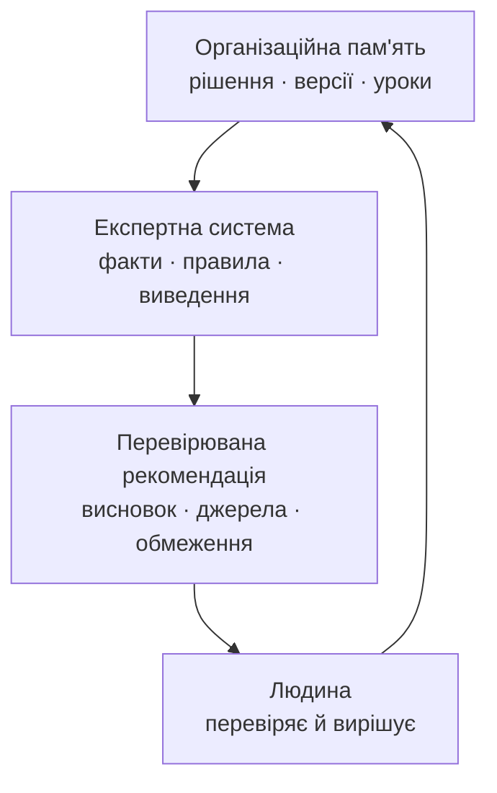

# Експертна система, доказова рекомендація ШІ і корпоративна пам'ять: три кути одного трикутника

> **Серія:** [Експертні системи для R&D](README.md) · стаття 03 із 22
>
> **Попередня стаття:** [02 — Експертні системи: від теореми Байєса до доказових рішень ШІ](02-Expert-Systems-Evolution-Evidence-UA.md)
>
> **Наступна стаття:** [04 — Прикладна математика експертних систем: від правил і ймовірностей до графів, причинності та рішень](04-Expert-Systems-Applied-Mathematics-UA.md)
>
> **Зміст серії:** [README](README.md)
>
> **Рівень:** Розробники: базовий рівень
>
> **Після статті:** відрізнити перевірювану рекомендацію від звичайної відповіді мовної моделі й скласти мінімальний запис обґрунтування.
> **Подача матеріалу:** практична архітектурна мова без нерозкритих скорочень.

Уявіть, що досвідчений інженер перейшов до іншої команди. Новачок бачить у
коді вимкнений режим роботи й запитує: «Чому його не використовують?» Пошук
повертає десяток документів. Чатбот відповідає: «Через нестабільність
зв'язку». Але хто це вирішив, для якої версії, після якого тесту і чи досі
рішення чинне — невідомо.

Цей приклад поєднує три різні потреби. **Експертна система** застосовує
перевірені знання до конкретного запитання. **Перевірювана рекомендація ШІ**
показує джерела, припущення й межі висновку. **Організаційна пам'ять** зберігає
не лише файл, а й причину рішення, його версію, наслідки та відповідального.

Перші дві статті серії пояснили, що таке експертна система і як вона працює з
правилами та невизначеністю. Третя стаття завершує початкове знайомство й
поєднує три поняття, які часто плутають у розмовах про штучний інтелект (ШІ):

- **Експертна система** — що це насправді є і чим вона не є.
- **Перевірювана рекомендація ШІ** — за яких умов вона перестає бути
  твердженням «ШІ так сказав» і стає придатним матеріалом для рішення людини.
- **Організаційна пам'ять досліджень і розробки (Research and Development,
  R&D)** — те, без чого перші дві теми залишаються теорією.

Це три кути одного трикутника: експертна система потребує пам'яті; пам'ять
цінна, коли з неї можна отримати придатні до перевірки відомості; рекомендація
має вагу, коли спирається на джерела й правила, а не лише на переконливий текст.



**Навіщо це читати.** Якщо ви відповідаєте за випуск програми, безпеку,
відповідність вимогам або передачу проєкту іншій команді, стаття дає прості
критерії: як відрізнити підтримку рішень від зручного інтерфейсу, коли
рекомендацію ШІ можна долучити до матеріалів рішення і чому чатбот над
документацією ще не утворює надійну пам'ять.

Короткий словник для подальшого читання:

| Термін | Просте пояснення |
|---|---|
| Велика мовна модель (Large Language Model, LLM) | програма, що опрацьовує й створює текст; вона може бути частиною експертної системи, але не замінює її |
| Первинний доказ | безпосередній результат вимірювання, тесту, затверджена вимога або інший запис із відомим походженням |
| Похідний аналітичний запис | висновок, створений на основі первинних доказів; його можна перевірити, але він не замінює джерела |
| Простежуваність | можливість пройти від висновку до правил, фактів, версій і першоджерел |
| Організаційна пам'ять | здатність команди зберігати, знаходити, перевіряти й повторно застосовувати знання про рішення та досвід |

## Експертна система не дорівнює чатботу

Після кількох років ажіотажу навколо великих мовних моделей багато команд
опинилися у схожій ситуації: чат із ШІ під'єднано до документації, відповіді
звучать переконливо, але довіри для інженерних рішень не виникло. Демонстрація
вражає, а на практиці інженери перевіряють усе вручну, щойно потрібні підстави.

Проблема не в мовній моделі, а в очікуванні, що вона сама стане пам'яттю
організації, перевірником процесів і системою підтримки рішень. Це різні
завдання — і звідси починається перший кут трикутника.

### Що вміє велика мовна модель і де вона корисна

Сила великої мовної моделі — у роботі з мовою. Вона підсумовує різнорідні
документи, пояснює складне відповідно до підготовки читача, готує чернетки,
виявляє двозначності та шукає схожі за змістом фрагменти. У проєктному
середовищі це справді економить час.

Але корисність залежить від типу моделі. Розмовна модель слугує інтерфейсом і
редактором. Модель для коду допомагає з попереднім оглядом реалізації. Модель
векторного подання знаходить схожі документи, дефекти чи уроки, навіть коли
слова не збігаються. Класифікаційна модель розподіляє документи за типами або
рівнями чутливості. Локальна модель потрібна там, де дані не можна передавати
за межі організації.

В експертній системі мовна модель найкорисніша не як «мозок, що все
вирішує», а як мовний шар навколо контрольованого міркування: перетворити
запит людини на структуроване питання до бази знань, виділити можливі факти,
пояснити результат правила й підготувати чернетку обґрунтування. Остаточні
підстави залишаються в правилах, джерелах, версіях і людському рішенні.

### Що таке експертна система

Експертна система — інший клас інструментів. Її компоненти стандартні і їх варто проговорити окремо.

- **База знань (Knowledge Base, KB).** Упорядковані знання предметної області:
  правила, факти, обмеження, класифікації та приклади.
- **Робоча пам'ять (Working Memory).** Факти саме про поточну ситуацію,
  наприклад версія виробу, результати тесту й відкриті дефекти.
- **Машина виведення (Inference Engine).** Компонент, який застосовує знання
  до поточної ситуації та отримує висновок.
- **Механізм пояснення (Explanation Facility).** Засіб, що показує, які
  правила спрацювали, які факти використано й чого бракує.
- **Система здобуття знань (Knowledge Acquisition System, KAS).** Контур
  додавання, перевірки, оновлення й узгодження знань у базі.

Це класична архітектура, вона існує десятиліттями і добре працює там, де потрібні відтворювані й пояснювані висновки на основі правил, а не вільна генерація тексту.

### Чому інженерні рішення потребують доказів

У функціональній безпеці, кібербезпеці та відповідності вимогам відповідь без
джерел не має управлінської цінності. Рішення там залишають довгий слід:
обґрунтування безпеки, журнал аудиту, сертифікаційні докази, контрактні
зобов'язання. Якщо ШІ каже «випуск прийнятний» без посилань на робочі
матеріали, провалені тести й кваліфікацію постачальника, це не основа рішення,
а гіпотеза, яку ще треба перевірити.

Чатбот дає відповідь у тому ж форматі, у якому отримав запит. Експертна система показує ланцюжок міркування, конкретні правила, факти й обмеження. Чатбот це інтерфейс, а підтримка рішень це ширший клас призначення: експертна система в дорадчому режимі є його формалізованим видом, але не кожна система підтримки рішень має правила виведення і доказовий слід.

### Гібридний підхід як найреалістичніший

На практиці ці засоби варто поєднувати. Мовна модель відповідає за інтерфейс,
пояснення, роботу з документами й пошук за змістом. Експертна частина — за
знання предметної області, правила перевірки, виведення, журнал обґрунтування
та керування версіями знань.

Знання предметної області живуть на різних рівнях. Загальні для організації —
це політики якості, правила безпеки й класифікація даних. Рівень підрозділу —
практики тестування, архітектури або роботи з постачальниками. Рівень проєкту —
назви компонентів, історичні рішення, винятки й домовленості із замовником.
Система має розрізняти ці рівні, бо вони мають різну вагу, власників і строки
чинності.

Мовна модель не вдає експерта, а експертна система не вдає чат. Перша
пояснює результат зрозумілою мовою. Друга перевіряє правила, простежуваність і
наявність потрібних доказів. Саме поділ цих ролей робить поєднання корисним.

### Власники знань і життєвий цикл знань

Експертна система без знань — порожній двигун. Тому потрібні власники знань:
люди, відповідальні за певну предметну область, наприклад функціональну
безпеку, кібербезпеку або категорію компонентів. Життєвий цикл знань охоплює
додавання, перевірку, затвердження, версіювання та вилучення застарілого. Без
цього рекомендації системи швидко втрачають надійність.

### Як виміряти якість експертної системи

Якість такої системи не вимірюється природністю розмови. Потрібні інші
критерії:

- **правильність:** правила застосовуються стабільно;
- **повнота:** система помічає відсутні обов'язкові відомості;
- **пояснюваність:** користувач бачить факти, правила, припущення і прогалини;
- **супроводжуваність:** правило можна оновити, перевірити тестами й
  відтворити за номером версії;
- **відповідальність:** кожна група правил має власника знань.

Система, яка за браку даних просить уточнення, корисніша за систему, яка
завжди дає впевнену відповідь.

Для впровадження ці властивості перетворюють на перевірки: набір відомих
інженерних випадків із правильними відповідями, частку тверджень із коректними
посиланнями, частку правильних відмов за браку даних, тести правил і свіжість
джерел. Для кожної метрики фіксують початкове значення, допустиму межу та
відповідального. Формальніший підхід називають **тестуванням, оцінюванням,
перевіркою та підтвердженням (Test, Evaluation, Verification and Validation,
TEVV)**.

## Коли рекомендація ШІ стає перевірюваним входом у рішення

Перший кут окреслив межу між чатботом і експертною системою. Тепер важливо
уточнити: відповідь ШІ за замовчуванням є текстом, а не доказом. Вона може
стати перевірюваним входом у людське рішення, якщо зберігає зв'язок із
первинними доказами та умовами аналізу.

Я зіткнувся з цим під час розробки прототипу складного драйвера пристрою
(*Complex Device Driver*, CDD). Випуск охоплював понад триста програмних вимог
(*Software Requirement*, SWR), а ручна перевірка відповідності коду
затягувалася. ШІ сформував акуратну рекомендацію «ризик випуску прийнятний».
Але на питання «які саме тести провалено, які дефекти відкрито і які вимоги
підтверджені реалізацією?» повної відповіді не було. Отже, рекомендація
виглядала корисною, але ще не мала достатнього обґрунтування.

Я не відкинув ШІ — почав використовувати його інакше: задавав точніші
питання, проводив кілька кіл перевірки, вимагав посилання на вимоги, код і
тести. Тільки тоді висновки стали корисним підготовленим матеріалом для
оцінювання людиною. Цей приклад підтверджує практичний досвід автора, але не є
контрольованим науковим експериментом або універсальною оцінкою ШІ.

### Що вважається доказом в інженерії

Поняття доказу у регульованій інженерії має дуже конкретну форму. Первинний доказ — наприклад, результат тесту чи затверджена вимога — потребує простежуваного походження та цілісності:

- **джерело** — звідки походить, який інструмент, яка людина, який процес;
- **версія або незмінний ідентифікатор** — до якої версії продукту, документа чи базової версії він належить;
- **контекст** — за яких умов його отримано, які припущення й обмеження діяли;
- **власник** — хто відповідає за актуальність та інтерпретацію матеріалу.

Затвердження — це вже окремий атрибут рішення: хто і коли визнав достатній набір доказів для конкретної мети. Не кожен сирий лог або результат тесту потребує ручного погодження, але він має бути незмінно пов'язаний із запуском, версією та джерелом.

Результат тесту, запис перегляду коду, сертифікат кваліфікації постачальника,
аналіз видів і наслідків відмов (Failure Mode and Effects Analysis, FMEA),
аналіз небезпек і затверджена вимога можуть бути доказами. Текст від ШІ без
посилань на такі матеріали — ні: це похідний аналітичний запис, який тлумачить
докази, але не замінює їх.

### Коли відповідь ШІ стає придатним матеріалом для рішення

Відповідь ШІ не стає первинним доказом. Вона може бути придатним похідним
аналітичним записом для людського рішення, коли супроводжується чотирма
речами:

- **Джерела** — посилання на конкретні матеріали (REQ-1234, TST-5678,
  RSK-091, базова версія B-2026.04, CR-77), а не на «галузеві стандарти»
  загалом.
- **Версії** — прив'язка до конкретної версії продукту, базової версії й застосовного нормативного контексту; зміна залежності позначає рекомендацію як таку, що потребує повторного оцінювання.
- **Припущення** — усі неявні припущення винесені у явний список.
- **Рівень упевненості** — чесний рівень упевненості і опис того, що його знижує.

Плюс трасований ланцюжок міркування і фінальне людське рішення з власником і датою. У такій обгортці висновок ШІ перестає бути «ШІ так сказав» і стає перевірюваним входом у рішення: уповноважена людина може його прийняти, доповнити або відхилити разом із посиланнями на первинні докази.

Принцип простий: ШІ радить, але не затверджує. Правильно оформлена рекомендація може бути записом у журналі аудиту, а не самостійним джерелом істини.

### Мінімальний доказовий запис

Для базового інженерного сценарію достатньо одного короткого запису, а не «магічного» абзацу моделі:

| Поле | Що фіксуємо |
|---|---|
| Твердження або рекомендація | Що саме пропонує система і для якого рішення. |
| Первинні джерела | Ідентифікатори вимог, тестів, дефектів, ризиків і посилання на точні фрагменти. |
| Знімок контексту | Базова версія продукту, знімок корпусу знань і час отримання. |
| Правила та припущення | Версія правила або політики, застосовані припущення, прогалини й конфлікти. |
| Конфігурація ШІ | Модель, версія системної інструкції, налаштування пошуку та версії індексу або засобу впорядкування результатів. |
| Ідентифікатор аналізу | Незмінний ID або хеш вхідного пакета й відповіді. |
| Людське рішення | Хто, коли й чому прийняв, відхилив або відправив рекомендацію на додатковий перегляд. |

Такий запис відділяє доказ від його інтерпретації й дозволяє повторити або оскаржити висновок.

### Дисципліна запиту до моделі на прикладі відповідності коду

Найкраще різницю видно на аналізі відповідності коду. У проєктах із суворими вимогами ШІ просять не просто «подивитися код», а знайти дефекти, що порушують конкретні вимоги, правила кодування або стандарт. Поганий запит — «Перевір цей код на помилки». Кращий задає контракт рецензента:

```text
Ти виконуєш попередній аналіз відповідності коду вимогам безпеки й кібербезпеки.

Контекст:
- Вимога: REQ-SAFE-017, точний текст: "..."
- Правила кодування: CS-C-012, CS-C-019, точний текст правил: "..."
- Проєктний профіль перевірки: SAF-C-017 і SEC-C-011; точний текст, межа застосування та критерій приймання: "..."
- Нормативний контекст: застосовні частини ISO 26262-6 та ISO/SAE 21434 — джерело для проєктного профілю, а не самодостатнє правило.
- Базова версія: B-2026.04
- Файл коду: src/speed_monitor.c, зміна abc123

Завдання:
1. Переформулюй вимогу у перевірювані твердження.
2. Перевір код тільки проти наданих вимог, правил кодування і проєктного профілю.
3. Для кожного дефекту наведи: ID вимоги, правило кодування, проєктний профіль,
   фрагмент коду, чому це дефект, вплив, рівень упевненості (високий/середній/низький),
   припущення, відсутню інформацію, приклад коректного коду.
4. Якщо доказів недостатньо, не вигадуй дефект. Познач як "потребує перегляду людиною".
5. Не посилайся на стандарти загальними словами. Пояснюй конкретне інженерне очікування.
```

Тут важливий не стиль, а дисципліна: ШІ працює не як оракул, а як рецензент,
що показує ланцюжок доказів. Не варто просити «перевірити на ISO 26262» —
стандарт не є статичним аналізатором коду. Краще давати конкретні, схвалені
проєктні очікування: вимога безпеки повинна мати простежувану реалізацію й
перевірочні тести; пов'язаний із безпекою код має уникати невизначеної
поведінки, неініціалізованих значень і виходу за межі масиву; зовнішні дані
треба перевіряти до копіювання в пам'ять; критична для захисту дія повинна мати
явну перевірку повноважень. Ці очікування мають вести до правила кодування,
проєктного профілю чи вимоги; сам перелік не є прямим текстом ISO.

### Стабільний формат відповіді

Для практичного перегляду краще вимагати від ШІ не вільний текст, а стабільну
таблицю для кожного дефекту: ідентифікатор, зв'язок із вимогою, доказ у коді,
вплив, рівень упевненості, припущення, відсутні докази, приклад виправлення та
потрібні тести. Підтверджений дефект, можливий дефект і випадок для перегляду
людиною мають бути різними станами.

Рецензент тоді бачить не лише висновок, а й шлях до нього; аудитор — зв'язок
із вимогою, доказ у коді та людське рішення після перегляду. Поле рівня
впевненості тут критичне. ШІ може впевнено вказати на ризик переповнення
буфера, якщо бачить неперевірену довжину. Але щодо авторизації має чесно
сказати: «не бачу захисної перевірки у цьому фрагменті; якщо вона є вище за
ланцюгом викликів, надайте доказ».

### Журнал аудиту і перевірюваність

У регульованому середовищі взаємодії з ШІ, які впливали на рішення, мають бути записані. Мінімальний набір полів: хто ставив запит, який контекст був переданий моделі, які джерела вона використала, яка відповідь і рівень упевненості, яке рішення прийняла людина і чи відрізнялося воно від рекомендації ШІ, власник і дата. Без цього ШІ в регульованому контексті залишається чорною скринькою.

На рівні інтерфейсу кожна рекомендація має давати: джерела, явні припущення, рівень упевненості з поясненням, «що змінило б відповідь», власника і прив'язку до базової версії; для коду — додатково трасування, правило кодування, доказ у коді і результат рев'ю. Так ШІ перестає бути оракулом і стає одним із входів у звичайний інженерний перегляд.

## Корпоративна пам'ять R&D: те, що з'єднує перші два кути

Третій кут — найфундаментальніший: без нього і експертна система, і дисципліна ШІ-доказів лишаються паперовими. У R&D знання губляться не від браку документів — їх часто забагато, — а від браку **зв'язків**: між рішенням і вимогою, дефектом і причиною, проваленим тестом і архітектурним рішенням, старим уроком і новим проєктом.

Я часто бачу, що відповідь на технічне чи управлінське питання вже існувала в минулому проєкті: хтось аналізував подібний дефект, пояснював відхилену архітектуру, писав обхідне рішення для постачальника, проходив таке саме аудиторське зауваження. Але назви змінилися, люди перейшли в інші команди, рішення заховане в коментарях. Корпоративна пам'ять — не архів документів, а здатність організації **згадати потрібний контекст у потрібний момент** і застосувати його.

### Де живуть знання про дослідження й розробку

Знання розподілені між багатьма місцями: у коді залишаються технічні рішення й
обхідні шляхи; у задачах — дефекти та їхні причини; у запитах на злиття коду —
компроміси реалізації; на внутрішніх сторінках — пояснення архітектури; у
системах вимог — формальний задум; у звітах тестування — результати перевірок;
у нотатках до випуску — прийняті обмеження; у головах людей — неявний контекст.

Проблема в тому, що ці джерела не рівні і не пов'язані. Затверджена вимога і коментар у задачі мають різну вагу; доказ тестування і знімок екрана в презентації — не одне й те саме. Якщо система не розрізняє статус, джерело і відповідального, вона не пам'ятає, а лише зберігає текст.

### Чому пошук не розв'язує проблему

Звичайний пошук допомагає, якщо ти знаєш, що шукаєш. Але корпоративна пам'ять часто потрібна саме тоді, коли ти не знаєш правильних слів. Компонент перейменували. Дефект у минулому проєкті мав іншу назву. Постачальник змінив номер деталі. Вимогу переформулювали. Команда використовувала внутрішній жаргон, який нова команда не знає.

Пошук знаходить документи — пам'ять має знаходити **смисл**. На питання «чому
ми не використовуємо цей режим зв'язку?» система має дати не лише документ, а
рішення, відхилену альтернативу, пов'язаний дефект, результат тесту й
відповідального. Для цього потрібні зв'язки, метадані та модель предметної
області: граф знань пов'язує компонент, вимогу, дефект, тест, рішення, ризик і
урок.

### Адаптація як тест пам'яті

Найкращий тест пам'яті — адаптація новачків. Якщо новачок залежить лише від
старшого інженера, система слабка; роль досвідченого фахівця не в тому, щоб
щоразу переказувати історію з нуля. Добра пам'ять пояснює будову системи,
ключові рішення, відомі помилки, критичні компоненти, авторитетні джерела та
відповідальних людей.

Якщо все це живе тільки в людях, досвідчені інженери повторюють ті самі
пояснення, новачки відтворюють старі помилки, а знання губляться під час зміни
команди.

### Активні вивчені уроки

У багатьох організаціях «вивчені уроки» залишаються післяпроєктним ритуалом:
команда пише кілька пунктів, кладе документ у папку, і через рік хтось повторює
ту саму помилку. Активний урок з'являється саме під час нового рішення:
наприклад, запит на зміну в схожій підсистемі підтягує історичні дефекти та
перевірки, які тоді допомогли.

Для цього вивчений урок має бути структурованим: умови виникнення, проблема,
першопричина, вплив, виправна дія, межі застосування, власник і пов'язані
робочі матеріали. Не кожен урок універсальний: те, що було правильним для
однієї продуктової родини, може бути хибним для іншої.

### ШІ + граф знань + експертна система

Тут три кути нашого трикутника замикаються. ШІ може зробити пам'ять
доступнішою, але лише якщо не працює з хаотичною купою документів. Мовна
модель підсумовує й пояснює, граф знань тримає зв'язки, а експертна система
застосовує правила та показує, чому історичний випадок стосується нової задачі.

Наприклад, інженер відкриває дефект, а помічник знаходить схожі випадки:
пов'язані компоненти, причини, виправлення й тести. Правила експертної системи
додають: якщо дефект стосується безпеки, треба перевірити зачеплені вимоги та
результати їх перевірки. Керівник проєкту бачить схожі затримки, фахівець із
забезпечення якості — провали тестування, архітектор — відхилені альтернативи.

Але відповідь ШІ має бути перевірюваною (це повертає нас до другого кута): потрібні джерела, версії, рівень упевненості і припущення. Корпоративна пам'ять не має перетворюватися на «модель так згадала». Вона має показувати, що саме знайшла і чому це релевантно.

### Власник знань і центр експертизи

Корпоративна пам'ять не з'явиться сама. Хтось має визначати авторитетні
джерела, позначати застаріле, підтримувати класифікацію знань і правила
доступу. Це може бути власник знань, проєктний офіс, функція якості або центр
експертизи — назва менш важлива за відповідальність.

### Короткий місток до керування знаннями

Модель SECI Нонаки й Такеучі описує перехід між неявним і явним знанням:
**соціалізація, зовнішнє вираження, поєднання та засвоєння (Socialization,
Externalization, Combination, Internalization, SECI)**. Людина знає більше,
ніж записує, і організація втрачає це знання без способу оформити та повернути
його в практику. Девенпорт і Прусак наголошують, що знання — це досвід,
контекст і здатність діяти, а не просто дані.

Для експертної системи це практичне нагадування: база знань не дорівнює
сховищу файлів. Неявне знання експертів треба переводити в правила, приклади,
винятки й межі застосування; явне — регулярно перевіряти, а застаріле —
позначати або вилучати.

### Чутливість і межі знань

Знання про дослідження й розробку часто конфіденційні: код, звіти
постачальників, аналіз вразливостей, вимоги замовника та неопубліковані плани.
Те, що знання існує, не означає, що його мають бачити всі. Якщо чутливий
документ потрапив до пошукового індексу без належних прав, витік може статися
через знайдений фрагмент або підсумок. Тому класифікація, керування доступом і
журнали перевірки є частиною архітектури пам'яті.

### Як виміряти корпоративну пам'ять

Корпоративну пам'ять можна оцінювати практично. Скільки часу потрібно новому
інженеру, щоб зрозуміти ключові архітектурні рішення? Скільки разів команда
повторює відому помилку? Чи можна знайти причину старого дефекту без людини,
яка його розслідувала? Чи бачить керівник проєкту історичні затримки перед
плануванням схожої роботи?

Ще один показник — залежність від конкретних людей. Якщо відповідь зазвичай
звучить як «запитай Олену», організація має пам'ять окремих експертів, а не
спільну пам'ять. Корисно вимірювати, скільки попередніх рішень використано
повторно і скільки уроків змінили шаблон, контрольний список чи стратегію
тестування. Водночас зріла пам'ять повинна позначати або вилучати застаріле.

Для кожного показника корисно мати початкове значення й період вимірювання:
наприклад, медіанний час пошуку рішення для нового інженера, частку записів про
інциденти з власником і джерелом та частку застарілих записів, вилучених із
пошуку. Так пам'ять оцінюють не за розміром сховища, а за впливом на роботу.

## Як ці три складники працюють у п'яти галузях

В усіх галузях схема однакова: пам'ять зберігає перевірений досвід, експертна
система застосовує його до нового випадку, а людина отримує рекомендацію з
джерелами й межами. Відрізняються зміст знань і повноваження.

| Галузь | Що має пам'ятати система | Приклад перевірюваної рекомендації |
|---|---|---|
| Автомобільна інженерія | конфігурації, відмови, вимоги, тести й рішення про безпеку | які компоненти та перевірки зачіпає зміна; випуск затверджує відповідальний інженер |
| Авіація | затверджені конфігурації, обслуговування, події та керівництва | можлива причина несправності й послідовність перевірок; рішення приймає уповноважений фахівець |
| Медицина | дані пацієнта, настанови, протипоказання й межі застосування | можливі пояснення та потрібні додаткові дослідження; клінічне рішення залишається за медичним працівником |
| Військові й оборонні технології | походження повідомлень, стан техніки, журнали обслуговування й правила | суперечності у відомостях або потреба в технічній перевірці; командні повноваження не переходять до системи |
| Законодавство | юрисдикції, редакції норм, дати чинності, зв'язки між актами й практику застосування | норми, які можуть стосуватися ситуації, з точними джерелами; юридичний наслідок визначає компетентна особа |

## Що ми, власне, зробили цими трьома статтями

Перша стаття пояснила, хто такий експерт, що таке експертна система, які дані
вона отримує і чим експертна відповідь відрізняється від звичайного тексту.

Друга стаття показала, як правила та математичні моделі перетворюють факти й
нові спостереження на пояснюваний висновок, не змішуючи різні види
невизначеності в одне число.

Третя стаття поєднала експертну систему з пам'яттю організації та
перевірюваною рекомендацією: джерела й правила дають підстави, а остаточне
рішення залишається за відповідальною людиною.

Разом ці три тексти дають початкову карту: **знання → міркування → пояснений
висновок → рішення людини → збережений досвід**.

## Куди рухається серія далі

Вступний цикл відповів на питання «що» і «навіщо». Далі серія переходить до «з чого» і «як» — до технологічної будови експертної системи. Це інженерно щільніший блок, де менше визначень і більше конкретики, побудований за чотирма шарами:

- **Прикладна математика** — логіка і правила, робота з невизначеністю, ймовірнісне міркування, графи, планування, пошук і калібрування впевненості.
- **Інструменти** — рушії правил, графи знань, перевірка обмежень, моделі пошуку, обробка документів, локальні й хмарні моделі, механізми пояснення.
- **Архітектура** — як дані, правила, пошук, мовна модель, журнал аудиту,
  права доступу і життєвий цикл знань поєднуються в одну систему.
- **Здобуття знань (knowledge acquisition)** — як знання потрапляють у
  систему, хто їх перевіряє, як вони версіонуються і як вимірюється покриття.

## Питання до читачів

- Чи траплялося вам, що відповідь ШІ звучала переконливо, але під нею не було джерел, на які можна послатися в рішенні?
- Де у ваших проєктах відповідь без посилань на першоджерела вже точно не
  пройшла б — а де її поки що приймають мовчки?
- Як часто відповідь на питання вже існувала в минулому проєкті, але її не вдавалося швидко знайти?
- Що болючіше для вашої команди: розрив між чатом і реальними даними, відсутність зв'язків між документами чи залежність знань від конкретних людей?
- Скільки часу новому інженеру потрібно, щоб зрозуміти ключові рішення у вашому продукті, — і від чого це залежить?

## Подяка читачам

Якщо ви дочитали до цього місця — щира подяка. Цей цикл писався паралельно з
реальною інженерною роботою, а коментарі читачів допомогли зробити останню
статтю вступної групи зрозумілішою та практичнішою.

## Посилання на інших авторів і публікації

- Timothy Lebo, Satya Sahoo, Deborah McGuinness (ред.). [*PROV-O: The PROV Ontology*](https://www.w3.org/TR/prov-o/), W3C Recommendation, 2013. Формальна модель джерел, перетворень і відповідальних агентів.
- Elham Tabassi. [*Artificial Intelligence Risk Management Framework 1.0*](https://doi.org/10.6028/NIST.AI.100-1), NIST, 2023. Рамка для вимірювання та керування довіреністю AI-систем.
- Margaret Mitchell та ін. [*Model Cards for Model Reporting*](https://arxiv.org/abs/1810.03993), FAT* 2019. Шаблон фіксації заявленого призначення, оцінювання та обмежень моделі.
- Timnit Gebru та ін. [*Datasheets for Datasets*](https://doi.org/10.1145/3458723), *Communications of the ACM*, 2021. Дисципліна опису походження, складу й меж застосування даних.
- Patrick Lewis та ін. [*Retrieval-Augmented Generation for Knowledge-Intensive NLP Tasks*](https://arxiv.org/abs/2005.11401), NeurIPS, 2020. Розділяє параметричну пам'ять моделі й явну зовнішню пам'ять.
- Ikujiro Nonaka, Hirotaka Takeuchi. [*The Knowledge-Creating Company*](https://doi.org/10.1093/oso/9780195092691.001.0001), Oxford University Press, 1995. Модель SECI для переходу між неявним і явним знанням.
- Thomas H. Davenport, Laurence Prusak. [*Working Knowledge*](https://books.google.com/books/about/Working_Knowledge.html?id=-4-7vmCVG5cC), Harvard Business School Press, 1998. Практичне трактування знань як досвіду, контексту й здатності діяти.
- Etienne Wenger. [*Communities of Practice: Learning, Meaning, and Identity*](https://doi.org/10.1017/CBO9780511803932), Cambridge University Press, 1998. Роль спільнот практики у створенні й передаванні знань.
- Peter M. Senge. [*The Fifth Discipline*](https://books.google.com/books/about/The_Fifth_Discipline.html?id=bVZqAAAAMAAJ), Doubleday, 1990. Підхід до організації, що навчається.
