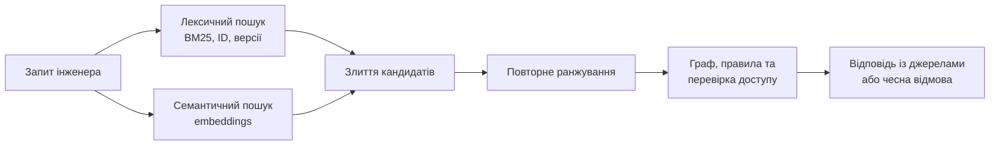

# Прикладна математика експертних систем: від правил і ймовірностей до графів, причинності та рішень

> **Серія:** [Експертні системи для R&D](README.md) · стаття 04 із 21  
> **Попередня стаття:** [03 — Експертна система, доказова рекомендація ШІ і корпоративна пам'ять: три кути одного трикутника](03-Expert-System-And-Evidence-Memory-UA.md)  
> **Наступна стаття:** [05 — Експертні системи: крок від математичного методу до обрання технологій](05-Expert-Systems-Implementation-Stack-UA.md)  
> **Зміст серії:** [README](README.md)  
> **Рівень:** Розробники: базовий+  
> **Після статті:** обрати математичний апарат під правило, невизначеність, залежність, пошук або оптимізацію.  
> **Подача матеріалу:** формула після інтуїції; кожна модель має приклад, поріг і сценарій відмови.

У попередніх статтях я підводив читача до головної тези: експертна система не дорівнює чатботу, а рекомендація штучного інтелекту стає корисною лише тоді, коли її можна зв'язати з джерелами, правилами, обмеженнями і відповідальністю. Тепер треба перейти від визначень до фундаменту: на якій математиці такі системи стоять.

Я свідомо починаю технологічну серію статей не з бібліотек і не з мовних моделей. Бібліотеки старіють, каркаси розробки змінюють назви, нові програмні інтерфейси і моделі з'являються чи не щомісяця. А прикладна математика лишається тим шаром, який пояснює, *що саме* ми робимо: виводимо наслідок із правил, оцінюємо невизначеність, шукаємо схожий випадок, перевіряємо обмеження, ранжуємо докази, плануємо дії або пояснюємо рішення.

Наша мета — не засипати читача виведеннями, які потрібні на математичному факультеті. Але формули тут будуть: короткі, після інтуїції, з поясненням кожного символу й практичною користю. Так читач може перевірити, що саме обчислює система, а не лише запам'ятати назву методу.

Якщо прибрати модні назви, сучасна експертна система відповідає на кілька важливих питань:

- що з чого випливає;
- наскільки цьому можна довіряти;
- які знання чинні саме в цьому контексті;
- які артефакти пов'язані між собою;
- що станеться, якщо змінити один елемент;
- який варіант дії кращий за кількома критеріями;
- коли система повинна не відповідати.

Кожне з цих питань має власний математичний апарат для відповідей. Саме тому експертна система не будується на одному методі. Вона є композицією логіки, теорії ймовірностей, графів, оптимізації, теорії рішень, пошуку інформації, обмежень, причинно-наслідкового аналізу і людського перегляду.

| Питання інженера | Мінімальний апарат | Який результат дає | Коли зупинитися |
|---|---|---|---|
| «Чи порушено правило?» | Логіка, правила, SHACL або SMT | Відтворюваний висновок і його підстави | Якщо бракує фактів або правило не чинне для цього контексту. |
| «Наскільки ймовірний ризик?» | Байєс, калібрування | Оцінка ризику та поріг дії | Якщо немає обґрунтованих частот або незалежності доказів. |
| «Що схоже вже траплялося?» | BM25, вектори, CBR, граф | Кандидати, джерела й зв'язки | Якщо знайдено лише схожий текст, але не підтверджено його чинність. |
| «Що зробити далі?» | Оптимізація, планування, MDP | Послідовність дій з обмеженнями | Якщо ціну помилки, винагороду або обмеження не визначено. |
| «Чому модель так відповіла?» | Трасування, XAI, контрфакти | Пояснення й умови зміни рішення | Якщо пояснення не має джерел, тесту стабільності або людського перегляду. |

Ця карта не замінює проєктування, але не дає підмінити один тип відповіді іншим: оцінку схожості — доказом, а пояснення моделі — причинним висновком.

## Логіка і правила: кістяк пояснюваності

Класичний образ експертної системи починається з правил: якщо виконуються умови, зроби висновок або дію. Це не примітивна умова `if` у коді. У нормальній системі правило має власника, версію, область застосування, пріоритет, тестові приклади і пояснення.

Правило може виглядати так: якщо вимога має рівень безпеки, змінилася після затвердженої базової версії і не має пов'язаного аналізу впливу, релізний контроль блокується. Це не рекомендація моделі, а формальний висновок із доменних умов.

У найпростішому записі продукційне правило має форму:

$$
c_1 \land c_2 \land \dots \land c_k \Rightarrow a.
$$

Тут $c_1, \dots, c_k$ — перевірювані умови, а $a$ — висновок або дія. У прикладі вище умовами є рівень безпеки, зміна після базової версії та відсутність аналізу; дією — блокування контрольної точки. Користь такого запису в тому, що кожну умову можна перевірити окремим фактом, тестом або посиланням на артефакт.

Практичне застосування: у експертній системі правило варто оформлювати як керований артефакт: умови, дія, власник, версія, область чинності, пріоритет і набір тестових прикладів. Тоді релізний блокер, перевірка повноти доказового пакета, політика доступу або аудит контрольної точки стають не прихованою умовою в коді, а пояснюваним висновком: яке правило спрацювало, на яких фактах, з яким наслідком і хто має право його змінити.

Тут важливо розрізняти два способи міркування.

**Пряме виведення** (*forward chaining*) йде від фактів до висновків. У систему приходять факти: тест впав, дефект критичний, вимога пов'язана з релізом. Рушій правил поступово виводить нові факти: реліз ризикований, потрібне погодження, контрольна точка заблокована.

**Зворотне виведення** (*backward chaining*) йде від питання назад до потрібних доказів. Користувач питає: чи можна випускати реліз? Система розкладає це питання на підпитання: чи всі критичні тести пройшли, чи всі ризики погоджені, чи немає незакритих дефектів, чи є докази.

Для читача, який давно не бачив матлогіку, це можна уявити простіше. Пряме виведення - це як сигналізація: датчики спрацювали, система сама підняла тривогу. Зворотне виведення - це як аудит: ми маємо твердження і крок за кроком шукаємо, які документи його підтримують.

## Rete, черга правил і розв'язання конфліктів: чому рушій правил не є купою if/then

Коли правил десятки, їх ще можна виконувати прямим перебором. Коли правил тисячі, а фактів мільйони, простий перебір стає дорогим і крихким. Саме тут історично з'явилися алгоритми на кшталт **Rete**, **Rete-OO** і **TREAT**. Rete запропонував Чарльз Форґі; назва походить від латинського слова "мережа". Rete-OO - це об'єктно-орієнтований варіант, а TREAT - споріднений підхід, який інакше балансує пам'ять і повторні обчислення.

Ідея Rete доступна: не перевіряти кожне правило з нуля після кожної зміни. Рушій будує мережу умов і запам'ятовує часткові збіги. Якщо змінився один факт, система перераховує тільки ту частину мережі, яку він зачіпає. Це схоже на інкрементальну збірку в програмуванні: якщо змінився один файл, не треба перекомпілювати весь світ.

У рушії правил також є **робоча пам'ять** (*working memory*) - набір поточних фактів, **черга правил** (*agenda*) - список правил, які готові спрацювати, і **розв'язання конфліктів** (*conflict resolution*) - механізм вибору, яке правило виконати першим, якщо спрацювали кілька. Пріоритети часто називають `salience`; українською це можна читати як "вага спрацьовування".

Практичне застосування: коли в робочу пам'ять постійно надходять факти з вимог, тестів, дефектів, конфігурацій і доказових пакетів, рушій не повинен переоцінювати весь набір правил після кожної події. Черга правил дає список готових спрацьовувань. `Salience` і стратегія розв'язання конфліктів *можуть* задати відтворюваний порядок, якщо рушій і правила це явно фіксують; сам термін `salience` є реалізаційною назвою, а не універсальним законом. Журнал активацій пояснює, чому одне правило виконалося раніше за інше або було відкладене.

## Підтримання істинності: як відкликати висновок, коли змінилася підстава

Один із недооцінених пластів класичних експертних систем - **системи підтримання істинності** (*Truth Maintenance Systems*, TMS). Їхні різновиди: **JTMS** (*Justification-based Truth Maintenance System*, система підтримання істинності на основі обгрунтувань) і **ATMS** (*Assumption-based Truth Maintenance System*, система підтримання істинності на основі припущень). Їхня задача проста і дуже практична: пам'ятати, які висновки залежать від яких припущень.

Приклад. Система зробила висновок: "реліз готовий". Цей висновок залежить від фактів: усі критичні дефекти закриті, тести пройшли, дозвіл на виняток погоджений, перегляд впливу на безпеку завершено. Якщо через день дозвіл на виняток відкликали, система має не просто додати новий факт. Вона має відкликати висновок "реліз готовий" або позначити його як такий, що потребує повторного перегляду.

JTMS працює з обґрунтуваннями окремих тверджень. ATMS тримає множини припущень і може показати, за яких комбінацій висновок **обґрунтований**. Це не математичний доказ істини про світ, а керування тим, які припущення наразі підтримують висновок. Для досліджень і розробки це дуже близько до трасування: рішення чинне тільки доки чинні його підстави.

Практичне застосування: кожен висновок має зберігати залежності від фактів, правил, джерел, версій доказів і припущень. Якщо джерело застаріло, правило змінилося або виняток відкликали, система може знайти всі залежні висновки, позначити їх як застарілі чи суперечливі, повторити тільки зачеплений ланцюг міркування і показати proof tree або why-not пояснення. У сучасній реалізації це часто робиться через граф залежностей, append-only журнал подій і версійні записи доказів.

## Коефіцієнти впевненості: історичний місток між правилами і впевненістю

У MYCIN, одній із найвідоміших медичних експертних систем 1970-х років, використовували **коефіцієнти впевненості** (*certainty factors*). Ідея була практичною: лікар-експерт часто не каже "це точно інфекція X". Він каже: "це схоже на X, але доказів неповно".

Коефіцієнт впевненості не є чистою ймовірністю. Це радше інженерна шкала підтримки або спростування гіпотези. Для сучасного читача це можна уявити як попередника оцінки впевненості (*confidence score*), тільки прив'язаний до правил, а не до нейромережі.

Практичне застосування: коефіцієнт впевненості можна прив'язувати до спрацювання правила, доказового блоку або діагностичної гіпотези, щоб відрізняти "формально підтримано" від "підтримано слабко". Наприклад, високий коефіцієнт дозволяє автоматично запропонувати висновок, середній відправляє його на експертний перегляд, а низький створює запит на додаткові докази. У сучасній експертній системі я б не робив коефіцієнти впевненості єдиним апаратом невизначеності, але вони корисні як проста інженерна шкала, якщо для неї визначено пороги, власника і калібрувальні приклади.

## Ймовірність і Байєс: як оновлювати думку при появі доказів

Томас Байєс був англійським священником і математиком XVIII століття. Його цікавила задача, яку тоді називали "оберненою ймовірністю": якщо ми бачимо наслідок, що можна сказати про ймовірну причину? Саме це питання постійно виникає в інженерії: тест впав - то проблема в тесті, коді, конфігурації, середовищі чи постачальнику?

Теорема Байєса звучить страшніше, ніж працює в інженерній практиці. Вона відповідає на питання: як змінюється довіра до гіпотези, коли з'явився новий доказ.

Якщо модуль часто ламався, має складні залежності і останній тест дав аномальний результат, ймовірність ризику зростає. Якщо потім з'явився додатковий тест, який проходить на кількох конфігураціях, оцінка може знизитися. Це і є оновлення переконання.

Формула класична:

$$
P(H \mid E)=\frac{P(E \mid H)P(H)}{P(E)}.
$$

Тут $H$ — гіпотеза, $E$ — новий доказ, $P(H)$ — початкова ймовірність (*prior*), $P(E\mid H)$ — як часто такий доказ з'являється, якщо гіпотеза правдива, а $P(E)$ — загальна ймовірність побачити доказ. Результат $P(H\mid E)$ називають оновленою або апостеріорною ймовірністю (*posterior*). У дослідженнях і розробці (*Research and Development*, R&D) гіпотезою може бути «дефект пов'язаний із часовою поведінкою», «постачальник ризиковий», «реліз нестабільний», «вимога неперевірна».

Чому ця формула справедлива? Достатньо згадати означення умовної ймовірності. `P(H | E)` - це частка випадків, де одночасно істинні `H` і `E`, серед усіх випадків, де є `E`: `P(H | E) = P(H and E) / P(E)`. Так само `P(E | H) = P(E and H) / P(H)`. Подія `H and E` та сама, що `E and H`, тому `P(H and E) = P(E | H) * P(H)`. Підставляємо це в перший вираз і отримуємо теорему Байєса.

Приклад. Нехай до аномального тесту команда вважала, що ймовірність ризикового дефекту в модулі дорівнює 20%. Якщо дефект справді є, такий тест падає у 60% випадків. Якщо дефекту немає, тест усе одно може впасти через шум середовища у 10% випадків. Загальна ймовірність падіння тесту: `0.60 * 0.20 + 0.10 * 0.80 = 0.20`. Після падіння тесту оновлена ймовірність гіпотези "дефект справді є" дорівнює `0.60 * 0.20 / 0.20 = 0.60`, тобто 60%. Тест не довів дефект, але різко підняв підозру і виправдав додаткову перевірку.

Практичне застосування: експертна система може зберігати початкову ймовірність гіпотези, оновлювати її при появі нового доказу і показувати користувачу не лише фінальний бал, а й шлях оновлення. У діагностиці це означає: падіння тесту підвищило ймовірність дефекту в модулі, незалежний прохід на іншій конфігурації її знизив, а суперечливий сигнал залишив потребу в додатковій перевірці. Інженерно важливо фіксувати `prior`, джерело доказу, припущення про надійність джерела і поріг, після якого система радить дію. Не можна двічі «помножити впевненість» за два тести, що мають спільний дефект стенду: для кількох залежних доказів потрібна спільна модель $P(E_1,E_2\mid H)$, а не припущення незалежності за замовчуванням.

## Байєсівські мережі: карта причинних підказок, а не магія

**Байєсівська мережа** (*Bayesian network*) — це орієнтований ациклічний граф: вузли є змінними, а стрілки разом із таблицями умовних ймовірностей задають, як розкладається спільна ймовірність. Для змінних $X_1,\dots,X_n$ запис такий:

$$
P(X_1,\dots,X_n)=\prod_{i=1}^{n}P\bigl(X_i\mid \operatorname{Pa}(X_i)\bigr),
$$

де $\operatorname{Pa}(X_i)$ — безпосередні «батьки» вузла $X_i$ у графі. Наприклад, складність модуля може бути входом для ймовірності дефекту, дефект — для ймовірності падіння тесту, а результати тестів — для оцінки ризику релізу. Стрілка сама по собі не доводить причинність: для причинного прочитання потрібні окрема каузальна модель і обґрунтовані припущення.

Для читача це можна уявити як схему "як пов'язані підозри". Якщо ми знаємо, що тест впав, мережа може підняти ймовірність кількох причин. Якщо додатково знаємо, що зміна була в конкретному модулі, частина причин стає менш імовірною, частина - більш.

Байєсівська мережа не замінює експерта. Вона змушує явно записати, які фактори на що впливають, і дає контрольований спосіб оновлювати оцінки.

Практичне застосування: байєсівська мережа може бути картою ризикових залежностей у домені: складність компонента, історія дефектів, стабільність постачальника, покриття тестами, якість доказів і готовність релізу. Коли з'являється новий сигнал, система поширює його по графу і показує, які гіпотези стали сильнішими або ослабли. Вибір наступної перевірки, що найбільше зменшить невизначеність, уже потребує вартості перевірки та цінності інформації — тобто моделі рішення, а не лише мережі. Таку мережу треба версіонувати разом із таблицями умовних ймовірностей і поясненням, хто їх затвердив.

## Марковські ланцюги і моделі рішень простими словами

Андрій Марков був російським математиком початку XX століття. Його цікавили послідовності залежних подій, зокрема такі, де наступний крок залежить не від усієї довгої історії, а від поточного стану. Це була відповідь на дуже практичну для ймовірнісної теорії проблему: як рахувати процеси, що розгортаються в часі, але не пам'ятають кожну дрібницю минулого.

Слово "Марков" часто лякає, але базова ідея дуже проста: майбутній стан залежить від поточного стану, а не від усієї історії. Це не завжди повна правда про реальний світ, але часто корисне наближення.

Формально марковська властивість для послідовності станів $X_t$ має вигляд:

$$
P(X_{t+1}=j\mid X_t=i,X_{t-1},\dots,X_0)=P(X_{t+1}=j\mid X_t=i)=T_{ij}.
$$

$T_{ij}$ — імовірність перейти зі стану $i$ до стану $j$ за один крок. Вона описує не «долю проєкту», а статистичну поведінку процесу за умов, подібних до тих, на яких її оцінили.

**Марковський ланцюг** можна уявити як карту переходів між станами. Наприклад, вимога може переходити зі стану "чернетка" (*draft*) у "переглянуто" (*reviewed*), потім у "затверджено" (*approved*), потім у "змінено після базової версії" (*changed after baseline*), потім назад у "переглянуто". Якщо ми знаємо частоти таких переходів, можемо оцінювати, де процес застрягає.

Практичне застосування: марковський ланцюг добре лягає на життєвий цикл артефактів: вимога переходить між `draft`, `reviewed`, `approved`, `changed after baseline`, `rework`, `verified`. Експертна система може оцінювати, де процес застрягає, який стан найімовірніший наступним і чи є поточний перехід аномальним для цього типу артефакта. Якщо важлива саме тривалість у стані, а не лише номер наступного кроку, потрібно додати часову модель — наприклад, напівмарковську або модель часу до події. Це не доказ істини, а інженерна телеметрія процесу для раннього попередження.

**Прихована марковська модель** (*Hidden Markov Model*, HMM) додає прихований стан. Ми не бачимо реальну причину прямо, але бачимо симптоми. Наприклад, прихований стан проекту - "здоровий", "нестабільний", "передкризовий". Видимі сигнали - зростання дефектів, падіння тестів, затримки перегляду. HMM допомагає оцінити прихований стан за видимими подіями.

Практичне застосування: прихований стан може описувати не видиму подію, а режим роботи домену: здоровий, нестабільний, деградований, передкризовий. Видимими сигналами стають повторні невідповіді, падіння перевірок, зростання незакритих прогалин, прострочені перегляди, дрейф калібрування або конфліктні джерела. Якщо ймовірність прихованого деградованого стану переходить поріг, система не просто малює графік, а радить дію: зібрати докази, запустити повторну перевірку, обмежити відповідь або запросити експерта.

**Марковський процес ухвалення рішень** (*Markov Decision Process*, MDP) додає дії, модель переходів і винагороду. Система не просто прогнозує, а вибирає дію: запустити додатковий тест, ескалювати ризик, відкласти реліз, запросити експерта. Його цінність за політики $\pi$ можна записати так:

$$
V^{\pi}(s)=\mathbb{E}_{\pi}\!\left[\sum_{t=0}^{\infty}\gamma^t r_t\ \middle|\ s_0=s\right],
$$

де $s$ — поточний стан, $r_t$ — користь або вартість на кроці $t$, а $\gamma\in[0,1)$ зменшує вагу далекого майбутнього. Якщо стан повністю спостережуваний і виконується марковська властивість, це MDP. Якщо ми бачимо лише сигнали про стан, це **частково спостережуваний марковський процес ухвалення рішень** (*Partially Observable Markov Decision Process*, POMDP).

Практичне застосування: MDP-підхід корисний там, де система має вибрати наступну дію, а не тільки оцінити стан. Діями можуть бути: запустити додатковий тест, запросити джерело, поставити питання експерту, відмовитися відповідати, ескалювати ризик або дозволити проміжну рекомендацію. Для інженерної реалізації потрібні явні стани, вартість дій, очікувана користь, обмеження безпеки і журнал того, чому саме ця дія була обрана; у першій версії часто достатньо спрощеної політики, а не повного POMDP.

Якщо коротко: марковський ланцюг показує, як система ходить між станами; прихована модель (HMM) вгадує невидимий стан за симптомами; а процеси рішень (MDP і POMDP) ще й підказують, яку дію зробити далі. Решта - деталі реалізації.

## Нечітка логіка: коли межа не проходить через так/ні

Не всі інженерні твердження бінарні. Вимога може бути частково покрита. Доказ може бути достатнім для внутрішнього перегляду, але слабким для аудиту. Реліз може бути майже готовим, але мати один відкритий ризик.

Нечітку логіку розвинув Лотфі Заде у 1960-х роках. Його проблема була дуже життєвою: багато людських понять не мають різкої межі. "Високий ризик", "майже готово", "частково покрито" - це не завжди так/ні. Нечітка логіка дозволяє описувати такі стани через ступінь належності від 0 до 1. Це не "розмита відповідальність". Навпаки: це спосіб явно записати, як ми працюємо з градаціями.

Наприклад, команда може **домовитися** про функцію свіжості джерела за віком $a$ у днях:

$$
\mu_{\mathrm{fresh}}(a)=\max\!\left(0,1-\frac{a}{180}\right).
$$

Тоді новий документ має значення $1$, документ віком 90 днів — $0.5$, а після 180 днів — $0$. Це не ймовірність того, що документ правильний, і не відсоток покриття: це керована проєктна шкала, форму й межі якої затверджує власник знань.

Практичне застосування: нечітка логіка допомагає перетворити різкі пороги на керовані зони: джерело не просто "свіже" або "старе", а має ступінь свіжості; доказ не просто "достатній" або "недостатній", а має ступінь покриття. Експертна система може поєднати вхідні сигнали - кількість доказів, давність джерела, впевненість, покриття, суперечність - і отримати пояснювану оцінку готовності або пріоритет перегляду. Важливо: нечітка оцінка не повинна підміняти рішення. Вона має підсвічувати ситуацію, яку людина або правило потім затверджує.

## Демпстер-Шафер: коли важливий конфлікт між джерелами

Артур Демпстер і Гленн Шафер працювали з проблемою, де джерела не просто непевні, а ще й неповні або суперечливі. Класична ймовірність часто змушує роздати всю масу довіри між готовими гіпотезами. А в реальних доказах буває інакше: частина інформації підтримує кілька варіантів одразу, частина джерел конфліктує, частина даних узагалі мовчить.

У реальних знаннях часто є не лише невизначеність, а й конфлікт. Один документ каже, що обмеження діє для всіх варіантів продукту. Інший уточнює, що для нової апаратної ревізії воно вже не чинне. Просте середнє може приховати проблему.

Теорія Демпстера—Шафера починається з базового розподілу мас $m$ не лише на окремі гіпотези, а й на їхні множини. Для простору гіпотез $\Theta$:

$$
m:2^{\Theta}\to[0,1],\qquad \sum_{A\subseteq\Theta}m(A)=1.
$$

Так можна віддати масу не лише «причина — код» або «причина — стенд», а й множині «код **або** стенд», тобто явно зберегти незнання. З $m$ виводять підтримку (*belief*) і правдоподібність (*plausibility*); конфлікт з'являється під час комбінування двох джерел, а не є окремою довільною оцінкою.

Для двох джерел $m_1$ і $m_2$ коефіцієнт конфлікту дорівнює:

$$
K=\sum_{B\cap C=\varnothing}m_1(B)m_2(C).
$$

$K=0$ означає відсутність прямого конфлікту, а $K=1$ — повний конфлікт. Практична користь: відповідь може сказати, що твердження підтримане двома джерелами, але актуальніше третє джерело з ними несумісне, тому висновок блокується або йде на перегляд. Не слід застосовувати правило механічно: для залежних джерел (наприклад, двох звітів, що копіюють один лог) маси не є незалежними, а нормалізація за великого $K$ може приховати проблему.

## Міркування за випадками: досвід як пошуковий простір

**Міркування за випадками** (*Case-Based Reasoning*, CBR) мислить не правилами, а випадками. Коли виникає новий дефект, ризик або архітектурне рішення, система шукає схожі попередні випадки. Класичний цикл має чотири кроки: знайти схоже (*retrieve*), використати попередній досвід (*reuse*), адаптувати рішення (*revise*), зберегти новий випадок (*retain*).

Простими словами: знайди схоже, подивись що спрацювало, адаптуй до нового контексту, збережи новий досвід.

Схожість не має бути таємничим числом. Для набору ознак можна почати зі зваженої моделі:

$$
\operatorname{sim}(q,c)=\frac{\sum_{i=1}^{m}w_i\operatorname{sim}_i(q_i,c_i)}{\sum_{i=1}^{m}w_i},
$$

де $q$ — новий випадок, $c$ — історичний, $\operatorname{sim}_i$ порівнює одну ознаку, а $w_i$ показує її важливість. Наприклад, для дефекту вага спільного компонента може бути більшою за схожість формулювання задачі. Користь формули — зробити причину збігу перевірюваною; число схожості не є ймовірністю правильності рішення.

Практичне застосування: випадок у такій системі варто зберігати не як довільний текст, а як структурований запис: проблема, контекст, ознаки, рішення, результат, обмеження застосування, корисність і зворотний зв'язок. Коли з'являється новий дефект, аудиторська знахідка або архітектурна дилема, система знаходить схожі випадки, показує збіг ознак, відмінності, ризики адаптації і пропонує не готову істину, а стартовий сценарій дії. CBR особливо сильний там, де правила важко сформулювати, але є історія схожих ситуацій.

## Графи, онтології і валідація знань

Експертна система майже завжди має справу зі зв'язками: вимога перевіряється тестом, тест дав результат, результат підтверджує доказ, доказ належить базовій версії, базова версія належить релізу. Це природно моделювати графом.

Графові алгоритми дають досяжність (*reachability*), найкоротший шлях (*shortest path*), центральність (*centrality*), пошук циклів (*cycle detection*) і пошук спільнот (*community detection*). Для R&D це не абстракція. Це відповіді на питання: що зачіпає ця зміна, де розірвано трасування, який компонент є критичним вузлом, які докази залежать від застарілого документа.

Онтології додають типи і смисл: що таке вимога, тест, дефект, ризик, доказ, погодження; які зв'язки допустимі; які класи є підкласами інших. Описові логіки корисні для виведення нових типів і зв'язків. Проте в RDF/OWL відсутність трійки не означає її хибність: це модель відкритого світу. Тому правило «вимога безпеки не може бути `approved` без `verification evidence`» слід перевіряти окремою формою SHACL або валідатором із явно заданою замкненою множиною даних.

Практичне застосування: експертна система може зберігати вимоги, тести, дефекти, ризики, докази, правила, погодження і джерела як типізовані вузли та зв'язки. Тоді аналіз впливу стає запитом по графу: які рішення залежать від цього джерела, де розірване трасування, який доказ застарів, який шлях веде від вимоги до перевірки. Онтологія додає смислову модель, а SHACL-обмеження — перевірку повноти й допустимості станів до того, як вони зіпсують висновок.

Сучасне доповнення — **графові нейронні мережі** (*Graph Neural Networks*, GNN). Вони навчають подання вузла не лише з його власних ознак, а й із сусідів:

$$
h_v^{(\ell+1)}=\sigma\!\left(W_0h_v^{(\ell)}+\sum_{u\in N(v)}\frac{1}{c_{uv}}W_1h_u^{(\ell)}\right).
$$

$h_v^{(\ell)}$ — вектор вузла $v$ на шарі $\ell$, $N(v)$ — його сусіди, $W_0,W_1$ — параметри, а $\sigma$ — нелінійне перетворення. Користь: можна пріоритизувати ділянки графа для ручної перевірки, наприклад вимоги поруч із історично проблемними компонентами. Межа: GNN не встановлює причинність і не замінює трасування — кожну підказку потрібно повернути до конкретних вузлів, ребер і джерел.

## Багатокритеріальний вибір: коли правильна відповідь залежить від ваг

У R&D часто немає одного критерію. Вибір архітектури залежить від вартості, ризику, часу, супроводжуваності, продуктивності, безпеки, залежності від постачальника. Багатокритеріальний аналіз рішень робить ці критерії явними.

Найпростіший варіант - зважена сума. Більш структуровані підходи: **метод аналізу ієрархій** (*Analytic Hierarchy Process*, AHP), який популяризував Томас Сааті, для попарних порівнянь; **TOPSIS** (*Technique for Order Preference by Similarity to Ideal Solution*) для відстані до ідеального рішення; **PROMETHEE** (*Preference Ranking Organization Method for Enrichment Evaluations*) і **ELECTRE** (*ELimination Et Choix Traduisant la REalite*) для переважання, коли варіанти порівнюються не одним числом, а відношенням переваги. Усі ці методи вирішують одну людську проблему: як чесно порівнювати варіанти, коли критерії тягнуть у різні боки.

Для зваженої суми оцінка альтернативи $a$ має вигляд:

$$
S(a)=\sum_{i=1}^{m}w_i r_i(a),\qquad \sum_{i=1}^{m}w_i=1,
$$

де $r_i(a)$ — нормалізована оцінка за критерієм $i$, а $w_i$ — його явно узгоджена вага. Перевага — видно внесок кожного критерію. Ризик — модель компенсаторна: дуже низька безпека може бути штучно «перекрита» ціною або швидкістю. Для неприпустимих ризиків спочатку задають жорсткі обмеження, а вже потім ранжують допустимі варіанти.

Практичне застосування: альтернатива має оцінюватися через явні критерії, ваги, джерела оцінок, відсутні дані і чутливість результату до зміни ваг. Наприклад, система може порівняти два архітектурні варіанти або два релізні сценарії й показати не лише переможця, а й внесок кожного критерію, слабкі докази, конфліктні припущення і межу, після якої рекомендація зміниться. Головна користь не в красивій формулі, а в тому, що команда перестає ховати ваги в інтуїції.

Якщо коротко: усі ці абревіатури (AHP, TOPSIS, PROMETHEE, ELECTRE) допомагають порівнювати варіанти за кількома критеріями, але не є взаємозамінними. Вибір методу залежить від типу шкал, того, чи дозволена компенсація між критеріями, як отримано ваги, як оброблено невизначеність і чи стійкий результат до зміни ваг. Тому аналіз чутливості — не опція, а частина чесної рекомендації.

## Оптимізація, розв'язання обмежень і планування

Оптимізація відповідає на питання: як знайти найкраще рішення за обмежень. Наприклад: мінімізувати час тестування, але покрити всі високоризикові вимоги; розподілити інженерів між задачами; вибрати набір тестів для нічного запуску.

Універсальний каркас оптимізації можна записати так:

$$
\min_x f(x)\quad \text{за умов}\quad g_j(x)\leq 0\ (j=1,\dots,k),\qquad x\in\mathcal{X}.
$$

$x$ — рішення, наприклад набір тестів; $f(x)$ — те, що мінімізуємо, наприклад тривалість; $g_j$ — обмеження на бюджет, стенди, безпеку чи покриття; $\mathcal{X}$ задає допустимі значення. Користь не у «магічному оптимумі», а у відкритому списку компромісів, які система не має права порушити.

Лінійне і цілочисельне програмування добре працює з ресурсами, портфелями, розкладами. Програмування в обмеженнях (*constraint programming*) сильне там, де важливі дискретні обмеження: не можна ставити дві задачі одному стенду одночасно, тест A має йти після тесту B, експерт X доступний тільки в певні дні.

Планування в штучному інтелекті додає модель дій. **PDDL** (*Planning Domain Definition Language*, мова опису домену планування) описує стани, дії, передумови і наслідки. **HTN-планування** (*Hierarchical Task Network planning*, планування через ієрархічну мережу задач) розкладає високорівневу задачу на підзадачі. Це корисно, коли експертна система має не просто сказати "є проблема", а запропонувати послідовність дій.

Практичне застосування: планувальний шар може перетворити ціль на набір обмежень і кроків: які докази треба зібрати, які перевірки запустити, кого залучити, що не можна виконувати паралельно і який стан означає завершення. Для експертної системи це корисно в плануванні релізу, нічного набору тестів, реагування на інцидент або закриття прогалини в доказах. На практиці часто починають не з повного планувальника, а з шаблонів HTN: високорівнева задача розкладається на перевірені підзадачі з передумовами, результатами і точками контролю.

## Пошук інформації, ML і векторна математика

Експертна система має знаходити знання. Для цього потрібні BM25 (*Best Matching 25*, класична функція ранжування пошуку), TF-IDF (*Term Frequency - Inverse Document Frequency*, частота терміна з поправкою на рідкість), щільні векторні подання (*dense embeddings*), косинусна схожість (*cosine similarity*), гібридний пошук (*hybrid search*) і повторне ранжування (*reranking*). Це не «модель думає». Це математичний конвеєр, який перетворює запит на список перевірюваних кандидатів.

### Вектори, близькість і контрастне навчання

Векторне подання кодує запит або фрагмент знань як список чисел. Формально encoder із параметрами $\theta$ перетворює текст $s$ на вектор фіксованої довжини $d$:

$$
f_\theta(s)=e_s\in\mathbb{R}^{d}.
$$

$\mathbb{R}^{d}$ тут означає «простір усіх списків із $d$ дійсних чисел». Самі координати не мають людських назв на кшталт «ризик» чи «якість»; сенс з'являється у відстанях і напрямах, яких модель навчилася на даних. Це дає практичний результат: тисячі фрагментів можна порівнювати як числа, а не попарно читати вручну.

Зручна міра напрямкової близькості двох векторів $u$ і $v$ — косинусна схожість:

$$
\operatorname{cos}(u,v)=\frac{u\cdot v}{\lVert u\rVert\lVert v\rVert}.
$$

Добуток $u\cdot v=\sum_i u_i v_i$ вимірює спільний напрям, а норми $\lVert u\rVert$ і $\lVert v\rVert$ прибирають вплив довжини векторів. Значення близьке до $1$ означає близькі напрямки, але **не** істинність документа й не ймовірність його релевантності. Користь: запит «розбиття вимог безпеки» може знайти фрагмент із терміном `ASIL decomposition`, навіть якщо точні слова не збігаються.

Сучасні embedding-моделі навчають так, щоб релевантна пара «запит — фрагмент» була ближчою за нерелевантні. Типова контрастна втрата для позитивного документа $d^+$ і набору кандидатів $D$:

$$
\mathcal{L}=-\log\frac{\exp(s(q,d^+)/\tau)}{\sum_{d\in D}\exp(s(q,d)/\tau)}.
$$

$s(q,d)$ — оцінка схожості, $\tau$ — температура, що впливає на різкість вибору. Інтуїція: навчання наближає корисні пари та віддаляє конкурентів. Практична користь для R&D з'являється лише тоді, коли позитивними прикладами є справді релевантні вимоги, тести чи рішення; випадкові або застарілі пари навчать систему шукати шум.

BM25 добре ловить точні терміни, ідентифікатори, назви стандартів. Вектори добре ловлять близький зміст, навіть якщо слова різні. У регульованому інжинірингу точний пошук часто важливіший, ніж здається: `ASIL decomposition` і "розбиття вимог безпеки" можуть бути близькими, але посилання на конкретний пункт стандарту не можна замінити красивою схожістю.

Тому часто поєднують обидва сигнали:

$$
S_{\mathrm{hybrid}}(q,d)=\alpha\,\widetilde{S}_{\mathrm{BM25}}(q,d)+(1-\alpha)\,\widetilde{S}_{\mathrm{vec}}(q,d),\qquad 0\leq\alpha\leq1.
$$

Тильда означає, що оцінки попередньо приведено до сумісного масштабу. $\alpha$ не вгадують: його вибирають на відкладеному наборі реальних запитів із мітками релевантності. Навіть після цього $S_{\mathrm{hybrid}}$ — лише оцінка **ранжування**, а не ймовірність і не доказ.

Практичне застосування: під час індексації система має зберігати не лише текстовий фрагмент, а й джерело, версію, тип артефакта, ідентифікатори, класифікацію, дату чинності і зв'язки з іншими записами. Під час пошуку вона може поєднати точний BM25 для назв стандартів та ідентифікаторів, векторну схожість для близького змісту, фільтри за доменом і повторне ранжування. Результат пошуку повинен показувати, який сигнал спрацював, і лишатися кандидатом на доказ, доки його не прив'язано до конкретного висновку.

### Токени й embeddings: як текст входить у модель

Модель не бачить рядок символів безпосередньо. Токенізатор розбиває текст $s$ на послідовність елементів словника $\mathcal{V}$:

$$
\tau(s)=(t_1,t_2,\dots,t_n),\qquad t_i\in\mathcal{V}.
$$

Токен — не обов'язково слово: це може бути частина слова, знак пунктуації, пробіл або фрагмент коду. Тому одна й та сама думка українською, англійською та в ідентифікаторах коду займає різну кількість токенів. Це важливо для вартості, ліміту контексту й розбиття документів на фрагменти.

Словник з $|\mathcal{V}|$ токенів зберігає embedding-матрицю $E\in\mathbb{R}^{|\mathcal{V}|\times d}$. Рядок, який відповідає токену $t_i$, можна отримати так:

$$
e_{t_i}=\operatorname{onehot}(t_i)^\top E.
$$

$\operatorname{onehot}(t_i)$ — вектор із одиницею в позиції токена $t_i$ та нулями всюди інше; множення просто вибирає потрібний рядок із $E$. Далі модель додає позиційну інформацію $p_i$, бо без неї «тест пройшов після виправлення» і «виправлення пройшло після тесту» були б лише набором тих самих токенів:

$$
z_i=e_{t_i}+p_i.
$$

Після кількох шарів Transformer маємо контекстні вектори $h_1,\dots,h_n$. Один із простих способів зробити embedding цілого фрагмента — усереднити їх:

$$
e_{\mathrm{chunk}}=\frac{1}{n}\sum_{i=1}^{n}h_i.
$$

Реальні моделі можуть використовувати інший pooling або спеціальний токен, але принцип той самий: текст перетворюється на один вектор для швидкого пошуку. Якість такого вектора вимірюють на доменних запитах, а не припускають лише через назву моделі.

### Мовні моделі, Transformer і RAG

Велика мовна модель (*Large Language Model*, LLM) навчається передбачати наступний токен. Для послідовності $x_1,\dots,x_n$ модель задає:

$$
P(x_1,\dots,x_n)=\prod_{t=1}^{n}P(x_t\mid x_1,\dots,x_{t-1}).
$$

На кожному кроці модель спочатку створює «сирі» оцінки $a_v$ для всіх $v\in\mathcal{V}$, а `softmax` перетворює їх на ймовірності:

$$
P(x_{t+1}=v\mid x_{\leq t})=\frac{\exp(a_v)}{\sum_{u\in\mathcal{V}}\exp(a_u)}.
$$

Чисельник підсилює оцінку обраного токена, знаменник нормалізує всі варіанти так, щоб сума дорівнювала $1$. Саме звідси беруться вибір найімовірнішого продовження, випадкове семплування і параметри на кшталт temperature. Ймовірність токена говорить про перевагу моделі серед варіантів продовження, а не про правдивість речення в реальному світі.

Це пояснює її сильну сторону: генерувати зв'язний текст, узагальнювати та переформульовувати. Але сама формула не містить вимоги «відповідати лише на підставі чинних проєктних артефактів», тому LLM без зовнішнього пошуку не є базою знань і не гарантує фактичної точності.

Ключова математика Transformer — механізм уваги:

$$
\operatorname{Attention}(Q,K,V)=\operatorname{softmax}\!\left(\frac{QK^\top}{\sqrt{d_k}}\right)V.
$$

$Q$ — «що зараз шукаємо», $K$ — «за якими ознаками зіставляємо», $V$ — інформація, яку передаємо далі, а $d_k$ масштабує оцінки. Просте читання: модель зважує, на які частини контексту подивитися для наступного токена. Користь — вона може пов'язати віддалені фрагменти коду чи вимоги; межа — ваги уваги не є готовим поясненням, посиланням або причинним доказом.

**RAG** (*Retrieval-Augmented Generation*, генерація з доповненням пошуком) поєднує пошук і генерацію. Спрощена модель має вигляд:

$$
P(y\mid x)\approx\sum_{d\in D_k}p(d\mid x)\,P(y\mid x,d),
$$

де $x$ — запит, $D_k$ — $k$ знайдених фрагментів, $p(d\mid x)$ — вага фрагмента в пошуку, а $y$ — відповідь. Головна користь RAG — оновлюване зовнішнє знання та можливість показати джерела. Водночас знайдений фрагмент може бути застарілим, нерелевантним або неправильно прочитаним: потрібні фільтри за версією й доступом, повторне ранжування, цитування точного фрагмента та правило «немає достатніх джерел — не роби висновок».

## Каузальний аналіз: кореляція не є причиною

Ось типова пастка. Команда ввела нову практику код-рев'ю, і за квартал дефектів стало менше. Спокусливо записати це в перемогу процесу. Але паралельно могло статися багато іншого: прийшли сильніші інженери, задачі стали простішими, або просто змінилося те, що ми тепер вважаємо дефектом. Кореляція є, причинності може й не бути.

Класична ілюстрація з життя: влітку одночасно зростають і продажі морозива, і кількість сонячних опіків. Морозиво не обпікає шкіру - їх обох "тягне" третій фактор, спека. Якщо переплутати кореляцію з причиною, можна почати "боротися з опіками", забороняючи морозиво.

Джуда Перл, один із ключових дослідників причинності в штучному інтелекті, запропонував для цього зручну мову. Його позначення `do(X)` розділяє два дуже різні речення: «ми побачили X» і «ми самі змінили X». Спостереження — це коли ми помітили, що команди з частими рев'ю мають менше дефектів. Втручання — це коли ми свідомо ввімкнули рев'ю і поміряли, що змінилося. Друге дає пряміший шлях до причинного висновку; спостережні дані теж можуть бути корисні, але лише разом із явною каузальною моделлю та обґрунтованими припущеннями про сторонні фактори.

Практичне застосування: перед тим як радити зміну процесу, експертна система має чесно спитати себе, чи це спостереження, чи втручання. Для цього вона фіксує гіпотезу, можливі сторонні фактори (як спека в прикладі з морозивом), порівнювані групи, часові межі і якість даних. Якщо доказів для причинного висновку бракує, правильна поведінка системи — не видавати кореляцію за рекомендацію, а сказати прямо: «тут видно зв'язок; для причинного висновку потрібні контрольований експеримент, квазіексперимент або обґрунтована стратегія корекції сторонніх факторів». Більша кількість таких самих спостережень сама по собі причину не доводить.

## Пояснюваність, калібрування і контрфакти

Якщо рекомендація має пройти інженерний перегляд, система повинна пояснювати її джерела, правила й межі. Для шару машинного навчання (*Machine Learning*, ML) потрібні інструменти пояснюваності: важливість ознак (*feature importance*), **SHAP** (*SHapley Additive exPlanations*), **LIME** (*Local Interpretable Model-agnostic Explanations*) і контрфактичні пояснення (*counterfactual explanations*). Вони показують внесок ознак у конкретне передбачення, але не роблять модель істинною, не встановлюють причинність і не замінюють першоджерела.

Контрфактичне пояснення відповідає на питання: що треба змінити, щоб рішення стало іншим. Це той самий тип підказки, як "вам бракує 50 балів до схвалення кредиту". Наприклад: "реліз став би готовим, якби були закриті дефекти D-17 і D-22 та додано доказ (*evidence*) для R-41". Це дуже корисно, бо перетворює пояснення на план дій.

Калібрування відповідає на інше питання: чи відповідає заявлена впевненість реальній точності. Найпростіша аналогія - прогноз погоди. Якщо синоптик сто разів сказав "ймовірність дощу 70%", то в добре каліброваній системі дощ має піти приблизно в 70 випадках. Якщо система каже "90% впевнено", а помиляється у третині таких випадків, це не впевненість, а красиве число.

Одна з поширених перевірок — *expected calibration error* (ECE):

$$
\operatorname{ECE}=\sum_{b=1}^{B}\frac{|I_b|}{n}\left|\operatorname{acc}(I_b)-\operatorname{conf}(I_b)\right|.
$$

$I_b$ — група передбачень із близькою заявленою впевненістю, $\operatorname{acc}$ — фактична частка правильних, $\operatorname{conf}$ — середня заявлена впевненість, $n$ — кількість прикладів. Менше ECE зазвичай краще, але метрику оцінюють на відкладених даних і разом із reliability diagram; одна мала цифра не гарантує надійність у рідкісних або нових сценаріях.

Практичне застосування: для кожної машинної або гібридної рекомендації система має показувати важливі вхідні ознаки, джерела, калібровану впевненість, відомі обмеження і причину можливої відмови відповідати. Для SHAP/LIME варто також перевіряти стабільність пояснень під близькими варіантами входу та не подавати їх як причинне пояснення. Контрфактичне пояснення перетворює це на інженерний план: які докази, пороги, дефекти, припущення або перевірки треба змінити, щоб рішення стало іншим. Такі пояснення мають потрапляти не тільки в інтерфейс, а й у журнал перегляду, щоб експерт міг прийняти, відхилити або уточнити рекомендацію.

## Як вибирати апарат під задачу

Математичний метод треба вибирати не тому, що він модний, а тому, яке питання стоїть перед системою. Це як набір інструментів у майстерні: цвяхи забивають молотком, а гвинти закручують викруткою, і навпаки виходить погано. Ось проста підказка, який інструмент брати під типове питання.

- Треба перевірити жорстке правило чи політику - логіка, правила, **SMT** (*Satisfiability Modulo Theories*, перевірка виконуваності з урахуванням теорій) або Datalog.
- Треба оцінити невизначеність - ймовірнісна модель, калібрування або теорія доказів.
- Треба знайти схожий минулий випадок - CBR і метрики схожості.
- Треба знайти документ за змістом і за точним ідентифікатором — embeddings, BM25, гібридне ранжування та повторний ранжувальник.
- Треба сформулювати відповідь за чинними джерелами — RAG, але разом із фільтрами версій, цитатами й правилами відмови.
- Треба пройти ланцюг залежностей - граф.
- Треба пріоритизувати вузли або підказати пропущений зв'язок у великому графі — GNN, із поверненням до конкретних ребер і джерел.
- Треба скласти план дій - планування або оптимізація.
- Треба пояснити рішення моделі - **пояснюваний штучний інтелект** (*Explainable AI*, XAI) і контрфакти.
- Треба чесно сказати "не знаю" - калібрована відмова.

Це і є головна дисципліна прикладної математики: не один метод для всього, а правильний метод для правильного класу питань.

## Два уроки з математичного шару

### Урок 1. Оцінка без порогу не є доказом

У багатьох системах з'являється красива оцінка: ризику 0.72, впевненості 0.85, схожості 0.91. Проблема в тому, що саме по собі число 0.72 нічого не вирішує — і ці числа можуть означати зовсім різне: імовірність, ступінь нечіткої належності, бал ранжування або частку покриття. Це як термометр, який показує число, але ніхто не сказав, з якої температури вважати пацієнта хворим. Поки не визначено тип величини, що означає 0.72, хто затвердив поріг, для якого домену він чинний і що робити нижче порогу, це не доказ, а декоративне число.

Практичний висновок: кожна метрика має мати відповідального власника, поріг, умови чинності і тестові приклади. Інакше вона лише створює відчуття точності.

### Урок 2. Модель без сценарію відмови завжди говорить зайве

Найнебезпечніша експертна система - та, що завжди знаходить відповідь. Це як співробітник, який ніколи не каже "не знаю": рано чи пізно він впевнено порадить дурницю. У реальному світі джерел може бракувати, докази можуть конфліктувати, базова версія може не збігатися, а користувач може не мати доступу до потрібної частини даних.

Практичний висновок: математика відмови така сама важлива, як математика відповіді. Система має формально знати, коли повернути "бракує доказів", "джерела конфліктують", "доступ заборонено", "поза межами задачі" або "потрібен експертний перегляд". Чесне "не знаю" часто коштує дешевше за впевнену помилку.

## Висновок

Якщо з усієї статті лишити одну думку, то таку: експертну систему робить доказовою не якийсь один геніальний алгоритм, а вміння для кожного питання взяти правильний інструмент і чесно показати свою роботу. Логіка відповідає, що з чого випливає. Ймовірність і теорія доказів - наскільки цьому можна вірити. Графи - що з чим пов'язано. Оптимізація і планування - що робити далі. Причинність - чи це справді причина, чи лише збіг. А математика відмови - коли краще промовчати.

Прикладна математика тут - не академічна прикраса, а набір робочих мов, якими система описує факти, невизначеність, залежності, обмеження, рішення і відмови. Без цього велика мовна модель лишається приємним співрозмовником, але не стає системою, на висновки якої можна спертися у відповідальному рішенні.

Я навмисно показав широкий спектр — від Rete і TMS до марковських моделей, CBR, графів, оптимізації, планування, векторного пошуку, Transformer, RAG, причинності й XAI — не для того, щоб усе це впроваджувати в першій версії. А щоб у вас сформувалася карта методів: коли інженер бачить задачу, він має впізнавати її клас і тягнутися до доречного інструмента, а не забивати кожен цвях одним молотком.

**Спойлер наступної статті.** Математика сама по собі не працює в робочому середовищі. У наступній статті я перейду від методів до реалізації: які мови, рушії правил, онтологічні інструменти, векторні бази, каркаси RAG, рушії політик, конвеєри розпізнавання тексту, інструменти походження даних і платформи обслуговування моделей реально використовують для побудови сучасних експертних систем.

*Питання до читачів.* Стаття була про математичний фундамент, тож і питання спрямую туди ж - не «яку бібліотеку взяти», а «чи чесно ваша система рахує те, що показує». Згрупував їх за трьома ролями, які по-різному торкаються цієї математики: інженер будує рушій міркувань, аналітик працює з невизначеністю й причинністю, а системний аналітик відповідає за пороги, доказовість і право сказати «не знаю». Буду радий вашим відповідям і незгодам у коментарях.

Питання очима інженера рушія міркувань:

- *Спираючись на розділ про підтримання істинності (TMS):* що у ваших системах стається з висновком «реліз готовий», коли відкликали його підставу - він автоматично відкликається й переобчислюється, чи тихо лишається застарілим «ще одним фактом»?
- *Спираючись на розділ про Rete, чергу правил і розв'язання конфліктів:* коли спрацьовують кілька правил одночасно, у вас детермінований порядок (salience, журнал активацій) чи «як вийде» - і чи зможете ви потім пояснити, чому одне правило виконалося раніше за інше?

Питання очима аналітика даних і моделей невизначеності:

- *Спираючись на розділ про Байєса й оновлення переконань:* де у ваших оцінках ризику явно зафіксовані початкова ймовірність (*prior*), надійність джерела і поріг дії - чи фінальний бал з'являється «з повітря»?
- *Спираючись на розділ про каузальний аналіз («кореляція не є причиною»):* який із ваших нещодавніх висновків «процес покращив метрику» був лише спостереженням, а який - доведеним втручанням (`do(X)`) з контролем сторонніх факторів?

Питання очима системного аналітика доказовості:

- *Спираючись на Урок 1 «оцінка без порогу не є доказом»:* які з ваших красивих чисел (0.72 ризику, 0.91 схожості) мають власника, поріг і умови чинності, а які лишаються декоративними?
- *Спираючись на Урок 2 і теорію Демпстера-Шафера:* чи вміє ваша система відрізнити «бракує доказів» від «джерела конфліктують» - і чи має вона формальне право сказати «не знаю» замість упевненої помилки?

## Посилання на інших авторів і публікації

- Charles L. Forgy. [*Rete: A Fast Algorithm for the Many Pattern/Many Object Pattern Match Problem*](https://doi.org/10.1016/0004-3702(82)90020-0), *Artificial Intelligence*, 1982. Першоджерело мережі зіставлення умов продукційних правил.
- Jon Doyle. [*A Truth Maintenance System*](https://doi.org/10.1016/0004-3702(79)90008-0), *Artificial Intelligence*, 1979. Залежності переконань, перегляд припущень і пояснення.
- Judea Pearl. [*Probabilistic Reasoning in Intelligent Systems*](https://doi.org/10.1016/C2009-0-27609-4), 1988. Байєсівські мережі, умовна незалежність і імовірнісне виведення.
- Lawrence R. Rabiner. [*A Tutorial on Hidden Markov Models and Selected Applications in Speech Recognition*](https://doi.org/10.1109/5.18626), *Proceedings of the IEEE*, 1989. Базова модель HMM та її припущення.
- Martin L. Puterman. [*Markov Decision Processes: Discrete Stochastic Dynamic Programming*](https://doi.org/10.1002/9780470316887), Wiley, 1994. Формалізація станів, дій, переходів, винагород і політик.
- Lotfi A. Zadeh. [*Fuzzy Sets*](https://doi.org/10.1016/S0019-9958(65)90241-X), 1965. Формальне визначення ступеня належності.
- A. P. Dempster. [*Upper and Lower Probabilities Induced by a Multivalued Mapping*](https://doi.org/10.1214/aoms/1177698950), 1967. Верхні й нижні ймовірності для множинних відображень.
- Glenn Shafer. [*A Mathematical Theory of Evidence*](https://doi.org/10.1515/9780691214696), Princeton University Press, 1976. Базові маси, belief/plausibility та правило комбінування.
- Agnar Aamodt, Enric Plaza. [*Case-Based Reasoning: Foundational Issues, Methodological Variations, and System Approaches*](https://doi.org/10.1016/0004-3702(94)00021-5), 1994. Основа для розділу про CBR.
- Thomas L. Saaty. [*The Analytic Hierarchy Process*](https://doi.org/10.1007/978-3-642-51473-6), McGraw-Hill, 1980. Попарні порівняння та узгодження ваг у AHP.
- W3C. [*Shapes Constraint Language (SHACL)*](https://www.w3.org/TR/shacl/), 2017. Формальна перевірка обмежень у графі знань.
- Stephen E. Robertson, Hugo Zaragoza. [*The Probabilistic Relevance Framework: BM25 and Beyond*](https://doi.org/10.1561/1500000019), *Foundations and Trends in Information Retrieval*, 2009. Теоретична основа BM25.
- Judea Pearl. [*Causality: Models, Reasoning, and Inference*](https://bayes.cs.ucla.edu/BOOK-2K/), Cambridge University Press, 2009. Каузальні моделі та інтервенції `do(·)`.
- Ashish Vaswani та ін. [*Attention Is All You Need*](https://arxiv.org/abs/1706.03762), NeurIPS, 2017. Архітектура Transformer і масштабована dot-product увага.
- Nils Reimers, Iryna Gurevych. [*Sentence-BERT: Sentence Embeddings using Siamese BERT-Networks*](https://aclanthology.org/D19-1410/), EMNLP-IJCNLP, 2019. Embeddings для семантичної схожості й пошуку.
- Patrick Lewis та ін. [*Retrieval-Augmented Generation for Knowledge-Intensive NLP Tasks*](https://arxiv.org/abs/2005.11401), NeurIPS, 2020. Поєднання параметричної моделі з зовнішнім векторним індексом.
- Thomas N. Kipf, Max Welling. [*Semi-Supervised Classification with Graph Convolutional Networks*](https://arxiv.org/abs/1609.02907), ICLR, 2017. Навчання представлень вузлів із графової структури й ознак.
- Scott M. Lundberg, Su-In Lee. [*A Unified Approach to Interpreting Model Predictions*](https://proceedings.neurips.cc/paper_files/paper/2017/hash/8a20a8621978632d76c43dfd28b67767-Abstract.html), NeurIPS, 2017. SHAP як адитивне пояснення внеску ознак.
- Marco Tulio Ribeiro, Sameer Singh, Carlos Guestrin. [*Why Should I Trust You? Explaining the Predictions of Any Classifier*](https://doi.org/10.1145/2939672.2939778), KDD, 2016. Локальні модель-незалежні пояснення LIME.
- Chuan Guo та ін. [*On Calibration of Modern Neural Networks*](https://proceedings.mlr.press/v70/guo17a.html), ICML, 2017. Перевірка й корекція калібрування заявленої впевненості.
