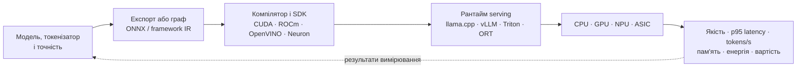

# Експертні системи: крок від математичного методу до обрання технологій

> **Серія:** [Експертні системи для R&D](README.md) · стаття 05 із 21  
> **Попередня стаття:** [04 — Прикладна математика експертних систем: від правил і ймовірностей до графів, причинності та рішень](04-Expert-Systems-Applied-Mathematics-UA.md)  
> **Наступна стаття:** [06 — Архітектура експертної системи: від знання до доказового рішення](06-Expert-Systems-Architecture-UA.md)  
> **Зміст серії:** [README](README.md)  
> **Рівень:** Розробники: базовий+  
> **Після статті:** відобразити задачу та модель знань на технологічний стек і критерій вибору.  
> **Подача матеріалу:** від задачі й даних до інструменту, контракту та тесту відмови.

У попередній статті я почав із прикладної математики: логіка і правила, мережі Rete, системи підтримання істинності (*Truth Maintenance Systems*, TMS), коефіцієнти впевненості, байєсівські та марковські моделі, міркування за випадками (*Case-Based Reasoning*, CBR), графи, оптимізація, планування, причинність і пояснюваний штучний інтелект (*Explainable AI*, XAI). Це було зроблено навмисно: поки не зрозумієш, до якого математичного класу належить задача, вибір бібліотеки перетворюється на колекціонування модних назв. Тепер можна перейти до засобів реалізації - не одного "правильного" стека, бо його не існує. Сучасна експертна система різнорідна: знання живуть і в реляційній базі, і в графі, і в правилах, і у векторному індексі, і в документах, і в моделях, і в рушії політик доступу. Завдання архітектора - не знайти єдину платформу для всього, а чесно розкласти відповідальність між цими шарами.

Звідси й поділ на наступні дві статті. Ця відповідає на питання «що існує і навіщо»: які класи інструментів є і яку задачу кожен закриває. Далі йтиметься про логічну архітектуру: як шари поєднуються, хто за який клас істини відповідає і за якими контрактами підсистеми обмінюються знаннями. Тут - каталог засобів, зокрема сучасних апаратних платформ і їхніх SDK; у наступній статті - їхня композиція в архітектуру. Питання фізичного розгортання — процесів, пам'яті, топології, тепла й живлення — вимагатимуть окремого розгляду, але вибір прискорювача неможливо зробити без розуміння його програмного стеку вже тут.

Я свідомо тримаю зв'язок із попередньою статтею: кожен клас інструментів тут закриває конкретний математичний клас задач звідти - рушії правил виконують логіку і Rete, графові бази матеріалізують графовий аналіз, векторні сховища дають пошук за схожістю, рушії політик - формальні обмеження доступу. Тому до кожного інструмента я ставлю одне питання: *яку задачу експертної системи він реально закриває - і якій математиці відповідає?* Список нижче великий, і спокуса "взяти все" велика, але інструмент сам по собі не робить систему експертною і доказовою - він лише дає місце, де відповідна математика працює під контролем версій, доступу та аудиту. Тому я групую засоби за класами задач, а не за модними назвами.

Ще один спосіб читати цю статтю - як історію того, як інженерія підлаштовувалася під форму задачі. Коли треба було надійно рахувати "так/ні", з'явилися правила, таблиці рішень і реляційні обмеження. Коли головним стали зв'язки, виросли графи. Коли треба було шукати слова в мільйонах документів, з'явилися інвертовані індекси. Коли треба стало порівнювати зміст, а не лише слова, знадобилися вектори й геометрія схожості. А коли моделі перетворилися на величезні множення матриць, апаратура навчилася виконувати ці множення паралельно. Тобто еволюція технологій тут не примха ринку, а відповідь на дуже конкретну математику: логіку, графи, ймовірності, оптимізацію і лінійну алгебру.

> **Практичний досвід автора.** Вставки з такою позначкою описують рішення, які я реально застосував у конкретному проєкті, і тому є доказом експлуатаційного досвіду, а не переказом документації. Водночас це не універсальна рецептура: перед перенесенням рішення в інший контекст потрібно перевірити навантаження, дані, команду, бюджет і вимоги до відтворюваності.

## Мови програмування: сучасні універсальні мови як шари відповідальності

Перш ніж перелічувати конкретні мови, варто відповісти на просте питання: якого вони класу? Відповідь майже завжди однакова - це сучасні універсальні мови високого рівня з багатою екосистемою бібліотек і реальною кросплатформеністю. Систему знань на асемблері чи класичному BASIC сьогодні не пишуть, а історичні спеціалізовані мови штучного інтелекту - Lisp, Prolog, CLIPS - здебільшого відійшли в ніші, навчальні курси й окремі вбудовані рушії. Якщо погортати публічні репозиторії за запитом *expert system* на GitHub, картина та сама: домінують кілька універсальних мов, а не екзотика. Це не означає, що спадок мертвий: Prolog усе ще трапляється там, де природне логічне програмування, а CLIPS живе як вбудований рушій правил - але вже не як основна мова цілого продукту (до обох повернемося далі).

При виборі мови для конкретного шару важить не стільки синтаксис, скільки оточення: зрілість екосистеми, наявність готових бібліотек для математики й машинного навчання, можливість зв'язатися зі швидкими C/C++-ядрами через зовнішній інтерфейс функцій (*Foreign Function Interface*, FFI), передбачувана експлуатація і довгострокова підтримка. Окремо згадаю **Jupyter Notebook** - це не мова, а інтерактивне середовище навколо Python (та інших обчислювальних ядер), яке де-факто стало стандартним місцем для дослідження даних, прототипів моделей і відтворюваних експериментів. Тому далі я групую мови не за модою, а за тим, який шар відповідальності кожна закриває найкраще.

Python став стандартом для аналітики, прототипування, машинного навчання, обробки тексту, математичних моделей, конвеєрів пошуку з доповненням генерації (RAG) і швидких експериментів. Його сила - справді широка екосистема: NumPy, SciPy, pandas, scikit-learn, PyTorch, JAX, TensorFlow, NetworkX, PyMC, statsmodels, OR-Tools, FAISS, spaCy, Hugging Face. Практично: Python зручний для лабораторії знань, оцінювання, пошуку, класифікації, прототипів правил і пакетної обробки даних офлайн.

C і C++ лишаються фундаментом усього, що має працювати швидко й близько до заліза: високопродуктивні ядра, драйвери, embedded-системи, числові бібліотеки, рушії виконання моделей (*inference runtimes*) та інтеграція з апаратурою. Для теми цієї статті це не абстракція: саме на C/C++ написані ключові компоненти сучасного LLM-стека - **llama.cpp** і бібліотека тензорних обчислень **GGML** під ним, **whisper.cpp** для розпізнавання мовлення, обчислювальні ядра ONNX Runtime та OpenVINO. У світі експертних систем класичний рушій правил **CLIPS** (*C Language Integrated Production System*, рушій продукційних правил мовою C) написаний саме на C - і досі застосовується. Практично: C/C++ майже завжди присутні навіть тоді, коли продукт "на Python", бо найважчі бібліотеки виконуються нижче, у нативному коді.

Тут варто згадати цифрову схемотехніку, яку багато хто колись учив і майже забув. Центральний процесор (*Central Processing Unit*, CPU) - універсальний майстер: він уміє виконувати багато різних інструкцій, але не любить мільйони однакових множень одночасно. Графічний процесор (*Graphics Processing Unit*, GPU) виріс із потреби швидко малювати пікселі, а це та сама ідея: одна операція над дуже багатьма числами паралельно. Нейронний прискорювач (*Neural Processing Unit*, NPU) й тензорні блоки пішли ще далі: вони спеціалізовані під множення матриць, згортки, скалярні добутки й накопичення сум. Тобто сучасне "залізо для AI" створювали не для магії, а для дуже земної математики лінійної алгебри.

Java і JVM-світ сильні в корпоративних системах. Там живуть Drools, Camunda-подібні процеси, Apache Jena, RDF4J, багато інтеграційних платформ і серверних застосунків. Для експертних систем це історично найбагатша екосистема: **Drools** (проєкт KIE) — канонічний рушій правил на алгоритмі Rete з власною мовою правил і підтримкою DMN; **Apache Jena** і **RDF4J** — для онтологій, RDF-сховищ і логічного виведення. Практично: якщо організація вже має Java-інфраструктуру, експертна система може вирости як набір сервісів із рушієм правил і службами знань без радикальної зміни культури.

C# і .NET важливі там, де організація живе в Microsoft-екосистемі: Windows, Active Directory, Office, SharePoint, внутрішні застосунки, промислові робочі місця. Для правил тут є свої рушії: **NRules** — Rete-рушій правил для .NET, а **microsoft/RulesEngine** — відкритий рушій правил від Microsoft, де правила задаються як JSON-вирази. Практично: це хороший вибір для інтеграції експертної системи з корпоративними процесами, настільними застосунками, внутрішніми сервісами і рольовим розмежуванням доступу (*role-based access*).

Go добре підходить для сервісного ядра, конекторів, CLI, агентів, черг, мережевої взаємодії і надійних серверних компонентів. Є тут і рушії правил: **hyperjumptech/grule-rule-engine** — рушій на алгоритмі Rete із власною мовою правил GRL. Практично: Go зручний для інфраструктурного шару, де важлива простота розгортання, легка багатопотоковість і передбачувана експлуатація.

Показово, що **Ollama** — один із найпоширеніших локальних LLM-рантаймів — написаний саме на Go. Це не випадковість: горутини, низькі накладні витрати, єдиний бінарний файл без залежностей і крос-компіляція роблять Go природним вибором для системного шару AI-інфраструктури. Те саме стосується **NATS сервера** (повністю Go), **Kubernetes**, **Docker** і більшості сучасних cloud-native інструментів.

Для AI і LLM-інтеграції в Go є чималий набір бібліотек. OpenAI-сумісний клієнт, зокрема **sashabaranov/go-openai**, може бути зручним адаптером для Ollama, OpenAI, Mistral, Groq, Azure OpenAI й окремих локальних серверів. Але «OpenAI-сумісний» не означає повної взаємозамінності: перед продакшном треба контрактно перевірити точні ендпоїнти, streaming, tool calling, структуровану відповідь, embeddings, ліміти та обробку помилок. Зміна одного `BaseURL` прибирає частину адаптерного коду, а не ризик інтеграції. Для специфічних функцій Ollama (pull model, список моделей) є власний `github.com/ollama/ollama/api`. **tmc/langchaingo** — Go-порт LangChain з chains, agents, tools і vector store connectors; корисний для прототипів. **philippgille/chromem-go** — in-process векторний store без окремого сервера, добре для тестів і standalone CLI. **nlpodyssey/spago** — нативна ML-бібліотека на Go: трансформери і вкладення (*embeddings*) без Python. Для виконання моделей у форматі ONNX є **yalue/onnxruntime_go** — Go-байндінги до ONNX Runtime, що дозволяє запускати класифікатори, ембедери і малі моделі безпосередньо в Go-процесі.

Для роботи з форматами даних і парсингу Go також має сильну екосистему. **google/go-github**, **xanzy/go-gitlab** і **andygrunwald/go-jira** — поширені спільнотні клієнти до відповідних API, а не офіційні SDK усіх трьох виробників; їхню підтримку, ліцензію і відповідність конкретній версії API слід перевіряти перед вибором. **ledongthuc/pdf** — нативний парсер PDF без CGO-залежностей. **github.com/tree-sitter/go-tree-sitter** — Go-байндінги до tree-sitter для структурного парсингу коду (C/C++, Python, Go, TypeScript). **goccy/go-json**, **go-yaml/yaml**, **pelletier/go-toml**, **encoding/xml** зі стандартної бібліотеки — для різноманітних форматів конфігурацій і обміну даними.

Для веб-шару і API в Go де-факто стандарт — **gin-gonic/gin**: швидкий HTTP-роутер з проміжними обробниками (*middleware*), валідацією, групуванням маршрутів і хорошою документацією.

Практично: Go-сервіс, який підключається до Ollama через `ollama/api`, читає знання з GitLab через `go-gitlab`, парсить PDF через `ledongthuc/pdf`, індексує фрагменти у векторному сховищі і відповідає на запити через Gin — це повноцінний бекенд збирання знань і пошуку без єдиного рядка Python.

Rust потрібен там, де важливі безпека пам'яті, продуктивність, робота на краю мережі (*edge*) та embedded-пристроях, парсери, локальні агенти, обробка потоків і компоненти з високою надійністю. Прикладів із царини правил на Rust уже чимало: **gorules/zen** (Zen Engine) — рушій рішень у стилі DMN із ядром на Rust і прив'язками до C, Go, Node.js та Python; **KSD-CO/rust-rule-engine** — швидкий рушій правил із Rete, зворотним виведенням і тією ж мовою GRL, що й у grule. Поруч існує розсип невеликих навчальних реалізацій класичних експертних систем. Практично: Rust має сенс на межі системи - там, де збирання знань торкається пристроїв, телеметрії або критичних локальних компонентів.

Julia варта уваги для математичного ядра: оптимізація, диференціальні рівняння, симуляція, наукові моделі. Окремих експертних систем на Julia практично немає - це не її ніша; зате екосистема дає сильні будівельні блоки для математичного шару - наприклад, **JuMP** для математичної оптимізації та **Catlab.jl** для прикладної теорії категорій і формального подання знань. Практично: Julia рідко буває мовою для всієї системи в продакшні, але це сильний інструмент для науково-дослідницьких модулів.

TypeScript потрібен для інтерфейсів: графи простежуваності, досьє рішень, робочі місця експертів, панелі якості, черги перегляду. Але не лише інтерфейси: у світі JavaScript/TypeScript живуть і легкі рушії правил — **cachecontrol/json-rules-engine** задає правила як JSON, а **GoRules** дає візуальний редактор таблиць рішень поверх згаданого вище Zen Engine. Практично: експертна система не повинна бути тільки чатом; часто її головна цінність відкривається через хороший інженерний інтерфейс.

> **Практичний досвід автора.** Серверне ядро я свідомо звів до Go - одна універсальна мова, єдиний бінарник і проста експлуатація, тим більше що потрібні мені NATS та Ollama теж на Go, тож ядро й оточення розмовляють однією мовою буквально. Важкий чисельний шар (OpenVINO та інші бібліотеки на C/C++) викликаю з Go через cgo: формально продукт "не на C++", але без нього він би не рахував. Python відсунув туди, де він найсильніший - допоміжні скрипти й експерименти, а не рантайм; інтерфейси для інженерів винесені в окремий шар на Vue + TypeScript.

## Мови запитів: факти читаються не лише через API

SQL лишається центральною мовою доказової системи. Транзакції, схеми, зовнішні ключі, обмеження цілісності, віконні функції, рекурсивні узагальнені табличні вирази (*Common Table Expressions*, CTE), тип `JSONB`, повнотекстовий пошук, розширення `pgvector` у PostgreSQL - це реальні механізми роботи з фактами. Практично: саме SQL тримає записи погоджень, версії, базові зрізи (*baselines*), докази, журнал аудиту й результати спрацьованих правил - тобто все те, на що потім спирається висновок системи.

Cypher, Gremlin і GQL (*Graph Query Language*, новий стандарт ISO для графових запитів) потрібні для графових питань: що зачіпає зміна, який шлях від вимоги до тесту, де розрив простежуваності, які вузли критичні. Це прямий інструмент для графового аналізу з попередньої статті. Практично: графова мова дозволяє питати про зв'язки природніше, ніж з'єднання (`JOIN`) на десять таблиць у SQL.

SPARQL потрібен для RDF і онтологій - це мова запиту до тих самих семантичних графів, про які йшлося в розділі про графи й онтології попередньої статті. Практично: якщо знання інтегруються між доменами, стандартами й організаціями, SPARQL дає формальну мову запиту до семантичної моделі, а не до конкретної таблиці.

Datalog, логічні предметні мови (*Domain-Specific Languages*, DSL) і мови запиту правил корисні для політик, виведення і перевірок - це практичне продовження логіки й правил із математичного розділу. Практично: ними зручно описувати правила простежуваності, доступу, перевірки несуперечливості й похідні факти, які система виводить сама, а не отримує готовими.

> **Практичний досвід автора.** Робочим конем у мене лишається SQL: локально SQLite з FTS5/BM25, а коли векторів стало забагато - PostgreSQL із `pgvector`. Окремої графової мови на кшталт Cypher свідомо не вводив, бо граф простежуваності живе в реляційних таблицях, а обхід зв'язків написаний кодом - питань, що реально переростають SQL-`JOIN`, ще не набралося. SPARQL і RDF не використовую зовсім: семантичний шар стане виправданим лише при інтеграції знань між стандартами й організаціями, а доти це зайва формальність, що сповільнювала б розробку.

## Rule engines і decision tables

Класичні рушії правил - CLIPS, Jess, Drools, OpenRules, Easy Rules, NRules, Experta, durable_rules, json-rules-engine - закривають задачу виконання правил над фактами. Це прямий інструмент для логіки й Rete з попередньої статті. Вони різні за мовою, зрілістю і моделлю інтеграції, але ідея спільна: правило має жити не як випадковий `if` у коді, а як керований артефакт із власною версією, рецензуванням і тестами.

Практичне застосування: вхідні контролі релізу (*release gates*), перевірки відповідності вимогам, правила допуску, сортування звернень (*triage*), автоматичні блокери, перевірка повноти й маршрутизація на перегляд.

Окремо варто назвати **DMN** (*Decision Model and Notation* - нотація моделювання рішень) і **FEEL** (*Friendly Enough Expression Language* - мова виразів, якою описують логіку всередині DMN-таблиць). DMN описує рішення через таблиці рішень, діаграми вимог до рішень і формальні вирази; FEEL - це сама мова цих виразів. Практично: DMN дуже корисний там, де рішення мають бути зрозумілі не лише програмісту, а й бізнесу, відповідальному за нормативну відповідність або системному інженеру. Наприклад, матриця "який рівень перегляду потрібен для зміни" часто краще живе як DMN-таблиця, ніж як код.

> **Практичний досвід автора.** Готовий рушій я не брав, а написав власне ядро правил на Go з прямим і зворотним виведенням і чергою активацій (по суті спрощений Rete). Вирішальним був не сам рушій, а дисципліна: кожне правило - окремий артефакт із життєвим циклом *чернетка → затверджене → виведене з обігу*, версією і перевіркою коректності, а не захована в коді умова. DMN-шару й візуального редактора для доменних експертів свідомо ще немає - вони стануть виправданими, коли правила почнуть активно обговорювати люди поза командою розробки.

## Семантичний веб, онтології і машини виведення (*reasoners*)

RDF, OWL, SPARQL, SHACL, ShEx, SKOS - це не музейні технології. Це інструменти для формальної роботи зі смислом, типами і допустимими зв'язками - пряме продовження розділу про графи й онтології з попередньої статті, тільки вже у вигляді конкретних стандартів і форматів.

**RDF** (*Resource Description Framework* - модель опису ресурсів) описує знання трійками: суб'єкт, предикат, об'єкт. Практично: це зручно для інтеграції різних джерел, де одна сутність може приходити з кількох систем.

**OWL** (*Web Ontology Language* - мова онтологій вебу) додає онтологічну логіку: класи, властивості, обмеження, наслідування. Це той самий формальний шар виведення, що в попередній статті стояв поруч із логікою і правилами. Практично: OWL допомагає виводити нові факти й виявляти логічну несумісність із заявленими аксіомами. Але він працює у припущенні відкритого світу: відсутність факту не є доказом його хибності або неповноти.

**SHACL** (*Shapes Constraint Language* - мова обмежень на форму графа) і **ShEx** (*Shape Expressions* - вирази форми) потрібні для перевірки графів на коректність. Якщо OWL більше про логічні наслідки, то SHACL ближчий до практичного питання "чи має кожна вимога безпеки відповідального, метод верифікації і посилання на доказ". Практично: SHACL може бути контролем якості (*quality gate*) для графа знань.

**SKOS** (*Simple Knowledge Organization System* - проста система організації знань) потрібен для таксономій, контрольованих словників, синонімів і класифікацій. Практично: SKOS добре підходить для глосаріїв, доменних словників, зіставлення абревіатур, термінів стандартів і назв компонентів.

Інструменти: Protégé для моделювання онтологій; Apache Jena і RDF4J для JVM-стека; GraphDB, Stardog, RDFox як промислові RDF-сховища; HermiT, Pellet, ELK як OWL-машини виведення. Практично: цей стек має сенс, якщо вам потрібна формальна семантика, сумісність між системами і перевірка знань, а не просто граф для навігації.

> **Практичний досвід автора.** Цього шару в мене немає зовсім, і це свідомо: виведення фактів уже закриває власний рушій правил, а перевірки повноти й обов'язкових полів потребували б радше замкнених обмежень на кшталт SHACL, а не OWL. Повноцінна онтологія коштувала б більше, ніж дає, доки знання не інтегрують між організаціями з різними схемами. Найближчим кандидатом бачу не повний RDF, а контрольований словник у стилі SKOS - зіставлення синонімів і термінів стандартів знадобиться раніше за все інше.

## Реляційні, документні, графові, пошукові і векторні сховища

Тут варто зробити перемикання. Досі йшлося про мови - чим саме формулювати запит до фактів. Цей розділ уже про інше: про самі сховища і їхнє призначення - де які знання фізично живуть і яку задачу кожен тип бази закриває найкраще. Одна й та сама мова (наприклад, SQL) може обслуговувати кілька різних сховищ, тож далі я групую не за синтаксисом, а за роллю в системі.

Причина, чому сховищ так багато, теж не в моді. Дані мають різну математичну форму. Таблиця добре тримає факти і обмеження цілісності: хто, коли, що затвердив. Граф добре тримає досяжність і ланцюги залежностей: що з чим пов'язано. Пошуковий індекс добре тримає слова і частоти. Векторне сховище добре тримає точки в багатовимірному просторі й шукає найближчих сусідів. Часовий ряд добре тримає функцію від часу. Коли це розкласти так, вибір бази даних перестає бути питанням смаку: ви просто дивитеся, яку форму має знання.

PostgreSQL, Microsoft SQL Server, Oracle, MySQL потрібні для транзакційних фактів: хто затвердив, коли, яку версію, з яким статусом. Для експертної системи це місце, де живе доказова основа: статуси вимог і їхні базові зрізи, погодження і відхилення, журнал аудиту висновків, результати спрацьованих правил. Практичний приклад: коли система каже "реліз заблоковано", саме реляційна база має показати, який факт, якої версії і за яким правилом дав цей висновок - і витримати це під час перевірки роками згодом.

MongoDB, Couchbase та інші документні бази корисні для гнучких артефактів зі змінною структурою, які важко звести до однієї схеми. Для бази знань це, наприклад, імпортовані профілі компонентів від різних постачальників, де набір полів щоразу інший, або сирі вимоги з різних інструментів до нормалізації. Практичний приклад: листи якості від десятка вендорів, у яких немає двох однакових форматів, простіше прийняти як документи, а структуру наводити вже на етапі видобування фактів. Застереження: без схемної дисципліни документне сховище швидко стає смітником, куди складають усе підряд.

Neo4j, JanusGraph, TigerGraph, ArangoDB, Amazon Neptune потрібні там, де головна цінність - самі зв'язки. Для експертної системи це класична простежуваність: вимога → архітектурне рішення → тест → дефект → доказ. Практичний приклад: питання "що зламається, якщо змінити цю вимогу" або "які вимоги безпеки лишилися без доказу" - це обхід графа на кілька рівнів углиб, який у реляційній моделі перетворюється на десяток вкладених з'єднань, а в графі читається природно. Саме граф матеріалізує той аналіз впливу змін і ланцюги доказів, про які йшлося в математичному розділі попередньої статті.

OpenSearch, Elasticsearch, Solr і Lucene потрібні для повнотекстового пошуку, фасетної навігації, пошуку за ідентифікаторами і підсвічування збігів. Для бази знань це шар, який знаходить потрібний фрагмент документа за словами користувача, коли той не знає точної назви. Практичний приклад: інженер шукає "перегрів роз'єму при вібрації", а система має знайти відповідні пункти стандарту, звіти про дефекти й рішення, навіть якщо там ужиті інші формулювання. Важливо: пошуковий індекс дає кандидатів і ранжування, але не є джерелом транзакційної істини - знайдене ще треба зіставити з фактами.

FAISS, HNSWlib, Annoy, ScaNN, pgvector, Qdrant, Milvus, Weaviate, Pinecone потрібні для векторного (семантичного) пошуку - пошуку за змістом, а не за словами. Для експертної системи це основа етапу пошуку в RAG: знайти фрагменти знань, близькі за смислом до запиту, навіть коли немає жодного спільного слова. Практичний приклад: запит "чи можна цей компонент у медичному виробі" має підняти релевантні вимоги і кейси, описані зовсім іншою термінологією. Критичне застереження: результат вектора - це кандидат на джерело, а не доказ. Без походження даних (*provenance*), контролю доступу і зафіксованої версії ембедера векторний індекс небезпечний, бо впевнено повертає схоже замість правильного.

TimescaleDB, InfluxDB, Prometheus із мовою запитів PromQL (*Prometheus Query Language*) потрібні для часових рядів - даних, у яких головне вимір часу. Для експертної системи це не стільки про метрики самого сервера, скільки про знання, що змінюється в часі: тренд частоти дефектів по компоненту, динаміка покриття вимог тестами від релізу до релізу, деградація якості пошуку після зміни ембедера. Практичний приклад: правило "ризик зростає, якщо частота критичних дефектів у вузлі збільшується три релізи поспіль" потребує саме часового ряду, а не одного поточного значення - інакше система бачить лише зріз, а не тенденцію.

> **Практичний досвід автора.** Набір сховищ я тримаю навмисно скромним: транзакційну основу й документні артефакти веде одна реляційна база - локально SQLite, а векторний і ключовий індекс переїхали в PostgreSQL із `pgvector`, єдине авторитетне векторне сховище. Окрему графову базу, MongoDB і сховище часових рядів свідомо не заводив: граф живе в реляційних таблицях, напівструктуроване - у `JSONB`-полях, тренди - у тих самих таблицях. Кожен новий тип сховища додаю тоді, коли наявний перестає справлятися, а не "щоб було".

## Ймовірнісні, оптимізаційні і планувальні бібліотеки

Цей клас інструментів матеріалізує три математичні розділи з попередньої статті: роботу з невизначеністю, оптимізацію і планування. Об'єднує їх те, що відповідь тут не "знайти факт", а "порахувати найкраще рішення за умов".

Для ймовірнісного програмування корисні PyMC, Stan, Pyro, NumPyro, TensorFlow Probability. Для експертної системи вони потрібні там, де відповідь має чесно нести міру невпевненості, а не ховати її в одному числі. Практичний приклад: оцінка "наскільки ми впевнені, що компонент відповідає вимозі, маючи три непрямі докази і один суперечливий" - це апостеріорний розподіл, а не бінарне "так/ні". Так система може сказати "ймовірно відповідає, але доказова база слабка" замість оманливо впевненого вердикту.

Для ймовірнісних графових моделей (*probabilistic graphical models*) дивляться на pgmpy, pomegranate, hmmlearn. Це інструменти для байєсівських мереж, прихованих марковських моделей (*Hidden Markov Models*, HMM) і діагностики - тих самих, що в математичному розділі відповідали за поширення підозр причинами. Практичний приклад: один симптом - "тест періодично падає" - може мати кілька причин (дефект коду, нестабільний стенд, помилка в самому тесті); байєсівська мережа дає контрольований спосіб оновлювати ймовірність кожної причини в міру надходження нових свідчень, замість здогадок.

Для оптимізації: Google OR-Tools, SciPy optimize, CVXPY, Pyomo, JuMP, комерційні розв'язувачі на кшталт Gurobi або CPLEX. Для бази знань це задачі вибору найкращого варіанта під обмеженнями. Практичний приклад: вибрати мінімальний набір тестів, що покриває всі змінені вимоги в межах бюджету часу, - класична задача оптимізації, а не ручний відбір "на око". Так само сюди лягає планування дефіцитних ресурсів: стендів, ліцензій, людей.

Для розв'язання задач з обмеженнями (*constraint solving*): MiniZinc, Choco, OR-Tools CP-SAT, OptaPlanner/Timefold. Це випадок, коли рішення мусить одночасно задовольнити десятки жорстких правил. Практичний приклад: скласти план верифікації, де певні тести вимагають конкретного обладнання, не можуть іти паралельно, мають передумови й дедлайни, - людині вручну це майже не під силу, а розв'язувач обмежень знаходить припустимий розклад або доводить, що його немає. Окремо зазначу, що саме ці засоби я розглядаю як кандидатів для планування ієрархічної структури робіт (*Work Breakdown Structure*, WBS) у проєктній і програмній діяльності: декомпозиція робіт із залежностями, ресурсними обмеженнями і вікнами часу - це та сама задача з обмеженнями, тільки в управлінському, а не суто верифікаційному контексті.

Для планування дій штучного інтелекту (*AI planning*): інструменти на основі мови опису задач планування (*Planning Domain Definition Language*, PDDL), Fast Downward, планувальники на ієрархічних мережах задач (*Hierarchical Task Network*, HTN). Для експертної системи це шар, який перетворює діагноз на план дій. Практичний приклад: висновок "бракує доказу для вимоги безпеки" має стати послідовністю кроків - "запусти ось ці тести, збери результати, запроси погодження відповідального, онови оцінку ризику", - і саме планувальник будує таку послідовність із наявних дій і їхніх передумов.

## Пошук із доповненням генерації (RAG), оркестрація і оцінювання

Навколо **пошуку з доповненою генерацією** (*Retrieval-Augmented Generation*, RAG) виросла ціла екосистема фреймворків - найвідоміші LangChain і LlamaIndex. Вони прискорюють склеювання пошуку, шаблонів промптів та інструментів у єдиний робочий процес. Тему RAG я тут навмисно тримаю стримано: вона зараз модна й гаряча, тож важливіше не перелічити всі бібліотеки, а зафіксувати одну думку - оркестраційний фреймворк керує послідовністю викликів, але сам по собі не є джерелом доказовості, і плутати його з експертною системою не варто.

Окремий клас - інструменти оцінювання якості RAG і поведінки моделі (наприклад, Ragas чи promptfoo). Практично: вони допомагають міряти якість пошуку, обґрунтованість відповіді джерелами (*groundedness*) і частоту вигадок (*hallucination rate*). Для бази знань це не косметика: саме оцінювання відрізняє доказовий пошук від правдоподібного. Практичний приклад: новий ембедер може підняти середній бал, але водночас просісти на домені функціональної безпеки - без вимірювання по доменах цього не видно, і система почне впевнено помилятися саме там, де ціна помилки найвища.

Головне правило, яке я виніс із попередньої статті: RAG без еталонного набору (*gold set*), без походження джерел, без контролю доступу і без політики відмови (*refusal policy*, коли система чесно каже "доказів недостатньо") - це пошук із красивим інтерфейсом. RAG з оцінюванням і журналом аудиту вже може бути корисним компонентом доказової системи. Сам по собі RAG доказовості не дає - він лише доставляє контекст, а відповідальність за істинність лишається на шарах фактів, правил і політик.

> **Практичний досвід автора.** Жодного з цих фреймворків я не брав - конвеєр пошуку зібраний нативно на Go: коли ядро вже на Go, тягнути окремий Python-оркестратор заради склеювання викликів сенсу мало. Пошук гібридний (щільні вектори плюс FTS5/BM25) з переранжуванням кандидатів і обов'язковими посиланнями на джерела. Найціннішим вважаю політику відмови з кодами причин і власний інструмент перевірки якості пошуку на доменному еталонному наборі - їх усе одно довелося б робити руками.

## Обслуговування і локальне виконання моделей

ONNX Runtime, OpenVINO, TensorRT, TVM, TFLite, Core ML, DirectML потрібні для виконання моделей (*inference*) у різних середовищах. Практично: вони дозволяють запускати класифікатори, ембедери, оптичне розпізнавання тексту (*Optical Character Recognition*, OCR), розпізнавання іменованих сутностей (*Named Entity Recognition*, NER) або менші мовні моделі локально, контрольовано і швидко.

Для обслуговування великих мовних моделей важливі vLLM, llama.cpp, Ollama, Hugging Face Text Generation Inference, NVIDIA Triton Inference Server, KServe, BentoML, Ray Serve. Практично: це відповідає на питання, як саме обслуговувати модель - локально, на власному залізі (*on-prem*), у Kubernetes, на GPU чи CPU, із пакетною обробкою запитів (*batching*), з реєстром моделей і обмеженнями на затримку.

Якщо зняти маркетинг, модель під час виконання робить дуже багато простих числових кроків: множить матриці, додає вектори, нормалізує числа, рахує увагу між токенами і щоразу вибирає найімовірніше продовження. Саме тому рантайми існують не як "обгортки навколо AI", а як перекладачі між математикою моделі й конкретним залізом. Один і той самий ембедер можна запустити на CPU, GPU або NPU, але ефективність буде різною, бо схема обчислення різна: універсальна послідовність інструкцій, масовий паралелізм або спеціалізовані матричні блоки. Для доказової системи це важливо не лише через швидкість: різні рантайми, квантизації й токенізатори можуть трохи змінювати числову поведінку, а отже їх треба фіксувати як частину доказу.

Три інструменти заслуговують окремого опису, бо з'являються в будь-якій дискусії про локальне виконання великих мовних моделей.

**llama.cpp** — бібліотека і рантайм на C/C++ для виконання GGUF-моделей без Python і без обов'язкової CUDA-залежності. Конкретні бекенди (CPU-інструкції, Metal, CUDA, Vulkan та інші) залежать від зібраної версії. Квантизація зменшує вимоги до пам'яті ціною можливої зміни якості, тому формат і метод квантизації треба оцінювати на власному еталонному наборі. Це нижній рівень стеку, доречний для контрольованого локального запуску, edge-пристрою або вбудовування у власний сервіс.

**Ollama** — сервіс локального запуску моделей із CLI, REST API, Modelfile і керуванням моделями. Його власний API має `POST /api/chat`, `POST /api/generate` та `POST /api/embed`; OpenAI-сумісний шлях для embeddings — `POST /v1/embeddings`. Підтримка конкретних API і пристроїв змінюється з версією, тому інтеграцію треба звіряти з документацією та тестувати. Ollama добре підходить, коли цінність дає проста локальна експлуатація, а не максимальна щільність паралельних запитів.

**vLLM** — Python-бібліотека і сервер для serving великих моделей. PagedAttention організовує KV-cache сторінками, що за відповідного навантаження дозволяє ефективніше використовувати пам'ять і паралельно обробляти більше запитів. Це не гарантує найвищого throughput для кожної моделі: результат залежить від пристрою, точності, довжини контексту, batch/concurrency та версії рантайму. vLLM доречний для спільного GPU-сервера, керованого endpoint або пакетного виконання; перед вибором його слід порівняти з альтернативою на власному сценарії.

Практичне порівняння для R&D-контексту:

| Критерій | llama.cpp | Ollama | vLLM |
|---|---|---|---|
| Рівень абстракції | Низький: бібліотека й керований рантайм | Високий: локальний сервіс і керування моделями | Середній: server/engine для serving |
| Типова сильна сторона | Контроль артефактів, пам'яті й інтеграції | Просте локальне використання | Конкурентне GPU-serving-навантаження |
| Головний ризик | Складання й матриця бекендів | Обмеження конкретної реалізації API та моделей | Складніша експлуатація і залежність від стеку |
| API | Залежить від обраної збірки/сервера | Власний API та часткова OpenAI-сумісність | OpenAI-сумісний серверний API |
| Як обирати | Виміряти якість і пам'ять на цільовому пристрої | Виміряти простоту операцій та потрібні API | Виміряти p95 latency і tokens/s при цільовій concurrency |

Для експертної системи обслуговування моделей не є центром. Але воно критичне для відтворюваності: треба знати версію моделі й токенізатора, параметри генерації, квантизацію, рантайм, драйвер і цільове залізо — інакше той самий запит завтра може дати іншу відповідь, а доказовість розсиплеться.

> **Практичний досвід автора.** Велику генерацію я не обслуговую сам, а делегую локальному рантайму Ollama через OpenAI-сумісний інтерфейс. А ось embeddings (саме вони — гаряча точка, бо їх рахуються мільйони) я перевів на прямий шлях через OpenVINO: окремий тонкий Go-SDK обгортає рантайм OpenVINO і рахує вектори нативно в процесі експертної системи, з автоматичним вибором пристрою за принципом «спершу NPU, далі GPU, потім CPU». До цього той самий шлях ішов через ONNX Runtime; я свідомо звів усе до одного бекенда, щоб не тримати два майже однакові кодові шляхи й мати єдину, передбачувану числову поведінку. Це рішення має сенс лише після порівняння якості, затримки та відтворюваності на моїх даних; для іншої моделі чи пристрою висновок може бути іншим.

### Апаратна платформа — це контракт «модель → компілятор → рантайм → пристрій»

Не існує абстрактно «найкращого AI-заліза». GPU дає широку сумісність і гнучкість; NPU та спеціалізований ASIC можуть дати кращу енергоефективність або передбачувану затримку, але звужують матрицю моделей; CPU лишається важливим для оркестрації, ingestion і невеликих моделей. Важлива не лише карта чи чип, а весь ланцюг перетворення моделі на виконуваний граф.

Спочатку відсіюють платформи за обмеженнями, а вже потім порівнюють продуктивність.

| Клас | Коли доречний | Вирішальний критерій |
|---|---|---|
| CPU / інтегрована графіка | ingestion, правила, пошук, невеликі ембедери й локальні моделі | ОЗП, векторні інструкції, проста експлуатація |
| Робоча станція GPU | R&D, fine-tuning, інтерактивне локальне serving | VRAM, підтримка потрібного рантайму, енергетичний бюджет |
| NPU / edge accelerator | Клієнтські та крайові пристрої, приватність, обмежене живлення | Підтриманий формат моделі, стабільна затримка, SDK |
| Серверний GPU / ASIC | Навчання, масове inference, висока concurrency | Пам'ять і міжз'єднання, компілятор, ціна запиту, SRE-експлуатація |
| Хмарна спеціалізована інфраструктура | Коли потрібен масштаб без купівлі парку обладнання | Доступність регіону, ціна, перенесення моделей і даних |

### Екосистеми апаратури та ПЗ: карта вибору, а не рейтинг

У таблиці нижче названо актуальні родини апаратури та SDK. «Практична користь» означає, який експеримент або продукт варто перевірити першим, а не обіцянку швидкості. Доступність, підтримувані моделі, експортні/регіональні обмеження й ліцензії змінюються; їх перевіряють за первинною документацією на дату закупівлі.

| Екосистема | Обчислювальна родина та ПЗ | Практична користь, яку варто перевірити | Межа або ризик |
|---|---|---|---|
| [NVIDIA](https://www.nvidia.com/en-us/data-center/) | GPU Blackwell і заявлена наступна Rubin; RTX, DGX; CUDA, TensorRT, NIM | Широка матриця GPU-інструментів для training, inference і робочих станцій | Сумісність не скасовує перевірки VRAM, версій CUDA/драйвера та вартості |
| [AMD](https://www.amd.com/en/products/accelerators/instinct.html) | Instinct, Radeon AI PRO, Ryzen AI з XDNA NPU; ROCm | Альтернатива для серверного, workstation і клієнтського прискорення | Потрібно окремо перевірити підтримку конкретної моделі, ядра та ОС у ROCm |
| [Intel](https://www.intel.com/content/www/us/en/developer/tools/openvino-toolkit/overview.html) | Core Ultra NPU, Xeon, Gaudi, Arc; OpenVINO, oneAPI | Єдиний шлях від клієнтського NPU до серверного inference, зручний для OpenVINO-стека | Не ототожнювати різні лінійки пристроїв: формат моделі й backend перевіряються окремо |
| [Google Cloud](https://cloud.google.com/tpu) | TPU, Axion; JAX, XLA, TensorFlow | Хмарне навчання або inference, якщо стек уже побудований навколо XLA/JAX/TensorFlow | Це переважно хмарна пропозиція: врахувати регіон, переносимість і вартість вихідного трафіку |
| [AWS / Annapurna Labs](https://aws.amazon.com/machine-learning/trainium/) | Trainium, Inferentia, Graviton; Neuron SDK | Керований хмарний шлях для training/inference та ARM-сервісів | Потрібні профілювання в Neuron і план перенесення поза AWS |
| [Microsoft / Azure](https://learn.microsoft.com/en-us/azure/virtual-machines/maia-overview) | Maia, Cobalt; ONNX Runtime, DirectML, Azure AI | ONNX-орієнтований inference і Azure-інтеграція | Maia/Cobalt — передусім Azure-інфраструктура; не слід трактувати їх як звичайні локальні карти |
| [Meta](https://pytorch.org/executorch/) | MTIA; PyTorch, ExecuTorch, Llama infrastructure | PyTorch-розробка, mobile/edge через ExecuTorch, Llama-орієнтовані конвеєри | MTIA є переважно внутрішньою інфраструктурою Meta, а не загальним обладнанням для закупівлі |
| [Qualcomm](https://www.qualcomm.com/developer/software/qualcomm-ai-engine-direct-sdk) | Snapdragon, Hexagon NPU, AI Engine, QNN | On-device inference на мобільних та edge-пристроях | Потрібні виміри на точному SoC і перевірка QNN-конвертації моделі |
| [Apple](https://developer.apple.com/machine-learning/core-ml/) | Neural Engine, M-series; Core ML, Metal | Локальний inference в екосистемі Apple з низькими операційними накладними | Орієнтовано на платформи Apple; необхідна перевірка Core ML-конвертації та підтримки операцій |
| [Cerebras](https://www.cerebras.ai/product-system) | Wafer Scale Engine, CS systems, Cerebras Software | Великі моделі, коли цінність дає спеціалізована система й її компілятор | Спеціалізована платформа: оцінювати доступність, workflow і перенесення моделей |
| [Groq](https://groq.com/) | LPU, GroqCloud, Groq compiler/runtime | Низька та передбачувана затримка inference для підтриманих моделей | Необхідно звірити каталог моделей, API-контракт і залежність від сервісу |
| [Huawei](https://www.hiascend.com/en/) | Ascend, Kunpeng, CANN, MindSpore | Повний стек для інсталяцій, де доступна екосистема Ascend | Регіональна доступність, сумісність і вимоги комплаєнсу треба перевірити до дизайну |
| [IBM](https://www.ibm.com/power) | AIU, Power, Telum, watsonx, OpenPOWER ecosystem | Корпоративні on-prem/hybrid сценарії з акцентом на платформну інтеграцію | Різні компоненти мають різні ролі; потрібна перевірка підтримки саме вашого ML-workload |
| [Tenstorrent](https://tenstorrent.com/) | RISC-V + AI accelerators, Wormhole/Blackhole, TT-Metal | Дослідити більш низькорівневий, програмований шлях до AI-прискорювачів | Матриця моделей і maturity інструментів потребують окремого пілота |
| [SambaNova](https://sambanova.ai/) | DataScale, Reconfigurable Dataflow Unit, SambaNova Suite | Інтегрований dataflow-підхід для системного розгортання моделей | Порівнювати не лише чип, а весь workflow і операційну модель постачальника |
| [Graphcore](https://docs.graphcore.ai/) | IPU, Poplar SDK | Графово-компільований стек для IPU-досліджень і спеціалізованих навантажень | Перед пілотом перевірити поточну доступність систем, підтримку моделей і життєвий цикл SDK |
| [Cambricon](https://www.cambricon.com/) | MLU accelerators, NeuWare | Варіант для середовищ, де доступний MLU-стек | Регіональні канали постачання, документацію й сумісність слід перевірити заздалегідь |
| [SiMa.ai](https://sima.ai/) | Machine Learning System-on-Chip, Palette software | Computer vision та edge AI з поєднанням SoC і інструментів | Фокус стеку та підтримуваних моделей може не відповідати LLM-сценарію |
| [Hailo](https://hailo.ai/) | Hailo AI accelerators, Edge AI processors, HailoRT | Енергоощадний edge inference, особливо для vision | Оцінювати модельний зоопарк, конвертацію та реальну затримку на цільовій платі |
| [Synopsys](https://www.synopsys.com/designware-ip/processor-solutions/arc-npx.html) | ARC NPX NPU IP, AI accelerator IP, EDA for AI silicon | Для команд, що проєктують власний silicon або SoC, а не купують готовий сервер | Це IP та EDA-екосистема, не готова платформа розгортання моделі |

### Мінімальний протокол бенчмарку

Порівнювати платформу за одним числом на слайді небезпечно. Для кожного кандидата зафіксуйте: задачу та еталонний набір; хеш/версію моделі й токенізатора; precision і квантизацію; runtime, compiler, driver та OS; точний пристрій, пам'ять і топологію; довжину вхідного/вихідного контексту; batch і concurrency. Далі виміряйте окремо якість (наприклад, Recall@k для пошуку, точність класифікації або експертну оцінку відповіді), time-to-first-token, tokens/s під час генерації, p50/p95 затримки, пам'ять, енергію й вартість одного корисного результату. Лише такий протокол дозволяє сказати не «ця карта швидша», а «ця конфігурація виконує наш контракт якості та SLO дешевше або надійніше».

## Оптичне розпізнавання, парсинг і документне ingestion

Збирання знань (*knowledge acquisition*) часто ламається не на моделі, а на вході: PDF, скани, Word, таблиці, діаграми, листи постачальників, старі архіви. Тут є сенс використати Apache Tika для видобування тексту з різних форматів і Tesseract для розпізнавання сканів, а за потреби - хмарне розпізнавання тексту на кшталт AWS Textract або Azure Document Intelligence.

Практичне застосування: перетворити документи на придатні до пошуку фрагменти (*chunks*), зберігши структуру - таблиці, заголовки, сторінки, якорі, мову, якість розпізнавання, версію джерела. Якщо вхідний конвеєр зіпсував текст, навіть найкращий пошук знайде лише зіпсований текст.

Окремо важливі парсери коду, Markdown, експортів вимог, формату обміну вимогами **ReqIF** (*Requirements Interchange Format*), журналів і тестових звітів. Експертна система має бачити не просто "текст", а тип артефакту: вимога, тест, дефект, рішення, таблиця, код, трасування стека, вимірювання.

> **Практичний досвід автора.** Цей шар один із найбільш "вистражданих", бо саме на збиранні знань губиться найбільше якості. Конвеєр нативний на Go: він нормалізує різні формати у фрагменти зі збереженням структури й типу артефакту, а для коду використовує структурний парсинг через tree-sitter, щоб бачити функції й типи, а не рядки. Відкритий фронт - не нові парсери, а наскрізна простежуваність походження, щоб кожен фрагмент ніс посилання на джерело, версію й спосіб видобування; це більше дисципліна метаданих, ніж новий інструмент.

## Інженерні стандарти інтеграції знань

Для дослідно-конструкторської роботи (*R&D*) важливі не лише AI-інструменти. Часто знання вже живе у стандартизованих форматах, і їх є сенс приймати як є, а не переписувати вручну.

**OSLC** (*Open Services for Lifecycle Collaboration* - відкритий стандарт зв'язування артефактів життєвого циклу) допомагає пов'язувати артефакти управління життєвим циклом застосунків і виробів: вимоги, тести, зміни, дефекти. Практично: це шлях до простежуваності між інструментами без ручного копіювання.

**ReqIF** (*Requirements Interchange Format* - формат обміну вимогами) застосовують для обміну вимогами між системами і постачальниками. Практично: якщо вимоги приходять як ReqIF, їх варто імпортувати зі збереженням ідентифікаторів, атрибутів, зв'язків і базового зрізу (*baseline*).

**SysML** (*Systems Modeling Language* - мова системного моделювання) описує систему як модель. Практично: блоки, інтерфейси, стани і вимоги з такої моделі можуть стати частиною графа знань.

**FMI** (*Functional Mock-up Interface* - стандарт обміну імітаційними моделями) і підходи цифрових двійників (*digital twin*) корисні там, де доказ приходить із симуляцій. Практично: експертна система може пов'язувати вимогу не лише з тестом, а й з результатом симуляції та моделлю середовища.

Найчастіше знання доводиться витягувати не з абстрактних стандартів, а з конкретних робочих інструментів, і кожен має свій формат та спосіб експорту. Polarion ALM віддає вимоги через експорт у **ReqIF** і власний REST API, тож звідти варто брати дані зі збереженням ідентифікаторів, зв'язків і базового зрізу. Jira має REST API і вивантаження в CSV для задач, дефектів і статусів. GitLab і GitHub надають REST і GraphQL API (а також події через вебхуки) для звернень (*issues*), запитів на злиття (*merge/pull requests*), оглядів коду й конвеєрів CI/CD. Для бази знань саме ці інтерфейси - основне джерело "живих" артефактів інженерії, тож проєктувати збирання знань варто насамперед під них, а не під ідеальний стандарт.

> **Практичний досвід автора.** Стандарти я підключаю "за потребою джерела", а не списком. Найдалі просунуті вимоги: ReqIF підтримую, бо саме в ньому вони приходять із Polarion ALM, а дані з GitLab і GitHub тягну через їхні API як найжвавіше джерело артефактів. Простежуваність тримаю у власній типізованій моделі, а не через формальний OSLC; SysML і FMI поки поза обсягом - системних і симуляційних доказів у конвеєр ще не надходить.

## Оболонки експертних систем і середовища з малим обсягом коду

Історично експертні системи часто будували не з нуля, а в оболонках (*expert-system shells*): CLIPS, Jess, KEE, ART, а пізніше - платформи правил і рішень. Сучасний аналог - середовища з малим обсягом коду (*low-code*): візуальні платформи правил, редактори DMN-таблиць, редактори онтологій, рушії робочих процесів, інструменти створення і ведення політик.

Практична користь оболонок не в тому, що вони "магічно роблять штучний інтелект". Вони дають доменним експертам місце, де можна бачити і змінювати правила без переписування серверного коду. Для дослідно-конструкторської роботи це буває критично: інженер із функційної безпеки має переглядати вхідні контролі безпеки, відповідальний за нормативну відповідність - матрицю політик, відповідальний за вимоги - перевірки якості.

Ризик теж очевидний. Якщо шар із малим обсягом коду не має контролю версій, рецензування, тестів і журналу аудиту, він перетворюється на темну кімнату, де правила змінюються швидше, ніж команда встигає зрозуміти наслідки. Тому навіть "безкодові" правила в доказовій системі мають проходити той самий життєвий цикл: чернетка, рецензування, тест, затвердження, публікація, виведення з обігу.

Практичне застосування: оболонки і середовища з малим обсягом коду корисні для створення, ведення і рецензування правил, але виконання в продакшні має бути контрольованим. Інакше система стане зручною, але недоказовою.

> **Практичний досвід автора.** Готової оболонки чи платформи з малим обсягом коду (*low-code*) в мене немає - правила живуть у власному ядрі на Go, а їх створення і ведення йде через CLI та API. Життєвий цикл, перевірку коректності й «сухий прогін» я зробив дисципліною самого рушія, а не запозичив із зовнішньої оболонки. Чого ця конструкція не дає - місця, де доменний експерт поза командою міг би сам змінити правило; тримаю це питання відкритим, доки правил не стане достатньо багато для активного обговорення.

## Практична мапа 15 класів технологій

Великий список назв легко створює ілюзію, що треба взяти все. Не треба. Варто починати від питань.

Якщо проблема у правилах - рушій правил або DMN. Якщо у зв'язках - графова база або RDF. Якщо у тексті - пошуковий рушій і збирання знань. Якщо у схожості - векторний індекс. Якщо у доступі - рушій політик. Якщо у походженні даних - інструменти родоводу. Якщо у невизначеності - ймовірнісний шар. Якщо у плануванні - оптимізатор або планувальник.

Добра архітектура не та, де найбільше інструментів. Добра архітектура та, де кожен інструмент має чітку математичну і доменну причину існування.

Щоб не лишати цей огляд на рівні "ось багато назв", зведу його до практичної мапи. Це спосіб швидко зрозуміти, який клас технологій відповідає за який біль експертної системи.

**1. Рушії правил і Rete-сімейство.** Потрібні, коли рішення має бути відтворюваним і пояснюваним: вхідний контроль релізу, блокер нормативної відповідності, правило допуску, контрольний список безпеки. Практичний сигнал: якщо команда сперечається, чому щось заблоковано, правило має бути окремим артефактом, а не умовою в коді.

**2. Підтримання істинності (TMS).** Потрібне, коли висновки залежать від змінних припущень. Практичний сигнал: якщо відкликання дозволу-винятку (*waiver*) має автоматично відкликати готовність до релізу, вам потрібна логіка TMS, навіть якщо реалізована вона через граф і події.

**3. Коефіцієнти впевненості і керування певністю.** Потрібні, коли відповідь не бінарна. Практичний сигнал: якщо експерт каже "схоже, але не достатньо доказів", система має вміти зберегти цю градацію, а не перетворювати її на "так/ні".

**4. DMN і таблиці рішень.** Потрібні, коли правила мають читати і погоджувати не лише розробники. Практичний сигнал: якщо відповідальний за нормативну відповідність, керівник проєкту або системний інженер мають розуміти логіку рішення, таблиця рішень часто краща за код.

**5. Семантичний веб: RDF, OWL, SHACL, SKOS.** Потрібні, коли важлива формальна модель домену. Практичний сигнал: якщо треба перевірити, що всі вимоги безпеки мають доказ і відповідального, SHACL ближче до задачі, ніж черговий запит до моделі.

**6. Ймовірнісні графові моделі.** Потрібні для діагностики і ризиків. Практичний сигнал: якщо падіння тесту є симптомом кількох можливих причин, байєсівська мережа або прихована марковська модель (HMM) дають контрольований спосіб оновити підозри.

**7. Міркування за випадками (CBR).** Потрібне там, де минулий досвід цінніший за абстрактне правило. Практичний сигнал: якщо команда повторює ті самі помилки, варто структурувати випадки, а не писати ще один PDF із засвоєними уроками.

**8. Оптимізація і розв'язання задач з обмеженнями.** Потрібні для розкладів, ресурсів, портфелів і тестових планів. Практичний сигнал: якщо вручну складають план, який має десятки обмежень, це вже задача для розв'язувача (*solver*).

**9. Планування дій (AI planning).** Потрібне, коли система має запропонувати послідовність дій. Практичний сигнал: якщо відповідь "бракує доказів" має перетворитися на план "запусти ці тести, запроси це погодження, онови цю оцінку ризику", потрібен шар планування.

**10. Повнотекстовий і векторний пошук.** Потрібні, коли знання розкидані по документах. Практичний сигнал: якщо користувач не знає точну назву документа, але описує проблему людською мовою, потрібен гібридний пошук.

**11. Пояснюваний ШІ (XAI) і моніторинг моделей.** Потрібні, коли рішення моделі впливає на інженерний процес. Практичний сигнал: якщо оцінка ризику змінює пріоритет роботи, треба пояснити, що на неї вплинуло, і перевірити калібрування.

**12. Обслуговування моделей.** Потрібне, коли модель стає компонентом продакшну. Практичний сигнал: якщо модель має угоду про рівень обслуговування (*SLA*), політику доступу, версію і відкат, це вже не блокнот для експериментів, а сервіс.

**13. Розпізнавання тексту, парсинг і збирання знань.** Потрібні, коли джерела не є чистим текстом. Практичний сигнал: якщо знання приходить у PDF, сканах, таблицях, ReqIF або тестових звітах, збирання стає частиною доказовості.

**14. Рушії політик доступу.** Потрібні, коли є конфіденційність, межі замовника або експортні обмеження. Практичний сигнал: якщо документ не можна показати всім, то його фрагменти, вектори й зведення теж не можна показати всім.

**15. Походження, родовід даних та інженерні стандарти.** Потрібні, коли треба відтворити відповідь. Практичний сигнал: якщо аудитор питає "звідки це взялося", система має показати джерело, парсер, спосіб розбиття на фрагменти, ембедер, пошук, модель, правило і рішення політики доступу.

> **Де ці класи розгорнуті детально.** Ця стаття фокусується на класах із власними секціями вище: мови програмування, мови запитів, рушії правил і таблиці рішень (пп. 1, 4), семантичний веб (п. 5), сховища і пошук (п. 10), оптимізація і планування (пп. 8, 9), RAG, обслуговування моделей (п. 12), розпізнавання і збирання знань (п. 13), рушії політик доступу (п. 14) і походження даних (п. 15). Математичну основу решти класів - підтримання істинності (п. 2), коефіцієнти впевненості (п. 3), ймовірнісні графові моделі (п. 6), міркування за випадками (п. 7) і пояснюваний ШІ (п. 11) - я розглянув у попередній статті про прикладну математику, а їх місце в архітектурі - у наступній.

Ця мапа також показує, чому "взяти LlamaIndex плюс векторну базу" не є архітектурою експертної системи. Це закриває один або два класи задач із п'ятнадцяти. Решта все одно повернеться у вигляді доступу, походження даних, правил, життєвого циклу, оцінювання і людського перегляду.

## Три уроки технологічного шару

### Урок 1. Інструмент обирають під клас задачі, а не навпаки

Це головна теза статті: кожен інструмент тут закриває конкретний математичний клас задач із попередньої. Вибір, що починається з назви («візьмімо LlamaIndex», «поставмо Neo4j»), а не з питання «який клас задачі я закриваю», майже завжди веде до стека, де половина можливостей не потрібна, а потрібного бракує.

Практичний приклад: команда ставить графову базу, бо «у нас є зв'язки», а реально питань, що переростають SQL-`JOIN`, у неї одиниці - і виходить окремий сервіс під задачу, яку закривала б рекурсивна CTE. І навпаки: пошук «за схожістю» намагаються робити повнотекстовим індексом, бо він уже є, доки не впираються в те, що це задача векторного, а не лексичного класу.

Практичний висновок: спершу назвіть клас задачі (правила, зв'язки, схожість, невизначеність, планування), і лише тоді - інструмент. Інструмент без свого класу задачі - це мода, а не вибір.

### Урок 2. Фреймворк не компенсує відсутність моделі знань

Можна зібрати RAG на модному стеку за тиждень. Але якщо документи не мають статусів, відповідальних, базових зрізів (*baselines*) і позначок доступу, фреймворк лише швидше підніме на поверхню хаос: система впевнено відповідатиме з чернеток, прострочених версій і документів, які користувачу взагалі не можна показувати.

Практичний висновок: перед вибором оркестраційної бібліотеки треба описати доменну модель, життєвий цикл і джерела істини. Жоден фреймворк не додасть доказовості тому, що її не має на рівні даних.

### Урок 3. Інструмент треба оцінювати за тим, як він ламається

При виборі технології питання не лише «що ця бібліотека робить добре», а й «як вона поводиться, коли щось іде не так». Чи видно помилку збирання знань, чи можна відтворити той самий пошук завтра, чи зберігається версія моделі, чи поважає інструмент контроль доступу, чи можна провести аудит.

Практичний приклад: непомітно оновили модель-ембедер - середній бал пошуку навіть підріс, але вчорашня відповідь на той самий запит сьогодні не відтворюється, бо ніхто не зафіксував версію моделі. Інструмент «працював добре» на демонстрації й тихо зламав доказовість у продакшні.

Практичний висновок: у доказовій системі зріла поведінка при збоях і відтворюваність важливіші за красиву демонстрацію - і це повноцінний критерій вибору, а не другорядна деталь.

## Висновок

Технологічний стек експертної системи - це не список покупок. Це спосіб матеріалізувати прикладну математику: правила виконує рушій правил, онтології живуть у RDF/OWL, графи - у графовому сховищі, невизначеність - у ймовірнісному шарі, планування - у розв'язувачах, текст - у пошуку і збиранні знань, схожість - у векторному індексі, доступ - у рушії політик, походження даних - у шарі родоводу.

У цій логіці стає зрозуміло, чому технології розвивалися саме так. Не тому, що хтось вирішив ускладнити життя інженерам, а тому, що різні задачі мають різну форму: булева логіка просить правила, залежності просять граф, невизначеність просить ймовірність, пошук за змістом просить вектори, а великі мовні моделі просять апаратуру, здатну швидко рахувати лінійну алгебру. Коли це видно, назви інструментів перестають бути шумом: за кожною з них стоїть відповідь на питання "яку роботу ми хочемо доручити машині".

Мовна модель займає важливе, але не центральне місце. Вона допомагає працювати з мовою, узагальненням, діалогом і чернетками. Доказовість народжується в інших шарах: факти, правила, версії, джерела, зв'язки, політики і аудит.

**Спойлер наступної статті.** Ця стаття відповіла на питання «що є і навіщо» - каталог класів інструментів і їхня математика. Наступна відповідає на «як це стає системою»: не новий список засобів, а те, як зібрати вже названі шари в одну доказову архітектуру - межі відповідальності, потоки знань, контракти між підсистемами, топології, залізо й життєвий цикл. Саме там знайдуть своє місце й наскрізні властивості системи - доступ, походження даних, контракти та калібрування якості.

*Питання до читачів.* Стаття була про вибір засобів, тож і питання поставлю практичні - такі, що змушують перевірити власний стек на чесність. Згрупував їх за трьома робочими ролями, бо рішення «що взяти» кожна з них зважує своєю міркою: розробник питає «яка мова й бібліотека», інженер зі знань - «де фізично живе знання і якою мовою його питати», а аналітик - «чи лишається висновок доказовим і відтворюваним». Цікаво почути ваші відповіді в коментарях.

Питання очима розробника-практика:

- *Спираючись на розділ про мови програмування як шари відповідальності:* які шари своєї системи ви свідомо тримали б на одній універсальній мові (скажімо, Go для ядра й конекторів), а де готові викликати важкі C/C++-ядра через зовнішній інтерфейс функцій чи cgo - і де ця межа у вас уже розмилася?
- *Спираючись на «Практичний досвід автора» щодо рушія правил:* ви взяли б готовий рушій (Drools, NRules, grule) чи написали б власне ядро правил - і за яким критерієм проходить ця межа «зробити vs узяти»?

Питання очима інженера зі знань і даних:

- *Спираючись на розділ про сховища і мови запитів:* які з ваших питань насправді реляційні, які - графові, а які - векторні, і чи не закриваєте ви пошук «за схожістю» повнотекстовим індексом лише тому, що він уже є?
- *Спираючись на розділ про розпізнавання, парсинг і збирання знань:* де у вашому вхідному конвеєрі (PDF, ReqIF, експорти трекерів) найчастіше губиться якість - і чи несе кожен фрагмент посилання на джерело, версію й спосіб видобування?

Питання очима системного аналітика доказовості:

- *Спираючись на розділ про RAG і оцінювання:* чи є у вас еталонний набір (*gold set*) і політика відмови - чи RAG лишається «пошуком із красивим інтерфейсом», що впевнено відповідає з чернеток і прострочених версій?
- *Спираючись на Урок 3 «інструмент оцінюють за тим, як він ламається»:* чи відтворите ви вчорашню відповідь після тихого оновлення ембедера - і що у вас зафіксовано як частину доказу: версія моделі, токенізатор, квантизація, рантайм?

## Посилання на інших авторів і публікації

- Object Management Group. [*Decision Model and Notation (DMN)*](https://www.omg.org/dmn/). Стандарт нотації для рішень, правил і decision tables.
- W3C. [*RDF 1.1 Concepts and Abstract Syntax*](https://www.w3.org/TR/rdf11-concepts/), [*OWL 2 Web Ontology Language*](https://www.w3.org/TR/owl2-overview/) та [*SPARQL 1.1 Overview*](https://www.w3.org/TR/sparql11-overview/). Нормативна основа семантичного графа, онтологій і запитів.
- W3C. [*Shapes Constraint Language (SHACL)*](https://www.w3.org/TR/shacl/). Валідація структурних обмежень у RDF-графі.
- Patrick Lewis та ін. [*Retrieval-Augmented Generation for Knowledge-Intensive NLP Tasks*](https://arxiv.org/abs/2005.11401), NeurIPS, 2020. Базова архітектура RAG.
- Margaret Mitchell та ін. [*Model Cards for Model Reporting*](https://arxiv.org/abs/1810.03993), FAT* 2019. Контекст для розділу про реєстр моделей, оцінювання та межі використання.
- llama.cpp. [*Проєкт і документація*](https://github.com/ggml-org/llama.cpp). Первинне джерело щодо локального runtime, бекендів і форматів моделей.
- Ollama. [*API reference*](https://docs.ollama.com/api) та [*OpenAI compatibility*](https://docs.ollama.com/openai). Первинне джерело для власних API-ендпоїнтів і меж сумісності.
- Woosuk Kwon та ін. [*Efficient Memory Management for Large Language Model Serving with PagedAttention*](https://arxiv.org/abs/2309.06180), 2023, і [документація vLLM](https://docs.vllm.ai/). Підстава для опису PagedAttention та serving.
- [ONNX Runtime](https://onnxruntime.ai/docs/) і [Intel OpenVINO](https://docs.openvino.ai/). Первинна документація переносного runtime та оптимізованого inference.
- NVIDIA. [*Data-center AI platform*](https://www.nvidia.com/en-us/data-center/), [TensorRT](https://developer.nvidia.com/tensorrt) і [NIM](https://www.nvidia.com/en-us/ai/). Первинні матеріали до Blackwell/Rubin, RTX/DGX і програмного стека CUDA/TensorRT/NIM.
- AMD. [*ROCm documentation*](https://rocm.docs.amd.com/) та [*Instinct accelerators*](https://www.amd.com/en/products/accelerators/instinct.html). Матриці сумісності й стек для Instinct, Radeon AI PRO та Ryzen AI/XDNA.
- Intel. [*OpenVINO toolkit*](https://www.intel.com/content/www/us/en/developer/tools/openvino-toolkit/overview.html) і [*oneAPI*](https://www.intel.com/content/www/us/en/developer/tools/oneapi/overview.html). Матеріали до Core Ultra NPU, Xeon, Gaudi й Arc.
- Google Cloud. [*Cloud TPU*](https://cloud.google.com/tpu), [*Axion*](https://cloud.google.com/compute/docs/axion) та [OpenXLA](https://openxla.org/). Первинні джерела до TPU/Axion і XLA-стека JAX/TensorFlow.
- AWS. [*Trainium*](https://aws.amazon.com/machine-learning/trainium/), [*Inferentia*](https://aws.amazon.com/machine-learning/inferentia/) і [Neuron SDK](https://awsdocs-neuron.readthedocs-hosted.com/). Джерела до стеку Annapurna Labs.
- Microsoft. [*Maia*](https://learn.microsoft.com/en-us/azure/virtual-machines/maia-overview), [*ONNX Runtime*](https://onnxruntime.ai/) та [*DirectML*](https://learn.microsoft.com/en-us/windows/ai/directml/dml). Первинні матеріали до Azure AI та runtime для Windows.
- Meta. [*PyTorch*](https://pytorch.org/), [*ExecuTorch*](https://pytorch.org/executorch/) і [*Llama*](https://www.llama.com/). Відкриті частини екосистеми; статус MTIA слід звіряти з актуальними публікаціями Meta.
- Qualcomm. [*Qualcomm AI Engine Direct / QNN*](https://www.qualcomm.com/developer/software/qualcomm-ai-engine-direct-sdk), і Apple. [*Core ML*](https://developer.apple.com/machine-learning/core-ml/) та [*Metal*](https://developer.apple.com/metal/). Первинні SDK для on-device inference.
- Cerebras. [*CS systems and software*](https://www.cerebras.ai/product-system); Groq. [*LPU and GroqCloud*](https://groq.com/); Huawei. [*Ascend*](https://www.hiascend.com/en/) і [*MindSpore*](https://www.mindspore.cn/en). Первинні джерела спеціалізованих систем і стеків.
- IBM. [*AI on Power*](https://www.ibm.com/power), [*Telum*](https://www.ibm.com/z/telum-processor) і [*watsonx*](https://www.ibm.com/watsonx); Tenstorrent. [*hardware and TT-Metal*](https://tenstorrent.com/). Джерела до корпоративного й програмованого прискорення.
- SambaNova. [*DataScale documentation*](https://docs.sambanova.ai/); Graphcore. [*Poplar/IPU documentation*](https://docs.graphcore.ai/); Cambricon. [*MLU/NeuWare*](https://www.cambricon.com/). Первинні матеріали до спеціалізованих платформ.
- SiMa.ai. [*MLSoC and Palette*](https://sima.ai/); Hailo. [*edge AI and HailoRT*](https://hailo.ai/); Synopsys. [*ARC NPX NPU IP*](https://www.synopsys.com/designware-ip/processor-solutions/arc-npx.html). Джерела до edge-accelerator та silicon-IP напрямів.
