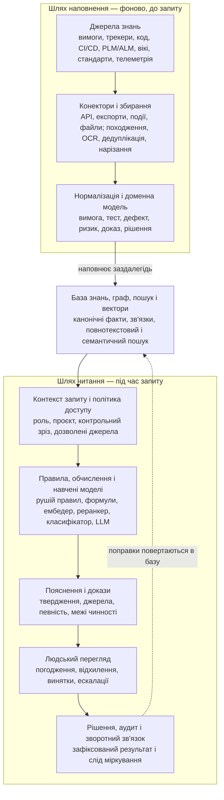
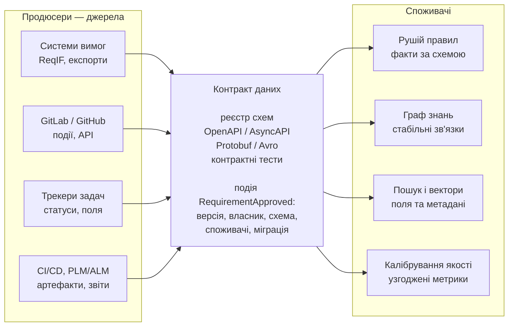

# Архітектура експертної системи: від знання до доказового рішення

> **Серія:** [Експертні системи для R&D](README.md) · стаття 06 із 21  
> **Попередня стаття:** [05 — Експертні системи: крок від математичного методу до обрання технологій](05-Expert-Systems-Implementation-Stack-UA.md)  
> **Наступна стаття:** [07 — Інфраструктура виконання експертної системи: моделі, апаратура і розміщення](07-Expert-Systems-Infrastructure-UA.md)  
> **Зміст серії:** [README](README.md)  
> **Рівень:** Розробники: впевнений базовий  
> **Після статті:** намалювати межі доказової системи, шлях знання та склад доказового пакета.  
> **Подача матеріалу:** кожен компонент пояснено через дані, інтерфейс, інваріант і режим відмови.

Дві попередні технічні статті відповіли на два питання: який математичний апарат потрібен експертній системі і які інструменти можуть цей апарат реалізувати. Але набір бібліотек ще не є системою. Потрібна архітектура: межі відповідальності, потоки знань, сховища, правила, моделі, пояснення, людський перегляд і аудит.

Ця стаття відкриває архітектурний блок серії. Тут я свідомо лишаюся в логічному шарі: що таке знання, де воно зберігається, чому векторна база не може бути єдиним джерелом істини, як проходить один запит, як працюють підтримання істинності, безпека, контракти, режими відмов, калібрування і походження. Наступна стаття буде про фізичний бік: де це виконується, як живуть моделі, навіщо потрібні центральні процесори, графічні процесори й нейропроцесори, коли потрібні окремі процеси машинного виведення і чому тепло, живлення та периферія впливають на архітектуру не менше за код.

Сучасна експертна система для досліджень і розробки (*Research and Development*, R&D) не має одного центру. Це не «великий чат над документами» і не «один рушій правил над таблицею». У ній співіснують кілька класів істини: факти, правила, граф зв'язків, пошук, векторні подання, навчені моделі, пояснення, людські рішення і доказовий слід. Архітектура відповідає, *з чого* складається система і *чому* саме так. Інфраструктура відповідає, *де* і *на чому* це працює.

Далі я говорю саме про експертну систему. Доказовість тут не окремий тип системи, а властивість її відповідей: висновок має спиратися на джерела, факти, правила, версії, припущення, прогалини і роль людини, яка відповідає за перегляд.

> **Практичний досвід автора.** Такі вставки нижче описують рішення, які я застосував у конкретному проєкті. Вони показують експлуатаційний досвід і межі поточного рішення, але не скасовують потреби перевірити інший домен, навантаження, дані та вимоги безпеки.

> **Трасування шарів.** Наскрізні властивості нижче не взялися з порожнечі: кожна продовжує конкретний клас інструментів і математичний апарат, які ми вже розбирали в попередніх двох статтях технологічної серії.
>
> | Архітектурний шар | Технологічний клас | Математичний апарат |
> |---|---|---|
> | Безпека і політики доступу | Рушії політик доступу | Формальні обмеження, логіка |
> | Контракти даних між підсистемами | Мови запитів, схеми сховищ | Типи, відношення, цілісність |
> | Походження і життєвий цикл знань | Інструменти родоводу, здобуття знань | Графи доказів, трасування |
> | Калібрування якості і регресія | Оцінювання пошуку й генерації | Метрики, оцінка невизначеності |
> | Координація викликів моделей | Обслуговування і виконання моделей | Планування, керування викликами |

## Архітектурне ядро і межі системи

**Архітектурне ядро експертної системи** - це не одна бібліотека і не один сервер. Це контрольована частина системи, яка володіє змістом рішення: доменною моделлю, канонічними фактами, правилами, обмеженнями, графом зв'язків, доказами, політиками доступу, життєвим циклом знань і трасою міркування. Саме ядро відповідає на питання: які знання чинні, які правила застосовані, чому висновок дозволений, на які джерела він спирається і як його відтворити пізніше.

Тому ядро не треба плутати з інструментами навколо нього. Пошукова система, векторна база, велика мовна модель (*Large Language Model*, LLM) або середовище машинного виведення можуть бути дуже важливими, але вони не мають самостійно вирішувати, що є істинним. Вони постачають кандидатів, розрахунки, схожість або текст. Рішення стає експертним лише тоді, коли ядро пропускає ці результати через правила, політики, походження і доказовий слід.

Звідси корисний поділ на три групи компонентів:

| Група | Що входить | Хто володіє логікою |
|---|---|---|
| Архітектурне ядро | Доменна модель, канонічна база знань, правила, обмеження, граф доказів, політики, аудит, життєвий цикл знань | Власна експертна система |
| Власні функціональні підсистеми | Конектори, збирання даних, нормалізація, нарізання фрагментів, побудова індексів, калібрування, пояснення, людський перегляд, зворотний зв'язок | Власна система, бо тут фіксуються контракти і якість знань |
| Сторонні інтегровані системи | Сховища, пошукові рушії, векторні бази, середовища виконання моделей, великі мовні моделі, оптичне розпізнавання символів, системи керування життєвим циклом виробу й застосунку, трекери задач, конвеєри безперервної інтеграції та доставки, вікі, реєстри моделей | Зовнішні продукти виконують спеціалізовану роботу, але не володіють експертним рішенням |

Цей поділ потрібен не для красивої схеми, а для керованості. Якщо стороння модель помилилася, ядро має побачити це як ризик, а не мовчки прийняти відповідь. Якщо пошуковий індекс застарів, ядро має знати, з якого канонічного джерела його перебудувати. Якщо зовнішній трекер задач змінив формат поля, власний конектор і нормалізація мають перетворити цю зміну на контрольований контракт, а не на випадкову поломку в правилах.

> **Практичний досвід автора.** Практичну межу я тримаю так: ядро не ототожнюється ні з великою мовною моделлю, ні з векторним пошуком. Саме ядро має володіти доменними сутностями, правилами, статусами, трасою рішення і журналом аудиту. Пошук, векторний індекс, конектори й середовище виконання моделей підключаються як виконавчі адаптери: вони можуть помилитися або тимчасово деградувати, але не повинні самостійно робити експертний висновок.

## Що таке знання в інженерному сенсі

Знання для експертної системи - це не просто текст. Документ може бути джерелом знання, але сам по собі не завжди є знанням у машинному сенсі.

Знання має тип, власника, версію, статус, джерело, область застосування, зв'язки, умови чинності і правила використання. Затверджена вимога, чернетка нотатки, уточнення від постачальника, польовий звіт, результат тесту і коментар у чаті не рівні, навіть якщо всі написані людською мовою.

Факти описують стан: вимога затверджена, тест не пройшов, дефект критичний, ризик прийнятий.

Правила описують наслідки: якщо критичний дефект впливає на реліз, контрольна точка випуску блокується.

Онтології описують типи: що таке вимога, тест, ризик, доказ, погодження.

Обмеження описують неможливі або заборонені стани: вимога з безпеки не може бути закрита без доказу перевірки.

Випадки описують досвід: схожий дефект, попереднє аудиторське зауваження, проблема з постачальником.

Джерела і походження (*provenance*) пояснюють, хто створив знання, коли, з якої версії і для якого контрольного зрізу.

Практичний висновок: база знань - це не папка з файлами. Це керований набір артефактів, які система може перевіряти, пов'язувати, пояснювати і відкликати.

## Фізичні форми знань

Одне й те саме інженерне знання не має однієї універсальної фізичної форми. Вимога, тест, дефект, доказ, правило, модель і аудиторська подія можуть описувати той самий фрагмент реальності, але зберігаються і запитуються по-різному: десь потрібна транзакційна таблиця, десь граф зв'язків, десь повнотекстовий індекс, десь векторна схожість, а десь незмінний журнал подій.

```mermaid
flowchart TB
    K["Фізичні форми знань"]

    subgraph Structured["Структуровані дані"]
        direction LR
        R["Реляційна база<br/>таблиці, JOIN, транзакції"]
        G["Графова база<br/>вузли, ребра, обхід зв'язків"]
        RDF["RDF-сховище<br/>трійки, онтології, інференс"]
        D["Документна база<br/>JSON-артефакти зі змінною схемою"]
    end

    subgraph Retrieval["Пошук і джерела"]
        direction LR
        S["Пошуковий індекс<br/>токени, BM25, фасети"]
        V["Векторна база<br/>ембединги, ANN, семантична близькість"]
        O["Об'єктне сховище<br/>PDF, звіти, скани, набори даних"]
    end

    subgraph Governance["Керованість і відтворюваність"]
        direction LR
        A["Журнал аудиту<br/>хто, коли, правило, висновок"]
        M["Реєстр моделей<br/>версія, середовище, метрики, відкат"]
    end

    K --> R
    K --> G
    K --> RDF
    K --> D
    K --> S
    K --> V
    K --> O
    K --> A
    K --> M
```

У реляційній базі знання виглядає як таблиці вимог, тестів, дефектів, ризиків, погоджень, доказів, версій і зв'язків.

У графовій базі - як вузли і ребра: вимога перевірена тестом, тест породив результат, дефект впливає на вимогу.

У сховищі RDF (*Resource Description Framework*, модель опису ресурсів) - як трійки: суб'єкт, предикат, об'єкт.

У документній базі - як JSON-артефакти змінної структури, де JSON (*JavaScript Object Notation*) є поширеним текстовим форматом для структурованих даних.

У пошуковому індексі - як токени, поля, ваги, позиції, фасети.

У векторній базі - як векторні подання (*embeddings*), які допомагають знайти схожий зміст.

В об'єктному сховищі - як PDF, звіти, скани, тестові артефакти, журнали, набори даних, моделі.

У журналі аудиту - як події: хто що змінив, яка версія правила діяла, який висновок отримано.

У реєстрі моделей - як модель, токенізатор, середовище виконання, параметри, звіт оцінювання.

Ця різноманітність не є недоліком. Вона відображає реальність: різні типи знань потребують різних фізичних форм.

> **Практичний досвід автора.** Поточний підхід - не складати всі знання в одну універсальну базу. Керовані факти, статуси, правила і рішення проєктуються як канонічна структурована форма; зв'язки між ними - як граф; пошуковий і векторний шари - як перебудовувані індекси; вихідні документи, звіти і великі артефакти лишаються окремими об'єктами з метаданими. Версії моделей та оцінювання теж краще тримати окремими записами, навіть якщо повний реєстр моделей ще доростає поступово. Це додає інженерної роботи, зате кожен тип питання йде до тієї фізичної форми, яка справді вміє на нього відповісти.

## Чому не можна все покласти у векторну базу

Векторна база відповідає на питання «що схоже за змістом». Щоб уявити, як це працює, не вдаючись у математику: кожен фрагмент тексту вона перетворює на точку в багатовимірному просторі змісту - так, що близькі за смислом фрагменти опиняються поряд, навіть якщо в них зовсім різні слова. Пошук тоді зводиться до питання «які точки найближчі до мого запиту». Це потужно, але вузько: вона не відповідає сама по собі на питання «що чинне», «що затверджене», «хто має право це бачити», «яка версія діяла на момент рішення», «чи не суперечить це іншому джерелу».

Якщо скласти всі документи у векторну базу і назвати це експертною системою, ми отримаємо зручний пошук. Можливо, навіть дуже корисний. Але він не забезпечить доказовість відповідей.

Практичне правило: векторний пошук має повертати не «відповідь», а кандидатів з метаданими: джерело, версія, статус, мітка доступу, ідентифікатор моделі векторизації, fingerprint нормалізації й нарізання фрагментів, контрольний зріз, власник. Тільки після цього шар правил, графовий шар і людський перегляд можуть вирішити, чи придатні ці кандидати як докази.

## Референсна архітектура

Референсна архітектура - це спрощена опорна схема системи, яка показує не конкретні продукти чи бібліотеки, а відповідальності шарів і рух знань між ними. У цьому варіанті вона розділяє два різні процеси: шлях наповнення, де сирі джерела перетворюються на керовані знання, і шлях читання, де конкретний запит проходить через базу знань, граф, пошук, правила, моделі, пояснення, людський перегляд, рішення й аудит.

У реальній експертній системі це розпадається на підсистеми.

**Джерела знань** - це первинне середовище, з якого все починається: системи керування вимогами, трекери задач, репозиторії коду, керування тестами, конвеєри безперервної інтеграції та доставки (*Continuous Integration / Continuous Delivery*, CI/CD), системи керування життєвим циклом виробу й застосунку (*Product/Application Lifecycle Management*, PLM/ALM), вікі та проєктна документація, папки постачальників, стандарти й регламенти, польова телеметрія, нарешті - голови самих інженерів. Самі по собі вони не є знанням у машинному сенсі: це сирий, різнорідний і часто суперечливий матеріал.

**Конектори** підключають перелічені джерела до системи: вони витягують артефакти через програмні інтерфейси (*Application Programming Interface*, API), експорти, події чи файли, відстежують зміни і доставляють сирі дані в конвеєр, не намагаючись їх іще осмислити.

**Збирання даних** (*ingestion*) - це керований конвеєр над сирим потоком від конекторів: він приймає артефакти, фіксує їхнє походження, розбиває великі документи на фрагменти, виконує оптичне розпізнавання символів (*Optical Character Recognition*, OCR), дедуплікацію, первинну класифікацію і знеособлення чутливих полів, а також вирішує, що змінилося з попереднього разу. Саме тут закладається відтворюваність: якщо на вході не зафіксувати версію і походження, жоден нижній шар уже не відновить, з якого зрізу знань зроблено висновок.

**Нормалізація** приводить різні джерела до спільної форми: вирівнює кодування, одиниці, формати дат і ідентифікаторів, зводить різні назви того самого поля до одного, відкидає дублікати й технічний шум.

**Доменна модель** надає впорядкованим даним сенс, відображаючи їх на сталі поняття предметної області - вимога, тест, дефект, ризик, компонент, доказ, рішення, власник, контрольний зріз. Саме доменна модель є спільною мовою всієї системи: правила, граф і пояснення оперують її поняттями, а не сирими полями конкретного інструмента.

**База знань** зберігає факти, правила, онтології, формули, випадки, політики, версії, винятки.

**Граф знань** тримає зв'язки, простежуваність і аналіз впливу.

**Пошуковий шар** дає повнотекстовий пошук, пошук за ідентифікаторами, фасети, точні збіги.

**Векторний шар** дає семантичну схожість, подібні випадки, кандидатів для генерації з пошуковим доповненням (*Retrieval-Augmented Generation*, RAG).

**Рушій правил** застосовує правила до фактів і пояснює, що спрацювало.

**Обчислювальні ядра** виконують формули, оптимізаційні задачі, розрахунки ризику, калібрування, перевірку обмежень.

**Навчені моделі** - це окремий клас, який не варто плутати з доменною моделлю вище: доменна модель описує *поняття* предметної області, тоді як навчені моделі - це машинно-навчені компоненти, що підключаються там, де правил і формул замало. Сюди належать ембедер для векторних подань, реранкер для впорядкування кандидатів, класифікатор домену, розпізнавання інженерних ідентифікаторів і велика мовна модель для генерації тексту.

**Пояснювальний шар** перетворює внутрішній висновок на зрозумілу людині відповідь: формулює, що система стверджує, чому і з якою певністю, і явно показує, чого бракує для повної відповіді.

**Докази** - це матеріал, на який спирається пояснення, і водночас зовнішній артефакт системи. Доказ - це не сам висновок, а простежуване обґрунтування під ним: конкретний пункт джерела зі стабільним ідентифікатором і версією, правило, що спрацювало, факт чи розрахунок, на який воно зіслалося, а також зафіксовані припущення і прогалини.

**Людський перегляд** фіксує погодження, відхилення, винятки, коментарі, ескалації.

**Рішення** - це зафіксований результат усього конвеєра: затверджений чи відхилений висновок разом із доказовим пакетом, автором рішення, роллю, часом і станом.

**Аудит і спостережуваність** зберігають слід міркування, версії моделей, версії правил, затримку, метрики якості - тобто роблять кожне рішення відтворюваним і перевірюваним заднім числом.

**Зворотний зв'язок** замикає цикл: поправки рецензента, виявлені помилкові спрацювання правил, нові винятки й уточнення повертаються назад у базу знань і в калібрування.

> **Практичний досвід автора.** У практичному дизайні я розвожу шлях наповнення і шлях читання. Конектори, нормалізація, нарізання, індексація і повторне збирання знань мають працювати фоново й окремо від користувацького запиту. А сам запит, там де це вже доведено до реалізації, не читає випадкові сирі файли напряму: він стартує з поточного канонічного стану, потім підтягує граф, точний пошук, векторних кандидатів, правила і пояснення. Так легше додавати нові джерела, не переписуючи логіку прийняття рішення.

## Перевірка архітектури на практиці

Коли цю схему прикласти до реальної експертної системи, найважливішим стає не список технологій, а дисципліна джерел істини, на які маємо спиратися.

Перша опора - канонічне сховище керованих знань: факти, правила, версії, походження, життєвий цикл, аудит. Пошуковий і векторний індекси тоді є похідними структурами, які можна перебудувати. Втрата індексу не повинна означати втрату знань, а зміна джерела без переіндексації повинна вважатися архітектурним дефектом.

Друга опора - перевірка придатності задачі. Система не повинна однаково обробляти всі запити. Для одних достатньо точного пошуку, для інших потрібні правила, граф, розрахунок, сценарний аналіз або людський перегляд. Іноді правильна відповідь експертної системи: «зараз бракує знань» або «джерела суперечать одне одному». Це не слабкість, а ознака архітектури, яка підтримує доказовість відповідей.

Третя опора - керування життєвим циклом знань. Нові джерела, виправлення, архівування, відкликання помилкового правила і повторна перевірка старих висновків мають бути явними операціями, а не ручним прибиранням у базі.

## Як проходить один запит в системі

Щоб архітектура не виглядала абстрактною, уявімо типовий запит: «Чи можна випускати реліз B-17, якщо змінилася вимога R-42?»

Важливо одразу зауважити: референсна діаграма вище описує два різні шляхи. Верхня її половина (`джерела знань -> конектори і збирання даних -> нормалізація та доменна модель`) - це шлях *наповнення*, який працює фоново й заздалегідь, ще до запиту. Сам запит іде *шляхом читання* - від рядка `база знань + граф + пошук + вектори` униз до `рішення + аудит + зворотний зв'язок`.

Перший крок - ідентифікація контексту. Система визначає проєкт, роль користувача, контрольний зріз, реліз, домен безпеки, доступні джерела. Якщо користувач не має доступу до частини доказів, пошук навіть не повинен їх бачити.

Другий крок - факти. З бази знань підтягуються статуси вимоги, релізу, погоджень, дефектів, результатів тестів. З графу - зв'язки R-42 з проєктуванням, кодом, тестами, ризиками, рішеннями. З пошуку - точні документи: запит на зміну, нотатки перегляду, пункти стандартів. З векторного шару - схожі минулі випадки або уроки з попередніх проєктів.

Третій крок - правила і обчислення. Рушій правил перевіряє контрольні умови: чи є аналіз впливу, чи оновлені тести, чи немає критичних дефектів, чи чинні винятки. Обчислювальні ядра можуть оцінити ризик, покриття або повноту.

Четвертий крок - пояснення й докази. Система збирає доказовий пакет: які джерела використано, які правила спрацювали, що заблокувало реліз, які дані відсутні, які джерела не використані через права доступу або статус. Якщо на цьому кроці потрібна зв'язна текстова відповідь, її готує велика мовна модель - але виключно поверх уже зібраного доказового пакета, а не як самостійне джерело висновку.

П'ятий крок - людський перегляд, рішення і зворотний зв'язок. Якщо висновок критичний, він не стає рішенням автоматично. Він іде до відповідальної ролі: власника релізу, інженера з безпеки, відповідального за кібербезпеку, керівника якості. Їхнє погодження або відхилення разом із доказовим пакетом фіксується як рішення і потрапляє в аудиторський слід.

Усі п'ять кроків зручно бачити як один конвеєр читання:

| Крок | Що відбувається | Задіяні шари | Результат кроку |
|---|---|---|---|
| 1. Контекст | Визначення проєкту, ролі, контрольного зрізу, релізу, домену безпеки й доступних джерел | Політики доступу | Дозволена область пошуку |
| 2. Факти | Статуси вимоги, релізу, тестів; зв'язки R-42; точні документи; схожі минулі випадки | База знань, граф, пошук, вектори | Факти й кандидати з метаданими |
| 3. Правила і обчислення | Перевірка контрольних умов (аналіз впливу, оновлені тести, критичні дефекти, винятки), оцінка ризику й покриття | Рушій правил, обчислювальні ядра | Спрацьовані й порушені умови |
| 4. Пояснення й докази | Збирання доказового пакета; за потреби — зв'язний текст поверх уже зібраних доказів | Пояснювальний шар, LLM | Доказовий пакет і відповідь |
| 5. Перегляд і рішення | Погодження чи відхилення відповідальною роллю, фіксація в аудиті, повернення поправок | Людський перегляд, аудит, зворотний зв'язок | Зафіксоване рішення |

Практичний висновок: експертна система не «відповідає текстом». Вона проводить запит через послідовність контрольованих перетворень від контексту до доказового пакета.

> **Практичний досвід автора.** Для запитів на кшталт «чи можна випускати реліз після зміни вимоги» принцип такий: модель не відповідає першою. Спочатку система має розібрати точні ідентифікатори, роль користувача і контрольний зріз; далі - витягнути факти, зв'язки графа, точні документи і схожі випадки; після цього правила можуть сформувати блокери або дозволи. Лише наприкінці мовна модель доречна як помічник для зв'язного пояснення поверх уже зібраного доказового пакета. Для критичного висновку потрібен людський перегляд і запис в аудиті.

## Підтримання істинності: що робити, коли факт змінився

В експертній системі, яка має підтримувати доказовість відповідей, важливо не лише отримати висновок, а й знати, коли він перестав бути чинним. Найпростіша аналогія - формули в електронній таблиці: щойно ви змінили одну клітинку, всі залежні від неї перераховуються самі. Без такого механізму таблиця показувала б старі числа поряд із новими вхідними даними - саме так поводиться система знань без підтримання істинності.

Якщо змінилася вимога R-42, старий висновок про реліз B-17 не можна просто лишити в історії як «ще одну відповідь». Система має знайти похідні висновки, позначити їх застарілими або недійсними, повторно виконати правила і показати, що саме змінилося.

Для цього потрібен шар підтримання істинності. Він зберігає обґрунтування: висновок, джерела, правило, припущення, версії, час. Якщо джерело змінюється, система не стирає попередній ланцюг міркування, а створює новий стан: було чинним, стало відкликаним, потребує повторного прогону або людського перегляду.

Практичне застосування: без підтримання істинності експертна система накопичує красиві, але потенційно мертві відповіді. З підтриманням істинності вона поводиться як інженерний інструмент: знає залежності, вміє відкликати висновки і може пояснити, чому сьогоднішня відповідь відрізняється від учорашньої.

> **Практичний досвід автора.** Тут реалізація поки прагматична, а не повний формальний рушій підтримання істинності. Там, де залежність явна, зміна джерела веде до повторної індексації, повторного прогону правил або нового аудиторського стану; старий висновок не стирається, а лишається з попередньою трасою. Відкритий фронт - тонший граф залежностей від вихідного документа через фрагментацію, fingerprint pipeline векторизації, індекс і правило до конкретної відповіді.

## Безпека як архітектурна властивість

В експертній системі безпека не може бути додатком наприкінці, якщо її відповіді мають бути доказовими. Вона проходить через збирання даних, зберігання, пошук, виведення, журнали, інтерфейс користувача і експорт.

Керування доступом має працювати на рівні джерела і фрагмента. Шифрування має покривати зберігання і передавання. Секрети мають жити у сховищі секретів, а не в шаблонах запитів до моделі. Журнали не мають випадково зберігати обмежений вміст без політики зберігання. Згенеровані підсумки мають успадковувати чутливість від джерел.

Практично: безпечна політика за замовчуванням — класифікувати відповідь не нижче за найчутливіший використаний фрагмент. Пониження класифікації можливе лише як окрема, контрольована операція (наприклад, затверджене знеособлення або перегляд), а не тому, що модель зробила стислий переказ. Якщо модель отримала обмежений контекст, результат теж лишається обмеженим, доки така операція не змінить статус.

Особливе місце займає ін'єкція інструкцій у запит до моделі (*prompt injection*). У документах бази знань може бути текст, який просить модель ігнорувати правила, розкрити секрети або змінити формат відповіді. Тому знайдений контекст має бути даними, а не інструкціями. Системна політика і дозволи інструментів мають бути відокремлені від знайденого вмісту.

Реалізується цей контракт окремим класом засобів - рушіями політик: **OPA** (*Open Policy Agent*) з мовою Rego, Cedar, стандарт **XACML** (*eXtensible Access Control Markup Language*), а поверх них - моделі розмежування: рольова (*Role-Based Access Control*, RBAC), атрибутна (*Attribute-Based Access Control*, ABAC) та архітектура нульової довіри (*Zero Trust*). Архітектурно важливо, де саме стоїть цей шар: політику треба застосовувати *до* пошуку, а не після.

> **Практичний досвід автора.** Цей шар поки навмисно тонкий - і це усвідомлений порядок робіт, а не недогляд. Спершу має устоятися ядро: пошук, правила, здобуття знань. Окремого рушія політик на кшталт OPA я свідомо не вводив: базове розмежування там, де воно вже потрібне, тримається кодом і фільтрами в самому конвеєрі пошуку. Мінімальний інваріант уже зараз такий: політика відсікає джерела й метадані до retrieval і до передачі контексту моделі; післягенераційне маскування не є заміною цього контролю. Відкрите питання — як формалізувати це правило у версіонованій політиці без дублювання логіки між сервісами.

## Контракти даних між підсистемами

Підсистеми експертної системи обмінюються знаннями не напряму, а через контракти даних (*data contracts*). Система живиться подіями, таблицями, експортами, програмними інтерфейсами і файлами; якщо поле змінило назву або тема події (*event topic*) змінилася без контракту, правила тихо перестають бачити факти - і система виглядає здоровою, повертаючи неповні висновки.

Архітектурний інструментарій тут відомий: реєстр схем (*schema registry*), контракти **OpenAPI** для синхронних інтерфейсів, **AsyncAPI** для подієвих інтерфейсів, схеми Protobuf чи Avro, контрактні тести. Кожне джерело знань має мати контракт: подія `RequirementApproved` - версію, власника, схему, список споживачів і політику міграції. Без цього система залежить не від архітектури, а від випадкової стабільності сусідніх інструментів.

| Частина обміну | Що в ній фіксується | Навіщо це потрібно | Приклад |
|---|---|---|---|
| Продюсер даних | Сервіс, джерело або конектор, який створює подію, запис, експорт чи файл | Щоб було зрозуміло, хто відповідає за зміст і життєвий цикл даних | Система вимог, трекер задач, CI/CD, конектор ReqIF |
| Версійований контракт | Назва події або API, схема полів, типи, обов'язковість, версія, власник, політика міграції | Щоб зміна поля або теми події не ламала правила мовчки | `RequirementApproved.v2`, OpenAPI, AsyncAPI, Protobuf, Avro |
| Реєстр і перевірки | Сховище схем, контрактні тести, сумісність версій, перевірка прикладів payload | Щоб зміна контракту була видимою до запуску в роботу | Schema registry, contract tests, fixture corpus |
| Споживачі даних | Правила, граф знань, пошук, векторний індекс, пояснювальний шар, аудит | Щоб кожен споживач отримував очікувану доменну форму, а не випадкову структуру сусіднього інструмента | Рушій правил, граф простежуваності, індексатор, журнал аудиту |
| Протидія відмовам | Блокування несумісної версії, карантинний стан, резервний режим, сповіщення власника, повторна нормалізація | Щоб система не робила висновок із неповних або неправильно прочитаних фактів | Відмова приймати подію без обов'язкового поля, повторна побудова індексу |

> **Практичний досвід автора.** Найдалі цей шар просунутий саме на шині обміну між сервісами: внутрішня взаємодія йде через брокер повідомлень NATS, а формат повідомлень - суб'єкти, конверти, версії контрактів - винесений в окреме спільне джерело істини для кількох продуктів. Це зменшує ризик сценарію, коли тема події чи поле тихо змінюються і споживач перестає бачити факти. А там, де знання приходять із зовнішніх інструментів - наприклад, через формат обміну вимогами (*Requirements Interchange Format*, ReqIF), експорти з GitLab і GitHub - формального контракту поки немає: конвеєр захищається перевірками й нормалізацією на вході.

## Типові режими відмов по шарах і протидія ним

Архітектуру варто оцінювати не лише за штатним сценарієм, а й за тим, як вона ламається і як саме система має чинити опір цій поломці. Для експертної системи, яка має видавати доказові відповіді, небезпечні не тільки явні падіння сервісів. Значно гірші тихі відмови: частина джерел не синхронізувалася, поле неправильно нормалізувалося, граф зберіг застарілий зв'язок, індекс повернув старий фрагмент, правило спрацювало в іншому порядку, а модель красиво дописала твердження без джерела. Тому для кожного шару потрібні дві речі: ознака відмови, яку можна виявити, і протидія - автоматична перевірка, блокування, переобчислення, відмова відповідати або передавання на людський перегляд.

У конекторах типовий збій - тихе часткове синхронізування. Сервіс начебто працює, але частина вимог або тестів не доїхала. **Протидія:** позначки останньої обробленої зміни, звірки з джерелом, лічильники артефактів, контроль різких падінь кількості записів, повторні спроби з ідемпотентністю і явний статус «джерело неповне», який нижні шари не мають права ігнорувати.

У нормалізації типовий збій - неправильне маплення полів. Наприклад, `status=closed` в одному інструменті означає «закрито», а в іншому - «закрито як дублікат». **Протидія:** тести маплення, доменні приклади, словники допустимих значень, контроль невідомих статусів, карантинний стан для артефактів, які не вдалося впевнено привести до доменної моделі.

У графі типовий збій - вузли без власника і застарілі ребра. Вимога вже замінена новою версією, а ребро до старого тесту лишилося. **Протидія:** оновлення графа з урахуванням життєвого циклу, періодичні перевірки узгодженості, пошук висячих вузлів, перевірка актуальності ребер і повторна побудова похідних зв'язків після зміни канонічного факту.

У шарі правил типовий збій - прихований порядок виконання або неявний спільний стан. **Протидія:** детермінована політика черги правил, тести правил на фіксованих наборах фактів, повторне програвання на історичних фактах, заборона прихованих глобальних змінних у правилах і журналювання того, які саме правила спрацювали та в якому контексті.

У векторному шарі типовий збій - змішування векторів різних моделей або повернення фрагментів без метаданих. **Протидія:** версії індексів, ідентифікатор моделі векторизації поряд із кожним вектором, фільтр за доступом і контрольним зрізом до пошуку, блокування змішаних індексів, переіндексація після зміни ембедера і перевірка якості на еталонному наборі.

У генерації великою мовною моделлю типовий збій - непідтверджене твердження, коли модель додає красивий висновок, якого немає у джерелах. **Протидія:** перевірки прив'язки до джерел, обов'язкові посилання на використані фрагменти, політика відмови при браку доказів, розділення знайденого контексту і системних інструкцій, людський перегляд для критичних результатів.

> **Практичний досвід автора.** Найпростіший приклад протидії відмовам у моїй реалізації - регресійна перевірка пошуку. Якщо запит із точним інженерним ідентифікатором після зміни індексації не знаходить очікуваний артефакт, це не «дрібна просадка якості», а сигнал, що конвеєр формування доказового пакета може втратити факт. Тому поряд із метриками на кшталт nDCG@10 і recall@10 окремо відстежується влучність за точним ідентифікатором і затримка. Для частини інших шарів такий самий рівень регресійної перевірки ще треба дорощувати: зокрема для повного родоводу від вихідного документа через фрагментацію, fingerprint векторизації, індекс і правило до конкретної відповіді.

Практичне застосування: для кожного шару треба мати не лише моніторинг «живий/мертвий», а й змістові перевірки здоров'я: чи факти повні, чи зв'язки актуальні, чи правила детерміновані, чи пошук повертає дозволені джерела, чи модель не додає тверджень без доказів. Якщо перевірка не проходить, правильна реакція системи - не вдавати впевненість, а обмежити відповідь, позначити джерело або індекс як ненадійний, запустити переобчислення чи передати випадок людині.

Добрий тест архітектури простий: чи може команда відтворити вчорашню відповідь після нічної синхронізації, зміни політики і переіндексації. Якщо не може, система ще не готова до промислової експлуатації.

## Калібрування якості і регресійний контроль

Окрема наскрізна властивість архітектури - це постійне калібрування самої експертності системи, тобто підтримання якості її відповідей чесною в часі. Калібрування тут варто розуміти широко: не лише як одну математичну перевірку впевненості, а як регулярне звіряння того, чи система все ще відповідає правильно, знаходить потрібне, не перебільшує певності й чесно відмовляється там, де доказів бракує.

Калібрування розкладається за рівнями системи: правил, пошуку, генерації з пошуковим доповненням і самих моделей. Кожен рівень має свій спосіб зміряти якість і свій спосіб тихо деградувати, якщо його не контролювати.

Для правил потрібні модульні й сценарні тести: набір фактів на вході, очікувані спрацьовані правила, очікувані похідні факти, очікувані блокери.

Для пошуку потрібні еталонні набори (*gold sets*): запит, очікувані джерела, релевантність, домен і мінімально прийнятна повнота. Оцінюють пошук кількома метриками ранжування:

- **Повнота у перших k результатах** (*Recall@k*) питає, чи потрапило потрібне джерело у верхні *k* взагалі.
- **Точність у перших k результатах** (*Precision@k*) питає, яка частка верхівки справді релевантна.
- **Середній обернений ранг** (*Mean Reciprocal Rank*, MRR) винагороджує за те, щоб перший правильний результат стояв якомога вище.
- **Нормоване накопичене зважене на позицію значення** (*normalized Discounted Cumulative Gain*, nDCG) враховує і порядок, і ступінь релевантності кожного результату.

Поряд із якістю міряють і **затримку** (*latency*) - скільки пошук узагалі триває, бо ідеальне, але повільне ранжування на практиці некорисне.

Для генерації з пошуковим доповненням потрібні трасування оцінювання: які фрагменти витягнуто, які з них використано, чи спирається відповідь на джерела, чи є непідкріплені твердження, чи коректна відмова. Тут можуть допомогти Ragas чи promptfoo, але доменний еталонний набір усе одно доведеться створити самим.

Для моделей потрібні картки моделей (*model cards*), звіти оцінювання, перевірки дрейфу (*drift*), перевірки калібрування і відкат (*rollback*). Це найвужчий, числовий сенс калібрування: він перевіряє, наскільки заявлена впевненість моделі відповідає реальній частці правильних відповідей. Якщо система каже «впевнений на 90 %», то приблизно в дев'яти випадках із десяти вона має бути права, інакше її «впевненість» - порожнє число.

> **Практичний досвід автора.** Це один із тих шарів, у який я свідомо вклався рано, бо без нього «покращення» перетворюються на лотерею. Перевірка пошуку зроблена власним інструментом: доменний еталонний набір, метрики ранжування, особлива увага до nDCG@10 і recall@10, окрема влучність за точним ідентифікатором і контроль затримки. Поруч поступово розвиваються калібрування впевненості, оцінювання генерації з пошуковим доповненням і регресійні контролі пакетів правил.

## Версіонування і походження як несучий шар архітектури

Архітектура, що підтримує доказовість відповідей, тримається на простій обіцянці: через місяць або рік можна повернутися до висновку й побачити, на яких знаннях, правилах, моделях і припущеннях він був побудований. Для цього недостатньо зберегти фінальний текст відповіді. Треба зберегти стан системи, який цю відповідь породив.

Тому версії мають не тільки документи. Версіонуються правила, онтології, схеми, векторні подання, токенізатор, шаблони запитів, конфігурація пошуку, ваги моделі, пороги, політики доступу і правила знеособлення. Якщо правило більше не чинне, воно не зникає з історії, а переходить у стан «замінене» або «відкликане». Якщо міграція даних стала непотрібною, вона може перетворитися на холосту операцію, але її місце в ланцюгу лишається. Якщо модель замінюють «на кращу», потрібен звіт оцінювання і переіндексація, коли змінився простір векторних подань. Навіть шаблон запиту до моделі стає архітектурним артефактом, якщо його результат потрапляє у доказовий пакет.

Версіонування відповідає на питання «яка саме редакція артефакта була чинною». Походження відповідає на інше питання: «як цей артефакт потрапив у конкретний висновок». Саме походження з'єднує джерело, фрагмент, індекс, правило, модель, роль користувача і фінальне рішення в один відтворюваний ланцюг. Без цього відповідь може виглядати переконливою, але її вже не можна надійно перевірити.

Формальну основу для такого ланцюга дає модель **PROV-O** від Консорціуму Всесвітнього павутиння (*World Wide Web Consortium*, W3C): сутність (*entity*) описує дані або артефакт, діяльність (*activity*) - перетворення, агент (*agent*) - систему, модель або людину, яка вплинула на результат. Родовід даних (*data lineage*) показує рух від джерел до індексів і сервісів; інструменти на кшталт OpenLineage фіксують такі переходи для конвеєрів даних, а MLflow або DVC (*Data Version Control*) допомагають версіонувати моделі, набори даних і експерименти.

> **Практичний досвід автора.** У моїй реалізації цей шар поки зібраний нативно, без окремих MLflow чи DVC. Базове вже працює: журнал аудиту висновків, пояснюваність виведення з трасуванням рішень і обов'язкові посилання на джерела у відповідях. Відкритим фронтом лишається повний родовід: наскрізне відстеження від вихідного документа через спосіб видобування, фрагментацію і fingerprint векторизації аж до фінальної відповіді.

## Сім уроків архітектурного шару

Кожен урок нижче - це не гасло, а пара «проблема - рішення»: спершу збій, який реально стається в експертній системі, потім архітектурна відповідь на нього. Поруч - посилання на розділ цієї статті, де докладно розібрано причини й наслідки.

### Урок 1. Доказовий пакет - це архітектурна межа системи

**Проблема.** Якщо вважати пояснення косметикою над відповіддю, виходом системи стає внутрішнє повернення методу, і людина приймає рішення наосліп - без доказів, версій і переліку того, чого бракує.

**Рішення.** Зробити доказовий пакет зовнішньою межею системи: саме він, а не сире значення, є офіційним виходом, і кожне критичне рішення проходить через нього.

Контекст: розділ [«Як проходить один запит в системі»](#як-проходить-один-запит-в-системі), крок «пояснення й докази».

### Урок 2. Жоден індекс не є джерелом істини

**Проблема.** Пошуковий і векторний індекси - похідні структури. Якщо змінити канонічне джерело без переіндексації, система тихо почне відповідати за старим зрізом, виглядаючи при цьому здоровою.

**Рішення.** Тримати єдине канонічне сховище керованих знань як джерело істини, а індекси вважати перебудовуваними похідними; зміну джерела без переіндексації трактувати як архітектурний дефект.

Контекст: розділ [«Перевірка архітектури на практиці»](#перевірка-архітектури-на-практиці), перша опора.

### Урок 3. Вектор без fingerprint конвеєра не є доказом

**Проблема.** Косинусна схожість має сенс лише в одному сумісному векторному просторі. Якщо мовчки змішати подання після зміни моделі, нормалізації, токенізатора, нарізання фрагментів або розмірності, система порівнює непорівнюване і видає правдоподібний, але хибний результат.

**Рішення.** Зберігати поряд із вектором fingerprint усього конвеєра: модель і її revision, токенізатор, нормалізацію, chunking, розмірність, precision і параметри індексу. Не змінювати цей конвеєр без звіту оцінювання, ізольованого нового індексу та контрольованої переіндексації.

Контекст: розділ [«Версіонування і походження як несучий шар архітектури»](#версіонування-і-походження-як-несучий-шар-архітектури).

### Урок 4. Імена подій - частина схеми знань

**Проблема.** Якщо сервіс перейменував тему події, а споживач не оновився, рушій правил тихо втрачає факти - система виглядає справною, але повертає неповні висновки.

**Рішення.** Закріпити кожну подію контрактом даних - версія, власник, схема, список споживачів, політика міграції, - щоб імена й формати не мінялися мовчки.

Контекст: розділ [«Контракти даних між підсистемами»](#контракти-даних-між-підсистемами).

### Урок 5. Форма бази даних не повинна просочуватися в API

**Проблема.** Якщо програмний інтерфейс віддає внутрішню форму шару зберігання, споживачі й правила починають залежати від випадкової реалізації, а не від доменного поняття, і кожна зміна схеми ламає їх.

**Рішення.** Виставляти назовні доменні поняття через стабільний версійований контракт, а форму зберігання ховати за ним.

Контекст: розділ [«Контракти даних між підсистемами»](#контракти-даних-між-підсистемами).

### Урок 6. Аудиторська історія знань має лише додавати записи

**Проблема.** Видалене правило або затерта міграція руйнує відтворюваність: учорашнє рішення вже неможливо пояснити, бо ланцюг міркування зник.

**Рішення.** Робити аудит і журнал версій лише доповнюваними: відкликання знання - це нова версія або подія, а не стирання доказу; попередній стан стає відкликаним, а не зникає. Поточні робочі таблиці можна оновлювати, якщо їхній зв'язок із незмінним журналом однозначно відтворюється.

Контекст: розділ [«Підтримання істинності: що робити, коли факт змінився»](#підтримання-істинності-що-робити-коли-факт-змінився).

### Урок 7. Правила не повинні ділити прихований глобальний стан

**Проблема.** Якщо результат правила залежить від порядку завантаження або спільної змінної, відповідь стає невідтворюваною - і система втрачає доказовість висновку.

**Рішення.** Зробити кожне правило функцією власного оголошення і вхідних фактів, із детермінованою політикою черги правил і повторним програванням на історичних фактах.

Контекст: розділ [«Типові режими відмов по шарах і протидія ним»](#типові-режими-відмов-по-шарах-і-протидія-ним), шар правил.

## Висновок

Референсна архітектура експертної системи, що підтримує доказовість відповідей, складається не з одного сервісу, а з двох пов'язаних шляхів. Перший - шлях наповнення: джерела знань, конектори, збирання даних, нормалізація і доменна модель. Він працює фоново й заздалегідь, щоб сирі артефакти стали керованими знаннями. Другий - шлях читання під час запиту: база знань, граф, пошук, векторні подання, правила, обчислення, навчені моделі, пояснення, докази, людський перегляд, рішення, аудит і зворотний зв'язок. Саме ця схема пояснює, чому експертна система не є просто «чатом над документами» або «рушієм правил над таблицею».

Ядро експертної системи формують доменна модель, канонічна база знань, факти, правила, обмеження, граф зв'язків, політики доступу, контракти даних, підтримання істинності, походження, версії, аудит і доказовий слід. Пошуковий рушій, векторна база, велика мовна модель чи середовище машинного виведення можуть бути важливими виконавцями, але вони не володіють експертним рішенням. Вони постачають кандидатів, схожість, розрахунки або текст, а ядро перетворює це на перевірюваний висновок.

Необхідні компоненти такої експертної системи - канонічне сховище знань, граф простежуваності, пошуковий і векторний індекси, рушій правил, обчислювальні ядра, шар виклику моделей, пояснювальний шар, реєстр версій, журнал аудиту, політики доступу, контрактні схеми, калібрування якості і регресійний контроль. Якщо прибрати будь-яку з цих властивостей, система може лишитися корисним інструментом пошуку або автоматизації, але втрачає доказовість відповідей: уже складно показати, звідки взявся висновок, чому він чинний і чи можна його відтворити завтра.

На вході така експертна система взаємодіє з вимогами, трекерами задач, репозиторіями коду, результатами тестів, CI/CD, PLM/ALM, вікі, стандартами, регламентами, документами постачальників, польовою телеметрією і людськими коментарями. На виході вона має віддавати не просто відповідь, а доказовий пакет: висновок, використані факти, спрацьовані правила, джерела, версії, припущення, прогалини, рівень упевненості, обмеження доступу і відповідальну роль для перегляду. Для людини це основа рішення; для сусідніх систем - подія, контрактний результат, запис аудиту або сигнал зворотного зв'язку, який повертається в життєвий цикл знань.

**Спойлер наступної статті.** Навіть найчистіша архітектура має десь виконуватися. Далі я перейду від логічних меж до фізичних: чому експертна система є координатором викликів моделей, а не сервером машинного виведення; де проходить межа процесу й топологія розгортання (хмара, власний периметр, периферія); який клас заліза створювався під яку математику - від центральних процесорів з векторними розширеннями крізь графічні процесори, нейропроцесори, тензорні й мережеві прискорювачі до програмованих матриць, спеціалізованих мікросхем, обчислень у пам'яті та нейроморфних чипів; і чому живлення, тепло та периферія часто вирішують більше, ніж вибір бібліотеки.

*Питання до читачів.* Запрошую до продуктивної дискусії - і навмисне ставлю питання з трьох ракурсів (поглядів), бо архітектуру кожен бачить зі свого боку. Те, що архітектор бачить як «межі відповідальності й потоки знань», інженер знань бачить як форму зберігання й контракти, а аналітик - як доказовість і відтворюваність висновку.

Питання очима системного архітектора:

- *Про архітектурне ядро і межі системи:* де у ваших системах проходить межа між ядром і виконавчими адаптерами - чи не володіє рішенням де-факто велика мовна модель або векторний пошук?
- *Про референсну архітектуру з двома шляхами:* чи розведені у вас фоновий шлях наповнення і шлях читання під запит, чи запит усе ще читає сирі джерела напряму?
- *Про підтримання істинності:* що у вас відбувається з похідними висновками, коли змінився факт - вони відкликаються й переобчислюються, чи тихо лишаються як «ще одна відповідь»?

Питання очима інженера знань і даних:

- *Про фізичні форми знань і «чому не можна все покласти у векторну базу»:* чи не зведено у вас усе до векторного пошуку - і який тип питання у вас іде до реляційної, графової, пошукової форми, а який до векторної?
- *Про контракти даних між підсистемами:* чи закріплені у вас події й поля версійованими контрактами, чи система тримається на випадковій стабільності сусідніх інструментів?
- *Про версіонування і походження:* що у вас версіонується крім документів - ембедер, правила, шаблони запитів, пороги - і чи відтворите ви вчорашню відповідь після нічної переіндексації?

Питання очима системного аналітика:

- *Про калібрування якості і регресійний контроль:* чи підкріплені ваші «покращення» еталонним набором і метриками ранжування, чи кожна зміна індексації - це лотерея?
- *Урок 1 про доказовий пакет як межу системи:* що є офіційним виходом вашої системи - доказовий пакет із джерелами, версіями і прогалинами, чи сире значення, повз яке людина вирішує наосліп?
- *Розділ про безпеку як архітектурну властивість:* на якому рівні у вас застосовується політика доступу - до пошуку чи після нього - і як ви відокремлюєте знайдений контекст від інструкцій, щоб протистояти ін'єкції в запит?

## Посилання на інших авторів і публікації

- Timothy Lebo, Satya Sahoo, Deborah McGuinness (ред.). [*PROV-O: The PROV Ontology*](https://www.w3.org/TR/prov-o/), W3C Recommendation, 2013. Походження, похідність, агент і діяльність як окремі об'єкти архітектури.
- W3C. [*OWL 2 Web Ontology Language: Document Overview*](https://www.w3.org/TR/owl2-overview/) та [*Shapes Constraint Language (SHACL)*](https://www.w3.org/TR/shacl/). Розділяють онтологічне виведення та перевірку структурних обмежень.
- W3C. [*SPARQL 1.1 Overview*](https://www.w3.org/TR/sparql11-overview/). Нормативна основа запитів до RDF-графа.
- OpenAPI Initiative. [*OpenAPI Specification*](https://spec.openapis.org/oas/latest.html). Версійований контракт синхронних інтерфейсів.
- AsyncAPI Initiative. [*AsyncAPI Specification*](https://www.asyncapi.com/docs/reference/specification/latest). Контракт подієвих інтерфейсів і повідомлень.
- Open Policy Agent. [*Policy language and policy enforcement*](https://www.openpolicyagent.org/docs/latest/policy-language/); Amazon. [*Cedar Policy Language*](https://docs.cedarpolicy.com/). Первинні джерела для політик авторизації до retrieval.
- OpenLineage. [*OpenLineage specification*](https://openlineage.io/docs/spec/); MLflow. [*Tracking*](https://mlflow.org/docs/latest/ml/tracking/); DVC. [*Documentation*](https://dvc.org/doc). Інструменти lineage, версіонування даних і відтворення експериментів.
- Margaret Mitchell та ін. [*Model Cards for Model Reporting*](https://arxiv.org/abs/1810.03993), FAT* 2019. Опис контексту, оцінювання та меж застосування навчених моделей.
- Elham Tabassi. [*Artificial Intelligence Risk Management Framework 1.0*](https://doi.org/10.6028/NIST.AI.100-1), NIST, 2023. Орієнтир для контрольованого ризику, вимірювання та людського перегляду.
