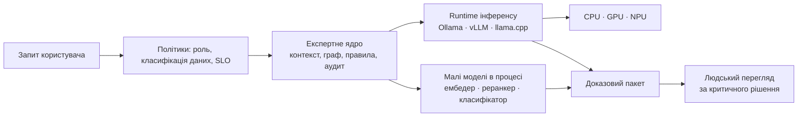
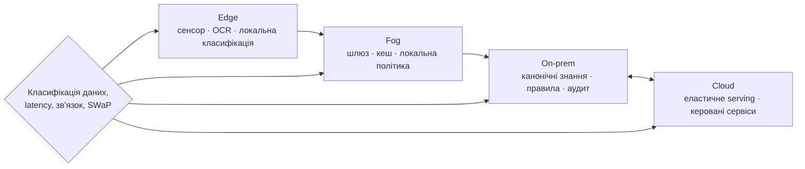
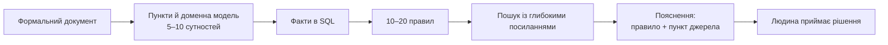

# Інфраструктура виконання експертної системи: моделі, апаратура і розміщення

> **Серія:** [Експертні системи для R&D](README.md) · стаття 07 із 21  
> **Попередня стаття:** [06 — Архітектура експертної системи: від знання до доказового рішення](06-Expert-Systems-Architecture-UA.md)  
> **Наступна стаття:** [08 — Експертна система це дещо більше, ніж інформаційно-довідкова система](08-Expert-Systems-Beyond-Reference-UA.md)  
> **Зміст серії:** [README](README.md)  
> **Рівень:** Розробники: впевнений базовий  
> **Після статті:** оцінити інфраструктурний контур, бюджет затримки, пропускну здатність і вартість запиту.  
> **Подача матеріалу:** апаратні та ML-терміни прив'язані до вимірюваної метрики або формули.

У попередній статті я зібрав логічну архітектуру доказової експертної системи: знання, граф, пошук, правила, моделі, пояснення, людський перегляд, аудит, калібрування і походження. Але архітектура не висить у повітрі. Вона має фізично виконуватися: у процесах операційної системи, у пам'яті, на центральному процесорі, графічному процесорі, нейропроцесорі, у хмарі, на сервері у власному периметрі або на периферійному пристрої близько до сенсора.

Ця стаття - про інфраструктуру виконання. Не в сенсі «який сервер купити», а в сенсі «яка форма математики й ризику вимагає якого середовища». Правила, граф і запити мовою структурованих запитів добре живуть на центральному процесорі. Векторні подання і великі мовні моделі тягнуть за собою щільну лінійну алгебру, прискорювачі й пам'ять. Периферійні сценарії додають обмеження тепла, живлення, маси, вібрації і приватності. Якщо це не врахувати, система може бути правильною на папері, але гарячою, дорогою, нестабільною або невідтворюваною в реальному виконанні.

> **Практичний досвід автора.** У таких вставках я відокремлюю виміряні на власних стендах результати від загальних технічних орієнтирів. Вони доводять практику конкретної системи, але не замінюють бенчмарк на іншій моделі, пристрої, версії драйвера чи профілі навантаження.

> **Трасування інфраструктури.** Нижче - місток між логікою експертної системи і фізичним виконанням.
>
> | Інфраструктурна межа | Що вона обслуговує | Математика або інженерний ризик |
> |---|---|---|
> | Координація викликів моделей | Вибір моделі, контекст, аудит виклику | Планування, політики, черги |
> | Машинне виведення (*inference*, інференс) | Виконання навчених моделей | Лінійна алгебра, пам'ять, числова відтворюваність |
> | Топологія розгортання | Хмара, власний периметр, периферія | Затримка, доступ, класифікація даних |
> | Апаратний шар | Центральні, графічні й нейропроцесори, програмовані матриці, спеціалізовані мікросхеми | Логіка, графи, матриці, сигнали |
> | Живлення і тепло | Сервери, автомобілі, безпілотні літальні апарати, наземні роботи | Потужність, маса, охолодження, надійність |

## Інфраструктурне дзеркало архітектурного ядра

Якщо архітектура відповідає на питання, де проходять логічні межі ядра, то інфраструктура має показати їхнє фізичне дзеркало. Інфраструктура не додає нову істину поверх архітектури. Вона забезпечує, щоб архітектурне ядро могло стабільно виконувати свою роботу: тримати канонічні знання, викликати відокремлені компоненти, переживати відмови сторонніх систем, фіксувати походження обчислень і не втрачати контроль над рішенням.

Тому інфраструктура має бути спроєктована не навколо одного великого сервера, а навколо архітектурних меж відповідальності:

| Логічна частина архітектури | Інфраструктурне забезпечення | Що буде, якщо межу переплутати |
|---|---|---|
| Архітектурне ядро: факти, правила, граф, політики, аудит | Надійний процес або служба ядра, транзакційне сховище, журнал подій, резервні копії, спостережуваність | Падіння моделі або індексу може зупинити всю систему і зруйнувати відтворюваність |
| Власні функціональні підсистеми: конектори, збирання, нормалізація, індексація, пояснення | Окремі робочі процеси, черги, планувальник задач, контроль повторів, ізоляція помилок, обмеження ресурсів | Помилка в одному конекторі або важкій пакетній задачі блокує ядро |
| Сторонні інтегровані системи: пошук, векторна база, оптичне розпізнавання символів, великі мовні моделі, середовище машинного виведення, системи керування життєвим циклом виробу й застосунку, конвеєри безперервної інтеграції та доставки | Чіткі програмні інтерфейси, обмеження часу очікування, резервні режими, версії клієнтів, адаптери, перевірка сумісності | Зовнішній продукт починає непомітно диктувати логіку експертного рішення |
| Апаратний шар: центральні, графічні й нейропроцесори, пам'ять, периферія | Розміщення навантажень за типом математики, контроль пам'яті, пріоритети, теплові й енергетичні бюджети | Правильна логіка стає повільною, дорогою або нестабільною у виконанні |

Це і є логічний зв'язок між архітектурою та інфраструктурою. Архітектура визначає, що ядро має залишатися власником експертного рішення. Інфраструктура показує, які процеси, сховища, черги, прискорювачі й режими відмов потрібні, щоб це правило витримало реальне навантаження.

## Експертна система як координатор виконання, а не сервер машинного виведення

Тут варто зупинитися на питанні, яке часто виникає в командах: чи має сенс експертній системі ставати оператором великої мовної моделі або навіть замінити локальне середовище виконання на кшталт Ollama? (колись у мене був такий намір)

Експертна система вже виконує операторські функції навколо кожного виклику моделі: вибирає домен, формує контекст із графа знань, додає запит до моделі, фільтрує джерела за політикою доступу, оцінює якість відповіді, пише трасу міркування. Сервер машинного виведення (*inference server*) у цій схемі - виконавчий рушій, а експертна система - координатор виконання з логікою.

**Де є сенс розширити роль системи.** Маршрутизація моделей - логічна наступна відповідальність: запит із домену функціональної безпеки йде до моделі, дотренованої на стандарти; просте зведення тексту - до дешевшої меншої моделі; запит із конфіденційними даними - лише до локального виконання, ніколи в хмару. Система вже має компоненти для вибору з урахуванням заліза і виявлення нейропроцесора, тож вибір моделі за контекстом є природним розширенням.

Аудитний шар перед моделлю - теж відповідальність системи. Кожен виклик моделі має потрапляти у трасу міркування разом із версією моделі, запитом і параметрами, інакше висновки не відтворювані. Коли система працює як посередник між власним конвеєром і середовищем виконання, цей шар стає органічним, а не окремим.

Нативне, тобто пряме локальне, виконання малих спеціалізованих моделей - ще одна природна роль. Ембедер, реранкер, класифікатор домену, розпізнавання інженерних ідентифікаторів (*Named Entity Recognition*, NER) можуть запускатися безпосередньо в процесі системи; зовнішнє середовище виконання потрібне лише для великих генеративних моделей.

**Де сенсу немає.** Системі не варто самостійно реалізовувати керування ваговими файлами, квантизацією, пам'яттю графічного процесора і пакетним виведенням від кількох клієнтів — це спеціалізована відповідальність runtime на кшталт Ollama, vLLM або llama.cpp. Будувати цей шар усередині експертної системи означало б переписати значну частину serving-інфраструктури без доменної вигоди.

Практичне правило: експертна система - це **розумний клієнт моделі з шаром політик і доказовості**, а не сервер машинного виведення.



> **Практичний досвід автора.** Поділ у мене вийшов рівно за цим правилом: експертна система - не сервер виконання моделей, а їх розумний клієнт. Велику генерацію я делегую локальному середовищу Ollama через OpenAI-сумісний інтерфейс, а малі моделі - ембедер і реранкер - рахую нативно в процесі. Що планую далі - не міняти середовище виконання, а доростити навколо нього шар маршрутизації: вибір моделі за доменом запиту і за класифікацією даних.

## Шар машинного виведення: процеси, пам'ять і межа з експертним ядром

**Машинне виведення** (*inference*, далі - інференс) - це виконання вже навченої моделі на конкретному запиті: порахувати векторне подання тексту, класифікувати фрагмент, переранжувати кандидатів або згенерувати відповідь. У статтях про штучний інтелект це слово часто звучить майже магічно, але технічно йдеться про цілком земні обчислення: матриці, вектори, пам'ять, драйвери, черги і прискорювачі.

Варто одразу домовитися про термін. Коли в цій статті - і в її заголовку - я кажу «моделі», то маю на увазі саме цей шар: навчені статистичні моделі, які система викликає як інструмент, а не правила чи граф знань. На практиці це кілька різних класів: 
- **великі мовні моделі** (*Large Language Model*, LLM) для генерації й зведення тексту; 
- **ембедери** (*embedding models*), що перетворюють текст на векторне подання для семантичного пошуку; 
- **реранкери** (*rerankers*), що переранжовують знайдених кандидатів за релевантністю;  
- **малі класифікатори чи розпізнавачі сутностей** для маршрутизації запитів та фільтрації. 

У попередній частині, де я описував логічну архітектуру, усі вони ховалися за однією клітинкою схеми - «моделі»; тут я розкриваю, що ця клітинка фізично означає для процесів, пам'яті й заліза. І головне - не плутати моделі з експертним ядром: модель дає імовірнісну підказку, а ядро з правил, графа й політик перетворює її на доказове рішення.

Є ще одна межа, яку легко недооцінити: межа між експертним ядром і шаром машинного виведення. На схемі вона може виглядати як проста стрілка: система попросила ембедер порахувати вектор або модель згенерувати відповідь. У реальному виконанні за цією стрілкою ховаються нативні бібліотеки, драйвери, пам'ять, черги, прискорювачі й режими відмови.

Це важливо, бо експертне ядро і шар машинного виведення ламаються по-різному. Експертне ядро працює з фактами, правилами, графом, політиками і журналом аудиту. Воно має залишатися живим навіть тоді, коли модельне середовище впало, зависло або повернуло помилку. Шар машинного виведення, навпаки, працює ближче до заліза: завантажує нативні бібліотеки, тримає ваги моделей у пам'яті, рахує вектори, використовує центральний процесор, графічний процесор або нейропроцесор, іноді проходить через C/C++ код.

Тому є два базові режими побудови.

**Внутрішнє машинне виведення у процесі системи** корисне, коли потрібна мала затримка і контрольований набір моделей: ембедер, реранкер, класифікатор домену, розпізнавання інженерних сутностей. Перевага - простота й мінімальні накладні витрати. Недолік - спільна доля процесу: помилка нативного середовища виконання може зачепити все ядро.

**Окремі робочі процеси машинного виведення** потрібні, коли модель важка, залізо нестабільне, є графічний процесор або нейропроцесор, багато паралельних запитів або потрібна стійкість до падінь. Тоді експертна система викликає модель через окремий процес, локальний сервіс, чергу або шину повідомлень. Якщо робочий процес падає, ядро не зникає: воно бачить відмову, записує її в журнал, може повторити запит, перейти на резервний режим CPU або чесно сказати користувачу, що модельний шар зараз недоступний.

Окремий практичний біль - рух даних. Для людини «порахувати ембединг» звучить як одна дія. Для машини це шлях через кілька буферів: текст треба прочитати, токенізувати, перетворити на числові масиви, передати в середовище виконання, покласти в тензор, отримати вектор назад і записати його в індекс. Якщо на кожному кроці дані копіюються, слабке локальне або периферійне залізо може впертися не в математику, а в пам'ять.

Тому для шару машинного виведення важливі не лише питання «яку модель узяти», а й більш нудні, але вирішальні речі:

- де проходить межа процесу;
- що буде, якщо нативна бібліотека впаде;
- скільки разів дані копіюються між середовищем виконання, мовою програмування і тензорною пам'яттю;
- які запити мають пріоритет;
- чи можна скасувати або витіснити фонову пакетну обробку;
- який резервний режим дозволений: графічний процесор -> центральний процесор, локальна модель -> менша локальна модель, відповідь -> відмова;
- які версії середовища виконання, драйвера, токенізатора, квантизації і пристрою потрапляють у доказовий слід.

Для доказової системи це не низькорівнева екзотика. Якщо один і той самий запит сьогодні рахувався на графічному процесорі, завтра на нейропроцесорі, а після оновлення драйвера - на центральному процесорі з іншою квантизацією, то це вже частина походження відповіді. Висновок має фіксувати не тільки модель, а й середовище виконання: пристрій, режим точності, параметри, резервний перехід і причину цього переходу.

> **Практичний досвід автора.** На ранньому етапі я допускаю нативне виконання малих моделей у процесі системи: це простіше, швидше і добре підходить для контрольованого локального середовища. Але архітектурно я не вважаю це остаточною межею. Для важчих або ризиковіших сценаріїв правильний напрям - окремі робочі процеси машинного виведення, де падіння середовища виконання не валить експертне ядро. Так само важливо не втратити числову перевірюваність: потрібен еталонний набір входів і векторів, щоб після зміни драйвера, пристрою або квантизації помітити, що числова поведінка попливла.

## Топології розгортання

Архітектура залежить від того, де фізично живуть дані і моделі.

**Хмарна топологія** (*cloud*) підходить для менш чутливих доменів, де важлива швидкість запуску, масштабування і доступ до керованих сервісів. Практично: це добрий варіант для внутрішнього пошуку знань без суворих обмежень на дані.

**Локальне розгортання у власному периметрі** (*on-premises*) потрібне там, де дані не можуть виходити за межі організації: оборонні проєкти, автомобільна функціональна безпека, напівпровідники, медичні або державні системи. Практично: доведеться самостійно тримати обслуговування моделей, векторні індекси, потужність прискорювачів, резервні копії, моніторинг.

**Гібридна топологія** (*hybrid*) часто найреалістичніша: чутливі дані й виведення локально, загальні моделі або нечутливі навантаження у хмарі. Практично: потрібна маршрутизація запитів за класифікацією даних і рішенням політики доступу.

**Периферійна топологія** (*edge*) потрібна там, де знання або сигнали виникають близько до пристрою: виробничий стенд, автомобільний шлюз, промисловий контролер, польовий ноутбук. Практично: периферійний вузол може робити оптичне розпізнавання символів, знеособлення, вилучення чутливих даних, класифікацію чи локальний пошук до передачі в центр.

**Туманна топологія** (*fog*) - проміжний шар між периферією і центром: локальні шлюзи, мікро-датацентри чи *цехові сервери*, що агрегують десятки периферійних вузлів. Практично: туманний вузол бере на себе те, що завелике для одного сенсорного пристрою, але не потребує дороги в хмару - злиття даних із кількох джерел, важче виведення, проміжне кешування, локальне застосування політик і буфер на час зриву зв'язку. Це зона жорстких компромісів затримки, енергії та вартості, де оптимізація виконання моделей на гетерогенному залізі дає найбільший виграш.

Жодна топологія не є універсальною. Правильна топологія випливає з даних: де вони виникають, хто має право їх бачити, яка потрібна затримка, як довго їх зберігати, які вимоги до аудиту. Самі ж топології відповідають лише на питання «де живуть дані»; за яким фізичним бюджетом потужності, тепла й маси виконується кожен рівень - від стійки в дата-центрі до вузла на безпілотнику - розглянуто далі, у розділі про живлення й тепловий пакет.



Схема не наказує послідовність «edge → cloud»: вона показує варіанти розміщення. Політика обирає шлях для конкретного запиту; чутливий артефакт може лишитися на периферії або у власному периметрі, навіть коли поруч доступна хмара.

## Апаратний шар: від універсального процесора до спеціалізованих прискорювачів

Апаратний шар не є окремою темою для дата-центру. Він впливає на архітектуру знань, затримку, приватність, вартість і місце виконання. Головне правило просте: різні класи математичних обчислень лягають на різне залізо, і «швидше» для одного класу не означає «швидше» для іншого.

### Сучасна апаратна база: вибираємо платформу разом зі стеком

Станом на серпень 2026 року «прискорювач» означає вже не тільки окрему GPU-карту. Практична одиниця вибору — **пристрій + пам'ять і міжз'єднання + компілятор/SDK + runtime + профіль навантаження**. Усі цифри виробника — пікові для визначеної точності й конфігурації; вони не замінюють вимірювання p95 latency, якості та вартості на власному golden set.

| Екосистема | Сучасна апаратна база та стек | Де перевіряти першою | Архітектурна межа |
|---|---|---|---|
| NVIDIA | Blackwell (B200/GB200, RTX Blackwell, DGX), платформа Vera Rubin; CUDA, TensorRT/TensorRT-LLM, NIM, NVLink/Spectrum-X | Rack-scale training/serving, workstation R&D, inference за TensorRT | Rubin — нове покоління з мінливою доступністю; перевіряйте точні GPU, CUDA, driver і memory topology |
| AMD | Instinct MI300/MI350, Radeon AI PRO, Ryzen AI/XDNA NPU; ROCm 7, HIP, ROCm profiler | Відкритий GPU-стек для training/inference, від workstation до rack | Матриця ROCm залежить від ОС, архітектури GPU й версії ядра/runtime |
| Intel | Xeon з AMX, Gaudi, Arc, Core Ultra NPU; oneAPI, OpenVINO, ONNX Runtime | CPU/NPU/GPU inference та організації з Intel-парком | Не переносити автоматично модель між NPU, Arc, Gaudi й Xeon без backend-specific бенчмарку |
| Google, AWS, Microsoft | Google TPU/Axion + JAX/XLA/TensorFlow; AWS Trainium, Inferentia, Graviton + Neuron; Azure Maia, Cobalt + ONNX Runtime, DirectML, Azure AI | Кероване навчання/serving у хмарі, коли важливий швидкий масштаб | Це насамперед інфраструктура конкретної хмари: оцініть регіон, перенесення даних, lock-in і ціну запиту |
| Meta, Qualcomm, Apple | Meta MTIA, PyTorch, ExecuTorch, Llama infrastructure; Snapdragon/Hexagon NPU/AI Engine/QNN; Apple Neural Engine, M-series, Core ML, Metal | PyTorch-ланцюги, mobile/edge inference, приватна локальна обробка | MTIA переважно внутрішня інфраструктура Meta; QNN і Core ML вимагають конвертації та тесту операцій моделі |
| Спеціалізоване serving | Cerebras Wafer-Scale Engine/CS systems/Cerebras Software; Groq LPU/GroqCloud/compiler-runtime | Вузькі сценарії великого training або низьколатентного inference | Оцінюйте повний workflow, доступність моделей, API і вихід із платформи, а не лише чип |
| Регіональні й корпоративні системи | Huawei Ascend, Kunpeng, CANN, MindSpore; IBM AIU, Power, Telum, watsonx, OpenPOWER | Sovereign/on-prem середовища та корпоративна інтеграція | Поставки, регіональний комплаєнс і підтримка конкретного framework можуть бути визначальними |
| Програмовані й альтернативні прискорювачі | Tenstorrent RISC-V + AI accelerators, Wormhole/Blackhole, TT-Metal; SambaNova DataScale/RDU/Suite; Graphcore IPU/Poplar | Дослідницький або спеціалізований кластер, де доступний їхній compiler path | Перед закупівлею потрібен пілот: maturity моделей, компілятора, runtime і каналу постачання різняться |
| Edge і silicon IP | Cambricon MLU/NeuWare; SiMa.ai MLSoC/Palette; Hailo accelerators/Edge AI processors/HailoRT; Synopsys ARC NPX NPU IP, AI accelerator IP і EDA | Vision, sensor fusion, локальний low-power inference; проєктування власного SoC | Synopsys продає IP/EDA, а не готовий сервер; для edge критичні формат моделі, плата, тепло й життєвий цикл SDK |

Ця карта оновлює, а не скасовує головний принцип статті: обирають не бренд, а перевірюваний шлях від моделі до корисного результату. Детальніші варіанти SDK і постачальників зібрано також у [статті 05](05-Expert-Systems-Implementation-Stack-UA.md#екосистеми-апаратури-та-пз-карта-вибору-а-не-рейтинг).

Перш ніж рахувати, домовмося про термінологію. **Перформанс** (продуктивність) обчислювача - це обсяг корисної роботи за одиницю часу, а на периферії ще й за одиницю енергії та вартості. 

Для математики зі штучним інтелектом базова одиниця роботи - операція з рухомою комою (*Floating-Point Operation*, FLOP): одне множення або додавання над дробовими числами. Швидкодію відповідно міряють у **FLOPS** (*Floating-Point Operations Per Second*) - скільки таких операцій залізо виконує за секунду: гіга- (10^9 GFLOPS), тера- (10^12 TFLOPS), пета- (10^15 PFLOPS). 

Для цілочисельних і малорозрядних обчислень (INT8/INT4) аналог це **OPS** і **TOPS** (трильйони операцій за секунду).

Навіщо формули нижче. По-перше, щоб чесно порівнювати залізо: маркетингове порівняльне слово «швидше» нічого не варте, поки не видно, скільки саме операцій і над якими даними. По-друге, щоб бачити різницю між паспортним піком і досяжним перформансом - вона часто кратна. По-третє, щоб для кожного класу обчислень експертної системи (правила, вектори, малорозрядне виведення) обрати прискорювач за числами, а не за хайпом. Далі - по одній формулі на клас заліза, з визначенням термінів і прикладом розрахунку.

**Як рахувати піковий перформанс.** Базова формула однакова для будь-якого обчислювача: кількість обчислювальних одиниць, помножена на тактову частоту і на кількість операцій з рухомою комою за такт. Множник «×2» майже завжди присутній - це FMA (*Fused Multiply-Add*), злите множення-додавання виду a*b+c, яке апаратно рахується як дві операції.

```math
\begin{aligned}
P_{\mathrm{peak}} = N_{\mathrm{units}} \times f_{\mathrm{clock}} \times \mathrm{FLOP}_{\mathrm{cycle}} \\
8192 \times 2\,\mathrm{GHz} \times 2 \approx 32.8\ \mathrm{TFLOPS}
\end{aligned}
```

Це лише «стеля з паспорта»: реальний перформанс майже завжди нижчий, бо впирається або в пам'ять, або в неідеальне завантаження конвеєрів. Формули нижче показують, як ця стеля рахується для кожного класу заліза.

**Центральний процесор** (*Central Processing Unit*, CPU) тримає більшість системи: бази даних, SQL, графові запити, рушій правил, програмні інтерфейси, черги, аудит, перевірки доступу, збирання даних, ETL-конвеєри (*Extract, Transform, Load* - витягнути, перетворити, завантажити), невеликі моделі. Це залізо для математики з розгалуженнями і нерегулярним доступом до пам'яті: логіка предикатів і пряме/зворотне виведення рушія правил, обхід графа, рекурсивні запити, булева і реляційна алгебра.

Бренди й архітектури тут визначають межі: серверні x86-64 (Intel Xeon, AMD EPYC) дають багато ядер, широкі канали пам'яті й векторні розширення; ARM (AArch64) - Ampere Altra, AWS Graviton, Apple Silicon - виграє в продуктивності на ват. Практично: CPU лишається головним робочим шаром експертної системи, бо саме такої математики в ній найбільше.

Коли кажемо «векторні розширення», йдеться не про окремий прискорювач поруч із CPU, а про SIMD-блоки (*Single Instruction, Multiple Data*) всередині ядра: одна інструкція виконує одну операцію над кількома числами. На x86 це сімейство SSE, AVX, AVX2 і AVX-512: 128-бітні XMM-регістри, 256-бітні YMM-регістри, 512-бітні ZMM-регістри, маскові регістри k0-k7 для AVX-512, блоки FMA (*Fused Multiply-Add*) для операцій виду a*b+c і векторні блоки завантаження/запису пам'яті. У новіших серверних Intel є AMX (*Advanced Matrix Extensions*) з плитковими регістрами TMM для матричних множень у низькій розрядності. На ARM це NEON/Advanced SIMD зі 128-бітними Q/V-регістрами, а в серверному та HPC-сегменті - SVE/SVE2 зі масштабованими Z-регістрами і предикатними P-регістрами. Практично: CPU добре тягне невеликі ембедери, реранкери або фільтри там, де дані вже в кеші й важлива мала затримка; але для великих пакетів щільної математики GPU/NPU усе одно виграють за паралелізмом і енергією.

**Приклад розрахунку для CPU.** Паралелізм центрального процесора дає SIMD: ширину векторного регістра ділимо на розрядність одного числа (для AVX-512 і 32-бітного FP32 це 512/32 = 16 чисел за інструкцію), множимо на кількість ядер, частоту, кількість FMA-блоків і на 2.

```math
\begin{aligned}
\mathrm{FLOPS}_{\mathrm{CPU}} = N_{\mathrm{cores}} \times f \times \dfrac{W_{\mathrm{SIMD}}}{b_{\mathrm{elem}}} \times N_{\mathrm{FMA}} \times 2 \\
32 \times 2.5\,\mathrm{GHz} \times \dfrac{512}{32} \times 2 \times 2 \approx 5.1\ \mathrm{TFLOPS}
\end{aligned}
```

32 серверні ядра з AVX-512 на 2,5 ГГц дають близько 5 TFLOPS у FP32 - за двох блоків FMA на ядро; на порядок менше за GPU, але цього вистачає для малих ембедерів і реранкерів, де дані вже в кеші й важить мала затримка.

RISC-V (*Reduced Instruction Set Computer V*) варто винести окремо, бо оцінка його ролі в AI швидко змінюється. Це відкрита архітектура набору інструкцій (*Instruction Set Architecture*, ISA): виробник може брати спільну базу і додавати профілі продуктивності, вектори, функціональну безпеку та доменно-специфічні прискорювачі без повної прив'язки до одного постачальника (*vendor lock-in*). Для векторної математики ключова ідея - RVV (*RISC-V Vector Extension*) зі змінною довжиною векторного регістра: той самий код може масштабуватися від компактного edge-чипа до ширшого ядра без жорстко пришитої довжини 128/256/512 біт. Це пояснює, чому RISC-V усе частіше оцінюють як ефективну основу для периферійного AI (*edge AI*) й автомобільного AI (*automotive AI*): невеликі моделі, сенсорні фільтри, класифікатори, контрольні контури й локальний інференс можна ближче підганяти під енергобюджет і вимоги безпеки. 
Показовий маркер - Infineon: у 2025 році компанія оголосила майбутню автомобільну RISC-V-родину мікроконтролерів у межах бренду AURIX, а в матеріалі 2026 року описує RISC-V як основу для програмно-визначених автомобілів (*software-defined vehicles*), де бортовий AI обробляє сенсорні дані в реальному часі. Це не означає, що RISC-V уже замінює x86/ARM у дата-центрі; радше він стає серйозним кандидатом для вбудованого й безпечного AI там, де важливі відкритість ISA, довгий життєвий цикл і керована вартість.

**Графічний процесор** (*Graphics Processing Unit*, GPU) потрібен для масових тензорних обчислень: векторних подань, виведення великих мовних моделей, повторного ранжування, оптичного розпізнавання символів, комп'ютерного зору, пакетної обробки документів. Це залізо для щільної лінійної алгебри: множення матриць і тензорів, згортки, паралельні однотипні операції над великими масивами чисел.

Ринок тут неоднорідний: NVIDIA задає тон дата-центровими архітектурами Ampere, Hopper і Blackwell з екосистемою CUDA, тензорними ядрами й швидким міжз'єднанням NVLink - конкретно це A100, H100/H200, B200 і GB200; AMD конкурує лінійкою Instinct і стеком ROCm - MI250, MI300X, MI325X; Intel має Data Center GPU Max 1550, Gaudi 2 і Gaudi 3; власні екосистеми закривають Apple Silicon M3/M4 і Huawei Ascend 910B. Для великих мовних моделей вирішальні обсяг відеопам'яті, пропускна здатність пам'яті з високою пропускною здатністю (*High Bandwidth Memory*, HBM) і підтримка низької розрядності: 16-, 8- і 4-бітних форматів.

**Приклад розрахунку для GPU.** Для графічного процесора «одиниці» - це його обчислювальні ядра (CUDA-ядра або потокові процесори), а множник «×2» - та сама FMA.

```math
\begin{aligned}
\mathrm{FLOPS}_{\mathrm{GPU}} = N_{\mathrm{cores}} \times f \times 2_{\,\mathrm{(FMA)}} \\
16896 \times 1.98\,\mathrm{GHz} \times 2 \approx 67\ \mathrm{TFLOPS}\ (\mathrm{FP32})
\end{aligned}
```

Близько 16,9 тис. ядер на ~2 ГГц дають приблизно 67 TFLOPS у FP32 - це векторний (не тензорний) шлях, рівень H100 на загальних обчисленнях; для самого виведення мовних моделей працюють тензорні ядра у FP16/FP8, де паспортні числа на порядок-два вищі. Але для великих мовних моделей вузьким місцем частіше є не множення, а постачання даних, тож поряд із піком завжди рахують пропускну здатність пам'яті: ефективну частоту передачі множимо на ширину шини в байтах і на кількість каналів.

```math
\begin{aligned}
\mathrm{BW} = f_{\mathrm{mem}} \times \dfrac{W_{\mathrm{bus}}}{8} \times N_{\mathrm{ch}} \\
4800\,\mathrm{MT/s} \times \dfrac{64}{8}\,\mathrm{B} \times 2 \approx 76.8\ \mathrm{GB/s}
\end{aligned}
```

Звичайна двоканальна DDR5-4800 дає близько 77 ГБ/с; серверна пам'ять HBM3 на прискорювачі - кілька терабайтів за секунду, і саме цей розрив часто визначає, скільки коштує токен.

**Нейропроцесор** (*Neural Processing Unit*, NPU) потрібен для периферійного і локального виведення: промисловий шлюз, захищений ноутбук, мобільний пристрій, автомобільний контролер. Це та сама лінійна алгебра, що й на GPU, але зазвичай у низькій розрядності й з оптимізацією під енергоефективність. На підтриманій моделі NPU може дати кращий результат на ват, ціною меншої гнучкості формату та операцій; це потрібно перевіряти для конкретного runtime. У клієнтському залізі це Intel Core Ultra 7 165H/Core Ultra 9 288V з Intel AI Boost, AMD Ryzen AI 9 HX 370 з XDNA 2, Qualcomm Snapdragon X Elite X1E-84-100 з Hexagon NPU, Apple M4 Neural Engine; на периферії - Google Coral Edge TPU, Hailo-8/Hailo-10H, Rockchip RK3588 NPU, Ambarella CV3; а на рівні мікроконтролерів - Infineon PSoC Edge (ядро Arm Cortex-M55 з мікронейропроцесором Arm Ethos-U55), де ML-тулчейн DEEPCRAFT і ModusToolbox, а також інтеграція моделей NVIDIA TAO дають міліватний зоровий, голосовий та аудіоінференс просто на пристрої - із меншою затримкою, приватністю й енергоспоживанням, бо дані не залишають сенсорний вузол. Показовий приклад - офіційний репозиторій Infineon, де моделі детекції об'єктів NVIDIA TAO (DetectNet_v2, PeopleNet) після обрізання й квантизації в INT8 запускаються прямо на PSoC Edge з прискоренням Ethos-U і дають порядку кількох десятків кадрів на секунду - достатньо для підрахунку людей, контролю зон чи виявлення засобів захисту без відправлення відео в датацентр. 

Ключова характеристика - продуктивність у трильйонах операцій на секунду (*Tera Operations Per Second*, TOPS) при жорсткому енергобюджеті.

**Приклад розрахунку для NPU.** Нейропроцесор рахують у цілочисельних операціях: кількість блоків множення-накопичення (MAC) помножити на 2 і на частоту. Результат - у трильйонах операцій за секунду (TOPS) для форматів INT8/INT4.

```math
\begin{aligned}
\mathrm{TOPS} = N_{\mathrm{MAC}} \times 2 \times f \\
4096 \times 2 \times 1.4\,\mathrm{GHz} \approx 11.5\ \mathrm{TOPS}\ (\mathrm{INT8})
\end{aligned}
```

Масив на 4096 MAC-блоків на 1,4 ГГц дає близько 11,5 TOPS - небагато проти серверного GPU, але вирішує інша метрика. Для периферії важливий не абсолютний перформанс, а перформанс на ват: операції за секунду поділити на спожиту потужність.

```math
\begin{aligned}
\eta = \dfrac{\mathrm{TOPS}}{P_{\mathrm{watt}}} \\
\mathrm{NPU}:\ \dfrac{11.5}{5} \approx 2.3 \quad \mathrm{vs} \quad \mathrm{GPU}:\ \dfrac{67}{350} \approx 0.19\ \ [\mathrm{T/W}]
\end{aligned}
```

Нейропроцесор на ~5 Вт дає близько 2,3 TOPS/Вт, тоді як потужний GPU на 350 Вт - частки одиниці; саме тому в сценаріях із жорстким бюджетом маси й живлення (SWaP) NPU виграє, попри менший абсолютний перформанс.

**Тензорний процесор** (*Tensor Processing Unit*, TPU) - спеціалізований прискорювач Google під ті самі матричні обчислення, що й GPU, але має сенс переважно в хмарних навантаженнях машинного навчання в Google Cloud (окрема едж-лінійка - Coral Edge TPU для виведення на пристрої - згадана вище серед NPU). Конкретні покоління: Cloud TPU v4 для великих навчальних подів, TPU v5e як економніший варіант для тренування й виведення, TPU v5p для важчих моделей, а також Trillium/TPU v6e як новіша хмарна генерація з фокусом на продуктивність на ват.

**Процесор обробки даних** (*Data Processing Unit*, DPU) розвантажує мережу, захищений транспортний протокол TLS (*Transport Layer Security*), віртуалізацію сховищ і обробку безпеки. Типові моделі й сімейства: NVIDIA BlueField-2/BlueField-3, AMD Pensando DSC2, Intel Infrastructure Processing Unit E2000, Marvell OCTEON 10 DPU. Це не математичний, а інфраструктурний прискорювач: він корисний для конфіденційних потоків знань із великим трафіком, де шифрування й ізоляція не мають красти цикли CPU у рушія правил і бази даних.

**Програмована логічна матриця** (*Field-Programmable Gate Array*, FPGA) дає детерміновану затримку і спеціалізовану обробку сигналів, бо обчислення «впаяне» у саму схему. Ринок тут практично поділили два гравці: AMD (після поглинання Xilinx) із сімействами Versal, Virtex і Kintex та Intel (після поглинання Altera) із сімействами Agilex і Stratix; обидва вже мають у кристалах вбудовані AI-блоки (AMD - AI Engine у Versal, Intel - AI Tensor Block в Agilex). Практично для теми статті: промислова телеметрія й специфічні протоколи - це вбудована попередня обробка цифрового сигналу до того, як сирий потік стане фактом у базі знань.

**Система на кристалі** (*System-on-Chip*, SoC) і **система в корпусі** (*System-in-Package*, SiP) - це не окремий клас алгоритмів, а спосіб зібрати обчислювальний вузол щільніше. У SoC на одному кристалі можуть жити процесорні ядра, RAM/ROM, внутрішня шина, зовнішні інтерфейси USB/HDMI, Wi-Fi/Bluetooth, GPU, аналого-цифрові перетворювачі, регулятори напруги й спеціалізовані блоки прискорення. У SiP кілька кристалів пакуються в один корпус, коли одну функцію вигідніше тримати окремим чиплетом або пам'яттю, але фізично близько до обчислення. Для експертної системи на периферії це важливо не як «великий AI», а як компактний, енергоефективний і захищений вузол: камера, промисловий сенсор, шлюз або контролер можуть робити первинну класифікацію, фільтрацію й нормалізацію даних до передачі в центральну базу знань. Саме так Infineon описує цінність SoC/SiP/FPGA-підходу: вищий рівень інтеграції, компактність, ефективність, нижча вартість серійного виробу й захист інтелектуальної власності.

**Спеціалізовані мікросхеми** (*Application-Specific Integrated Circuit*, ASIC; *Vision Processing Unit*, VPU; *Digital Signal Processor*, DSP) закривають вузькі задачі: виведення на ват, комп'ютерний зір, обробку аудіо, радіо або сенсорних сигналів. Це математика цифрової обробки сигналів - швидке перетворення Фур'є, фільтрація, згортки - зафіксована в кремнії. AWS Inferentia прискорює підтриманий inference у своєму стеку; Google Edge TPU орієнтований на сумісні INT8 edge-моделі; Groq LPU — на низьколатентне виконання підтриманих моделей, зокрема LLM. VPU на кшталт Intel Movidius доречний для компактного комп'ютерного зору, а DSP на кшталт Qualcomm Hexagon чи Texas Instruments — для попередньої обробки сенсорних і аудіосигналів до їхньої промотації в знання.

**Обчислення в пам'яті та біля пам'яті** (*in-memory / near-memory computing*) цікаві для великих векторних індексів, де вузьким місцем стає не саме обчислення, а переміщення даних при пошуку найближчих сусідів. Приклади заліза: Samsung HBM-PIM/Aquabolt-XL переносить частину простих операцій ближче до HBM-пам'яті, SK hynix GDDR6-AiM/AiMX експериментує з прискоренням AI біля графічної пам'яті, UPMEM PIM-DIMM додає обчислювальні ядра прямо в DRAM-модулі, а Mythic M1076 використовує аналогове обчислення в пам'яті для компактного edge-інференсу. У практичній експертній системі це поки не стандартний серверний компонент, але напрям важливий: коли база знань стає векторною пам'яттю, ціна руху байтів починає конкурувати з ціною множення.

**Нейроморфні чипи** (*neuromorphic chips*) поки лишаються нішовою і дослідницькою територією, але цікаві для малопотужних подієвих сенсорів. Тут приклади інші: Intel Loihi 2 і IBM TrueNorth - дослідницькі платформи для імпульсних нейронних мереж (*spiking neural networks*), BrainChip Akida AKD1000 і Innatera T1 ближчі до edge-пристроїв, SynSense Speck поєднує подієвий зір із нейроморфною обробкою, а SpiNNaker2 моделює великі спайкові мережі на масиві енергоефективних ядер. Для експертних систем це радше майбутній шар сенсорного попереднього висновування: не «замінити LLM», а розпізнати подію майже без енергії ще до того, як дані потраплять у звичайний конвеєр.

> **Який клас математики на якому залізі.**
>
> | Клас обчислень | Де виникає в експертній системі | Краще залізо |
> |---|---|---|
> | Логіка, правила, обхід графа | Рушій правил, граф простежуваності, реляційні запити | CPU |
> | Щільна лінійна алгебра: матриці, тензори | Векторизація, машинне виведення LLM, реранкер | GPU, у хмарі також TPU |
> | Малорозрядне виведення на периферії | Ембедер, класифікатор домену, локальний пошук | NPU |
> | Цифрова обробка сигналів | Попередня обробка телеметрії й сенсорів | DSP, FPGA, ASIC |
> | Оптимізація, семплювання, симуляції | Ризик-моделі, сценарний аналіз | CPU/GPU; квантові - поки експеримент |

Практичний висновок: прискорювач треба вибирати під найдорожчу задачу, а не під слово «штучний інтелект». Якщо найдорожче у вас SQL і обхід графа, GPU не врятує. Якщо найдорожче - векторизація, робота лише на CPU може бути болючою. Якщо головний ризик - приватність на периферії, NPU може бути важливішим за хмарний GPU.

**Чому пік оманливий: roofline-модель.** Сирий піковий перформанс рідко досяжний. Реальну стелю задає roofline-модель через арифметичну інтенсивність - скільки обчислень припадає на кожен прочитаний байт. Досяжний перформанс дорівнює мінімуму з двох величин: піка обчислень і добутку інтенсивності на пропускну здатність пам'яті.

```math
\begin{aligned}
P_{\mathrm{att}} = \min\!\left(P_{\mathrm{peak}},\ I \times \mathrm{BW}\right),\quad I = \dfrac{\mathrm{FLOP}}{\mathrm{byte}} \\
I = 2,\ \mathrm{BW} = 76.8\,\mathrm{GB/s} \Rightarrow 153.6\ \mathrm{GFLOPS}
\end{aligned}
```

Якщо інтенсивність низька, задача впирається в пам'ять (*memory-bound*) - як пошук найближчих сусідів у векторному індексі, тому для нього й цікаві обчислення в пам'яті. Якщо висока - впирається в обчислення (*compute-bound*), як множення матриць у мовній моделі. Це і є формальна відповідь на питання, який прискорювач справді прискорить саме вашу задачу.

> **Практичний досвід автора.** Частину цих варіантів я перевіряв сам. Компоненти своєї експертної системи я профілював на Intel Core Ultra 5 135U із вбудованим нейропроцесором Intel AI Boost: через OpenVINO малі моделі - ембедер і реранкер - ідуть на NPU й вивільняють ядра CPU під рушій правил і базу. Вибір прискорювача в мене - не припущення, а ворота за доказом: маршрутизатор не вмикає виконавчий провайдер (GPU чи NPU), поки немає свіжого запису бенчмарка, що той справді обганяє CPU на моїх ядрах - пакетному скалярному добутку, L2-нормі й нормалізації векторів (міряю наносекунди на операцію й вектори за секунду). Якщо запис застарів або його немає - падаю на CPU.
>
> Бенчу на двох референсних ноутбуках. **AORUS 5 SE4** (Intel Core i7-12700H + дискретний NVIDIA GeForce RTX 3070 8 ГБ Laptop) тримає GPU-навантаження: щільна лінійна алгебра, локальне дотренування 3B-моделі (QLoRA) і вивантаження шарів моделі на відеопам'ять через Ollama. **HP EliteBook 830** (Intel Core Ultra 5 135U з нейропроцесором Intel AI Boost) тримає CPU/NPU-профіль. Правило, яке з цього вийшло, просте: обираю залізо під клас операції, а не під пристрій. Щільні тензори - на GPU (AORUS) або на NPU (EliteBook); правила, SQL і обхід графа - на CPU; а якість крослінгвального пошуку (uk->en) - окремий бенчмарк зі своїм порогом влучань, незалежний від швидкодії заліза. Куди я хочу зрушити далі - периферійний бік експертних систем і систем прийняття рішень, де висновок треба робити близько до сенсора: програмовані системи на кристалі (*Programmable System-on-Chip*, PSoC), автомобільні мікроконтролери та вбудовані прискорювачі сигналів.

## Живлення, тепловий пакет і фізичні умови розгортання

Вибором прискорювача питання не закінчується. Якщо топології вище відповідали на питання «де живуть дані», то цей розділ - на питання «за яким фізичним бюджетом це залізо працює». Те саме залізо в дата-центрі, в автомобілі, на безпілотнику і в наземному роботі живе за зовсім різними бюджетами потужності, тепла й маси - і архітектура виведення мусить це враховувати ще на етапі проєктування, а не під час інтеграції.

**Дата-центр і серверна стійка.** Тут вузьке місце - не обчислення, а живлення й тепловідведення. Стійка з сучасними GPU-прискорювачами легко виходить за 40-130 кВт, тож з'являються архітектури розподілення живлення постійного струму 800 В, GaN- і SiC-перетворювачі, пряме рідинне охолодження кристала (*direct-to-chip liquid cooling*) і занурювальне охолодження (*immersion cooling*). Для експертної системи це означає просту річ: важкі навантаження економічно тримати там, де вже є ця інфраструктура, а не намагатися втиснути їх у периферійний вузол.

**Вбудовані автомобільні рішення.** На борту автомобіля діють інші обмеження: широкий діапазон температур, безвентиляторний пасивний відвід тепла, вібрація, захисне покриття плат, живлення від бортової мережі й передусім функціональна безпека. Тут два поверхи заліза. Високопродуктивна система на кристалі (*System-on-Chip*, SoC) виконує комп'ютерний зір і нейромережеве виведення, а мікроконтролер (*Microcontroller Unit*, MCU) функціональної безпеки реального часу тримає контрольну логіку. Показовий приклад такого MCU - Infineon AURIX TC4x: третє покоління платформи на 28-нм техпроцесі, до 6 ядер TriCore v1.8 на 500 МГц у режимі lockstep (рівень ASIL-D), вбудований векторний AI-прискорювач PPU (*Parallel Processing Unit*) - SIMD-рушій із шириною вектора до 512 біт на типах INT8/INT16/INT32 для нейромережевого виведення й фільтрів Калмана, окремий блок обробки радарного сигналу SPU, апаратна кібербезпека за стандартом ISO 21434, 24 МБ вбудованої незалежної пам'яті з підтримкою оновлень «по повітрю» (*Software-Over-The-Air*, SOTA) та автомобільні інтерфейси на кшталт CAN-XL, Ethernet до 5 Гбіт/с і PCIe до 8 Гбіт/с. Він цікавий саме тим, що тензорне виведення (PPU) і детермінована контрольна логіка (ядра TriCore) сидять в одному сертифікованому кристалі - межа між «поверхом AI» і «поверхом безпеки» зміщується всередину MCU. Для теми статті ключове - поділ класів математики: важке тензорне виведення йде на SoC-прискорювач, детермінована обробка сигналу й контрольна логіка - на сертифікований MCU, а доказовість рішення лишається вимогою стандарту, а не лише доброю практикою.

**Безпілотні літальні апарати** (*Unmanned Aerial Vehicle*, UAV; українською БПЛА). Тут панує бюджет SWaP (*Size, Weight and Power* - габарити, маса й потужність): кожен ват і грам прямо коштує часу польоту. Виведення близько до сенсора роблять на компактних модулях на кшталт NVIDIA Jetson Orin NX (до 157 TOPS у INT8 при 10-40 Вт) чи Orin Nano (до 67 TOPS при 7-25 Вт), Qualcomm Flight RB5 або спеціалізованих прискорювачах на кшталт Intel Movidius VPU й Hailo-8 (26 TOPS при типових 2,5 Вт - близько 10 TOPS на ват, із вбудованою пам'яттю без зовнішньої DRAM). Тут вирішальна характеристика - не пікова продуктивність, а продуктивність на ват: саме вона визначає, скільки моделей сприйняття борт потягне, не вкорочуючи часу польоту. Обмеження протилежні до дата-центру: немає простору для радіаторів, є вібрація, перепади температур і зрив зв'язку, тож навігація, розпізнавання й первинна класифікація мають працювати автономно на борту.

**Наземні роботизовані комплекси** (*Unmanned Ground Vehicle*, UGV; українською НРК). Маса й тепло тут менш критичні, ніж на борту літального апарата, але додаються ударостійкість, пиловологозахист, стандарт MIL-STD-810, клас захисту оболонки (*Ingress Protection*, IP), широкий діапазон вхідної напруги та тривала автономна робота. Типове рішення - захищені носії на кшталт NVIDIA Jetson AGX Orin (до 275 TOPS при 15-60 Вт і до 64 ГБ єдиної пам'яті) у герметичному безвентиляторному корпусі, іноді з кількома прискорювачами під одночасний зір, локалізацію і побудову мапи (*Simultaneous Localization and Mapping*, SLAM) та ухвалення рішень. Тут ключова характеристика - більший енергобюджет і обсяг пам'яті: вони дають запас тримати кілька моделей водночас - сприйняття, SLAM і логіку прийняття рішень - без вивантаження в хмару.

Практичний висновок: архітектор експертної системи має наперед знати, де фізично виконуються векторизація, OCR, виведення і пошук, і під який бюджет потужності й тепла. Той самий конвеєр для стійки в дата-центрі, для блока функціональної безпеки в автомобілі, для модуля на безпілотнику і для захищеного носія в наземному роботі - це чотири різні інженерні задачі, а не одна.

## Квантові обчислення як можливий прискорювач

Квантові обчислення у 2026 році не є промисловим прискорювачем для типової експертної системи. Вони не замінюють SQL, граф, правила, векторний пошук чи великі мовні моделі - тобто рівно ту математику, якої в системі найбільше. Їхня потенційна користь вузька і лежить у комбінаторній оптимізації та складних симуляціях, які зрідка виринають у R&D-доменах.

Конкретні приклади, де така математика виникає в експертній системі:

- **Планування і розподіл під обмеженнями** - вибір конфігурації релізу, розкладу верифікації чи розподілу тестових ресурсів. Це задачі класу QUBO (*Quadratic Unconstrained Binary Optimization*), на які націлені квантові та квантово-надихнуті відпалювачі (*quantum annealing*).
- **Сценарний аналіз і оцінка ризику** - семплювання з великого простору можливих станів системи: відмови, залежності, наслідки змін.
- **Фізичні й хімічні симуляції** - у доменах на кшталт матеріалознавства чи напівпровідників, де сам предмет експертизи квантовий за природою; тут потенціал найреальніший, але це вже не сама експертна система, а її розрахунковий вузол.

Практичний висновок для архітектури той самий, що й для будь-якого екзотичного прискорювача - в одному ряду з обчисленнями в пам'яті та нейроморфними чипами з апаратного розділу, які теж лишаються горизонтом, а не сьогоднішньою основою: варто мати абстракцію «зовнішній оптимізаційний обчислювач» зі своїм контрактом входу й виходу, щоб за потреби підставити квантовий або квантово-натхненний обчислювальний вузол - але не ставити квантові обчислення в критичний шлях продукту і не будувати під них архітектуру наперед.

## Як вимірювати перформанс: від заліза до висновку

Усі попередні формули рахували «сирий» перформанс заліза: операції за секунду, байти за секунду, операції на ват. Але для експертної системи ці числа майже нічого не означають. Швидкий, але невідтворюваний або негрунтований висновок у R&D-домені - це від'ємний перформанс, незалежно від TOPS прискорювача. Тому перформанс системи вимірюється не одним числом, а в трьох ортогональних вимірах: **швидкість**, **якість** і **вартість/ризик**. Оцінювати треба покомпонентно й наскрізно.

### Швидкість: бюджет затримки

Латентність завжди дивляться в перцентилях (p50, p95, p99), а не в середньому - середнє ховає хвіст повільних запитів. Наскрізна затримка розкладається за межами компонентів зі статті, і ця сума одразу показує вузьке місце.

```math
\begin{aligned}
T_{\mathrm{total}} = T_{\mathrm{retr}} + T_{\mathrm{embed}} + T_{\mathrm{rerank}} + T_{\mathrm{rules}} + T_{\mathrm{LLM}} + T_{\mathrm{over}} \\
40 + 8 + 25 + 5 + 900 + 12 \approx 990\ \mathrm{ms}\ (p95)
\end{aligned}
```

Часто вузьким місцем виявляється не мовна модель, а пошук, обхід графа чи токенізація. Корисне правило: жоден шар не має з'їдати більш як половину бюджету непомітно. Пропускну здатність міряють поряд: запити за секунду під заданим p99, токени за секунду для генерації (окремо для заповнення контексту й декодування), документи за секунду для індексації.

### Якість: пошук, ранжування, доказовість

Без якості швидкість безглузда. Для пошуку базові метрики - точність і повнота на перших `k` результатах: яка частка виданого релевантна і яку частку всього релевантного ми дістали.

```math
\begin{aligned}
\mathrm{Precision}@k = \dfrac{|R \cap \mathrm{top}\,k|}{k}, \quad \mathrm{Recall}@k = \dfrac{|R \cap \mathrm{top}\,k|}{|R|} \\
P@10 = \dfrac{7}{10} = 0.70, \quad R@10 = \dfrac{7}{8} \approx 0.88
\end{aligned}
```

Порядок результатів оцінюють середнім оберненим рангом (*Mean Reciprocal Rank*, MRR): наскільки високо стоїть перша правильна відповідь.

```math
\begin{aligned}
\mathrm{MRR} = \dfrac{1}{N}\sum_{i=1}^{N}\dfrac{1}{\mathrm{rank}_i} \\
\dfrac{1}{3}\left(\dfrac{1}{1}+\dfrac{1}{2}+\dfrac{1}{4}\right) \approx 0.58
\end{aligned}
```

Коли важлива вся ранжована видача, а не лише перший влучний результат, беруть нормалізований дисконтований кумулятивний виграш (*normalized Discounted Cumulative Gain*, nDCG): він винагороджує релевантні документи тим більше, чим вище вони стоять.

```math
\begin{aligned}
\mathrm{nDCG}@k = \dfrac{\mathrm{DCG}@k}{\mathrm{IDCG}@k}, \quad \mathrm{DCG}@k = \sum_{i=1}^{k}\dfrac{rel_i}{\log_2(i+1)} \\
\dfrac{6.2}{7.1} \approx 0.87
\end{aligned}
```

Для генеративного шару доказової системи ключова не «гарність тексту», а підкріпленість джерелами (*faithfulness*, *groundedness*): яка частка тверджень відповіді справді спирається на джерело, а не вигадана.

```math
\begin{aligned}
\mathrm{Faithfulness} = \dfrac{N_{\mathrm{grounded}}}{N_{\mathrm{total}}} \\
\dfrac{19}{20} = 0.95
\end{aligned}
```

### Відтворюваність: контроль числового дрейфу

Окремий вимір якості, прямо пов'язаний із шаром машинного виведення: чи дає ембедер той самий вектор після зміни драйвера, пристрою або квантизації. Це міряють косинусною близькістю до еталонного вектора-baseline; падіння нижче порога - сигнал, що числова поведінка попливла.

```math
\begin{aligned}
\cos(\vec v_{\mathrm{now}}, \vec v_{\mathrm{base}}) = \dfrac{\vec v_{\mathrm{now}} \cdot \vec v_{\mathrm{base}}}{\|\vec v_{\mathrm{now}}\|\,\|\vec v_{\mathrm{base}}\|} \geq \tau \\
0.997 \geq 0.99 \Rightarrow \mathrm{OK}
\end{aligned}
```

Саме ця перевірка перетворює «ми оновили драйвер» із непомітного ризику на контрольовану подію в доказовому сліді.

### Вартість і надійність

Останній вимір - ціна одного висновку і стійкість системи. Вартість запиту зводить разом обчислення, енергію й інфраструктуру.

```math
\begin{aligned}
C_{\mathrm{query}} = \dfrac{C_{\mathrm{compute}} + C_{\mathrm{energy}} + C_{\mathrm{infra}}}{N_{\mathrm{queries}}} \\
\dfrac{120}{50000} \approx 0.0024\ \ [\mathrm{cost/query}]
\end{aligned}
```

Поряд із ціною міряють надійність: доступність ядра тоді, коли модельний шар упав (з попередніх розділів - ядро має жити без інференсу), частку успішних резервних переходів графічний процесор -> центральний процесор і середній час напрацювання на відмову.

### Зведена картка перформансу

Для експертної системи немає одного числа перформансу. Робочий підхід - картка показників із цільовим рівнем обслуговування (*Service Level Objective*, SLO) на кожен вимір.

Кожен SLO має сенс лише разом із методикою заміру: на фіксованому еталонному наборі запитів (*golden set*) під заданим навантаженням і з чітко вказаним джерелом істини - ручна розмітка релевантності для пошуку, еталонні вектори-baseline для відтворюваності, а для доказовості й «гарності» відповіді - перевірка людиною або модель-суддя (*LLM-as-judge*) на тому самому наборі. Без зафіксованих набору, навантаження й способу оцінювання будь-яке число в таблиці нижче - не SLO, а побажання.

| Вимір | Метрика | Цільовий SLO (приклад) |
|---|---|---|
| Швидкість | p95 наскрізної затримки | < 2 с |
| Швидкість | баланс бюджету | жоден шар не > 50% від `T_total` |
| Якість пошуку | Recall@10 | ≥ 0.9 |
| Якість пошуку | nDCG@10 | ≥ 0.7 |
| Доказовість | faithfulness на еталонному наборі | ≥ 0.95 |
| Відтворюваність | косинус до baseline | ≥ 0.99 |
| Надійність | доступність ядра | ≥ 99.9% |
| Вартість | ціна запиту | у межах бюджету |

Ключова теза проста. Перформанс прискорювача - це питання фізики: операції, байти, вати, roofline. Перформанс експертної системи - це питання доказовості під навантаженням: чи дає вона правильний, підкріплений і відтворюваний висновок у межах бюджету затримки й енергії. Перше без другого - швидке, але непридатне залізо; друге без першого - правильна, але неексплуатовна логіка.

## Мінімальна інфраструктура: найпростіша експертна система

Повна референсна архітектура виглядає велично, але починати з неї не треба. Велику картину можна згорнути до невеликого, але вже доказового ядра - такого, що його здатен зібрати один фахівець-ентузіаст за вихідні на одному ноутбуці, узявши за основу один формальний документ: розділ стандарту, статтю закону чи регламенту, внутрішній регламент якості або зведення інженерних правил.

Мінімальне ядро повторює велику архітектуру в мініатюрі, лише по одному компоненту на шар:



Уся ця інфраструктура вміщується на одному звичайному ноутбуці чи міні-сервері: вистачає одного центрального процесора, кількох гігабайтів пам'яті й файлу SQLite на диску. Ані GPU, ані NPU, ані хмари на старті не потрібно - важке залізо з'являється лише тоді, коли додають вектори, мовну модель чи мільйони фрагментів.

Чого свідомо ще немає на цьому етапі: графа знань, векторного пошуку, мовної моделі, рушія політик доступу, окремого стеку операцій машинного навчання (*Machine Learning Operations*, MLOps). Усе це - наступні шари, які нарощуються поверх ядра, коли воно вже доводить свою користь. Якщо цього мінімуму немає, мовна модель буде лише гарним інтерфейсом до хаосу. Якщо він є - навіть проста мовна модель перетворюється на підсилювач уже доказової системи, а не на її заміну.

## Висновок

Інфраструктура експертної системи - це не декоративний список заліза. Це спосіб чесно відповісти, де виконується кожен клас математики і який ризик несе кожна межа: процес, пам'ять, пристрій, драйвер, температура, живлення, класифікація даних, резервний режим.

Якщо архітектура пояснює, *чому* система може довести свій висновок, то інфраструктура пояснює, *за яких фізичних умов* цей висновок буде стабільним, відтворюваним і придатним до експлуатації. Правила, граф і аудит здебільшого живуть на CPU. Вектори, реранкери й великі мовні моделі тягнуть за собою GPU, NPU або окреме середовище виконання. Периферійні сценарії додають обмеження тепла, живлення і автономності.

Одне застереження про обсяг. Інфраструктурний ландшафт надто широкий, щоб одна стаття могла все знати, перевірити на стенді й описати вичерпно. Що було під рукою - я профілював і міряв сам; решту чесно позначив як напрям, орієнтир чи приклад, а не як перевірений рецепт. Мета була не закрити тему, а дати карту, на якій видно, де проходять межі ризику і де варто копати глибше.

**Спойлер наступної статті.** Навіть правильна архітектура і добра інфраструктура не існують ізольовано. Далі буде стаття про інтеграційний шар: як експертна система говорить із живими корпоративними системами, отримує поточний стан і не дає зовнішнім інтеграціям розмити межі доказового ядра.

*Питання до читачів.* Запрошую до дискусії - і наперед додаю питаннь з ролей трьох розробників, бо інфраструктуру кожен фахівець бачить своїми очима. Те, що розробник бачить як «запустити модель», інженер заліза бачить як бюджет (мікро/мега)ват і тепла, а аналітик систем підтримки рішень - як ризик невідтворюваного висновку.

Питання очима AI/ML-розробника:

- *Спираючись на розділ про межу з експертним ядром:* де у ваших системах проходить межа процесу машинного виведення - модель усередині процесу заради малої затримки чи окремий робочий процес заради стійкості до падінь, і що вас змусило обрати саме так?
- *Спираючись на розділ про топології розгортання:* яку топологію ви реально тримаєте - хмара, власний периметр, гібрид, периферія чи туман - і де маршрутизація за класифікацією даних виявилася складнішою, ніж на схемі?
- *Спираючись на тезу «система - розумний клієнт моделі, а не сервер машинного виведення»:* чи вдалося утримати цю межу, чи систему все-таки затягнуло в роль сервера інференсу - і чим це обернулося?

Питання очима Embedded-розробника і hardware-інтегратора:

- *Спираючись на таблицю «який клас математики на якому залізі»:* який клас обчислень у вас найдорожчий - правила й обхід графа, щільна лінійна алгебра чи малорозрядне виведення на периферії - і чи справді обраний прискорювач (GPU/NPU/FPGA) виправданий результатом, а не обраний лейблом «AI»?
- *Спираючись на roofline-модель і розділ про екзотичні прискорювачі:* де у ваших задачах робота впирається в пам'ять, а не в обчислення - і чи дивилися ви в бік обчислень у пам'яті, нейроморфних чи квантових прискорювачів, які тут згадані лише як горизонт?
- *Спираючись на розділ про живлення, тепловий пакет і SWaP:* як у вас виглядає бюджет габаритів, маси й потужності на периферії - автомобіль, безпілотник, наземний робот - і де живлення й тепло вже диктують архітектуру виведення?

Питання очима системного аналітика:

- *Спираючись на розділ про контроль числового дрейфу:* як ви ловите дрейф (косинус до еталонного вектора), коли зміна драйвера, пристрою чи квантизації тихо змінює поведінку ембедера?
- *Спираючись на вимогу фіксувати середовище виконання в доказовому сліді:* що у вас потрапляє в слід виклику моделі - лише версія моделі, чи також пристрій, режим точності, резервний перехід і його причина?
- *Спираючись на зведену картку перформансу й методику заміру:* які з ваших SLO реально підкріплені еталонним набором, навантаженням і джерелом істини, а які поки лишаються побажанням у таблиці?

## Посилання на інших авторів і публікації

- Samuel Williams, Andrew Waterman, David A. Patterson. [*Roofline: An Insightful Visual Performance Model for Multicore Architectures*](https://doi.org/10.1145/1498765.1498785), *Communications of the ACM*, 2009. Поєднує пік обчислень, інтенсивність і пропускну здатність пам'яті.
- MLCommons. [*MLPerf Inference Benchmarks*](https://docs.mlcommons.org/inference/). Відтворюваний набір сценаріїв, моделей і правил вимірювання inference-перформансу.
- Woosuk Kwon та ін. [*Efficient Memory Management for Large Language Model Serving with PagedAttention*](https://arxiv.org/abs/2309.06180), 2023. Обмеження KV-cache і планування пам'яті для LLM-serving.
- Elham Tabassi. [*Artificial Intelligence Risk Management Framework 1.0*](https://doi.org/10.6028/NIST.AI.100-1), NIST, 2023. Чому швидкість не може бути єдиним критерієм придатності AI-системи.
- NVIDIA. [*Vera Rubin platform*](https://developer.nvidia.com/blog/inside-the-nvidia-rubin-platform-six-new-chips-one-ai-supercomputer/), [*TensorRT prerequisites and support*](https://docs.nvidia.com/deeplearning/tensorrt/latest/installing-tensorrt/prerequisites.html) і [*Jetson modules*](https://developer.nvidia.com/embedded/jetson-modules). Первинні дані про сучасний стек Blackwell/Rubin, runtime і edge-модулі.
- AMD. [*Instinct MI350 series*](https://www.amd.com/en/products/accelerators/instinct/mi350.html) і [*ROCm 7 documentation*](https://rocm.docs.amd.com/). Поточні прискорювачі, HBM і версійована матриця runtime/framework.
- Intel. [*OpenVINO toolkit*](https://www.intel.com/content/www/us/en/developer/tools/openvino-toolkit/overview.html) і [*oneAPI*](https://www.intel.com/content/www/us/en/developer/tools/oneapi/overview.html); Google Cloud. [*TPU*](https://cloud.google.com/tpu); AWS. [*Neuron SDK*](https://awsdocs-neuron.readthedocs-hosted.com/). Первинні програмні шляхи CPU/GPU/NPU/ASIC.
- Infineon. [*AURIX TC4x*](https://www.infineon.com/products/microcontroller/32-bit-tricore/aurix-tc4x) і [*PSoC Edge with Ethos-U55*](https://documentation.infineon.com/psocedge/docs/bwb1750411526047). Приклади функціонально безпечного MCU та microNPU на периферії.
- Hailo. [*Hailo-8 AI accelerator*](https://hailo.ai/products/ai-accelerators/hailo-8-ai-accelerator/); Qualcomm. [*AI Engine Direct / QNN*](https://www.qualcomm.com/developer/software/qualcomm-ai-engine-direct-sdk); Apple. [*Core ML*](https://developer.apple.com/machine-learning/core-ml/). Первинні SDK для low-power і on-device inference.
- Сучасні спеціалізовані системи: [Cerebras CS systems](https://www.cerebras.ai/product-system), [Groq LPU/GroqCloud](https://groq.com/), [Tenstorrent](https://tenstorrent.com/), [SambaNova documentation](https://docs.sambanova.ai/), [Graphcore Poplar/IPU](https://docs.graphcore.ai/), [Huawei Ascend](https://www.hiascend.com/en/), [IBM Power AI](https://www.ibm.com/power). Їх доступність і матрицю моделей слід звіряти перед пілотом.
