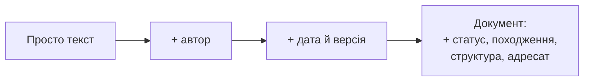
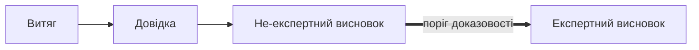
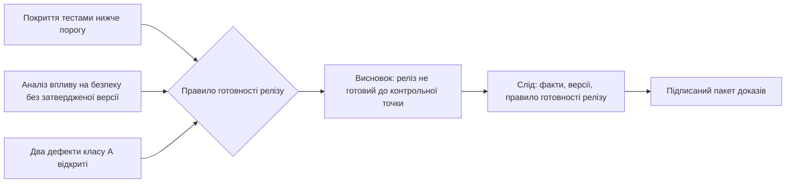
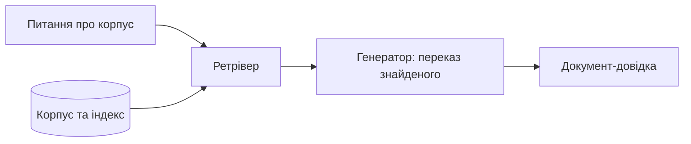
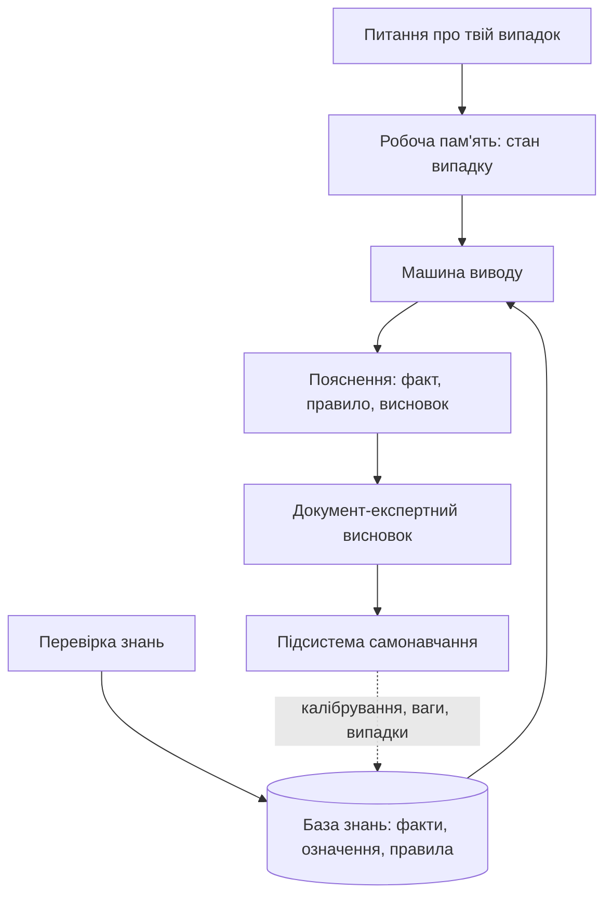
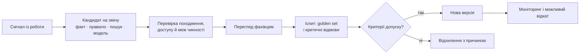
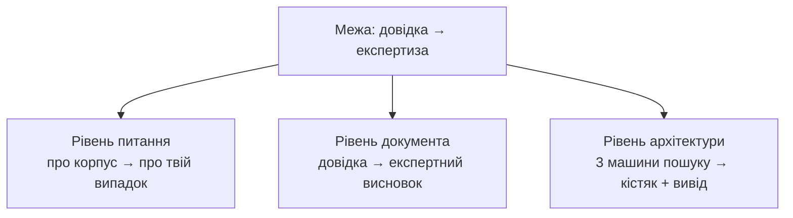
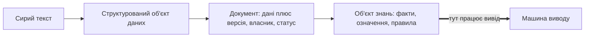

# Експертна система це дещо більше, ніж інформаційно-довідкова система

> **Серія:** [Експертні системи для R&D](README.md) · стаття 08 із 21  
> **Попередня стаття:** [07 — Інфраструктура виконання експертної системи: моделі, апаратура і розміщення](07-Expert-Systems-Infrastructure-UA.md)  
> **Наступна стаття:** [09 — Артефакти інженерії як дані експертної системи](09-Engineering-Artifacts-As-Data-UA.md)  
> **Зміст серії:** [README](README.md)  
> **Рівень:** Розробники: впевнений базовий  
> **Після статті:** розрізнити витяг, довідку, рекомендацію та експертний висновок за складом доказів.  
> **Подача матеріалу:** від спостережуваного виходу до архітектурної причини.

Сім попередніх статей побудували велику картину: навіщо R&D потрібні експертні системи (перша стаття серії), чому доказ важливіший за гладку відповідь (статті про еволюцію правил і про доказову пам'ять), яка під цим математика (стаття про прикладну математику), у які інструменти вона лягає (стаття про стек реалізації), як складається архітектура (стаття про архітектуру ЕС) і на якому залізі виконується (стаття про інфраструктуру ЕС).

Я дивлюся на цю тему не з академічної полиці. У моєму бекграунді були Linux-системи, телеком, інформаційна безпека, системи електронної звітності, електронні документи, цифрові сертифікати, підпис і шифрування, керування поставками, automotive firmware, ASPICE-орієнтовані процеси, ISO 26262/ISO 21434 контекст, трасування вимог і доказові пакети. Тому для мене «відповідь системи» майже ніколи не є просто текстом. У контрольованому інжинірингу відповідь повинна мати джерело, версію, власника, слід і наслідок для рішення.

Після цього перший практичний крок здається очевидним. Є папка з документами, над нею запускається утиліта, яка їх «вивчає» і відповідає на питання, і наче вже є експертна система. У цій статті я поясню, чому цього замало. Описане вище це **інформаційно-довідкова система**, і між нею та експертною системою проходить чітка межа. Я проведу цю межу на трьох рівнях (питання, документ, архітектура), покажу її на схемах, окремо розберу відкриті онлайн-моделі й складу карту того, що решта серії добудовує, щоб цю межу перейти.

Спершу зафіксуймо словник, бо в розмовах про ШІ часто змішують назви
інтерфейсу, призначення та внутрішньої архітектури.

| Клас системи | Головне призначення | Що повертає | Чого для нього недостатньо |
|---|---|---|---|
| Інформаційно-довідкова | знайти та подати відоме про корпус | витяг, посилання, переказ джерел | пошук не виводить твердження про конкретний випадок |
| Консультаційна | вести діалог, пояснити варіанти, зібрати дані для людини | порада, запит на уточнення, сценарій дій | діалоговий інтерфейс сам не створює доказового виводу |
| Підтримка рішень | допомогти людині порівняти варіанти та оцінити наслідки | ранжування, прогноз, сценарій, рекомендація | рекомендація може спиратися на статистику або правила, але не зобов'язана мати явний ланцюг міркування |
| Експертна | застосувати кодифіковані знання до фактів конкретного випадку | виведений висновок або обґрунтована відмова, факти, правила і докази | сам текст, пошук, рейтинг або прогноз без відтворюваного обґрунтування не є експертним висновком |

Ці класи можуть перетинатися. Консультаційна система описує спосіб взаємодії,
тому її інтерфейс може стояти над довідкою, системою підтримки рішень або
експертною системою. Система підтримки рішень описує призначення: експертна
система в дорадчому режимі є її окремим, сильніше формалізованим видом. Водночас
не кожна система підтримки рішень є експертною: панель прогнозу, оптимізатор чи
статистичний скоринг можуть бути корисними без правил, робочої пам'яті випадку
та доказового ланцюга.

Є ще одна суттєва відмінність експертної системи як окремого виду: вона не
може залишатися незмінною після першого введення в роботу. Застарівають факти,
терміни, правила, зв'язки між вимогами й доказами, а іноді й поведінка мовного
компонента. Тому зріла ЕС потребує **періодичного керованого навчання та
донавчання всієї системи**, а не лише одноразового тренування LLM/SLM. Кожне
оновлення має отримати версію, власника, причину, перевірку на еталонних
випадках і можливість відкату. Інакше система не накопичує перевірений досвід,
а лише непомітно дрейфує разом зі своїми джерелами.

## Довідка відповідає про корпус, експертиза - про конкретний випадок

Різниця коротко така.

- **Інформаційно-довідкова система** відповідає на питання **про корпус**: «що написано про X?», «де сказано про Y?». Відповідь це знайдений або переказаний фрагмент. Навіть коли зверху працює мовна модель і добре переформульовує знайдене, у суті це лишається **пошук плюс виклад**: довідкова система повертає те, що вже є в джерелах.
- **Експертна система** відповідає на питання **про конкретний випадок**: «що з цього випливає?», «чи можна?», «що робити?». Відповідь це висновок, якого **немає дослівно в жодному файлі**, виведений правилами з фактів, із поясненням, яке правило на якому факті спрацювало.

Корпус загальний, випадок конкретний. Пошук піднімає загальний текст, але не перекидає місток до конкретної ситуації. Місток будує вивід. Тому різниця така: довідкова система знаходить знання; експертна застосовує його до ситуації й виводить нове твердження.

Перевірка проста. Я ставлю системі питання і дивлюся на тип відповіді. Якщо це завжди «ось що кажуть джерела», це довідка. Якщо це може бути «вердикт C, якого не пише жодне джерело, виведений правилом R на фактах F1 і F2, ось слід», це вже експертна система.

## Де тут відкриті онлайн LLM

Окремо про ChatGPT, Claude і Gemini. Їх часто називають то довідковими, то експертними, але сама по собі відкрита онлайн-модель не належить до жодного з цих двох класів. Вона взагалі не «система» в моїй рамці, а **компонент**.

- Це **генеративна мовна модель**: вона видає переконливий текст із параметричної пам'яті, натренованої на великому загальному масиві. Її «знання» це ваги, а не перевірюваний перелік джерел конкретного домену.
- Вона **не довідкова система про корпус проєкту**: вона відповідає про свій тренувальний масив, який я не можу переглянути, проаудитувати й оновити під конкретний проєкт. Питання «де саме це сказано в наших документах?» вона підмінює переконливим переказом, часом вигаданим.
- Вона **не експертна система**: текст буває схожий на вердикт, але за ним немає ні робочої пам'яті конкретного випадку, ні ланцюга «факт, правило, висновок», ні походження, ні відповідального власника. Це впевнений текст, а не доказ.

Клас системи визначає не модель, а архітектура, у яку її вбудовано:

- LLM плюс пошук по **контрольованому корпусу** (RAG) дає **інформаційно-довідкову систему**: тепер вона відповідає про джерела проєкту й може на них послатися.
- LLM плюс база правил, машина виводу, робоча пам'ять, пояснення й перевірка знань дає рух у бік **експертної системи**, і то лише коли додано слід і походження.

Є окрема причина, чому онлайн-варіант складний для R&D: щоб отримати відповідь про конкретний випадок, треба **відіслати сам випадок** назовні, сторонньому оператору. Для конфіденційного інжинірингу це часто неприйнятно, тому спосіб розгортання моделі має відповідати політиці доступу й класу чутливості контексту. Онлайн-модель зручна як чернетковий генератор формулювань, але не як носій доказу й не як місце, куди можна класти чутливий контекст.

Мій висновок тут такий: відкрита онлайн LLM це не клас системи, а компонент; класом вона стає лише всередині довідкової або експертної архітектури, і навіть тоді доказовість додає не модель, а те, що навколо неї побудовано.

## Що робить артефакт документом

Перш ніж порівнювати два види документів, варто нагадати простішу річ: чим артефакт «документ» відрізняється від просто тексту. Різниця в наборі атрибутів, і кожен відсутній атрибут опускає артефакт на щабель нижче.

- **Просто текст**: є лише зміст. Невідомо, хто написав, коли, навіщо і чи це остаточна редакція. Такий артефакт не процитуєш відповідально й не перевіриш.
- **Текст плюс автор**: джерело відоме, але без дати не скажеш, чи він актуальний, а без версії, чи він остаточний.
- **Текст плюс автор плюс дата й версія**: з'являється ідентичність у часі, можна відрізнити редакції й послатися на конкретну.
- **Документ** у повному сенсі додає ще кілька атрибутів:
  - **ідентичність**: назву або ідентифікатор, за якими на нього посилаються;
  - **авторство і власника**: хто склав і хто за нього відповідає;
  - **дату й версію**: коли, яка редакція, що застаріло;
  - **статус**: чернетка, на рецензії, затверджено, відкликано;
  - **походження**: звідки взято дані, на що спирається;
  - **структуру**: розділи й поля, а не суцільний потік;
  - **призначення й адресата**: для кого і навіщо він існує.

Тобто «документ» це текст плюс метадані: ідентичність, версія, власник, статус. Просто текст можна прочитати; на документ можна послатися, його можна затвердити й за нього можна відповідати. Обидва види документів нижче це повноцінні документи за цим означенням, але породжують їх системи різних класів. І та сама думка веде далі в серію: у статті про артефакти як дані я доведу ці метадані до машинно-обробної форми, щоб над ними могли працювати правила.

Це формулювання прийшло не з теорії документообігу, а з власної практики. Цими питаннями я переймався на значних проєктах національного рівня приблизно 15-20 років тому, коли завірений електронний документ був не абстракцією, а щоденним артефактом. Нагадаю, що **завірений електронний документ** це цифровий файл, юридична сила якого підтверджена **кваліфікованим електронним підписом** (КЕП): щоб засвідчити файл або його електронну копію, достатньо накласти КЕП чи ЕЦП на відсканований документ у сервісі (додатку), який перевіряє й фіксує достовірність даних. У **системах електронної звітності** різниця була проста: текст без реквізитів це ще не документ, а файл без чинного сертифіката й перевіреного підпису це ще не завірений електронний документ, хоч на екрані обидва виглядають однаково. Той самий принцип переноситься в експертні системи: твердження без походження і підписаного сліду не стає висновком лише тому, що воно добре написане.

## Питання, яке легко проґавити: документ-довідка проти документа-експертного висновку

Ту саму межу видно навіть на рівні артефакту, який система віддає на виході. Інженер щодня має справу з двома різними видами документів, хоч рідко називає різницю вголос.

**Документ-довідка** переказує вже відоме знання: витяг зі стандарту, довідкова таблиця, паспорт компонента, стаття FAQ, зведення результатів пошуку. Його істинність вимірюється **вірністю джерелу**: добра довідка точно відтворює те, що є в оригіналі, і нічого не додає від себе. Його ключові ознаки:

- відтворює наявне джерело, не додаючи нового твердження;
- істинність вимірюється вірністю оригіналу, а не виводом;
- посилається на джерело, а не на ланцюг міркування;
- не потребує заяви про впевненість, бо нічого не виводить;
- відповідальність автора обмежена точністю переказу.

**Документ-експертний висновок** це вже не переказ, а **виведене судження про конкретну ситуацію**: оцінка безпеки модуля, вердикт про готовність релізу, зауваження рецензента, аналіз розриву між вимогою і реалізацією. Він має інші властивості:

- містить **нове твердження**, якого немає дослівно в жодному джерелі;
- несе **ланцюг міркування**, а не лише результат;
- прив'язує **походження** до кожної передумови (звідки взято факт, яка версія);
- заявляє **впевненість, припущення і межі застосовності**;
- має **власника-людину**, яка його затверджує і відповідає за нього.

Тут важлива ще одна річ з практики електронних документів: довіра починається не з самого документу, а з перевірки джерела. Хто підписав? Яким сертифікатом? Чи чинний він на момент підпису? Чи не відкликаний? Чи не змінювався файл після підпису? Для експертного висновку питання ті самі, тільки замість одного документа треба перевіряти весь ланцюг: джерела фактів, версії правил, модель, рішення людини, яка затверджує результат.

| Вимір | Документ-довідка | Документ-експертний висновок |
|---|---|---|
| Що це | переказ відомого | виведене судження про випадок |
| Істинність | вірність джерелу | коректність виводу з фактів за правилами |
| Новизна | нічого нового | висновок, якого немає в жодному джерелі |
| Слід | посилання на джерело | ланцюг «факт -> правило -> висновок» + походження |
| Невизначеність | зазвичай відсутня | впевненість, припущення, межі |
| Відповідальність | автор виклав | людина затвердила висновок |

Практичний висновок такий: довідкова система зазвичай породжує документ-довідку, бо вона вміє переказувати. Документ-експертний висновок породжує експертна система, бо для нього треба вивести те, чого в джерелах немає. Різниця не в якості формулювання, а в тому, звідки береться твердження.

## Сходинки виходу: витяг, довідка, не-експертний і експертний висновок

Поділ на два види документів зручний, але між «просто скопіювати» і «вивести висновок» є проміжні щаблі, і їх варто розрізняти, бо кожен наступний вимагає більше від системи. Розкладу вихід від найпростішого до найскладнішого.

- **Витяг** - дослівний фрагмент джерела, вирізаний без змін: «ось цей пункт стандарту». Жодного переказу, істинність дорівнює точності копіювання.
- **Довідка** - впорядкований переказ одного чи кількох джерел: зведена таблиця, конспект, добірка релевантних місць. Уже є обробка, але **нового твердження про конкретний випадок ще немає**, лише організоване відоме.
- **Не-експертний висновок** - судження, яке звучить як відповідь на поставлене питання, але **без формального виводу, сліду й походження**: думка, побіжна оцінка, згенерований моделлю абзац «схоже, все гаразд». Він навіть буває правильний, але його не можна перевірити, бо не показано, з чого він випливає. Саме сюди часто падають відповіді відкритої LLM.
- **Експертний висновок** - виведене судження про конкретний випадок зі слідом «факт → правило → висновок», походженням кожної передумови, заявленою впевненістю і власником, що відповідає. Єдиний щабель, де відповідь і нова, і перевірна одночасно.

| Щабель | Що це | Нове твердження? | Слід і походження? |
|---|---|---|---|
| Витяг | дослівний фрагмент | ні | посилання на місце в джерелі |
| Довідка | впорядкований переказ | ні | посилання на джерела |
| Не-експертний висновок | судження без обґрунтування | так, але неперевірне | немає |
| Експертний висновок | виведене судження про випадок | так | факт → правило → висновок + походження |

Небезпека тут конкретна: не-експертний висновок легко сплутати з експертним, бо обидва звучать як вердикт. Різниця не в тоні, а в тому, чи стоїть за твердженням слід. Витяг і довідка відкрито показують свою природу, вони не вдають виводу; не-експертний висновок небезпечний саме тим, що вдає. І перша робота експертної системи не звучати впевнено, а піднімати кожен висновок з рівня «не-експертний» до рівня «експертний», докладаючи інформаційний слід.

Щоб межа експертності стала відчутнішою, візьму приклад із automotive-проєктів, де це щоденне питання: чи можна віддати реліз прошивки на наступну контрольну точку (у процесі її називають gate). Довідкова система тут знайде все дотичне: контрольний список релізу, звіт тестування, нотатки з кібербезпеки й функційної безпеки, перелік відкритих дефектів і сторінку з правилами затвердження. Не-експертний висновок підсумує це впевнено, але без сліду: «схоже, реліз готовий». Експертний висновок має звучати інакше й показувати, звідки він узявся: «реліз не готовий до контрольної точки, бо покриття тестами нижче порогу, аналіз впливу на безпеку не має затвердженої версії, а два дефекти класу A лишаються відкритими; правило готовності релізу блокує перехід, доки ці умови не закриті».

Поясню, чому це вже експертний висновок, а не сувора довідка. По-перше, у ньому є нове твердження про конкретний випадок («цей реліз не готовий»), якого немає дослівно в жодному з тих документів. По-друге, за ним стоїть слід: три конкретні факти (покриття тестами, версія аналізу безпеки, відкриті дефекти) плюс внутрішнє правило готовності релізу (кодифіковане в базі знань, а не пункт стандарту), яке з них виводить заборону. По-третє, кожен факт має походження, звідки взято число і яка версія документа. Через це з висновком можна сперечатися предметно: або оскаржити факт (покриття насправді вище), або оскаржити правило (поріг зависокий для цього класу дефектів). З «схоже, готовий» сперечатися нема з чим, бо під ним порожньо.

У версії для **контрольованого інжинірингу** я б додав до такого висновку ще один обов'язковий шар: що саме було підписано і ким. Не лише фінальна фраза «реліз не готовий», а пакет доказів: версія контрольного списку, звіту тестування, нотаток з кібербезпеки й функційної безпеки, перелік дефектів, час формування й ідентифікатор експертної системи. Без такого пакета це знову текст. З пакетом це вже артефакт, який можна перевірити, передати на рецензування, заархівувати й показати на аудиті.

## Чому в експертної системи більше компонентів

Ця різниця не косметична, вона архітектурна. Довідкова система в мінімумі складається з трьох машин: індекс (щоб швидко шукати), ретрівер (що саме з індексу дістати) і, за бажанням, генератор (що переказати поверх знайденого). Цього досить, щоб відповідати про корпус.

Схему довідкової системи легко намалювати одним прямим конвеєром: питання про корпус заходить у ретрівер, той дістає фрагменти з індексу, генератор переказує знайдене.

Експертна система, як я вже вводив у статті про доказову пам'ять і в статті про архітектуру, має **чотиричастинний кістяк плюс службові шари**, і саме «зайві» частини роблять її експертною:

- **База знань**: не лише фрагменти для пошуку, а розділені **факти, означення й правила** (нормативні вимоги, обмеження, евристики).
- **Машина виводу**: застосовує правила до фактів і виводить нові твердження (пряме відокремлення зі статті про прикладну математику).
- **Робоча пам'ять**: стан конкретного випадку, окремий від бази, з яким машина виводу працює прямо зараз.
- **Пояснювальний шар**: показує, яке правило на якому факті спрацювало, з дослівним доказом.
- **Перевірка знань**: контроль повноти, суперечностей, застарілих джерел, конфліктних правил.
- **Підсистема самонавчання**: зворотний зв'язок, калібрування впевненості, накопичення випадків, адаптація ваг і моделей.

Схема експертної системи ширша: у неї заходить не питання про корпус, а конкретний випадок, і між входом та виходом стоять машина виводу, робоча пам'ять, пояснення й контур самонавчання.

Порівняння двох схем і є відповідь у картинці: там, де в довідки один прямий конвеєр «знайти й переказати», в експертної системи стоїть контур виводу з окремою пам'яттю випадку, доказом і зворотним зв'язком.

Прибери машину виводу, робочу пам'ять і пояснення, і від експертної системи лишиться довідка. Саме ці компоненти довідкова архітектура не має, і саме про них решта серії.

## Зведена таблиця: що присутнє в якій системі

Щоб не розсипати різницю по абзацах, зведу її в одну матрицю. Стовпці це чотири класи: простий пошук чи база даних, інформаційно-довідкова система (пошук плюс переказ, RAG), генеративна LLM сама по собі й повноцінна експертна система. Рядки це ті визначення, про які найчастіше сперечаються, плюс кілька додаткових характеристик, що добре розводять класи.

Позначки: ✓ присутнє й кодифіковане як робочий механізм, ~ присутнє частково або лише як дані, тире відсутнє.

| Визначення / характеристика | Пошук / БД | Довідкова (RAG) | Консультаційна / підтримка рішень | Генеративна LLM | Експертна система |
|---|---|---|---|---|---|
| Головна роль | знайти запис | знайти й пояснити джерела | допомогти людині обрати дію | згенерувати або перетворити текст | вивести твердження про випадок |
| Правила виводу | — | — | ~ можуть бути, але не обов'язкові | ~ неявні у вагах | ✓ явні, оглядні |
| Моделі (ML, статистика) | ~ ранжування | ✓ векторні подання, генератор | ✓ прогноз, скоринг, оптимізація | ✓ сама модель | ✓ як один із компонентів |
| Об'єкти знань (факти, означення) | ~ записи БД | ~ фрагменти тексту | ~ залежить від реалізації | — | ✓ структуровані |
| Стандарти й регламенти | ~ як текст | ~ як джерело | ~ як вхід до оцінки | ~ у тренуванні | ✓ кодифіковані як правила та процедури |
| Пояснення (чому саме так) | — | ~ цитата джерела | ~ логіка рейтингу або сценарію | — імітація | ✓ факт → правило → висновок |
| Аудит і походження | ~ лог запитів | ~ використані фрагменти | ~ залежить від процесу | — | ✓ на кожну передумову та версію |
| Робоча пам'ять випадку | — | — | ~ параметри сценарію | ~ контекст сесії | ✓ окремий стан випадку |
| Машина виводу | — | — | — або окремий модуль | — | ✓ |
| Новий висновок про випадок | — | — | ~ рекомендація або прогноз | ~ переконливий текст | ✓ виведений і перевірний |
| Впевненість, калібрування | — | — | ✓ або ~ залежно від моделі | ~ некалібрована | ✓ калібрована |
| Життєвий цикл знань і навчання | ~ оновлення записів | ~ переіндексація корпусу | ~ переналаштування моделі оцінки | ~ донавчання ваг | ✓ періодичне навчання фактів, знань, правил, пошуку й моделі з іспитом та версіями |
| Відповідальний власник рішення | — | — | ✓ людина ухвалює рішення | — | ✓ людина затверджує або делегує дію за політикою |
| Артефакт на виході | запис або список | документ-довідка | рекомендація, прогноз, сценарій | переконливий текст | документ-експертний висновок |

Матриця робить видимою головну лінію. Пошук, довідка та консультаційна система
можуть бути дуже корисними, але не зобов'язані тримати **правила, пояснення,
аудит і походження в кодифікованому вигляді**. Стандарт чи регламент у них може
лежати як текст або вхід до моделі оцінки; це ще не означає, що система виводить
за ним перевірюваний вердикт. Генеративна LLM додає до цього плутанину: вона
видає текст, схожий на висновок з поясненням, але клітинки «правила»,
«пояснення», «аудит» і «походження» в неї це імітація, а не механізм.

Права колонка відрізняється не однією клітинкою, а набором ознак: правила, об'єкти знань, пояснення, аудит і походження присутні в ній **як робочі механізми**, а не як збережені файли. Саме цей набір перетворює переказ на висновок. Решта серії заповнює клітинки правої колонки одну за одною.

## Самонавчання: керована властивість експертної системи

Самонавчання для ЕС не означає, що вона після кожної відповіді самостійно
переписує правила або перенавчає модель. Така система швидко підкріпить власні
помилки, змішає чернетки з фактами та втратить можливість пояснити, коли й
чому змінився висновок. Самонавчання тут означає інше: ЕС **регулярно збирає
досвід зі своєї роботи, перетворює його на перевірені кандидати на зміну та
приймає лише ті зміни, що пройшли контроль**.

Це важлива властивість саме експертної системи. Довідкова система може
переіндексувати корпус, консультаційна система може накопичити історію діалогу,
а система підтримки рішень може переналаштувати прогноз. ЕС повинна зробити
більше: визначити, чи новий досвід змінює факт, правило, виняток, зв'язок
відповідності, словник, поріг впевненості або поведінку модельного компонента,
і зберегти доказ такої зміни.

Практичний цикл виглядає так:

Формально це не «самозміна заради покращення». Кандидат допускають лише тоді, коли на фіксованому наборі він дає вимірюваний виграш і не порушує критичні обмеження:

$$
\operatorname{accept}(v_{new}) =
\left[Q(v_{new}) - Q(v_{old}) \ge \delta\right]
\land \left[F_{critical}(v_{new}) = 0\right]
\land \left[\operatorname{approved}(v_{new}) = 1\right].
$$

Тут $Q$ — заздалегідь обрана метрика якості (наприклад, Recall@10 або частка підтверджених висновків), $\delta$ — мінімально значущий виграш, а $F_{critical}$ — кількість критичних регресій на контрольних випадках. Формула не підмінює фахівця: остання умова означає явне погодження, а не автоматичне розгортання.

Сигналом може бути підтверджений або скасований вердикт, новий тестовий
результат, змінена вимога стандарту, повторна помилка пошуку, конфлікт джерел,
відмова через нестачу доказів або відхилення рекомендації фахівцем. Сигнал ще
не є знанням. Він стає кандидатом, для якого відомі джерело, час, версія
системи, контекст випадку й наслідок рішення.

### На чому ЕС навчається в software, system і hardware R&D

У R&D ЕС навчається не на абстрактному масиві текстів, а на контрольованій
історії проєкту. Це однаково стосується software, system і hardware-розробки.
Матеріалом для періодичного оновлення є взаємопов'язані вимоги, моделі, описи
реалізації, результати перевірок і факти з експлуатації чи виробництва. Вихідний
код важливий для програмного проєкту, але не є обов'язковою умовою експертності:
у системному або апаратному проєкті ту саму роль відіграють моделі, схеми,
конструкторські дані, прототипи, вимірювання та докази верифікації. Стаття 09
пояснює, чому ці артефакти мають бути структурованими об'єктами, а стаття 10
визначає, як система здобуття знань перевіряє їхній статус, походження, доступ
і чинність перед передачею ЕС.

| Джерело в R&D | Що з нього може навчитися ЕС | Що має залишитися прив'язаним до джерела |
|---|---|---|
| Вимоги, стандарти, регламенти й базові версії | поняття, обмеження, критерії приймання, правила відповідності, зміни між редакціями | ідентифікатор, версія, власник, статус, пункт вимоги, межа чинності |
| Архітектурні моделі, інтерфейси й записи рішень | зв'язки компонентів, припущення, дозволені варіанти, обрані та відхилені альтернативи | модель або рішення, версія, автор, причина рішення, зачеплені вимоги |
| Вихідний код, конфігурації та інфраструктура як код | факти про реалізацію, інтерфейси, залежності, обмеження конфігурації, кандидатів на трасування з вимогами | репозиторій, гілка або базова версія, ревізія, шлях, рядок або символ, результат перегляду |
| Системні моделі, моделі інтерфейсів і симуляцій | поведінка системи, стани, потоки, межі компонентів, припущення моделі, результати сценаріїв | ідентифікатор моделі, версія, сценарій, параметри, межі валідності, результат симуляції |
| Схеми, HDL-описи, плати, BOM і конструкторські дані | факти про електричні та логічні з'єднання, параметри компонентів, обмеження конструкції, залежність від постачальника | ревізія схеми або плати, артикул компонента, версія специфікації, серійний або партійний номер, погодження зміни |
| Механічні моделі, креслення, допуски й матеріали | геометричні та матеріальні обмеження, склад збірки, допустимі режими, зв'язок із ризиками та випробуваннями | ревізія креслення або CAD-моделі, одиниці вимірювання, допуск, матеріал, варіант виробу, затвердження |
| Тести, симуляції, статичний аналіз і CI | докази верифікації, покриття, повторювані збої, зв'язок реалізації з вимогою, фактичний результат перевірки | тест-кейс, середовище, версія збирання, журнал виконання, критерій успіху, посилання на артефакт |
| Лабораторні вимірювання, прототипи й кваліфікаційні випробування | фактичну поведінку виробу, межі режимів, повторювані відмови, калібрування порогів і моделі ризику | методика, прилад і його калібрування, стенд, умови середовища, ідентифікатор прототипу, сирі дані та підсумковий протокол |
| Виробничі дані, контроль якості й дані постачальників | статистику невідповідностей, тенденції партій, обмеження компонентів, причини відбракування, коригувальні дії | партія, серійний номер, постачальник, контрольний план, результат інспекції, сертифікат, умови застосовності |
| Дефекти, запити на зміну, ризики й уроки | типові причини, винятки, заходи пом'якшення, схожі випадки, причини відмови або блокування | ідентифікатор, стан, першопричина, застосовність, погодження, пов'язані вимоги й тести |
| Плани, контрольні точки випуску й аудиторські висновки | правила готовності, залежності робіт, часті прогалини доказів, сигнали ескалації | контрольний зріз, критерії входу й виходу, відповідальний, результат контролю, пакет доказів |
| Підтвердження або заперечення доменного фахівця | калібрування, нові винятки, підтверджені випадки для CBR, пріоритет перегляду | особа або роль, дата, контекст випадку, обґрунтування, рішення про прийняття чи відхилення |

Вихідний код, HDL-опис, схема, CAD-модель або результат симуляції не є
«тренувальним текстом» для неконтрольованого запам'ятовування. ЕС використовує
їх як версійований доказ реалізації або конструкції. Конкретна функція,
інтерфейс, логічний блок, з'єднання, допуск чи зміна в ревізії зіставляються з
вимогою, тестом, дефектом і результатом перегляду. Так система може виявити,
що вимога не має реалізації, моделі, випробування або доказу відповідності. Але
вона не повинна оголошувати конструкцію правильною лише тому, що вона схожа на
фрагмент із попереднього проєкту.

Для hardware і system-проєктів особливо важливо не змішувати вимірювання з
готовим знанням. Один результат з лабораторії ще не доводить властивість виробу,
доки не відомі методика, калібрування приладів, конфігурація стенда, температура,
партія або прототип, повторюваність і критерій приймання. Саме ці атрибути дають
ЕС змогу вчитися на фізичному досвіді без хибного узагальнення одного тесту на
всю лінійку виробів.

Не всі матеріали мають однакову вагу. Чернетка вимоги, коментар у чаті,
непереглянута гілка коду, сирий журнал CI, старий документ або текст, згенерований
LLM, можуть бути корисним сигналом чи кандидатом для перегляду. Вони не стають
фактом, правилом або доказом автоматично. Для цього потрібні власник, статус,
належна версія, перевірка застосовності та рішення фахівця. Саме так ЕС вчиться
на реальній роботі проєкту, не перетворюючи його тимчасовий шум на знання.

### Калібрування експертної системи: чи можна довіряти її впевненості

Калібрування приладу відповідає на питання, чи правильно виміряна фізична
величина. Калібрування ЕС відповідає на інше: чи відповідає заявлена системою
впевненість її фактичній точності та чи правильно вона обирає дію. Це окрема
властивість ЕС, а не побічний результат навчання моделі.

Якщо система у ста випадках із позначкою «90 % упевненість» має рацію приблизно
у дев'яноста з них, її оцінка впевненості корисна. Якщо ж вона помиляється у
третині таких випадків, число 90 % створює хибне відчуття надійності. Та сама
проблема є і без мовної моделі: завищеним може бути поріг спрацювання правила,
подібність знайденого CBR-випадку, рейтинг джерела або оцінка ризику.

Для числової перевірки впевненість ділять на кошики $B_m$ (наприклад, 0.8–0.9) і порівнюють середню заявлену певність із реальною часткою правильних рішень. Поширена зведена метрика — expected calibration error (ECE):

$$
\operatorname{ECE} = \sum_{m=1}^{M}\frac{|B_m|}{n}
\left|\operatorname{acc}(B_m)-\operatorname{conf}(B_m)\right|,
\quad
\operatorname{acc}(B_m)=\frac{1}{|B_m|}\sum_{i\in B_m}\mathbf{1}[\hat y_i=y_i].
$$

У ній $n$ — кількість перевірених випадків, $\operatorname{conf}$ — середня заявлена впевненість, а $\operatorname{acc}$ — фактична точність у кошику. Чим ближче ECE до нуля, тим чесніше число впевненості описує реальність; однак малий ECE не доводить коректність усієї системи — потрібні ще якість доказів, coverage і контроль відмов.

Калібрування має перевіряти не лише відповідь, а весь режим роботи системи.

| Що перевіряємо | На чому перевіряємо | Яке рішення може змінитися |
|---|---|---|
| Упевненість висновку | еталонні випадки з відомим правильним результатом, окремі від навчального матеріалу | поріг автоматичної рекомендації, правило відмови, потреба в перегляді фахівцем |
| Межу застосовності правила або CBR-аналогії | випадки на межі режимів, винятки, підтверджені невдалі аналогії | умови правила, заборонений сценарій, рівень доказу для висновку |
| Поріг ризику та ескалації | історичні інциденти, тести безпеки, лабораторні й виробничі дані з відомим наслідком | рівень тривоги, черга ручної перевірки, дія з правом вето |
| Якість пошуку й достатність доказів | контрольні запити, відомі пропущені джерела, правильні відмови через нестачу даних | мінімальний пакет доказів, поріг пошуку, формулювання відмови |

Практичний цикл такий: зафіксувати версію фактів, правил, індексів і моделей;
взяти незмінний еталонний набір; порівняти заявлену впевненість із фактичними
помилками та правильними відмовами; змінити поріг або запропонувати зміну
знання; повторити іспит; зберегти результат як частину рішення про випуск.
Калібрування не дає системі права тихо переписати правило. Воно показує, де
автоматичне рішення занадто сміливе, занадто обережне або застосоване поза
межами чинності.

### Яка математика працює всередині самонавчання

Самонавчання не має однієї універсальної формули. Різні математичні методи зі
статті 04 відповідають на різні запитання.

| Питання системи | Математичний механізм | Що саме оновлюється |
|---|---|---|
| Чи не суперечить новий факт чинним правилам? | логіка правил, Rete, система підтримання істинності (*Truth Maintenance System*, TMS) | факти, залежності висновків, статус правила |
| Як змінився рівень довіри до гіпотези після нового доказу? | теорема Байєса, байєсівська мережа | апостеріорна оцінка гіпотези, а не сам факт |
| Чи деградує процес або система між перевірками? | марковський ланцюг, прихована марковська модель (HMM) | оцінка стану, прогноз переходу, сигнал ескалації |
| Чи траплявся подібний підтверджений випадок? | міркування за випадками (*Case-Based Reasoning*, CBR) | кандидат на аналогію з межами застосування |
| Чи відповідає заявлена впевненість реальній точності? | калібрування, аналіз помилок, контрольні вибірки | пороги дії, правила відмови, черга ручного перегляду |
| Яку перевірку або дію варто виконати наступною? | процес ухвалення рішень Маркова (MDP/POMDP), оптимізація, планування | черговість тестів, запит доказу, ескалація, але не істинність правила |

Тут важлива дисципліна. Байєсівська модель оновлює довіру до гіпотези, але не
перетворює припущення на затверджений факт. CBR показує подібний досвід, але не
копіює старе рішення без перевірки меж застосування. Марковська модель може
попередити про деградацію, але не замінює аудит. Математика допомагає помітити,
оцінити та пріоритезувати зміну; право змінити кодифіковане знання лишається за
контрольованим процесом.

### Технологічний контур

Технології зі статті 05 потрібні не для того, щоб додати ще одну модель, а щоб
кожен крок циклу був відтворюваним.

- **Рушій правил або DMN-таблиці** тримають правила окремими артефактами зі статусом, версією, рецензією і тестами.
- **Реляційне сховище та граф простежуваності** зв'язують сигнал, джерело, факт, правило, вимогу, тест і версію висновку.
- **Пошуковий та векторний індекси** допомагають знайти кандидатів на джерела й схожі випадки, але їхній результат лишається кандидатом, а не доказом.
- **Ймовірнісні бібліотеки та моделі часових рядів** реалізують байєсівське оновлення, оцінку деградації й контроль змін у часі.
- **Класифікатори, ембедери та мовні моделі** допомагають тріажувати матеріал, зіставляти терміни й дотримуватися формату відповіді; для них окремо фіксують дані, параметри, версію та спосіб виконання.
- **Засоби оцінювання, XAI і моніторинг моделей** вимірюють якість пошуку, калібрування, обґрунтованість відповіді та дрейф після оновлення.
- **Реєстр версій і механізм відкату** зберігають базу фактів, базу знань, правила, індекси, модельні артефакти, еталонні результати й рішення про допуск як один контрольований зріз.

Тому періодичне навчання ЕС не зводиться до запуску донавчання моделі. Іноді
правильна реакція це оновити термін у словнику, відкликати застаріле джерело,
виправити зв'язок вимоги з тестом, додати виняток до правила або підняти поріг
відмови. Донавчання мовного компонента доречне лише тоді, коли факти, правила й
докази вже контрольовані, а проблемою лишається термінологія, формат або
стійкість поведінки.

Усі зміни мають бути періодичними, а не стихійними: система порівнює нову
версію з попередньою на тому самому еталонному наборі, перевіряє критичні
випадки й коректні відмови, а потім або приймає оновлення, або відхиляє його.
Навчена вага не стає доказом. Доказом лишаються джерела, правила, результати
перевірки й зафіксований слід зміни. Детально цей цикл розвиває стаття 12 про
навчання, іспит і доказ змін.

## Коли рішення ухвалює сама експертна система

Я часто повторюю в серії формулу «система пропонує, людина затверджує». Вона описує дорадчий режим, але не вичерпує всі випадки. У реальних процесах частину рішень уже делегують машині: автоматичне блокування релізу за проваленою контрольною точкою, відмова транзакції, авто-класифікація дефекту, зупинка лінії за критичним показником.

Точніше говорити про спектр автономії: порада, рішення з правом вето, автономна дія в межах, повна автономія. Але правило не змінюється: делегувати можна дію, не доказовість. Автономний висновок без сліду це не експертна система, а чорна скринька з кнопкою. Тут достатньо зафіксувати межу: що вищий рівень автономії, то суворіші вимоги до політики, аудиту, можливості зупинки й відповідального власника.

## Підпис, довіра і юридична вага машинного висновку

Щойно висновки починає видавати експертна система, постає питання довіри до артефакта. Паперовий висновок засвідчують підпис і печатка експерта. Машинний висновок треба засвідчувати інакше: електронним підписом, слідом і політикою відповідальності.

Для мене це не суто юридичний хвіст статті. Я працював із системами електронних документів і системами електронної звітності, де цифровий сертифікат, підпис, шифрування, перевірка цілісності й походження документа були частиною реальної інженерної роботи, а не деклараціями в презентації. Тому машинний висновок без підписаного сліду для мене виглядає так само слабко, як електронний звіт без валідного сертифіката: файл є, довіри до нього немає.

Підпис важливий, але він не робить висновок істинним. Він лише засвідчує, хто видав документ і що його не підмінили. Тому підписувати треба не тільки текст вердикту, а й факти, правила, версії та походження. Інакше кажучи, експертна система має формувати не просто відповідь, а завірений пакет: висновок плюс доказовий слід, підписаний або прив'язаний до довіреного джерела. Система не стає юридичною особою, відповідальним суб'єктом лишається людина або організація. Питання електронного документа, КЕП/eIDAS, персональних даних і юридичної ваги машинного висновку виходять за межі цієї серії, але не за межі реальної інженерної відповідальності.

## Карта решти серії: як я веду матеріал від довідки до експертизи

Тепер, коли межу проведено, легко скласти маршрут. Кожен наступний розділ серії закриває одну конкретну нестачу, яка відділяє довідку від експертної системи.

| Нестача, яку треба закрити | Стаття, що її закриває |
|---|---|
| Сирий текст замість машинно-обробних об'єктів | 09. Артефакти інженерії як дані |
| Звідки й як брати знання контрольовано | 10. Система здобуття знань |
| У якій формі зберігати знання (правила, онтологія, вектори) | 11. Типи баз знань |
| Як навчати систему, перевіряти зміни та збирати зворотний зв'язок | 12. Навчання, іспит і доказ змін |
| Як зрештою зібрати робочу лабораторну систему | 13. Практика: збираємо лабораторну експертну систему |

Це і є відповідь на питання «чому не можна просто зібрати утиліту над папкою і назвати її експертною системою». Тому що між «знайти знання» і «застосувати знання» лежать дванадцять конкретних інженерних кроків, і кожен з них наступна стаття.

## Висновок

Утиліта, яка вивчає папку документів і відповідає на питання, це корисна інформаційно-довідкова система, але ще не експертна. Різницю видно на трьох рівнях: у питанні (про корпус проти про конкретний випадок), в артефакті (документ-довідка проти документа-експертного висновку) і в архітектурі (три машини пошуку проти чотиричастинного кістяка з машиною виводу, робочою пам'яттю, поясненням і самонавчанням).

**Експертиза** починається там, де система перестає переказувати джерела й починає **виводити нове твердження про конкретний випадок, зі слідом і походженням**. Рішення вона за замовчуванням лишає людині, але може й ухвалювати сама, у межах, з аудитом і підписом; чого їй не можна ніколи - це видавати висновок без сліду, ким би той висновок далі не підписувався.

**Спойлер наступної статті.** Перша нестача з нашої карти найбазовіша: доки знання лишається сирим текстом, машина виводу не має на що спертися, бо правило не виконаєш над абзацом прози. Тут артефакт не просто «стає документом», а еволюціонує через кілька форм. Спершу сирий текст перетворюється на структурований **об'єкт даних**: типізовані поля замість суцільної прози, щоб машина взагалі могла його читати. І лише коли артефакт став даними, наступний крок перетворює його на **об'єкт знань**: факти, означення й правила, над якими вже працює машина виводу. Наступна стаття саме про перший крок цього ланцюга, перетворення тексту на дані; форму знань добудовують статті про здобуття знань і типи баз знань далі в серії.

*Питання до читачів.*

- Згадайте останній «висновок», який ви передали далі: це справді був виведений вердикт зі слідом чи гарно переказана довідка, яку прийняли за висновок?
- Яке питання у вашому проєкті звикли «шукати» в документах, хоча відповідь на нього щоразу доводиться виводити під конкретну ситуацію, а не знаходити готовою?
- Чи траплялося, що система після донавчання почала відповідати впевненіше, але пояснити свій висновок краще так і не змогла?
- Був у вас випадок, коли переконлива відповідь виявилася хибною саме тому, що ніхто не міг простежити, звідки вона взялася?
- Що у вашому процесі складання чи релізу вже блокує або пропускає рішення само, без людини, і чи лишається слід, коли воно помиляється?
- Чи бачили ви, як згенерований або підписаний звіт сприйняли за істину лише тому, що він мав офіційний вигляд, а не тому, що хтось перевірив факти?
- Де у вашій команді ChatGPT, Claude чи Gemini уже використовують як «експерта», і хто перший спіймав його на впевненій вигадці?

## Посилання на інших авторів і публікації

- Elham Tabassi. [*Artificial Intelligence Risk Management Framework 1.0*](https://doi.org/10.6028/NIST.AI.100-1), NIST, 2023. Практичний контекст для розрізнення можливостей, ризиків і людського контролю.
- Timothy Lebo, Satya Sahoo, Deborah McGuinness (ред.). [*PROV-O: The PROV Ontology*](https://www.w3.org/TR/prov-o/), W3C Recommendation, 2013. Модель походження, потрібна для доказового висновку.
- Patrick Lewis та ін. [*Retrieval-Augmented Generation for Knowledge-Intensive NLP Tasks*](https://arxiv.org/abs/2005.11401), NeurIPS, 2020. Розділення генерації та явної пошукової пам'яті.
- Margaret Mitchell та ін. [*Model Cards for Model Reporting*](https://arxiv.org/abs/1810.03993), FAT* 2019. Документування меж допустимого використання моделі.
- Chuan Guo та ін. [*On Calibration of Modern Neural Networks*](https://arxiv.org/abs/1706.04599), ICML, 2017. Визначення reliability diagram та expected calibration error (ECE), використаних для контрольованого допуску модельних і порогових змін.
