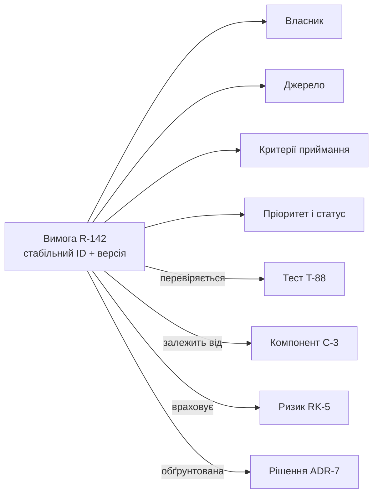
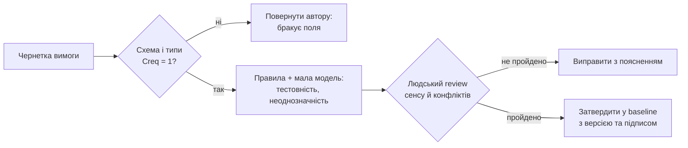
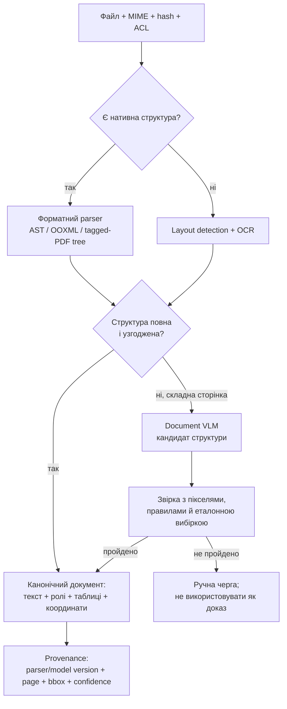
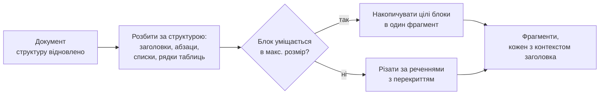
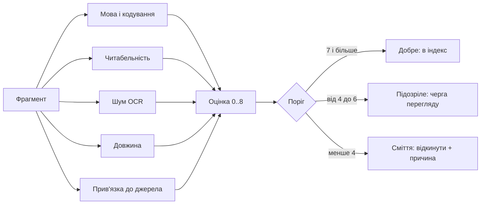
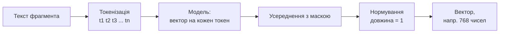
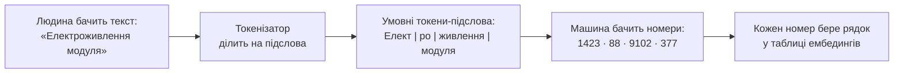
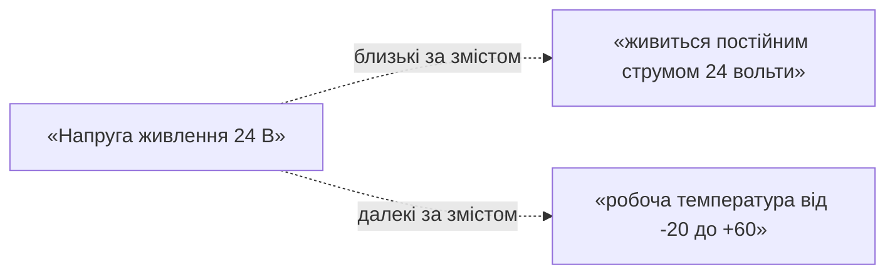
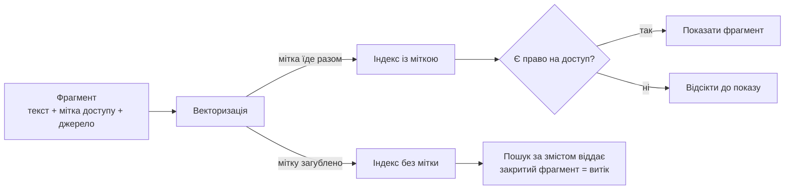
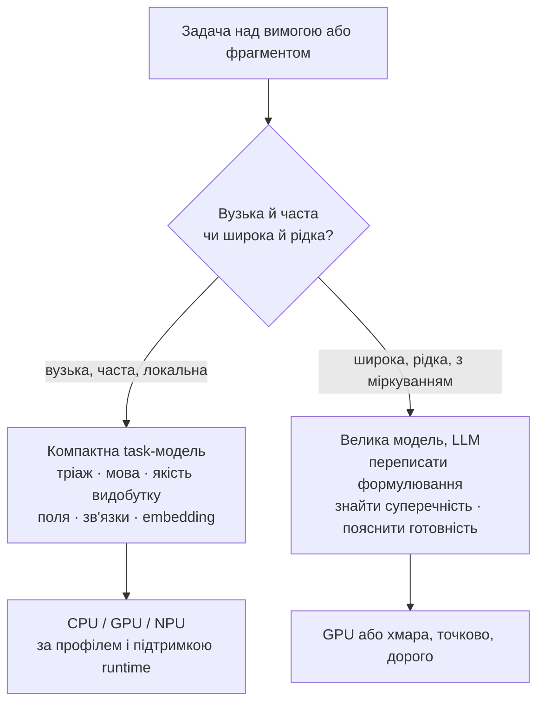

# Артефакти інженерії як дані експертної системи

> **Серія:** [Експертні системи для R&D](README.md) · стаття 09 із 22  
> **Попередня стаття:** [08 — Експертна система це дещо більше, ніж інформаційно-довідкова система](08-Expert-Systems-Beyond-Reference-UA.md)  
> **Наступна стаття:** [10 — Здобуття знань для експертної системи: як збирати інженерні знання без хаосу і витоку даних](10-Knowledge-Acquisition-System-UA.md)  
> **Зміст серії:** [README](README.md)  
> **Рівень:** Розробники: впевнений базовий  
> **Після статті:** перетворити документ на версійований артефакт, фрагменти з походженням і безпечний індекс.  
> **Подача матеріалу:** спершу формат, схема й перевірка; лише потім embedding та LLM.

За роки роботи в R&D я звик до того, що багато інженерних артефактів досі створюються так, ніби головний носій істини - це документ: PDF, Word-файл або сторінка, яку можна красиво роздрукувати (*print-oriented*). У цьому є історична логіка. Документ мав бути зрозумілим людині, зручним для перегляду (*review*), придатним для підпису, архівування та аудиту. Але сучасні R&D-проєкти живуть не тільки в друкованих документах. Вони живуть у вимогах, задачах, тестах, ризиках, базових версіях (*baselines*), конвеєрах складання й перевірки, контрольних точках випуску і доказових пакетах. Більшість таких артефактів-результатів у стандартах і процесних моделях зазвичай називають *Work Product*: вимога, план, тестовий протокол, запис рішення, доказовий пакет. Але я далі навмисно тримаю поруч і *Work Item*: трековану одиницю роботи (завдання, дефект, запит на зміну), у якій теж осідають важливі рішення й контекст.

У перших статтях серії я вже окреслив проблему: як у зрілій компанії накопичується корпоративний хаос знань і чому головне не обсяг, а вміння ці знання структурувати, знаходити й повторно використовувати; чому їх пошук та аналіз мають бути доказовими, тобто спиратися на факти, правила й джерела, а не на красивий текст; і як усе це зводиться в трикутник «експертна система - корпоративна пам'ять - доказ». Ця стаття відповідає на наступне практичне питання тієї ж лінії: **у якому вигляді артефакт має лежати в пам'яті**, щоб його взагалі можна було надійно шукати, аналізувати й використовувати як джерело істини.

Коли вимога або проєктний план існує **лише** як вільний текст, експертна система все ще може знайти й процитувати його, але не може без додаткового видобутку полів надійно виконувати структурні запити. Сучасна мовна модель цей текст прочитає й навіть перекаже, проте саме читання не перетворює залежності на дані: інструмент не знає детерміновано, які контрольні точки (*gates*) заблоковані, не може відтворювано оцінити вплив зміни (*impact analysis*) чи обчислити покриття. Суперечність модель здатна запропонувати як гіпотезу, але не гарантувати її відсутність. Людина читає документ і відновлює зв'язки в голові; системі для доказової відповіді потрібні явні об'єкти та відношення.

Ця стаття - про один наскрізний принцип: інженерний артефакт спочатку має бути **структурованим об'єктом даних**, а вже потім - документом, сторінкою, панеллю чи звітом. Документ стає поданням (*view*), а не джерелом істини (*source of truth*). Для мене *Work Product* або змістовний *Work Item* у такій моделі - це не файл як контейнер, а об'єкт зі стабільною ідентичністю, зв'язками, статусом і доказами. Найважливіший приклад цього принципу - вимоги. Тому почну з них, а далі поширю ту саму ідею на плани, ризики, контрольні точки та аудит.

Це важливий, але не достатній крок до експертної системи. Такі об'єкти однаково
корисні для довідки, консультаційного інтерфейсу та системи підтримки рішень:
вони роблять пошук, фільтрацію, панелі й аналіз впливу надійнішими. Експертною
система стає лише тоді, коли поверх цих фактів і зв'язків має кодифіковані
знання, застосовує їх до конкретного випадку та показує доказовий ланцюг
висновку. Структура дає матеріал для міркування, але не замінює міркування.

Щоб не загубитися між форматами, моделями й індексами, далі я триматиму одну інженерну рамку:

| Проблема | Метод | Що вимірюємо | Типова відмова | Шлях виправлення |
| --- | --- | --- | --- | --- |
| Вимога неповна або нечітка | схема об'єкта + quality gate | повнота полів, частка прийнятих вимог, дефекти після review | лінтер приймає граматично чисту, але нетестовну вимогу | числові критерії + людське погодження |
| Зв'язки живуть у прозі | граф простежуваності | покриття вимог тестами й доказами | посилання існує, але веде на неактуальну версію | версійні ребра + перевірка семантики зв'язку |
| PDF або скан утрачає структуру | parser → layout/OCR → document AI | порядок читання, точність таблиць і формул, provenance | VLM створює правдоподібний, але відсутній текст | звірка з координатами, confidence і ручна черга |
| Фрагмент не знаходиться за запитом | структурне нарізання + hybrid retrieval | Recall@k, nDCG@k, MRR, затримка | оптимізація лише косинусної схожості | BM25 + embedding + fusion/reranker |
| Закритий текст з'являється у відповіді | фільтр доступу до retrieval | нуль несанкціонованих видач у негативних тестах | ACL перевіряють уже після пошуку | фільтрація кандидатів до ранжування |

Ця таблиця важлива методологічно: «модель запрацювала» не є критерієм готовності. Кожен статистичний крок потребує контрольної вибірки, метрики, порога приймання і безпечної поведінки, коли поріг не пройдено.

## Чому тексту недостатньо

Уявімо типову вимогу у вільному тексті: «Система керування замовленнями має швидко реагувати на запити користувача». Людина розуміє намір. Але експертна система або ALM-платформа не може відповісти на прості питання. Що означає «швидко»? Хто власник цієї вимоги? З якого документа, стандарту або рішення вона походить? Які тести її перевіряють? Які компоненти вона зачіпає? Чи змінювалася вона після затвердження базової версії? Чи є вона досі актуальною?

Сам по собі текст не дає детермінованих машинно-зчитуваних відповідей на ці питання. Поля можна видобути правилами або моделлю, але це вже окреме перетворення з похибкою, версією алгоритму й потребою перевірки. Тому навколо текстових вимог завжди виростає ручна праця: хтось веде окрему таблицю простежуваності (*traceability matrix*), хтось вручну звіряє тести з вимогами, хтось перед аудитом збирає докази по листуванню і старих версіях. Формально документація є. Операційно вона слабка.

Те саме стосується проєктних планів. У складному апаратно-програмному або регульованому проєкті артефактів дуже багато: структура робіт (*Work Breakdown Structure*, WBS), графік, карта залежностей, запити на зміну, записи базових версій, план верифікації, тренди дефектів, статус постачальників, висновки аудиту, чек-лист готовності до випуску. Якщо все це живе в документах, команда швидко переходить від управління до ручної синхронізації.

Мені цей ритуал добре знайомий: перед наглядовою зустріччю (*steering meeting*) хтось збирає статус із трекера задач, тест-менеджменту, бази вимог, чатів і таблиць. Потім переносить це у звіт. Через два дні звіт уже застарів. Через тиждень усе спочатку. Документи-перш-за-все (*documents-first*) погано працюють і з аналізом впливу: якщо вимога змінилася, ALM-платформа або експертна система мала б автоматично показати зачеплені пакети робіт, тести, ризики й погодження. У текстовому документі це можливо лише через дисципліну людей. А люди під дедлайном завжди мають кращі заняття, ніж оновлювати три місця одночасно.

## Артефакт як об'єкт даних, а не документ

У машинно-орієнтованому (*machine-first*) підході артефакт - це не просто документ. Це структурований об'єкт із полями, зв'язками і правилами. З цього джерела можна згенерувати PDF для перегляду, сторінку для зацікавлених сторін, панель для керівництва, експорт для аудиторського пакета. Але якщо хтось змінює дату контрольної точки, це має бути зміна **об'єкта**, а не редагування рядка в презентації.

Мені як інженеру програмного забезпечення цей підхід близький. У розробці ПЗ скриншот конфігурації вже давно не вважається прийнятним джерелом істини. Інфраструктура як код (*infrastructure as code*), політики як код (*policy as code*), документація як код (*docs as code*) - текст під контролем версій, із рецензуванням через запити на злиття і перевірками в конвеєрі, - визначення тестів, конвеєри інтеграції - усе це приклади машинно-орієнтованого мислення. Управління проєктами просто повільніше доходить до тієї самої ідеї: план, модель ризиків або визначення контрольної точки теж можуть бути структурованими артефактами.

Це не означає, що менеджер проєкту має писати код. Але артефакти мають бути настільки структурованими, щоб інженерна платформа могла їх перевіряти. Практичний критерій простий: **якщо зміна в артефакті має наслідки, інструмент керування вимогами, ризиками або випуском повинен мати змогу ці наслідки побачити.** Якщо контрольну точку пересунули на два тижні, мають підсвітитися залежні постачання, точки випуску і зобов'язання перед замовником. Якщо ризик став критичним, має змінитися подання ескалації. Текстовий документ може описати ці зв'язки, але структурований артефакт дозволяє їх виконувати.

Тут варто одразу зняти видиме протиріччя. Чи не відмінили великі мовні моделі саму потребу в структурі - адже завдання тепер можна поставити вільною людською мовою, ба навіть просто в чаті з публічним сервісом (Anthropic, OpenAI)? Насправді ні - вони її змістили. Природна мова стала чудовим **інтерфейсом**: нею зручно сформулювати намір, попросити чернетку вимоги, обговорити варіант рішення. Але інтерфейс - це не джерело істини. Те, що модель допомогла сформулювати, далі має осісти у структурований об'єкт із власником, критеріями і зв'язками, інакше воно не пройде ні аналізу впливу, ні аудиту, ні перевірки покриття. LLM не скасовує структуру: вона може здешевити створення **кандидата** на об'єкт, але не прибирає перевірку полів, зв'язків і повноважень. Формальні критерії лишаються ситом, крізь яке проходить і людський текст, і згенерована моделлю чернетка.

## Вимога як структурований об'єкт

Повернімося до вимог - найважливішого випадку. Структурована вимога - це не просто речення. Це об'єкт із набором обов'язкових атрибутів:

- **Власник** (*owner*) - хто відповідає за зміст і актуальність.
- **Джерело** (*source*) - звідки вимога походить: стандарт, замовник, регуляторний документ, рішення архітектора.
- **Критерії приймання** (*acceptance criteria*) - як перевірити, що вимога виконана.
- **Пріоритет і статус** - наскільки вона важлива і в якому стані життєвого циклу (*lifecycle*) перебуває: чернетка, затверджена, змінена після базової версії, застаріла.
- **Зв'язки** - із якими іншими вимогами, компонентами проєкту, тестами, ризиками та рішеннями вона пов'язана.

Наочно це схоже не на речення, а на вузол графа: у центрі - сама вимога зі стабільним ідентифікатором, навколо - її поля, а стрілки ведуть до інших об'єктів, з якими вона пов'язана.



Коли вимога має таку структуру, з нею можна працювати як із даними. Можна запитати: «покажи всі затверджені вимоги без жодного тесту», «знайди вимоги, змінені після заморожування базової версії», «які вимоги залежать від компонента, сертифікація якого ще не завершена». Над неструктурованим текстом це потребує ручного читання або окремого статистичного видобутку; над графом об'єктів запит виконується детерміновано.

Щоб усе це працювало, кожен об'єкт потребує двох речей, які легко проґавити: стабільного ідентифікатора, що не змінюється при переформулюванні тексту, і версійності - історії змін із базовими версіями (*baselines*). Стабільний ідентифікатор робить зв'язки надійними: тест посилається на вимогу, а не на її конкретне формулювання, тож редагування тексту не рве ланцюг. Знімок базової версії дає змогу відповісти на питання «що саме було затверджено в релізі 2.1» і відтворити будь-який висновок під час аудиту. Без цих двох механізмів структура розсиплеться за першого ж масштабного редагування - саме тому ідентичність і версіонування об'єкта так само важливі, як його поля.

## Якість вимог можна перевіряти й покращувати автоматично

Коли вимога стає об'єктом, частину перевірки якості можна автоматизувати. Інструмент перевірки вимог не замінює інженера-аналітика, але прибирає механічну роботу:

- **Повнота** - чи має вимога власника, джерело і критерії приймання.
- **Тестовність** - чи можна для вимоги в принципі побудувати перевірку; формулювання на кшталт «інтерфейс має бути зручним» одразу позначається як проблемне.
- **Однозначність** - чи немає слів-пасток («швидко», «надійно», «за потреби») без числових порогів.
- **Несуперечність** - чи не конфліктує вимога з іншою (наприклад, дві вимоги задають різні граничні значення для того самого параметра).

Найпростіше число тут — **структурна повнота**. Нехай у схемі є $m$ обов'язкових полів, а $I_j(r)=1$, якщо поле $j$ вимоги $r$ заповнене коректним типом, інакше $0$:

```math
C_{\text{req}}(r)=\frac{1}{m}\sum_{j=1}^{m} I_j(r).
```

Наприклад, за наявності чотирьох із п'яти полів $C_{\text{req}}=0{,}8$. Але заповнене поле ще не означає якісне поле: `owner: TBD` формально існує, та не дає відповідального. Тому жорстку контрольну точку зручно записати як кон'юнкцію незалежних перевірок:

```math
Q_{\text{gate}}(r)=
\mathbf{1}[C_{\text{req}}(r)=1]\,
\mathbf{1}[T(r)=1]\,
\mathbf{1}[A(r)=1]\,
\mathbf{1}[S(r)=1],
```

де $T$ — тестовність, $A$ — відсутність відомої неоднозначності, $S$ — несуперечність із чинною базовою версією. Добуток дорівнює одиниці лише тоді, коли пройдено всі блокувальні умови. Статистична модель може оцінити $T$ або запропонувати проблему, але gate не повинен мовчки замінювати нею інженерне рішення.



Це і є контрольні точки якості вимог (*requirement quality gates*): набір машинно-перевірюваних умов, які вимога має задовольнити, перш ніж її затвердять. Замість того щоб ловити ці дефекти на аудиті чи в тестуванні, їх ловлять одразу при написанні.

Єдиного універсального SDK «для якості вимог» немає, тож перевірку складають шарами. [**Vale**](https://github.com/vale-cli/vale) — підтримуваний markup-aware лінтер, у якому власні українські правила ловлять слова-пастки та порушення шаблону просто в CI. [**prose/v3**](https://github.com/jdkato/prose) дає Go-токенізацію, сегментацію, POS і NER з точними byte offsets, але його навчені моделі англомовні — переносити їх оцінки на українські вимоги не можна. Для neural inference у Go можна оцінити [**Cybertron**](https://github.com/nlpodyssey/cybertron) або [**Hugot**](https://github.com/knights-analytics/hugot) поверх ONNX Runtime; сумісність конкретної архітектури, токенізатора й execution provider треба перевіряти тестом. [**GLiNER**](https://github.com/urchade/GLiNER) корисний як кандидат для гнучкого видобутку сутностей, але NER не замінює relation extraction і перевірку схеми. Комерційний інструмент на кшталт QVscribe можна оцінювати тим самим протоколом, не вважаючи закритий score доказом якості сам по собі.

Структуровані вимоги ще й краще піддаються покращенню штучним інтелектом (ШІ). Помічник на основі великої мовної моделі (*Large Language Model*, LLM) може запропонувати чіткіше формулювання нечіткої вимоги, підказати відсутні критерії приймання, виявити потенційну суперечність із сусідньою вимогою, запропонувати тест для критерію, який поки що не перевіряється. Важливо, що його пропозиції залишаються пропозиціями: остаточне рішення ухвалює людина, а зміна фіксується як зміна об'єкта з історією. ШІ прибирає рутину, але не стає мовчазним автором вимог. А яку модель кликати на кожному кроці, велику чи маленьку локальну, я розбираю далі, коли з'явиться конвеєр обробки, до якого це прив'язано.

## Простежуваність як головна причина структури

Перевірка якості й ШІ-помічник, про які щойно йшлося, це вже похідні вигоди структури. Але сама причина структурувати вимоги глибша, і найсильніший аргумент за неї - простежуваність (*traceability*). У регульованому R&D потрібно вміти показати неперервний ланцюг: стейкхолдерська потреба → вимога системного рівня → вимога до програмного забезпечення → проєктне рішення → тест → доказ виконання. Якщо будь-яка ланка існує лише як текст, ланцюг рветься, і його доводиться відновлювати вручну.

Структура робить цей ланцюг навігаційним. Аналіз впливу стає швидшим і відтворюваним **настільки, наскільки актуальний граф**: якщо вимога змінилася, ALM-платформа або експертна система може показати зачеплені тести, ризики, рішення й контрольні точки випуску. Якщо тест провалився, видно, які саме вимоги залишилися непідтвердженими. Якщо стандарт оновився, можна знайти пов'язані контроли. Це не магія - це обхід графа зв'язків плюс перевірка цілісності; пропущене або хибне ребро дає пропущений або хибний вплив.

Першу діагностичну метрику графа легко пояснити без теорії графів. Нехай $R$ — множина вимог, $T$ — множина тестів, а $E_{RT}$ — підтверджені ребра «перевіряється тестом». Тоді покриття вимог тестами:

```math
\mathrm{Coverage}_{R\rightarrow T}=
\frac{\left|\left\{r\in R:\exists t\in T,(r,t)\in E_{RT}\right\}\right|}{|R|}.
```

Якщо зі 100 чинних вимог хоча б один тест мають 92, покриття дорівнює 0,92. Це індикатор прогалини, а не доказ якості: один застарілий або формальний тест теж підвищить чисельник. Тому додатково перевіряють версію обох вузлів, статус тесту, тип зв'язку і наявність виконаного результату. Проблема «ребро є, доказу немає» вирішується не ще одним embedding, а обмеженнями графа й правилами цілісності.

## Той самий принцип для планів, ризиків і контрольних точок

Я спеціально виводжу цей принцип за межі вимог: те, що працює для вимог, працює для всього проєктного плану. У світі документів план випуску - це таблиця з контрольними точками, відповідальними й датами плюс кілька абзаців про ризики. У машинно-орієнтованому світі план випуску складається з об'єктів.

Контрольна точка має критерії входу і критерії виходу, кожен з яких пов'язаний із вимогами, тестами або погодженнями. Пакет робіт має залежності й розподіл потужностей. Ризик має тригер, оцінку ймовірності й наслідків, завдання з пом'якшення, відповідального і правило ескалації. Контрольна точка випуску має машинно-перевірювані умови: немає відкритих критичних дефектів, усі обов'язкові тести пройдені, усі змінені вимоги підтверджені, усі дозволи на виняток (*waivers*) затверджені, перевірку безпеки завершено. Якщо точка не пройдена, платформа керування випуском не чекає, поки менеджер оновить звіт, - вона одразу показує проблему готовності.

З того самого джерела можна згенерувати щотижневий статус. Але різниця принципова: звіт не створює реальність, він її відображає. Якщо звіт красивий, а об'єкти під ним червоні, панель готовності показує червоний статус. Це захищає команду від презентаційного оптимізму.

## Формат носія вирішує, скільки структури виживе

Досі я говорив про артефакт на рівні моделі: вимога, ризик, контрольна точка як об'єкт із полями. Але кожен артефакт ще й фізично зберігається у файлі певного формату. І формат вирішує, скільки тієї структури доживе до індексатора, експертної системи або аудиторського конвеєра. Один і той самий план у форматі розмітки і у вигляді сканованого PDF - це два різні світи з погляду машини.

Формати зручно вишикувати в ряд за тим, наскільки **явно** в них записана структура, від тих, де вона лежить на поверхні, до тих, де її треба відновлювати:

- **Текст і розмітка** (*plain text / markup*): Markdown, HTML, reStructuredText, AsciiDoc, а в інженерії - XML-родина на кшталт обмінного формату вимог (*Requirements Interchange Format*, ReqIF) чи описів архітектури. Структура тут записана прямо в тексті: заголовок позначено символом, таблицю - роздільниками, зв'язок - якорем чи ідентифікатором. Файл читається як послідовність символів, його можна порівняти порядково (*diff*), покласти під контроль версій, адресувати до конкретного рядка.
- **Структуровані двійкові** (*structured binary*): сучасні офісні формати .docx/.xlsx насправді є заархівованими наборами XML-файлів. Структура там є, але захована за шаром упаковки й стилів; її треба видобувати, і зв'язок «стиль → зміст» не завжди однозначний.
- **Орієнтовані на верстку** (*layout-oriented*): звичайний, особливо нетегований PDF насамперед описує розташування графічних об'єктів і тексту на сторінці. Порядок читання, межі таблиці та ієрархію заголовків часто доводиться **відновлювати**. Виняток важливий: tagged PDF має дерево логічної структури, а PDF/UA встановлює вимоги до семантичних тегів і порядку читання. Проте наявність тегів ще треба валідувати — автоматично створене дерево буває неповним або неправильним.
- **Растрові зображення** (*raster scans*): растр без прихованого OCR-шару містить лише пікселі. Будь-який символ треба спочатку розпізнати оптично, і кожне розпізнавання має ймовірність помилки.

Для себе я вивів із цього просту закономірність: чим прозоріша структура у форматі, то дешевша й надійніша його обробка і то точніше вдається відтворити джерело фрагмента та спосіб його видобутку. Текст і розмітку парсер читає майже без втрат; структуровані двійкові - з помірними зусиллями; верстку - з втратами й евристиками; растр - найдорожче і з ризиком помилки в кожному символі.

Окремо про серіалізаційні формати, тобто ті, що народилися саме для обміну структурованими даними між системами. Потреба в них давня: щойно програми почали передавати одна одній не сторінки для друку, а самі дані, знадобився запис, який однаково читають і людина, і машина, незалежно від мови й платформи. Першим таку роль масово взяв на себе **XML** (*eXtensible Markup Language*, «розширювана мова розмітки»), нащадок ще громіздкішого SGML: він описує дані вкладеними тегами, як-от `<owner>Storage</owner>`. XML вийшов потужним, але багатослівним, і у відповідь на його громіздкість з'явилися легші формати. **JSON** (*JavaScript Object Notation*, «запис об'єктів як у JavaScript») узяв синтаксис об'єктів із мови JavaScript і став звичним способом обміну між сервером і браузером. **YAML** (*YAML Ain't Markup Language*, жартівлива рекурсивна назва «YAML це не мова розмітки») пішов ще далі в бік людини: замість дужок і тегів він тримає структуру відступами, тому його легко читати й писати руками, і саме тому на ньому пишуть конфігурації.

Для нас усі три цінні однією рисою: структура в них лежить на поверхні, бо ключ прямо називає поле (`owner`, `acceptance_criteria`), тож це природний носій для «артефакта як об'єкта» - вимогу, ризик чи контрольну точку зручно зберігати як версійований JSON- або YAML-запис. Але є три застороги. По-перше, запис треба перевіряти схемою: JSON Schema, XSD або SHACL відсікають хибні типи, пропущені поля й заборонені зв'язки до індексації. По-друге, YAML слід читати безпечним парсером із визначеною версією специфікації та політикою щодо дублікатів ключів, aliases і нестандартних типів — конфігурація не повинна ставати каналом виконання коду. По-третє, не варто **сліпо** вкладати сиру серіалізацію у вектор: службовий синтаксис може додавати шум, але змістовні назви полів іноді, навпаки, допомагають. Тому порівнюйте на власних retrieval-запитах щонайменше два подання: сирий запис і канонічно відрендерований текст; структурні поля все одно зберігайте як метадані та фільтри. Нарізати файл слід за об'єктами — по запису масиву, елементу XML чи блоку ключів із його шляхом, — а не наосліп через фіксовану кількість символів.

## Алгоритми первинної обробки: від байтів до фрагмента знань

Шкала форматів із попереднього розділу - це ще й шкала зусиль: що менше структури лежить на поверхні, то більше роботи треба, щоб її дістати з файла. Щоб побачити цю різницю конкретно, подивімося, що машина реально робить із двома протилежностями шкали: розміткою, де структура на видноті, і сканом, де її доводиться відновлювати з пікселів.

**Розмітка → дерево.** Парсер перетворює текст із розміткою на дерево структури (*abstract syntax tree*, AST). Концептуальне ядро можна показати простим проходом, хоча повна реалізація CommonMark — зовсім не тривіальна:

```
прочитати файл як UTF-8 рядок
для кожного рядка:
    якщо рядок починається з '#'  -> вузол "заголовок", рівень = кількість '#'
    якщо рядок у форматі '| ... |' -> рядок таблиці
    якщо рядок '- ' або '1. '      -> елемент списку
    якщо '[текст](ціль)'           -> зв'язок -> (текст, ціль)
зібрати вузли в дерево за рівнями заголовків
```

На виході - заголовки, таблиці, списки і, головне, **явні зв'язки** з ідентифікаторами. Нічого не треба вгадувати: структура вже у файлі. У проді розбір складніший (справжній парсер за *CommonMark* мусить враховувати блоки коду, вкладені списки, вирівнювання таблиць), але принцип лишається: структуру задано явно, її треба прочитати, а не відновити здогадками.

Тут програміст справедливо усміхнеться: та це ж класичний транслятор. І матиме рацію. Розбір розмітки в дерево - це буквально передня частина компілятора: лексер ділить символи на токени, а парсер за формальною граматикою (той самий *CommonMark*) будує дерево розбору. Markdown-, XML- чи ReqIF-парсер - справжній транслятор, і для форматів із явною структурою й справді нічого вигадувати не треба: раз є граматика, є й детермінований, відтворюваний розбір без здогадок. Це, власне, ще один аргумент за структуровані формати - вони пускають до себе інструмент рівня компілятора. Але рівно там, де закінчується граматика, закінчується й транслятор: у PDF чи скана її немає, бо набір координат і пікселів не описує жодна формальна мова, тому нижче по шкалі структуру вже не розбирають, а відновлюють евристиками й розпізнаванням - з ймовірністю помилки, якої компілятор ніколи б не припустив.

**Проміжні формати.** PDF і офісні .docx/.xlsx лежать посередині. У нетегованому PDF символи та графічні об'єкти прив'язані до геометрії сторінки, тож порядок читання, колонки й межі таблиць доводиться **відновлювати** евристиками; tagged PDF спершу варто читати за деревом структури, але перевіряти його узгодженість із видимою сторінкою. Формат .docx надійніший, бо це ZIP-пакет з XML-частинами, однак семантика теж залежить від дисципліни: якщо «заголовок» зроблено лише більшим шрифтом, а не стилем, його роль доводиться вгадувати.

**Растр → оптичне розпізнавання.** Скан проходить найдовший і найкрихкіший шлях:

```
зображення -> вирівнювання нахилу (deskew) -> бінаризація
сегментація розмітки: де текст, де таблиця, де рисунок
для кожної текстової області: OCR -> символи + впевненість [0..1]
якщо середня впевненість < поріг -> у чергу ручної перевірки
```

Тут помилка можлива в кожному символі, а впевненість треба нести далі як метадані: фрагмент із низькою якістю розпізнавання не можна мовчки цитувати як доказ.

### Сучасний стек document AI: каскад, а не одна «чарівна» модель

Станом на 2026 рік практичний конвеєр доцільно будувати від найдешевшого й найбільш відтворюваного методу до статистичного fallback:

| Вхід і проблема | Перший метод | Коли підключати ML/VLM | Критерій приймання |
| --- | --- | --- | --- |
| Markdown, HTML, XML, ReqIF | форматний parser і AST | майже ніколи для синтаксису; модель лише для семантичних полів | AST валідний, посилання та ID збережені |
| DOCX/XLSX/PPTX | OOXML parser; для широкого ingestion — Apache Tika або Docling | коли стилі не передають ролі | заголовки, таблиці, примітки й зв'язки звірені з еталоном |
| tagged PDF | structure tree + геометрія | якщо теги відсутні або суперечать сторінці | правильний reading order і семантичні ролі |
| складний PDF або скан | layout detection + OCR; наприклад Docling чи PP-StructureV3 | VLM для формул, таблиць, графіків і складної верстки | CER/WER для тексту, точність клітинок таблиці, формул і порядку читання |
| критичний доказ | детермінований parser + координати джерела | модель створює лише кандидата | ручне підтвердження або подвійна незалежна перевірка |

Layout-aware моделі на кшталт LayoutLMv3 поєднують текст, зображення і координати, а сучасні document VLM можуть одразу віддавати Markdown або JSON. Це розв'язує проблему багатоколонкових сторінок, таблиць і формул краще за «OCR → суцільний текст», але породжує нову: генеративна модель здатна нормалізувати або вигадати символ. Тому її вихід не стає доказом без `source_id`, номера сторінки, bounding box, версії моделі й confidence/статусу review.



## Чому формат - це питання доказовості

Різниця у форматах - не естетика, а пряма економіка й надійність експертної системи. Текст і розмітка зазвичай дають дешевший, відтворюваний, порядково-адресовний вхід зі збереженими явними зв'язками. Верстка й растр коштують більше, часто втрачають частину структури і додають ймовірність помилки, яку доводиться компенсувати перевіркою.

Звідси практичні наслідки. По-перше, **зберігайте джерело у форматі з явною структурою**, де це можливо: текст під контролем версій замість експорту в PDF, обмінний формат вимог замість роздруківки. По-друге, **позначайте спосіб видобутку і джерело фрагмента**: фрагмент із розмітки, фрагмент із відновленої верстки і фрагмент після оптичного розпізнавання мають різний клас довіри. По-третє, **несіть оцінку якості видобутку разом із фрагментом**: впевненість розпізнавання, ознаки зламаного кодування, цілісність таблиці. Доказова рекомендація можлива лише тоді, коли експертна система знає не лише що написано, а й наскільки надійно це було прочитано.

## Від файла до фрагмента: базове нарізання

Припустимо, файл уже пройшов первинну обробку: він у UTF-8, структуру відновлено, заголовки й абзаци на місці. Тепер постає інженерне питання: індексатор експертної системи не кладе документ у пошук цілком. Пошуковий шар працює з фрагментами (*chunks*) - невеликими самодостатніми шматками тексту, по яких потім іде пошук і які перетворюються на вектори. Далі я показую цей конвеєр оглядово - як місток від формату до знання; саму систему здобуття знань (як знаходити, класифікувати, дедуплікувати, індексувати потік файлів і не пускати застаріле чи заборонене) детально розбирає наступна стаття серії.

І тут напрошується те саме питання, тільки гостріше: якщо розбір структури - це компілятор, то чому б не «скомпілювати» й сам зміст, тобто переганяти вимогу транслятором в однозначне машинне подання, а не нарізати й векторизувати? Бо цього разу входом є не формальна мова, а людська проза, і граматики, яку можна віддати парсеру, у неї немає: сенс речення «система має реагувати швидко» не виводиться зі структури тексту так, як значення програми виводиться з її синтаксису. Компілятор перекладає одну сувору мову в іншу зі збереженням точної семантики, щоб результат виконувати; конвеєр знань робить інше - він не зберігає точний сенс, а проєктує його в простір, де близькі за змістом фрагменти лягають поруч, щоб їх можна було знаходити. Тому й інструмент інакший: не детермінований транслятор, а статистичне вкладення (*embedding*) з порогами, «підозрілими» випадками й людиною в циклі. Навіть саме нарізання, зовні схоже на роботу лексера, ділить текст не за токенами граматики, а за структурними межами й бюджетом довжини під вікно моделі та точність пошуку - схоже за рухом, різне за метою.

Увесь шлях від файла до записаного знання зручно бачити як конвеєр з п'яти кроків:

```
  текстовий файл (UTF-8)
          |
          v
  [1] розбір структури        заголовки, абзаци,
      (parse)            -->  списки, таблиці, код
          |
          v
  [2] базове нарізання        фрагменти за межами
      (basic chunking)   -->  блоків + перекриття
          |
          v
  [3] тріаж фрагмента   -->  "сміття"    -> відкинути (+ причина)
      (triage)          -->  "підозріле" -> черга перегляду
          |  "добре"
          v
  [4] векторизація            токени -> усереднення
      (embedding)        -->  -> нормування -> вектор
          |
          v
  [5] запис у два індекси
      векторний (косинус) + ключовий (BM25)
```

Чому не цілий документ? Дві причини. Перша - технічна: модель векторних подань (*embedding model*) має обмеження на довжину входу, і стосторінкову специфікацію вона просто не «побачить» одним шматком. Друга - пошукова: якщо вектор описує весь документ, він стає «середнім по лікарні» і погано влучає в конкретне питання. Дрібніший фрагмент дає точніший пошук.

Базове нарізання (*basic chunking*) робить найпростіше, але робить це акуратно: ріже не наосліп через кожні N символів, а спершу за структурними межами (заголовок, абзац, пункт списку, рядок таблиці), і вже потім обмежує розмір. Якщо структурний блок завеликий, його ділять на частини з невеликим перекриттям (*overlap*), щоб думка не обірвалася рівно на стику.

Для блоку довжиною $L$ токенів, граничного розміру фрагмента $c$ і перекриття $o$, де $0\le o<c$, приблизну кількість фрагментів дає:

```math
N(L,c,o)=1+\left\lceil\frac{\max(0,L-c)}{c-o}\right\rceil.
```

Знаменник $c-o$ — це крок між початками сусідніх фрагментів. Наприклад, $L=1000$, $c=400$, $o=80$ дають три фрагменти. Більше перекриття зменшує ризик утрати контексту на межі, але збільшує індекс, затримку і кількість майже дублікатів у top-k. Тому $c$ та $o$ не вгадують: їх обирають на наборі реальних запитів за Recall@k/nDCG@k і витратами, а межа вимоги, таблиці чи розділу має пріоритет над формулою.



```
функція базове_нарізання(документ, макс_розмір, перекриття):
    блоки = розбити_за_структурою(документ)   # заголовки, абзаци, списки, таблиці
    фрагменти = []
    буфер = ""
    для кожного блоку в блоки:
        якщо довжина(буфер) + довжина(блок) <= макс_розмір:
            буфер = буфер + блок                # накопичуємо цілісні блоки
        інакше:
            якщо буфер не порожній:
                фрагменти.додати(буфер)
            якщо довжина(блок) > макс_розмір:
                # блок сам завеликий - ріжемо з перекриттям, але по межах речень
                для частини в різати_за_реченнями(блок, макс_розмір, перекриття):
                    фрагменти.додати(частина)
                буфер = ""
            інакше:
                буфер = блок
    якщо буфер не порожній:
        фрагменти.додати(буфер)
    повернути фрагменти
```

Як це виглядає на практиці. Маємо розділ специфікації:

```
3.2 Електроживлення
Модуль має живитися від 24 В постійного струму.
Допустиме відхилення напруги: ±10 %.
Споживаний струм у режимі очікування не перевищує 50 мА.

3.3 Робоча температура
Діапазон робочих температур: від -20 °C до +60 °C.
```

Базове нарізання за заголовками віддасть два охайні фрагменти - «3.2 Електроживлення …» і «3.3 Робоча температура …», - а не один склеєний шматок і не обірваний «…не переви» на 200-му символі. Кожен фрагмент зберігає заголовок розділу як контекст, тому пізніше пошуковий шар зможе показати, що відповідь узята саме з пункту 3.2.

Це навмисно простий рівень. Семантичне нарізання за межами думок, прийом «батьківський документ» і структурний відкат на складних входах - це вже розумне нарізання (*advanced chunking*), якому присвячена окрема стаття про корпус. Тут важливо засвоїти базу: ріж за структурою, не рви думку, неси контекст разом із фрагментом.

## Що таке знання, а що сміття: тріаж фрагмента

Не кожен фрагмент вартий індексації. Після нарізання кожен шматок проходить тріаж (*triage*) - швидку перевірку якості, яка за формальними сигналами вирішує його долю:



Тріаж не «розуміє» зміст - він оцінює формальні сигнали якості:

- **Мова і кодування:** чи визначається мова впевнено, чи валідний UTF-8, чи немає поламаних послідовностей байтів.
- **Читабельність:** яка частка справжніх слів проти випадкових наборів символів, чи не зашкалює частка пунктуації і цифр (ознака зламаної таблиці чи OCR-сміття).
- **Оцінка шуму OCR:** характерні артефакти розпізнавання - одинокі літери, плутанина «l/1/I», «rn» замість «m», розриви слів.
- **Довжина:** надто короткий фрагмент (два слова) майже не несе знання, надто довгий міг злитися помилково.
- **Прив'язка до джерела:** чи є посилання на документ, розділ, сторінку - без нього фрагмент неможливо зробити доказом.

З цих сигналів складається проста оцінка, за якою фрагмент потрапляє в один із трьох кошиків.

У загальному вигляді нормалізуємо корисні ознаки $q_i\in[0,1]$ і ознаки шуму $n_j\in[0,1]$, а потім рахуємо:

```math
S_{\text{triage}}(x)=
\sum_i w_i q_i(x)-\sum_j v_j n_j(x),
\qquad w_i,v_j\ge 0.
```

Два пороги утворюють три рішення: $S\ge\tau_{\text{accept}}$ — індексувати, $S<\tau_{\text{reject}}$ — відхилити з причиною, проміжок — перевірити вручну. Сенс проміжної зони практичний: невпевненість не маскується під бінарну істину. Ваги й пороги підбирають на розміченій вибірці, окремо контролюючи хибне відкидання корисних фрагментів і хибне приймання сміття. Для доказового корпусу перша помилка шкодить повноті, друга — надійності цитування.

```
функція тріаж_фрагмента(фрагмент):
    оцінка = 0
    якщо мова_визначена(фрагмент) і валідний_utf8(фрагмент): оцінка += 2
    якщо частка_справжніх_слів(фрагмент) > 0.7:               оцінка += 2
    якщо частка_пунктуації_і_цифр(фрагмент) < 0.4:            оцінка += 1
    якщо оцінка_шуму_ocr(фрагмент) < поріг:                   оцінка += 1
    якщо є_посилання_на_джерело(фрагмент):                    оцінка += 1
    якщо довжина_у_словах(фрагмент) в межах [мін, макс]:      оцінка += 1

    якщо оцінка >= 7:   повернути "добре"        # -> в індекс
    якщо оцінка >= 4:   повернути "підозріле"    # -> черга перегляду
    повернути "сміття"                            # -> відкинути із записом причини
```

Псевдокод вище — пояснювальний варіант цієї формули з цілими балами, а не готова універсальна модель. Ваги і пороги калібрують під корпус і мову. Евристики «частка справжніх слів» і «оцінка шуму OCR» залежать від мови: те, що для англійської виглядає як шум, для української з її словозміною може бути нормою, тому словники й пороги налаштовують окремо. Окремий і важливий випадок - щільні табличні та параметричні фрагменти (рядок специфікації на кшталт «24 В; ±10 %; 50 мА»): у них мало «справжніх слів» і багато цифр та символів, тож наївне правило «менше цифр - краще» помилково занизить оцінку саме тим структурованим інженерним даним, заради яких усе будується. Для таких фрагментів потрібне окреме правило, яке не штрафує за щільність чисел, а перевіряє цілісність таблиці й одиниць вимірювання.

Який тип моделі тут доречний? Базовий тріаж — класична робота для правил або компактного класифікатора: рішення вузьке, однотипне й повторюється на кожному фрагменті. Генеративна LLM може допомогти розмітити початкову вибірку чи розібрати неоднозначну «сіру зону», але пускати кожен фрагмент через неї варто лише після виміряного приросту precision/recall, бо затримка, ціна і нестабільність відповіді можуть переважити користь.

Порівняймо два фрагменти. Перший - чистий, видобутий із розмітки:

```
3.2 Електроживлення. Модуль має живитися від 24 В постійного струму,
допустиме відхилення ±10 %, споживаний струм у режимі очікування не
перевищує 50 мА. [джерело: spec-power.md, розділ 3.2]
```

Він проходить усі перевірки: мова українська, слова справжні, є джерело - оцінка висока, фрагмент іде в індекс.

Другий - те саме, але після поганого оптичного розпізнавання зі скана:

```
3.2 Eлeктpoживлeння Moдyль мaє живи  тися вiд 24В пocт. cтpyмy
±1O% cтpyм oчiкyв нe пepeвищ 5O мA rn
```

Тут латиниця підмішана в кирилицю, «1O» замість «10», розірвані слова, обірвані закінчення, висить «rn» - частка справжніх слів падає, оцінка шуму зростає. Такий фрагмент не повинен мовчки потрапити в індекс: або в чергу перегляду, або у відкидання. Інакше пошуковий помічник впевнено процитує сміття. Саме тут проявляється правило з попереднього розділу: фрагмент із розмітки і фрагмент після розпізнавання мають різний клас довіри ще до того, як їх прочитає людина.

## Що відбувається з добрим фрагментом далі: векторизація

Фрагмент, який пройшов тріаж, рушає далі по конвеєру. Головний крок тут - векторизація (*embedding*): перетворення тексту на список чисел, який відображає його зміст.



### Що таке токен

Перш ніж говорити про вектори, варто зрозуміти, з чим насправді працює модель. Людина читає слова, а модель не бачить ані літер, ані слів у звичному нам вигляді. Її вхід - це послідовність **токенів** (*tokens*), а кожен токен - лише номер (ціле число) у наперед складеному словнику. Тобто текст для машини - це не рядок символів, а список цілих чисел.

Сучасні моделі рідко ріжуть текст рівно по словах. Вони застосовують **підслівну токенізацію** (*subword tokenization*): часте слово лишається одним токеном, а рідкісне чи довге розпадається на кілька шматків. Для української це особливо доречно, бо вона активно змінює слова за відмінками й числами (таку мову лінгвісти називають флективною, тобто «багатою на закінчення»): «живлення», «живленню», «живленням» можуть ділити спільний корінь-підслово, а закінчення стає окремим токеном. Так словник лишається компактним, а незнайоме слово не перетворюється на «невідомо», а збирається з відомих частин.

Отже, те, що людина бачить як «Електроживлення модуля», токенізатор перетворює на кілька підслів, а модель - на кілька номерів. І далі саме ці номери, а не літери, стають векторами.



Кожен такий номер модель замінює на рядок чисел зі своєї таблиці ембедингів, зважує його в контексті сусідів - і лише тоді з усіх токенів збирається один вектор на весь фрагмент.

За вибором моделі векторизація — переважно робота спеціалізованого кодувальника. Генеративна LLM теж може дати приховані представлення або бути навченою як embedder, але її звичайний режим генерації не оптимізований під компактний масовий retrieval і часто дорожчий. «Менша» не означає автоматично «краща»: модель треба перевірити на власній мові, домені та типі запитів. MTEB/MMTEB корисні як стартовий фільтр, але остаточний вибір визначають Recall@k, nDCG@k, затримка і пам'ять на вашому корпусі, зокрема на українських та змішаних запитах.

Модель векторних подань відображає кожен фрагмент у точку багатовимірного простору так, що близькі за змістом тексти опиняються поруч, а далекі - врізнобіч. «Напруга живлення 24 В» і «живиться постійним струмом 24 вольти» стануть близькими векторами, навіть якщо не збігається жодне слово. Саме це дає семантичний пошук: знайти за змістом, а не за точним словом.



Технічно фрагмент спершу розбивається на токени (*tokens*), модель видає вектор для кожного токена, далі їх усереднюють (із маскою, щоб не враховувати службові позиції) і нормують довжину вектора до одиниці - щоб порівняння залежало від напрямку, а не від довжини. Усереднення з маскою (*masked mean pooling*) - найпоширеніший, але не єдиний спосіб згорнути токени у вектор: частина моделей бере спеціальний токен-агрегатор або останній токен, а інструкційно-навчені ембедери ще й чутливі до префікса-завдання. Принцип той самий - звести змінну кількість токенів до одного вектора фіксованої довжини.

Нехай модель повернула контекстні вектори токенів $\mathbf{h}_1,\ldots,\mathbf{h}_n\in\mathbb{R}^d$, а маска $m_i\in\{0,1\}$ відкидає padding. Тоді masked mean pooling і L2-нормування мають вигляд:

```math
\bar{\mathbf{h}}=
\frac{\sum_{i=1}^{n}m_i\mathbf{h}_i}{\sum_{i=1}^{n}m_i},
\qquad
\mathbf{e}=\frac{\bar{\mathbf{h}}}{\max(\lVert\bar{\mathbf{h}}\rVert_2,\varepsilon)}.
```

$\varepsilon$ захищає від ділення на нуль, а $d$ — розмірність вектора, наприклад 384, 768 або інша, задана моделлю. Косинусна схожість запиту $\mathbf{q}$ і фрагмента $\mathbf{e}$:

```math
\cos(\mathbf{q},\mathbf{e})=
\frac{\mathbf{q}^{\top}\mathbf{e}}
{\lVert\mathbf{q}\rVert_2\lVert\mathbf{e}\rVert_2}.
```

Якщо обидва вектори вже нормовані, це просто скалярний добуток $\mathbf{q}^{\top}\mathbf{e}$. Високе значення означає близькість у просторі конкретної моделі, а не логічну істинність і не дозвіл на доступ.

```
функція векторизувати(фрагмент):
    токени = токенізувати(фрагмент.текст)
    вектори_токенів = модель(токени)            # вектор на кожен токен
    вектор = масковане_усереднення(вектори_токенів)
    вектор = нормувати_довжину(вектор)          # довжина = 1
    повернути вектор                            # напр. [0.013, -0.087, ...] — 768 чисел
```

Готовий вектор не живе сам по собі - його записують разом із текстом і метаданими в два індекси одночасно:

- **векторний індекс** - для семантичного пошуку за близькістю (косинусна схожість напрямків);
- **ключовий індекс (BM25)** - для точного пошуку за словами, кодами, ідентифікаторами вимог, які вектор може «розмити».

```
запис_у_сховище(
    id        = фрагмент.id,                 # стабільний ідентифікатор
    текст     = фрагмент.текст,
    вектор    = вектор,                       # -> векторний індекс (косинус)
    ключі     = токени_для_bm25(фрагмент),    # -> ключовий індекс
    джерело   = фрагмент.посилання,           # документ, розділ, версія
    доступ    = фрагмент.мітка_доступу,       # клас чутливості їде разом
    якість    = фрагмент.оцінка_тріажу
)
```

Чому обидва індекси? Бо вони закривають слабкості одне одного: вектор добре ловить перефразування і синоніми, але плутається на точних кодах і артикулах; ключовий пошук точний на словах, але сліпий до синонімів. Для терма $t$ внесок BM25 у оцінку документа $d$ можна записати так:

```math
\mathrm{BM25}(q,d)=
\sum_{t\in q}\mathrm{IDF}(t)
\frac{f(t,d)(k_1+1)}
{f(t,d)+k_1\left(1-b+b\frac{|d|}{\mathrm{avgdl}}\right)}.
```

Тут $f(t,d)$ — частота терма, $|d|/\mathrm{avgdl}$ коригує довжину документа, $k_1$ задає насичення частоти, а $b$ — силу нормалізації довжини. Формула пояснює, чому рідкісний точний код вимоги може бути ціннішим за часте загальне слово.

Результати BM25 і векторного пошуку не варто наївно складати: їхні шкали різні. Простий стійкий варіант — Reciprocal Rank Fusion (RRF):

```math
\mathrm{RRF}(d)=
\sum_{s\in\{\text{BM25},\text{vector}\}}
\frac{1}{k_0+\mathrm{rank}_s(d)}.
```

$\mathrm{rank}_s(d)$ — позиція фрагмента у списку методу $s$, а $k_0$ — константа згладжування, не кількість результатів; список, у якому документа немає, внеску не дає. Далі top-кандидатів може перевпорядкувати cross-encoder reranker. Увесь цей каскад працює **після попереднього обмеження доступу й версії**, а не отримує закриті кандидати з надією відфільтрувати їх наприкінці.

### Як довести, що retrieval справді став кращим

Косинусна схожість окремої пари не відповідає на це питання. Потрібен набір реальних запитів $Q$, для кожного з яких експерт позначив релевантні фрагменти $\mathrm{Rel}(q)$. Середня повнота пошуку на перших $k$ позиціях:

```math
\mathrm{Recall@k}=
\frac{1}{|Q|}\sum_{q\in Q}
\frac{|\mathrm{Rel}(q)\cap\mathrm{Top}_k(q)|}
{|\mathrm{Rel}(q)|}.
```

Recall@k показує, яку частку потрібних доказів узагалі піднято; nDCG@k додатково штрафує неправильний порядок, а MRR корисний, коли очікується одна головна відповідь. Щоб знайти джерело виграшу, запускають ablation: BM25; vector; hybrid RRF; hybrid + reranker — на **тому самому** snapshot корпусу й query set. Окремо вимірюють p50/p95 latency, вартість, частку порожніх результатів і негативні ACL-тести. Типова проблема «offline Recall виріс, а відповіді гірші» означає, що втрачено provenance, reranker оптимізує не той домен або генератор не цитує підняті докази; це різні компоненти й різні виправлення.

Окрема засторога для української: ключовий пошук за замовчуванням шукає точні словоформи, тобто конкретні форми одного слова, і «напруги», «напрузі», «напругою» для нього три різні рядки. А українська змінює слова за відмінками дуже активно, тож користувач нерідко пише одну форму, а в тексті стоїть інша, і буквальний пошук збіг пропустить. Рятує лематизація: це зведення всіх форм слова до однієї словникової основи («напруга»), щоб пошук бачив їх як одне ціле. Таку нормалізацію словоформ варто перевірити A/B-тестом на доменних запитах: для кодів, скорочень і назв компонентів агресивна нормалізація іноді шкодить, тому точне поле слід зберегти паралельно.

Ще одна вимога, яку легко проґавити, прямо випливає з ідеї «артефакт як об'єкт даних». Фрагмент несе не лише текст: разом із ним через увесь конвеєр обробки мають їхати його «паспортні дані» - мітка доступу (хто має право це бачити), клас чутливості й посилання на джерело. Уявімо конкретно: абзац із закритого договору позначено як «обмежений доступ». Якщо на кроці векторизації ця мітка загубиться, вектор ляже в індекс «голим», без жодних обмежень. Тоді користувач без прав напише буденний запит на кшталт «яка неустойка за прострочення» - і семантичний пошук справно знайде саме той закритий абзац за змістом та покаже його. Витік стається, навіть якщо систему ніде не просять цитувати файл дослівно: досить того, що близький за змістом фрагмент виринув у відповіді. Тому мітка доступу має лишатися пришпиленою до фрагмента не лише на вході, а й на виході конвеєра, а пошук - відсікати заборонене ще до показу.



## Яка математика - на якому залізі

Цей конвеєр - зручна нагода замкнути ланцюг «математика → засіб → залізо», який я будував у попередніх статтях. Кожен крок має свій характер обчислень, і саме він пояснює, чому існують різні класи прискорювачів і коли який доречний. Пройдуся по кроках з прикладами.

- **Розбір структури і базове нарізання** - це робота з рядками, деревами й великою кількістю галужень. Зазвичай це задача CPU; виграш дають потокове читання, паралелізм на рівні файлів і контроль пам'яті, а не перенесення одного parser на GPU.
- **OCR, layout analysis і document VLM** - згортки, attention і декодування над зображеннями. На малому потоці достатньо CPU, але пакетна обробка сторінок природно масштабується на GPU; компактні підтримувані моделі можна запускати через NPU. Тут важливі не назви пристроїв, а підтримка всіх операторів, розмір відеопам'яті й виміряна точність конкретного backend.
- **Тріаж фрагмента** - легка статистика: частки символів, n-грами, визначення мови, оцінка шуму. Правила природно виконуються на CPU; невеликий нейрокласифікатор може піти на CPU, GPU або NPU залежно від розміру batch і доступного runtime.
- **Векторизація (*embedding*)** - щільна лінійна алгебра: множення матриць і тензорів. Велику пакетну індексацію часто вигідно виконувати на GPU, а безперервний малий потік на підтримуваному NPU може мати кращу енергоефективність. Практичні runtime-шляхи — CUDA/TensorRT, ROCm, OpenVINO/oneAPI, ONNX Runtime з CUDA, TensorRT, DirectML або Core ML execution providers; але partitioning моделі й fallback окремих операторів на CPU треба бачити у профайлері.
- **Пошук по індексу** - дві різні математики. BM25 обходить інвертований індекс і добре масштабується на CPU. ANN-пошук за HNSW часто теж виконується на CPU; великі плоскі або IVF/PQ-індекси можуть прискорюватися GPU чи спеціалізованим векторним рушієм. NPU зазвичай прискорює **обчислення embedding**, а не довільний графовий обхід HNSW.

Звідси практичне правило конвеєра: розбір, нарізання, правила, BM25 і оркестрація зазвичай лишаються на CPU; OCR/VLM та пакетні embeddings — кандидати на GPU; малий стабільний encoder — на NPU, якщо runtime справді виконує його без дорогого CPU fallback. ANN-індекс профілюють окремо. Детальний розбір самих класів заліза - CPU, GPU, NPU і спеціалізованих прискорювачів - я давав [у статті про інфраструктуру](07-Expert-Systems-Infrastructure-UA.md#апаратний-шар-від-універсального-процесора-до-спеціалізованих-прискорювачів); тут важливий місток: форма обчислення звужує вибір, але остаточне рішення дає end-to-end benchmark, а не пікова продуктивність чипа.

Це правило я перевіряв на практиці. В одному моєму експерименті над детекцією знань той самий конвеєр векторизації прогнали на CPU, вбудованій відеокарті та NPU одного ноутбука: для порівняних пар векторів косинусна схожість була близько 0,99998, а NPU — приблизно у 3,5 раза швидший за CPU. Це **результат конкретної моделі, runtime, точності обчислень, batch і пристрою**, а не універсальний рейтинг NPU проти CPU/GPU. Навіть дуже близькі вектори можуть поміняти сусідів біля межі top-k, тому перед міграцією backend я порівнював би не лише cosine, а й Recall@k/nDCG@k, p95 latency, енергію та частку CPU fallback. Числа й умови наведені в окремому описі експерименту [«Детекція знань у документах»](https://dou.ua/forums/topic/60526/).

## Від фрагмента до заповненого об'єкта

Тут варто прямо розмежувати дві речі, які легко злити докупи. Конвеєр вище робить документ **шукабельним**: ріже його на фрагменти, оцінює їхню якість, перетворює на вектори і кладе в індекси. Але шукабельний фрагмент - це ще не той структурований об'єкт, з якого починалася стаття: вимога з власником, критеріями приймання і зв'язками. Між «текст знайдено» і «об'єкт заповнено» лежить окремий крок - видобуток полів і зв'язків (*field and relation extraction*).

Саме він перетворює абзац специфікації на об'єкт вимоги: виділяє кандидата у формулювання, пропонує власника за розділом-джерелом, витягує числові пороги в критерії приймання, знаходить посилання на тести й сусідні вимоги. Тут знову працює правило «ШІ пропонує - людина вирішує»: модель дає чернетку полів і зв'язків, інженер підтверджує або виправляє, а зміна фіксується як зміна об'єкта з історією. Регулярні поля спершу видобувають parser-правилами, NER або компактною task-моделлю; LLM/VLM підключають до складних таблиць і неоднозначних абзаців та вимагають schema-constrained output. Маршрутизатор може користуватися confidence, але його треба калібрувати: низька впевненість означає escalation, а не автоматичне прийняття красивішої відповіді. Це і є практичний місток від старого корпусу документів до машинно-орієнтованої моделі: не ручне перенесення тисяч файлів, а напівавтоматичне заповнення об'єктів із підтвердженням людини. Без цього кроку конвеєр дає лише кращий пошук по тексту, а не ту структуру, заради якої починалася стаття.

## Добрий артефакт схожий на хороший код

Конвеєр вище показав, як із сирих файлів народжуються заповнені об'єкти. Повернімося тепер від механіки обробки до головного питання: яким має бути сам артефакт, щоб уся ця структура була не тягарем, а підмогою. Мені подобається аналогія з кодом. Добрий код не потребує довгого коментаря, щоб пояснити кожну змінну: назви, структура і межі відповідальності вже дають розуміння. Так само добрий проєктний артефакт має бути самодостатнім - зрозуміла назва, чіткий власник, явні зв'язки, однозначний статус, видимі правила.

Поганий проєктний документ схожий на функцію на тисячу рядків: усе там є, але знайти потрібне важко, змінити небезпечно, перевірити майже неможливо. Хороша машинно-орієнтована модель схожа на набір добре названих модулів. Пакет робіт знає свої залежності. Вимога знає свої тести. Ризик знає свої пом'якшення. Випуск знає свої контрольні точки. Запис рішення знає, на яких фактах він базувався.

Порівняймо два записи однієї вимоги. Перший - як заплутана функція на тисячу рядків:

> «Система має надійно зберігати дані користувача.»

Тут не видно ні власника, ні що таке «надійно», ні хто це перевіряє. Другий - як чистий, добре названий модуль:

> **REQ-204 «Збереження даних користувача»**
>
> - Власник: команда Storage · Джерело: SHR-12 · Статус: затверджено (baseline 2.1)
> - Критерій приймання: втрата даних після підтвердженого запису дорівнює нулю; час відновлення не більший за 5 хв
> - Зв'язки: тести T-330, T-331 · ризик RK-9 · рішення ADR-4

Другий запис самодостатній: його видно як об'єкт, його можна перевірити автоматично, знайти за власником і простежити до тестів. Читач отримує з цієї аналогії просте практичне правило: пишіть артефакт так, щоб його, як добрий код, можна було зрозуміти без усного переказу автора.

## Як структура допомагає ШІ

Штучний інтелект набагато корисніший, коли працює зі структурованими артефактами, а не з суцільним текстом. Це проявляється на двох рівнях: якою моделлю обробляти потік артефактів і як модель відповідає на запит над графом об'єктів. Почну з вибору моделі.

### Велика генеративна чи компактна спеціалізована модель

Велика мовна модель (*Large Language Model*, LLM) сильна там, де треба зіставити багато контексту, запропонувати переформулювання або пояснити статус готовності. Це відносно рідкі й дорогі виклики, а її висновок усе одно потребує доказів. У конвеєрі є маса вузьких, однотипних і високочастотних кроків, де кращою одиницею вибору є **компактна спеціалізована модель**: encoder, класифікатор, NER/relation extractor або мала генеративна SLM. Важливе не маркетингове слово «мала», а відповідність цільовій метриці та контрольованій схемі виходу.

Компактні моделі закривають «покрокову» роботу над потоком фрагментів: тріаж, визначення мови, оцінку якості видобутку, видобуток полів і зв'язків, embeddings. Їх можна тримати локально на CPU/GPU/NPU й навчити повертати закритий набір класів або схему. Але локальність сама по собі не гарантує приватності: залишаються журнали, кеші, telemetry, модельні артефакти й контроль доступу. Велику модель підключають лише для випадків, де виміряний виграш виправдовує додаткову затримку, ціну та ризик.

| Критерій | Компактна спеціалізована модель | Велика генеративна LLM |
| --- | --- | --- |
| Межа | задача, схема виходу й класи наперед визначені | задача потребує змінного контексту та відкритої відповіді |
| Де працює | локально або в сервісі; CPU/GPU/NPU за профілем | локальний GPU-кластер або керований API; іноді компактно on-device |
| Затримка | зазвичай нижча і стабільніша | зазвичай вища; залежить від довжини prompt/output |
| Контроль виходу | клас, span, relation, вектор; легко валідувати | JSON/schema constraints допомагають, але не доводять правильність змісту |
| Дані | простіше лишити в контрольованому периметрі | потрібні явні правила передачі, retention і журналювання |
| Сильна сторона | масовий triage, extraction, embedding | неоднозначні випадки, синтез і пояснення з доказами |



Орієнтир простий: якщо задача має фіксовані класи, повторюється тисячі разів і має розмічений набір, спершу дайте шанс правилам або компактній моделі. Якщо треба зважити багато різнорідних зв'язків і пояснити висновок, тестуйте LLM — але з retrieval-доказами та abstention.

У моєму конкретному експерименті над двокласовою типізацією «нормативна вимога чи структурне означення» компактний класифікатор на локальному NPU дав 93,1 % проти 88,1 % у семимільярдної генеративної моделі й виконував inference приблизно у 130 разів швидше. Ці числа не можна переносити на інший corpus або називати доказом переваги всіх малих моделей: потрібні фіксовані train/validation/test splits, визначення метрики, confidence intervals, однаковий препроцесинг і заміри після warm-up. Практичний висновок вужчий: для цієї закритої класифікації широка генерація була зайвою; LLM знадобилася для людського пояснення й назви класу, а не для масового рішення.

### Відповіді над графом об'єктів

Другий рівень це відповідь на запит людини. Розгляньмо питання «чи готова команда до кандидата на випуск (*release candidate*)». У світі документів відповідь вимагає читання звіту про статус, результатів тестів, списку дефектів, реєстру ризиків і нотаток погоджень. Модель може спробувати все це зібрати, але буде залежати від якості текстів.

У машинно-орієнтованому світі помічник проходить по об'єктах: контрольна точка випуску, критерії, що не пройшли, відкриті дефекти, зачеплені вимоги, погодження, що очікують. Його відповідь стає простежуваною - не просто «готовність середня», а «контрольну точку заблоковано двома тестами, які не пройшли; один дозвіл на виняток очікує затвердження; у критичного ризику немає відповідального за пом'якшення». Кожне твердження спирається на конкретний об'єкт. Сам статус gate має обчислювати правило або запит до графа; LLM тут необов'язкова. Її доречно ставити **після** детермінованого висновку, щоб стисло пояснити багато зв'язків різним читачам, не дозволяючи їй самостійно «переголосувати» блокувальну умову.

Є ще одна перевага: ШІ може ставити кращі питання. Якщо план, ризики й контрольні точки структуровані, помічник бачить відсутні ланки - у пакета робіт немає власника, у ризику немає пом'якшення, у контрольної точки немає доказів, у запиту на зміну не вказано зачеплені тести. Це не замінює людину, але прибирає частину нудної перевірки узгодженості, яка зазвичай з'їдає час перед важливими переглядами.

Що з цього виносить читач: коли артефакти структуровані, відповідь помічника приходить не як гладенький абзац-думка, а зі списком конкретних об'єктів, які можна відкрити й перевірити самому. Саме тому таку відповідь можна класти в рішення, а не лише в слайд для наради.

## Аудит і відповідність

Для регульованих проєктів машинно-орієнтований підхід дає ще одну перевагу - можливість аудиту (*auditability*). Аудитора цікавить не красивий PDF сам по собі, а чи контрольований процес. Чи можна показати простежуваність? Чи видно, хто затвердив зміну? Чи є доказ для вимоги? Чи можна відтворити базову версію? Чи зрозуміло, чому прийнято дозвіл на виняток?

Якщо джерело істини - набір документів, відповідь часто збирається вручну. Якщо джерело істини - структурована модель, аудиторський пакет можна згенерувати. Важливо, щоб згенерований документ містив посилання на об'єкти, версії й погодження, а не був статичним експортом без зв'язку з джерелом. Це не скасовує людської відповідальності, але зменшує випадковість.

Конкретний приклад. Аудитор просить показати, що вимогу REQ-204 було протестовано й затверджено саме в релізі 2.1. У світі документів це полювання по теках і листуванню на день-два. У структурованій моделі ви проходите готовим ланцюгом об'єктів: вимога → базова версія 2.1 → результат тесту T-330 → запис погодження, і кожна ланка має дату й автора. Що отримує читач: аудит перестає бути авралом, бо доказ збирається переходами за зв'язками, а не героїчним відновленням історії з пам'яті команди.

## Ризики надмірної формалізації

У цього підходу є два очевидні ризики. Перший - надмірна формалізація. Можна створити стільки полів, статусів і робочих процесів, що команда почне працювати на інструмент, а не інструмент на команду. Другий - втрата читабельності: структуровані дані без доброго людського подання перетворюються на базу, яку ніхто не хоче читати.

Простий приклад перегину: команда зробила п'ятнадцять обов'язкових полів, щоб завести один дефект. Наслідок передбачуваний - дефекти або не заводять зовсім, або заповнюють поля навмання, аби система пропустила запис. Структура з помічника перетворюється на податок. Що з цього виносить читач: додавайте поле лише тоді, коли його реально хтось використовує в рішенні чи перевірці; усе інше - шум, який відлякує людей від системи.

Тому машинно-орієнтований не означає людино-останній. Навпаки, кожен структурований артефакт повинен мати добре подання для людини. Менеджер проєкту має бачити розповідь, інженер - технічний контекст, керівництво - зведення рішень, аудитор - ланцюг доказів. Різні подання, одне джерело.

Також варто прийняти, що не все треба структурувати. Ранній мозковий штурм, якісний зворотний зв'язок, стратегічна дискусія можуть лишатися текстовими. Але щойно артефакт впливає на обсяг, ризик, відповідність, графік або рішення про випуск, йому потрібна структура.

## Як почати без великої перебудови

Перехід не обов'язково має бути революцією. Найгірший сценарій - спробувати одразу формалізувати весь проєкт; це сприймають як чергову адміністративну надбудову, і підхід відкидають. На своєму досвіді я переконався, що починати краще з вузьких, болючих місць, де структура дає негайну користь.

Хороші перші кандидати: чек-лист готовності до випуску, пакет для ради з контролю змін (*Change Control Board*, CCB), реєстр ризиків. Виберіть один артефакт, опишіть його як об'єкт із кількома обов'язковими полями і зв'язками, налаштуйте дві-три автоматичні перевірки. Наприклад, найпростіша перевірка «кожна вимога має власника і критерій приймання» за годину знайде десятки вимог-сиріт, яких роками ніхто не чіпав, - і це відразу видима користь. Якщо команда побачить, що структуроване джерело зменшує ручну роботу і пришвидшує перегляд, опір падає сам собою. Структура має заробляти собі право на існування користю, а не наказом.

## Висновок

Вимоги і проєктні документи не зникають - вони змінюють роль. У сучасному R&D вони мають бути не головним місцем, де живе істина, а зрозумілим поданням над структурованою моделлю. Вимога, план, структура робіт, реєстр ризиків, запит на зміну, контрольна точка випуску й аудиторський пакет мають існувати як дані, які можна перевірити, зв'язати, проаналізувати і відтворити.

Для експертної системи це фундамент. Доказова рекомендація можлива лише тоді, коли вона бачить не текст, а об'єкти з явними зв'язками: тоді якість вимоги можна перевірити автоматично, простежити вплив зміни, звірити покриття тестами, пояснити статус готовності з посиланням на конкретні факти й відтворити будь-який висновок під час аудиту. І ця структура виживає лише тоді, коли її несе формат із явною структурою, а не верстка чи скан.

Але структуровані дані не беруться нізвідки. Між старим корпусом документів і машинно-орієнтованою моделлю лежить конвеєр: розібрати формат, нарізати на фрагменти, відсіяти сміття тріажем, векторизувати для пошуку і, головне, напівавтоматично заповнити об'єкти полями та зв'язками під контролем людини. На кожному кроці діє те саме правило вибору інструмента: спершу детермінований parser або правило, потім компактна task-модель, а генеративну LLM — лише там, де виміряний виграш виправдовує ризик і вартість. Залізо вибирають після профілювання end-to-end конвеєра. Так машинно-орієнтовані артефакти стають видимими для людей, інженерних інструментів і ШІ одночасно - і саме це перетворює корпоративну документацію з архіву на робочу пам'ять експертної системи.

Цей підхід виріс не лише з теорії: я окремо перевіряв його на корпусі з майже десяти тисяч технічних специфікацій. У зафіксованій там конфігурації пошук по видобутих об'єктах знань випереджав пошук по сирому тексту, а як контекст для мовної моделі ті самі об'єкти давали не гіршу, а на більшій вибірці кращу відповідь за меншого контексту й швидшого першого токена. Це доказ практичного досвіду й корисна гіпотеза для повторення, але не універсальний benchmark: результат залежить від corpus snapshot, розмітки релевантності, chunking, моделі й метрики. Умови та числа наведено в окремому звіті [«Детекція знань у документах»](https://dou.ua/forums/topic/60526/); для іншої організації експеримент треба відтворити на її запитах і даних.

**Спойлер наступної статті.** Якщо в цій статті я показав, *яким* має бути інженерний артефакт і у *якому форматі* його найкраще зберігати, то наступна - про систему здобуття знань (*Knowledge Acquisition System*, KAS), яка перетворює сирий корпоративний потік таких файлів на керовану базу знань: як їх знаходити, розбирати, класифікувати, дедуплікувати, індексувати для пошуку і не пускати в базу знань застаріле чи заборонене.

## Питання до читачів

У багатьох інженерів досвід із LLM починався не з бази знань, а з простого жесту: кинути документ у чат. Тож питання саме про цей досвід.

- Коли ви востаннє вставляли великий документ або PDF у ChatGPT чи Claude, що модель зіпсувала першим: таблицю, формулу, нумерацію пунктів чи структуру розділів?
- Чи траплялося, що відповідь звучала впевнено, але ви так і не змогли зрозуміти, з якого саме місця вашого файлу вона взялася?
- Був випадок, коли модель відповіла зі старої версії документа, який ви ж і вставили, бо в тексті не було ні номера версії, ні дати?
- Який артефакт у вашій роботі (вимоги, реєстр ризиків, чек-лист випуску, набір тест-кейсів) ви досі щоразу перечитуєте руками, бо він живе як суцільний текст, а не як структуровані поля?
- Коли ви просили LLM «підсумуй ці кілька файлів», чи довіряли ви підсумку настільки, щоб віддати його далі без перевірки, і що вас зупиняло?

## Посилання на інших авторів і публікації

- John MacFarlane та спільнота CommonMark. [*CommonMark Specification 0.31.2*](https://spec.commonmark.org/0.31.2/). Формальна специфікація й тестові приклади для відтворюваного розбору Markdown.
- Object Management Group. [*Requirements Interchange Format (ReqIF), Version 1.2*](https://www.omg.org/spec/ReqIF/1.2/About-ReqIF). Стандарт обміну вимогами, їхніми атрибутами, ієрархією та відношеннями.
- ISO, IEC, IEEE. [*ISO/IEC/IEEE 29148:2018: Requirements Engineering*](https://www.iso.org/standard/72089.html), 2018. Властивості якісних вимог і двобічна простежуваність.
- T. Bray (ред.). [*RFC 8259: The JavaScript Object Notation (JSON) Data Interchange Format*](https://www.rfc-editor.org/info/rfc8259/), IETF, 2017. Стандарт переносимого текстового подання структурованих даних.
- Austin Wright, Henry Andrews, Ben Hutton, Greg Dennis. [*JSON Schema Draft 2020-12*](https://json-schema.org/draft/2020-12). Схеми, типи й обмеження для автоматичної валідації JSON-об'єктів.
- YAML Language Development Team. [*YAML 1.2.2 Specification*](https://yaml.org/spec/1.2.2/), 2021. Інформаційна модель, anchors/aliases, tags і правила завантаження YAML.
- Timothy Lebo, Satya Sahoo, Deborah McGuinness (ред.). [*PROV-O: The PROV Ontology*](https://www.w3.org/TR/prov-o/), W3C Recommendation, 2013. Походження фрагмента, перетворення та відповідальна роль.
- PDF Association PDF/UA та PDF Reuse Technical Working Groups. [*Questions and Answers about Tagged PDF*](https://pdfa.org/resource/tagged-pdf-q-a/). Логічна структура, семантичні теги й порядок читання у tagged PDF.
- Apache Software Foundation. [*Apache Tika — Content Analysis Toolkit*](https://tika.apache.org/). Детерміноване визначення формату й видобуток тексту та метаданих через спільний інтерфейс.
- Docling Project. [*Docling: document conversion and universal document representation*](https://github.com/docling-project/docling). Відновлення структури PDF/офісних форматів і експорт у Markdown або структурований JSON.
- PaddlePaddle Authors. [*PP-StructureV3 Pipeline*](https://github.com/PaddlePaddle/PaddleOCR/blob/main/docs/version3.x/pipeline_usage/PP-StructureV3.en.md). Layout detection, OCR, таблиці, формули, графіки й відновлення порядку читання.
- Yupan Huang et al. [*LayoutLMv3: Pre-training for Document AI with Unified Text and Image Masking*](https://arxiv.org/abs/2204.08387), ACM Multimedia, 2022. Спільне моделювання тексту, геометрії та зображення документа.
- Nils Reimers, Iryna Gurevych. [*Sentence-BERT: Sentence Embeddings using Siamese BERT-Networks*](https://aclanthology.org/D19-1410/), EMNLP-IJCNLP, 2019. Семантичні векторні представлення та косинусна близькість.
- Niklas Muennighoff et al. [*MTEB: Massive Text Embedding Benchmark*](https://aclanthology.org/2023.eacl-main.148/), EACL, 2023. Оцінювання embeddings не лише за semantic similarity, а й за retrieval, reranking, clustering та іншими задачами.
- Kenneth Enevoldsen et al. [*MMTEB: Massive Multilingual Text Embedding Benchmark*](https://arxiv.org/abs/2502.13595), 2025. Багатомовна перевірка embeddings на сотнях задач і мов; корисний орієнтир, але не заміна доменного тесту.
- Stephen Robertson, Hugo Zaragoza. [*The Probabilistic Relevance Framework: BM25 and Beyond*](https://doi.org/10.1561/1500000019), 2009. Припущення та формула сімейства BM25.
- Gordon Cormack, Charles Clarke, Stefan Buettcher. [*Reciprocal Rank Fusion Outperforms Condorcet and Individual Rank Learning Methods*](https://research.google/pubs/reciprocal-rank-fusion-outperforms-condorcet-and-individual-rank-learning-methods/), SIGIR, 2009. Просте злиття незалежних ранжованих списків.
- W3C. [*Shapes Constraint Language (SHACL)*](https://www.w3.org/TR/shacl/). Валідація обов'язкових полів, типів і зв'язків об'єкта знань.
- Microsoft та ONNX Runtime contributors. [*Execution Providers*](https://onnxruntime.ai/docs/execution-providers/). Апаратні backend-и, partitioning графа й runtime-шляхи для CPU, GPU та NPU.
