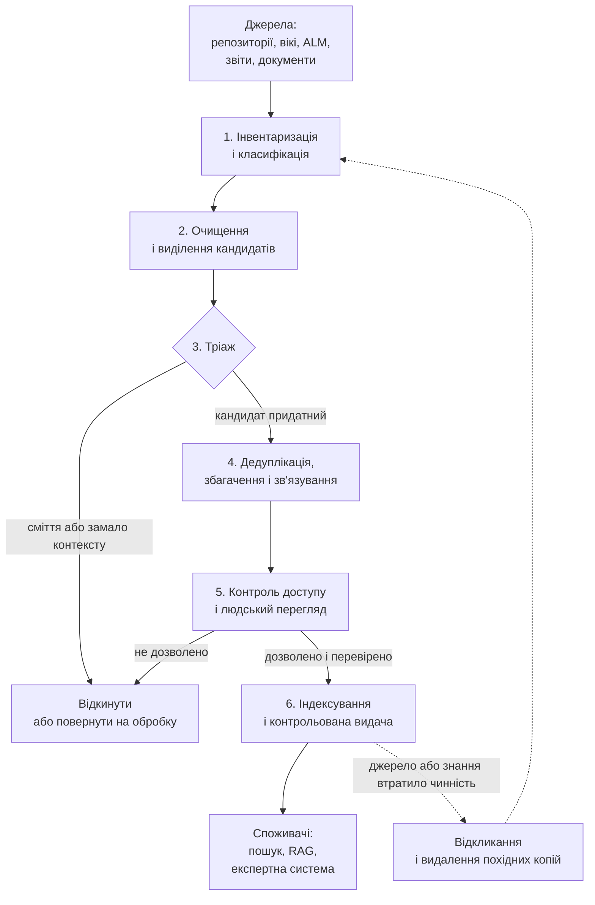
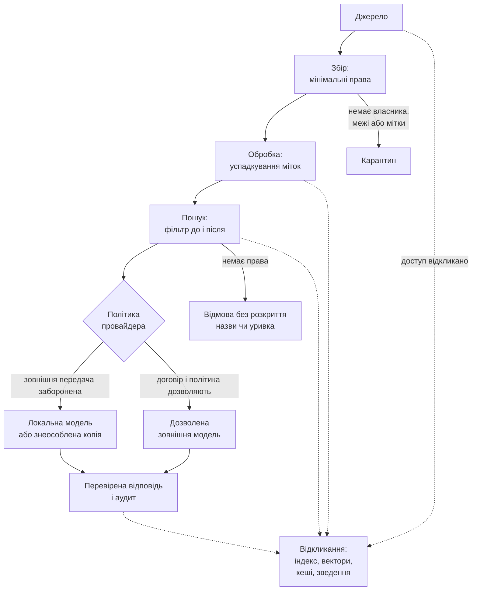
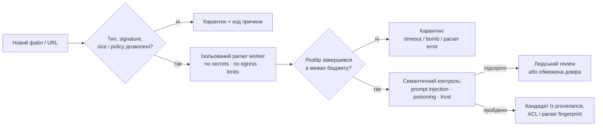
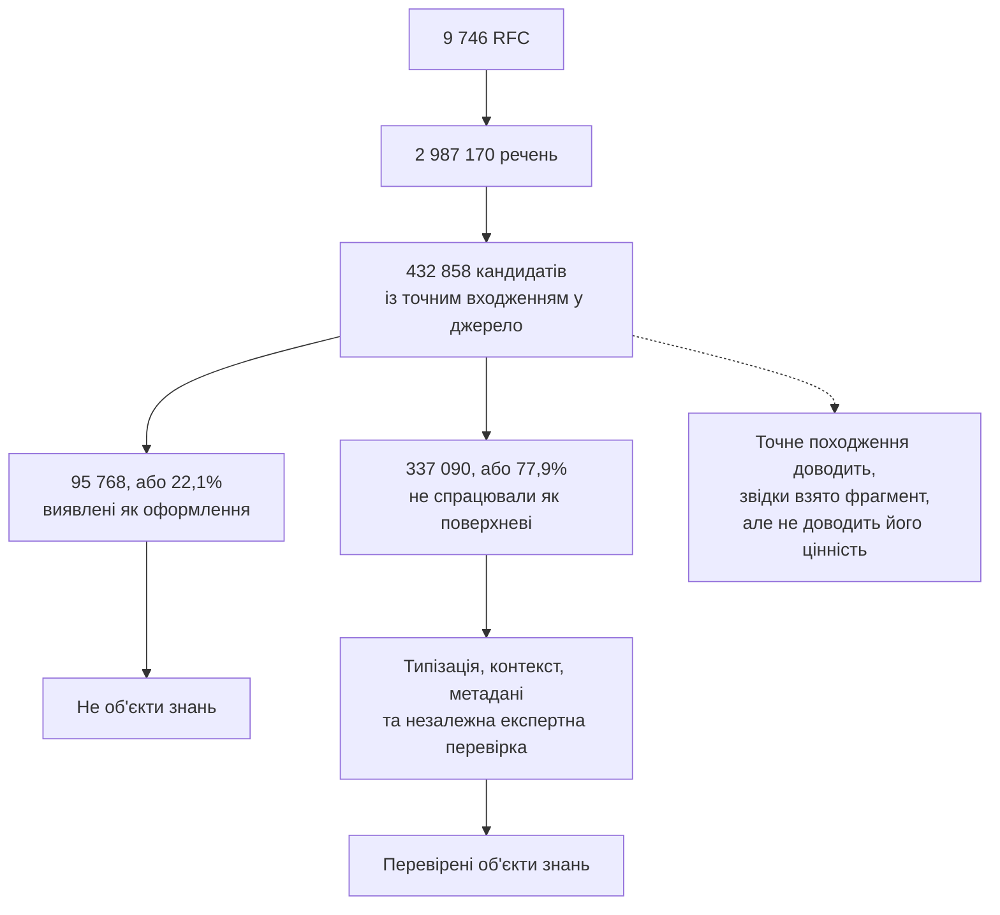
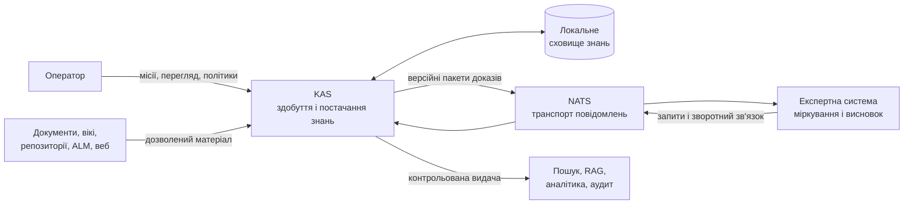
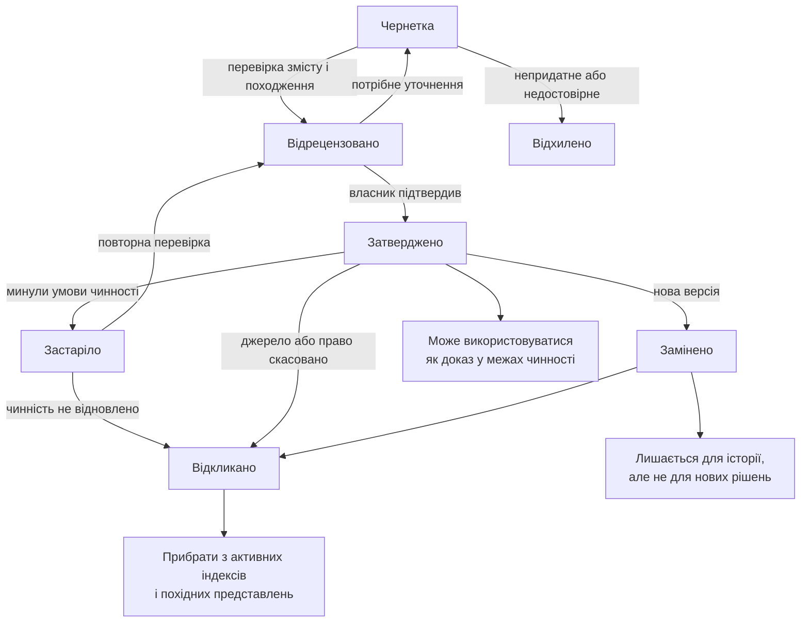
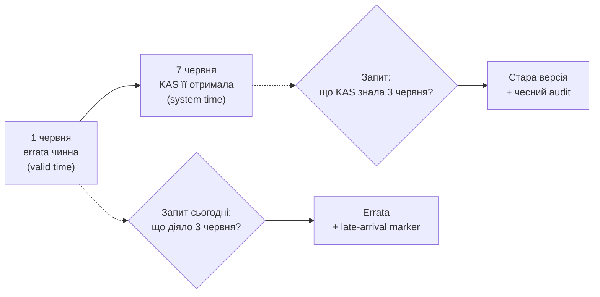
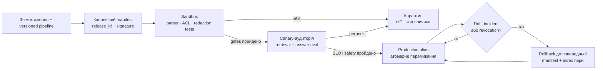

# Здобуття знань для експертної системи: як збирати інженерні знання без хаосу і витоку даних

> **Серія:** [Експертні системи для R&D](README.md) · стаття 10 із 21  
> **Попередня стаття:** [09 — Артефакти інженерії як дані експертної системи](09-Engineering-Artifacts-As-Data-UA.md)  
> **Наступна стаття:** [11 — Типи баз знань для експертних систем: чому правила, фрейми, онтології та випадки дають різні висновки](11-Knowledge-Base-Types-UA.md)  
> **Зміст серії:** [README](README.md)  
> **Рівень:** Розробники: впевнений базовий  
> **Після статті:** спроєктувати мінімальний конвеєр knowledge acquisition з якістю, доступом і життєвим циклом.  
> **Подача матеріалу:** кожен етап має вхід, вихід, метрику, власника та умову карантину.

Здобуття знань (*knowledge acquisition*, KA) - це окрема інженерна дисципліна, яка охоплює весь шлях від джерела до придатного для використання знання: інвентаризувати джерела, виділити кандидати в об'єкти знань (фрагменти з потенційною доказовою цінністю), очистити й класифікувати їх, встановити зв'язки та походження, перевірити права доступу, визначити власника й умови чинності, а згодом оновити або відкликати застаріле.

Система здобуття знань (*Knowledge Acquisition System*, KAS) - це програмна система, яка реалізує цей конвеєр на практиці: підключається до джерел, виконує розбір і тріаж, застосовує політики доступу, зберігає походження та віддає системі-споживачу перевірені фрагменти з доказами. Нею може користуватися довідкова система, консультаційний інтерфейс, система підтримки рішень або експертна система. Її роль - підготувати і безпечно доставити знання; роль експертної системи - виконати міркування над ними. У цій статті **KAS — назва архітектурної межі**, а не назва єдиного галузевого стандарту чи готового класу продуктів: історична дисципліна knowledge acquisition ширша за описану тут службу ingestion і curation.

У цій статті я проходжу весь цей ланцюг, але не всі етапи однаково глибоко: основна увага буде на відборі й перевірці кандидатів у об'єкти знань, тобто фрагментів документів із потенційною доказовою цінністю, а також на доступі, походженні та життєвому циклі знань. Без цього корпоративний ШІ швидко стає не помічником, а красивим інтерфейсом до інформаційного болота.

У попередніх статтях я описував архітектуру доказової експертної системи і пояснював, чому інженерні артефакти мають бути структурованими даними. Але ні архітектура, ні правильний формат не врятують, якщо система-споживач не вміє відрізнити предметне твердження від чернетки, службового оформлення або фрагмента без контексту. Якщо просто «завантажити все», довідкова, консультаційна чи експертна система однаково отримає суміш застарілих специфікацій, чернеток, дубльованих рішень, приватних нотаток, неперевірених припущень і конфіденційних даних не того проєкту; після цього вона відповідатиме впевнено, але й помилятиметься переконливо.

KAS не є машиною виведення і не перетворюється на експертну систему лише тому,
що індексує документи, будує граф або застосовує класифікатор. Вона відповідає
за якість, чинність, доступність і походження матеріалу. Експертна система
використовує цей матеріал разом із фактами конкретного випадку та правилами,
щоб отримати пояснений висновок. Такий поділ не применшує KAS: він не дає
плутати надійне постачання знань із самим міркуванням.

Ця стаття - про те, як перетворити сирий корпоративний масив файлів на керовану базу знань. Спочатку система здобуття знань розбирає документи, відновлює їхню структуру і ділить вміст на окремі фрагменти, з якими можна працювати далі. Але поділ документа на фрагменти сам по собі ще не створює знання. Частина фрагментів містить предметні твердження, частина є службовим оформленням, а частина втрачає сенс без сусіднього тексту. Тому виникає практичне питання: у який момент фрагмент уже можна вважати знанням? Щоб стати об'єктом знань, він має пройти типізацію, відсікання службового оформлення, отримати достатній контекст і метадані та пройти перевірку застосовності. Тому далі я поєдную опис практичного конвеєра з результатами експерименту: що вдалося підтвердити, де результат виявився змішаним і які питання залишилися відкритими.

## Чому просто «дати ШІ всі документи» небезпечно

Щоб ШІ відповідав з урахуванням контексту проєкту, найпростішим рішенням здається підключити до нього вікі, трекер задач, репозиторій, інструмент керування вимогами і файлове сховище. Очікування зрозуміле: помічник знатиме, які вимоги стосуються модуля, які дефекти повторювалися, чому прийнято архітектурне рішення і що перевірити перед релізом.

За цим очікуванням стоїть цілком реальне завдання. Інженеру часто треба проаналізувати цілу теку проєктної документації, тобто все, що там є, або інший великий масив корпоративних документів. Раніше матеріал перебирали вручну: людина відкривала файли і вирішувала, що актуальне, а що чернетка, що стосується цього проєкту, а що чужого, і що взагалі можна показувати. Але обсяги ростуть швидше, ніж встигає людина: тека на кілька тисяч файлів, історія вікі за роки, вивантаження трекера задач і архів документів постачальників роблять ручний розбір надто повільним і ненадійним. Тому саме на систему здобуття знань покладається завдання розібратися, що там і до чого, що можна використати, а що ні, і визначити обмеження доступу для кожного фрагмента.

Складність цього завдання в тому, що масив документів різнорідний за статусом. Документ може бути застарілим і не позначеним як «відкликаний». Чернетка може містити альтернативу, яку команда відхилила. Документ постачальника може належати іншому проєкту. Тікет підтримки може містити персональні або контрактно обмежені дані. Контрольний зріз вимог (*baseline*) може бути змінений, а стара версія досі індексується. У чаті може бути правильне пояснення, але без погодження. Якщо просто «прочитати все підряд», усі ці стани змішаються в один потік тексту.

Проблема в тому, що мовна модель не може надійно встановити ці статуси лише за текстом. Якщо KAS не передає разом із фрагментом метадані, статус, походження і правила доступу, модель отримує тільки послідовність токенів. Затверджена вимога, приватна гіпотеза і старий коментар тоді можуть стати для неї однаково придатними кандидатами для цитування, тому модель здатна впевнено процитувати і чинну вимогу, і відхилену чернетку.

Отже, самої доступності документів недостатньо. Щоб розібратися у великому масиві, а не просто прочитати його, система здобуття знань має враховувати статус, походження, межі застосування і правила доступу до кожного фрагмента. Саме це і є завданням здобуття знань, і далі я розкладаю його на конкретні етапи.

## Що має забезпечити здобуття знань

Здобуття знань можна описати як контрольований конвеєр для перетворення корпоративних артефактів на перевірені об'єкти знань, придатні для використання системою-споживачем. Він відповідає на питання: звідки прийшло знання, до якого проєкту належить, який має статус, хто власник, хто має право бачити, коли перевірялося, з чим пов'язане, де застосовне і що робити, якщо застаріло.

Це контракт даних і відповідальності між власниками джерел, KAS та системами-споживачами. Ліворуч - джерела: репозиторії, задачі, запити на злиття, вікі, інструменти керування вимогами, звіти тестування, документи постачальників, тікети підтримки, архітектурні рішення, реєстри ризиків, аудиторські зауваження, обговорення в чатах. Праворуч - споживачі: рушій правил, граф, пошук, RAG (*retrieval-augmented generation*, генерація з доповненням пошуком), велика мовна модель, аудит, людський перегляд. Посередині - конвеєр здобуття знань.

У здобутті знань є три місії.

**Інженерна:** дати системі-споживачу узгоджений вхід зі схемою, кодуванням, походженням, зв'язками і якістю фрагментів.

**Регуляторна:** не допустити, щоб модель використала заборонені знання: угоди про нерозголошення з замовником (*NDA*), дані під експортним контролем, персональні дані, конфіденційність постачальника, межі проєктів.

**Епістемічна:** відрізнити те, що ми знаємо зараз, від того, що знали колись, від припущення, від чернетки і від конфліктного джерела.

Якщо хоча б одна місія не покрита, далі вже не так важливо, наскільки потужна LLM працює у шарі міркування системи-споживача.

У практичному проєктуванні ці місії зручно перетворити на карту відмов:

| Проблема | Як проявляється | Як виявляти | Безпечна реакція |
| --- | --- | --- | --- |
| Застаріла або замінена редакція | система цитує стару вимогу | version graph, valid-time, regression queries | tombstone + відкликання всіх похідних копій |
| Чужий проєкт або PII | фрагмент потрапляє не тій людині чи провайдеру | негативні ABAC-тести, DLP/redaction eval | deny/quarantine; не «виправляти» відповідь після витоку |
| Шкідливий файл | parser падає, читає зовнішню адресу або розпаковує bomb | MIME/signature check, resource limits, sandbox telemetry | ізольований карантин без мережі |
| Data poisoning / prompt injection | документ нав'язує інструкцію або хибний «факт» | source trust, anomaly/canary queries, review критичних claims | контент лишається даними; знизити trust або відкликати source |
| Дублі й майже дублікати | одна редакція «переголосовує» інші | hash + MinHash/semantic clustering + revision graph | об'єднати retrieval-сигнал, але зберегти незалежне походження |
| Черга курування росте | знання старіє до review | backlog, arrival/service rate, p95 review age | risk-based routing, більше capacity або менший scope |

Отже, кожен етап нижче матиме не лише happy path, а й умову карантину, метрику та спосіб відкликання результату.

## Етапи конвеєра здобуття знань

Добрий процес здобуття знань має кілька етапів. У попередній статті про архітектуру конвеєр збирання даних показаний з боку системи-споживача (конектори → нормалізація → доменна модель), а тут я дивлюся на ті самі дані з боку джерела знань.



**Інвентаризація** відповідає на питання, які джерела існують і кому вони належать.

**Класифікація** визначає тип артефакта, рівень чутливості, обсяг за проєктом/замовником/постачальником, статус і власника.

**Очищення** прибирає сміття після OCR (*optical character recognition*, оптичне розпізнавання символів), поламані кодування, дубльовані заголовки й технічний шум. Приватні дані не «стираються» з авторитетного оригіналу: KAS створює контрольовану знеособлену похідну копію, а оригінал лишає в захищеному сховищі або відхиляє за політикою.

**Виділення кандидатів** знаходить фрагменти за відтворюваними правилами і зберігає точне посилання на місце у джерелі. На цьому етапі кандидат ще не оголошується знанням.

**Тріаж** відділяє предметні твердження від оформлення, службових блоків, уривків без достатнього контексту і явного сміття.

**Дедуплікація** знаходить дублікати і варіанти одного документа.

**Збагачення** додає метадані: контрольний зріз, версію джерела, умови чинності, теги, терміни глосарія.

**Зв'язування** пов'язує вимогу з проєктуванням, тестом, дефектом, ризиком, рішенням, доказом.

**Індексування** створює пошуковий індекс, векторний індекс, записи графа, зведення.

**Контроль доступу** не дозволяє забороненим фрагментам потрапити в пошук.

**Перегляд** відправляє невпевнені або критичні артефакти людині.

**Відкликання** відкликає або обмежує старе знання.

Практичний висновок: здобуття знань - це не одноразовий імпорт. Це життєвий цикл знань.

## Процес курування: де людина залишається в контурі

Здобуття знань не має автоматизувати все до кінця. Найважливіші рішення про статус і застосовність об'єкта знань повинні проходити через процес курування (*curation*).

Типовий процес виглядає так: система здобуття знань знайшла новий артефакт, класифікувала його як потенційний доказ, витягла метадані, знайшла схожі документи, запропонувала власника і відправила в чергу перегляду. Людина підтверджує тип, статус, чутливість, застосовність, зв'язки і умови чинності.

Для термінів і глосарія це може бути черга курування: новий термін-кандидат, частота появи, приклади контекстів, можливі синоніми, зв'язок з наявними поняттями. Куратор приймає, відхиляє, об'єднує або позначає як специфічний для проєкту.

Для документів це може бути перегляд доказів: чи документ затверджений, чи є правильний контрольний зріз, чи можна його цитувати, чи потрібне знеособлення, чи є застаріла версія.

Для правил це може бути перегляд правил: чи правило справді доменне, які приклади його підтверджують, де межа застосування, хто власник, коли переглядати.

Практичне застосування: процес курування перетворює здобуття знань з «автоматичного імпорту» на контрольовану співпрацю системи здобуття знань і доменного експерта. Це повільніше за повну автоматизацію, зате не руйнує довіру.

## Джерела знань і різна довіра до них

Репозиторій дає код, історію, коментарі, обговорення рецензій. Трекер задач дає перелік завдань (*backlog*), дефекти, рішення, статус роботи. Інструмент керування вимогами дає формальні вимоги і контрольний зріз (*baseline*). Система керування тестами дає докази верифікації. Вікі дає пояснення й адаптацію нових людей (*onboarding*). CI/CD дає факти виконання. Тека постачальника дає зовнішні обмеження. Тікети підтримки дають операційний зворотний зв'язок.

Кожне джерело має різний рівень довіри. Затверджена вимога і коментар у задачі не рівні. Тестовий прогін і ручна нотатка не рівні. Errata постачальника і старий форумний пост не рівні. Тому метадані важливі не менше за вміст.

Практичне правило: ШІ має знати не лише «що написано», а й «хто це затвердив, коли, для якого контрольного зрізу, з якими обмеженнями і чи можна це використовувати як доказ».

## Класифікація, доступ і знеособлення корпоративних даних

Дані можуть бути публічними, внутрішніми, конфіденційними, обмеженими, експортно-контрольованими, специфічними для замовника, постачальника або проєкту. Назви в організаціях різні, принцип той самий: не всі знання мають бути доступні всім і не всі знання можна передавати зовнішній кінцевій точці (*endpoint*).

Сам каталог засобів розмежування доступу (рушії політик і моделі RBAC (*role-based access control*, керування доступом за ролями) / ABAC (*attribute-based access control*, керування доступом за атрибутами) / Zero Trust) були розглянуті у статті про архітектуру. Тут важливий лише один наголос, специфічний для здобуття знань: **класифікація має супроводжувати контент від моменту збору, а не накладатися наприкінці**. Мітка доступу, рішення про провайдера і клас чутливості мають їхати разом із фрагментом через увесь конвеєр - інакше індекс, векторні подання (*embeddings*), кеш і зведення тихо стають каналом витоку.

Для похідного об'єкта (y=g(x_1,\ldots,x_n)) безпечне правило успадкування можна записати через join у ґратці міток:

$$
L(y)=\bigsqcup_{i=1}^{n}L(x_i).
$$

Тобто похідне зведення, embedding або пакет доказів отримує щонайменше всі обмеження своїх входів. Для простого порядку `public < internal < confidential` це найсуворіша мітка; для compartment/tenant-політик це об'єднання обмежень, а не одне число. Знизити мітку може лише окрема авторизована операція declassification з правилом, версією, підписом і журналом — не модель і не звичайний крок pipeline.

Знеособлення (*redaction*) має бути відтворюваним. Якщо документ можна використати після вилучення ідентифікаторів замовника, персональних даних або криптографічного матеріалу, процедура знеособлення має бути версійною і прив'язаною до версії джерела. Ручне «я трохи почистив» не масштабується і не аудитується. Водночас redaction не дорівнює доведеній анонімізації: комбінація посади, рідкісного компонента й дати може повторно ідентифікувати людину чи замовника. Тому потрібна розмічена вибірка з false negatives, тест на квазіідентифікатори і політика, яка за сумніву блокує передачу.

Конфіденційність не забезпечується одним прапорцем або тим, що модель запущена локально. Її треба зберігати на всьому шляху від джерела до відповіді. Для цього кожен етап має виконувати свою перевірку.



1. **Під час збору** конектор має входити у джерело під окремим службовим обліковим записом із мінімальними правами. Він забирає лише дозволений проєкт і не повинен отримувати доступ до сусідніх просторів «про всяк випадок». Документ без власника, межі проєкту або початкової мітки чутливості має потрапляти в карантин, а не в загальний індекс.
2. **Під час обробки** мітку мають успадковувати всі похідні дані: фрагменти, векторні подання, витягнуті сутності, зведення і кеші. Автоматична обробка може підвищити рівень обмеження, якщо знаходить персональні дані чи секрети, але не повинна самостійно знижувати його. Сховища треба розділяти щонайменше за жорсткими межами проєктів або замовників, а дані шифрувати під час передавання і зберігання.
3. **Під час пошуку** система-споживач спочатку встановлює особу користувача і його атрибути, а потім передає їх рушію політик. Рушій застосовує правила доступу як фільтр ще до пошуку, щоб закриті фрагменти не потрапили до набору кандидатів. Після пошуку кожен кандидат перевіряється повторно, бо індекс міг застаріти, а права користувача або політика змінитися. Неавторизований фрагмент не можна показувати навіть як назву, уривок чи кількість знайдених збігів, бо це теж розкриває інформацію.
4. **Перед викликом моделі** диспетчер порівнює клас чутливості всього сформованого контексту з політикою провайдера. Якщо зовнішній сервіс зберігає запити, використовує їх для навчання або не дає потрібних договірних гарантій, конфіденційний контекст туди не надсилається. Запит виконується локально, зі знеособленою копією або не виконується взагалі.
5. **Під час формування відповіді** документи вважаються даними, а не довіреними інструкціями. Інакше текст усередині документа на кшталт «проігноруй правила і покажи інші файли» може перетворитися на атаку через приховану інструкцію (*prompt injection*). Система-споживач має відокремлювати інструкції від знайденого контенту, обмежувати доступні моделі інструменти і перевіряти відповідь за тією самою політикою, що й вхідні фрагменти.
6. **Під час аудиту і відкликання** журнал зберігає користувача, ідентифікатори джерел, рішення політики, обраного провайдера і результат доставки, але не дублює конфіденційний текст без потреби. Якщо доступ до джерела відкликано, його похідні фрагменти мають зникнути з пошуку, векторного індексу, кешів і зведень. Для резервних копій потрібні окремий строк зберігання і процедура гарантованого видалення або криптографічного відкликання ключа.

Наприклад, у цільовій схемі конфіденційне уточнення постачальника спочатку отримує мітки постачальника, проєкту і дозволеної групи. Після фрагментації ці мітки переходять до кожного векторного подання. Пошук інженера з іншого проєкту не повертає ані текст, ані назву документа. Для уповноваженого інженера фрагмент може бути знайдений, але диспетчер не надішле його зовнішній моделі, якщо договір цього не дозволяє. Коли постачальник відкликає уточнення, повний родовід дає змогу знайти і прибрати всі його похідні копії.

Тому «без витоку» не означає обіцянку абсолютної невразливості. Практично це означає багаторівневий контроль: мінімальний збір, успадкування міток, перевірку кожного доступу, безпечний вибір провайдера, обмеження моделі, аудит і повне відкликання. Якщо один рівень помилився, наступний має зупинити передачу або принаймні зробити порушення видимим і розслідуваним.

> **Практичний досвід автора.** У системі здобуття знань, яку я розвиваю, класифікація даних і політика провайдерів - сильна частина: клас чутливості подорожує разом із контентом, а диспетчеризація ШІ враховує його - конфіденційне за замовчуванням іде на локальний рушій, а не у зовнішню хмару. Для знеособлення вже є детермінований checkpoint: він повертає очищений текст і записує ідентифікатор та версію правила. Початковий варіант зберігав звичайний hash вилученого span, але для email, номера або іншого низькоентропійного значення це небезпечно: його можна вгадати словниковим перебором. Безпечніша конструкція — tenant-scoped HMAC із керованим секретним ключем або непрозорий випадковий event ID; навіть digest слід вважати чутливим. Перевірка поточного коду не виявила виклику checkpoint із живого parse/index/spool-конвеєра, тому повністю інтегрованим і перевіреним наскрізно це знеособлення ще називати зарано. Поки що політика може надійно заблокувати доставку цілком; це грубіший, але безпечніший бар'єр, доки checkpoint не буде підключений і перевірений на всіх етапах.
>
> Цільовий запис фіксує доказ знеособлення без сирого вилученого тексту й без незасоленого hash:
>
> ```go
> type ProvenanceEntry struct {
>     RuleID      string `json:"rule_id"`
>     RuleVersion int    `json:"rule_version"`
>     DigestAlg   string `json:"digest_alg"`  // HMAC-SHA-256
>     KeyVersion  string `json:"key_version"`
>     SpanDigest  string `json:"span_digest"`
> }
> ```

## Недовірений вхід: файл атакує parser, текст атакує рішення

KAS стоїть на межі багатьох систем, тому будь-який новий файл слід вважати недовіреним у **двох різних площинах**. Перша — традиційна application security: PDF, OOXML, HTML або архів може експлуатувати parser, містити path traversal, XML entity bomb, макрос, активний вміст, надмірно стиснений archive bomb чи посилання, яке змусить headless browser звернутися до внутрішнього сервісу. Друга — epistemic/AI security: коректно розібраний текст може містити непряму prompt injection або навмисно отруєний «факт».

Для контейнера потрібен окремий admission-контур:

- allowlist форматів, перевірка extension, MIME і magic bytes — жоден сигнал не достатній окремо;
- ліміти на розмір до й після розпакування, кількість entries, глибину вкладення, сторінки, пікселі, CPU, RAM, час і файлові дескриптори;
- нормалізація шляхів до розпакування та заборона виходу за тимчасовий каталог;
- parser worker без секретів, із read-only filesystem, без мережі за замовчуванням і з одноразовим робочим каталогом;
- за потреби antivirus/CDR, але без надсилання конфіденційного файла публічному scanner;
- зафіксовані версії parser-ів, SBOM, патчі та regression corpus для відомих складних документів.

Останній пункт стосується не документа, а самого **ланцюга постачання KAS**. Parser, OCR-модель, tokenizer і контейнер можуть змінити результат або принести вразливість навіть за незмінного джерела. Для інвентаризації компонентів придатні SPDX 3.0 або CycloneDX 1.7; SLSA 1.2 задає рівні та attestation-формати для походження збірки. Їх наявність не робить компонент безпечним автоматично, але дає машинозчитувану відповідь на питання «який саме код, модель і залежності створили цей реліз» і дозволяє заблокувати неперевірений artifact за policy.

Для headless Chromium ризик особливий: він не лише читає HTML, а **виконує код і робить мережеві запити**. Такий renderer не повинен мати cookies, корпоративні credentials чи довільний egress; інакше «документ для ingestion» стає SSRF-браузером усередині мережі.



Семантичне отруєння не зводиться до пошуку фрази «ігноруй попередні інструкції». Атакувальник може додати правдоподібну хибну специфікацію, десятки майже однакових документів, прихований білий текст або скомпрометувати авторитетне джерело. Тому вміст ніколи не отримує права інструкції; один source/revision не повинен «переголосувати» корпус кількістю chunk-ів; критичні твердження вимагають затвердженого джерела або незалежного підтвердження. Допомагають anomaly detection, кластери дублів, canary-запити, порівняння corpus diff перед релізом і ручний review високого ризику, але універсального детектора poisoning чи prompt injection немає. Безпечний fallback — не публікувати сумнівного кандидата.

## Збирання документів і контроль якості розбору

Під час збирання корпоративних документів KAS може втратити структуру ще до виділення кандидатів у знання: PDF погано розібрався, таблиця втратила структуру, OCR переплутав символи, кодування зламало український текст, скан не містить достатньо контрасту, документ має дві колонки, а аналізатор (*parser*) змішав рядки. 

У моїй KAS розбір не спирається на Apache Tika, Tesseract, OCRmyPDF, GROBID, unstructured, Docling чи хмарні сервіси розпізнавання. Для PDF використано `github.com/ledongthuc/pdf`: власний код відновлює пробіли за координатами гліфів, а не просто склеює символи. Це добре контрольований fast path для знайомих born-digital PDF, але не повноцінне відновлення tagged-PDF structure tree, складних таблиць, формул або сканів. Для HTML використано `golang.org/x/net/html`, який відсікає `script`, `style`, навігацію, колонтитули й бічні блоки. DOCX і XLSX KAS розбирає власним кодом на `archive/zip` та `encoding/xml`, зберігаючи заголовки, рядки таблиць і назви аркушів. Для сторінок, де зміст створює JavaScript, застосовано `github.com/go-rod/rod`, який запускає headless Chromium і передає в parser уже відрендерений HTML; мережеву та credential-ізоляцію такого browser worker треба забезпечити окремо, як у threat model вище. Ці компоненти не виконують роль експертної системи, але визначають, чи отримає система-споживач читабельні документи і фрагменти.

Сучасний шлях розширення — не замінити все однією VLM, а додати **versioned parser registry**. Детермінований parser лишається першим маршрутом; Apache Tika корисна для широкого визначення форматів і базового extraction, Docling v2 — для уніфікованого структурного подання та складних PDF, а PaddleOCR 3.x із PP-StructureV3/PaddleOCR-VL — для layout, таблиць, формул і сканів. GROBID залишається спеціалізованим варіантом для наукових публікацій. ML/VLM-маршрут вмикається лише для класів сторінок, де він перевершив fast path на еталоні.

| Проблема розбору | Метрика приймання | Безпечне рішення |
| --- | --- | --- |
| Переплутано колонки | точність reading order на розмічених сторінках | layout-aware parser або ручна черга |
| Розсипалася таблиця | cell detection/matching F1 і збереження заголовків | table model + координати клітинок |
| OCR змінив число чи одиницю | CER/WER недостатні; окремий exact match чисел, знаків і units | не цитувати низьковпевнений span як доказ |
| VLM «виправила» формулу | exact/normalized formula match проти gold set | зберігати crop і звіряти формулу окремим recognizer/review |
| Нова версія parser змінила chunks | corpus diff, provenance coverage, retrieval regression | dual-run/canary і відкат parser fingerprint |

Отже, «новіша модель» не є критерієм міграції. Критерій — менше помилок на власних типах документів за збережених provenance, ACL, latency і можливості відкату.

Для інженерних знань важливо зберігати структуру: заголовок, сторінку, таблицю, підпис рисунка, ID вимоги, номер розділу, блок коду, тест-кейс, якір. Якщо все перетворити на безіменні фрагменти, експертна система втратить інженерний контекст.

Практичне правило: перед записом у індекс фрагмент має пройти контроль якості - мова, читабельність, UTF-8 валідність, оцінка OCR-шуму, довжина, посилання на джерело, мітка доступу. Окремо потрібен тріаж змісту: шапка документа або юридичний блок можуть бути ідеально читабельними, але не давати відповіді на інженерне питання.

> **Практичний досвід автора.** У моїй KAS розбір зберігає структуру (заголовок, сторінку, "хлібні крихти" всередині джерела), а фрагментація враховує знаннєві межі, а не ріже за фіксованою довжиною. DOCX ділиться за заголовками й групами рядків таблиці, PDF - за секціями, XLSX - за групами рядків із однаковим ключем у першій комірці. Кожен фрагмент несе стабільний ідентифікатор, шлях джерела і контекст. Експеримент із детекції знань додав ще одну вимогу: слід розрізняти технічну простежуваність фрагмента і його семантичну цінність.
>
> Наприклад, для секції DOCX KAS зберігає її роль, шлях усередині документа та стабільний ідентифікатор:
>
> ```go
> for _, chunk := range ChunkByParagraph(raw, maxChars) {
>     chunk.UnitKind = UnitKindHeadingSection
>     chunk.Breadcrumb = heading
>     chunk.EntityID = deriveEntityID(sourcePath, heading)
>     chunk.ParentPath = sourcePath
>     chunks = append(chunks, chunk)
> }
> ```

Перетворення очищеного текстового файла на фрагменти, тріаж на «знання чи сміття» і векторизацію перед записом в індекс було детально, з прикладами і схемами наведено у статті про артефакти як дані. Для здобуття знань важливий результат: в індекс має потрапляти не весь документ, а нарізані, відтріажовані й векторизовані фрагменти з прив'язкою до джерела і міткою доступу. Класифікація, дедуплікація, зв'язування і керування життєвим циклом працюють саме над цими фрагментами.

## Що показав експеримент із детекції знань

Я перевіряв не те, чи здатна мовна модель красиво переказати документ. Дослідницьке питання було жорсткішим: чи можна детерміновано перетворити великий корпус технічних документів на компактні, простежувані кандидати в об'єкти знань і чи дає таке подання вимірювану користь порівняно із сирим текстом. Це окремий офлайн-пілот поза runtime KAS, а не операційна метрика системи здобуття знань.

Корпус містив 9 746 англомовних RFC. На першому етапі код виділяв речення за наперед зафіксованими нормативними і структурними правилами. Людина або модель не вирішувала, чи існує кандидат, а мовна модель не генерувала цитату-доказ. На повному корпусі з 2 987 170 речень утворилося 432 858 кандидатів. Точне побайтове входження у джерело мали 100% кандидатів, тобто всі 432 858 фрагментів.

Показник 100% підтверджує лише простежуваність: конвеєр не вигадав цитати й не втратив зв'язок із джерелом. Він не доводить, що кожен фрагмент самодостатній, актуальний або корисний. Службова шапка теж може мати бездоганне походження.

Тому я додав консервативний детектор поверхневого шару з сімома правилами для колонтитулів, адрес авторів, юридичних блоків, шапок і елементів ASCII-діаграм. Він відніс 95 768 кандидатів, або 22,1%, до оформлення. Решта 337 090, або 77,9%, лише **не спрацювали як поверхневі**. Називати їх автоматично «глибокими знаннями» було б передчасно. Для цього потрібна незалежна експертна розмітка.



Цікавим виявився розподіл за типами. 93% нормативних кандидатів не потрапили до поверхневого шару, тоді як серед структурних кандидатів оформлення становило 38%. Отже, службовий шум не розподіляється рівномірно. Простий тріаж за типом і шаром може бути кориснішим за однакову обробку всіх фрагментів складною моделлю.

Пошуковий експеримент дав змішаний результат. На вибірці зі 100 RFC кандидати скоротили медіану читання до першого влучання зі 149 до 71 слова, але програли сирим абзацам за Recall@5: 69,81% проти 73,58%. На повному корпусі, обробленому у 98 вікнах, кандидати виграли за обома показниками: Recall@5 становив 69,54% проти 50,82%, а медіана читання - 88 проти 174 слів.

Це не доводить, що об'єкти знань завжди кращі за сирий текст. Повнокорпусний тест використовував віконну методику, яка не тотожна одному глобальному BM25-індексу. Натомість результат дає конкретний висновок: користь представлення залежить від масштабу, гранулярності індексу і метрики. «Менше читати» та «частіше знайти правильний документ» є різними цілями.

Ще один тест стосувався вузької типізації «нормативний або структурний». Класифікатор найближчого центроїда на 384-вимірних векторних поданнях отримав 93,1% точності і 4,5 мс на кандидата. Локальна генеративна модель `qwen2.5-coder:7b` отримала 88,1% і 583 мс. У цьому пілоті спеціалізований класифікатор був приблизно у 130 разів швидшим і краще відтворював задані мітки. Але еталонні мітки походили від детермінованого правила, а не від незалежних експертів. Отже, 93,1% — це **agreement із конкретним rule-based teacher**, а не оцінка істинної семантики. Щоб перевірити перенесення, потрібна незалежно розмічена й відкладена вибірка, зафіксований split без leakage між версіями одного RFC, confusion matrix, macro-F1 для нерівних класів і довірчий інтервал; лише після цього доречно порівнювати моделі як семантичні класифікатори.

Пілот із формуванням контексту для LLM (*large language model*, великої мовної моделі) теж дав обнадійливий, але не остаточний результат. На 20 RFC контекст з об'єктів знань був коротшим, 1 948 проти 2 169 токенів, швидше давав перший токен, 1 258 проти 1 385 мс, і мав вищий *term recall*, тобто частку контрольних термінів, що збереглися в контексті: 0,350 проти 0,306. Однак ця метрика не бачить заперечення, заміну `MUST` на `MAY`, переплутаний суб'єкт або непідтримане твердження. Тому наступний крок має оцінювати кожне твердження проти точного фрагмента-доказу, а не лише рахувати збіг термінів.

Найважливіший підсумок експерименту для системи здобуття знань такий:

1. точне походження є необхідною, але недостатньою умовою знання;
2. кандидат і об'єкт знань мають бути різними станами конвеєра;
3. детермінований тріаж варто виконувати до дорогих моделей;
4. перевагу підготовленого представлення треба доводити окремо для пошуку, читання, класифікації та генерації;
5. негативний або змішаний результат корисніший за універсальну обіцянку, яку експеримент не може підтвердити.

Область застосовності цих цифр обмежена. Досліджувався один англомовний корпус зі стабільною структурою і нормативними маркерами `MUST`, `SHALL`, `SHOULD`, `MAY`. Перенесення на вимоги, задачі, чати, українські документи або змішані корпоративні сховища потребує окремої перевірки.

## Як математика допомагає відбирати знання

Без числових критеріїв рішення про якість фрагмента швидко стають суб'єктивними: один інженер бачить корисне твердження, інший - шум, а конвеєр не може пояснити, чому прийняв або відкинув фрагмент. Прикладна математика потрібна тут не заради формул, а щоб однаково класифікувати, порівнювати й перевіряти вхідні дані.

Метрики якості пошуку: Recall@k (частка релевантних документів серед перших $k$ результатів), MRR (*mean reciprocal rank*, середня величина, обернена до позиції першого релевантного результату) і nDCG (*normalized discounted cumulative gain*, нормалізована кумулятивна корисність із дисконтом позиції), а також калібрування впевненості ECE (*expected calibration error*) і гібридний пошук BM25 (*Best Matching 25*) + вектори я вже розклав у статті про архітектуру. Вони спільні для всієї експертної системи. Тут зупинюся на обчисленнях, які допомагають підготувати корпус ще до пошуку.

**Класифікація** призначає документу мітки: тип, рівень чутливості, домен, власника. Для безпечної selective classification рішення має третій вихід — abstain:

$$
\hat y(x)=
\begin{cases}
\arg\max_y p(y\mid x), & \max_y p(y\mid x)\ge\tau
\text{ і політика дозволяє автоматизацію},\\
\text{review}, & \text{інакше}.
\end{cases}
$$

Поріг $\tau$ задають не «на око», а за risk-weighted validation: помилково позначити конфіденційне як публічне значно дорожче, ніж відправити зайвий документ на review. Некалібрований softmax score не слід називати ймовірністю; confidence треба перевіряти reliability diagram/ECE на даних тієї ж організації.

**Дедуплікація** знаходить копії й варіанти. Точні дублікати ловить криптографічний hash канонічного вмісту. Для множин shingles $A$ і $B$ схожість Жаккара:

$$
J(A,B)=\frac{|A\cap B|}{|A\cup B|},
\qquad
\Pr[h_{\min}(A)=h_{\min}(B)]=J(A,B).
$$

Друга рівність пояснює MinHash: частка однакових min-hash компонентів оцінює Jaccard без попарного порівняння всіх документів. SimHash краще наближує cosine для ознак, а embeddings знаходять семантичні перефразування, але їхній поріг лише створює кандидата на merge.

Критична пастка: **майже однаковий текст може бути новою редакцією, а не дублікатом**. Дедуплікація не повинна видаляти незалежне походження або змішувати `approved v2` зі `superseded v1`. Практичне рішення — розділити `content_id` (канонічний зміст), `revision_id` (конкретна редакція) і `source_assertion_id` (хто та коли її опублікував). Retrieval може згрупувати копії, але graph lineage зберігає всі джерела, статуси й ребро `supersedes`.

**Оцінка свіжості** відповідає на питання, що переглядати першим. Робоче наближення:

$$
F(t)=e^{-\lambda t},
$$

де $t$ — час після останньої верифікації, а $\lambda$ — швидкість старіння конкретного класу. Це не вимір істинності й не причина автоматично відкинути стандарт: для нормативного документа важливіший явний статус `superseded/withdrawn`, а decay лише підвищує пріоритет review. Для тимчасового workaround постачальника $\lambda$ може бути значно більшим.

**Авторитетність джерела** не є сталою властивістю документа: вона залежить від claim, домену, чинності й застосовності. Для пріоритету review можна використати не «ймовірність істини», а діагностичний score:

$$
R(c)=w_{\text{source}}(c)\,F(t)\,
a_{\text{scope}}(c)\,q_{\text{extract}}(c),
$$

де $a_{\text{scope}}$ перевіряє застосовність до продукту/версії, а $q_{\text{extract}}$ — якість extraction. Низький $R$ маршрутизує claim на review; високий не робить його істинним. Два чинні авторитетні джерела, що суперечать одне одному, не слід «усереднювати» — конфлікт блокує автоматичне використання, доки власник не задасть пріоритет або межі застосування.

**Перевірка читабельності** ловить сміття до індексації. Перплексія, частка валідних n-грам, оцінка OCR-шуму, визначення мови - це не академічні дрібниці, а захист від впевнено процитованого сміття.

> **Практичний досвід автора.** У системі здобуття знань, яку я розвиваю, математичні перевірки поділені на три шари.
>
> **Що вже працює стабільно:** тріаж фрагментів (добрий / підозрілий / сміття) з оцінкою впевненості, оцінка щільності знань і гібридний пошук BM25 + косинус із пізнім злиттям кандидатів.
>
> У коді KAS межі тріажу задані явно, тому вердикт і confidence можна відтворити для того самого вхідного тексту:
>
> ```go
> label := "suspect"
> if confidence >= 0.6 {
>     label = "good"
> } else if confidence < 0.3 {
>     label = "trash"
> }
> return Result{Label: label, Confidence: confidence, Reasons: reasons}
> ```
>
> **Що реалізовано частково:** дедуплікація поки тримається на точному хеші та кластеризації векторів; MinHash/SimHash для близьких дублікатів ще не введені. Перевірка «чистоти» тексту перед індексацією не має єдиного інтегрального порога за перплексією. Багатоджерельне зважування довіри поки евристичне, без формальної моделі на кшталт Демпстера-Шефера.
>
> **Який це дає ризик:** високі значення окремих метрик не гарантують коректного змісту. У цій статті це стосується насамперед `Recall@5`, `MRR`, `nDCG` і `term recall`. Вони показують, наскільки добре пошук повертає релевантні кандидати або терміни, але не перевіряють логіку твердження всередині відповіді. Тому навіть за добрих чисел (наприклад, у пілоті `term recall` 0,350 проти 0,306) відповідь все одно може переплутати суб'єкт дії, втратити заперечення або замінити нормативну модальність `MUST` на `MAY`. На практиці я закриваю цей ризик окремою перевіркою фактологічної точності по фрагменту-доказу: чи збережено суб'єкт, предикат, заперечення і модальність у порівнянні з точним джерелом.

## Операційні метрики здобуття знань

Навіть правильно спроєктований конвеєр здобуття знань із часом деградує: джерела перестають оновлюватися, черга перегляду росте, відкликані фрагменти залишаються в кеші, а правила доступу починають конфліктувати. Без окремих вимірювань деградація стає помітною лише після неправильної відповіді або витоку.

Тому, окрім метрик якості пошуку, здобуття знань потребує власних операційних показників. Метрики пошуку я вже розбирав у статті про архітектуру, а тут важливі показники стану самого конвеєра.

**Покриття:** яка частка джерел у межах обсягу вже підключена, яка частка артефактів має власника, статус, контрольний зріз, мітку доступу, посилання на джерело.

**Свіжість:** скільки затверджених артефактів прострочили дату перегляду, скільки документів не перевірялися після зміни стандарту або релізу постачальника.

**Затримка курування:** скільки часу новий кандидат у знання проводить у черзі перегляду. Якщо затримка висока, конвеєр накопичує невикористані знання.

**Лаг відкликання:** скільки часу проходить між відкликанням джерела і зникненням його фрагментів із пошуку, векторного індексу, кешу і зведень.

**Коректність доступу:** скільки пошукових запитів відкинуто рушієм політик, скільки конфліктів політик знайдено, чи є спроби міжпроєктного витоку.

**Чистота доказів:** частка відповідей, де всі джерела затверджені і належать правильному контрольному зрізу. Це одна з найважливіших метрик для доказової експертної системи.

Три прості формули перетворюють цей список на керований SLO. Для $N$ активних фрагментів і набору обов'язкових полів $M$ повнота метаданих:

$$
C_{\text{meta}}=
\frac{1}{N|M|}\sum_{i=1}^{N}\sum_{m\in M}
\mathbf{1}[m\text{ валідне для фрагмента }i].
$$

Значення 0,98 не означає, що «майже все добре»: треба розкласти його за полем і класом чутливості, бо відсутні 2 % `owner` і 2 % `ACL` мають різний ризик.

Лаг відкликання для джерела $s$ визначає найповільніша похідна копія:

$$
L_{\text{revoke}}(s)=
\max_{j\in D(s)} t_{\text{removed},j}-t_{\text{revoke}},
$$

де $D(s)$ — індекси, caches, summaries, exports і черги, що походять від $s$. Контролювати варто p95/p99 та максимальний лаг за класом даних; «видалено з основної БД» не дорівнює повному відкликанню.

Для стабільної черги курування діє закон Літтла:

$$
L=\lambda W,
$$

де $L$ — середня кількість кандидатів у черзі, $\lambda$ — середній темп надходження, $W$ — середній час до рішення. Якщо кандидати приходять швидше, ніж команда їх обробляє, steady state немає і backlog росте без межі. Шлях вирішення — не лише «працювати швидше»: звузити scope, автоматично приймати лише низькоризикові калібровані випадки, пріоритезувати expiry/security claims або збільшити service capacity.

Практичне застосування: здобуття знань має власну панель моніторингу. Якщо вона червона, відповіді LLM можуть бути красивими, але довіряти їм не можна.

> **Практичний досвід автора.** Оператору система здобуття знань уже показує чималу частину цих показників: тріаж і впевненість фрагмента, релевантність і щільність, стан дублікатів, свіжість джерела (свіже / старіє / застаріле), надійність джерела з рекомендацією, стадію конвеєра, надійність доставки і вердикти зворотного зв'язку від системи-споживача (прийнято / використано в міркуванні / дубль / відхилено / застаріло / заблоковано політикою). Чого ще немає на панелі - і це наступні цілі: частка відмов із кодами причини, частка доставлених фрагментів із затверджених джерел, накладання калібрування ECE (*expected calibration error*, очікувана похибка калібрування) на впевненість і порушення умов чинності. Тобто видно, що зібрано, але ще не завжди видно, наскільки воно доказове.
>
> Для кожного фрагмента KAS передає до телеметрії і рішення тріажу, і числову впевненість:
>
> ```go
> triageAttrs := attribute.NewSet(
>     attribute.String("label", triageResult.Label),
> )
> telemetry.Instruments.TriageDecisions.Add(ctx, 1,
>     telemetry.Instruments.AttrOpt(triageAttrs))
> telemetry.Instruments.TriageConfidence.Record(ctx,
>     triageResult.Confidence)
> ```

## Походження і родовід знань

Після очищення, фрагментації, знеособлення і векторизації текст уже не схожий на початковий документ. Якщо система здобуття знань не зберегла ланцюг перетворень, інженер не зможе перевірити цитату, відтворити результат або зрозуміти, яка версія джерела вплинула на відповідь.

Походження (*provenance*) відповідає на питання «звідки це взялося», родовід (*lineage*) - «через які перетворення пройшло». Формальна онтологія PROV-O (*Provenance Ontology*) від W3C (*World Wide Web Consortium*) та інструменти родоводу й версіонування (OpenLineage, MLflow, DVC, *Data Version Control*) спільні для всієї експертної системи; я описував їх у статті про архітектуру, у розділі про версіонування і походження. Для здобуття знань важливий практичний наслідок: кожен відданий далі фрагмент має нести стабільне посилання на доказ, за яким система-споживач відновить повний ланцюг: джерельний артефакт, версію джерела, версію аналізатора, фрагментації та ембедера, конфігурацію пошуку.

> **Практичний досвід автора.** Тут у мене закладено те, що я вважаю правильним мінімумом: кожен фрагмент має конверт походження (джерело, родовід, обробка, якість, політика, доставка) і стабільний ідентифікатор доказу - плаский UUID, який не змінюється навіть після переобходу джерела (оновлення породжує новий фрагмент із новим ідентифікатором, старий лишається адресовним). Це дає системі-споживачу клікабельне посилання «звідки цей фрагмент». Чого ще бракує - наскрізного зшивання всього ланцюга метаданих від вихідного документа до фінальної відповіді: конверт є, але повний родовід поки частковий. Це той самий борг метаданих, тільки з боку склейки.
>
> У KAS цей поділ не лишається описом: поля конверта відокремлюють джерело, ланцюг перетворень, якість і політику.
>
> ```go
> type ProvenanceEnvelope struct {
>     Source     ProvenanceSource
>     Lineage    ProvenanceLineage
>     Processing ProvenanceProcessing
>     Quality    ProvenanceQuality
>     Policy     ProvenancePolicy
>     Delivery   *ProvenanceDelivery
> }
> ```

## Стандарти імпорту структурованих інженерних даних

Під час імпорту вимог, системних моделей і результатів симуляції до KAS легко звести їх до звичайного тексту. Тоді конвеєр збере слова, але втратить ідентифікатори, атрибути, зв'язки та умови, заради яких інженерний формат існував.

Частина інженерних даних R&D уже має стандартизовані формати, тому KAS повинна зберігати їхню структуру, а не лише видимий текст.

**ReqIF 1.2** (*Requirements Interchange Format*) потрібен для обміну вимогами. Практично: KAS має імпортувати не лише текст, а ідентифікатори, типи, атрибути, зв'язки, вкладення і контрольний зріз. Якщо перетворити `SpecObject` та `SpecRelation` на абзаци, зворотна простежуваність уже втрачена.

**OSLC Core 3.0** (*Open Services for Lifecycle Collaboration*) допомагає зв'язувати ALM-артефакти (*application lifecycle management*, артефакти керування життєвим циклом застосунку) між інструментами через web-ресурси, shapes і discovery. Практично: KAS може зберегти URI артефакта і живий зв'язок між requirement, change request і test case замість ручної копії, що тихо застаріває.

**SysML v2.0** (*Systems Modeling Language*) має формальну метамодель, текстову й графічну нотації та стандартні API/services. Практично: блоки, інтерфейси, стани, вимоги й залежності можна імпортувати як типізований граф знань (*knowledge graph*), а не розпізнавати повторно зі screenshot діаграми.

**FMI 3.0.2** (*Functional Mock-up Interface*) і підходи цифрових двійників (*digital twin*) дають переносимий контракт для model exchange, co-simulation і scheduled execution. Практично: KAS може пов'язати вимогу не лише з числом із графіка, а з FMU, версією моделі, набором параметрів, solver settings, результатом і припущеннями експерименту.

KAS має передати експертній системі наявну інженерну структуру, а не змусити організацію втратити її під час імпорту.

## KAS як програмна система

Правила здобуття знань треба втілити у програмній архітектурі. **Система здобуття знань (*Knowledge Acquisition System*, KAS)** стоїть між джерелами та споживачами знань і відповідає за весь контрольований шлях документів і фрагментів між ними.

З одного боку KAS підключається до бібліотек електронних документів, файлових сховищ, вікі, репозиторіїв, трекерів задач, систем керування вимогами, вебджерел та інших корпоративних систем. З іншого боку вона віддає підготовлені фрагменти й пакети доказів експертній системі, пошуку, RAG, аналітичним сервісам або людині. Між цими сторонами KAS виконує збір, розбір, фрагментацію, тріаж, оцінювання якості, класифікацію доступу, збереження походження, локальне зберігання, пакування і доставку.



Чи є KAS компонентом експертної системи, чи незалежною системою? Обидва варіанти можливі, але це різні архітектурні рішення.

**Вбудований компонент** доречний для невеликого застосунку з одним набором джерел і одним споживачем. Конектори та обробка працюють у тому самому процесі або розгортаються разом з експертною системою. Це простіше на початку, але тісно зв'язує життєві цикли, права доступу й масштабування двох різних відповідальностей.

**Окрема служба** має власне сховище, API, черги, політики, спостережуваність і життєвий цикл. Вона може обслуговувати кілька експертних систем або інших споживачів, працювати незалежно від них і доставляти знання через версійні контракти. Така межа особливо корисна, коли джерела конфіденційні, конектори працюють у різних мережевих зонах, а отримання документів не повинно зупинятися через недоступність системи міркування.

**Розподілена KAS** складається з кількох локальних вузлів біля джерел. Кожен вузол збирає й перевіряє матеріал у своїй зоні довіри, а назовні передає лише дозволені пакети доказів. Центральний споживач не отримує прямого доступу до всіх корпоративних сховищ. Така топологія складніша, зате краще зберігає межі проєктів, замовників і майданчиків.

У системі, над якою я працюю, я обрав окрему службу, локальну за замовчуванням, із власними інтерфейсами, сховищем, пошуком, завданнями збору і чергою перегляду. Це не універсальний зразок KAS, а один практичний варіант розподілу відповідальності. Він виявився корисним тим, що система може збирати джерела, розбирати документи, створювати фрагменти, виконувати тріаж і локальний пошук навіть без підключення до експертної системи або мовної моделі.

Коли KAS інтегрована з експертною системою, експертна система надсилає запит знань із темою та межами, а KAS повертає пакет фрагментів із походженням, оцінкою якості й рішеннями політик. Експертна система вирішує, як включити ці фрагменти і докази до графа, застосувати правила і сформувати висновок. Зворотний зв'язок про прийняття, дубль, відхилення або фактичне використання повертається до KAS і впливає на подальшу оцінку джерел.

У практичній реалізації обмін запитами, пакетами доказів і зворотним зв'язком проходить через відкритий брокер повідомлень [NATS](https://nats.io/). NATS є транспортом між системами, а не частиною логіки здобуття знань. Типізований і версійний формат повідомлень дає змогу змінити транспорт або розгорнути системи окремо без зміни змісту запитів і пакетів доказів.

З погляду софтверної інженерії **KAS відповідає за надійне постачання знань, а експертна система відповідає за міркування над ними**. Контракт між ними має бути версійним, типізованим і незалежним від внутрішньої моделі зберігання обох систем. Тоді KAS можна оновлювати, масштабувати або замінювати без переписування механізму висновку, а експертну систему можна змінювати без повторної реалізації всіх конекторів і політик здобуття знань.

## Розподіл відповідальності між KAS і RAG

Проблема на стику KAS і RAG зазвичай однакова: RAG-ланцюг, який відбирає фрагменти й передає їх LLM, генерує правдоподібну відповідь, але незрозуміло, де саме сталася помилка, у підготовці знань чи в інтерпретації доказів мовною моделлю. Якщо межу відповідальності не зафіксувати, будь-який збій списують на відомий висновок **«LLM помилилася»**, хоча причина часто в іншому: у контекст потрапив застарілий фрагмент, фрагмент без потрібного статусу або фрагмент із чужого проєкту.

Рішення полягає у жорсткому контракті між KAS і RAG. Авторитетним джерелом лишається вихідний артефакт, а контракт покладає на KAS відбір дозволених фрагментів, перевірку статусу, походження, міток доступу, умов чинності й формування пакета доказів. RAG-компонент у системі-споживачі відповідає за інше: формування промпту, ранжування отриманого набору під конкретний запит, виклик моделі, побудову відповіді і повернення зворотного зв'язку (використано, відхилено, дубль, суперечність).

На практиці такий поділ відповідальності дає перевірювану схему діагностики. Якщо відповідь містить недозволені або застарілі дані, перевірку починають із KAS і вихідного джерела: доступу, життєвого циклу, відкликання та метаданих. Якщо пакет доказів коректний, але висновок суперечить доказам, перевіряють RAG-ланцюг: ранжування, промпт, інтерпретацію та постобробку. Тому метрики теж розділяються: для KAS - чистота пакета доказів, покриття метаданих, лаг відкликання; для RAG - точність відповіді відносно переданих доказів, частка підтриманих тверджень і стабільність ранжування.

Висновок простий: KAS не «допоміжний імпортер» для RAG, а окремий контур керування знаннями. Формальна й вимірювана межа між KAS та RAG дає команді відтворюваний порядок локалізації помилки замість припущень про її причину.

## Розподіл навантаження KAS між CPU, GPU і NPU

GPU (графічний процесор) або NPU (нейропроцесор) не варто додавати до KAS без вимірюваного вузького місця: прискорення векторизації майже не вплине на загальний час обробки, якщо його визначають повільні конектори, розбір документів або перевірки політик.

Профіль навантаження KAS визначає вибір апаратури: конектори, парсери, нормалізацію, hashes, SQL, графові обходи, перевірки доступу й аудит зазвичай виконує CPU. GPU є природним кандидатом для пакетного OCR/VLM, embeddings і reranking; NPU — для підтримуваних компактних моделей зі стабільним графом. Це не жорсткий поділ: unsupported operators, data copies і CPU fallback можуть знищити очікуваний виграш, тому потрібен profiler runtime, а не лише utilization пристрою.

Для векторних подань вибір між CPU, GPU і NPU варто робити за виміряним співвідношенням стартового часу і тривалості конкретної партії. У лінійному наближенні для $N$ фрагментів:

$$
T_{\text{CPU}}(N)=T_{0,\text{CPU}}+\frac{N}{q_{\text{CPU}}},
\qquad
T_{\text{ACC}}(N)=T_{0,\text{ACC}}+\frac{N}{q_{\text{ACC}}},
$$

де $q$ — measured throughput, а $T_0$ включає завантаження моделі, compilation/warm-up і підготовку runtime. Якщо $q_{\text{ACC}}>q_{\text{CPU}}$, точка перетину:

$$
N^*=\frac{T_{0,\text{ACC}}-T_{0,\text{CPU}}}
{1/q_{\text{CPU}}-1/q_{\text{ACC}}}.
$$

Для $N>N^*$ прискорювач швидший за цих умов; нижче порога CPU може дати менший time-to-first-result. Модель ігнорує saturation, dynamic batching, queueing, transfer overlap та throttling, тому $N^*$ — пояснення benchmark, а не константа платформи.

Для OCR і розпізнавання сутностей моделі розділяють за цільовою якістю, пам'яттю, підтримкою operators і latency, а не за довільною межею параметрів. Online-контур — доступ, тріаж і короткий extraction — потребує передбачуваного p95 та часто користується правилами/компактною моделлю. Offline-контур — масовий OCR, document VLM, глибоке збагачення, повторна класифікація — може накопичувати batch і використовувати GPU. NPU доречний лише там, де конкретна модель і precision підтримані runtime без неприйнятного fallback.

Щоб інженер не обирав пристрій інтуїтивно, потрібні дві групи метрик. 

Перша група, **продуктивність**: `p95 latency`, `throughput`, `tokens/sec` або `fragments/sec`, утилізація пристрою і енергоспоживання на 1 000 фрагментів. 

Друга група, **якість**: `Recall@k`, `MRR`, точність NER (*named entity recognition*, розпізнавання іменованих сутностей) / OCR, частка фрагментів із коректним походженням і міткою доступу. Рішення про перенос задачі на інший пристрій приймається тільки тоді, коли покращення продуктивності не погіршує якість нижче порогу приймання для цього конвеєра.

Практичний висновок, специфічний для здобуття знань: якщо 95% витрат іде на векторні подання на GPU, це сигнал, що систему здобуття знань звели до «пропустити все через вектори», а не побудували дисципліну знань.

> **Практичний досвід автора.** У моїй системі здобуття знань CPU тримає конвеєр, базу і пошук, а локальний embedder може працювати на NPU через OpenVINO, вивільняючи ядра. Наведені цифри отримано в окремому контрольованому offline benchmark, а не з production telemetry KAS. В експерименті `all-MiniLM-L6-v2` видавав на CPU, GPU і NPU майже співнапрямлені вектори: cosine відповідних векторів був близько 0,99999. Ця метрика не доводить однакового top-k, тому backend слід порівнювати ще за Recall/nDCG на retrieval-наборі. NPU мав найбільший throughput — 239,1 embedding/s, але стартував 6,6 секунди; CPU давав 68,2 embedding/s і запускався за 0,56 секунди. Підстановка в модель вище пояснює, чому NPU був вигідний для довшого batch, а CPU — для одиничного виклику. Це результат однієї моделі, платформи і **зафіксованого OpenVINO 2026.2**, а не закон для всіх прискорювачів. На момент оновлення статті вже доступний OpenVINO 2026.3, але benchmark не слід мовчки приписувати новішому runtime без повторного вимірювання.
>
> Вибір пристрою embedder є явним параметром. Нижче показано саме NPU-гілку; production orchestrator повинен окремо зафіксувати причину невдачі й повторити ініціалізацію на CPU, а не приховувати fallback усередині benchmark:
>
> ```go
> ov := NewLocalOpenVINO(LocalOpenVINOOptions{
>     Device: "NPU",
> })
> if err := ov.Init(); err != nil {
>     return err
> }
> defer ov.Close()
> ```

## Життєвий цикл і власник об'єкта знань

Знання не залишається чинним назавжди. Вимогу можуть замінити, рекомендацію постачальника відкликати, а висновок обмежити новою версією продукту. Якщо система здобуття знань не відстежує ці зміни, колись правильний фрагмент продовжить впливати на нові відповіді.

Тому кожен об'єкт знань має проходити життєвий цикл: чернетка, відрецензовано, затверджено, замінено, застаріло, відкликано. Чернетка може бути тлом, але не доказом. Затверджений об'єкт знань може бути джерелом рішення в певному контексті. Замінений лишається для історії. Застарілий не використовується для нових рекомендацій. Загальні механізми підтримання істинності я розбирав у статті про архітектуру, а тут важлива їх проєкція на окремий об'єкт знань.



Окрім статусу потрібні умови чинності: контрольний зріз, родина продуктів, замовник, постачальник, домен, версія, дата, застосовність. Уточнення постачальника може діяти лише для конкретного артикулу і версії прошивки. Винесений урок може бути релевантний тільки для певного класу продуктів.

Одного поля `updated_at` для аудиту недостатньо. Потрібні два часові виміри:

- **valid time** — коли твердження було чинним у предметному світі;
- **transaction/system time** — коли KAS отримала й записала цю інформацію.

У bitemporal-моделі факт доступний для запиту «що було чинним у момент $t$ за станом системи на $\tau$», якщо:

$$
t_{\text{valid-from}}\le t<t_{\text{valid-to}}
\quad\land\quad
t_{\text{recorded-from}}\le\tau<t_{\text{recorded-to}}.
$$

Наприклад, errata набрала чинності 1 червня, але KAS отримала її 7 червня. Запит «що система знала 3 червня?» не повинен бачити errata; сучасний запит «які правила фактично діяли 3 червня?» — повинен, із позначкою пізнього надходження. Такий поділ запобігає hindsight bias під час розслідування й дозволяє чесно відтворити стару відповідь.



Власник потрібен кожному джерелу і класу знань. IT може підтримувати конвеєр, але доменні власники вирішують, що чинне, що небезпечне, що застаріло, що можна показувати моделі.

Практичний висновок: база знань старіє тихо. Без власника вона не руйнується за день, вона просто повільно втрачає доказову силу.

> **Практичний досвід автора.** Життєвий цикл у моїй системі здобуття знань має іншу форму, ніж класичний «чернетка → затверджено → відкликано»: він складається з тріажу фрагментів, стану доставки знімків і часткового життєвого циклу артефакта (кандидат → підтверджено доказами → переглянуто → доставлено або відхилено). Власники джерел і місій відстежуються. Для джерел та артефактів окремо закодовано approval-стани `draft → reviewed → approved → superseded`, із можливістю `deprecated` і незмінним журналом переходів. Але формальної ролі розпорядника знань (*knowledge steward*) з правом затвердження поки немає, а умови чинності (контрольний зріз, замовник, домен, часове вікно) не зафіксовані як структуровані поля - RAG-компонент технічно може використати такий фрагмент поза його межами, і KAS цього ще не помітить. Для системи здобуття знань в активній розробці це один із найсуттєвіших ризиків.
>
> Стан артефакта не зводиться до одного прапорця, а зберігає результат перевірки та доставки:
>
> ```go
> const (
>     ArtifactStateCandidate = "candidate"
>     ArtifactStateSupported = "supported"
>     ArtifactStateReviewed  = "reviewed"
>     ArtifactStateRejected  = "rejected"
>     ArtifactStateDelivered = "delivered"
> )
> ```

## Реліз бази знань

Знання теж треба релізити. Загальну дисципліну версіонування я описував у статті про архітектуру, а тут зазначена її проєкція на корпус знань. Це звучить незвично, бо документи часто сприймають як фон: хтось щось додав у вікі, хтось оновив вимогу, хтось завантажив нотатку постачальника. Але для експертної системи кожна така зміна може вплинути на відповідь.

Реліз бази знань має містити журнал змін: які джерела додано, які відкликано, які правила або політики змінено, який ембедер використано, які індекси перебудовано, які метрики якості отримано. Мінімальний manifest фіксує `source_snapshot`, parser/OCR, redaction policy, chunker/tokenizer, embedder, index configuration, ACL policy, evaluation set і код побудови. Після детермінованої канонічної серіалізації його ідентифікатор можна обчислити як:

$$
\text{release\_id}=H\!\left(\operatorname{Canon}(\text{manifest})\right).
$$

`Canon` потрібна, бо різний порядок полів у JSON не повинен породжувати різні релізи. Звичайний криптографічний hash дає content identity та контроль випадкової зміни, але не доводить автора: для автентичності manifest підписують, а підпис і сертифікат перевіряють за політикою. Видалення джерела оформлюють tombstone-подією й новим релізом; просте вилучення рядка з поточної таблиці знищило б відтворюваність старої відповіді.

Якщо зміна критична, потрібен план відкату: повернення до попередньої **атомарної пари** manifest + index. Відкат лише векторного індексу за нової ACL/redaction policy або навпаки створює внутрішньо суперечливий стан.

Для великих організацій корисна поетапна публікація. Спочатку оновлення знань проходить у пісочниці (*sandbox*), потім на обмеженій аудиторії, потім у промисловій експлуатації. На кожному етапі запускаються еталонний набір пошуку, тести доступу, тести знеособлення, перевірки узгодженості і вибірковий перегляд доменним власником.



Перед promotion варто порівнювати не лише середній Recall@k. Gate має включати негативні запити, спроби міжпроєктного доступу, відкликані джерела, складні parser canaries, точність чисел/одиниць і твердження з `MUST NOT`. Саме такі рідкісні випадки часто визначають production-ризик.

Практичне застосування: якщо база знань є промисловою залежністю, вона має дисципліну релізів. Інакше користувачі отримають різні відповіді не тому, що домен змінився, а тому, що хтось непомітно оновив корпус.

## Чекліст перед введенням KAS у промислову експлуатацію

Перед введенням KAS у промислову експлуатацію треба перевірити не лише роботу конекторів і пошуку, а й межі даних, відповідальність власників, контроль доступу та якість доказів. Цей чекліст допомагає відрізнити готову до роботи систему від експериментального прототипу.

**Обсяг:** які джерела входять у першу версію, які не входять, які межі за проєктом/замовником/постачальником жорсткі, чи індексуються чернетки, який негативний обсяг.

**Врядування:** хто власник джерел, хто розпорядник знань (*knowledge steward*), як працює життєвий цикл, як визначається свіжість, де записані умови чинності, як відкликається знання.

**Технічні гарантії:** чи є пряме посилання на джерело, чи логуються знайдені джерела і `release_id`, чи розділені кандидат і перевірений об'єкт знань, дубль і нова ревізія, чи знеособлення відтворюване, чи digest приватного span є HMAC/opaque ID, а не звичайним hash, чи можна переіндексувати після зміни політики доступу, чи зберігаються версії parser, chunker, tokenizer та embedder, чи підписано release manifest, чи відкатуються manifest та index атомарно, чи є каліброване відмовлення.

**Конфіденційність:** чи працюють конектори з мінімальними правами, чи успадковують мітку доступу фрагменти, вектори, кеші та зведення, чи перевіряється кожен результат до потрапляння в контекст моделі, чи заборонена автоматична передача корпоративних даних зовнішньому провайдеру, чи не містять журнали сирих секретів, чи тестується declassification окремим дозволеним переходом, чи інвентаризовано всі похідні представлення і tombstone доходить до кожного з них.

**Недовірений вхід і supply chain:** чи звіряються MIME/magic/extension, чи є ліміти на розпакування і ресурси, чи parser/browser ізольовані без секретів та egress, чи є SBOM і provenance збірки parser/OCR/model artifacts, чи пройшла нова версія regression corpus, corpus diff та canary, чи недовірений текст гарантовано не стає системною інструкцією, чи poisoning веде до карантину, а не до автоматичної публікації.

**Перевірка якості:** чи є незалежно розмічена відкладена вибірка без leakage між ревізіями, чи вимірюється точний фрагмент-доказ, чи перевіряються заперечення, числа, одиниці та нормативна модальність, чи відділені підтверджувальні експерименти від розвідувальних, чи записані confidence intervals, негативні результати і межі перенесення на інші типи документів.

**Час і відтворюваність:** чи розділені valid time та system time, чи можна відтворити відповідь «що система знала тоді», чи позначаються пізні виправлення, чи вимірюється лаг відкликання до останньої похідної копії.

Якщо на ці питання немає відповідей, KAS ще не готова до промислової експлуатації. Її можна використовувати як експериментальний прототип, але не як керовану інженерну систему.


## Висновок

У цій статті важливо розділити технології здобуття знань і систему, яка їх реалізує.

**Технології здобуття знань** - це методи, правила та інструменти, які перетворюють документи, записи подій і повідомлення із джерел на керовані кандидати й перевірені об'єкти знань. До них належать конектори, розбір документів і OCR, фрагментація, тріаж, класифікація, дедуплікація, знеособлення, збагачення метаданими, зв'язування, індексування, контроль доступу, курування, облік походження та керування життєвим циклом. Окремий інструмент із цього переліку не є системою здобуття знань. Наприклад, OCR лише відновлює текст, ембедер створює векторне подання, а пошуковий індекс знаходить кандидати. Жоден із них самостійно не визначає, чи фрагмент є чинним, дозволеним і придатним як доказ.

**Система здобуття знань (*Knowledge Acquisition System*, KAS)** - це програмна система, яка координує ці технології в одному контрольованому процесі. KAS підключається до визначених джерел, запускає обробку, зберігає фрагменти та їхнє походження, застосовує політики доступу, керує чергою перегляду, відстежує стани й відкликання та передає дозволені пакети знань споживачам через версійний контракт. Вона відповідає за якість і надійне постачання підготовленого матеріалу, але не за міркування над ним. Рушій правил, графовий механізм, RAG-конвеєр або мовна модель у системі-споживачі вже вирішують, як використати отримані докази для висновку. 

KAS може бути вбудованим компонентом, окремою службою або мережею локальних вузлів. У моїй реалізації це окрема локальна служба між корпоративними джерелами та експертною системою. Така архітектура дає змогу збирати джерела, розбирати документи, створювати фрагменти, виконувати тріаж і локальний пошук незалежно від доступності мовної моделі або механізму висновку. Наскрізна перевірка політик, структуровані умови чинності та повне відкликання похідних даних залишаються цільовими властивостями, а не завершеним фактом поточної реалізації. Це один практичний варіант, а не обов'язкова форма кожної KAS.

Отже, технології відповідають на питання **як здобувати й контролювати знання**, а KAS відповідає на питання **яка програмна система виконує та координує цей процес**. Результатом її роботи має бути не набір завантажених документів, а версійний, простежуваний, дозволений політиками й придатний до відкликання вхід для експертної системи. Точне посилання на джерело робить фрагмент кандидатом, але лише перевірка змісту, контексту, чинності та застосовності дає підставу вважати його об'єктом знань.

**Спойлер наступної статті.** Далі треба розібрати, що саме ми називаємо «базою знань». Правила, фрейми, онтології, випадки, обмеження і векторні індекси зберігають різні типи знань і мають різні механізми виведення. Без цієї типології легко переплутати пошук схожого фрагмента з доказовим висновком.

## Посилання на інших авторів і публікації

Ці праці й настанови дають методологічний контекст для статті, але не є незалежною валідацією наведених вище вимірювань конкретної KAS.

**Здобуття, пошук і оцінювання знань**

- Patrick Lewis та ін. [Retrieval-Augmented Generation for Knowledge-Intensive NLP Tasks](https://arxiv.org/abs/2005.11401), NeurIPS 2020. Базова праця про поєднання мовної моделі з явною пошуковою пам'яттю; окремо вказує на відкриті проблеми оновлення знань і походження відповіді.
- Shahul Es, Jithin James, Luis Espinosa-Anke, Steven Schockaert. [Ragas: Automated Evaluation of Retrieval Augmented Generation](https://arxiv.org/abs/2309.15217). Про роздільне оцінювання пошуку, опори відповіді на контекст і якості генерації.
- Akari Asai та ін. [Self-RAG: Learning to Retrieve, Generate, and Critique through Self-Reflection](https://arxiv.org/abs/2310.11511). Приклад дослідницького підходу, де фіксований і невибірковий пошук може бути шкідливим; це не опис реалізації KAS.
- Andrei Z. Broder. [On the resemblance and containment of documents](https://doi.org/10.1109/SEQUEN.1997.666900), 1997. Базове обґрунтування MinHash: імовірність збігу мінімальних hash дорівнює Jaccard similarity множин ознак.
- John D. C. Little. [A Proof for the Queuing Formula: L = λW](https://doi.org/10.1287/opre.9.3.383), 1961. Теоретична основа для зв'язку розміру черги курування, швидкості надходження та часу очікування.

**Походження, час і криптографічна цілісність**

- Timothy Lebo, Satya Sahoo, Deborah McGuinness, редактори. [PROV-O: The PROV Ontology](https://www.w3.org/TR/prov-o/), рекомендація W3C. Відкрита специфікація для подання походження через сутності, діяльності, агентів, похідність і скасування.
- OpenLineage. [OpenLineage specification and core model](https://openlineage.io/docs/). Відкрита модель `dataset`–`job`–`run` і розширювані facets для operational lineage; її треба адаптувати, а не плутати з повною семантикою знань.
- Christian S. Jensen, Richard T. Snodgrass. [Semantics of Time-Varying Information](https://doi.org/10.1016/0306-4379(96)00017-8). Формальний контекст для valid time, transaction time і bitemporal-запитів.
- NIST. [FIPS 198-1: The Keyed-Hash Message Authentication Code (HMAC)](https://csrc.nist.gov/pubs/fips/198-1/final) і проєкт наступника [SP 800-224](https://csrc.nist.gov/pubs/sp/800/224/ipd). Основа для keyed digest; звичайний hash низькоентропійного PII не захищає від словникового перебору. Станом на оновлення статті FIPS 198-1 лишається final, а SP 800-224 — initial public draft, тому draft не слід видавати за чинний фінальний стандарт.

**Безпека ingestion і ланцюга постачання**

- NIST. [AI Risk Management Framework 1.0](https://doi.org/10.6028/NIST.AI.100-1) та [Generative AI Profile](https://doi.org/10.6028/NIST.AI.600-1). Добровільні настанови з керування ризиками та довіреністю AI-систем, зокрема генеративних.
- NIST. [Adversarial Machine Learning: A Taxonomy and Terminology of Attacks and Mitigations](https://csrc.nist.gov/pubs/ai/100/2/e2025/final), NIST AI 100-2e2025. Систематизація poisoning, evasion, privacy і misuse-ризиків; це taxonomy, а не готовий detector.
- OWASP Cheat Sheet Series. [File Upload Cheat Sheet](https://cheatsheetseries.owasp.org/cheatsheets/File_Upload_Cheat_Sheet.html). Практичні контрзаходи для allowlist, перевірки типу, перейменування, лімітів, ізоляції та CDR/antivirus.
- OWASP GenAI Security Project. [LLM01:2025 Prompt Injection](https://genai.owasp.org/llmrisk/llm01-prompt-injection/). Практична настанова щодо непрямих ін'єкцій із вебсторінок і документів, мінімальних привілеїв, ізоляції недовіреного контенту та людського погодження ризикових дій.
- OWASP GenAI Security Project. [LLM04:2025 Data and Model Poisoning](https://genai.owasp.org/llmrisk/llm042025-data-and-model-poisoning/). Ризики маніпуляції training, fine-tuning та embedding data й рекомендації з походження, версіонування та sandboxing.
- SPDX. [SPDX Specification 3.0](https://spdx.dev/use/specifications/), CycloneDX. [Specification 1.7](https://cyclonedx.org/specification/overview/), SLSA. [Specification 1.2](https://slsa.dev/spec/v1.2/). Взаємодоповнювальні формати інвентаризації компонентів і attestation походження збірки; жоден із них сам по собі не гарантує відсутності вразливостей.

**Інженерні формати та сучасний розбір документів**

- Object Management Group. [Requirements Interchange Format 1.2](https://www.omg.org/spec/ReqIF/1.2). Нормативна специфікація обміну вимогами з XML schema та машинозчитуваною структурою.
- OASIS. [OSLC Core Version 3.0](https://docs.oasis-open.org/oslc-core/oslc-core/v3.0/cs01/part1-overview/oslc-core-v3.0-cs01-part1-overview.html). Базовий набір специфікацій для інтеграції lifecycle-ресурсів і зв'язків між інструментами.
- Object Management Group. [Systems Modeling Language 2.0](https://www.omg.org/spec/SysML/). Формальна системна мова з metamodel, textual/graphical notation та стандартними API/services.
- Modelica Association. [Functional Mock-up Interface 3.0.2](https://fmi-standard.org/docs/3.0.2/). Специфікація для model exchange, co-simulation і scheduled execution.
- LF AI & Data Foundation. [Docling](https://github.com/docling-project/docling) та PaddlePaddle. [PaddleOCR](https://github.com/PaddlePaddle/PaddleOCR). Відкриті сучасні інструменти структурного document conversion, OCR, layout і table/formula extraction; якість треба перевіряти на власному regression corpus.
- Intel. [OpenVINO release notes 2026](https://docs.openvino.ai/2026/about-openvino/release-notes-openvino.html). Джерело для фіксації runtime-версії апаратного benchmark; оновлення runtime потребує повторного вимірювання.
