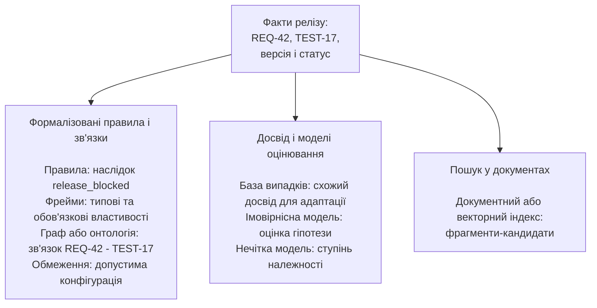
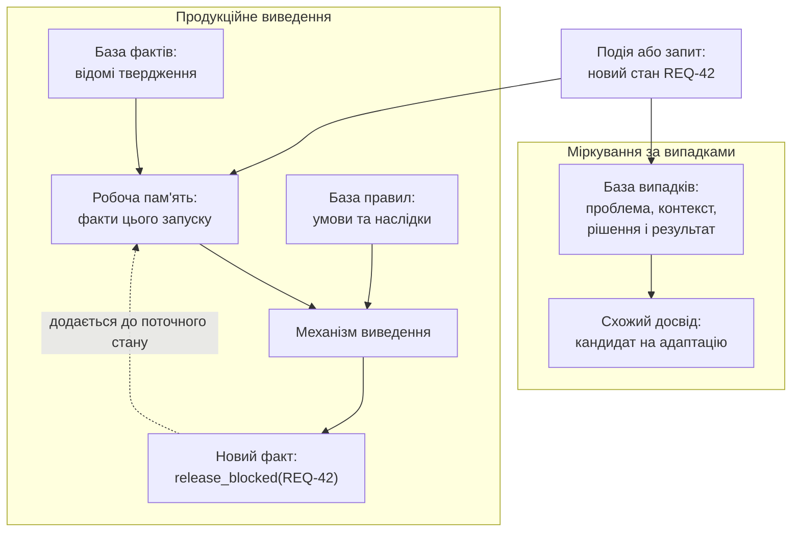
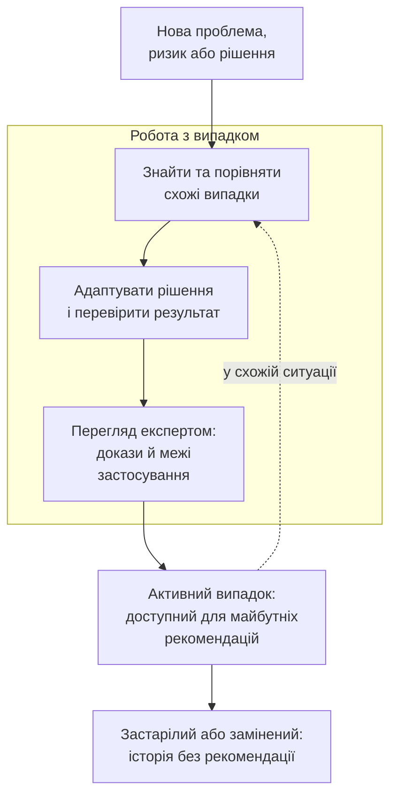
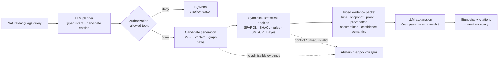
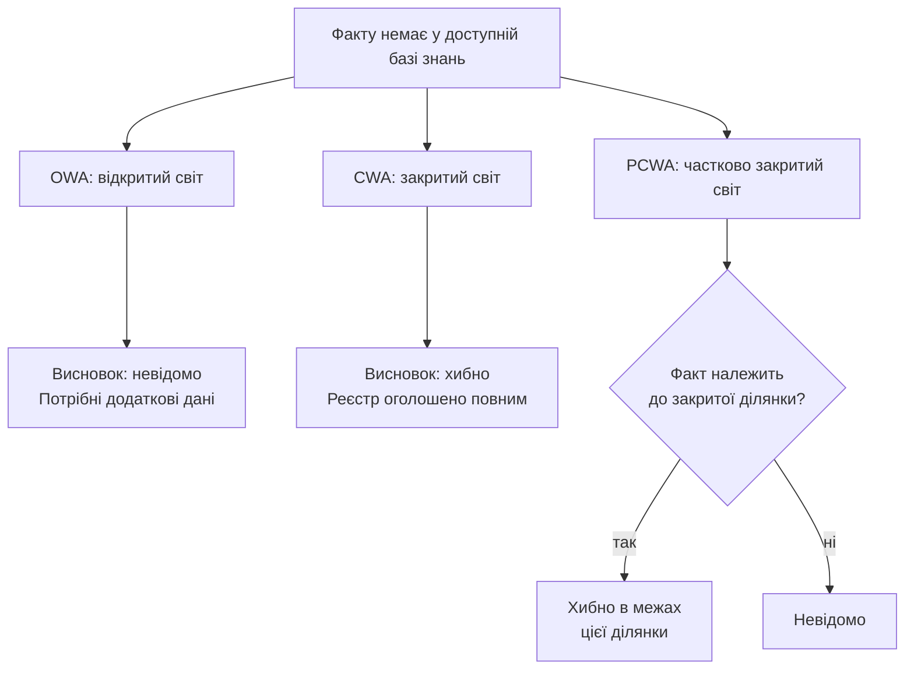
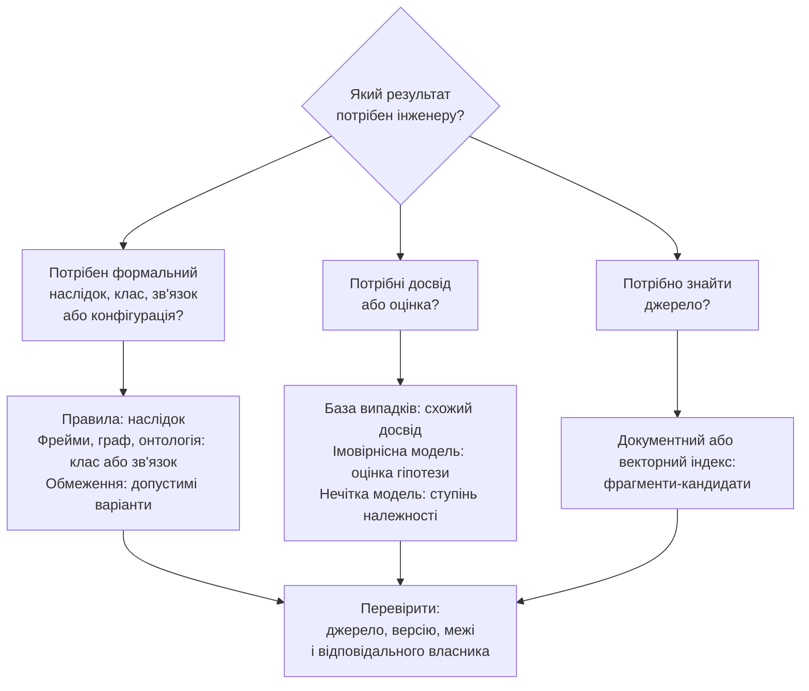

# Типи баз знань для експертних систем: чому правила, фрейми, онтології та випадки дають різні висновки

> **Серія:** [Експертні системи для R&D](README.md) · стаття 11 із 21  
> **Попередня стаття:** [10 — Здобуття знань для експертної системи: як збирати інженерні знання без хаосу і витоку даних](10-Knowledge-Acquisition-System-UA.md)  
> **Наступна стаття:** [12 — Як навчати експертну систему: знання, іспит і перевірка змін](12-How-Expert-Systems-Learn-UA.md)  
> **Зміст серії:** [README](README.md)  
> **Рівень:** ML / Knowledge Engineer: middle+  
> **Після статті:** зіставити representation, inference mechanism і семантику світу з типом потрібного висновку.  
> **Подача матеріалу:** відомі англіцизми, формальні припущення, механізми виведення та їхні межі.

В експертній системі (ЕС) універсальної «бази знань» не існує. Правила,
фрейми, онтології, попередні випадки, обмеження та ймовірнісні моделі
представляють знання по-різному. Тому компоненти ЕС дають не просто різні
формати зберігання, а різні результати: наслідок правила, успадковану
властивість, класифікацію чи зв'язок, схожий випадок, допустиму конфігурацію
або оцінку правдоподібності. Головне питання статті таке: **який тип бази
знань або рушій виведення, тобто компонент ЕС для отримання результату з
фактів і правил, потрібен для конкретного інженерного питання і чого його
результат ще не доводить?**

Назва статті говорить про бази знань, але практична архітектура ЕС ширша за
суто сховища. Тому тут розглянуто також рушії виведення, розв'язувачі
обмежень, імовірнісні та нечіткі моделі, документні й векторні індекси. Вони
або отримують результат з формалізованих знань, або знаходять матеріал для
подальшої перевірки.

Коли команда каже «нам потрібна база знань для штучного інтелекту (ШІ)», під цією назвою часто мають на увазі сховище документів, корпоративну вікі або векторний індекс. Документні сховища та пошукові індекси добре знаходять інформацію, але пошук ще не є виведенням. Близький за змістом фрагмент не доводить істинність твердження, схожий випадок не є готовим рішенням, а відсутність запису не завжди означає, що факт хибний.

В архітектурі інженерної експертної системи треба розділити щонайменше три речі: **як записано знання**, **який рушій його обробляє** і **що саме повертає рушій**. Продукційний рушій повідомляє, яке правило спрацювало. Онтологічний рушій визначає клас або знаходить суперечність. Модуль міркування за випадками (*Case-Based Reasoning*, CBR) повертає схожий досвід. Розв'язувач обмежень знаходить допустиму конфігурацію. Векторний індекс лише добирає схожі фрагменти. Якщо інтерфейс експертної системи назве правило, класифікацію, схожий випадок, допустиму конфігурацію й пошуковий фрагмент однаково «відповіддю ШІ», користувач не зможе відрізнити пошукового кандидата від виведеного твердження або доведеного факту.

У цій статті я розбираю не бренди сховищ, а інженерні властивості правил, фреймів, семантичних графів, баз випадків, обмежень, імовірнісних моделей і пошукових індексів: що вони зберігають, як отримують висновок або кандидата, чого цей висновок чи кандидат не доводить і де кожен механізм доречний у дослідженнях і розробці (*Research and Development*, R&D). Практична мета проста: не видати пошуковий фрагмент за доведений висновок і не вимагати від одного сховища того, для чого воно не призначене.

Далі стаття спочатку відокремлює базу знань від сховища документів і показує
спільний сценарій релізної перевірки. Потім вона порівнює правила, фрейми,
семантичні графи, бази випадків, обмеження, байєсівські та нечіткі моделі, а
також документні й векторні індекси. Для кожного з них показано, які дані він
зберігає, що саме повертає і чого цей вихід не підтверджує.

Для middle-рівня корисніше почати не з назв представлень, а з типових production-відмов:

| Проблема | Спостережуваний збій | Технічна причина | Шлях виправлення |
|---|---|---|---|
| Representation–inference mismatch | система повертає схожий абзац замість відповіді «чи порушено правило» | vector retrieval підміняє rule/constraint evaluation | типізований контракт виходу: `retrieved`, `inferred`, `validated`, `estimated` |
| Semantic mismatch | відсутній test edge трактується як «тесту немає» | CWA застосовано до OWL-графа з OWA | оголосити closure scope; перевіряти повноту SHACL або реєстровим правилом |
| Version skew | правило перевіряє факти з іншого baseline | rule set, graph projection та index оновлюються неатомарно | knowledge release manifest і snapshot-consistent query |
| LLM-generated graph corruption | у графі з'являється переконлива, але хибна relation | extraction без schema, evidence span і review | constrained extraction → schema/SHACL → source entailment check → quarantine |
| Derived-fact leakage | користувач не бачить секретного source, але бачить висновок із нього | ACL застосовано лише до сирих triples/chunks | label propagation на derived facts, explanations і caches |
| Inference explosion | reasoner або rule engine не вкладається у latency/SLO | надмірна expressivity, цикли правил, повна materialization | обрати OWL profile/Datalog fragment, incremental reasoning або query-time proof |

Ця таблиця задає структуру наступних розділів: **для кожного representation треба назвати семантику, алгоритм, доказовий статус виходу та безпечну реакцію на невизначеність**.

## Чим база знань відрізняється від бази даних

База даних відповідає на питання «що збережено?» і повертає записи, які відповідають запиту. База знань додає семантику предметної області, а в системах, де це потрібно, ще й механізм отримання нових висновків із наявних фактів. Не кожна база знань має власний рушій виведення: наприклад, онтологія може визначати спільну мову й типи, а пошук або правила працюватимуть в іншому компоненті.

Наприклад, реляційна база може зберігати вимоги, тести, дефекти й ризики. Запит мовою структурованих запитів (*Structured Query Language*, SQL) знайде вимоги без тестів, якщо програміст явно задасть умову. Продукційна база знань може містити доменне правило «критичну вимогу не можна закривати без доказу верифікації» і застосовувати його до нових фактів. Відмінність полягає не у форматі файла чи назві сервера, а в тому, де зберігається значення правила і хто виконує виведення.

Практична база знань має щонайменше чотири складові:

- **представлення знання**: факти, правила, фрейми, графи, випадки, обмеження або розподіли ймовірностей;
- **механізм виведення**: який рушій отримує нові твердження, оцінки або допустимі варіанти і за якою процедурою;
- **контекст чинності**: для якого продукту, стандарту, версії, замовника або часового проміжку діє знання;
- **походження і власник**: звідки взялося твердження, хто його затвердив і хто має право змінити або відкликати його.

Коротка аналогія: документ є сторінкою з текстом, база даних є картотекою, а база знань поєднує картотеку зі значенням термінів і правилами роботи з ними. Проте аналогія має межу: не кожна база знань містить правила «якщо - то». Онтологія класифікує сутності, база випадків шукає подібний досвід, а ймовірнісна модель оновлює оцінку впевненості.

### Коли набір файлів стає базою знань

Папка з кількома файлами вимог ще не є базою знань лише тому, що в ній зберігається корисна інформація. Наприклад, три документи можуть містити вимоги `REQ-42`, `REQ-43` і `REQ-44`, але читач не знатиме без ручного аналізу, яка версія кожної вимоги чинна, який тест її перевіряє, чи належать вимоги до одного виробу та які з них критичні для безпеки.

Набір файлів стає базою знань, коли організація явно визначає щонайменше:

- **одиниці знання**: вимога, компонент, тест, дефект, правило, випадок або звіт;
- **значення полів і термінів**: наприклад, чим `approved` відрізняється від `obsolete`, а `verifies` - від простого посилання в тексті;
- **ідентифікатори, версії та межі чинності**: який запис є `REQ-42` версії `1.2`, для якого виробу й часу він діє;
- **зв'язки між одиницями**: вимога `REQ-42` перевіряється тестом `TEST-17`, тест породив звіт, а правило використовує статус цього звіту;
- **спосіб обробки**: пошук, запит до графа, перевірка обмеження, застосування правила або зіставлення випадків.

Файли можуть лишатися канонічним місцем зберігання. Базою знань їх робить не один сервер і не формат YAML, а узгоджена модель понять, зв'язків, чинності та операцій над ними. Якщо в папці є лише тексти без таких домовленостей, це джерело матеріалів для майбутньої бази знань, а не база знань у строгому сенсі.

### Чи є Wiki або Confluence корпоративною базою знань

Таке означення коректне в **організаційному сенсі**. Корпоративна Wiki або Confluence стає базою знань, коли команда систематично зберігає в ній інструкції, рішення, поняття предметної області, правила роботи, досвід інцидентів і посилання на першоджерела. Працівник може знайти відповідь на робоче питання, зрозуміти її походження, перевірити чинність сторінки та побачити власника. Для управління знанням у компанії цього часто достатньо.

Проте сама наявність Wiki не робить її базою знань у строгому інженерному сенсі. Якщо сторінки не мають власників, статусів, дат перегляду, стабільних посилань, узгоджених термінів і правил оновлення, Wiki є радше архівом документів. Пошук у ній знайде згадки, але не відповість на питання «яке правило чинне для версії `3.2`?» або «який тест перевіряє цю вимогу?» без ручного тлумачення текстів.

Wiki може бути документно-орієнтованою частиною розподіленої бази знань. Для цього достатньо мінімальної дисципліни: затвердженого словника термінів, шаблонів сторінок, ідентифікаторів, версій або статусів, власників, дат перегляду та посилань на вимоги, код, тести й рішення. У такому разі Wiki добре зберігає пояснення та контекст. Але вона не замінює граф простежуваності, рушій правил або реєстр вимог, якщо потрібні автоматичні перевірки, формальні запити чи відтворюване виведення.

#### Confluence як джерело для RAG

Confluence можна використати як джерело для генерації з доповненим пошуком (*Retrieval-Augmented Generation*, RAG). У такому підході застосунок розбиває сторінки на фрагменти, індексує їхній текст і метадані, добирає релевантні фрагменти до запиту, а мовна модель формує відповідь на їхній основі. Confluence лишається канонічним сховищем сторінок, а RAG є шаром пошуку та пояснення над ним.

Порівняно з повнотекстовим пошуком RAG покращує насамперед роботу з природною мовою:

| Потреба користувача | Повнотекстовий пошук | RAG над Confluence |
|---|---|---|
| Запит іншими словами | Шукає точні слова, їхні форми або заздалегідь задані синоніми | Може знайти фрагмент за близьким змістом |
| Відповідь з кількох сторінок | Повертає перелік сторінок або збігів | Поєднує знайдені фрагменти у стислу відповідь із посиланнями на них |
| Пояснення терміна у контексті | Потребує самостійно відкрити кілька сторінок | Може пояснити термін із урахуванням контексту проєкту |
| Уточнення діалогу | Кожен новий запит формулюють окремо | Може врахувати попереднє запитання і попросити уточнення |

Наприклад, за запитом «чому для `REQ-42` потрібна незалежна верифікація?» повнотекстовий пошук знайде сторінки зі словами `REQ-42`, «незалежна» або «верифікація». RAG може дібрати фрагмент вимоги, сторінку з політикою безпеки та опис тесту `TEST-17`, а потім пояснити зв'язок між ними. Якість такої відповіді залежить від знайдених фрагментів, їхньої чинності й інструкцій моделі.

RAG не усуває головних обмежень Wiki. Він не доводить, що знайдений текст чинний, не встановлює формальний зв'язок `REQ-42 -> TEST-17`, не перевіряє виконання правила і не має показувати користувачеві сторінки, до яких той не має доступу. Тому RAG-відповідь повинна містити посилання на конкретні сторінки, їхні версії або статуси та бути позначена як пояснення на основі знайдених джерел. Відповідь «у Confluence написано» не дорівнює «вимогу верифіковано».

### Як користувач ставить запити до бази знань

Користувач не взаємодіє з базою знань одним універсальним запитом. Формулювання запиту залежить від того, який результат йому потрібен: запис, зв'язок, наслідок правила, допустима конфігурація, оцінка або схожий досвід. Одна й та сама тема `REQ-42` дає різні коректні запити:

| Запит користувача | Представлення знань або рушій | Коректний результат |
|---|---|---|
| «Яка чинна версія `REQ-42`?» | Реєстр вимог або база даних | Запис вимоги та її версія |
| «Який тест перевіряє `REQ-42`?» | Семантичний граф | Зв'язок `REQ-42 -> TEST-17` і шлях трасування |
| «Чи порушено правило для вимоги ASIL-D без незалежного тесту?» | Продукційні правила | Спрацьоване правило та виведений наслідок |
| «Які конфігурації тесту відповідають умові незалежності?» | База обмежень | Набір допустимих конфігурацій |
| «Чи траплявся подібний дефект?» | База випадків | Схожий випадок і умови, за яких його рішення спрацювало |
| «Наскільки правдоподібна гіпотеза про відмову watchdog?» | Байєсівська модель | Умовна ймовірність за заданою моделлю та спостереженнями |
| «Де у звітах згадано `REQ-42`?» | Документний або векторний індекс | Фрагменти-кандидати з джерелом і статусом |

### Формальні та неформальні запити

**Формальний запит** має визначену мову, схему даних і семантику виконання. Він прямо називає сутності, зв'язки, умови та очікувану форму відповіді. Наприклад, запит мовою SPARQL до графа може означати: «поверни всі тести, що мають зв'язок `verifies` з `REQ-42`».

```sparql
PREFIX ex: <https://example.org/rd/>

SELECT ?test ?result ?report
WHERE {
  ?test ex:verifies ex:REQ-42 ;
        ex:result ?result ;
        ex:hasReport ?report .
}
```

У цьому запиті `?test`, `?result` і `?report` є змінними, а `ex:verifies`, `ex:result` і `ex:hasReport` є властивостями, визначеними словником графа. Результат міститиме лише ті трійки, які доступні запиту та відповідають усім трьом умовам. За незмінних даних, версії графа та прав доступу такий запит має відтворюваний результат. Аналогічно працюють SQL-запит до реєстру, перевірка правила, запит до розв'язувача обмежень або обчислення в байєсівській моделі. Формальна мова не робить відповідь автоматично правильною: вона лише фіксує, **що саме** система перевіряла і за якою процедурою.

**Неформальний запит** користувач формулює природною мовою: «Чим підтверджено `REQ-42`?» або «Покажи проблеми з незалежною верифікацією». Мовна модель (*Language Model*, LM) може розпізнати намір, уточнити неоднозначність, знайти потрібні джерела та перетворити фразу на один чи кілька формальних запитів. Вона також може стисло пояснити отримані записи. Але сама відповідь моделі не є результатом запиту до бази знань, якщо модель не передала запит рушію та не повернула його перевірений вихід із посиланням на джерела.

Надійна взаємодія через мовну модель має такий порядок:

1. модель визначає намір користувача і за потреби просить уточнити терміни, версію або межі пошуку;
2. служба авторизації звужує доступні користувачеві дані та дозволені операції;
3. модель формує структурований запит або обирає відповідний рушій, а застосунок перевіряє його синтаксис, типи та межі виконання;
4. рушій виконує запит до реєстру, графа, бази правил, обмежень, випадків або пошукового індексу;
5. модель пояснює результат, не змінюючи його семантику: називає тип виходу, джерела, версії, умови та невизначеності.

Наприклад, для питання «Чи верифіковано `REQ-42`?» модель не повинна відповідати «так» лише тому, що знайшла фразу `TEST-17 verifies REQ-42`. Вона має виконати формальну перевірку зв'язку з чинним тестом і затвердженим звітом для потрібної версії `BrakeController`. Якщо замість цього виконується лише пошук, відповідь потрібно позначити як добір фрагментів-кандидатів, а не як підтверджений факт.

Форма взаємодії може бути різною: поле пошуку, таблиця вимог, графічний перегляд трасування, форма перевірки або програмний інтерфейс. Проте інтерфейс повинен назвати тип результату та його межі. Відповідь «знайдено звіт» не означає «вимогу верифіковано», а відповідь «спрацювало правило» не означає «усі правила повні й правильні».

### Вимоги є знанням, а не лише рядками в документі

Стейкхолдерські, системні, програмні, інтерфейсні, безпекові та верифікаційні вимоги є знанням про те, що має робити виріб, за яких умов і як це буде підтверджено. База знань про вимоги повинна зберігати не тільки текст вимоги, а й її рівень, функціональну область, версію, статус, власника, джерело, залежності, пов'язані ризики, тести та докази.

Окрема вимога має власний життєвий цикл. Після зміни змісту з'являється нова версія, а не непомітне редагування вже затвердженого твердження. Із погоджених версій окремих вимог можна зібрати специфікацію вимог для конкретного продукту, компонента або базової версії. Така специфікація є версійним складом вимог із визначеним статусом і простежуваністю, а не просто файлом, у який скопіювали абзаци.

### Код, тести, звіти й робочі завдання утворюють базу знань про проєкт

Джерельний код не є суто декларативним знанням: алгоритм із циклами, умовами та зміною стану описує процедуру виконання. Водночас код є **виконуваною специфікацією** того, як система поводиться в реалізації. Декларативну частину коду утворюють типи, інтерфейси, схеми даних, конфігурації, таблиці станів, правила доступу й константи предметної області.

Тест-кейс також поєднує два види знання: декларативне очікування «за `watchdog_timeout` контролер має перейти в безпечний стан за 100 ms» і процедуру перевірки, яка ін'єктує подію, вимірює час та порівнює результат з очікуванням. Модульні, інтеграційні, системні, регресійні, навантажувальні, безпекові та приймальні тести показують поведінку системи на різних рівнях. Тестовий звіт або артефакт безперервної інтеграції (*Continuous Integration*, CI) є доказовим знанням: він фіксує, що конкретна версія коду пройшла або не пройшла конкретний тест у конкретному середовищі й у визначений час.

Робочі завдання, дефекти, ризики, зміни й архітектурні рішення є знанням про керування роботою. Вони відповідають на інші питання: що треба зробити, чому це потрібно, хто є власником, від чого залежить робота, яке рішення прийнято і що змінилося після виконання. Завдання не доводить, що функціональність реалізовано; для цього потрібні посилання на зміни коду, тести, звіти та затвердження.

| Артефакт | Яке знання містить | Вузол бази знань | Як використовують під час активної роботи | Що лишається після завершення проєкту |
|---|---|---|---|---|
| Вимога й специфікація вимог | Ціль, обмеження, версія, трасування | Репозиторій вимог, контрольований документ або Wiki у GitLab чи GitHub | Планують реалізацію, перевіряють покриття й приймають реліз | Базова версія вимог, історія змін і підстави для супроводу |
| Джерельний код і конфігурація | Виконувана поведінка, інтерфейси, правила й схеми | Git-репозиторій у GitLab або GitHub | Реалізують функції, переглядають зміни, збирають і постачають продукт | Відтворюють версію, аналізують дефекти, підтримують або повторно використовують компонент |
| Тест-кейс | Очікувана поведінка та процедура перевірки | Репозиторій тестів, GitLab/GitHub-репозиторій або система керування тестуванням | Перевіряють зміни, регресію, інтеграцію, безпеку й приймання | Використовують як регресійний набір і пояснення меж поведінки |
| Тестовий звіт, лог і CI-артефакт | Доказ запуску тесту для конкретної версії та середовища | GitLab CI, GitHub Actions або сховище артефактів | Приймають рішення про готовність збірки чи релізу, діагностують відмови | Підтверджують версію релізу, аудит і розбір інцидентів |
| Завдання, дефект, ризик або запис архітектурного рішення (*Architecture Decision Record*, ADR) | План, відповідальність, контекст зміни й прийняте рішення | Jira, GitLab Issues, GitHub Issues, реєстр ризиків або репозиторій ADR | Координують виконання, пріоритети, залежності й зміни | Відновлюють причини рішень, уроки та невиконані зобов'язання |

Разом ці артефакти утворюють **розподілену базу знань про проєкт**. Jira, GitLab і GitHub не є трьома ізольованими сховищами: завдання в Jira або Issues описує потребу й власника, коміт у GitLab чи GitHub реалізує зміну, тест-кейс перевіряє очікувану поведінку, а CI-звіт зберігає доказ результату. Щоб ця сукупність працювала саме як база знань, елементи повинні мати визначені типи, версії, зв'язки, статуси, власників і правила використання.

### Як практично користуватися розподіленою базою знань

Починати з окремого нового сховища не обов'язково. Для простих запитів достатньо дисципліни посилань і стабільних ідентифікаторів: вимога містить посилання на тест, тест - на звіт CI, а завдання - на коміт або pull request. Людина переходить за цими зв'язками вручну, а кожен інструмент лишається канонічним джерелом своїх даних.

Інтеграційна надбудова потрібна, коли команда регулярно ставить **наскрізні запити**, на які жоден окремий інструмент не може відповісти самостійно. Наприклад: «Які критичні вимоги базової версії не мають затвердженого результату тесту?», «Які дефекти пов'язані з кодом, що ввійшов до `R2026.3`?», «Які зміни вимоги не мають оновленого тесту?» або «Чому цю вимогу вважають верифікованою?». Такі запити потребують одночасно даних із реєстру вимог, трекера робіт, Git-репозиторію, системи тестування та CI.

Є три практичні рівні реалізації:

1. **Посилання і домовленості**: стабільні ідентифікатори `REQ-42`, `TEST-17`, ID завдання, хеш коміту та URL звіту. Це найменший корисний рівень, але він не дає автоматичної перевірки повноти.
2. **Пошуковий індекс**: збирає тексти й метадані з кількох джерел, щоб знаходити фрагменти. Він зручний для дослідження, але не має самостійно приймати доказові рішення.
3. **Інтеграційний шар знань**: зчитує дані через API або події, зіставляє ідентифікатори, зберігає лише потрібні типи, зв'язки, версії та походження, а потім виконує графові запити, правила або перевірки обмежень. Саме цей рівень відповідає на наскрізні питання відтворювано.

Такий шар не повинен ставати ще одним місцем ручного редагування вимог, коду чи звітів. Він зберігає посилання або контрольовані копії метаданих, час синхронізації та версію джерела. Якщо GitLab змінив статус pipeline, канонічним фактом лишається запис GitLab; інтеграційний шар лише оновлює його проєкцію для спільного запиту. Власник кожного первинного артефакту і правила авторизації також лишаються у відповідному інструменті.

Практична відповідь для невеликої команди: спочатку узгодити ідентифікатори й типи посилань, потім додати пошук, а окрему інтеграційну надбудову будувати лише для повторюваних наскрізних перевірок, де ручне збирання доказів уже створює ризик помилки або забирає суттєвий час.

Семантичний граф або реєстр трасування зв'язує `REQ-42` з Jira- або Issue-ідентифікатором, комітом, тест-кейсом `TEST-17`, CI-звітом і релізом `R2026.3`. Первинні артефакти лишаються у своїх канонічних вузлах розподіленої бази знань: Git-репозиторії, трекері робіт, системі тестування та CI-сховищі. Граф не дублює їхній повний зміст, а надає спільну семантику та шлях простежуваності між ними.

## Відкриті бази знань, які можна дослідити

База знань не обов'язково належить закритій корпоративній експертній системі. У відкритих проєктах можна переглянути записи, завантажити дані або виконати запит. Наведені нижче проєкти показують різні способи представлення знання.

| Проєкт | Яку структуру знань або модель містить | Що можна побачити на практиці |
|---|---|---|
| [Wikidata](https://www.wikidata.org/wiki/Wikidata:Introduction) | Спільна багатомовна база тверджень і граф знань | Сутності `Q...`, властивості `P...`, значення, уточнення та джерела. Структуровані дані опубліковані за CC0 |
| [ConceptNet](https://conceptnet.io/) | Відкрита багатомовна семантична мережа | Зв'язки `IsA`, `PartOf`, `UsedFor`, `CapableOf` між поняттями, ваги та походження тверджень. Доступний програмний інтерфейс (*Application Programming Interface*, API) JSON-LD (*JavaScript Object Notation for Linked Data*) |
| [Gene Ontology](https://geneontology.org/docs/ontology-documentation/) | Формальна предметна онтологія | Класи біологічних процесів, функцій і клітинних компонентів, відношення `is_a`, `part_of` та стабільні ідентифікатори `GO:...` |
| [OpenFisca](https://openfisca.org/en/) | Відкриті виконувані моделі законодавчих правил | Формули податків і соціальних виплат, параметри за датами, тести та пакети правил для окремих країн |
| [Bayesian Network Repository](https://www.bnlearn.com/bnrepository/) | Колекція готових імовірнісних баз знань | Мережі ASIA, ALARM, CHILD та інші у форматах BIF, DSC і NET із вузлами, залежностями та таблицями умовних імовірностей |
| [AI Incident Database](https://incidentdatabase.ai/) | Відкритий корпус випадків | Реальні інциденти й майже-інциденти, звіти, сутності та класифікації. AI Incident Database не є готовим CBR-рушієм, але надає базу досвіду для пошуку й порівняння випадків |

Окремий запис у кожній із цих баз виглядає по-своєму. Наприклад, вступ до Wikidata показує твердження `Q42 -- P69 --> Q691283`: Дуглас Адамс навчався у St John's College. ConceptNet повертає зв'язок `example -- UsedFor --> explain something` разом із вагою, джерелом і ліцензією. У Gene Ontology термін `GO:0019319` має двох батьків, бо «біосинтез гексози» одночасно є метаболічним процесом гексози та біосинтезом моносахариду. Записи Wikidata, ConceptNet і Gene Ontology є не сторінками тексту, а машинно оброблюваними твердженнями з визначеною семантикою.

Добірка відкритих проєктів навмисно неоднорідна. Wikidata зберігає твердження з джерелами, Gene Ontology визначає формальні класи, OpenFisca виконує правила, а мережі з bnlearn обчислюють імовірності. Назва «база знань» не гарантує одного формату або одного способу отримання відповіді.

Публічних баз випадків і промислових фреймових баз значно менше, бо такі бази часто містять внутрішній досвід, винятки та контекст організації. Тому нижче використано один вигаданий наскрізний сценарій: критичну вимогу `REQ-42` для контролера гальм, незалежний тест `TEST-17` і контрольну точку релізу. Усі ідентифікатори, значення та події в цьому сценарії навчальні. Той самий набір фактів буде записаний у кількох формах.

Відкриті приклади показують властивості окремих підходів, але не відповідають
на інженерне питання про конкретне рішення. Для цього далі потрібен спільний
сценарій, у якому можна порівняти не назви технологій, а вихід кожного рушія та
межу його доказової сили.

## Наскрізний приклад: як бази знань перевіряють випуск BrakeController 3.2

Уявімо, що проєктна команда готує реліз `R2026.3` контролера `BrakeController` версії `3.2` для системи електронного керування гальмами. Перед релізом команда має підтвердити, що кожна критична вимога має реалізацію, визначений метод верифікації та затверджений доказ її виконання. У цьому навчальному прикладі релізна перевірка починається з вигаданої системної вимоги `REQ-42`: вона описує поведінку контролера, коли внутрішній watchdog перестає отримувати очікуваний сигнал. Вимогу класифіковано за рівнем `ASIL-D`, найвищим рівнем цілісності безпеки автомобільної системи (*Automotive Safety Integrity Level*, ASIL); одна з пов'язаних вимог описує передавання статусу відмови через автомобільну мережу CAN (*Controller Area Network*).

Вигадану вимогу `REQ-42` задано нижче у форматі YAML (*YAML Ain't Markup Language*):

```yaml
requirement_id: REQ-42
requirement_version: "1.2"
requirement_level: system
functional_area: safety
title: "Перехід BrakeController у безпечний стан за відмови watchdog"
component: BrakeController
component_version: "3.2"
safety_integrity_level: ASIL-D
trigger: "watchdog_timeout"
required_behavior: "перейти в безпечний стан не пізніше ніж за 100 ms"
verification_method: "незалежний стендовий тест"
verification_test: TEST-17
release_condition: "потрібен затверджений результат independent verification"
```

У цьому вигаданому прикладі `REQ-42` версії `1.2` входить до специфікації системних вимог `BrakeController-SyRS` версії `3.2`. Специфікація містить не одну вимогу, а погоджений набір вимог для релізу:

```yaml
specification_id: BrakeController-SyRS
specification_version: "3.2"
applies_to: BrakeController
release: R2026.3
requirements:
  - id: REQ-42
    version: "1.2"
    role: "безпека: перехід у безпечний стан за watchdog_timeout"
  - id: REQ-43
    version: "2.0"
    role: "інтерфейс: передавання статусу відмови на CAN"
status: approved
```

Цей YAML-блок не є базою знань. Це структурований запис вимоги, з якого різні бази знань беруть факти. Для такої вимоги найдоречніша основа - **семантичний граф або онтологія**, бо вони явно зберігають зв'язки `REQ-42 -> BrakeController`, `REQ-42 -> TEST-17` і `TEST-17 -> звіт верифікації`. Самого графа недостатньо для релізного рішення, тому система доповнює його іншими представленнями:

| Потреба навколо `REQ-42` | База знань або індекс | Що зберігає |
|---|---|---|
| Простежити, який тест перевіряє яку вимогу | Семантичний граф або онтологія | Вимогу, компонент, тест, звіт і зв'язки між ними |
| Задати обов'язкові поля критичної вимоги | Фреймова база | Рівень ASIL, метод верифікації, доказ, стан релізу |
| Заблокувати реліз без незалежного тесту | Продукційна база правил | Факти про статус тесту та правило релізної політики |
| Знайти звіт `TEST-17` у документації | Документний або векторний індекс | Фрагменти звіту, метадані та вектори |

Отже, `REQ-42` не потребує одного «правильного» типу бази знань. Семантичний граф є канонічним місцем для її зв'язків, а фрейми, правила й пошуковий індекс виконують різні додаткові функції.

Політика релізу вимагає незалежного підтвердження кожної вимоги ASIL-D. Тест `TEST-17` відтворює `watchdog_timeout` і перевіряє перехід у безпечний стан не пізніше ніж за 100 ms.

Стаття розглядає дві контрольні точки одного релізу:

- **Перед `TEST-17`**: для `REQ-42` є вимога, рівень ASIL-D і план тестування, але немає затвердженого результату незалежної верифікації. Релізна перевірка повинна заблокувати `R2026.3`.
- **Після `TEST-17`**: звіт `TEST-17` має статус `approved`, результат `passed` і посилання на `REQ-42`. Це підтверджує виконання саме цієї перевірки, але не доводить готовність усього релізу: інші вимоги, дефекти й затвердження перевіряють окремо.

У наступних розділах продукційне правило на першій контрольній точці виведе `release_blocked(REQ-42)` через відсутність незалежної верифікації; фрейм покаже обов'язкові та типові властивості контролера; граф зв'яже вимогу, компонент і тест; база випадків нагадає про попередній схожий інцидент; розв'язувач обмежень відбере `CONFIG-TEST-17-B` як допустиму конфігурацію `TEST-17` для незалежної верифікації; байєсівська модель оцінить гіпотезу, що відмова watchdog спричиняє небезпечний стан; нечітка модель обчислить ступінь належності до поняття високого ризику релізу; індекс поверне фрагменти-кандидати зі звіту. Жоден із цих механізмів не замінює решту.



## Порівняння правил, фреймів, графів, випадків, обмежень і пошуку

Онтологія, продукційні правила, база випадків і векторний пошук не виключають одне одного. Одна експертна система може використовувати їх разом. Розрізняти їх потрібно тому, що онтологічний рушій повертає класифікацію або суперечність, рушій правил - наслідок правила, CBR-модуль - схожий випадок, а пошук - кандидата. Помилка в кожному з цих результатів має інший характер.

| Структура знань або індекс | Що зберігає | Що повертає рушій або індекс | Чого цей вихід не доводить |
|---|---|---|---|
| Продукційні правила | Факти та правила «якщо - то» | Наслідок і ланцюг спрацьованих правил | Що правила повні й актуальні |
| Фрейми | Типові об'єкти, слоти, значення за замовчуванням і винятки | Успадковані або заповнені властивості | Що значення підтверджене для конкретного об'єкта |
| Онтологія і семантичний граф | Класи, відношення, аксіоми та обмеження | Клас, новий зв'язок або суперечність | Що відсутній факт є хибним |
| База випадків | Попередні проблеми, контекст, рішення та наслідки | Схожий випадок і кандидат на адаптацію | Що старе рішення придатне без перевірки |
| Обмеження | Змінні, домени та дозволені комбінації | Один або кілька допустимих розв'язків | Що знайдений варіант оптимальний або бажаний |
| Імовірнісна модель | Залежності, спостереження та ймовірності | Оновлена ймовірність гіпотези | Що гіпотеза доведена |
| Нечітка модель | Функції належності та нечіткі правила | Ступінь належності або керівна оцінка | Статистичну ймовірність події |
| Документний або векторний індекс | Тексти, фрагменти, метадані та вектори | Кандидати за словами або схожістю | Чинність, істинність чи право використання |

Ключова межа проходить між **пошуком збереженого матеріалу** і **виведенням наслідку, класифікації, конфігурації або оцінки**. Векторний індекс знаходить кандидатів. Продукційний рушій, онтологічний рушій, розв'язувач обмежень або рушій імовірнісного виведення працюють уже з формалізованим значенням. Інтерфейс доказової експертної системи повинен позначати, який саме рушій дав кожну частину відповіді.

## База правил, база фактів і робоча пам'ять

У класичній продукційній експертній системі база знань часто поділена на **базу правил** і **базу фактів**. База правил і база фактів не є альтернативами онтології чи базі випадків, а компонентами однієї продукційної архітектури.

- **База правил** містить відносно сталі доменні залежності: умови, наслідки, пріоритети та межі чинності правил.
- **База фактів** містить твердження про конкретні об'єкти й ситуації: клас вимоги, результат тесту, стан компонента або чинну версію.
- **Робоча пам'ять** містить факти поточного сеансу виведення. У простій продукційній експертній системі робочу пам'ять також називають базою фактів. У розподіленій продукційній архітектурі постійне сховище фактів і тимчасову робочу пам'ять варто розрізняти.
- **Механізм виведення** зіставляє факти з умовами правил, обирає правило для виконання і додає отримані висновки до робочої пам'яті.



На першій контрольній точці, до запуску `TEST-17`, поділ виглядає так:

```text
постійна база правил:
  R-17: якщо asil(X, D) і verification_status(X, missing),
        то release_blocked(X)

постійна база фактів:
  requirement(REQ-42)
  asil(REQ-42, D)

робоча пам'ять цього запуску:
  verification_status(REQ-42, missing)

після спрацювання R-17:
  release_blocked(REQ-42)
```

Правило `R-17` можна застосувати до багатьох вимог. Факти про `REQ-42` описують конкретний об'єкт, а запис `verification_status(REQ-42, missing)` означає саме стан до `TEST-17`; після затвердження звіту він має змінитися. Виведений факт `release_blocked(REQ-42)` теж потребує контексту: версії бази правил, часу запуску та набору вхідних фактів.

Термін «база фактів» не обмежується продукційними системами. Факти можуть зберігатися у сховищі RDF (*Resource Description Framework*), графі знань, логічній базі, цифровому двійнику або реляційній базі з доменною семантикою. Поділ на правила і робочу пам'ять найвиразніше видно саме у продукційній архітектурі.

### Чому база фактів і база випадків не одне й те саме

База фактів зберігає окремі твердження про поточний або відомий стан. База випадків зберігає цілісний епізод: проблему, контекст, рішення, результат і межі перенесення досвіду.

| Ознака | База фактів | База випадків |
|---|---|---|
| Одиниця знання | Окреме твердження | Завершена або достатньо цілісна ситуація |
| Приклад | `asil(REQ-42, D)` | `CASE-0081`: попередній реліз із вимогою ASIL-D без незалежного тесту |
| Типове використання | Перевірка умов правил і логічні запити | Пошук схожого досвіду та адаптація рішення |
| Зміна в часі | Факт може швидко оновитися або втратити чинність | Випадок зберігається як історичний досвід |
| Результат роботи | Новий факт або логічний висновок | Схожий випадок і кандидат на рішення |

Один випадок містить багато фактів, але набір фактів ще не є випадком:

```yaml
case_id: CASE-0081
release: R2026.2
facts:
  asil: D
  verification_status: missing
  component: BrakeController
problem: "вимога ASIL-D не мала незалежного тесту перед релізом"
solution: "додати TEST-17 і повторити контрольну точку"
outcome: "дефект знайдено до інтеграції"
```

Поля `asil`, `verification_status` і `component` можна окремо додати до бази фактів. Запис стає випадком завдяки проблемі, застосованому рішенню та відомому результату. Саме ці частини дозволяють не просто встановити стан, а порівняти нову ситуацію з попереднім досвідом.

## Продукційна база знань: правила «якщо - то»

Продукційна база знань зберігає факти та правила у формі «якщо умова істинна, тоді додай висновок або виконай дію». Рушій правил зіставляє умови з фактами, активує придатні правила і записує нові факти або рішення.

Правило `R-17` із попереднього розділу разом із фактами про `REQ-42` утворює мінімальний приклад продукційної бази знань. Результатом є не просто слово «заблоковано», а трасований ланцюг: `REQ-42`, її рівень ASIL-D, статус верифікації, правило `R-17` і виведений факт `release_blocked(REQ-42)`. Аудитор може перевірити кожну ланку такого ланцюга.

**Пряме виведення** рухається від фактів до наслідків. Новий дефект може активувати правило, яке підвищить ризик і заблокує реліз. **Зворотне виведення** починається з цілі. Щоб довести готовність релізу, продукційний рушій визначає, які вимоги, тести, винятки та затвердження потрібно підтвердити.

Формально правило можна подати як $r: b_1\land\dots\land b_m\rightarrow h$. Для множини фактів $F_t$ один крок прямого виведення додає всі наслідки правил, чиї умови виконуються після підстановки $\theta$:

$$
F_{t+1}=F_t\cup
\left\{h\theta\;\middle|\;
r\in R,\ \{b_1\theta,\ldots,b_m\theta\}\subseteq F_t
\right\}.
$$

Обчислення завершується у найменшій фіксованій точці $F^*$, коли $F_{t+1}=F_t$. Для скінченного Datalog-подібного фрагмента без породження нових функціональних термів це дає контрольовану процедуру. Але формула описує **монотонне** виведення: додавання факту не забирає старого наслідку. Винятки, `not`, пріоритети й відкликання роблять семантику немонотонною; тоді потрібні явно обрані semantics — stratified negation, defeasible rules або answer-set/stable-model semantics — і regression tests на конфлікти. «Порядок правил у файлі» не повинен непомітно ставати доменною політикою.

Для кожного виведеного факту корисно зберігати proof object: `rule_id`, grounding $\theta$, вхідні fact IDs, rule-set version і snapshot time. Тоді explanation є не текстом, згенерованим LLM після події, а серіалізованим шляхом реального виведення.

Основний ризик продукційної бази знань полягає не в роботі рушія, а в неповноті й конфліктах правил. Якщо винятки накопичуються без пріоритетів, область чинності не задана, а старі правила не відкликаються, продукційний рушій може послідовно виконати неправильну політику. Тому кожне правило потребує власника, версії, пріоритету, умов чинності та тестових прикладів.

Продукційні правила доречні у формалізованих ділянках: контрольних точках, політиках доступу, діагностиці, перевірках відповідності та регульованих процедурах. Виведений наслідок правила доводить лише те, що цей наслідок випливає з наявного набору фактів і правил. Він не доводить, що база правил повна.

## Фреймова база знань: об'єкти з ролями і типовими значеннями

Фреймова база знань описує типові об'єкти через фрейми, тобто структури зі слотами. Слот є властивістю або роллю: компонент має власника, інтерфейс, клас безпеки, постачальника, версію, ризики й докази. Фрейм також може задавати типове значення та правило його успадкування.

Наприклад, фрейм «електронний блок керування» може визначати слоти для апаратної платформи, програмної версії, інтерфейсів, живлення, температурного діапазону та діагностичних станів. Конкретний блок успадковує структуру фрейму і заповнює слоти власними значеннями.

```yaml
frame: SafetyCriticalComponent
slots:
  asil: { required: true }
  verification_method: { default: independent }
  verification_evidence: { required: true }
  release_state: { default: blocked }

instance: BrakeController
is_a: SafetyCriticalComponent
slots:
  asil: D
  verification_method: independent
  verification_evidence: TEST-17
```

Екземпляр `BrakeController` успадковує спосіб незалежної верифікації та стан `release_state: blocked`, а слот `verification_evidence` містить посилання на `TEST-17`. Фрейм показує, чого бракує для розблокування релізу, але ще не перевіряє, чи `TEST-17` справді пройшов, чи звіт затверджено і чи цей тест охоплює поведінку watchdog із `REQ-42`.

Фреймовий рушій виводить властивості через успадкування, значення за замовчуванням і винятки. Якщо критичний компонент за замовчуванням потребує незалежної верифікації, конкретний компонент успадкує цю властивість, доки явний затверджений виняток не замінить її.

Найпростіша operational semantics для слота $s$ екземпляра $x$:

$$
v(x,s)=
\begin{cases}
v_{\text{explicit}}(x,s), & \text{якщо значення задано для }x,\\
v(\operatorname{parent}(x),s), & \text{якщо дозволено успадкування},\\
\bot, & \text{інакше: значення невідоме}.
\end{cases}
$$

Разом зі значенням треба повертати його mode: `asserted`, `inherited`, `defaulted` або `unknown`. Інакше UI покаже типове `release_state: blocked` так само, як виміряний стан конкретного релізу, і provenance загубиться саме там, де він потрібен для рішення.

Успадковане значення є очікуванням, а не обов'язково підтвердженим фактом про конкретний об'єкт. Різниця між типовим та підтвердженим значенням є головною межею фреймового виведення. Фрейми добре описують компоненти, конфігурації та ролі, але для довгих доказових ланцюгів архітектори зазвичай поєднують фрейми з правилами або семантичним графом.

## Семантичні мережі й онтології: коли важливі типи і зв'язки

Семантична мережа представляє знання як сутності та зв'язки: вимога перевіряється тестом, дефект впливає на компонент, а компонент належить до підсистеми. Онтологія додає формальні класи, властивості, аксіоми й обмеження значень.

Для інженерної експертної системи семантичний граф є природною формою, бо R&D живе у зв'язках: вимога, проєктне рішення, код, тест, дефект, ризик і доказ утворюють ланцюг простежуваності. Без явних типів і зв'язків пошуковий індекс повертає окремі документи, але не визначає їхню роль у ланцюгу простежуваності.

Онтологічний рушій класифікує сутності, виводить нові відношення і перевіряє несуперечність. Якщо в онтології задано, що кожна вимога класу «критична для безпеки» має бути пов'язана хоча б з одним тестом, а `REQ-42` належить до цього класу, рушій може вивести саме таке зобов'язання або існування абстрактного пов'язаного тесту. Він не доводить, що конкретний тест створено, виконано чи зберігається в доступному графі. Відкритий світ не дозволяє з відсутності запису автоматично зробити висновок, що тесту немає. Для перевірки повноти потрібне окреме правило, форма-обмеження або закрита ділянка знань. Якщо компонент одночасно належить до двох несумісних класів, рушій виявить суперечність.

У нотації description logic дві різні аксіоми виглядають так:

$$
\textsf{SafetyRequirement}\sqsubseteq\textsf{Requirement},
$$

$$
\textsf{SafetyRequirement}
\sqsubseteq
\exists\,\textsf{verifiedBy}.\textsf{VerificationTest}.
$$

Перша дає класифікацію. Друга в OWL-семантиці стверджує існування принаймні якогось verification test для кожної `SafetyRequirement`; ontology лишається задовільною, бо її модель може містити неіменований witness. Відсутність іменованої трійки `REQ-42 verifiedBy TEST-17` не є validation error сама по собі. Якщо production gate вимагає **наявного у цьому data graph** зв'язку, це окрема SHACL-умова:

```turtle
@prefix ex: <https://example.org/rd/> .
@prefix sh: <http://www.w3.org/ns/shacl#> .

ex:SafetyRequirementShape
  a sh:NodeShape ;
  sh:targetClass ex:SafetyRequirement ;
  sh:property [
    sh:path ex:verifiedBy ;
    sh:minCount 1 ;
    sh:class ex:VerificationTest
  ] .
```

Тому OWL reasoner відповідає за entailment/consistency, SHACL validator — за conformance конкретного graph snapshot, а SPARQL — за query. Треба також явно зафіксувати, чи SHACL бачить лише asserted graph, чи materialized entailments: інакше той самий shape дасть різні результати в різних runtime. Змішування цих трьох операцій породжує хибні «доведення повноти».

На другій контрольній точці, коли `TEST-17` уже пройдено й звіт затверджено, той самий сценарій можна записати як набір трійок «суб'єкт, предикат, об'єкт»:

```turtle
@prefix ex: <https://example.org/rd/> .
@prefix rdfs: <http://www.w3.org/2000/01/rdf-schema#> .

ex:REQ-42  a                 ex:SafetyRequirement ;
           ex:appliesTo      ex:BrakeController .

ex:TEST-17 a                 ex:VerificationTest ;
           ex:verifies       ex:REQ-42 ;
           ex:result         ex:Passed .

ex:SafetyRequirement
           rdfs:subClassOf   ex:Requirement .
```

З останньої трійки онтологічний рушій виведе, що `REQ-42` є також `Requirement`. Запит до семантичного графа може пройти за ребрами від контролера до вимоги й тесту. На відміну від продукційного правила, набір RDF-трійок насамперед відповідає на питання «що це за сутності і як вони пов'язані?».

Повна OWL 2 expressivity не завжди є добрим production default. Профілі W3C обмежують мову заради передбачуванішого reasoning: **OWL 2 EL** — для великих class/property hierarchies, **OWL 2 QL** — для ontology-based query answering над великими реляційними даними, **OWL 2 RL** — для rule-based реалізації. Профіль слід вибирати за задачами entailment і latency budget, а CI має відхиляти аксіоми поза погодженим профілем. Станом на оновлення статті RDF 1.1 і SPARQL 1.1 лишаються W3C Recommendations; сімейства RDF/SPARQL 1.2 опубліковані як Working Drafts, тому їхні нові можливості не слід подавати як стабільний production baseline без version pinning.

Більшість онтологічних систем працює за припущенням відкритого світу: якщо зв'язок не записано і не виведено, він лишається невідомим, а не автоматично хибним. Тому відсутність тесту в графі ще не доводить, що тесту немає в організації. Онтології корисні для спільної мови, класифікації та простежуваності, але потребують власника термінів, версій і правил сумісності.

## База випадків: пам'ять про те, що вже траплялося

База випадків лежить в основі міркування за випадками (*Case-Based Reasoning*, CBR). База випадків зберігає попередні ситуації: контекст, проблему, рішення, результат, межі застосування та вивчений урок. На відміну від продукційної бази, база випадків не вимагає перетворювати кожен досвід на загальне правило.

У R&D випадком може бути старий дефект, аудиторське зауваження, обхідне рішення постачальника, затримка випробувань або невдалий інтерфейс між командами. Історія конкретного інциденту часто надто контекстна для універсального правила, але корисна як попередження або кандидат на рішення.

```yaml
case_id: CASE-0081
problem: "ASIL-D вимога не мала незалежного тесту перед релізом"
context:
  component: BrakeController
  supplier: Supplier-A
  phase: system-verification
solution:
  - "заблокувати контрольну точку"
  - "додати незалежний тест TEST-17"
outcome: "дефект знайдено до інтеграції"
applicable_when:
  asil: D
  verification_model: independent
not_applicable_when:
  - "затверджено еквівалентний доказ"
```

Під час роботи з новою вимогою CBR-модуль може знайти `CASE-0081` за класом безпеки, фазою та моделлю верифікації. CBR-модуль поверне попереднє рішення разом з умовами застосування, але не повинен виконувати це рішення без адаптації та перевірки в новому контексті.

CBR-модуль проходить чотири кроки: знаходить схожий випадок, повторно використовує або адаптує рішення, передає рішення на перевірку в новому контексті та зберігає новий досвід. Функція подібності CBR-модуля може використовувати явні ознаки, вектори або їх поєднання, але ваги ознак мають відображати предметну область.

Для query case $q$ і збереженого case $c$ змішану подібність можна задати як:

$$
\operatorname{sim}(q,c)=g(q,c)\,
\frac{\sum_{j=1}^{m} w_j\operatorname{sim}_j(q_j,c_j)}
{\sum_{j=1}^{m}w_j},
$$

де локальна $\operatorname{sim}_j$ може бути exact match для safety class, відстанню для temperature/rate або cosine для текстового опису. Множник $g(q,c)\in\{0,1\}$ є hard applicability gate: несумісний стандарт, інша фізична architecture чи заборонений supplier context обнуляють case незалежно від високої embedding similarity. Ваги й пороги навчають або калібрують на judgments доменних експертів, а не підбирають за «правдоподібними» демонстраціями.

Схожий випадок є аргументом із досвіду, а не доказом придатності рішення. Інший стандарт, постачальник, масштаб або версія продукту можуть зробити аналогію хибною. Тому база випадків повинна зберігати не лише рішення, а й умови успіху, негативний результат, виконану адаптацію та перевірку нового рішення.

Щоб набутий урок не став забутим архівом, після перевірки новий випадок має
отримати власника та статус. Експерт переглядає повноту опису, докази й межі
застосування; лише після цього випадок можна рекомендувати в подібній робочій
ситуації, наприклад під час реєстрації ризику, дефекту або зміни. Якщо змінилися
стандарт, продукт чи правила роботи, випадок зберігають для історії, але
позначають застарілим або заміненим, щоб він не став невидимою хибною аналогією.



## База обмежень: які конфігурації допустимі

База обмежень описує змінні, можливі значення та умови, які допустима конфігурація не може порушувати. Наприклад, компонент повинен вкладатися в енергетичний бюджет, підтримувати потрібний інтерфейс, мати сертифікат, бути доступним у постачальника і працювати в заданому температурному діапазоні.

Для змінних $x_1,\ldots,x_n$ із доменами $D_1,\ldots,D_n$ задача виконуваності має форму:

$$
\text{знайти }\mathbf{x}\in D_1\times\cdots\times D_n
\quad\text{таку, що}\quad
\bigwedge_{i=1}^{k} C_i(\mathbf{x})=\text{true}.
$$

Якщо потрібен найкращий допустимий варіант, додають objective:

$$
\mathbf{x}^*=\arg\min_{\mathbf{x}} f(\mathbf{x})
\quad\text{за умов}\quad C_i(\mathbf{x}).
$$

Boolean structure природно кодується SAT, bit-vectors/arrays/arithmetic — SMT, скінченні домени й scheduling — constraint programming або CP-SAT. Вибір solver family визначає не назва «база обмежень», а тип доменів, constraints, objective та вимога до certificate/explanation.

Щоб `TEST-17` був незалежним підтвердженням для `REQ-42`, команда має вибрати допустиму конфігурацію самого тесту. Обидва варіанти відтворюють відмову watchdog і мають трасування до вимоги, але лише один виконується незалежною лабораторією. `CONFIG-TEST-17-A` і `CONFIG-TEST-17-B` є конфігураціями одного тесту `TEST-17`, а не різними тест-кейсами:

```yaml
candidates:
  CONFIG-TEST-17-A: { test: TEST-17, executor: development_team, watchdog_fault_injected: true, traces_to: REQ-42 }
  CONFIG-TEST-17-B: { test: TEST-17, executor: independent_lab, watchdog_fault_injected: true, traces_to: REQ-42 }

constraints:
  executor_must_be: independent_lab
  watchdog_fault_injected: true
  traces_to: REQ-42

result:
  accepted: [CONFIG-TEST-17-B]
  rejected:
    CONFIG-TEST-17-A: "тест виконує команда розробки, а не незалежна лабораторія"
```

У цьому прикладі база обмежень зберігає не правило «обрати `CONFIG-TEST-17-B`», а характеристики конфігурацій тесту й незалежні обмеження. Після появи `CONFIG-TEST-17-C` розв'язувач перевірить нову конфігурацію без окремого правила для кожної пари конфігурацій.

Розв'язувач обмежень відсікає несумісні конфігурації й повертає один або кілька допустимих варіантів. У цьому прикладі він доводить лише те, що `CONFIG-TEST-17-B` відповідає заданим умовам незалежної верифікації; він не доводить, що `TEST-17` уже виконано чи завершився успішно. Пошук допустимих комбінацій також корисний для конфігурації виробу, планування ресурсів, розміщення навантажень і вибору архітектурних варіантів.

Допустимий варіант не обов'язково є найдешевшим, найнадійнішим або бажаним. Для вибору між кількома варіантами потрібна цільова функція, пріоритети або людське рішення. Якщо допустимих варіантів немає, корисним результатом є unsat core — підмножина обмежень, яка вже несумісна. Важлива точність: core, який повернув solver, не обов'язково має мінімальну кількість обмежень; irreducible/minimum unsatisfiable subset потребує окремої мінімізації. UI не повинен називати будь-який core «найменшою першопричиною».

## Імовірнісна база знань: наскільки правдоподібна гіпотеза

Імовірнісна база знань представляє невизначені залежності між подіями та гіпотезами. Імовірнісне представлення потрібне, коли спостереження неповні або шумні: кілька симптомів можуть указувати на різні першопричини, а новий результат тесту змінює їхню відносну правдоподібність.

Для `REQ-42` байєсівська модель може оцінити гіпотезу, що відмова watchdog справді є причиною небезпечного стану, ще до завершення `TEST-17`. Мінімальна модель містить базову частоту цієї відмови та дві умовні ймовірності:

```yaml
hypothesis: watchdog_fault_causes_unsafe_state
prior: 0.20

observation: watchdog_timeout
likelihood:
  P(watchdog_timeout | watchdog_fault_causes_unsafe_state): 0.90
  P(watchdog_timeout | no_watchdog_fault_causes_unsafe_state): 0.20

evidence: watchdog_timeout
posterior:
  P(watchdog_fault_causes_unsafe_state | watchdog_timeout): 0.529
```

Усі числа тут навчальні. Для гіпотези $H$ і спостереження $E$ правило Баєса:

$$
P(H\mid E)=
\frac{P(E\mid H)P(H)}
{P(E\mid H)P(H)+P(E\mid\neg H)P(\neg H)}.
$$

Підстановка дає:

$$
P(H\mid E)=
\frac{0.90\cdot0.20}
{0.90\cdot0.20+0.20\cdot0.80}
=0.529.
$$

Той самий update добре видно через odds: likelihood ratio $0.90/0.20=4.5$ множить prior odds $0.20/0.80=0.25$, тому posterior odds дорівнюють $1.125$, або probability $1.125/(1+1.125)=0.529$. Результат `TEST-17` може знову змінити апостеріорну оцінку.

У R&D байєсівська мережа може пов'язати симптоми стендового випробування, режими відмов і результати діагностики, щоб ранжувати гіпотези для наступного тесту. Після нового спостереження байєсівський рушій оновлює апостеріорну ймовірність кожної гіпотези. Отримана ймовірність відповідає на питання «наскільки ця гіпотеза правдоподібна за моделлю та спостереженнями», а не «чи доведена вона». Ребро у звичайній Bayesian network також не стає причинним автоматично: прогноз $P(Y\mid X)$ та ефект втручання $P(Y\mid do(X))$ є різними запитами й потребують причинних припущень.

Якість імовірнісного висновку залежить від структури моделі, базових частот, калібрування та репрезентативності даних. Значення `0,8` без назви події, умов, вибірки й калібрування не є корисним інженерним доказом. На відкладених спостереженнях треба звітувати calibration curve та proper scoring rule, наприклад Brier score $\frac{1}{N}\sum_i(p_i-y_i)^2$, де $y_i\in\{0,1\}$, а не лише accuracy після довільного порога.

## Нечітка база знань: як працювати з градаціями

Нечітка база знань формалізує поняття без різкої межі: «високий ризик», «слабке покриття», «майже повна простежуваність» або «критична затримка». Нечітка база задає функції належності та правила, які працюють зі ступенями від 0 до 1.

```text
функція належності HIGH_RELEASE_RISK для оцінки verification_gap:
  verification_gap <= 5  -> 0.0
  verification_gap = 7   -> 0.5
  verification_gap >= 9  -> 1.0

факт:
  verification_gap(REQ-42) = 8

результат:
  membership(REQ-42, HIGH_RELEASE_RISK) = 0.75
```

Нечітка база знань зберігає визначення поняття `HIGH_RELEASE_RISK` і правила роботи з ним. У прикладі до запуску `TEST-17` значення `verification_gap` для `REQ-42` дорівнює 8. Між точками 7 і 9 використано лінійну інтерполяцію, тому функція належності повертає 0,75. Це число описує положення `REQ-42` на погодженій шкалі ризику релізу, а не частоту аварій у вибірці.

Насправді три опорні точки визначають просту ramp-функцію:

$$
\mu_{\text{high}}(g)=
\begin{cases}
0, & g\le5,\\
\dfrac{g-5}{4}, & 5<g<9,\\
1, & g\ge9.
\end{cases}
$$

Тому $\mu_{\text{high}}(8)=3/4=0.75$. Для decision gate можна задати $\alpha$-cut, наприклад блокувати автоматичне погодження за $\mu_{\text{high}}(g)\ge0.7$, але значення $\alpha$ є policy threshold і потребує валідації за вартістю помилок.

Ступінь належності `0,75` до множини «високий ризик релізу» не означає 75-відсоткову ймовірність аварії. Він означає, наскільки стан верифікації `REQ-42` відповідає визначеному поняттю «високий ризик релізу». Змішування нечіткості з імовірністю є окремою і поширеною семантичною помилкою.

У R&D нечіткі моделі корисні для ранжування дефектів за погодженими градаціями ризику, вибору пріоритету перевірки або керування випробувальним стендом. Обчислений ступінь належності або керівна оцінка не замінює доказ факту й залежить від погоджених функцій належності та правил.

## Документний і векторний індекси: пошук кандидатів, а не істини

Документний індекс знаходить фрагменти за словами та полями, а векторний індекс знаходить близькі векторні подання. У R&D вони допомагають знайти вимогу, звіт випробування, запис про дефект або проєктне рішення. Команди часто починають із цих індексів, бо документи вже існують, а пошук можна підключити швидше, ніж формалізувати правила або онтологію.

Для тексту $x$ tokenizer утворює послідовність $t_1,\ldots,t_n$. Encoder повертає hidden states $h_i\in\mathbb{R}^d$; для masked mean pooling і L2-normalization:

$$
\bar h(x)=\frac{\sum_{i=1}^{n}m_i h_i}{\sum_{i=1}^{n}m_i},
\qquad
e(x)=\frac{\bar h(x)}{\|\bar h(x)\|_2},
$$

де $m_i=0$ для padding і $m_i=1$ для змістовного token. Тоді cosine similarity для нормованих vectors дорівнює dot product:

$$
s_{\text{dense}}(q,d)=e(q)^\top e(d).
$$

Approximate nearest-neighbor index, наприклад HNSW, прискорює top-$k$, але додає ще один параметр якості: ANN recall відносно exact search. Він не виправляє слабкий embedder, невдалий chunking або неправильну ACL.

У production retrieval часто поєднують sparse ranker (BM25), dense vectors і graph traversal. Якщо scores несумірні, Reciprocal Rank Fusion працює з позиціями:

$$
S_{\text{RRF}}(d)=
\sum_{m:\,d\in L_m}\frac{1}{k_0+\operatorname{rank}_m(d)}.
$$

$L_m$ — ranked list від retrieval-методу $m$; методи, які не повернули $d$, не додають внеску. $S_{\text{RRF}}$ є fusion score, а не calibrated probability істинності. Після candidate generation cross-encoder/late-interaction reranker може краще зіставити query і passage, але status, valid time, provenance та authorization лишаються hard gates поза semantic score.

```yaml
query: "чим підтверджена верифікація REQ-42"
results:
  - fragment: "TEST-17 verifies REQ-42; result: passed"
    similarity: 0.91
    source: verification-report-v3
    status: approved
  - fragment: "TEST-11 was planned for REQ-42"
    similarity: 0.88
    source: verification-plan-v1
    status: obsolete
```

Цей пошуковий приклад належить до другої контрольної точки: `TEST-17` уже має результат `passed`, а `TEST-11` лишився застарілим планом. Пошук ставить перший фрагмент вище за другий лише за обраною функцією близькості. Статус `approved`, версію джерела та зв'язок `verifies` повинні перевірити інші компоненти. Без цієї перевірки застарілий план із високою схожістю легко потрапить у відповідь.

Схожість не визначає чинність. Векторний індекс сам по собі не знає, що документ відкликаний, вимога належить до іншої базової версії, а користувач не має права бачити фрагмент. Він знає лише вектор, метадані та функцію близькості, які йому надали. Походження фрагмента допомагає його перевірити, але не надає право доступу: політика має відфільтрувати результат до пошуку й повторно перед передаванням у контекст моделі.

Тому документний або векторний індекс є шаром пошуку кандидатів, а не самодостатньою базою істини. Разом із фрагментом він повинен повертати джерело, версію, власника, статус, мітку доступу, модель векторизації та дату індексації. Правила, граф, політики й людський перегляд визначають, чи можна використати кандидат як доказ.

Практичне правило: векторний пошук відповідає на питання «що схоже на запит?», але не відповідає на питання «що є чинним і доведеним?».

## Сучасна гібридна архітектура: neural retrieval, graph і symbolic verification

Сучасна система рідко обирає один representation. Практичний neuro-symbolic поділ відповідальності такий: neural-компонент розпізнає намір, пропонує entities/relations, добирає й ранжує candidates; symbolic-компонент виконує типізований query, перевіряє constraint або правило й повертає proof object. Це не означає, що symbolic layer завжди істинний: його коректність обмежена schema, facts, rules і snapshot. Перевага в тому, що помилки локалізуються й перевіряються різними тестами.



Мінімальний output contract не повинен мати універсальне поле `confidence: 0.87`. Йому потрібна семантика результату:

```yaml
kind: validated       # retrieved | inferred | validated | feasible | estimated
engine: shacl
snapshot: kb-R2026.3-rc4
subject: REQ-42
verdict: nonconformant
support:
  - shape: SafetyRequirementShape
  - source_fact: REQ-42@1.2
assumptions:
  - "verification registry closed for baseline R2026.3"
confidence:
  type: deterministic_under_snapshot
  value: null
```

Тут `deterministic_under_snapshot` принципово не дорівнює probability 1.0. Для Bayesian output поле мало б `type: calibrated_posterior` і містило model/evidence version; для retrieval — `type: rank_score`, який не є probability.

**GraphRAG** додає до retrieval граф entities/relations, community detection і summaries. Він корисний для multi-hop та global questions, де незалежні chunks не дають огляду всього corpus. Але LLM-derived knowledge graph не тотожний curated OWL ontology: extraction може пропустити relation, злити дві entities або вигадати edge, а community summary є похідним текстом. Тому кожен edge має нести source span і extractor version; graph build оцінюють entity/relation precision/recall, retrieval — Recall/nDCG, а answer — claim-level support. GraphRAG слід обирати лише якщо ці gains виправдовують build cost і corpus-update latency.

> **Практичний досвід автора.** У системі, яку я розвиваю, уже є детермінований тріаж, metadata/provenance envelope та hybrid BM25 + cosine retrieval із пізнім злиттям кандидатів. Це практично корисний retrieval layer, але не підстава називати реалізацію повною neuro-symbolic knowledge base. OWL/SHACL reasoner, constraint solver, CBR adaptation і наскрізний proof object у поточному контурі не реалізовані як єдина production-система. Тому схема вище показує цільовий поділ відповідальності й критерії інтеграції, а не видає архітектурний намір за завершений факт.

Окремий security-інваріант: мітка derived fact або explanation не може бути слабшою за мітки premises. Для наслідку правила $h\theta$, виведеного з $b_i\theta$:

$$
L(h\theta)=\bigsqcup_i L(b_i\theta).
$$

Тут $\bigsqcup$ — join у ґратці security labels: результат успадковує сукупність обмежень усіх premises. Інакше користувач може не побачити секретну трійку, але дізнатися її через derived verdict або natural-language explanation. Declassification має бути окремою авторизованою операцією, а не побічним ефектом summarization.

## Відсутній факт: відкритий, закритий і частково закритий світ

Висновок онтологічного, продукційного або реєстрового рушія залежить від прийнятої семантики відсутнього факту. Відсутність запису може означати «невідомо», «хибно» або «хибно лише в межах оголошено повного реєстру».

**Припущення відкритого світу** (*Open World Assumption*, OWA) трактує відсутній факт як невідомий. Якщо онтологічний рушій не знаходить у доступному графі сертифікат компонента, рушій не може зробити висновок, що сертифіката не існує. Документ могли не завантажити до графа або політика доступу могла приховати його від поточного запиту.

**Припущення закритого світу** (*Closed World Assumption*, CWA) трактує відсутній факт як хибний. Якщо затверджений і повний реєстр дозволених постачальників не містить компанії, модуль перевірки закупівель може заборонити закупівлю в цієї компанії.

**Припущення частково закритого світу** (*Partial Closed World Assumption*, PCWA) закриває лише явно визначені ділянки. Наприклад, організація може оголосити повними список критичних вимог для базової версії та реєстр затверджених відхилень на дату релізу. Решта корпоративних знань залишається відкритою.

Режим світу повинен бути властивістю конкретної області знань, а не прихованим припущенням усієї експертної системи. Інакше онтологічний або продукційний рушій може перетворити неповноту даних на хибне заперечення, а модуль перевірки повного реєстру може не заборонити відсутній у реєстрі варіант.



## Як обрати правила, граф, базу випадків або пошук

Вибір структури знань і рушія виведення починається не з продукту чи бібліотеки, а з того, що система має повернути інженеру: наслідок правила, класифікацію, схожий випадок, допустиму конфігурацію, імовірність або пошуковий фрагмент. Для кожного інженерного питання з таблиці треба назвати вхідні факти, очікуваний вихід, допустиму помилку, спосіб пояснення та власника рішення.

| Інженерне питання | Структура знань або рушій | Що повертається |
|---|---|---|
| Чи виконується формальне правило? | Продукційна база | Спрацьоване правило і наслідок |
| До якого класу належить об'єкт? | Фрейми або онтологія | Клас та успадковані властивості |
| Що пов'язано з вимогою чи дефектом? | Семантичний граф | Трасований ланцюг зв'язків |
| Чи траплялася схожа ситуація? | База випадків | Схожий досвід для адаптації |
| Які конфігурації допустимі? | Розв'язувач обмежень | Набір допустимих варіантів |
| Наскільки правдоподібна гіпотеза? | Імовірнісна модель | Умовна ймовірність |
| Наскільки значення відповідає поняттю? | Нечітка модель | Ступінь належності |
| Де про це написано? | Документний і векторний пошук | Фрагменти-кандидати |

Одна end-to-end accuracy приховає місце деградації. Acceptance gates треба розділяти за engine family:

| Компонент | Що тестувати | Типова критична помилка | Корисний gate |
|---|---|---|---|
| Rule/Datalog engine | rule coverage, conflict set, mutation tests, proof replay | правило не спрацювало через missing/renamed fact | 100% critical-policy scenarios + review кожної зміни consequence set |
| OWL + SHACL + SPARQL | competency questions, consistency, profile conformance, shape violations | OWA entailment видано за completeness validation | окремі golden entailment і validation suites |
| CBR | retrieval@k, expert relevance, adaptation success і harm rate | схожий, але непридатний case | hard applicability gates + human approval для high impact |
| SAT/SMT/CP | solver status, timeout, objective gap, proof/core replay | `unknown/timeout` показано як `unsat` | типізований status; fail closed для release gate |
| Bayesian/PPL | log loss/Brier, calibration, posterior predictive checks | confidence не калібрована після domain shift | calibration band і drift-triggered retraining/review |
| Fuzzy engine | sensitivity до membership/rule parameters, monotonicity, decision stability | невелика зміна шкали різко змінює verdict | boundary tests навколо кожного $\alpha$-cut |
| Sparse/dense/graph retrieval | Recall@k, nDCG, ANN recall, ACL leakage, claim support | релевантний obsolete/forbidden fragment ранжується високо | authorization/status gates до context assembly |

Для каскаду метрики зв'язують причинно: `answer unsupported` треба розкласти щонайменше на ingestion miss, retrieval miss, reranking miss, invalid symbolic state і generation error. Інакше команда «покращує LLM», коли насправді graph snapshot не містить чинного test report.



## Висновок

Відповідь на головне питання така: в інженерній експертній системі тип бази
знань і рушій виведення треба обирати за потрібним результатом, а не за назвою
продукту чи форматом даних. Правила дають наслідок за заданими умовами, фрейми
задають типові властивості, графи й онтології показують класи та зв'язки, база
випадків повертає досвід для адаптації, обмеження відсікають недопустимі
конфігурації, імовірнісна модель оцінює гіпотезу, а нечітка модель працює з
погодженими градаціями. Документний або векторний індекс має іншу, важливу, але
обмежену роль: він знаходить кандидатів, а не встановлює істину.

Жоден із цих виходів не є універсальним доказом. Спрацьоване правило не
гарантує повноти правил, успадкована властивість не підтверджує стан конкретного
об'єкта, схожий випадок не скасовує перевірки в новому контексті, а висока
схожість фрагмента не встановлює його чинність. Тому рушій ЕС має називати свій
вихід, джерела, версію та межі застосування.

Вибір починається з п'яти питань: яке знання маємо, який вихід потрібен
інженеру, що означає відсутній факт, яка помилка неприпустима і хто відповідає
за межі застосування. Ця дисципліна доречна лише там, де команда може визначити
ці межі, підтримувати походження та перевіряти результати. За таких умов вона
допомагає побудувати експертну систему з визначеними механізмами, а не лише
пошук по документах.

Практична production-архітектура тому є гібридною, але не хаотичною: retrieval знаходить candidates, graph/ontology задає типи й зв'язки, SHACL перевіряє shape, rules або solver дають формальний verdict, probabilistic model — калібровану оцінку, а LLM планує запит і пояснює вже типізований evidence packet. Межі між цими кроками важливіші за бренд сховища. Саме вони дозволяють відрізнити `retrieved` від `inferred`, `validated`, `feasible` та `estimated`, відтворити результат на тому самому snapshot і безпечно відмовитися, коли доказів недостатньо.

**Спойлер наступної статті.** Коли representation і inference mechanism уже вибрані, систему треба «навчати» без прихованої підміни знань вагами моделі. Далі розберемо versioned knowledge releases, навчальні приклади, іспит на відкладених сценаріях, regression gates і процедуру прийняття нових правил, випадків та моделей.

## Посилання на інших авторів і публікації

Ці стандарти й наукові праці описують RDF, мову вебонтологій OWL (*Web Ontology Language*), мову обмежень графа SHACL (*Shapes Constraint Language*), CBR, байєсівське та нечітке виведення, на яких побудована таксономія статті. Вони пояснюють властивості методів, але не підтверджують автоматично коректність конкретної інженерної системи.

**Правила, логіка й пояснення**

- Charles L. Forgy. [Rete: A Fast Algorithm for the Many Pattern/Many Object Pattern Match Problem](https://doi.org/10.1016/0004-3702(82)90020-0), *Artificial Intelligence*, 1982. Класичний алгоритм інкрементального зіставлення продукційних правил із фактами; швидкість match не розв'язує completeness і conflict semantics.
- Michael Gelfond, Vladimir Lifschitz. [The Stable Model Semantics for Logic Programming](https://www.cs.utexas.edu/users/vl/papers/sm.pdf), 1988. Формальна основа stable-model/answer-set semantics для немонотонних правил і negation-as-failure.

**Графи, онтології та validation**

- W3C. [RDF 1.1 Concepts and Abstract Syntax](https://www.w3.org/TR/rdf11-concepts/). Базова специфікація RDF-графів і трійок, потрібна для розділу про семантичні мережі.
- W3C. [OWL 2 Web Ontology Language: Document Overview](https://www.w3.org/TR/owl2-overview/). Огляд формальної мови онтологій, її семантики та можливостей автоматичного виведення.
- W3C. [OWL 2 Web Ontology Language Profiles](https://www.w3.org/TR/owl2-profiles/). Визначає EL, QL і RL — профілі, які обмінюють частину expressivity на конкретні computational/implementation властивості.
- W3C. [Shapes Constraint Language (SHACL)](https://www.w3.org/TR/shacl/). Recommendation для перевірки обмежень графа, який відокремлює валідацію повноти від онтологічного виведення у відкритому світі. [SHACL 1.2 Core](https://www.w3.org/TR/shacl12-core/) станом на оновлення статті є Working Draft.
- W3C. [SPARQL 1.1 Overview](https://www.w3.org/TR/sparql11-overview/). Recommendation для query/update/protocol над RDF. Для відстеження розвитку: [RDF 1.2 Concepts](https://www.w3.org/TR/rdf12-concepts/) і [SPARQL 1.2 Query](https://www.w3.org/TR/sparql12-query/) станом на оновлення статті є Working Drafts, а не заміною production baseline 1.1.

**Випадки, обмеження, невизначеність**

- Aamodt, Agnar; Plaza, Enric. [Case-Based Reasoning: Foundational Issues, Methodological Variations, and System Approaches](https://doi.org/10.1016/0004-3702(94)00021-5), *Artificial Intelligence*, 1994. Класичний опис циклу CBR: пошук, повторне використання, перегляд і збереження випадку.
- SMT-LIB Initiative. [The Satisfiability Modulo Theories Library](https://smt-lib.org/). Стандартні theories, logics і benchmark language для SMT; solver status та certificate мають лишатися типізованими результатами.
- Google OR-Tools. [CP-SAT Solver](https://developers.google.com/optimization/cp/cp_solver). Практична реалізація constraint programming над integer/Boolean variables; придатна для feasibility та optimization, але не підмінює доменну модель обмежень.
- Pearl, Judea. [Probabilistic Reasoning in Intelligent Systems](https://doi.org/10.1016/C2009-0-27609-4), 1988. Фундаментальна праця про байєсівські мережі та імовірнісне виведення.
- Judea Pearl. [Causality: Models, Reasoning, and Inference](https://doi.org/10.1017/CBO9780511803161), 2nd ed. Відділяє observational conditioning від intervention; posterior correlation не є автоматично causal effect.
- Glenn W. Brier. [Verification of Forecasts Expressed in Terms of Probability](https://journals.ametsoc.org/doi/abs/10.1175/1520-0493%281950%29078%3C0001%3AVOFEIT%3E2.0.CO%3B2), 1950. Першоджерело Brier score для оцінювання probabilistic forecasts.
- Zadeh, Lotfi A. [Fuzzy Sets](https://doi.org/10.1016/S0019-9958(65)90241-X), *Information and Control*, 1965. Першоджерело поняття нечіткої множини; ступінь належності не слід трактувати як статистичну ймовірність.

**Retrieval, GraphRAG і гібридні системи**

- Luc De Raedt та ін. [From Statistical Relational to Neuro-Symbolic Artificial Intelligence](https://doi.org/10.24963/ijcai.2020/688), IJCAI 2020. Таксономія способів поєднання learning і logical reasoning; сам ярлик neuro-symbolic не гарантує коректності interface між ними.
- Yu A. Malkov, D. A. Yashunin. [Efficient and Robust Approximate Nearest Neighbor Search Using Hierarchical Navigable Small World Graphs](https://doi.org/10.1109/TPAMI.2018.2889473), *IEEE TPAMI*. Основа HNSW; approximate search потребує вимірювання recall відносно exact nearest neighbors.
- Gordon V. Cormack, Charles L. A. Clarke, Stefan Büttcher. [Reciprocal Rank Fusion Outperforms Condorcet and Individual Rank Learning Methods](https://doi.org/10.1145/1571941.1572114), SIGIR 2009. Джерело формули RRF для об'єднання rank lists без змішування несумірних scores.
- Keshav Santhanam та ін. [ColBERTv2: Effective and Efficient Retrieval via Lightweight Late Interaction](https://arxiv.org/abs/2112.01488). Приклад late-interaction retrieval, що зберігає token-level matching краще за один pooled vector, але все одно повертає candidates.
- Darren Edge та ін. [From Local to Global: A Graph RAG Approach to Query-Focused Summarization](https://arxiv.org/abs/2404.16130), 2024. Підхід із LLM-derived entity graph, communities і summaries для global corpus questions; отриманий граф треба відрізняти від вручну керованої формальної онтології.
