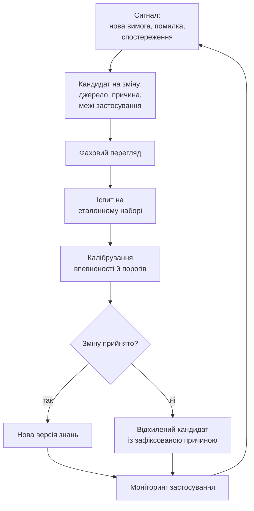
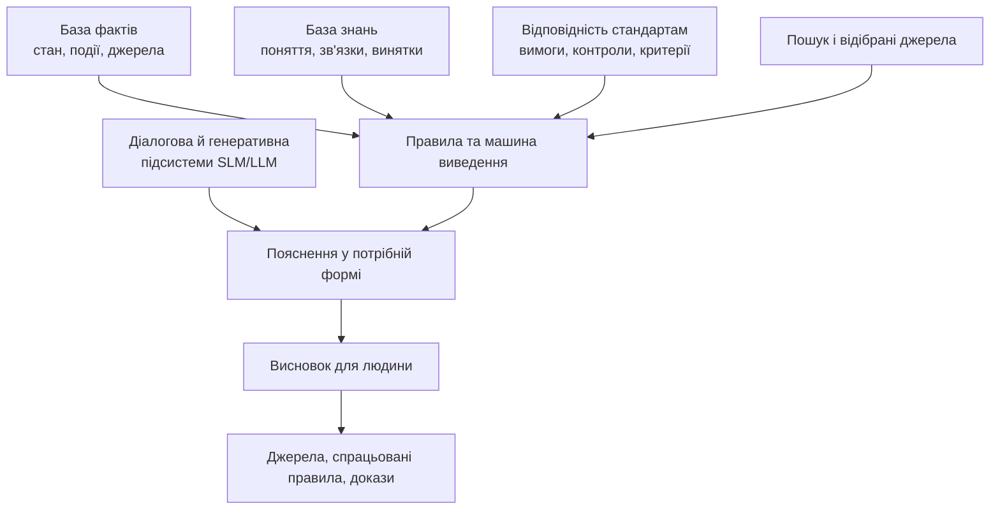
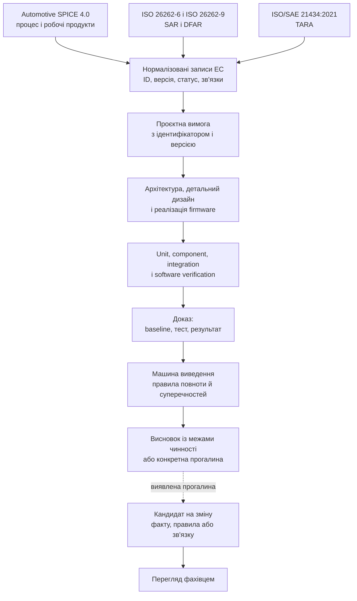
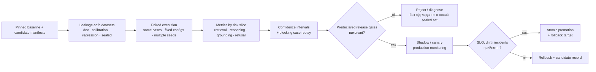
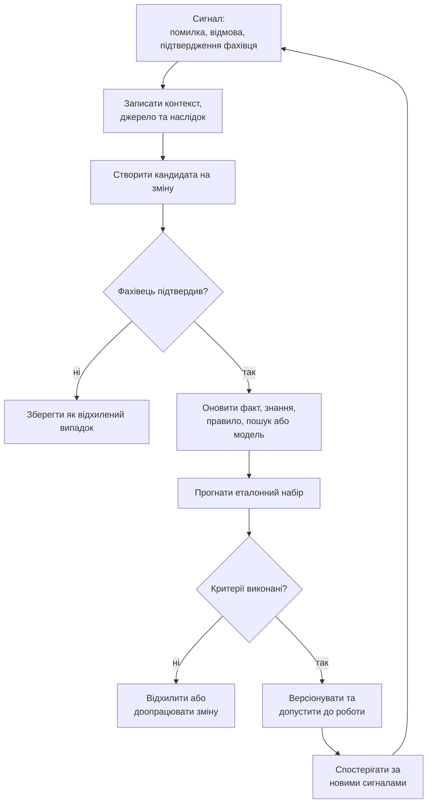
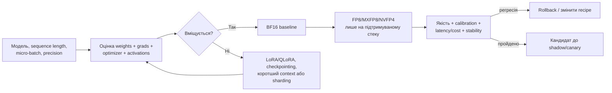

# Як навчати експертну систему: знання, іспит і перевірка змін

> **Серія:** [Експертні системи для R&D](README.md) · стаття 12 із 22
> **Попередня стаття:** [11 — Типи баз знань для експертних систем: чому правила, фрейми, онтології та випадки дають різні висновки](11-Knowledge-Base-Types-UA.md)  
> **Наступна стаття:** [13 — Знайти замало: як експертна система перетворює людське запитання на доказову відповідь](13-Knowledge-Acquisition-From-Question-To-Evidence-UA.md)  
> **Зміст серії:** [README](README.md)  
> **Рівень:** ML / Knowledge Engineer: middle+  
> **Після статті:** побудувати evaluation-gated цикл зміни фактів, правил, індексів і моделей.  
> **Подача матеріалу:** golden set, calibration, regression, traceability та failure analysis без спрощення термінів.

Навчати експертну систему (ЕС) означає змінювати її знання так, щоб результат
можна було перевірити. Самої зміни недостатньо: нове правило може прибрати одну
помилку й створити іншу, а новий словник покращити пошук українською, але
погіршити роботу з англомовними позначеннями. Навіть донавчена мовна модель може
навчитися гарно оформлювати відповідь, не ставши надійнішою у висновках. Тому
кожен кандидат на зміну має пройти іспит на відомих випадках, перш ніж стати
новою робочою версією знань.

Навчання експертної системи є керованим процесом: ми виявляємо проблему,
формуємо зміну, перевіряємо її й лише потім допускаємо до робочого використання.
Стаття відповідає на неминуче
питання: **що робити, коли експертна система й база знань уже існують, але
вимоги, продукти, правила, вимірювання й досвід змінюються?** Спочатку
відокремимо об'єкт зміни від її джерела, потім простежимо кандидата через
фаховий перегляд, іспит і калібрування до рішення про версію. Головне питання
не «чи змінилася ЕС?», а «який факт, правило, пошуковий механізм або спосіб
пояснення тепер працює краще, на яких даних це перевірено і чи можна пояснити
висновок?».

У production слово «навчання» приховує кілька різних відмов:

| Проблема | Як проявляється | Чому виникає | Безпечне рішення |
| --- | --- | --- | --- |
| Неправильно вибрано об'єкт зміни | донавчена LLM краще формулює ту саму хибну відповідь | помилка була у факті, правилі, ACL або retrieval | спочатку локалізувати failure stage, потім змінювати один керований компонент |
| Train/test leakage | метрика різко зростає, production-якість — ні | ревізії того самого документа або incident потрапили в різні splits | group/time/source split до будь-якого tuning |
| Holdout overfitting | кожна наступна версія «покращує» один і той самий тест | test set багаторазово впливає на рішення розробників | окремі development, calibration, regression і sealed confirmation sets |
| Aggregate metric hides harm | середній score зростає, safety/cybersecurity cases деградують | різні ризики усереднено в одне число | gates за критичними slices і типами помилок, а не лише global mean |
| Confidence type mismatch | cosine `0.9`, rule verdict і posterior `0.9` виглядають однаково | несумірні scores названо «впевненістю» | типізувати `rank_score`, `calibrated_probability`, `deterministic_verdict`, `membership` |
| Feedback poisoning | помилковий висновок системи стає наступним training label | власний output або неперевірений like/dislike прийнято за ground truth | feedback → candidate → adjudication → isolated evaluation → promotion |
| Version skew | кандидат тестують на іншому graph/index/prompt, ніж release | компоненти не зафіксовано одним manifest | атомарний system snapshot і відтворюваний evaluation run |

Отже, мета циклу — не «додати знання», а **зменшити конкретний виміряний ризик без неприйнятної регресії в інших підсистемах**.

## Життєвий цикл знань: від сигналу до версії

Поняття життєвого циклу знань легко звести до часу зберігання документа: його
створили, поклали до архіву, а згодом замінили новою редакцією. Для експертної
системи цього недостатньо. Знання впливає на висновки, тому зміна має пройти
перевірку до того, як потрапить у робочу версію.

У цій статті **життєвий цикл знань** означає керований шлях від сигналу про
потребу щось змінити до нової перевіреної версії або обґрунтованого відхилення
кандидата. Це робоче визначення для змін в експертній системі, а не єдина
універсальна модель керування знаннями.

Для відтворюваного іспиту версію ЕС треба описувати не одним `model_id`, а system snapshot:

```math
\mathcal{S}_v=
(F_v,K_v,R_v,G_v,I_v,E_v,M_v,P_v,A_v,T_v),
```

де $F$ — facts, $K$ — керовані knowledge objects, $R$ — rules, $G$ — graph, $I$ — sparse/vector indexes, $E$ — embedder/reranker, $M$ — мовні або інші ML-моделі, $P$ — prompts і output schemas, $A$ — authorization policies, $T$ — tool/runtime versions. Кандидат є явною трансформацією:

```math
\mathcal{S}_{v+1}^{\text{cand}}
=\mathrm{Apply}(\mathcal{S}_v,\Delta),
```

а не набором файлів, які випадково лишилися на сервері після експерименту. Заміна embedder, наприклад, має тягнути сумісну перебудову vector index; зміна ontology може вимагати rematerialization derived facts і повторної SHACL-validation. Тому реальною одиницею promotion є dependency closure зміни, зафіксована manifest, а не лише рядок, який редагував інженер.

Мар'ям Алаві та Дороті Лайднер розглядають керування знаннями як сукупність
процесів створення, зберігання й пошуку, передавання та застосування знань.
Руді Штудер, Річард Беньямінс і Дітер Фенсель показують інженерію знань як
методичну побудову та підтримання моделей знань, а не як одноразове наповнення
сховища. Модель нижче адаптує ці підходи до контрольованої зміни ЕС і додає
іспит, калібрування та рішення про версію. Відомості про джерело, автора,
перетворення і похідну версію спираються на модель походження W3C PROV.



Кожен блок на схемі має власний вхід, дію та результат:

- **Сигнал** повідомляє про можливу потребу в зміні, але ще нічого не доводить.
	Ним може бути нова вимога, знайдена помилка, зауваження фахівця, невдалий
	висновок ЕС або зміна умов застосування. Результат блоку: зареєстроване
	спостереження з посиланням на джерело й версію системи, у якій воно виникло.
- **Кандидат на зміну** перетворює сигнал на конкретну пропозицію. У ній
	зазначають, який факт, зв'язок, правило, пошукове налаштування або компонент
	треба змінити, чому, на підставі якого джерела і в яких межах. Результат:
	версіонований кандидат, який уже можна перевіряти й відхиляти.
- **Фаховий перегляд** означає змістову перевірку людиною, компетентною саме в
	предметній області кандидата. Firmware-інженер може перевірити реалізацію,
	safety-фахівець зв'язок із вимогою безпеки, а cybersecurity-фахівець
	припущення про загрозу чи контроль. Це не нефахове читання на зрозумілість,
	не редакторська правка тексту і не автоматична перевірка формату. Результат:
	підтвердження змісту, запит на доопрацювання або мотивоване відхилення.
- **Іспит на еталонному наборі** є повторюваним прогоном незмінних випадків із
	наперед відомими правильними висновками, потрібними джерелами та очікуваними
	відмовами. Кандидата порівнюють із чинною версією не лише на випадку, який
	спричинив зміну, а й на старих та прикордонних сценаріях. Результат: виміряний
	виграш, знайдена регресія або відсутність підтвердженого поліпшення. Побудову
	такого набору детальніше розглянуто в розділі «Іспит важливіший за враження».
- **Калібрування впевненості й порогів** перевіряє не саму правильність
	висновку, а відповідність заявленої впевненості реальній частоті помилок.
	Тут визначають, коли ЕС може дати рекомендацію, коли потрібен перегляд
	фахівцем, а коли система повинна відмовитися від висновку. Результат:
	перевірені або скориговані пороги. Метод докладніше описано в розділі
	«Калібрування: чи можна довіряти впевненості ЕС».
- **Рішення «Зміну прийнято?»** є контрольованою точкою випуску. Власник зміни
	зіставляє фаховий висновок, результати іспиту, калібрування, ризик і
	можливість повернення до попереднього стану. Результат: зафіксоване рішення
	прийняти або відхилити кандидата разом із підставами.
- **Нова версія знань** виникає лише після позитивного рішення. Вона отримує
	ідентифікатор, склад змін, пов'язані джерела, результати перевірок, дату й
	власника. Це робоча версія фактів, правил, індексів або моделей, яку можна
	однозначно відтворити й за потреби замінити попередньою.
- **Відхилений кандидат** не видаляють без сліду. Разом із ним зберігають
	причину відмови, використані докази та умови, за яких повторний розгляд буде
	виправданим. Так та сама хибна пропозиція не повертається без нових даних.
- **Моніторинг застосування** спостерігає за поведінкою прийнятої версії у
	визначених межах: помилками, правильними відмовами, новими типами запитів,
	зміною даних і наслідками рекомендацій. Моніторинг може породити новий
	сигнал, але не переписує знання автоматично. Механізм цього переходу
	детальніше розглянуто в розділі «Керована петля зворотного зв'язку».

Отже, схема визначає не лише порядок блоків, а й умови переходу між ними.
Сигнал стає знанням лише після формалізації кандидата, фахового перегляду,
повторюваного іспиту, калібрування та рішення про випуск. Тепер треба уточнити,
**що саме** в експертній системі може бути об'єктом такої зміни.

## Що саме змінюється під час навчання ЕС

Життєвий цикл пояснює, як перевіряти зміну, але ще не визначає, у якій частині
експертної системи її треба зробити. Фразу «навчити ЕС» часто автоматично
зводять до донавчання мовної моделі. Через це команда може змінювати модель,
хоча причиною помилки є застарілий факт, неповне правило, розірване трасування
або невдалий пошук. Отже, перед створенням кандидата на зміну треба встановити
його **об'єкт навчання**, тобто конкретний компонент або керований артефакт,
поведінку якого команда хоче поліпшити.

Велика мовна модель (*Large Language Model*, LLM) або мала мовна модель
(*Small Language Model*, SLM) є лише одним із таких компонентів. Мовна
підсистема витягує структуру з тексту, класифікує фрагменти, інтерпретує запит
і формує пояснення у визначеному форматі. База фактів зберігає відомості про
стан і їхнє походження, база знань містить поняття та правила, пошук добирає
джерела, а зв'язки трасування поєднують вимогу з перевіркою і доказом. Мовна
модель не може замінити жодну з цих ролей.

Діаграма відповідає на практичне питання: у якому компоненті треба шукати
причину хибного висновку і що саме має змінитися, щоб виправлення можна було
перевірити?



Схема розділяє причини, які зовні можуть виглядати як одна невдала відповідь.
Якщо висновок не має джерела, команда перевіряє базу фактів і пошук. Якщо
машина виведення не застосовує виняток, перевірки потребують база знань та умови
правила. Якщо ЕС не доводить виконання вимоги, власник відповідності перевіряє
зв'язок між вимогою, контрольною дією, результатом і доказом. Лише коли всі ці
частини правильні, але відповідь плутає терміни, структуру або ступінь
категоричності, кандидатом на зміну стає мовна підсистема.

Отже, об'єкт навчання визначає не абстрактне місце «всередині ШІ», а конкретний
факт, правило, зв'язок трасування, пошукове налаштування або мовний компонент.
Це розрізнення дає змогу обрати належну перевірку. Наступний розділ покаже його
на наскрізному прикладі Automotive Software/Firmware, а потім кожен із п'яти
шарів буде розглянуто окремо.

## Automotive Software/Firmware як наскрізний приклад

Я працюю в напрямку Automotive Software/Firmware, тому далі використовую цей
домен як головний практичний приклад. Тут особливо добре видно, чому експертну
систему не можна навчати одним масивом документів. Процес розробки, функційна
безпека і кібербезпека ставлять різні питання та породжують різні докази.

Наскрізним прикладом буде firmware електронного блоку керування (*Electronic
Control Unit*, ECU). Я обрав його тому, що навіть одна зміна такого ПЗ одночасно
торкається версії апаратної платформи й калібрувань, програмних вимог,
архітектури, коду, конфігураційної базової версії та кількох рівнів перевірки.
Якщо функція пов'язана з безпекою або захищеним оновленням, до цього самого
ланцюга додаються окремі докази функційної безпеки й кібербезпеки. На одному
прикладі можна простежити всі п'ять шарів навчання ЕС і водночас не підмінити
процесний контроль твердженням про відповідність стандарту.

Важливо не змішувати ролі трьох джерел вимог:

- **Automotive SPICE 4.0** є моделлю процесів та оцінювання їхньої спроможності.
	Для розробки ПЗ ланцюг охоплює `SWE.1 Software Requirements Analysis`,
	`SWE.2 Software Architectural Design`, `SWE.3 Software Detailed Design and
	Unit Construction`, `SWE.4 Software Unit Verification`, `SWE.5 Software
	Component Verification and Integration Verification` та `SWE.6 Software
	Verification`. Про зміни конфігурації, проблеми й запити на зміну додатково
	говорять `SUP.8`, `SUP.9` і `SUP.10`.
- **ISO 26262-6:2018** стосується розробки програмного забезпечення у контексті
	функційної безпеки дорожніх транспортних засобів. Вона дає safety-контекст:
	які програмні вимоги пов'язані з вимогами безпеки, як перевіряють реалізацію і
	які результати підтримують аргумент про безпеку.
- **ISO/SAE 21434:2021** стосується інженерії кібербезпеки протягом життєвого
	циклу автомобільних електричних та електронних систем. Вона пов'язує
	результати аналізу загроз і оцінювання ризику, cybersecurity goals, вимоги,
	реалізацію, перевірку та післявиробниче реагування.

Отже, Automotive SPICE не замінює ISO 26262 або ISO/SAE 21434. Він допомагає
оцінювати, чи керовано команда отримує, узгоджує, реалізує й перевіряє робочі
продукти. Стандарти безпеки визначають предметні обмеження та аргументи, які
мають бути в цих продуктах. Для ЕС це три пов'язані, але не взаємозамінні
контексти знань. Щоб перетворити їх на перевірюваний висновок, треба розділити
артефакти за тим, що саме в ЕС вони можуть змінити.

## П'ять шарів, які справді можна поліпшувати

Коли ЕС дає хибний або неповний висновок, причину легко помилково приписати
мовній моделі. Проте однакова зовнішня помилка може походити з різних місць:
застарілого факту, неповного правила, розірваного зв'язку з вимогою, невдалого
пошуку або способу подання відповіді. Без такого розрізнення команда ризикує
донавчати модель там, де треба оновити базу фактів чи виправити правило.

Щоб розділити ці причини, варто окремо розглядати п'ять шарів експертної
системи. У кожному з них змінюється інший артефакт, а отже потрібна інша
перевірка.

| Шар | Що в ньому навчається | Приклад зміни | Як перевірити |
| --- | --- | --- | --- |
| База фактів | точність опису стану та походження даних | додати тип артефакта, час спостереження, прибрати дубль | звірити факти з первинними документами |
| База знань | поняття, зв'язки, правила, винятки | додати підтверджений термін або правило | перевірити приклади, де правило має і не має спрацювати |
| Відповідність стандартам | зв'язок між вимогою та доказом | пов'язати пункт стандарту з контролем і критерієм прийняття | простежити ланцюг від вимоги до результату |
| Пошук і пояснення | добір контексту та межі відповіді | змінити словник, профіль пошуку, поріг відмови | виміряти якість видачі й коректність відмов |
| Діалогова й генеративна підсистеми SLM/LLM | інтерпретація запиту, термінологія домену, структурована відповідь, формулювання пояснення й відмови | донавчити адаптер на перевірених діалогах, запитах і відповідях із посиланнями на джерела | порівняти відповіді, цитування, структуру та коректність відмов на окремому еталонному наборі |

У кожного шару свій механізм навчання. Тому одна й та сама скарга користувача
може привести до п'яти різних змін.

**База фактів навчається через контрольоване виправлення стану.** Сигналом може
бути новий результат вимірювання, змінений статус вимоги або розбіжність із
первинним документом. Новий запис не перезаписує старий мовчки: він отримує
джерело, час, автора, межі чинності та зв'язок із попередньою версією. Після
звірки з першоджерелом факт додають, уточнюють або позначають нечинним. Модель
W3C PROV дає формальну основу для такого обліку походження й похідності. Цей
шар не повинен виводити нове правило з одиничного спостереження, бо його задача
полягає в точному описі відомого стану. Для ECU таким фактом може бути
комбінація версії firmware, ревізії плати, набору калібрувань, варіанта
кодування, версії bootloader і результату тесту на конкретному стенді. Результат
для іншої ревізії hardware або іншої калібрувальної бази не можна непомітно
перенести на поточну конфігурацію виробу.

**База знань навчається через зміну понять, зв'язків, правил і винятків.** Така
зміна потрібна, коли підтверджені факти вже правильні, але ЕС не знає нового
терміна, не бачить зв'язку між сутностями або застосовує правило без важливого
винятку. Інженер зі знань формулює кандидата явно, перевіряє його на позитивних
і негативних прикладах та шукає конфлікти з чинними правилами. Руді Штудер,
Річард Беньямінс і Дітер Фенсель описують таку побудову й підтримання моделей
як інженерний процес. Перевірений факт може стати підставою для кандидата, але
не перетворюється на загальне правило без фахового обґрунтування. Наприклад,
один timeout діагностичної сесії ще не доводить загального правила. Після
аналізу вимоги, архітектури та серії відтворюваних тестів інженер може
сформулювати вужчий кандидат: для визначеного стану ECU, типу сесії та версії
firmware втрата зв'язку має запустити конкретний перехід стану, запис події та
безпечне завершення операції.

**Шар відповідності стандартам навчається через відновлення трасування.** Нова
редакція стандарту, змінений контроль або відсутній доказ створюють кандидата
на зв'язок «вимога → контрольна дія → критерій → результат → доказ».
Фахівець спершу перевіряє редакцію документа й межі його застосування, а потім
проходить ланцюг у двох напрямках. Підхід узгоджується з вимогами до двобічного
трасування в ISO/IEC/IEEE 29148. Сам текст стандарту не навчає ЕС відповідності:
без контрольної дії та доказу він лишається джерелом вимоги, а не підтвердженням
її виконання. В Automotive цей шар має зберігати одразу кілька типів зв'язку.
Для Automotive SPICE це може бути перехід від `SWE.1`-вимоги через
`SWE.2`-архітектуру і `SWE.3`-реалізацію до результатів `SWE.4`, `SWE.5` та
`SWE.6`. Для ISO 26262 додається зв'язок із програмною вимогою безпеки та її
верифікацією. Для ISO/SAE 21434 додається походження від threat scenario або
cybersecurity goal до вимоги та доказу перевірки. Наявність одного з цих
ланцюгів не доводить повноту двох інших.

**Пошук і пояснення навчаються на контрольних запитах та відомих невдачах.**
Для запиту фіксують релевантні джерела, неприйнятні збіги, достатній контекст і
випадки, де правильною відповіддю є відмова. Після цього команда може змінити
словник, індекс, повторне ранжування, поріг пошуку або шаблон пояснення і
порівняти результат на відкладеному наборі запитів. Шахул Ес, Джитін Джеймс,
Луїс Еспіноса-Анке та Стівен Шокарт у Ragas розділяють оцінювання релевантності
контексту, опори відповіді на нього та якості генерації. Таке розділення не дає
гарному формулюванню приховати пропущене джерело, а точному пошуку підмінити
перевірку змісту відповіді. Automotive-запит часто містить точні позначення:
ідентифікатор software requirement, діагностичний код несправності
(*Diagnostic Trouble Code*, DTC), service ID, назву runnable, сигнал
*AUTomotive Open System ARchitecture* (AUTOSAR), test case або версію ECU.
Пошук має спершу знайти точний об'єкт і його
чинну ревізію, а вже потім семантично близькі матеріали. Відповідь про іншу
платформу чи застарілий baseline може бути змістовно схожою, але інженерно
хибною.

**Діалогова й генеративна підсистеми SLM/LLM навчаються на перевірених
прикладах мовної поведінки.** До них належать пари «запит → відповідь»,
приклади коректного цитування, структуровані висновки й правильні відмови.
Донавчання потрібне, коли факти, правила та знайдені джерела правильні, але
мовна підсистема плутає термінологію, формат або ступінь категоричності.
Попередню й нову версії порівнюють на окремому еталонному наборі за точністю
посилань, структурою та коректністю відмов. Для навчального набору фіксують
джерело, ліцензію або право використання, версію, очищення й параметри
донавчання. Це відповідає підходу Тімніт Гебру та співавторів у
[*Datasheets for Datasets*](https://doi.org/10.1145/3458723). Вага моделі може
поліпшити спосіб подання висновку, але не стає джерелом факту або доказом. У
firmware-проєкті мовна підсистема може навчитися розрізняти `safety goal`,
`software safety requirement`, `cybersecurity goal`, `software requirement`,
`problem report` і `change request`, повертати їхні ідентифікатори в заданій
структурі та явно повідомляти про відсутній evidence link. Вона не має права
заявляти про відповідність лише тому, що вміє правильно вживати терміни
Automotive SPICE або ISO.

Отже, навчання ЕС починається не з автоматичного вибору донавчання моделі, а з
визначення шару, де виникла проблема. Донавчання SLM/LLM потрібне, коли
необхідно поліпшити розуміння запиту, термінологію, структуру діалогу, пояснення
або дисципліну відмов. Воно не виправить неповний факт чи помилкове правило.
Кожна зміна, зокрема зміна мовного компонента, потребує власника, версії,
причини, даних навчання та способу перевірки. Визначити потрібний шар ще
недостатньо: треба встановити, з якого результату роботи проєкту походить новий
факт, правило або навчальний приклад і чи можна цьому джерелу довіряти.

> **Практичний досвід автора.** У системі здобуття знань, яку я розвиваю, вимірювані поліпшення поки походили насамперед із детермінованого тріажу, provenance, metadata filters, hybrid BM25 + vector retrieval та окремого compact classifier. Це не дає підстав називати систему «самонавчальною»: production-петля автоматичного promotion knowledge/model changes не замкнена, а незалежно розмічений confirmation set ще треба розширювати. Саме тому нижче я описую evaluation-gated target process і відокремлюю його від того, що вже підтверджено локальними експериментами.

## На яких результатах роботи проєкту навчається ЕС

У проєкті поруч існують затверджена вимога, чернетка, результат випробування,
непереглянута зміна коду, застаріла схема і повідомлення з чату. Якщо перенести
їх у базу знань без перевірки статусу та походження, ЕС почне спиратися на
тимчасові або непридатні для конкретного виробу відомості. Тому для навчання
важливий не обсяг тексту, а тип результату роботи, його версія, авторство й
межі застосування.

Як інвентаризувати, очистити, класифікувати й курувати такі артефакти до їх
використання, розглянуто у статті [Здобуття знань для експертної системи: як
збирати інженерні знання без хаосу і витоку даних](10-Knowledge-Acquisition-System-UA.md).
Тут ідеться про наступний крок: за яких умов перевірений результат роботи може
змінити факт, правило, зв'язок трасування або інший компонент ЕС.

Перевірені результати роботи дають ЕС факти та правила для конкретного проєкту:
вимоги, моделі, реалізацію, результати перевірок і рішення. Це однаково
стосується програмних, системних і апаратних дослідно-конструкторських
(*Research and Development*, R&D) проєктів. Вихідний код є
важливим джерелом у розробці програмного забезпечення, а в системних та
апаратних проєктах аналогічну роль відіграють системні моделі, схеми,
конструкторські дані, прототипи, вимірювання та виробничі докази. Модель
походження Консорціуму Всесвітньої павутини (W3C) PROV, огляд якої редагували
Люк Моро та Пол Гроте, формалізує для таких записів зв'язки між сутністю,
діяльністю й відповідальним агентом. Саме ці зв'язки дають змогу перевірити,
хто, коли і з якого джерела отримав результат.

| Результат роботи проєкту | Чого може навчитися ЕС | Що треба зберегти разом із ним |
| --- | --- | --- |
| Вимоги, стандарти, регламенти й базові версії | поняття, обмеження, критерії приймання, правила відповідності | ідентифікатор, версія, власник, статус, межі чинності |
| Архітектурні та системні моделі, інтерфейси, симуляції | стани, потоки, межі компонентів, припущення, допустимі сценарії | версія моделі, параметри, сценарій, межі валідності, результат симуляції |
| Вихідний код, конфігурації та інфраструктура як код | факти про реалізацію, залежності, інтерфейси, обмеження конфігурації | репозиторій, базова версія, ревізія, шлях або символ, результат перегляду |
| Схеми, описи мовами опису апаратури (*Hardware Description Language*, HDL), плати, специфікації матеріалів і компонентів (*Bill of Materials*, BOM) | електричні й логічні з'єднання, параметри компонентів, обмеження конструкції | ревізія, артикул, версія специфікації, партія або серійний номер, погодження зміни |
| Моделі систем автоматизованого проєктування (*Computer-Aided Design*, CAD), креслення, допуски й матеріали | геометричні та матеріальні обмеження, склад збірки, режими застосування | ревізія моделі чи креслення, одиниці вимірювання, допуск, матеріал, варіант виробу |
| Тести, лабораторні вимірювання, прототипи й кваліфікаційні випробування | фактичні межі роботи, повторювані відмови, кандидати на пороги й правила ризику | методика, прилад і калібрування, стенд, середовище, ідентифікатор прототипу, сирі дані, протокол |
| Виробничий контроль, дані постачальників, дефекти та зміни | тенденції невідповідностей, причини відбракування, винятки, коригувальні дії | партія, постачальник, контрольний план, результат інспекції, статус, застосовність |
| Аудити, контрольні точки випуску й підтвердження фахівців | прогалини доказів, правила готовності, пріоритет перегляду, підтверджені винятки | відповідальна роль, дата, рішення, обґрунтування, пов'язані вимоги й докази |

Для Automotive Software/Firmware ця таблиця перетворюється на конкретний набір
взаємопов'язаних робочих продуктів. `SWE.1` дає програмні вимоги й критерії
перевірки; `SWE.2` дає компоненти, інтерфейси, поведінку та розподіл вимог;
`SWE.3` пов'язує детальний дизайн із software units і вихідним кодом; `SWE.4`
дає результати верифікації окремих units; `SWE.5` перевіряє компоненти та їх
інтеграцію; `SWE.6` перевіряє інтегроване ПЗ проти програмних вимог. Baseline
конфігурації з `SUP.8`, problem report із `SUP.9` і change request із `SUP.10`
пояснюють, для якої версії цей доказ чинний і чому вона змінилася.

До цього процесного каркаса додаються предметні артефакти. У safety-контексті
це можуть бути програмні вимоги безпеки, звіт з аналізу функційної безпеки
(*Safety Analysis Report*, SAR), звіт з аналізу залежних відмов (*Dependent
Failure Analysis Report*, DFAR), результати статичного аналізу, unit та
integration verification і зв'язки з safety case. У cybersecurity-контексті
це можуть бути результати аналізу загроз та оцінювання ризиків (*Threat
Analysis and Risk Assessment*, TARA), цілі кібербезпеки, вимоги до
автентичності оновлення, цілісності, авторизації чи захисту від відкату, а
також результати негативних тестів, фазингу або тестування на проникнення. ЕС
має навчатися не словам із цих документів, а перевіреним зв'язкам між їхніми
версіями, рішеннями та результатами.

Код, HDL-опис, схема, CAD-модель або одиничне вимірювання не є «тренувальним
текстом», який можна безконтрольно запам'ятати. Це кандидат на зміну факту,
правила, порогу чи зв'язку трасування. Для апаратних і системних проєктів один
лабораторний результат не доводить властивість виробу, доки не відомі методика,
калібрування приладу, конфігурація стенда, умови середовища, партія або
прототип, повторюваність і критерій приймання.

Отже, навчання починається з перетворення результату роботи на контрольований
запис із походженням і межами застосування. Лише після перевірки фахівцем та
іспиту кандидат може змінити робочу базу фактів, правило, зв'язок трасування
або поріг відмови. Чернетка вимоги, непереглянута гілка, сирий журнал
безперервної інтеграції (*Continuous Integration*, CI) або текст LLM можуть
підказати, де шукати проблему, але не стають фактом або
доказом автоматично. Особливої перевірки потребують твердження про відповідність
стандартам, бо тут самого надійного джерела ще недостатньо: потрібен повний
зв'язок від вимоги до доказу.

## Як трасування підтверджує відповідність стандартам

Помилка виникає, коли базу знань намагаються навчити «знати стандарт». Текст
стандарту сам по собі ще не створює перевірки. Для інженерного висновку потрібен
ланцюг, який можна пройти в обидва боки: від вимоги до доказу і від доказу до
вимоги, яку він підтримує. Стандарт ISO/IEC/IEEE 29148 визначає двобічне
трасування як зв'язок вимог із джерелами та похідними результатами роботи, але
сам конкретний склад доказового ланцюга залежить від домену й процедури
перевірки.

У Automotive Software R&D такими джерелами й результатами часто є TARA, SAR і
DFAR. Вони відповідають на різні питання:

- **TARA** виявляє активи, сценарії шкоди й загроз, оцінює вплив і здійсненність
  атаки, а потім обґрунтовує рішення щодо обробки ризику та цілі кібербезпеки.
  TARA є процесом аналізу; команда зазвичай зберігає його результати в таблиці,
  моделі або звіті. Для розробника firmware ці результати стають джерелом вимог
  до автентичності, цілісності, авторизації, захисту ключів, журналювання чи
  безпечного оновлення.
- **SAR** фіксує межі, припущення, метод і результати одного або кількох
  аналізів безпеки, наприклад аналізу видів і наслідків відмов (*Failure Mode
  and Effects Analysis*, FMEA), дерева відмов (*Fault Tree Analysis*, FTA) чи
  аналізу видів, наслідків і діагностичного охоплення відмов (*Failure Modes,
  Effects, and Diagnostic Analysis*, FMEDA). У software-проєкті він
  пояснює, які відмови та небезпечні наслідки мають бути попереджені або
  виявлені програмними механізмами, і пов'язує висновки аналізу з цілями
  безпеки, вимогами та перевірками.
- **DFAR** документує залежні відмови, зокрема спільну причину, каскадне
  поширення або спільний режим відмови. Для firmware він перевіряє припущення
  про незалежність: чи не використовують основний і резервний механізми той
  самий clock, memory region, driver, communication stack, power domain або
  інший спільний ресурс, здатний вивести з ладу обидва канали.

### Як ЕС використовує таблиці TARA, SAR і DFAR

Сам файл TARA, SAR або DFAR не є окремим «модулем безпеки» всередині ЕС. Це
первинне джерело, з якого засіб імпорту переносить перевірені рядки й зв'язки до
керованих компонентів знань. База фактів зберігає значення полів разом з
ідентифікатором рядка, версією документа, статусом перегляду, конфігурацією
виробу та посиланням на оригінал. База знань визначає типи сутностей і допустимі
зв'язки між ними. Шар трасування з'єднує результати аналізу з вимогами,
архітектурою, реалізацією та тестами. Машина виведення застосовує до цього
графа явні правила достатності, суперечності й прогалин, а машина пояснення
перетворює результат на відповідь із посиланнями на конкретні рядки та версії.

Перед завантаженням до робочої бази таблицю нормалізують. Назви колонок із
проєктного шаблону зіставляють із поняттями ЕС, посилання на вимоги й тести
перетворюють на стійкі ідентифікатори, а статуси та версії перевіряють. Рядок
без власника, чинної версії або однозначного об'єкта аналізу може залишитися
доступним для пошуку, але не повинен брати участь у доказовому висновку. Так ЕС
не плутає текстову схожість із підтвердженим інженерним зв'язком.

| Джерело | Що потрапляє до компонентів ЕС | Як машина виведення це використовує |
| --- | --- | --- |
| TARA | актив, сценарій шкоди, сценарій загрози, оцінка ризику, рішення щодо ризику, ціль кібербезпеки та їхні ідентифікатори | перевіряє, чи кожна прийнята до обробки загроза має пов'язану ціль, вимогу, реалізацію та результат перевірки; за розриву формує висновок про прогалину, а не про виконаний контроль |
| SAR | об'єкт і метод аналізу, припущення, відмова або небезпечний наслідок, пов'язана ціль безпеки, вимога, рекомендована дія та статус | перевіряє, чи висновок аналізу враховано у вимогах та архітектурі й чи існує чинний доказ верифікації для потрібної конфігурації |
| DFAR | ініціатор залежної відмови, чинник зв'язку (*coupling factor*), спільний ресурс, уражені елементи, заявлена незалежність, захисний захід, залишковий ризик і тест | шукає спільні причини між елементами, зіставляє їх із захисними заходами й позначає твердження про незалежність як непідтверджене, якщо захід або його перевірка відсутні |

Правила виведення мають бути вужчими за зміст документа. Наприклад, правило
може стверджувати: якщо чинний рядок TARA вимагає обробити сценарій загрози, але
від нього немає шляху до програмної вимоги й успішного тесту для чинної
базової версії, то доказовий ланцюг неповний. Інше правило може знайти в DFAR два
нібито незалежні механізми зі спільним flash driver і вимагати підтверджений
захисний захід. Це правила про повноту та узгодженість відомих проєктних
артефактів. Вони не дають ЕС права самостійно оголосити виріб безпечним або
захищеним.

Отже, на запит «чи достатньо доказів для firmware update ECU версії X?» ЕС
спочатку обмежує пошук цією конфігурацією, потім будує шляхи від TARA, SAR і
DFAR до вимог, дизайну та тестів, застосовує правила і повертає один із
контрольованих результатів: ланцюг підтверджено в заданих межах, знайдено
конкретну прогалину, виявлено суперечність або даних недостатньо для висновку.
Відповідь повинна назвати правило, базову версію і рядки таблиць, на яких
вона ґрунтується. Саме так ці документи беруть участь у виведенні, а не просто
зберігаються поруч із базою знань.

ISO 26262-9:2018 визначає предмет safety-oriented analyses і dependent failure
analysis, але не задає єдиної схеми даних для ЕС. У конкретному проєкті назви
SAR і DFAR, склад їхніх таблиць та допустимі статуси фіксують у керованому
словнику імпорту. Він явно зіставляє локальні колонки з типами сутностей,
зв'язками й правилами виведення. Завдяки цьому зміна шаблону постачальника не
змінює семантику знань непомітно: нове відображення проходить перевірку й
версіонування до участі його записів у висновках ЕС.

Схема нижче відповідає на питання, де саме ці артефакти входять до ЕС і як
доходять до висновку. Процесні робочі продукти Automotive SPICE, результати
SAR/DFAR за ISO 26262 та результати TARA за ISO/SAE 21434 спочатку стають
нормалізованими записами з версіями й зв'язками. Лише потім ЕС простежує їх до
вимоги, реалізації, перевірки та конкретного доказу.



Верхня частина схеми показує перетворення документів на структуровані знання,
середня частина показує доказовий ланцюг, а нижня відокремлює правило машини
виведення від сформованого висновку. Якщо правило знаходить прогалину, вона
стає кандидатом на зміну лише після прив'язки до конкретного факту, правила
або зв'язку та подальшого перегляду фахівцем.

Розглянемо firmware-оновлення ECU. Програмна вимога може вимагати перевіряти
автентичність і цілісність пакета, забороняти недозволений rollback та
повертати ECU до визначеного стану після перерваного оновлення. У процесній
проєкції ЕС має пройти від `SWE.1`-вимоги до `SWE.2`-компонента bootloader,
`SWE.3`-детального дизайну й коду, а потім до результатів `SWE.4`, `SWE.5` і
`SWE.6`. Baseline firmware, ключових конфігурацій і тестових засобів має бути
однозначно визначений через configuration management.

У TARA активом може бути механізм оновлення, сценарієм шкоди стала б втрата
керованості функцією через виконання підміненого firmware, а сценарієм загрози
була б інсталяція пакета без належної авторизації. Рішення про обробку ризику та
ціль кібербезпеки переходять у вимоги до перевірки підпису, захисту від відкату
й керування ключами, далі в дизайн bootloader, код і негативні тести. Запис у
TARA обґрунтовує походження вимоги, але не доводить, що контроль реалізовано.

Якщо збій оновлення може вплинути на safety-related функцію, SAR фіксує
результати відповідного аналізу безпеки: небезпечний наслідок, припущення,
пов'язану програмну вимогу безпеки, передбачену безпечну реакцію та потрібну
верифікацію. DFAR додає окрему перевірку залежностей. Наприклад, основний образ
і recovery firmware не є незалежними, якщо обидва покладаються на той самий
пошкоджений flash driver або спільну ділянку пам'яті. Такий висновок має
привести до архітектурної вимоги, захисного механізму та тесту з ін'єкцією
відмови, а не залишитися лише абзацом у звіті.

Машина виведення повинна встановити, яке правило спрацювало і який стан має
ланцюг: підтверджений у заданих межах, неповний, суперечливий або недостатній
для висновку. Машина пояснення показує використані зв'язки, версії артефактів,
результати тестів і причину такого стану. Якщо немає тесту відновлення після
втрати живлення, ЕС має назвати саме цю прогалину, а не написати «ймовірно
виконано». Мовна підсистема може сформулювати відповідь, але не має права
змінити результат правила. Трасування перетворює вимоги процесу й стандартів
на перевірювані ланцюги, але ще не доводить, що нова версія ЕС зберегла їх у
всіх критичних випадках. Для цього потрібен повторюваний іспит.

## Іспит важливіший за враження

Нова версія може добре виглядати на кількох підібраних демонстраціях і водночас
втратити важливий виняток або перестати відмовлятися за нестачі доказів. Без
незмінної вибірки з відомими очікуваними результатами неможливо відрізнити
справжнє поліпшення від випадково вдалого прикладу.

Після зміни фактів, правил, пошуку або мовного компонента потрібен іспит. Невеликий еталонний набір (*gold set*) корисний як **smoke/regression suite**, якщо він представляє відомі ризики домену. Але 20–30 випадків не доводять узагальнення, калібрування або низьку частоту рідкісної небезпечної помилки. Навіть якщо на $n=30$ незалежних випадках не сталося жодної відмови, наближена однобічна 95%-ва верхня межа за «правилом трьох» дорівнює:

```math
p_{\text{failure}}\lesssim\frac{3}{n}=0.10.
```

Тобто результат сумісний навіть із частотою відмов близько 10%; це добрий сигнал для наступного етапу, але не safety claim. Розмір confirmation set планують за прийнятною похибкою, очікуваною частотою подій, потрібною statistical power і окремими critical slices.

Один «тестовий набір» варто розділити за ролями:

| Набір | Для чого використовується | Чого з ним не можна робити |
| --- | --- | --- |
| `train` | оновлення ваг, правил, словника або навчання reranker | оцінювати фінальну якість тією самою вибіркою |
| `development` | error analysis, prompt/rule design, hyperparameter selection | називати його незалежним підтвердженням |
| `calibration` | temperature/threshold fitting та policy coverage | вибирати architecture після перегляду результатів |
| `gold regression` | стабільні відомі інциденти, invariants і blocking cases | покладатися лише на нього для нових класів відмов |
| `sealed confirmation` | рідкісний незалежний release verdict | багаторазово підлаштовувати кандидата під його результати |
| `shadow/canary` | перевірка production distribution, latency, drift і policy incidents | автоматично перетворювати user feedback на ground truth |

До наборів варто включити не лише прості запити з відомими відповідями, а й неоднозначні формулювання, рідкісні терміни, багатомовні позначення, суперечливі джерела та питання, на які ЕС має сформувати відмову.

Для прикладу з ECU еталонний набір має містити не лише успішне оновлення. У
ньому потрібні пакет із неправильним підписом, дозволений і заборонений
rollback, втрата живлення на різних етапах запису, несумісна ревізія hardware,
застаріла калібрувальна база, відсутній test result і конфлікт між чинною
вимогою та старим звітом. Окремий випадок має перевіряти правильну відмову ЕС:
за відсутності підтвердженого baseline вона не може зробити висновок про
готовність firmware до випуску.

Split роблять **до** tuning і не на рівні випадкового рядка. Якщо `REQ-42 v1.1` потрапила в train, а майже тотожна `REQ-42 v1.2` — у test, модель побачила відповідь під іншою ревізією. Тому групують усі chunks, translations, revisions, derived Q&A та cases одного source family; для прогнозу майбутніх змін застосовують time split; для перевірки перенесення — holdout за product line, supplier, ECU variant або project. Після split обчислюють exact/MinHash/embedding similarity між наборами й вручну переглядають найближчі cross-split pairs. Автоматична дедуплікація допомагає, але не доводить відсутності semantic leakage.

Якщо sealed set використали для діагностики й виправлення, він уже вплинув на розробку: його переводять у regression suite, а для наступного незалежного рішення резервують нові cases. Інакше команда поступово навчається проходити іспит, а не покращує систему.

Один набір перевіряє різні речі:

- чи знайдено потрібне джерело;
- чи спрацювало правильне правило;
- чи побудовано ланцюг вимога, контроль, результат, доказ;
- чи пояснення не суперечить фактам;
- чи ЕС формує відмову, коли доказів недостатньо;
- чи нова версія не зіпсувала важливі старі випадки.

Ці властивості не можна стискати в одну «accuracy». Для binary або one-vs-rest verdict:

```math
\mathrm{Precision}=\frac{TP}{TP+FP},
\qquad
\mathrm{Recall}=\frac{TP}{TP+FN},
```

```math
F_\beta=(1+\beta^2)
\frac{\mathrm{Precision}\cdot\mathrm{Recall}}
{\beta^2\mathrm{Precision}+\mathrm{Recall}}.
```

Якщо пропуск критичної вимоги дорожчий за зайву ескалацію, $\beta>1$ підвищує вагу recall, але не скасовує окремий blocking gate на відомі safety cases. Для retrieval із множиною релевантних доказів $G_q$:

```math
\mathrm{Recall@}k=
\frac{1}{|Q|}\sum_{q\in Q}
\frac{|G_q\cap\mathrm{Top}_k(q)|}{|G_q|}.
```

Окремо вимірюють nDCG/MRR, exact identifier match, retrieval чинної ревізії, ACL leakage і частку claims, підтриманих точним evidence span. Високий Recall@k не компенсує citation на obsolete baseline.

### Release gate: candidate проти baseline

Порівняння має бути paired: ті самі cases запускають на $\mathcal{S}_v$ і $\mathcal{S}_{v+1}^{\text{cand}}$, а для стохастичного generation фіксують decoding config і повторюють запуск з кількома seeds. Для метрики $m$ у slice $s$:

```math
\Delta_{m,s}=
m(\mathcal{S}_{v+1}^{\text{cand}},s)
-m(\mathcal{S}_v,s).
```

Заздалегідь оголошений gate може мати форму:

```math
\mathrm{Promote}=
\left[\bigwedge_{s\in C}
\mathrm{LCB}_{95\%}(\Delta_{m,s})\ge-\delta_s\right]
\land
\left[N_{\text{blocking failures}}=0\right]
\land
\left[\text{latency, cost, memory, privacy SLO виконані}\right],
```

де $C$ — critical slices, $\delta_s$ — максимально допустима регресія, а $\mathrm{LCB}$ — нижня межа довірчого інтервалу paired difference. Для blocking safety/security scenarios зазвичай $\delta_s=0$ і перевіряють кожен case, а не лише частку. Інтервал можна оцінювати paired bootstrap; для парних binary verdicts доречний McNemar test. Метод і кількість повторів фіксують до перегляду результату, щоб не вибирати статистику, яка «пропустить» бажаного кандидата.



Середній показник якості недостатній. Якщо нова версія ЕС точніше відповідає на
звичайні запити, але перестає знаходити вимоги безпеки або формує впевнені
висновки без джерел, її не можна допустити до роботи. Іспит відповідає на
питання, чи правильний висновок, але не показує, чи можна довіряти числу, яким
ЕС позначає власну впевненість. Це вже завдання калібрування.

Поділ іспиту за сценаріями й ризиками узгоджується з рамкою керування ризиками
штучного інтелекту (*Artificial Intelligence Risk Management Framework*, AI
RMF), яку Елхам Табассі підготувала для Національного інституту стандартів і
технологій США (NIST). Рамка вимагає тестувати, оцінювати,
верифікувати й валідувати систему в контексті її запланованого застосування.
Отже, іспит встановлює правильність висновку для визначених сценаріїв, але ще
не встановлює, чи відповідає число впевненості реальній частоті помилок. Це
окремо перевіряє калібрування.

## Калібрування: чи можна довіряти впевненості ЕС

Навіть правильний у середньому висновок не є безпечним, якщо UI однаково
позначає «90 % упевненість» для детермінованого rule verdict, ML probability і слабкої аналогії. Ці числа мають різну семантику й не повинні зливатися в одну шкалу.
Середня точність не показує, коли політика використання може дозволити
автоматичну рекомендацію, а коли має вимагати додаткового доказу.

Іспит показує, чи правильні висновки ЕС. Калібрування показує, чи відповідає
заявлена нею впевненість реальній точності. Це окрема властивість експертної
системи, а не побічний результат донавчання моделі.

Якщо ЕС у ста випадках із позначкою «90 % упевненість» має рацію приблизно у
дев'яноста, її оцінка корисна для рішення. Якщо ж ЕС помиляється у третині таких
випадків, число 90 % створює хибне відчуття надійності. Некаліброваною може бути
probability моделі; неправильно налаштованими — поріг policy, CBR similarity,
source ranking або risk score. Їх треба оцінювати різними методами, а не
підганяти до спільної шкали «впевненості».

Чихуань Гуо, Джефф Плез, Ю Сунь та Кіліан Вайнбергер на прикладі нейронних
мереж показали, що висока точність не гарантує каліброваної впевненості. Їхній
результат не доводить каліброваність усієї ЕС, але пояснює, чому точність і
відповідність заявленої впевненості фактичній частоті помилок треба вимірювати
окремо.

Перед калібруванням треба перевірити **тип числа**:

| Вихід компонента | Коректна семантика | Чи можна показувати як probability |
| --- | --- | --- |
| rule/SHACL/solver verdict | детермінований наслідок за конкретного snapshot і assumptions | ні; емпірично оцінюють помилки inputs/rules, але verdict не стає «0.99 true» |
| classifier probability | оцінка $P(Y\mid X)$ конкретної моделі | так, лише після out-of-sample calibration та drift checks |
| Bayesian posterior | probability за структурою моделі, priors і evidence | так, із явними assumptions; не тотожна causal effect |
| cosine/BM25/reranker score | ranking score | ні; probability relevance потребує окремого fitted calibrator |
| fuzzy membership | ступінь належності до визначеної множини | ні; $0.8$ membership не означає 80% частоти |
| CBR similarity | domain-weighted аналогія | ні; success probability адаптації оцінюють окремо |

Для binary probabilistic output із bins $B_1,\ldots,B_M$ поширена оцінка:

```math
\mathrm{ECE}=
\sum_{m=1}^{M}\frac{|B_m|}{N}
\left|\mathrm{acc}(B_m)-\mathrm{conf}(B_m)\right|.
```

ECE залежить від кількості й меж bins, тому її не варто звітувати саму. Reliability diagram показує локальні відхилення, а Brier score є proper scoring rule:

```math
\mathrm{BS}=\frac{1}{N}\sum_{i=1}^{N}(p_i-y_i)^2,
\qquad y_i\in\{0,1\}.
```

Temperature scaling, isotonic regression або Platt scaling fit-ять **лише на calibration set** після model selection; перевіряють на untouched confirmation set. Для multi-class або structured verdict треба вказати, що саме калібрується: top-label correctness, окремий class, claim support чи probability конкретної події.

Для системи з abstention важлива не лише calibration, а крива risk–coverage. За confidence $c_i$, loss $\ell_i$ і threshold $\tau$:

```math
\mathrm{Coverage}(\tau)=
\frac{1}{N}\sum_{i=1}^{N}\mathbf{1}[c_i\ge\tau],
```

```math
\mathrm{SelectiveRisk}(\tau)=
\frac{\sum_i \ell_i\mathbf{1}[c_i\ge\tau]}
{\sum_i\mathbf{1}[c_i\ge\tau]}.
```

Збільшення $\tau$ зазвичай знижує risk, але збільшує частку ручного review. Поріг обирають за predeclared cost/risk policy, а не за найкрасивішою точкою графіка після тесту. Якщо denominator дорівнює нулю, система відмовилася всюди: risk не визначений, а не «ідеальний».

Калібрування приладу в апаратному проєкті відповідає на питання, чи правильно
виміряна фізична величина. Калібрування ЕС відповідає на інше питання: за яких
умов політика використання дозволяє ЕС рекомендувати дію, коли вона має
запитати додатковий доказ, а коли сформувати відмову. Обидва види калібрування
важливі, але їх не слід змішувати.

| Що перевіряємо | На чому перевіряємо | Яке рішення може змінитися |
| --- | --- | --- |
| Упевненість висновку | еталонні випадки з відомим результатом, окремі від матеріалу, на якому готували зміну | поріг автоматичної рекомендації, правило відмови, потреба в перегляді фахівцем |
| Межу застосовності правила або CBR-аналогії | винятки, прикордонні режими, підтверджені невдалі аналогії | умови правила, заборонений сценарій, вимога до додаткового доказу |
| Поріг ризику та ескалації | історичні інциденти, тести безпеки, лабораторні або виробничі дані з відомим наслідком | рівень тривоги, черга ручної перевірки, дія з правом вето |
| Якість пошуку й достатність доказів | контрольні запити, відомі пропущені джерела, правильні відмови через нестачу даних | мінімальний пакет доказів, поріг пошуку, формулювання відмови |

В ECU-прикладі оцінка «висока впевненість» не може спиратися лише на те, що ЕС
знайшла requirement і зелений test report. Калібрувальний набір має показати,
як часто такий висновок справджується за збігу baseline, hardware revision,
bootloader, калібрувань і тестового середовища. Якщо система регулярно не
помічає, що доказ належить іншій конфігурації, треба змінювати правило
достатності доказів або поріг ескалації, а не округлювати оцінку впевненості.

Для калібрування фіксують версію фактів, знань, правил, індексів і моделей;
проганяють незмінний еталонний набір; порівнюють заявлену впевненість із
фактичними помилками та правильними відмовами; пропонують зміну порогу або
знання; повторюють іспит; зберігають результат як частину рішення про випуск.
Калібрування не змінює правила непомітно. Воно показує, де автоматичний висновок
занадто сміливий, занадто обережний або застосований поза межами чинності.
Проте виявлена помилка калібрування ще не визначає, що саме треба змінити. Вона
стає сигналом для керованого зворотного зв'язку: перегляду порогу, правила,
джерела або навчальних даних мовної підсистеми.

## Керована петля зворотного зв'язку

Самонавчання не означає, що кожна відповідь автоматично переписує знання. Якщо
ЕС використовує власний неперевірений висновок як новий факт, помилка отримує
статус підстави для наступних висновків. Тому сигнал від користувача, аудиту чи
тесту спочатку стає кандидатом на зміну, а не готовою істиною.

Feedback record має зберігати щонайменше input, system snapshot, output, використані evidence IDs, тип сигналу, роль і область компетенції reviewer, timestamp, downstream outcome та adjudication status. Позначка «thumbs_up» часто вимірює зручність формулювання, а не технічну істинність; success оператора може з'ясуватися лише після тесту або інциденту. Тому короткий user reaction, expert label і delayed real-world outcome — різні supervision channels.

Для неоднозначної розмітки корисно вимірювати agreement, наприклад Cohen's kappa для двох reviewers:

```math
\kappa=\frac{p_o-p_e}{1-p_e},
```

де $p_o$ — спостережена згода, $p_e$ — очікувана випадкова згода за marginal frequencies. Низьке $\kappa$ сигналізує про нечітку rubric або складні cases; високе не доводить істинність, бо двоє reviewers можуть систематично помилятися. Critical disagreements проходять adjudication доменним власником і лишаються видимими в dataset history.



| Ризик feedback loop | Що заборонити | Який контроль додати |
| --- | --- | --- |
| Self-training contamination | output ЕС не стає label без зовнішнього evidence | lineage від raw signal до adjudicated label |
| Popularity/helpfulness bias | не оптимізувати технічний verdict лише за likes | окремі helpfulness і correctness rubrics |
| Malicious feedback/poisoning | не приймати анонімний масовий feedback у training set | identity/rate controls, anomaly detection, review queue |
| Delayed harm | не вважати відсутність негайної скарги успіхом | outcome window, incident linkage, right-censoring marker |
| Privacy memorization | не зберігати raw conversation автоматично | purpose limitation, redaction, retention policy, extraction tests |
| Automation bias | не використовувати «експерт погодився» без контексту | зберігати показаний evidence packet і чи бачив reviewer output ЕС |

Цикл може починатися з дуже простих сигналів: фахівець підтвердив рекомендацію,
оператор позначив неправильне джерело, тест зафіксував порушення, ЕС сформувала
відмову через брак доказів. Такий сигнал корисний лише тоді, коли відомо, хто
його надав, якого артефакта він стосується, за якої версії ЕС виник і що сталося
після висновку. Керований зворотний зв'язок визначає, який шар потребує зміни;
якщо проблема належить діалоговій або генеративній підсистемі, виникає окреме
питання про донавчання SLM/LLM. Функції `MEASURE` і `MANAGE` у NIST AI RMF
також вимагають спостерігати за ризиками після впровадження та реагувати на
зміни контексту. Водночас зображений тут порядок погодження кандидата є
практичною авторською рекомендацією, а не дослівною процедурою NIST.

Наприклад, `SUP.9` problem report фіксує, що після перерваного оновлення один
варіант ECU не повернувся до очікуваного стану. Для ЕС це ще не нове загальне
правило. Сигнал треба пов'язати з firmware, hardware revision, калібруванням,
умовами відтворення і тестовим результатом. Після аналізу може виникнути
`SUP.10` change request до вимоги, дизайну bootloader, тесту або правила ЕС.
Оновлений baseline у `SUP.8` допускають лише після повторення відповідних
`SWE.4`, `SWE.5` і `SWE.6` перевірок та перегляду safety і cybersecurity
наслідків.

Отже, зворотний зв'язок не визначає зміну наперед, а забезпечує їй перевірене
походження. Якщо перегляд показує проблему в мовній поведінці, а не у фактах,
правилах чи трасуванні, наступним кандидатом може стати доналаштування моделі
на затверджених прикладах.

## Коли, як і чим доналаштовувати модель

Коли ЕС дає слабку відповідь, найпомітнішим компонентом часто здається мовна
модель. Через це команді легко спробувати донавчанням виправити відсутній факт,
неправильне правило або брак доказу. Така спроба не усуває причину, а лише може
зробити помилковий висновок переконливішим.

Доналаштування (*fine-tuning*) доцільне, коли факти, правила та докази вже
перевірені, але мовний компонент нестабільно виконує свою роль. Він може
плутати термінологію, пропускати обов'язкове поле у структурованій відповіді,
не дотримуватися формату виклику інструмента або подавати обережний висновок
надто категорично. Навчальний приклад у такому разі фіксує перевірену фахівцем
поведінку, наприклад правильну відмову за відсутності baseline, а не
намагається вмістити в модель усі TARA, SAR і DFAR. Лише після такого
розмежування має сенс обирати метод доналаштування та засіб його виконання.

### Який метод обрати

Спочатку обирають не trainer, а intervention:

| Симптом | Основний кандидат на зміну | Чому не варто починати з fine-tuning |
| --- | --- | --- |
| модель не знає нової редакції вимоги | KAS/RAG, fact або graph update | ваги важко відкликати й прив'язати до version/ACL |
| retrieval повертає інший ECU/baseline | metadata filters, chunking, embedder/reranker | SFT не виправляє candidate set |
| formal verdict суперечить policy | facts/rules/SHACL/solver model | мовна поведінка не є джерелом policy |
| правильний evidence packet пояснено не тим форматом | prompt/schema validation або SFT | це справді задача поведінки/формату |
| модель плутає domain terminology і tool schema | SFT, часто PEFT/LoRA | потрібні повторювані supervised examples |
| відповідь надто категорична або порушує style/refusal preference | preference optimization, наприклад DPO, після SFT | preference pair не додає перевірений факт |
| потрібна оптимізація за автоматично перевірним reward | online/RL-family method лише в sandbox | reward specification легко обійти; потрібні adversarial evals |

Повне доналаштування змінює всі або більшість ваг моделі й потребує значно
більше пам'яті та обчислень. Для першого корпоративного циклу практичнішим є
параметрично ефективне доналаштування (*Parameter-Efficient Fine-Tuning*,
PEFT). Метод низькорангової адаптації (*Low-Rank Adaptation*, LoRA) навчає
невеликий набір додаткових параметрів, залишаючи базову модель незмінною.
QLoRA додатково завантажує базову модель у квантизованому вигляді, щоб зменшити
потребу у відеопам'яті. Вибір між LoRA і QLoRA залежить не лише від доступної
пам'яті: команда має заздалегідь перевірити, чи підтримує середовище виконання
формат адаптера та спосіб квантизації, який використовує тренувальний засіб.

Для supervised fine-tuning із prompt $x$ і цільовою відповіддю $y_1,\ldots,y_T$ masked token loss:

```math
\mathcal{L}_{\text{SFT}}(\theta)=
-\sum_{t=1}^{T}m_t
\log p_\theta(y_t\mid x,y_{<t}),
```

де $m_t=1$ лише для токенів, на яких справді треба навчати loss. Для chat data зазвичай маскують system/user tokens і навчають assistant completion; помилка chat template або special tokens змінює саму навчальну задачу, тому template/tokenizer входять до manifest.

LoRA не оновлює всю матрицю $W_0\in\mathbb{R}^{d_{out}\times d_{in}}$, а додає низькорангову поправку:

```math
W'=W_0+\frac{\alpha}{r}BA,
\qquad
B\in\mathbb{R}^{d_{out}\times r},\quad
A\in\mathbb{R}^{r\times d_{in}},
```

тому замість $d_{out}d_{in}$ параметрів для цього шару навчається $r(d_{out}+d_{in})$ за $r\ll\min(d_{out},d_{in})$. QLoRA зберігає frozen base weights у 4-bit representation і навчає adapters у вищій compute precision. Це зменшує memory footprint, але не означає автоматично рівну якість: rank, target modules, quantization recipe, optimizer, sequence length і data mixture треба перевіряти ablation-ами.

Preference optimization працює з парами $(x,y_w,y_l)$ — preferred і rejected answers. Для DPO типова objective:

```math
\mathcal{L}_{\text{DPO}}(\theta)=
-\mathbb{E}\log\sigma\!\left(
\beta\left[
\log\frac{\pi_\theta(y_w\mid x)}{\pi_{ref}(y_w\mid x)}
-
\log\frac{\pi_\theta(y_l\mid x)}{\pi_{ref}(y_l\mid x)}
\right]\right).
```

DPO навчає відносну preference за наданою розміткою; він не перевіряє, чи preferred answer технічно істинна. Для ЕС pair має різнитися контрольованою властивістю — citation completeness, abstention, schema validity або calibrated wording — і зберігати evidence та rubric. GRPO/RL-подібні методи варто застосовувати лише коли reward справді верифікує потрібну поведінку; інакше система оптимізує proxy.

Популярні відкриті засоби закривають різні рівні цього конвеєра:

| Засіб | Для чого підходить | Коли обирати |
| --- | --- | --- |
| Hugging Face Transformers + PEFT + TRL | програмований конвеєр SFT, LoRA/QLoRA, reward modeling, DPO/GRPO та інших post-training methods | коли команді потрібен прозорий Python-код, власні метрики й точне керування; API та dataset schema слід version-pin |
| Unsloth | оптимізоване локальне LoRA/QLoRA-навчання та експорт моделі або адаптера | коли обмежена відеопам'ять або потрібен коротший шлях від експерименту до GGUF чи Safetensors |
| Axolotl | декларативні YAML-конфігурації для SFT, LoRA, QLoRA, preference tuning і розподіленого навчання | коли треба повторювати багато конфігурацій, запускати їх у контейнерах або масштабувати на кілька GPU |
| LlamaFactory | уніфікований CLI та вебінтерфейс для підготовки даних і кількох методів post-training | коли потрібен доступніший інтерфейс для експериментів без написання всього конвеєра вручну |
| MLX LM | LoRA та повніше доналаштування моделей на Apple silicon | коли закрите робоче середовище побудоване на Mac |
| PyTorch FSDP2 / DeepSpeed ZeRO | sharding parameters, gradients і optimizer states для multi-GPU training | коли модель або effective batch не вміщуються на одному accelerator; додає communication і checkpoint complexity |

Отже, тренувальний засіб обирають за доступним обладнанням, компетенціями
команди, відтворюваністю конфігурації, підтримкою потрібної моделі та сумісністю
результату із середовищем виконання. Жоден із наведених засобів сам по собі не
розв'язує питання походження ваг, доступу до даних і контрольованого перенесення
залежностей, тому в корпоративному контурі спосіб постачання є частиною методу
навчання, а не окремою адміністративною деталлю.

### Апаратна база: рахувати пам'ять до запуску, а не після OOM

Назва GPU сама по собі не відповідає на запитання, чи вміститься навчання.
Спочатку оцінюють пам'ять ваг, градієнтів, станів optimizer, activations,
temporary buffers і communication workspace. Для $P$ параметрів груба нижня
оцінка mixed-precision full fine-tuning з Adam-подібним optimizer має порядок:

```math
M_{\text{full}} \gtrsim
\underbrace{2P}_{\text{BF16/FP16 weights}}+
\underbrace{2P}_{\text{gradients}}+
\underbrace{4P}_{\text{FP32 master weights}}+
\underbrace{8P}_{\text{Adam moments}}+
M_{\text{act}}+M_{\text{temp}}
\approx 16P+M_{\text{act}}+M_{\text{temp}}\ \text{bytes}.
```

Це не обіцянка конкретного framework: fused optimizer, master weights,
precision градієнтів і sharding змінюють коефіцієнт. Але формула пояснює, чому
модель із 7 млрд параметрів не перетворюється на задачу для 14 GB VRAM лише
тому, що її weights у BF16 займають приблизно 14 GB.

Для QLoRA корисна інша декомпозиція:

```math
M_{\text{QLoRA}} \approx
\frac{q}{8}P+c_{\text{opt}}P_A+
M_{\text{act}}+M_{\text{quant}}+M_{\text{temp}},
\qquad q\approx4,\quad P_A\ll P,
```

де $P_A$ — кількість параметрів adapters, а $c_{\text{opt}}$ залежить від
precision та optimizer. Квантизація різко зменшує пам'ять frozen base, але не
activations. Саме тому довжина послідовності, micro-batch, packing і attention
implementation можуть зламати розрахунок. Gradient checkpointing зменшує
$M_{\text{act}}$, повторно обчислюючи частину forward pass, тобто обмінює
пам'ять на час.

| Платформа | Практична користь для цього циклу | Що перевірити до вибору |
| --- | --- | --- |
| NVIDIA Hopper/Blackwell + CUDA/Transformer Engine | BF16/FP8, а на підтримуваних Blackwell-конфігураціях також MXFP8/NVFP4 можуть підвищити throughput і зменшити memory traffic | support matrix конкретної GPU, framework і kernel; convergence, downstream gates та NaN/overflow, а не лише швидкість kernel |
| AMD Instinct або підтримувані Radeon + ROCm | PyTorch/JAX та multi-GPU training без прив'язки конвеєра до CUDA | сумісність конкретної GPU з версією ROCm, kernels, collectives, quantization backend і контейнером |
| Apple M-series + MLX LM | локальне приватне прототипування й LoRA у unified memory без окремого GPU server | чи вистачає саме unified-memory capacity; експорт у production runtime і відсутність CUDA-сумісності |
| Кілька accelerator-ів + FSDP2/ZeRO | sharding параметрів, градієнтів і optimizer states, коли один device не вміщує задачу | interconnect, communication overhead, distributed checkpoint, відновлення після збою і числову еквівалентність baseline |
| CPU або NPU | preprocessing, tokenization, частина evaluation чи підтримуваний inference | не вважати NPU універсальним training backend: потрібна явна підтримка backward pass, optimizer і потрібних operators |

Низька точність є інструментом, а не гарантією. Безпечна послідовність така:
спочатку відтворюваний BF16 baseline, потім одна low-precision зміна, після неї
порівняння training curves, downstream slices, calibration, stability і
кінцевих release gates. Прискорення матричного множення не має цінності, якщо
кандидат частіше пропускає небезпечний випадок або генерує хибне посилання.



### Як організувати навчання без доступу до Інтернету

У закритий контур до початку роботи переносять схвалені ваги базової моделі,
токенізатор, пакети обраного тренувального засобу або його контейнер, локальний
набір даних, тексти ліцензій і контрольні суми. Залежності краще брати з
внутрішнього дзеркала чи підписаного набору пакетів, а не встановлювати
командами, які під час запуску звертаються до зовнішніх реєстрів. Для
відтворюваності фіксують версії тренувального засобу, CUDA, PyTorch,
Transformers, PEFT і драйвера GPU.

Одного списку версій недостатньо. Кожний кандидат повинен мати незмінний
release manifest:

- hash базових weights, adapter і tokenizer; chat template та special tokens;
- commit коду, digest контейнера, версії driver/runtime і topology hardware;
- snapshot навчальних даних, правила deduplication, ліцензію, ACL, redaction та
  перелік вилучених джерел;
- hyperparameters, seed, precision recipe, target modules і checkpoint, з якого
  відновлювали запуск;
- версії development, calibration, gold regression і sealed confirmation sets;
- результати за критичними slices, відомі обмеження, owner, строк перегляду та
  сумісний rollback snapshot усіх залежностей ЕС.

Цей manifest пов'язує weights із системою $S_v$, описаною на початку статті.
Adapter не можна атомарно просунути окремо від tokenizer, prompt/schema,
індексу та правил, з якими його перевіряли. Інакше команда відтворить файл, але
не відтворить поведінку.

Навіть локальне середовище не скасовує вимог до походження та доступу до даних.
Корпоративні приклади перед навчанням проходять класифікацію доступу,
знеособлення, перевірку ліцензій та фахове погодження. Навчальний і тестовий
набори розділяють до запуску. Сирі секрети, ключі, персональні дані та повні
обмежені документи не можна переносити у ваги моделі лише тому, що навчання
відбувається локально: модель може відтворити фрагмент навчального матеріалу.
До випуску виконують targeted extraction tests із контрольними canary-рядками,
перевіряють відповіді на запити про відомі секрети та фіксують, кому дозволено
бачити результати. Такий тест не доводить відсутності memorization, але виявляє
частину практично експлуатованих витоків і створює regression suite.

Отже, вибір засобу й ізольоване постачання визначають лише спосіб виконання
доналаштування. Вони не замінюють еталонний набір, фахове рішення та контроль
версії. Команда, яка ще не має потреби в доналаштуванні, може почати з цього
самого керованого циклу для фактів, правил, трасування та пошуку.

## Перший керований цикл для команди

Навіть якщо команда ще не готова доналаштовувати мовну модель, вона вже може
керовано оновлювати факти, правила, трасування й пошук. Очікування на реєстр
моделей або повну автоматизацію лише залишає помилки, відмови та підтвердження
фахівців окремими епізодами, з яких ЕС нічого не засвоює.

Для першого циклу достатньо вузької задачі та результатів, які команда здатна
перевірити вручну:

1. Обрати одну функцію або тип висновку й зафіксувати межі конфігурації та
	застосування. Результат: короткий опис того, що саме перевіряє цикл і чого
	він не охоплює.
2. Скласти smoke/gold regression suite, наприклад із 20–30 характерних випадків
	і кількох обов'язкових відмов. Для кожного випадку фахівець фіксує висновок,
	потрібні джерела, доказ або причину відмови. Окремо спроєктувати більший
	sealed confirmation set за потрібною статистичною чутливістю й критичними
	slices. Результат: швидкий версійований тест відомих ризиків, який не видають
	за доказ загального рівня безпеки.
3. Зафіксувати чинні версії бази фактів, бази знань, правил, індексів,
	налаштувань пошуку та мовної моделі. Результат: baseline, з яким можна
	порівняти кандидата й до якого можна повернутися.
4. Зареєструвати помилку, новий факт або підтвердження фахівця як кандидата на
	зміну із зазначенням шару, джерела, власника й меж чинності. Результат:
	запис, який можна переглянути, прийняти або відхилити.
5. Передати кандидата фахівцеві відповідної предметної області. Результат:
	підтвердження змісту, запит на доопрацювання або мотивоване відхилення.
6. Застосувати схваленого кандидата в окремій версії. Переконатися, що
	train/development/calibration/regression/confirmation sets розділені за
	групою, часом і джерелом, а дублікати та похідні приклади не перетнули межу.
	Результат: leakage report до перегляду метрик.
7. Порівняти кандидата з baseline на тих самих випадках, порахувати paired
	confidence intervals і критичні slices, а за зміни score — повторити
	calibration. Результат: протокол, у якому видно не лише середнє поліпшення, а
	й регресії, правильні відмови та невизначеність оцінки.
8. Якщо predeclared release gate пройдено, запустити shadow/canary з обмеженим
	доступом і готовим rollback. Інакше відхилити зміну. Результат: атомарно
	просунута версія всіх залежностей $S_v$ або мотивований запис про відмову.

Для Automotive-команди такий цикл можна побудувати навколо однієї функції ECU,
наприклад захищеного оновлення firmware. Еталонний набір може охоплювати
ланцюг `SWE.1`...`SWE.6`, чинний configuration baseline, один problem report,
один change request, safety-related сценарій, сценарій загрози з TARA і кілька
навмисно неповних ланцюгів доказів. Цей вузький зріз корисніший за тисячі
випадкових документів, бо команда може вручну перевірити кожен висновок,
відмову та посилання.

Перший цикл не потребує автоматичного переписування знань або доналаштування
моделі. Його практичний результат складається з відомої причини зміни,
зафіксованого baseline, протоколу іспиту та контрольованого рішення про випуск.
Автоматизацію можна додавати пізніше, не втрачаючи цих опор.

## Висновок

Відповідь на головне питання така: експертна система навчається керовано, коли
команда встановлює об'єкт зміни, її джерело й межі чинності, а потім допускає
нову версію лише після фахового перегляду та перевірки. Об'єктом навчання є
факти, база знань, правила, трасування стандартів, пошук і пояснення, а мовна
модель залишається окремим компонентом, потрібним лише в певних задачах.
Матеріал для такого навчання походить із контрольованих результатів роботи у
програмних, системних і апаратних R&D-проєктах: вимог, моделей, коду,
HDL-описів, схем, CAD-моделей, прототипів, вимірювань, виробничих даних і
аудитів.

Приклад ECU показує це на одному інженерному об'єкті. Automotive SPICE задає
процесну структуру та оцінювання спроможності, ISO 26262 додає контекст
функційної безпеки, а ISO/SAE 21434 додає контекст кібербезпеки. ЕС має
пов'язувати їх із конкретною конфігурацією firmware та доказами, але не повинна
видавати виконання одного ланцюга за виконання всіх трьох. Рядки TARA, SAR і
DFAR стають у ній версійованими фактами та зв'язками, до яких машина виведення
застосовує явні правила. Тому висновок має містити межі чинності й посилання на
джерела, а не лише переказ документа мовною моделлю.

Новий артефакт не стає готовим знанням автоматично. Він є кандидатом на зміну,
який має пройти фаховий перегляд, перевірку та версіонування. Іспит на
еталонному наборі перевіряє не лише правильні відповіді, а й правильні відмови.
Калібрування показує, чи відповідає заявлена впевненість ЕС її реальній
точності. Зворотний зв'язок не переписує правила самостійно: він проходить через
фахівця, перевірку, рішення про випуск і подальший моніторинг.

Так керований процес оновлення накопичує перевірений досвід у базі знань, а не
дозволяє ЕС неконтрольовано переписувати власні правила. Він підтримує
інженерне рішення в межах наявних фактів, правил і доказів, але не замінює
фахового судження, верифікації виробу чи формальної оцінки відповідності.

## Питання до читачів

- Який шар вашої ЕС найчастіше плутають із «навчанням моделі»?
- Чи можете ви для важливої вимоги пройти шлях від неї до конкретного доказу?
- Яка одна зміна вже завтра могла б отримати власний regression suite, sealed
  confirmation set і формальний release gate?

## Посилання на інших авторів і публікації

Ці джерела підтримують окремі методичні положення статті. Вони не є незалежною
валідацією запропонованого тут процесу або конкретної реалізації експертної
системи.

- Maryam Alavi, Dorothy E. Leidner. [Review: Knowledge Management and Knowledge Management Systems: Conceptual Foundations and Research Issues](https://doi.org/10.2307/3250961), *MIS Quarterly*, 2001. Процесний погляд на створення, зберігання, передавання та застосування організаційних знань.
- Rudi Studer, V. Richard Benjamins, Dieter Fensel. [Knowledge Engineering: Principles and Methods](https://doi.org/10.1016/S0169-023X(97)00056-6), *Data & Knowledge Engineering*, 1998. Методичний огляд побудови й підтримання моделей знань.
- Timnit Gebru та ін. [Datasheets for Datasets](https://doi.org/10.1145/3458723), *Communications of the ACM*, 2021. Метод документування походження, складу, призначення та обмежень наборів даних.
- Shahul Es, Jithin James, Luis Espinosa-Anke, Steven Schockaert. [Ragas: Automated Evaluation of Retrieval Augmented Generation](https://arxiv.org/abs/2309.15217), 2023. Роздільне оцінювання релевантності знайденого контексту, опори відповіді на контекст і якості генерації.
- Luc Moreau, Paul Groth, редактори. [PROV-Overview: An Overview of the PROV Family of Documents](https://www.w3.org/TR/prov-overview/), примітка робочої групи W3C, 2013. Огляд моделі походження через сутності, діяльності та агентів.
- ISO, IEC, IEEE. [ISO/IEC/IEEE 29148:2018: Requirements Engineering](https://www.iso.org/standard/72089.html), 2018. Стандарт процесів інженерії вимог, характеристик вимог і двобічного трасування.
- Elham Tabassi. [Artificial Intelligence Risk Management Framework 1.0](https://doi.org/10.6028/NIST.AI.100-1), NIST, 2023. Настанова щодо вимірювання, керування, перевірки та постійного спостереження за ризиками ШІ.
- Chuan Guo, Geoff Pleiss, Yu Sun, Kilian Q. Weinberger. [On Calibration of Modern Neural Networks](https://proceedings.mlr.press/v70/guo17a.html), ICML, 2017. Розрізнення точності прогнозу й калібрування заявленої впевненості.
- James A. Hanley, Abby Lippman-Hand. [If Nothing Goes Wrong, Is Everything All Right? Interpreting Zero Numerators](https://doi.org/10.1001/jama.1983.03340080053031), *JAMA*, 1983. «Правило трьох» для наближеної верхньої межі частоти події, коли в невеликій вибірці не спостерігали жодної події.
- Bradley Efron. [Bootstrap Methods: Another Look at the Jackknife](https://doi.org/10.1214/aos/1176344552), *The Annals of Statistics*, 1979. Першоджерело bootstrap-оцінювання невизначеності.
- Quinn McNemar. [Note on the Sampling Error of the Difference Between Correlated Proportions or Percentages](https://doi.org/10.1007/BF02295996), *Psychometrika*, 1947. Парний тест для двох binary outcomes на тих самих cases.
- Yonatan Geifman, Ran El-Yaniv. [Selective Classification for Deep Neural Networks](https://arxiv.org/abs/1705.08500), NeurIPS, 2017. Формалізація selective risk і coverage для систем, які можуть утриматися від відповіді.
- Glenn W. Brier. [Verification of Forecasts Expressed in Terms of Probability](https://doi.org/10.1175/1520-0493%281950%29078%3C0001%3AVOFEIT%3E2.0.CO%3B2), *Monthly Weather Review*, 1950. Першоджерело квадратичної оцінки ймовірнісного прогнозу.
- Jacob Cohen. [A Coefficient of Agreement for Nominal Scales](https://doi.org/10.1177/001316446002000104), *Educational and Psychological Measurement*, 1960. Першоджерело Cohen's kappa для оцінювання міжекспертної згоди.
- Edward J. Hu та ін. [LoRA: Low-Rank Adaptation of Large Language Models](https://arxiv.org/abs/2106.09685), ICLR, 2022. Першоджерело методу параметрично ефективного доналаштування LoRA.
- Tim Dettmers та ін. [QLoRA: Efficient Finetuning of Quantized LLMs](https://arxiv.org/abs/2305.14314), NeurIPS, 2023. Метод LoRA-доналаштування з квантизованою базовою моделлю для зменшення вимог до пам'яті.
- Rafael Rafailov та ін. [Direct Preference Optimization: Your Language Model Is Secretly a Reward Model](https://arxiv.org/abs/2305.18290), NeurIPS, 2023. Першоджерело DPO та його objective для preference pairs.
- Katherine Lee та ін. [Deduplicating Training Data Makes Language Models Better](https://arxiv.org/abs/2107.06499), ACL, 2022. Емпіричне дослідження впливу дедуплікації на memorization і оцінювання мовних моделей.
- Hugging Face. [PEFT documentation](https://huggingface.co/docs/peft/index), [TRL SFT Trainer](https://huggingface.co/docs/trl/sft_trainer), [DPO Trainer](https://huggingface.co/docs/trl/dpo_trainer) та [TRL Quickstart](https://huggingface.co/docs/trl/quickstart). Поточна офіційна документація SFT, PEFT, DPO й GRPO; для відтворюваного запуску API та dataset schema слід прив'язувати до конкретної версії.
- Hugging Face. [Transformers: Offline mode](https://huggingface.co/docs/transformers/installation#offline-mode). Підготовка файлів моделі наперед, `HF_HUB_OFFLINE` і завантаження лише локальних файлів.
- Unsloth. [Unsloth](https://github.com/unslothai/unsloth). Локальне LoRA/QLoRA-навчання, оцінювання та експорт адаптованих моделей.
- Axolotl maintainers. [Axolotl documentation](https://docs.axolotl.ai/). Конфігураційний фреймворк для SFT, LoRA, QLoRA, preference tuning і відтворюваних локальних запусків.
- Yaowei Zheng та ін. [LlamaFactory: Unified Efficient Fine-Tuning of 100+ Language Models](https://arxiv.org/abs/2403.13372), ACL, 2024. Уніфікований CLI та вебінтерфейс для кількох методів доналаштування мовних моделей.
- Apple Machine Learning Research. [MLX LM](https://github.com/ml-explore/mlx-lm). Локальне виконання, LoRA та повне доналаштування мовних моделей на Apple silicon.
- NVIDIA. [Transformer Engine User Guide](https://docs.nvidia.com/deeplearning/transformer-engine/user-guide/) та [Low-precision training primer](https://docs.nvidia.com/deeplearning/transformer-engine/user-guide/examples/fp8_primer.html). Офіційна документація BF16/FP8, MXFP8 і NVFP4, hardware support та застережень low-precision training.
- AMD. [Training a model with ROCm](https://rocm.docs.amd.com/en/docs-7.2.3/how-to/rocm-for-ai/training/). Офіційний огляд PyTorch/JAX, multi-GPU та підтримуваного training stack для ROCm 7.2.3.
- PyTorch. [Fully Sharded Data Parallel (`fully_shard`)](https://docs.pytorch.org/docs/main/distributed.fsdp.fully_shard.html). Офіційна документація FSDP2 і sharding моделі для розподіленого навчання.
- Microsoft DeepSpeed. [ZeRO](https://www.deepspeed.ai/tutorials/zero/). Офіційний опис partitioning optimizer states, gradients і parameters між data-parallel processes.
- Samyam Rajbhandari та ін. [ZeRO: Memory Optimizations Toward Training Trillion Parameter Models](https://arxiv.org/abs/1910.02054), SC20, 2020. Формалізація partitioning model states та оцінювання пам'яті розподіленого навчання.
- Nicholas Carlini та ін. [Extracting Training Data from Large Language Models](https://www.usenix.org/conference/usenixsecurity21/presentation/carlini-extracting), USENIX Security, 2021. Емпіричний доказ можливості вилучення memorized training sequences із генеративних моделей.
- NIST. [Artificial Intelligence Risk Management Framework: Generative Artificial Intelligence Profile](https://doi.org/10.6028/NIST.AI.600-1), NIST AI 600-1, 2024. Ризики privacy, information security, evaluation, governance і monitoring для генеративного ШІ.
- VDA Quality Management Center. [Automotive SPICE Process Assessment Model, version 4.0](https://vda-qmc.de/wp-content/uploads/2023/12/Automotive-SPICE-PAM-v40.pdf), 2023. Офіційна модель процесів та оцінювання їхньої спроможності; назви процесів `SWE.1`...`SWE.6` і `SUP.8`...`SUP.10` у статті звірено з цим виданням.
- ISO. [ISO 26262-6:2018, Road vehicles, Functional safety, Part 6: Product development at the software level](https://www.iso.org/standard/68388.html), 2018. Вимоги до розробки на програмному рівні у контексті функційної безпеки.
- ISO. [ISO 26262-9:2018, Road vehicles, Functional safety, Part 9: Automotive safety integrity level (ASIL)-oriented and safety-oriented analyses](https://www.iso.org/standard/68391.html), 2018. Вимоги до ASIL-oriented і safety-oriented analyses, зокрема аналізу залежних відмов та аналізів безпеки.
- ISO, SAE International. [ISO/SAE 21434:2021, Road vehicles, Cybersecurity engineering](https://www.iso.org/standard/70918.html), 2021. Вимоги до керування ризиками кібербезпеки протягом життєвого циклу автомобільних електричних та електронних систем.
