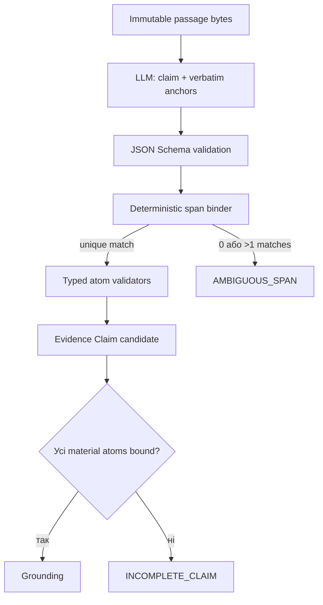
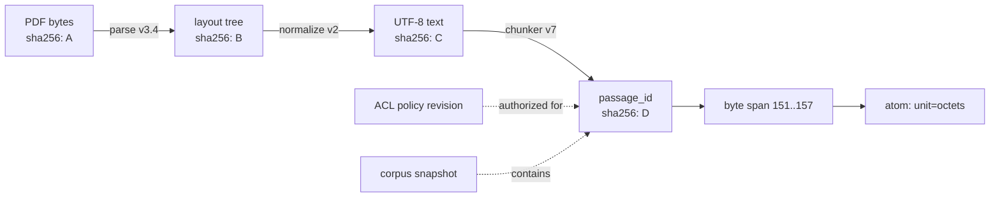
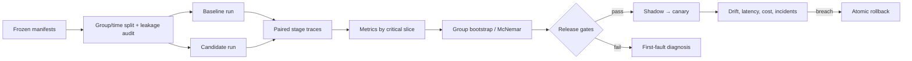
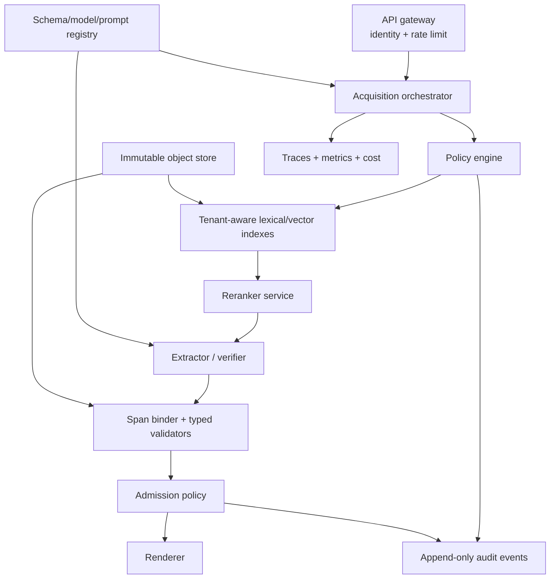
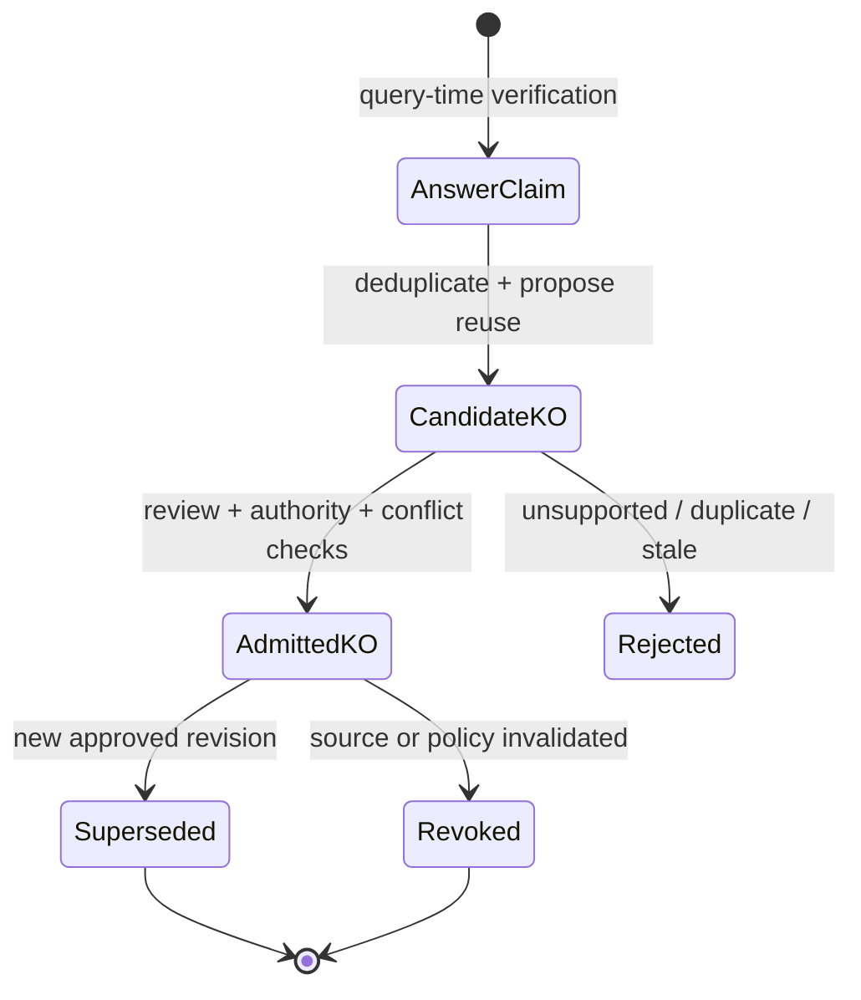

# Знайти замало: як експертна система перетворює людське запитання на доказову відповідь

> **Серія:** [Експертні системи для R&D](README.md) · стаття 13 із 22
> **Попередня стаття:** [12 — Як навчати експертну систему: знання, іспит і перевірка змін](12-How-Expert-Systems-Learn-UA.md)  
> **Наступна стаття:** [14 — Філософія для інженера експертних систем: що машина має право називати знанням](14-Philosophy-For-Expert-Systems-UA.md)  
> **Зміст серії:** [README](README.md)  
> **Рівень:** Applied ML / NLP Engineer: middle+  
> **Після статті:** реалізувати контур detection → extraction → grounding → verification для варіативного запиту.  
> **Подача матеріалу:** IR/NLP-терміни, проміжні представлення, recall/precision і відмова як штатний результат.

Уявімо невелику предметну експертну систему. Вона не повинна змагатися з
ChatGPT у знанні всього світу. Її завдання набагато вужче: прочитати
контрольований корпус технічних документів і відповідати на запитання, для яких
у цьому корпусі є доказ.

Користувач запитує: «Яка мінімальна довжина заголовка?» У документі справді є
відповідь. Пошук знаходить правильний документ і правильний фрагмент. У ньому є
і число, і одиниця вимірювання. Проте система відповідає лише: «8».

Число знайдено правильно, але відповідь неправильна. Вісім чого — бітів,
байтів, октетів, слів? Ба більше, користувач міг сформулювати ту саму потребу
інакше:

- «Яка мінімальна довжина заголовка?»
- «Підкажи, скільки місця займає заголовок».
- «Покажи в документі доказ його мінімальної довжини».
- «Чи правильно я розумію, що заголовок має довжину 8 октетів?»

Ці репліки відрізняються граматикою і комунікативною дією. Перша є прямим
питанням, друга — проханням, третя — запитом на доказ, четверта — запитом на
підтвердження. Але всі вони обертаються навколо одного предметного твердження.

Саме тут починається одна з найцікавіших проблем прикладної інженерії знань:
правильний пошуковий результат ще не є правильною відповіддю. Між ними працює
окремий процес здобуття знання — *knowledge acquisition*. У діалоговій системі
він має розпізнати знання у знайденому тексті, видобути його складові, зв'язати
їх із точним джерелом і перевірити повне твердження.

Ця стаття присвячена чотирьом складовим такого процесу:

1. **knowledge detection** — виявлення знання;
2. **knowledge extraction** — видобування знання;
3. **knowledge grounding** — прив'язування до доказу;
4. **knowledge verification** — перевірка підтримки твердження.

Це робоча інженерна декомпозиція query-time acquisition, а не єдина
стандартизована таксономія всієї дисципліни Knowledge Acquisition. У ширшому
сенсі до здобуття знань належать також робота з експертами, джерелами,
куруванням і життєвим циклом.

Я розгляну ці складові на матеріалі локальної діалогової експертної системи,
але без прив'язки до конкретного продукту. Найважливіший практичний урок цього
досвіду простий: не варто виправляти по одному запитанню, якщо система втрачає
саму структуру знання.

> **Межа між досвідом і проєктною пропозицією.** У практичному прототипі я
> спостерігав втрату одиниць, складених ідентифікаторів і нормативних
> кваліфікаторів уже після успішного пошуку. Сирі логи та корпус того запуску
> не публікуються, тому це **observed engineering snapshot**, а не
> відтворюваний науковий результат. Evidence Claim IR, формули, production
> gates і протокол оцінювання нижче — запропонований дизайн, який слід
> перевірити на власному корпусі до експлуатаційних тверджень.

## Де ця проблема розташована в загальній архітектурі

У [статті про систему здобуття знань](10-Knowledge-Acquisition-System-UA.md)
я розглядав ширший шлях: інвентаризацію джерел, розбір документів, тріаж,
класифікацію доступу, походження, курування, версіонування і відкликання. Там
головне питання звучало так: як перетворити неоднорідний масив документів на
контрольований матеріал для експертної системи?

Тут ми починаємо пізніше. Документ уже дозволений, розібраний, має версію,
ідентифікатор і точне походження. Пошук уже повернув невеликий фрагмент-доказ
(*passage*), який
може містити відповідь. Тепер треба перетворити цей фрагмент на коректне
твердження для конкретного запиту.

У [статті про типи баз знань](11-Knowledge-Base-Types-UA.md) я відділяв
пошуковий кандидат від результату виведення. Векторний або лексичний індекс
відповідає на питання «що схоже на запит?», але не встановлює істинність і не
визначає тип результату. Ця стаття продовжує саме ту думку: навіть правильний
пошуковий кандидат треба ще прочитати як доказ певного твердження.

Нарешті, у [статті про навчання експертної системи](12-How-Expert-Systems-Learn-UA.md)
розглянуто еталонні набори, правильні відмови, калібрування і пошук першого
несправного шару. Тут ці принципи стають практичною методикою: три
перефразування одного запиту повинні перевіряти одне й те саме знання, а збій
треба локалізувати між аналізом запиту, пошуком, detection, extraction,
grounding, verification і формуванням відповіді.

Отже, статті 10–12 відповідають на питання про постачання, представлення та
керовану зміну знань. Стаття 13 розбирає короткий, але складний відрізок між
людською реплікою і доказовою відповіддю.

На цьому відрізку «правильність» розпадається щонайменше на шість незалежних
властивостей:

| Властивість | Запитання до системи | Типова прихована помилка |
|---|---|---|
| Retrieval | Чи потрапив потрібний доказ у top-$k$? | правильний документ є, але не той passage або revision |
| Detection | Чи є у passage потрібне відношення? | згадка предмета помилково прийнята за відповідь |
| Extraction | Чи збережено повне твердження? | `8 octets` скорочено до `8` |
| Grounding | Чи кожен матеріальний атом має координати? | цитата правильна, але взята з іншої версії |
| Verification | Чи справді доказ підтримує claim? | не враховано negation, exception або scope |
| Admission | Чи має користувач право отримати доказ? | відповідь цитує passage з недоступного tenant або ACL |

Це і задає сюжет статті: не «додати ще один LLM-виклик», а побудувати контракт,
за яким кожен шар може довести свою частину результату або зупинити конвеєр.

## Чому людський запит є слабо формальним

Запит до реляційної бази має синтаксис. Запит до функції має сигнатуру. Вираз у
мові програмування розбирається за граматикою. Людська репліка не має такого
жорсткого контракту.

Користувач може пропустити суб'єкт, бо він зрозумілий із попередньої репліки:
«А його довжина?» Може вжити синонім: «розмір» замість «довжина». Може
сформулювати запит як дію: «Покажи мінімальне значення». Може вже запропонувати
відповідь і просити лише перевірки: «Це справді 8 октетів?» Може змішати в
одному реченні предметне питання і вимогу до форми: «Коротко поясни й наведи
дослівний доказ».

Тому діалогова система має розрізняти щонайменше три речі:

- **предмет запиту**: про який об'єкт або явище йдеться;
- **потрібне відношення**: довжина, призначення, причина, обмеження, авторство,
  залежність тощо;
- **комунікативна дія**: відповісти, показати, пояснити, підтвердити, порівняти
  або відмовитися за недостатності доказів.

Це не означає, що для кожної граматичної конструкції треба писати окремий
шаблон. Навпаки, нескінченне перерахування формулювань швидко перетворюється на
крихкий набір латок. Мовна модель корисна саме для розуміння перефразувань і
відновлення пропущеного контексту. Але результат її аналізу має бути не
«магічним наміром», а перевірюваною пропозицією: який предмет, яке відношення,
яка очікувана форма відповіді та який тип доказу потрібні.

## Два режими Knowledge Acquisition

Здобуття знань у такій системі відбувається у двох режимах.

**Offline, або ingest-time acquisition**, працює під час підготовки корпусу.
Система читає документи, відновлює структуру, виділяє фрагменти, зберігає
координати, мову, розділи, таблиці, статус і походження. За достатньої якості
вона може створювати кандидатів у структуровані об'єкти знань, але не повинна
автоматично проголошувати кожен модельний висновок фактом.

**Online, або query-time acquisition**, починається після запиту користувача.
Система знаходить релевантний фрагмент-доказ і видобуває з нього саме те знання, яке
потрібне зараз. Один і той самий абзац може підтримувати різні відповіді:
довжину поля, призначення прапорця, умову застосування або посилання на інший
документ.

Ці режими мають спільні контракти походження, але різні ризики. Під час ingest
небезпечна масова помилка: неправильне правило може зіпсувати тисячі
кандидатів. Під час query небезпечна контекстна помилка: система може знайти
правильний фрагмент, але відповісти не на те відношення або втратити частину
значення.

У цій статті основна увага приділена query-time acquisition. Саме там
варіативна людська мова зустрічається з точними байтами технічного документа.

## Чотири складові здобуття знання

Робочий конвеєр можна зобразити так:

```mermaid
flowchart LR
    Q["Репліка + діалоговий контекст"] --> QC["Query Contract"]
    ID["Identity, tenant, purpose"] --> ACL["ACL / policy filter"]
    QC --> ACL
    ACL --> RET["Hybrid retrieval"]
    RET --> RR["Reranking"]
    RR --> DET["Detection"]
    DET --> EXT["Extraction"]
    EXT --> GR["Grounding to immutable spans"]
    GR --> VER["Verification"]
    VER -->|supported| IR["Admitted Evidence Claim IR"]
    VER -->|contradicted / unknown| ABS["Abstain або уточнити"]
    IR --> REN["Deterministic rendering"]
    RET -. "passage_id + revision + ACL label" .-> GR
    REN --> ANS["Відповідь + доказ + provenance"]
```



Поділ потрібен не заради красивої схеми. Кожна стадія має інший клас помилок і
потребує іншого виправлення.

## Query Contract: перше типізоване представлення

Сирий рядок запиту не повинен бути спільним неявним API для всіх компонентів.
Перший модельний або rule-based крок має запропонувати версійний контракт:

```json
{
  "schema_version": "query-contract.v1",
  "subject": "transport header",
  "relation": "minimum length",
  "speech_act": "request_evidence",
  "answer_shape": "quantity",
  "constraints": {"revision_at": "2026-08-26"},
  "dialogue_refs": [],
  "security_context_ref": "authz-context:opaque-id"
}
```

Це **гіпотеза про намір**, а не доказ. Поле `security_context_ref` не можна
генерувати моделлю: його додає gateway після автентифікації. Так само модель не
має права довільно розширювати `tenant`, classification label, часову область
або множину дозволених джерел. JSON Schema чи типи protobuf корисні для
синтаксичної валідації, але семантичні інваріанти — наприклад, «запитане
підтвердження не є позитивним evidence» — перевіряє окремий policy layer.

Контракт також дозволяє явно розрізнити три результати аналізу:

1. `resolved` — subject, relation і shape достатньо визначені;
2. `needs_clarification` — бракує condition, revision або referent;
3. `unsupported_request` — система не має типу доказу чи повноваження для цієї
   дії.

Таким чином, невпевненість у слові «його» не перетворюється на випадковий
retrieval query.

## Retrieval і reranking: кандидат ще не є доказом

Перший retrieval stage повинен мати високий recall у межах **дозволеного**
корпусу. Для dense retrieval query і passage кодуються векторами
$\mathbf q,\mathbf d\in\mathbb R^m$, а косинусна схожість має вигляд:

```math
s_{\text{dense}}(q,d)=
\frac{\mathbf q^\top\mathbf d}{\lVert\mathbf q\rVert_2\lVert\mathbf d\rVert_2}.
```

Формула визначена лише для ненульових embedding-векторів. Zero vector,
`NaN` або невідповідна dimension мають блокувати candidate до ranking, а не
мовчки перетворюватися на score `0`.

Це score порядку, а не ймовірність істинності. Значення $0.84$ не означає
«84% доказу». Лексичний BM25 краще зберігає exact identifiers, коди вимог і
рідкісні терміни, dense retrieval — перефразування. Їхні score мають різні
шкали, тому без каліброваного learned fusion безпечніше об'єднати ранги через
Reciprocal Rank Fusion:

```math
s_{\text{RRF}}(d)=\sum_{r\in\mathcal R(d)}
\frac{1}{k_0+\mathrm{rank}_r(d)},
```

де $\mathcal R(d)$ — множина rank lists, у яких присутній $d$; відсутній у
списку passage не отримує штучного rank. $k_0$ — гіперпараметр, який
послаблює домінування одиничного високого рангу. Його значення треба
налаштовувати на development set, а не копіювати як універсальну константу.

Після coarse retrieval cross-encoder або instruction-tuned reranker оцінює
пару $(q,d)$ разом:

```math
s_{\text{rerank}}(q,d)=f_\theta([q;d]).
```

Він дорожчий за bi-encoder, тому production cascade зазвичай виглядає як
$N\gg k_r\ge k_e$: дешевий retriever повертає $N$ passage-ів, reranker залишає
$k_r$, а extraction отримує не більше $k_e$. Збільшення $N$ може підняти
recall, але водночас ростуть latency, cost і площа атаки через недовірені
фрагменти.

### ACL має передувати semantic ranking

Фільтр `tenant_id`, classification, purpose, validity interval та group claims
застосовується **до** формування дозволеного top-$k$. Post-filter після
глобального vector search небезпечний не лише витоком: недоступні passage-и
можуть витіснити доступні з top-$k$, і система хибно відмовиться. Cache key
повинен містити fingerprint authorization context, corpus snapshot, embedding
model і query normalization version:

```math
K_{cache}=H(q_{norm},\ authz_{fp},\ corpus_v,\ embed_v,\ ranker_v).
```

Не варто класти до ключа сирі токени доступу або персональні claims. Потрібен
стабільний непрозорий fingerprint, строк життя не довший за policy decision і
негайна invalidation після revocation.

## Knowledge detection: чи є тут потрібне знання

Knowledge detection відповідає на питання: чи містить фрагмент-доказ твердження,
здатне відповісти на запит?

Це складніше за пошук однакових слів. У запиті може бути «розмір», а у джерелі
— «довжина». Користувач може запитати «хто замінює цей документ?», а текст
сформулює зв'язок пасивно: «цей документ був замінений документом X».
Потрібне значення може бути записано словом `eight`, хоча користувач очікує
цифру `8`.

Водночас семантична схожість не є достатнім критерієм. Passage може згадувати
потрібний термін, але говорити про історію, приклад, виняток або інший об'єкт.
Він може містити число `8`, але це буде номер рисунка. Детектор повинен
запропонувати не просто «релевантно», а повний змістовний каркас:

```text
subject: transport header
relation: minimum length
answer shape: number + unit
candidate evidence: passage P
```

На цьому етапі ще не можна оголошувати відповідь. Detection лише встановлює,
що у фрагменті є кандидат на потрібне твердження.

Формально це можна подати як трикласову задачу:

```math
\hat y_{det}=\arg\max_{y\in\{present, absent, ambiguous\}}
p_\theta(y\mid q,d,Q_c),
```

де $Q_c$ — Query Contract. Клас `present` означає не «passage схожий», а
«passage містить material, з якого можна видобути claim потрібної форми».
`ambiguous` потрібен окремо: інакше умова, розірвана межею chunk-а, або два
значення для різних revision насильно стануть positive чи negative.

У production detection оптимізують не ізольовано. Якщо пропустити доказ тут,
наступні стадії його вже не відновлять, тому для критичних slices важливий
recall. Але надмірний recall збільшує число дорогих extraction/verification
викликів. Корисна операційна ціль має враховувати обидва наслідки:

```math
J_{det}=\lambda_{fn}FN+\lambda_{fp}FP+
\lambda_{tok}Tokens+\lambda_{ms}Latency,
```

де ваги $\lambda$ задає use case, а не модель. Це cost function, не
універсальна метрика якості.

Практично корисно вимагати від детектора негативного результату з причиною:
предмет не знайдено, відношення не підтримано, фрагмент лише згадує термін,
доказ суперечливий або потрібний контекст виходить за межі доступного
фрагмента. Такий результат значно корисніший за довільний низький confidence.

## Knowledge extraction: з яких частин складається твердження

Knowledge extraction перетворює знайдений зміст на структуровану пропозицію.
Для простого технічного факту вона може мати форму:

```text
subject   = transport header
relation  = minimum length
value     = 8
unit      = octets
qualifier = minimum
```

Тут виникає характерна проблема: складові можуть бути рознесені у фрагменті.
Одиницю вимірювання автор назвав на початку речення, число — наприкінці,
суб'єкт — у заголовку таблиці, а умову — в попередньому реченні. Якщо взяти
лише найближчий числовий токен, система отримає синтаксично допустиме, але
змістовно неповне значення.

Інші форми знання ще виразніше показують обмеження «витягни число»:

- `10.0.0.0/8` є структурованим мережевим префіксом, а не числом `10`;
- `Document 107` є кваліфікованим ідентифікатором, а не числом `107`;
- `absolute requirement` є текстовою категорією, а не пояснювальним абзацом;
- багаторядкова граматика або таблиця є одним значенням, яке не можна
  безпечно склеїти з випадкових рядків;
- довгий хеш, OID, UUID чи апаратна константа втрачає сенс після скорочення.

Тому видобування має зберігати **повне твердження**, а не лише типізоване
значення. Структура `subject–relation–value–unit` не є універсальною онтологією
для всієї людської мови, але це корисне проміжне представлення для багатьох
технічних запитів. Для пояснення воно може містити тезу і функцію, для
порівняння — два предмети та критерій, для процедури — умови й послідовність
кроків.

Мовна модель добре пропонує таку структуру, бо розуміє перефразування і
синтаксичні залежності. Проте вона не повинна сама призначати авторитетні
координати або вигадувати відсутню одиницю. Її результат — кандидат, який
перевіряє керівна програма.

Extraction доцільно обмежити schema-guided generation: закриті enums для
`relation`, `atom.kind`, `modality` і `verification.status`; явні `null`, якщо
значення відсутнє; заборона additional properties у критичному контракті.
Граматично валідний JSON не гарантує семантики, але прибирає цілий клас
парсерних помилок. Після генерації deterministic binder має повторно знайти
кожен `raw` span у дозволеному immutable passage.



Не всі поля однаково матеріальні. Для quantity `value`, `unit`, subject,
relation і qualifier можуть бути material, а локалізований display label —
похідним. Нехай $A_m(C)$ — множина material atoms claim-а, а $b(a)$ —
перевірене прив'язування атома. Тоді structural completeness:

```math
Comp(C)=\frac{\sum_{a\in A_m(C)} w_a\,\mathbb 1[b(a)\neq\varnothing]}
{\sum_{a\in A_m(C)}w_a}.
```

Контракт вимагає $A_m(C)\neq\varnothing$ і $w_a>0$; інакше $Comp$ не
визначений, а claim є schema-invalid, а не «повним».

Для admission прямої нормативної відповіді недостатньо $Comp=0.8$ — потрібне
$Comp=1$. Ваги корисні для діагностики, але не повинні виправдовувати втрату
одиниці або умови.

## Knowledge grounding: де саме це написано

Grounding, або доказове прив'язування, зв'язує кожну суттєву складову
твердження з незмінним джерелом. Тут цей термін має вужче значення, ніж
загальне «пов'язування символу зі світом»: ідеться саме про відтворюваний
зв'язок відповіді з документальним доказом. Недостатньо зберегти URL або назву файла. Документ міг змінитися, а однакова
фраза могла трапитися кілька разів. Для відтворюваної відповіді потрібні:

- ідентичність документа та його версії;
- ідентичність фрагмента-доказу;
- точні byte ranges або інша явно названа система координат;
- сирі байти доказу;
- криптографічний хеш;
- зв'язок між складовою твердження і конкретним фрагментом;
- інформація про перетворення, якщо текст отримано з PDF, HTML або OCR.

Важливо, що координати належать керівній програмі, а не мовній моделі. Модель може
повернути дослівні рядки й ролі: «це значення», «це одиниця», «це відношення».
Програма повинна знайти їх у незмінному фрагменті, перевірити однозначність,
обчислити координати і хеш.

Якщо фрагмент `eight` зустрічається двічі, а модель не дала достатнього
контексту для однозначного зв'язування, це не дрібна технічна незручність. Це
причина не допустити відповідь. Обрати перший збіг означало б перетворити
випадковий порядок тексту на приховане джерело істини.

Grounding також не дозволяє непомітно поєднати число з одного документа та
одиницю з іншого. Для прямої фактологічної відповіді всі матеріальні складові
мають належати одному доказовому контексту. Кілька джерел можна використати для
порівняння або синтезу, але тоді відповідь повинна явно складатися з кількох
тверджень із власними доказами.

### Provenance — це ланцюг перетворень, а не поле `source_url`

PDF page, OCR text, normalized Markdown і passage — різні entities. Якщо
координати належать normalized text, система не повинна показувати їх як
позиції в оригінальному PDF. Для кожного перетворення потрібні input/output
hash, tool version, parameters і timestamp. Ця модель узгоджується з базовими
поняттями W3C PROV — Entity, Activity, Agent — але production schema може бути
значно меншою.



Практичний content identifier можна визначити як

```math
passage\_id=H(document\_id,revision,transform\_chain,byte\_start,byte\_end,
passage\_bytes).
```

$H$ тут застосовується не до неоднозначної конкатенації рядків, а до
domain-separated canonical length-delimited serialization усіх полів; назва й
версія hash/serialization входять до контракту. Інакше різні tuples можуть
мати однаковий byte stream ще до обчислення хешу.

Якщо змінюється parser, normalization або chunker, derived passage отримує
нову ідентичність навіть за схожого display text. Інакше стара citation може
мовчки вказати на новий контент. Координатний контракт також має явно назвати
UTF-8 byte offsets, Unicode code points, grapheme clusters або PDF bounding
boxes. Змішування цих систем особливо швидко ламається на українських літерах,
combining marks і OCR.

## Knowledge verification: чи доказ підтримує повне твердження

Перевірка ставить найважливіше питання: чи підтримує знайдений доказ не
окремий токен, а все твердження?

Якщо у фрагменті є число `8`, це ще не доводить, що мінімальна довжина заголовка
дорівнює 8 октетам. Треба перевірити одночасно:

- той самий суб'єкт;
- потрібне відношення;
- значення та одиницю;
- модальність і кваліфікатор: `minimum`, `maximum`, `recommended`, `required`;
- відсутність заперечення;
- умови застосування;
- відсутність невирішеного конфлікту з іншим значенням у тому самому
  доказовому вікні.

Особливо небезпечне найближче слово. Якщо поруч із числом стоїть `octets`,
детермінований алгоритм може спокуситися автоматично приєднати одиницю. Але в
технічному тексті поруч можуть описувати кілька полів із різними одиницями,
виняток або заперечення: «значення не дорівнює 8 octets». Лексична близькість
допомагає знайти кандидата, але не встановлює семантичного зв'язку.

Тут мовна модель знову корисна: вона може оцінити, чи повне твердження випливає з
обмеженого доказового вікна. Проте керівна програма має перевірити незмінність вхідних
байтів, повноту обов'язкових полів і допустимість рішення. Модель відповідає за
мовну семантику; програма — за цілісність доказу й безпечний допуск.

Наукові фреймворки оцінювання RAG рухаються в тому самому напрямку. FActScore
розкладає довгу відповідь на атомарні факти й перевіряє їх відносно джерела.
RAGChecker використовує перевірку підтримки на рівні окремих тверджень
(*claim-level entailment*) для окремої діагностики пошуку
та генерації. ALCE відділяє коректність відповіді від якості цитування. Для
інженерної системи це не готові промислові компоненти, а важливий принцип:
добра цитата і правильне твердження — пов'язані, але не тотожні властивості.

### Claim–evidence support як контракт рішення

Нехай claim $C=\{a_1,\ldots,a_n\}$, а $E$ — дозволене evidence window.
Verifier повинен повернути не довільний `confidence`, а щонайменше три стани:

```math
y_{ver}\in\{entailed, contradicted, unknown\}.
```

`Unknown` охоплює неповний доказ, невирішену кореференцію, відсутню умову та
недостатній контекст. NLI-модель або LLM-as-judge може оцінювати
$p_\theta(y_{ver}\mid C,E)$, але її logit чи self-reported confidence не є
гарантією. Якщо score використовується для порогу, його калібрують на окремому
calibration set, наприклад temperature scaling:

```math
p_T(y\mid C,E)=\mathrm{softmax}(z(C,E)/T)_y,
```

де $T$ навчають **без** sealed confirmation set. Навіть після калібрування
semantic score не замінює hard invariants. Для події «claim підтриманий»
калібрування можна контролювати Brier score і reliability diagram:

```math
BS=\frac{1}{N}\sum_{i=1}^{N}(p_i-y_i)^2.
```

Тут $N>0$, $p_i$ — calibrated probability саме події «claim підтриманий», а
$y_i\in\{0,1\}$. ECE теж корисна, але залежить від binning, тому одна цифра
ECE не повинна бути
єдиним release criterion. Безпечне правило admission можна записати так:

```math
Admit(C,E,u,t)=I_{authz}(C,E,u,t)\land I_{integrity}\land[Comp(C)=1]
\land[y_{ver}=entailed]\land[p_T(entailed)\ge\tau]
\land\neg I_{unresolved\ conflict}.
```

Authorization перевіряється fail closed для поточного principal $u$, purpose,
operation і моменту $t$ не лише перед retrieval, а й перед фінальним admission:
за довгий запит policy могла змінитися або decision — протермінуватися.
Classification відповіді має успадковувати join labels **усіх** inputs
derivation, включно з прихованим context, а не лише показаних citations.

Тут немає множення «confidence retrieval × confidence LLM»: такі величини
зазвичай не калібровані до однієї події й не незалежні. Retriever score
відбирає кандидата; verifier оцінює support; deterministic predicates
допускають або блокують результат.

## Rendering: формування відповіді не повинно знищити здобуте знання

Після перевірки система ще може зіпсувати відповідь під час її формування
(*rendering*).
Наприклад, внутрішній запис правильно містить `value=8` та `unit=octets`, але
шаблон показує лише поле `value`. Або мережевий префікс розбивається на число,
крапки й риску, після чого модуль залишає тільки перший токен.

Тому формування відповіді варто розглядати як окрему стадію після Knowledge
Acquisition. Воно має зберегти всі матеріальні складові перевіреного твердження і
виконати комунікативну дію користувача:

- на пряме питання — дати значення з потрібною одиницею;
- на прохання «покажи» — подати значення і фрагмент;
- на запит доказу — додати точну цитату та посилання;
- на підтвердження — сказати «так», «ні» або «недостатньо доказів», а потім
  пояснити підставу;
- на пояснювальне питання — передати не лише назву або число, а визначальну
  функцію, умову чи причинний зв'язок.

Модуль формування відповіді не повинен заново вгадувати зміст. Він працює з уже перевіреним
проміжним представленням.

## Чого тут можна навчитися у компіляторів

Компілятор не намагається одразу виконати сирий текст програми. Спочатку lexer
виділяє токени з позиціями у джерелі. Parser будує структуру. Семантичний аналіз
перевіряє типи та зв'язки. Проміжне представлення (*Intermediate
Representation*, IR) відділяє вихідний синтаксис від подальшого виконання.

Для технічної природної мови корисна подібна, але значно скромніша схема:

```text
immutable passage
    → source-backed atoms
    → Evidence Claim IR
    → semantic verification
    → deterministic rendering
```

Атомами можуть бути число, одиниця, мережевий префікс, кваліфікований
ідентифікатор, точна фраза, багаторядковий блок або довга константа. Кожен атом
зберігає сирий текст, роль, координати і parser version. Нормалізоване значення
`eight → 8` може бути окремим похідним полем, але координати завжди вказують на
сирі байти `eight`.

Аналогія має чітку межу. Природна мова не є мовою програмування з повною
формальною граматикою. Малий lexer може впізнати форму IP-префікса, але не може
довести, що цей префікс є відповіддю на питання. Sentence boundary може
показати межу речення, але не встановлює причинний зв'язок. ABNF-parser може
перевірити формальний синтаксис усередині документа, але не пояснить його
призначення користувачу.

Тому не потрібен великий універсальний NLP-конвеєр. Практичний мінімум — малий
детермінований scanner для кількох технічних форм, Unicode-aware boundaries і
стандартні валідатори для структурованих значень. Семантичні ролі та
еквівалентність перефразувань залишаються завданням мовної моделі.

## Мінімальне проміжне представлення доказового твердження

Проміжне представлення доказового твердження (*Evidence Claim IR*) не повинно
перетворитися на нову всеохопну онтологію. Для першої версії достатньо
зберігати повне твердження та атоми, прив'язані до джерела. Нижче наведено
умовний, а не взятий із конкретної реалізації приклад.

```json
{
  "schema_version": "evidence-claim.v2",
  "claim_id": "claim:content-addressed-id",
  "claim": {
    "subject": "transport header",
    "relation": "minimum_length",
    "modality": "required",
    "scope": {"condition": null},
    "answer_surface": "8 octets",
    "material_atom_ids": ["a-subject", "a-relation", "a-value", "a-unit"]
  },
  "source": {
    "document_id": "document:stable-id",
    "revision_id": "revision:content-hash",
    "passage_id": "passage:stable-id",
    "passage_sha256": "...",
    "corpus_snapshot": "corpus:2026-08-26.1",
    "transform_chain_id": "transform-chain:sha256:..."
  },
  "atoms": [
    {
      "atom_id": "a-subject",
      "role": "subject",
      "kind": "exact_text",
      "raw": "transport header",
      "coordinate_system": "utf8-bytes",
      "byte_start": 177,
      "byte_end": 193
    },
    {
      "atom_id": "a-relation",
      "role": "relation",
      "kind": "relation_phrase",
      "raw": "minimum length",
      "coordinate_system": "utf8-bytes",
      "byte_start": 194,
      "byte_end": 208
    },
    {
      "atom_id": "a-value",
      "role": "value",
      "kind": "number",
      "raw": "eight",
      "canonical": "8",
      "coordinate_system": "utf8-bytes",
      "byte_start": 319,
      "byte_end": 324
    },
    {
      "atom_id": "a-unit",
      "role": "unit",
      "kind": "unit",
      "raw": "octets",
      "canonical": "octet",
      "coordinate_system": "utf8-bytes",
      "byte_start": 151,
      "byte_end": 157
    }
  ],
  "support_window": {
    "byte_start": 133,
    "byte_end": 389
  },
  "authorization": {
    "decision_id": "policy-decision:opaque-id",
    "policy_revision": "policy:42",
    "subject_context_fingerprint": "authz-fp:...",
    "operation": "read_and_derive",
    "purpose": "answer_query",
    "decision_expires_at": "2026-08-26T12:00:00Z",
    "output_label": "project-internal"
  },
  "runtime": {
    "query_contract_version": "query-contract.v1",
    "retrieval_manifest": "retrieval-manifest:sha256:...",
    "embedding_model_version": "embedder:sha256:...",
    "reranker_version": "reranker:sha256:...",
    "extractor_version": "extractor:sha256:...",
    "binder_version": "binder:git:...",
    "verifier_version": "verifier:sha256:..."
  },
  "verification": {
    "status": "entailed",
    "calibrated_support": 0.93,
    "calibration_version": "support-calibration:7",
    "reason_codes": []
  }
}
```

Цей приклад показує важливу властивість: одиниця і значення не зобов'язані стояти
поруч, але обидва належать одному фрагменту і одному перевіреному твердженню.
Система не склеює їх за відстанню — вона перевіряє їхні ролі в повному твердженні.

`calibrated_support` у прикладі є **полем форми**, а не заявленим результатом
конкретної моделі. У реальній системі його не можна заповнювати константою чи
self-report моделі. Контракт має бути машинно валідованим, а міграція v1 → v2
— явною. Consumer, який знає лише v1, повинен відхилити невідому major version,
а не мовчки загубити `scope`, ACL або `runtime`.

Мінімальні інваріанти IR:

| Інваріант | Навіщо |
|---|---|
| Кожен `material_atom_id` існує рівно один раз | не допустити неповний claim |
| `raw == passage_bytes[start:end]` | довести span, а не довіряти JSON |
| `passage_sha256` збігається з object store | виявити version skew або mutation |
| authorization decision покриває principal fingerprint, purpose/operation, document revision і не протерміноване | не переносити ACL між користувачами, діями, версіями або моментами часу |
| `output_label` не нижчий за join labels усіх derivation inputs | не відмити restricted evidence через переказ без citation |
| `support_window` містить усі atom spans | verifier бачив матеріальний доказ |
| `entailed` несумісний із blocking reason code | не допустити суперечливий стан |
| renderer приймає лише admitted schema version | не генерувати з candidate IR |

## Типові форми знання і їхні пастки

| Форма відповіді | Що треба зберегти | Типова неправильна відповідь |
|---|---|---|
| Число з одиницею | значення, одиницю, предмет, відношення, кваліфікатор | `8` замість `8 octets` |
| Структурований префікс | усю послідовність і її тип | `10` замість `10.0.0.0/8` |
| Ідентифікатор документа | namespace, номер і relation frame | `107` без назви простору або неправильний документ |
| Точна текстова фраза | дослівний діапазон і повне твердження | переказ, який змінює модальність |
| Багаторядкове значення | точний блок, переноси рядків і хеш | склеєні або переставлені рядки |
| Довга константа | повний токен, довжину і хеш | скорочений префікс константи |

Ця таблиця не є переліком усіх типів знань. Вона лише покриває форми, для яких
помилка фрагментації найчастіше виглядає правдоподібною.

## Коли система повинна відмовитися

Fail-closed поведінка не означає відповідати «не знаю» на все складне. Вона
означає мати конкретні умови, за яких доказ не допускається.

Для прямої фактологічної відповіді варто відмовитися або попросити уточнення,
якщо:

- дослівний фрагмент не знайдено в незмінному джерелі;
- однаковий фрагмент трапляється кілька разів і його неможливо однозначно
  зв'язати;
- значення й одиниця походять із різних джерел;
- у фрагменті є кілька значень для різних умов, а запит не визначає умову;
- твердження заперечене або наведене лише як неправильний приклад;
- два чинні джерела суперечать одне одному;
- відповідь потребує частини структурованого значення, але знайдено лише його
  підрядок;
- документ доступний, але його статус або область чинності не дозволяють
  використати його як доказ.

Відмова має машинний reason code і безпечне людське пояснення. Наприклад,
`NO_EVIDENCE`, `AMBIGUOUS_SCOPE`, `CONFLICTING_SOURCES`, `INCOMPLETE_CLAIM`,
`PROVENANCE_MISMATCH`, `POLICY_DENIED`, `DEADLINE_EXCEEDED`. Внутрішнє
`POLICY_DENIED` не повинно розкривати назву чи існування недоступного документа;
користувачеві достатньо нейтрального повідомлення про відсутність дозволеного
доказу. `AMBIGUOUS_SCOPE`, навпаки, має породити конкретне уточнення — revision,
variant, jurisdiction або operating mode.

Запит на підтвердження потребує окремої обережності. Питання «Це справді 8
октетів?» уже містить пропоновану відповідь. Якщо модель просто повторить
число з питання, система створить ілюзію перевірки. Тому candidate answer із
репліки користувача не може бути доказом. Спочатку треба незалежно знайти й
перевірити твердження у джерелі, а лише потім порівняти його з припущенням.

## Практичне спостереження і як перетворити його на експеримент

В одному локальному циклі прототип стабільно проходив знайомі paraphrase cases,
але на нових формах значення проявилися три повторювані дефекти:

1. `eight octets` перетворювалося на голе `8`;
2. повний префікс перетворювався на перше число `10`;
3. текстова нормативна категорія маршрутизувалася як explanation або
   identifier.

Це **практичне спостереження автора**, а не опублікований experiment: у статті
немає corpus snapshot, raw outputs, model digest, prompts, seeds і незалежної
розмітки, потрібних для перевірки числових результатів. Тому я не подаю тут
відсотки чи конструкцію «спочатку 9/9, потім 0/9» як доказ узагальнення.
Висновок обмежений локалізацією класу дефекту: правильний passage міг бути
втрачений між extraction, verification і rendering.

Щоб перевірити цю гіпотезу відтворювано, слід зафіксувати протокол:

1. content-addressed corpus snapshot і ACL snapshot;
2. frozen query groups за knowledge object, value shape і speech act;
3. manifest усіх model/tokenizer/prompt/parser/ranker versions;
4. raw response та stage trace для кожного case;
5. до зміни — baseline run, після зміни — paired candidate run;
6. незалежну adjudication розбіжностей двома фахівцями;
7. release criteria до перегляду результатів.

Порівнювати треба не «старий prompt на відомих дев'яти» з «новим prompt на
тих самих дев'яти», а paired outputs на sealed knowledge groups. Інакше кожна
ітерація перетворює test set на development set.

## Як тестувати варіативні запити системно

Один факт треба перевіряти не одним реченням, а групою семантично еквівалентних
реплік. Мінімальний набір із трьох форм може містити:

1. пряме питання;
2. прохання або розмовне формулювання;
3. запит на доказ чи підтвердження.

Наприклад:

```text
V1: Яка мінімальна довжина transport header?
V2: Підкажи, скільки октетів мінімально займає transport header.
V3: Покажи доказ мінімальної довжини transport header.
```

Група проходить перевірку лише тоді, коли всі варіанти зберігають те саме
предметне твердження, правильне джерело і коректний діапазон доказу. Це суворіше,
ніж порахувати середню точність окремих запитів, але саме так вимірюється
стабільність діалогу.

Для кожної невдачі варто фіксувати **першу несправну стадію**:

| Стадія | Діагностичне питання |
|---|---|
| Query analysis | Чи правильно визначено subject, relation, expected shape і speech act? |
| Retrieval | Чи потрапив доказовий фрагмент до кандидатів? |
| Detection | Чи розпізнано у фрагменті потрібне твердження? |
| Extraction | Чи збережено всі матеріальні складові? |
| Grounding | Чи кожна складова має точне однозначне джерело? |
| Verification | Чи підтримує доказ повне твердження без конфлікту й заперечення? |
| Rendering | Чи фінальна відповідь не втратила перевірені складові? |

Ця класифікація не дає команді виправляти все одразу. Якщо пошук не знайшов
фрагмента, немає сенсу змінювати модуль відповіді. Якщо правильний фрагмент уже знайдено,
не треба без доказів перебудовувати весь індекс. Якщо IR містить одиницю, але
відповідь його втратила, проблема не в мовному розумінні.

Тестовий набір також має перетинати дві осі:

- **форми значення**: число з одиницею, префікс, ідентифікатор, фраза,
  багаторядковий блок, довга константа;
- **комунікативні дії**: питання, прохання, запит доказу, підтвердження.

Така матриця краще виявляє узагальнення, ніж десятки варіацій одного
документа. Після виправлення відомі випадки стають regression tests. Незалежне
приймання треба проводити на інших, ще не розкритих групах.

### Split без leakage

Одиниця split-а — не query string і не chunk, а **knowledge group**: твердження,
усі його paraphrases, document family, revisions, translations, OCR/Markdown
derivatives і синтетичні Q&A. Якщо сусідні chunk-и однієї вимоги потрапили у
train та confirmation, система фактично бачила відповідь. Тому використовують
group-aware split, а для сценарію оновлення знань — time-based split: усі
revision після дати $t_0$ залишаються поза development.

Leakage audit має поєднувати exact hashes, нормалізовані near-duplicates
(наприклад, MinHash) і embedding neighbors з ручним переглядом найближчих пар.
Embedding similarity сама не доводить leakage, але добре формує чергу на
перевірку. Після того як sealed case відкрили для діагностики, він переходить
до regression suite; для наступного незалежного підтвердження потрібні нові
groups.

### Метрики за стадіями, а не один «accuracy»

Для retrieval gold unit має бути evidence span або допустима множина passage-ів,
а не тільки document ID. Нехай
$Q_+=\{q\in Q\mid |G_q|>0\}$ — непорожня множина answerable queries із
непорожнім gold evidence, а $R_k(q)$ — top-$k$. Наявність хоча б одного
потрібного доказу вимірює $Hit@k$:

```math
Hit@k=\frac{1}{|Q_+|}\sum_{q\in Q_+}
\mathbb 1[G_q\cap R_k(q)\neq\varnothing].
```

Якщо для повного твердження потрібно знайти кілька доказів, ця метрика надто
поблажлива. Тоді потрібен власне recall множини evidence:

```math
Recall@k=\frac{1}{|Q_+|}\sum_{q\in Q_+}
\frac{|G_q\cap R_k(q)|}{|G_q|}.
```

Unanswerable queries не додають із порожнім denominator до цих двох метрик:
для них окремо оцінюють false-answer і коректність abstention/clarification.

Коли релевантних passage-ів кілька і важливий порядок, додають nDCG@k або MRR,
але ці IR-метрики не бачать втраченої одиниці у фінальній відповіді.

Для claim-level evaluation після ручної або adjudicated декомпозиції відповіді
на атомарні твердження:

```math
ClaimPrecision=\frac{|C_{out}^{supported}|}{|C_{out}|},\qquad
ClaimRecall=\frac{|C_{gold}\cap C_{out}^{supported}|}{|C_{gold}|}.
```

Ці частки визначені для answerable cases із $|C_{gold}|>0$; precision також
вимагає $|C_{out}|>0$. Порожній output є abstention і входить до
risk–coverage/abstention metrics, а не отримує довільний precision `0` або `1`.

Потрібно наперед визначити правило semantic matching; не можна дозволити judge
довільно міняти гранулярність claim-ів між системами. Grounding оцінюють
окремо:

```math
GroundingCompleteness=
\frac{|A_{material}^{correct\ span}|}{|A_{material}^{gold}|},
```

де $|A_{material}^{gold}|>0$ є інваріантом answerable gold claim.

Citation correctness — частка citation links, чиї passage-и справді
підтримують відповідний claim. Висока completeness з неправильною citation і
правильна citation з неповним claim — різні відмови.

End-to-end success для case — кон'юнкція, а не середнє:

```math
Success_i=I_{query}\,I_{retrieve}\,I_{extract}\,I_{ground}\,
I_{verify}\,I_{render}\,I_{authz}.
```

Якщо будь-який множник нуль, користувач не отримав доказової відповіді. Для
групи перефразувань $V_g$ корисно виміряти сувору invariance:

```math
GroupPass=\frac{1}{|G|}\sum_{g\in G}\prod_{i\in V_g}Success_i.
```

Тут $G\neq\varnothing$ і кожна група $V_g\neq\varnothing$; порожня група не
повинна автоматично «проходити» через empty product.

Вона жорстка, тому поруч треба показувати per-stage metrics і slices: value
shape, speech act, мова, source type, OCR quality, revision status,
classification та known/unknown answerability.

### Відмова теж потребує метрики

Нехай $c_i$ — калібрований score події «відповідь буде повністю підтримана»,
$N>0$ — кількість evaluation cases, а $\tau$ — поріг admission. Тоді:

```math
Coverage(\tau)=\frac{1}{N}\sum_i\mathbb 1[c_i\ge\tau],
```

```math
SelectiveRisk(\tau)=
\frac{\sum_i\ell_i\mathbb 1[c_i\ge\tau]}
{\sum_i\mathbb 1[c_i\ge\tau]}.
```

За нульового coverage risk не дорівнює нулю — він не визначений. Потрібна
risk–coverage curve, окрема false-answer rate для unanswerable queries і
частка коректних clarification requests. Поріг вибирають на calibration set і
заморожують до confirmation run.

### Статистична й експлуатаційна невизначеність

Результати варто порівнювати paired bootstrap **на рівні knowledge groups**, а
не окремих paraphrases; інакше довірчий інтервал буде надто вузьким через
залежні приклади. Для binary paired outcomes доречний McNemar test, але
$p$-value не замінює practical margin. Перед gate усі deltas переводять у
напрям «більше — краще»: для quality $\Delta=m_{candidate}-m_{baseline}$, а
для risk, latency і cost — $\Delta=m_{baseline}-m_{candidate}$. Тоді release
gate може вимагати:

```math
\bigwedge_{m,s}LCB_{95\%}(\Delta_{m,s})\ge-\delta_{m,s}
\quad\land\quad blocking\_failures=0,
```

де $s$ — критичний slice, $m$ — метрика, $\delta$ — наперед узгоджена допустима
регресія. Для ACL bypass, provenance mismatch і відповіді на contradicted
evidence допустима кількість confirmation failures дорівнює нулю; це не
означає доведену нульову ймовірність відмови в популяції.



## Мінімальна практична архітектура

Для локальної системи, здатної працювати на центральному процесорі, не
обов'язково будувати важкий конвеєр обробки природної мови.
Достатній перший варіант може складатися з п'яти компонентів.

**1. LLM як інтерпретатор мови.** Вона визначає предмет, relation,
комунікативну дію, пропонує повне твердження, дослівні опорні сегменти і ролі
атомів. Вона ж оцінює еквівалентність перефразувань і семантичну підтримку в
обмеженому доказовому вікні.

**2. Лексичний і семантичний пошук.** Він повертає невеликий набір
фрагментів з ідентичністю документа, контекстом розділу і стабільними
ідентифікаторами доказів.

**3. Малий детермінований зв'язувач і lexer.** Він знаходить запропоновані дослівні
рядки в immutable bytes, перевіряє однозначність, визначає byte spans і
розпізнає лише кілька закритих форм: числа, одиниці, prefixes, qualified IDs,
exact text, multiline blocks і constants.

**4. Evidence Claim IR.** Він зберігає повне твердження, прив'язані до джерела
атоми, доказове вікно, хеші й результат перевірки. Це межа між недетермінованим
мовним розумінням і детермінованим допуском.

**5. Безпечний допуск і модуль формування відповіді.** Керівна програма не
дозволяє експертну відповідь, якщо обов'язковий атом не зв'язаний, твердження
не підтверджене або provenance порушено. Renderer формує відповідь лише з
допущеного IR.

Такий розподіл не робить LLM зайвою. Навпаки, він залишає їй те, що вона робить
найкраще: розуміння варіативної мови, відношень і перефразувань. Детермінований
код отримує те, що можна й треба перевіряти точно: байти, координати, типи,
хеші, цілісність і правила допуску.



Це не вимога розносити кожен блок у власний microservice. Для локальної
системи вони можуть бути модулями одного процесу. Межі потрібні логічно:
extractor не отримує credentials до всього corpus; renderer не читає raw
retrieval context; model registry не змінюється посеред запиту; audit event не
містить зайвий секретний текст.

## Failure modes: від помилки моделі до порушення межі довіри

Недовірений документ є **даними**, а не частиною system prompt. Рядок «ignore
previous instructions» усередині retrieved passage не стає командою. Це
особливо важливо для external HTML, tickets, e-mail та vendor PDFs: indirect
prompt injection може потрапити до контексту саме через retrieval.

| Failure mode | Що бачить користувач | Production control |
|---|---|---|
| Indirect prompt injection | відповідь виконує інструкцію з документа | відокремлений data channel, instruction detection, tool deny-by-default, red-team corpus |
| Corpus poisoning | атакувальний passage витісняє авторитетне джерело | source admission, signatures/hashes, trust tier, anomaly review |
| Cross-tenant retrieval | коректна, але чужа відповідь | pre-filter ACL, tenant-scoped index або verified filter, negative auth tests |
| Cache key omission | відповідь пережила revocation | authz fingerprint + policy revision у key, bounded TTL, invalidation |
| Version skew | citation не відповідає показаному тексту | atomic snapshot manifest, content IDs, rollback усієї dependency closure |
| Evidence laundering | нечинний draft подано як норму | authority/status/validity predicates, conflict policy |
| Context overflow | втрачено умову чи заперечення | evidence packing із span preservation, token budget і truncation tests |
| Cost/latency amplification | запит породжує сотні judge calls | bounded fan-out, deadline propagation, quotas, graceful abstention |
| Logging leak | секретний passage опинився у trace | field-level redaction, access-controlled audit, retention policy |

Instruction detector знижує ризик, але не створює доказ безпеки. Модельний
фільтр також можна обійти; тому retrieved text не повинен діставати нові tools,
змінювати policy context або керувати routing без незалежної перевірки.

## Latency і cost — частина якості відповіді

Для послідовного critical path грубий budget має вигляд:

```math
T_{e2e}=T_{gateway}+T_{retrieval}+T_{rerank}+T_{extract}+
T_{bind}+T_{verify}+T_{render}+T_{queue}.
```

Середнє приховує tail latency, тому release SLO задають через p50/p95/p99 і
окремо для cache hit/miss, answer/abstain та різних source types. Deadline має
передаватися вниз по стеку: verifier, який завершився після тайм-ауту клієнта,
створює cost без цінності.

Якщо coarse retrieval повертає $N$ passage-ів, reranker залишає $k_r$, а
extractor/verifier перевіряє $k_e\le k_r$, змінна вартість запиту приблизно:

```math
C(q)=C_{embed}+C_{search}(N,\theta_{ANN})+N\,C_{rerank}+
k_e(C_{extract}+C_{verify})+C_{render}.
```

Це accounting model, а не рахунок конкретного провайдера. Важливий наслідок:
підвищувати $k_e$ «про всяк випадок» дорого, а знижувати — небезпечно для
evidence recall. Pareto curve `quality–p95 latency–cost` корисніша за один
«найкращий» параметр.

Безпечні оптимізації:

- cache embeddings за `content hash + embedding model version`;
- batch reranking у межах одного authorization context;
- early exit лише після виконання hard admission predicates;
- дешевший verifier для очевидних negative candidates і сильніший — для
  прикордонних, якщо routing перевірено на slices;
- parallel verification незалежних claim-ів із bounded concurrency;
- зберігати raw stage outputs для повторної перевірки, але з ACL і retention.

Небезпечна оптимізація — cache фінальної відповіді тільки за normalized query.
Revision, ACL, model, prompt і calibration могли змінитися.

## Що змінили сучасні методи 2024–2026

Нові методи не скасовують контракти; вони покращують окремі стадії.

**Claim-level diagnostics.** RAGChecker (NeurIPS 2024) окремо діагностує
retrieval і generation на рівні claims, а RefChecker представляє claims як
triplets для reference-based checking. Для production це аргумент зберігати
stage traces і atomic claims. Це не означає, що автоматичний judge можна
прийняти за ground truth: на доменному confirmation set потрібна перевірка
узгодженості з людьми.

**LLM reranking.** RankRAG (2024) показує варіант спільного instruction tuning
для context ranking та answer generation. Практична користь — менше окремих
моделей і потенційно кращий semantic reranking. Ризик — зв'язана регресія:
оновлення одного checkpoint одночасно змінює ranking і generation, тому їх усе
одно треба оцінювати окремими метриками.

**Visual document retrieval.** ColPali (2024; опубліковано на ICLR 2025)
індексує зображення сторінок як multi-vector representations. Це корисно для
таблиць, схем і layout-rich PDF, де OCR руйнує структуру. Але visual retrieval
не дає byte-exact citation автоматично: потрібен другий coordinate system
(page + bounding boxes), OCR/region binding і provenance від page image до
claim.

**Захист від retrieved instructions.** Роботи 2025 року з instruction
detection для indirect prompt injection підтверджують, що retrieval context є
окремою attack surface. Детектор можна додати до ingest/query gates, але tools,
ACL і admission policy все одно повинні бути deterministic boundaries.

Перед упровадженням нового retriever або verifier потрібна не таблиця його
публічного benchmark score, а ablation на власному corpus snapshot:

1. baseline BM25/dense/hybrid;
2. `+ reranker` за однакового candidate pool;
3. `+ новий extractor/verifier` за frozen retrieval;
4. end-to-end candidate з latency/cost;
5. paired slice analysis і shadow deployment.

Так можна встановити, який компонент дав приріст і яку нову відмову він
приніс.

## Що не варто робити першим

**Не варто додавати новий answer kind після кожної помилки.** Сьогодні це
`number`, завтра `identifier`, потім `network-prefix`, `requirement-level` і
десятки інших. Якщо система не зберігає повне твердження, перелік типів лише
маскує проблему.

**Не варто прив'язувати одиницю до найближчого числа.** Це детермінована, але
семантично небезпечна евристика.

**Не варто вважати високу схожість доказом.** Вона допомагає знайти фрагмент,
але не перевіряє relation, negation або область чинності.

**Не варто передавати моделі право на координати й provenance.** Модель може
запропонувати рядок, але авторитетний діапазон обчислює керівна програма.

**Не варто одразу будувати універсальний NLP-конвеєр із POS, NER, dependency
parsing і великою онтологією.** Для технічних атомів малий scanner часто дає
кращу відтворюваність. Загальний NER добре знаходить людей, організації та
місця, але не обов'язково розуміє одиниці, prefixes, ідентифікатори документів
або відношення між ними.

**Не варто ганяти зовнішнього тестувальника по одному відомому питанню після
кожної латки.** Розробник повинен спочатку закрити клас дефектів локальними
positive/negative tests, а незалежна перевірка — оцінити узагальнення на нових
групах.

## Де закінчується Knowledge Acquisition

Після detection, extraction, grounding і verification ми отримуємо
перевірене твердження. Але це ще не обов'язково новий довготривалий об'єкт бази
знань.

У query-time режимі твердження може існувати лише в межах однієї відповіді. Воно
показує, що конкретне джерело підтримує конкретне твердження для поточного
запиту. Щоб опублікувати його як постійний Knowledge Object, потрібні додаткові
рішення: статус джерела, область чинності, власник, дедуплікація, конфлікти,
життєвий цикл і, для критичних знань, фахове погодження.

Тому корисно розрізняти три стани:



Перший стан може бути повністю автоматичним і відтворюваним. Другий є
кандидатом для повторного використання. Третій уже впливає на майбутні
висновки та потребує врядування, описаного у статтях 10 і 12.

Promotion має бути окремою командою з actor, reason, source authority,
effective interval і dependency closure. Зворотний зв'язок користувача «це
корисно» не є автоматичним truth label, а query-time LLM не має записувати
свою відповідь назад до довготривалої KB без review gate. Інакше виникає
self-reinforcing loop: попередня генерація стає «джерелом» для наступної.

## Практичний чекліст

Перед тим як назвати діалогову систему доказовою, варто перевірити:

- чи однаково вона розуміє питання, прохання, запит доказу і підтвердження;
- чи пошук повертає фрагмент-доказ, а не лише назву правильного документа;
- чи видобування зберігає предмет, відношення і повну форму значення;
- чи число ніколи не відривається від обов'язкової одиниці;
- чи prefix, identifier і constant перевіряються як цілі атоми;
- чи всі material atoms відтворюються з immutable bytes;
- чи ACL застосовано до ranking, evidence fetch, cache і audit output;
- чи модель не є авторитетом для document identity, coordinates або hashes;
- чи verification перевіряє повне твердження, а не збіг підрядка;
- чи система розрізняє negation, conditional statement і conflicting values;
- чи version manifest атомарно зв'язує corpus, index, models, prompts і schema;
- чи модуль формування відповіді не втрачає вже перевірених складових;
- чи кожна відмова має стадію й код причини;
- чи p95 latency, cost per accepted answer і abstention coverage мають budgets;
- чи retrieved instructions не можуть викликати tools або змінити policy;
- чи тести згруповані за знанням і перефразуваннями, а не лише за окремими
  рядками;
- чи відомі випадки після виправлення стають regression suite, а незалежна
  перевірка використовує нові групи.

Якщо більшість відповідей «ні», проблема не обов'язково в слабкій моделі.
Можливо, система ще не має інженерного контуру Knowledge Acquisition між
пошуком і фінальною відповіддю.

## Висновок

Діалогова експертна система працює не з готовими формальними запитами, а зі
слабо формальними людськими репліками. Вона має зрозуміти, що користувач
просить, знайти релевантний матеріал і перетворити його на доказове твердження.
Пошук виконує лише одну частину цього шляху.

Knowledge detection встановлює, чи фрагмент-доказ містить потрібне знання.
Knowledge extraction виділяє повне твердження і його складові. Knowledge grounding зв'язує
їх із незмінними байтами, координатами та походженням. Knowledge verification
перевіряє, що доказ підтримує все твердження разом із предметом,
відношенням, одиницею, модальністю та умовами. Rendering повинен донести цей
результат, нічого не втративши.

Найкращий практичний поділ відповідальності не протиставляє LLM і
детермінований код. Мовна модель відповідає за мовне розуміння, семантичні ролі
й еквівалентність перефразувань. Керівна програма відповідає за незмінні байти,
ідентичність документа, координати, хеші, типізовану перевірку й безпечний
допуск. Між ними потрібне невелике версійне Evidence Claim IR.

Такий підхід не перетворює природну мову на формальну програму. Він лише робить
перевірюваною ту частину, яка справді повинна бути точною. Для невеликої
доменної експертної системи це важливіше за спробу знати все: вона має надійно
відрізняти «я знайшла число» від «я довела повну відповідь».

## Питання до читачів

- На якій стадії ваша система найчастіше втрачає правильну відповідь: retrieval, extraction, grounding чи verification?
- Чи перевіряєте ви три різні формулювання одного знання як одну групу?
- Чи можете ви для кожної матеріальної частини відповіді показати точні байти джерела?
- Де у вашій архітектурі проходить межа між мовним судженням моделі та авторитетним рішенням програми?
- Яку максимальну selective risk ви готові прийняти і за якого coverage?
- Чи переживає revocation джерела ваш cache, citation index або audit export?

## Посилання на інших авторів і публікації

Ці джерела підтримують окремі методичні положення статті. Вони не є незалежною
валідацією описаного практичного прототипу або запропонованого production
design.

### Retrieval, reranking і RAG

- Patrick Lewis та ін. [Retrieval-Augmented Generation for Knowledge-Intensive NLP Tasks](https://arxiv.org/abs/2005.11401), NeurIPS 2020. Базова RAG-постановка з явною non-parametric memory.
- Gordon V. Cormack, Charles L. A. Clarke, Stefan Büttcher. [Reciprocal Rank Fusion Outperforms Condorcet and Individual Rank Learning Methods](https://doi.org/10.1145/1571941.1572114), SIGIR 2009. Першоджерело формули RRF.
- Rodrigo Nogueira, Kyunghyun Cho. [Passage Re-ranking with BERT](https://arxiv.org/abs/1901.04085), 2019. Cross-encoder reranking пар query–passage.
- Nandan Thakur та ін. [BEIR: A Heterogenous Benchmark for Zero-shot Evaluation of Information Retrieval Models](https://arxiv.org/abs/2104.08663), NeurIPS 2021. Нагадування, що retriever слід перевіряти на різних доменах і задачах.
- Yue Yu та ін. [RankRAG: Unifying Context Ranking with Retrieval-Augmented Generation in LLMs](https://arxiv.org/abs/2407.02485), 2024. Спільне instruction tuning ranking і generation; у статті використано як сучасний варіант, не як універсальний baseline.
- Manuel Faysse та ін. [ColPali: Efficient Document Retrieval with Vision Language Models](https://arxiv.org/abs/2407.01449), ICLR 2025. Multi-vector retrieval для visual/layout-rich документів.

### Claims, citations і verification

- Sewon Min та ін. [FActScore: Fine-grained Atomic Evaluation of Factual Precision in Long Form Text Generation](https://aclanthology.org/2023.emnlp-main.741/), EMNLP 2023. Декомпозиція відповіді на атомарні факти.
- Tianyu Gao та ін. [Enabling Large Language Models to Generate Text with Citations](https://aclanthology.org/2023.emnlp-main.398/), EMNLP 2023. Окреме оцінювання correctness відповіді та citation quality.
- Dongyu Ru та ін. [RAGChecker: A Fine-grained Framework for Diagnosing Retrieval-Augmented Generation](https://proceedings.neurips.cc/paper_files/paper/2024/hash/27245589131d17368cccdfa990cbf16e-Abstract.html), NeurIPS 2024. Claim-level diagnostics retrieval і generation.
- Xiangkun Hu та ін. [RefChecker: Reference-based Fine-grained Hallucination Checker and Benchmark for Large Language Models](https://arxiv.org/abs/2405.14486), 2024. Claim-triplets і reference-based checking.
- Yonatan Geifman, Ran El-Yaniv. [Selective Classification for Deep Neural Networks](https://arxiv.org/abs/1705.08500), 2017. Формалізація reject option та risk–coverage trade-off.
- Chuan Guo та ін. [On Calibration of Modern Neural Networks](https://proceedings.mlr.press/v70/guo17a.html), ICML 2017. Temperature scaling і calibration neural classifiers.

### Контракти, provenance, security й evaluation

- W3C. [PROV-DM: The PROV Data Model](https://www.w3.org/TR/prov-dm/), W3C Recommendation, 2013. Entity–Activity–Agent і derivation як базова модель provenance.
- JSON Schema. [Draft 2020-12: Core](https://json-schema.org/draft/2020-12/json-schema-core). Структурні контракти й версійні dialects для JSON.
- Unicode Consortium. [Unicode Standard Annex #29: Unicode Text Segmentation](https://www.unicode.org/reports/tr29/). Grapheme, word і sentence boundaries; не замінює byte-coordinate contract.
- Rotem Dror та ін. [The Hitchhiker’s Guide to Testing Statistical Significance in Natural Language Processing](https://aclanthology.org/P18-1128/), ACL 2018. Вибір статистичних тестів відповідно до експериментального дизайну.
- Chloe Autio та ін. [Artificial Intelligence Risk Management Framework: Generative Artificial Intelligence Profile](https://doi.org/10.6028/NIST.AI.600-1), NIST AI 600-1, 2024. Lifecycle risk management, provenance, evaluation та incident practices для GenAI.
- Tongyu Wen та ін. [Defending against Indirect Prompt Injection by Instruction Detection](https://aclanthology.org/2025.findings-emnlp.1060/), Findings of EMNLP 2025. Retrieved instructions як attack surface і instruction detection як один із захисних шарів.
