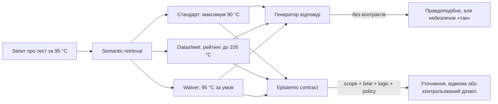
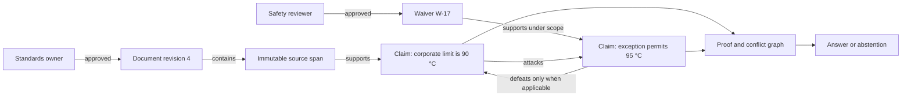
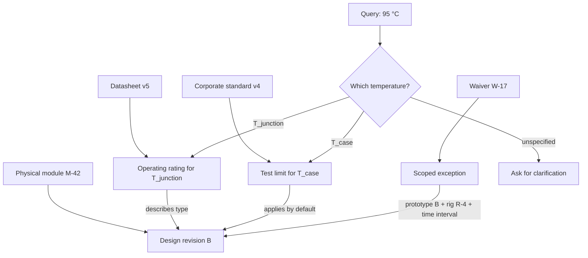
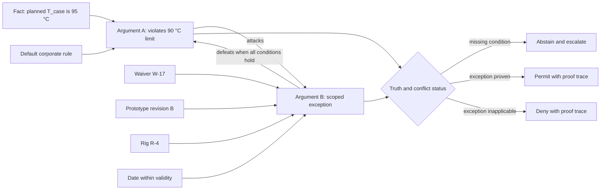
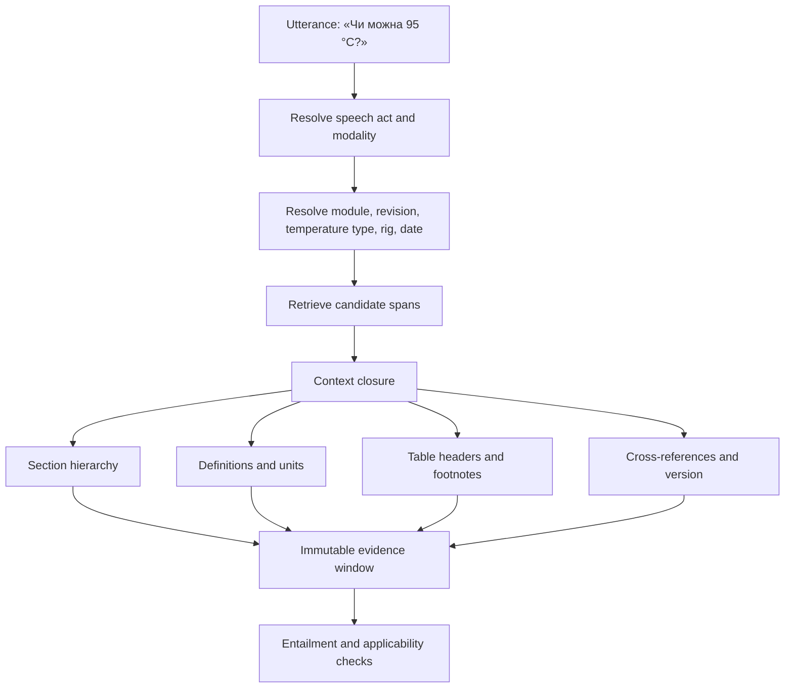
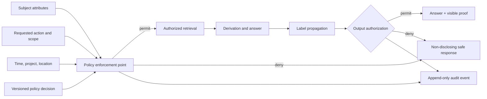
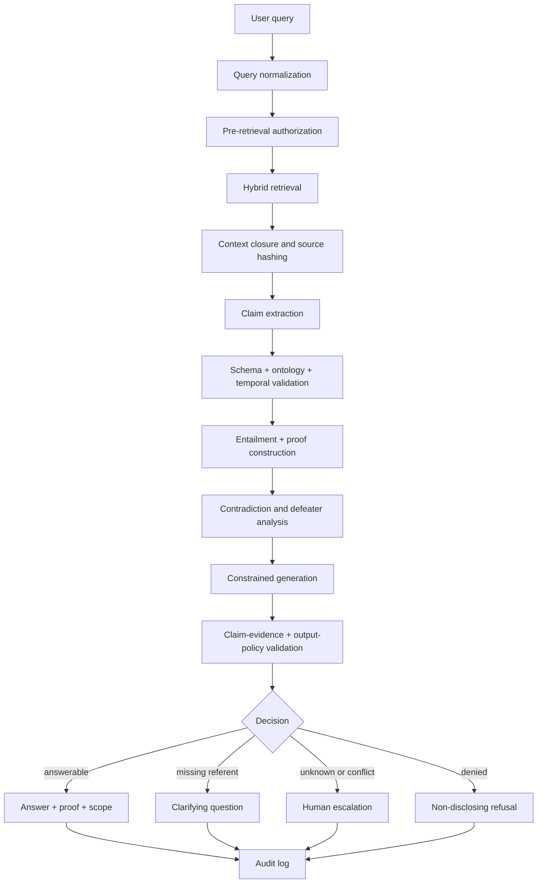

# Філософія для інженера експертних систем: що машина має право називати знанням

> **Серія:** [Експертні системи для R&D](README.md) · стаття 14 із 22
> **Попередня стаття:** [13 — Знайти замало: як експертна система перетворює людське запитання на доказову відповідь](13-Knowledge-Acquisition-From-Question-To-Evidence-UA.md)  
> **Наступна стаття:** [15 — Мовний контур експертної системи: лінгвістичні аналізатори та локальні SLM/LLM](15-Linguistic-Analysis-And-Local-Models-UA.md)  
> **Зміст серії:** [README](README.md)  
> **Рівень:** ML / Knowledge Engineer: middle+

## Не «чи схожий текст», а «що система має право стверджувати»

Уявімо синтетичну, але типову production-ситуацію. Інженер запитує:
«Чи можна проводити стендовий тест силового модуля за температури 95 °C?»
У корпоративному стандарті є межа 90 °C. Новіший datasheet постачальника
декларує робочий діапазон до 105 °C. Окремий waiver дозволяє 95 °C, але лише
для прототипу ревізії B, на конкретному стенді, до визначеної дати й після
додаткової перевірки. До того ж у документах ідеться про різні величини:
температуру корпуса, кристала та повітря в камері.

Звичайний semantic search легко поверне всі три фрагменти. LLM так само легко
складе переконливе «так»: 95 менше за 105, а waiver нібито підтверджує виняток.
Проте ця відповідь може бути одночасно релевантною, граматично правильною і
небезпечною. Datasheet описує фізичну здатність компонента, а не дозвіл на
тест. Waiver може не стосуватися цього екземпляра або бути недоступним
користувачеві. Значення 95 °C без назви вимірюваної величини взагалі не має
достатньої семантики для рішення.

Ця стаття — не екскурс в історію філософії. Її мета практична: перетворити сім
філософських питань на контракти даних, правила виведення, policy enforcement,
тести й режими безпечної відмови.

Наскрізний приклад покаже, як із трьох «знайдених відповідей» отримати одну
контрольовану відповідь:

> **Система не може авторизувати тест за наданим запитом.** Для компонента
> ревізії B існує потенційно застосовний виняток, але треба уточнити тип
> температури, ідентичність стенда, дату тесту та повноваження користувача.
> До перевірки цих умов чинною залишається межа корпоративного стандарту.

В окремих policy-режимах система не повинна навіть розкривати факт існування
закритого waiver. Тоді коректна відповідь коротша: «Доступних доказів
недостатньо для дозволу; передайте запит уповноваженому reviewer». Безпечна
відмова тут є ознакою якості, а не невдалим пошуком.



## Філософське питання як інженерний контракт

Слова «істина», «знання» і «довіра» надто місткі, щоб бути полями типу
`boolean` або `float`. У production-системі корисніше поставити сім вужчих
питань.

| Дисципліна | Інженерне питання | Артефакт | Failure mode |
|---|---|---|---|
| Епістемологія | Чому це твердження допущене як знання? | claim, evidence, provenance, defeater | правильне число з хибною підставою |
| Онтологія | Про який об'єкт, властивість і версію йдеться? | типи, ідентичність, одиниці, scope | рейтинг компонента видано за тестову межу |
| Логіка | Як саме отримано висновок? | inference kind, proof trace, conflict status | гіпотезу видано за дедуктивний факт |
| Філософія мови | Що означає запит у цьому контексті? | intent, referents, presuppositions | «можна» як capability сплутано з permission |
| Герменевтика | Який контекст робить цитату чинною? | section path, definitions, version, evidence window | виняток відірвано від примітки та області дії |
| Філософія науки | Як твердження спростувати або відтворити? | method, uncertainty, protocol, acceptance criterion | prediction видано за measurement |
| Соціальна епістемологія | Хто може бачити, заперечити й затвердити? | ABAC/RBAC, review, audit, appeal | авторитет прирівняно до істини, доступ — до дозволу |

Робоче визначення знання в цій статті навмисно процедурне:

> **Знання системи** — це версіоноване твердження, яке має перевірну підставу,
> визначену область застосування, часову чинність, відомий спосіб отримання та
> пройшло потрібні для його класу валідаційні й організаційні gate-и.

Це не універсальна теорія знання. Це testable design decision. Вона забороняє
непомітно прирівнювати до знання token probability, cosine similarity,
авторитет посади або впевненість автора документа.

## Епістемологія: твердження, доказ і походження — різні об'єкти

Проблема Геттієра показала, що навіть істинне й начебто обґрунтоване
переконання може бути правильним випадково [1]. Її інженерний аналог знайомий
кожному, хто оцінював RAG: модель назвала правильну межу, але citation не
entail-ить відповідь. Exact-match метрика зарахує успіх, хоча ланцюг
обґрунтування зламаний.

Тому мінімальною одиницею є не абзац документа, а **claim**:

```math
c = \langle s, p, o, \sigma, I_v, I_s, m, v \rangle,
```

де $s$ — subject, $p$ — predicate, $o$ — object або value, $\sigma$ — scope,
$I_v=[t_{from},t_{to})$ — інтервал чинності у предметному світі, $I_s$ —
інтервал, упродовж якого ця версія була доступна системі, $m$ — epistemic mode,
а $v$ — версія claim. Для прикладу це не «95 °C», а приблизно таке твердження:

```text
Waiver W-17 permits(TestRun TR, max(T_case) = 95 °C)
scope: prototype_revision=B, rig=R-4, procedure=P-22
valid_time: [2026-07-01, 2026-10-01)
transaction_time: [2026-07-02T09:15:00Z, ∞)
mode: normative-exception
```

**Evidence** — окремий об'єкт: незмінний span, measurement record, підписаний
approval або derivation. **Provenance** відповідає на питання, звідки він
походить і хто що зробив. W3C PROV-O дає корисні базові типи `Entity`,
`Activity`, `Agent` і відношення на кшталт `wasDerivedFrom` [9]. Але provenance
не доводить істинність: докладна історія помилкового документа лишається
докладною історією помилки.



Практично до claim потрібні щонайменше:

- immutable ID і canonical representation;
- epistemic status: `quoted`, `observed`, `inferred`, `hypothesized`,
  `normative`;
- source span із hash та координатами в конкретній ревізії;
- `generated_by`: parser, extraction model, rule, reviewer;
- scope, одиниці, valid time і transaction time;
- supporting та attacking evidence;
- inference kind і відтворюваний proof trace;
- policy label та рішення reviewer-а;
- статус `active`, `superseded`, `withdrawn`, `disputed` або `unknown`.

Одне поле `confidence=0.93` не замінює жодного з них. Воно не пояснює, що саме
має ймовірність 0.93, на яких даних число каліброване і чи може claim бути
показаний цьому користувачеві.

## Онтологія: назва не гарантує тотожності

Онтологічна помилка в production рідко виглядає філософською. Частіше це join
за `component_name`, невдала нормалізація одиниць або `owl:sameAs`, поставлений
між схожими, але не тотожними сутностями.

У наскрізному прикладі треба розрізнити:

- фізичний модуль, тип компонента і ревізію конструкції;
- datasheet як інформаційний об'єкт і описаний ним operating rating;
- корпоративну test limit як нормативне обмеження;
- waiver як тимчасовий акт, а не нову глобальну межу;
- $T_{case}$, $T_{junction}$ та $T_{chamber}$ як різні measurands;
- тест, test plan, стенд, конфігурацію стенда і результат вимірювання.

Правило просте: **label призначений людині, identifier — системі**. URI або
інший ID має бути стабільним, а aliases, translations і legacy codes —
атрибутами чи окремими mapping assertions з provenance. Merge двох ID повинен
бути версіонованою операцією, яку можна відкрутити, а не необоротним
перезаписом графа.

Застосовність claim до query треба оцінювати і в предметному, і в системному
часі. Для effective time $t_v$ та as-of transaction time $t_s$:

```math
\mathrm{Applicable}(c,q,t_v,t_s)=
\mathrm{ScopeMatch}(\sigma_c,\sigma_q)
\land t_v\in I_v(c)
\land t_s\in I_s(c)
\land \mathrm{UnitCompatible}(c,q)
\land \mathrm{IdentityResolved}(c,q).
```

Предикат обчислюється у явно обраній тризначній семантиці: тут — за strong
Kleene tables, де наявний `false` робить conjunction `false`, усі `true` дають
`true`, а решта випадків дає `unknown`. Наприклад, відсутність ревізії
компонента в запиті не дозволяє застосувати waiver лише тому, що embedding для
назв близький. Відсутній snapshot для $t_s$ також не можна підмінити поточним.

### Два часи замість одного `updated_at`

Для аудиту потрібні принаймні два виміри часу:

- **valid time** — коли твердження стосується предметного світу;
- **transaction time** — коли система його отримала або змінила.

Стан знань, який система могла використати в момент $t_s$ для події в момент
$t_v$, визначається так:

```math
K(t_v,t_s)=\{c\mid t_v\in I_v(c)\land t_s\in I_s(c)\}.
```

Це дає відповідь не лише «що чинне зараз?», а й «що система знала, коли дала
рішення вчора?». OWL-Time стандартизує базову лексику для temporal entities та
relations [14], але конкретну bitemporal policy й правила закриття інтервалів
команда все одно визначає сама.

OWL 2 корисний для формального опису класів і відношень та виведення неявних
фактів [11]. SHACL розв'язує іншу задачу: перевіряє data graph проти shapes і
повертає validation report [12]. SHACL-перевірка наявності `validFrom` не
доводить, що дата правильна; consistency в OWL не означає повноту даних. Ці
механізми взаємодоповнюють один одного, але не взаємозамінні.



## Логіка: висновок має називати спосіб свого народження

Поле `inferred=true` приховує надто багато. Дедуктивний висновок, статистичне
узагальнення і abductive hypothesis мають різні гарантії:

- **deduction:** якщо premises та rules прийняті, conclusion необхідно
  випливає в межах обраної логіки;
- **induction:** observations підтримують узагальнення з визначеною
  невизначеністю;
- **abduction:** explanation найкраще відповідає доступним observations, але
  залишається гіпотезою; огляд класичного й сучасного вживання терміна подає
  Ігор Дувен [2];
- **defeasible inference:** conclusion чинний, доки не з'явився застосовний
  виняток або сильніший counterargument.

У формальному записі відповідь повинна мати не лише conclusion $c$, а й proof
object $\pi$:

```math
K_v, R_v, q \vdash c\;[\pi],
```

де $K_v$ — snapshot фактів, $R_v$ — snapshot правил, $q$ — нормалізований
запит, а $\pi$ містить IDs premises, rules, їхні версії та intermediate steps.
Proof replay на тих самих snapshots має давати той самий результат. Якщо
потрібний model endpoint, prompt template або floating alias `latest`,
відтворюваність уже порушена.

### Open world, closed world і небезпечне «не знайдено»

У звичайній application database відсутній запис часто трактують як false.
OWL 2 натомість використовує open-world assumption: відсутній факт може бути
невідомим [11]. В експертній системі обидва режими потрібні, але лише локально
й явно:

- список затверджених waiver може бути closed-world **лише** якщо реєстр
  повний, синхронізований і query мав доступ до всіх релевантних записів;
- знання про фізичні failure modes майже завжди open-world;
- deny-by-default у security policy не означає, що proposition у предметній
  області є false.

Тому `not found`, `false`, `not authorized` і `not applicable` — чотири різні
результати. Змішування їх в одному `null` створює і логічні, і security bugs.

### Суперечність не повинна породжувати довільну відповідь

Якщо підтримуються і $c$, і $\neg c$, класична схема з principle of explosion
не підходить для неконсистентної operational KB. Корисне представлення,
натхнене чотиризначною логікою Белнапа [13], зберігає два незалежні біти:

```math
V_{q,t_v,t_s}(c)=
\bigl(P_{q,t_v,t_s}(c),N_{q,t_v,t_s}(c)\bigr)
\in\{(1,0),(0,1),(1,1),(0,0)\}.
```

$P_{q,t_v,t_s}(c)$ означає наявність support-аргументу, а
$N_{q,t_v,t_s}(c)$ — аргументу проти, **після** фільтрації за identity, scope,
$I_v$, $I_s$ та зафіксованою acceptance semantics. Стани читаються як
`supported-only`, `refuted-only`, `both` і `neither`. Це інформаційний status,
а не calibrated probability. У Dung framework `attack` задає структурне
відношення між аргументами; чи стає воно ефективним defeat і які аргументи
accepted, визначають applicability, precedence та обрана semantics.

У нашому прикладі стандарт підтримує «тест за 95 °C заборонено», waiver —
заперечення для вузького scope. Система не повинна видаляти один edge. Вона
зберігає обидва аргументи, після чого перевіряє applicability і precedence.
Формальна argumentation framework Фан Мінь Зунга моделює аргументи й attacks
між ними [3]; конкретна acceptance semantics є design choice і має бути
зафіксована версією.



Важлива межа: «новіший документ перемагає» і «вища посада перемагає» — не
закони логіки. Це governance policies. У різних доменах precedence може
визначатися нормативним статусом, explicit supersession, scope specificity,
датою або підписом певної ролі. Policy має бути читабельною, протестованою й
показаною у proof trace.

## Мова й герменевтика: фрагмент не є самодостатнім доказом

У запиті «чи можна?» слово *можна* може означати щонайменше:

1. фізичну capability — чи витримає компонент;
2. нормативний permission — чи дозволяє процедура;
3. практичну feasibility — чи здатний стенд;
4. request for approval — чи готовий reviewer затвердити дію.

Теорія speech acts Серля [4] та conversational implicature Грайса [5]
пояснюють, чому literal semantics недостатньо. Інженерний наслідок —
нормалізований query contract до retrieval:

```math
q^*=\langle intent, referents, scope, time, modality,
requested\_evidence, audience, policy\_context\rangle.
```

Якщо `modality` або ключовий referent не визначені, LLM не повинна тихо
вибирати найзручніше значення. Вона має поставити уточнювальне питання або
повернути кілька явно позначених інтерпретацій.

Герменевтична проблема починається після retrieval. Речення «допускається
95 °C» залежить від заголовка розділу, визначення $T_{case}$, примітки «тільки
для prototype B», таблиці з test setup і посилання на procedure. Chunking за
фіксованою кількістю tokens може відрізати будь-яку з цих умов.
Практичний аналог герменевтичного кола — перевіряти частину через документний
контекст, а контекст уточнювати через релевантні частини [6].

Тому evidence window треба будувати детерміновано як closure навколо source
span:

```math
W(e)=e\cup Ancestors_d(e)\cup Definitions(e)\cup
TableContext(e)\cup ResolvedReferences_k(e),
```

де $d$ і $k$ — versioned limits, а кожен доданий фрагмент має власний ID та
причину включення. Hash повного window записується до answer trace. Retrieval
score визначає кандидата, але не стає evidence strength.



Контекст також має межі доступу. Не можна спочатку витягнути restricted chunk,
передати його generator-у, а потім просто прибрати citation. Інформація вже
вплинула на output. Authorization потрібен до retrieval, під час graph
traversal і перед видачею похідного результату.

## Філософія науки: prediction, measurement і нормативне правило не взаємозамінні

R&D-система працює не лише з документами. У ній зустрічаються observations,
measurements, simulations, statistical estimates, causal hypotheses і
normative requirements. Вони не можуть мати один status `fact`.

Measurement record повинен зберігати measurand, value, unit, method, instrument,
calibration state, environmental conditions, sample identity, timestamp і
uncertainty. Запис

```math
T_{case}=94.6\ ^\circ\mathrm{C},\qquad U=1.2\ ^\circ\mathrm{C}\;(k=2)
```

суттєво відрізняється від точкового `94.6`. Позначення expanded uncertainty і
coverage factor має використовуватися відповідно до metrology procedure, а не
додаватися декоративно; базовою нормативною рамкою тут є JCGM 100:2008 [18].
Якщо decision boundary — 95 °C, uncertainty впливає на рішення, і правило
порівняння треба визначити до тесту.

Prediction від ML-моделі має інший контракт: model artifact hash, feature
schema, training-data snapshot, inference configuration, out-of-distribution
checks і calibrated uncertainty на релевантній population. Навіть добре
калібрований prediction не перетворюється на measurement.

Гіпотеза стає інженерно корисною, коли наперед визначені спосіб її перевірки й
можливий спростовувач:

```math
H=\langle prediction, protocol, controls, metric,
acceptance\_region, deadline, owner\rangle.
```

Попперова falsifiability [7] корисна як вимога не захищати будь-який результат
постфактум, але не є універсальним бінарним тестом усіх видів знання. Для
нормативного дозволу потрібна компетентна процедура ухвалення, а не фізичний
експеримент. Для causal claim observational correlation недостатньо без
causal assumptions і відповідного design; do-calculus Перла явно розрізняє
conditioning та intervention [19].

Отже, система має відповідати:

- «виміряно за протоколом P-22»;
- «передбачено моделлю M-8»;
- «виведено правилом R-4»;
- «припущено як найкраще пояснення»;
- «дозволено waiver W-17»;

а не згортати все в «AI встановив факт».

## Соціальна епістемологія: авторитет, доступ і відповідальність

Knowledge base є результатом роботи людей та інституцій. Соціальна
епістемологія розглядає testimony, trust, disagreement і практики спільнот як
частину виробництва знання [8]. Для системи це означає три незалежні осі:

1. **source authority:** яку нормативну вагу має джерело у цьому scope;
2. **review authority:** хто може accept, dispute, supersede або approve;
3. **access authority:** хто може читати source чи derived claim.

Жодна вісь не гарантує істини. Підпис safety owner робить рішення
організаційно чинним, але не змінює фізику. Думка junior engineer може виявитися
правильною й повинна мати channel for appeal. Водночас релевантність документа
не надає користувачеві права його бачити.

ABAC визначає authorization через attributes subject, object, operation і,
за потреби, environment [16]. Для нашого прикладу policy може враховувати роль
користувача, проект, classification waiver, дію `read` чи `approve`, локацію та
час. ODRL уміє виражати permissions, prohibitions, duties і constraints [15],
але policy language не є enforcement engine: виконання, deny-by-default і
аудит залишаються обов'язком архітектури.

Для похідної відповіді корисна консервативна label propagation:

```math
label(output)=\bigsqcup_{a\in Inputs(derivation)}label(a),
```

де $\sqcup$ — join у визначеній організацією lattice класифікацій, а inputs
охоплюють не лише видимі citations, а й прихований context, rules та проміжні
claims. Declassify
може лише окрема policy/action, а не paraphrasing LLM. Якщо навіть факт
існування waiver є sensitive, abstention не повинна пояснювати приховану
причину.



Audit event має містити actor, purpose, policy version, knowledge snapshot,
query hash, IDs використаних evidence, decision, output label і correlation ID.
Ланцюжок із зафіксованими алгоритмом hash і версією canonical serialization

```math
h_i=H(h_{i-1}\parallel canonical(event_i))
```

допомагає виявляти зміну або вилучення подій, але сам по собі не запобігає
компрометації writer-а. Потрібні access separation, signatures або зовнішнє
anchoring, retention policy та регулярна перевірка. Audit log без процедури
розслідування — лише дорогий архів.

## Формальний epistemic contract

Тепер можна зібрати вимоги в один доменно-нейтральний контракт. Це reference
shape, а не готова схема для копіювання:

```json
{
  "claim_id": "claim:W17:test-limit:tcase",
  "proposition": {
    "subject": "test-run:pending",
    "predicate": "permittedMaxCaseTemperature",
    "object": {"value": 95, "unit": "Cel"}
  },
  "epistemic_status": "normative-exception",
  "scope": {
    "component_revision": "B",
    "rig": "R-4",
    "procedure": "P-22"
  },
  "valid_time": {"from": "2026-07-01", "to_exclusive": "2026-10-01"},
  "transaction_time": {
    "recorded_from": "2026-07-02T09:15:00Z",
    "recorded_to_exclusive": null
  },
  "evidence": [
    {"span_id": "doc:W17@r2#section-3", "relation": "supports"}
  ],
  "inference": {
    "kind": "defeasible-deduction",
    "rule_set": "test-policy@4.2",
    "proof_id": "proof:7f3a"
  },
  "truth_status": "supported-only",
  "admission_state": "candidate",
  "defeaters": ["missing:component_identity", "missing:test_date"],
  "uncertainty": {"kind": "not-applicable"},
  "policy": {"label": "project-confidential", "decision_id": "pdp:81ab"},
  "review": {"state": "pending", "owner_role": "safety-reviewer"}
}
```

`truth_status` тут описує support/attack graph, але не означає, що claim уже
допущено до відповіді: тому `admission_state` лишається `candidate`. У реальному
response не можна залишати placeholder `test-run:pending` і водночас казати,
що claim applicable. SHACL або JSON Schema ловить структуру;
domain validators — unit compatibility, intervals, identity completeness;
reasoner — entailment і conflict; policy engine — authorization; reviewer —
рішення, яке не можна автоматизувати.

### Умова відповіді й умова відмови

Нехай $g$ — answer candidate, $u$ — user, $q$ — query, $t_v$ — effective time,
а $t_s$ — as-of transaction time. Система має право видати твердження лише
якщо:

```math
\begin{aligned}
Answerable(g,u,q,t_v,t_s)={}&SchemaValid(g)\\
&\land Applicable(g,q,t_v,t_s)\\
&\land ProofReplay(g)\\
&\land ConflictPolicySatisfied(g)\\
&\land Authorized(u,read,g)\\
&\land RiskPolicySatisfied(g,q).
\end{aligned}
```

Domain predicates тут обчислюються в тризначному просторі
`true | false | unknown`: `false` у blocking condition веде до відмови, а
`unknown` — до уточнення чи escalation. Виняток — `Authorized`: policy engine
має повертати тільки `permit | deny`, а помилка, відсутній атрибут або
недоступний policy snapshot обробляються fail closed як `deny` без розкриття
причини. Епістемічне `unknown` і security `deny` не можна згортати в один стан.

$RiskPolicySatisfied(g,q)$ є типізованим gate, а не довільним LLM confidence.
Якщо для цього decision class policy вимагає кількісний model-risk bound, gate
має перевіряти $RiskKnown(g,q)\land Risk(g\mid q)\le r_{max}$, де risk —
ймовірність визначеної помилки або expected loss, відкалібрований на незалежній
репрезентативній вибірці. Якщо оцінки немає, `risk.kind=unknown` і такий gate не
проходить. Для deterministic normative proof policy може вимагати інші
перевірки й позначити probabilistic uncertainty як `not-applicable`; це не
дозволяє компенсувати structural або policy failure model score-ом.
Selective prediction формалізує компроміс між coverage і risk [17]: підняття
порога може зменшити помилки серед відповідей, але збільшить abstention. Для
critical slices gate має задаватися окремо, а policy або structural failure не
можна «компенсувати» високою model score.

Модель аргументації Тулміна — claim, data, warrant, backing, qualifier,
rebuttal [10] — добре пояснює структуру інженеру, але її mapping теж треба
зробити явним: `data` стає evidence, `warrant` — versioned rule, `rebuttal` —
defeater, а `qualifier` не перетворюється автоматично на probability.

## Reference architecture: де саме виконуються контракти

Epistemic contract не повинен жити лише у prompt. Prompt — один із
versioned artifacts, а інваріанти виконуються детермінованими компонентами до
й після генерації.



LLM у цій архітектурі корисна для query interpretation, candidate extraction і
мовного формулювання. Вона не є джерелом permission, не визначає identity на
основі «схожості» без resolver-а і не має обходити policy engine.

### Failure modes, controls і перевірні тести

| Failure mode | Найменший корисний control | Тест |
|---|---|---|
| Citation містить число, але не підтримує claim | claim-level entailment + span hash | замінити span нерелевантним і вимагати failure |
| Стару ревізію змішано з новою | immutable versions + explicit supersession | as-of query відтворює історичну відповідь |
| $T_{case}$ сплутано з $T_{junction}$ | typed quantity + unit/measurand validation | property-based test забороняє cross-type comparison |
| Відсутність запису трактовано як заборону або дозвіл | explicit OWA/CWA per predicate | вилучення факту дає `unknown`, де очікується open world |
| Conflict приховано source ranking-ом | support/attack graph + four-state status | одночасні $c$ і $\neg c$ дають `both` |
| Waiver застосовано поза датою або scope | applicability predicate | boundary tests на `valid_to` і mismatched revision |
| Restricted span вплинув на публічну відповідь | pre/post authorization + label propagation | canary secret не з'являється ні прямо, ні paraphrase |
| Висока similarity видана за confidence | typed scores | schema не приймає retrieval score як epistemic risk |
| LLM сформувала правило, якого немає | proof replay і allow-list rule IDs | mutation test видаляє rule й блокує answer |
| Reviewer помилився або мав conflict of interest | separation of duties + appeal | self-approval відхиляється policy engine |
| Audit log переписано | hash chain + external verification | mutation старої події порушує chain verification |

### Метрики, які не маскують найгірший клас помилки

Answer accuracy недостатня. Для confirmation set і shadow traffic варто
вимірювати:

```math
Unsupported\ Answer\ Rate=
\frac{\#\ accepted\ answers\ without\ valid\ proof}
{\#\ accepted\ answers},
```

```math
Stale\ Evidence\ Rate=
\frac{\#\ answers\ using\ superseded\ or\ inapplicable\ evidence}
{\#\ answers},
```

а також contradiction detection recall, proof-replay success, clarification
rate, escalation rate, coverage-risk curve та latency. **ACL leakage rate для
security canaries повинна мати release gate 0**, але нуль на малій вибірці не
доводить абсолютної відсутності leakage. Потрібні adversarial tests, різні
ролі, indirect references і періодичний red-team.

Evaluation cases групують за document family, revision lineage і generated
derivatives, щоб майже дублікати не опинилися одночасно в development та
confirmation sets. Окремі slices потрібні для temporal boundaries,
contradictions, unit conversion, ambiguous speech acts і restricted evidence.
Після використання sealed case для debugging він стає regression case, а для
підтвердження готують новий.

## Як упроваджувати без «великого філософського переписування»

Не треба починати з універсальної онтології. Почніть із найвартіснішої
production-помилки й мінімального контракту, який робить її спостережуваною.

1. **Виберіть один decision class.** Наприклад, дозвіл на стендовий тест, а не
   «всі знання R&D».
2. **Зафіксуйте competency questions.** Який об'єкт? Яка величина? Яка версія?
   Яка дата? Яке правило? Хто бачить і хто затверджує?
3. **Типізуйте claims та evidence.** Не мігруйте весь corpus; спершу лише
   документи, що беруть участь у цьому decision class.
4. **Додайте temporal і identity invariants.** Забороніть плаваючі IDs,
   невказані units та interval без семантики меж.
5. **Побудуйте proof/attack graph.** Зберігайте і підтримку, і заперечення; не
   видаляйте конфлікт до рішення policy.
6. **Вставте policy enforcement перед retrieval і після derivation.** Перевірте
   non-disclosure для неавторизованих ролей.
7. **Навчіть систему відмовлятися типізовано.** `clarify`, `unknown`,
   `conflict`, `denied`, `escalate` мають різні UX і audit semantics.
8. **Запустіть shadow evaluation.** Порівнюйте candidate з чинним процесом,
   збирайте reviewer disagreement, але не навчайтеся автоматично на thumbs-up.
9. **Promote атомарно.** Knowledge snapshot, ontology, rules, policies,
   tokenizer/prompt/model, validators та evaluation suite мають один release
   manifest і rollback target.

NIST Generative AI Profile радить керувати ризиками GenAI протягом lifecycle,
а не покладатися на одну модельну метрику [20]. Для epistemic architecture це
означає, що acceptance criteria, monitoring, incident review та відповідальні
ролі є частиною системи, а не документацією «на потім».

## Епістемічний аудит за 20 хвилин

Візьміть одну недавню відповідь production-системи й пройдіть checklist:

- Чи можна виділити кожен externally checkable claim?
- Чи має claim evidence, що справді його підтримує, а не просто тематично
  схоже?
- Чи відтворюється provenance до immutable source revision?
- Чи визначені object identity, units, scope і valid time?
- Чи видно deduction, induction, abduction або human approval окремо?
- Чи зберігаються контраргументи та defeaters?
- Чи розрізняє система `false`, `unknown`, `conflict`, `not applicable` і
  `not authorized`?
- Чи можна replay-нути proof на точних snapshots?
- Чи був authorization виконаний до доступу до evidence та після derivation?
- Чи не розкриває refusal існування restricted source?
- Чи має prediction model/version, а measurement — method та uncertainty?
- Хто може approve, хто appeal, хто розслідує audit event?

Якщо на три питання поспіль відповідь «це знає LLM», система має приховану
епістемічну залежність від генератора. Її слід перетворити на явний interface.

## Висновок: знання — це право на контрольоване твердження

Філософія стає корисною інженеру не тоді, коли додає складні слова, а коли
виявляє прихований design choice.

- Епістемологія відокремлює claim від evidence, provenance і confidence.
- Онтологія не дозволяє назві підмінити identity, scope та version.
- Логіка фіксує спосіб виведення й не ховає contradiction.
- Філософія мови забороняє мовчки вгадувати modality та referents.
- Герменевтика робить evidence window відтворюваним.
- Філософія науки відділяє measurement, prediction, hypothesis і permission.
- Соціальна епістемологія перетворює authority, access, review та appeal на
  контрольовані процеси.

У наскрізному прикладі надійна система не «обрала правильний документ». Вона
встановила, про яку температуру й об'єкт ідеться; знайшла чинні claims;
відтворила їхнє походження; зберегла конфлікт; перевірила scope, час і policy;
показала proof уповноваженому користувачеві — або відмовилася, коли контракт
не зійшовся. Саме це відрізняє генератор правдоподібного тексту від експертної
системи, якій можна делегувати частину інженерного процесу.

У [наступній статті](15-Linguistic-Analysis-And-Local-Models-UA.md) цей контракт
переходить у мовний контур: як локальні analyzers і SLM/LLM визначають intent,
referents та структуру claim, не отримуючи права самостійно оголошувати
гіпотезу знанням.

## Питання до читачів

1. Який production incident у вашій системі виникав через змішування `unknown`,
   `false` і `not authorized`?
2. Де у вашому стеку закінчується retrieval score і починається доказ?
3. Чи можете ви відтворити відповідь шестимісячної давності разом із rules,
   policies, evidence та model snapshot?
4. Який типізований abstention приніс би більше користі: ambiguity, conflict,
   stale evidence чи missing authorization?

## Посилання на інших авторів і публікації

1. Edmund L. Gettier. [*Is Justified True Belief Knowledge?*](https://doi.org/10.1093/analys/23.6.121). *Analysis*, 23(6), 121–123, 1963.
2. Igor Douven. [*Abduction*](https://plato.stanford.edu/entries/abduction/). *Stanford Encyclopedia of Philosophy*.
3. Phan Minh Dung. [*On the Acceptability of Arguments and its Fundamental Role in Nonmonotonic Reasoning, Logic Programming and n-Person Games*](https://doi.org/10.1016/0004-3702(94)00041-X). *Artificial Intelligence*, 77(2), 321–357, 1995.
4. John R. Searle. [*Speech Acts: An Essay in the Philosophy of Language*](https://doi.org/10.1017/CBO9781139173438). Cambridge University Press, 1969.
5. H. Paul Grice. [*Logic and Conversation*](https://web.stanford.edu/class/psych205/papers/Grice-1975.pdf). In *Syntax and Semantics 3: Speech Acts*, 41–58, 1975.
6. Jeff Malpas, Hans-Helmuth Gander. [*Hermeneutics*](https://plato.stanford.edu/entries/hermeneutics/). *Stanford Encyclopedia of Philosophy*.
7. Karl Popper. [*The Logic of Scientific Discovery*](https://www.routledge.com/The-Logic-of-Scientific-Discovery/Popper/p/book/9780415278447). Routledge Classics; English edition first published 1959.
8. Alvin Goldman, Cailin O'Connor. [*Social Epistemology*](https://plato.stanford.edu/entries/epistemology-social/). *Stanford Encyclopedia of Philosophy*.
9. Timothy Lebo, Satya Sahoo, Deborah McGuinness (eds.). [*PROV-O: The PROV Ontology*](https://www.w3.org/TR/prov-o/). W3C Recommendation, 2013.
10. Stephen E. Toulmin. [*The Uses of Argument*](https://doi.org/10.1017/CBO9780511840005). Updated edition, Cambridge University Press, 2003; first edition 1958.
11. W3C OWL Working Group. [*OWL 2 Web Ontology Language: Primer (Second Edition)*](https://www.w3.org/TR/owl2-primer/). W3C Recommendation, 2012.
12. Holger Knublauch, Dimitris Kontokostas (eds.). [*Shapes Constraint Language (SHACL)*](https://www.w3.org/TR/shacl/). W3C Recommendation, 2017.
13. Nuel D. Belnap. [*A Useful Four-Valued Logic*](https://doi.org/10.1007/978-94-010-1161-7_2). In *Modern Uses of Multiple-Valued Logic*, 5–37, 1977.
14. Simon Cox, Chris Little (eds.). [*Time Ontology in OWL*](https://www.w3.org/TR/owl-time/). W3C Candidate Recommendation Draft, 2022.
15. Renato Iannella, Serena Villata (eds.). [*ODRL Information Model 2.2*](https://www.w3.org/TR/odrl-model/). W3C Recommendation, 2018.
16. Vincent C. Hu et al. [*Guide to Attribute Based Access Control (ABAC) Definition and Considerations*](https://doi.org/10.6028/NIST.SP.800-162). NIST SP 800-162, updated 2019.
17. Yonatan Geifman, Ran El-Yaniv. [*Selective Classification for Deep Neural Networks*](https://papers.nips.cc/paper_files/paper/2017/hash/4a8423d5e91fda00bb7e46540e2b0cf1-Abstract.html). NeurIPS, 2017.
18. JCGM. [*Evaluation of Measurement Data — Guide to the Expression of Uncertainty in Measurement*](https://doi.org/10.59161/JCGM100-2008E). JCGM 100:2008.
19. Judea Pearl. [*A Causal Calculus for Statistical Research*](https://proceedings.mlr.press/r0/pearl95a.html). Proceedings of AISTATS, 1995.
20. Chloe Autio et al. [*Artificial Intelligence Risk Management Framework: Generative Artificial Intelligence Profile*](https://doi.org/10.6028/NIST.AI.600-1). NIST AI 600-1, 2024.
