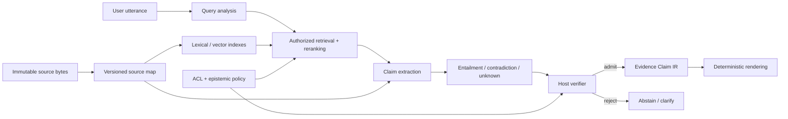
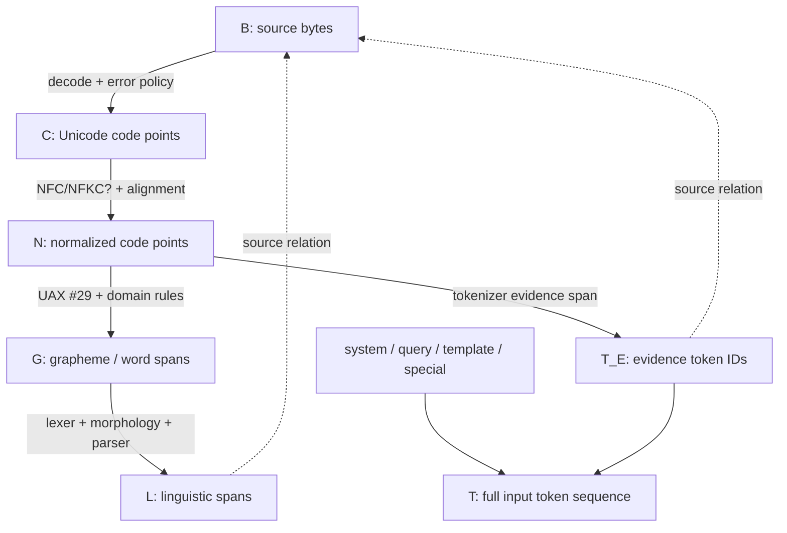
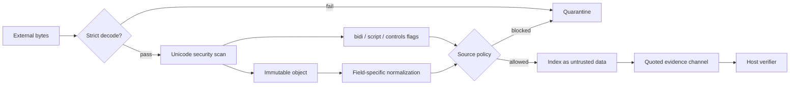
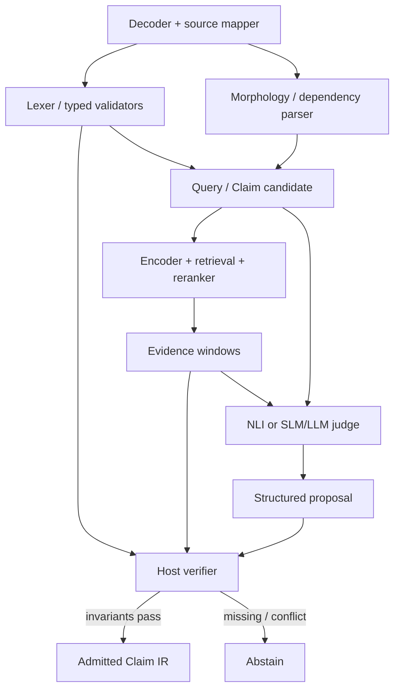
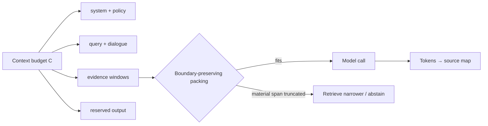
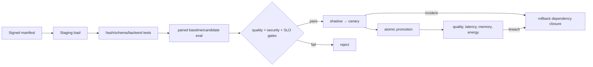
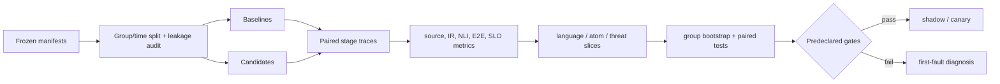

# Мовний контур експертної системи: лінгвістичні аналізатори та локальні SLM/LLM

> **Серія:** [Експертні системи для R&D](README.md) · стаття 15 із 22
> **Попередня стаття:** [14 — Філософія для інженера експертних систем: що машина має право називати знанням](14-Philosophy-For-Expert-Systems-UA.md)  
> **Наступна стаття:** [16 — Чому саме так, чому ні й що треба змінити](16-Expert-System-Explanation-Engine-UA.md)  
> **Зміст серії:** [README](README.md)  
> **Рівень:** NLP / ML / Knowledge Engineer: middle+  
> **Після статті:** спроєктувати мовний контур із відтворюваною картою джерела, вимірюваними model stages і fail-closed admission.

Коли експертна система не розуміє простого питання, команда часто намагається
взяти більшу LLM. Але помилка може виникнути раніше: decoder замінив байт,
normalization стерла відмінність, tokenizer розірвав ідентифікатор, chunker
відділив число від одиниці, retriever знайшов інший revision, а renderer загубив
уже перевірений атом.

Наскрізний приклад навмисно простий. У джерелі сказано, що мінімальна довжина
заголовка становить `eight octets`. Користувач питає: «Покажи minimum header
length». Правильна відповідь — не голе `8` і не автоматично «8 bytes». Система
має повернути значення, оригінальну одиницю, модальність і точний доказ із
дозволеної версії документа.

Надійний мовний контур є гібридним: deterministic code володіє байтами,
координатами й policy; parser пропонує morphology та syntax; encoder, reranker і
NLI-модель оцінюють вузькі відношення; SLM/LLM працює з перефразуванням і
кореференцією; host verifier допускає лише claim, відтворюваний із evidence.

> **Межа практичного досвіду.** У локальних прототипах я спостерігав втрату
> одиниць, руйнування складених токенів і розбіжність model offsets із source
> bytes. Без відкритих raw logs і frozen corpus це engineering observation, не
> benchmark result. Архітектура та протокол нижче — дизайн, який треба
> перевірити на власному корпусі.

## Від людської репліки до права стверджувати

[Стаття 13](13-Knowledge-Acquisition-From-Question-To-Evidence-UA.md) розділила
acquisition на detection, extraction, grounding і verification. [Стаття
14](14-Philosophy-For-Expert-Systems-UA.md) додала епістемічний контракт:
схожість не є підтримкою, `unknown` не є запереченням, а факт, висновок і
prediction мають різні підстави. Мовний контур з'єднує ці рівні.



Model stages можна оновлювати. Immutable bytes, source map, authorization і
admission predicates — стабільні межі. Upgrade tokenizer-а не має мовчки
змінювати семантику citation.

Authorization виконується до retrieval і повторно перед admission. Недоступний
passage не можна спочатку передати моделі, а потім приховати citation: його
зміст уже вплинув на generation. Output classification успадковує join labels
усіх derivation inputs, включно з прихованим context; deny-відповідь не
розкриває існування закритого джерела.

## Source map: bytes → Unicode → linguistic spans → model tokens

«Позиція символу 42» нічого не означає без координатної системи. Це може бути
offset у UTF-8 bytes, UTF-16 code units, Unicode code points, extended grapheme
clusters, words, parser tokens або model tokens.



Кожна стрілка створює не лише новий текст, а й відношення походження. Нехай
$R_{X\leftarrow Y}\subseteq X\times Y$ відображає span похідного представлення
$Y$ у одну або кілька батьківських областей представлення $X$. Source map
evidence token → bytes є композицією відношень. Нехай $T_E\subseteq T$ —
model tokens, що походять саме з evidence:

```math
R_{B\leftarrow T_E}=R_{B\leftarrow C}\circ R_{C\leftarrow N}
\circ R_{N\leftarrow T_E}.
```

Це не one-to-one function. Token може охопити кілька code points; графема може
складатися з кількох code points; normalized code point може походити з
кількох source code points.
Template/special tokens, system policy й query tokens не мають удаваного
походження з evidence bytes: вони мапляться до власних versioned entities або
позначаються як generated. Citation може спиратися лише на $T_E$.

### Normalization є many-to-one

В NFC `U+0065` + `U+0301` може перейти в `U+00E9`. Різні source sequences дають
один normalized output. NFKC стирає ще й compatibility-відмінності; UAX #15
застерігає не застосовувати її сліпо до довільного тексту. Inverse mapping не
можна надійно відновити постфактум: alignment зберігають під час transform.

Для derived span $s$ нехай $M_B(s)$ — мінімальна впорядкована множина source
byte intervals, $Bytes_B(M)$ — їхні bytes у source order, а $Frame_B(M)$ —
canonical length-framed records `(start, end, bytes)`. Round-trip invariant:

```math
Normalize_v(Decode_e(Bytes_B(M_B(s))))=Surface_N(s),
```

а незмінність raw evidence:

```math
SHA256(Frame_B(M_B(s)))=evidence\_sha256(s).
```

$e$ фіксує encoding/error policy, $v$ — Unicode version і normalization form.
Після reordering combining marks map може бути списком interval-ів, а не одним
діапазоном. Контракт не повинен це приховувати. Наведений round trip
застосовний до text-native source, для якого визначено $Decode_e$. Для PDF або
скану потрібен довший provenance chain:
`PDF bytes → page/layout або image → OCR text bytes → normalized text`.
OCR-span має координати в OCR text і, за можливості, page bounding boxes; його
не можна показувати як byte offset у PDF. Hash OCR-layer і параметри OCR
зв'язують із hash первинного PDF як окрему versioned transform activity.

Framing не передається decoder-у: воно захищає identity набору interval-ів від
неоднозначної конкатенації. Span також має бути замкнений за normalization
dependencies; якщо локальний substring не можна нормалізувати незалежно від
сусіднього context, round trip перевіряють через збережені alignment events,
а не реконструюють постфактум.

UAX #29 дає default boundaries, але `10.0.0.0/8`, `v2.1.4` і скорочення
потребують domain tailoring. Parser і SentencePiece мають різні tokens. Для
tokenizer-а перевіряється:

```math
Detok_v(Tok_v(x;special=false);cleanup=false)=x.
```

До manifest входять vocabulary/model hash, added tokens, normalization config,
chat template і library version. Offset API має явно назвати bytes, code points
чи code units. Exact equality є перевірним інваріантом для полів, яким потрібен
дослівний round trip. Якщо конкретний tokenizer незворотно нормалізує input,
його offsets не можуть бути авторитетними source coordinates: anchor треба
повторно зв'язати з $N$ і raw bytes через збережений source map або відхилити.

## Unicode threat model і retrieved instructions

Normalization не усуває spoofing. Латинська `a` та кирилична `а` можуть
виглядати однаково. Invisible controls змінюють display order; zero-width
characters розривають identifier. Bidi override створює розбіжність між
видимим і логічним порядком — клас атак, показаний у *Trojan Source*.

| Загроза | Наслідок | Контроль |
|---|---|---|
| Invalid encoding | різні stages бачать різний текст | strict decode або quarantine; без silent replacement у evidence |
| Mixed-script confusable | `heаder` обходить exact match | script profile, UTS #39 skeleton як signal, review IDs |
| Bidi/control chars | reviewer бачить інший порядок | UAX #9 scan, escaped/code-point view, allowlist |
| Over-normalization | втрата семантичної відмінності | raw bytes immutable; field-specific policy |
| Corpus poisoning | spoofed passage перемагає retrieval | source admission, hashes, trust tier, anomaly tests |
| Retrieved prompt injection | документ командує моделлю | data channel, tools deny-by-default, host policy |
| Citation spoofing | показаний span не дорівнює raw | source-map round trip і hash |



UTS #39 skeleton є detector signal, не автоматичним виправленням: mixed script
може бути легітимним у формулах і API names. Retrieved рядок «ignore previous
instructions» залишається даними. Навіть instruction detector не є security
boundary: текст не отримує tools, не змінює ACL, system prompt або admission.

## Контракти компонентів



| Компонент | Вихід | Не є авторитетом для |
|---|---|---|
| Decoder/source mapper | code points, byte relations, errors | наміру й істинності |
| Deterministic lexer/parser | typed atoms і exact spans | семантичної ролі |
| Morphology/dependency parser | lemmas, POS, dependencies | доказу, ACL, нормативної сили |
| Encoder/reranker | vectors/ranking scores | entailment і truth |
| NLI model | entailment/contradiction/neutral scores | істини поза evidence та application-state `unknown` |
| SLM/LLM | intent/claim/verbatim-anchor proposal | bytes, hashes, policy |
| Host verifier | admitted IR або reason code | мовного перефразування |
| Renderer | answer + citation | нового claim |

Domain lexer корисний для quantity, unit, IP prefix, UUID, OID, requirement ID
і hash, але не доводить роль атома. Universal Dependencies, UDPipe чи Stanza
дають morphology/syntax hypotheses; tables, headings, code-switching і
technical tokens можуть бути поза training distribution.

Specialized encoder, reranker і NLI часто дешевші за generative LLM. ONNX
Runtime може виконувати їх через різні execution providers, але graph, opset,
preprocessing і provider version належать manifest. SLM/LLM потрібна для speech
act, implicit subject, paraphrase і structured proposal. JSON Schema зменшує
syntactic failures, але schema-valid JSON усе ще може містити вигаданий span.
Host знаходить anchors у дозволених raw bytes.

## Token і context budget

Model token не дорівнює слову. Count залежить від мови, tokenizer-а, Unicode
representation, chat template і special tokens. Budget має бути явним:

```math
L_{sys}+L_{schema}+L_{dialog}+L_{query}+L_{evidence}+L_{tools}
+L_{output}\le C_{runtime}.
```

$C_{runtime}$ — протестований limit конкретного profile. Якщо evidence не
вміщується, система не обрізає exception, а звужує retrieval або відмовляється.



KV cache приблизно лінійний за sequence length. Для одного active sequence,
$n_l$ layers, $n_{kv}$ KV-heads, head size $d_h$, length $L$ і $b$
bytes/element:

```math
M_{KV}\approx2n_lLn_{kv}d_hb.
```

Batching, paging, quantized KV й alignment додають overhead, тому формула не
замінює peak-memory measurement. Вона описує conventional full-context
MHA/GQA/MQA; sliding-window, MLA, recurrent/state-space або hybrid architecture
потребує власної cache formula та вимірювання. Це logical unsharded total;
per-worker memory залежить від tensor-parallel sharding/replication, а shared
prefix cache не можна вдруге приписувати кожній sequence.

## Embeddings, retrieval і NLI мають різні score semantics

Для $\mathbf q,\mathbf d\in\mathbb R^m$ cosine similarity:

```math
s_{dense}(q,d)=\frac{\mathbf q^\top\mathbf d}
{\lVert\mathbf q\rVert_2\lVert\mathbf d\rVert_2}.
```

Cosine визначений лише для ненульових vector-ів однакової dimension; `NaN`,
zero norm або shape mismatch блокують candidate до ranking.

Це ranking score, не probability підтримки. Lexical search бере exact atoms;
dense retrieval — перефразування. RRF поєднує ранги без змішування шкал:

```math
s_{RRF}(d)=\sum_{r\in\mathcal R(d)}\frac{1}{k_0+rank_r(d)}.
```

$\mathcal R(d)$ містить лише rank lists, у яких $d$ присутній; відсутній
candidate не отримує вигаданого rank. Використовують $k_0\ge0$ і
$rank_r(d)\ge1$, тому denominator додатний.

NLI оцінює claim $c$ відносно evidence $e$:

```math
p_\theta(y\mid c,e)=softmax(z_\theta(c,e)),\quad
y\in\{entailment,contradiction,neutral\}.
```

У типовому NLI checkpoint третій label — `neutral`. Application state
`unknown` ширший: він також охоплює incomplete evidence, failed binding і
невизначений scope, тому його формує host, а не просте перейменування logit.
`Entailment` не доводить чинність документа, а `unknown` не є contradiction.
Нехай $y_{ver}$ — дискретний verifier verdict за versioned decision policy, а
$p_{cal}$ — окремо калібрована probability визначеної події support. Host admission:

```math
Admit(c,e,q,u,t)=I_{authz}(c,e,u,t)\land I_{integrity}
\land I_{material\ spans}\land I_{applicable}(c,q,t)
\land[y_{ver}=entailment]\land[p_{cal}(entailment)\ge\tau]
\land\neg I_{conflict}\land I_{epistemic\ type}.
```

Останній predicate не дозволяє називати prediction фактом або draft чинною
нормою — прямий зв'язок зі статтею 14. Authorization для principal $u$,
purpose/operation і моменту $t$ є fail closed; високий NLI score не компенсує
прострочений policy decision чи невідому область чинності.

## Local runtime profiles: користь і межі

Станом на 2026 рік немає одного найкращого backend-а.

| Profile | Користь | Обмеження |
|---|---|---|
| `llama.cpp` + GGUF | portable CPU/GPU, edge/offline, багато backend-ів | pin commit, GGUF hash, quant і build flags; backend matrix нерівномірна |
| Ollama | швидкий local service, API, JSON Schema output | wrapper не додає factual verification; pin model/template/context |
| vLLM | concurrent high-throughput serving, batching, structured/pooling tasks | складніший server profile; version/hardware/quant matrix змінюється |
| MLX LM | Apple Silicon generation, quantization і fine-tuning | MLX artifacts не переносяться автоматично на CUDA/ROCm |
| TensorRT-LLM | NVIDIA paged attention, in-flight batching, quantized serving | тісна залежність від NVIDIA engine/build support matrix |
| ONNX Runtime | specialized encoder/NLI на CPU/GPU/NPU | provider-и підтримують operators і numerics не однаково |

Невелика workstation може поєднати lexer, ONNX encoder і GGUF SLM. GPU service
із concurrency може обрати vLLM/TensorRT-LLM. Apple prototype — MLX LM. Вибір
починається з workload, privacy, latency, memory і license, не popularity.
Назва «local runtime» сама не доводить нульовий network egress: model pulls,
remote endpoints, telemetry й update checks перевіряють окремою network policy
та offline test.

## Quantization, manifest і rollback

Спрощена affine quantization:

```math
q(w)=clip\left(round\left(\frac{w}{s}\right)+z,q_{min},q_{max}\right),
\qquad\hat w=s(q(w)-z).
```

$s>0$, $q_{min}<q_{max}$ і
$z\in\mathbb Z\cap[q_{min},q_{max}]$ задаються для конкретного tensor або
group. Реальні schemes мають group scales та calibration. «4-bit» не визначає
однакову якість або швидкість. Quantized artifact — новий candidate. Drift:

```math
\Delta_{m,s}=m(model_q,s)-m(model_{base},s).
```

Цей знак придатний для higher-is-better quality. Для risk, latency, memory й
energy використовують $\Delta_{m,s}=m(model_{base},s)-m(model_q,s)$ або
наперед переводять метрику в utility, щоб release gate мав один напрям.
Потрібні slices для української, technical IDs, structured output, NLI,
abstention і long context. Середнє може приховати критичну регресію.

Deployment manifest фіксує corpus/ACL snapshot; Unicode й normalization;
lexer/parser commits; tokenizer/chat template; encoder/reranker/NLI/generator
hashes і licenses; quant method/converter/calibration data; runtime/backend/build
flags/container; driver/hardware; prompt/schema/context/sampling; calibration,
thresholds і evaluation snapshot.



Rollback охоплює model, tokenizer, prompt, schema, calibration, index і source
map. Safe fallback — previous approved bundle, deterministic exact path або
відмова. Licenses перевіряють окремо для weights, tokenizer, data, runtime і
quantized derivatives.

## Відтворюваний benchmark

Один `minimum header length` пояснює дизайн, але не узагальнення. Unit split-а
— knowledge object з paraphrases, document family, revisions, translations,
OCR/Markdown derivatives і synthetic questions. Сусідні chunks не можна
розділяти між development і confirmation. Нові revisions після $t_0$ корисно
залишити для temporal confirmation.

Потрібні train (якщо є fine-tuning), development, calibration, regression,
sealed confirmation і shadow/canary. Leakage audit поєднує raw та normalized
hashes, MinHash, embedding neighbors і manual review. Відкритий confirmation
case переходить у regression.

Порівнювані profiles: lexical baseline; `+ source map/lexer`; `+ hybrid
retrieval/reranker/NLI`; SLM proposal без host gate; повний hybrid; quantized
candidates проти власних baselines. Один ablation змінює одну dependency.

Для множини gold evidence $G_q$ і top-$k$ $R_k(q)$ нехай
$Q_+=\{q\mid |G_q|>0\}$ — непорожня множина answerable queries. Наявність хоча
б одного правильного passage вимірює $Hit@k$:

```math
Hit@k=\frac{1}{|Q_+|}\sum_{q\in Q_+}
\mathbb{1}[G_q\cap R_k(q)\ne\varnothing].
```

Якщо повний claim потребує кількох evidence objects, окремо рахують:

```math
Recall@k=\frac{1}{|Q_+|}\sum_{q\in Q_+}
\frac{|G_q\cap R_k(q)|}{|G_q|}.
```

Unanswerable queries не отримують порожнього denominator: для них окремо
рахують false answer, correct abstention і clarification quality.

Додатково: source round-trip, intent macro-F1, atom precision/recall, grounding
completeness, citation correctness, NLI macro-F1 і end-to-end success. Для
paraphrase group $V_g$:

```math
GroupPass=\frac{1}{|G|}\sum_{g\in G}\prod_{i\in V_g}Success_i.
```

$G\ne\varnothing$ і $V_g\ne\varnothing$; інакше empty product хибно дасть
автоматичний pass.

$Success_i=1$ лише коли правильні query contract, evidence, material atoms,
citation, epistemic type, ACL і rendering.

Calibration контролюється, зокрема, Brier score:

```math
BS=\frac{1}{N}\sum_i(p_i-y_i)^2.
```

Тут $N>0$, $p_i$ — calibrated probability наперед визначеної binary події
«повний claim підтриманий», $y_i\in\{0,1\}$. Поріг задається на calibration
set. Для abstention:

```math
Coverage(\tau)=\frac{1}{N}\sum_i\mathbb{1}[p_i\ge\tau],\qquad
Risk(\tau)=\frac{\sum_i\ell_i\mathbb{1}[p_i\ge\tau]}
{\sum_i\mathbb{1}[p_i\ge\tau]}.
```

$\ell_i$ — наперед визначений per-case loss. Для цих формул $N>0$; за
нульового coverage risk не визначений. Окремо рахують false answers, correct
abstentions і clarification quality.

Для повністю послідовного profile latency accounting має вигляд:

```math
T_{e2e}=T_{decode}+T_{map}+T_{retrieve}+T_{rerank}+T_{prefill}
+T_{generation}+T_{verify}+T_{render}+T_{queue}.
```

Якщо stages overlap, batch або працюють паралельно, $T_{e2e}$ вимірюють
wall-clock, а не сумою service times; trace окремо показує critical path.

Звітують p50/p95/p99, TTFT, inter-token latency, requests/s, peak RSS/VRAM,
cold start. Для isolated answer $N_{admitted}=1$; під batching/concurrency
енергію атрибутують на рівні всього measurement window:

```math
E_{admitted}=\frac{\int_{t_0}^{t_1}(P(t)-P_{idle})dt}{N_{admitted}},
\qquad N_{admitted}>0,
```

із методикою, sampling interval і warm-up. Tokens/s між різними tokenizer,
output length і batching без пояснення не порівнюються.



Confidence intervals будують на knowledge groups, не залежних paraphrases.
Для binary paired outcomes доречний McNemar test, для metrics — paired
bootstrap. Unicode bypass, cross-ACL citation, corrupted provenance й admitted
contradiction є blocking failures. Нуль failures у sample не доводить нульовий
population risk.

## Перша production-версія

1. Зберегти immutable bytes, encoding decision і content hash.
2. Реалізувати source map та пройти Unicode conformance і bidi/confusable tests.
3. Додати domain lexer для quantities, units, IDs, prefixes і hashes.
4. Побудувати lexical baseline, потім multilingual encoder/reranker.
5. Ввести Query Contract і Claim Proposal schemas.
6. Підключати parser/SLM лише для виміряного defect class.
7. Bind model anchors назад до bytes; неоднозначність означає abstention.
8. Калібрувати NLI, заморозити manifest, оцінити quantization drift і licenses.
9. Пройти paired confirmation, shadow, canary та atomic promotion.

Для `minimum header length` encoder знаходить passage; SLM пропонує relation;
lexer розпізнає `eight`/`octets`; source map повертає bytes; NLI оцінює повний
claim; host перевіряє revision, ACL, modality та hashes; renderer показує
`8 octets` і citation. Жоден score окремо не має всіх цих повноважень.

## Від мовного контуру до пояснення

Стаття 13 показала, що passage ще не є claim, а citation — не verification.
Стаття 14 встановила межу: система називає, що бачила, як зробила висновок і
чого не знає. Стаття 15 додає інженерний invariant: жодне мовне
перетворення — від Unicode normalization до LLM generation — не має права
розірвати зв'язок із source bytes або підвищити статус твердження.

Локальна SLM/LLM розширює множину мовних форм, які система розуміє. Lexer,
source map, policy й verifier звужують множину відповідей до тих, за які вона
може відповісти. Розуміти ширше, стверджувати обережніше — саме це перетворює
чат із документами на експертну систему. [Наступна стаття](16-Expert-System-Explanation-Engine-UA.md)
покаже, як із тих самих proof і provenance artifacts будувати `WHY`, `WHY NOT`
та контрфактичні пояснення, не доручаючи LLM вигадувати причини заднім числом.

## Питання до читачів

- Чи можна у вашому pipeline пройти від model token до raw bytes?
- Чи зберігає normalization alignment для many-to-one transforms?
- Як reviewer бачить mixed-script, bidi та invisible controls?
- Де проходить межа між NLI score й admission?
- Які slices деградують після quantization?
- Чи rollback відкочує tokenizer, index і calibration разом із weights?
- Який coverage ви готові віддати за нижчий selective risk?

## Посилання на інших авторів, стандарти й офіційну документацію

Ці джерела підтримують окремі методи й runtime-можливості, але не є незалежною
валідацією запропонованого private-corpus design.

### Unicode, лінгвістика й tokenization

- Unicode Consortium. [Unicode Normalization Forms, UAX #15](https://www.unicode.org/reports/tr15/), Unicode 17.0.0.
- Unicode Consortium. [Unicode Text Segmentation, UAX #29](https://www.unicode.org/reports/tr29/).
- Unicode Consortium. [Unicode Bidirectional Algorithm, UAX #9](https://www.unicode.org/reports/tr9/).
- Unicode Consortium. [Unicode Security Mechanisms, UTS #39](https://www.unicode.org/reports/tr39/).
- Nicholas Boucher, Ross Anderson. [Trojan Source](https://www.usenix.org/conference/usenixsecurity22/presentation/boucher), USENIX Security 2022.
- Marie-Catherine de Marneffe та ін. [Universal Dependencies](https://doi.org/10.1162/coli_a_00402), 2021.
- Milan Straka та ін. [UDPipe](https://aclanthology.org/L16-1680/), LREC 2016.
- Peng Qi та ін. [Stanza](https://aclanthology.org/2020.acl-demos.14/), ACL 2020.
- Taku Kudo, John Richardson. [SentencePiece](https://aclanthology.org/D18-2012/), EMNLP 2018.

### Retrieval, support і evaluation

- Patrick Lewis та ін. [Retrieval-Augmented Generation](https://proceedings.neurips.cc/paper/2020/hash/6b493230205f780e1bc26945df7481e5-Abstract.html), NeurIPS 2020.
- Nils Reimers, Iryna Gurevych. [Sentence-BERT](https://aclanthology.org/D19-1410/), EMNLP-IJCNLP 2019.
- Rodrigo Nogueira, Kyunghyun Cho. [Passage Re-ranking with BERT](https://arxiv.org/abs/1901.04085), 2019.
- Alexis Conneau та ін. [XNLI](https://aclanthology.org/D18-1269/), EMNLP 2018.
- Chuan Guo та ін. [On Calibration of Modern Neural Networks](https://proceedings.mlr.press/v70/guo17a.html), ICML 2017.
- Yonatan Geifman, Ran El-Yaniv. [Selective Classification](https://arxiv.org/abs/1705.08500), 2017.
- Rotem Dror та ін. [Testing Statistical Significance in NLP](https://aclanthology.org/P18-1128/), ACL 2018.
- Sewon Min та ін. [FActScore](https://aclanthology.org/2023.emnlp-main.741/), EMNLP 2023.
- Tianyu Gao та ін. [Text with Citations](https://aclanthology.org/2023.emnlp-main.398/), EMNLP 2023.
- Tongyu Wen та ін. [Defending against Indirect Prompt Injection](https://aclanthology.org/2025.findings-emnlp.1060/), Findings of EMNLP 2025.

### Локальні runtime-и й deployment

- ggml-org. [llama.cpp](https://github.com/ggml-org/llama.cpp). GGUF, quantization і CPU/GPU backends; pin commit.
- Ollama. [Structured Outputs](https://docs.ollama.com/capabilities/structured-outputs). JSON Schema output не дорівнює factual support.
- vLLM Project. [vLLM documentation](https://docs.vllm.ai/en/latest/). High-throughput serving, pooling, structured outputs і quantization.
- Apple ML Research. [MLX LM](https://github.com/ml-explore/mlx-lm). Generation, quantization і fine-tuning на Apple Silicon.
- NVIDIA. [TensorRT-LLM](https://nvidia.github.io/TensorRT-LLM/). Paged attention, in-flight batching і quantization.
- Microsoft. [ONNX Runtime Execution Providers](https://onnxruntime.ai/docs/execution-providers/). CPU/GPU/NPU backends.
- JSON Schema contributors. [JSON Schema Draft 2020-12 Core](https://json-schema.org/draft/2020-12/json-schema-core).
