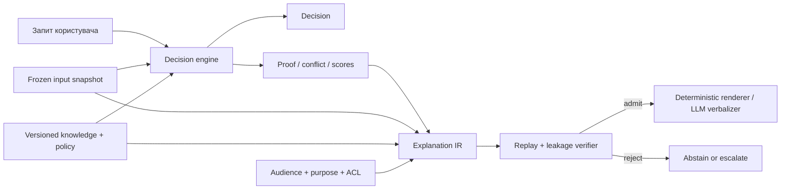
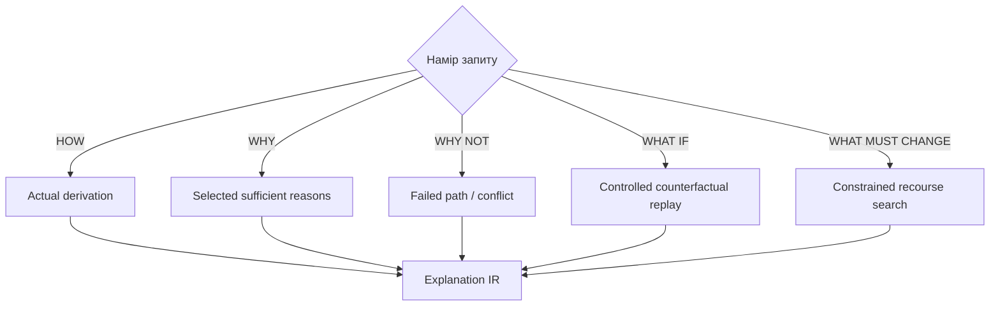
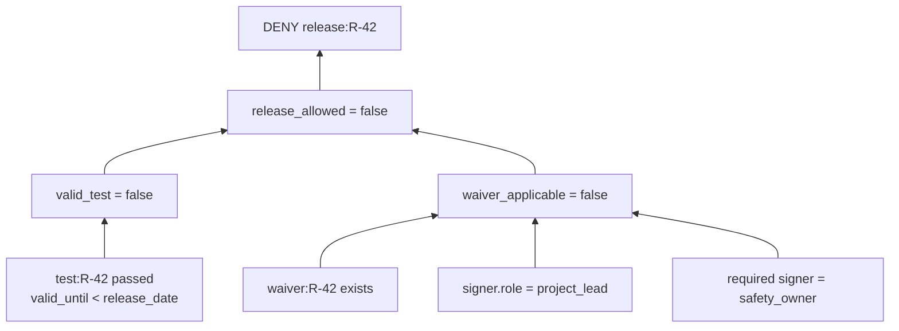
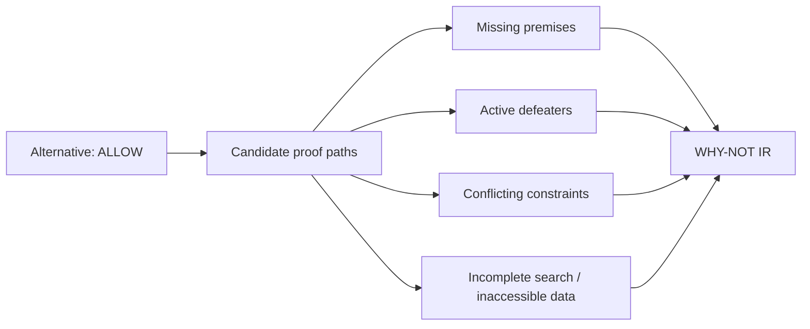

# Чому саме так, чому ні й що треба змінити: машина пояснення експертної системи

> **Серія:** [Експертні системи для R&D](README.md) · стаття 16 із 22
> **Попередня стаття:** [15 — Мовний контур експертної системи: лінгвістичні аналізатори та локальні SLM/LLM](15-Linguistic-Analysis-And-Local-Models-UA.md)  
> **Наступна стаття:** [17 — Як здобути знання з голови експерта](17-Knowledge-Elicitation-From-Experts-UA.md)  
> **Зміст серії:** [README](README.md)  
> **Рівень:** ML / Knowledge / Systems Engineer: middle+  
> **Після статті:** спроєктувати `HOW`, `WHY`, `WHY NOT`, `WHAT IF` і recourse-пояснення, які можна відтворити з конкретного snapshot.

Експертна система заблокувала реліз. У журналі є `decision=DENY`, а чат пояснює:
«ризик перевищує допустимий рівень». Це звучить переконливо, але не відповідає на
робочі запитання: яке правило спрацювало, які дані були вирішальними, чому
виняток не застосувався, чого бракує для дозволу і чи зміниться результат після
нового тесту. **Проблема цієї статті — перетворити непрозорий висновок на
відтворюване, контрастне й безпечне пояснення, не підміняючи доказ красивою
оповіддю.**

Цей матеріал переважно теоретичний: це референсний дизайн машини пояснення
(*explanation facility*), а не звіт про її вимірювання у конкретному production.
Формули задають контракти й критерії тестування; числові пороги команда має
калібрувати на власних задачах і користувачах.

Наскрізний приклад продовжує сценарій попередніх статей. Реліз `R-42` дозволено,
якщо пройдено safety test, артефакт підписано і немає відкритого blocker defect.
Тест прострочений, а waiver існує, але не підписаний уповноваженим safety owner.
Правильне пояснення — не «реліз небезпечний», а точна відповідь: **відсутнє
чинне підтвердження тесту; waiver не задовольняє умову авторизації; після нового
успішного тесту рішення треба обчислити повторно на новому snapshot.**

## Пояснення — це окремий продукт системи

[Стаття 06](06-Expert-Systems-Architecture-UA.md) ввела proof packet, [стаття
11](11-Knowledge-Base-Types-UA.md) — різні семантики баз знань, [статті
13](13-Knowledge-Acquisition-From-Question-To-Evidence-UA.md) і
[14](14-Philosophy-For-Expert-Systems-UA.md) — межу між passage, claim і правом
стверджувати. Машина пояснення не повинна реконструювати історію заднім числом.
Вона читає ті самі proof, provenance, conflict і policy artifacts, на яких
система справді ухвалила рішення.



Тут **Explanation IR** — структуроване проміжне представлення. Воно відокремлює
зміст пояснення від мови й інтерфейсу. LLM може скоротити або перекласти вже
перевірені атоми, але не додати нову причину.

Мінімальний контракт рішення:

```json
{
  "decision_id": "dec:R-42:9f1c",
  "decision": "DENY",
  "subject": "release:R-42",
  "snapshot_hash": "sha256:...",
  "knowledge_version": "kb:release-policy@7.3",
  "policy_version": "authz@12",
  "proof_root": "proof:4711",
  "evaluated_at": "2026-08-26T09:15:00Z"
}
```

Без `snapshot_hash`, версій і `proof_root` пояснення не можна відтворити. Воно є
лише коментарем до поточного стану, який уже міг змінитися.

## П'ять запитань, а не одне «чому?»

Одне універсальне explanation API приховує різні інформаційні потреби.

| Запит | Що повертає система | Типовий артефакт |
|---|---|---|
| `HOW` | як отримано фактичний висновок | proof DAG, rule firings, model stage |
| `WHY` | які підстави були вирішальними | достатній підграф доказу |
| `WHY NOT` | чому альтернативу не виведено | failed premises, defeater, unsat core |
| `WHAT IF` | що станеться в заданому контрфактичному snapshot | повторне виведення, не припущення |
| `WHAT MUST CHANGE` | яка допустима дія може змінити результат | feasible, actionable, authorized recourse |

`HOW` корисне розробнику, `WHY` — reviewer-у, `WHY NOT` — автору релізу,
`WHAT MUST CHANGE` — виконавцю. Скорочена відповідь для менеджера і детальний
proof trace для аудитора можуть відрізнятися, але мусять мати один proof root.



## Від proof DAG до короткої відповіді

Нехай система вивела claim $c$ із множини доступних premises $P$. Пояснення
$E$ має бути підмножиною фактичних підстав, достатньою для того самого висновку:

```math
E \subseteq P, \qquad K \cup E \vdash c,
```

де $K$ — зафіксована версія правил, а $\vdash$ — конкретне відношення виведення.
Ця формула не каже, що $c$ «правдиве у світі»; вона каже, що його можна повторно
вивести за правилами системи.

Довгий trace також може бути поясненням, але він перевантажує читача. Тому
шукають inclusion-minimal explanation:

```math
K\cup E\vdash c
\quad\land\quad
\forall E'\subsetneq E:\ K\cup E'\nvdash c.
```

`Minimal` тут означає: жоден елемент не можна викинути. Це не обов'язково
найменша кількість елементів. Кілька різних мінімальних пояснень можуть
одночасно бути коректними: реліз блокує і прострочений тест, і blocker defect.
Приховати другий незалежний blocker — означає дати формально правдиву, але
практично оманливу відповідь.

Для вибору з кількох пояснень корисна цільова функція:

```math
E^*=\arg\min_{E\in\mathcal E(c)}
\bigl(
\lambda_1|E|+\lambda_2\mathrm{complexity}(E)
+\lambda_3\mathrm{disclosure}(E)
+\lambda_4\mathrm{unstable}(E)
\bigr).
```

Це компроміс між стислістю, когнітивною складністю, витоком закритих даних та
нестабільністю. Ваги залежать від ролі й мети, але **faithfulness не є вагою**:
неправдиве пояснення не можна компенсувати зручністю.

### Приклад proof DAG



Для `WHY` система показує дві вирішальні гілки. Для `HOW` додає ідентифікатори
правил, timestamps і hashes. Для звичайного читача renderer пояснює `valid_until`
словами. Жодна версія не вигадує твердження «реліз спричинить аварію»: правило
доводить відсутність дозволу, а не майбутню шкоду.

## `WHY NOT`: відсутня передумова — не заперечний доказ

Якщо `ALLOW` не виведено, причина може бути різною:

- бракує факту `test_passed`;
- є доказ `test_failed`;
- правило перекрите сильнішим defeater-ом;
- обмеження суперечливі;
- search budget вичерпано;
- потрібне джерело недоступне через ACL.

Ці стани не можна стискати в одне `false`. У відкритому світі «не знайдено
чинного test report» не означає «тест провалено». Це продовжує епістемічну
дисципліну [статті 14](14-Philosophy-For-Expert-Systems-UA.md).

Для conjunctive rule

```math
r:\ p_1\land p_2\land\dots\land p_m\rightarrow c
```

множина незадоволених передумов на snapshot $s$:

```math
M_r(s)=\{p_i\mid s\not\models p_i\}.
```

Але `M_r` ще не є порадою. Частина умов може бути незмінною користувачем,
закритою або неетичною для оптимізації. Так само SMT/SAT solver може повернути
**unsatisfiable core** — підмножину обмежень, яка вже несумісна. Core не
гарантовано найменший і потребує перекладу з технічних constraint IDs у
доменно зрозумілі твердження.



## `WHAT IF` і recourse: схожі, але не тотожні

Контрфактичне питання задає новий стан: «що було б, якби waiver підписав safety
owner?» Система створює дочірній immutable snapshot, змінює лише заявлені
поля й запускає ту саму машину виведення. Відповідь має позначку
`counterfactual`, а не змішується з фактичним журналом.

Recourse шукає зміни, які не лише змінюють prediction, а можуть бути виконані
цією людиною за правилами організації. Базова оптимізація:

```math
x^*=\arg\min_{x'} d(x,x')
```

за умов

```math
D(x')=y_{target},\qquad
x'\in F_{feasible}\cap F_{actionable}\cap F_{authorized}.
```

$d(x,x')$ оцінює вартість змін; $D$ — зафіксована версія decision function;
$F_{feasible}$ виключає фізично або логічно неможливі стани;
$F_{actionable}$ — незмінні атрибути; $F_{authorized}$ — дії поза
повноваженнями. «Змініть автора історичного документа» може бути математично
близьким контрфактом, але неприйнятним recourse.

Для release gate коректні кандидати: виконати новий safety test або отримати
належно підписаний waiver. Змінити дату в архівному звіті — заборонена
маніпуляція. І навіть після виконання поради система не обіцяє `ALLOW`: могли
з'явитися нові blockers, тому потрібен повний replay.

## Символічні, ймовірнісні та ML-пояснення

### Правила й граф знань

Для правил природним поясненням є proof DAG із rule IDs, premises, defeaters і
provenance. Для knowledge graph треба розрізняти явно збережені triples та
entailed triples. Короткий path між сутностями не обов'язково є причиною
рішення; він стає доказом лише в межах визначеної семантики.

Truth Maintenance System допомагає відповісти, на яких assumptions тримається
belief і що треба retract після зміни джерела. Це особливо важливо для
немонотонного виведення: доданий факт може скасувати попередній висновок.

### Байєсівська модель

Для probabilistic inference система може показати prior, evidence і posterior:

```math
P(H\mid e)=\frac{P(e\mid H)P(H)}{P(e)}.
```

Але читачеві важливіше бачити, яка likelihood model використана, чи evidence
незалежні, звідки взято prior і наскільки posterior чутливий до цих припущень.
Показати лише `0.83` — це score display, не explanation.

Корисний аналіз чутливості:

```math
\Delta_j=P(H\mid e)-P(H\mid e_{-j}),
```

де $e_{-j}$ — набір evidence без елемента $j$. Велике $\Delta_j$ означає
впливовий доказ у цій моделі, але не автоматично причинний фактор у світі.

### Нейромережі, SHAP і LIME

Feature attribution пояснює поведінку моделі поблизу input або в межах
обраного background distribution. Для additive explanation:

```math
f(x)\approx \phi_0+\sum_{j=1}^{d}\phi_j,
```

де $\phi_j$ — внесок ознаки за конкретним методом. Це корисний diagnostic
artifact. Але attribution не є proof факту, не встановлює causality і не
пояснює весь pipeline: preprocessing, retrieval, threshold та policy могли бути
вирішальними поза моделлю.

Тому гібридна система повертає два шари: `model_evidence` («ознака підвищила
score») і `decision_proof` («policy rule порівняло calibrated score з порогом і
застосувало gate»). Небезпечно називати перше причиною фізичної події.

## Explanation IR і контроль повноважень

```json
{
  "question": "WHY_NOT",
  "actual": "DENY",
  "contrast": "ALLOW",
  "decision_ref": "dec:R-42:9f1c",
  "reasons": [
    {"type": "missing", "atom": "valid_safety_test", "source": "test:118"},
    {"type": "defeater", "atom": "waiver_authorized", "rule": "AUTH-7"}
  ],
  "uncertainty": {"status": "complete_for_declared_rules"},
  "audience": "release_author",
  "allowed_detail": "internal",
  "renderer_constraints": ["no_new_claims", "preserve_modality"]
}
```

Пояснення саме може спричинити витік. Відповідь «вашу заявку відхилено через
закритий проєкт X» розкриває X навіть без citation. Тому disclosure policy
застосовують до reason atoms і до похідних узагальнень. Якщо деталь закрита,
система повертає нейтральне «існує обмеження, доступне compliance reviewer-у»
і шлях ескалації, не фальшиву повну відповідь.

LLM-renderer отримує allowlisted atoms, relation types і templates. Його output
знову розкладається на claims: кожне твердження має прив'язатися до IR. Якщо
модель додала «саме тому пристрій небезпечний», verifier відхиляє текст.

## Як вимірювати якість

Гарне пояснення — не те, яке найбільше подобається. Потрібні окремі технічні й
людські метрики.

**Faithfulness / replay rate**:

```math
R_{replay}=\frac{\#\text{explanations whose cited proof reproduces decision}}
{\#\text{tested explanations}}.
```

Для admitted explanation цільовий invariant — 1 на підтримуваному класі задач.
Семплова оцінка не доводить абсолютної безпомилковості.

**Sufficiency** перевіряє, чи вистачає вибраних reasons для decision;
**comprehensiveness** — чи не приховали незалежну вирішальну гілку;
**contrast validity** — чи справді пояснюється заявлена альтернатива;
**stability** — чи не змінюється пояснення радикально від нерелевантної зміни;
**actionability** — чи може користувач виконати recourse;
**leakage rate** — чи не з'являються заборонені atoms.

Для стабільності двох близьких inputs:

```math
S(x,x')=J(E(x),E(x'))=
\frac{|E(x)\cap E(x')|}{|E(x)\cup E(x')|},
```

але високий Jaccard не завжди бажаний: якщо input перетнув decision boundary,
пояснення повинно змінитися. Метрику рахують лише на парах, для яких invariant
передбачає однакову логіку.

Людське оцінювання перевіряє не «чи текст приємний», а чи може представник
цільової ролі: передбачити результат на новому case, знайти помилкову premise,
оскаржити рішення або виконати безпечний наступний крок. Час до правильної дії
часто корисніший за середню оцінку зрозумілості.

## Типові режими відмови і засоби протидії

| Відмова | Чому небезпечно | Засіб |
|---|---|---|
| LLM придумує post-hoc rationale | текст не відповідає реальному computation | proof-grounded IR, claim-by-claim verification |
| показано весь trace | формальна повнота ховає вирішальне | minimal + alternative independent blockers |
| `unknown` показано як `false` | відсутність даних стає запереченням | four-valued status, explicit missing evidence |
| SHAP названо причиною | model association плутають із causality | layer labels, causal claims лише з causal model |
| counterfactual порушує реальність | порада неможлива або дискримінаційна | feasible/actionable/authorized constraints |
| snapshot змінився після рішення | пояснення не відтворюється | immutable manifest and replay |
| пояснення розкриває secret | витік через reason або contrast | explanation-aware ACL and redaction proof |
| скорочення приховало другий blocker | користувач виправляє одне й знову отримує DENY | coverage of independent sufficient denial sets |

## Мінімальна реалізація

1. Змусити inference engine повертати versioned proof/conflict artifact.
2. Ввести типи `HOW`, `WHY`, `WHY_NOT`, `WHAT_IF`, `RECOURSE` у API.
3. Побудувати Explanation IR без natural-language generation.
4. Реалізувати replay verifier і перевірку мінімальності на малих proof graphs.
5. Додати ACL на reason atoms та негативні leakage tests.
6. Для counterfactual створювати дочірній snapshot і повний повторний inference.
7. Підключити deterministic templates; LLM — лише після baseline.
8. Оцінити task utility на конкретних ролях і failure slices.
9. Versionувати renderer, policy, ontology й knowledge разом із рішенням.

Машина пояснення не робить неправильне рішення правильним. Вона робить
видимими його фактичні підстави, припущення й межі — а отже, дає змогу знайти
помилку, подати контрдоказ або безпечно змінити стан.

Наступна стаття переходить до джерела, яке найважче versionувати: знань у голові
людини. Ми розберемо, як перетворювати розповідь експерта на перевірювані
knowledge candidates, не плутаючи впевненість, авторитет і істину.

## Питання до читачів

- Чи зберігає ваша система proof root для кожного рішення?
- Чим у вашому API відрізняються `WHY NOT` і `WHAT MUST CHANGE`?
- Чи бачить користувач усі незалежні blockers, які має право бачити?
- Хто визначає незмінні, actionable й authorized ознаки для recourse?
- Чи проходить natural-language explanation автоматичний replay і leakage test?
- Яка поведінкова задача покаже, що пояснення справді допомогло?

## Посилання на інших авторів, стандарти й офіційну документацію

- William J. Clancey. [The Epistemology of a Rule-Based Expert System — A Framework for Explanation](https://doi.org/10.1016/0004-3702(83)90008-5), *Artificial Intelligence*, 1983.
- Jon Doyle. [A Truth Maintenance System](https://doi.org/10.1016/0004-3702(79)90032-7), *Artificial Intelligence*, 1979.
- Johan de Kleer. [An Assumption-Based TMS](https://doi.org/10.1016/0004-3702(86)90007-9), *Artificial Intelligence*, 1986.
- Tim Miller. [Explanation in Artificial Intelligence: Insights from the Social Sciences](https://doi.org/10.1016/j.artint.2018.07.007), *Artificial Intelligence*, 2019.
- Marco Tulio Ribeiro, Sameer Singh, Carlos Guestrin. [“Why Should I Trust You?”: Explaining the Predictions of Any Classifier](https://doi.org/10.1145/2939672.2939778), KDD 2016.
- Scott M. Lundberg, Su-In Lee. [A Unified Approach to Interpreting Model Predictions](https://papers.nips.cc/paper_files/paper/2017/hash/8a20a8621978632d76c43dfd28b67767-Abstract.html), NeurIPS 2017.
- Sandra Wachter, Brent Mittelstadt, Chris Russell. [Counterfactual Explanations without Opening the Black Box](https://arxiv.org/abs/1711.00399), 2017/2018.
- Finale Doshi-Velez, Been Kim. [Towards a Rigorous Science of Interpretable Machine Learning](https://arxiv.org/abs/1702.08608), 2017.
- W3C. [PROV-O: The PROV Ontology](https://www.w3.org/TR/prov-o/), W3C Recommendation.
- W3C. [Shapes Constraint Language (SHACL)](https://www.w3.org/TR/shacl/), W3C Recommendation.
