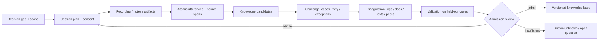
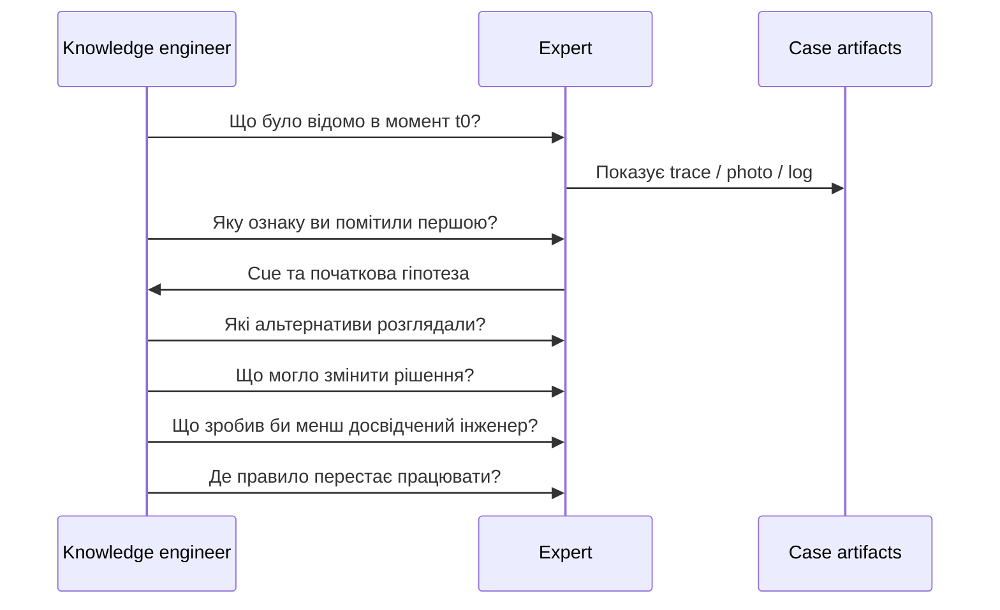
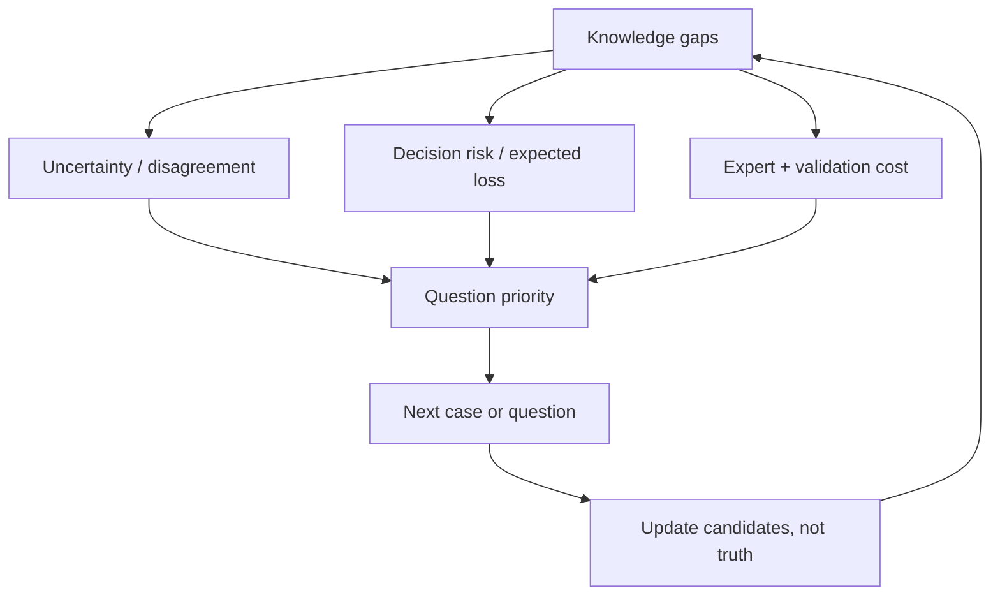
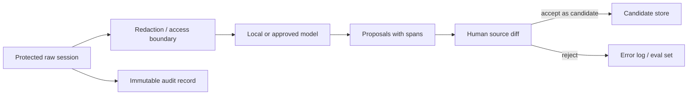

# Як перетворити досвід експерта на перевірюване знання

> **Серія:** [Експертні системи для R&D](README.md) · стаття 17 із 22
> **Попередня стаття:** [16 — Як експертна система пояснює рішення, відмову й можливість змін](16-Expert-System-Explanation-Engine-UA.md)  
> **Наступна стаття:** [18 — Від доказової рекомендації до безпечної дії](18-Expert-System-From-Recommendation-To-Action-UA.md)  
> **Зміст серії:** [README](README.md)  
> **Рівень:** інженери знань, розробники й технічні керівники: середній  
> **Після статті:** підготувати розмову з експертом, перетворити його твердження на кандидатів знань і перевірити їх на випадках, контрприкладах та незалежних джерелах.

«Запитайте нашого головного інженера — він знає систему напам’ять». Команда
записує розмову, мовна модель стискає її до двадцяти правил, а через місяць
одне з них блокує справний виріб. Тоді інженер згадує: правило стосувалося
старої ревізії плати й діяло лише за низької температури.

Так втрачається контекст неявного знання — досвіду, яким людина користується,
але не завжди формулює як правило. Завдання інженера знань полягає не в тому,
щоб отримати якомога більше тексту, а в тому, щоб разом із твердженням зберегти
умови, винятки, походження, невпевненість і спосіб перевірки.

Розглянемо конкретний приклад. Інженер прошивки діагностує рідкісну відмову
запуску пристрою. У документації є коди помилок, але немає ознаки на
осцилограмі, порядку перевірок і попередження, що звичайне перезавантаження
знищує найкращий доказ. Потрібно отримати перевірювану модель: ознака →
гіпотеза → розрізнювальна перевірка → виняток → дія, зберігши слова й
невпевненість автора. Запропонований нижче метод треба адаптувати до ризику,
права на запис та організаційної культури; кількість розмов не доводить повноти.

## Чому запис розмови ще не є знанням

[Стаття 10](10-Knowledge-Acquisition-System-UA.md) описала ingestion документів,
provenance та curation. [Стаття 13](13-Knowledge-Acquisition-From-Question-To-Evidence-UA.md)
показала шлях від passage до grounded claim, а [стаття
16](16-Expert-System-Explanation-Engine-UA.md) — як рішення пояснюється через
реальний proof. Людське elicitation додає складність: джерело може змінити
формулювання, не усвідомлювати власну евристику або змішати побачене з
пізнішим поясненням.



Пунктирної магії «вилучити знання» немає. Є ланцюг перетворень, де кожен крок
може внести інтерпретацію. Transcript — evidence того, що людина це сказала.
Він не є evidence того, що твердження універсально правильне.

Корисна система статусів:

```text
utterance → candidate → corroborated candidate → validated rule → released knowledge
```

Підвищення статусу завжди потребує окремої підстави. LLM summary не може
перескочити з `utterance` у `validated rule`.

## Спершу визначити рішення, а не призначати інтерв'ю

Запит «розкажіть усе, що знаєте про boot» створить довгий transcript і мало
testable knowledge. Перед сесією треба визначити:

- яке рішення система має підтримати;
- хто й у якому середовищі його ухвалює;
- ціна false positive, false negative й затримки;
- які cases складні або рідкісні;
- які знання вже є в документах, telemetry та code;
- які твердження експерт не має права розкривати;
- що буде ознакою корисного результату сесії.

Для прикладу decision — не «зрозуміти boot», а «до power-cycle вибрати наступне
спостереження, яке розділяє power-rail fault, clock-startup fault і corrupted
firmware». Таке формулювання одразу породжує конкретні питання.

Добре визначене рішення задає межу всієї подальшої роботи. Воно показує, які
випадки принести на розмову, які помилки особливо дорогі й за якою поведінкою
майбутньої системи можна буде судити, що знання справді допомагає.

## Як вибрати спосіб роботи з експертом

Один метод систематично втрачає певний тип знання. Вільне інтерв'ю добре збирає
мову домену, але погано відтворює часовий pressure. Спостереження бачить дії,
але не завжди їх мотиви. Think-aloud відкриває послідовність, проте саме
вербалізування може змінити роботу.

| Метод | Найкраще виявляє | Основне обмеження |
|---|---|---|
| напівструктуроване інтерв'ю | поняття, межі, пояснення | retrospective rationalization |
| спостереження / contextual inquiry | реальний workflow, інструменти, обхідні шляхи | невидимі міркування, privacy |
| think-aloud / protocol analysis | порядок уваги й проміжні гіпотези | реактивність, високе навантаження |
| Critical Decision Method | cues, options, time pressure у конкретному incident | залежність від пам'яті про подію |
| laddering (`як?`, `чому?`) | ієрархію цілей, критеріїв і дій | ведуче питання може нав'язати структуру |
| repertory grid / triads | приховані bipolar constructs і відмінності cases | штучність та складність на великій множині cases |
| card sorting | категорії й ментальну таксономію | не дає достатньо процедурних знань |
| scenario / simulation | conditional behavior і реакцію на аномалії | якість залежить від реалізму сценарію |

### Тріада замість питання «що важливо?»

Покажемо експерту три boot traces і спитаємо: «Які два схожі між собою, але
відрізняються від третього — і за якою ознакою?» Відповідь може відкрити
construct `clock begins before rail stabilization ↔ after stabilization`, якого
немає в схемі даних. Потім треба уточнити observable definition, одиниці,
пороги, винятки й перевірити construct на нових traces.

### Критичний випадок замість загального правила

Для реального incident корисна часова реконструкція:



Питання ставлять відносно інформації, доступної **тоді**, а не outcome, відомого
сьогодні. Інакше hindsight bias робить шлях до рішення надто прямим.

## Як перетворити фразу на кандидата знання

Експерт каже: «Якщо друга сходинка на фронті живлення пласка, майже завжди
винен клок; плату не перезапускайте». Це ще не готове правило. Треба розкласти
його на типізовані поля:

```yaml
candidate_id: candidate:clock-startup-flat-slope:017
source:
  session: ses-2026-08-26-02
  speaker: expert-07
  span: "00:31:14.220/00:31:27.810"
context:
  board_revisions: [C, D]
  temperature_c: "< -10"
observation:
  feature: rail_second_step_slope
  operator: "<"
  threshold: null
hypothesis:
  value: clock_startup_fault
  speaker_modality: "almost_always"
action:
  prohibit: power_cycle_before_trace_capture
exceptions: []
open_questions:
  - operational threshold for "flat"
  - applicability to revision E
status: candidate
```

`threshold: null` — не дефект serialization, а чесна прогалина. Поставити `0.1`
на основі інтонації було б вигадуванням. `speaker_modality` зберігає слова
експерта, але не стає автоматично calibrated probability.

Knowledge candidate має посилання і на raw span, і на інтерпретацію knowledge
engineer-а. Правка кандидата не переписує transcript. Якщо запис заборонено,
підписані сесійні нотатки теж versionують, але позначають нижчу auditability.

## Як ставити питання, що виявляють межі

Після позитивного прикладу завжди потрібен challenge loop:

- **Уточнення:** що саме означає «пласка» і як це виміряти?
- **Контраст:** який trace схожий, але веде до іншої гіпотези?
- **Виняток:** коли ознака присутня, а clock справний?
- **Відсутність:** що робити, якщо потрібного каналу немає?
- **Час:** чи змінюється правило після прогріву або повторного старту?
- **Походження:** ви це спостерігали, читали чи вивели?
- **Незгода:** хто з колег вирішив би інакше і чому?
- **Перевірка:** який тест міг би спростувати ваше правило?

Так розмова збирає приклади на підтримку правила та його межу застосування.
Запит «правильно, що X завжди означає Y?» є ведучим: він пропонує універсальне
правило і заохочує згоду. Краще дати case без label і попросити прогноз перед
розкриттям результату.

Завершувати такий цикл треба запитанням, яке може спростувати початкову
гіпотезу. Якщо експерт не може назвати жодного можливого контрприкладу, це
сигнал шукати інші випадки й джерела, а не вважати правило універсальним.

## Як відрізнити впевненість від частоти

«Зазвичай» різні люди використовують для різних частот. Якщо є cases, суб'єктивне
твердження можна зіставити з даними. Для $n$ релевантних cases, де outcome
спостерігався $k$ разів, проста частота

```math
\hat p=\frac{k}{n}
```

без інтервалу невизначеності створює хибну точність. За Beta prior
$p\sim\mathrm{Beta}(\alpha,\beta)$ posterior:

```math
p\mid k,n\sim\mathrm{Beta}(\alpha+k,\beta+n-k).
```

Тут $0\le k\le n$, а $\alpha>0$ і $\beta>0$ задають попереднє припущення.
За малої кількості випадків результат може істотно залежати від цього вибору,
тому разом з оцінкою треба показувати дані та використаний prior.

Мета не «замінити експерта статистикою», а відрізнити три величини:
`speaker confidence`, емпіричну частоту та calibrated model probability. Вони
можуть не збігатися й мусять мати різні поля.

Для кількох annotators raw agreement завищується, коли одна категорія домінує.
Cohen's $\kappa$ для двох annotators:

```math
\kappa=\frac{p_o-p_e}{1-p_e},
```

де $p_o$ — observed agreement, $p_e$ — agreement, очікуване від marginal
frequencies. Низька $\kappa$ може означати нечіткий guideline, різні domain
models або prevalence effect; вона не доводить, що один експерт «поганий».
Для багатьох annotators і missing labels доречні інші coefficients, наприклад
Krippendorff's alpha, із заздалегідь визначеною metric for disagreements.
Якщо $p_e=1$, знаменник дорівнює нулю і $\kappa$ не визначена; це окремий
вироджений випадок, а не ідеальна доказова згода.

## Яке питання поставити наступним

Час експерта дорогий, тому не всі прогалини однаково важливі. Нехай $\Theta$ —
невідомі параметри або правила, $D$ — уже зібрані дані, $q$ — можливе питання,
$a$ — відповідь. Очікуваний information gain:

```math
IG(q)=H(\Theta\mid D)-
\mathbb E_{a\sim P(a\mid q,D)}[H(\Theta\mid D,q,a)].
```

Entropy для дискретної змінної:

```math
H(\Theta)=-\sum_i P(\theta_i)\log P(\theta_i).
```

Але найбільш невизначене питання може не мати operational value. Практичний
пріоритет враховує ризик рішення, очікуване зменшення втрати та вартість:

```math
q^*=\arg\max_q
\frac{\mathbb E[L(a_0)-L(a_q)]}{C_{expert}(q)+C_{validation}(q)}.
```

$a_0$ — найкраща дія без відповіді, $a_q$ — дія після відповіді, $L$ — loss.
$C_{expert}(q)+C_{validation}(q)$ має бути додатною і враховувати не тільки час
розмови, а й ціну перевірки відповіді. Оцінки приблизні, проте змушують команду
питати не «що цікаво», а «яке знання
може змінити дороге рішення?» Це зв'язок з active learning, але oracle-експерт
тут теж помиляється і має право відповісти `не знаю`.



## Кілька експертів: незгоду не усереднюють автоматично

Експерти можуть працювати з різними ревізіями, ринками, інструментами або
цілями. `Expert A says 0.7`, `Expert B says 0.3`, а система записує `0.5` — це
втрата context, не consensus.

Спочатку моделюють disagreement:

```math
d=(claim, expert, context, rationale, evidence, confidence\_type).
```

Потім перевіряють: це суперечність фактів, різні definitions, різні applicability
conditions чи різний trade-off. Іноді результат — два правила з явним context,
а не один компроміс. Для policy knowledge owner може ухвалити норму; для
empirical claim потрібні дані; для value judgment слід зберегти governance
decision окремо від наукового факту.

Анонімний Delphi-подібний цикл може зменшити status pressure, але consensus не
гарантує істину. Дисидентський counterexample треба зберігати, а не видаляти як
«шум».

## Яку роботу можна доручити мовній моделі

SLM/LLM може:

- транскрибувати з перевіркою timestamps;
- запропонувати segmentation і терміни;
- знайти потенційні суперечності між сесіями;
- згенерувати **кандидати** уточнювальних питань;
- перетворити затверджену структуру в читабельний draft.

Вона не може сама визначити правдивість, domain scope, authority або informed
consent. Модель схильна «заповнити» пропущений threshold і згладити незгоду.
Кожне generated field має source span або статус `model_hypothesis`.



Transcript може містити персональні дані, credentials, vulnerabilities і
експортно-контрольовану інформацію. Право на використання для навчання моделі не
випливає з права провести інтерв'ю. Retention, deletion, access і model endpoint
узгоджують до запису.

## Як перевірити отримане правило

Member checking потрібен: експерт підтверджує, що candidate коректно передає
його думку. Але це ще не незалежна перевірка rule. Надійніша послідовність:

- **Вірність джерелу:** кандидат відтворює слова й матеріали сесії.
- **Зіставлення джерел:** правило порівняно з журналами, документами, тестами
  або свідченнями людей з іншими ролями.
- **Контрприклади:** знайдено граничні випадки й умови скасування правила.
- **Вимірюваність:** усі ознаки, одиниці та часові вікна визначені.
- **Відкладені випадки:** інженер знань не добирає тільки знайомі успіхи.
- **Перспективна перевірка:** система прогнозує до розкриття результату.
- **Відповідальність:** власник, строк чинності, підстава перегляду й відкат визначені.

Для rule $r$ на labeled cases корисні precision та recall, але loss часто
асиметричний:

```math
\widehat R(r)=\frac{1}{N}\sum_{i=1}^{N}
L\bigl(r(x_i),y_i; context_i\bigr).
```

Формула потребує $N>0$ і заздалегідь визначеної функції втрат. Слід звітувати
slices за revision, temperature, expert і rare failure mode.
Один aggregate score може приховати саме той режим, для якого правило збирали.

## Які помилки спотворюють слова експерта

Навіть добре проведена розмова може породити хибне правило, якщо команда
забуде, що пам’ять відновлює події, питання впливають на відповідь, а повторене
твердження не стає незалежним підтвердженням. Найпоширеніші помилки варто
перевіряти як окремі сценарії відмови.

| Відмова | Наслідок | Протидія |
|---|---|---|
| загальне інтерв'ю без decision scope | багато тексту, мало testable knowledge | decision/task analysis і case prompts |
| hindsight bias | шлях здається очевидним після outcome | timeline, «що було відомо тоді?» |
| leading question | elicitor вкладає правило в уста експерта | neutral prompts, blinded cases |
| tacit cue лишився прикметником | «поганий сигнал» неможливо реалізувати | observable definition, examples, threshold study |
| LLM заповнила прогалину | вигадане значення набуває authority | nullable fields, source-span verifier |
| consensus стер disagreement | context-specific правила стають хибним середнім | disagreement record і adjudication by claim type |
| повторна згадка прийнята за незалежне підтвердження | подвійний підрахунок одного джерела | provenance graph і dependency tracking |
| експерт підтвердив власне правило | member check названо validation | held-out, independent and prospective tests |
| «насичення» названо повнотою | rare cases не представлені | explicit unknowns, risk-based sampling |

Усі наведені помилки підвищують статус твердження без нової підстави: розповідь
стає правилом, згода — істиною, а стислий переказ моделі — підтвердженням.
Протидія щоразу повертає втрачений зв’язок із джерелом, контекстом або тестом.

Тому журнал помилок сесії має бути частиною процесу. Якщо модель вигадала
поріг, питання виявилося навідним або експерти розійшлися в тлумаченні, цей
випадок зберігають для наступної перевірки, а не виправляють непомітно.

## Як провести перший цикл здобування знань

Почати варто з одного дорогого рішення та 10–20 різнорідних історичних
випадків. До запису узгоджують згоду, доступ, строк зберігання й межі
нерозголошення. Коротка вступна розмова дає словник предметної області та
розкладає роботу на конкретні задачі.

Далі разом відновлюють часову послідовність двох критичних випадків, не
показуючи результат завчасно, і спостерігають міркування на новому випадку.
Тріади та запитання «як?» і «чому?» застосовують до найменш визначених понять.
Кожне отримане твердження стає кандидатом із посиланням на фрагмент джерела,
контекстом, винятками та відкритими питаннями.

Окрема сесія має атакувати кандидатів контрприкладами. Після неї правила
перевіряють на відкладених випадках і незалежних матеріалах. Тільки результат,
який пройшов перегляд, отримує власника, строк чинності, умову повторної оцінки
й право потрапити до робочої бази знань.

Для boot failure результатом може бути не «експертна модель готова», а три
validated cues, один safety invariant `capture before power-cycle` і список
чотирьох відкритих питань. Це якісніший outcome, ніж двадцять повних, але
вигаданих правил.

## Висновок

Здобування знань — це не перенесення готових правил із голови людини до бази.
Це послідовне перетворення розповіді на кандидата, кандидата — на вимірюване
твердження, а твердження — на перевірене правило з відомими межами й джерелом.

Читач тепер може визначити рішення перед інтерв’ю, вибрати метод для потрібного
типу досвіду, зберегти невпевненість та незгоду й відрізнити підтвердження слів
експерта від перевірки правила у світі. Він також знає, яку допоміжну роботу
можна доручити мовній моделі й де її пропозиція має залишитися лише кандидатом.

Наступна стаття починається там, де завершується ця: навіть перевірене знання і
добре пояснення ще не дають системі права змінювати реальний світ. Для цього
потрібен окремий action contract із preconditions, authority, postcondition
verification і rollback.

## Питання до читачів

- Яке рішення, а не тему, має підтримати ваша наступна elicitation-сесія?
- Як у вашій схемі відрізняються слова експерта, інтерпретація й validated rule?
- Який tacit cue досі не має вимірюваного визначення?
- Як ви зберігаєте disagreement без примусового усереднення?
- Чи може експерт сказати `не знаю`, не провокуючи LLM заповнити пропуск?
- Який prospective test справді може спростувати отримане правило?

## Посилання на інших авторів і публікації

- Anna Hart. [Knowledge Elicitation: Issues and Methods](https://doi.org/10.1016/0010-4485(85)90293-3), *Computer-Aided Design*, 1985.
- Nancy J. Cooke. [Varieties of Knowledge Elicitation Techniques](https://doi.org/10.1006/ijhc.1994.1083), *International Journal of Human-Computer Studies*, 1994.
- Robert R. Hoffman, Nigel R. Shadbolt, A. Mike Burton, Gary Klein. [Eliciting Knowledge from Experts: A Methodological Analysis](https://doi.org/10.1006/obhd.1995.1039), 1995.
- A. Mike Burton, Nigel R. Shadbolt, Gordon Rugg, A. P. Hedgecock. [The Efficacy of Knowledge Elicitation Techniques: A Comparison across Domains and Levels of Expertise](https://doi.org/10.1016/S1042-8143(05)80010-X), *Knowledge Acquisition*, 1990.
- Brian R. Gaines, Mildred L. G. Shaw. [Knowledge Acquisition Tools Based on Personal Construct Psychology](https://doi.org/10.1016/0747-5632(93)90003-I), 1993.
- Gary Klein, Roberta Calderwood, Donald MacGregor. [Critical Decision Method for Eliciting Knowledge](https://doi.org/10.1109/21.31053), *IEEE Transactions on Systems, Man, and Cybernetics*, 1989.
- K. Anders Ericsson, Herbert A. Simon. [Protocol Analysis: Verbal Reports as Data](https://mitpress.mit.edu/9780262550239/protocol-analysis/), MIT Press.
- Guus Schreiber та ін. [Knowledge Engineering and Management: The CommonKADS Methodology](https://mitpress.mit.edu/9780262193009/knowledge-engineering-and-management/), MIT Press, 2000.
- Burr Settles. [Active Learning Literature Survey](https://minds.wisconsin.edu/handle/1793/60660), University of Wisconsin–Madison, 2009.
- Claude E. Shannon. [A Mathematical Theory of Communication](https://doi.org/10.1002/j.1538-7305.1948.tb01338.x), 1948.
- Jacob Cohen. [A Coefficient of Agreement for Nominal Scales](https://doi.org/10.1177/001316446002000104), 1960.
- Klaus Krippendorff. [Content Analysis: An Introduction to Its Methodology](https://us.sagepub.com/en-us/nam/content-analysis/book258450), SAGE.
- Daniel Kahneman, Paul Slovic, Amos Tversky (eds.). [Judgment under Uncertainty: Heuristics and Biases](https://doi.org/10.1017/CBO9780511809477), Cambridge University Press, 1982.
