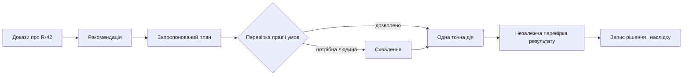

# Коли експертній системі можна діяти: від поради до перевірюваного результату

> **Серія:** [Експертні системи для R&D](README.md) · стаття 18 із 22
>
> **Попередня стаття:** [17 — Як здобути знання з голови експерта](17-Knowledge-Elicitation-From-Experts-UA.md)
>
> **Наступна стаття:** [19 — Як перевіряти базу знань і машину виведення](19-Expert-System-Knowledge-Base-Verification-UA.md)
>
> **Рівень:** розробники й інженери: середній
> **Після статті:** відрізнити рекомендацію від дії, описати безпечну дію та перевірити, чи справді вона дала потрібний результат.

Система знайшла проблему: для релізу `R-42` бракує повторного тесту безпеки. Порада зрозуміла — замовити тест. Але щойно програмі дозволяють самій бронювати стенд, змінювати статус релізу або надсилати запити, виникає інше питання: що саме вона має право змінити і як переконатися, що зміна відбулася правильно?

На перший погляд, це проста різниця між фразою й викликом API. Насправді саме тут найчастіше ламаються демонстрації «автономних агентів»: система правильно міркує, але діє не в тому середовищі, не з тими параметрами, повторює запит після збою або приймає відповідь сервера за доказ успіху.

Ця стаття не пропонує передати машині відповідальність за небезпечні рішення. Вона показує, як перетворити рекомендацію на обмежену, відтворювану дію, яку можна пояснити, перевірити й, коли можливо, скасувати.

## Порада ще нічого не змінює

Рекомендація відповідає на запитання «що варто зробити». Наприклад: «повторити тест безпеки». План додає послідовність кроків: знайти вільний стенд, створити запит, дочекатися результату. Дія ж змінює зовнішній світ: бронює час, створює запис, блокує реліз або запускає обладнання.

Ці три речі не можна змішувати. Мовна модель або планувальник можуть запропонувати вдалий план, але не мають самі визначати, чи можна виконати його саме зараз. Для `R-42` система спочатку має показати доказ: який тест відсутній, для якої версії релізу, хто відповідає за перевірку і який ризик знімає повторний запуск.

Лише після цього з’являється кандидат на дію. Такий порядок захищає команду від автоматизації заради автоматизації: система не «робить щось корисне», а виконує конкретний крок, який випливає з перевіреного висновку.

## Право діяти залежить від наслідків

Немає корисного перемикача «система автономна». Вона може безпечно зібрати дані, підготувати чернетку запиту або створити низькоризиковий запис, але не мати права зупиняти виробництво чи міняти параметри пристрою. Дозвіл визначають для конкретної дії, середовища і наслідку помилки.

Для `R-42` безпечним першим кроком може бути чернетка заявки на тест. Бронювання одного стенду на 45 хвилин — уже дія, яку варто прив’язати до схвалення. Автоматично заблокувати реліз можна лише за чітким правилом, якщо стан релізу читається з авторитетного джерела, а розблокування має окрему процедуру.

Поріг визначає не модель, а відповідальна організація. Що важче скасувати дію, що більше людей або систем вона зачіпає і що гірше ми бачимо її наслідок, то вужчими мають бути повноваження. Це правило особливо важливе для фізичного обладнання, медицини, фінансів і безпеки.

## Дія має бути описана так, щоб її можна було прочитати

Фраза «забронюй стенд» недостатня: вона не називає стенд, час, обсяг, передумови й спосіб перевірки. Перед виконанням система формує структурований запис дії. У ньому є мета, точний інструмент і параметри, виконавець, межі його прав, строк дії схвалення, очікуваний результат і план на випадок невдачі.

Для прикладу, запис має сказати не просто «створити заявку», а «зарезервувати стенд safety-3 на 45 хвилин для R-42, якщо реліз досі заблокований і стенд відповідає потрібному класу безпеки». Це дозволяє людині схвалити саме те, що буде зроблено, а програмі — перевірити умови перед викликом інструмента.

Формально дія $a$ допустима лише в стані $s$, де виконано її передумови $Pre(a)$:

$$s \models Pre(a).$$

Цей короткий запис має дуже практичний сенс: якщо реліз уже схвалили або стенд змінив клас безпеки, старий план не можна виконувати мовчки. Його треба переглянути або відхилити.

## Серверна відповідь не дорівнює результату

Найпоширеніша помилка — вважати `200 OK` завершенням історії. Після мережевого збою система може не знати, чи бронювання не почалося, уже відбулося або ще виконується. Повторний запит здатен створити два записи, надіслати два листи чи двічі запустити дорогий процес.

Тому кожна дія має сталий ідентифікатор повторення. Якщо система повторно надсилає той самий запит, інструмент повинен залишити бізнес-результат незмінним:

$$apply(a,k);apply(a,k) \equiv apply(a,k),$$

де $k$ — ключ конкретної дії. Коли результат невідомий, правильна реакція — не автоматичне повторення, а перевірка стану в джерелі правди.

Навіть після успішної відповіді інша частина системи має прочитати фактичний стан: чи справді існує бронювання для `R-42`, на правильний час і стенд. Це розділяє того, хто виконав дію, і того, хто засвідчує її наслідок.

## Що робити, коли дія не дала очікуваного результату

Не всі дії можна скасувати. Скасування бронювання може звільнити ресурс, але не поверне час команди, яка вже почала підготовку. Відкочування прошивки не повертає вимірювання, втрачені під час невдалої спроби. Тому незворотні дії потребують сильнішого схвалення або взагалі не повинні бути автоматичними.

Для оборотних дій корисно заздалегідь описати: як виявити невдачу, хто відповідає за відновлення, яку зворотну дію можна виконати і коли слід зупинитися та передати справу людині. У випадку `R-42` невдала заявка не дає системі права шукати будь-який інший стенд; вона має показати проблему відповідальному інженерові.

Так само важливо відокремити дані від команд. Текст у документі, коментар у задачі чи відповідь зовнішнього сервісу можуть бути джерелом доказів, але не дозволом викликати інструмент. Доступ до інструментів, параметри й правила мають надходити з окремого, контрольованого механізму.

## Як упроваджувати обережно

Почніть із режиму, у якому система лише пояснює проблему й готує чернетку дії. Порівняйте її пропозиції з рішеннями людей, перевірте помилки параметрів і незрозумілі випадки. Потім дозвольте один малоризиковий, оборотний крок за обмеженими правилами — наприклад, створити заявку після схвалення.

Перевіряйте не тільки частку успішних завдань. Важливіші інші запитання: скільки дій порушили правила, скільки результатів лишилися невідомими, чи були дублікати після повторної доставки, скільки часу потрібно, щоб повернути систему в безпечний стан. Добра автоматизація не та, що робить найбільше, а та, що вчасно зупиняється.

Наступна стаття розвине цю думку: перед тим як довірити системі рекомендацію або дію, треба перевірити самі правила, на яких вона міркує.

## Висновок

Експертна система стає корисною помічницею не тоді, коли вміє викликати інструменти, а коли її дії мають зрозумілу причину, точні межі, перевірюваний наслідок і відповідального за відновлення. Читач тепер може відрізнити пораду від дії, описати мінімальні передумови безпечного виклику та пояснити, чому відповідь сервера ще не є доказом успіху.

## Короткий словник

- **Рекомендація** — обґрунтована пропозиція, що не змінює зовнішній стан.
- **Передумова дії** — факт, який має бути істинним перед виконанням.
- **Ідемпотентність** — властивість повторної операції не створювати нового бізнес-ефекту.
- **Джерело правди** — система, у якій перевіряють фактичний стан об’єкта.

## Посилання

- Malik Ghallab, Dana Nau, Paolo Traverso. [Automated Planning: Theory and Practice](https://www.sciencedirect.com/book/9781558608566/automated-planning), 2004.
- Hector Garcia-Molina, Kenneth Salem. [Sagas](https://doi.org/10.1145/38713.38742), 1987.
- Leslie Lamport. [Time, Clocks, and the Ordering of Events in a Distributed System](https://doi.org/10.1145/359545.359563), 1978.
- NIST. [AI Risk Management Framework 1.0](https://doi.org/10.6028/NIST.AI.100-1), 2023.
- OWASP. [Agentic AI — Threats and Mitigations](https://genai.owasp.org/resource/agentic-ai-threats-and-mitigations/).
