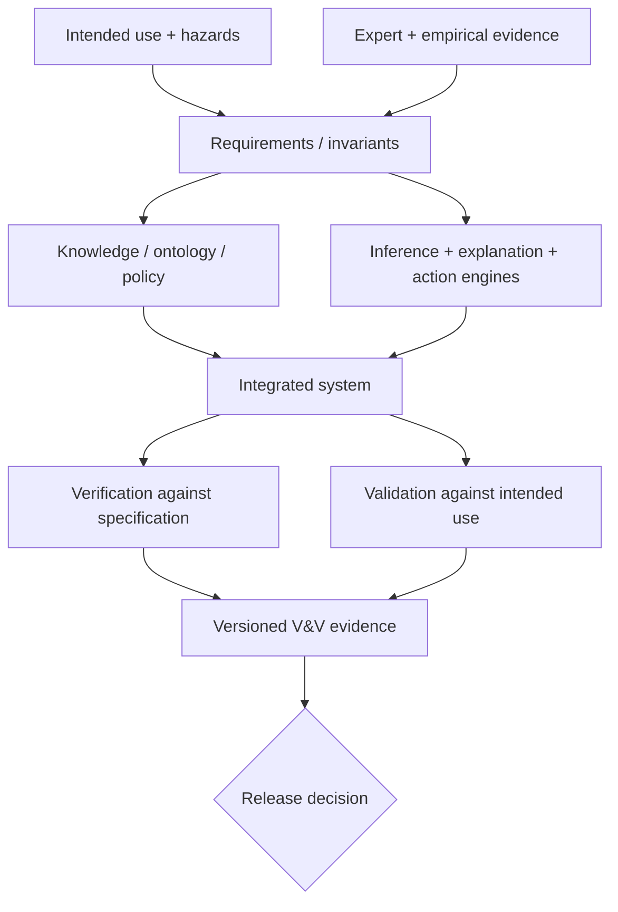
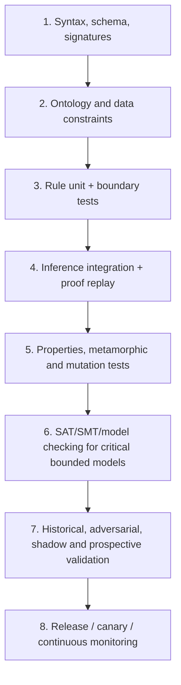
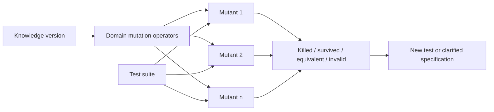
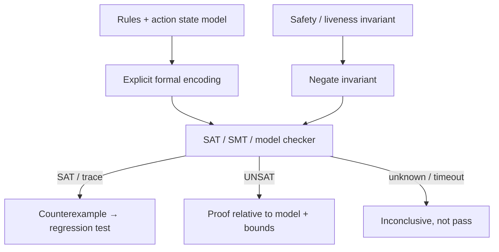
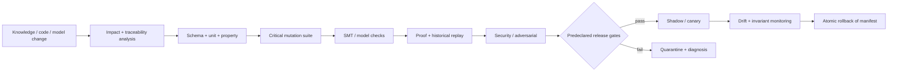

# Як перевірити, чи можна довіряти правилам експертної системи

> **Серія:** [Експертні системи для R&D](README.md) · стаття 19 із 22
> **Попередня стаття:** [18 — Від доказової рекомендації до безпечної дії](18-Expert-System-From-Recommendation-To-Action-UA.md)  
> **Наступна стаття:** [20 — Діагностика в експертних системах](20-Expert-System-Diagnosis-UA.md)  
> **Зміст серії:** [README](README.md)  
> **Рівень:** розробники й інженери: середній  
> **Після статті:** пояснити, чому кілька правильних відповідей не доводять надійність системи, і скласти перший план перевірки правил.

Система правильно відповіла на двадцять знайомих запитів, тому команда готує
нову базу правил до випуску. Уже в роботі виявляється: одне правило ніколи не
спрацьовує, два утворюють цикл, а зміна одиниці вимірювання дозволяє реліз без
чинного тесту безпеки. Приклади були правильні, але система все одно виявилася
ненадійною.

Ця стаття пояснює, як перевіряти не лише окрему відповідь, а й самі правила,
дані, спосіб міркування та пояснення рішення. Ми почнемо з простого правила
про реліз без чинного тесту, а складніші перевірки вводитимемо лише там, де
звичайних прикладів уже недостатньо.

Це навчальний огляд перевірки й підтвердження придатності, а не сертифікаційний
звіт або гарантія повноти. Формальні методи доводять
властивості лише відносно моделі та припущень; тестування показує наявність
помилок у перевіреній області, але не їх абсолютну відсутність. Галузеві
стандарти можуть вимагати додаткових незалежних процесів.

У всіх прикладах нижче перевіряємо одне правило: реліз можна схвалити лише за
чинного тесту безпеки, підписаного артефакту й відсутності блокувального дефекту.
Окремо схвалений виняток може замінити лише перевірку тесту. Цей приклад не
залежить від інших статей серії: він потрібен, щоб побачити, як одна вимога
перевіряється різними способами.

## Правило може бути правильно виконаним, але хибним за змістом

У робочому розрізненні:

- **verification**: чи реалізована задекларована специфікація коректно;
- **validation**: чи сама специфікація і система придатні для реального рішення.

Можна ідеально реалізувати хибне правило експерта. Можна мати правильне правило,
але engine із помилковим conflict resolution. Тому [elicitation зі статті
17](17-Knowledge-Elicitation-From-Experts-UA.md) потребує validation на cases, а
[proof packets зі статей 06](06-Expert-Systems-Architecture-UA.md) і
[16](16-Expert-System-Explanation-Engine-UA.md) — verification через replay.



Test oracle теж має provenance. Якщо expected label створив той самий rule
author, який реалізував правило, це корисний unit test, але не незалежна domain
validation.

## Перевіряють не файл правил, а всю систему рішення

Перевірити лише `rules.yaml` недостатньо. Результат залежить від:

```math
y=F(x,K,O,P,C,M,R),
```

де $x$ — input snapshot, $K$ — knowledge base, $O$ — ontology, $P$ — policy,
$C$ — conflict resolution, $M$ — ML/model stages, $R$ — runtime/configuration.
Зміна parser, unit normalizer або threshold може змінити decision без правки
правила.

Test manifest фіксує hashes усіх компонентів, seed, clock policy, external
fixtures і hardware/runtime, якщо вони впливають на результат. Для LLM або
approximate retrieval зберігають raw stage outputs; end-to-end nondeterminism не
повинен ховати deterministic invariant failures.

## Від простих перевірок до випробування в реальних умовах



Вищий рівень не замінює нижчий. Historical accuracy не знайде duplicate rule ID,
а schema validation не покаже, що правило шкодить intended use.

### Чи правильно записані правила й посилання

На кожен commit перевіряють parseability, типи, units, унікальність IDs,
існування referenced predicates, version constraints, signatures, owner і
validity interval. `valid_until` має бути timestamp із timezone, а не рядок,
лексикографічне порівняння якого випадково «працює».

### Чи узгоджені поняття та дані

OWL reasoner може знаходити logical inconsistency за заявленою OWL semantics;
SHACL перевіряє, чи RDF data graph відповідає shapes: cardinality, datatype,
range та складні constraints. Це різні запитання. Open-world ontology не
перетворюється автоматично на closed-world form validation.

Для кожного `SafetyTest` shape може вимагати `artifact`, `result`,
`performed_at`, `valid_until`, `method_version` і `source_hash`. SHACL report є
versioned artifact CI, але `sh:conforms=true` не доводить, що вимірювання
правильне.

### Чи працює кожне правило окремо

Кожне правило тестують щонайменше на:

- nominal positive case;
- кожну окремо відсутню premise;
- boundary значення і одиниці;
- active defeater / exception;
- `unknown`, conflict і inaccessible evidence;
- applicability до version/time/context;
- expected proof atoms, не лише final label.

Для правила

```math
valid\_test\land signed\land\neg blocker\rightarrow allow
```

три позитивні facts не достатні. Треба перевірити, що `unknown(blocker)` не
трактується як $\neg blocker$, якщо policy вимагає closed-world підтвердження.

## Кількість перевірених правил ще не доводить якості

Нехай $R$ — released rules, $R_f\subseteq R$ — rules, які хоча б раз спрацювали
на suite. Firing coverage:

```math
C_{fire}=\frac{|R_f|}{|R|}.
```

Високе $C_{fire}$ не означає, що перевірено всі умови. Для rule із $m$
предикатами потрібні condition/boundary cases. Низьке coverage може означати
мертве правило, рідкісний hazard або слабкий test generator — ці причини мають
різні рішення.

Корисна traceability matrix:

| Requirement / hazard | Rule / policy | Positive test | Negative/boundary | Owner |
|---|---|---|---|---|
| тільки чинний safety evidence | `REL-12` | `case-104` | `case-105..109` | Safety |
| waiver підписує safety owner | `AUTH-7` | `case-205` | `case-206..211` | Compliance |
| blocker завжди забороняє ALLOW | `REL-2` | — | property `INV-01` | Release |

Порожня клітинка не завжди defect, але завжди видима прогалина.

## Як перевірити правило на багатьох можливих станах

Example tests фіксують відомі cases. Property-based generator створює багато
valid і deliberately invalid snapshots, а oracle перевіряє інваріанти.

Критичний invariant:

```math
\forall s:\ blocker(s)=true\Rightarrow decision(s)\ne ALLOW.
```

Інші властивості:

```math
decision(s)=ALLOW\Rightarrow
valid\_test(s)\lor authorized\_waiver(s),
```

```math
retract(e,s)\Rightarrow e\notin support\bigl(recompute(s)\bigr),
```

```math
unauthorized(u,e)\Rightarrow
output(u,s)\ \text{does not depend on secret }e.
```

Останнє — information-flow property, яку складно довести end-to-end; у тестах
її наближають paired inputs, canaries й leakage detectors. Якщо generator
знайшов failure, shrinking має звести його до малого контрприкладу: наприклад,
`blocker=true` плюс один stale cache flag.

Випадковість не замінює domain design. Generator має знати допустимі залежності,
інакше витратить budget на неможливі стани або, навпаки, ніколи не породить
рідкісну комбінацію.

## Як зіставити відповіді після контрольованої зміни даних

Коли exact expected answer дорогий, перевіряють відношення між runs.

**Metamorphic relation** для нерелевантної перестановки evidence:

```math
F(permute_{irrelevant}(x))=F(x).
```

Для додавання duplicate source за policy без подвійного підрахунку:

```math
confidence(x\cup duplicate(e))=confidence(x).
```

Для доступу результат не повинен ставати детальнішим після зменшення прав:

```math
ACL(u_2)\subseteq ACL(u_1)
\Rightarrow disclosure(u_2,x)\subseteq disclosure(u_1,x).
```

Такі relation треба застосовувати лише там, де вони справді є інваріантами.
У немонотонній логіці додавання нового факту може легітимно retract висновок;
безумовний тест monotonicity буде хибним.

Differential testing запускає той самий manifest на старому й новому engine або
двох reasoners:

```math
\Delta(x)=F_{new}(x)-F_{baseline}(x).
```

Кожен неочікуваний semantic diff переглядають. Згода двох реалізацій не доводить
правильність: вони можуть поділяти specification error або різну підтримку
нестандартної семантики.

## Чи помітять тести навмисно зламане правило

Тести можуть бути зеленими лише тому, що нічого суттєвого не перевіряють.
Mutation operators навмисно створюють типові дефекти:

- `>` → `>=`, `AND` → `OR`, `ALLOW` → `DENY`;
- видалення premise або defeater;
- зміна `hours` на `days`;
- зсув threshold чи validity interval;
- підміна role, tenant або source version;
- inversion rule priority;
- розрив provenance edge.

Mutant «убито», якщо suite дає failure. Mutation score:

```math
MS=\frac{M_{killed}}{M_{total}-M_{equivalent}}.
```

Equivalent mutant не змінює семантику у визначеному domain і не може бути
вбитий; їх виявлення саме по собі складне. Тому не слід оголошувати 100% без
процедури triage. Survival критичного mutant-а, наприклад видалення
`authorized(waiver)`, є release blocker незалежно від aggregate score.



## Як шукати заборонений стан формальними методами

Rule set можна кодувати як constraints і питати solver, чи існує стан, де
порушено invariant. Для blocker:

```math
\exists s:\ blocker(s)\land decision(s)=ALLOW?
```

`SAT` повертає countermodel; `UNSAT` доводить відсутність такого стану **в
межах кодування**. Якщо модель забула cache, time або waiver priority, доказ не
поширюється на production implementation.

SMT корисний для arithmetic, units, timestamps і role constraints. Model checker
перевіряє temporal properties bounded або exhaustive у скінченній моделі. Для
action workflow зі [статті 18](18-Expert-System-From-Recommendation-To-Action-UA.md):

```math
\Box(committed\Rightarrow \Diamond(verified\lor safe\_hold)),
```

тобто після commit система зрештою має прийти у verified або safe hold. Liveness
потребує fairness/availability assumptions; якщо зовнішня система назавжди
недоступна, безумовне «зрештою» неправдиве.



Solver `unknown` або timeout не можна перетворювати на pass. Encoding, solver
version, options і bound є частиною evidence.

## Чому треба відтворювати не лише відповідь, а й її пояснення

Два різні дефекти можуть випадково дати правильний `DENY`. Тому expected output
містить:

- decision і epistemic status;
- proof root та допустимі proof alternatives;
- використані rule/evidence IDs;
- відсутні premises або active defeaters;
- knowledge, policy, model і snapshot versions;
- explanation atoms та disclosure class;
- за наявності дії — exact Action Contract або заборону на нього.

Replay verifier перевіряє кожен edge:

```math
ValidProof(P,K,s)=
\bigwedge_{v\in P}ValidNode(v,K,s)
\land
\bigwedge_{(u,v)\in P}ValidStep(u,v,K).
```

LLM-відповідь порівнюють не тільки lexical similarity: її claims прив'язують до
IR і proof. Інакше точний label з hallucinated rationale пройде тест.

## Як поєднувати правила з машинним навчанням

Retriever, reranker, NLI, classifier і LLM мають probabilistic errors. Їх
оцінюють stage-wise та end-to-end на frozen splits, time/group isolation і
threat slices, як розібрано у [статтях
12](12-How-Expert-Systems-Learn-UA.md), [13](13-Knowledge-Acquisition-From-Question-To-Evidence-UA.md)
та [15](15-Linguistic-Analysis-And-Local-Models-UA.md).

Символічна коректність не компенсує retrieval miss: правило не виведе claim,
якого pipeline не побачив. Високий recall не компенсує policy bypass. Release
gate має conjunctive blocking criteria, а не одну середню метрику:

```math
Release=
SchemaPass\land InvariantsPass\land SecurityPass
\land EvidenceQualityPass\land NoBlockingRegression.
```

Для статистичної метрики порівнюють paired delta та confidence interval:

```math
\Delta=m_{candidate}-m_{baseline},
```

і заздалегідь визначають допустиму non-inferiority margin. Але один admitted
cross-ACL leak або unsafe action може блокувати release незалежно від CI.

## Як перевіряти систему на минулих випадках без самообману

Golden cases легко забруднити: rule authors бачать їх і підганяють правила.
Потрібні різні набори:

- development cases для швидкої роботи;
- regression cases для відомих defects;
- sealed confirmation set, недоступний під час tuning;
- prospective/shadow cases після freeze;
- adversarial suite для security й rare hazards.

Cases групують за спільним source/incident/product, щоб майже однакові фрагменти
не потрапили в train і test. Відтворення historical decision не завжди є
правильним oracle: минуле людське рішення могло бути помилковим. Зберігають
`recorded_outcome`, `expert_adjudication` і `normative_expected` окремо.

## Як змінювати правила без втрати контролю



Knowledge change потребує code-review-подібного workflow: diff, rationale,
source evidence, owner, affected claims/rules/tests, approval, signed manifest.
Rollback відкочує узгоджений комплект ontology, rules, indexes, models,
calibration і policy; повернути лише YAML недостатньо.

Release report має містити failures, а не лише summary score. Quarantined test
не зникає мовчки: owner, reason, risk acceptance і expiry обов'язкові. Flaky
invariant test — production risk, не косметичний CI noise.

## Помилки, які перевірка має зупинити

| Помилка | Чому висновок хибний | Виправлення |
|---|---|---|
| «усі demo cases зелені» | examples не покривають boundary/structure | properties, mutation, formal counterexamples |
| «SHACL пройшов — graph правдивий» | shape перевіряє форму, не світ | provenance й empirical/domain validation |
| «solver дав UNSAT — production безпечний» | модель могла бути неповною | assumptions, model-code traceability, runtime tests |
| «два engines погодилися» | можливий спільний specification error | independent oracle і domain review |
| «100% rule firing coverage» | condition, boundary і oracle можуть бути слабкі | branch/condition + mutation score |
| «історичний accuracy високий» | leakage, class imbalance, помилкові historical labels | group/time split, sealed/prospective validation |
| «LLM пояснила правильний label» | rationale може бути вигаданим | claim grounding і proof replay |
| «жодного incident за місяць» | рідкісний hazard не спостерігався | exposure-aware bounds, adversarial tests |

## З чого почати перевірку правил

1. Інвентаризувати knowledge, engine, model, policy та runtime versions.
2. Виписати 5–10 safety/security invariants мовою домену.
3. Побудувати traceability `hazard → requirement → rule → tests → owner`.
4. Додати schema/SHACL checks і rule unit boundaries у кожний commit.
5. Реалізувати generator для valid/invalid release snapshots зі shrinking.
6. Створити domain mutation operators, особливо authority, units і exceptions.
7. Закодувати 1–2 критичні bounded properties у SMT/model checker.
8. Перевіряти decision разом із proof, explanation і Action Contract.
9. Відокремити development, sealed confirmation і prospective cases.
10. Випускати atomic manifest через shadow/canary з rehearsed rollback.

Для нашого прикладу перша властивість проста: блокувальний дефект ніколи не
сумісний зі схваленням релізу. Навмисно прибираємо цю перевірку з правила;
тест має знайти приклад порушення, а пояснення — показати, чому система дійшла
до хибного рішення. Це невелика, але реальна перевірка здатності тестів знайти
критичну помилку.

## Висновок

Правильні відповіді на кількох прикладах ще не доводять, що правилам можна
довіряти. Читач тепер може сформулювати властивість, яку система не має
порушувати, перевірити її на граничних станах, навмисно зламати правило, щоб
оцінити силу тестів, і зберегти пояснення рішення разом із його результатом.
Система стає надійнішою не тому, що «накопичила більше знань», а тому, що вміє
перевіряти власні припущення до того, як вони вплинуть на реальну роботу.

[Наступна стаття](20-Expert-System-Diagnosis-UA.md) переносить цю дисципліну на
діагностику зовнішньої системи: як із симптомів і ненадійних даних отримати
кілька сумісних пояснень та обрати наступну безпечну перевірку.

## Питання до читачів

- Який критичний invariant вашої системи ще існує лише в голові reviewer-а?
- Чи зможуть тести виявити видалення permission check або exception?
- Чи містить expected result proof, а не лише фінальний label?
- Які assumptions не входять у вашу формальну модель?
- Чи відділено historical outcome від нормативно правильного рішення?
- Чи відкочується knowledge/model/policy manifest атомарно?
- Який survived mutant ви готові прийняти — і хто підписує цей ризик?

## Посилання на інших авторів, стандарти й офіційну документацію

- W3C. [Shapes Constraint Language (SHACL)](https://www.w3.org/TR/shacl/), W3C Recommendation.
- W3C. [OWL 2 Web Ontology Language: Document Overview](https://www.w3.org/TR/owl2-overview/), W3C Recommendation.
- Leonardo de Moura, Nikolaj Bjørner. [Z3: An Efficient SMT Solver](https://doi.org/10.1007/978-3-540-78800-3_24), TACAS 2008.
- Daniel Jackson. [Software Abstractions: Logic, Language, and Analysis](https://mitpress.mit.edu/9780262528900/software-abstractions/), MIT Press.
- Leslie Lamport. [Specifying Systems: The TLA+ Language and Tools for Hardware and Software Engineers](https://lamport.azurewebsites.net/tla/book.html), 2002.
- Koen Claessen, John Hughes. [QuickCheck: A Lightweight Tool for Random Testing of Haskell Programs](https://doi.org/10.1145/351240.351266), ICFP 2000.
- Yue Jia, Mark Harman. [An Analysis and Survey of the Development of Mutation Testing](https://doi.org/10.1109/TSE.2010.62), IEEE TSE, 2011.
- Tsong Yueh Chen та ін. [Metamorphic Testing: A Review of Challenges and Opportunities](https://doi.org/10.1145/3143561), *ACM Computing Surveys*, 2018.
- Elaine J. Weyuker. [On Testing Non-Testable Programs](https://doi.org/10.1093/comjnl/25.4.465), *The Computer Journal*, 1982.
- Chuan Guo та ін. [On Calibration of Modern Neural Networks](https://proceedings.mlr.press/v70/guo17a.html), ICML 2017.
- Rotem Dror та ін. [The Hitchhiker's Guide to Testing Statistical Significance in Natural Language Processing](https://aclanthology.org/P18-1128/), ACL 2018.
- NIST. [Artificial Intelligence Risk Management Framework (AI RMF 1.0)](https://doi.org/10.6028/NIST.AI.100-1), 2023.
- NIST. [Secure Software Development Framework (SSDF) Version 1.1](https://doi.org/10.6028/NIST.SP.800-218), 2022.
- ISO/IEC/IEEE. [29119 Software Testing series](https://www.iso.org/standard/81291.html). Застосовність і доступ до частин стандарту перевіряйте для свого домену.
