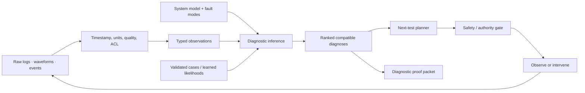
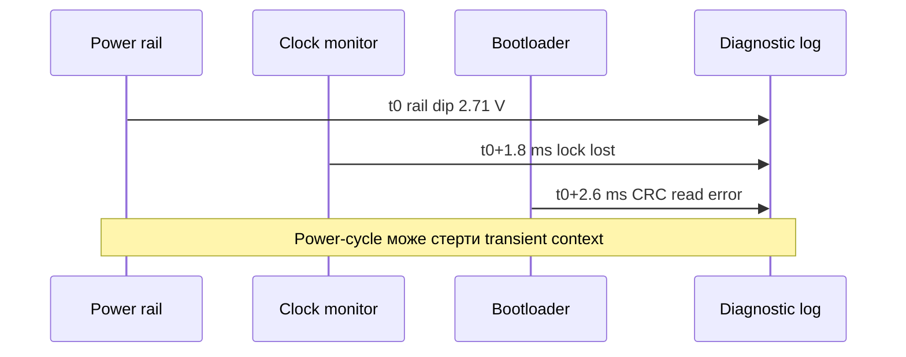
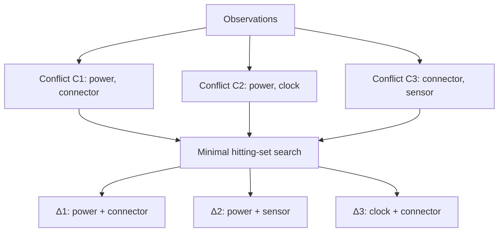
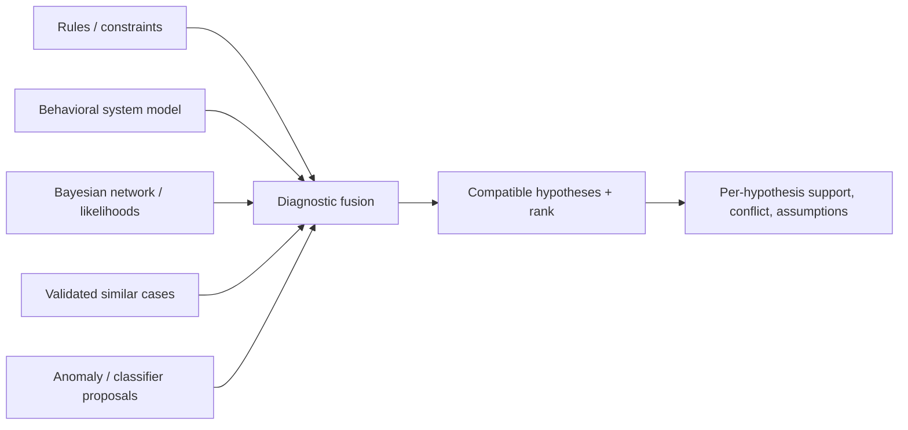
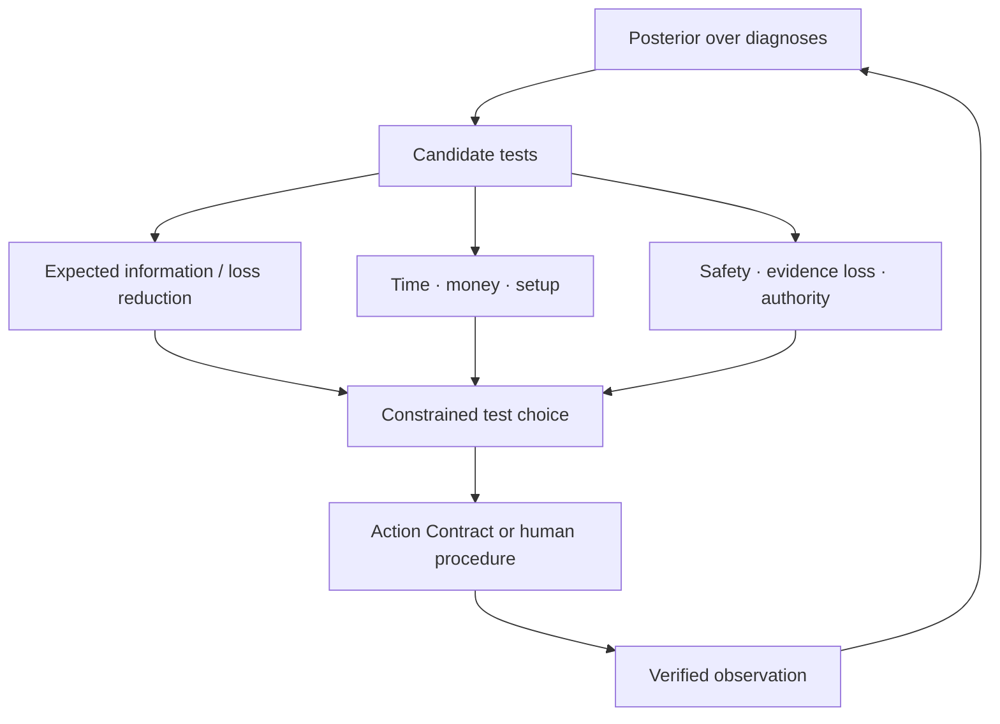

# Діагностика в експертній системі: як не сплутати симптом із причиною

> **Серія:** [Експертні системи для R&D](README.md) · стаття 20 із 22
> **Попередня стаття:** [19 — Як перевіряти базу знань і машину виведення](19-Expert-System-Knowledge-Base-Verification-UA.md)  
> **Наступна стаття:** [21 — Як експертна система навчається на власній роботі](21-Expert-System-Continual-Learning-UA.md)  
> **Зміст серії:** [README](README.md)  
> **Рівень:** розробники й інженери: середній  
> **Після статті:** відрізняти симптом, діагноз і першопричину; обирати перевірку, яка додає доказ, а не руйнує його.

Після холодної ночі пристрій не запускається. Журнал фіксує збій тактування,
а осцилограф один раз показує коротку просадку живлення. Після перезапуску
проблема зникає. Класифікатор називає тактування найімовірнішою причиною,
технік замінює генератор — і несправність повертається. Згодом з’ясовується,
що причиною був ненадійний контакт роз’єму, а збій тактування — лише наслідком.

Ця історія показує, чому діагностика не зводиться до пошуку схожої поломки.
Потрібно зібрати кілька можливих пояснень, відокремити симптом від причини й
вибрати перевірку, яка безпечно розрізнить ці пояснення.

Це навчальна модель, а не сертифікований діагностичний засіб. Формальні
висновки чинні лише в межах описаної моделі, відомих відмов і якості даних.
Для систем, де помилка може зашкодити людям або обладнанню, потрібні галузеві
процедури, кваліфіковані вимірювання й відповідальний фахівець.

У прикладі можливі кілька версій: нестабільне живлення, несправне тактування,
помилка прошивки, контакт роз’єму або похибка вимірювання. Іноді можливі дві
несправності одночасно. Система має повернути не один ярлик, а пояснення:
які версії сумісні з фактами, чого бракує і яку перевірку варто зробити далі.

## Симптом, діагноз і першопричина — різні речі

[Стаття 04](04-Expert-Systems-Applied-Mathematics-UA.md) ввела Bayesian
inference, causality та value of information, [стаття
11](11-Knowledge-Base-Types-UA.md) — правила, cases, constraints й probabilistic
models, а [стаття 16](16-Expert-System-Explanation-Engine-UA.md) — `WHY NOT` і
contrastive explanation. Діагностика складає ці механізми в окрему задачу.

| Задача | Питання | Результат |
|---|---|---|
| anomaly detection | чи поведінка відхилилася від baseline? | anomaly score / event |
| classification | до якого відомого класу схожий випадок? | label і confidence |
| diagnosis | які fault assumptions узгоджують model зі спостереженнями? | одна або кілька гіпотез |
| root-cause analysis | який causal mechanism породив incident? | причинне твердження з assumptions |
| troubleshooting | що перевірити або виправити далі? | policy тестів і repair actions |
| prognosis | як і коли стан деградуватиме? | прогноз траєкторії / remaining useful life |

Prediction може бути корисною premise, але `P(clock_fault|trace)=0.72` ще не
пояснює, чому power anomaly з'явилася раніше. Root cause не випливає з того, що
ознака має найбільшу SHAP value. А repair, після якого пристрій запрацював один
раз, не доводить унікальну причину: дія могла скинути стан або змінити кілька
змінних одночасно.



## Які дані потрібні, щоб висновок був надійним

Симптом не зберігають як рядок `voltage low`. Мінімальний observation:

```yaml
observation_id: obs-boot17-vrail-003
subject: ecu:prototype-17
variable: vrail_3v3
value: 2.71
unit: V
event_time: 2026-08-26T03:14:15.104Z
window: 4.0ms
sensor: scope:lab-2/channel-1
calibration_ref: cal-2026-071
sampling_rate: 100MHz
quality: accepted
source_hash: sha256:...
context:
  temperature: -18degC
  board_revision: D
  firmware: 9f12c7a
```

Без часу не можна встановити порядок `rail dip → clock timeout`. Без units і
калібрування не можна порівнювати threshold. Без board/firmware version модель
може застосувати застарілий fault mode. `quality=accepted` не означає, що sensor
ніколи не помиляється; воно посилається на процедуру допуску.



Часовий порядок звужує гіпотези, але сам по собі не доводить causality. Sensor
clocks можуть бути не синхронізовані, а log buffering змінює порядок запису.
Source map має містити clock domain та bound похибки timestamp.

## Як модель допомагає не загубити альтернативи

Нехай `COMP` — компоненти, `SD` — system description, `OBS` — спостереження,
а $AB(c)$ означає «компонент $c$ поводиться ненормально». Якщо припустити всі
компоненти справними, спостереження суперечать моделі:

```math
SD\cup OBS\cup\{\neg AB(c)\mid c\in COMP\}\models\bot.
```

Diagnosis $\Delta\subseteq COMP$ — множина components, припущення про
несправність яких відновлює consistency:

```math
SD\cup OBS
\cup\{AB(c)\mid c\in\Delta\}
\cup\{\neg AB(c)\mid c\in COMP\setminus\Delta\}
\not\models\bot.
```

Це consistency-based diagnosis у дусі Reiter. Важлива межа: consistency не
доводить, що $\Delta$ фактично є причиною; вона лише каже, що діагноз не
суперечить закодованій моделі та observations.

Зазвичай шукають inclusion-minimal diagnoses:

```math
\Delta\ \text{consistent}\quad\land\quad
\forall\Delta'\subsetneq\Delta:\ \Delta'\ \text{inconsistent}.
```

`Minimal` не означає most probable. Single-fault $\{connector\}$ і
double-fault $\{oscillator,sensor\}$ можуть бути двома minimal diagnoses.
Припущення «ламається лише один компонент» має бути explicit operating
assumption, а не прихована оптимізація solver-а.

## Як суперечності в моделі звужують коло причин

Conflict $C\subseteq COMP$ — множина components, які не можуть усі бути
нормальними за наявних observations:

```math
SD\cup OBS\cup\{\neg AB(c)\mid c\in C\}\models\bot.
```

Кожний diagnosis мусить «влучити» в кожен conflict:

```math
\forall C_i\in\mathcal C:\quad \Delta\cap C_i\ne\varnothing.
```

Тому діагнози можна будувати як мінімальні набори, що усувають усі конфлікти.
Для нашого прикладу нехай отримано:

```math
C_1=\{power,connector\},\qquad
C_2=\{power,clock\},\qquad
C_3=\{connector,sensor\}.
```

Тоді серед minimal hitting sets є $\{power,connector\}$,
$\{power,sensor\}$ і $\{clock,connector\}$. Це не готові repair plans: вони
показують, які abnormal assumptions пояснюють конфлікти. Fault model може бути
неповним, а component granularity — надто грубою.



Для великого system graph exhaustive enumeration вибухає combinatorially.
Використовують incremental conflicts, bounded cardinality, component hierarchy,
priors і domain constraints. Але pruning має бути видимим: «гіпотези понад дві
одночасні faults не розглядалися» входить до diagnostic packet.

## Чому сумісний діагноз ще не обов’язково найімовірніший

Якщо є надійні historical data або оцінені likelihoods, diagnoses ранжують:

```math
P(H_i\mid E)=\frac{P(E\mid H_i)P(H_i)}
{\sum_jP(E\mid H_j)P(H_j)}.
```

$P(H_i)$ — prior fault rate у визначеній population; $P(E|H_i)$ — likelihood
спостережень. Дані іншої board revision або клімату не можна мовчки переносити
в prior. Для rare multiple faults незалежність

```math
P(H_a\land H_b)=P(H_a)P(H_b)
```

є лише припущенням. Common-cause event — волога, supply transient, невдала
партія — робить faults залежними.

### Коли помилятися може сам вимірювальний канал

Observation `alarm=1` залежить і від fault $F$, і від sensor quality:

```math
P(alarm=1\mid F)=sensitivity,
\qquad
P(alarm=1\mid\neg F)=1-specificity.
```

Якщо система приймає alarm за безпомилковий факт, вона занулює правдоподібні
альтернативи. Sensor artifact має бути hypothesis, а не спеціальний текстовий
виняток. Calibration uncertainty та missingness mechanism також впливають:
відсутній packet через несправний power domain не є missing-at-random.

Для probabilistic output потрібна calibration. Brier score для $K$ diagnoses:

```math
BS=\frac{1}{N}\sum_{n=1}^{N}\sum_{k=1}^{K}
(p_{nk}-y_{nk})^2.
```

Він оцінює probability quality, але не достатність fault model. Система може
бути добре calibrated серед відомих класів і не мати гіпотези `unknown fault`.

## Правила, прецеденти й машинне навчання мають різні ролі



- Rule може кодувати invariant або known symptom pattern.
- Behavioral model породжує expected observations і conflicts.
- Bayesian network враховує uncertainty та залежності.
- Case-Based Reasoning дає схожий перевірений досвід, але потребує adaptation.
- ML знаходить pattern у signal або log, але його score не є causal proof.
- Knowledge graph забезпечує topology, versions і provenance.

LLM доречна для нормалізації narrative symptom, пошуку manual fragment і
verbalization packet. Вона не має самостійно додавати fault mode або оголошувати
root cause. Кандидат із тексту проходить grounding, як у [статті
13](13-Knowledge-Acquisition-From-Question-To-Evidence-UA.md).

## Часова послідовність може змінити пояснення

Intermittent defect залежить від прихованого стану $z_t$: cold, warming,
unstable, normal. Для Hidden Markov Model:

```math
P(z_{1:T},o_{1:T})=P(z_1)
\prod_{t=2}^{T}P(z_t\mid z_{t-1})
\prod_{t=1}^{T}P(o_t\mid z_t).
```

Viterbi path знаходить most probable state sequence, а smoothing оцінює
$P(z_t|o_{1:T})$ після пізніших observations. Але Markov і stationarity
assumptions треба перевірити. Для asynchronous events іноді краще temporal
rules або state-space model з явною clock uncertainty.

Temporal model допомагає відрізнити:

- cause, що передує downstream alarm;
- persistent fault і transient disturbance;
- fault, який проявляється лише при transition;
- наслідок recovery action від природного зникнення симптома.

Power-cycle змінює state і censor-ить попередню траєкторію. Тому правило
`capture-before-reset` є не порадою LLM, а safety/evidence invariant.

## Наступна перевірка має розділяти версії

Якщо diagnoses кілька, треба обрати observation або intervention. Entropy:

```math
H(H\mid E)=-\sum_iP(H_i\mid E)\log P(H_i\mid E).
```

Очікуваний information gain test $T$:

```math
IG(T)=H(H\mid E)-
\sum_oP(o\mid E,T)H(H\mid E,o,T).
```

Test із найбільшим $IG$ може бути дорогим або небезпечним. Практична utility:

```math
U(T)=\mathbb E[\Delta L_{decision}\mid T]
-C_{time}(T)-C_{money}(T)-C_{risk}(T)-C_{evidence\ loss}(T).
```

Обираємо

```math
T^*=\arg\max_{T\in T_{allowed}}U(T),
```

де допустимість враховує права, стан обладнання та вимоги безпеки. У нашому
прикладі перезапуск дешевий, але може знищити важливий доказ. Повторне
синхронне вимірювання живлення й тактування дорожче, зате розрізняє $H_P$,
$H_C$ і $H_S$ без зміни стану.



## Чому результат втручання не доводить причину

Виміряти voltage — observation. Замінити connector, нагріти board або змінити
firmware — intervention: вона змінює system. Після intervention старі
conditional associations не обов'язково зберігаються.

У causal model різниця виражається між

```math
P(Y\mid X=x)
\quad\text{та}\quad
P(Y\mid do(X=x)).
```

Перше — спостережна залежність, друге — distribution після контрольованого
втручання за structural causal assumptions. Навіть успішне intervention не
доводить root cause, якщо одночасно змінено temperature, connection і state.
Тому repair має pre/post snapshot, контрольовані змінні й alternative
explanations.

[Стаття 18](18-Expert-System-From-Recommendation-To-Action-UA.md) визначила
Action Contract, idempotency, approval та postcondition verification. Diagnostic
planner використовує той самий contract: він не обходить safety gate через те,
що назвав дію «тестом».

## Яке пояснення має отримати інженер

```json
{
  "case": "cold-start-failure",
  "snapshot": "sha256:...",
  "model": "ecu-boot-model@4.2",
  "observations": ["obs:vrail:003", "obs:clock:011"],
  "diagnoses": [
    {
      "hypothesis": ["connector", "power_regulator"],
      "status": "compatible_minimal",
      "posterior": 0.46,
      "conflicts_hit": ["C1", "C2", "C3"],
      "assumptions": ["max_fault_cardinality=2"]
    }
  ],
  "not_ruled_out": ["unknown_fault"],
  "next_test": "synchronized_rail_clock_capture",
  "test_utility_components": {"information": 0.61, "risk": 0.04},
  "abstention": null
}
```

`posterior` не змішують із `compatible_minimal`: це різні властивості.
`not_ruled_out` не є формальністю — open-set fault часто важливіший за різницю
між двома відомими classes. Packet також містить pruned hypotheses, solver
limits, sensor-quality assumptions і unavailable evidence.

Explanation engine зі статті 16 може відповісти:

- `WHY connector?` — які conflicts і observations підтримують;
- `WHY NOT clock only?` — який conflict лишається непокритим;
- `WHAT IF rail dip is sensor artifact?` — replay на дочірньому snapshot;
- `WHAT TEST NEXT?` — чому observation розділяє hypotheses і які має costs.

## Коли чесна відповідь — «даних недостатньо»

Abstention обов'язкове, якщо:

- observation quality нижча за admission threshold;
- model/version не покриває конфігурацію об'єкта;
- усі known hypotheses inconsistent;
- posterior diffuse і test budget вичерпано;
- solver timeout або approximation bound недостатні;
- critical evidence недоступне через ACL;
- запропонований test небезпечний або немає authorized operator-а.

Selective diagnosis оцінюють risk-coverage curve. Для coverage $c$:

```math
R_{sel}(c)=\mathbb E[L(\hat H,H)\mid accepted\ at\ coverage\ c].
```

Зменшити errors відмовою на всіх складних cases легко; тому звітують і risk, і
coverage, окремо для fault slices.

## Як перевірити, чи діагностика справді допомагає

Один top-1 accuracy приховує головне. Потрібні:

- top-$k$ diagnosis recall і exact-set accuracy для multiple faults;
- calibration/Brier score для posterior;
- conflict та fault-mode coverage;
- частка cases, де true diagnosis відсутній у model;
- середня кількість, cost і risk тестів до isolation;
- time-to-safe-state і time-to-correct-diagnosis;
- rate unnecessary replacements та destructive tests;
- proof replay, provenance completeness і leakage;
- abstention quality та open-set detection;
- robustness до sensor noise, clock skew і missing observations.

Для troubleshooting policy сумарний episode cost:

```math
J(\pi)=\mathbb E_{\pi}
\left[\sum_{t=1}^{\tau}
(c_{test,t}+c_{repair,t}+c_{downtime,t}+c_{risk,t})
+c_{misdiagnosis}\right].
```

Порівнюють із baseline procedure та експертами на paired cases. Historical
repair label не завжди gold truth; root cause має бути adjudicated через
independent evidence. Cases розділяють за unit/incident lineage, щоб traces
одного defect не потрапили в train і test.

## Помилки діагностики та запобіжники

| Відмова | Наслідок | Протидія |
|---|---|---|
| classifier label названо діагнозом | схожість замінює system consistency | model-based conflicts + explicit model coverage |
| найраніший log названо root cause | buffering/clock skew створює хибний порядок | clock domains, uncertainty і causal test |
| single-fault assumption прихована | пропущені common-cause/multiple faults | explicit cardinality, dependency priors, multi-fault suite |
| alarm прийнято за безпомилковий | sensor fault виключено з hypotheses | sensor likelihood і calibration provenance |
| найдешевший test виконано першим | втрачено transient evidence | evidence-loss cost і safety invariant |
| repair success названо доказом | intervention змінила кілька variables | controlled pre/post, repeatability, alternatives |
| усі known diagnoses inconsistent | система все одно обирає top-1 | `unknown_fault` і abstention |
| LLM додала правдоподібну причину | немає fault mode/proof edge | proposal-only LLM + verifier |

## З чого почати діагностику в невеликій системі

1. Обрати один bounded subsystem і 5–15 відомих fault modes.
2. Описати components, behavioral constraints, observations, units і clocks.
3. Додати sensor-quality та `unknown` states, не лише Boolean facts.
4. Реалізувати conflicts і minimal diagnoses; зафіксувати pruning assumptions.
5. Додати priors/likelihoods лише з versioned population data.
6. Описати 3–5 allowed tests із outcomes, cost, risk та evidence loss.
7. Повернути diagnostic packet і replayable explanation, не лише label.
8. Перевірити single/multiple/unknown faults, sensor failure і temporal races.
9. Запустити shadow comparison із чинною troubleshooting procedure.
10. Дозволяти interventions лише через Action Contract та human/safety gates.

У нашому прикладі перша корисна версія не зобов’язана автоматично назвати
першопричину. Достатньо показати кілька сумісних пояснень, не виключити похибку
вимірювання, не допустити ранній перезапуск і запропонувати синхронний запис
сигналів. Це вже зменшує ризик втрати доказу й непотрібної заміни деталі.

## Висновок

Діагностика починається не з назви поломки, а з уміння відокремити
спостереження від пояснення. Читач тепер може зібрати кілька сумісних версій,
перевірити якість даних, вибрати перевірку за її здатністю розрізняти причини
та зупинитися, коли доказів недостатньо. Це надійніше, ніж замінювати першу
підозрілу деталь.

Наступна стаття пояснить, як система може вчитися на перевірених випадках, не
перетворюючи власні припущення на беззаперечну істину.

## Питання до читачів

- Яке припущення single-fault приховано у вашій troubleshooting procedure?
- Чи може sensor або logger бути окремою diagnostic hypothesis?
- Який дешевий test насправді знищує найцінніший evidence?
- Чим у вашій системі відрізняються symptom, diagnosis і root cause?
- Чи показує система hypotheses, які вона pruned через budget або model scope?
- Який test мінімізує expected loss, а не лише entropy?
- Як ви підтверджуєте, що repair усунув причину, а не тимчасово symptom?

## Посилання на інших авторів, стандарти й офіційну документацію

- Raymond Reiter. [A Theory of Diagnosis from First Principles](https://doi.org/10.1016/0004-3702(87)90062-2), *Artificial Intelligence*, 1987.
- Johan de Kleer, Brian C. Williams. [Diagnosing Multiple Faults](https://doi.org/10.1016/0004-3702(87)90063-4), *Artificial Intelligence*, 1987.
- Johan de Kleer. [An Assumption-Based TMS](https://doi.org/10.1016/0004-3702(86)90007-9), *Artificial Intelligence*, 1986.
- David Heckerman, John S. Breese, Koos Rommelse. [Decision-Theoretic Troubleshooting](https://www.microsoft.com/en-us/research/publication/decision-theoretic-troubleshooting/), *Communications of the ACM*, 1995.
- John S. Breese, David Heckerman. [Decision-Theoretic Troubleshooting: A Framework for Repair and Experiment](https://arxiv.org/abs/1302.3563).
- Judea Pearl. [Causality: Models, Reasoning, and Inference](https://www.cambridge.org/core/books/causality/B0046844FAE10CBF274D4ACBDAEB5F5B), Cambridge University Press.
- Agnar Aamodt, Enric Plaza. [Case-Based Reasoning: Foundational Issues, Methodological Variations, and System Approaches](https://doi.org/10.3233/AIC-1994-7104), 1994.
- Finn V. Jensen, Thomas D. Nielsen. [Bayesian Networks and Decision Graphs](https://link.springer.com/book/10.1007/978-0-387-68282-2), Springer.
- Lawrence R. Rabiner. [A Tutorial on Hidden Markov Models and Selected Applications in Speech Recognition](https://doi.org/10.1109/5.18626), *Proceedings of the IEEE*, 1989.
- Claude E. Shannon. [A Mathematical Theory of Communication](https://doi.org/10.1002/j.1538-7305.1948.tb01338.x), 1948.
- NASA. [Fault Tree Handbook with Aerospace Applications](https://extapps.ksc.nasa.gov/Reliability/Documents/Fault_Tree_Handbook_with_Aerospace_Applications_August_2002.pdf), version 1.1, 2002.
- NASA. [Fault Management Handbook, NASA-HDBK-1002](https://standards.nasa.gov/standard/NASA/NASA-HDBK-1002).
- W3C. [PROV-O: The PROV Ontology](https://www.w3.org/TR/prov-o/), W3C Recommendation.
- NIST. [Artificial Intelligence Risk Management Framework 1.0](https://doi.org/10.6028/NIST.AI.100-1), 2023.
