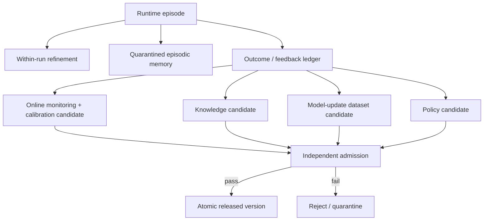
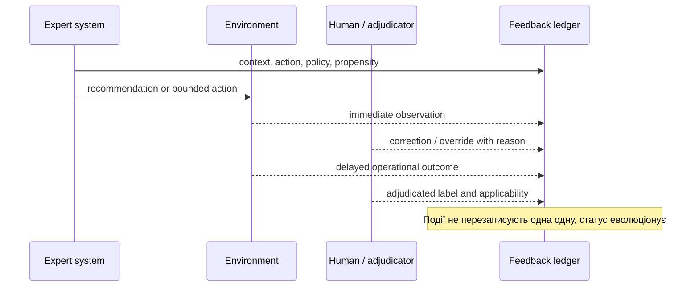
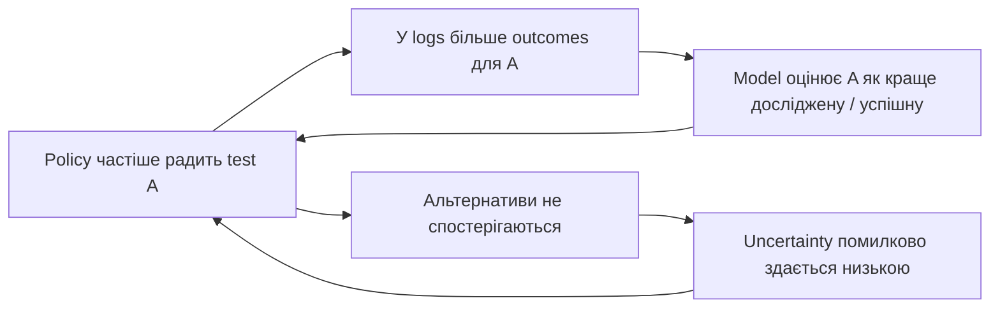
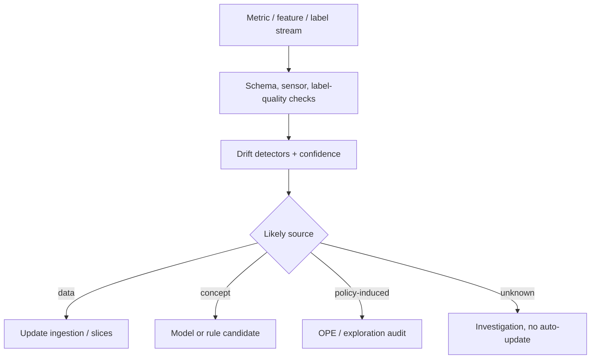
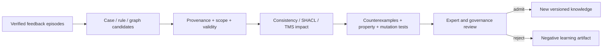
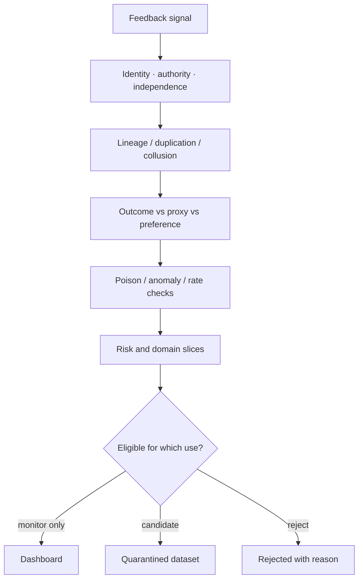
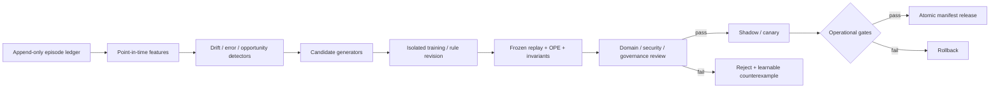

# Як експертна система вчиться на досвіді й не повторює власних помилок

> **Серія:** [Експертні системи для R&D](README.md) · стаття 21 із 22
> **Попередня стаття:** [20 — Діагностика в експертних системах](20-Expert-System-Diagnosis-UA.md)  
> **Наступна стаття:** [22 — Кібернетика XXI століття й експертні системи](22-Cybernetics-Expert-Systems-Edge-Backend-UA.md)
> **Зміст серії:** [README](README.md)  
> **Рівень:** розробники й інженери: середній  
> **Після статті:** відрізняти пам’ять від нового знання, помічати зміщені дані та пояснювати, чому правило не можна змінювати без перевірки.

Після сотень діагностичних випадків система помічає: перевірка роз’єму часто
завершує пошук несправності. Вона починає радити її першою. Невдовзі журнали
містять переважно цю перевірку й позитивні результати після повторного
під’єднання. Система «переконується», що роз’єм є головною причиною, хоча інші
версії просто перестали перевіряти.

Це проблема навчання на власній роботі: зібраний досвід залежить від попередніх
порад системи, остаточні результати з’являються не відразу, а хибний зворотний
зв’язок може сам себе підсилювати. Стаття покаже, як зберігати досвід корисно,
але не дозволяти йому непомітно переписувати робочі правила.

Це навчальна модель, а не дозвіл на повністю автономну самозміну. Навіть метод
із формальною гарантією діє лише за своїх припущень; перевірка, безпековий
огляд і можливість повернути попередню версію залишаються окремими обов’язками.

[Стаття 08](08-Expert-Systems-Beyond-Reference-UA.md) визначила самонавчання як
збирання досвіду й підготовку перевірених кандидатів, а не переписування правил
після кожної відповіді. [Стаття 12](12-How-Expert-Systems-Learn-UA.md) побудувала
повний життєвий цикл candidate → іспит → release. Тут ми заглибимося в те, що
відбувається **до candidate і між releases**: який сигнал вважати outcome, як
помітити drift, як не забути старі режими, як оцінити нову policy на biased logs
і що насправді означає «LLM навчилася на своїй помилці».

## Коли досвід системи починає її обманювати

| Механізм | Persistent state | Що реально змінюється | Основний ризик |
|---|---|---|---|
| self-refinement у межах запиту | ні | поточний draft/context | модель підтверджує власну помилку |
| episodic memory | так | записи cases/reflections | неперевірений текст стає precedent |
| online statistics/calibration | так | priors, thresholds, confidence map | drift або biased outcomes |
| knowledge revision | так | facts, rules, exceptions, ontology | inconsistency й втрата provenance |
| continual model learning | так | embeddings/classifier/LLM parameters | catastrophic forgetting, leakage |
| policy learning | так | вибір questions, tests, actions | unsafe exploration і feedback loop |

Self-Refine генерує feedback і покращує output на test time без supervised
training чи update weights. Reflexion зберігає verbal feedback в episodic memory,
також не обов'язково змінюючи weights. Обидва підходи можуть покращити task
performance у своїх експериментах, але це не те саме, що validated persistent
knowledge експертної системи.



Ключовий invariant: runtime може автоматично створювати candidates, але не
підвищує їх epistemic status. Memory item не стає правилом, user click — gold
label, а успішний tool call — правильним causal outcome.

Отже, перше питання перед будь-яким оновленням просте: чи ми лише зберігаємо
випадок для майбутнього аналізу, чи змінюємо правило, яке вплине на наступне
рішення? Від відповіді залежить рівень перевірки. Далі подивимося, які дані
потрібно залишити про один випадок, щоб така перевірка взагалі була можливою.

## Що насправді може навчатися в системі

Пам’ять про випадок, статистика, правило, модель і спосіб вибору перевірки —
це різні речі. Вони мають різні наслідки: запис про подію лише зберігає досвід,
а нове правило вже змінює майбутні рішення. Тому їх не можна оновлювати однаково.

Коли система робить рекомендацію, важливо зберегти не тільки її відповідь, а й
контекст, у якому вона виникла. Лише тоді пізніше можна з’ясувати, чи правило
справді допомогло, чи результат пояснюється іншими обставинами.

Така класифікація допомагає не називати все підряд «самонавчанням». Вона також
показує, чому статистика успішних відповідей не дає автоматичного права
змінювати базу знань: спочатку потрібно зрозуміти, як саме зібрано досвід.

## Як фіксувати навчальний випадок

У момент $t$ система бачить контекст $x_t$, обирає дію $a_t$ за чинним правилом
вибору $\mu_t$, отримує доступні одразу спостереження $o_t$, а остаточний
результат $y$ може з'явитися через затримку $d$:

```math
a_t\sim\mu_t(a\mid x_t),
\qquad y_{t+d}\sim P(y\mid x_t,a_t,e_t),
```

де $e_t$ — environment state, спостережений лише частково. Для діагностики action
може бути `perform synchronized capture`, outcome — підтверджений root cause
через два дні, а остаточна гарантійна статистика — через місяць.

Мінімальний feedback record:

```json
{
  "episode_id": "diag:cold-start-failure:run-31",
  "decision_snapshot": "sha256:...",
  "behavior_policy": "test-policy@4.2",
  "context": "feature-vector-or-typed-facts-ref",
  "action": "synchronized_rail_clock_capture",
  "propensity": 0.42,
  "immediate_observation": "obs:trace:881",
  "delayed_outcomes": [
    {"type": "adjudicated_root_cause", "value": "connector", "at": "..."}
  ],
  "feedback_source": "reliability-review-board",
  "causal_status": "observational_after_intervention",
  "eligibility": "candidate_only"
}
```

`propensity` — probability, з якою logging policy могла обрати цю action у
цьому context. Вона потрібна для частини off-policy оцінок. Якщо production
policy deterministic і ніколи не обирала альтернативу, logs не містять доказу
її outcome; статистика не відновить counterfactual із нуля.



Запис має розрізняти час самої події та час, коли результат став відомим.
Інакше система випадково навчатиметься на даних, яких не могла мати під час
рішення, або сплутає відсутній результат із негативним.

Такий запис ще не є новим знанням. Він лише створює матеріал, який людина або
окрема процедура зможе перевірити. Наступна проблема полягає в тому, що навіть
добре записані випадки можуть показувати лише ту частину світу, яку система вже
обрала спостерігати.

## Чому власний журнал не показує всю картину

Стан, який система зустріне завтра, залежить від її дій сьогодні. У sequential
decision problem behavior policy індукує власний distribution $d^{\mu}(x)$.
Нова policy $\pi$ може потрапити в states, яких майже немає в logs:

```math
d^{\pi}(x)\ne d^{\mu}(x).
```

Це одна з причин, чому behavior cloning деградує після власних помилок, а
DAgger збирає labels на states, які відвідує поточна policy. Проте в
safety-critical системі не можна навмисно досліджувати unsafe states лише заради
dataset coverage.

Для logged contextual decisions простий inverse-propensity estimator value
policy $\pi$:

```math
\widehat V_{IPS}(\pi)=\frac{1}{N}\sum_{i=1}^{N}
\frac{\pi(a_i\mid x_i)}{\mu(a_i\mid x_i)}r_i.
```

Він потребує correct propensities і overlap:

```math
\pi(a\mid x)>0\Rightarrow\mu(a\mid x)>0.
```

Малі $\mu(a_i|x_i)$ дають великі weights і variance. Weight clipping зменшує
variance, але додає bias; doubly robust estimators поєднують reward model та
propensity correction, не скасовуючи assumptions. Для irreversible actions
offline policy evaluation є evidence, а не дозвіл на deployment.

Найнебезпечніший feedback loop:



Розірвати цикл можна через logging propensities, explicit unknowns, controlled
exploration лише в безпечній області, expert-selected probes, simulation і
prospective confirmation.

## Як відрізнити нову проблему від зміни даних

Не кожне падіння метрики вимагає retraining. Розрізняють:

**Covariate drift**:

```math
P_t(X)\ne P_{t+1}(X),
```

**prior/label shift**:

```math
P_t(Y)\ne P_{t+1}(Y),
```

і **concept drift**:

```math
P_t(Y\mid X)\ne P_{t+1}(Y\mid X).
```

Нова board revision може змінити $P(X)$; новий component supplier — fault
priors; firmware architecture — саме mapping від symptoms до faults. Schema
change, broken sensor або labeling guideline іноді імітують drift.

ADWIN-подібний detector порівнює статистику двох частин adaptive window і
сигналізує, якщо difference перевищує bound. У спрощеній формі Hoeffding bound:

```math
\epsilon=\sqrt{\frac{1}{2m}\ln\frac{2}{\delta}},
```

де $m$ — effective sample size, $\delta$ — false-alarm parameter. Реальний
ADWIN використовує власні оптимізації й bounds; ця формула пояснює trade-off:
менше $\delta$ — менше false alarms, але повільніше detection.



Detector alarm — hypothesis, не root cause. Потрібно перевірити missing labels,
seasonality, product mix, deployment change і policy change. Delayed outcomes
можуть створити тимчасове погіршення calibration, якщо рахувати незавершені
episodes як failures.

Це обмеження підводить до наступного питання: навіть коли зміна даних реальна,
як переконатися, що нова версія не зіпсувала добре відомі старі режими роботи?

## Як виміряти, чи нова версія не забула старі випадки

Fine-tuning на останньому місяці може поліпшити revision E й зламати revision C.
Catastrophic forgetting оцінюють по задачах або slices. Нехай $a_{k,i}$ — якість
після навчання task $k$ на старому task $i$. Forgetting після $T$ tasks:

```math
F_T=\frac{1}{T-1}\sum_{i=1}^{T-1}
(\max_{i\le k\le T-1}a_{k,i}-a_{T,i}).
```

Негативне значення для slice може означати backward improvement; aggregate
середнє не повинно приховувати critical regression.

Такий розрахунок варто вести для всієї системи та окремо для важливих груп
випадків: старих ревізій пристрою, рідкісних, але небезпечних відмов, та даних
від іншого постачальника. Якщо одна з цих груп помітно погіршилася, нову версію
не виправдовує її середній успіх на найсвіжіших даних.

## Як додати нове знання і не забути перевірене старе

Коли підтверджено, що змінився саме предметний світ, нову версію все одно не
можна навчати лише на свіжих випадках. Вона має зберігати працездатність у
режимах, які були важливими вчора, навіть якщо вони рідше трапляються сьогодні.

Для цього використовують кілька груп методів:

- **replay** — змішувати representative old examples із новими;
- **regularization** — обмежувати зміни важливих parameters;
- **parameter isolation** — adapters/experts для context або task;
- **dynamic architecture** — додавати capacity, контролюючи routing/versioning;
- **distillation** — зберігати частину старої поведінки через teacher outputs.

Elastic Weight Consolidation додає penalty:

```math
\mathcal L(\theta)=\mathcal L_{new}(\theta)
+\frac{\lambda}{2}\sum_iF_i(\theta_i-\theta_i^*)^2,
```

де $\theta^*$ — parameters після старої task, $F_i$ наближує їх важливість через
Fisher information. EWC не гарантує відсутність forgetting у довільній задачі;
воно саме має assumptions і емпіричні межі.

Replay buffer — governance object. Збереження старих examples може порушувати
retention, privacy або license; synthetic replay може відтворити bias teacher-а.
Для експертної системи часто безпечніше не стискати volatile fact у weights, а
оновити versioned knowledge чи retrieval layer.

## Як оновлювати правила й перевірені випадки

Правила й схожі випадки потребують іншої перевірки, ніж числова модель. Треба
вимірити точність, встановити межі дії нового твердження, його
джерело та наслідки для висновків, які вже залежать від старих знань.

### Коли корисний схожий перевірений випадок

Класичний цикл CBR: retrieve → reuse → revise → retain. Автоматичним може бути
retrieve; retain дозволяють лише після verified outcome та applicability review.
Case зберігає problem, context, action, outcome, adaptation і negative result.
Інакше база накопичить дублікати успішних anecdotes й уповільнить retrieval.

### Як правило стає кандидатом на зміну

Inductive Logic Programming або rule learner може запропонувати clause, що
пояснює positive і відсікає negative examples. Нехай background knowledge $B$,
positive examples $E^+$, negative $E^-$; candidate hypothesis $H$ бажано
задовольняє:

```math
B\cup H\models E^+,
\qquad
B\cup H\not\models E^-.
```

У noisy domain ці умови замінюють loss/coverage trade-off. Навіть perfect fit не
робить $H$ causal або policy-authoritative. Candidate отримує provenance,
scope, counterexamples, owner і mutation/property tests зі [статті
19](19-Expert-System-Knowledge-Base-Verification-UA.md).

Knowledge revision має врахувати Truth Maintenance: новий fact може retract
conclusion, що залежав від старого assumption. Graph edge без validity interval
й source version створює «вічне» знання. Ontology migration перевіряють окремо
від instance update.



Відхилений candidate теж корисний: його причина стає negative example і тестом,
але не правилом «ніколи більше не пропонувати» без scope.

Тому зміна правила має лишати після себе зрозумілий слід: що саме змінилося,
на яких випадках це перевірено, де правило не діє і хто відповідає за нього.
Тоді наступний редактор бази знань зможе виправити помилку, не вгадуючи її
історію з уривків журналу.

Отже, додавання знання — це не один спосіб навчання, а вибір між зміною
пам’яті, правила, статистики чи моделі. Спільне для цих способів одне: нове
спостереження має витримати перевірку на старих і нових випадках, перш ніж
впливати на робоче рішення.

## Коли варто просити людину перевірити випадок

Uncertainty sampling вибирає case з великою entropy:

```math
H(Y\mid x)=-\sum_yP(y\mid x)\log P(y\mid x).
```

Але outlier може бути дуже невизначеним і неважливим. Запит до експерта має
враховувати expected decision loss, representativeness, diversity, labeling
cost і privacy:

```math
x^*=\arg\max_{x\in U}
\frac{\mathbb E[\Delta L_{decision}\mid label(x)]}
{C_{expert}(x)+C_{evidence}(x)+C_{risk}(x)}.
```

Експерт не безпомилковий oracle. Незгода, abstention й expertise scope
зберігаються за протоколом [статті
17](17-Knowledge-Elicitation-From-Experts-UA.md). Model-generated label не стає
незалежною перевіркою тієї самої model.

Людину варто залучати там, де її відповідь може змінити важливе рішення, а не
там, де система лише не впевнена у рідкісній дрібниці. Такий підхід береже час
експерта і водночас поповнює набір саме тими прикладами, яких бракує для
безпечного уточнення правила.

## Чому рекомендації системи змінюють дані, на яких вона вчиться

У системі, яка послідовно обирає перевірки, винагорода не зводиться до того,
що «користувач натиснув корисно». Вона має відображати підтверджений результат
і можливу шкоду. Один зі способів порівняння дій — накопичений програш:

```math
Regret_T=\sum_{t=1}^{T}\ell_t(a_t)
-\min_{a\in A}\sum_{t=1}^{T}\ell_t(a).
```

У nonstationary environment статичний comparator може бути непридатним; у
safety domain низький cumulative regret не компенсує одну catastrophic action.
Тому hard constraints зі статті 18 стоять поза reward optimization.

Safe policy improvement порівнює candidate $\pi$ з baseline $\pi_b$. Один
практичний release criterion:

```math
LCB_{1-\alpha}\left(V(\pi)-V(\pi_b)\right)\ge-\varepsilon
```

разом із

```math
F_{critical}(\pi)=0,
\qquad \pi(a\mid x)=0\ \text{для forbidden }(x,a).
```

LCB — lower confidence bound, $\varepsilon$ — допустима non-inferiority margin.
Гарантія залежить від estimator, data coverage та assumptions. Якщо overlap
немає, candidate повертається до baseline в uncertain regions або проходить
simulation/shadow/human gate — не отримує вигаданий score.

Тому рекомендація не є нейтральним рядком у журналі: вона змінює, які випадки
будуть перевірені й які результати стануть видимими. Перед оновленням правила
слід окремо показати, де даних достатньо для порівняння, а де система повинна
залишитися на перевіреному варіанті або звернутися до людини.

## Мовна модель може запропонувати, але не підтвердити знання

LLM може сформувати self-critique, reflection, synthetic example або rule draft.
Це proposals із спільними помилками generator/verifier. Якщо одна model пише
відповідь, оцінює її й створює training label, correlation errors зростає.

Правильне розділення:

- `self_reflection` — volatile memory із TTL;
- `user_feedback` — сигнал із відомою identity/context, не truth;
- `tool_result` — observation із contract і provenance;
- `verified_outcome` — незалежно перевірений result;
- `knowledge_candidate` — структурована proposed change;
- `released_knowledge` — версія після admission.

Для локальних LLM із [статті
15](15-Linguistic-Analysis-And-Local-Models-UA.md) memorization та data leakage
залишаються: confidential episode не можна автоматично переносити у weights.
Model update dataset проходить deduplication, contamination, license, ACL,
poisoning і canary-extraction checks.

### Як хибний зворотний зв’язок спотворює навчання

Коли metric стає target, система або користувачі можуть оптимізувати proxy:

- оператор підтверджує першу рекомендацію, щоб швидше закрити ticket;
- система частіше abstain, щоб підвищити accuracy;
- agent створює прості subtasks і сам позначає їх успішними;
- attacker додає багато схожих cases, щоб змінити retrieval/rule prior;
- upstream process приховує failures після автоматичної дії;
- позитивний user rating винагороджує впевненість, а не correctness.



Feedback authority є типізованою. End user може повідомити, що відповідь
незрозуміла; reliability board — adjudicate root cause; security owner —
затвердити policy. Велика кількість low-authority votes не повинна автоматично
перемогти один verified safety artifact.

Зворотний зв’язок корисний лише тоді, коли його джерело, межа застосування і
перевірка зрозумілі. Після цього можна розглядати кандидата на зміну, але ще не
вмикати його в робочому процесі.

Таким чином, мовна модель і відгуки користувачів можуть прискорити пошук
гіпотез, але не замінюють незалежного доказу. Вони допомагають сформувати
питання для перевірки; право змінити знання дають лише відтворювані результати
з відомим походженням.

## Як нове правило доходить до робочої версії



Point-in-time join не використовує future data. Dataset manifest фіксує raw
episodes, transformations, exclusions й label availability. Candidate versions
розділяють за layer: `kb@8`, `retriever@5`, `calibration@3`, `model@12`,
`policy@4`; production manifest зв'язує сумісний комплект.

Не всі updates мають однаковий cadence:

- new verified fact можна випустити швидко з narrow scope;
- calibration map — після достатньої кількості outcomes;
- rule revision — після counterexample, owner review і regression;
- model weights — рідше через leakage/forgetting/evaluation cost;
- high-impact policy — лише після OPE, simulation, shadow і approval.

Кандидат і робоча версія мають існувати окремо доти, доки нова поведінка не
пройде незалежну перевірку. Наступний розділ показує, які саме порівняння
допомагають не прийняти новизну за поліпшення.

## Як перевірити, що нова версія справді краща

Самої точності кандидата недостатньо. Порівнювати потрібно кілька властивостей:

- adaptation gain на новому slice;
- backward transfer і forgetting на старих slices;
- forward transfer до нової задачі;
- drift detection delay і false-alarm rate;
- label/outcome delay distribution;
- coverage та effective sample size off-policy evaluation;
- calibration і selective risk до/після update;
- critical regression, privacy leakage й poisoning success rate;
- rollback time та частка atomic restores;
- human-review load і value per expert-hour;
- частка candidates: admitted, rejected, expired, reverted.

Effective sample size для importance weights $w_i$:

```math
ESS=\frac{(\sum_iw_i)^2}{\sum_iw_i^2}.
```

Великий raw $N$ із кількома величезними weights може мати малий ESS; confidence
у OPE має це відображати.

Для кожного update звітують vector metrics, а не один composite score. Hard
security/safety failures не усереднюються з latency gain. [Стаття
19](19-Expert-System-Knowledge-Base-Verification-UA.md) дає mutation,
property-based і formal gates; тут до них додаються temporal split, feedback
lineage, forgetting та policy-induced distribution.

## Які помилки треба зупинити до випуску

Перед випуском корисно пройтися не тільки по середніх показниках, а й по
відомих способах помилково прийняти сигнал за доказ. Нижче наведено типові
відмови, їхні причини й запобіжники.

| Відмова | Чому виникає | Протидія |
|---|---|---|
| user click названо truth | preference/proxy змішано з outcome | typed feedback authority і adjudication |
| policy навчається лише на власних actions | selection bias та немає overlap | propensity logging, safe probes, OPE limits |
| missing delayed label = failure | episode ще не завершився | event/availability time, censoring model |
| drift alarm запускає retraining | sensor/schema/policy change імітує concept drift | root-cause investigation і slices |
| новий model забув стару revision | stability–plasticity conflict | replay/regularization/isolation + old gates |
| reflection записано як knowledge | LLM self-critique не перевірена | volatile memory, TTL, candidate status |
| reward оптимізується напряму | Goodhart/reward hacking | outcome triangulation, hard invariants |
| candidate сам себе тестує | shared error і leakage | sealed set, independent verifier/reviewer |
| online update неможливо відкотити | state змішано з runtime | immutable ledger, versioned atomic manifest |

Жодна окрема метрика не замінює цієї перевірки. Якщо нова версія швидша, але
гірше працює в критичному випадку, її не можна оголосити кращою за середнім
показником. Отже, перед випуском треба окремо розглянути типові збої.

Така таблиця корисна як контрольний перелік, а не як формальна відмітка
«перевірено». Для кожної зміни команда має показати конкретні тести, їхні
результати та рішення, яке було прийнято у відповідь на знайдений ризик.

## З чого почати безпечне навчання

Починати варто з одного рішення з невисоким ризиком і заздалегідь визначеного,
перевірюваного результату. Для нього журналюють контекст, дію, версію способу
вибору, імовірність вибору та час подій; окремо позначають оцінку користувача,
спостереження і підтверджений висновок.

Далі кандидати зберігають окремо від робочих знань, будують часовий розподіл
даних і порівнюють нову поведінку з незмінною базовою версією. Перевірка має
охопити старі й нові групи випадків, точність упевненості, забування, критичні
обмеження та межі даних, у яких порівняння взагалі можливе.

Лише після тіньового запуску з можливістю швидко повернути базову версію можна
автоматизувати вузьку частину допуску. Така послідовність не уповільнює
навчання заради формальності: вона не дає неперевіреній ідеї потрапити в
рішення, від якого залежить реальна робота.

У нашому прикладі система спершу накопичує перевірені випадки й помічає, що
несправність роз’єму частіше трапляється за низької температури на певній
ревізії пристрою. Вона створює кандидата на зміну правила. Інші ревізії та
випадки з похибкою вимірювання не мають погіршитися. Порядок перевірок теж
змінюють окремо: частіший огляд роз’єму не повинен витіснити синхронне
вимірювання там, де короткий сигнал може бути втрачений назавжди.

## Висновок

Самонавчання експертної системи — не право безперервно змінювати себе. Це
здатність перетворювати досвід на перевірені сигнали, сигнали — на ізольованих
кандидатів, а кандидатів — на нові версії лише після доказу. Читач тепер може
відрізнити пам’ять від знання, помітити зміщення у власних журналах і пояснити,
чому нове правило потребує порівняння зі старим, тіньового запуску та відкату.

## Питання до читачів

- Що у вашому продукті називають самонавчанням: memory, rule update чи weights?
- Який feedback є незалежним outcome, а який лише preference або proxy?
- Чи логуються behavior policy і propensity для кожної рекомендації?
- Які alternatives ніколи не спостерігаються через чинну policy?
- Як відрізняється concept drift від зміни sensor/schema/label process?
- Який старий critical slice може бути забутий під час наступного update?
- Чи може candidate бути повністю відхилений і атомарно відкочений?
- Хто має право підвищити episodic memory до released knowledge?

## Посилання на інших авторів і публікації

- João Gama та ін. [A Survey on Concept Drift Adaptation](https://doi.org/10.1145/2523813), *ACM Computing Surveys*, 2014.
- Albert Bifet, Ricard Gavaldà. [Learning from Time-Changing Data with Adaptive Windowing](https://doi.org/10.1137/1.9781611972771.42), SIAM International Conference on Data Mining, 2007.
- James Kirkpatrick та ін. [Overcoming Catastrophic Forgetting in Neural Networks](https://doi.org/10.1073/pnas.1611835114), *PNAS*, 2017.
- David Lopez-Paz, Marc'Aurelio Ranzato. [Gradient Episodic Memory for Continual Learning](https://papers.nips.cc/paper_files/paper/2017/hash/f87522788a2be2d171666752f97ddebb-Abstract.html), NeurIPS 2017.
- Stéphane Ross, Geoffrey Gordon, Drew Bagnell. [A Reduction of Imitation Learning and Structured Prediction to No-Regret Online Learning](https://proceedings.mlr.press/v15/ross11a.html), AISTATS 2011.
- Romain Laroche, Paul Trichelair, Rémi Tachet des Combes. [Safe Policy Improvement with Baseline Bootstrapping](https://proceedings.mlr.press/v97/laroche19a.html), ICML 2019.
- Miroslav Dudík, John Langford, Lihong Li. [Doubly Robust Policy Evaluation and Learning](https://arxiv.org/abs/1103.4601), ICML 2011.
- Burr Settles. [Active Learning Literature Survey](https://minds.wisconsin.edu/handle/1793/60660), 2009.
- Agnar Aamodt, Enric Plaza. [Case-Based Reasoning: Foundational Issues, Methodological Variations, and System Approaches](https://doi.org/10.3233/AIC-1994-7104), 1994.
- Stephen Muggleton. [Inductive Logic Programming](https://doi.org/10.1016/0743-1066(91)90035-W), *New Generation Computing*, 1991.
- Jon Doyle. [A Truth Maintenance System](https://doi.org/10.1016/0004-3702(79)90032-7), *Artificial Intelligence*, 1979.
- Noah Shinn та ін. [Reflexion: Language Agents with Verbal Reinforcement Learning](https://papers.neurips.cc/paper_files/paper/2023/hash/1b44b878bb782e6954cd888628510e90-Abstract-Conference.html), NeurIPS 2023.
- Aman Madaan та ін. [Self-Refine: Iterative Refinement with Self-Feedback](https://papers.neurips.cc/paper_files/paper/2023/hash/91edff07232fb1b55a505a9e9f6c0ff3-Abstract-Conference.html), NeurIPS 2023.
- Chuan Guo та ін. [On Calibration of Modern Neural Networks](https://proceedings.mlr.press/v70/guo17a.html), ICML 2017.
- NIST. [Artificial Intelligence Risk Management Framework 1.0](https://doi.org/10.6028/NIST.AI.100-1), 2023.
