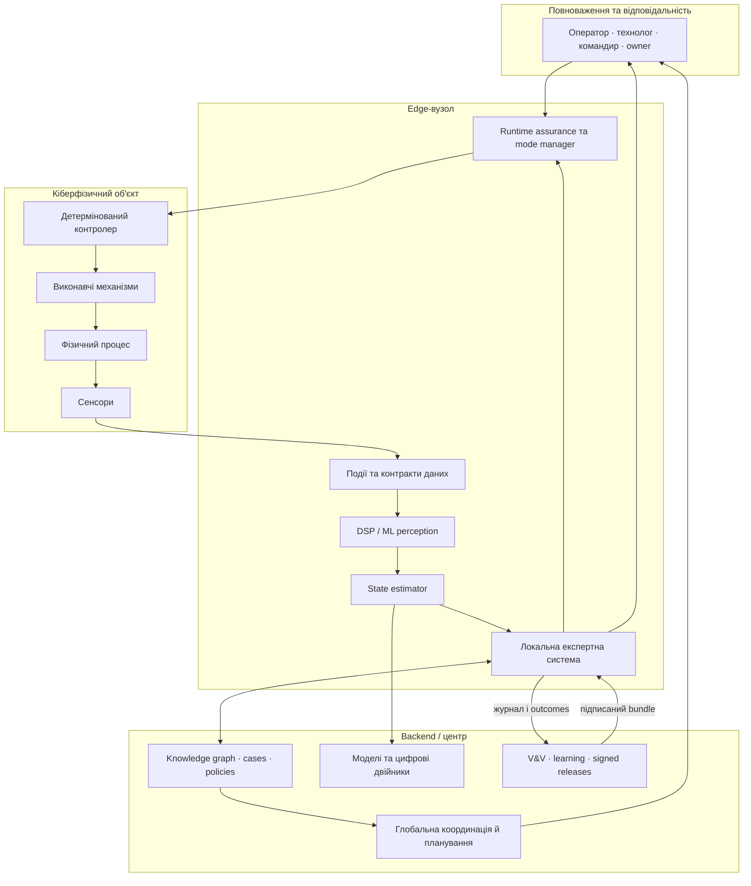
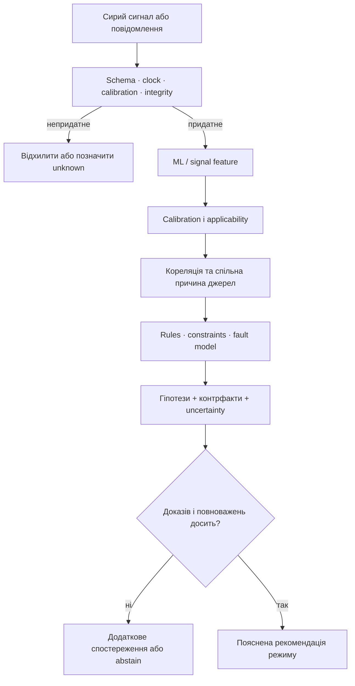
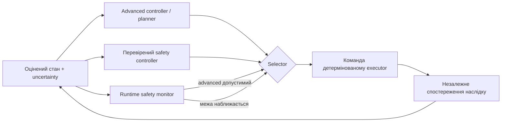
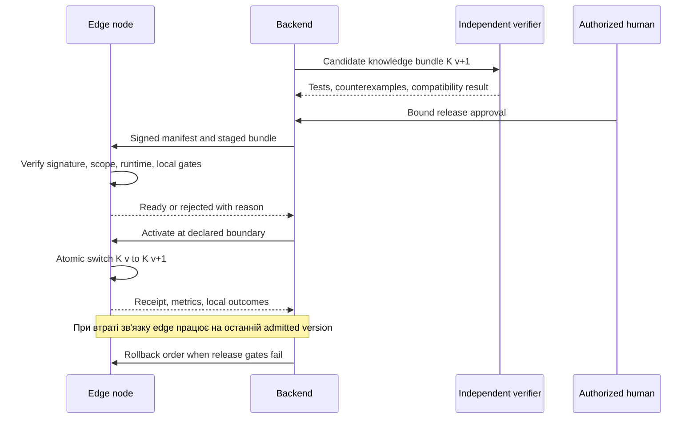
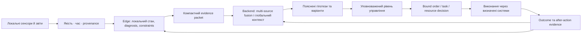
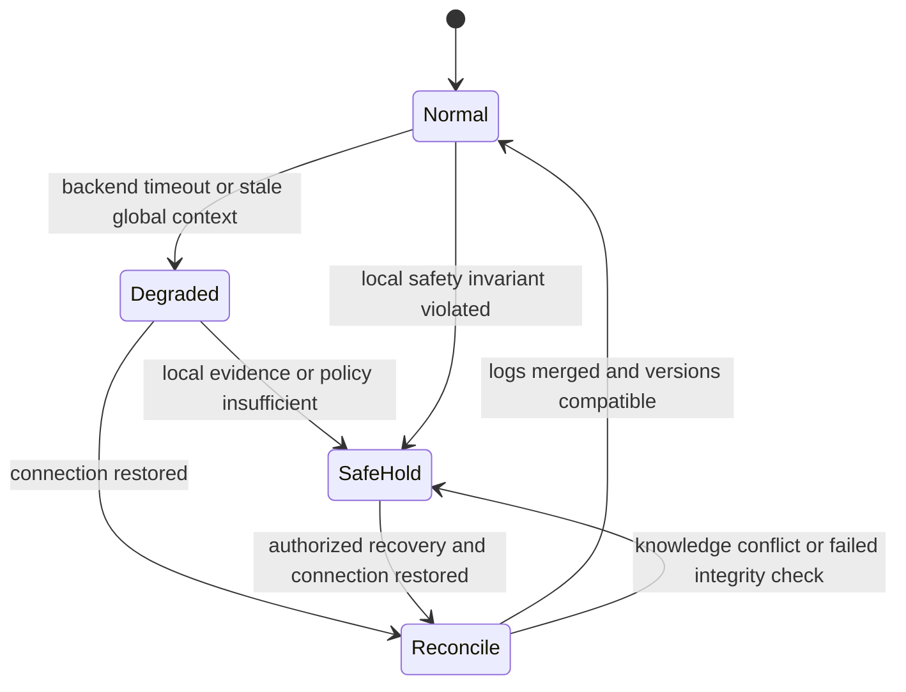

# Кібернетика XXI століття й експертні системи: від сенсора та робота до виробництва й управління військами

> **Серія:** [Експертні системи для R&D](README.md) · стаття 22 із 22
> **Попередня стаття:** [21 — Як експертна система навчається на власній роботі](21-Expert-System-Continual-Learning-UA.md)  
> **Зміст серії:** [README](README.md)  
> **Рівень:** ML / Knowledge / Robotics / Control / Systems Engineer: middle+  
> **Після статті:** розділити кіберфізичну систему на рівні з різними дедлайнами; визначити місце експертного міркування на edge і backend; спроєктувати деградований режим, межі повноважень, синхронізацію знань та перевірку результатів.

Камера розпізнала перешкоду, вібраційний сенсор зафіксував аномалію або кілька
джерел повідомили про зміну обстановки. Це ще не рішення. Треба оцінити стан,
відрізнити відмову сенсора від реальної події, врахувати час і походження даних,
перевірити обмеження, обрати дію, виконати її вчасно й побачити наслідок. Якщо
зв'язок із центром зник, частина цього циклу все одно має працювати локально.
Якщо ціна помилки висока, система не повинна непомітно привласнити собі
повноваження оператора, технолога або командира.

**Проблема цієї статті — визначити, де саме має виконуватися експертне
міркування між сенсором, локальним керуванням і backend, коли дедлайн короткий,
зв'язок обмежений, дані суперечливі, а наслідки дії фізичні.** Одна велика
модель у датацентрі не закриває цю проблему. Так само її не закриває набір
локальних правил, відірваний від глобального стану й керованого оновлення знань.

Це **теоретичний референсний дизайн**, а не готова система керування військами,
роботом чи виробничою лінією. Конкретні safety cases, часові межі, класи
автономності, сертифікація, правові обмеження та правила застосування сили
визначаються окремо для домену. Військові приклади нижче навмисно залишаються
на рівні ситуаційної обізнаності, координації, логістики, технічної діагностики
та людського контролю, без тактики ураження або побудови цілевказання.

[Стаття 06](06-Expert-Systems-Architecture-UA.md) побудувала загальну
архітектуру експертної системи, [стаття
07](07-Expert-Systems-Infrastructure-UA.md) — її програмну й апаратну базу,
[стаття 18](18-Expert-System-From-Recommendation-To-Action-UA.md) — межу між
рекомендацією та контрольованою дією, [стаття
20](20-Expert-System-Diagnosis-UA.md) — діагностичне міркування, а [стаття
21](21-Expert-System-Continual-Learning-UA.md) — навчання з результатів.
Тепер ці механізми треба поєднати з керуванням фізичним світом.

## Що саме вивчає кібернетика

У класичному сенсі Норберта Вінера кібернетика вивчає керування та комунікацію
в системах зі зворотним зв'язком. Для інженера XXI століття до цього ядра
додаються розподілені обчислення, мережеве керування, кіберфізичні системи,
сенсорні мережі, ML, автономні агенти, цифрові двійники, взаємодія людини з
машиною, functional safety та протидія навмисному впливу.

Три близькі, але різні поняття:

- **інформаційна система** зберігає, обробляє й передає інформацію;
- **кіберфізична система** поєднує обчислення, зв'язок, сенсори, виконавчі
  механізми та фізичний процес;
- **кіберсистема** тут означає організовану систему спостереження, моделювання,
  прийняття рішень, керування і зворотного зв'язку; це ширше за захист мережі.

Кібербезпека відповідає, зокрема, на питання, хто може читати або змінювати
стан і команди. Кібернетика — чи дає обраний спосіб керування потрібну поведінку попри
затримку, шум, невизначеність і збурення. Безпека є обов'язковою властивістю
сучасної кіберсистеми, але не замінює теорію керування, оцінювання стану чи
інженерію знань.

Термінологічно важливо називати об'єкт точно: **система**, **інформаційна
система**, **кіберсистема**, **кіберфізична система**, **платформа**,
**програмно-апаратний стек** або **мережа систем**. Назва має показувати межі,
склад і відповідальність, а не приховувати їх за модною метафорою.

### Чому контролер має розрізняти значущі стани

Росс Ешбі називав *variety* кількість станів або розрізнень, суттєвих для
регулятора. Для скінченної множини $\Omega$ зручною мірою є

```math
V(\Omega)=\log_2|\Omega|.
```

Якщо регулятор бачить лише `NORMAL/FAIL`, а світ має десять різних відмов із
несумісними recovery procedures, проблема не зникає після додавання швидшого
процесора. Система не має потрібної **ефективної різноманітності**: вона не
розрізняє ситуації, які потребують різних відповідей. Інженерний зміст закону
Ешбі «лише різноманітність поглинає різноманітність» — observation, state model,
rules, actions і людська організація разом мають покривати релевантні класи
збурень.

Це не вимога створити окреме правило для кожного можливого стану. Стани
об'єднують у класи, якщо для цілі керування вони справді еквівалентні. Експертна
система дає практичний механізм: ontology визначає розрізнення, fault model —
можливі причини, rules — контекстні відповіді, uncertainty — межу знання, а
escalation додає різноманітність людської експертизи там, де автоматики замало.

Пов'язана теорема Конанта—Ешбі стверджує за своїх формальних припущень, що
добрий простий регулятор має втілювати модель системи, яку регулює. З цього не
випливає, що кожному контролеру потрібен повний digital twin. Практичний висновок
скромніший: правила, estimator, knowledge graph або simulator завжди містять
**часткову модель**, тому треба явно зафіксувати, що вона розрізняє, для якої
цілі та де перестає бути адекватною.

## Від спостереження до дії: повний цикл керування

Нехай фізична система має стан $x_t$, отримує керуючий вплив $u_t$ і зазнає
збурення $w_t$. Сенсор повертає спостереження $y_t$ із шумом $v_t$:

```math
x_{t+1}=f(x_t,u_t,w_t),
\qquad
y_t=h(x_t,v_t).
```

$x_t$ може містити положення робота, температуру двигуна, стан обладнання,
доступність підрозділів або рівень запасів. $u_t$ — команда контролеру, зміна
режиму, заявка на обслуговування чи затверджене управлінське рішення. Функція
$f$ описує, як світ змінюється; $h$ — яку частину цього світу бачать сенсори.

Реальний стан майже ніколи не відомий точно. Тому estimator підтримує
**розподіл переконань** $b_t(x)=P(x_t=x\mid y_{1:t},u_{1:t-1})$. У загальній
байєсівській формі оновлення має вигляд:

```math
b_t(x)=\eta\,P(y_t\mid x)
\int P(x\mid x',u_{t-1})b_{t-1}(x')\,dx',
```

де $P(x\mid x',u)$ — модель переходу, $P(y\mid x)$ — модель сенсора, а
$\eta$ нормалізує ймовірності до одиниці. Простими словами: спочатку система
прогнозує, де могла опинитися, потім коригує прогноз новим вимірюванням.
Калманівський фільтр, particle filter, neural estimator або набір правил — різні
реалізації цієї ідеї з різними припущеннями.


Експертна система в цьому циклі не повинна підміняти всі блоки. Її природне
місце — **наглядовий шар знань** (*supervisory knowledge layer*): вона зіставляє
оцінений стан із правилами, моделями відмов, обмеженнями, прецедентами та
повноваженнями; пояснює висновок; рекомендує режим або допустиму дію. Вона не є
заміною signal processing, стабілізатора, PLC, автопілота, safety interlock чи
командира.

## Різні дедлайни й різні повноваження

У системі керування немає універсального «real time». Дедлайн локального
стабілізатора може вимірюватися мікро- або мілісекундами, діагностичного
міркування — десятками мілісекунд чи секундами, а перегляду глобального плану —
хвилинами або годинами.

Повну затримку можна розкласти:

```math
\tau_{loop}=
\tau_{sense}+\tau_{preprocess}+\tau_{estimate}+\tau_{infer}+
\tau_{reason}+\tau_{comm}+\tau_{act},
```

і вимагати

```math
\tau_{loop}\le D,
```

де $D$ — дедлайн саме цього циклу. Швидка нейромережа не рятує систему, якщо
черга повідомлень, синхронізація часу або канал зв'язку вже витратили бюджет.
Середня latency також не доводить придатність: потрібні tail percentiles,
worst-case execution time для критичних компонентів і частота пропущених
дедлайнів. Сума вище описує послідовний critical path; для паралельних гілок
використовують найдовший шлях із урахуванням точок синхронізації, а не механічно
додають час усіх компонентів.

Практичне розділення:

| Рівень | Типовий горизонт | Відповідальність | Чого тут не повинно бути без окремого доказу |
|---|---|---|---|
| L0 — фізичний процес | безперервний | механіка, енергетика, середовище | програмних припущень без сенсорної перевірки |
| L1 — жорстке локальне керування | мкс–мс | servo, PLC, стабілізація, interlock | недетермінованого LLM-виведення |
| L2 — perception і стан | мс–с | DSP, ML inference, sensor fusion, estimator | оголошення семантичного факту без confidence і lineage |
| L3 — локальний нагляд | мс–хв | правила, diagnosis, mode management, safe fallback | необмежених зовнішніх повноважень |
| L4 — backend і людина | с–дні | глобальне знання, координація, planning, audit, release | припущення про постійний зв'язок із edge |



Архітектура не зобов'язана буквально мати п'ять процесів або серверів. Це
п'ять **контрактів відповідальності**. На одному SoC вони все одно мають різні
дедлайни, failure modes і правила зміни.

## Що експертна система робить на edge

Edge — це не просто географічне «ближче до пристрою». Це місце, де рішення
приймається в межах локального часу, пропускної здатності, енергоспоживання,
пам'яті та доступного зв'язку. ETSI MEC формалізує edge як обчислювальне й
сервісне середовище на краю мережі; для роботів і промисловості ним також може
бути onboard computer, industrial PC, gateway або сам контролер.

Локальний експертний шар корисний для завдань, де одного ML score замало:

- перевірити калібрування, живість, часову мітку і стан сенсора;
- виявити конфлікт між фізично пов'язаними вимірюваннями;
- відрізнити `unknown`, `not observed`, `not applicable` і `false`;
- поєднати model output із режимом, контекстом і hard constraints;
- діагностувати клас відмови та запропонувати наступну перевірку;
- керувати переходами `NORMAL → DEGRADED → SAFE_HOLD → RECOVERY`;
- працювати на останній дозволеній версії знань без backend;
- сформувати коротке пояснення з локальними доказами;
- відмовитися від висновку, коли доказів або повноважень недостатньо.

### Почніть із contract-у спостереження, а не з ML-score

```json
{
  "event_id": "edge-17:obs:8841",
  "source_id": "motor-4:vibration-rms",
  "observed_at": "2026-08-26T09:14:02.381Z",
  "available_at": "2026-08-26T09:14:02.397Z",
  "value": 6.8,
  "unit": "mm/s",
  "quality": {
    "calibration": "valid",
    "clock_uncertainty_ms": 2.1,
    "missing_fraction": 0.0,
    "saturation": false
  },
  "inference": {
    "label": "bearing_anomaly_candidate",
    "probability": 0.73,
    "model": "vibration-cls@5.2",
    "calibration_map": "plant-B@3"
  },
  "knowledge_bundle": "edge-kb@12.4",
  "provenance": "sha256:...",
  "eligibility": "evidence_only"
}
```

`observed_at` і `available_at` не взаємозамінні. Перша мітка потрібна, щоб
реконструювати фізичну послідовність; друга — щоб довести, що рішення не
використало майбутню інформацію. `probability` має сенс лише разом із
calibration scope. `eligibility=evidence_only` забороняє трактувати кандидата
аномалії як підтверджену несправність.

Свіжість джерела можна моделювати, наприклад, експоненційним спадом:

```math
F_i(t)=\exp\left(-\frac{t-t_i}{T_i}\right),
```

де $t_i$ — час спостереження, а $T_i$ — характерний час, після якого дані цього
типу істотно втрачають цінність. Для координати рухомого об'єкта $T_i$ може бути
дуже малим; для серійного номера обладнання — практично нескінченним. Формула не
встановлює поріг автоматично: його валідують для конкретного процесу.



Подвоєння кількості сенсорів не обов'язково подвоює доказ. Два classifiers на
тому самому кадрі або два повідомлення з одного upstream-джерела корельовані.
Наївне перемноження likelihood завищить confidence. Тому proof packet зі
[статті 06](06-Expert-Systems-Architecture-UA.md) має зберігати не лише список
джерел, а й залежності між ними.

## Межі дозволеної дії

Нехай $A$ — усі дії, які технічно може викликати система. Для стану або belief
$b_t$ правила, фізичні межі й повноваження визначають підмножину:

```math
A_{safe}(b_t)=
\left\{a\in A\mid C_j(b_t,a)=true\ \forall j\right\}.
```

Лише після цього можна оптимізувати користь і ризик:

```math
a^*=\arg\max_{a\in A_{safe}(b_t)}
\left(
\mathbb{E}[U(a,X)\mid b_t]-\lambda R(a,b_t)
\right).
```

$C_j$ — hard constraints, які не можна «перемогти» високим score; $U$ —
корисність; $R$ — модель ризику; $\lambda$ показує прийняте ставлення до
ризику. Якщо $A_{safe}=\varnothing$ або uncertainty вища за допустиму, правильна
відповідь — safe hold, додатковий test або передача людині.

У критичній системі корисно розділити advanced controller і простіший,
перевірений safety controller. Runtime monitor дозволяє перший лише всередині
доведеної області й перемикає на резервний режим перед виходом із неї. Це
принцип родини архітектур Simplex/runtime assurance, а не гарантія, що будь-який
monitor автоматично робить ML безпечним.



Експертна система може пояснювати, чому потрібне перемикання, але сам monitor
для жорсткого дедлайну краще будувати з мінімальної перевірюваної логіки.
Велика rule base або LLM не повинна опинитися в inner loop лише тому, що один
benchmark показав низьку середню latency.

## Як перетворити сигнал сенсора на придатне для рішення спостереження

На edge зазвичай співіснують кілька обчислювальних класів:

- MCU або safety MCU виконує interlock, watchdog і просте керування;
- DSP чи FPGA обробляє потоки сигналів із передбачуваною затримкою;
- CPU виконує state machine, rules, protocols і журналювання;
- GPU/NPU прискорює vision, speech, sensor fusion або локальну SLM;
- secure element, TPM чи апаратний root of trust зберігає ключі та підтримує
  measured boot/attestation у межах своєї моделі довіри.

Актуальні сімейства GPU, NPU, AI-accelerator, edge SoC і software runtime
розібрано у [статті 07](07-Expert-Systems-Infrastructure-UA.md). Тут важливіший
принцип розміщення: компонент обирають не за піковими TOPS, а за deadline,
worst-case latency, precision, memory bandwidth, power envelope, temperature,
toolchain maturity, довжиною підтримки та можливістю відтворити inference.

Hardware root of trust не доводить правильність правила або нейромережі. Він
може допомогти засвідчити виміряні boot-компоненти, ключ і конфігурацію. Так само
криптографічний підпис доводить походження й цілісність knowledge bundle, але не
істинність його змісту. Post-quantum алгоритм захищає конкретний протокол,
ключ або підпис у межах своєї threat model; він не робить квантово стійкими
сенсор, помилкову rule base, викрадену identity чи весь механізм керування.

Для робототехніки transport contract теж є частиною міркування. ROS 2/DDS QoS
розрізняє reliability, durability, deadline, lifespan і liveliness. Надійно
доставлене, але прострочене повідомлення може бути небезпечнішим за відкинуте.
Експертна система має отримувати ознаки `deadline_missed`, `liveliness_lost` і
`sample_expired` як факти про стан каналу, а не мовчки працювати зі stale data.

## Backend: завдання, які не можна залишати локальній системі

Backend має більше пам'яті, обчислень і глобальних даних, але гіршу гарантію
доступності для локального deadline. Його природні функції:

- об'єднання подій багатьох вузлів і пошук спільної причини;
- knowledge graph, case base, документи, онтології та історичні outcomes;
- довший planning і розподіл обмежених ресурсів;
- цифровий двійник або simulation для what-if аналізу;
- fleet-, plant- чи organization-wide policies;
- навчання candidates, regression testing, V&V і release знань;
- аудит рішень, human review і after-action analysis;
- виявлення drift, системної деградації та coordinated attack.

Backend не повинен відправляти на edge «оновлений інтелект» як неструктурований
prompt. Knowledge bundle має бути версіонованим артефактом:

```math
K^{(v)}=
\langle O^{(v)},R^{(v)},M^{(v)},C^{(v)},P^{(v)},T^{(v)}\rangle,
```

де $O$ — ontology/schema, $R$ — rules, $M$ — model і calibration manifests,
$C$ — constraints, $P$ — policies/authority, $T$ — test evidence. Manifest
фіксує сумісні версії, hash, підпис, applicability scope, rollout policy,
мінімальну runtime version і rollback target.



Критичні правила не синхронізують через `last-write-wins`. Конфлікт двох
підписаних версій — не технічна дрібниця, а подія керування: вузол зберігає
останню admitted version, переходить у визначений degraded mode і повідомляє
про конфлікт. Локальний append-only журнал після відновлення зв'язку
узгоджується з backend; він не переписується «правильнішою» глобальною історією.

### Коли цифровий двійник додає користь, а не ілюзію точності

ISO 23247 визначає референсну архітектуру digital twin для виробництва. Для
експертної системи двійник корисний, коли має:

- явний physical referent і межі моделі;
- відому швидкість синхронізації та uncertainty;
- версію параметрів і provenance;
- перевірені сценарії, для яких simulation достатньо точна;
- заборону переносити висновок за межі applicability.

Гарна 3D-візуалізація без валідованої динаміки — dashboard, не доказ. І навпаки,
спрощена state-space модель може бути достатнім двійником для діагностики або
перевірки safe envelope.

## Застосування 1. Координація: від повідомлення до людського рішення

У сучасній системі управління військами кібернетичний цикл охоплює сенсори,
зв'язок, штаби, логістику, технічний стан, планування, рішення уповноважених
людей, виконання та оцінювання наслідків. Це **мережа систем**, де різні вузли
бачать різні фрагменти стану, а канал може бути затриманим, переривчастим,
перевантаженим або скомпрометованим.

Корисні ролі експертної системи на передньому краї:

- перевірити часову узгодженість і походження повідомлень;
- виявити дублікати та похідні повідомлення одного джерела;
- позначити суперечність, невідомість і втрату liveliness;
- підтримати діагностику техніки, сенсорів і каналів;
- застосувати локальні обмеження disclosure та authority;
- стиснути proof packet для каналу з малою пропускною здатністю;
- зберегти локальний журнал і працювати у визначеному degraded mode.

Backend або штабний рівень може об'єднати ширший контекст, виявити системні
залежності, підтримати розподіл ресурсів, технічне обслуговування, логістику,
навчання персоналу й after-action review. Але «більше даних» не дає
автоматичного права на дію: джерела мають різну authority, часову актуальність,
точність і security domain.



NATO у переглянутій AI Strategy 2024 називає серед принципів lawfulness,
responsibility and accountability, explainability and traceability,
reliability, governability та bias mitigation; також наголошує на TEV&V,
якості даних та interoperability. Британський JSP 936 вимагає governance,
assurance протягом життєвого циклу й належного human oversight. Це не готові
архітектурні рецепти, але добрий тест для вимог: де зберігається відповідальність,
як людина реально втручається, який доказ отримує і чи може система бути
відключена або переведена в обмежений режим.

У такому домені LLM може стисло пояснити пакет доказів або допомогти знайти
документ, але не повинна бути єдиним parser-ом повідомлення, джерелом authority
чи runtime monitor. Невірно розпізнаний текст, prompt injection або впевнена
галюцинація не мають обходити типізовані факти, policy і людське рішення.

## Застосування 2. Робот: експертний шар не замінює стабілізатор

У мобільного робота або маніпулятора зазвичай є щонайменше чотири різні задачі:

1. perception перетворює сигнали на об'єкти, ознаки й uncertainty;
2. estimator відновлює pose, velocity, map і стан вузлів;
3. planner/behavior tree/HTN обирає маршрут або послідовність задач;
4. real-time controller тримає траєкторію, а safety layer обмежує рух.

Експертна система корисна над цими механізмами: пояснює, чому локалізація
ненадійна, зіставляє симптоми з fault model, обирає recovery procedure,
забороняє режим поза operational design domain і вирішує, які додаткові
перевірки дадуть найбільшу інформацію.

Наприклад, estimator повертає covariance $\Sigma_t$. Просте обмеження може
виглядати так:

```math
tr(\Sigma_t)>\theta_{loc}
\Rightarrow
mode\in\{SLOW,STOP,RELOCALIZE\}.
```

$tr(\Sigma)$ — сума дисперсій уздовж координат, грубий індикатор загальної
невизначеності. Поріг $\theta_{loc}$ залежить від геометрії, швидкості,
гальмівного шляху й сенсорів. Сам по собі він не доводить safety, але робить
правило явним і тестованим. Експертна система може пояснити, які observations
підняли uncertainty; детермінований safety controller — забезпечити stop.

Під час втрати backend робот не повинен вигадувати нову mission policy. Він
переходить у заздалегідь визначений режим: продовжити вузьку локальну задачу,
повернутися, зупинитися чи чекати — залежно від validated state machine. Після
відновлення зв'язку дві сторони узгоджують event log, а не припускають, що
backend знає все, що сталося offline.

## Застосування 3. Виробництво: PLC керує процесом, експертний шар — знанням

Виробнича автоматизація вже має сильну ієрархію. ISA-95 розрізняє фізичний
процес, sensing/manipulation, supervisory control, manufacturing operations і
business planning. OPC UA дає information, message, communication та
conformance models для обміну від пристроїв і control systems до MES/ERP.
Сумісна information model полегшує однакове тлумачення структури та семантики,
але сама не доводить правильність значення, калібрування сенсора чи
авторизованість команди.

Експертну систему варто додавати не замість PLC/DCS, а там, де потрібні
контекст і причинне міркування:

- condition monitoring та diagnosis кількох взаємопов'язаних агрегатів;
- відмінність process anomaly від sensor fault;
- predictive maintenance з урахуванням режиму, історії й доступних ресурсів;
- root-cause analysis браку та вибір наступного вимірювання;
- пояснена рекомендація технологу;
- контрольована підготовка work order, але не прихований запис у PLC;
- зіставлення локального інциденту з fleet-wide pattern на backend.

Для компонента можна оцінювати hazard $h(t\mid x)$ — миттєву інтенсивність
відмови за умови, що він дожив до часу $t$. Тоді ймовірність пережити інтервал
$[t,t+\Delta]$ наближено:

```math
P(T>t+\Delta\mid T>t,x)
=\exp\left(-\int_t^{t+\Delta}h(s\mid x)\,ds\right).
```

ML може оцінити $h$ або remaining useful life. Експертний шар додає знання, що
конкретна ознака ненадійна після зміни сенсора, зупинка зараз створить більший
ризик для процесу, потрібна підтверджувальна перевірка, а maintenance window
доступне лише завтра. Результат — не красивий health score, а доказовий варіант
дії з обмеженнями й невизначеністю.

IEC 61508 стосується functional safety E/E/PE safety-related systems, а IEC
62443 — security industrial automation and control systems. Додавання AI не
скасовує життєвий цикл safety або зонування security. Навпаки, model, training
data, calibration, feature pipeline і knowledge bundle стають новими
конфігураційними одиницями, для яких потрібні versioning, change control та
незалежна перевірка.

## Один принцип для різних доменів: контекст змінює межі автономності

| Властивість | Управління військами | Робототехніка | Виробництво |
|---|---|---|---|
| Фізичний об'єкт | розподілені сили, засоби, запаси, канали | robot body і середовище | машина, лінія, технологічний процес |
| Edge evidence | сенсори, reports, стан техніки й зв'язку | camera/lidar/IMU, joint state, diagnostics | vibration, pressure, temperature, quality data |
| Inner loop | виконавчі control systems і процедури | servo, motor control, safety stop | PLC/DCS, interlock, SIS |
| Локальна експертна роль | якість даних, diagnosis, degraded mode | fault isolation, mode/recovery, ODD constraints | diagnosis, maintenance, process context |
| Backend-роль | global context, coordination, logistics, audit | fleet learning, maps, release, simulation | MES/APS, plant-wide analysis, digital twin |
| Людська authority | командир і визначений command chain | оператор, safety owner, mission owner | технолог, оператор, maintenance/safety owner |
| Критична відмова | хибна впевненість і втрата керованості | unsafe motion або silent loss of localization | небезпечна зміна процесу або прихований defect |

Спільний принцип: **ML сприймає й оцінює, експертна система міркує в межах
знань і правил, deterministic control виконує, а authority залишається явно
закріпленою.** Реальна реалізація може поєднати модулі, але не повинна стерти
ці логічні межі.

## Деградований режим до втрати зв’язку

Розрив між edge і backend — штатний стан розподіленої кіберсистеми, а не
виняток, який можна обробити `catch TimeoutError`. Треба визначити:

- максимальний вік локального knowledge bundle;
- які actions дозволені offline, а які завжди потребують online authorization;
- який контекст вважається stale і блокує рішення;
- скільки журналу вміщує вузол і що ніколи не видаляється першим;
- як працює clock uncertainty;
- коли система переходить у `DEGRADED`, `SAFE_HOLD` або `RECOVERY`;
- як узгоджуються конфлікти після reconnect;
- хто дозволяє повернення в normal mode.



Для critical knowledge rollback і forward recovery різні. Rollback повертає
попередню версію правил; він не скасовує фізичні наслідки рішень, уже виконаних
на новій версії. Тому activation boundary, state migration і replay test мають
бути частиною release plan.

## Safety, security і цілісність знань — різні перевірки

**Safety** питає, чи не призведе коректна або помилкова поведінка до
неприпустимої шкоди. **Security** — чи може неавторизований суб'єкт або
скомпрометований компонент змінити дані, код, знання чи команди. **Knowledge
integrity** — чи відповідають rules, models і facts своєму domain, evidence та
версії. Один клас контролів не замінює інші.

Критичні загрози:

- spoofed, replayed або навмисно суперечливі observations;
- clock drift, reorder і data freshness failure;
- correlated sources, які система рахує незалежними;
- sensor drift, model drift і зміна operational context;
- stale або несумісний knowledge bundle;
- compromised update channel чи підписаний, але помилковий release;
- prompt injection через reports, documents або tool outputs;
- перевантаження людини alerts без actionable explanation;
- прихований перехід у degraded mode;
- відмова recovery path, який ніхто не репетирував.

NIST SP 800-160 Vol. 2 формулює cyber resilience як здатність передбачати,
витримувати, відновлюватися й адаптуватися до adverse conditions, атак або
compromise. Для нашої архітектури це означає, що resilience не можна звести до
кластеризації backend: локальний вузол, knowledge release, identity, channel,
operator procedure і фізичний fallback мають спільний recovery design.

## Як перевірити своєчасність і передбачуваність системи

Accuracy окремого classifier не відповідає на питання, чи система поводиться передбачувано.
Потрібен набір метрик за межами ML:

### Час і зв’язок

Частка пропущених дедлайнів:

```math
R_{miss}=\frac{1}{N}\sum_{i=1}^{N}
\mathbb{1}[\tau_{loop}^{(i)}>D^{(i)}].
```

Окремо вимірюють $p95/p99/p99.9$ latency, jitter, queue age, clock uncertainty,
reconnect time, обсяг backlog і час перебування в degraded mode.

### Якість оцінювання стану та рішення

- false alarm і miss за risk slice, а не лише загалом;
- calibration error і selective risk за різних coverage;
- state-estimation error та covariance consistency;
- частка stale observations, відкинутих **до** inference;
- contradiction rate і частка unresolved source dependency;
- diagnosis top-$k$, time-to-root-cause та value of next test;
- unsafe proposal rate, prevented unsafe action і abstention quality.

Expected Calibration Error у дискретних bins:

```math
ECE=\sum_{m=1}^{M}\frac{|B_m|}{n}
\left|acc(B_m)-conf(B_m)\right|.
```

Вона показує різницю між частотою правильних відповідей і заявленою
впевненістю, але залежить від binning і не замінює calibration plots та
domain-specific cost. Для рідкісної критичної події глобально низький ECE може
приховати небезпечний slice.

### Знання, пояснення та відновлення

- частка рішень із повним proof packet і source lineage;
- rule/model/bundle version coverage у журналах;
- час виявлення несумісного release й atomic rollback time;
- кількість knowledge conflicts після reconnect;
- частка пояснень, які містять observation, правило, uncertainty, authority і
  альтернативу;
- recovery success, mean time to safe state та частка перевірених fallback;
- operator workload, override rate і outcomes після override.

Hard safety failure не усереднюють із throughput gain. Метрики утворюють vector,
а release gate має окремі неперехідні заборони.

## Верифікація системи, а не лише моделі

[Стаття 19](19-Expert-System-Knowledge-Base-Verification-UA.md) описала
верифікацію rule base й inference runtime. Для кіберфізичної системи додаються:

1. **Model-in-the-loop** — симулятор подає сценарії estimator-у, ML і rules.
2. **Software-in-the-loop** — тестується реальний software stack і часові
   контракти без hardware.
3. **Hardware-in-the-loop** — реальний controller/edge hardware працює з
   модельованим процесом і fault injection.
4. **Shadow mode** — система будує рішення на реальних даних без side effects.
5. **Controlled field trial** — вузький operational scope, human gate, telemetry
   і rehearsed rollback.

Adversarial і fault suite має містити не тільки «погані картинки»: sensor stuck,
bias drift, saturation, packet reorder, duplicate, replay, delayed truth,
clock jump, partial backend outage, incompatible bundle, corrupt cache,
compromised identity, operator overload, recovery під час другої відмови.

Для кожної вимоги корисний falsification target. Не «система стійка до втрати
зв'язку», а: «за 30 хвилин offline при knowledge age до 24 годин вузол не
виконує actions класу H2, зберігає всі critical events і переходить у
`SAFE_HOLD` не пізніше 200 мс після порушення invariant $I_7$». Числа тут лише
форма контракту; реальні значення дає domain hazard analysis.

## Мінімальний референсний проєкт

Щоб не будувати одразу «розумний центр керування», варто взяти один фізичний
об'єкт і один безпечний клас рекомендацій. Наприклад: edge-діагностика двигуна,
яка може запросити додаткове вимірювання або створити draft maintenance case,
але не змінює PLC setpoint.

1. Описати state variables, observations, actions, disturbances і authority.
2. Виділити inner-loop deadline та заборонити там недетерміновані компоненти.
3. Запровадити typed observation contract із двома часами, quality і provenance.
4. Реалізувати state estimator та explicit `unknown`.
5. Додати 10–20 локальних diagnostic/mode rules із contradiction tests.
6. Побудувати proof packet і explanation за [статтею
   16](16-Expert-System-Explanation-Engine-UA.md).
7. Описати $A_{safe}$ і почати з read-only або draft actions рівня A0/A1 зі
   [статті 18](18-Expert-System-From-Recommendation-To-Action-UA.md).
8. Створити signed knowledge bundle, atomic activation і rollback.
9. Від'єднати backend у тесті, ін'єктувати stale/duplicate/conflicting events.
10. Додати backend aggregation, simulation та candidate learning лише після
    стабільної локальної системи.
11. Провести software/hardware-in-the-loop і shadow evaluation.
12. Розширювати повноваження тільки окремими evidence-based releases.

Мінімальний набір артефактів: system boundary diagram, state/observation schema,
latency budget, hazard analysis, authority matrix, rule/model manifest,
degraded-mode state machine, event log schema, V&V matrix, proof packet,
release/rollback procedure та owner кожного recovery step.

## Архітектурні помилки, які легко не помітити

| Антипатерн | Чому небезпечно | Краща межа |
|---|---|---|
| cloud LLM як єдиний мозок | зв'язок і nondeterminism входять у critical path | локальний estimator, rules, safe mode; backend для довгого міркування |
| ML score напряму керує actuator | немає applicability, constraints і authority | typed evidence → $A_{safe}$ → deterministic executor |
| expert rules усередині servo loop | rule base не має доведеного WCET і safety case | простий monitor/interlock у real-time, explanation вище |
| backend завжди має актуальний стан | latency, partition і reorder спотворюють картину | event/availability time, uncertainty, local autonomy boundary |
| кожен сенсор — незалежний доказ | спільне джерело завищує confidence | dependency graph і source lineage |
| підписане оновлення вважається правильним | signature доводить автора, не зміст | V&V, applicability, staged activation, rollback |
| digital twin оголошено ground truth | модель має похибку й domain limits | validation, synchronization rate, uncertainty |
| human-in-the-loop як кнопка «OK» | перевантажена людина не здійснює meaningful control | bounded authority, explanation, час, alternative і право відмови |
| offline mode не тестується | перший partition стає некерованим experiment | заздалегідь визначена state machine та fault injection |

## Висновок: чого навчився читач

Кібернетика XXI століття повертає розмову про AI до головного питання: не
«наскільки розумна модель», а **як система спостерігає, оцінює, вирішує, діє,
перевіряє наслідок і зберігає керованість під час відмови**.

Експертна система має сильне місце і на edge, і на backend, але це різні ролі.
На edge вона перевіряє якість локальних доказів, підтримує diagnosis,
обмеження, modes і пояснений fallback у короткому часовому горизонті. На
backend вона поєднує знання багатьох вузлів, моделює довші наслідки, координує,
перевіряє candidates і випускає версії. Між ними потрібні не необмежені prompts,
а типізовані події, versioned bundles, часові контракти, explicit authority та
відтворюваний журнал.

Для військового управління це означає підтримувати ситуаційну обізнаність,
координацію, логістику й технічну готовність, не стираючи command responsibility.
Для робота — не підміняти стабілізатор і safety controller генеративною моделлю.
Для виробництва — перетворювати sensor/ML anomaly на діагностований,
обґрунтований варіант дії, не обходячи PLC, interlock і safety lifecycle.

З цієї статті читач дізнався, як розділяти рішення за часовими масштабами й повноваженнями,
визначати доречне місце експертного міркування на edge і backend, задавати
межі безпечних дій та проєктувати деградований режим до відмови зв’язку.
Надійна система не потребує найбільшої моделі: вона знає
свої межі, працює вчасно, пояснює джерела, деградує передбачувано й залишає
людині не декоративний, а інженерно забезпечений контроль.

## Питання до читачів

- Який цикл керування у вашій системі має найкоротший реальний deadline?
- Де закінчується perception і починається експертне твердження про стан?
- Яка дія дозволена edge-вузлу без backend, а яка принципово заборонена?
- Чи знає rule engine вік, calibration і залежність кожного evidence source?
- Хто визначає $A_{safe}$ і хто може змінити ці constraints?
- Що станеться, якщо signed knowledge bundle правильний технічно, але
  непридатний для цієї revision або місії?
- Чи тестували ви reconnect після того, як edge уже виконав локальні дії?
- Яке пояснення отримує людина і скільки часу вона реально має на рішення?
- Чи можна відновити точну послідовність `observation → belief → rule → action → outcome`?

## Посилання на інших авторів, стандарти й офіційну документацію

- Norbert Wiener. [Cybernetics: Or Control and Communication in the Animal and the Machine](https://mitpress.mit.edu/9780262537841/cybernetics-or-control-and-communication-in-the-animal-and-the-machine/), MIT Press; перше видання 1948 року, перевидання 2019 року.
- W. Ross Ashby. [The W. Ross Ashby Digital Archive](https://www.ashby.info/archive.html): *An Introduction to Cybernetics*, law of requisite variety та першоджерела автора.
- Roger C. Conant, W. Ross Ashby. [Every Good Regulator of a System Must Be a Model of That System](https://doi.org/10.1080/00207727008920220), *International Journal of Systems Science*, 1970; висновок чинний у межах формальних припущень статті.
- Rudolf E. Kalman. [A New Approach to Linear Filtering and Prediction Problems](https://www.cs.cmu.edu/~motionplanning/papers/sbp_papers/k/Kalman1960.pdf), 1960.
- NIST. [Cyber-Physical Systems Framework Release 1.0](https://pages.nist.gov/cpspwg/), включно з окремим timing framework.
- NIST. [Artificial Intelligence Risk Management Framework 1.0](https://doi.org/10.6028/NIST.AI.100-1), 2023; перед застосуванням перевіряйте актуальну версію та профіль домену.
- NIST. [Developing Cyber-Resilient Systems: A Systems Security Engineering Approach](https://doi.org/10.6028/NIST.SP.800-160v2r1), SP 800-160 Vol. 2 Rev. 1, 2021.
- ETSI. [Multi-access Edge Computing: Framework and Reference Architecture](https://www.etsi.org/deliver/etsi_gs/MEC/001_099/003/04.01.01_60/gs_MEC003v040101p.pdf), ETSI GS MEC 003 V4.1.1, 2025.
- ROS 2 Documentation. [Quality of Service settings](https://docs.ros.org/en/humble/Concepts/Intermediate/About-Quality-of-Service-Settings.html): reliability, deadline, lifespan, liveliness та сумісність QoS profiles; звіряйте з підтримуваною версією ROS 2.
- Carnegie Mellon Software Engineering Institute. [A Software Architecture for Dependable and Evolvable Industrial Computing Systems](https://www.sei.cmu.edu/library/a-software-architecture-for-dependable-and-evolvable-industrial-computing-systems/): огляд принципів Simplex.
- IEC. [IEC 61508-1:2010 — Functional safety of E/E/PE safety-related systems](https://webstore.iec.ch/en/publication/5515).
- IEC. [IEC 62443-3-3:2013 — System security requirements and security levels](https://webstore.iec.ch/en/publication/7033); застосовуйте разом з актуальними частинами серії та галузевими вимогами.
- OPC Foundation. [OPC Unified Architecture — Overview and Concepts](https://reference.opcfoundation.org/Core/Part1/v105/docs/), OPC 10000-1.
- ISA. [ISA-95: Enterprise-Control System Integration](https://www.isa.org/standards-and-publications/isa-standards/isa-95-standard), також прийнята як IEC 62264.
- ISO. [ISO 23247-2:2021 — Digital twin framework for manufacturing: Reference architecture](https://www.iso.org/standard/78743.html).
- NATO. [Summary of NATO's Revised Artificial Intelligence Strategy](https://www.nato.int/cps/en/natohq/official_texts_227237.htm), 2024.
- UK Ministry of Defence. [JSP 936: Dependable Artificial Intelligence in Defence](https://www.gov.uk/government/publications/jsp-936-dependable-artificial-intelligence-ai-in-defence-part-1-directive), 2024.
