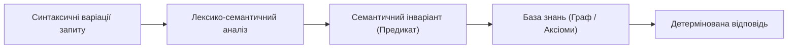
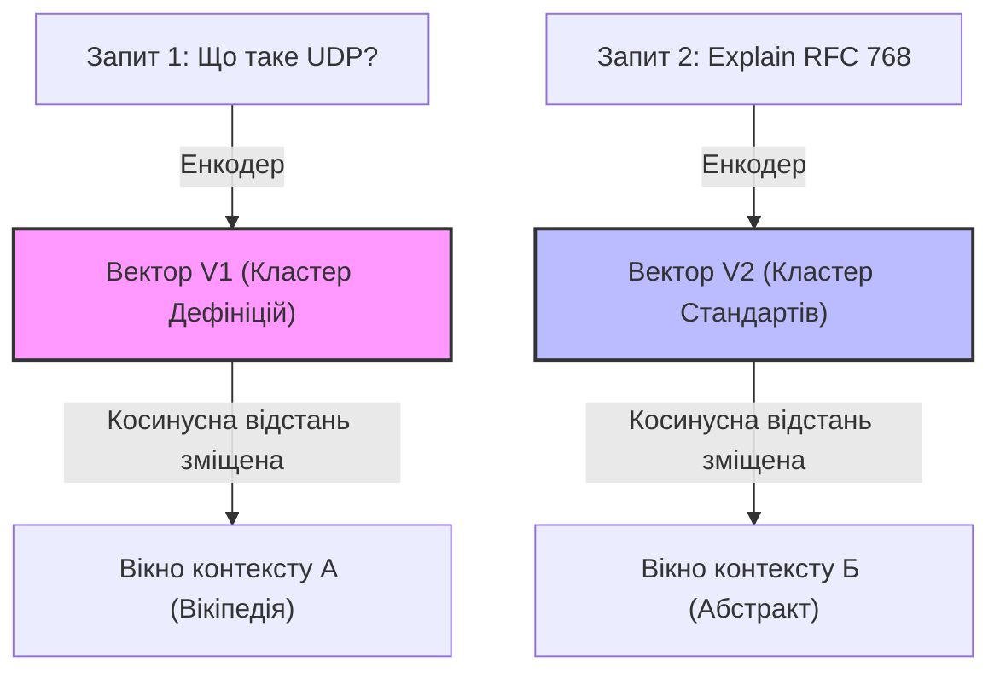
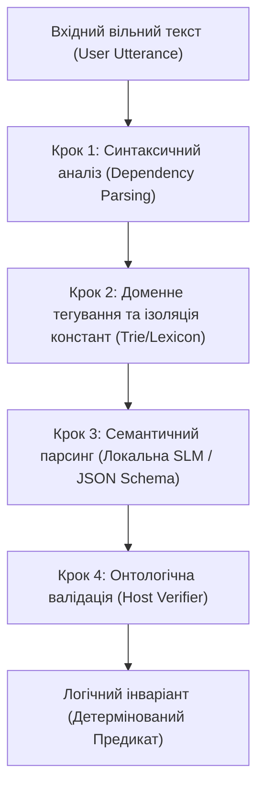
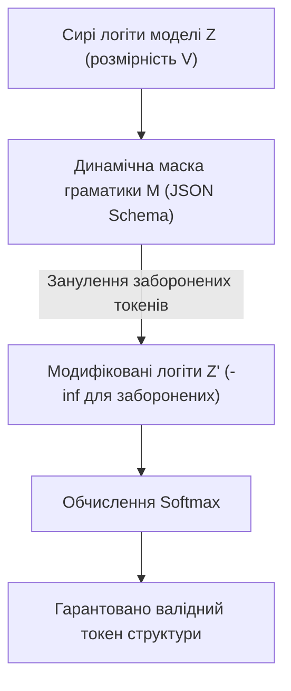
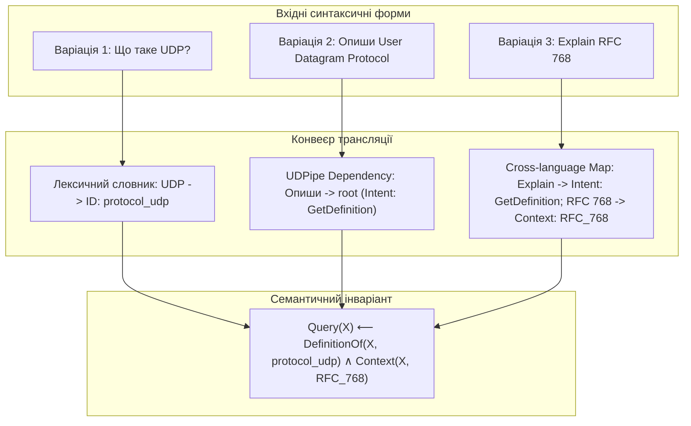
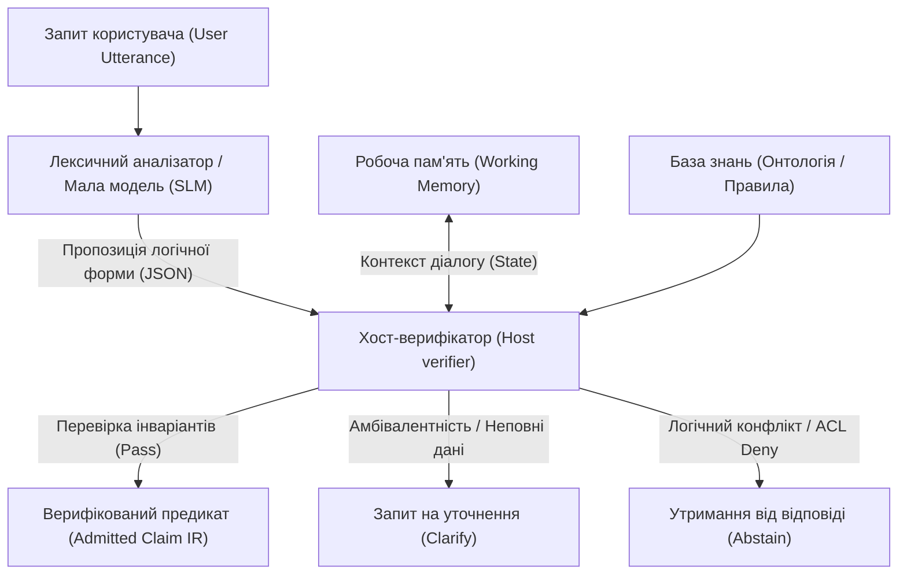

# Варіативність мови проти детермінізму експертної системи: як зкомпілювати суть запитання та вийти за межі ключових слів

**Серія:** Експертні системи для R&D

· стаття 15.5 із 22 **Попередня стаття:** 15 — Як експертна система розуміє текст і не втрачає джерело відповіді

**Наступна стаття:** 16 — Як експертна система пояснює рішення, відмову й можливість змін

**Зміст серії:** README

**Рівень:** розробники та інженери знань: середній

**Після статті:** розрізняти синтаксичну варіативність і семантичну суть запиту, проєктувати гібридні конвеєри семантичного парсингу та калібрувати інтерфейс системи через групи еквівалентних запитань.


Сучасний мейнстрим у розробці інтелектуальних систем прийняття рішень та інтерфейсів до корпоративних баз знань майже повністю капітулював перед парадигмою наївного векторного пошуку (*Dense Retrieval* / *RAG*). Загальноприйнятий підхід виглядає лінійно: перетворити запит користувача на ембединг, знайти за косинусною схожістю суміжні вектори у векторній базі даних (*VDB*) і передати знайдений контекст у велику мовну модель (*LLM*) для генерації кінцевої відповіді.

Проте в інженерних доменах з високою ціною помилки (таких як *Automotive R&D*, *Embedded Systems* чи авіоніка) цей підхід демонструє фундаментальну архітектурну вразливість — **критичну чутливість до синтаксичної варіативності**. Природна мова людини має колосальну надлишковість та гнучкість формулювань. Користувач може запитати про одне й те саме архітектурне обмеження, параметр специфікації або вимогу стандарту (*ISO 26262*, *Automotive SPICE*) мільйоном різних синтаксичних способів, використовуючи професійний сленг, абревіатури або змішуючи мови (*код-світчинг*).

Для наївного *RAG* будь-яка синтаксична зміна формулювання означає неминуче переміщення координат вектора в багатовимірному просторі. Як наслідок, косинусна відстань «пливе», система витягує з бази зовсім інші фрагменти вихідних документів, а генеративна модель видає іншу за суттю відповідь. В експертних системах (*ЕС*), де на висновок машини спирається доказова база інженерного аудиту, нормативного комплаєнсу або *safety review*, така стохастичність є абсолютно неприпустимою. 

Користувач запитує: *«Яка мінімальна довжина заголовка?»* або *«Explain the core concept of RFC 768»* — для системи це не повинно бути пошуком схожих букв чи «вгадуванням» релевантного абзацу. Експертна система зобов'язана звести лінгвістичну різноманітність до єдиного детермінованого логічного токена, обчислити його над верифікованою базою знань і повернути сувору відповідь, що інваріантна до форми запиту та жорстко прив'язана до *immutable source bytes* джерела. Розуміння мови починається не з великої моделі, а з уміння зкомпілювати синтаксис у семантичний інваріант і не втратити точність доказу.

**Мета цього розділу** — розкрити методологію переходу від текстоцентричного пошуку за ключовими або векторними словами до **семантичної компіляції запиту**. Ми розглянемо, як побудувати конвеєр, що нівелює синтаксичну варіативність на етапі лексико-семантичного аналізу, забезпечуючи суворе логічне виведення та можливість надійного крос-синтаксичного калібрування інтерфейсу взаємодії.


Користувач може запитувати про параметри чи обмеження протоколу різними способами. Наївний пошук за ключовими словами чи косинусна схожість векторних моделей сприймають кожну фразу окремо. Надійна експертна система компілює вільне формулювання у строгу семантичну форму для отримання детермінованого висновку.

Запит розглядається як вихідний код, що потребує лексико-семантичного аналізу.



Процес включає детекцію сутностей, екстракцію інтенту та побудову семантичного інваріанту.

## Чому схожість тексту не є доказом розуміння

Векторні індекси використовують косинусну схожість, проте синтаксичні коливання можуть призводити до витягування нерелевантних контекстів. Семантичний парсинг дозволяє експертній системі відокремити форму від змісту.


У мейнстримних архітектурах обробки природної мови (*NLP*) поняття «семантична схожість» часто підміняється геометричною близькістю щільних векторів (*dense embeddings*). Для запиту $$\(\mathbf{q}\)$$ та документа $$\(\mathbf{d}\)$$, представлених як вектори в $$\(m\)$$-вимірному дійсному просторі ($$\(\mathbf{q}, \mathbf{d} \in \mathbb{R}^m\)$$), метрика косинусної схожості (*cosine similarity*) обчислюється як скалярний добуток, нормований на евклідову довжину векторів:

$$\[s_{dense}(q,d) = \frac{\mathbf{q}^\top \mathbf{d}}{\lVert\mathbf{q}\rVert_2 \lVert\mathbf{d}\rVert_2} = \frac{\sum_{i=1}^{m} q_i d_i}{\sqrt{\sum_{i=1}^{m} q_i^2} \sqrt{\sum_{i=1}^{m} d_i^2}}\]$$

Ця формула визначена виключно для ненульових векторів однакової розмірності; наявність `NaN`, нульової норми або невідповідність просторових форм (*shape mismatch*) повністю блокують обробку кандидата ще на етапі первинного ранжування. 

З погляду математичної логіки та інженерії знань, значення $$\(s_{dense}(q,d)\)$$ є суворо **ранговим показником суміжності (ranking score)** у штучно побудованому латентному просторі моделі, а не probability логічної підтримки, істинністю чи дедуктивним доказом. Векторне кодування, виконане глибокими нейромережами (наприклад, трансформерами класу *BERT* чи двонаправленими енкодерами), фіксує статистичні закономірності спільної зустрічальності слів (*distributional semantics*), але повністю ігнорує логічні оператори, квантори та строгі предикативні зв'язки.

Слабкість такого підходу в інженерних доменах R&D виявляється через три фундаментальні проблеми:

1. **Чутливість до синтаксичного шуму:** Додавання заперечення (частки *«не»*), зміна пасивного стану на активний, або перестановка технічних токенів місцями мінімально змінює координати підсумкового вектора. Для моделі ембедингу речення *«Драйвер А сумісний з ревізією Б за умови зміни таймінгів»* та *«Драйвер А несумісний з ревізією Б після зміни таймінгів»* матимуть косинусну схожість понад `0.95`. Проте з погляду детермінованого виведення — це логічне протиріччя (*contradiction*).
2. **Ефект «Пливучої відстані»:** Коли користувач змінює формулювання, наприклад, переходить від прямого запиту *«Що таке UDP?»* до контекстного *«Explain the core concept of RFC 768»*, вектор запиту переміщується у зовсім інший кластер латентного простору. Система *RAG* у цей момент витягує абсолютно інші вікна контексту (*evidence windows*), що руйнує стабільність доказової бази.
3. **Відсутність композиційності:** Щільні вектори стискають зміст усього пасажу в один фіксований рядок чисел. Якщо інженерне запитання вимагає логічного об'єднання фактів із трьох різних документів (наприклад, зв'язати ID вимоги з номером комміту та хешем результату тесту), векторний пошук неспроможний обчислити цей зв'язок. Він може знайти лише ті документи, де ці сутності згадуються фізично поруч.



Векторний пошук шукає *де про це написано*, спираючись на асоціативні зв'язки мовної моделі. Експертна система використовує семантичний парсинг для того, щоб повністю відокремити синтаксичну форму від логічного змісту. Перетворення запиту на детермінований предикат переводить інтерфейс взаємодії з площини імовірнісного геометричного пошуку у площину строгого алгебраїчного обчислення. Система перестає порівнювати букви або вектори — вона починає виконувати зkomпільовану логічну програму над онтологічним графом знань.


## Архітектура та математичний конвеєр семантичної компіляції запиту

Компіляція вільної мовної репліки користувача у формальний логічний предикат — це детермінований процес послідовної трансляції лінгвістичного дерева залежностей у строгу семантичну мову. Спроба побудувати суто декларативні граматики (наприклад, за допомогою інструментів класу *ANTLR*) для всього масиву вхідного неструктурованого тексту неминуче зазнає краху через високу ентропію та непередбачуваність живого синтаксису. 

Для розв'язання цієї проблеми архітектура інтерактивної взаємодії експертної системи проєктується як **гібридний конвеєр (Hybrid Pipeline)**, де кожна стадія виконує ізольоване математичне завдання, звужуючи простір лінгвістичних гіпотез.



### Крок 1. Лінгвістичний розбір та виділення синтаксичних залежностей

Перший етап конвеєра виконує первинне зняття морфологічної та синтаксичної невизначеності без залучення важких генеративних моделей. Для цього застосовуються легкі, локально виконувані нейромережеві інструменти класу **UDPipe** або **Stanza**, що базуються на уніфікованій специфікації **Universal Dependencies**.

* **Метод:** Синтаксичний аналіз залежностей (*Dependency Parsing*).
* **Механіка:** Вхідний ланцюжок токенів транслюється в орієнтований ациклічний граф, де вершинами є слова, а ребрами — типи синтаксичних зв'язків між ними (`root`, `nsubj`, `obj`, `amod`, `det`). Кожна вершина додатково отримує POS-тег (*Part-of-Speech*) та лему (канонічну початкову форму слова).
* **Результат:** Текст очищується від відмінків, родів, чисел та часів, фіксуючи лише скелет речення. Наприклад, для репліки *«Опиши User Datagram Protocol»* слово *«Опиши»* ідентифікується як імперативне дієслово (`root`), а *«Protocol»* — як залежний прямий додаток (`obj`).

### Крок 2. Доменне тегування та жорстка ізоляція констант

Щоб запобігти руйнуванню складних технічних ідентифікаторів, абревіатур, числових значень та специфікованих констант на наступних етапах нейромережевого аналізу, вони мають бути ізольовані та типізовані за допомогою суворих алгоритмічних методів.

* **Метод:** Префіксні дерева (*Trie*), регулярні вирази (*Regex*) та доменні лексикони.
* **Механіка:** Система сканує вхідну послідовність на наявність точних збігів з онтологічними довідниками проєкту, реєстрами вимог стандарту та шаблонами інженерних сутностей.
* **Результат:** Варіативні рядки на кшталт *«UDP»*, *«User Datagram Protocol»*, *«юдіпі»* або *«RFC 768»* ще до передачі у мовну модель замінюються на жорсткі, закриті від змін внутрішні токени-константи. Вхідний потік перетворюється на гібридний граф, де лінгвістичні леми сусідять із неподільними атомами онтології: `Entity(ID: protocol_udp, source: RFC_768)`.

### Крок 3. Семантичний парсинг (Semantic Parsing) за допомогою SLM

Коли текст очищено, структуровано й обмежено константами, виникає потреба трансляції лінгвістичної структури у формальну мову логіки. Цю нелінійну трансформацію виконує Мала Мовна Модель (**SLM** класу *Phi-3* або *Llama-3-8B*), розгорнута локально та оптимізована за допомогою цільового донавчання за методикою **Fine-Tuning / LoRA** на корпусі пар `[Синтаксичне дерево + Токени сутностей -> Логічна форма]`.

* **Метод:** Генерація послідовності у структуру (*Sequence-to-Structure Generation*) з керованим синтаксичним декодуванням.
* **Механіка:** Модель не генерує вільну відповідь чи перефразування. Її вихідний простір токенів примусово обмежений за допомогою **JSON Schema** (детальніше — у наступній статті). Завдання моделі — розпізнати намір користувача (інтент) та зв'язати виділені константи з відповідними аргументами схеми.
* **Результат:** SLM формує структуровану логічну гіпотезу (structured proposal) у форматі JSON:

```json
{
  "intent": "GetDefinition",
  "arguments": {
    "target": "protocol_udp",
    "scope": "RFC_768"
  }
}
```

### Крок 4. Онтологічна валідація та фіксація інваріанту (Host Verifier)

Будь-який вихід нейромережевої моделі за своєю природою є ймовірнісним і не має прямого авторитету для взаємодії з ядром знань експертної системи. Отриманий на Кроці 3 JSON-об'єкт розглядається суворо як кандидат на виконання і передається в детермінований **Хост-верифікатор (Host Verifier)**.

* **Метод:** Онтологічний констрейнт-валідатор (Type Checking & Constraint Enforcement).
* **Механіка:** Написаний на детермінованій мові програмування (наприклад, Go) код хосту звіряє згенерований JSON зі строгою схемою діючої версії онтології (`knowledge_version`) та перевіряє права доступу користувача (`ACL`). Якщо модель спробувала згенерувати неіснуючий тип зв'язку, припустилася логічної помилки або вийшла за межі дозволеного контексту, конвеєр переривається з вердиктом `decision=ABSTAIN` (утримання від відповіді).
* **Результат:** Після успішної перевірки всіх інваріантів хост-верифікатор транслює структуру у чисте детерміноване числення предикатів першого порядку для рушія логічного виведення:

$$\text{Query}(X) \leftarrow \text{DefinitionOf}(X, \text{protocol}\_\text{udp}) \wedge \text{Context}(X, \text{RFC}\_\text{768})$$

Завдяки такій побудові конвеєра пошук за ключовими або векторними словами повністю усувається на користь логічного обчислення змісту запиту.

## Обмежене декодування за граматикою як запобіжник галюцинацій

Навіть якщо Мала Мовна Модель (**SLM**) на Кроці 3 пройшла процедуру цільового донавчання (*Fine-Tuning*), у вільному режимі генерації залишається ненульова ймовірність синтаксичного збою. Модель може порушити структуру JSON, переплутати типи даних (наприклад, записати масив замість рядка) або згенерувати випадкові текстові токени поза контекстом схеми. 

Щоб повністю унеможливити подібні випадки на рівні архітектури, у локальних середовищах виконання використовується механізм **обмеженого декодування за граматикою (Grammar-Constrained Decoding)**. Цей підхід переводить генерацію структури з категорії ймовірнісного припущення в категорію суворо керованого автомату.

### Механіка маскування логітів (Logit Processing)

Процес передбачення кожного наступного токена мовною моделю починається з обчислення вектора сирих оцінок — логітів ($$\(\mathbf{z}\)$$) для всього словника моделі $$\(V\)$$. У вільному режимі ймовірність вибору токена $$\(i\)$$ визначається через стандартну функцію *Softmax*:

$$p_i = \frac{e^{z_i}}{\sum_{j \in V} e^{z_j}}$$

За умови обмеженого декодування, локальний рантайм (наприклад, сумісний із **JSON Schema Draft 2020-12 Core**) на кожному кроці генерації будує динамічну логічну маску дозволених токенів $$\(M \subseteq V\)$$. Ця маска визначається поточним станом синтаксичного аналізатора $LL(k)$ або $LR(k)$ граматики). 
Логіти токенів, які не відповідають схемі, примусово зануляються (прирівнюються до $$\(-\infty\))$$ перед етапом обчислення ймовірностей:

$$\[z'_i = \begin{cases} z_i, & \text{якщо } i \in M \\ -\infty, & \text{якщо } i \notin M \end{cases} \qquad \Longrightarrow \qquad p'_i = \frac{e^{z'_i}}{\sum_{j \in V} e^{z'_j}}\]$$

Як наслідок, ймовірність генерації невалідного з погляду граматики токена стає суворо рівною нулю $$\(\(p'_i = 0\))$$. Модель фізично позбавляється можливості згенерувати зайву кому, закрити дужку завчасно або вставити довільний текст там, де очікується конкретний онтологічний ідентифікатор.



### Інтеграція з локальними середовищами виконання

Сучасні локальні інструменти виконання моделей надають нативну підтримку цього математичного обмеження, проте реалізують його на різних рівнях абстракції:

* **llama.cpp + GGUF:** Використовує вбудований рушій формальних граматик *GBNF* (GGML BNF). Схема JSON автоматично компілюється в набір правил контекстно-вільної граматики, яка керує вибором токенів на рівні найнижчих абстракцій C/C++ коду.
* **vLLM:** Підтримує паралельне високоефективне обслуговування (*high-throughput serving*) структурованих запитів через інтеграцію з бібліотеками типу *Outlines* або *XGrammar*. Завдяки оптимізації *PagedAttention*, маскування логітів виконується без втрати швидкості обчислення та сумісне з пакетною обробкою (*batching*).
* **Ollama (Structured Outputs):** Надає високорівневий API, де інтерфейс JSON Schema жорстко контролює вихід. Проте, як зазначено в документації проєкту, сам посібник структурованого виводу лише забезпечує синтаксичну валідність контейнера (*schema-valid JSON*), але не гарантує factual support (фактичну істинність) знань всередині.

Для експертної системи цей етап є критично важливим фільтром: він гарантує, що на Крок 4 (Хост-верифікація) надійде об'єкт, який стовідсотково відповідає синтаксису очікуваного контракту, заощаджуючи обчислювальні ресурси системи на обробку синтаксичного бруду.


## Калібрування стійкості через іспит на варіативність

Для перевірки спроможності лінгвістичного конвеєра утримувати семантичне ядро за умов високого синтаційного шуму застосовується метод **крос-синтаксичної валідації (Cross-Syntactic Validation)**. Замість традиційного тестування системи поодинокими контрольними запитами, інтерфейс експертної системи проходить іспит на групах еквівалентності. 

Одиницею тестування тут виступає не окрема фраза, а **об'єкт знань (Knowledge Object)**, навколо якого штучно або емпірично формується група варіантів запитів, що мають ідентичне семантичне очікування.

### Практичний кейс: Корпус знань RFC 768 (User Datagram Protocol)

Розглянемо механіку калібрування на прикладі специфікації протоколу **RFC 768**. Перед системою ставиться завдання обчислити сутність відповіді для трьох синтаксично відмінних реплік, які може згенерувати користувач із різним рівнем підготовки:

*   **Варіація 1 (Прямий дефінітивний запит, українська мова):**  
    *«Що таке UDP?»*
*   **Варіація 2 (Описовий інженерний стиль, розгорнута назва):**  
    *«Опиши User Datagram Protocol»*
*   **Варіація 3 (Англомовний контекст із жорсткою прив'язкою до першоджерела):**  
    *«Explain the core concept of RFC 768»*

При використанні традиційного векторного пошуку (*RAG*) ці три запити кодуються у три різні точки багатовимірного простору, запускаючи стохастичний процес зіставлення, де косинусна відстань неминуче дрейфує. Експертна система зобов'язана звести цю варіативність до єдиного логічного інваріанту.

### Етапи трансформації та верифікації групи еквівалентності

Трансформація кожної варіації всередині гібридного конвеєра відбувається за такою логікою:



1. **Для Варіації 1:** Крок 2 (Доменне тегування) миттєво згортає токен `UDP` у константу `protocol_udp`. Мала мовна модель (*SLM*) на Кроці 3 ідентифікує конструкцію *«Що таке»* як базовий інтент `GetDefinition`.
2. **Для Варіації 2:** Крок 1 (*Dependency Parsing*) визначає імперативне дієслово *«Опиши»* як `root` речення. На Кроці 3 *SLM* мапить цю лінгвістичну структуру на той самий інтент `GetDefinition`, а довге найменування протоколу через префіксне дерево зводиться до єдиного ідентифікатора `protocol_udp`.
3. **Для Варіації 3:** Кросмовний аналізатор та доменний лексикон фіксують жорстку прив'язку номера стандарту `RFC 768` до контексту джерела `Context: RFC_768`.

На виході з Хост-верифікатора всі три вхідні лінії сходяться в **один і той самий детермінований предикат числення предикатів першого порядку**:

$$\[\text{Query}(X) \leftarrow \text{DefinitionOf}(X, \text{protocol\_udp}) \wedge \text{Context}(X, \text{RFC\_768})\]$$

### Критерій проходження Release Gate

Калібрування інтерфейсу вважається успішним лише у тому випадку, якщо для всієї групи синтаксичних варіацій \(V_g\) виконується суворий інваріант рівності кінцевого успіху (*GroupPass*):

$$\[GroupPass = \frac{1}{\vert{}G\vert{}}\sum_{g \in G} \prod_{i \in V_g} Success_i\]$$

де \(Success_i = 1\) фіксується виключно тоді, коли система для запиту \(i\) згенерувала бездоганний логічний контракт, пройшла перевірку прав доступу, звернулася до потрібних *immutable bytes* оригінального тексту й повернула ідентичну за змістом відповідь. Якщо хоча б одна синтаксична варіація зміщує логіку виведення або призводить до викривлення предикату — збірка інтерфейсу вважається невалідною, а потік змін блокується на етапі автоматичного тестування регресій.

## Розподіл відповідальності в архітектурі інтерактивної взаємодії

Жоден компонент інтелектуального інтерфейсу не повинен одночасно виконувати лінгвістичний розбір, інтерпретувати зміст та самостійно ухвалювати рішення про валідність власного висновку. Порушення цього принципу у багатьох сучасних системах на базі мовних моделей призводить до розмивання архітектурних меж, коли ймовірнісний генератор намагається взяти на себе функції системи контролю доступу чи логічного різака. 

Для побудови надійного інтерфейсу експертної системи реалізується строга ізоляція ролей між лінгвістичним конвеєром, робочою пам'яттю та детермінованим хост-верифікатором.



### Ізоляція ролей та зони відповідальності

1. **Лексичний аналізатор та Мала мовна модель (SLM):**
   * **Зокрема відповідає за:** Розпізнавання мовленнєвого акту (*speech act*), усунення неявних суб’єктів, розкриття анафор та формування структурованої пропозиції логічної форми (*structured proposal*). Вона виступає суворо як транслятор природного тексту у лінгвістичну гіпотезу.
   * **Не є авторитетом для:** Визначення істинності фактів, перевірки прав доступу користувача (*ACL*), фіксації нормативної сили твердження або безпосереднього звернення до сховища знань.
2. **Робоча пам'ять (Working Memory):**
   * **Зокрема відповідає за:** Збереження темпорального стану поточної сесії взаємодії, утримання активних предикатів попередніх реплік та фіксацію зафіксованих констант (`knowledge_version`, `snapshot_hash`).
   * **Не є авторитетом для:** Обчислення нових логічних зв'язків чи інтерпретації синтаксису.
3. **Хост-верифікатор (Host Verifier):**
   * **Зокрема відповідає за:** Суворе математичне та алгоритмічне тестування отриманої JSON-пропозиції на відповідність жорстким правилам доменної онтології. Це детермінований програмний код, який виступає єдиним релізним гейтом для вхідних запитів.

### Обробка неповних та амбівалентних запитів інженерів

На практиці інженери часто ставлять неповні, контекстно-залежні запитання. Наприклад, перебуваючи в контексті обговорення дефекту, користувач надсилає коротку репліку: *«яка мінімальна довжина заголовка?»*, не вказуючи назву протоколу чи версію специфікації.

Традиційні генеративні системи намагаються заповнити ці прогалини самостійно, використовуючи ймовірнісний контекст моделі, що часто призводить до прихованих галюцинацій та підміни джерел (цитування параметрів IPv6 замість UDP). В експертній системі обробка амбівалентності відбувається за детермінованим алгоритмом на рівні **Хост-верифікатора**:

* **Крок 1:** Мала мовна модель транслює запит у неповну структуру:
  ```json
  {
    "intent": "GetMinimumLength",
    "arguments": {
      "target": "header"
    }
  }
  ```
* **Крок 2:** Хост-верифікатор приймає об'єкт і виявляє відсутність обов'язкового онтологічного аргументу `scope` або `protocol`.
* **Крок 3:** Хост звертається до **Робочої пам'яті (Working Memory)**. Якщо у попередній репліці було зафіксовано роботу із суттю `protocol_udp`, верифікатор виконує автоматичне логічне зв'язування (*binding*), добудовуючи предикат до валідного інваріанту.
* **Крок 4:** Якщо Робоча пам'ять порожня, а контекст відсутній, система категорично відмовляється від генерації припущень. Конвеєр блокується, а користувачеві повертається детермінований запит на уточнення (`decision=CLARIFY`): *«Уточніть, для якого саме протоколу чи стандарту ви хочете перевірити мінімальну довжину заголовка?»*.

Такий підхід повністю захищає систему від ефекту «чорної скриньки». Користувач завжди бачить чітку межу: де система ухвалила логічне рішення на основі доказів, де вона використала збережений контекст сесії, а де — зупинила виведення через брак верифікованих даних, зберігаючи повну епістемічну дисципліну інтерфейсу.

## Висновок

Розуміння природної мови в доказових експертних системах для R&D — це не магія великих контекстних вікон чи розмитих векторних просторів, а строгий процес компіляції вільного тексту в семантичний інваріант. Текстоцентричний підхід, який покладається на ймовірнісну природу мовних моделей або геометричну суміжність косинусних відстаней, є неприпустимим у доменах із високою ціною помилки та строгими стандартами нормативного комплаєнсу.

Впровадження гібридного конвеєра семантичної компіляції дозволяє чітко розмежувати ролі компонентів системи:
* Локальна мала мовна модель (**SLM**) під контролем обмеженого за граматикою декодування (**Grammar-Constrained Decoding**) розширює множину мовних форм, які система здатна прийняти на вході, транслюючи їх у лінгвістичні гіпотези.
* Детермінований **Хост-верифікатор (Host Verifier)** та жорстка доменна онтологія звужують множину цих інтерпретацій до перевірних інваріантів, за які система може відповісти з точністю до байта вихідного коду джерела.

Крос-синтаксичне калібрування на групах еквівалентності виступає надійним релізним гейтом, що гарантує стабільність логічного виведення незалежно від мовних коливань, сленгу чи зміни формулювань інженером. Розуміти ширше, але стверджувати обережніше — саме цей епістемічний принцип перетворює звичайний інформаційно-довідковий чат-бот на інтелектуальну та доказову систему прийняття рішень.

Наступна стаття переходить від етапу інтерпретації запиту користувача до внутрішньої логіки його обґрунтування. Ми розберемо архітектуру **Машини Пояснень (Explanation Engine)**: як із тих самих зафіксованих артефактів доказів і походження будувати детерміновані відповіді на запити типу *HOW*, *WHY*, *WHY NOT* та контрфактичні сценарії, не дозволяючи нейромережам вигадувати причини рішень заднім числом.

## Питання до читачів

* Чи перевіряєте ви стійкість вашого інтелектуального інтерфейсу на групах синтаксичної еквівалентності?
* Де у вашій архітектурі обробки даних проходить межа між лінгвістичною гіпотезою моделі та детермінованим онтологічним контрактом?
* Які механізми використовує ваша робоча пам'ять (Working Memory) для відновлення пропущених інженером предикатів запиту?
* Як ви протидієте зміщенню косинусної відстані (embeddings drift) при переході користувача на сленг чи змішування мов?
* Чи залучаєте ви обмежене за граматикою декодування (Grammar-Constrained Decoding) для жорсткої фіксації контрактів на виході малих моделей?


## Посилання на інших авторів, стандарти й офіційну документацію

* Noam Chomsky. Three Models for the Description of Language, *IRE Transactions on Information Theory*, 1956.
* John McCarthy. Programs with Common Sense, *Proceedings of the Teddington Conference on the Mechanization of Thought Processes*, 1958.
* Edward A. Feigenbaum. Knowledge Engineering for the 1980's, *Computer Science Department, Stanford University*, 1982.
* Patrick Lewis et al. Retrieval-Augmented Generation for Knowledge-Intensive NLP Tasks, *NeurIPS*, 2020.
* Chuan Guo et al. On Calibration of Modern Neural Networks, *ICML*, 2017.
* Yonatan Geifman, Ran El-Yaniv. Selective Classification for Deep Neural Networks, *NeurIPS*, 2017.
* Rotem Dror et al. The Hitchhiker’s Guide to Statistical Significance Testing for Natural Language Processing, *ACL*, 2018.
* Postel J. User Datagram Protocol, *RFC 768*, 1980.
* Taku Kudo, John Richardson. SentencePiece: A simple and language independent subword tokenizer and detokenizer for Neural Text Processing, *EMNLP*, 2018.
* Milan Straka et al. UDPipe: Trainable Pipeline for Syntactic and Morphological Analysis via Universal Dependencies, *LREC*, 2016.

