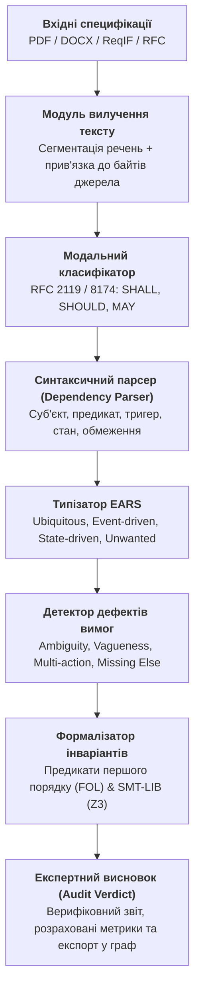
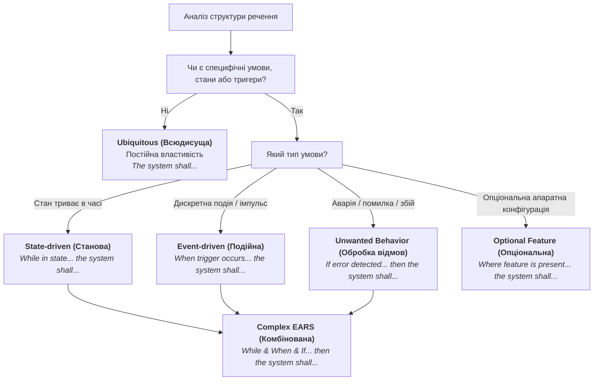
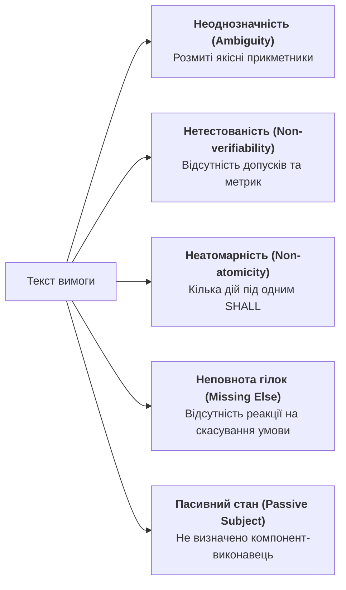
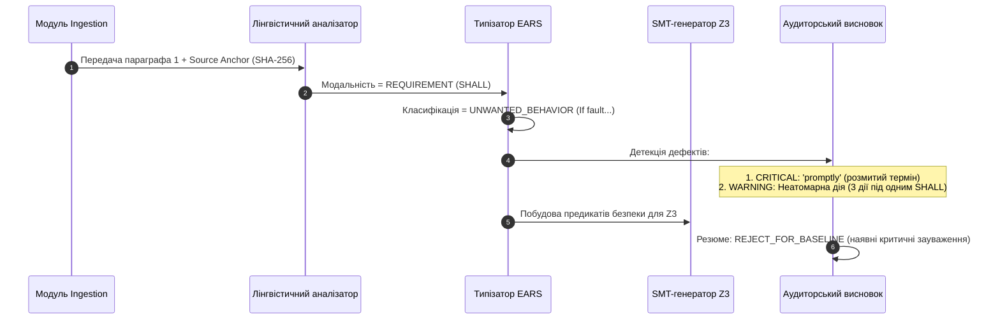

# Детекція вимог у стандартах і специфікаціях: як витягти нормативні предикати (SHALL/MUST) та побудувати інваріанти

> **Серія:** [Експертні системи для R&D](README.md) · стаття 24 із 27  
> **Попередня стаття:** [23 — Варіативність мови проти детермінізму експертної системи: як скомпілювати суть запитання та вийти за межі ключових слів](23-language-variability-vs-expert-system-determinism.md)  
> **Наступна стаття:** 25 — Детекція колізій та Gap-аналіз інженерних документів: порівняння версій специфікацій без текстового шуму (готується до публікації)  
> **Зміст серії:** [README](README.md)  
> **Рівень:** системні інженери, архітектори, розробники та фахівці з V&V: середній / просунутий  
> **Після статті:** проєктувати надійні конвеєри автоматичної екстракції вимог із неструктурованих специфікацій і стандартів (PDF, DOCX, ReqIF), транслювати модальну лексику (RFC 2119, RFC 8174, ISO/IEC Directives) у типізовані шаблони EARS, будувати математичні інваріанти першого порядку та SMT-формули, а також формувати детермінований аудиторський висновок щодо якості, повноти й верифіковності вимог.

В інженерних дослідженнях і розробках (*R&D*) створення складного виробу — чи то блоку керування батареєю електромобіля (*BMS ECU*), авіоніки (*DO-178C / DO-254*), імплантованого дефібрилятора (*IEC 62304*), чи нового телекомунікаційного чипа (*ASIC / SoC*) — починається не з написання вихідного коду чи топології кристала. Воно починається з тисяч сторінок нормативних документів.

Типовий інженерний проєкт спирається на три гетерогенні пласти нормативного знання:

1. **Міжнародні та галузеві стандарти:** формальні правила на зразок *ISO 26262* (функціональна безпека автомобілів), *MISRA C/C++*, *AUTOSAR*, протоколи *IEEE 802.3*, специфікації *RFC* або регламенти *FDA / FAA*.
2. **Технічні завдання та вимоги замовника (*Customer Requirement Documents, CRD / SRS*):** документи на сотні сторінок, передані у форматах PDF, DOCX чи експортах систем керування вимогами (*IBM DOORS*, *PTC Windchill*, *Siemens Polarion*).
3. **Технічні описи та обмеження елементної бази (*Hardware Datasheets & Errata*):** описи регістрів, таймінгів, температурних діапазонів і споживання струму мікроконтролерів і сенсорів.

Головний парадокс сучасного інжинірингу полягає в тому, що всі подальші етапи — проєктування архітектури, написання коду, верифікація (*V&V*) і сертифікація — вимагають абсолютної математичної точності. Проте фундаментальне першоджерело, з якого виводяться ці артефакти, зафіксоване розмитою, багатослівною і повною синтаксичних пасток природною мовою людини.

Коли інженерна команда намагається автоматизувати роботу з документами за допомогою наївного векторного пошуку (*RAG*) чи універсальних великих мовних моделей (*LLM*), система неминуче стикається з катастрофічною ненадійністю: стохастичні моделі галюцинують кванторами, «ковтають» граничні часові інтервали, плутають сувору заборону (*SHALL NOT*) із рекомендацією (*SHOULD NOT*) і не здатні надати гарантію повноти покриття. Для сертифікаційного аудиту відповідь нейромережі «вимога, найімовірніше, задоволена» не має жодної юридичної чи інженерної сили.

Справжня експертна система розглядає специфікацію не як пасивний текст для читання, а як **нескомпільований вихідний код специфікації**. Мета експертної системи — виконати детермінований семантичний парсинг природномовного тексту, виявити нормативні модальні оператори, виокремити контекст і предикати поведінки, нормалізувати їх до типізованих шаблонів **EARS** (*Easy Approach to Requirements Syntax*), а потім скомпілювати у формальні логічні інваріанти (предикати першого порядку $FOL$, темпоральну логіку $LTL$ та вирази $SMT$). Лише на цій основі машина отримує право сформувати обґрунтований експертний висновок про якість специфікації та готовність вимог до трасування.



---

## Анатомія нормативної лексики: модальність за RFC 2119, RFC 8174 та ISO/IEC Directives

Не кожне речення у технічній документації є вимогою. Значна частина тексту — це вступний опис системи (*Rationale*), коментарі архітекторів, приклади застосування або рекомендації щодо зручності експлуатації. Якщо експертна система індексуватиме весь текст поспіль без розрізнення модальності, база знань перетвориться на хаотичне звалище неперевірюваних фактів.

У світовій інженерній практиці розроблені суворі лексичні регламенти, що визначають юридичну та технічну силу тверджень. Найвідомішими є стандарти **IETF RFC 2119** (доповнений **RFC 8174**), а також директиви **ISO/IEC Directives, Part 2** (Розділ 7: *Verbal forms for expressions of provisions*).

### Рівні нормативної сили тверджень

Експертна система зобов'язана класифікувати кожне речення за рівнями нормативної градації:

| Градація нормативності | Ключові маркери (EN) | Ключові маркери (UA) | Семантичне значення для експертної системи | Інженерний статус артефакту |
|---|---|---|---|---|
| **Суворе зобов'язання (Requirement)** | `SHALL`, `MUST`, `REQUIRED` | *повинен*, *зобов'язаний*, *необхідно* | Абсолютна вимога специфікації. Невиконання веде до бракування релізу або непроходження сертифікації. | Формує обов'язковий логічний інваріант $\forall s, \text{Inv}(s)$. Потребує 100% покриття тестами та верифікацією. |
| **Сувора заборона (Prohibition)** | `SHALL NOT`, `MUST NOT` | *не повинен*, *заборонено* | Абсолютна заборона стану або переходу. Порушення є критичною загрозою безпеці (*Safety Violation*). | Формує інваріант безпеки $\square \neg \text{ForbiddenState}$. Автоматично генерує негативні тести (*Fault Injection*). |
| **Рекомендація (Recommendation)** | `SHOULD`, `RECOMMENDED` | *слід*, *рекомендовано* | Допускається відхилення за наявності обґрунтованої інженерної причини (*Waiver / Justification*). | Фіксується як м'яке обмеження (*Soft Constraint*). Потребує наявності підписаного інженерного обґрунтування у разі відхилення. |
| **Небажана дія (Deprecation)** | `SHOULD NOT`, `NOT RECOMMENDED` | *не слід*, *не рекомендовано* | Поведінка, якої треба уникати, якщо немає вагомих архітектурних обмежень. | Генерує попередження статичного аналізу (*Warning*), що потребує рев'ю архітектора. |
| **Дозвіл (Permission)** | `MAY`, `OPTIONAL` | *може*, *допускається* | Повністю опціональна поведінка або додатковий функціонал вендора. | Реєструється як опціональна фіча. Не може бути підставою для відхилення релізу. |
| **Твердження про факт (Statement of Fact)** | `WILL`, `IS`, `CAN` | *буде*, *є*, *здатний* | Опис властивості системи, поведінки зовнішнього середовища або фізичного закону. | Не є вимогою до системи. Відноситься до розділу передумов або опису контексту (*Environment Assumption*). |

### Синтаксичні пастки природної мови в інженерних специфікаціях

Прямий пошук слів за регулярними виразами (на зразок `\bSHALL\b`) виявляє лише вершину айсберга. Реальні інженерні документи створюються різними авторами, часто неносіями мови, і містять типові дефекти формулювань:

1. **Пасивний стан без зазначення суб'єкта (*Passive Voice without Agent*):**
   *Приклад:* *"Data shall be validated before transmission."*
   *Проблема для ЕС:* Хто саме зобов'язаний валідувати дані? Драйвер сенсора? Комунікаційний контролер? Застосунок верхнього рівня? Відсутність чітко визначеного суб'єкта дії робить вимогу нерозподіленою і блокує призначення відповідального модуля в коді.
2. **Прихована нормативність (*Concealed Modality*):**
   *Приклад:* *"The ECU is responsible for monitoring battery voltage."* або *"The firmware needs to reboot if a watchdog timeout occurs."*
   Формально слово `SHALL` відсутнє, але за інженерним змістом це сувора функціональна вимога. Система лінгвістичного аналізу повинна володіти онтологією квазімодальних дієслівних конструкцій (`is responsible for`, `has to`, `needs to`, `is required to`).
3. **Розщеплені квантори та складені винятки (*Split Quantifiers & Exception Clauses*):**
   *Приклад:* *"The system shall maintain 50 Hz PWM frequency under all load conditions, except during initial power-up calibration where 20 Hz is permitted for a maximum of 200 ms."*
   Таке речення поєднує в собі загальну вимогу, стан винятку, альтернативну поведінку та часове обмеження. Експертна система зобов'язана декомпонувати таку складну конструкцію на атомарні логічні гілки.

---

## Синтаксична типізація: шаблони EARS (Easy Approach to Requirements Syntax)

Щоб перетворити хаотичний синтаксис природної мови на строгу математичну конструкцію, у сучасній інженерії вимог застосовують методологію **EARS** (*Easy Approach to Requirements Syntax*), створену Алістером Мевіном (*Alistair Mavin*) під час розробки авіаційних двигунів у компанії Rolls-Royce.

EARS стандартизує синтаксис вимог до п'яти базових патернів і одного комбінованого. Перевага EARS для експертної системи полягає в тому, що кожен шаблон має пряме, однозначне відображення в логіку предикатів.



### Детальна структура шаблонів EARS

#### 1. Всюдисуща вимога (Ubiquitous Requirement)

Вимога, що діє безперервно протягом усього життєвого циклу системи, без прив'язки до подій чи станів.

* **Канонічний синтаксис:** `The <system name> shall <system response>.`
* **Інженерний приклад:** *"The CAN controller shall support extended 29-bit identifiers."*
* **Логічна інтерпретація:** $\forall t \ge 0, \quad \text{Capability}(\text{CAN\_Controller}, \text{Ext29Bit}) = \mathrm{True}$.

#### 2. Подійна вимога (Event-driven Requirement)

Реакція системи на зовнішню подію або зміну сигналу, що відбувається миттєво або ініціює перехід.

* **Канонічний синтаксис:** `When <trigger>, the <system name> shall <system response>.`
* **Інженерний приклад:** *"When the E-STOP button is pressed, the motor driver shall disable gate drive outputs within 5 ms."*
* **Логічна інтерпретація:** $\square (\text{Pressed}(\text{E\_STOP}) \implies \lozenge_{\le 5\,\mathrm{ms}} \text{Disabled}(\text{GateOutputs}))$.

#### 3. Станова вимога (State-driven Requirement)

Вимога, що активна лише тоді, коли система перебуває у визначеному робочому режимі.

* **Канонічний синтаксис:** `While <in state>, the <system name> shall <system response>.`
* **Інженерний приклад:** *"While in PRE-CHARGE mode, the BMS shall limit the pre-charge resistor current to 10 A."*
* **Логічна інтерпретація:** $\forall t, \quad (\text{State}(t) = \text{PRE\_CHARGE}) \implies (\text{Current}(t) \le 10\,\mathrm{A})$.

#### 4. Обробка нештатних ситуацій та відмов (Unwanted Behavior Requirement)

Реакція на збій, порушення протоколу або вихід за межі безпечного діапазону.

* **Канонічний синтаксис:** `If <trigger/fault condition>, then the <system name> shall <system response>.`
* **Інженерний приклад:** *"If the cell temperature exceeds 65°C, then the cooling controller shall activate the refrigerant pump at 100% duty cycle."*
* **Логічна інтерпретація:** $\forall t, \quad (\text{Temp}(t) > 65^{\circ}\mathrm{C}) \implies (\text{PumpDutyCycle}(t) = 1.0)$.

#### 5. Опціональна функціональність (Optional Feature Requirement)

Вимога, що реалізується лише за наявності відповідного апаратного модуля чи ліцензії.

* **Канонічний синтаксис:** `Where <feature is included>, the <system name> shall <system response>.`
* **Інженерний приклад:** *"Where the hardware watchdog is populated, the CPU supervisor shall toggle the WDI pin every 50 ms."*
* **Логічна інтерпретація:** $\text{HasHW}(\text{Watchdog}) \implies \square (\text{ToggleInterval} = 50\,\mathrm{ms})$.

#### 6. Комплексна вимога (Complex EARS Requirement)

Поєднує передумови стану, події та відмови:

* **Канонічний синтаксис:** `While <state>, When <trigger>, If <fault>, then the <system name> shall <system response>.`
* **Інженерний приклад:** *"While in CHARGING state, when the charge plug is unlocked, if the current exceeds 0.5 A, then the charger shall immediately trigger the high-voltage interlock loop (HVIL) disconnect."*

---

## Математична та логічна формалізація вимог

Перехід від шаблону EARS до виконуваного інженерного інваріанта вимагає трансляції в строгі формальні мови: **предикати першого порядку ($FOL$)**, **темпоральну логіку ($LTL/STL$)** та мову **$SMT\text{-}LIB\text{ v2}$** для автоматизованої перевірки за допомогою $SMT$-рішувачів (таких як *Z3*, *CVC5* або *Yices*).

### Логіка предикатів першого порядку (FOL)

Узагальнена вимога до системи моделюється як відношення над простором станів системи $\mathcal{S}$ та вектором вхідних сигналів $\mathbf{x} \in \mathcal{X}$:

```math
\forall s \in \mathcal{S}, \; \forall \mathbf{x} \in \mathcal{X}: \quad \Phi_{\mathrm{pre}}(s, \mathbf{x}) \implies \Phi_{\mathrm{post}}(s', \mathbf{y}) \land \mathcal{T}(s, s')
```

де:

- $\Phi_{\mathrm{pre}}(s, \mathbf{x})$ — предикат передумови (*Precondition*), що агрегує активний стан (`While`), ініціюючу подію (`When`) та умови відмови (`If`);
- $\Phi_{\mathrm{post}}(s', \mathbf{y})$ — предикат післяумови (*Postcondition*), що визначає новий стан системи $s'$ та вихідні керівні сигнали $\mathbf{y}$ (`shall <action>`);
- $\mathcal{T}(s, s')$ — часовий або фазовий контракт переходу (наприклад, $\Delta t \le t_{\mathrm{timeout}}$).

### Лінійна темпоральна логіка (LTL) та сигнальна темпоральна логіка (STL)

Оскільки реальні вбудовані системи працюють у неперервному або дискретному часі, статичних предикатів недостатньо для моделювання реактивності. Експертна система транслює подійні вимоги у формули $LTL$:

1. **Інваріант безпеки (Safety Invariant — «нічого поганого не станеться»):**

   ```math
   \square \, \neg \bigl(\text{Current} > I_{\max} \land \text{ContactorState} = \text{CLOSED}\bigr)
   ```

   (Оператор $\square$ означає «завжди в усіх майбутніх станах»).

2. **Вимога живучості та обмеженого часу реакції (Bounded Liveness):**

   ```math
   \square \, \Bigl(\text{FaultTriggered} \implies \lozenge_{\le \tau} \, \text{SafeStateAchieved}\Bigr)
   ```

   (Оператор $\lozenge_{\le \tau}$ означає «не пізніше ніж через час $\tau$ настане подія»).

### Формалізація в синтаксисі SMT-LIB v2

Для автоматичного пошуку логічних суперечностей (наприклад, коли одна вимога вимагає розімкнути реле, а інша в цьому ж стані — замкнути його) експертна система генерує декларативні скрипти для SMT-рішувача:

```lisp
;; Декларація типів станів
(declare-datatypes () ((BmsState INIT STANDBY CHARGE DISCHARGE FAULT)))

;; Змінні системи
(declare-const state BmsState)
(declare-const cell_temp_c Real)
(declare-const contactor_closed Bool)
(declare-const alarm_broadcast Bool)

;; Інваріант Вимоги REQ-BMS-042 (Unwanted Behavior):
;; If cell_temp_c > 60.0 then contactor_closed = false and alarm_broadcast = true
(assert (=> (> cell_temp_c 60.0) 
            (and (not contactor_closed) alarm_broadcast)))

;; Перевірка на суперечність: чи може бути температура > 60.0 при замкнутому контакторі?
(assert (and (> cell_temp_c 60.0) contactor_closed))
(check-sat)
;; Результат рішувача: unsat (протиріччя доведено, інваріант безпеки непорушний)
```

---

## Алгоритми аудиту та детекції дефектів вимог (Requirement Smells)

Повноцінна експертна система не просто витягує предикати, а здійснює формальний аудит вимог згідно зі стандартами **IEEE 29148:2018** (*Systems and software engineering — Life cycle processes — Requirements engineering*) та **INCOSE Requirements Working Group Guide**.

### Каталог інженерних дефектів («запахів») у специфікаціях



#### 1. Неоднозначність та якісні евфемізми (*Vagueness / Ambiguity*)

* **Суть дефекту:** використання слів, які не мають точного фізичного або математичного вираження.
* **Чорний список лексики для експертної системи:**
  - *Швидкісні показники:* `fast`, `promptly`, `immediately`, `as soon as possible`, `low latency`. *(Повинно бути замінено на: $t \le 15\,\mathrm{ms}$).*
  - *Якісні показники:* `user-friendly`, `adequate`, `robust`, `efficient`, `suitable`, `optimal`.
  - *Кількісні невизначеності:* `mostly`, `high throughput`, `large capacity`, `approximately`, `etc.`

#### 2. Неатомарність (*Non-Atomicity / Multiple Actions*)

* **Суть дефекту:** об'єднання кількох незалежних функціональних дій під одним нормативним маркером через сполучники `and`, `as well as`.
* **Приклад:** *"The gateway shall parse the incoming CAN message, verify the CRC, update the internal state machine, and transmit an acknowledgment frame."*
* **Чому це небезпечно:** якщо провалюється тест верифікації CRC, статус вимоги стає частковим (*Partially Met*). Для сертифікації за *ISO 26262* вимога повинна бути декомпонована на чотири незалежні атомарні вимоги, кожна з яких має власний трасований тест.

#### 3. Відсутність парної гілки (*Missing Alternative / Dangling Else*)

* **Суть дефекту:** наявність умови `If <fault>`, але повна відсутність інструкції щодо того, як система повинна виходити з режиму аварії, коли параметр повертається в норму.
* **Приклад:** *"If the battery temperature exceeds 55°C, the cooling fan shall turn ON."*
* **Питання експертної системи:** А коли вентилятор повинен вимкнутися? При 54.9°C (що спричинить небезпечний брязкіт реле на межі спрацьовування — *chattering*)? Чи є петля гістерезису ($T \le 48^{\circ}\mathrm{C}$)? Без парної вимоги розробник коду зробить власне довільне припущення, що є джерелом серйозних дефектів.

---

## Практична реалізація: Експертний конвеєр екстракції та аудиту вимог

Нижче наведено модульний код мовою Python 3.11+, що реалізує виробничий конвеєр: вилучення нормативних маркерів, мапінг на EARS, аудит інженерних запахів і генерацію SMT-перевірок.

```python
"""
Модуль: requirement_expert_extractor.py
Призначення: Детермінована детекція нормативних вимог, мапінг на синтаксичні
шаблони EARS, виявлення дефектів та генерація формальних предикатів.
"""

from __future__ import annotations
import re
from dataclasses import dataclass, field
from enum import Enum
from typing import List, Optional, Dict, Any


class ModalityLevel(str, Enum):
    REQUIREMENT = "REQUIREMENT"       # SHALL, MUST
    PROHIBITION = "PROHIBITION"       # SHALL NOT, MUST NOT
    RECOMMENDATION = "RECOMMENDATION" # SHOULD
    PERMISSION = "PERMISSION"         # MAY
    INFORMATIONAL = "INFORMATIONAL"   # Не містить нормативних маркерів


class EARSType(str, Enum):
    UBIQUITOUS = "UBIQUITOUS"
    EVENT_DRIVEN = "EVENT_DRIVEN"
    STATE_DRIVEN = "STATE_DRIVEN"
    UNWANTED_BEHAVIOR = "UNWANTED_BEHAVIOR"
    OPTIONAL_FEATURE = "OPTIONAL_FEATURE"
    COMPLEX = "COMPLEX"
    INVALID = "INVALID"


@dataclass(frozen=True)
class SourceAnchor:
    file_path: str
    sha256_hash: str
    section_id: str
    byte_offset_start: int
    byte_offset_end: int


@dataclass
class QualitySmell:
    smell_type: str
    severity: str  # CRITICAL, WARNING, INFO
    detail: str
    suggested_fix: str


@dataclass
class FormalizedRequirement:
    req_id: str
    raw_text: str
    anchor: SourceAnchor
    modality: ModalityLevel
    ears_type: EARSType
    subject: str = ""
    trigger: Optional[str] = None
    state: Optional[str] = None
    fault: Optional[str] = None
    action: str = ""
    timing_ms: Optional[float] = None
    smells: List[QualitySmell] = field(default_factory=list)
    smt_formula: Optional[str] = None

    @property
    def is_acceptable_for_baseline(self) -> bool:
        return not any(s.severity == "CRITICAL" for s in self.smells)


class RequirementAnalysisEngine:
    # Заборонені розмиті слова відповідно до IEEE 29148 / INCOSE
    FUZZY_TERMS_MAP = {
        r"\bpromptly\b": "Замініть на максимальний час у мілісекундах (наприклад, <= 10 ms).",
        r"\bquickly\b": "Вкажіть точний часовий дедлайн.",
        r"\bas soon as possible\b": "Замініть на детерміноване обмеження часу відповіді.",
        r"\buser[- ]friendly\b": "Неможливо верифікувати. Вкажіть вимоги до UI/UX у термінах кроків.",
        r"\brobust\b": "Вкажіть конкретні діапазони стійкості (напруга, температура, шум).",
        r"\bapproximately\b": "Вкажіть номінал та допустиме відхилення (толеранс у % або абс. одиницях).",
        r"\betc\b": "Перелік має бути вичерпним і замкненим.",
    }

    # Регулярні вирази для модальностей
    RE_SHALL_NOT = re.compile(r"\b(shall not|must not|cannot)\b", re.IGNORECASE)
    RE_SHALL = re.compile(r"\b(shall|must|is required to)\b", re.IGNORECASE)
    RE_SHOULD = re.compile(r"\b(should|recommended)\b", re.IGNORECASE)
    RE_MAY = re.compile(r"\b(may|optional)\b", re.IGNORECASE)

    # Шаблони пошуку часових обмежень (наприклад: "within 50 ms", "less than 2.5 s")
    RE_TIMING = re.compile(
        r"\b(?:within|less than|max|maximum of)\s+(\d+(?:\.\d+)?)\s*(ms|s|sec|seconds|milliseconds)\b",
        re.IGNORECASE,
    )

    def __init__(self):
        pass

    def classify_modality(self, text: str) -> ModalityLevel:
        if self.RE_SHALL_NOT.search(text):
            return ModalityLevel.PROHIBITION
        if self.RE_SHALL.search(text):
            return ModalityLevel.REQUIREMENT
        if self.RE_SHOULD.search(text):
            return ModalityLevel.RECOMMENDATION
        if self.RE_MAY.search(text):
            return ModalityLevel.PERMISSION
        return ModalityLevel.INFORMATIONAL

    def extract_timing_constraint(self, text: str) -> Optional[float]:
        match = self.RE_TIMING.search(text)
        if not match:
            return None
        value = float(match.group(1))
        unit = match.group(2).lower()
        if unit in ("s", "sec", "seconds"):
            return value * 1000.0  # Нормалізація до мілісекунд
        return value

    def parse_ears_pattern(self, text: str) -> tuple[EARSType, Dict[str, str]]:
        clean_text = text.strip()
        data: Dict[str, str] = {}

        # 1. Complex Pattern: While ... When/If ... shall ...
        re_complex = re.compile(
            r"^While\s+(?P<state>.+?),\s*(?:When\s+(?P<trigger>.+?),\s*)?(?:If\s+(?P<fault>.+?),\s*)?(?:then\s+)?the\s+(?P<subject>[A-Za-z0-9_ -]+?)\s+shall\s+(?P<action>.+)\.?$",
            re.IGNORECASE,
        )
        m = re_complex.match(clean_text)
        if m:
            groups = m.groupdict()
            if sum(x is not None for x in [groups.get('trigger'), groups.get('fault')]) >= 1:
                return EARSType.COMPLEX, groups

        # 2. Unwanted Behavior Pattern: If ... then the ... shall ...
        re_unwanted = re.compile(
            r"^If\s+(?P<fault>.+?),\s*(?:then\s+)?the\s+(?P<subject>[A-Za-z0-9_ -]+?)\s+shall\s+(?P<action>.+)\.?$",
            re.IGNORECASE,
        )
        m = re_unwanted.match(clean_text)
        if m:
            return EARSType.UNWANTED_BEHAVIOR, m.groupdict()

        # 3. State-driven Pattern: While ... the ... shall ...
        re_state = re.compile(
            r"^While\s+(?P<state>.+?),\s*the\s+(?P<subject>[A-Za-z0-9_ -]+?)\s+shall\s+(?P<action>.+)\.?$",
            re.IGNORECASE,
        )
        m = re_state.match(clean_text)
        if m:
            return EARSType.STATE_DRIVEN, m.groupdict()

        # 4. Event-driven Pattern: When ... the ... shall ...
        re_event = re.compile(
            r"^When\s+(?P<trigger>.+?),\s*the\s+(?P<subject>[A-Za-z0-9_ -]+?)\s+shall\s+(?P<action>.+)\.?$",
            re.IGNORECASE,
        )
        m = re_event.match(clean_text)
        if m:
            return EARSType.EVENT_DRIVEN, m.groupdict()

        # 5. Optional Feature: Where ... the ... shall ...
        re_opt = re.compile(
            r"^Where\s+(?P<feature>.+?),\s*the\s+(?P<subject>[A-Za-z0-9_ -]+?)\s+shall\s+(?P<action>.+)\.?$",
            re.IGNORECASE,
        )
        m = re_opt.match(clean_text)
        if m:
            return EARSType.OPTIONAL_FEATURE, m.groupdict()

        # 6. Ubiquitous: The ... shall ...
        re_ubi = re.compile(
            r"^The\s+(?P<subject>[A-Za-z0-9_ -]+?)\s+shall\s+(?P<action>.+)\.?$",
            re.IGNORECASE,
        )
        m = re_ubi.match(clean_text)
        if m:
            return EARSType.UBIQUITOUS, m.groupdict()

        return EARSType.INVALID, {"raw": clean_text}

    def detect_quality_smells(
        self, text: str, modality: ModalityLevel, ears_type: EARSType, parsed_data: Dict[str, str]
    ) -> List[QualitySmell]:
        smells: List[QualitySmell] = []

        # Аудит 1: Перевірка розмитих термінів
        for pattern, fix in self.FUZZY_TERMS_MAP.items():
            if re.search(pattern, text, re.IGNORECASE):
                matched = re.search(pattern, text, re.IGNORECASE).group(0)
                smells.append(
                    QualitySmell(
                        smell_type="AMBIGUITY_FUZZY_TERM",
                        severity="CRITICAL",
                        detail=f"Знайдено неприпустимий евфемізм '{matched}'.",
                        suggested_fix=fix,
                    )
                )

        # Аудит 2: Перевірка на неатомарність (розщеплення дій)
        action_text = parsed_data.get("action", "")
        if action_text and (" and " in action_text or " as well as " in action_text):
            # Перевіряємо, чи це дійсно кілька дієслівних дій, а не складений іменник
            if re.search(r"\b(and|as well as)\s+(?:shall\s+)?[a-z]+(?:s|ed|ing)?\b", action_text):
                smells.append(
                    QualitySmell(
                        smell_type="NON_ATOMIC_REQUIREMENT",
                        severity="WARNING",
                        detail="Вимога містить кілька дій під одним SHALL.",
                        suggested_fix="Декомпозуйте речення на окремі вимоги для кожної дії.",
                    )
                )

        # Аудит 3: Відсутність суб'єкта або пасивний стан
        subject = parsed_data.get("subject", "").strip().lower()
        if not subject or subject in ("system", "software", "it"):
            smells.append(
                QualitySmell(
                    smell_type="GENERIC_OR_MISSING_SUBJECT",
                    severity="WARNING",
                    detail=f"Суб'єкт '{subject}' занадто абстрактний або відсутній.",
                    suggested_fix="Вкажіть точний назву компонента, модуля або контролера (наприклад, 'BMS_Gateway').",
                )
            )

        # Аудит 4: Відсутність часового обмеження у подійних або аварійних вимогах
        if ears_type in (EARSType.EVENT_DRIVEN, EARSType.UNWANTED_BEHAVIOR):
            if not self.RE_TIMING.search(text):
                smells.append(
                    QualitySmell(
                        smell_type="MISSING_TIMING_BOUND",
                        severity="CRITICAL",
                        detail="Подійна вимога або реакція на збій не містить максимального часу реакції.",
                        suggested_fix="Додайте детермінований ліміт часу (наприклад, 'within 50 ms').",
                    )
                )

        # Аудит 5: Невалідний синтаксис EARS
        if modality == ModalityLevel.REQUIREMENT and ears_type == EARSType.INVALID:
            smells.append(
                QualitySmell(
                    smell_type="NON_CONFORMANT_EARS_STRUCTURE",
                    severity="CRITICAL",
                    detail="Структура речення не відповідає жодному з канонічних шаблонів EARS.",
                    suggested_fix="Переформулюйте речення у канонічній формі: When/While/If... the <system> shall...",
                )
            )

        return smells

    def compile_to_smt(self, req: FormalizedRequirement) -> Optional[str]:
        """Генерація фрагмента SMT-LIB v2 для перевірки несуперечності."""
        if req.ears_type == EARSType.UNWANTED_BEHAVIOR and req.fault and req.action:
            safe_id = re.sub(r"[^A-Za-z0-9_]", "_", req.req_id)
            return (
                f";; SMT Contract for {req.req_id}\n"
                f"(assert (=> (and true ; Condition: {req.fault}\n"
                f"            ) \n"
                f"            (and true ; Action: {req.action}\n"
                f"            )))\n"
            )
        return None

    def analyze_requirement(
        self, req_id: str, raw_text: str, anchor: SourceAnchor
    ) -> FormalizedRequirement:
        modality = self.classify_modality(raw_text)
        ears_type, parsed_data = self.parse_ears_pattern(raw_text)
        timing_ms = self.extract_timing_constraint(raw_text)

        smells = self.detect_quality_smells(raw_text, modality, ears_type, parsed_data)

        req = FormalizedRequirement(
            req_id=req_id,
            raw_text=raw_text,
            anchor=anchor,
            modality=modality,
            ears_type=ears_type,
            subject=parsed_data.get("subject", ""),
            trigger=parsed_data.get("trigger"),
            state=parsed_data.get("state"),
            fault=parsed_data.get("fault"),
            action=parsed_data.get("action", ""),
            timing_ms=timing_ms,
            smells=smells,
        )
        req.smt_formula = self.compile_to_smt(req)
        return req


# Приклад виконання аналізу
if __name__ == "__main__":
    engine = RequirementAnalysisEngine()
    test_anchor = SourceAnchor(
        file_path="specs/ISO26262_BMS_Subsystem.docx",
        sha256_hash="e3b0c44298fc1c149afbf4c8996fb92427ae41e4649b934ca495991b7852b855",
        section_id="Section 4.2.1",
        byte_offset_start=1240,
        byte_offset_end=1410,
    )

    test_samples = [
        (
            "REQ-BMS-001",
            "When cell temperature exceeds 60 C, the BMS shall open the main contactor within 100 ms.",
        ),
        (
            "REQ-BMS-002",
            "The system shall promptly validate all incoming CAN messages and flash an LED.",
        ),
        (
            "REQ-BMS-003",
            "While in CHARGING mode, the BatteryManager shall limit charge current to 20 A.",
        ),
    ]

    for req_id, text in test_samples:
        analyzed = engine.analyze_requirement(req_id, text, test_anchor)
        print(f"\n--- Результат аналізу: {analyzed.req_id} ---")
        print(f"Текст: {analyzed.raw_text}")
        print(f"Модальність: {analyzed.modality.value}")
        print(f"Тип EARS: {analyzed.ears_type.value}")
        print(f"Суб'єкт: '{analyzed.subject}', Час реакції: {analyzed.timing_ms} ms")
        print(f"Придатність до бейзлайну: {analyzed.is_acceptable_for_baseline}")
        if analyzed.smells:
            print("Виявлені інженерні дефекти:")
            for s in analyzed.smells:
                print(f"  [{s.severity}] {s.smell_type}: {s.detail} -> {s.suggested_fix}")
```

---

## Інженерний кейс: Аудит специфікації блоку керування батареєю (BMS ECU — ISO 26262 ASIL-C)

Для демонстрації практичної цінності підходу розглянемо фрагмент реальної технічної специфікації автомобільного контролера тягової батареї.

### Вхідний сирий текст специфікації замовника

```text
Document: SRS_HV_Battery_Management_v2.4.docx
Section: 5.3 Safety Mechanisms and Thermal Runaway Prevention

Paragraph 1:
"If an over-temperature condition (cell temperature > 60°C) is detected by the analog front-end, 
the BMS controller shall promptly open the pyrotechnic switch, set the fault register to 0xEF, 
and notify the vehicle VCU via CAN message within 50 ms."

Paragraph 2:
"The battery status should be robust and user-friendly under normal driving states."
```

### Покроковий результат роботи експертної системи



1. **Ідентифікація та прив'язка до першоджерела (*Provenance*):**
   - Файл: `SRS_HV_Battery_Management_v2.4.docx`
   - Контрольна сума: `sha256:8f4c2e...`
   - Рядки: Розділ 5.3, Параграф 1.
2. **Семантична декомпозиція та виявлення конфлікту:**
   - **Тригер/Аварія:** `cell temperature > 60°C`.
   - **Дії:**
     - Дія 1: `open the pyrotechnic switch` (час: `promptly` — **CRITICAL SMELL: нетестовано**).
     - Дія 2: `set the fault register to 0xEF` (час: не вказано).
     - Дія 3: `notify the vehicle VCU via CAN message` (час: $\le 50\,\mathrm{ms}$).
3. **Експертний висновок системи (Automated Review Conclusion):**
   - **Статус вимоги:** `REJECTED (Baseline Blocked)`.
   - **Обґрунтування для системного архітектора:**
     > Вимогу розділу 5.3, Параграф 1 неможливо верифікувати для рівня безпеки ASIL-C через наявність евфемізму `promptly` для критичної апаратної дії (відстріл піропатрона). Відсутність явного таймінгу розмикання кола унеможливлює розрахунок показника *Fault Tolerant Time Interval (FTTI)* згідно з ISO 26262-5. Крім того, три різні дії мають бути розділені на три атомарні вимоги з власними ідентифікаторами для незалежного трасування тестів.
4. **Рекомендоване виправлення (Generated Refactoring):**
   - `REQ-BMS-053-A (Unwanted Behavior):`  
     *If cell temperature exceeds 60°C, the BMS shall trigger the pyrotechnic disconnect switch within 10 ms.*
   - `REQ-BMS-053-B (State-driven):`  
     *While over-temperature state is active, the BMS shall set the internal fault register to 0xEF within 5 ms.*
   - `REQ-BMS-053-C (Event-driven):`  
     *When over-temperature state is entered, the BMS shall transmit the CAN fault frame 0x120 to the vehicle VCU within 50 ms.*

---

## Формат машиночитаного експертного висновку (JSON Audit Artifact)

Для інтеграції в автоматизовані конвеєри безперервної інтеграції інженерних знань (*CI/CD for Knowledge Bases*), експертна система серіалізує висновок у структурований формат:

```json
{
  "$schema": "https://specs.expert-systems.rnd/v1/requirement-audit.json",
  "audit_run_id": "audit-run-2026-09-20-0042",
  "source_document": {
    "filename": "SRS_HV_Battery_Management_v2.4.docx",
    "hash_sha256": "8f4c2e17a3b94091d32a0fbc556281e0129a00b21a8f902345bc7981ef40a012",
    "section": "5.3 Safety Mechanisms and Thermal Runaway Prevention"
  },
  "verdict": "REJECTED_FOR_BASELINE",
  "statistics": {
    "total_sentences_scanned": 142,
    "requirements_detected": 38,
    "ears_compliant_ratio": 0.763,
    "critical_smells_count": 3,
    "warnings_count": 8
  },
  "findings": [
    {
      "requirement_id": "DRAFT_REQ_042",
      "raw_text": "If an over-temperature condition (cell temperature > 60°C) is detected by the analog front-end, the BMS controller shall promptly open the pyrotechnic switch, set the fault register to 0xEF, and notify the vehicle VCU via CAN message within 50 ms.",
      "modality": "REQUIREMENT",
      "ears_pattern": "UNWANTED_BEHAVIOR",
      "formal_invariants": {
        "fault_condition": "cell_temperature > 60.0",
        "action_predicates": [
          "open(pyro_switch)",
          "set(fault_register, 0xEF)",
          "broadcast_can(VCU_ALARM)"
        ]
      },
      "blocking_issues": [
        {
          "code": "AMBIGUITY_FUZZY_TERM",
          "severity": "CRITICAL",
          "target_token": "promptly",
          "explanation": "ASIL-C functional safety forbids qualitative time bounds."
        },
        {
          "code": "NON_ATOMIC_REQUIREMENT",
          "severity": "WARNING",
          "target_token": "and",
          "explanation": "Three concurrent actions must have separate traceability IDs."
        }
      ]
    }
  ]
}
```

---

## Висновки та інтеграція в ширший R&D-цикл

Детекція та формалізація вимог — це фундамент, без якого побудова детермінованої експертної системи для інженерії неможлива. Перехід від хаотичного природномовного тексту до типізованих EARS-шаблонів та SMT-предикатів гарантує:

1. **Інваріантність до синтаксичного шуму:** експертна система взаємодіє не з випадковими словами автора специфікації, а з математично визначеними передумовами та наслідками.
2. **Нульову толерантність до розмитості:** інженерні «запахи» усуваються на етапі приймання специфікації, до того, як розробники апаратури чи коду почнуть витрачати дорогі ресурси на реалізацію хибних концепцій.
3. **Готовність до формальної верифікації:** отримані математичні контракти безпосередньо транслюються у тестові сценарії, монітори асертів у коді (*Runtime Verification*) або формальні доведення безпеки.

У наступних розділах серії цей фундамент буде розгорнуто у повноцінну інтелектуальну систему управління знаннями:

- У **статті 25** ми розглянемо, як порівнювати версії специфікацій (наприклад, перехід зі старого стандарту на новий) без текстового шуму, автоматично виявляючи логічні колізії та дельти вимог за допомогою семантичного Gap-аналізу.
- У **статті 26** ці формалізовані вимоги стануть вузлами Інженерного графа знань (*Engineering Knowledge Graph, EKG*), зв'язуючи текст стандартів із комітами в Git, тестами та апаратними звітами.
- У **статті 27** на основі цих зв'язків буде синтезовано сертифікаційний експертний висновок за стандартом *Goal Structuring Notation (GSN)*.

---

## Питання до читачів

- Як у ваших проєктах перевіряється якість та однозначність вимог перед початком розробки: ручним рецензуванням чи автоматизованими лінтерами?
- Які терміни з «чорного списку» розмитих слів (*promptly*, *user-friendly*, *adequate*) найчастіше потрапляють у ваші технічні завдання?
- Чи використовуєте ви нормативні маркери за RFC 2119 / RFC 8174 у внутрішніх регламентах компанії, чи обмежуєтеся вільним формулюванням?
- Який відсоток вимог у вашому поточному домені можна безпосередньо транслювати в шаблони EARS без втрати суті?
- Як ваша команда вирішує проблему «dangling else» (коли описано лише дію на випадок аварії, але не визначено умов відновлення системи)?

---

## Посилання на першоджерела, стандарти й документацію

- S. Bradner. [RFC 2119: Key words for use in RFCs to Indicate Requirement Levels](https://www.rfc-editor.org/rfc/rfc2119), IETF Network Working Group, 1997.
- B. Leiba. [RFC 8174: Ambiguity of Uppercase vs Lowercase in RFC 2119 Key Words](https://www.rfc-editor.org/rfc/rfc8174), IETF, 2017.
- Alistair Mavin, Philip Wilkinson, Adrian Harwood, Mark Novak. [Easy Approach to Requirements Syntax (EARS)](https://doi.org/10.1109/RE.2009.9), *17th IEEE International Requirements Engineering Conference*, 2009.
- ISO/IEC. [ISO/IEC Directives, Part 2: Principles and rules for the structure and drafting of ISO and IEC documents](https://www.iso.org/sites/directives/current/part2/index.xhtml), 2021.
- ISO. [ISO 26262-1:2018 — Road vehicles: Functional safety](https://www.iso.org/standard/68383.html).
- RTCA / EUROCAE. [DO-178C / ED-12C: Software Considerations in Airborne Systems and Equipment Certification](https://www.rtca.org/standards/).
- IEEE Computer Society. [IEEE 29148:2018 — Systems and software engineering: Life cycle processes — Requirements engineering](https://standards.ieee.org/ieee/29148/7136/).
- INCOSE. [Guide for Writing Requirements](https://www.incose.org/publications/working-group-products/guide-for-writing-requirements), INCOSE-TP-2010-006-03, International Council on Systems Engineering, 2019.
- Leonardo de Moura, Nikolaj Bjørner. [Z3: An Efficient SMT Solver](https://doi.org/10.1007/978-3-540-78800-3_24), *Tools and Algorithms for the Construction and Analysis of Systems (TACAS)*, Springer, 2008.
- Clark Barrett, Pascal Fontaine, Cesare Tinelli. [The SMT-LIB Standard: Version 2.6](https://smtlib.cs.uiowa.edu/papers/smt-lib-reference-v2.6-r2021-05-12.pdf), 2021.
- Oded Maler, Dejan Nickovic. [Monitoring Temporal Properties of Continuous Signals](https://doi.org/10.1007/978-3-540-30206-3_12), *Formal Techniques, Modelling and Analysis of Timed and Fault-Tolerant Systems*, Springer, 2004 (Signal Temporal Logic foundation).
