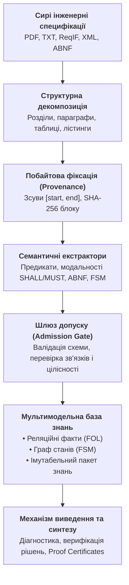
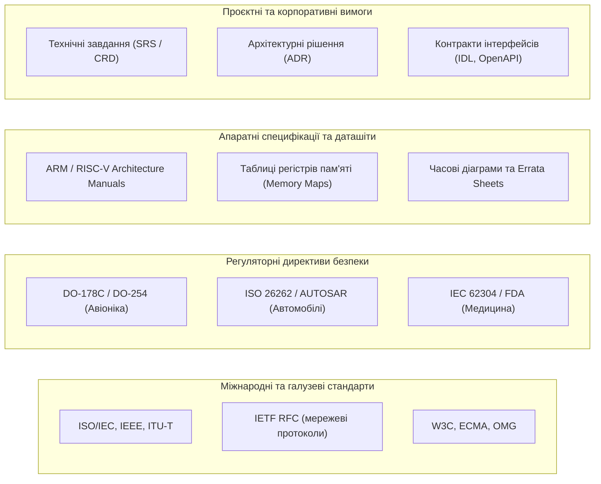
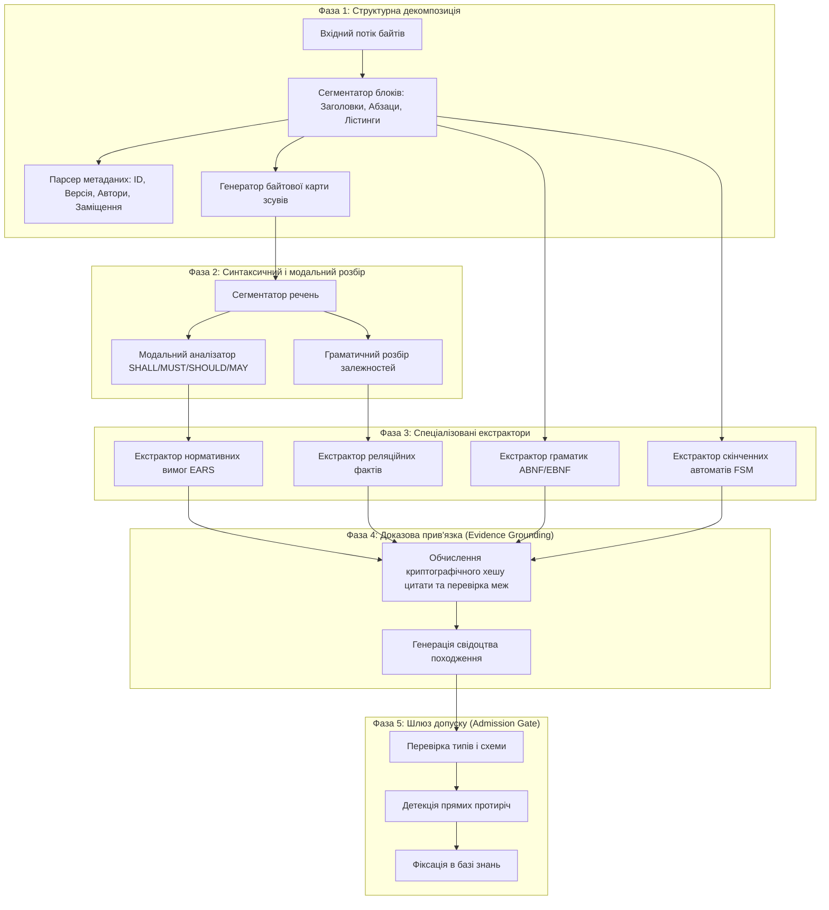
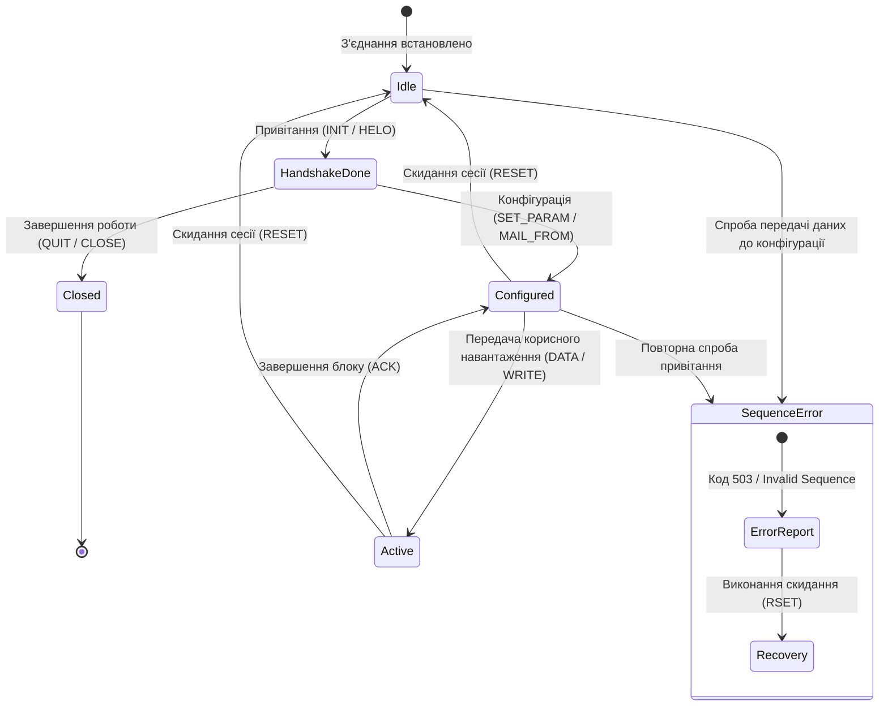
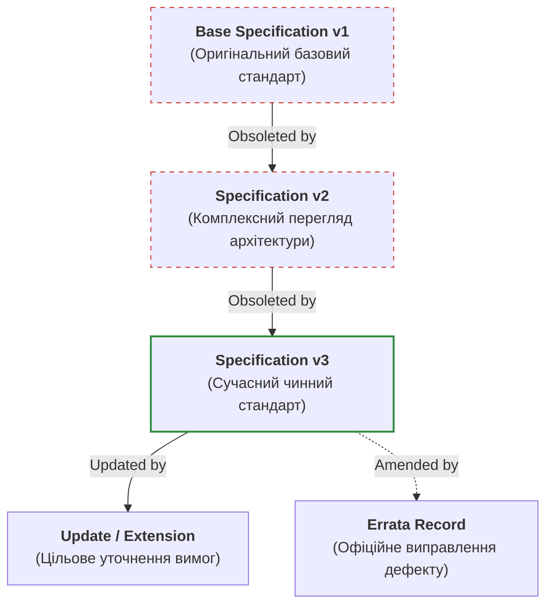
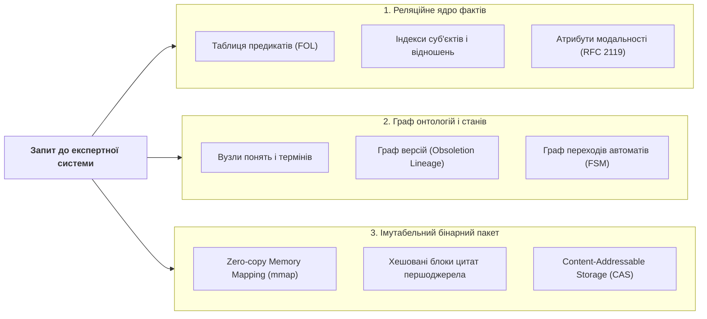
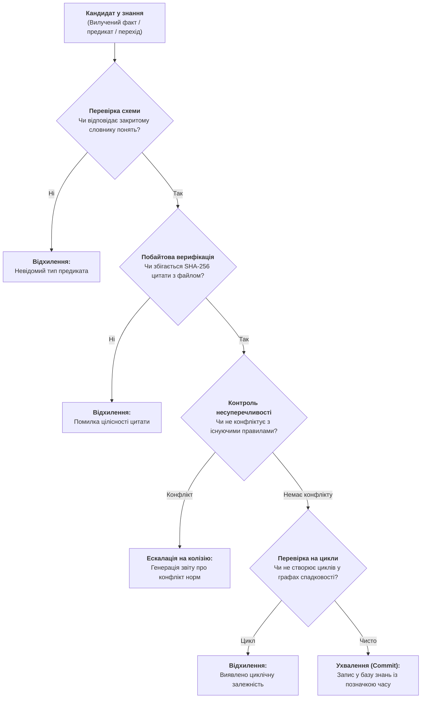
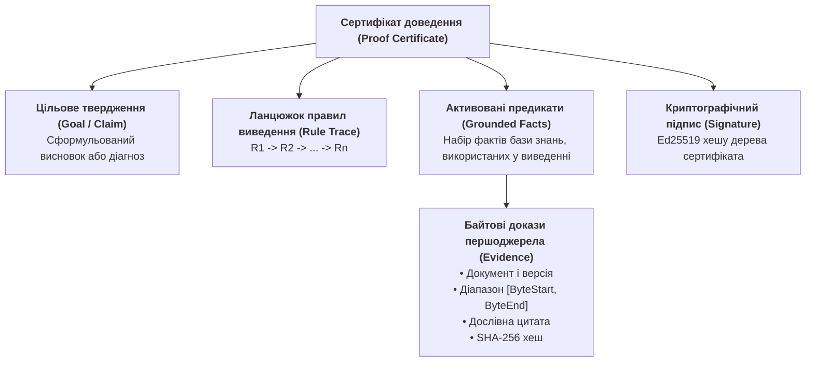

# Екстракція знань і побудова баз знань в експертних системах: від сирого тексту специфікацій до формальних онтологій та інваріантів

> **Серія:** [Експертні системи для R&D](README.md) · стаття 25 із 27  
> **Попередня стаття:** [24 — Детекція вимог у стандартах і специфікаціях: як витягти нормативні предикати (SHALL/MUST) та побудувати інваріанти](24-requirements-detection-and-formalization-UA.md)  
> **Наступна стаття:** 26 — Інженерний граф знань: інтеграція вимог, коду, тестів та апаратури в єдиний простір трасування (готується до публікації)  
> **Зміст серії:** [README](README.md)  
> **Рівень:** системні архітектори, інженери знань, розробники експертних систем та аналітики складних систем: середній / просунутий  
> **Після статті:** проєктувати наскрізні конвеєри екстракції фактів, предикатів, правил і скінченних автоматів із неструктурованих інженерних корпусів; будувати детерміновані бази знань із доказовою прив'язкою до байтів першоджерела (Evidence Grounding); організовувати комбіновані моделі зберігання (реляційні предикати, графові зв'язки, імутабельні бінарні пакети без копіювання в пам'яті); верифікувати несуперечливість знань і формувати машинно-перевірювані сертифікати доведення (Proof Certificates).

В інженерних дослідженнях і розробках складних промислових систем — в авіоніці, автомобільній електроніці, телекомунікаціях чи проектуванні мікропроцесорів — ключовим активом організації є не просто вихідний код чи схемотехніка, а знання, зафіксовані в нормативних документах. Коли інженер розробляє мережевий контролер, захищену операційну систему реального часу або модуль керування приводом, він зобов'язаний дотримуватися сотень взаємопов'язаних специфікацій, стандартів і регламентів.

Проте сучасні інженерні корпуси страждають від трьох хронічних проблем:

1. **Фрагментарність і гігантський обсяг:** десятки тисяч сторінок тексту, схем і таблиць, розподілених між міжнародними стандартами, галузевими директивами, технічними умовами замовника та апаратними описами мікросхем (*datasheets*).
2. **Несумісність форматів і синтаксису:** від структурованих машинозчитуваних схем до сканованих PDF-документів із розмитим форматуванням та неформальними текстовими примітками.
3. **Еволюція та взаємні заміщення:** стандарти регулярно оновлюються, анулюють попередні версії (*obsoletion*), вводять виправлення помилок (*errata*) та специфікують розширення (*extensions*), створюючи багаторівневий лабіринт залежностей.

Спроби вирішити цю проблему за допомогою популярного сьогодні тандему «векторний пошук + велика мовна модель» (*RAG + LLM*) у промисловому інжинірингу зазнають передбачуваного фіаско. Векторний пошук повертає схожі за семантикою фрагменти, але не розуміє суворої логіки відношень: чи замінює стандарт $B$ окремий параграф стандарту $A$, чи вимагає команда $X$ обов'язкового попереднього виконання команди $Y$, і які саме байти першоджерела юридично закріплюють цю вимогу. Генеративна модель може згенерувати переконливий текст, але вона схильна до стохастичних галюцинацій і неспроможна надати математичне доведення того, що її відповідь або синтезоване рішення є детерміновано істинними.

Справжня експертна система працює інакше. Вона розглядає корпус технічної документації не як статичну бібліотеку для читання людиною, а як **нескомпільований вихідний код знання**. Завдання системи — автоматично виконати синтаксичний і семантичний аналіз, витягти атомарні факти, предикати, граматичні контракти й скінченні автомати поведінки, верифікувати їхню цілісність і скомпілювати у формальну базу знань (*Knowledge Base, KB*), придатну для символьного логічного виведення (*Automated Reasoning*) та синтезу рішень.

У цій статті ми розглянемо повний інженерний цикл: від сирого тексту гетерогенних специфікацій до структурованої, побайтово верифікованої бази знань експертної системи.



---

## Таксономія джерел інженерних знань: гетерогенність і семантичні шари

Перед проектуванням екстрактора необхідно розібратися, з якими саме типами артефактів працює експертна система у науково-дослідних та дослідно-конструкторських розробках (*R&D*). Універсального формату інженерного знання не існує: знання зафіксоване в документах різного рівня формалізації, суворості й цільового призначення.



### 1. Міжнародні та галузеві стандарти

Стандарти формулюють універсальні правила взаємодії компонентів, протоколів і систем. Приклади:

- **Стандарти комп'ютерних мереж та інтерфейсів:** наприклад, специфікації *IETF RFC*, які описують роботу протоколів прикладного, транспортного та мережевого рівнів (*HTTP*, *SMTP*, *BGP*, *TLS*). RFC є класичним прикладом текстової специфікації, де поряд із природною мовою обов'язково використовуються формальні граматики **ABNF** (*Augmented Backus-Naur Form*, RFC 5234) для опису синтаксису пакетів і команд.
- **Міжнародні стандарти загального призначення:** *ISO/IEC* (наприклад, стандарти на мови програмування C/C++, формати даних, криптографічні алгоритми) та *IEEE* (наприклад, специфікації локальних мереж *IEEE 802.3 Ethernet* або *IEEE 802.11 Wi-Fi*).

### 2. Регуляторні директиви функціональної безпеки

У критичних доменах стандарт визначає не лише синтаксис інтерфейсу, а й суворий життєвий цикл розробки та верифікації:

- **Авіабудування:** *DO-178C* (програмне забезпечення) та *DO-254* (складна електронна апаратура). Тут кожна нормативна вимога має бути простежена до коду, тестів низького рівня та результатів структурного покриття (*MC/DC*).
- **Автомобільна галузь:** *ISO 26262* (функціональна безпека автомобілів) та стандарти консорціуму *AUTOSAR*, де детально специфіковані рівні цілісності безпеки (*ASIL A–D*) та поведінка базового програмного забезпечення (*BSW*).
- **Медичне обладнання:** *IEC 62304*, що регламентує процеси життєвого циклу ПЗ медичних виробів та класифікує програмні системи за потенційним ризиком для пацієнта.

### 3. Апаратні специфікації та технічні описи мікросхем

Апаратне знання істотно відрізняється від алгоритмічного. Воно зосереджене в описах архітектури процесорів (*Reference Manuals* для архітектур *x86-64*, *ARM*, *RISC-V*), даташітах контролерів і документах опису відомих апаратних помилок (*Errata Sheets*).

Знання тут подано у вигляді:

- Карт розподілу пам'яті (*Memory Maps*), бітових масок і режимів доступу до регістрів (*Read/Write/Clear-on-read*).
- Часових діаграм і граничних параметрів електричних сигналів (частоти тактування, затримки перемикання шин, температурні коефіцієнти).
- Апаратних обмежень та обхідних шляхів (*workarounds*) для невиправних дефектів кремнію.

### 4. Внутрішні проєктні вимоги та архітектурні рішення

Внутрішня документація підприємства (*Customer Requirements*, *Software Requirements Specification*, *Architecture Decision Records*) фіксує конкретні бізнес-правила, обрані патерни проєктування та межі системи. Вона має найвищу динаміку змін, але обов'язково повинна узгоджуватися з вищими за ієрархією галузевими стандартами.

---

## Архітектура конвеєра екстракції знань

Екстракція знань із технічного тексту — це не пошук ключових слів і не «підсумовування» тексту (*summarization*) нейромережею. Це багатостадійний детермінований процес, що перетворює сирий потік символів на типізовані предикати та графи поведінки.



### Фаза 1: Структурна декомпозиція та ідентифікація контексту

Технічний документ володіє суворою внутрішньою ієрархією. Змістове навантаження речення докорінно змінюється залежно від того, де саме воно розташоване: у нормативній частині стандарту, в інформаційному додатку (*Informative Annex*), у секції «Вступ і мотивація» чи в розділі «Зауваження щодо безпеки».

Конвеєр на першому етапі розпізнає структурний каркас:

1. **Ієрархія розділів:** деревовидна структура заголовків (наприклад, `Section 3.2.1`), що визначає локальний контекст дієвості вимог.
2. **Типізація текстових блоків:** відокремлення звичайного тексту від таблиць, кодових лістингів, формальних граматик і ASCII-діаграм.
3. **Метадані версійності:** фіксація глобальних атрибутів документа — унікального ідентифікатора (наприклад, `ISO/IEC 9899:2018`, `DO-178C`, `RFC 5321`), дати публікації, статусу чинності, а також зв'язків заміщення (*Obsoletes*, *Replaces*, *Amends*).

### Фаза 2: Побайтове закріплення першоджерела (Evidence Grounding)

Фундаментальний інженерний інваріант доказової експертної системи говорить: **жоден факт, предикат чи правило не можуть з'явитися в базі знань без прямого зв'язку з незмінним першоджерелом**.

Для забезпечення цього інваріанта під час екстракції формується кортеж доказової прив'язки:

```math
\mathcal{E} = \langle \mathrm{DocID}, \mathrm{ByteStart}, \mathrm{ByteEnd}, \mathrm{SectionPath}, H_{\mathrm{quote}} \rangle
```

де:

- $\mathrm{DocID}$ — незмінний ідентифікатор документа (наприклад, його криптографічний хеш або канонічна назва).
- $\mathrm{ByteStart}, \mathrm{ByteEnd}$ — точні цілочисельні індекси початкового та кінцевого байтів у сирому файлі першоджерела (0-індексація).
- $\mathrm{SectionPath}$ — канонічний шлях у дереві документа (наприклад, `3.5.1 -> Protocol State Machine`).
- $H_{\mathrm{quote}} = \mathrm{SHA256}(\mathrm{bytes}[\mathrm{ByteStart} : \mathrm{ByteEnd}])$ — контрольна сума вилученої текстової цитати.

Такий підхід повністю виключає феномен «фантомних знань». У будь-який момент часу компілятор, аудитор або кінцевий користувач може виконати операцію побайтового зчитування з вихідного файлу та звірити хеш. Якщо файл першоджерела було несанкціоновано модифіковано хоча б на один байт, контрольна сума $H_{\mathrm{quote}}$ стає недійсною, і факт негайно блокується механізмами верифікації.

### Фаза 3: Семантична екстракція компонентів

На цьому етапі працюють паралельні спеціалізовані аналізатори, націлені на вилучення різних типів знання.

#### 1. Екстракція реляційних фактів і параметрів

Технічні специфікації містять величезну кількість фіксованих параметрів: порти протоколів, розміри буферів, граничні значення тайм-аутів, бітові маски та діапазони температур.

Екстрактор реляційних фактів виявляє сутності та предикати зв'язку між ними, приводячи їх до атомарної структури:

```math
\mathrm{Fact} = \langle \mathrm{Subject}, \mathrm{Relation}, \mathrm{Value}, \mathrm{Unit}, \mathcal{E} \rangle
```

Наприклад, із тексту апаратного посібника процесора:

> «The Watchdog Timer prescaler register (WDT_PR) operates at a maximum clock frequency of 25 MHz and shall be configured before enabling the WDT core.»

екстрактор вилучає факт:

```math
\mathrm{Fact}(\mathrm{WDT\_PR}, \mathrm{max\_clock\_frequency}, 25, \mathrm{MHz}, \mathcal{E}_1)
```

#### 2. Екстракція модальних вимог та інваріантів

Речення, що містять нормативні модальні оператори (*SHALL*, *MUST*, *REQUIRED* — суворий обов'язок; *SHALL NOT*, *MUST NOT* — безумовна заборона; *SHOULD* — сильна рекомендація; *MAY* — дозвіл), нормалізуються за синтаксичними шаблонами **EARS** (*Easy Approach to Requirements Syntax*). Детальні правила класифікації таких вимог розглянуто в [статті 24](24-requirements-detection-and-formalization-UA.md).

#### 3. Екстракція формальних граматик

Багато стандартів (зокрема протоколи мережного обміну IETF, описи мов консорціуму W3C, промислові шини CAN/Modbus) містять формальні описи синтаксису у нотаціях ABNF або EBNF. Екстрактор виявляє блоки формальної нотації та компілює їх у синтаксичні дерева, перевіряючи коректність визначень правил:

```abnf
command-line   = command-name [ SP command-argument ] CRLF
command-name   = 4ALPHA
```

Скомпільована граматика перетворюється на валідатор синтаксису в складі бази знань, що дозволяє системі під час аналізу інженерних логів чи вихідного коду миттєво перевіряти коректність сформованих пакетів і повідомлень.

---

## Екстракція динаміки: моделювання скінченних автоматів (FSM)

Знання в інженерії — це не лише статичні параметри та обмеження. Більшість технічних систем мають **стан** (*State*), змінюють свою поведінку під дією зовнішніх подій (*Events / Inputs*) і переходять у нові стани (*Transitions*).

Протоколи зв'язку, драйвери периферії, алгоритми керування живленням і захисні інтерлоки завжди функціонують як дискретні автомати. Якщо експертна система не здатна вилучити автоматну логіку зі специфікації, вона не зможе виконати діагностику порушень послідовності дій і не зможе згенерувати коректний сценарій роботи.

### Математична модель скінченного автомата

Скінченний автомат поведінки системи формально визначається класичною п'ятіркою:

```math
\mathcal{M} = \langle S, \Sigma, \delta, s_0, F \rangle
```

де:

- $S = \{s_0, s_1, s_2, \dots, s_n\}$ — скінченна множина допустимих станів системи.
- $\Sigma = \{e_1, e_2, \dots, e_m\}$ — вхідний алфавіт подій або команд.
- $\delta: S \times \Sigma \to S \cup \{\bot\}$ — функція переходів, що ставить у відповідність поточному стану $s \in S$ і вхідній події $e \in \Sigma$ новий стан $s' \in S$ або повертає стан помилки $\bot$, якщо перехід заборонений.
- $s_0 \in S$ — початковий стан системи (наприклад, `IDLE` або `SESSION_OPENED`).
- $F \subseteq S$ — множина кінцевих або термінальних станів (наприклад, `CLOSED`).



### Як вилучається автоматна логіка з тексту

У реальних стандартах скінченні автомати описуються у двох формах:

1. **Явні таблиці переходів або діаграми:** таблиці з колонками «Поточний стан», «Команда», «Наступний стан», «Код відповіді». Вони вилучаються за допомогою табличних парсерів і транслюються у функцію $\delta$ безпосередньо.
2. **Описові текстові вимоги послідовності (*Sequence Rules*):** абзаци природномовного тексту, де зафіксовані попередні умови та обмеження порядку.

Типові лінгвістичні маркери автоматних залежностей:

- **Пререквізити (Prerequisites):** *«Command X MUST NOT be issued before Command Y has completed successfully»*, *«State S requires that Event E has occurred»*.
- **Прив'язка до стану (State-Binding):** *«When in State S, the device SHALL accept only commands A, B, or C»*, *«Any other command in this state MUST be rejected with error code K»*.
- **Переходи скидання (Reset Transitions):** *«Receipt of signal R causes immediate transition to State S_0 regardless of the current state»*.

Екстрактор автоматних правил розпізнає ці шаблони і будує спрямований граф переходів. Для кожного переходу обов'язково фіксуються:

- Допустимі наступні команди: $\mathrm{ValidNextCommands}(s) = \{e \in \Sigma \mid \delta(s, e) \neq \bot\}$.
- Заборонені команди та коди помилок: якщо система отримує $e \notin \mathrm{ValidNextCommands}(s)$, автомат переходить у стан помилки з формуванням діагностичного повідомлення (наприклад, помилка порушення послідовності `503 Bad sequence of commands` або `Protocol Sequence Violation`).
- Побайтова прив'язка $\mathcal{E}$ до конкретного пункту стандарту, де описано цей стан і заборону.

Маючи такий граф, експертна система отримує фундаментальну аналітичну можливість: вона може провести **статичний аналіз логу сесії** або вихідного коду клієнта/сервера і виявити будь-яку помилку послідовності команд задовго до того, як збій призведе до відмови системи під час експлуатації.

---

## Граф походження, версійності та заміщень (Obsoletion & Lineage)

Жоден стандарт або нормативний документ не існує у вакуумі. Інженерне знання розвивається ітеративно: нові версії замінюють старі, доповнюють функціонал або виправляють критичні вразливості та неточності.

Якщо експертна система збереже знання зі специфікації 2001 року і специфікації 2024 року в одну пласку таблицю без урахування лінійного походження (*Lineage*), база знань виявиться переповненою фатальними протиріччями: те, що було суворо заборонено в старій версії, може стати дозволеним у новій, і навпаки.



### Типологія зв'язків між версіями документів

У світових інженерних практиках склалася сувора система версійних відносин, яка формалізується в базі знань через орієнтований граф:

1. **Повне заміщення (Obsoletes / Supersedes):** документ $B$ повністю анулює документ $A$. Будь-яка вимога з $A$ вважається застарілою, якщо тільки вона явно не перевизначена в $B$.
2. **Часткове оновлення (Updates / Amends):** документ $B$ модифікує або уточнює окремі секції документа $A$, не скасовуючи $A$ загалом. Усі правила з $A$, які не були модифіковані в $B$, залишаються чинними.
3. **Офіційні виправлення помилок (Errata):** точкові правки, що усувають описки, друкарські помилки або небезпечні неоднозначності в опублікованому тексті.
4. **Оголошення застарілим (Deprecates):** функціонал чи команда оголошується небажаною для використання в нових розробках, але зберігається для забезпечення зворотної сумісності (*Backward Compatibility*).

### Обчислення чинності предикатів у часі

Для кожного вилученого факту база знань підтримує темпоральні межі достовірності. Коли користувач або інженерний агент запитує: *«Чи є обов'язковою підтримка параметра P?»*, експертна система не просто виконує запит за назвою параметра, а обчислює його **чинний статус** залежно від цільової версії стандарту:

```math
\mathrm{Status}(P, \mathrm{Version}) = \begin{cases}
\mathrm{Active}, & \text{якщо } \exists \mathrm{Doc} \in \mathrm{Lineage}(\mathrm{Version}) : \mathrm{Defines}(P, \mathrm{Doc}) \land \neg \mathrm{Obsoleted}(P, \mathrm{Version}) \\
\mathrm{Deprecated}, & \text{якщо } \exists \mathrm{Doc} \in \mathrm{Lineage}(\mathrm{Version}) : \mathrm{Deprecates}(P, \mathrm{Doc}) \\
\mathrm{Obsolete}, & \text{якщо } \exists \mathrm{Doc} \in \mathrm{Lineage}(\mathrm{Version}) : \mathrm{Revokes}(P, \mathrm{Doc})
\end{cases}
```

Така модель дозволяє експертній системі працювати в складних сценаріях сертифікації, коли один модуль системи зобов'язаний суворо відповідати застарілому базовому стандарту (наприклад, заради сумісності зі старим бортовим обладнанням літака чи супутника), а інший — найновішому доповненню.

---

## Організація сучасної бази знань: мультимодельна архітектура

Куди саме зберігати вилучені знання? Серед розробників часто виникає спокуса обрати один універсальний інструмент: або класичну реляційну базу даних (*PostgreSQL*), або графову базу (*Neo4j*), або сучасне векторне сховище (*Qdrant*, *Milvus*).

Проте практика показує: **жодна унімодельна база даних не здатна одночасно задовольнити всі вимоги промислової експертної системи**.

1. Реляційні таблиці ідеально підходять для структурованих фільтрів та індексації числових діапазонів, але вкрай неефективні для глибокого обходу графів залежностей довільної глибини.
2. Графові бази даних відмінно здійснюють пошук шляхів у графах спадковості та залежностей онтологій, проте повільні при масовому аналізі атомарних строкових предикатів.
3. Векторні бази даних корисні лише як допоміжний інструмент семантичного наближення для обробки нечітких запитів людини, але категорично непридатні як надійне ядро логічного виведення через неможливість гарантувати точність збігу.

Тому сучасна база знань для інженерних експертних систем будується як **триєдина мультимодельна архітектура**.



### 1. Реляційно-предикатне ядро (Детерміновані правила)

Зберігає нормалізовані предикати першого порядку:

- Таблиця нормативних вимог: `(req_id, source_doc, section, modality, subject, action, condition)`.
- Таблиця фактів: `(fact_id, subject, predicate, object_value, unit, byte_start, byte_end, quote_sha256)`.

Це ядро оптимізоване для миттєвих детермінованих вибірок: *«Знайти всі обов'язкові вимоги (SHALL) до компонента X за стандартом Y у розділі 4»*.

### 2. Граф онтологій, станів і трасування

Зберігає семантичну мережу понять та їхніх відношень:

- Онтологічні зв'язки: `is-a` (наслідування класів), `part-of` (структурна композиція підсистем), `depends-on` (функціональна залежність).
- Граф станів FSM: вузли — стани системи, ребра — допустимі команди з умовами переходу та згенерованими подіями.
- Граф документів: ребра `obsoletes`, `updates`, `extends`.

Завдяки графовому представленню експертна система здатна в один прохід обчислити транзитивне замикання залежностей: наприклад, знайти всі вимоги безпеки, які впливають на конкретний регістр мікроконтролера через ланцюжок від регуляторної норми *ISO 26262* через архітектурний регламент до конкретного драйвера.

### 3. Імутабельний бінарний пакет знань (Zero-Copy Memory Mapping)

Для високонавантажених R&D середовищ, систем моделювання та вбудованих інструментів критичною є швидкість доступу до знань. Звернення до віддаленої бази даних або парсинг текстових JSON-файлів під час кожного циклу виведення створює неприйнятні затримки.

Передовим інженерним рішенням є компіляція верифікованої бази знань у **імутабельний бінарний файл** (*Knowledge Artifact*), що завантажується в пам'ять процесу за технологією відображення пам'яті (`mmap`):

- Усі структури даних вирівняні по межах слів процесора (8 байтів).
- Рядки та ідентифікатори індексуються через зміщення в пулі констант без необхідності виділення динамічної пам'яті (*heap allocations*).
- Читання будь-якого факту, перевірка переходу автомата або звірка хешу цитати відбувається за константний час $\mathcal{O}(1)$ із нульовим копіюванням (*Zero-Copy*).

Більше того, бінарний пакет підписується криптографічним ключем розробника або організації, перетворюючись на незмінний сертифікований артефакт інженерного знання.

---

## Шлюз допуску фактів (Admission Gate) та верифікація цілісності

Одна з найнебезпечніших пасток побудови баз знань — це так зване «забруднення знань» (*Knowledge Poisoning*). Якщо екстрактор працює автоматично і записує кожен виявлений фрагмент у базу знань без жорсткого фільтра, база дуже швидко деградує: у ній з'являються циклічні визначення, суперечливі правила та непідтверджені гіпотези.

Для запобігання цьому явищу кожна порція нових знань проходить через **Шлюз допуску (Host Admission Gate)**.



### Критерії відбору фактів шлюзом допуску

1. **Закритий словник предикатів (Closed Vocabulary):** система не дозволяє свавільного створення нових типів відношень. Кожен предикат має бути строго визначений у метамоделі (наприклад, `valid_next_command`, `max_payload_size`, `requires_capability`).
2. **Повна валідація джерела:** байти цитати зчитуються безпосередньо з оригінального файлу першоджерела за наданими зміщеннями $[\mathrm{ByteStart} : \mathrm{ByteEnd}]$; обчислений хеш $\mathrm{SHA256}$ повинен біт-у-біт збігатися з переданим значенням $H_{\mathrm{quote}}$.
3. **Детекція прямих логічних протиріч:** перевірка, чи не стверджує новий факт $\mathrm{Fact}(A, R, V_1)$ протилежне до вже зафіксованого факту $\mathrm{Fact}(A, R, V_2)$ у межах тієї самої версії стандарту. У разі виявлення такого випадку система не просто відхиляє факт, а формує звіт про **внутрішній дефект специфікації** (*Specification Defect Report*).
4. **Ациклічність графів визначень:** перевірка відсутності замкнених циклів у визначеннях термінів, ієрархіях успадкування та графах обов'язкових пререквізитів команд ($A \implies B \implies C \implies A$).

---

## Верифікація бази знань і машинно-перевірювані сертифікати доведення (Proof Certificates)

Як довести зовнішньому аудитору, замовнику чи сертифікаційному органу (наприклад, авіаційному комітету *FAA* або автомобільному аудитору *TÜV*), що рішення або відповідь експертної системи є абсолютно коректними та спираються на чинні норми?

У традиційному підході з нейромережами це неможливо: можна надати лише текстове пояснення, яке само по собі може містити галюцинацію.

В інженерних експертних системах застосовується інший принцип: **синтез машинно-перевірюваних сертифікатів доведення (Proof Certificates)**.



### Структура сертифіката доведення

Сертифікат доведення — це автономний машинно-зчитуваний документ (зазвичай у форматі JSON або бінарному представленні), який містить вичерпну інформацію, необхідну для незалежної верифікації висновку:

1. **Цільове твердження ($\mathrm{Claim}$):** точне формулювання висновку (наприклад, *«Команда DATA в поточному стані призводить до помилки послідовності 503»* або *«Розмір буфера 4096 байтів є достатнім за вимогами стандарту X»*).
2. **Траса логічного виведення ($\mathrm{ProofTrace}$):** впорядкована послідовність застосування формальних правил модус поненс ($A, A \to B \vdash B$) або переходів скінченного автомата.
3. **Множина прив'язаних фактів ($\mathrm{Facts}$):** перелік усіх фактів із бази знань, що стали передумовами для кожного кроку виведення.
4. **Побайтові свідоцтва ($\mathrm{Evidences}$):** для кожного факту наводиться точна адресація у вихідному документі, повна текстова цитата та її хеш.
5. **Криптографічний підпис ($\mathrm{Signature}$):** цифровий підпис видавця сертифіката, що засвідчує незмінність результату експертизи.

### Автономна верифікація за константний час

Головна перевага наявності сертифіката доведення полягає в тому, що **верифікація сертифіката на порядки простіша і швидша, ніж його генерація**.

Для перевірки сертифіката не потрібні штучний інтелект, складні механізми планування чи доступ до повного корпусу документів:

```bash
# Автономний валідатор перевіряє сертифікат за частки секунди:
$ system-verifier verify-proof --certificate session_diag_proof.cert
[OK] Certificate signature valid (Ed25519)
[OK] Logical derivation tree verified: 4 inference steps
[OK] Byte evidence matches source documents:
     - RFC 5321 (bytes 45120-45280, SHA-256: 3a9f... matched)
     - RFC 5321 (bytes 51200-51340, SHA-256: c81b... matched)
[VERDICT] PROOF VALID: Claim is mathematically grounded.
```

Такий сертифікат може бути доданий до системи неперервної інтеграції (*CI/CD*), збережений у системі керування життєвим циклом виробу (*PLM*) або наданий державному регулятору як неспростовне свідчення відповідності виробу нормативним стандартам.

---

## Від знань до дій: синтез рішень на базі формалізованого знання

Коли база знань побудована, перевірена шлюзом допуску й містить повну структуру вимог, граматик і скінченних автоматів, експертна система перетворюється з пасивного довідника на **активний генератор інженерних рішень**.

Розглянемо три класи практичних інженерних завдань, які успішно вирішуються завдяки скомпільованій базі знань.

### 1. Автоматична діагностика складних відмов

Якщо у польових випробуваннях прототип пристрою чи мережевий сервіс повертає помилку, традиційний пошук причини (*Root Cause Analysis*) вимагає годин роботи висококваліфікованих інженерів, які вручну гортають специфікацію.

Маючи скінченний автомат у базі знань, експертна система:

- Зчитує дамп сесії або журнал обміну сигналами.
- Пропускає трасу подій через автомат станів $\mathcal{M}$.
- У точці збою миттєво локалізує порушення: наприклад, з'ясовує, що команда передачі даних надійшла у стані, де дозволені лише команди ініціалізації сесії.
- Формує висновок із точною вказівкою на пункт стандарту, кодом помилки та рекомендацією щодо коректної послідовності дій.

### 2. Синтез валідних сценаріїв взаємодії (Solution Synthesis)

При проєктуванні автоматизованих тестів або розробці клієнтських модулів постає завдання синтезу коректної сесії спілкування з цільовою системою.

Замість того, щоб програміст писав тестові послідовності вручну, експертна система використовує граф переходів автомата для розв'язання задачі досяжності цільового стану (*Reachability Problem*):

```math
s_0 \xrightarrow{e_1} s_1 \xrightarrow{e_2} s_2 \dots \xrightarrow{e_k} s_{\mathrm{target}}
```

Система знаходить найкоротший або найбільш стійкий шлях переходів, підставляє в нього синтаксично коректні значення параметрів, згенеровані з ABNF-граматик, і синтезує готовий виконуваний скрипт або сесію взаємодії.

### 3. Автоматична детекція колізій і регуляторний аудит

Коли виходить новий нормативний документ або оновлюються вимоги замовника, експертна система виконує порівняння графів знань старої та нової версій:

- Виявляє видалені вимоги.
- Локалізує нові обмеження та зміни модальності (наприклад, перехід рекомендації *SHOULD* у категорію суворого обов'язку *SHALL*).
- Автоматично сигналізує про всі модулі вихідного коду та компоненти системи, які потрапляють під удар цих змін.

---

## Порівняльний аналіз: Експертна система vs. Стохастичний підхід (LLM/RAG)

Для наочності зведемо ключові відмінності між структурованою базою знань експертної системи та популярним підходом на основі великих мовних моделей і векторного пошуку.

| Характеристика | Експертна система з верифікованою КБ | Наївний підхід (RAG + LLM) |
|---|---|---|
| **Природа результату** | Детерміноване логічне виведення | Ймовірнісна генерація наступного токена |
| **Прив'язка до джерела** | Побайтова точність `[start, end]` із SHA-256 цитати | Приблизний векторний чанк тексту |
| **Обробка станів і послідовностей** | Скінченні автомати (FSM), точна діагностика | Відсутність моделі стану, схильність до плутанини в кроках |
| **Синтаксичні обмеження** | Компіляція граматик ABNF/EBNF у валідатори | Генерація за зразком із можливими синтаксичними помилками |
| **Версійність і заміщення** | Граф походження (Lineage): Obsoletes, Updates | Змішування даних із різних версій у спільній векторній базі |
| **Верифікація результату** | Автономні сертифікати доведення (Proof Certificates) | Неможлива без повторного ручного аудиту людиною |
| **Швидкість повторного виведення** | Мікросекунди (Zero-Copy бінарний пакет у пам'яті) | Секунди (виклики нейромережних API або локальних GPU) |
| **Ціна помилки** | Нульова толерантність (Fail-Closed відмова за відсутності фактів) | Псевдопереконливі галюцинації (мовчазний збій) |

---

## Висновки та подальші кроки

Екстракція інженерних знань і побудова надійних баз знань — це фундаментальний вододіл між експериментальними прототипами штучного інтелекту та промисловими системами критичного призначення.

Головні уроки проєктування таких систем:

1. **Текст — це код:** до технічних специфікацій і стандартів слід ставитися як до коду високого рівня. Вони підлягають синтаксичному розбору, типізації, пошуку помилок компіляції та перевірці цілісності.
2. **Бездоказове знання не має цінності:** будь-який факт або правило в базі знань мають спиратися на криптографічно підтверджені байти першоджерела. Це унеможливлює галюцинації та гарантує юридичну силу висновків.
3. **Автомати станів обов'язкові:** статичний аналіз параметрів недостатній для інженерії. Експертна система повинна витягувати динаміку — допустимі послідовності дій, передумови та стани помилок.
4. **Мультимодельність перемагає:** поєднання швидких реляційних предикатів, графів онтологій і бінарних пакетів у пам'яті забезпечує як глибину логічного аналізу, так і роботу в реальному часі.

У наступних статтях серії цей фундамент буде розгорнуто у практичну площину інженерної інтеграції:

- У **статті 26** формалізовані знання та вимоги стануть основою **Інженерного графа знань (Engineering Knowledge Graph, EKG)**, який пов'яже нормативні предикати з репозиторіями вихідного коду, матрицями трасування та результатами автоматизованих апаратних тестів.
- У **статті 27** ми продемонструємо, як на основі цього графа синтезувати юридично значущі сертифікаційні звіти згідно з міжнародним стандартом **Goal Structuring Notation (GSN)**.

---

## Питання до читачів

- Як у вашій організації зберігаються та оновлюються знання про стандарти: у вигляді розрізнених файлів на спільних дисках чи в структурованих інструментах управління вимогами?
- Чи доводилося вам стикатися з ситуацією, коли програмна чи апаратна помилка була спричинена розбіжністю між різними версіями однієї і тієї самої специфікації (*Obsoletion conflict*)?
- Який підхід до формалізації автоматів станів (FSM) у вашому домені видається найбільш продуктивним: вилучення з таблиць, парсинг діаграм послідовностей чи аналіз текстових описів?
- Чи готові аудитори у вашій галузі приймати машинно-генеровані сертифікати доведення (Proof Certificates) замість багатосторінкових паперових звітів?

---

## Посилання на першоджерела, стандарти й документацію

- D. Crockford. [RFC 5234: Augmented BNF for Syntax Specifications: ABNF](https://www.rfc-editor.org/rfc/rfc5234), IETF, 2008.
- J. Klensin. [RFC 5321: Simple Mail Transfer Protocol](https://www.rfc-editor.org/rfc/rfc5321), IETF, 2008. (Показовий приклад комплексної специфікації із FSM, ABNF та правилами послідовностей).
- S. Bradner. [RFC 2119: Key words for use in RFCs to Indicate Requirement Levels](https://www.rfc-editor.org/rfc/rfc2119), IETF, 1997.
- ISO/IEC. [ISO/IEC Directives, Part 2: Principles and rules for the structure and drafting of ISO and IEC documents](https://www.iso.org/sites/directives/current/part2/index.xhtml), 2021.
- RTCA / EUROCAE. [DO-178C: Software Considerations in Airborne Systems and Equipment Certification](https://www.rtca.org/standards/), 2011.
- ISO. [ISO 26262-1:2018 — Road vehicles: Functional safety](https://www.iso.org/standard/68383.html), 2018.
- IEC. [IEC 62304:2006+AMD1:2015 — Medical device software: Software life cycle processes](https://webstore.iec.ch/publication/22794), 2015.
- Alistair Mavin, Philip Wilkinson, Adrian Harwood, Mark Novak. [Easy Approach to Requirements Syntax (EARS)](https://doi.org/10.1109/RE.2009.9), *17th IEEE International Requirements Engineering Conference*, 2009.
- John F. Sowa. [Knowledge Representation: Logical, Philosophical, and Computational Foundations](https://www.jfsowa.com/krbook/), Brooks/Cole, 2000.
- Stuart Russell, Peter Norvig. [Artificial Intelligence: A Modern Approach](https://aima.cs.berkeley.edu/), 4th Edition, Pearson, 2020. (Розділи про представлення знань, онтологічний інжиніринг та логічне виведення).
- Robin Milner. [A Theory of Type Polymorphism in Programming](https://doi.org/10.1016/0022-0000(78)90014-4), *Journal of Computer and System Sciences*, 1978. (Фундамент детермінованої типізації та доказових систем).
