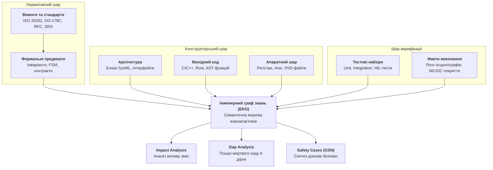
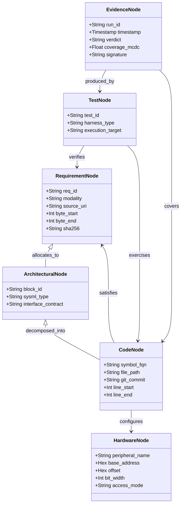
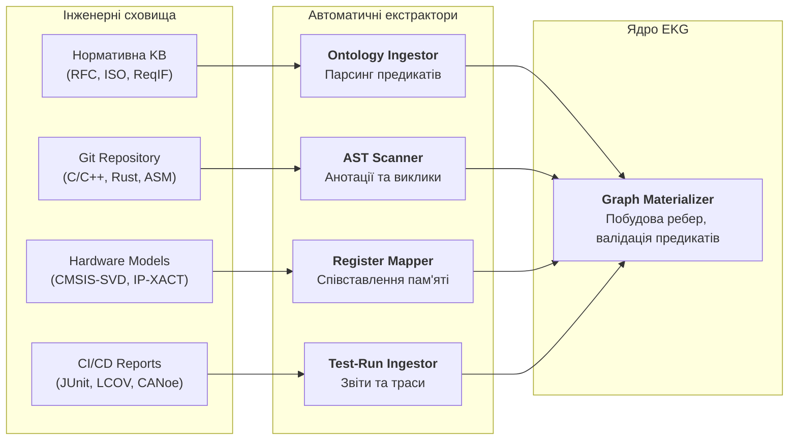
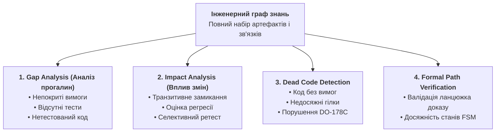
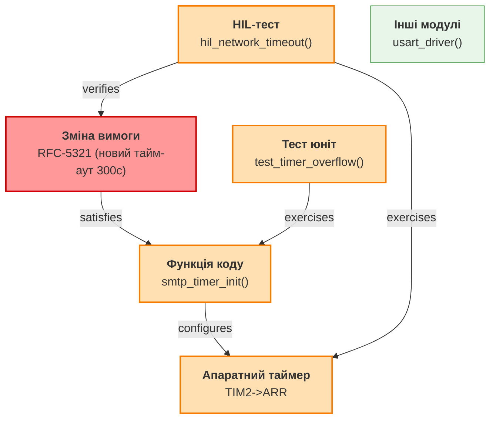
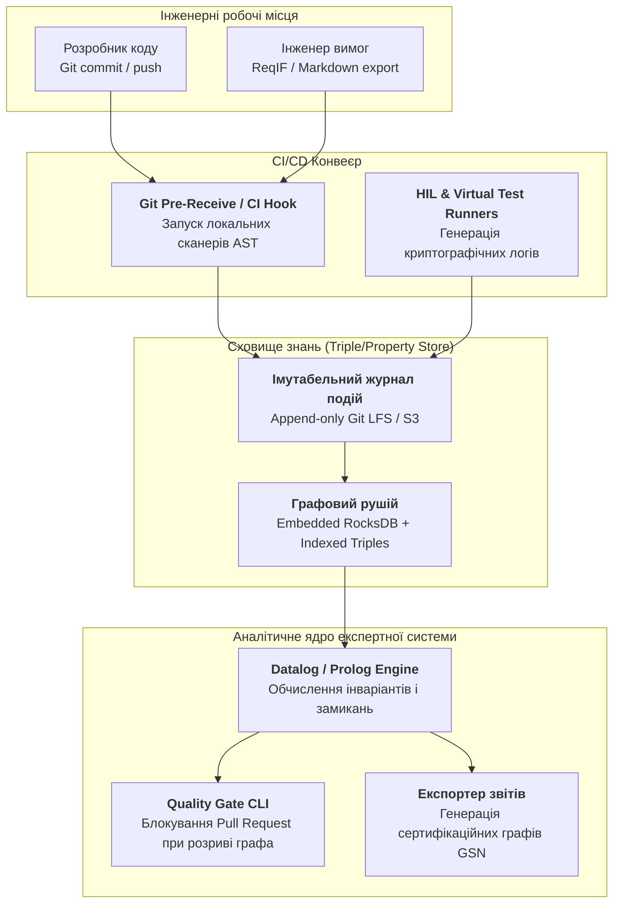

# Інженерний граф знань (EKG): інтеграція вимог, вихідного коду, тестів та апаратури в єдиний простір трасування

> **Серія:** [Експертні системи для R&D](README.md) · стаття 26 із 27  
> **Попередня стаття:** [25 — Екстракція знань і побудова баз знань в експертних системах: від сирого тексту специфікацій до формальних онтологій та інваріантів](25-knowledge-extraction-and-knowledge-base-construction-UA.md)  
> **Наступна стаття:** [27 — Синтез сертифікаційних доказів за Goal Structuring Notation (GSN): від інженерного графа до аудиторського висновку](27-safety-case-gsn-certification-synthesis-UA.md)  
> **Зміст серії:** [README](README.md)  
> **Рівень:** системні архітектори, провідні інженери з верифікації, розробники критичного ПЗ та апаратури: середній / просунутий  
> **Після статті:** проєктувати Інженерні графи знань (Engineering Knowledge Graph, EKG) для складних інженерних комплексів; будувати наскрізні ланцюжки двоспрямованого трасування (Bidirectional Traceability) між нормативними предикатами, AST вихідного коду, сценаріями HIL-тестування та апаратними регістрами; проводити автоматизований Impact- та Gap-аналіз при змінах специфікацій; виявляти прихований та мертвий код і розраховувати покриття вимог.

У сучасних науково-дослідних та дослідно-конструкторських розробках (*R&D*) створення складної системи — автономного транспортного засобу, авіаційного контролера, промислового робота чи захищеного мережевого шлюзу — вимагає узгодження тисяч взаємозалежних артефактів. У попередній статті ми розглянули, як розібрати сирий нормативний корпус (стандарти, специфікації, протоколи) і скомпілювати його у формальні предикати, правила та скінченні автомати (*FSM*).

Однак у реальній інженерній практиці формалізовані вимоги не існують у вакуумі. Вони втілюються у схемотехніці друкованих плат, функціях низькорівневого коду, конфігураціях регістрів мікроконтролерів і перевіряються сотнями модульних, інтеграційних та апаратно-програмних тестів (*Hardware-in-the-Loop, HIL*).

Тут виникає фундаментальний інженерний розрив: як довести, що кожна строчка коду відповідає конкретному пункту стандарту, кожен апаратний регістр налаштовано згідно з даташітом, а кожен тестовий стенд перевіряє саме той інваріант безпеки, заради якого його запускали?

Відповіддю експертних систем нового покоління є **Інженерний граф знань (Engineering Knowledge Graph, EKG)** — єдина багатовимірна семантична модель, яка перетворює фрагментовані репозиторії, файли вимог і логи випробувань на зв'язну систему фактів і відношень, придатну для символьного аналізу та детермінованого аудиту.



---

## Проблема розриву інженерного ланцюжка (The Traceability Gap)

У традиційній інженерії кожен підрозділ підприємства працює у власному ізольованому інформаційному просторі (*silos*):

1. **Системні інженери та аналітики** ведуть вимоги у спеціалізованих базах даних (*IBM DOORS*, *Jama Connect*, *PTC Windchill*) або у форматах обміну на зразок *ReqIF*.
2. **Системні архітектори** моделюють поведінку компонентів у діаграмах *SysML* або середовищах *Enterprise Architect*.
3. **Програмісти** пишуть код у *Git*-репозиторіях, розбиваючи завдання на тікети в трекерах завдань.
4. **Інженери з верифікації** створюють скрипти тестів (*Python*, *Robot Framework*, *Vector CANoe*), результати яких осідають у звітах *CI/CD*.
5. **Схемотехніки та розробники апаратури** оперують описами апаратних регістрів у форматах *CMSIS-SVD*, таблицях *Excel* чи документах *IP-XACT*.

Зв'язок між цими артефактами зазвичай забезпечується так званими **матрицями трасування (Traceability Matrices)**. У більшості проектів така матриця являє собою гігантську таблицю, куди інженери вручну копіюють ідентифікатори вимог, назви файлів коду та номери тестів.

### Чому ручне трасування приречене на провал

- **Застарівання в момент збереження:** щойно розробник змінив логіку в коміті або перейменував функцію, статична таблиця перестає відображати реальність.
- **Ілюзія покриття:** наявність запису `REQ-402 -> test_network_timeout()` у таблиці не гарантує, що тест справді верифікує граничні значення з пункту 402, а не просто завершується зі статусом `PASS` через закоментований асерт.
- **Неможливість зворотного аналізу:** якщо апаратний стенд реєструє несподіване переривання від таймера, з'ясувати ланцюжок від біта регістра до системної вимоги забирає тижні ручних консультацій між схемотехніками та програмістами.
- **Непомічена поява «мертвого» або непередбаченого коду (Unintended Functionality):** вихідний код містить фрагменти, які не обґрунтовані жодною вимогою. В авіоніці за стандартом *DO-178C* наявність такого коду є прямим блокуванням сертифікації рівня *DAL A*.

Експертна система усуває цей розрив, роблячи зв'язки між артефактами динамічними, строго типізованими та машинно-перевірюваними.

---

## Формальна модель Інженерного графа знань

Формально **Інженерний граф знань (EKG)** визначається як гетерогенний розмічений мультиграф із семантичними атрибутами та обмеженнями цілісності:

```math
\mathcal{G}_{\mathrm{EKG}} = (\mathcal{V}, \mathcal{E}, \tau_v, \tau_e, \mathcal{A}_v, \mathcal{A}_e, \mathcal{P})
```

де:

- $\mathcal{V}$ — множина вузлів (інженерних артефактів);
- $\mathcal{E} \subseteq \mathcal{V} \times \mathcal{V}$ — множина орієнтованих ребер (зв'язків між артефактами);
- $\tau_v: \mathcal{V} \to \mathcal{T}_V$ — функція типізації вузлів;
- $\tau_e: \mathcal{E} \to \mathcal{T}_E$ — функція типізації ребер;
- $\mathcal{A}_v, \mathcal{A}_e$ — атрибутні відображення, що закріплюють метадані (хеші, часові мітки, зсуви в тексті, результати вимірювань);
- $\mathcal{P}$ — множина детермінованих предикатів цілісності та правил логічного виведення.



### Типізація вузлів $\mathcal{T}_V$

1. **Нормативні вузли ($V_R \subset \mathcal{V}$):**
   - Розділи стандартів, нормативні предикати зі строгими модальностями (*SHALL*, *MUST*, *REQUIRED*), правила переходу скінченних автоматів (*FSM States & Transitions*).
   - Кожен нормативний вузол має незмінне криптографічне заземлення (*Evidence Grounding*): посилання на файл джерела, точні байтові межі `[byte_start, byte_end]` та хеш SHA-256 цитованого фрагмента.
2. **Архітектурні вузли ($V_A \subset \mathcal{V}$):**
   - Системні компоненти, підсистеми, канали зв'язку, шини даних, контракти інтерфейсів (*IDL, Protobuf, SysML Blocks*).
3. **Програмні вузли ($V_C \subset \mathcal{V}$):**
   - Вузли абстрактного синтаксичного дерева (*AST*): модулі, структури, класи, функції, методи, точки розгалуження (*Branching points*). Фіксуються разом із *Git Commit SHA* та діапазоном рядків.
4. **Апаратні вузли ($V_H \subset \mathcal{V}$):**
   - Периферійні контролери (*UART, SPI, CAN, Ethernet MAC*), базові адреси регістрів у просторі пам'яті (*Memory-Mapped I/O*), бітові маски полів регістрів, лінії переривань (*IRQ*), конфігурації пінів (*GPIO*).
5. **Тестові вузли ($V_T \subset \mathcal{V}$):**
   - Виконувані тестові кейси, сценарії імітації відмов (*Fault Injection*), специфікації HIL-тестів, моделі для фаззингу.
6. **Доказові вузли свідчень ($V_E \subset \mathcal{V}$):**
   - Конкретні прогони випробувань (*Test Executions*), звіти про структурне покриття коду (*Statement, Branch, MC/DC*), траси логічних аналізаторів, дампи шин CAN/Ethernet, підписані відкритими ключами стендів.

### Типізація ребер $\mathcal{T}_E$

Ребра в EKG визначають не довільні асоціації, а суворі інженерні відношення із заданою транзитивністю та семантикою:

| Тип ребра | Напрямок | Семантика | Вимоги стандартів |
|---|---|---|---|
| `allocates_to` | $V_R \to V_A$ | Вимога призначена архітектурному блоку | ISO 26262 Part 4, DO-178C |
| `satisfies` | $V_C \to V_R$ | Функція або модуль реалізує нормативну вимогу | DO-178C (Low-Level Req) |
| `configures` | $V_C \to V_H$ | Код ініціалізує або читає фізичний регістр | Описи BSP, CMSIS |
| `verifies` | $V_T \to V_R$ | Тест призначений для перевірки виконання вимоги | IEEE 1012, DO-178C |
| `exercises` | $V_T \to V_C$ | Тест викликає та навантажує зазначений блок коду | Аналіз покриття (MC/DC) |
| `mitigates` | $V_R \to V_{\mathrm{Hazard}}$ | Вимога є заходом захисту від ідентифікованої небезпеки | ARP4761, ISO 26262 Part 3 |
| `derived_from` | $V_R \to V_R$ | Низькорівнева вимога виведена з системної вимоги | Критерій походження вимог |
| `obsoletes` | $V_R \to V_R$ | Новий норматив замінює або анулює застарілий | Управління життєвим циклом |

---

## Автоматична екстракція та матеріалізація графа

Ключова вимога до промислового EKG — **автоматична генерація та синхронізація без участі людини**. Якщо створення вузла чи ребра вимагає ручного редагування бази даних або ведення супровідного файлу конфігурації, система гарантовано деградує за перших же масштабних змін у проекті.

Експертна система матеріалізує граф через конвеєр спеціалізованих інструментальних аналізаторів:



### 1. Зв'язування вихідного коду з вимогами через AST

Сучасні практики критичної розробки передбачають явну прив'язку безпосередньо у вихідному коді або через паралельні метадані:

- **Структуровані інженерні анотації в коді:**

  ```c
  /**
   * @brief Перевірка послідовності команд згідно зі станом сесії.
   * @satisfies REQ-PROTO-MAIL-042
   * @trace RFC-5321:Section-4.1.1.4[byte:18420-18890]
   * @fsm_state TRANSACTION_READY
   */
  protocol_status_t validate_command_sequence(session_context_t *ctx, command_t cmd) {
      if (ctx->state != STATE_TRANSACTION_READY) {
          return STATUS_ERR_BAD_SEQUENCE;
      }
      return STATUS_OK;
  }
  ```

- **AST-сканер** обходить дерево синтаксису компілятора (*Clang LibTooling*, *rustc HIR*, *tree-sitter*), витягує унікальний символ `validate_command_sequence`, фіксує його сигнатуру, розміщення у файлі та створює в графі ребро `satisfies` до вузла `REQ-PROTO-MAIL-042`.
- Якщо вказано зсув байтів першоджерела, сканер перевіряє за бастіонною базою знань (створеною у статті 25), чи збігається контрольна сума блоку цитати. Якщо стандарт було змінено або посилання веде на інший пункт — збірка зупиняється на стадії компіляції.

### 2. Співставлення коду з апаратними регістрами

Для усунення розриву між драйверами та фізичним кремнієм екстрактор завантажує машинний опис контролера (наприклад, файл *CMSIS-SVD*):

```xml
<peripheral>
  <name>USART1</name>
  <baseAddress>0x40013800</baseAddress>
  <registers>
    <register>
      <name>CR1</name>
      <description>Control register 1</description>
      <addressOffset>0x00</addressOffset>
      <fields>
        <field>
          <name>UE</name>
          <description>USART enable</description>
          <bitOffset>13</bitOffset>
          <bitWidth>1</bitWidth>
        </field>
      </fields>
    </register>
  </registers>
</peripheral>
```

Сканер коду низького рівня аналізує розіменування вказівників або використання макросів:

```c
#define USART1_BASE 0x40013800
#define USART1_CR1  (*(volatile uint32_t *)(USART1_BASE + 0x00))

void usart_enable(void) {
    USART1_CR1 |= (1 << 13); // Вмикання передавача
}
```

Через символьний аналіз розпізнається доступ за адресою `0x40013800 + 0x00` з маскою біта 13. Граф автоматично створює ребро `configures` від вузла функції `usart_enable` до апаратного вузла `HW_REG:USART1->CR1->UE`.

Якщо в оновленому даташіті контролера виробник змінив бітову маску або оголосив регістр зарезервованим (*Reserved/Deprecated*), експертна система негайно маркує вузол як конфліктний.

### 3. Зв'язування тестових асертів із нормативними інваріантами

Тестовий фреймворк не просто виконує код, а декларує цільову вимогу:

```python
@pytest.mark.verifies("REQ-PROTO-MAIL-042")
@pytest.mark.target_state("TRANSACTION_READY")
def test_reject_out_of_sequence_command(dut_client):
    """Перевірка повернення помилки 503 при порушенні порядку команд."""
    dut_client.reset_state()
    response = dut_client.send_raw("DATA\r\n")
    assert response.code == 503, f"Очікувався код 503, отримано {response.code}"
```

При запуску тестів у *CI/CD* аналізатор тестових звітів фіксує:

1. Тест `test_reject_out_of_sequence_command` пов'язаний ребро `verifies` із вимогою `REQ-PROTO-MAIL-042`.
2. Тест викликає функцію `validate_command_sequence` (ребро `exercises`), що підтверджується даними профілювання та трасування.
3. Створюється вузол свідчення $V_E$, який містить статус прогону, час виконання, версію тестового стенда та криптографічний хеш логу взаємодії.

---

## Алгоритми аналізу на Інженерному графі знань

Матеріалізований EKG відкриває можливості для складного автоматизованого аналізу, який принципово неможливо реалізувати на розрізнених таблицях чи за допомогою статистичних мовних моделей.



### 1. Аналіз прогалин (Gap Analysis) та розрахунок покриття вимог

Покриття вимог у критичних системах визначається значно суворіше, ніж класичне рядкове покриття коду (*Line Coverage*). Необхідно довести, що:

1. Кожна вимога $r \in V_R$ має щонайменше одну реалізацію в коді ($c \in V_C$).
2. Кожна вимога $r \in V_R$ має щонайменше один валідуючий тест ($t \in V_T$).
3. Кожен тест $t$ був успішно виконаний у поточному релізі із зафіксованим позитивним вердиктом ($e \in V_E, e.\mathrm{verdict} = \mathrm{PASS}$).

Множина непокритих вимог $\mathcal{U}_R$ обчислюється предикатом першого порядку над EKG:

```math
\mathcal{U}_R = \{ r \in V_R \mid \neg \exists \, t \in V_T : (t \xrightarrow{\mathrm{verifies}} r) \lor \neg \exists \, e \in V_E : (e \xrightarrow{\mathrm{produced\_by}} t \land e.\mathrm{verdict} = \mathrm{PASS}) \}
```

Якщо $|\mathcal{U}_R| > 0$, система формує детальний звіт прогалин із зазначенням конкретних пунктів стандарту, які залишилися без інженерного підтвердження.

### 2. Детекція непередбаченого та мертвого коду (Dead Code & Unintended Logic)

Відповідно до стандарту *DO-178C*, наявність коду, який не простежується до системних вимог (*untraceable code*), розглядається як потенційна загроза безпеці: це можуть бути забуті інженерні налагоджувальні заглушки, недокументовані функції або атакуючі вектори.

У графі EKG такий код виявляється тривіальним запитом на пошук ізольованих вузлів або компонентів зв'язності:

```math
\mathcal{C}_{\mathrm{unintended}} = \{ c \in V_C \mid \neg \exists \, r \in V_R : (c \xrightarrow{\mathrm{satisfies}} r) \}
```

Будь-яка функція або блок коду з множини $\mathcal{C}_{\mathrm{unintended}}$ автоматично маркується як дефект архітектури. Інженер зобов'язаний або сформулювати нову похідну вимогу (*Derived Requirement*), пройшовши процес оцінки ризиків (*Safety Assessment*), або видалити непідтверджений код.

### 3. Аналіз впливу змін (Change Impact Analysis)

Одна з найболючіших проблем R&D — оцінка наслідків змін. Що станеться, якщо міжнародний комітет випустить нову редакцію стандарту з виправленням тайм-аутів, або замовник змінить максимальну допустиму швидкість відповіді приводу?

У традиційному підході доводиться вручну перечитувати сотні документів або повторно запускати всю тестову сюїту, що на апаратних стендах може тривати тижнями.

На графі знань EKG вплив зміни вузла $v^* \in \mathcal{V}$ визначається через **транзитивне замикання залежностей**:

```math
\mathrm{Impact}(v^*) = \{ u \in \mathcal{V} \mid \exists \, \text{шлях } \pi = (v^*, e_1, w_1, \dots, e_k, u) \text{ в } \mathcal{G}_{\mathrm{EKG}} \}
```



Алгоритм виділяє підграф впливу:

1. Знаходить функцію `smtp_timer_init()`.
2. Знаходить апаратний регістр `TIM2->ARR`.
3. Локалізує саме ті два тести (`test_timer_overflow` та `hil_network_timeout`), які вимагають повторного виконання (*Selective Regression Testing*).
4. Залишає всі інші модулі системи поза зоною ризику, заощаджуючи сотні годин роботи випробувальних стендів.

---

## Практична архітектура промислової платформи EKG

Як реалізувати Інженерний граф знань на практиці? Побудова монолітної графової бази даних, що вимагає централізованого адміністрування, рідко приживається в розподілених інженерних командах.

Сучасна архітектура будується за принципом **розподіленого графа з федеративним зберіганням**:



### 1. Імутабельність та версійність фактів

Кожен вузол і кожне ребро графа зберігаються як незмінний факт (*fact triplet* або *quad*):

```math
\langle \mathrm{Subject}, \mathrm{Predicate}, \mathrm{Object}, \mathrm{Context} \rangle
```

Контекст обов'язково містить:

- Ідентифікатор коміту або ревізії документа.
- Автора та часову мітку.
- Криптографічний підпис інструмента, який здійснив екстракцію.

Це дозволяє відкочувати стан графа на будь-яку дату в минулому і миттєво відповідати на питання аудитора: *«Яким було покриття вимог стандарту станом на версію прошивки 2.4.1 рік тому?»*.

### 2. Інтеграція в Quality Gate

Експертна система вбудовується безпосередньо в конвеєр перевірки змін (*Pull Request Quality Gate*). Перед злиттям гілки в основний репозиторій запускається валідатор графа, який перевіряє три правила блокування:

1. **Правило збереження цілісності:** жодна нова функція не може бути додана без наявності ребра `satisfies` до схваленої вимоги.
2. **Правило перевірюваності:** зміна логіки функції автоматично анулює статус валідності ребра `verifies` пов'язаного тесту, вимагаючи його успішного перезапуску в поточному коміті.
3. **Правило відсутності регресії:** підграф впливу $\mathrm{Impact}(\Delta)$ не повинен містити неперевірених вузлів критичного рівня надійності (*ASIL D / DAL A*).

---

## Порівняння: Таблиці трасування проти Інженерного графа знань

| Критерій | Традиційні таблиці (Excel, Word, матриці DOORS) | Інженерний граф знань (EKG) |
|---|---|---|
| **Спосіб створення** | Ручне заповнення інженерами та копіювання ID | Автоматична екстракція з AST, SVD, тестів і KB |
| **Синхронізація з кодом** | Періодична (перед аудитом), постійно відстає | Постійна в режимі реального часу (на кожен commit) |
| **Семантична глибина** | Плоский бінарний зв'язок (є рядок / нема рядка) | Типізовані ребра, квантори логіки, стани FSM |
| **Impact Analysis** | Суб'єктивний експертний аналіз за пам'яттю | Точне математичне транзитивне замикання |
| **Детекція мертвого коду** | Практично неможлива без ручного аудиту | Миттєва через запити на ізольовані підграфи |
| **Апаратна інтеграція** | Відсутня (апаратура живе в окремих даташітах) | Повна (мапінг до бітів регістрів та переривань) |
| **Ціна підготовки до аудиту** | Сотні людино-годин на авральне зведення звітів | Нульова (автоматичний експорт актуального зрізу) |

---

## Висновки та перехід до статті 27

Інженерний граф знань (EKG) перетворює розрізнений хаос специфікацій, вихідного коду, мікросхем і стендових випробувань на єдину, живу інженерну структуру:

1. **Вимоги стають виконуваними сутностями:** вони не лежать мертвим вантажем у PDF-файлах, а безпосередньо керують валідацією коду на рівні синтаксичних дерев.
2. **Двоспрямоване трасування стає автоматичним:** від кожного біта апаратного регістра можна піднятися до пункту міжнародного стандарту, і від кожної вимоги безпеки спуститися до конкретного осцилографічного знімка HIL-стенда.
3. **Зміни перестають бути лотереєю:** алгоритми аналізу графа точно окреслюють підграф регресії, запобігаючи прихованим дефектам у критичних системах.

Проте наявність повного та зв'язного графа знань — це лише половина успіху. Коли настає час державної чи галузевої сертифікації, регуляторні органи вимагають структурованого, юридично бездоганного та прозорого доказу безпеки.

У наступній, заключній статті серії — **статті 27** — ми розглянемо:

- Як трансформувати складний багатовимірний EKG у нормативно визнане дерево доказів за стандартом **Goal Structuring Notation (GSN)**.
- Як формувати повністю автономні, криптографічно верифіковані сертифікаційні звіти (*Proof Certificates*), які аудитор може перевірити за секунди без доступу до закритого вихідного коду.

---

## Питання до читачів

- Як у ваших поточних проектах організовано трасування між змінами в коді та вимогами: через ручні таблиці, тікети Jira чи автоматизовані плагіни?
- Чи траплялися у вашій практиці випадки, коли непередбачений або забутий у прошивці налагоджувальний код призводив до вразливостей або збоїв в експлуатації?
- Наскільки глибоко ваші процеси тестування інтегровані з описом апаратури: чи верифікуються конфігурації регістрів мікроконтролерів автоматично за даташітами?
- Які перешкоди ви бачите для впровадження обов'язкового блокування злиття коду (*Quality Gate*) за критерієм непокритого графа вимог?

---

## Посилання на першоджерела, стандарти й документацію

- RTCA / EUROCAE. [DO-178C: Software Considerations in Airborne Systems and Equipment Certification](https://www.rtca.org/standards/), 2011. (Розділи про двоспрямоване трасування та непередбачений код).
- ISO. [ISO 26262-4:2018 — Road vehicles: Functional safety — Part 4: Product development at the system level](https://www.iso.org/standard/68386.html), 2018.
- IEEE. [IEEE 1012-2016: IEEE Standard for System, Software, and Hardware Verification and Validation](https://standards.ieee.org/ieee/1012/5756/), 2017.
- Arm. [CMSIS-SVD: Cortex Microcontroller Software Interface Standard — System View Description](https://arm-software.github.io/CMSIS_5/SVD/html/index.html), 2021.
- Object Management Group (OMG). [Requirements Interchange Format (ReqIF) Specification, Version 1.2](https://www.omg.org/spec/ReqIF/), 2013.
- J. F. Sowa. [Principles of Semantic Networks: Explorations in the Representation of Knowledge](https://dl.acm.org/doi/book/10.5555/532349), Morgan Kaufmann, 1991.
- G. Antoniou, F. van Harmelen. [A Semantic Web Primer](https://mitpress.mit.edu/9780262017282/a-semantic-web-primer/), 3rd Edition, MIT Press, 2012.
- J. L. Kelly. [Automated Software Traceability: Trends, Challenges, and Open Questions](https://doi.org/10.1145/2593882.2593892), *ACM Computing Surveys*, 2014.
