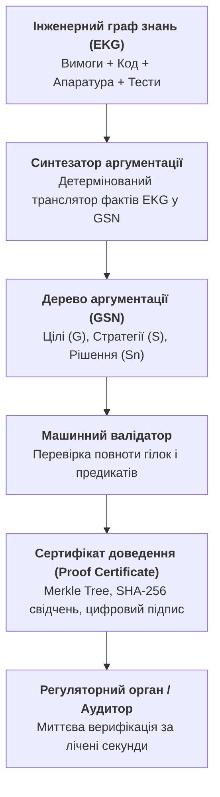
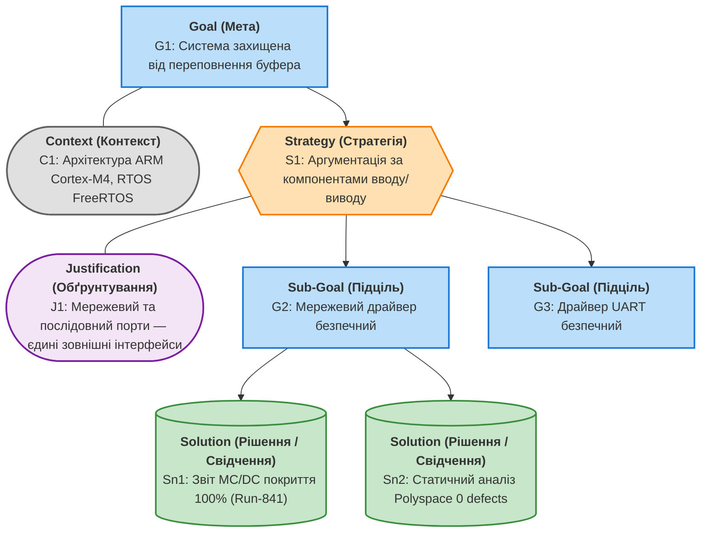
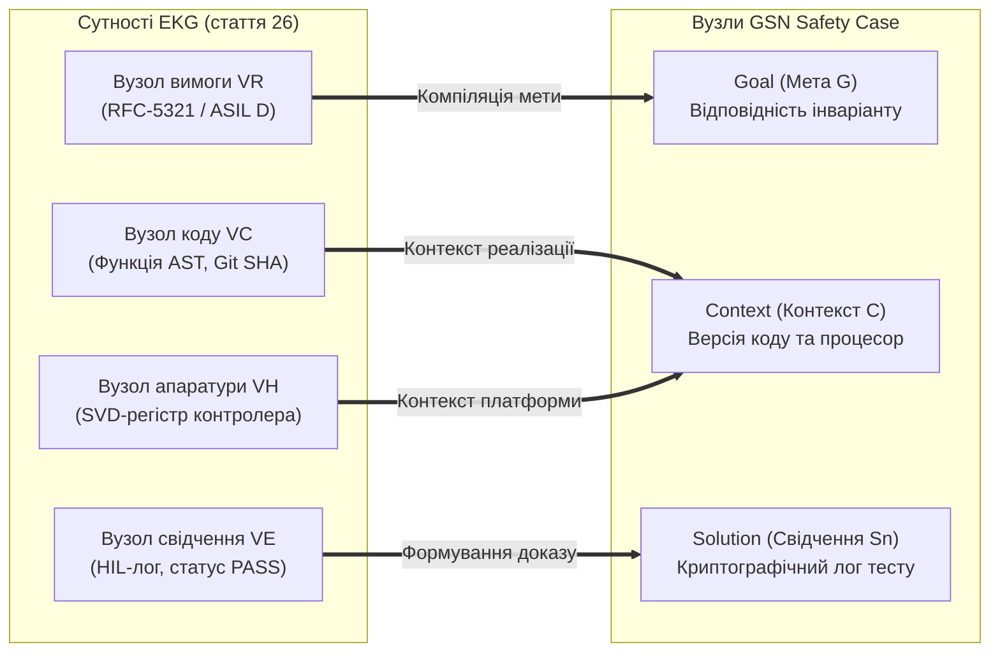
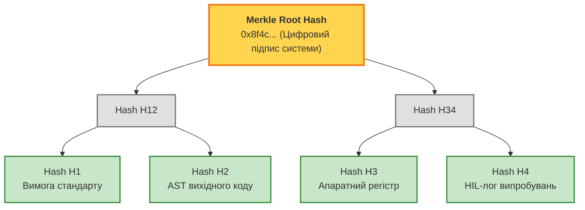
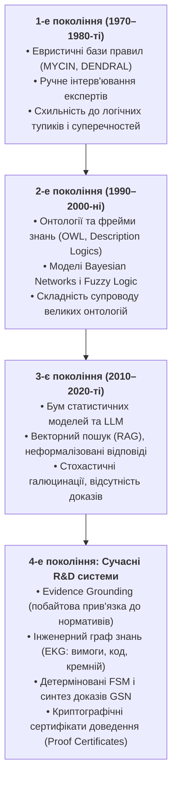

# Синтез сертифікаційних доказів за Goal Structuring Notation (GSN): від інженерного графа до аудиторського висновку

> **Серія:** [Експертні системи для R&D](README.md) · стаття 27 із 27  
> **Попередня стаття:** [26 — Інженерний граф знань (EKG): інтеграція вимог, вихідного коду, тестів та апаратури в єдиний простір трасування](26-engineering-knowledge-graph-traceability-UA.md)  
> **Наступна стаття:** Заключна стаття серії  
> **Зміст серії:** [README](README.md)  
> **Рівень:** системні архітектори, керівники R&D, провідні аудитори з функціональної безпеки, розробники критичних систем: середній / просунутий  
> **Після статті:** формалізувати докази безпеки складних комплексів за стандартом Goal Structuring Notation (GSN); автоматично трансформувати факти Інженерного графа знань (EKG) у строгі ієрархії аргументації (Safety Cases); будувати машинно-перевірювані сертифікати доведення (Proof Certificates) із криптографічним хешуванням Merkle Tree; організовувати автономний аудит відповідності стандартам (ISO 26262, DO-178C, IEC 62304) без передачі чутливого вихідного коду.

У розробці високоризикових інженерних систем — авіоніки, автономного транспорту, ядерної автоматики та медичних апаратів — створення бездоганно працюючого пристрою є лише половиною завдання. Друга, часто значно складніша й дорожча половина — це **сертифікація**: необхідність переконати незалежного регулятора (FAA, EASA, TÜV чи FDA) у тому, що система гарантовано безпечна, відповідає всім обов'язковим стандартам і не вийде з ладу за критичних умов експлуатації.

У попередніх статтях ми пройшли шлях від побайтової екстракції нормативних знань і автоматів станів (стаття 25) до матеріалізації наскрізного Інженерного графа знань (EKG, стаття 26), який зв'язав пункти стандартів із синтаксичними деревами коду, регістрами мікросхем і стендовими логами.

Але як перетворити гігантський мультиграф із мільйонами технічних фактів на зрозумілий, структурований і юридично значущий аргумент безпеки?

Індустріальним стандартом де-факто для вирішення цього завдання є **Goal Structuring Notation (GSN)** — графічна мова формалізації аргументації безпеки (*Safety Cases*). У цій завершальній статті серії ми продемонструємо, як експертна система автоматично компілює сертифікаційне дерево GSN безпосередньо з інженерного графа знань та генерує криптографічні сертифікати доведення (*Proof Certificates*), виводячи регуляторний аудит на рівень математичної перевірки.



---

## Криза сертифікації у XXI столітті: чому «папір» убиває надійність

Історично склалося так, що проходження сертифікації полягало у створенні колосального обсягу паперових звітів або PDF-документів. Для сучасного літака чи автомобіля обсяг сертифікаційного пакету вимірюється десятками тисяч сторінок.

Цей підхід породив гостру інженерну кризу:

1. **Відрив документації від реальності:** через високу швидкість розробки ПЗ звіти з безпеки часто пишуться постфактум спеціальними консультантами. Текст у звіті може стверджувати, що система використовує дубльований таймер, тоді як у коді останньої версії таймер давно переписано на один спільний канал.
2. **Паперова безпека (Compliance vs. Safety):** виконання всіх формальних пунктів регламенту не гарантує відсутності катастрофічних системних помилок (що наочно продемонстрували катастрофи Boeing 737 MAX через систему MCAS або численні інциденти з системами допомоги водієві).
3. **Неможливість ручного аудиту:** жодна група аудиторів неспроможна вичитати 50 000 сторінок технічного тексту та вручну співставити їх із мільйонами рядків коду й гігабайтами логів апаратних випробувань.
4. **Проблема інтелектуальної власності:** виробники неохоче передають повний вихідний код і схемотехніку стороннім аудиторам або державним комісіям, побоюючись витоку комерційної таємниці.

Експертна система нового покоління долає ці протиріччя. Замість суб'єктивного людського читання вона пропонує **машинно-генеровану та машинно-перевірювану аргументацію**, де кожен висновок базується на обчислюваних інженерних фактах.

---

## Стандарт Goal Structuring Notation (GSN)

**Goal Structuring Notation (GSN)** — це стандартизована нотація (розроблена в Університеті Йорка та підтримувана *Assurance Case Working Group*), яка дозволяє наочно показати, як висококласна мета безпеки декомпозується на підцілі за допомогою чітко визначених стратегій аргументації, спираючись на конкретні свідчення (*Evidence*).



### Анатомія компонентів GSN

1. **Goal (Мета, $G$):** Стверджувальне висловлювання про безпеку, надійність чи відповідність стандарту, яке потребує доведення (наприклад: *«G1: Модуль керування заслінкою відповідає рівню надійності ASIL C за стандартом ISO 26262»*).
2. **Strategy (Стратегія, $S$):** Підхід або логіка, за якою мета розбивається на простіші підцілі (наприклад: *«S1: Декомпозиція за станами FSM відповідно до розділу 4.2 стандарту»*).
3. **Context (Контекст, $C$):** Опис меж застосування, версій апаратури, робочого середовища чи конфігураційних параметрів, за яких аргумент є чинним.
4. **Assumption (Припущення, $A$):** Неперевірювані припущення щодо надійності зовнішнього середовища (наприклад: *«Апаратний модуль живлення забезпечує стабільну напругу без стрибків вище 3.3В»*).
5. **Justification (Обґрунтування, $J$):** Пояснення, чому саме ця стратегія аргументації або ця декомпозиція вважається достатньою і прийнятною для аудитора.
6. **Solution / Evidence (Рішення або Свідчення, $Sn$):** Кінцевий лист дерева аргументації — пряме посилання на перевірені інженерні свідчення: звіт випробувань, лог осцилографа, протокол статичного аналізу чи сертифікат компілятора.

---

## Автоматичний синтез дерева GSN з Інженерного графа знань

У класичному процесі створення діаграм GSN займає місяці роботи аналітиків у графічних редакторах. Експертна система виконує це завдання шляхом **детермінованого транзитивного обходу Інженерного графа знань (EKG)**.



### Алгоритм компіляції аргументації

1. **Визначення кореневої мети ($G_{\mathrm{root}}$):**
   Формулюється глобальне твердження сертифікації:

```math
G_{\mathrm{root}} = \text{Система } \mathcal{S} \text{ у конфігурації } \mathcal{K} \text{ відповідає всім обов'язковим вимогам стандарту } \mathrm{STD}
```

2. **Стратегія декомпозиції вимог ($S_{\mathrm{req}}$):**
   Експертна система робить запит до EKG:

```math
\mathcal{R}_{\mathrm{mandatory}} = \{ r \in V_R \mid r.\mathrm{modality} \in \{\mathrm{SHALL}, \mathrm{MUST}\} \}
```

Створюється стратегія: *«Декомпозиція за множиною обов'язкових нормативних інваріантів»*.


3. **Генерація підцілей для кожної вимоги ($G_{r}$):**
   Для кожної вимоги $r \in \mathcal{R}_{\mathrm{mandatory}}$ створюється підціль:

   ```text
   G_r: «Вимога r (цитата [start, end], SHA-256) реалізована коректно та верифікована».
   ```

4. **Додавання контекстів ($C_{r}$):**
   Через ребра `satisfies` та `configures` у графі EKG знаходяться пов'язані функції коду $c \in V_C$ та регістри $h \in V_H$. Вони додаються як контекстні вузли із зазначенням точних Git-хешів та фізичних адрес пам'яті.

5. **Матеріалізація рішень ($Sn_{r}$):**
   Через ребра `verifies` та `produced_by` система локалізує доказові вузли $V_E$:

   - Звіт тесту на відповідність автомату станів (FSM).
   - Звіт про мутаційне тестування або структурне покриття MC/DC.
   - Осцилографічна траса шини CAN/Ethernet реального апаратного стенда.

   Кожен знайдений факт $e \in V_E$ перетворюється на вузол `Solution (Sn)`.

---

## Машинно-перевірювані сертифікати доведення (Proof Certificates)

Як передати результат аудитору так, щоб він міг перевірити його за секунди, не вірячи нікому на слово і не вимагаючи передачі комерційного вихідного коду?

Для цього експертна система синтезує **криптографічний сертифікат доведення (Proof Certificate)** на базі дерева Меркла (*Merkle Tree*):



### Формат сертифіката `.proof`

Сертифікат зберігається у канонічному, детермінованому форматі JSON або CBOR:

```json
{
  "schema_version": "2.0.0",
  "certificate_id": "CERT-2026-AVIONICS-0842",
  "system_claim": {
    "standard": "DO-178C",
    "target_dal": "DAL_A",
    "claim": "All low-level requirements verified with 100% MC/DC coverage"
  },
  "merkle_root": "8f4c3b7a1e0d9a6c2f5b8e7d4a1c0b3e5f7a9d2c4e6b8a0d2f4e6a8b0c2d4e6f",
  "gsn_tree": {
    "goal_id": "G_TOP",
    "status": "PROVEN",
    "children": [
      {
        "goal_id": "G_REQ_42",
        "requirement_provenance": {
          "uri": "standards/rfc-5321.txt",
          "byte_start": 18420,
          "byte_end": 18890,
          "quote_sha256": "4a1c0b3e5f7a9d2c4e6b8a0d2f4e6a8b0c2d4e6f8f4c3b7a1e0d9a6c2f5b8e7d"
        },
        "solution_evidence": {
          "test_id": "hil_sequence_validation_test",
          "verdict": "PASS",
          "execution_hash": "2f4e6a8b0c2d4e6f8f4c3b7a1e0d9a6c2f5b8e7d4a1c0b3e5f7a9d2c4e6b8a0d",
          "testbed_id": "HIL-RIG-ALPHA-04",
          "timestamp": "2026-09-21T07:15:32Z"
        }
      }
    ]
  },
  "signature": {
    "algorithm": "Ed25519",
    "public_key": "MCowBQYDK2VwAyEA9...",
    "signature_bytes": "3b7a1e0d..."
  }
}
```

### Переваги такого сертифіката

1. **Автономність (Zero-Knowledge Audit):** аудитору достатньо перевірити математичну коректність Merkle-гілок і цифровий підпис. Для підтвердження того, що функція пройшла верифікацію, аудитору не потрібно читати приватний код — достатньо перевірити хеш коміту та підтверджене ребро зв'язку.
2. **Неможливість підробки:** зміна хоча б одного байта в описі вимоги чи лозі тесту повністю руйнує дерево Меркла та робить цифровий підпис недійсним.
3. **Миттєва валідація:** перевірка сертифіката займає соті частки секунди за допомогою легковагової утиліти командного рядка:

   ```bash
   cert-verifier --certificate CERT-2026-AVIONICS-0842.proof --pubkey safety-board.pub
   # [OK] All 412 GSN goals verified. Merkle root valid. Signature confirmed.
   ```

---

## Формальна валідація дерева аргументації

Щоб дерево доказів GSN мало юридичну та інженерну силу, воно повинно задовольняти математичним предикатам повноти:

```math
\mathrm{Valid}_{\mathrm{GSN}}(\mathcal{T}) \iff \bigwedge_{i=1}^{4} \mathcal{P}_i(\mathcal{T})
```

де чотири правила істинності визначаються так:

**1. Правило повноти розкриття (No Undeveloped Goals):**
Будь-яка мета $g \in \mathrm{Goals}(\mathcal{T})$ повинна або декомпозуватися через стратегію $s \in \mathrm{Strategies}(\mathcal{T})$, або спиратися на перевірене свідчення $sn \in \mathrm{Solutions}(\mathcal{T})$. Наявність нерозкритих цілей (*Undeveloped*) заборонена:

```math
\mathcal{P}_1: \forall g \in \mathrm{Goals}(\mathcal{T}) \Rightarrow (\mathrm{deg}^{+}(g) > 0)
```

**2. Правило обов'язкового свідчення (Evidence Grounding):**
Кожне рішення $sn \in \mathrm{Solutions}(\mathcal{T})$ зобов'язане містити криптографічно валідне ребро до реального прогону тесту в EKG з позитивним вердиктом:

```math
\mathcal{P}_2: \forall sn \in \mathrm{Solutions}(\mathcal{T}) \Rightarrow (sn.\mathrm{verdict} = \mathrm{PASS} \land \mathrm{VerifyHash}(sn) = \top)
```

**3. Правило узгодженості контекстів (Context Consistency):**
Жодна гілка не може містити взаємовиключних контекстів (наприклад, посилання одночасно на конфігурацію для малопотужного контролера і на драйвер 64-бітного сервера):

```math
\mathcal{P}_3: \forall g \in \mathrm{Goals}(\mathcal{T}) \Rightarrow \mathrm{Consistent}(\mathrm{Context}(g))
```

**4. Правило відсутності циклів (Acyclicity):**
Дерево аргументації повинно бути суворим спрямованим ациклічним графом (*DAG*), що унеможливлює тавтологічну аргументацію виду «А безпечно, тому що Б безпечно, а Б безпечно, тому що А безпечно»:

```math
\mathcal{P}_4: \mathrm{IsDAG}(\mathcal{T}) = \top
```

---

## Підсумок 27 статей серії: Еволюція експертних систем (1970–2020-ті)

Цією статтею ми завершуємо фундаментальний цикл із 27 досліджень, присвячений ролі та архітектурі експертних систем у сучасних науково-дослідних та інженерних розробках (*R&D*).

Пройдений шлях демонструє вражаючу еволюцію парадигми:



### Чотири стовпи інженерних експертних систем четвертого покоління

1. **Незмінне першоджерело (Evidence Grounding Invariant):**
   Жоден факт, предикат чи рекомендація не приймаються на віру. Будь-яке ствердження спирається на точні байтові зсуви нормативних специфікацій, підтверджені хешами.
2. **Детерміновані правила замість стохастичних здогадок:**
   Критичні рішення в авіації, автомобільній промисловості чи медицині не можуть ухвалюватися ймовірнісною моделлю, яка «в 95% випадків генерує правильний код». Механізм виведення повинен базуватися на строгих правилах, типізованих предикатах і перевірці автоматів станів.
3. **Наскрізне двоспрямоване трасування (EKG):**
   Вимоги, вихідний код, схемотехніка та тести інтегруються в єдиний інформаційний простір. Зміна одного біта в апаратурі чи одного рядка в стандарті автоматично простежується по всьому інженерному ланцюжку.
4. **Машинний юридичний аудит (GSN & Proof Certificates):**
   Сертифікація перетворюється з суб'єктивного вичитування багатосторінкових талмудів на миттєву комп'ютерну перевірку криптографічних доказів повноти.

---

## Висновки

Синтез сертифікаційних доказів за нотацією Goal Structuring Notation на основі Інженерного графа знань — це завершальний акорд створення надійної експертної системи:

- **Автоматизація замість рутини:** інженери та архітектори звільняються від виснажливого ручного складання таблиць відповідності та сертифікаційних папок.
- **Прозорість і довіра:** аудитор отримує математично строге дерево аргументації, де кожна гілка сходиться до конкретного апаратного випробування або формального верифікаційного звіту.
- **Новий стандарт для R&D:** поєднання формальної логіки, графових моделей та криптографічних підтверджень відкриває шлях до створення автономних комплексів, безпека яких гарантована не словами, а математичним доведенням.

Дякуємо всім читачам, які пройшли з нами цей 27-серійний шлях дослідження сучасних експертних систем для високих технологій та інженерних розробок!

---

## Питання до читачів

- Чи використовується у вашій індустрії нотація GSN або подібні графічні структури для формування Case of Safety?
- Яким чином ваші сертифікаційні органи чи замовники ставляться до автоматизації звітів: чи готові вони перейти від текстових документів до машинно-перевірюваних сертифікатів?
- Що, на вашу думку, є найбільшим бар'єром для впровадження криптографічно підписаних логів у повсякденну практику стендових випробувань?
- Яка тема з усього 27-серійного циклу експертних систем виявилася для вас найбільш актуальною та практично корисною?

---

## Посилання на першоджерела, стандарти й документацію

- The Assurance Case Working Group (ACWG). [Goal Structuring Notation (GSN) Standard Community Standard, Version 3](https://scsc.uk/gsn), SCSC-141C, Safety-Critical Systems Club, 2021.
- T. Kelly, R. Weaver. [The Goal Structuring Notation: A Safety Argumentation Grid](https://doi.org/10.1007/978-1-4471-0211-3_11), *Proceedings of the 2004 International Conference on Dependable Systems and Networks*, 2004.
- ISO. [ISO 26262-10:2018 — Road vehicles: Functional safety — Part 10: Guideline on ISO 26262](https://www.iso.org/standard/68392.html), 2018. (Додаток про побудову Safety Case).
- RTCA / EUROCAE. [DO-178C: Software Considerations in Airborne Systems and Equipment Certification](https://www.rtca.org/standards/), 2011.
- IEC. [IEC 61508: Functional Safety of Electrical/Electronic/Programmable Electronic Safety-related Systems](https://www.iec.ch/functional-safety), Parts 1–7, 2010.
- R. C. Merkle. [A Certified Digital Signature](https://doi.org/10.1007/0-387-34805-0_21), *Advances in Cryptology — CRYPTO '89*, Lecture Notes in Computer Science, vol 435, Springer, 1989.
- J. Rushby. [Formalism in Safety Cases](https://www.csl.sri.com/users/rushby/papers/fsc09.pdf), *Making Systems Safer: Proceedings of the Eighteenth Safety-critical Systems Symposium*, Bristol, UK, Springer, 2010.
- E. Denney, G. Pai. [Automating the Assembly of Aviation Safety Cases](https://doi.org/10.1109/TDSC.2013.38), *IEEE Transactions on Dependable and Secure Computing*, 11(5), 2014.
