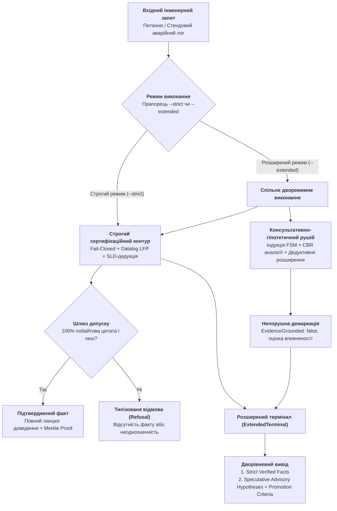
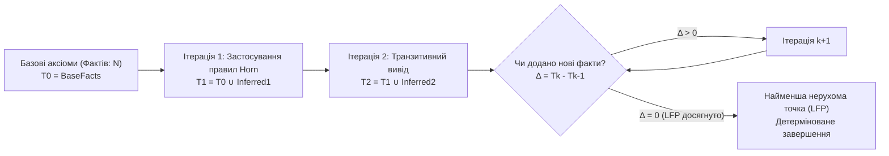
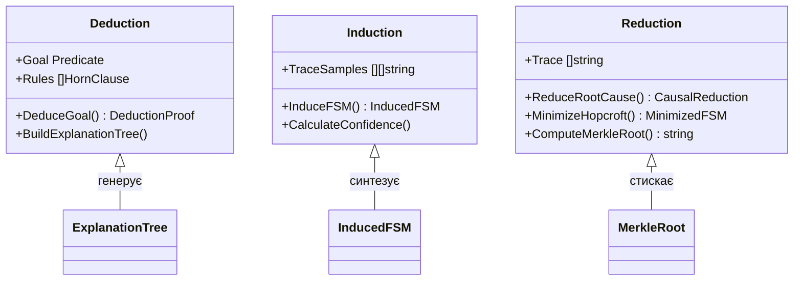
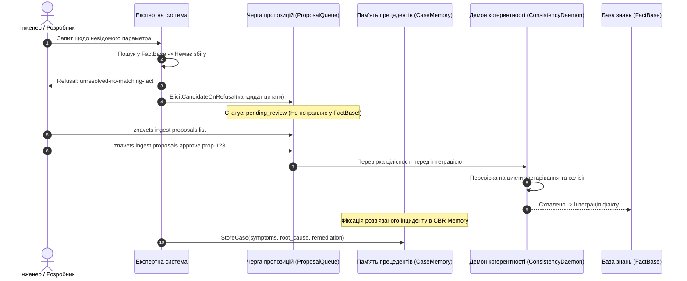

# Дворежимні експертні системи: поєднання строгої сертифікаційної верифікації та евристичного дорадчого виведення

> **Серія:** [Експертні системи для R&D](README.md) · стаття 28 із 28  
> **Попередня стаття:** [27 — Синтез сертифікаційних доказів за Goal Structuring Notation (GSN): від інженерного графа до аудиторського висновку](27-safety-case-gsn-certification-synthesis-UA.md)  
> **Наступна стаття:** Заключна стаття розширеного циклу  
> **Зміст серії:** [README](README.md)  
> **Рівень:** системні архітектори, керівники R&D, провідні аудитори з функціональної безпеки, інженери з верифікації складних систем: середній / просунутий  
> **Після статті:** розробляти та впроваджувати дворежимні експертні системи з формальним розмежуванням сертифікаційного та консультативного виводу; проектувати Datalog-сумісні предикатні рушії з гарантованим завершенням обчислення найменшої нерухомої точки (Least Fixed Point, LFP); застосовувати класичну тріаду Ч. С. Пірса (дедукцію, індукцію, редукцію) у контурах критичної інженерії; будувати безпечне самонавчання на основі пам'яті прецедентів (Case-Based Reasoning) та відмово-керованого вилучення фактів (Refusal-Driven Elicitation) без ризику катастрофічного забування чи спотворення перевіреної бази знань.

У проектуванні складних технічних систем інженери щодня стикаються з фундаментальним протиріччям: **суворість сертифікації проти творчої евристики R&D**.

З одного боку, регуляторні органи вимагають принципу *Fail-Closed*: якщо твердження не підтверджено на 100% дослівним пунктом стандарту, вихідним кодом чи апаратним випробуванням — система зобов'язана повертати відмову (`Refusal`). Жодних домислів, здогадок чи правдоподібних галюцинацій.

З іншого боку, інженери на етапі дослідження (R&D) потребують дорадчої допомоги: *«Стандарт не визначає цей випадок прямо, але яка найімовірніша поведінка за аналогією з іншими протоколами? Яке рішення раніше спрацювало при схожих збоях на стенді?»*

Традиційні підходи пропонують або сліпий ригоризм (що відкидає будь-яку допомогу розробнику при найменшій неповноті даних), або неконтрольовану генерацію мовних моделей (LLM), яка змішує суворі факти з небезпечними вигадками.

У цій статті ми представляємо інженерну архітектуру **дворежимної експертної системи (Dual-Mode Architecture)**, що поєднує строгу дедуктивну верифікацію з контрольованим консультативно-гіпотетичним виведенням.



---

## Математична модель дворежимного простору рішень

Для математичного унеможливлення ситуації, коли припущення видається за факт, результат запиту в розширеному режимі моделюється як впорядкована пара:

$$\mathcal{Y}_{\mathrm{extended}} = \langle \mathcal{T}_{\mathrm{strict}}, \mathcal{H}_{\mathrm{speculative}} \rangle$$

де:

1. $\mathcal{T}_{\mathrm{strict}}$ — строго верифікований результат сертифікаційного контуру. Якщо фактів недостатньо, $\mathcal{T}_{\mathrm{strict}} = \mathrm{Refusal}(\rho)$, де $\rho$ — типізована машинна причина неповноти знань.
2. $\mathcal{H}_{\mathrm{speculative}} = \{h_1, h_2, \dots, h_k\}$ — скінченна множина консультативних гіпотез.

Кожна гіпотеза $h_i \in \mathcal{H}_{\mathrm{speculative}}$ є строго типізованим кортежем із п'яти компонентів:

$$h_i = \langle \sigma_i, \mu_i, c_i, \mathcal{O}_i, \mathcal{P}_i \rangle$$

- $\sigma_i$ — зміст гіпотетичного судження (*Statement*);
- $\mu_i \in \{\mathrm{deductive\_ext}, \mathrm{inductive\_gen}, \mathrm{analogical\_cbr}, \mathrm{heuristic\_abd}\}$ — метод синтезу (*Synthesis Method*);
- $c_i \in [0.0, 1.0]$ — детермінований коефіцієнт впевненості (*Confidence Score*);
- $\mathcal{O}_i$ — множина спостережуваних підтверджувальних ознак (*Supporting Observations*);
- $\mathcal{P}_i$ — точні інженерні критерії переведення припущення у статус строгого факту (*Promotion Criteria*).

Головний непорушний інваріант системи формулюється так:

$$\forall h \in \mathcal{H}_{\mathrm{speculative}} \implies \mathrm{EvidenceGrounded}(h) = \mathbf{False} \quad \land \quad h \notin \mathrm{ProofCertificate}$$

Жодна гіпотеза не може потрапити до криптографічного сертифіката безпеки або вважатися регуляторним доказом без виконання умов $\mathcal{P}_i$ та проходження шлюзу валідації першоджерел.

---

## Декларативний предикатний рушій: Datalog, Horn-клаузи та LFP

Історично експертні системи базувалися на імперативних процедурних правилах (наприклад, switch-блоках чи вкладених умовах у коді). Це породжувало крихкість і загрозу нескінченних циклів при масштабуванні до тисяч взаємопов'язаних вимог.

Сучасна архітектура будується на фундаменті **декларативного Datalog** — мови реляційної логіки першого порядку над скінченними доменами:



### 1. Horn-клаузи та стратифіковане заперечення

Кожне правило формулюється як Horn-клауза:

$$H(\vec{X}) \leftarrow B_1(\vec{X}_1) \land B_2(\vec{X}_2) \land \dots \land B_m(\vec{X}_m) \land \neg N_1(\vec{Y}_1) \land \dots \land \neg N_k(\vec{Y}_k)$$

де $H$ — голова правила (новий виведений предикат), $B_i$ — позитивні атоми тіла, а $N_j$ — атоми стратифікованого заперечення (*Negation as Failure*). Стратифікація гарантує відсутність рекурсивних петель через заперечення, забезпечуючи поліноміальний час обчислення:

```go
// HornClause представляє декларативне Datalog-правило в znavets
type HornClause struct {
    ID      string      `json:"id"`
    Head    Predicate   `json:"head"`
    Body    []Predicate `json:"body"`
    Negated []Predicate `json:"negated,omitempty"`
    Scope   string      `json:"scope,omitempty"`
}
```

### 2. Квантори над скінченними доменами

Рушій підтримує обчислення обмежених кванторів загальності ($\forall$) та існування ($\exists$):

$$\forall c \in \mathrm{Commands}(P) \implies \exists s \in \mathrm{Replies}(P) \colon \mathrm{ResponseCode}(c, s)$$

Якщо квантор загальності не виконується, рушій повертає конкретний контрприклад (*Counterexample*), а не просто логічний нуль:

```go
// EvaluateUniversal перевіряє квантор загальності над доменом
func EvaluateUniversal(domain []string, varName string, pred Predicate, known []Predicate) (bool, *string) {
    for _, item := range domain {
        inst := substituteSingleVar(pred, varName, item)
        matched := false
        for _, f := range known {
            if f.EqualsGround(inst) {
                matched = true
                break
            }
        }
        if !matched {
            counterExample := item
            return false, &counterExample // Повертаємо контрприклад
        }
    }
    return true, nil
}
```

### 3. Деонтичний контроль несуперечності

Для нормативних документів (стандарти, специфікації) критичним є виявлення взаємних суперечностей деонтичних модальностей: зобов'язань ($\mathcal{O}$ / `MUST`), заборон ($\mathcal{F}$ / `MUST NOT`) та дозволів ($\mathcal{P}$ / `MAY`):

$$\mathcal{O}(A) \land \mathcal{F}(A) \implies \bot \quad (\text{Нормативна колізія})$$

При виявленні такого стану система генерує структуроване попередження `DeonticConflict` та блокує автоматичний допуск стандарту в експлуатацію.

---

## Тріада міркувань Ч. С. Пірса: Дедукція, Індукція та Редукція

Повнофункціональна інженерна система не може обмежуватися лише дедукцією. Спираючись на теорію пізнання Чарльза Сандерса Пірса, в архітектуру інтегровано три фундаментальні механізми виведення:



### 1. Дедукція (Deduction) — зворотне SLD-виведення з деревом пояснення

Дедуктивний модуль за алгоритмом зворотного виведення (*SLD Resolution*) зі стандартизацією змінних за глибиною (`Standardized Apart`) будує вичерпне дерево доведення `ExplanationNode`:

```go
type ExplanationNode struct {
    Predicate Predicate          `json:"predicate"`
    RuleID    string             `json:"rule_id,omitempty"`
    Premises  []*ExplanationNode `json:"premises,omitempty"`
    Citations []Citation         `json:"citations,omitempty"`
    IsAxiom   bool               `json:"is_axiom"`
}
```

Якщо твердження є аксіомою, воно прив'язується до першоджерела з побайтовим хешем. Якщо воно виведене через правило — дерево фіксує всі використані посилки, унеможливлюючи неперевірені кроки.

### 2. Індукція (Induction) — емпіричний синтез FSM та граматик

Коли формальної специфікації недостатньо, індуктивний синтезатор аналізує журнал сесійних взаємодій $\mathcal{T} = \{\tau_1, \tau_2, \dots, \tau_n\}$ та синтезує узагальнену модель автомата скінченних станів:

$$\delta \colon S \times \Sigma \to S$$

Кожен перехід позначається частотою спостереження, а загальна модель маркується як гіпотеза з детермінованою оцінкою впевненості:

$$c = \min\left(0.95, \, 0.50 + 0.05 \cdot |\mathcal{T}|\right)$$

### 3. Редукція (Reduction) — просторова та каузальна мінімізація

Модуль редукції вирішує три критичні завдання:

1. **Каузальна редукція діагностики:** скорочення ланцюжка аварійної сесії до єдиної кореневої невиконаної передумови:
   $$\text{Error } 503 \text{ на кроці DATA} \xrightarrow{\mathrm{Reduce}} \text{Відсутній обов'язковий } \mathrm{RCPT\ TO}$$
2. **Мінімізація простору станів (Алгоритм Гопкрофта):** факторизація еквівалентних станів автомата розбиттям на класи еквівалентності без спотворення прийнятої протокольної мови:
   $$S / {\sim} \quad \text{де } s_1 \sim s_2 \iff \forall w \in \Sigma^* \colon (\hat{\delta}(s_1, w) \in F \iff \hat{\delta}(s_2, w) \in F)$$
3. **Криптографічна редукція доказів:** згортання послідовності кроків доведення в єдиний Merkle Root SHA-256 для миттєвої перевірки зовнішнім аудитором.

---

## Контрольоване самонавчання: пам'ять прецедентів (CBR) та фоновий аудит

Головна небезпека самонавчання у високонадійних системах — **катастрофічне забування** (*Catastrophic Forgetting*) та **непомітне спотворення бази знань** новими, неперевіреними даними.

Для запобігання цим явищам реалізовано трирівневий контур контрольованого навчання:



### 1. Active Elicitation на базі відмов (Refusal-Triggered)

При поверненні типізованої відмови (`KindRefusal`) система сканує першоджерела за ключовими сутностями та поміщає кандидатів у буфер `ProposalQueue`:

```go
type KnowledgeCandidateProposal struct {
    CandidateID       string         `json:"candidate_id"`
    TriggeringQuery   string         `json:"triggering_query"`
    SuggestedSubject  string         `json:"suggested_subject"`
    SuggestedRelation string         `json:"suggested_relation"`
    SuggestedValue    string         `json:"suggested_value"`
    SourceDoc         string         `json:"source_doc"`
    ByteStart         int            `json:"byte_start"`
    ByteEnd           int            `json:"byte_end"`
    ConfidenceScore   float64        `json:"confidence_score"`
    Status            ProposalStatus `json:"status"` // pending_review
}
```

Кандидат перебуває в ізольованому стані `pending_review` і за жодних обставин не використовується дедуктивним рушієм, доки інженер знань явно не викличе `Approve`.

### 2. Пам'ять прецедентів діагностики (Case-Based Reasoning)

Кожен розібраний інцидент стендового випробування індексується в пам'яті прецедентів `DiagnosticCaseMemory`.

При виникненні нової помилки система обчислює коефіцієнт подібності Жаккара над множиною спостережуваних симптомів $S_{\mathrm{input}}$ та збережених прецедентів $S_{\mathrm{case}}$:

$$J(S_{\mathrm{input}}, S_{\mathrm{case}}) = \frac{|S_{\mathrm{input}} \cap S_{\mathrm{case}}|}{|S_{\mathrm{input}} \cup S_{\mathrm{case}}|}$$

Якщо $J \ge \theta$ (де $\theta = 0.30 \dots 0.40$), система формує консультативну гіпотезу із готовим планом відновлення на основі аналогії:

```go
func (m *DiagnosticCaseMemory) RetrieveSimilar(symptoms []string, protocol string, threshold float64) []CaseMatch {
    // Детермінований пошук прецедентів за індексом симптомів
}
```

### 3. Фоновий аудит когерентності (Consistency Daemon)

При будь-якому додаванні нових знань демон когерентності безперервно перевіряє три класи порушень:

1. **Петлі застарівання:** циклічні залежності в графі стандартів ($A \text{ скасовує } B \land B \text{ скасовує } A$);
2. **Деонтичні суперечності:** одночасна наявність правил $\mathcal{O}(p)$ та $\mathcal{F}(p)$ в одному скоупі;
3. **Конфлікт синглтон-констант:** наявність різних значень за замовчуванням (наприклад, суперечливі порти) в межах однієї редакції стандарту.

---

## Промислова реалізація: CLI та формати виводу

На практиці інженер керує поведінкою системи через прапорці командного рядка:

```bash
# 1. Строгий сертифікаційний режим (за замовчуванням)
$ znavets ask "What is the maximum line length in SMTP?" --format text

Answer: 1000 characters
  [rfc5321 (Section 4.5.3.1.6), bytes 123450-123540]
```

Якщо інформація відсутня, строгий режим повертає вичерпну типізовану відмову:

```bash
$ znavets ask "Why is connection timeout occurring on port 25?" --format text

Refusal: unresolved-no-matching-fact
  Cannot answer: question phrasing could not be deterministically mapped to verified knowledge.
```

При активації розширеного режилю `--extended` система виводить строгий блок і додає секцію евристичних припущень із умовами підтвердження:

```bash
$ znavets ask "Why is connection timeout occurring on port 25?" --format text --extended

Refusal: unresolved-no-matching-fact
  Cannot answer: question phrasing could not be deterministically mapped to verified knowledge.

=== SPECULATIVE ADVISORY HYPOTHESES (NOT STRICT EVIDENCE) ===
[1] hyp-cbr-7a3b4f2c (Confidence: 0.85 | Method: analogical_cbr)
    Statement: Based on precedent case case-smtp-001, probable root cause: Port 25 blocked by residential ISP. Recommended remediation: Use port 587 with STARTTLS; Verify firewall egress rule.
    Supporting Observations: Precedent symptoms matched: [connection, timeout, port]
    Promotion Criteria:
      - Confirm current environment state matches precedent case case-smtp-001 conditions.
      - Verify protocol sequence against active standards.
```

У форматі JSON результат структуровано так, щоб автоматизовані системи тестування (CI/CD) могли однозначно відфільтрувати гіпотези:

```json
{
  "mode": "extended",
  "strict_result": {
    "request_id": "cli-q1",
    "terminal_kind": "refusal",
    "refusal_reason": "unresolved-no-matching-fact"
  },
  "speculative_hypotheses": [
    {
      "hypothesis_id": "hyp-cbr-7a3b4f2c",
      "statement": "Probable root cause: Port 25 blocked by residential ISP...",
      "synthesis_method": "analogical_cbr",
      "confidence_score": 0.85,
      "promotion_criteria": [
        "Confirm current environment state matches precedent case conditions."
      ],
      "evidence_grounded": false
    }
  ]
}
```

---

## Порівняльний аналіз режимів роботи

| Критерій | Строгий режим (`--strict`) | Розширений режим (`--extended`) | Вільна генерація LLM |
|---|---|---|---|
| **Призначення** | Регуляторна сертифікація, аудити безпеки (DO-178C, ISO 26262) | R&D дослідження, налагодження стендів, оперативна діагностика | Написання текстів, мозковий штурм без відповідальності |
| **Гарантія достовірності** | **100% математична** (побайтове цитування з хешем) | **100% для фактів** + чітко відокремлені гіпотези | **0%** (ризик галюцинацій та підробки фактів) |
| **Реакція на неповноту** | Типізована відмова (`Refusal`) | Відмова у фактах + припущення з CBR/індукції | Генерація правдоподібної, але вигаданої відповіді |
| **Криптографічний доказ** | Генерується сертифікат `.zproof` (Merkle Tree) | Сертифікат генерується **лише** для строгого блоку | Неможливо сформувати математичний доказ |
| **Швидкість виведення** | < 1 мілісекунди (In-Memory Datalog LFP) | < 5 мілісекунд (Datalog + індекс CBR) | 1–10 секунд (залежно від розміру моделі та GPU) |
| **Споживання ресурсів** | ~10 МБ RAM, pure Go, zero CGO | ~15 МБ RAM, pure Go | 8–32 ГБ VRAM, дорогі прискорювачі |

---

## Висновки

Дворежимна архітектура вирішує ключову дилему промислового застосування систем штучного інтелекту:

1. **Безпека залишається абсолютною:** сертифікаційні контури продовжують спиратися виключно на математично доведені факти з побайтовим цитуванням, не допускаючи генеративних галюцинацій у звіти з безпеки.
2. **R&D отримує дорадчу силу:** інженери мають доступ до досвіду минулих інцидентів (CBR), узагальнених моделей поведінки (індукція) та обґрунтованих припущень із прозорими умовами їхньої формальної верифікації.
3. **Контрольована еволюція:** база знань навчається через відмови та прецеденти, але жоден факт не набуває чинності без проходження через строгий шлюз допуску та фоновий аудит когерентності.

У наступних фазах розвитку цей підхід стає платформою для автоматизації аудитів за провідними промисловими стандартами функціональної безпеки та кібербезпеки: **Automotive SPICE 4.0**, **ISO 26262** (ASIL A..D) та **ISO/SAE 21434** (TARA).

---

## Питання до читачів

- Як у вашій команді вирішується конфлікт між бажанням швидких евристичних підказок та вимогами суворої сертифікаційної доказовості?
- Чи готові ви довірити індуктивним та прецедентним моделям (CBR) формування первинних гіпотез діагностики несправностей під час стендових випробувань?
- Які стандарти у вашій галузі (наприклад, ISO 26262 в автопромі чи DO-178C в авіації) найбільше виграють від автоматичного розділення відповідей на суворі факти та верифіковані гіпотези?

---

## Посилання на першоджерела та стандарти

- C. S. Peirce. [Deduction, Induction, and Hypothesis](https://www.jstor.org/stable/25109861), *The Popular Science Monthly*, 1878.
- S. Abiteboul, R. Hull, V. Vianu. [Foundations of Databases: The Logical Level (Datalog & Fixpoint Logics)](http://webdam.inria.fr/Alice/), Addison-Wesley, 1995.
- J. E. Hopcroft. [An $n \log n$ algorithm for minimizing states in a finite automaton](https://ecommons.cornell.edu/handle/1813/5958), *Theory of Machines and Computations*, Academic Press, 1971.
- A. Aamodt, E. Plaza. [Case-Based Reasoning: Foundational Issues, Methodological Variations, and System Approaches](https://doi.org/10.3233/AIC-1994-7104), *AI Communications*, 7(1):39–59, 1994.
- G. H. von Wright. [Deontic Logic](https://doi.org/10.2307/2182231), *Mind*, New Series, Vol. 60, No. 237, 1951.
- R. C. Merkle. [A Certified Digital Signature](https://doi.org/10.1007/0-387-34805-0_21), *Advances in Cryptology — CRYPTO '89*, Lecture Notes in Computer Science, vol 435, Springer, 1989.
- VDA QMC. [Automotive SPICE Process Assessment / Reference Model, Version 4.0](https://vda-qmc.de/en/software-processes/automotive-spice/), 2023.
- ISO. [ISO 26262:2018 — Road vehicles: Functional safety](https://www.iso.org/standard/68383.html), Parts 1–12, 2018.
- ISO / SAE. [ISO/SAE 21434:2021 — Road vehicles: Cybersecurity engineering](https://www.iso.org/standard/70918.html), 2021.
