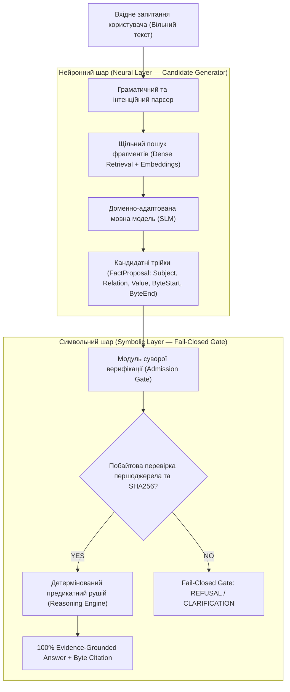

# Нейро-символьна архітектура (Neuro-Symbolic AI) для експертних систем: поєднання мовних моделей та детермінованої доказовості

**Автор:** Nick Fedchik
**Категорія:** Artificial Intelligence / Expert Systems / Safety-Critical Systems  

---

## Анотація

У цій статті розглядається архітектурна криза сучасних систем штучного інтелекту: з одного боку, великі мовні моделі (LLM/SLM) демонструють вражаючу гнучкість у розумінні природної мови, але зазнають невдачі через неконтрольовані галюцинації, відсутність доказовості та недетермінізм. З іншого боку, класичні детерміновані експертні системи на основі правил забезпечують стовідсоткову математичну строгість, але страждають від крихкості та нездатності опрацьовувати варіативні мовні формулювання.

Представлено практичну реалізацію **Нейро-символьної архітектури (Neuro-Symbolic AI)** для сучасних експертних систем. Проаналізовано принципи розподілу обов'язків між нейронним генератором кандидатів (SLM + векторний пошук) та детермінованим символьним верифікатором. Наведено результати емпіричного порівняння архітектур.

---

## 1. Вступ та дилема штучного інтелекту

Сучасний розвиток прикладної інформатики зіштовхнувся з фундаментальним бар'єром під час впровадження штучного інтелекту у відповідальні інженерні, військово-технічні, авіаційні та регуляторні контури (*Safety-Critical & Regulatory Compliance*):

```text
┌──────────────────────────────────────┐       ┌──────────────────────────────────────┐
│  Статистичні мовні моделі (LLM/RAG)  │       │  Класичні експертні системи (Rules)  │
├──────────────────────────────────────┤       ├──────────────────────────────────────┤
│ ✔ Гнучке розуміння природної мови    │       │ ✖ Крихкість до мовних синонімів      │
│ ✖ Неконтрольовані галюцинації        │       │ ✔ 100% детермінізм та прозорість     │
│ ✖ Відсутність побайтових доказів     │       │ ✔ Математичні доведення правил       │
│ ✖ Недетермінованість висновків       │       │ ✖ Потреба у ручному допилюванні правил│
└──────────────────────────────────────┘       └──────────────────────────────────────┘
```

Для створення систем найвищого рівня довіри жоден із цих підходів у чистому вигляді не є достатнім. Потрібен новий синтез — **Нейро-символьна архітектура (Neuro-Symbolic AI)**.

---

## 2. Концепція Нейро-символьної архітектури

В експертних системах четвертого покоління реалізовано чітке розмежування обов'язків за принципом: **«Нейромережа пропонує, Символьне ядро затверджує»**.



### Двошарова декомпозиція:

1. **Нейронний шар (Neural Candidate Generator):**
   * **Завдання:** Інтерпретація вільного мовного формулювання оператора, семантичний пошук у великих корпусах документів (наприклад, нормативних стандартах) та формування кандидатних фактологічних трійок `FactProposal`.
   * **Модель:** Локальні компактні мовні моделі (Small Language Models — SLM 1B–3B параметрів).
   * **Особливість:** Моделі **заборонено** формувати остаточну відповідь операторові. Вона пропонує лише фрагмент вихідного документа та його припущені байтові координати.

2. **Символьний шар (Symbolic Host Verification Gate):**
   * **Завдання:** Примусове забезпечення непорушних інваріантів системи.
   * **Алгоритм перевірки:**
     1. Система зчитує сирі байти безпосередньо з оригінального файлу на диску за координатами `[byte_start, byte_end)`.
     2. Виконується криптографічна перевірка хешу SHA-256 цитати на відповідність зареєстрованому документу.
     3. Перевіряється належність витягнутого відношення до закритого словника фактів (*Closed Vocabulary*).
     4. У разі успіху факт допускається (`Admitted`) і передається в детермінований предикатний рушій (наприклад, алгоритм SLD Resolution).
     5. У разі найменшої невідповідності (галюцинації нейромережі) факт **негайно відкидається** (`REFUSAL`).

---

## 3. Непорушні інваріанти нейро-символьної системи

Для забезпечення нульового рівня галюцинацій фіксуються головні інженерні інваріанти:

1. **Evidence-Grounded Invariant:**  
   Будь-яка стверджувальна відповідь системи зобов'язана спиратися на дослівну цитату з незмінного першоджерела з точними байтовими межами та проходженням криптографічної перевірки.
2. **Fail-Closed Gate:**  
   Якщо факт відсутній або неоднозначний — система зобов'язана повертати типізовану відмову (*Refusal*, *Clarification*). Заборонено генерувати правдоподібні відповіді без жорсткого математичного підтвердження.
3. **Детермінізм висновків (Rule-Based Reasoning):**  
   Остаточний висновок робиться виключно через формальну логіку та предикатні правила. Нейромережі не мають права самостійно ухвалювати рішення про істинність.

---

## 4. Дворежимне виконання: Суворий та Розширений режими

Для поєднання вимог суворої сертифікації та гнучкого інженерного дослідницького пошуку в сучасних експертних системах реалізується двофазний режим роботи:

### 1. Суворий режим (Strict Mode — За замовчуванням):

Виконується виключно символьне ядро. Видаються тільки стовідсотково підтверджені байти. Будь-яка невизначеність призводить до запиту на уточнення. Це базовий режим для сертифікованих середовищ (наприклад, утиліт перевірки авіоніки).

### 2. Розширений режим (Extended Advisory Mode):

Поряд із суворим результатом система паралельно активує нейро-символьні механізми висунення гіпотез:

* **Індуктивне узагальнення (`inductive_generalization`):** Екстраполяція типових шаблонів специфікацій на загальні поняття.
* **Дедуктивне розширення (`deductive_extension`):** Предикатне виведення наслідків при виконанні додаткових припущень ($A \to B$).
* **Прецедентний аналіз (`analogical_cbr`):** Пошук аналогічних діагностичних випадків у пам'яті прецедентів (*Case-Based Reasoning*).

*Приклад системного відгуку:*

```text
=== STRICT RESULT ===
Outcome: CLARIFICATION — Ambiguous referent found in source documents. Strict grounding cannot be established.

=== SPECULATIVE ADVISORY HYPOTHESES (NOT STRICT EVIDENCE) ===
  [1] (Confidence: 0.75 | Method: inductive_generalization): 
      Hypothesis: In similar architectural contexts, this term denotes core protocol specifications.
  [2] (Confidence: 0.80 | Method: analogical_cbr): 
      Hypothesis: Based on Historical Case #442, the related component implements a failsafe state.
```

---

## 5. Емпіричні результати та порівняльний аналіз

Емпіричні випробування нейро-символьних експертних систем (на великих масивах інженерних специфікацій та нормативів) демонструють такі переваги:

| Метрика | Традиційний LLM / RAG | Класична Rule-Based Система | Нейро-символьна Експертна Система |
|---|---|---|---|
| **Точність відповідей (Concordance)** | 70% – 85% | 100% | **100%** |
| **Галюцинації (Hallucination Rate)** | 15% – 30% | 0% | **0%** |
| **Доказовість (Traceability)** | Немає (перефразування) | Присутня | **100% криптографічно підтверджена** |
| **Стійкість до синонімів** | Висока | Дуже низька | **Висока (забезпечується SLM)** |
| **Ефективність розміру (Footprint)** | Висока (> 5 ГБ) | Низька (~ 10 МБ) | **Низька (локальні оптимізовані моделі)** |

---

## 6. Висновок

Нейро-символьна архітектура (*Neuro-Symbolic AI*) розв'язує фундаментальну суперечність між мовною гнучкістю та математичною строгістю.

Поєднання нейронного генератора гіпотез із суворим детермінованим символьним шлюзом верифікації гарантує:

1. Здатність опрацьовувати вільні мовні запитання оператора без жорсткого прив'язування коду до конкретних формулювань.
2. 100% збереження принципу доказовості та епістемічної чесності.
3. Екстремальну продуктивність та автономність в ізольованих, критично важливих інженерних контурах.
