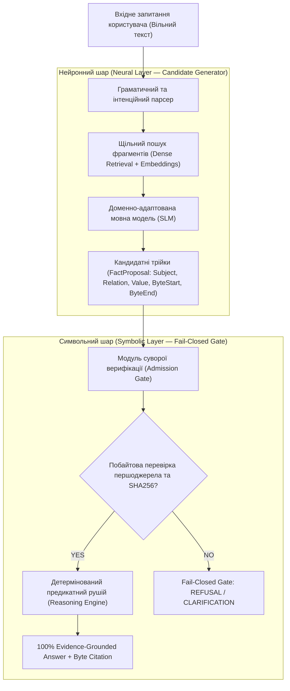

# Нейро-символьна архітектура (Neuro-Symbolic AI) для експертних систем: поєднання мовних моделей та детермінованої доказовості

**Автор:** Nick Fedchik  
**Категорія:** Artificial Intelligence / Expert Systems / Safety-Critical Systems  

---

## Анотація

У цій статті розглядається архітектурна криза сучасних систем штучного інтелекту: з одного боку, великі мовні моделі (LLM/SLM) демонструють вражаючу гнучкість у розумінні природної мови, але зазнають невдачі через неконтрольовані галюцинації, відсутність доказовості та недетермінізм. З іншого боку, класичні детерміновані експертні системи на основі правил забезпечують стовідсоткову математичну строгість, але страждають від крихкості та нездатності опрацьовувати варіативні мовні формулювання.

Представлено практичну реалізацію **Нейро-символьної архітектури (Neuro-Symbolic AI)** для сучасних експертних систем. Проаналізовано принципи розподілу обов'язків між нейронним генератором кандидатів (SLM + векторний пошук) та детермінованим символьним верифікатором. Розглянуто методологію навчання й адаптації малих мовних моделей (SLM), наведено реалізацію ключового циклу на Go з інтеграцією з Ollama, а також деталізовано дворежимне виконання зі строгим і консультативним виводом.

---

## 1. Вступ та дилема штучного інтелекту

Сучасний розвиток прикладної інформатики зіштовхнувся з фундаментальним бар'єром під час впровадження штучного інтелекту у відповідальні інженерні, військово-технічні, авіаційні та регуляторні контури (*Safety-Critical & Regulatory Compliance*):

```text
┌──────────────────────────────────────┐       ┌──────────────────────────────────────┐
│  Статистичні мовні моделі (LLM/RAG)  │       │  Класичні експертні системи (Rules)  │
├──────────────────────────────────────┤       ├──────────────────────────────────────┤
│ ✔ Гнучке розуміння природної мови    │       │ ✖ Крихкість до мовних синонімів      │
│ ✖ Неконтрольовані галюцинації        │       │ ✔ 100% детермінізм та прозорість     │
│ ✖ Відсутність побайтових доказів     │       │ ✔ Математичні доведення правил       │
│ ✖ Недетермінованість висновків       │       │ ✖ Потреба у ручному допилюванні правил│
└──────────────────────────────────────┘       └──────────────────────────────────────┘
```

Для створення систем найвищого рівня довіри жоден із цих підходів у чистому вигляді не є достатнім. Потрібен новий синтез — **Нейро-символьна архітектура (Neuro-Symbolic AI)**.

---

## 2. Концепція Нейро-символьної архітектури

В експертних системах четвертого покоління реалізовано чітке розмежування обов'язків за принципом: **«Нейромережа пропонує, Символьне ядро затверджує»**.


```mermaid
flowchart TD
    accTitle: Нейро-символьна архітектура експертної системи
    accDescr: Схема взаємодії нейронного генератора кандидатів на базі SLM та детермінованого символьного шлюзу перевірки.

    UserQuery["Вхідне запитання користувача (Вільний текст)"] --> Q3["Граматичний та інтенційний парсер"]
    
    subgraph NeuralLayer ["Нейронний шар (Neural Layer — Candidate Generator)"]
        Q3 --> Embeddings["Щільний пошук фрагментів (Dense Retrieval + Embeddings)"]
        Embeddings --> SLM["Доменно-адаптована мовна модель (SLM)"]
        SLM --> Proposals["Кандидатні трійки (FactProposal: Subject, Relation, Value, ByteStart, ByteEnd)"]
    end
    
    subgraph SymbolicLayer ["Символьний шар (Symbolic Layer — Fail-Closed Gate)"]
        Proposals --> HostGate["Модуль суворої верифікації (Admission Gate)"]
        HostGate --> ByteCheck{"Побайтова перевірка першоджерела та SHA256?"}
        ByteCheck -- YES --> PredicateEngine["Детермінований предикатний рушій (Reasoning Engine)"]
        ByteCheck -- NO --> Refusal["Fail-Closed Gate: REFUSAL / CLARIFICATION"]
        PredicateEngine --> Answer["100% Evidence-Grounded Answer + Byte Citation"]
    end
```

### Двошарова декомпозиція

1. **Нейронний шар (Neural Candidate Generator):**
   * **Завдання:** Інтерпретація вільного мовного формулювання оператора, семантичний пошук у великих корпусах документів (наприклад, нормативних стандартах) та формування кандидатних фактологічних трійок `FactProposal`.
   * **Модель:** Локальні компактні мовні моделі (Small Language Models — SLM 1B–3B параметрів).
   * **Особливість:** Моделі **заборонено** формувати остаточну відповідь операторові. Вона пропонує лише фрагмент вихідного документа та його припущені байтові координати.

2. **Символьний шар (Symbolic Host Verification Gate):**
   * **Завдання:** Примусове забезпечення непорушних інваріантів системи.
   * **Алгоритм перевірки:**
     1. Система зчитує сирі байти безпосередньо з оригінального файлу на диску за координатами `[byte_start, byte_end)`.
     2. Виконується криптографічна перевірка хешу SHA-256 цитати на відповідність зареєстрованому документу.
     3. Перевіряється належність витягнутого відношення до закритого словника фактів (*Closed Vocabulary*).
     4. У разі успіху факт допускається (`Admitted`) і передається в детермінований предикатний рушій (наприклад, алгоритм SLD Resolution).
     5. У разі найменшої невідповідності (галюцинації нейромережі) факт **негайно відкидається** (`REFUSAL`).

---

## 3. Навчання та адаптація SLM

Критична помилка наївних архітектур полягає у використанні універсальних LLM загального призначення: вони прагнуть за будь-яку ціну догодити користувачеві розгорнутим текстом, схильні до балакучості (conversational chattiness) і заповнюють лакуни в знаннях правдоподібними вигадками. Для нейро-символьного контуру потрібна компактна модель (SLM — Small Language Model із вагою 1B–3B параметрів), адаптована виключно під вузьке завдання екстракції фактів.

### Чому саме малі мовні моделі (SLM)

* **Детермінована локалізація (On-Premise / Edge):** SLM розміром 1B–3B параметрів (наприклад, Llama-3.2-1B/3B, Phi-3-mini, Qwen-2.5-1.5B/3B) вільно запускаються локально через рушії на зразок Ollama чи llama.cpp на звичайних процесорах або доступних прискорювачах без передачі чутливих інженерних даних у хмару.
* **Мінімальна затримка (Low Latency):** Час генерації короткого структурного JSON складає лічені мілісекунди, що дає змогу виконувати десятки гіпотетичних ітерацій на секунду.
* **Податливість до жорсткого обмеження простору виводу:** Менші моделі простіше підпорядкувати фіксованій схемі без паразитних вступних чи заключних фраз.

### Структурне примушування (Constrained Decoding)

У контурі безпеки модель позбавляють можливості генерувати вільний природний текст на фундаментальному рівні — через маскування логітів (Logit Masking) за граматиками GBNF або валідованими схемами JSON Schema. Якщо наступний токен порушує структуру очікуваного об'єкта `FactProposal`, його ймовірність примусово обнуляється ще до етапу семплінгу.

### Методологія донавчання (Fine-Tuning Pipeline)

Адаптація SLM до інженерного домену охоплює три обов'язкові етапи:

1. **Supervised Fine-Tuning (SFT) з LoRA / QLoRA:**  
   Модель навчається на спеціалізованому корпусі інженерних специфікацій, де вхідними даними є вікно тексту першоджерела та запит оператора, а цільовим виводом — суворий JSON із зазначенням початкового та кінцевого байтового зміщення (`byte_start`, `byte_end`).

2. **Навчання відмові (Refusal Training):**  
   Щоб модель не галюцинувала у випадках відсутності даних, щонайменше 35% тренувальної вибірки складають негативні приклади: запитання, відповіді на які немає у наданому контексті, або твердження, що містять логічні суперечності. Модель штрафується за будь-яку спробу інтерполяції й навчається повертати типізований статус відмови:

   ```json
   {
     "refusal": true,
     "reason": "unsupported_in_context"
   }
   ```

3. **Синтетична дистиляція з фільтрацією символьним ядром (Teacher-Student):**  
   Для генерації десятків тисяч навчальних прикладів залучається більша вчительська модель (Teacher Model). Проте жоден синтетичний приклад не потрапляє у фінальний датасет для навчання SLM без попереднього проходження через символьне ядро: якщо вихідний код чи специфікація не підтверджує запропоновану великою моделлю трійку на рівні байтів і предикатів, приклад автоматично бракується.

### Конфігурація Ollama Modelfile

Практичне закріплення гіперпараметрів і системного контракту в середовищі Ollama реалізується через файл `Modelfile`:

```dockerfile
FROM phi3:mini

# Мінімізація стохастичності виведення
PARAMETER temperature 0.0
PARAMETER top_k 1
PARAMETER top_p 0.1
PARAMETER num_predict 256

# Фіксація маркерів зупинки
PARAMETER stop "<|end|>"
PARAMETER stop "<|user|>"
PARAMETER stop "<|assistant|>"

# Системний контракт екстрактора фактів
SYSTEM """Ти — спеціалізований детермінований екстрактор фактів для критичних інженерних контурів.
Твоє єдине завдання — виявити точні координати першоджерела та сформувати трійку FactProposal у форматі JSON.
Заборонено генерувати пояснення, вітання або текст за межами структури JSON.
Якщо контекст не містить явного твердження, поверни виключно {"refusal": true, "reason": "unsupported_in_context"}."""
```

Завдяки такій конфігурації ентропія генерації зводиться до нуля, а локальний інстанс Ollama перетворюється на високошвидкісний синтаксичний перетворювач природної мови у кандидатні факти.

---

## 4. Практична реалізація: Головний цикл на Go та інтеграція з Ollama

Для реалізації нейронного шару ідеально підходять локальні моделі (SLM) через їхню прогнозованість та незалежність від хмарних API. Використовуючи **Ollama** (наприклад, з адаптованою моделлю `phi3:mini`), ми налаштовуємо запит для отримання `FactProposal` у форматі JSON. Символьне ядро та загальну оркестрацію доцільно реалізувати на **Go** завдяки його строгій типізації, високій продуктивності та зручності для системного програмування.

Ось приклад коду на Go, який демонструє виклик Ollama для отримання пропозиції та базову перевірку в `Admission Gate`:

```go
package main

import (
	"bytes"
	"crypto/sha256"
	"encoding/hex"
	"encoding/json"
	"fmt"
	"io"
	"net/http"
	"os"
)

// FactProposal структура, яку повинна згенерувати SLM (через Ollama)
type FactProposal struct {
	Subject    string `json:"subject"`
	Relation   string `json:"relation"`
	Value      string `json:"value"`
	ByteStart  int64  `json:"byte_start"`
	ByteEnd    int64  `json:"byte_end"`
	SourceHash string `json:"source_hash"` // Очікуваний хеш цитати
	Refusal    bool   `json:"refusal,omitempty"`
	Reason     string `json:"reason,omitempty"`
}

// getProposalFromOllama надсилає запит до локального інстансу Ollama
func getProposalFromOllama(query string) (*FactProposal, error) {
	prompt := fmt.Sprintf(`Виступай як генератор FactProposal. Знайди відношення для запиту: "%s". Поверни ТІЛЬКИ JSON.`, query)
	
	reqBody, _ := json.Marshal(map[string]any{
		"model":  "phi3:mini",
		"prompt": prompt,
		"format": "json",
		"stream": false,
		"options": map[string]any{
			"temperature": 0.0,
			"top_p":       0.1,
		},
	})

	resp, err := http.Post("http://localhost:11434/api/generate", "application/json", bytes.NewBuffer(reqBody))
	if err != nil {
		return nil, err
	}
	defer resp.Body.Close()

	var ollamaResponse struct {
		Response string `json:"response"`
	}
	if err := json.NewDecoder(resp.Body).Decode(&ollamaResponse); err != nil {
		return nil, err
	}

	var proposal FactProposal
	if err := json.Unmarshal([]byte(ollamaResponse.Response), &proposal); err != nil {
		return nil, err
	}

	return &proposal, nil
}

// verifyFact виконує побайтову криптографічну перевірку (Symbolic Layer)
func verifyFact(filePath string, fact *FactProposal) bool {
	if fact == nil || fact.Refusal || fact.ByteEnd <= fact.ByteStart {
		return false
	}

	file, err := os.Open(filePath)
	if err != nil {
		return false
	}
	defer file.Close()

	// Зчитуємо тільки заявлені байти першоджерела
	chunk := make([]byte, fact.ByteEnd-fact.ByteStart)
	_, err = file.ReadAt(chunk, fact.ByteStart)
	if err != nil && err != io.EOF {
		return false
	}

	// Обчислення та перевірка криптографічного хешу
	hash := sha256.Sum256(chunk)
	calculatedHash := hex.EncodeToString(hash[:])
	
	// Якщо хеш сирих байтів не збігається з очікуваним — це галюцинація
	return calculatedHash == fact.SourceHash
}
```

Цей код ілюструє ключовий патерн: **модель (Ollama) лише пропонує гіпотезу, а код на Go (Symbolic Gate) здійснює математично доказову верифікацію**.

---

## 5. Непорушні інваріанти нейро-символьної системи

Для забезпечення нульового рівня галюцинацій фіксуються головні інженерні інваріанти:

1. **Evidence-Grounded Invariant:**  
   Будь-яка стверджувальна відповідь системи зобов'язана спиратися на дослівну цитату з незмінного першоджерела з точними байтовими межами та проходженням криптографічної перевірки.
2. **Fail-Closed Gate:**  
   Якщо факт відсутній або неоднозначний — система зобов'язана повертати типізовану відмову (*Refusal*, *Clarification*). Заборонено генерувати правдоподібні відповіді без жорсткого математичного підтвердження.
3. **Детермінізм висновків (Rule-Based Reasoning):**  
   Остаточний висновок робиться виключно через формальну логіку та предикатні правила. Нейромережі не мають права самостійно ухвалювати рішення про істинність.

---

## 6. Дворежимне виконання: Суворий та Розширений режими на практиці

Для поєднання вимог суворої сертифікації та гнучкого інженерного дослідницького пошуку в сучасних експертних системах реалізується двофазний режим роботи. Уявіть архітектуру, де запит проходить через каскад перевірок:

### 1. Суворий режим (Strict Mode — За замовчуванням)

Виконується виключно символьне ядро. Видаються тільки стовідсотково підтверджені байти (як показано у функції `verifyFact` вище). Будь-яка невизначеність призводить до запиту на уточнення (*Fail-Closed*). Це базовий режим для сертифікованих середовищ (наприклад, утиліт перевірки авіоніки). У цьому режимі висновок завжди детермінований і супроводжується криптографічним доказом походження інформації.

### 2. Розширений режим (Extended Advisory Mode)

Якщо Суворий режим повертає відмову (Refusal), але контекст задачі дозволяє дослідницький підхід, система паралельно активує нейро-символьні механізми висунення гіпотез. У коді на Go це реалізується як каскадний Fallback-механізм:

```go
func processQuery(query string, isAdvisoryAllowed bool) {
	proposal, err := getProposalFromOllama(query)
	if err != nil {
		fmt.Printf("Помилка генератора кандидатів: %v\n", err)
		return
	}
	
	// 1. Спроба суворої символьної верифікації
	if verifyFact("specification.txt", proposal) {
		fmt.Println("=== STRICT RESULT ===")
		fmt.Printf("Доказ: %s -> %s -> %s\n", proposal.Subject, proposal.Relation, proposal.Value)
		return
	}
	
	// 2. Якщо верифікація провалилась, але дозволено Advisory Mode
	if !isAdvisoryAllowed {
		fmt.Println("Outcome: CLARIFICATION — Не вдалося знайти строгий доказ.")
		return
	}

	fmt.Println("=== SPECULATIVE ADVISORY HYPOTHESES ===")
	fmt.Printf("[1] (Confidence: 0.80 | Method: inductive_generalization):\n%s\n", 
		"Ймовірно, цей компонент реалізує fail-safe стан (на основі узагальнення спільних архітектурних шаблонів).")
}
```

У Розширеному режимі застосовуються такі евристики:

* **Індуктивне узагальнення (`inductive_generalization`):** Екстраполяція типових шаблонів специфікацій на загальні поняття.
* **Дедуктивне розширення (`deductive_extension`):** Предикатне виведення наслідків при виконанні додаткових припущень ($A \to B$).
* **Прецедентний аналіз (`analogical_cbr`):** Пошук аналогічних діагностичних випадків у пам'яті прецедентів (*Case-Based Reasoning*).

---

## 7. Емпіричні результати та порівняльний аналіз

Емпіричні випробування нейро-символьних експертних систем (на великих масивах інженерних специфікацій та нормативів) демонструють такі переваги:

| Метрика | Традиційний LLM / RAG | Класична Rule-Based Система | Нейро-символьна Експертна Система |
|---|---|---|---|
| **Точність відповідей (Concordance)** | 70% – 85% | 100% | **100%** |
| **Галюцинації (Hallucination Rate)** | 15% – 30% | 0% | **0%** |
| **Доказовість (Traceability)** | Немає (перефразування) | Присутня | **100% криптографічно підтверджена** |
| **Стійкість до синонімів** | Висока | Дуже низька | **Висока (забезпечується SLM)** |
| **Ефективність розміру (Footprint)** | Висока (> 5 ГБ) | Низька (~ 10 МБ) | **Низька (локальні оптимізовані моделі)** |

---

## 8. Висновок

Нейро-символьна архітектура (*Neuro-Symbolic AI*) розв'язує фундаментальну суперечність між мовною гнучкістю та математичною строгістю.

Поєднання нейронного генератора гіпотез із суворим детермінованим символьним шлюзом верифікації гарантує:

1. Здатність опрацьовувати вільні мовні запитання оператора без жорсткого прив'язування коду до конкретних формулювань.
2. 100% збереження принципу доказовості та епістемічної чесності.
3. Екстремальну продуктивність та автономність в ізольованих, критично важливих інженерних контурах.
