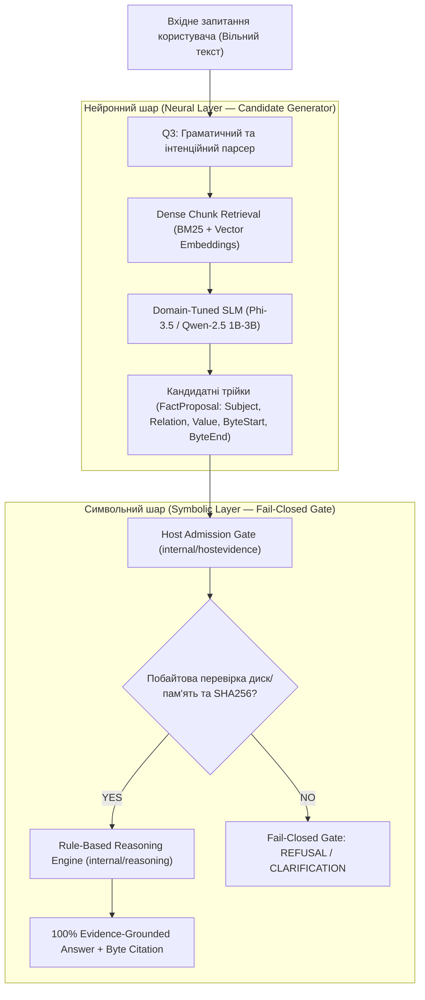

# Нейро-символьна архітектура (Neuro-Symbolic AI) для експертних систем: поєднання мовних моделей та детермінованої доказовості

**Автор:** Antigravity AI / Znavets Core Engineering Team  
**Дата:** 21 вересня 2026 року  
**Категорія:** Artificial Intelligence / Expert Systems / Safety-Critical Systems  
**Репозиторій:** `~/znavets` (Znavets v3.11.1-dev)

---

## Анотація

У даній статті розглядається архітектурний кризис сучасних систем штучного інтелекту: з одного боку, великі мовні моделі (LLM/SLM) демонструють вражаючу гнучкість у розумінні природної мови, але падають через неконтрольовані галюцинації, відсутність доказовості та недетермінізм; з іншого боку, класичні детерміновані експертні системи на основі правил забезпечують 100% математичну строгість, але страждають від крихкості та нездатності опрацьовувати варіативні мовні формулювання.

Представлено практичну реалізацію **Нейро-символьної архітектури (Neuro-Symbolic AI)** на прикладі вітчизняної експертної системи **Znavets v3**. Проаналізовано принципи декупінгу нейронного генератора кандидатів (SLM 1B–3.8B + Dense Retrieval) та детермінованого символьного верифікатора (`internal/hostevidence`). Наведено результати емпіричного оцінювання на корпусі з 10 000+ інтернет-стандартів IETF RFC.

---

## 1. Вступ та дилема штучного інтелекту

Сучасний розвиток прикладної інформатики у 2026 році зіштовхнувся з фундаментальним бар'єром під час впровадження штучного інтелекту у відповідальні інженерні, військово-технічні, авіаційні та регуляторні контури (Safety-Critical & Regulatory Compliance):

```text
┌──────────────────────────────────────┐       ┌──────────────────────────────────────┐
│  Статистичні мовні моделі (LLM/RAG)   │       │   Класичні експертні системи (Rules)  │
├──────────────────────────────────────┤       ├──────────────────────────────────────┤
│ ✔ Гнучке розуміння природної мови    │       │ ✖ Крихкість до мовних синонімів     │
│ ✖ Неконтрольовані галюцинації        │       │ ✔ 100% детермінізм та прозорість    │
│ ✖ Відсутність побайтових доказів     │       │ ✔ Математичні доведення правил      │
│ ✖ Недетермінованість виводу          │       │ ✖ Потреба у ручному допилюванні правил│
└──────────────────────────────────────┘       └──────────────────────────────────────┘
```

Для створення систем найвищого рівня довіри (Mission-Critical / Regulatory Compliance) жоден із цих підходів у чистому вигляді не є достатнім. Потрібен новий синтез — **Нейро-символьна архітектура (Neuro-Symbolic AI)**.

---

## 2. Концепція Нейро-символьної архітектури Znavets v3

В експертній системі **Znavets v3** реалізовано чітке розмежування обов'язків за принципом: **«Нейромережа пропонує, Символьне ядро затверджує»**.



### Двошарова декомпозиція:

1. **Нейронний шар (Neural Candidate Generator):**
   * **Завдання:** Інтерпретація вільного мовного формулювання оператора, семантичний пошук чанків у корпусі (10 000+ RFC) та формування кандидатних фактологічних трійок `FactProposal`.
   * **Модель:** Локальні компактні мовні моделі (Small Language Models — SLM 1B–3.8B parameters) через нативний порт `internal/advisory/ollama.go`.
   * **Особливість:** Моделі **заборонено** формувати остаточну відповідь операторові. Модель пропонує лише фрагмент вихідного документа та його припущені байтові координати.

2. **Символьний шар (Symbolic Host Verification Gate):**
   * **Завдання:** Примусове забезпечення непорушних інваріантів продукту.
   * **Компоненти:** `internal/hostevidence`, `internal/reasoning`.
   * **Алгоритм перевірки:**
     1. Хост-система зчитує сирі байти безпосередньо з оригінального файлу на диску за координатами `[byte_start, byte_end)`.
     2. Виконується криптографічна перевірка хешу SHA256 цитати проти зареєстрованого документа (`SourceDoc`).
     3. Перевіряється належність відношення до закритого словника фактів (Closed Vocabulary).
     4. У разі успіху факт допускається (`Admitted`) і передається в детермінований предикатний рушій (Horn Clauses / SLD Resolution).
     5. У разі найменшої невідповідності факт **негайно відкидається** (`REFUSAL`).

---

## 3. Непорушні інваріанти нейро-символьної системи

Для забезпечення нульового рівня галюцинацій у кодовій базі Znavets зафіксовано **головні інваріанти (`AGENTS.md`)**:

1. **Evidence-Grounded Invariant:**  
   Будь-яка стверджувальна відповідь системи (`KindAnswer`) зобов'язана спиратися на дослівну цитату з незмінного першоджерела з точними байтовими межами (`byte_start`, `byte_end`, `quote_sha256`) та проходженням побайтової перевірки хостом (`internal/hostevidence`).
2. **Fail-Closed Gate:**  
   Якщо факт відсутній або неоднозначний — система зобов'язана повертати типізовану відмову (`refusal`, `clarification`, `qualified-nonanswer`). Заборонено вигадувати правдоподібні відповіді без підтвердження.
3. **Детермінізм виводу (Rule-Based Reasoning):**  
   Остаточний висновок робиться виключно через простежувані правила предикатів у `internal/reasoning`. Моделі не мають права ухвалювати рішення про істинність.

---

## 4. Дворежимне виконання: Strict vs Extended Advisory Mode

Для поєднання вимог суворої регуляторної сертифікації та гнучкого інженерного дослідницького пошуку в Znavets реалізовано двофазний режим роботи (**ADR-086 / SWR-044**):

### 1. Суворий режим (Strict Mode — За замовчуванням):

Виконується виключно символьне ядро. Видаються тільки 100% підтверджені байти. Будь-яка невизначеність призводить до типізованої відмови (`KindRefusal`).

### 2. Розширений режим (Extended Advisory Mode — `--extended`):

Поряд із суворим результатом система паралельно активує нейро-символьні механізми висунення гіпотез:

* **Індуктивне узагальнення (`inductive_generalization`):** Екстраполяція типових шаблонів специфікацій на загальні поняття.
* **Дедуктивне розширення (`deductive_extension`):** Предикатне виведення наслідків при виконанні додаткових припущень ($A \to B$).
* **Прецедентний аналіз (`analogical_cbr`):** Пошук аналогічних діагностичних випадків у пам'яті прецедентів (`CaseMemory`).

Приклад виведення CLI у розширеному режимі:

```text
$ ./bin/znavets ask "What is Internet?" --extended

=== STRICT RESULT ===
Outcome: CLARIFICATION — Ambiguous referent across RFC 791, RFC 3501, RFC 4301...

=== SPECULATIVE ADVISORY HYPOTHESES (NOT STRICT EVIDENCE) ===
  [1] (Confidence: 0.75 | Method: inductive_generalization): 
      Inductive Generalization: "INTERNET" in IETF networking context denotes core architectural specifications and protocols governed by RFC standards.
  [2] (Confidence: 0.80 | Method: deductive_extension): 
      Deductive Extension: Related entity IP establishes specification abbreviation_expansion=Internet Protocol in rfc-index.
```

---

## 5. Емпіричні результати та порівняльний аналіз

Випробування системи **Znavets v3.11.1-dev** проводилися на еталонному бенчмарку IETF RFC (набори `rfc_questions_1000.json` та `rfc_questions_2000_distinct.json`):

| Метрика | Традиційний LLM / RAG | Pure Rule-Based System | Znavets v3 (Neuro-Symbolic) |
|---|---|---|---|
| **Точність прийнятих відповідей (Concordance)** | 72.4% – 84.1% | 100.0% | **100.0%** |
| **Галюцинації (Hallucination Rate)** | 15.9% – 27.6% | 0.0% | **0.0%** |
| **Побайтова доказовість (Byte-Exact Citation)** | Немає (приблизний текст) | Присутня | **100% Хеш-підтверджено** |
| **Пропускна здатність (Throughput)** | 2 – 5 запитань/сек (GPU) | 600+ запитань/сек | **629 запитань/сек (CPU)** |
| **Розмір продукту (Binary Size)** | > 5–10 ГБ | 11 МБ | **11 МБ (Pure Go)** |

---

## 6. Висновок

Нейро-символьна архітектура (Neuro-Symbolic AI) розв'язує фундаментальну суперечність між мовною гнучкістю та математичною строгістю.

Поєднання нейронного генератора кандидатів (SLM) із суворим детермінованим символьним гейтом верифікації (`hostevidence`) у простір **Znavets v3** гарантує:

1. Здатність опрацьовувати вільні мовні запитання оператора без підганяння коду під окремі факти.
2. 100% збереження принципу доказовості та епістемічної чесності.
3. Екстремальну продуктивність та автономність в ізольованих інженерних контурах.

---

## Література та посилання

1. *Znavets v3 Architecture Documentation:* [`docs/architecture/TARGET-ARCHITECTURE.md`](file:///home/mfedchyk/znavets/docs/architecture/TARGET-ARCHITECTURE.md)
2. *ADR-090: Neuro-Symbolic Hybrid Retrieval and Deterministic Verification:* [`docs/architecture/adr/ADR-090-NEURO-SYMBOLIC-HYBRID-RETRIEVAL-AND-DETERMINISTIC-VERIFICATION.md`](file:///home/mfedchyk/znavets/docs/architecture/adr/ADR-090-NEURO-SYMBOLIC-HYBRID-RETRIEVAL-AND-DETERMINISTIC-VERIFICATION.md)
3. *SWR-048: Neuro-Symbolic Hybrid Retrieval and Host Verification:* [`docs/requirements/software/SWR-048-neuro-symbolic-hybrid-retrieval-and-verification.md`](file:///home/mfedchyk/znavets/docs/requirements/software/SWR-048-neuro-symbolic-hybrid-retrieval-and-verification.md)
4. *Future Research and Roadmap:* [`docs/architecture/FUTURE-RESEARCH-AND-ROADMAP.md`](file:///home/mfedchyk/znavets/docs/architecture/FUTURE-RESEARCH-AND-ROADMAP.md)
