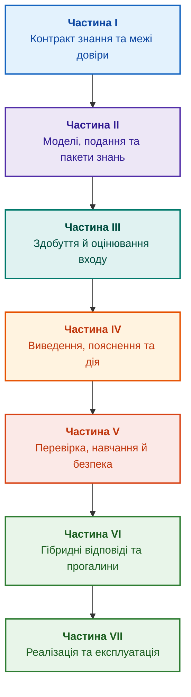

# Архітектура доказових експертних систем: від формальних онтологій до нейро-символьного ШІ

**Електронна книга про проєктування, математичні моделі, архітектуру та верифікацію інтелектуальних систем високого рівня довіри (Safety-Critical & Evidence-Grounded AI)**

**Автор:** [Микола Федчик (Mykola Fedchyk)](about-the-author.md) · [LinkedIn](https://www.linkedin.com/in/nickfedchik/)  
**Формат:** Інженерна монографія / Настільна книга архітектора ШІ  
**Рік:** 2026  

---

## Про книгу

Книга відповідає на запитання: як отримати інженерний висновок, підстави якого можна перевірити? Експертна система застосовує явні факти, правила й обмеження до конкретного випадку та показує джерела, версії, невідомості й межі результату. Мовна модель може допомагати з пошуком і поясненням, але не замінює перевірки підстав або відповідальності людини.

### Від артефакта до перевірюваного рішення

Вимоги, код, тести, звіти й рішення вже існують, але часто не мають узгоджених зв'язків і меж чинності. Знайдений успішний тест може стосуватися іншого випуску; правильна цитата може бути неправильно витлумачена; відкат може повернути відкликане джерело. Ці проблеми трапляються й у звичайній розробці програмного забезпечення, не лише в регульованих галузях.

Шлях книги проходить від моделі знань і походження артефактів до виведення, пояснення, зміни й відкликання знань. [Глава 1](ch01-introduction-to-expert-systems.md) містить мінімальну програмну перевірку на Go з тестами, [глави 7–11](part-02-knowledge-models.md) формують спільний контракт об'єктів і програму наукового випробування, а [Глава 25](ch25-how-expert-systems-learn.md) показує, як нова вимога й відкликання звіту змінюють висновок без стирання історії.

### Для кого й з якими передумовами

Книга призначена для розробників, інженерів знань, архітекторів і фахівців із перевірки. Для практичного входу достатньо розуміти вимогу, тест, версію й просту логічну умову; для запуску Go-прикладу потрібний відповідний компілятор. Графові сховища, локальні мовні моделі й апаратні прискорювачі додають за потреби. Спеціалізовані глави про стандарти безпеки, причинний аналіз і нетрадиційні обчислювачі не є передумовами першої реалізації.

---

## Науковий контекст і місце монографії серед світових досліджень

Монографія розглядає експертні системи не як архаїчний спадок правил 1980-х років (на кшталт систем CLIPS чи MYCIN), а як авангард **доказового нейро-символьного ШІ третьої хвилі (Evidence-Grounded Neuro-Symbolic AI)**. Робота спирається на теоретичний фундамент провідних світових наукових шкіл, водночас долаючи розрив між абстрактними математичними моделями та високопродуктивною системною інженерією:

| Науковий напрям | Ключові світові праці та автори | Концептуальний міст у книзі |
|---|---|---|
| **Нейро-символьний ШІ третьої хвилі (NeSy)** | Artur d'Avila Garcez, Luis C. Lamb (*Neurosymbolic AI: The 3rd Wave*, 2023; *Neural-Symbolic Cognitive Reasoning*, Springer, 2009); Henry Kautz (*The Third AI Summer*, AAAI 2022) | Розподіл обов'язків: статистичні моделі (SLM/LLM) генерують гіпотези запиту, а детерміноване символьне ядро верифікує та затверджує факти ([Глава 29](ch29-neuro-symbolic-architecture.md)). |
| **Семантичні обмеження та безпечне навчання** | Guy Van den Broeck et al. (*A Semantic Loss Function for Deep Learning with Symbolic Knowledge*, ICML 2018); Luc De Raedt et al. (*DeepProbLog*, IJCAI 2020) | Шлюзи вхідного та вихідного контролю, детермінована семантична фільтрація пропозицій нейромережі за формальними схемами ([Глави 28](ch28-dual-mode-expert-systems.md), [33](ch33-inter-system-knowledge-exchange-and-model-teaching.md)). |
| **Спростовні міркування та теорія аргументації** | John L. Pollock (*Defeasible Reasoning*, 1987; *Cognitive Carpentry*, MIT Press, 1995); Phan Minh Dung (*Abstract Argumentation Frameworks*, AIJ 1995); Douglas Walton (*Argumentation Schemes*, Cambridge, 2008) | Розподіл знань на твердження, походження та заперечувальні обставини (*rebutting* та *undercutting defeaters*); розв'язання конфліктів у нормативних базах за рамками аргументації Зунга ([Глави 2](ch02-epistemology-of-machine-knowledge.md), [27](ch27-safety-case-gsn-synthesis.md)). |
| **Автономний майнінг асоціативних правил (KBC)** | Luis Galárraga, Fabian M. Suchanek et al. (*AMIE: Association Rule Mining under Incomplete Evidence*, WWW 2013, VLDBJ 2015); Stephen Muggleton (*Inductive Logic Programming*, 1994) | Автоматичне видобування закономірностей у базах знань за припущенням про часткову повноту (PCA) без хибних контрприкладів відкритого світу ([Глава 34](ch34-deterministic-relational-analysis-abduction-and-socratic-dialogue.md)). |
| **Формальні щити безпеки та сертифікація (Safe AI)** | Bettina Könighofer, Roderick Bloem et al. (*Shield Synthesis*, 2017); Tim Kelly, Rob Weaver (*Goal Structuring Notation*, York, 2004); André Platzer (*Logical Foundations of CPS*, Springer, 2018) | Синтез обґрунтування безпеки за нотацією GSN для стандартів ISO 26262/21434; формальні щити та числові конверти валідності для периферійних приводів ([Глави 27](ch27-safety-case-gsn-synthesis.md), [30](ch30-safety-cybersecurity-co-engineering.md), [33](ch33-inter-system-knowledge-exchange-and-model-teaching.md)). |
| **Епістемічна логіка та семіотика знань** | John F. Sowa (*Knowledge Representation: Logical, Philosophical, and Computational Foundations*, 2000); Frank van Harmelen et al. (*Handbook of Knowledge Representation*, Elsevier, 2008) | Епістемічна тріада Чарльза Сандерса Пірса (Поняття $\to$ Судження $\to$ Висновки); абдуктивне виведення робочих гіпотез під строгим дедуктивним контролем ([Глави 6](ch06-applied-mathematics-for-expert-systems.md), [34](ch34-deterministic-relational-analysis-abduction-and-socratic-dialogue.md)). |
| **Кібернетика та синергетика складних систем** | Norbert Wiener (*Cybernetics*, 1948); W. Ross Ashby (*An Introduction to Cybernetics*, 1956); Hermann Haken (*Synergetics: An Introduction*, 1977; *Advanced Synergetics*, 1983); Ilya Prigogine (*Order out of Chaos*, 1984) | Закон необхідної різноманітності Ешбі, замкнені контури керування L0–L4, редукція фазового простору до параметрів порядку за принципом підпорядкування Хакена, передбачення фазових переходів за критичним уповільненням (*Critical Slowing Down*) та дисипативна стабілізація баз знань ([Глави 6](ch06-applied-mathematics-for-expert-systems.md), [22](ch22-cybernetics-edge-to-backend.md), [35](ch35-self-organizing-expert-systems-synergetics-and-npu-runtime.md)). |
| **Тестування знань, лінгвістична інваріантність та Ліпшицеве калібрування** | Kent Beck (*TDD*, 2002); Martin Fowler (*Refactoring*, 2018); Clark Barrett, Leonardo de Moura (*Z3 SMT Solver*, 2008); Chuan Guo et al. (*On Calibration of Modern Neural Networks*, ICML 2017); Marco Tulio Ribeiro et al. (*CheckList*, ACL 2020); John L. Pollock (*Defeasible Reasoning*, 1987) | Чотирирівнева піраміда тестування знань (Knowledge Testing Pyramid): ізольоване тестування атомів (KUT) з моками передумов (`PremiseMock`), блокування пастки вакуумної істинності, 6-точковий спектральний BVA, решітки правил та дефітери (KIT), метрика семантичної інваріантності ($\text{SIS} \ge 0{,}98$) на лінгвістичних варіаціях запиту, Ліпшицева неперервність ($L_{\mathcal{K}} \le L_{\max}$) проти релейного брязкоту та стигмергічне накопичення прогалин бази знань ([Глава 36](ch36-knowledge-testing-pyramid-and-variational-calibration.md)). |

---

## Авторська практика та інженерні інновації

Книга поєднує авторський досвід, навчальні реалізації, архівні вимірювання та дослідницькі пропозиції. Перелік нижче визначає місце цих матеріалів у книзі, а не повідомляє про незалежну перевірку всіх заявлених властивостей. Умови вимірювань і межі висновків потрібно читати в відповідних главах.

1. **Незмінні бінарні пакети знань з `mmap` та нульовою десеріалізацією ([Глава 32](ch32-high-performance-knowledge-packs-mmap-and-harvesting.md)):**
   * *Авторська знахідка:* Дворівнева архітектура пакетів (канонічний шар першоджерел + похідний матеріалізований шар індексів).
   * *Предмет перевірки:* Відображення незмінного індексу у віртуальний адресний простір процесу через `mmap`, витрати десеріалізації та виділення пам'яті. Архівні вимірювання й відкритий навчальний стенд мають різні умови; відкриття файла не тотожне холодному читанню сторінок.
2. **Тріада заземленої фактуальності та побайтовий шлюз допуску ([Глави 2](ch02-epistemology-of-machine-knowledge.md), [28](ch28-dual-mode-expert-systems.md), [29](ch29-neuro-symbolic-architecture.md)):**
   * *Авторська знахідка:* Інваріант побайтової доказовості (Evidence-Grounded Invariant), де кожен факт зобов'язаний спиратися на незмінні координати `[byte_start, byte_end]` та криптографічний хеш цитати `quote_sha256` у першоджерелі, що верифікується ізольованим хостовим шлюзом.
   * *Межа результату:* Побайтова перевірка встановлює наявність цитати в зареєстрованому джерелі. Істинність джерела, правильність тлумачення й застосовність твердження потребують окремих перевірок; універсальної відсутності галюцинацій цей механізм не доводить.
3. **Емпіричний полігон калібрування на нормативних корпусах W3C-150 та RFC-1000 ([Глави 2](ch02-epistemology-of-machine-knowledge.md), [4](ch04-evolution-from-bayes-to-evidence-ai.md), [14](ch14-requirements-detection-and-formalization.md), [25](ch25-how-expert-systems-learn.md)):**
   * *Авторська знахідка:* Методологія масштабного двоконтурного стрес-тестування на 1000 дійсних стандартах IETF RFC (розподілених за 5 хронологічними епохами розвитку Інтернету) та 150 складних запитах контуру W3C (включно зі зловмисними індукціями галюцинацій).
   * *Практичний результат:* Побудова об'єктивних екзаменаційних матриць знань, виявлення нормативних суперечностей та детермінований захист від регресій бази знань.
4. **Багатоходовий реляційний аналіз, абдукція та сократівський діалог ([Глава 34](ch34-deterministic-relational-analysis-abduction-and-socratic-dialogue.md)):**
   * *Авторська знахідка:* Алгоритм двонаправленого обмеженого пошуку зв'язків (Bidirectional Bounded BFS, $k \le 6$) із захистом від циклів та формуванням композитних побайтових ланцюгів доказів для довільних взаємопов'язаних сутностей.
   * *Інженерна перевага:* Символьне абдуктивне виведення за Ч. С. Пірсом із непорушним правилом епістемічної гігієни (гіпотеза маркується виключно як припущення з явною фіксацією відсутнього засновку). Впровадження типізованих сократівських фреймів уточнення (*Clarification Frames*) для змішаної ініціативи оператора замість сухої відмови за CWA.
5. **Ко-інженерія безпеки та кібербезпеки в нотації GSN ([Глави 27](ch27-safety-case-gsn-synthesis.md), [30](ch30-safety-cybersecurity-co-engineering.md)):**
   * *Авторська знахідка:* Синтез узгоджених дерев аргументів GSN для одночасного задоволення стандартів ISO 26262 (функціональна безпека) та ISO/SAE 21434 (кібербезпека).
   * *Практичний результат:* Формальний арбітраж між часовими бюджетами реагування та глибиною криптографічної перевірки, виявлення застарілих атестацій та селективне розкриття доказів аудиторам через дерева Меркла з сіллю.
6. **Нормативні оракули, формальні щити та захищений зворотний зв'язок ([Глава 33](ch33-inter-system-knowledge-exchange-and-model-teaching.md), [Додатки Б](appendix-b-robotics-and-cyber-physical-systems.md), [В](appendix-c-autonomous-navigation-and-geosearch.md), [Д](appendix-e-mixed-signal-neuromorphic-expert-systems.md)):**
   * *Авторська знахідка:* Переклад дискретних логічних інваріантів у неперервні числові конверти валідності для цифрових сигнальних процесорів (DSP) та систем комп'ютерного зору автономних апаратів.
   * *Предмет перевірки:* Цілісність підписаного обміну, доступ, карантин і збирання контрприкладів. Підпис Ed25519 підтверджує автора й цілісність повідомлення за довіреного ключа, але не істинність переданого знання.
7. **Реактивне виконання та гіпотези самоорганізації ([Глава 35](ch35-self-organizing-expert-systems-synergetics-and-npu-runtime.md)):**
   * *Авторська пропозиція:* Незмінний базовий шар, динамічний граф, підтримання підстав висновку та карантин кандидатів. Синергетичний опис еволюції онтологій є окремою дослідницькою гіпотезою.
   * *Предмет перевірки:* Наскрізна затримка, енергія, відкликання висновку й альтернативні підстави на конкретному обладнанні. Приклад реакції на подію не встановлює універсальних часових або енергетичних гарантій.
8. **Синергетична редукція розмірності простору та передбіфуркаційна діагностика CSD ([Глави 6](ch06-applied-mathematics-for-expert-systems.md), [22](ch22-cybernetics-edge-to-backend.md), [35](ch35-self-organizing-expert-systems-synergetics-and-npu-runtime.md)):**
   * *Авторська знахідка:* Інтеграція синергетичного апарату параметрів порядку Хакена та передбіфуркаційного детектора критичного уповільнення (*Critical Slowing Down*) з детермінованими правилами логічного виведення.
   * *Дослідницьке питання:* Чи покращують параметри порядку та індикатори критичного уповільнення прогноз у визначеній фізичній моделі? Зміна автокореляції чи дисперсії є сигналом для перевірки, не загальним доказом майбутньої аварії.
9. **Піраміда тестування знань: модульне тестування (KUT), варіативне калібрування (SIS) та Ліпшицева стійкість ([Глава 36](ch36-knowledge-testing-pyramid-and-variational-calibration.md)):**
   * *Авторська знахідка:* Чотирирівнева піраміда тестування знань (Knowledge Testing Pyramid, KTP), концепція Knowledge Unit Testing (KUT) для ізольованої атестації окремих правил з мокуванням передумов (`PremiseMock`), непорушний інваріант блокування вакуумної істинності ($P \to Q$ при $P \equiv \text{False}$), 6-точковий аналіз граничних значень (BVA), метрика семантичної інваріантності ($\text{SIS} \ge 0{,}98$) на многовиді лінгвістичних перефразувань запиту та критерій Ліпшицевої неперервності логічного простору ($L_{\mathcal{K}} \le L_{\max}$).
   * *Межа результату:* Приклади перевіряють локальні правила, їхню композицію та обрані варіації входу. Метрика на тестовому наборі не доводить стійкості для всіх формулювань або безпеки фізичного регулятора; черга прогалин готує матеріал для інженерного перегляду.
10. **Активний доменний експерт-тестувальник та попперівська фальсифікація гіпотез ([Глава 39](ch39-active-compliance-auditor-and-popperian-testing.md)):**
    * *Авторська знахідка:* Концептуальний перехід від пасивного оракула (відповідає лише на запитання) до активного аудитора знань, який самостійно ставить запитання по предметній області, вимагає тести за стандартами комплаєнсу (ASPICE 4.0, ISO 26262, ISO/SAE 21434) та автономно проєктує підтверджену першоджерелами програму випробувань продукту. Поєднання творчої генерації крайових сценаріїв нейромережею (System 1) та детермінованої фальсифікації деонтичних порушень символьним ядром (System 2, $ZHR = 1.00$).
    * *Практична цінність:* Звільнення інженерів з якості від рутинного аудиту тисяч пунктів специфікацій, повне закриття комплаєнс-прогалин та збереження людини в контурі (Human-in-the-Loop) для технічної творчості.

---

## Принцип групування

Частини книги визначаються основною інженерною задачею, а не роком додавання глави або назвою технології. Кожна глава має одну основну частину; суміжні методи пояснюють спосіб розв'язання її головного питання. Номери глав і назви файлів залишаються сталими ідентифікаторами, тому тематичний порядок читання може відрізнятися від числового.

Назви розділів усередині глав утворюють кілька різних класів. Їх потрібно читати як послідовність аргументу, а не як перелік рівнозначних технологій:

| Клас розділу | Питання читача | Функція у главі |
|---|---|---|
| Проблема й межа задачі | Що саме потрібно вирішити? | Визначити головне питання та область застосування |
| Об'єкт і модель | Які дані, знання або стани розглядаються? | Узгодити поняття, типи й припущення |
| Метод і процедура | Як отримати результат? | Пояснити виведення, перетворення або керування |
| Реалізація й інструмент | Чим виконати процедуру? | Показати програмне чи апаратне втілення методу |
| Перевірка й контрольний випадок | Як виявити помилку? | Зіставити результат із незалежним критерієм |
| Висновок і межі результату | Що встановлено, а що лишилося відкритим? | Відповісти на головне питання без розширення обіцянок |

Країна, галузь або комерційний продукт є контекстом застосування, не окремим рівнем цієї таксономії. Словник, абревіатури, джерела й навігація становлять довідковий апарат, а не самостійні теми глави.

Повна [редакторська карта](editorial-structure-review.md) містить оцінку головної теми кожної глави, межі між суміжними викладами та зауваження до композиції й висновків. Нова анотація не означає, що всі змістові ризики всередині глав уже усунено.

## Маршрути читання

**Перша програмна перевірка:** [1](ch01-introduction-to-expert-systems.md) → [7](ch07-knowledge-base-typology.md) → [8](ch08-engineering-artifacts-as-data.md) → [17](ch17-implementation-stack.md) → [23](ch23-knowledge-base-verification.md) → [25](ch25-how-expert-systems-learn.md). Мета: відтворюваний вердикт із підставами, негативними тестами й керованою зміною знань. Мовна модель не є обов'язковою.

**Інженерія знань:** [Частина II](part-02-knowledge-models.md) → [Частина III](part-03-knowledge-engineering-nlp.md) → [19](ch19-from-question-to-evidence.md) → [20](ch20-explanation-engine.md) → [26](ch26-continual-learning.md). Мета: узгодити семантику, походження, отримання знань і перевірку нових кандидатів. У Частині II збережено міжчастинну програму наукового випробування глав 7–11.

**Архітектура рішення:** [16](ch16-expert-systems-architecture.md) → [19](ch19-from-question-to-evidence.md) → [31](ch31-syllogistic-reasoning-and-relation-lattices.md) → [20](ch20-explanation-engine.md) → [21](ch21-from-recommendation-to-action.md). Мета: відокремити перевірку підстав, застосування норми, пояснення й повноваження на дію.

**Перевірка й безпека:** [23](ch23-knowledge-base-verification.md) → [36](ch36-knowledge-testing-pyramid-and-variational-calibration.md) → [25](ch25-how-expert-systems-learn.md) → [26](ch26-continual-learning.md) → [27](ch27-safety-case-gsn-synthesis.md) → [30](ch30-safety-cybersecurity-co-engineering.md). Діагностика зовнішнього об'єкта має окремий вхід через [главу 24](ch24-system-diagnosis.md).

**Гібридні відповіді й експлуатація:** [Частина VI](part-06-frontiers-neuro-symbolic.md) → [Частина VII](part-07-runtime-and-knowledge-exchange.md) та потрібні додатки. Мета: інтегрувати мовну модель, керувати прогалинами, перевірити розгортання та міжсистемний обмін. Глави [2](ch02-epistemology-of-machine-knowledge.md), [4](ch04-evolution-from-bayes-to-evidence-ai.md) і [6](ch06-applied-mathematics-for-expert-systems.md) можна читати за питанням як контракт, історію й математичний довідник.

---

## Межі обіцянок

Книга є навчальним і дослідницьким матеріалом, не сертифікованою процедурою й не доказом відповідності виробу стандарту. Детерміноване виконання не доводить правильності фактів; хеш і підпис не доводять істинності; граф аргументів не замінює оцінки фахівця. Вимоги до надійності цілого виробу не слід ототожнювати з частотою помилок мовної моделі або приписувати всім програмним компонентам.

Автоматичний розбір зменшує ручне перенесення даних, але не скасовує моделювання, рецензування й власників знань. Protégé, ручний перегляд і автоматичне збирання можуть працювати разом. Математичні гарантії стосуються конкретного профілю мови та припущень; виміряна швидкість стосується заданого запиту, корпусу й середовища. Архівні числа автора відокремлено від відкритих навчальних стендів і ще не виконаних досліджень.

Рішення про випуск, прийняття ризику й відповідність галузевим вимогам залишаються за уповноваженими людьми. Експертна система готує перевірюваний матеріал і виконує погоджену політику, але не набуває регуляторних повноважень.

---

## Структура книги

Книга складається із семи тематичних частин, 38 глав і п'яти додатків. Кожна глава має одну основну частину. Попередня й наступна глава в навігації відповідають тематичному порядку нижче; номери глав і назви файлів збережено.

---

### [Частина I. Концептуальний та епістемічний фундамент](part-01-foundations.md)

*Коли потрібна експертна система, що вважати знанням і як зберегти підстави організаційного рішення.*

* [Глава 1. Вступ до експертних систем: від хаосу до керованих знань](ch01-introduction-to-expert-systems.md)
* [Глава 2. Філософія для інженера: що машина має право називати знанням](ch02-epistemology-of-machine-knowledge.md)
* [Глава 3. Чим експертна система відрізняється від інформаційно-довідкової системи](ch03-beyond-reference-information-systems.md)
* [Глава 4. Еволюція експертних систем: від теореми Байєса до доказових рішень ШІ](ch04-evolution-from-bayes-to-evidence-ai.md)
* [Глава 5. Тріада довіри: експертна система, доказова рекомендація та корпоративна пам'ять](ch05-triad-of-trust-and-corporate-memory.md)

---

### [Частина II. Математичні моделі, подання та зберігання знань](part-02-knowledge-models.md)

*Вибір математичної операції й подання, типізовані артефакти, граф простежуваності та незмінний пакет знань.*

* [Глава 6. Прикладна математика експертних систем: правила, ймовірності, графи та причинність](ch06-applied-mathematics-for-expert-systems.md)
* [Глава 7. Типологія баз знань: правила, онтології, прецеденти та вектори](ch07-knowledge-base-typology.md)
* [Глава 8. Інженерні артефакти як дані експертної системи](ch08-engineering-artifacts-as-data.md)
* [Глава 9. Інженерний граф знань: простежуваність від вимог до апаратури](ch09-engineering-knowledge-graph-traceability.md)
* [Глава 32. Незмінні пакети знань: побайтовий допуск, індекси та відображення в пам'ять](ch32-high-performance-knowledge-packs-mmap-and-harvesting.md)

---

### [Частина III. Здобуття знань, мовний аналіз та оцінювання входу](part-03-knowledge-engineering-nlp.md)

*Документи, досвід фахівців і спостереження: отримання кандидатів, мовний аналіз, формалізація та оцінювання свідчень.*

* [Глава 10. Системи здобуття знань: джерела, допуск і життєвий цикл](ch10-knowledge-acquisition-systems.md)
* [Глава 11. Вилучення знань у експертів: інтерв'ювання, когнітивні карти та формалізація досвіду](ch11-knowledge-elicitation-from-experts.md)
* [Глава 12. Лінгвістичний аналіз і локальні моделі: збереження змісту та джерела](ch12-linguistic-analysis-and-local-models.md)
* [Глава 13. Варіативність природної мови проти детермінізму: компіляція сенсу запитання](ch13-language-variability-vs-determinism.md)
* [Глава 14. Виявлення вимог і модальностей: від нормативного тексту до інваріантів](ch14-requirements-detection-and-formalization.md)
* [Глава 15. Вилучення знань і побудова бази знань: факти, граматики та автомати](ch15-knowledge-extraction-and-kb-construction.md)
* [Глава 37. Оцінювання вхідної інформації: джерела, свідчення та невизначеність](ch37-input-information-assessment-and-algorithmic-skepticism.md)

---

### [Частина IV. Архітектура, виведення, пояснення та дія](part-04-architecture-and-inference.md)

*Архітектурні контракти, перевірка твердження, застосування норм, пояснення та окремий допуск дії.*

* [Глава 16. Архітектура експертної системи: від формального знання до доказового рішення](ch16-expert-systems-architecture.md)
* [Глава 19. Від запитання до доказу: пошук, прив'язка та перевірка твердження](ch19-from-question-to-evidence.md)
* [Глава 31. Виведення за нормами: ієрархії предикатів, винятки та чинність](ch31-syllogistic-reasoning-and-relation-lattices.md)
* [Глава 20. Рушій пояснень: рішення, відмова та межі компетентності](ch20-explanation-engine.md)
* [Глава 21. Від рекомендації до дії: контроль повноважень і безпечне виконання у виробничому середовищі](ch21-from-recommendation-to-action.md)

---

### [Частина V. Верифікація, діагностика, навчання та обґрунтування безпеки](part-05-verification-and-learning.md)

*Перевірка правил, діагностика, керовані зміни, досвід експлуатації та аргументи функціональної безпеки й кібербезпеки.*

* [Глава 23. Верифікація бази знань: як перевірити несуперечливість, повноту та надійність правил](ch23-knowledge-base-verification.md)
* [Глава 36. Піраміда тестування знань: правила, взаємодії та стійкість відповідей](ch36-knowledge-testing-pyramid-and-variational-calibration.md)
* [Глава 24. Технічна діагностика: як не сплутати симптом із першопричиною в умовах неповноти](ch24-system-diagnosis.md)
* [Глава 25. Як навчати експертну систему: екзаменаційні матриці, аудит знань та контроль регресій](ch25-how-expert-systems-learn.md)
* [Глава 26. Неперервне навчання (Continual Learning) на досвіді та подолання зсуву системного журналу](ch26-continual-learning.md)
* [Глава 27. Обґрунтування безпеки: синтез і перевірка аргументів](ch27-safety-case-gsn-synthesis.md)
* [Глава 30. Спільне проєктування функціональної безпеки та кібербезпеки](ch30-safety-cybersecurity-co-engineering.md)

---

### [Частина VI. Нейро-символьні відповіді, гіпотези та прогалини знань](part-06-frontiers-neuro-symbolic.md)

*Строгий висновок і дорадча гіпотеза, інтеграція мовної моделі, прогалини та контроль непідтвердженої відповіді.*

* [Глава 28. Дворежимні експертні системи: строгий висновок і дорадча гіпотеза](ch28-dual-mode-expert-systems.md)
* [Глава 29. Нейро-символьна архітектура: мовні моделі та перевірка доказових підстав](ch29-neuro-symbolic-architecture.md)
* [Глава 34. Прогалини знань: реляційний пошук, абдукція та діалог уточнення](ch34-deterministic-relational-analysis-abduction-and-socratic-dialogue.md)
* [Глава 38. Машинні галюцинації та дефіцит знань: доказовий контроль відповідей](ch38-curing-machine-hallucinations-and-knowledge-deficits.md)
* [Глава 39. Активний експерт-тестувальник: попперівська фальсифікація, нормативний комплаєнс (ASPICE/ISO 26262/ISO 21434) та автономне проєктування випробувань](ch39-active-compliance-auditor-and-popperian-testing.md)

---

### [Частина VII. Реалізація, розгортання та обмін знаннями](part-07-runtime-and-knowledge-exchange.md)

*Вибір засобів, розгортання, реактивне виконання та контрольований обмін знаннями.*

* [Глава 17. Технологічний стек: критерії вибору інструментів, мов програмування та рушіїв правил](ch17-implementation-stack.md)
* [Глава 18. Інфраструктура виконання: локальні моделі, апаратні прискорювачі, Edge та On-Premise](ch18-execution-infrastructure.md)
* [Глава 22. Кібернетичний цикл керування: сенсори, периферія та зворотний зв'язок](ch22-cybernetics-edge-to-backend.md)
* [Глава 35. Реактивна експертна система: події, відкликання й адаптація знань](ch35-self-organizing-expert-systems-synergetics-and-npu-runtime.md)
* [Глава 33. Міжсистемний обмін знаннями: постачання правил стороннім системам, навчання моделей і захищений зворотний зв'язок](ch33-inter-system-knowledge-exchange-and-model-teaching.md)

---

### Додатки

* [Додаток А. Практичний фреймворк доказового дослідження в складних інженерних проєктах](appendix-a-evidence-governed-framework.md)
* [Додаток Б. Доказові експертні системи в автономній робототехніці та кіберфізичних комплексах](appendix-b-robotics-and-cyber-physical-systems.md)
* [Додаток В. Автономна навігація без GNSS: геопросторове зіставлення (TRN/DSMAC), візуальна одометрія (VIO) та експертний арбітраж сенсорного злиття](appendix-c-autonomous-navigation-and-geosearch.md)
* [Додаток Г. Аналогові експертні системи, нейроморфні обчислення та апаратне логічне виведення](appendix-d-analog-expert-systems-and-neuromorphic-computing.md)
* [Додаток Д. Змішані аналого-цифрові експертні системи: нейроморфні, аналогові та інші нетрадиційні обчислювачі під доказовим контролем](appendix-e-mixed-signal-neuromorphic-expert-systems.md)
* [Про автора: Микола Федчик (Nick Fedchik)](about-the-author.md)

---

## Дослідницькі напрями

Напрями подальшої роботи не є готовими гарантіями: відтворюване збирання пакетів знань; перевірка обмеженого формального подання; керування агентами через явні повноваження; конфіденційна перевірка конкретного формалізованого твердження; контрольоване відкликання й дослідження машинного розучування. Доведення властивості моделі не підтверджує автоматично відповідності фізичного виробу, а видалення правила не тотожне видаленню впливу даних із навченої моделі.

Для апаратних прискорювачів і нетрадиційних обчислювачів спочатку вимірюють похибку, затримку, енергію та поведінку за відмов. Відповідні питання розглядають [Глава 29](ch29-neuro-symbolic-architecture.md), [Глава 32](ch32-high-performance-knowledge-packs-mmap-and-harvesting.md) та [додатки Г](appendix-d-analog-expert-systems-and-neuromorphic-computing.md) і [Д](appendix-e-mixed-signal-neuromorphic-expert-systems.md). Практична дослідницька програма для глав 7–11 наведена в [Частині II](part-02-knowledge-models.md): кожна пропозиція має гіпотезу, контрольне порівняння й умову спростування.
