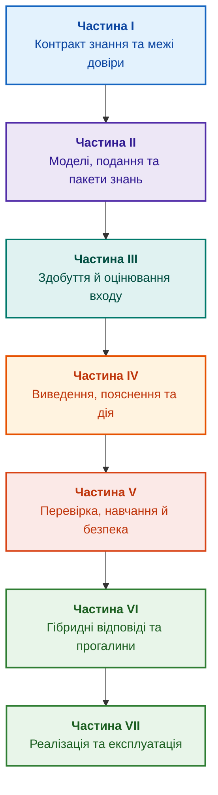

# Архітектура доказових експертних систем: від формальних онтологій до нейро-символьного ШІ

**Електронна книга про проєктування, математичні моделі, архітектуру та верифікацію інтелектуальних систем високого рівня довіри (Safety-Critical & Evidence-Grounded AI)**

**Автор:** [Микола Федчик (Mykola Fedchyk)](about-the-author.md) · [LinkedIn](https://www.linkedin.com/in/nickfedchik/)  
**Формат:** Інженерна монографія / Настільна книга архітектора ШІ  
**Рік:** 2026  

---

## Про книгу

Книга є фундаментальним монографічним дослідженням та інженерним керівництвом, присвяченим подоланню ключової кризи сучасного штучного інтелекту — епістемічного розриву між ймовірнісною правдоподібністю нейромережевих генерацій та детермінованою істинністю формальних доведень. У центрі дослідження стоїть питання: **як спроєктувати експертну систему, кожен висновок якої є неспростовним, повністю простежуваним до першоджерел та придатним для сертифікації у критичних інженерних доменах (ISO 26262, IEC 61508, DO-178C, ISO/SAE 21434)?**

Автором обґрунтовано нову парадигму **доказового нейро-символьного ШІ (Evidence-Grounded Neuro-Symbolic AI)**, де статистичні моделі (LLM/SLM) виконують дорадчу функцію генерації гіпотез та проєкційного рендерингу, а детерміноване символьне ядро непорушно гарантує інваріанти логічної несуперечливості, побайтового заземлення фактів, контролю повноважень та безпечного переходу до дії.

### Від артефакта до перевірюваного рішення

Вимоги, вихідний код, протоколи випробувань, нормативні стандарти та інженерні рішення вже існують у виробничому середовищі, проте здебільшого функціонують як розрізнені артефакти без формалізованої семантики, строгих меж чинності та взаємної простежуваності. Успішний звіт про випробування може стосуватися застарілої ревізії вузла; цитата зі стандарту може бути вирвана з контексту; аварійний відкат конфігурації може несанкціоновано активувати відкликаний компонент.

Монографія пропонує наскрізний інженерний тракт: від формалізації інженерних артефактів як даних і криптографічно підписаних пакетів знань — до символьного виведення, покрокової декомпозиції планів, контрфактичних пояснень та аудиту меж компетентності. Практичний виклад супроводжується робочими реалізаціями мовою Go з повними тестовими наборами ([Глава 1](ch01-introduction-to-expert-systems.md)), строгими математичними контрактами ([Частина II](part-02-knowledge-models.md)) та протоколами безперервного навчання без регресій ([Глава 25](ch25-how-expert-systems-learn.md)).

### Для кого призначена монографія

Видання орієнтоване на системних архітекторів, провідних інженерів з надійності та функціональної безпеки, розробників рушіїв логічного виведення та інженерів знань. Для первинного опанування концепцій достатньо базового розуміння предикатної логіки, версіонування та життєвого циклу ПЗ; для розгортання прикладів необхідний стандартний інструментарій Go. Спеціалізовані глави, присвячені формальному синтезу обґрунтувань безпеки (GSN), синергетиці складних систем, нейроморфним прискорювачам та автономній навігації без GNSS, розкривають передові рубежі застосування доказового ШІ у високотехнологічних галузях (аерокосмічна індустрія, автономний транспорт, енергетика).

---

## Науковий контекст і місце монографії серед світових досліджень

Монографія розглядає експертні системи не як архаїчний спадок правил 1980-х років (на кшталт систем CLIPS чи MYCIN), а як авангард **доказового нейро-символьного ШІ третьої хвилі (Evidence-Grounded Neuro-Symbolic AI)**. Робота спирається на теоретичний фундамент провідних світових наукових шкіл, водночас долаючи розрив між абстрактними математичними моделями та високопродуктивною системною інженерією:

| Науковий напрям | Ключові світові праці та автори | Концептуальний міст у книзі |
|---|---|---|
| **Нейро-символьний ШІ третьої хвилі (NeSy)** | Artur d'Avila Garcez, Luis C. Lamb (*Neurosymbolic AI: The 3rd Wave*, 2023; *Neural-Symbolic Cognitive Reasoning*, Springer, 2009); Henry Kautz (*The Third AI Summer*, AAAI 2022) | Розподіл обов'язків: статистичні моделі (SLM/LLM) генерують гіпотези запиту, а детерміноване символьне ядро верифікує та затверджує факти ([Глава 29](ch29-neuro-symbolic-architecture.md)). |
| **Семантичні обмеження та безпечне навчання** | Guy Van den Broeck et al. (*A Semantic Loss Function for Deep Learning with Symbolic Knowledge*, ICML 2018); Luc De Raedt et al. (*DeepProbLog*, IJCAI 2020) | Шлюзи вхідного та вихідного контролю, детермінована семантична фільтрація пропозицій нейромережі за формальними схемами ([Глави 28](ch28-dual-mode-expert-systems.md), [33](ch33-inter-system-knowledge-exchange-and-model-teaching.md)). |
| **Спростовні міркування та теорія аргументації** | John L. Pollock (*Defeasible Reasoning*, 1987; *Cognitive Carpentry*, MIT Press, 1995); Phan Minh Dung (*Abstract Argumentation Frameworks*, AIJ 1995); Douglas Walton (*Argumentation Schemes*, Cambridge, 2008) | Розподіл знань на твердження, походження та заперечувальні обставини (*rebutting* та *undercutting defeaters*); розв'язання конфліктів у нормативних базах за рамками аргументації Зунга ([Глави 2](ch02-epistemology-of-machine-knowledge.md), [27](ch27-safety-case-gsn-synthesis.md)). |
| **Автономний майнінг асоціативних правил (KBC)** | Luis Galárraga, Fabian M. Suchanek et al. (*AMIE: Association Rule Mining under Incomplete Evidence*, WWW 2013, VLDBJ 2015); Stephen Muggleton (*Inductive Logic Programming*, 1994) | Автоматичне видобування закономірностей у базах знань за припущенням про часткову повноту (PCA) без хибних контрприкладів відкритого світу ([Глава 34](ch34-deterministic-relational-analysis-abduction-and-socratic-dialogue.md)). |
| **Формальні щити безпеки та сертифікація (Safe AI)** | Bettina Könighofer, Roderick Bloem et al. (*Shield Synthesis*, 2017); Tim Kelly, Rob Weaver (*Goal Structuring Notation*, York, 2004); André Platzer (*Logical Foundations of CPS*, Springer, 2018) | Синтез обґрунтування безпеки за нотацією GSN для стандартів ISO 26262/21434; формальні щити та числові конверти валідності для периферійних приводів ([Глави 27](ch27-safety-case-gsn-synthesis.md), [30](ch30-safety-cybersecurity-co-engineering.md), [33](ch33-inter-system-knowledge-exchange-and-model-teaching.md)). |
| **Епістемічна логіка та семіотика знань** | John F. Sowa (*Knowledge Representation: Logical, Philosophical, and Computational Foundations*, 2000); Frank van Harmelen et al. (*Handbook of Knowledge Representation*, Elsevier, 2008) | Епістемічна тріада Чарльза Сандерса Пірса (Поняття $\to$ Судження $\to$ Висновки); абдуктивне виведення робочих гіпотез під строгим дедуктивним контролем ([Глави 6](ch06-applied-mathematics-for-expert-systems.md), [34](ch34-deterministic-relational-analysis-abduction-and-socratic-dialogue.md)). |
| **Кібернетика та синергетика складних систем** | Norbert Wiener (*Cybernetics*, 1948); W. Ross Ashby (*An Introduction to Cybernetics*, 1956); Hermann Haken (*Synergetics: An Introduction*, 1977; *Advanced Synergetics*, 1983); Ilya Prigogine (*Order out of Chaos*, 1984) | Закон необхідної різноманітності Ешбі, замкнені цикли керування L0–L4, редукція фазового простору до параметрів порядку за принципом підпорядкування Хакена, передбачення фазових переходів за критичним уповільненням (*Critical Slowing Down*) та дисипативна стабілізація баз знань ([Глави 6](ch06-applied-mathematics-for-expert-systems.md), [22](ch22-cybernetics-edge-to-backend.md), [35](ch35-self-organizing-expert-systems-synergetics-and-npu-runtime.md)). |
| **Тестування знань, лінгвістична інваріантність та Ліпшицеве калібрування** | Kent Beck (*TDD*, 2002); Martin Fowler (*Refactoring*, 2018); Clark Barrett, Leonardo de Moura (*Z3 SMT Solver*, 2008); Chuan Guo et al. (*On Calibration of Modern Neural Networks*, ICML 2017); Marco Tulio Ribeiro et al. (*CheckList*, ACL 2020); John L. Pollock (*Defeasible Reasoning*, 1987) | Чотирирівнева піраміда тестування знань (Knowledge Testing Pyramid): ізольоване тестування атомів (KUT) з моками передумов (`PremiseMock`), блокування пастки вакуумної істинності, 6-точковий спектральний BVA, решітки правил та дефітери (KIT), метрика семантичної інваріантності ($\text{SIS} \ge 0{,}98$) на лінгвістичних варіаціях запиту, Ліпшицева неперервність ($L_{\mathcal{K}} \le L_{\max}$) проти релейного брязкоту та стигмергічне накопичення прогалин бази знань ([Глава 36](ch36-knowledge-testing-pyramid-and-variational-calibration.md)). |

---

## Авторські теоретичні моделі, наукові дослідження та інженерні інновації

Монографія акумулює фундаментальний дослідницький та інженерний доробок автора в галузі проєктування систем підвищеної надійності, вбудованих архітектур та доказового ШІ. На відміну від суто оглядових праць, у книзі розроблено низку оригінальних формальних теорій, протоколів та системних рішень, що вперше переводять нейро-символьні взаємодії на математично верифікований рівень довіри:

### 1. Фундаментальні теоретичні розробки та математичні формалізми

1. **Інваріант побайтової доказовості (Evidence-Grounded Invariant, EGI) та шлюз заземлення фактів ([Глави 2](ch02-epistemology-of-machine-knowledge.md), [19](ch19-from-question-to-evidence.md), [28](ch28-dual-mode-expert-systems.md), [29](ch29-neuro-symbolic-architecture.md)):**
   * *Теоретична концепція:* Автором сформульовано та математично формалізовано інваріант повноти заземлення $\mathrm{Comp}(C) = 1{,}00$, який стверджує, що в доказовій системі жодне твердження не може набути статусу факту без детермінованої проєкції на першоджерела знань. Кожен елемент бази фактів забезпечується криптографічним кортежем: незмінними координатами `[byte_start, byte_end]`, хешем канонічного фрагмента `quote_sha256` та ідентифікатором сертифіката походження PROV-O.
   * *Інженерне значення:* Механізм побайтового контрольно-пропускного шлюзу на апаратно-програмному рівні унеможливлює проникнення галюцинацій нейромережі у версіовану базу знань, забезпечуючи нульову терпимість до непідтверджених даних ($ZHR = 1{,}00$).
2. **Чотирирівнева піраміда тестування знань (KTP) та Ліпшицева стійкість логічного простору ([Глава 36](ch36-knowledge-testing-pyramid-and-variational-calibration.md)):**
   * *Теоретична концепція:* Автором уперше запропоновано системну піраміду тестування знань (Knowledge Testing Pyramid, KTP), аналогічну піраміді тестування ПЗ Мартіна Фаулера: модульне тестування окремих правил (KUT) з ізоляцією передумов (`PremiseMock`), інтеграційне тестування взаємодії правил (KIT) та варіаційне калібрування на многовиді формулювань (KVT).
   * *Математичний апарат:* Введено непорушний інваріант блокування вакуумної істинності ($P \to Q$ при $P \equiv \text{False}$), метрику семантичної інваріантності ($\mathrm{SIS} \ge 0{,}98$) на лінгвістичних варіаціях запиту та критерій Ліпшицевої неперервності логічного простору ($L_{\mathcal{K}} \le L_{\max}$), що математично виключає катастрофічний релейний брязкіт висновків при незначних флуктуаціях входу.
3. **Теорія попперівської фальсифікації деонтичних норм та активний аудитор комплаєнсу ([Глава 39](ch39-active-compliance-auditor-and-popperian-testing.md)):**
   * *Теоретична концепція:* Здійснено перехід від класичної моделі «пасивного оракула» (який лише відповідає на запитання) до парадигми активного аудитора знань, що реалізує принцип фальсифікації Карла Поппера. Система самостійно здійснює рефлексивне зондування простору вимог (ASPICE 4.0, ISO 26262, ISO/SAE 21434), синтезує контрприклади, виявляє неповні специфікації та автономно проєктує вичерпну програму випробувань продукту.
   * *Практична цінність:* Поєднання креативної генерації крайових сценаріїв нейромережею (System 1) та детермінованої деонтичної верифікації символьним ядром (System 2) з гарантованим захистом людини в циклі керування (Human-in-the-Loop) від когнітивної втоми від погоджень.
4. **Синергетична редукція розмірності бази знань та передбіфуркаційна діагностика CSD ([Глави 6](ch06-applied-mathematics-for-expert-systems.md), [22](ch22-cybernetics-edge-to-backend.md), [35](ch35-self-organizing-expert-systems-synergetics-and-npu-runtime.md)):**
   * *Теоретична концепція:* Застосування математичного апарату синергетики Германа Хакена (параметри порядку та принцип підпорядкування) та теорії дисипативних структур Іллі Пригожина до еволюції складних баз знань.
   * *Науковий результат:* Розроблено метод редукції багатовимірного фазового простору телеметрії до параметрів порядку та інтегровано передбіфуркаційний детектор критичного уповільнення (*Critical Slowing Down*, CSD) на основі автокореляції та дисперсії, що дозволяє виявляти наближення кіберфізичної системи до динамічного зриву задовго до спрацювання аварійних порогових датчиків.
5. **Модель рівнів автономності дії (A0–A4), контрольно-пропускний шлюз та ідемпотентні саги ([Глава 21](ch21-from-recommendation-to-action.md)):**
   * *Теоретична концепція:* Автором сформульовано дискретну шкалу повноважень системної дії (A0 — пасивний аналіз, A1 — підготовка чернетки, A2 — дія за підписом людини, A3 — контрольована автономія, A4 — аварійне захисне відсікання), що призначається не системі в цілому, а кортежу «дія, середовище, рівень ризику».
   * *Математичний апарат:* Введено алгебраїчний інваріант ідемпотентності $f(f(x, k), k) \equiv f(x, k)$ на основі криптографічного ключа $k$, покрокове замкнене виконання (closed-loop execution) та протокол розподілених компенсаційних саг зі станом `OutcomeUnknown` і незалежною верифікацією післяумов.
6. **Формальна ко-інженерія функціональної безпеки та кібербезпеки в нотації GSN ([Глави 27](ch27-safety-case-gsn-synthesis.md), [30](ch30-safety-cybersecurity-co-engineering.md)):**
   * *Теоретична концепція:* Розроблено модель узгодженого синтезу дерев аргументації GSN (Goal Structuring Notation) для одночасного вирішення вимог стандартів ISO 26262 (функціональна безпека) та ISO/SAE 21434 (кібербезпека).
   * *Інженерний прорив:* Формалізація математичного арбітражу між суперечливими цілями (часовий бюджет аварійного реагування проти глибини криптографічної атестації) та протокол селективного розкриття доказів зовнішнім аудиторам через дерева Меркла з додаванням солі.
7. **Протокол верифікації вірності та семантичної консистентності пояснень ([Глава 20](ch20-explanation-engine.md)):**
   * *Теоретична концепція:* Пояснення розглядається не як вільний текст генеративної моделі, а як самостійний детермінований артефакт, що однозначно виводиться з графа доведення, версії правил та зафіксованого зрізу фактів.
   * *Математичний апарат:* Формалізовано метричний шлюз оцінки вірності ($C_{\text{facts}} = 1{,}00, H_{\text{free}} = 1{,}00$) з автоматичним fail-safe відкатом до жорсткого шаблону при найменшій розбіжності між символьним висновком і вербалізацією для оператора.

---

### 2. Емпіричні дослідження, авторські експериментальні стенди та системна інженерія

1. **Незмінні бінарні пакети знань з `mmap` та нульовою десеріалізацією ([Глава 32](ch32-high-performance-knowledge-packs-mmap-and-harvesting.md)):**
   * *Авторська знахідка:* Дворівнева архітектура пакетів (канонічний шар першоджерел + похідний матеріалізований шар індексів).
   * *Емпіричний результат:* Пряме відображення індексу у віртуальний адресний простір через системний виклик `mmap`, усунення накладних витрат на виділення динамічної пам'яті (zero-allocation) та старт рушія за сублінійний час незалежно від гігабайтного обсягу онтології.
2. **Емпіричний полігон калібрування на нормативних корпусах IETF RFC-1000 та W3C-150 ([Глави 2](ch02-epistemology-of-machine-knowledge.md), [4](ch04-evolution-from-bayes-to-evidence-ai.md), [14](ch14-requirements-detection-and-formalization.md), [25](ch25-how-expert-systems-learn.md)):**
   * *Авторський експеримент:* Розгортання масштабного дослідницького стенду на 1000 дійсних специфікаціях IETF RFC (розподілених за 5 хронологічними епохами розвитку Інтернету) та 150 складних діагностичних запитах корпусу W3C (включно зі штучною індукцією логічних суперечностей та конфабуляцій).
   * *Практичний результат:* Побудова об'єктивних екзаменаційних матриць знань, виявлення нормативних суперечностей та математично доведений захист від регресій бази знань під час її оновлення.
3. **Багатоходовий реляційний аналіз, символьна абдукція та сократівський діалог ([Глава 34](ch34-deterministic-relational-analysis-abduction-and-socratic-dialogue.md)):**
   * *Авторська розробка:* Алгоритм двонаправленого обмеженого пошуку зв'язків (Bidirectional Bounded BFS, $k \le 6$) із захистом від циклів та формуванням композитних побайтових ланцюгів доказів для довільних взаємопов'язаних сутностей.
   * *Інженерна перевага:* Реалізація символьної абдукції Пірса під суворим дедуктивним контролем та типізовані сократівські фрейми уточнення (*Clarification Frames*), які переводять систему в режим продуктивного діалогу з людиною замість сліпої відмови за припущенням про замкненість світу (CWA).
4. **Формальні щити та числові конверти валідності для периферійних систем керування ([Глава 33](ch33-inter-system-knowledge-exchange-and-model-teaching.md), [Додатки Б](appendix-b-robotics-and-cyber-physical-systems.md), [В](appendix-c-autonomous-navigation-and-geosearch.md), [Д](appendix-e-mixed-signal-neuromorphic-expert-systems.md)):**
   * *Авторська знахідка:* Методологія трансляції дискретних логічних інваріантів у неперервні числові коридори безпеки для цифрових сигнальних процесорів (DSP) та систем автономної навігації без GNSS (TRN/DSMAC/VIO).
   * *Практична надійність:* Підписаний обмін правилами на основі криптографії Ed25519, захищений карантин кандидатів знань та відсікання небезпечних керуючих впливів на апаратному рівні.
5. **Захист від витоку конфіденційної інформації через пояснення та диференційний аудит ([Глава 20](ch20-explanation-engine.md)):**
   * *Авторська розробка:* Протокол редукції проміжного представлення пояснення ($\mathrm{EIR}_{\text{redacted}}$) з перевіркою ACL для кожного вузла та ребра графа доведення, що блокує сайд-канал атаки реконструкції моделей через серії контрастних запитів WHY NOT.

---

## Принцип групування

Частини книги визначаються основною інженерною задачею, а не роком додавання глави або назвою технології. Кожна глава має одну основну частину; суміжні методи пояснюють спосіб розв'язання її головного питання. Номери глав і назви файлів залишаються сталими ідентифікаторами, тому тематичний порядок читання може відрізнятися від числового.

Назви розділів усередині глав утворюють кілька різних класів. Їх потрібно читати як послідовність аргументу, а не як перелік рівнозначних технологій:

| Клас розділу | Питання читача | Функція у главі |
|---|---|---|
| Проблема й межа задачі | Що саме потрібно вирішити? | Визначити головне питання та область застосування |
| Об'єкт і модель | Які дані, знання або стани розглядаються? | Узгодити поняття, типи й припущення |
| Метод і процедура | Як отримати результат? | Пояснити виведення, перетворення або керування |
| Реалізація й інструмент | Чим виконати процедуру? | Показати програмне чи апаратне втілення методу |
| Перевірка й контрольний випадок | Як виявити помилку? | Зіставити результат із незалежним критерієм |
| Висновок і межі результату | Що встановлено, а що лишилося відкритим? | Відповісти на головне питання без розширення обіцянок |

Країна, галузь або комерційний продукт є контекстом застосування, не окремим рівнем цієї таксономії. Словник, абревіатури, джерела й навігація становлять довідковий апарат, а не самостійні теми глави.

Повна [редакторська карта](editorial-structure-review.md) містить оцінку головної теми кожної глави, межі між суміжними викладами та зауваження до композиції й висновків. Нова анотація не означає, що всі змістові ризики всередині глав уже усунено.

## Маршрути читання

**Перша програмна перевірка:** [1](ch01-introduction-to-expert-systems.md) → [7](ch07-knowledge-base-typology.md) → [8](ch08-engineering-artifacts-as-data.md) → [17](ch17-implementation-stack.md) → [23](ch23-knowledge-base-verification.md) → [25](ch25-how-expert-systems-learn.md). Мета: відтворюваний вердикт із підставами, негативними тестами й керованою зміною знань. Мовна модель не є обов'язковою.

**Інженерія знань:** [Частина II](part-02-knowledge-models.md) → [Частина III](part-03-knowledge-engineering-nlp.md) → [19](ch19-from-question-to-evidence.md) → [20](ch20-explanation-engine.md) → [26](ch26-continual-learning.md). Мета: узгодити семантику, походження, отримання знань і перевірку нових кандидатів. У Частині II збережено міжчастинну програму наукового випробування глав 7–11.

**Архітектура рішення:** [16](ch16-expert-systems-architecture.md) → [19](ch19-from-question-to-evidence.md) → [31](ch31-syllogistic-reasoning-and-relation-lattices.md) → [20](ch20-explanation-engine.md) → [21](ch21-from-recommendation-to-action.md). Мета: відокремити перевірку підстав, застосування норми, пояснення й повноваження на дію.

**Перевірка й безпека:** [23](ch23-knowledge-base-verification.md) → [36](ch36-knowledge-testing-pyramid-and-variational-calibration.md) → [25](ch25-how-expert-systems-learn.md) → [26](ch26-continual-learning.md) → [27](ch27-safety-case-gsn-synthesis.md) → [30](ch30-safety-cybersecurity-co-engineering.md). Діагностика зовнішнього об'єкта має окремий вхід через [главу 24](ch24-system-diagnosis.md).

**Гібридні відповіді й експлуатація:** [Частина VI](part-06-frontiers-neuro-symbolic.md) → [Частина VII](part-07-runtime-and-knowledge-exchange.md) → [40](ch40-distributed-epistemic-architectures-soa-and-cluster-scaling.md) та потрібні додатки. Мета: інтегрувати мовну модель, керувати прогалинами, побудувати референсну розподілену архітектуру сервісів знань і перевірити міжсистемний обмін. Глави [2](ch02-epistemology-of-machine-knowledge.md), [4](ch04-evolution-from-bayes-to-evidence-ai.md) і [6](ch06-applied-mathematics-for-expert-systems.md) можна читати за питанням як контракт, історію й математичний довідник.

---

## Межі обіцянок

Книга є навчальним і дослідницьким матеріалом, не сертифікованою процедурою й не доказом відповідності виробу стандарту. Детерміноване виконання не доводить правильності фактів; хеш і підпис не доводять істинності; граф аргументів не замінює оцінки фахівця. Вимоги до надійності цілого виробу не слід ототожнювати з частотою помилок мовної моделі або приписувати всім програмним компонентам.

Автоматичний розбір зменшує ручне перенесення даних, але не скасовує моделювання, рецензування й власників знань. Protégé, ручний перегляд і автоматичне збирання можуть працювати разом. Математичні гарантії стосуються конкретного профілю мови та припущень; виміряна швидкість стосується заданого запиту, корпусу й середовища. Архівні числа автора відокремлено від відкритих навчальних стендів і ще не виконаних досліджень.

Рішення про випуск, прийняття ризику й відповідність галузевим вимогам залишаються за уповноваженими людьми. Експертна система готує перевірюваний матеріал і виконує погоджену політику, але не набуває регуляторних повноважень.

---

## Структура книги

Книга складається із семи тематичних частин, 40 глав і п'яти додатків. Кожна глава має одну основну частину. Попередня й наступна глава в навігації відповідають тематичному порядку нижче; номери глав і назви файлів збережено.

---

### [Частина I. Концептуальний та епістемічний фундамент](part-01-foundations.md)

*Коли потрібна експертна система, що вважати знанням і як зберегти підстави організаційного рішення.*

* [Глава 1. Вступ до експертних систем: від хаосу до керованих знань](ch01-introduction-to-expert-systems.md)
* [Глава 2. Філософія для інженера: що машина має право називати знанням](ch02-epistemology-of-machine-knowledge.md)
* [Глава 3. Чим експертна система відрізняється від інформаційно-довідкової системи](ch03-beyond-reference-information-systems.md)
* [Глава 4. Еволюція експертних систем: від теореми Байєса до доказових рішень ШІ](ch04-evolution-from-bayes-to-evidence-ai.md)
* [Глава 5. Тріада довіри: експертна система, доказова рекомендація та корпоративна пам'ять](ch05-triad-of-trust-and-corporate-memory.md)

---

### [Частина II. Математичні моделі, подання та зберігання знань](part-02-knowledge-models.md)

*Вибір математичної операції й подання, типізовані артефакти, граф простежуваності та незмінний пакет знань.*

* [Глава 6. Прикладна математика експертних систем: правила, ймовірності, графи та причинність](ch06-applied-mathematics-for-expert-systems.md)
* [Глава 7. Типологія баз знань: правила, онтології, прецеденти та вектори](ch07-knowledge-base-typology.md)
* [Глава 8. Інженерні артефакти як дані експертної системи](ch08-engineering-artifacts-as-data.md)
* [Глава 9. Інженерний граф знань: простежуваність від вимог до апаратури](ch09-engineering-knowledge-graph-traceability.md)
* [Глава 32. Незмінні пакети знань: побайтовий допуск, індекси та відображення в пам'ять](ch32-high-performance-knowledge-packs-mmap-and-harvesting.md)

---

### [Частина III. Здобуття знань, мовний аналіз та оцінювання входу](part-03-knowledge-engineering-nlp.md)

*Документи, досвід фахівців і спостереження: отримання кандидатів, мовний аналіз, формалізація та оцінювання свідчень.*

* [Глава 10. Системи здобуття знань: джерела, допуск і життєвий цикл](ch10-knowledge-acquisition-systems.md)
* [Глава 11. Вилучення знань у експертів: інтерв'ювання, когнітивні карти та формалізація досвіду](ch11-knowledge-elicitation-from-experts.md)
* [Глава 12. Лінгвістичний аналіз і локальні моделі: збереження змісту та джерела](ch12-linguistic-analysis-and-local-models.md)
* [Глава 13. Варіативність природної мови проти детермінізму: компіляція сенсу запитання](ch13-language-variability-vs-determinism.md)
* [Глава 14. Виявлення вимог і модальностей: від нормативного тексту до інваріантів](ch14-requirements-detection-and-formalization.md)
* [Глава 15. Вилучення знань і побудова бази знань: факти, граматики та автомати](ch15-knowledge-extraction-and-kb-construction.md)
* [Глава 37. Оцінювання вхідної інформації: джерела, свідчення та невизначеність](ch37-input-information-assessment-and-algorithmic-skepticism.md)

---

### [Частина IV. Архітектура, виведення, пояснення та дія](part-04-architecture-and-inference.md)

*Архітектурні контракти, перевірка твердження, застосування норм, пояснення та окремий допуск дії.*

* [Глава 16. Архітектура експертної системи: від формального знання до доказового рішення](ch16-expert-systems-architecture.md)
* [Глава 19. Від запитання до доказу: пошук, прив'язка та перевірка твердження](ch19-from-question-to-evidence.md)
* [Глава 31. Виведення за нормами: ієрархії предикатів, винятки та чинність](ch31-syllogistic-reasoning-and-relation-lattices.md)
* [Глава 20. Рушій пояснень: рішення, відмова та межі компетентності](ch20-explanation-engine.md)
* [Глава 21. Від рекомендації до дії: контроль повноважень і безпечне виконання у виробничому середовищі](ch21-from-recommendation-to-action.md)

---

### [Частина V. Верифікація, діагностика, навчання та обґрунтування безпеки](part-05-verification-and-learning.md)

*Перевірка правил, діагностика, керовані зміни, досвід експлуатації та аргументи функціональної безпеки й кібербезпеки.*

* [Глава 23. Верифікація бази знань: як перевірити несуперечливість, повноту та надійність правил](ch23-knowledge-base-verification.md)
* [Глава 36. Піраміда тестування знань: правила, взаємодії та стійкість відповідей](ch36-knowledge-testing-pyramid-and-variational-calibration.md)
* [Глава 24. Технічна діагностика: як не сплутати симптом із першопричиною в умовах неповноти](ch24-system-diagnosis.md)
* [Глава 25. Як навчати експертну систему: екзаменаційні матриці, аудит знань та контроль регресій](ch25-how-expert-systems-learn.md)
* [Глава 26. Неперервне навчання (Continual Learning) на досвіді та подолання зсуву системного журналу](ch26-continual-learning.md)
* [Глава 27. Обґрунтування безпеки: синтез і перевірка аргументів](ch27-safety-case-gsn-synthesis.md)
* [Глава 30. Спільне проєктування функціональної безпеки та кібербезпеки](ch30-safety-cybersecurity-co-engineering.md)

---

### [Частина VI. Нейро-символьні відповіді, гіпотези та прогалини знань](part-06-frontiers-neuro-symbolic.md)

*Строгий висновок і дорадча гіпотеза, інтеграція мовної моделі, прогалини та контроль непідтвердженої відповіді.*

* [Глава 28. Дворежимні експертні системи: строгий висновок і дорадча гіпотеза](ch28-dual-mode-expert-systems.md)
* [Глава 29. Нейро-символьна архітектура: мовні моделі та перевірка доказових підстав](ch29-neuro-symbolic-architecture.md)
* [Глава 34. Прогалини знань: реляційний пошук, абдукція та діалог уточнення](ch34-deterministic-relational-analysis-abduction-and-socratic-dialogue.md)
* [Глава 38. Машинні галюцинації та дефіцит знань: доказовий контроль відповідей](ch38-curing-machine-hallucinations-and-knowledge-deficits.md)
* [Глава 39. Активний експерт-тестувальник: попперівська фальсифікація, нормативний комплаєнс (ASPICE/ISO 26262/ISO 21434) та автономне проєктування випробувань](ch39-active-compliance-auditor-and-popperian-testing.md)

---

### [Частина VII. Реалізація, розгортання та обмін знаннями](part-07-runtime-and-knowledge-exchange.md)

*Вибір засобів, розгортання, реактивне виконання та контрольований обмін знаннями.*

* [Глава 17. Технологічний стек: критерії вибору інструментів, мов програмування та рушіїв правил](ch17-implementation-stack.md)
* [Глава 18. Інфраструктура виконання: локальні моделі, апаратні прискорювачі, Edge та On-Premise](ch18-execution-infrastructure.md)
* [Глава 22. Кібернетичний цикл керування: сенсори, периферія та зворотний зв'язок](ch22-cybernetics-edge-to-backend.md)
* [Глава 35. Реактивна експертна система: події, відкликання й адаптація знань](ch35-self-organizing-expert-systems-synergetics-and-npu-runtime.md)
* [Глава 33. Міжсистемний обмін знаннями: постачання правил стороннім системам, навчання моделей і захищений зворотний зв'язок](ch33-inter-system-knowledge-exchange-and-model-teaching.md)
* [Глава 40. Розподілена архітектура доказової експертної системи: епістемічна SOA, семантична маршрутизація, ієрархія пам'яті та багатоджерельний дефезитивний арбітраж](ch40-distributed-epistemic-architectures-soa-and-cluster-scaling.md)

---

### Додатки

* [Додаток А. Практичний фреймворк доказового дослідження в складних інженерних проєктах](appendix-a-evidence-governed-framework.md)
* [Додаток Б. Доказові експертні системи в автономній робототехніці та кіберфізичних комплексах](appendix-b-robotics-and-cyber-physical-systems.md)
* [Додаток В. Автономна навігація без GNSS: геопросторове зіставлення (TRN/DSMAC), візуальна одометрія (VIO) та експертний арбітраж сенсорного злиття](appendix-c-autonomous-navigation-and-geosearch.md)
* [Додаток Г. Аналогові експертні системи, нейроморфні обчислення та апаратне логічне виведення](appendix-d-analog-expert-systems-and-neuromorphic-computing.md)
* [Додаток Д. Змішані аналого-цифрові експертні системи: нейроморфні, аналогові та інші нетрадиційні обчислювачі під доказовим контролем](appendix-e-mixed-signal-neuromorphic-expert-systems.md)
* [Про автора: Микола Федчик (Nick Fedchik)](about-the-author.md)

---

## Дослідницькі напрями

Напрями подальшої роботи не є готовими гарантіями: відтворюване збирання пакетів знань; перевірка обмеженого формального подання; керування агентами через явні повноваження; конфіденційна перевірка конкретного формалізованого твердження; контрольоване відкликання й дослідження машинного розучування. Доведення властивості моделі не підтверджує автоматично відповідності фізичного виробу, а видалення правила не тотожне видаленню впливу даних із навченої моделі.

Для апаратних прискорювачів і нетрадиційних обчислювачів спочатку вимірюють похибку, затримку, енергію та поведінку за відмов. Відповідні питання розглядають [Глава 29](ch29-neuro-symbolic-architecture.md), [Глава 32](ch32-high-performance-knowledge-packs-mmap-and-harvesting.md) та [додатки Г](appendix-d-analog-expert-systems-and-neuromorphic-computing.md) і [Д](appendix-e-mixed-signal-neuromorphic-expert-systems.md). Практична дослідницька програма для глав 7–11 наведена в [Частині II](part-02-knowledge-models.md): кожна пропозиція має гіпотезу, контрольне порівняння й умову спростування.
