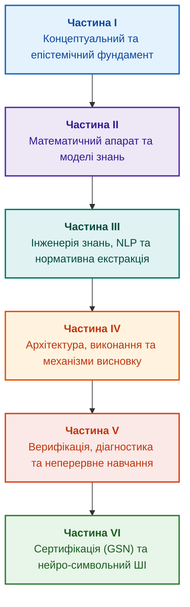

# Архітектура доказових експертних систем: від формальних онтологій до нейро-символьного ШІ

**Електронна книга про проєктування, математичні моделі, архітектуру та верифікацію інтелектуальних систем високого рівня довіри (Safety-Critical & Evidence-Grounded AI)**

**Автор:** [Микола Федчик (Mykola Fedchyk)](about-the-author.md) · [LinkedIn](https://www.linkedin.com/in/nickfedchik/)  
**Формат:** Інженерна монографія / Настільна книга архітектора ШІ  
**Рік:** 2026  

---

## Про книгу

У добу тріумфу великих генеративних моделей інженерна спільнота зіткнулася з парадоксом: розмовні нейромережі вражають мовною ерудицією, але виявляються безпорадними або катастрофічно небезпечними там, де ціна помилки вимірюється життями людей, мільярдними збитками чи відкликанням ліцензій — в авіації, функціональній безпеці автотранспорту, енергетиці, клінічній медицині та регуляторному аудиті.

### Наскрізна інженерна драма: криза задокументованих знань

Фундаментальний виклик сучасних складних проєктів — це не брак інформації, а **параліч задокументованого знання**. Сучасний електронний блок керування (ECU), авіоніка літака чи критичний промисловий контролер супроводжуються десятками тисяч сторінок нормативних документів (ISO 26262, DO-178C, IEC 62443), специфікацій інтерфейсів, даташитів на чипи, реєстрів апаратних дефектів (chip errata) та протоколів стендових випробувань.

Знання *вже зафіксовані* в документах. Проте на практиці виникає криза:

1. **Когнітивна межа людини:** інженерна команда фізично неспроможна утримати в пам'яті 50 000 сторінок технічного тексту та безпомилково пов'язати кожен рядок коду чи апаратний регістр із пунктами безпекових регламентів.
2. **Паперовий комплаєнс:** класична сертифікація продукує гігабайти звітів, які пишуться постфактум і швидко втрачають зв'язок із реальними змінами в прошивках та апаратурі.
3. **Ілюзія генеративного ШІ (RAG / LLM):** статистичні мовні моделі створюють ілюзію обізнаності, але схильні до галюцинацій, не мають побайтового підтвердження і не несуть юридичної відповідальності за збій.

**Головний нерв цієї книги — шлях дослідження:** як перетворити пасивний «цвинтар документації» на активний, живий, математично строгий та обчислюваний інтелектуальний контур. Ми досліджуємо весь цикл: від побайтової екстракції вимог і формалізації правил до синтезу доказів безпеки за стандартом GSN та побудови гібридного нейро-символьного ядра на Go та Ollama.

### Інженерний виклик епохи: інтелектуальний щит і технологічний суверенітет

Для України та світової спільноти інженерів доказовий штучний інтелект — це не абстрактний академічний концепт. У першій у світовій історії повномасштабній війні дронів, сенсорів, радіоелектронної розвідки (РЕР) та РЕБ математично вивірені знання стають **прямим фактором виживання та перемоги**:

* **Ціна помилки алгоритму:** коли безпілотник летить в умовах тотального придушення супутникової навігації (GNSS-Denied), випадкова галюцинація нейромережі чи неперевірений вектор оптичного потоку означає втрату борта вартістю в десятки тисяч доларів і зрив бойового завдання.
* **Спадковість української кібернетики:** ми спираємося на потужну школу системного аналізу, оптимізації та автоматизованого управління — від київських наукових шкіл В. Глушкова, В. Михалевича, К. Ющенко до військово-інженерних традицій КВІРТУ ППО та КВІУС. Сучасні українські розробники — це прямі спадкоємці цієї культури доказовості.
* **Заклик до дії (Call to Action):** ця книга створена, щоб надихнути розробників, системних інженерів, математиків і студентів перестати бути просто пасивними споживачами чужих закритих API. Кожен розділ розкриває конкретні архітектурні креслення та математичні моделі, які ви можете втілити у власних R&D-проєктах, підсилюючи обороноздатність держави та розвиваючи національний високотехнологічний сектор.

---

## Навігація та інженерні профілі читання (Reading Paths)

Книга охоплює широкий міждисциплінарний спектр. Щоб уникнути когнітивного перевантаження, рекомендується обрати один із трьох фокусних маршрутів залежно від вашої інженерної ролі:

* 🛤 **Шлях розробника-практика (The Builder / Systems Developer):**
  * *Фокус:* швидкий перехід до дієвого коду, реалізація детермінованих рушіїв на Go/C, підключення локальної Ollama без хмарних залежностей.
  * *Маршрут:* [Глава 1](ch01-introduction-to-expert-systems.md) → [Глава 7](ch07-knowledge-base-typology.md) → [Глава 8](ch08-engineering-artifacts-as-data.md) → [Глава 14](ch14-requirements-detection-and-formalization.md) → [Глава 16](ch16-expert-systems-architecture.md) → [Глава 17](ch17-implementation-stack.md) → [Глава 18](ch18-execution-infrastructure.md) → [Глава 21](ch21-from-recommendation-to-action.md) → [Глава 29](ch29-neuro-symbolic-architecture.md).

* 🛤 **Шлях інженера функціональної безпеки та аудитора (The Safety & Verification Lead):**
  * *Фокус:* математичні інваріанти, дотримання DO-178C / ISO 26262, синтез сертифікаційних GSN-дерев, подолання галюцинацій та режим Fail-Closed.
  * *Маршрут:* [Глава 1](ch01-introduction-to-expert-systems.md) → [Глава 2](ch02-epistemology-of-machine-knowledge.md) → [Глава 5](ch05-triad-of-trust-and-corporate-memory.md) → [Глава 6](ch06-applied-mathematics-for-expert-systems.md) → [Глава 9](ch09-engineering-knowledge-graph-traceability.md) → [Глава 23](ch23-knowledge-base-verification.md) → [Глава 24](ch24-system-diagnosis.md) → [Глава 26](ch26-continual-learning.md) → [Глава 27](ch27-safety-case-gsn-synthesis.md) → [Глава 28](ch28-dual-mode-expert-systems.md) → [Додаток А](appendix-a-evidence-governed-framework.md).

* 🛤 **Шлях архітектора знань та R&D-лідера (The Researcher & Knowledge Engineer):**
  * *Фокус:* подолання «холодного старту» бази знань, автоматизований парсинг специфікацій, когнітивні карти експертів, усунення мовного шуму та дослідницька пам'ять.
  * *Маршрут:* [Глава 1](ch01-introduction-to-expert-systems.md) → [Глава 4](ch04-evolution-from-bayes-to-evidence-ai.md) → [Глава 9](ch09-engineering-knowledge-graph-traceability.md) → [Глава 10](ch10-knowledge-acquisition-systems.md) → [Глава 11](ch11-knowledge-elicitation-from-experts.md) → [Глава 12](ch12-linguistic-analysis-and-local-models.md) → [Глава 13](ch13-language-variability-vs-determinism.md) → [Глава 15](ch15-knowledge-extraction-and-kb-construction.md) → [Глава 20](ch20-explanation-engine.md) → [Глава 25](ch25-how-expert-systems-learn.md) → [Додаток А](appendix-a-evidence-governed-framework.md).

---

## Маніфест: чим ця книга НЕ є (Відповідь скептикам і цинікам)

У сучасному інженерному просторі вистачає як безпідставного ШІ-хайпу, так і абсолютно виправданого скепсису. Щоб читач не витрачав час на хибні очікування, ми відкрито фіксуємо нашу технологічну позицію:

1. **Це не спроба оживити наївні експертні системи 1980-х:**
   * Підхід GOFAI та неконтрольований Prolog зазнали краху через недетермінований пошук із поверненням (Backtracking), нерозв'язність довільної логіки першого порядку та комбінаторний вибух.
   * Ми **забороняємо загальний недетермінований бектрекінг**: натомість використовується **стратифікований Datalog над скінченними доменами**, чиє обчислення найменшої нерухомої точки (LFP) гарантовано завершується за поліноміальний час, а також реляційні та графові структури даних.
2. **Це не чергова «обгортка над LLM» і не наївний RAG:**
   * Ми не довіряємо генеративним нейромережам прийняття рішень у критичних контурах. Вимоги стандарту авіоніки DO-178C DAL A вимагають рівень надійності $10^{-9}$ критичних відмов на годину польоту, тоді як статистичні моделі мають частоту помилок близько $10^{-3} \dots 10^{-4}$ (на п'ять порядків гірше допустимого).
   * Локальні моделі (Ollama) використовуються **винятково за межами контуру безпеки**: як допоміжні асистенти первинної нормалізації тексту з обов'язковою граматичною генерацією (Grammar-Based Constrained Decoding / JSON Schema) або як дорадчі генератори гіпотез, чиї висновки підлягають детермінованій верифікації ядром на Go.
3. **Це не «цвинтар онтологій», який треба малювати руками:**
   * Якщо архітектура вимагає від програміста вручну наповнювати класи Protégé/OWL або синхронізувати схеми — вона мертвонароджена в умовах сучасного Agile/DevOps.
   * Інженерний граф знань (EKG) у нашій системі компілюється автоматично як побічний артефакт збірки (AST-аналіз коду, парсинг тегів вимог, Git-історія) через стандартні кроки CI/CD із нульовим ручним навантаженням на розробника.
4. **Це не спроба продати регуляторам «чорну скриньку»:**
   * Жоден регулятор (FAA, FDA, ISO) не сертифікує ймовірнісні галюцинації. У нашому підході використовується архітектура безпекового вето (*Simplex Architecture*) та нотація Goal Structuring Notation (GSN), де кінцевими доказами є криптографічні хеші SHA-256 бінарних файлів, звіти MC/DC покриття та логи фізичних осцилографів із HIL-стендів.

---

## Структура книги

Книга складається з шести тематичних частин, 29 глав і п'яти додатків.

---

### [Частина I. Концептуальний та епістемічний фундамент](part-01-foundations.md)

*Визначення природи знань, межі між даними та судженнями, витоки доказовості від Байєса до сучасності.*

* [Глава 1. Вступ до експертних систем: від хаосу до керованих знань](ch01-introduction-to-expert-systems.md)
* [Глава 2. Філософія для інженера: що машина має право називати знанням](ch02-epistemology-of-machine-knowledge.md)
* [Глава 3. Чим експертна система відрізняється від інформаційно-довідкової системи](ch03-beyond-reference-information-systems.md)
* [Глава 4. Еволюція експертних систем: від теореми Байєса до доказових рішень ШІ](ch04-evolution-from-bayes-to-evidence-ai.md)
* [Глава 5. Тріада довіри: експертна система, доказова рекомендація та корпоративна пам'ять](ch05-triad-of-trust-and-corporate-memory.md)

---

### [Частина II. Математичний апарат та моделі знань](part-02-knowledge-models.md)

*Формальний математичний базис: предикатна логіка, ймовірнісні графи, онтології, інженерні артефакти та EKG.*

* [Глава 6. Прикладна математика експертних систем: правила, ймовірності, графи та причинність](ch06-applied-mathematics-for-expert-systems.md)
* [Глава 7. Типологія баз знань: правила, фрейми, онтології та прецеденти](ch07-knowledge-base-typology.md)
* [Глава 8. Інженерні артефакти як первинні дані експертної системи](ch08-engineering-artifacts-as-data.md)
* [Глава 9. Інженерний граф знань (EKG): інтеграція вимог, вихідного коду, тестів та апаратури](ch09-engineering-knowledge-graph-traceability.md)

---

### [Частина III. Інженерія знань: здобуття, NLP та екстракція з нормативів](part-03-knowledge-engineering-nlp.md)

*Методології вилучення знань у людей-експертів, подолання варіативності мови, парсинг вимог SHALL/MUST та побудова інваріантів.*

* [Глава 10. Системи здобуття знань: архітектура збирання інженерного досвіду без втрат і витоку даних](ch10-knowledge-acquisition-systems.md)
* [Глава 11. Вилучення знань у експертів: інтерв'ювання, когнітивні карти та формалізація досвіду](ch11-knowledge-elicitation-from-experts.md)
* [Глава 12. Лінгвістичний аналіз та локальні моделі: як система розуміє текст без втрати джерела](ch12-linguistic-analysis-and-local-models.md)
* [Глава 13. Варіативність природної мови проти детермінізму: компіляція сенсу запитання](ch13-language-variability-vs-determinism.md)
* [Глава 14. Детекція вимог у стандартах: витяг нормативних предикатів (SHALL/MUST) та побудова інваріантів](ch14-requirements-detection-and-formalization.md)
* [Глава 15. Автоматизована екстракція знань: від тексту специфікацій до онтологій і кінцевих автоматів (FSM)](ch15-knowledge-extraction-and-kb-construction.md)

---

### [Частина IV. Архітектура, виконання та механізми висновку](part-04-architecture-and-inference.md)

*Стек реалізації, логічні машини виведення, рушій пояснень, контроль повноважень та кібернетичні контури.*

* [Глава 16. Архітектура експертної системи: від формального знання до доказового рішення](ch16-expert-systems-architecture.md)
* [Глава 17. Технологічний стек: критерії вибору інструментів, мов програмування та рушіїв правил](ch17-implementation-stack.md)
* [Глава 18. Інфраструктура виконання: локальні моделі, апаратні прискорювачі, Edge та On-Premise](ch18-execution-infrastructure.md)
* [Глава 19. Від запитання до доказу: як система трансформує неструктурований запит на ланцюг фактів](ch19-from-question-to-evidence.md)
* [Глава 20. Рушій пояснень: як система обґрунтовує рішення, відмову та межі компетентності](ch20-explanation-engine.md)
* [Глава 21. Від рекомендації до дії: контроль повноважень і безпечне виконання у виробничому середовищі](ch21-from-recommendation-to-action.md)
* [Глава 22. Кібернетичний контур XXI століття: від сенсорів на Edge до центру прийняття рішень](ch22-cybernetics-edge-to-backend.md)

---

### [Частина V. Верифікація, діагностика та неперервне навчання](part-05-verification-and-learning.md)

*Формальна верифікація бази правил, діагностика першопричин (RCA), екзаменаційні набори та навчання без катастрофічного забування.*

* [Глава 23. Верифікація бази знань: як перевірити несуперечливість, повноту та надійність правил](ch23-knowledge-base-verification.md)
* [Глава 24. Технічна діагностика: як не сплутати симптом із першопричиною в умовах неповноти](ch24-system-diagnosis.md)
* [Глава 25. Як навчати експертну систему: екзаменаційні матриці, аудит знань та контроль регресій](ch25-how-expert-systems-learn.md)
* [Глава 26. Неперервне навчання (Continual Learning) на досвіді та подолання зсуву системного журналу](ch26-continual-learning.md)

---

### [Частина VI. Передовий край: регуляторна сертифікація та нейро-символьний ШІ](part-06-frontiers-neuro-symbolic.md)

*Синтез доказів безпеки за стандартом GSN, дворежимні системи (Fail-Closed) та гібридний Neuro-Symbolic AI на Go та Ollama.*

* [Глава 27. Синтез сертифікаційних доказів за Goal Structuring Notation (GSN): від графа EKG до аудиторського звіту](ch27-safety-case-gsn-synthesis.md)
* [Глава 28. Дворежимні експертні системи: поєднання строгої дедукції (Fail-Closed) та евристичного дорадчого виведення (CBR)](ch28-dual-mode-expert-systems.md)
* [Глава 29. Нейро-символьна архітектура (Neuro-Symbolic AI): поєднання мовних моделей та детермінованої доказовості на Go та Ollama](ch29-neuro-symbolic-architecture.md)

---

### Додатки

* [Додаток А. Практичний фреймворк доказового дослідження в складних інженерних проєктах](appendix-a-evidence-governed-framework.md)
* [Додаток Б. Доказові експертні системи в автономній робототехніці та кіберфізичних комплексах](appendix-b-robotics-and-cyber-physical-systems.md)
* [Додаток В. Автономна навігація без GNSS: геопросторове зіставлення (TRN/DSMAC), візуальна одометрія (VIO) та експертний арбітраж сенсорного злиття](appendix-c-autonomous-navigation-and-geosearch.md)
* [Додаток Г. Аналогові експертні системи, нейроморфні обчислення та апаратне логічне виведення](appendix-d-analog-expert-systems-and-neuromorphic-computing.md)
* [Додаток Д. Змішані аналого-цифрові експертні системи: нейроморфні, аналогові та інші нетрадиційні обчислювачі під доказовим контролем](appendix-e-mixed-signal-neuromorphic-expert-systems.md)
* [Про автора: Микола Федчик (Nick Fedchik)](about-the-author.md)

---

## Перспективи розвитку: Expert Systems 2.0 та Knowledge Computing

Книга не зупиняється на поточному стані технологій. Ми розглядаємо експертні системи не як окремі скрипти чи додатки, а як фундамент для нової обчислювальної парадигми — **Knowledge Computing (Знаннєві обчислення)**:

* **Зміна парадигми взаємодії:** перехід від хаотичного *«Agent + RAG»* до керованої моделі **«Expert System + Agents»**, де найвищий регуляторний авторитет і нагляд за безпекою належать строгому ядру знань, а агенти виступають підзвітними сенсорами та виконавчими органами.
* **Knowledge Compiler & Reasoning Runtime:** перетворення нормативних специфікацій та онтологій у скомпільовані бінарні структури з гарантованим часом виведення на мовах системного рівня (Go / C / Rust).
* **Формальна верифікація знань (ITP / Lean 4):** математичний доказ несуперечливості правил і моделей онтологій через ізоморфізм Каррі — Говарда безпосередньо компілятором доказів.
* **Мультимодальна детекція з CAD/EDA схем:** вилучення нетлістів та інваріантів зв'язності безпосередньо з креслень плат і топологій за допомогою графових нейромереж (GNN).
* **Криптографічний комплаєнс (Zero-Knowledge Proofs — ZKP):** протоколи zk-SNARK для доведення відповідності виробів військовим та цивільним стандартам (MIL-STD, ISO) без витоку конфіденційної документації.
* **Децентралізований консенсус роїв (CBBA / Distributed WTA):** узгодження цілей та завдань між десятками автономних безпілотників у зоні активного РЕБ без єдиного центру управління.
* **Когнітивний РЕБ та спектральні графи:** розпізнавання тактики псевдовипадкової перебудови частот супротивника (FHSS) та автоматичний синтез контрзаходів за мікросекунди.
* **Машинне розучування (Machine Unlearning):** кероване каскадне відкликання скомпрометованих або застарілих правил без руйнування та без перенавчання решти бази знань.
* **Фізично інформовані нейромережі (PINN):** символьні фільтри, що гарантують безаварійність виконавчих органів у межах фундаментальних фізичних законів.
* **Апаратні прискорювачі та аналогові обчислення:** перенесення окремих ядер виведення (зважування ознак, порогових правил, баєсового виведення, виявлення подій) на аналогові, нейроморфні й змішані обчислювачі за умови виміряної моделі похибки, калібрування й цифрового контролю висновку.

Детальний аналіз перспективних дослідницьких векторів та комплексна карта R&D розгорнуті у фінальній [Главі 29](ch29-neuro-symbolic-architecture.md), апаратна аналогова елементна база у [Додатку Г](appendix-d-analog-expert-systems-and-neuromorphic-computing.md), а поєднання аналогових і нейроморфних обчислювачів із доказовим виведенням у [Додатку Д](appendix-e-mixed-signal-neuromorphic-expert-systems.md).
