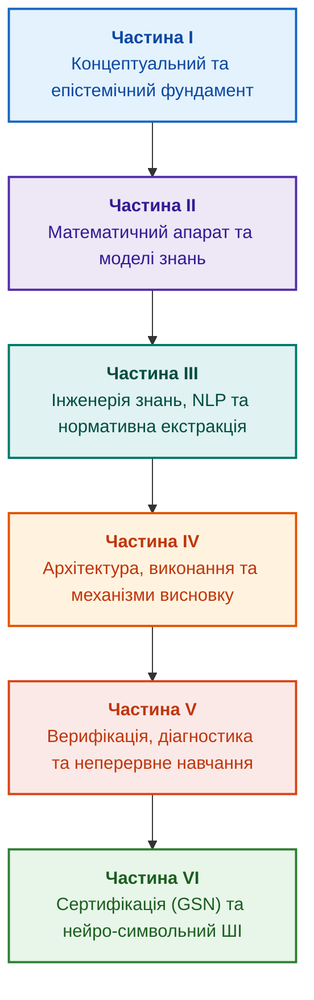

# Архітектура доказових експертних систем: від формальних онтологій до нейро-символьного ШІ

**Електронна книга про проєктування, математичні моделі, архітектуру та верифікацію інтелектуальних систем високого рівня довіри (Safety-Critical & Evidence-Grounded AI)**

**Автор:** [Микола Федчик (Mykola Fedchyk)](about-the-author.md) · [LinkedIn](https://www.linkedin.com/in/nickfedchik/)  
**Формат:** Інженерна монографія / Настільна книга архітектора ШІ  
**Рік:** 2026  

---

## Про книгу

Книга відповідає на запитання: як отримати інженерний висновок, підстави якого можна перевірити? Експертна система застосовує явні факти, правила й обмеження до конкретного випадку та показує джерела, версії, невідомості й межі результату. Мовна модель може допомагати з пошуком і поясненням, але не замінює перевірки підстав або відповідальності людини.

### Від артефакта до перевірюваного рішення

Вимоги, код, тести, звіти й рішення вже існують, але часто не мають узгоджених зв'язків і меж чинності. Знайдений успішний тест може стосуватися іншого випуску; правильна цитата може бути неправильно витлумачена; відкат може повернути відкликане джерело. Ці проблеми трапляються й у звичайній розробці програмного забезпечення, не лише в регульованих галузях.

Шлях книги проходить від моделі знань і походження артефактів до виведення, пояснення, зміни й відкликання знань. [Глава 1](ch01-introduction-to-expert-systems.md) містить мінімальну програмну перевірку на Go з тестами, [глави 7–11](part-02-knowledge-models.md) формують спільний контракт об'єктів і програму наукового випробування, а [Глава 25](ch25-how-expert-systems-learn.md) показує, як нова вимога й відкликання звіту змінюють висновок без стирання історії.

### Для кого й з якими передумовами

Книга призначена для розробників, інженерів знань, архітекторів і фахівців із перевірки. Для практичного входу достатньо розуміти вимогу, тест, версію й просту логічну умову; для запуску Go-прикладу потрібний відповідний компілятор. Графові сховища, локальні мовні моделі й апаратні прискорювачі додають за потреби. Спеціалізовані глави про стандарти безпеки, причинний аналіз і нетрадиційні обчислювачі не є передумовами першої реалізації.

---

## Маршрути читання

**Перша програмна перевірка:** [1](ch01-introduction-to-expert-systems.md) → [7](ch07-knowledge-base-typology.md) → [8](ch08-engineering-artifacts-as-data.md) → [17](ch17-implementation-stack.md) → [23](ch23-knowledge-base-verification.md) → [25](ch25-how-expert-systems-learn.md). Мета: відтворюваний вердикт із підставами, негативними тестами й керованою зміною знань. Мовна модель не є обов'язковою.

**Інженерія знань:** [7–11](part-02-knowledge-models.md) → [12–15](part-03-knowledge-engineering-nlp.md) → [19](ch19-from-question-to-evidence.md) → [20](ch20-explanation-engine.md) → [26](ch26-continual-learning.md). Мета: узгодити семантику, походження, отримання знань і перевірку нових кандидатів. У Частині II є окрема програма наукового посилення глав 7–11.

**Архітектура й спеціалізація:** [16–22](part-04-architecture-and-inference.md), далі [27–32](part-06-frontiers-neuro-symbolic.md) та потрібні додатки. Мета: багатокомпонентне виконання, контроль дій, аргументи безпеки, нейро-символьне поєднання й пакети знань. [Глава 2](ch02-epistemology-of-machine-knowledge.md) пояснює контракт відповіді, [Глава 4](ch04-evolution-from-bayes-to-evidence-ai.md) історію, [Глава 6](ch06-applied-mathematics-for-expert-systems.md) потрібну для задачі математику. Їх можна читати за запитанням, а не як суцільний вступний іспит.

---

## Межі обіцянок

Книга є навчальним і дослідницьким матеріалом, не сертифікованою процедурою й не доказом відповідності виробу стандарту. Детерміноване виконання не доводить правильності фактів; хеш і підпис не доводять істинності; граф аргументів не замінює оцінки фахівця. Вимоги до надійності цілого виробу не слід ототожнювати з частотою помилок мовної моделі або приписувати всім програмним компонентам.

Автоматичний розбір зменшує ручне перенесення даних, але не скасовує моделювання, рецензування й власників знань. Protégé, ручний перегляд і автоматичне збирання можуть працювати разом. Математичні гарантії стосуються конкретного профілю мови та припущень; виміряна швидкість стосується заданого запиту, корпусу й середовища. Архівні числа автора відокремлено від відкритих навчальних стендів і ще не виконаних досліджень.

Рішення про випуск, прийняття ризику й відповідність галузевим вимогам залишаються за уповноваженими людьми. Експертна система готує перевірюваний матеріал і виконує погоджену політику, але не набуває регуляторних повноважень.

---

## Структура книги

Книга складається з шести тематичних частин, 32 глав і п'яти додатків.

---

### [Частина I. Концептуальний та епістемічний фундамент](part-01-foundations.md)

*Визначення природи знань, межі між даними та судженнями, витоки доказовості від Байєса до сучасності.*

* [Глава 1. Вступ до експертних систем: від хаосу до керованих знань](ch01-introduction-to-expert-systems.md)
* [Глава 2. Філософія для інженера: що машина має право називати знанням](ch02-epistemology-of-machine-knowledge.md)
* [Глава 3. Чим експертна система відрізняється від інформаційно-довідкової системи](ch03-beyond-reference-information-systems.md)
* [Глава 4. Еволюція експертних систем: від теореми Байєса до доказових рішень ШІ](ch04-evolution-from-bayes-to-evidence-ai.md)
* [Глава 5. Тріада довіри: експертна система, доказова рекомендація та корпоративна пам'ять](ch05-triad-of-trust-and-corporate-memory.md)

---

### [Частина II. Математичний апарат та моделі знань](part-02-knowledge-models.md)

*Формальний математичний базис: предикатна логіка, ймовірнісні графи, онтології, інженерні артефакти та EKG.*

* [Глава 6. Прикладна математика експертних систем: правила, ймовірності, графи та причинність](ch06-applied-mathematics-for-expert-systems.md)
* [Глава 7. Типологія баз знань: правила, онтології, прецеденти та вектори](ch07-knowledge-base-typology.md)
* [Глава 8. Інженерні артефакти як дані експертної системи](ch08-engineering-artifacts-as-data.md)
* [Глава 9. Інженерний граф знань: простежуваність від вимог до апаратури](ch09-engineering-knowledge-graph-traceability.md)

---

### [Частина III. Інженерія знань: здобуття, NLP та екстракція з нормативів](part-03-knowledge-engineering-nlp.md)

*Методології вилучення знань у людей-експертів, подолання варіативності мови, парсинг вимог SHALL/MUST та побудова інваріантів.*

* [Глава 10. Системи здобуття знань: архітектура збирання інженерного досвіду без втрат і витоку даних](ch10-knowledge-acquisition-systems.md)
* [Глава 11. Вилучення знань у експертів: інтерв'ювання, когнітивні карти та формалізація досвіду](ch11-knowledge-elicitation-from-experts.md)
* [Глава 12. Лінгвістичний аналіз та локальні моделі: як система розуміє текст без втрати джерела](ch12-linguistic-analysis-and-local-models.md)
* [Глава 13. Варіативність природної мови проти детермінізму: компіляція сенсу запитання](ch13-language-variability-vs-determinism.md)
* [Глава 14. Детекція вимог у стандартах: витяг нормативних предикатів (SHALL/MUST) та побудова інваріантів](ch14-requirements-detection-and-formalization.md)
* [Глава 15. Автоматизована екстракція знань: від тексту специфікацій до онтологій і кінцевих автоматів (FSM)](ch15-knowledge-extraction-and-kb-construction.md)

---

### [Частина IV. Архітектура, виконання та механізми висновку](part-04-architecture-and-inference.md)

*Стек реалізації, логічні машини виведення, рушій пояснень, контроль повноважень та кібернетичні контури.*

* [Глава 16. Архітектура експертної системи: від формального знання до доказового рішення](ch16-expert-systems-architecture.md)
* [Глава 17. Технологічний стек: критерії вибору інструментів, мов програмування та рушіїв правил](ch17-implementation-stack.md)
* [Глава 18. Інфраструктура виконання: локальні моделі, апаратні прискорювачі, Edge та On-Premise](ch18-execution-infrastructure.md)
* [Глава 19. Від запитання до доказу: як система трансформує неструктурований запит на ланцюг фактів](ch19-from-question-to-evidence.md)
* [Глава 20. Рушій пояснень: як система обґрунтовує рішення, відмову та межі компетентності](ch20-explanation-engine.md)
* [Глава 21. Від рекомендації до дії: контроль повноважень і безпечне виконання у виробничому середовищі](ch21-from-recommendation-to-action.md)
* [Глава 22. Кібернетичний цикл керування XXI століття: від сенсорів на периферії до центру ухвалення рішень](ch22-cybernetics-edge-to-backend.md)

---

### [Частина V. Верифікація, діагностика та неперервне навчання](part-05-verification-and-learning.md)

*Формальна верифікація бази правил, діагностика першопричин (RCA), екзаменаційні набори та навчання без катастрофічного забування.*

* [Глава 23. Верифікація бази знань: як перевірити несуперечливість, повноту та надійність правил](ch23-knowledge-base-verification.md)
* [Глава 24. Технічна діагностика: як не сплутати симптом із першопричиною в умовах неповноти](ch24-system-diagnosis.md)
* [Глава 25. Як навчати експертну систему: екзаменаційні матриці, аудит знань та контроль регресій](ch25-how-expert-systems-learn.md)
* [Глава 26. Неперервне навчання (Continual Learning) на досвіді та подолання зсуву системного журналу](ch26-continual-learning.md)

---

### [Частина VI. Передовий край: регуляторна сертифікація та нейро-символьний ШІ](part-06-frontiers-neuro-symbolic.md)

*Синтез доказів безпеки за стандартом GSN, дворежимні системи (Fail-Closed) та гібридний Neuro-Symbolic AI на Go та Ollama.*

* [Глава 27. Синтез сертифікаційних доказів за Goal Structuring Notation (GSN): від графа EKG до аудиторського звіту](ch27-safety-case-gsn-synthesis.md)
* [Глава 28. Дворежимні експертні системи: поєднання строгої дедукції (Fail-Closed) та евристичного дорадчого виведення (CBR)](ch28-dual-mode-expert-systems.md)
* [Глава 29. Нейро-символьна архітектура (Neuro-Symbolic AI): поєднання мовних моделей та детермінованої доказовості на Go та Ollama](ch29-neuro-symbolic-architecture.md)
* [Глава 30. Ко-інженерія функціональної безпеки та кібербезпеки: гармонізація суперечливих стандартів та спільний синтез GSN-доказів (ISO 26262, ISO/SAE 21434, ASPICE 4.0)](ch30-safety-cybersecurity-co-engineering.md)
* [Глава 31. Багатоходове виведення: ієрархії предикатів, винятки та чинність норм](ch31-syllogistic-reasoning-and-relation-lattices.md)
* [Глава 32. Високопродуктивні інженерні бази знань: mmap-індексування з нульовою десеріалізацією, побайтовий нейро-символьний харвестинг та інженерія знаннєвої щільності](ch32-high-performance-knowledge-packs-mmap-and-harvesting.md)

---

### Додатки

* [Додаток А. Практичний фреймворк доказового дослідження в складних інженерних проєктах](appendix-a-evidence-governed-framework.md)
* [Додаток Б. Доказові експертні системи в автономній робототехніці та кіберфізичних комплексах](appendix-b-robotics-and-cyber-physical-systems.md)
* [Додаток В. Автономна навігація без GNSS: геопросторове зіставлення (TRN/DSMAC), візуальна одометрія (VIO) та експертний арбітраж сенсорного злиття](appendix-c-autonomous-navigation-and-geosearch.md)
* [Додаток Г. Аналогові експертні системи, нейроморфні обчислення та апаратне логічне виведення](appendix-d-analog-expert-systems-and-neuromorphic-computing.md)
* [Додаток Д. Змішані аналого-цифрові експертні системи: нейроморфні, аналогові та інші нетрадиційні обчислювачі під доказовим контролем](appendix-e-mixed-signal-neuromorphic-expert-systems.md)
* [Про автора: Микола Федчик (Nick Fedchik)](about-the-author.md)

---

## Дослідницькі напрями

Напрями подальшої роботи не є готовими гарантіями: відтворюване збирання пакетів знань; перевірка обмеженого формального подання; керування агентами через явні повноваження; конфіденційна перевірка конкретного формалізованого твердження; контрольоване відкликання й дослідження машинного розучування. Доведення властивості моделі не підтверджує автоматично відповідності фізичного виробу, а видалення правила не тотожне видаленню впливу даних із навченої моделі.

Для апаратних прискорювачів і нетрадиційних обчислювачів спочатку вимірюють похибку, затримку, енергію та поведінку за відмов. Відповідні питання розглядають [Глава 29](ch29-neuro-symbolic-architecture.md), [Глава 32](ch32-high-performance-knowledge-packs-mmap-and-harvesting.md) та [додатки Г](appendix-d-analog-expert-systems-and-neuromorphic-computing.md) і [Д](appendix-e-mixed-signal-neuromorphic-expert-systems.md). Практична дослідницька програма для глав 7–11 наведена в [Частині II](part-02-knowledge-models.md): кожна пропозиція має гіпотезу, контрольне порівняння й умову спростування.
