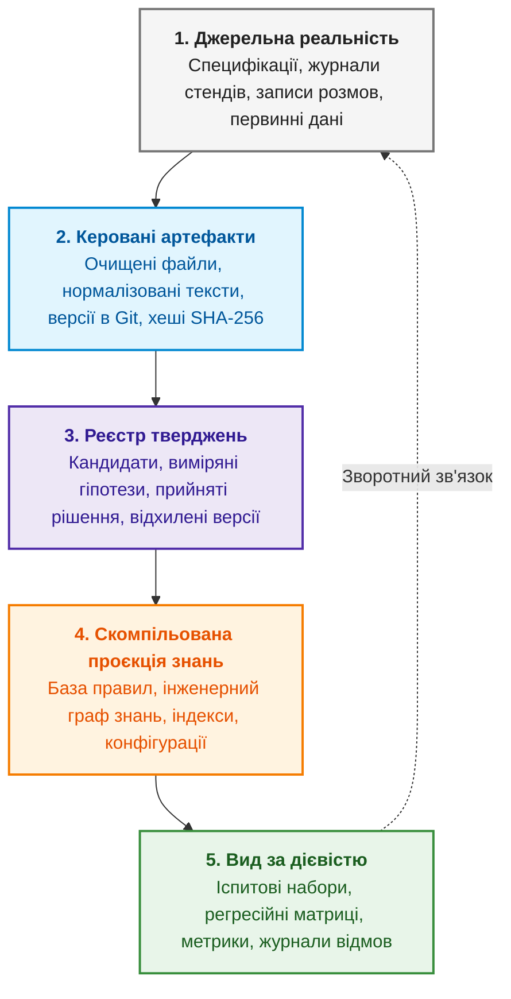

# Додаток А. Практичний фреймворк доказового дослідження в складних інженерних проєктах

> **Книга:** [Архітектура доказових експертних систем](README.md) · Додатки  
> **Зміст книги:** [README.md](README.md)  
> **Автор:** [Микола Федчик](about-the-author.md)  
> **Рівень:** середній і поглиблений: керівники досліджень і розробок, системні архітектори, провідні дослідники, інженери знань  
> **Очікувані результати:** практичний посібник з організації дослідницької пам'яті, реєстрації тверджень, ізоляції випробувальних наборів і побудови наскрізного ланцюга від сирого джерела до виробничого рішення в умовах високої невизначеності.

У понеділок команда знаходить помилку: невелика експертна система для однієї предметної області не відповідає на просте запитання, хоча відповідь є в її документах. У вівторок команда змінює пошук. У середу команда змінює спосіб поділу тексту. У четвер команда змінює інструкцію для мовної моделі. У п'ятницю нова версія нарешті проходить контрольний приклад.

Наступного понеділка те саме запитання формулюють трохи інакше, і експертна система знову помиляється.

Команда працювала весь тиждень. Є код, звіти, журнали виконання, кілька нових наборів даних і навіть гарний показник точності. Проте ніхто вже не може коротко відповісти:

- яку загальну проблему команда перевіряла;
- що саме доведено;
- який результат був лише розвідувальним;
- які приклади експертна система вже бачила під час розробки;
- скільки незалежних перевірок залишилося;
- за якої умови дослідження нарешті завершиться.

Це не рідкісний випадок і не проблема винятково штучного інтелекту. Так буває з компіляторами, пошуковими рушіями, системами керування знаннями, аналізаторами коду, робототехнікою й апаратними прототипами. Що більше в проєкті невизначеності, то легше переплутати кількість виконаної роботи з накопиченим знанням.

Після тривалої серії таких експериментів у команді автора сформувався практичний дослідницький фреймворк (*research framework*). Він не є новою методологією замість наукового методу, Scrum, системної інженерії чи інженерії життєвого циклу моделей машинного навчання (*Machine Learning Operations*, MLOps). Він також не замінює рамок керування ризиками, як-от рамки керування ризиками штучного інтелекту Національного інституту стандартів і технологій США (*National Institute of Standards and Technology*, NIST), яка описує функції врядування, картографування, вимірювання й керування ризиками [[1]](#src-1). Фреймворк з'єднує корисні частини цих підходів в одну пам'ять дослідження: від сирого джерела до твердження, від твердження до рішення, від рішення до зміни продукту, а від зміни продукту до незалежного випробування.

## Головним продуктом дослідження є твердження, а не звіт

У програмному проєкті продукт назвати легко: виконуваний файл, бібліотека, сервіс. У дослідженні продукт менш очевидний. Скрипт не є результатом сам по собі. Набір завантажених документів теж не є результатом. Таблиця метрик ще нічого не каже без питання, популяції та правила рішення.

Корисною одиницею виявилося **дослідницьке твердження**:

> У визначених умовах метод A має таку властивість порівняно з методом B; це підтверджується такими спостереженнями, з такими обмеженнями й рівнем перевірки.

Твердження має стабільний ідентифікатор, область чинності, статус, докази та відомі обмеження. Статус має одне з таких значень:

- **кандидат**: ідея або зовнішнє повідомлення, яке ще не перевірено;
- **виміряно**: є відтворювані спостереження у визначеній області;
- **прийнято**: чинне методологічне чи архітектурне рішення;
- **відхилено**: перевірка не виконала зафіксованого критерію;
- **замінено**: старий висновок збережено, але діє новіший.

Статуси дисциплінують мову. «Ми реалізували» не означає «ми незалежно перевірили». «Тест пройшов» не означає «гіпотезу підтверджено». «Модель відповіла правильно» не означає «модель використала правильний доказ».

## П'ять шарів дослідницької пам'яті

**Дослідницька пам'ять** (*research memory*) є впорядкованим сховищем усього, що дослідження знає, робило й вирішило. Схема показує її п'ять шарів.



Зручна тека з Markdown-файлами сама не розв'язує проблеми. Потрібно розділити шари, які часто несвідомо змішують.

### 1. Джерельна реальність

Джерельна реальність охоплює сирі документи, вимірювання, версії коду, виконувані файли, ваги моделей і людські оцінки. Ці об'єкти мають бути незмінними в межах знімка й мати точну ідентичність: криптографічний хеш, версію або інший однозначний ідентифікатор.

Якщо дослідження цитує технічний документ, недостатньо записати назву документа. Потрібно знати версію, байти, сторінку або діапазон, спосіб розбору й перетворення.

### 2. Керовані артефакти

Керовані артефакти охоплюють протоколи, маніфести, нормалізовані дані, журнали, результати кожного випадку, агреговані метрики й рішення. Артефакти пояснюють, що команда зробила із джерельною реальністю.

Тут корисна модель походження PROV консорціуму W3C (*World Wide Web Consortium*): походження описують через сутності, діяльності й людей, які брали участь у створенні результату [[2]](#src-2). Повний семантичний стек W3C впроваджувати не обов'язково. Важливий принцип: результат повинен показувати не лише «що отримано», а й «з чого, ким і якою операцією».

### 3. Реєстр тверджень

Довгий звіт добре пояснює історію, але погано відповідає на запитання «що команда вважає чинним зараз?». Для цього потрібен компактний машинно-читаний реєстр. Кожне твердження посилається на доказові файли, а не на пам'ять автора.

Якщо висновок змінився, старий запис не переписують заднім числом: новий запис явно замінює старий. Так негативні результати й помилки не зникають з історії.

### 4. Скомпільована проєкція знань

Коли артефактів стає кілька сотень, читати їх послідовно неможливо. Тут корисною виявилася ідея Андрея Карпаті про постійну пов'язану Markdown-вікі, яку підтримує мовна модель і яка накопичує синтез джерел замість того, щоб виконувати весь пошук заново для кожного запитання [[3]](#src-3). Ця ідея є концептуальною нотаткою, а не експериментально перевіреною методологією.

У дослідницькому проєкті ідею треба обмежити. Мовна модель може допомагати оновлювати сторінки про поняття, компоненти, результати й відкриті питання, але вікі залишається похідною проєкцією. Джерела, протоколи, вимірювання й прийняті рішення мають вищу силу. Інакше хаотична тека документів лише зміниться на переконливо написану, але неперевірену енциклопедію.

### 5. Вид за дієвістю

Тип файлу й поточна увага команди є різними речами. Тут добре працює спрощена адаптація методу PARA Тіаго Форте (*Projects, Areas, Resources, Archives*) [[4]](#src-4):

- **проєкти**: активна обмежена робота з критерієм завершення;
- **напрями відповідальності**: постійні процеси на кшталт походження даних, безпеки чи курування корпусу;
- **ресурси**: джерела, методи й інструменти для можливого повторного використання;
- **архів**: завершене, відкладене, помилкове або замінене.

Команда автора не перебудовує за цими чотирма папками весь репозиторій: PARA лише задає операційний вид поверх канонічної структури. Архівне негативне спостереження не перестає бути доказом, а корисний ресурс не стає істиною.

### Відповідність шарів дослідницької пам'яті главам книги

П'ятишаровий фреймворк є не зовнішнім регламентом, а робочим порядком розробки й супроводу самих експертних систем, які розглядають 29 глав книги.

| Шар дослідницької пам'яті | Зміст та інженерне призначення | Відповідні частини та глави книги |
| :--- | :--- | :--- |
| **1. Джерельна реальність** | Сирі PDF, стандарти (DO-178C, ISO 26262), телеметрія стендів, дампи шин, коміти Git, журнали збоїв | [Частина II (Глави 7–9)](part-02-knowledge-models.md): інженерні артефакти як дані, простежуваність в інженерному графі знань, фіксація джерел |
| **2. Керовані артефакти** | Детерміновані розбори, структури JSON і скінченних автоматів, вилучені нормативні предикати SHALL/MUST, сигнальні маски, хеші SHA-256 | [Частина III (Глави 10–15)](part-03-knowledge-engineering-nlp.md): вилучення знань із неструктурованого тексту, подолання мовного шуму |
| **3. Реєстр тверджень** | Тріада Пірса, гіпотези, кандидатські правила, формальний статус доказовості й походження | [Частина I (Глави 1–6)](part-01-foundations.md) та [Частина V (Глави 23–26)](part-05-verification-and-learning.md): епістемологія машинного знання, тріада довіри, верифікація правил |
| **4. Скомпільована проєкція** | Рушії Datalog, клаузи Горна, обчислення найменшої нерухомої точки, контракти дій, виведення на периферійних пристроях, дерева GSN | [Частина IV (Глави 16–22)](part-04-architecture-and-inference.md) та [Частина VI (Глави 27–29)](part-06-frontiers-neuro-symbolic.md): архітектура виведення, синтез безпекових обґрунтувань |
| **5. Вид за дієвістю** | Регресійні набори еталонних тестів, матриці верифікації, перевірка відсутності забування, вимірювання навченості | [Частина V (Глави 23, 26)](part-05-verification-and-learning.md) та [Глава 29](ch29-neuro-symbolic-architecture.md): аудит, тести на Go, верифікація ваг і правил |

Таблиця показує, що кожен шар пам'яті має в книзі власні методи. Наступні розділи описують правила, які не дають шарам змішатися під час щоденної роботи.

## Вхідна черга не повинна автоматично народжувати експеримент

Нова стаття, бібліотека або цікава ідея спокушає негайно «щось перевірити». Через місяць проєкт має десятки розпочатих напрямів і жодного завершеного питання.

Тому новий матеріал спочатку потрапляє до дослідницької вхідної черги. Під час розбору матеріал отримує одну з таких доль:

- допомагає чинному проєкту;
- стає постійним правилом або відповідальністю;
- зберігається як довідковий ресурс;
- переходить до архіву;
- видаляється, якщо не має навіть аудиторської цінності.

Щоб перетворитися на експеримент, ідея повинна закривати конкретне невідоме твердження або виміряний дефект. Потрібні питання, протокол, вхідні дані, метрика й правило рішення. Сам факт існування цікавої технології експерименту не виправдовує.

## Дорожня карта має бути скінченною

Одна з найнеприємніших ознак слабкого дослідження полягає у відповіді «ще один експеримент» на кожне прохання продовжити. Так можна працювати нескінченно.

Правильна дорожня карта містить зафіксовані контрольні точки, наприклад:

1. підготувати корпус і походження;
2. заморозити еталонний набір;
3. порівняти представлення;
4. порівняти пошукові методи;
5. перевірити перенесення між доменами;
6. виміряти вартість;
7. провести фінальний аудит.

Новий блок можна додати, але лише явно: змінити дорожню карту, пов'язати новий блок із гіпотезою й пояснити, яке рішення без нього неможливе. Фраза «давайте ще спробуємо» не є достатньою підставою.

Кожний робочий пакет має бути логічно цілісним. Не обов'язково виконувати рівно чотири пункти або один експеримент за розмову. Пакет завершується тоді, коли дає рішення: протокол, виконання, аналіз, перевірені артефакти й оновлену карту знань.

## Попередня реєстрація є планом, а не в'язницею

Відкрита наука давно використовує попередню реєстрацію: дослідник фіксує гіпотезу, метод і критерії до перегляду результату. Центр відкритої науки (*Center for Open Science*) формулює сенс попередньої реєстрації як «план, а не в'язниця» [[5]](#src-5): попередня реєстрація не забороняє думати після старту, а дає читачеві змогу бачити різницю між передбаченим і поясненим заднім числом.

Для інженерного експерименту достатньо локального протоколу з хешем. До виконання варто записати:

- питання й область;
- популяцію, вибірку та винятки;
- базову й нову версії;
- основні й діагностичні метрики;
- критерії прийняття, відхилення та інвалідації;
- умови зупинки;
- форму запису кожного випадку;
- ідентичності коду, моделі, конфігурації й даних.

Після цього ніхто не забороняє зробити новий розвідувальний експеримент. Але такий експеримент треба так і назвати, а не додавати до підтверджувального набору після того, як команда вже побачила відповіді.

## Чотири різні види «тест пройшов»

У складних системах найбільше плутанини виникає між тестами різного призначення.

### Відомі тести розробника

Модульні, контрактні, негативні й регресійні тести містять уже відомі приклади. Такі тести доводять, що реалізація виконує відомий контракт і не повторює знайомої помилки. Узагальнення вони не доводять.

### Незалежний прихований набір

Прихований набір обирають лише після замороження виконуваного файла, моделі, конфігурації й даних. Експертна система отримує запитання, але не очікувані відповіді. Випробовувач порівнює результат із закритим еталоном.

Щойно випадок розкрито, він більше не прихований. Під час наступної ітерації розкритий випадок стає регресійним тестом розробника.

### Підтверджувальний науковий набір

Підтверджувальний набір потрібний для рішення про гіпотезу. Якщо правильність має семантичну складову, потрібні незалежні оцінки людей, вимірювання згоди й розбір розбіжностей. Мовна модель може бути допоміжним оцінювачем, але не незалежним еталоном для експертної системи, частиною якої вона є.

### Приймання власником або користувачем

Приймання перевіряє практичну корисність, взаємодію й відповідність очікуванню. Приймання не замінює трьох попередніх рівнів. Людина може бути задоволена гарною демонстрацією, яка не має відтворюваної доказової основи.

## Чому один правильний приклад іноді є поганою новиною

Уявімо, що експертна система має повернути число з одиницею. Після кількох виправлень відомий запит стабільно дає `8 байтів`. Розробник показує правильний доказ, координати й цитату.

Це хороший регресійний результат. Але якщо зовнішній випробовувач одразу повторить те саме запитання, команда отримає не незалежне підтвердження, а другу копію відомого тесту.

Наступний незалежний пакет повинен взяти інші документи й перетнути дві осі:

- форму значення: число з одиницею, префікс, ідентифікатор, точна фраза, багаторядкове значення, довга константа;
- форму звернення: пряме питання, прохання, запит на доказ, підтвердження.

Якщо три формулювання одного факту дають різні результати, це одна групова невдача, а не «два з трьох майже добре». Діалогова експертна система повинна зберігати значення під час перефразування.

## Шукаємо перший несправний шар

Фінальна неправильна відповідь не завжди показує, що саме треба лагодити. Корисна діагностика фіксує першу стадію, де правильний стан зник:

1. аналіз запиту;
2. пошук;
3. вибір доказового фрагмента;
4. виявлення потрібного твердження;
5. видобування складових твердження;
6. прив'язування до джерела;
7. семантична перевірка;
8. формування тексту;
9. перевірка цитати;
10. фінальний допуск.

Якщо пошук не знайшов доказу, не треба переписувати модуль відповіді. Якщо доказ уже правильний, але число втратило одиницю під час формування тексту, не треба перебудовувати індекс. Схожу покомпонентну діагностику для систем генерації з пошуковим доповненням (*retrieval-augmented generation*, RAG) пропонує RAGChecker, який окремо оцінює роботу пошуку й генерації [[6]](#src-6).

Якщо відповідь правильна, але цитата відповіді не підтримує, це теж невдача: правильність могла бути випадковою. Окремо оцінювати правильність відповіді й підтримку цитатами пропонують і автори набору ALCE для перевірки генерації тексту з цитатами [[7]](#src-7).

Саме тут проявляється різниця між дослідницьким і демонстраційним журналом. Демонстраційний журнал показує останню гарну відповідь. Дослідницький журнал зберігає стан кожного шару, включно з безпечними відмовами.

## Негативний результат не треба викидати

Під час реальної роботи бувають щонайменше три різні «невдачі».

**Продуктова невдача:** експертна система справді виконала операцію й дала неправильний результат або неправильно відмовилася.

**Інфраструктурно недійсний запуск:** закінчився час на завантаження моделі, не відкрився кеш, змінився виконуваний файл, тестовий скрипт передав неправильну схему. Такий запуск дає важливу інформацію про стенд, але не про якість відповіді.

**Інвалідований експеримент:** після запуску виявили витік між навчальною й тестовою вибірками, помилку протоколу або неправильну популяцію. Артефакти такого експерименту не можна використовувати для початкового висновку, але їх треба зберегти з позначкою й причиною.

Якщо все невдале просто видаляти, команда повторюватиме ті самі помилки. Якщо ж усе невдале без розбору включати в одну метрику, оцінка теж втратить сенс.

## Дані мають паспорт, а результати мають родовід

Принципи FAIR (*Findable, Accessible, Interoperable, Reusable*) пропонують робити цифрові об'єкти знаходжуваними, доступними, сумісними й придатними до повторного використання [[8]](#src-8). Для практичного проєкту принципи FAIR означають стабільні ідентифікатори, метадані, формати й умови використання, які може прочитати не лише людина, а й програма.

Підхід «паспорти наборів даних» (*datasheets for datasets*) додає запитання, які легко пропустити: навіщо зібрано набір, із чого він складається, кого або чого він не представляє, як його збирали, для яких задач він придатний і де може нашкодити [[9]](#src-9).

Але доступність не означає дозволу на все. Документ може бути публічно завантажуваним і водночас мати обмеження на повторне розповсюдження. Тому доступ, локальне дослідження, похідне індексування, навчання моделі й публікація повних текстів мають бути окремими рішеннями політики доступу.

## Модель допомагає розуміти, але не володіє джерелом

Сучасна мовна модель добре зіставляє перефразування, пропонує змістовні ролі, узагальнює результати й пояснює технічний текст. Відмовлятися від цих здібностей нерозумно.

Так само нерозумно доручати мовній моделі те, що детермінована програма перевіряє краще:

- точні байти;
- ідентичність і версію документа;
- координати;
- криптографічні хеші;
- права доступу;
- чинність конфігурації;
- фінальний допуск непідтвердженої відповіді.

Практичний поділ праці виглядає так: модель пропонує зміст і дослівні опорні сегменти, а програма знаходить ці сегменти в незмінному джерелі, перевіряє однозначність, будує координати й дозволяє відповідь лише після перевірки повного твердження. Схожий принцип використовує метрика FActScore: вона розкладає згенерований текст на атомарні факти й оцінює частку фактів, які підтримує надійне джерело знань [[10]](#src-10).

Той самий поділ корисний у самому дослідженні. Мовна модель може підтримувати проєкцію знань і допомагати писати звіт. Але мовна модель не повинна оголошувати власний переказ новим доказом.

## Мінімальний комплект без важкої платформи

Фреймворк не вимагає дорогого сервісу. Для початку достатньо кількох Markdown- і JSON-файлів:

```text
RESEARCH-GOAL.md       навіщо існує дослідження
RESEARCH-MAP.md        де ми зараз і які контрольні точки лишилися
HYPOTHESES.md          твердження та критерії їх перевірки
experiments/           заморожені протоколи
datasets/              маніфести, еталонні набори й паспорти даних
claims.jsonl           поточні твердження та їхні докази
knowledge/             тематична похідна проєкція
BACKLOG.md             робота й залежності
TRACEABILITY.md        зв'язок питання, експерименту, результату й рішення
```

До комплекту варто додати невелику автоматичну перевірку цілісності (`lint`), яка знаходить зламані посилання, дубльовані ідентифікатори, відсутні докази, цикли заміни й застарілий статус у головному README. Документи врядування є інтерфейсом проєкту, тому їх теж потрібно тестувати.

## Як зрозуміти, що фреймворк працює

У здоровому дослідницькому проєкті команда може за кілька хвилин відповісти:

- Яке головне питання?
- Який поточний статус кожної гіпотези?
- Які результати лише розвідувальні?
- Де лежать точні спостереження й вихідні дані?
- Який виконуваний файл, модель і конфігурація створили результат?
- Які приклади відомі розробнику, а які ще приховані?
- Яка перша несправна стадія для кожного провалу?
- Який один клас дефектів виправляється зараз?
- Скільки контрольних точок залишилося?
- За якої умови відкриється наступна контрольна точка?

І ще важливіше: команда може відповісти «ми поки не знаємо» без спокуси заповнити прогалину впевненим текстом.

## Що цей підхід не гарантує

Жодна структура файлів не зробить слабку гіпотезу сильною. Хеш не доводить семантичної правильності, а лише фіксує ідентичність. Походження не робить джерело авторитетним. Попередня реєстрація не виправляє поганого дизайну. Прихований набір може бути нерепрезентативним. Незалежні люди можуть однаково помилятися.

Фреймворк потрібний не для усунення невизначеності. Фреймворк робить невизначеність видимою і не дозволяє непомітно перетворити невизначеність на готовий висновок.

## Висновок

Складне дослідження схоже не на пряму дорогу, а на мережу гіпотез, джерел, реалізацій і невдач. Гнучкість тут необхідна: інженер повинен змінити напрям, коли докази спростували початковий задум. Але гнучкість без пам'яті швидко перетворюється на блукання.

Практичний дослідницький фреймворк поєднує дві властивості, які часто помилково протиставляють. Він заморожує те, що не можна змінювати після перегляду результату, і залишає відкритим те, що треба адаптувати після нового знання. Він відділяє джерело від переказу, розробку від незалежного випробування, пошук від доказу, невдалий продукт від невдалого стенда, активну роботу від архівної пам'яті.

Найважливіша зміна відбувається не у файловій системі. Команда перестає запитувати «який експеримент зробимо далі?» і починає запитувати «яке невирішене твердження зараз блокує рішення і який найменший незалежний тест може це рішення змінити?».

Саме в цей момент дослідження починає накопичувати знання, а не лише артефакти.

## Словник

| Український термін | Англійський відповідник | Коротке пояснення |
|---|---|---|
| Дослідницьке твердження | *research claim* | Твердження про властивість методу в заданих умовах із доказами, статусом і обмеженнями |
| Дослідницька пам'ять | *research memory* | Впорядковане сховище джерел, артефактів, тверджень і рішень дослідження |
| Джерельна реальність | *source reality* | Незмінні сирі документи, вимірювання, код і оцінки з точною ідентичністю |
| Керований артефакт | *governed artifact* | Протокол, маніфест, журнал чи метрика, що пояснює роботу з джерелами |
| Реєстр тверджень | *claims registry* | Машинно-читаний перелік чинних і замінених тверджень із посиланнями на докази |
| Скомпільована проєкція знань | *compiled knowledge projection* | Похідний синтез знань, підпорядкований джерелам і рішенням |
| Вид за дієвістю | *effectiveness view* | Операційне групування матеріалів за поточною увагою команди |
| Попередня реєстрація | *preregistration* | Фіксація гіпотези, методу й критеріїв до перегляду результатів |
| Прихований набір | *hidden test set* | Випробувальні випадки, відповіді на які розробники не бачили |
| Підтверджувальний набір | *confirmatory set* | Набір для рішення про гіпотезу з незалежним еталоном |
| Інвалідований експеримент | *invalidated experiment* | Експеримент із виявленою методичною вадою, результати якого не використовують для висновку |
| Походження | *provenance* | Відомості про сутності, діяльності й людей, що створили результат |
| Паспорт набору даних | *datasheet for datasets* | Документ про призначення, склад, збирання й обмеження набору даних |
| Перший несправний шар | *first failing stage* | Перша стадія обробки, на якій зник правильний стан |

## Абревіатури

| Скорочення | Розшифрування | Значення |
|---|---|---|
| AI RMF | Artificial Intelligence Risk Management Framework | рамка керування ризиками штучного інтелекту NIST |
| DO-178C | Software Considerations in Airborne Systems and Equipment Certification | авіаційний стандарт розроблення бортового програмного забезпечення |
| FAIR | Findable, Accessible, Interoperable, Reusable | принципи знаходжуваних, доступних, сумісних і придатних до повторного використання даних |
| GSN | Goal Structuring Notation | нотація структурування цілей для безпекових обґрунтувань |
| JSON | JavaScript Object Notation | текстовий формат структурованих даних |
| MLOps | Machine Learning Operations | інженерія життєвого циклу моделей машинного навчання |
| NIST | National Institute of Standards and Technology | Національний інститут стандартів і технологій США |
| PARA | Projects, Areas, Resources, Archives | метод організації матеріалів за проєктами, напрямами, ресурсами й архівом |
| PDF | Portable Document Format | формат документів |
| PROV | Provenance | сімейство документів W3C про модель походження |
| RAG | Retrieval-Augmented Generation | генерація з пошуковим доповненням |
| SHA-256 | Secure Hash Algorithm, 256 bits | криптографічна хеш-функція з 256-бітним результатом |
| W3C | World Wide Web Consortium | консорціум Всесвітньої павутини |

## Джерела

1. <a id="src-1"></a>Elham Tabassi. [*Artificial Intelligence Risk Management Framework (AI RMF 1.0)*](https://doi.org/10.6028/NIST.AI.100-1). NIST AI 100-1, 2023.
2. <a id="src-2"></a>Paul Groth, Luc Moreau (ред.). [*PROV-Overview: An Overview of the PROV Family of Documents*](https://www.w3.org/TR/prov-overview/). W3C Working Group Note, 30 квітня 2013 року; вступ до моделі: Yolanda Gil, Simon Miles (ред.). [*PROV Model Primer*](https://www.w3.org/TR/prov-primer/). W3C Working Group Note, 2013.
3. <a id="src-3"></a>Andrej Karpathy. [*llm-wiki*](https://gist.github.com/karpathy/442a6bf555914893e9891c11519de94f). GitHub Gist, 2026. Концептуальна нотатка про постійну Markdown-вікі, яку підтримує мовна модель.
4. <a id="src-4"></a>Tiago Forte. [*The PARA Method: The Simple System for Organizing Your Digital Life in Seconds*](https://fortelabs.com/blog/para/). Forte Labs; практичний приклад: Daniel Mackay. [*Organising Notes with PARA*](https://www.dandoescode.com/blog/organising-notes-with-para). Dan Does Code, 2025.
5. <a id="src-5"></a>Center for Open Science. [*Preregistration: A Plan, Not a Prison*](https://www.cos.io/blog/preregistration-plan-not-prison). Блог Center for Open Science.
6. <a id="src-6"></a>Dongyu Ru, Lin Qiu, Xiangkun Hu та ін. [*RAGChecker: A Fine-grained Framework for Diagnosing Retrieval-Augmented Generation*](https://arxiv.org/abs/2408.08067). arXiv:2408.08067, 2024.
7. <a id="src-7"></a>Tianyu Gao, Howard Yen, Jiatong Yu, Danqi Chen. [*Enabling Large Language Models to Generate Text with Citations*](https://aclanthology.org/2023.emnlp-main.398/). *Proceedings of EMNLP 2023*.
8. <a id="src-8"></a>Mark D. Wilkinson, Michel Dumontier, IJsbrand Jan Aalbersberg, Gabrielle Appleton та ін. [*The FAIR Guiding Principles for Scientific Data Management and Stewardship*](https://doi.org/10.1038/sdata.2016.18). *Scientific Data*, 3, 160018, 2016.
9. <a id="src-9"></a>Timnit Gebru, Jamie Morgenstern, Briana Vecchione, Jennifer Wortman Vaughan та ін. [*Datasheets for Datasets*](https://doi.org/10.1145/3458723). *Communications of the ACM*, 64(12), 86–92, 2021.
10. <a id="src-10"></a>Sewon Min, Kalpesh Krishna, Xinxi Lyu, Mike Lewis та ін. [*FActScore: Fine-grained Atomic Evaluation of Factual Precision in Long Form Text Generation*](https://aclanthology.org/2023.emnlp-main.741/). *Proceedings of EMNLP 2023*.

---

[← Глава 32](ch32-high-performance-knowledge-packs-mmap-and-harvesting.md) | [Частина VI](part-06-frontiers-neuro-symbolic.md) | [Зміст книги](README.md) | [Додаток Б →](appendix-b-robotics-and-cyber-physical-systems.md)
