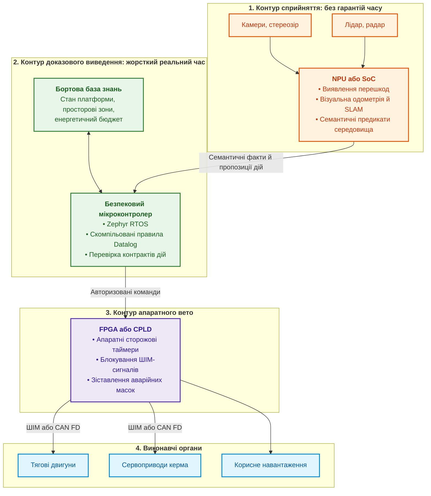
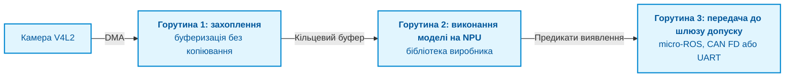
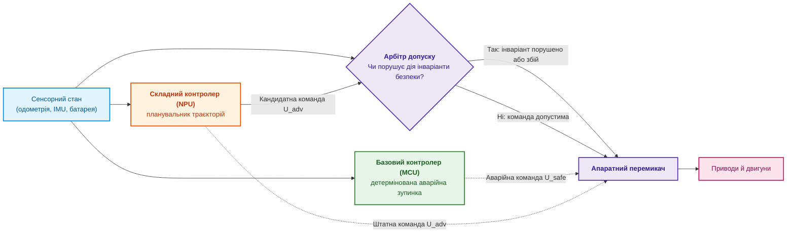
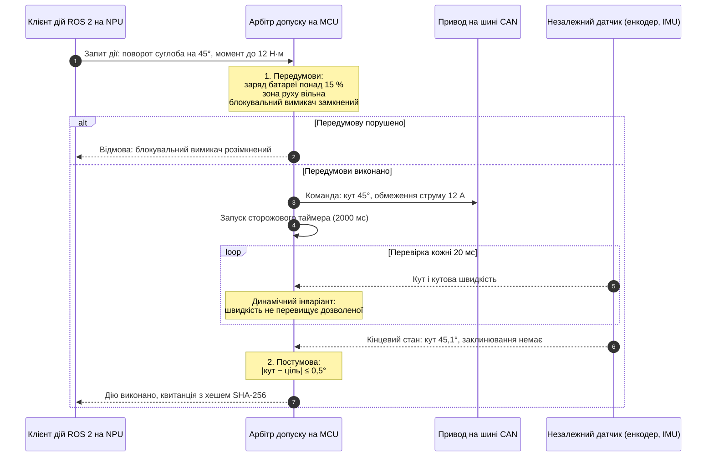
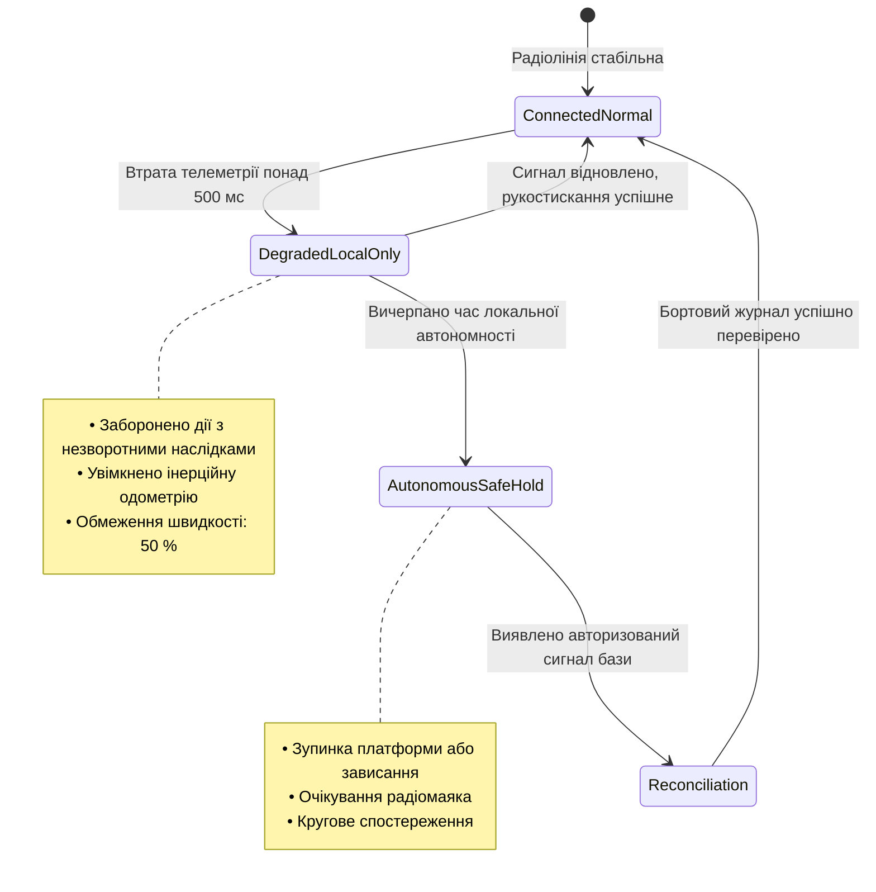
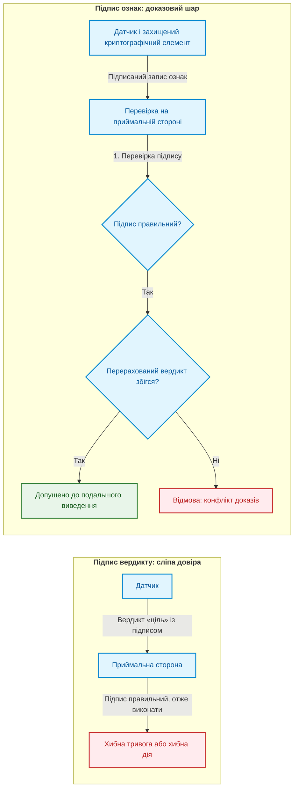
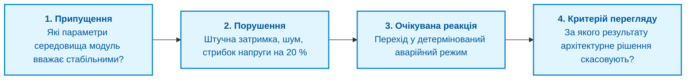
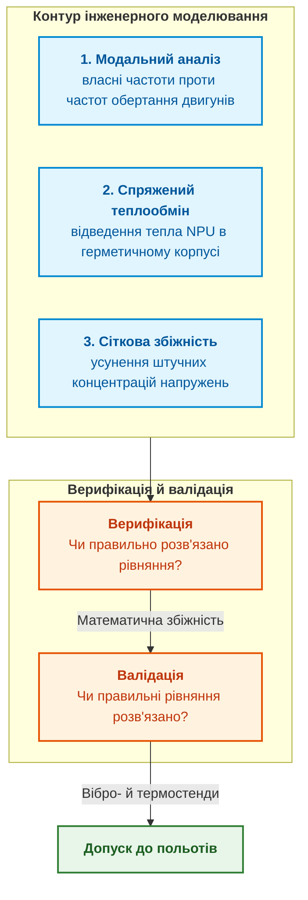

# Додаток Б. Доказові експертні системи в автономній робототехніці та кіберфізичних комплексах

> **Книга:** [Архітектура доказових експертних систем](README.md) · Додатки  
> **Попередній додаток:** [Додаток А. Практичний фреймворк доказового дослідження](appendix-a-evidence-governed-framework.md)  
> **Наступний додаток:** [Додаток В. Автономна навігація без GNSS: геопросторове зіставлення (TRN/DSMAC), візуальна одометрія (VIO) та експертний арбітраж сенсорного злиття](appendix-c-autonomous-navigation-and-geosearch.md)  
> **Зміст книги:** [README.md](README.md)  
> **Пов'язані глави книги:** [Глава 18. Інфраструктура виконання](ch18-execution-infrastructure.md) · [Глава 21. Від рекомендації до дії](ch21-from-recommendation-to-action.md) · [Глава 22. Кібернетичний цикл керування XXI століття](ch22-cybernetics-edge-to-backend.md) · [Глава 29. Нейро-символьна архітектура](ch29-neuro-symbolic-architecture.md)  
> **Суміжні дослідження автора:** [Військові експертні системи: БПЛА, ППО, РЕР/РЕБ](../MilTech/Military-Expert-Systems-UAS-AD-ELINT-EW-UA.md) · [Військова кібернетика](../MilTech/Ukrainian-Military-Cybernetics-UA.md) · [Апаратний корінь довіри та антиспуфінг](../MilTech/Hardware-Root-Of-Trust-And-Anti-Spoofing-Military-IoT-UA.md)  
> **Автор:** [Микола Федчик](about-the-author.md)  
> **Рівень:** архітектори автономних платформ, інженери вбудованих систем, фахівці з робототехніки (ROS 2, Zephyr RTOS), розробники критичних систем реального часу  
> **Очікувані результати:** відокремлювати ймовірнісне сприйняття від детермінованого допуску дій; будувати бортову базу знань без динамічної пам'яті; оформлювати фізичні дії як контракти з перевіркою передумов і постумов; перевіряти стики підсистем і фізичні моделі до польових випробувань.

## Чому робот не є «чатботом на колесах»

У споживчих застосунках штучного інтелекту помилка мовної моделі чи рекомендаційного алгоритму означає невдалий текст, повторний запит або перезавантаження сторінки. У кіберфізичних системах (*cyber-physical systems*, CPS) і в автономній робототехніці ціна помилки інша з трьох причин.

**Програма змінює фізичний світ.** Програмний агент керує напругою на силових інверторах, тиском у гідравліці, кутами відхилення рулів чи швидкістю обертання двигунів.

**Фізичні наслідки незворотні.** Команди `DropPayload()` чи `EmergencyBraking()` або поворот сервопривода на $90^\circ$ на швидкості 60 км/год витрачають енергію й змінюють матеріальний стан середовища. Такі команди не можна скасувати, як скасовують редагування тексту.

**Навіть мала ймовірність помилки швидко накопичується.** Якщо модель сприйняття помиляється з імовірністю $p$ на одному кроці, а контур керування працює з частотою $f$, то середній час до першої помилки дорівнює

```math
T_{\text{err}}=\frac{1}{p\,f}.
```

Для умовних $p=10^{-3}$ і $f=50$ Гц маємо $T_{\text{err}}=20$ с, а для $p=10^{-4}$ близько 3,3 хв. Числа тут припущені, але арифметика показує механізм: імовірнісний компонент, якому дозволено керувати напряму, рано чи пізно видасть хибну команду.

> [!IMPORTANT]
> **Головний принцип кіберфізичної безпеки в цьому додатку:**
> Жодна ймовірнісна нейронна мережа, ні згорткова мережа комп'ютерного зору, ні мультимодальна мовна модель, не отримує прямого доступу до шини керування приводами. Між сенсорним інтелектом і виконавчими органами стоїть детермінований **шлюз допуску** (*admission gate*): експертна система, реалізована на надійному обчислювачі.

Звідси головне запитання додатка: **як побудувати бортову експертну систему, яка допускає до виконання лише ті дії, безпеку яких можна перевірити, і як переконатися в цьому до виходу на полігон?** Подальші розділи відповідають на нього послідовно: від апаратного стека через архітектуру допуску, бортову базу знань і контракти дій до перевірки стиків і фізичних моделей.

## Гетерогенний бортовий обчислювач

Мобільний робот, дрон чи польова платформа обмежені розміром, масою, енергоспоживанням і вартістю (*size, weight, power and cost*, SWaP-C). Важкий універсальний обчислювач на борту швидко виснажує акумулятор, перегрівається й забирає корисне навантаження. Тому, як пояснює [Глава 18](ch18-execution-infrastructure.md), бортову архітектуру розділяють на кілька обчислювачів із різними ролями.



Схема читається згори вниз: сприйняття лише пропонує, безпековий мікроконтролер вирішує, а програмована логіка може в будь-який момент заблокувати сигнали на приводи. Ролі обчислювачів такі.

1. **Нейронний процесор (*neural processing unit*, NPU) або система на кристалі.** Прикладами є модулі NVIDIA Jetson Orin, процесори Rockchip RK3588 або модулі Hailo для одноплатних комп'ютерів. Програмне середовище: вбудований Linux із робототехнічним програмним каркасом ROS 2 [[1]](#src-1) або скомпільований виконуваний файл на Go чи C++. Завдання: обробка сирих сенсорних потоків, розпізнавання перешкод, побудова хмари точок. Статус надійності: складний контролер без гарантій; він може перезавантажитися або помилитися, і базова стабілізація платформи від цього не повинна зупинятися.
2. **Безпековий мікроконтролер.** Прикладами є багатоядерні мікроконтролери з апаратним резервуванням, у яких ядра працюють у режимі покрокового порівняння (*lockstep*). Операційна система реального часу Zephyr RTOS [[2]](#src-2) дає детерміноване планування потоків із витісненням і дозволяє обходитися без динамічного виділення пам'яті. Завдання: підтримка локальної бази фактів, виконання скомпільованих правил, перевірка передумов і постумов дій. Потрібний рівень цілісності визначає аналіз безпеки; для таких контролерів типовими цілями є рівень ASIL D за ISO 26262 [[3]](#src-3) або SIL 3 за IEC 61508 [[4]](#src-4).
3. **Апаратний арбітр на програмованій логіці (FPGA або CPLD).** Завдання: моніторинг шин живлення, контроль струмових обмежень, апаратне блокування драйверів двигунів у разі перевищення критичних кутів крену або виходу за межі дозволеної зони (*geofencing*). Програмована логіка реагує без участі програмного забезпечення, тому її час реакції визначає схема й вимірювання, а не планувальник операційної системи.

### Практичний шаблон: конвеєр комп'ютерного зору на Go і NPU

Для бортового виявлення перешкод критично прибрати зайві інтерпретовані прошарки, які додають непередбачувані затримки. Шаблон, який автор рекомендує для прототипів, поєднує одноплатний комп'ютер, нейронний процесор на шині PCIe і один скомпільований виконуваний файл на Go:



Шаблон має три властивості. Кадри зчитуються з драйвера V4L2 у буфери прямого доступу до пам'яті без зайвого копіювання. Модель виконується на NPU через бібліотеку виробника, викликану з Go. Горутини обмінюються через обмежені канали з політикою відкидання найстаріших кадрів, тож під час стрибків навантаження затримка не накопичується в черзі. Затримку й завантаження процесора для конкретної моделі й плати вимірюють на цільовому навантаженні, а не переносять із документації.

## Архітектура Сімплекс: складний контролер під наглядом простого

Щоб поєднати продуктивний, але неперевірюваний контролер із безпекою, використовують **архітектуру Сімплекс** (*Simplex architecture*). Лю Ша описав її принцип як використання простоти для контролю складності: простий перевірений контролер страхує складний [[5]](#src-5). Архітектура має три блоки.

1. **Складний контролер** працює на NPU, наприклад у навігаційному стеку Nav2 для ROS 2 [[6]](#src-6), і використовує нейронні мережі та складні алгоритми планування траєкторій.
2. **Базовий контролер** працює на безпековому мікроконтролері й містить просту логіку, безпечність якої можна довести: сповільнення, зависання на місці, аварійна посадка.
3. **Арбітр допуску** є символьним рушієм, який у реальному часі зіставляє запропоновану складним контролером команду з поточною моделлю стану робота.



### Формалізація інваріанта безпеки

Нехай $X(t)$ є вектором стану робота: координати, лінійна швидкість $v$, кутова швидкість $\omega$ і відстань до найближчої перешкоди $d_{obs}$. Запропоноване керування $U_{adv}=(a,\alpha)$ арбітр схвалює тоді й лише тоді, коли прогнозований гальмівний шлях $S_{stop}(v,a_{max})$ задовольняє умову

```math
d_{obs}-S_{stop}(v,a_{max})\ge D_{margin}+v\,\tau_{reaction},
```

де $D_{margin}$ є гарантованим захисним запасом, наприклад 0,5 м, а $\tau_{reaction}$ є максимальним часом реакції апаратного контуру, який вимірюють на цільовому обладнанні. Якщо $U_{adv}$ порушує нерівність або NPU не надав наступної команди за час сторожового таймера, наприклад 50 мс, арбітр вимикає лінію $U_{adv}$ і передає керування базовому контролеру, який гальмує з прискоренням $-a_{max}$.

## Бортова база знань: скомпільований Datalog без динамічної пам'яті

Вбудовані контролери мають оперативну пам'ять обсягом від сотень кілобайтів до кількох мегабайтів. Інтерпретатори Prolog або рушії правил із динамічним створенням об'єктів (`malloc`, `new`) у безпековому контурі небезпечні: фрагментація пам'яті й непередбачувані паузи порушують гарантії часу. Тому правила бази знань транслюють під час збирання в компактні структури мовою C, маски бітових прапорців і статичні таблиці переходів.

Мовою правил зручно обрати Datalog: це підмножина логічного програмування без функціональних символів, для якої виведення завжди завершується [[7]](#src-7). Розглянемо фрагмент правил оцінки польотного завдання безпілотного літального апарата:

```prolog
% Бортові правила безпеки польоту
hazard(critical_battery) :-
    telemetry(battery_voltage, V), V < 21.0.

hazard(geofence_breach) :-
    position(_Alt, Dist), Dist > 5000.

hazard(sensor_blindness) :-
    sensor_health(lidar, failed),
    sensor_health(optical_flow, degraded).

% Рішення про перехід в аварійний режим
action(emergency_landing) :-
    hazard(critical_battery).

action(return_to_home) :-
    hazard(geofence_breach),
    not hazard(critical_battery).

action(hold_position) :-
    hazard(sensor_blindness),
    not hazard(critical_battery).
```

### Генерація коду для Zephyr RTOS

Генератор знань перетворює ці правила на функцію мовою C без динамічного виділення пам'яті. Фрагмент нижче ілюструє результат генерації; для компіляції поза Zephyr достатньо прибрати включення `zephyr/kernel.h`.

```c
/* Згенеровано компілятором знань для Zephyr RTOS */
#include <zephyr/kernel.h>
#include <stdint.h>
#include <stdbool.h>

typedef struct {
    float battery_voltage;
    float distance_from_home;
    float altitude;
    uint8_t lidar_status;       /* 0 = OK, 1 = Degraded, 2 = Failed */
    uint8_t opt_flow_status;
} RobotTelemetry_t;

typedef enum {
    ACTION_CONTINUE = 0,
    ACTION_HOLD_POSITION,
    ACTION_RETURN_TO_HOME,
    ACTION_EMERGENCY_LANDING
} SafetyVerdict_t;

SafetyVerdict_t evaluate_safety_rules(const RobotTelemetry_t *const telem) {
    const bool critical_battery = (telem->battery_voltage < 21.0f);
    if (critical_battery) {
        return ACTION_EMERGENCY_LANDING; /* найвищий пріоритет */
    }

    const bool geofence_breach = (telem->distance_from_home > 5000.0f);
    if (geofence_breach) {
        return ACTION_RETURN_TO_HOME;
    }

    const bool sensor_blind = (telem->lidar_status == 2) &&
                              (telem->opt_flow_status >= 1);
    if (sensor_blind) {
        return ACTION_HOLD_POSITION;
    }

    return ACTION_CONTINUE;
}
```

Порівняння правил і коду показує дві речі. По-перше, функція не виділяє пам'яті, не має циклів і рекурсії, тому час її виконання обмежений, а верхню межу отримують аналізом найгіршого часу виконання (*worst-case execution time*, WCET) або вимірюванням на цільовому мікроконтролері. По-друге, коли спрацьовують кілька правил, Datalog виводить кілька дій одночасно, а згенерований код обирає одну за явним пріоритетом: за одночасного виходу із зони й засліплення датчиків перемагає повернення додому. Такий пріоритет є частиною бази знань і має бути записаний і перевірений, а не виникати з порядку рядків у генераторі.

## Контракти дій і транзакції у фізичному світі

[Глава 21](ch21-from-recommendation-to-action.md) пояснює, що виконання команди у фізичному світі потребує зворотного зв'язку: робот не може надіслати байти в шину CAN і вважати задачу виконаною. Тому складну дію оформлюють як контракт із передумовами, виконанням, постумовами й компенсацією. Така схема продовжує ідею саг із баз даних, де довга транзакція складається з кроків, для кожного з яких визначено компенсувальну дію [[8]](#src-8).



### Структура контракту дії мовою C

```c
struct ActionContract {
    uint32_t action_id;
    uint32_t timeout_ms;

    /* Передумови: повертає true, якщо обладнання готове */
    bool (*check_preconditions)(void);

    /* Виконання: запис у регістри або в шину CAN */
    int (*execute_command)(void *params);

    /* Постумови: незалежне підтвердження датчиками */
    bool (*verify_postconditions)(void *params);

    /* Компенсація: безпечна дія в разі зриву */
    void (*compensate_failure)(void);
};
```

Припустімо, що під час повороту датчик струму фіксує перевантаження понад 15 А, а енкодер не реєструє зміни кута, тобто редуктор заклинило. Контракт зривається: функція `compensate_failure()` знімає напругу з обмоток двигуна, фіксує механічне гальмо й повертає на верхній рівень статус аномалії. Квитанція виконаної дії й запис про зрив контракту потрапляють до бортового журналу доказів.

## Автономність за втрати зв'язку та в умовах радіоелектронної боротьби

У польовій робототехніці й у військових застосуваннях ([Військові експертні системи](../MilTech/Military-Expert-Systems-UAS-AD-ELINT-EW-UA.md)) зв'язок із пунктом керування можуть навмисно придушувати, спотворювати або повністю втрачати. Бортова система тому реалізує автомат деградації режимів, узгоджений із [Главою 22](ch22-cybernetics-edge-to-backend.md).



Автомат має чотири стани, і кожен наступний стан звужує повноваження платформи. Поріг 500 мс і обмеження швидкості 50 % тут є прикладами, які для конкретної платформи визначає аналіз безпеки.

### Правила поведінки за відсутності надійного GNSS

У зоні спуфінгу глобальних навігаційних супутникових систем (*Global Navigation Satellite System*, GNSS) бортова експертна система шукає суперечності між незалежними джерелами руху. Огляд Псякі й Гамфріса описує спуфінг GNSS і методи його виявлення, зокрема перевірку узгодженості з інерціальними вимірюваннями [[9]](#src-9).

1. **Інваріант узгодженості одометрії:**

   ```math
   \left\lVert\mathbf{v}_{GNSS}-\mathbf{v}_{Wheel/IMU}\right\rVert_2>\Delta V_{threshold}.
   ```

   Якщо приймач GNSS повідомляє про швидкість 80 км/год, а інтегровані показання колісних енкодерів та акселерометрів вказують на 10 км/год, супутниковий канал позначають як скомпрометований (`Status = SPOOFED`).
2. **Реакція:** координати GNSS виключають із фільтра Калмана [[10]](#src-10), а платформа переходить до інерційно-оптичної навігації й зберігає останню перевірену точку бази в енергонезалежній пам'яті. Докладно навігацію без GNSS розглядає [Додаток В](appendix-c-autonomous-navigation-and-geosearch.md).

## Доказовий шар сенсорних вимірювань: підписувати ознаки, а не вердикти

У розподілених мережах датчиків (акустичних пеленгаторів, радіочастотних сканерів, сейсмодатчиків) є вразливість, яку легко пропустити: **підписане повідомлення доводить автентичність відправника, але не доводить правильності висновку**. Петро Сідлярчук у репозиторії witness-integrity формулює цю думку так: підпис доводить авторство, а не істину [[11]](#src-11).

Звідси два ризики. Якщо захоплений або пошкоджений датчик надсилає підписаний статус «ціль виявлено», приймальна сторона може лише прийняти або відкинути вердикт, але не може з'ясувати, на чому вердикт ґрунтується. Якщо ж датчик помилився через фізичне середовище, підпис теж буде бездоганним. За описом автора репозиторію, під час їхніх випробувань акустичний детектор стабільно тримав основний тон 84 Гц із гармоніками й повідомив про ціль, хоча джерелом була лінія електропередачі за кількасот метрів [[11]](#src-11).



Реалізація в репозиторії witness-integrity задає контракт доказового датчика з чотирьох правил [[11]](#src-11).

1. **Датчик підписує ознаки, а не висновок.** Запис має канонічну двійкову форму з фіксованим порядком полів і лише цілочисельними значеннями: дві реалізації з рухомою комою розходяться, і тоді підписи перестають збігатися з причин, яких ніхто не знайде.
2. **Ключ не залишає кристала.** Підпис створює захищений криптографічний елемент ATECC608B, а приватний ключ зберігається в самому елементі.
3. **Неможливий запис не отримує підпису.** Перевірка узгодженості виконується до підписування: запис, у якому підтверджених кадрів більше, ніж кадрів загалом, не міг існувати, тому перевірка блокує підпис, а не супроводжує його.
4. **Приймальна сторона перераховує вердикт.** Приймач перевіряє підпис і заново обчислює вердикт за тими самими правилами; розбіжність між заявленим і перерахованим вердиктом сама є сигналом і закриває довіру.

Для бортової експертної системи цей шаблон означає, що факт від зовнішнього датчика потрапляє до бази фактів лише разом із підписаними ознаками й результатом перерахунку. Ширше питання апаратного кореня довіри розглядає окрема стаття автора [Апаратний корінь довіри та антиспуфінг](../MilTech/Hardware-Root-Of-Trust-And-Anti-Spoofing-Military-IoT-UA.md).

## Нефункціональні інтерфейси й межі припущень перед інтеграцією

У складних кіберфізичних системах трапляється парадокс: дві справні підсистеми утворюють одну несправну систему. Компонент A, наприклад тепловізійна камера чи радіомодуль, і компонент B, наприклад приймач GNSS чи польотний контролер, можуть окремо відповідати специфікаціям і проходити модульні тести, але відмовляти після складання платформи. Настанова NASA із системної інженерії тому виділяє керування інтерфейсами в окремий процес життєвого циклу [[12]](#src-12).

Причиною часто є приховані нефункціональні інтерфейси:

- **спільне живлення й контури заземлення:** імпульсні сплески струму двигунів спричиняють просідання напруги на цифровій шині датчиків;
- **електромагнітні й радіочастотні завади:** випромінювання швидких цифрових інтерфейсів камери може погіршувати прийом антени навігаційного приймача, розташованої поруч, тому розміщення антен і екранування перевіряють на зібраній платформі;
- **тепло й вібрація:** нагрівання силового драйвера змінює температурний дрейф гіроскопів інерціального модуля.

### Чотири кроки перевірки інженерних припущень

Перед дорогими натурними випробуваннями експертна система проєктування має вимагати заповнення матриці припущень на кожному стику підсистем:



Особливу увагу приділяють сірій зоні часткової деградації. Систему перевіряють не лише на повну відмову, як-от обрив дроту, а й на поступовий дрейф калібрувань після кількох термічних циклів, короткі серії нерівномірних затримок на шині та нестабільність тактових генераторів.

## Фізичне моделювання: вібрація, тепло й сіткова збіжність

Надійність програмного забезпечення не допоможе, якщо обчислювач перегріється в герметичному відсіку, а інерціальні датчики отримуватимуть резонансні вібрації двигунів. Тому бортовий обчислювач перевіряють інженерним комп'ютерним моделюванням (*computer-aided engineering*, CAE) і стендовими випробуваннями. Оберкампф і Рой розрізняють два запитання: верифікація перевіряє, чи правильно розв'язано рівняння моделі, а валідація перевіряє, чи правильні рівняння описують реальну систему [[13]](#src-13).



**Модальний аналіз.** Гвинти дрона збуджують вібрації на частоті проходження лопатей

```math
f=\frac{\text{RPM}\cdot N_{\text{blades}}}{60},
```

де RPM є кількістю обертів за хвилину, а $N_{\text{blades}}$ є кількістю лопатей. Якщо власна частота рами або кронштейна обчислювача збігається з цією частотою чи її гармоніками, виникає резонанс. Вібрації передаються на акселерометри й гіроскопи, і фільтр Калмана може сприйняти псевдоприскорення як реальний маневр. Втомні напруження спричиняють мікротріщини в паяних з'єднаннях корпусів BGA і розхитують роз'єми. Модальний аналіз дає змогу підібрати демпфери й ребра жорсткості так, щоб перша власна частота рами лежала поза робочим діапазоном двигунів.

**Спряжений теплообмін** (*conjugate heat transfer*, CHT). У герметичному корпусі без примусового обдуву тепло від нейронного прискорювача відводиться теплопровідністю через термоінтерфейси на шасі й далі конвекцією в набігаючий потік повітря. Потужність, яку розсіює прискорювач, беруть із документації й вимірювання на цільовому навантаженні. Різниця коефіцієнтів теплового розширення плати й корпусу створює термомеханічні напруження під час різкого охолодження, наприклад від $+40\,^\circ\text{C}$ біля землі до $-20\,^\circ\text{C}$ на висоті. Моделювання теплообміну має показати, що температура кристала залишається нижче порога, за якого прискорювач знижує частоту й падає швидкість виявлення.

**Сіткова збіжність.** Результатам скінченноелементного аналізу не можна довіряти без перевірки збіжності за сіткою. На гострих внутрішніх кутах кронштейнів модель дає сингулярність: зі згущенням сітки напруження необмежено зростають, і гарні кольорові картинки показують артефакт, а не фізику. Роуч запропонував уніфікований спосіб звітувати про дослідження згущення сітки, зокрема індекс збіжності сітки [[14]](#src-14). Критерій збіжності, наприклад допустиму зміну результату за подвоєння густини сітки, команда фіксує до розрахунку, а локальні напруження перевіряє з урахуванням нелінійності матеріалу.

## Покрокове розгортання прототипу

Мінімальний стенд бортової експертної системи робота можна зібрати за чотири кроки.

### Крок 1. Середовище розробки

Встановіть середовище крос-компіляції Zephyr за офіційною настановою [[2]](#src-2). Для Linux базова послідовність така:

```bash
python3 -m venv ~/zephyrproject/.venv
source ~/zephyrproject/.venv/bin/activate
pip install west
west init ~/zephyrproject
cd ~/zephyrproject && west update
west zephyr-export
```

Після цього встановіть залежності Python і набір засобів Zephyr SDK так, як описує актуальна версія настанови, бо команди встановлення залежностей змінюються між версіями Zephyr.

### Крок 2. Правила безпеки

Створіть файл правил `safety_rules.dl` у директорії проєкту:

```prolog
% Вхідні предикати: distance(SensorID, Centimeters)
unsafe_zone(SensorID) :- distance(SensorID, D), D < 30.
emergency_stop :- unsafe_zone(_).
```

### Крок 3. Потік нагляду на Zephyr RTOS

Створіть потік нагляду з фіксованим періодом 10 мс. Фрагмент нижче передбачає, що в дереві пристроїв плати визначено вузол `motor_switch`, а функцію `read_sonar_distance()` реалізовано драйвером далекоміра.

```c
#include <zephyr/kernel.h>
#include <zephyr/drivers/gpio.h>

#define SUPERVISOR_PERIOD_MS 10

static const struct gpio_dt_spec motor_en =
    GPIO_DT_SPEC_GET(DT_NODELABEL(motor_switch), gpios);

uint16_t read_sonar_distance(void); /* реалізує драйвер далекоміра */

void safety_supervisor_thread(void *arg1, void *arg2, void *arg3) {
    gpio_pin_configure_dt(&motor_en, GPIO_OUTPUT_ACTIVE);

    while (1) {
        uint16_t front_distance = read_sonar_distance();

        if (front_distance < 30) {
            gpio_pin_set_dt(&motor_en, 0); /* вимкнути живлення приводів */
            printk("SAFETY INTERLOCK: obstacle at %d cm, motors disabled\n",
                   front_distance);
        } else {
            gpio_pin_set_dt(&motor_en, 1);
        }

        k_msleep(SUPERVISOR_PERIOD_MS);
    }
}

K_THREAD_DEFINE(safety_thread_id, 1024, safety_supervisor_thread,
                NULL, NULL, NULL, 1, 0, 0);
```

Потік щоперіоду читає відстань і перевіряє той самий інваріант, що й правило `unsafe_zone`: якщо перешкода ближча за 30 см, живлення приводів вимикається. Функція `k_msleep` задає період лише приблизно, тому для жорстких вимог до періоду використовують таймери ядра й вимірюють фактичний джитер.

### Крок 4. Моделювання з обладнанням у контурі

Перед завантаженням у фізичний контролер проведіть моделювання з обладнанням у контурі (*hardware-in-the-loop*, HIL):

1. Запустіть симулятор середовища, наприклад Gazebo Sim або Isaac Sim, на робочій станції.
2. Підключіть плату контролера через адаптер USB-CAN до віртуальної шини `vcan0`.
3. Переконайтеся, що за штучного шуму в топіку `/cmd_vel` плата контролера стабільно перехоплює керування за визначений для проєкту час.

## Перелік перевірок перед виходом на полігон

Перед польовими випробуваннями кіберфізичної платформи заповніть перелік перевірок безпеки:

| № | Перевірка безпеки | Механізм контролю | Статус |
| :-: | :--- | :--- | :-: |
| 1 | **Фізична ізоляція приводів** | Апаратний аварійний вимикач розриває силове коло акумулятора незалежно від прошивки мікроконтролера | [ ] |
| 2 | **Апаратний сторожовий таймер** | Увімкнено незалежний апаратний сторожовий таймер мікроконтролера з таймаутом, визначеним аналізом безпеки | [ ] |
| 3 | **Жодного динамічного виділення пам'яті** | У коді безпекового нагляду немає викликів `malloc()`, `free()`, динамічних списків і рекурсії | [ ] |
| 4 | **Коридори швидкостей** | Максимальні кутові швидкості обмежені насиченням на рівні драйвера двигуна | [ ] |
| 5 | **Перевірка зворотного зв'язку** | Кожна команда переміщення має таймаут постумови, що опитує незалежний енкодер або датчик струму | [ ] |
| 6 | **Захист від засліплення** | Вихід з ладу камер або лідара переводить платформу в режим `AutonomousSafeHold` | [ ] |
| 7 | **Шлюз між NPU і мікроконтролером** | Обмін між планувальником на Linux і безпековим мікроконтролером ведеться типізованими пакетами з контрольною сумою CRC32 | [ ] |
| 8 | **Захист від спуфінгу GNSS** | Перехресна перевірка відкидає стрибки супутникових координат, що суперечать показанням інерціального модуля | [ ] |
| 9 | **Підписана конфігурація** | Набір правил і межі дозволених зон підписані цифровим підписом розробника ([Глава 22](ch22-cybernetics-edge-to-backend.md)) | [ ] |
| 10 | **Незмінний бортовий реєстратор** | Останні 10 хвилин телеметрії, станів автомата режимів і дій зберігаються в енергонезалежній пам'яті | [ ] |

Кожен рядок переліку відповідає одному з механізмів, описаних вище, тож заповнений перелік є частиною пакета доказів готовності платформи.

## Висновок

Додаток почався із запитання, як побудувати бортову експертну систему, що допускає до виконання лише перевірювані дії. Відповідь складається з кількох рівнів захисту. Ймовірнісне сприйняття на NPU лише пропонує дії, безпековий мікроконтролер перевіряє пропозиції скомпільованими правилами без динамічної пам'яті, а програмована логіка може апаратно заблокувати приводи. Архітектура Сімплекс передає керування простому базовому контролеру, щойно пропозиція складного контролера порушує інваріант безпеки. Фізичні дії оформлено як контракти з передумовами, постумовами й компенсацією, а факти від зовнішніх датчиків допускаються лише разом із підписаними ознаками, за якими вердикт можна перерахувати.

Межі теж визначені. Числа в прикладах (пороги, таймаути, запаси) є ілюстраціями, які для конкретної платформи встановлює аналіз безпеки. Рівні цілісності ASIL чи SIL підтверджує сертифікаційний процес, а не архітектурна схема. Стики підсистем і фізичні моделі перевіряють окремо, бо справні компоненти можуть утворити несправну систему. Навігацію без GNSS продовжує [Додаток В](appendix-c-autonomous-navigation-and-geosearch.md), а межі повноважень автономних дій описує [Глава 21](ch21-from-recommendation-to-action.md).

## Словник

| Український термін | Англійський відповідник | Коротке пояснення |
|---|---|---|
| Кіберфізична система | *cyber-physical system* | Система, у якій обчислення безпосередньо керують фізичними процесами |
| Шлюз допуску | *admission gate* | Детермінований компонент, що дозволяє або забороняє виконання дії |
| Архітектура Сімплекс | *Simplex architecture* | Схема, у якій простий перевірений контролер страхує складний |
| Інваріант безпеки | *safety invariant* | Умова, яка має виконуватися в кожному допустимому стані |
| Сторожовий таймер | *watchdog timer* | Таймер, що вмикає аварійну реакцію, якщо програма вчасно його не скинула |
| Покрокове порівняння ядер | *lockstep* | Режим, у якому два ядра виконують ту саму програму, а розбіжність сигналізує про збій |
| Контракт дії | *action contract* | Опис дії з передумовами, виконанням, постумовами й компенсацією |
| Сага | *saga* | Довга транзакція з кроків, кожен з яких має компенсувальну дію |
| Компенсувальна дія | *compensating action* | Дія, що повертає систему в безпечний стан після зриву кроку |
| Спуфінг GNSS | *GNSS spoofing* | Підміна супутникових навігаційних сигналів хибними |
| Підпис ознак | *feature signing* | Підписування ознак, з яких обчислено вердикт, замість самого вердикту |
| Нефункціональний інтерфейс | *non-functional interface* | Непередбачений фізичний зв'язок підсистем через живлення, завади, тепло чи вібрацію |
| Сіткова збіжність | *mesh convergence* | Стабільність результату чисельного розрахунку за згущення сітки |
| Моделювання з обладнанням у контурі | *hardware-in-the-loop* | Випробування реального контролера з імітованим середовищем |

## Абревіатури

| Скорочення | Розшифрування | Значення |
|---|---|---|
| ASIL | Automotive Safety Integrity Level | рівень цілісності безпеки автомобільних систем за ISO 26262 |
| BGA | Ball Grid Array | корпус мікросхеми з кульковими виводами |
| CAE | Computer-Aided Engineering | інженерне комп'ютерне моделювання |
| CAN FD | Controller Area Network Flexible Data-Rate | шина CAN зі змінною швидкістю передавання даних |
| CHT | Conjugate Heat Transfer | спряжений теплообмін |
| CPLD | Complex Programmable Logic Device | складний програмований логічний пристрій |
| CPS | Cyber-Physical System | кіберфізична система |
| CRC32 | Cyclic Redundancy Check, 32 bits | 32-бітна циклічна контрольна сума |
| DMA | Direct Memory Access | прямий доступ до пам'яті |
| FPGA | Field-Programmable Gate Array | програмована логічна матриця |
| GNSS | Global Navigation Satellite System | глобальна навігаційна супутникова система |
| HIL | Hardware-in-the-Loop | моделювання з обладнанням у контурі |
| IMU | Inertial Measurement Unit | інерціальний вимірювальний модуль |
| MCU | Microcontroller Unit | мікроконтролер |
| NPU | Neural Processing Unit | нейронний процесор |
| RPM | Revolutions Per Minute | обертів за хвилину |
| RTOS | Real-Time Operating System | операційна система реального часу |
| SIL | Safety Integrity Level | рівень цілісності безпеки за IEC 61508 |
| SLAM | Simultaneous Localization and Mapping | одночасна локалізація й побудова карти |
| SoC | System on Chip | система на кристалі |
| SWaP-C | Size, Weight, Power and Cost | розмір, маса, енергоспоживання й вартість |
| WCET | Worst-Case Execution Time | найгірший час виконання |
| ШІМ | широтно-імпульсна модуляція | спосіб керування потужністю імпульсами змінної ширини |

## Джерела

1. <a id="src-1"></a>ROS 2. [*The Robot Operating System*](https://github.com/ros2/ros2). Репозиторій GitHub.
2. <a id="src-2"></a>Zephyr Project. [*Getting Started Guide*](https://docs.zephyrproject.org/latest/develop/getting_started/index.html). Zephyr Project Documentation.
3. <a id="src-3"></a>ISO. [*ISO 26262-1:2018. Road vehicles: Functional safety: Part 1: Vocabulary*](https://www.iso.org/standard/68383.html). 2018.
4. <a id="src-4"></a>IEC. [*IEC 61508-1:2010. Functional safety of electrical/electronic/programmable electronic safety-related systems: Part 1: General requirements*](https://webstore.iec.ch/en/publication/5515). 2010.
5. <a id="src-5"></a>Lui Sha. [*Using Simplicity to Control Complexity*](https://doi.org/10.1109/MS.2001.936213). *IEEE Software*, 18(4), 20–28, 2001.
6. <a id="src-6"></a>ROS Navigation. [*Navigation2: ROS 2 Navigation Framework and System*](https://github.com/ros-navigation/navigation2). Репозиторій GitHub.
7. <a id="src-7"></a>S. Ceri, G. Gottlob, L. Tanca. [*What You Always Wanted to Know About Datalog (and Never Dared to Ask)*](https://doi.org/10.1109/69.43410). *IEEE Transactions on Knowledge and Data Engineering*, 1(1), 146–166, 1989.
8. <a id="src-8"></a>Hector Garcia-Molina, Kenneth Salem. [*Sagas*](https://doi.org/10.1145/38713.38742). *Proceedings of the 1987 ACM SIGMOD International Conference on Management of Data*, 249–259, 1987.
9. <a id="src-9"></a>Mark L. Psiaki, Todd E. Humphreys. [*GNSS Spoofing and Detection*](https://doi.org/10.1109/JPROC.2016.2526658). *Proceedings of the IEEE*, 104(6), 1258–1270, 2016.
10. <a id="src-10"></a>R. E. Kalman. [*A New Approach to Linear Filtering and Prediction Problems*](https://doi.org/10.1115/1.3662552). *Journal of Basic Engineering*, 82(1), 35–45, 1960.
11. <a id="src-11"></a>Petro Sidliarchuk. [*Witness Integrity for Measurement Devices*](https://github.com/sidliarchukpetro/witness-integrity). Репозиторій GitHub, проєкт InfraVeritas.
12. <a id="src-12"></a>NASA. [*NASA Systems Engineering Handbook*](https://www.nasa.gov/reference/systems-engineering-handbook/). NASA SP-2016-6105 Rev2.
13. <a id="src-13"></a>William L. Oberkampf, Christopher J. Roy. [*Verification and Validation in Scientific Computing*](https://doi.org/10.1017/CBO9780511760396). Cambridge University Press, 2010.
14. <a id="src-14"></a>P. J. Roache. [*Perspective: A Method for Uniform Reporting of Grid Refinement Studies*](https://doi.org/10.1115/1.2910291). *Journal of Fluids Engineering*, 116(3), 405–413, 1994.

---

[← Додаток А](appendix-a-evidence-governed-framework.md) | [Зміст книги](README.md) | [Додаток В →](appendix-c-autonomous-navigation-and-geosearch.md)
