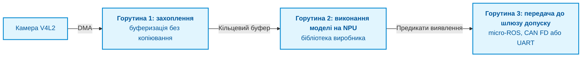
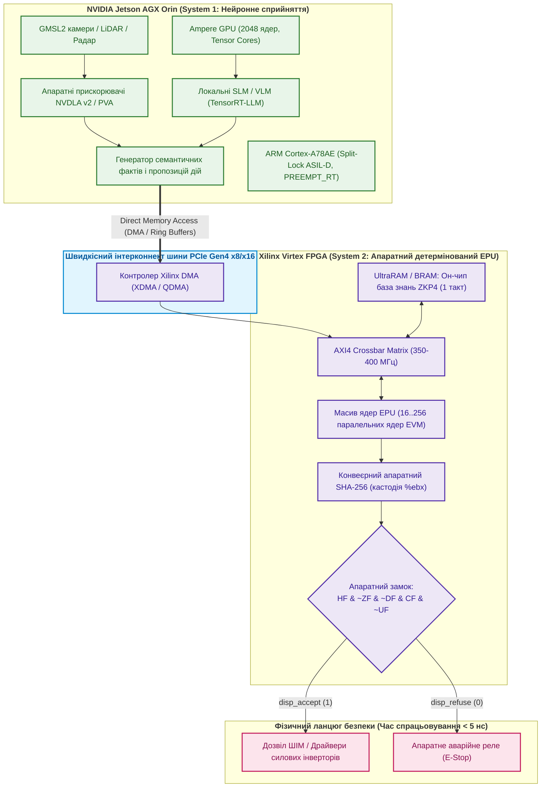
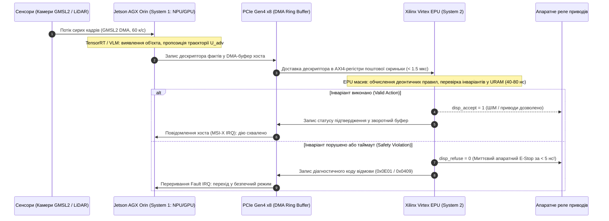
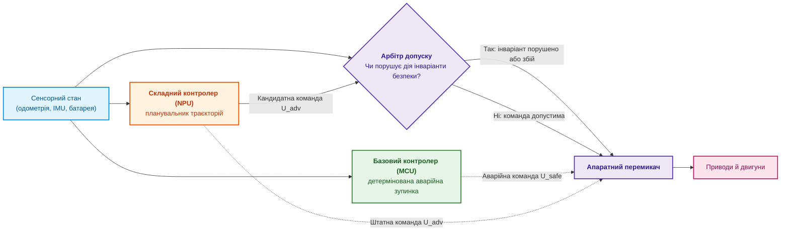
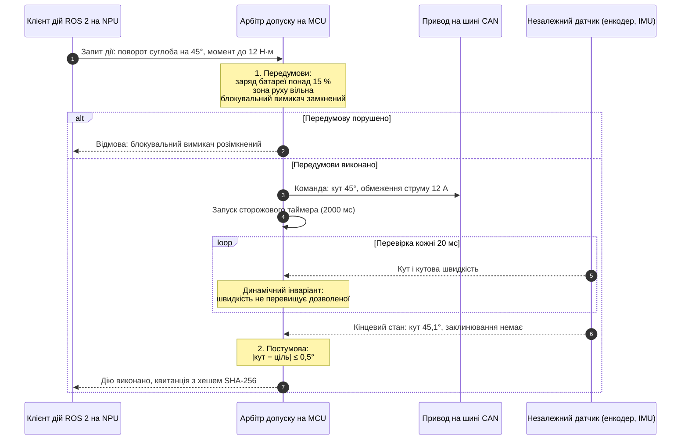
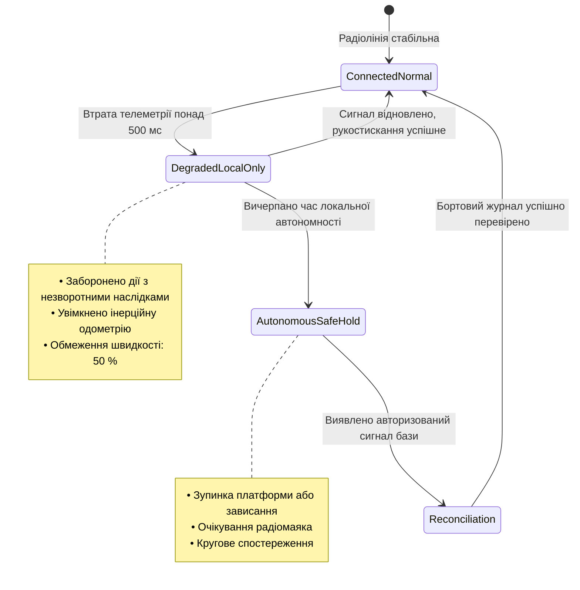
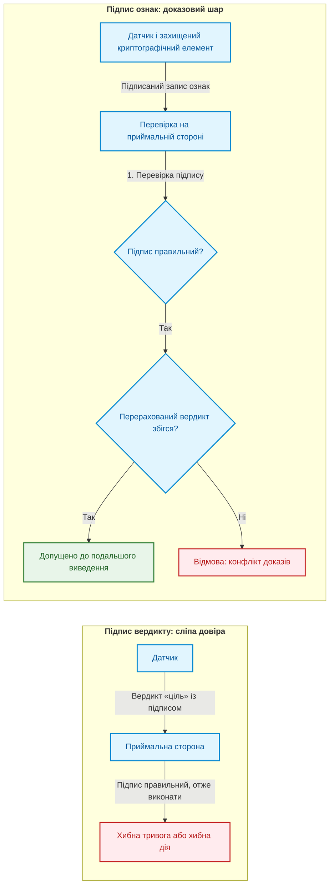
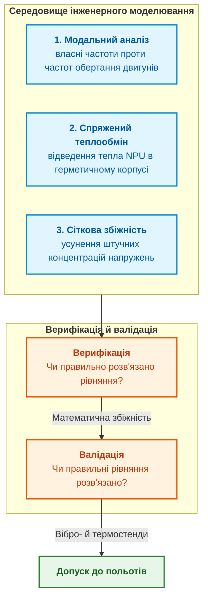

# Додаток Б. Доказові експертні системи в автономній робототехніці та кіберфізичних комплексах

> **Книга:** [Архітектура доказових експертних систем](README.md) · Додатки  
> **Зміст книги:** [README.md](README.md)  
> **Автор:** [Микола Федчик](about-the-author.md)  
> **Рівень:** архітектори автономних платформ, інженери вбудованих систем, фахівці з робототехніки (ROS 2, Zephyr RTOS), розробники критичних систем реального часу  
> **Очікувані результати:** відокремлювати ймовірнісне сприйняття від детермінованого допуску дій; будувати бортову базу знань без динамічної пам'яті; оформлювати фізичні дії як контракти з перевіркою передумов і постумов; перевіряти стики підсистем і фізичні моделі до польових випробувань.

---

## Анотація

У критично важливих автономних комплексах та мобільній робототехніці (ISO 26262 ASIL D, IEC 61508 SIL 3, DO-178C DAL A) пряме підключення нейромережевих моделей сприйняття чи мультимодального ШІ до виконавчих приводів неминуче спричиняє катастрофічні аварії. Фізичні наслідки дій робота (аварійне гальмування, скидання вантажу, різкий поворот рулів) є незворотними й витрачають реальну кінетичну енергію. За частоти циклу керування $f = 50\ \text{Гц}$ навіть мізерна ймовірність помилки класифікації чи виявлення $p = 10^{-3}$ гарантує небезпечну команду в середньому вже через $T_{\text{err}} = 1/(p \cdot f) = 20\ \text{секунд}$ польоту або руху.

Цей додаток розв'язує проблему шляхом впровадження фундаментального принципу кіберфізичної безпеки: жорсткого відокремлення ймовірнісного сенсорного інтелекту від детермінованого допуску дій. Автором запропоновано та детально розглянуто трирівневу гетерогенну бортову архітектуру (SoC/NPU для комп'ютерного зору, надійний мікроконтролер на Zephyr RTOS зі скомпільованими правилами Datalog у статичній пам'яті без динамічного виділення `malloc`, та апаратний арбітр вето на FPGA з часом відсікання $< 100\ \text{нс}$), формальні контракти дій із верифікацією перед- і післяумов та методи виявлення стикових дефектів до польових випробувань на полігоні.

---

## Фізична незворотність та кібернетичні межі: фундаментальна відмінність кіберфізичних систем від генеративного ШІ

Спроби перенести архітектурні патерни споживчого генеративного штучного інтелекту безпосередньо в автономну робототехніку та кіберфізичні системи (*cyber-physical systems*, CPS) становлять одну з найбільш руйнівних інженерних оман сучасності. Поширена у публіцистиці спрощена метафора автономного робота як «мовної моделі на колесах» чи концепція наскрізного керування (*End-to-End Vision-Language-Action, VLA*), де стохастична нейромережа напряму синтезує керуючі струми приводів із пікселів камери, у критичних застосунках гарантовано призводить до аварій. 

Причина полягає в принциповій онтологічній різниці між віртуальним простором генерації тексту та фізичною реальністю. У цій вступній частині сформульовано фундаментальні фізичні та кібернетичні обмеження, які вимагають принципово іншого підходу до проєктування бортового інтелекту та слугують преамбулою до всіх наступних розділів цього додатка.

### 1. Термодинамічна та матеріальна незворотність фізичної дії

У програмних продуктах загального призначення (пошукові системи, генеративні чат-боти, рекомендаційні сервіси) помилка чи галюцинація моделі не несе прямої фізичної загрози: її наслідком є невдалий рядок тексту на екрані, повторний запит користувача або перезавантаження сторінки. Навіть у фінансових чи облікових базах даних діє механізм транзакційного відкату (`ROLLBACK`), що повертає систему у вихідний стан.

У кіберфізичних комплексах програмний код перетворює обчислювальні вердикти на перерозподіл реальної енергії:
* керує напругою та шириною імпульсів на затворах силових транзисторів інверторів тягових електродвигунів;
* регулює тиск у гідравлічних магістралях та клапанах гальмівних систем;
* змінює кути атаки аеродинамічних рулів або тягу маршових двигунів БПЛА;
* подає струм на піропатрони розмикачів корисного навантаження.

Кожна виконана фізична дія — наприклад, `EmergencyBraking()`, `DropPayload()` або різкий поворот сервопривода на $90^\circ$ на швидкості 80 км/год — вивільняє кінетичну або теплову енергію та безпосередньо змінює стан навколишнього середовища. 

У фізичному світі не існує оператора скасування: деформацію металу внаслідок удару, зрізані зубці редуктора, спалений силовий ключ інвертора чи втрату аеродинамічної стійкості апарата неможливо «виправити новим промптом». Зміна ентропії є незворотною. Тому будь-яка дія, що виходить за межі безпечного фізичного стану платформи, має блокуватися до її фізичної активації, а не коригуватися після факту аварії.

### 2. Кібернетичне накопичення ймовірності відмови у високочастотному циклі

Якщо користувач чат-бота робить один запит за хвилину ($f \approx 0{,}016\ \text{Гц}$), то бортовий цикл керування робототехнічної платформи виконує розрахунки з частотою від десятків до сотень герців: $f = 50\ \text{Гц}$ для планування траєкторій, $f = 200\ \text{Гц}$ для розрахунку кутової орієнтації та $f \ge 1000\ \text{Гц}$ для струмових ланцюгів силових приводів.

За такої високої інтенсивності навіть мізерна за мірками машинного навчання ймовірність помилки класифікації чи локалізації неминуче спричиняє швидку відмову. Середній час до першої критичної помилки ($T_{\text{err}}$) визначається співвідношенням:

```math
T_{\text{err}} = \frac{1}{p\,f}.
```

Тут:
- $T_{\text{err}}$ — середній час функціонування до виникнення першої помилки сприйняття або планування, у секундах;
- $p$ — імовірність помилки нейромережевої моделі на одному кроці дискретного часу (безрозмірна величина в діапазоні $[0, 1]$);
- $f$ — частота виконання циклу керування, у герцах (Гц).

Оскільки за секунду система виконує $f$ кроків, математичне сподівання кількості згенерованих помилок за одиницю часу дорівнює добутку $p\,f$. Відповідно, середній інтервал очікування першої небезпечної команди є оберненою величиною $1/(p\,f)$.

```math
\begin{aligned}
\text{При } p = 10^{-3}\ (99{,}9\%\ \text{точності}),\ f = 50\ \text{Гц} &\implies T_{\text{err}} = \frac{1}{10^{-3} \cdot 50} = 20\ \text{секунд}; \\
\text{При } p = 10^{-3}\ (99{,}9\%\ \text{точності}),\ f = 200\ \text{Гц} &\implies T_{\text{err}} = \frac{1}{10^{-3} \cdot 200} = 5\ \text{секунд}; \\
\text{При } p = 10^{-4}\ (99{,}99\%\ \text{точності}),\ f = 50\ \text{Гц} &\implies T_{\text{err}} = \frac{1}{10^{-4} \cdot 50} = 200\ \text{секунд}\ (3{,}3\ \text{хвилини}).
\end{aligned}
```

У реальних польових умовах гіпотеза про незалежність помилок на сусідніх кроках не справджується: оптичне засліплення камери прямим сонцем, пилова хмара, краплі дощу на оптиці чи завади на лідарі спричиняють пакети залежних відмов (*burst errors*), коли хибне сприйняття утримується десятки циклів поспіль. Це скорочує фактичний інтервал до аварії до часток секунди.

### 3. Нездоланність довгого хвоста розподілів (Out-of-Distribution Hallucinations)

Поширена інженерна спроба розв'язати проблему надійності шляхом збирання більших датасетів, тонкого налаштування (*fine-tuning*) чи навчання з підкріпленням (*RLHF/RLAIF*) натикається на фундаментальний бар'єр: нейронна мережа є статистичним інтерполятором у багатовимірному просторі ознак.

Фізичне середовище експлуатації автономних систем володіє нескінченною варіативністю («довгий хвіст» розподілу, *long-tail distribution*). Робот неминуче потрапляє в комбінації сенсорних сигналів, які були відсутні в навчальній вибірці (out-of-distribution сценарії): рідкісні оптичні відблиски, нестандартні перешкоди, пошкодження конструктивних елементів або нестандартна динаміка ґрунту. У цих точках стохастична модель не сигналізує про власну невпевненість, а генерує випадкові й часто гранично небезпечні вектори керування з високою внутрішньою впевненістю (overconfident hallucinations).

Стандарти функціональної безпеки найвищих рівнів цілісності (ISO 26262 ASIL D, IEC 61508 SIL 3, DO-178C DAL A) висувають жорстку метрику допустимої інтенсивності катастрофічних відмов:

```math
\Lambda_{\text{catastrophic}} < 10^{-9}\ \text{відмов на годину роботи}\ (1\ \text{FIT} = 10^{-9}\ \text{h}^{-1}).
```

Жодна сучасна нейромережа не здатна надати математичного доказу відповідності цьому критерію. Емпіричне тестування на пробіг $10^9$ годин (понад 114 000 років безперервного руху) без жодного збою для кожної нової ваги моделі є фізично неможливим.

### 4. Архітектурна дорожня карта: детермінований шлюз допуску

Звідси випливає фундаментальний інженерний висновок, покладений в основу всієї практичної та теоретичної моделі цієї праці:

> [!IMPORTANT]
> **Фундаментальний принцип доказової кіберфізичної безпеки:**
> Жодна ймовірнісна нейромережева модель (комп'ютерного зору, SLAM чи VLM) не має права володіти прямим доступом до шин керування виконавчими приводами. Між стохастичним інтелектом і матеріальним світом повинен стояти детермінований **шлюз допуску** (*admission gate*): доказова експертна система, яка верифікує запропоновану дію відносно суворих фізичних і нормативних інваріантів у реальному часі.

Цей додаток побудовано як цілісний практичний посібник зі створення такого шлюзу. Кожен наступний розділ розкриває один із рівнів захисту:

1. **Гетерогенний бортовий обчислювач та дослідницькі платформи:** розподіл завдань на фізично ізольовані рівні обчислювачів — високоефективний NPU для ймовірнісного зору (NVIDIA Jetson AGX Orin) та надійний детермінований верифікатор (Xilinx Virtex UltraScale+ FPGA / Zephyr RTOS lockstep MCU) із шиною PCIe DMA та часом апаратного відсікання аварійних команд $< 5\ \text{нс}$.
2. **Архітектура Сімплекс (Simplex):** математично строгий механізм динамічного нагляду, де арбітр допуску на базі функцій бар'єру керування (*Control Barrier Functions*) миттєво перемикає платформу зі складної нейромережевої траєкторії на верифікований базовий безпечний контролер у разі загрози порушення інваріанта.
3. **Бортова база знань без динамічної пам'яті:** проєктування ядра логічного виведення на мові Datalog, яке оперує виключно у статичній пам'яті без звернень до системної купи (`malloc`), що унеможливлює фрагментацію пам'яті та гарантує передбачуваний час виведення.
4. **Дія як контракт (передумови, постумови, інваріанти):** структурування фізичних дій як розподілених транзакційних саг із контролем передумов, детермінованим моніторингом виконання та наявністю безумовних компенсувальних дій у разі зриву контракту.
5. **Дополігонна верифікація стиків і фізичних моделей:** методологія математичної верифікації взаємодії підсистем (MIL/SIL/HIL), що дозволяє відловити кінематичні дефекти, затримки шин та стикові колізії в симуляторі до того, як апарат вийде на полігонні випробування.

## Гетерогенний бортовий обчислювач

Мобільний робот, дрон чи польова платформа обмежені розміром, масою, енергоспоживанням і вартістю (*size, weight, power and cost*, SWaP-C). Важкий універсальний обчислювач на борту швидко виснажує акумулятор, перегрівається й забирає корисне навантаження. Тому, як пояснює [Глава 18](ch18-execution-infrastructure.md), бортову архітектуру розділяють на кілька обчислювачів із різними ролями.


Схема читається згори вниз: сприйняття лише пропонує, безпековий мікроконтролер вирішує, а програмована логіка може в будь-який момент заблокувати сигнали на приводи. Ролі обчислювачів такі.

1. **Нейронний процесор (*neural processing unit*, NPU) або система на кристалі.** Прикладами є модулі NVIDIA Jetson Orin, процесори Rockchip RK3588 або модулі Hailo для одноплатних комп'ютерів. Програмне середовище: вбудований Linux із робототехнічним програмним каркасом ROS 2 [[1]](#src-1) або скомпільований виконуваний файл на Go чи C++. Завдання: обробка сирих сенсорних потоків, розпізнавання перешкод, побудова хмари точок. Статус надійності: складний контролер без гарантій; він може перезавантажитися або помилитися, і базова стабілізація платформи від цього не повинна зупинятися.
2. **Безпековий мікроконтролер.** Прикладами є багатоядерні мікроконтролери з апаратним резервуванням, у яких ядра працюють у режимі покрокового порівняння (*lockstep*). Операційна система реального часу Zephyr RTOS [[2]](#src-2) дає детерміноване планування потоків із витісненням і дозволяє обходитися без динамічного виділення пам'яті. Завдання: підтримка локальної бази фактів, виконання скомпільованих правил, перевірка передумов і постумов дій. Потрібний рівень цілісності визначає аналіз безпеки; для таких контролерів типовими цілями є рівень ASIL D за ISO 26262 [[3]](#src-3) або SIL 3 за IEC 61508 [[4]](#src-4).
3. **Апаратний арбітр на програмованій логіці (FPGA або CPLD).** Завдання: моніторинг шин живлення, контроль струмових обмежень, апаратне блокування драйверів двигунів у разі перевищення критичних кутів крену або виходу за межі дозволеної зони (*geofencing*). Програмована логіка реагує без участі програмного забезпечення, тому її час реакції визначає схема й вимірювання, а не планувальник операційної системи.

### Практичний шаблон: конвеєр комп'ютерного зору на Go і NPU

Для бортового виявлення перешкод критично прибрати зайві інтерпретовані прошарки, які додають непередбачувані затримки. Шаблон, рекомендований автором для прототипів, поєднує одноплатний комп'ютер, нейронний процесор на шині PCIe і один скомпільований виконуваний файл на Go:



Шаблон має три властивості. Кадри зчитуються з драйвера V4L2 у буфери прямого доступу до пам'яті без зайвого копіювання. Модель виконується на NPU через бібліотеку виробника, викликану з Go. Горутини обмінюються через обмежені канали з політикою відкидання найстаріших кадрів, тож під час стрибків навантаження затримка не накопичується в черзі. Затримку й завантаження процесора для конкретної моделі й плати вимірюють на цільовому навантаженні, а не переносять із документації.

## Дослідницькі апаратні платформи: стенди на базі NVIDIA Jetson AGX Orin та Xilinx Virtex FPGA

Для експериментальної верифікації теоретичних моделей цієї монографії автором розгорнуто два взаємодоповнювальні апаратні стенди промислового класу, які фізично розділяють функції статистичного сприйняття та детермінованого доказового контролю.



---

### 1. Дослідницька програма для NVIDIA Jetson AGX Orin (Тракт сприйняття та пропозицій — System 1)

Базовою апаратною платформою для досліджень тракту сприйняття є промисловий автономний комп'ютер **Seeed Studio reServer Industrial J501**, побудований на модулі **NVIDIA Jetson AGX Orin** (до 275 TOPS тензорної продуктивності, 2048-ядерний GPU архітектури Ampere з 64 тензорними ядрами, два рушії NVDLA v2, прискорювач PVA v2, 12-ядерний кластер ARM Cortex-A78AE та до 64 ГБ уніфікованої оперативної пам'яті LPDDR5 із пропускною здатністю 204,8 ГБ/с у захищеному безвентиляторному виконанні від -20°C до +60°C).

Програмний стек платформи розгорнуто на базі **NVIDIA JetPack 6.2** (ядро Linux 5.15 із підтримкою PREEMPT_RT, CUDA 12.6, cuDNN 9, TensorRT 10, Ubuntu 22.04 LTS `aarch64`) та інтегрованого локального середовища виконання **Ollama / TensorRT-LLM**.

Тракт сприйняття не має безпосереднього доступу до керування силовими приводами й виконує роль стохастичного генератора гіпотез: перетворює неструктуровані сенсорні потоки у формалізовані предикати стану середовища та формулює кандидатні дії $U_{\text{adv}}$. На цьому стенді досліджуються такі прикладні інженерні задачі:

1. **Трансляція сенсорних потоків у типізовані символічні предикати (Perception-to-Symbolic Translation):**
   * Дослідження структурного квантування (FP8, INT4 AWQ) локальних відкритих моделей (Qwen2.5, Phi-4, Gemma-2) та моделей комп'ютерного зору під керуванням TensorRT-LLM і NVDLA для надійного видобування просторово-часових фактів.
   * Використання переваг уніфікованої архітектури пам'яті (Unified Memory Architecture, UMA): розміщення моделей масштабу 14B..32B параметрів повністю у відеопам'яті без затримок міжпроцесорного пересилання.
   * Вимірювання часових квантилів P50/P90/P99 перетворення неструктурованого сенсорного потоку у типізовані структури фактів мови виведення в повністю автономному (air-gapped) середовищі без виходу в зовнішню мережу.
2. **Синтез кандидатних дій і серіалізація дескрипторів контрактів:**
   * Автоматичне формулювання гіпотези дії $U_{\text{adv}}$ (вектор цільових прискорень, траєкторія, перелік запитуваних ресурсів) разом із відповідними передумовами, що підлягають формальній перевірці.
   * Компактне пакування фактів і параметрів дії у вирівняні 64-байтні двійкові дескриптори, підготовлені для прямого зчитування апаратним шлюзом допуску через шину.
3. **Оцінка часового детермінізму під керуванням ядра Linux із патчем PREEMPT_RT:**
   * Вимірювання часового джитеру (*latency jitter*) та найгіршого часу виконання (*Worst-Case Execution Time*, WCET) процесів генерації та серіалізації фактів на ядрах ARM Cortex-A78AE.
   * Дослідження впливу конкуренції за пропускну здатність шини LPDDR5 між GPU/DLA та CPU-потоками реального часу; верифікація бюджету часу $T_{\text{infer}}$ у межах часового інтервалу безвідмовності (FTTI).
   * Оцінка ефективності процесорних ядер ARM Cortex-A78AE у режимі апаратного дублювання **Split-Lock** для відповідності вимогам стандарту ISO 26262 ASIL-D.
4. **Низьколатентне вивантаження в інтерконнект PCIe DMA:**
   * Організація кільцевих буферів (ring buffers) у закріпленій (pinned) спільній пам'яті хоста, відображеній через BAR-регістри у простір шини PCIe.
   * Пряма передача дескрипторів фактів до апаратного верифікатора без проміжних системних викликів ядра ОС і без залучення сторонніх протокольних стеків.
   * Захоплення первинного сенсорного потоку через інтерфейси камер GMSL2 та лідарів із використанням кільцевих буферів DMA (V4L2 / NVMM), що мінімізує затримку доставки сирого кадру до рушія аналізу до $< 2\ \text{мс}$.

> [!NOTE]
> **Теоретичне та інженерне підґрунтя технологій тракту сприйняття в главах книги:**
> - [Глава 12. Лінгвістичний аналіз та локальні моделі](ch12-linguistic-analysis-and-local-models.md) — локальний інференс мовних моделей, видобування фактів і лінгвістичні шаблони для замкнених циклів керування.
> - [Глава 18. Інфраструктура виконання](ch18-execution-infrastructure.md) — аналіз досяжної продуктивності за моделлю Roofline, числового дрейфу, бюджету затримок і конфігурації ядра Linux PREEMPT_RT.
> - [Глава 28. Дворежимні експертні системи: строгий висновок і дорадча гіпотеза](ch28-dual-mode-expert-systems.md) та [Глава 29. Нейро-символьна архітектура](ch29-neuro-symbolic-architecture.md) — формальний розподіл ролей між ймовірнісним генератором пропозицій (System 1) та детермінованим доказовим верифікатором.

---

### 2. Дослідницька програма для Xilinx Virtex FPGA (Рівень детермінованого доказового контролю — System 2)

Для реалізації апаратного шлюзу допуску критично важливим є вибір сімейства програмованої логіки, здатного гарантувати детерміноване виконання логічних операцій із фіксованою латентністю на рівні наносекунд, відсутність динамічного виділення пам'яті та апаратний захист від збоїв.

#### Обґрунтування вибору та достатності ресурсів FPGA

У дослідницькому стенді використовується сучасне сімейство **AMD / Xilinx UltraScale+ (техпроцес 16 нм FinFET)** — зокрема матриці **Virtex UltraScale+ (VU9P, VU13P)** або **Kintex UltraScale+ (KU11P, KU15P)**, доступні у вигляді плат розширення PCIe та обчислювальних прискорювачів класу **AMD Alveo (U50, U200)**.

Вибір саме цього класу мікросхем базується на суворих апаратних критеріях, необхідних і достатніх для наукових цілей:

1. **Чому відкинуто застарілі покоління (Virtex-7):**  
   Сімейство Virtex-7 (28 нм) є технологічно застарілим і принципово непридатним для завдань реального часу: воно підтримує лише інтерфейс PCIe Gen3 (що створює вузьке місце при сполученні з кореневим портом Jetson Orin PCIe Gen4), повністю позбавлене апаратної пам'яті UltraRAM (URAM) і вимагає звернення до зовнішньої пам'яті DDR3/DDR4, що спричиняє недетермінований джитер.
2. **Логічна місткість (LUTs та Flip-Flops):**  
   * Одне детерміноване ядро символічного виведення (Datalog unification engine / апаратний обчислювач деонтичних інваріантів) займає в середньому **2 500 – 4 500 LUTs** та **3 000 – 5 000 тригерів (FF)**.
   * Дослідницький масив із 16–64 паралельних ядер для одночасного розгортання гілок дерев доведення потребує **80 000 – 280 000 LUTs**.
   * Системна інфраструктура кристала: інтегрований контролер прямого доступу до пам'яті PCIe Gen4 DMA (XDMA/QDMA IP subsystem) займає ~25 000 LUTs; комутаційна матриця AXI4 Interconnect / Crossbar — ~15 000 – 20 000 LUTs; 64-стадійний повноконвеєрний верифікатор хешів SHA-256 — ~12 000 – 15 000 LUTs та блоки DSP48E2; комбінаційний замок безпеки (Safety Gate) та апаратний сторожовий таймер — ~2 000 LUTs.
   * Сумарна потреба проєкту становить **150 000 – 350 000 LUTs**.
   * Застосування кристалів класу Kintex UltraScale+ (KU15P: 523 тис. LUTs) або Virtex UltraScale+ (VU9P: 1 182 тис. LUTs; VU13P: 1 728 тис. LUTs) є **необхідним і достатнім**: воно забезпечує робочий коефіцієнт використання логіки (logic utilization) на рівні 30–55%. Це повністю усуває затори трасування (routing congestion), гарантує стабільне закриття часових співвідношень (timing closure) на цільовій частоті **300–400 МГц** ($T_{\text{clk}} = 2.5–3.3\ \text{нс}$) та залишає запас трасувальних ресурсів для дослідницьких модифікацій.
3. **Архітектура внутрішньої пам'яті (UltraRAM та BRAM проти зовнішньої DRAM):**  
   * Використання зовнішньої динамічної пам'яті (DDR4/DDR5) для перевірки безпекових інваріантів у реальному часі є неприпустимим: затримка доступу 50–100 нс, періодичні паузи регенерації рядків ($t_{\text{RFC}}$) та арбітражні конфлікти шини вносять стохастичний джитер, несумісний із гарантіями жорсткого реального часу.
   * Матриці UltraScale+ містять матриці **UltraRAM (URAM)** — синхронні двопортові блоки статичної пам'яті ємністю 288 Кбіт кожен (організація 4K × 72 біти), які каскадуються без додаткових логічних витрат у єдиний масив. Зокрема, кристал VU9P містить 36 МБ (270 Мбіт) URAM та 75,9 Мбіт Block RAM (BRAM 36K).
   * Цього обсягу вистачає, щоб **повністю розмістити скомпільовану нормативну базу знань, онтологічні решітки, таблиці дефітерів та інваріанти дій безпосередньо в он-чип пам'яті кристала**. Будь-яка вибірка правила чи зіставлення термів виконується за **1–2 такти ($2.5–5.7\ \text{нс}$)** із абсолютно детермінованим часом (Zero Wait-States) без ризику кеш-промахів.

#### Прикладні дослідницькі задачі System 2 на FPGA:

1. **Систолічний масив паралельних ядер знань (Multi-Core Symbolic Inference Array):**
   * Синтез детермінованого багатоядерного процесора логічного виведення (масив від 16 до 64 ядер), що паралельно виконує правила Datalog та зіставлення деонтичних заборон (`MUST_NOT`).
   * Реалізація апаратного диспетчера завдань (*Hardware Task Dispatcher*), який розпаралелює перевірку передумов дій та розгортає дерева доведення з пропускною здатністю $> 10^7$ оцінок норм за секунду та затримкою P99 $< 100\ \text{нс}$.
2. **Розміщення бази знань безпосередньо в он-чип пам'яті (UltraRAM Zero-Jitter Store):**
   * Завантаження двійкового пакета знань у статичний адресний простір UltraRAM.
   * Дослідження багатопортового паралельного доступу без конфліктів шини: будь-яке ядро масиву зчитує норму, предикат або дефітер за 1 такт тактової частоти ($2.5–3.3\ \text{нс}$) без звернення до зовнішніх мікросхем пам'яті.
3. **Конвеєрна криптографічна кастодія першоджерел (%ebx Hardware SHA-256 Custody):**
   * Синтез 64-стадійного повноконвеєрного обчислювача SHA-256 на базі логіки та блоків DSP48E2. Обчислювач побайтово верифікує автентичність цитованого нормативного тексту (перевірка хешу джерела норми) за рівно 64 такти ($< 180\ \text{нс}$ @ 350 МГц) паралельно з перевіркою правила.
   * Апаратний захист від одиничних збоїв (Single Event Upset, SEU): використання вбудованого апаратного коду корекції помилок (ECC) у блоках BRAM/URAM для гарантії цілісності бази знань в умовах зовнішніх електромагнітних завад.
4. **Апаратний дискретний шлюз допуску та фізичне вето (Hardware Safety Interlock):**
   * Формування дискретних ліній допуску `disp_accept` та `disp_refuse`, виведених безпосередньо на цифрові виводи введення-виведення загального призначення (LVCMOS / GPIO) кристала FPGA.
   * Логіка аварійного відсікання реалізована виключно на комбінаційних елементах із часом спрацьовування $< 5\ \text{нс}$, які керують оптичними драйверами силових ключів інверторів або розмикають лінію котушки аварійного реле (E-Stop).
   * Забезпечення повної фізичної незалежності від програмного забезпечення: у разі порушення будь-якого інваріанта живлення приводів відсікається апаратно на рівні кремнію без залучення операційної системи.

> [!NOTE]
> **Теоретичне та інженерне підґрунтя апаратного символічного виведення в главах книги:**
> - [Глава 16. Архітектура експертних систем](ch16-expert-systems-architecture.md) та [Глава 17. Технологічний стек](ch17-implementation-stack.md) — структура машини виведення, організація регістрової пам'яті та формальне відокремлення правил від змінних фактів.
> - [Глава 18. Інфраструктура виконання](ch18-execution-infrastructure.md) (розділ «Апаратна база й фізичні обмеження периферії») — обґрунтування використання матриць FPGA/ПЛІС для детермінованих конвеєрів із мікросекундною та наносекундною затримкою.
> - [Глава 21. Від рекомендації до дії: контроль повноважень і безпечне виконання у виробничому середовищі](ch21-from-recommendation-to-action.md) — апаратні шлюзи допуску, розрив силових кіл та гарантоване блокування небезпечних дій.
> - [Глава 31. Виведення за нормами: ієрархії предикатів, винятки та чинність](ch31-syllogistic-reasoning-and-relation-lattices.md) — деонтичні норми зобов'язань, дозволів і заборон (`MUST`, `PROHIBITED`), що транслюються в мікроінструкції логічного ядра.
> - [Глава 32. Високопродуктивні пакети знань: безкопійне відображення в пам'ять (mmap) та конвеєр здобуття](ch32-high-performance-knowledge-packs-mmap-and-harvesting.md) — організація бінарного контейнера знань, 64-байтне вирівнювання та апаратний zero-copy доступ в он-чип пам'яті UltraRAM.
> - [Додаток Г. Аналогові експертні системи, нейроморфні обчислення та апаратне логічне виведення](appendix-d-analog-expert-systems-and-neuromorphic-computing.md) — енергетична ціна доступу до пам'яті та апаратне виконання логічних операцій.

---

### 3. Дослідження гетерогенного тандему «Jetson AGX Orin + Xilinx Virtex PCIe»

Найбільший науковий інтерес становить об'єднання обох платформ у єдиний дослідницький комплекс: несуча плата **NVIDIA Jetson AGX Orin** має повнорозмірний роз'єм **PCIe Gen4 x16 (з 8 активними лініями)**, що дозволяє встановити карту прискорення **Xilinx Virtex UltraScale+** як апаратний кінцевий вузол (Endpoint) безпосередньо у слот плати Orin.



#### Спільний вимірювальний протокол та попперівський критерій спростування:

1. **Організація безкопійного обміну через кільцеві буфери DMA (Low-Latency Mailbox):**
   * Розміщення дескрипторів фактів у закріпленій (pinned) спільній пам'яті Orin. Контролер XDMA на боці FPGA вичитує дескриптор безпосередньо у внутрішні AXI4-регістри за час $T_{\text{dma}} < 1.0–1.5\ \mu\text{s}$.
   * Зворотний канал: запис статусу верифікації у зворотний буфер пам'яті хоста та генерація переривання MSI-X (або низьконакладне опитування прапорця завершення).
2. **Апаратний сторожовий таймер (Hardware Safety Watchdog):**
   * FPGA-арбітр містить незалежний апаратний лічильник часу з періодом $T_{\text{wdg}}$ (наприклад, 10–20 мс).
   * Якщо System 1 (NPU/GPU/Linux) зависає, відчуває надмірний джитер пам'яті або не надсилає валідний факт вчасно, сторожовий таймер на FPGA автоматично переходить у стан аварії, скидає сигнал `disp_accept = 0` і фізично знеструмлює приводи без очікування реакції операційної системи.
3. **Наскрізна затримка циклу допуску ($T_{\text{loop}}$):**  
   Вимірюється сумарний час від надходження сенсорного кадру до формування фізичного сигналу `disp_accept` на виводах FPGA:
   $$T_{\text{loop}} = T_{\text{infer}} + T_{\text{dma}} + T_{\text{fpga}}$$
   де:
   * $T_{\text{infer}}$ — час видобування предикатів і формування кандидатних дій на NPU/GPU ($10–30\ \text{мс}$);
   * $T_{\text{dma}}$ — латентність прямої передачі дескриптора через шину PCIe Gen4 ($1.0–1.5\ \mu\text{s}$);
   * $T_{\text{fpga}}$ — час апаратної верифікації в масиві ядер FPGA ($40–100\ \text{нс}$).
4. **Критерій спростування гіпотези (Falsification Gate):**  
   Відповідно до вимог стандартів функціональної безпеки (ISO 26262 ASIL D, IEC 61508 SIL 3), гіпотеза про безпечність та придатність гетерогенної архітектури вважається **спростованою** (відхиленою), якщо:
   $$\max(T_{\text{loop}}) > T_{\text{FTTI}}$$
   де $T_{\text{FTTI}}$ — часовий інтервал безпечної відмови (*Fault Tolerant Time Interval*, визначений для керованого об'єкта),  
   або якщо ймовірність неотримання апаратного вердикту за час сторожового таймера $P(T_{\text{loop}} > T_{\text{wdg}}) > 10^{-9}\ \text{на годину роботи}$,  
   або якщо зафіксовано хоча б один випадок видачі сигналу `disp_accept = 1` при наявності активного дефітера чи порушенні формального інваріанта безпеки.

> [!NOTE]
> **Теоретичне та інженерне підґрунтя гетерогенного тандему в главах книги:**
> - [Глава 18. Інфраструктура виконання](ch18-execution-infrastructure.md) — бюджетування затримок міжплатформного обміну через шину PCIe DMA та запобігання переповненню черг.
> - [Глава 21. Від рекомендації до дії: контроль повноважень і безпечне виконання у виробничому середовищі](ch21-from-recommendation-to-action.md) — апаратні шлюзи допуску, аварійні реле та прямий контроль виконавчих органів.
> - [Глава 27. Обґрунтування безпеки: синтез і перевірка аргументів](ch27-safety-case-gsn-synthesis.md) та [Глава 30. Спільне проєктування функціональної безпеки та кібербезпеки](ch30-safety-cybersecurity-co-engineering.md) — побудова структурованих дерев аргументів безпеки за нотацією GSN для відповідності найвищому рівню цілісності ISO 26262 ASIL-D.
> - [Глава 39. Активний експерт-тестувальник: попперівська фальсифікація, нормативний комплаєнс (ASPICE/ISO 26262/ISO 21434) та автономне проєктування випробувань](ch39-active-compliance-auditor-and-popperian-testing.md) — формальний апарат фальсифікації безпекових гіпотез за Поппером та автоматизоване простежування V-моделі ASPICE між вимогами й апаратними тестами.

Такий гетерогенний тандем усуває фундаментальний конфлікт між високою обчислювальною потужністю нейромереж та жорсткими вимогами функціональної безпеки, перетворюючи стохастичний ШІ на безпечний інструмент кіберфізичного керування.

---

## Архітектура Сімплекс: складний контролер під наглядом простого

Щоб поєднати продуктивний, але неперевірюваний контролер із безпекою, використовують **архітектуру Сімплекс** (*Simplex architecture*). Лю Ша описав її принцип як використання простоти для контролю складності: простий перевірений контролер страхує складний [[5]](#src-5). Архітектура має три блоки.

1. **Складний контролер** працює на NPU, наприклад у навігаційному стеку Nav2 для ROS 2 [[6]](#src-6), і використовує нейронні мережі та складні алгоритми планування траєкторій.
2. **Базовий контролер** працює на безпековому мікроконтролері й містить просту логіку, безпечність якої можна довести: сповільнення, зависання на місці, аварійна посадка.
3. **Арбітр допуску** є символьним рушієм, який у реальному часі зіставляє запропоновану складним контролером команду з поточною моделлю стану робота.



### Формалізація інваріанта безпеки

Нехай стан робота в момент часу $t$ описує вектор $X(t)$: координати, лінійна швидкість $v$, кутова швидкість $\omega$ і відстань до найближчої перешкоди $d_{\mathrm{obs}}$. Нейромережевий планувальник пропонує керування $U_{\mathrm{adv}}=(a,\alpha)$, де $a$ є запропонованим лінійним прискоренням, а $\alpha$ є запропонованим кутовим прискоренням. Арбітр схвалює $U_{\mathrm{adv}}$ тоді й лише тоді, коли виконується умова

```math
d_{\mathrm{obs}}-S_{\mathrm{stop}}(v,a_{\mathrm{max}})\ge D_{\mathrm{margin}}+v\,\tau_{\mathrm{reaction}}.
```

Позначення в нерівності:

- $d_{\mathrm{obs}}$ є поточною відстанню від робота до найближчої перешкоди, у метрах;
- $S_{\mathrm{stop}}(v,a_{\mathrm{max}})$ є гальмівним шляхом, тобто відстанню, яку робот проїде, поки зупиниться зі швидкості $v$, якщо гальмуватиме з максимально допустимим сповільненням $a_{\mathrm{max}}$; для рівномірного гальмування $S_{\mathrm{stop}}=v^{2}/(2a_{\mathrm{max}})$;
- $v$ є лінійною швидкістю робота, у метрах за секунду;
- $a_{\mathrm{max}}$ є найбільшим гальмівним сповільненням, яке платформа гарантовано забезпечує на поточному покритті, у метрах за секунду в квадраті;
- $D_{\mathrm{margin}}$ є гарантованим захисним запасом, який має лишитися між зупиненим роботом і перешкодою, наприклад 0,5 м;
- $\tau_{\mathrm{reaction}}$ є максимальним часом реакції апаратної підсистеми від появи небезпеки до початку гальмування, у секундах; його вимірюють на цільовому обладнанні;
- $`v\,\tau_{\mathrm{reaction}}`$ є відстанню, яку робот проїде за цей час, ще не почавши гальмувати.

Умова читається так: відстань до перешкоди, зменшена на гальмівний шлях, має покривати захисний запас і шлях, пройдений за час реакції. Нехай, наприклад, $v=3$ м/с, $a_{\mathrm{max}}=2$ м/с², $\tau_{\mathrm{reaction}}=0{,}02$ с. Тоді $S_{\mathrm{stop}}=3^{2}/(2\cdot2)=2{,}25$ м, $`v\,\tau_{\mathrm{reaction}}=0{,}06`$ м, і арбітр схвалить рух лише тоді, коли перешкода далі ніж $2{,}25+0{,}5+0{,}06=2{,}81$ м. Ці числа припущені для ілюстрації. Якщо $U_{\mathrm{adv}}$ порушує нерівність або NPU не надав наступної команди за час сторожового таймера, наприклад 50 мс, арбітр вимикає лінію $U_{\mathrm{adv}}$ і передає керування базовому контролеру, який гальмує з прискоренням $-a_{\mathrm{max}}$.

## Бортова база знань: скомпільований Datalog без динамічної пам'яті

Вбудовані контролери мають оперативну пам'ять обсягом від сотень кілобайтів до кількох мегабайтів. Інтерпретатори Prolog або рушії правил із динамічним створенням об'єктів (`malloc`, `new`) у критичному до безпеки циклі керування небезпечні: фрагментація пам'яті й непередбачувані паузи порушують гарантії часу. Тому правила бази знань транслюють під час збирання в компактні структури мовою C, маски бітових прапорців і статичні таблиці переходів.

Мовою правил зручно обрати Datalog: це підмножина логічного програмування без функціональних символів, для якої виведення завжди завершується [[7]](#src-7). Розглянемо фрагмент правил оцінки польотного завдання безпілотного літального апарата:

```prolog
% Бортові правила безпеки польоту
hazard(critical_battery) :-
    telemetry(battery_voltage, V), V < 21.0.

hazard(geofence_breach) :-
    position(_Alt, Dist), Dist > 5000.

hazard(sensor_blindness) :-
    sensor_health(lidar, failed),
    sensor_health(optical_flow, degraded).

% Рішення про перехід в аварійний режим
action(emergency_landing) :-
    hazard(critical_battery).

action(return_to_home) :-
    hazard(geofence_breach),
    not hazard(critical_battery).

action(hold_position) :-
    hazard(sensor_blindness),
    not hazard(critical_battery).
```

### Генерація коду для Zephyr RTOS

Генератор знань перетворює ці правила на функцію мовою C без динамічного виділення пам'яті. Фрагмент нижче ілюструє результат генерації; для компіляції поза Zephyr достатньо прибрати включення `zephyr/kernel.h`.

<details>
<summary>Приклад мовою C: згенерована функція бортових правил безпеки для Zephyr RTOS</summary>

```c
/* Згенеровано компілятором знань для Zephyr RTOS */
#include <zephyr/kernel.h>
#include <stdint.h>
#include <stdbool.h>

typedef struct {
    float battery_voltage;
    float distance_from_home;
    float altitude;
    uint8_t lidar_status;       /* 0 = OK, 1 = Degraded, 2 = Failed */
    uint8_t opt_flow_status;
} RobotTelemetry_t;

typedef enum {
    ACTION_CONTINUE = 0,
    ACTION_HOLD_POSITION,
    ACTION_RETURN_TO_HOME,
    ACTION_EMERGENCY_LANDING
} SafetyVerdict_t;

SafetyVerdict_t evaluate_safety_rules(const RobotTelemetry_t *const telem) {
    const bool critical_battery = (telem->battery_voltage < 21.0f);
    if (critical_battery) {
        return ACTION_EMERGENCY_LANDING; /* найвищий пріоритет */
    }

    const bool geofence_breach = (telem->distance_from_home > 5000.0f);
    if (geofence_breach) {
        return ACTION_RETURN_TO_HOME;
    }

    const bool sensor_blind = (telem->lidar_status == 2) &&
                              (telem->opt_flow_status >= 1);
    if (sensor_blind) {
        return ACTION_HOLD_POSITION;
    }

    return ACTION_CONTINUE;
}
```

</details>

Порівняння правил і коду показує дві речі. По-перше, функція не виділяє пам'яті, не має циклів і рекурсії, тому час її виконання обмежений, а верхню межу отримують аналізом найгіршого часу виконання (*worst-case execution time*, WCET) або вимірюванням на цільовому мікроконтролері. По-друге, коли спрацьовують кілька правил, Datalog виводить кілька дій одночасно, а згенерований код обирає одну за явним пріоритетом: за одночасного виходу із зони й засліплення датчиків перемагає повернення додому. Такий пріоритет є частиною бази знань і має бути записаний і перевірений, а не виникати з порядку рядків у генераторі.

## Контракти дій і транзакції у фізичному світі

[Глава 21](ch21-from-recommendation-to-action.md) пояснює, що виконання команди у фізичному світі потребує зворотного зв'язку: робот не може надіслати байти в шину CAN і вважати задачу виконаною. Тому складну дію оформлюють як контракт із передумовами, виконанням, постумовами й компенсацією. Така схема продовжує ідею саг із баз даних, де довга транзакція складається з кроків, для кожного з яких визначено компенсувальну дію [[8]](#src-8).



### Структура контракту дії мовою C

<details>
<summary>Приклад мовою C: структура контракту дії</summary>

```c
struct ActionContract {
    uint32_t action_id;
    uint32_t timeout_ms;

    /* Передумови: повертає true, якщо обладнання готове */
    bool (*check_preconditions)(void);

    /* Виконання: запис у регістри або в шину CAN */
    int (*execute_command)(void *params);

    /* Постумови: незалежне підтвердження датчиками */
    bool (*verify_postconditions)(void *params);

    /* Компенсація: безпечна дія в разі зриву */
    void (*compensate_failure)(void);
};
```

</details>

Припустімо, що під час повороту датчик струму фіксує перевантаження понад 15 А, а енкодер не реєструє зміни кута, тобто редуктор заклинило. Контракт зривається: функція `compensate_failure()` знімає напругу з обмоток двигуна, фіксує механічне гальмо й повертає на верхній рівень статус аномалії. Квитанція виконаної дії й запис про зрив контракту потрапляють до бортового журналу доказів.

## Автономність за втрати зв'язку та в умовах радіоелектронної боротьби

У польовій робототехніці й у військових застосуваннях ([Військові експертні системи](../MilTech/Military-Expert-Systems-UAS-AD-ELINT-EW-UA.md)) зв'язок із пунктом керування можуть навмисно придушувати, спотворювати або повністю втрачати. Бортова система тому реалізує автомат деградації режимів, узгоджений із [Главою 22](ch22-cybernetics-edge-to-backend.md).



Автомат має чотири стани, і кожен наступний стан звужує повноваження платформи. Поріг 500 мс і обмеження швидкості 50 % тут є прикладами, які для конкретної платформи визначає аналіз безпеки.

### Правила поведінки за відсутності надійного GNSS

У зоні спуфінгу глобальних навігаційних супутникових систем (*Global Navigation Satellite System*, GNSS) бортова експертна система шукає суперечності між незалежними джерелами руху. Огляд Псякі й Гамфріса описує спуфінг GNSS і методи його виявлення, зокрема перевірку узгодженості з інерціальними вимірюваннями [[9]](#src-9).

**Інваріант узгодженості одометрії.** Бортова експертна система перевіряє, чи розбіжність двох швидкостей перевищує поріг:

```math
\left\lVert\mathbf{v}_{\mathrm{GNSS}}-\mathbf{v}_{\mathrm{Wheel}/\mathrm{IMU}}\right\rVert_2>\Delta V_{\mathrm{threshold}}.
```

Тут:

- $\mathbf{v}_{\mathrm{GNSS}}$ є вектором швидкості, який повідомляє приймач GNSS, у метрах за секунду;
- $\mathbf{v}_{\mathrm{Wheel}/\mathrm{IMU}}$ є вектором швидкості, який дістають інтегруванням показань колісних енкодерів (датчиків обертання коліс) та інерціального вимірювального блока (*inertial measurement unit*, IMU);
- $\lVert\cdot\rVert_2$ є евклідовою нормою, тобто довжиною вектора; тут це довжина вектора різниці двох швидкостей, яка показує, наскільки два незалежні джерела не погоджуються між собою;
- $\Delta V_{\mathrm{threshold}}$ є порогом розбіжності; його вибирають вище сумарної похибки двох джерел, виміряної на цільовій платформі, щоб звичайний шум не вмикав тривогу.

Якщо приймач GNSS повідомляє про швидкість 80 км/год, а інтегровані показання колісних енкодерів та акселерометрів вказують на 10 км/год, супутниковий канал позначають як скомпрометований (`Status = SPOOFED`).

**Реакція.** Координати GNSS виключають із фільтра Калмана [[10]](#src-10), а платформа переходить до інерційно-оптичної навігації й зберігає останню перевірену точку бази в енергонезалежній пам'яті. Докладно навігацію без GNSS розглядає [Додаток В](appendix-c-autonomous-navigation-and-geosearch.md).

## Доказовий шар сенсорних вимірювань: підписувати ознаки, а не вердикти

У розподілених мережах датчиків (акустичних пеленгаторів, радіочастотних сканерів, сейсмодатчиків) є вразливість, яку легко пропустити: **підписане повідомлення доводить автентичність відправника, але не доводить правильності висновку**. Петро Сідлярчук у репозиторії witness-integrity формулює цю думку так: підпис доводить авторство, а не істину [[11]](#src-11).

Звідси два ризики. Якщо захоплений або пошкоджений датчик надсилає підписаний статус «ціль виявлено», приймальна сторона може лише прийняти або відкинути вердикт, але не може з'ясувати, на чому вердикт ґрунтується. Якщо ж датчик помилився через фізичне середовище, підпис теж буде бездоганним. За описом автора репозиторію, під час їхніх випробувань акустичний детектор стабільно тримав основний тон 84 Гц із гармоніками й повідомив про ціль, хоча джерелом була лінія електропередачі за кількасот метрів [[11]](#src-11).



Реалізація в репозиторії witness-integrity задає контракт доказового датчика з чотирьох правил [[11]](#src-11).

1. **Датчик підписує ознаки, а не висновок.** Запис має канонічну двійкову форму з фіксованим порядком полів і лише цілочисельними значеннями: дві реалізації з рухомою комою розходяться, і тоді підписи перестають збігатися з причин, яких ніхто не знайде.
2. **Ключ не залишає кристала.** Підпис створює захищений криптографічний елемент ATECC608B, а приватний ключ зберігається в самому елементі.
3. **Неможливий запис не отримує підпису.** Перевірка узгодженості виконується до підписування: запис, у якому підтверджених кадрів більше, ніж кадрів загалом, не міг існувати, тому перевірка блокує підпис, а не супроводжує його.
4. **Приймальна сторона перераховує вердикт.** Приймач перевіряє підпис і заново обчислює вердикт за тими самими правилами; розбіжність між заявленим і перерахованим вердиктом сама є сигналом і закриває довіру.

Для бортової експертної системи цей шаблон означає, що факт від зовнішнього датчика потрапляє до бази фактів лише разом із підписаними ознаками й результатом перерахунку. Ширше питання апаратного кореня довіри розглядає моя окрема стаття [Апаратний корінь довіри та антиспуфінг](../MilTech/Hardware-Root-Of-Trust-And-Anti-Spoofing-Military-IoT-UA.md).

## Нефункціональні інтерфейси й межі припущень перед інтеграцією

У складних кіберфізичних системах трапляється парадокс: дві справні підсистеми утворюють одну несправну систему. Компонент A, наприклад тепловізійна камера чи радіомодуль, і компонент B, наприклад приймач GNSS чи польотний контролер, можуть окремо відповідати специфікаціям і проходити модульні тести, але відмовляти після складання платформи. Настанова NASA із системної інженерії тому виділяє керування інтерфейсами в окремий процес життєвого циклу [[12]](#src-12).

Причиною часто є приховані нефункціональні інтерфейси:

- **спільне живлення й петлі заземлення (ground loops):** імпульсні сплески струму двигунів спричиняють просідання напруги на цифровій шині датчиків;
- **електромагнітні й радіочастотні завади:** випромінювання швидких цифрових інтерфейсів камери може погіршувати прийом антени навігаційного приймача, розташованої поруч, тому розміщення антен і екранування перевіряють на зібраній платформі;
- **тепло й вібрація:** нагрівання силового драйвера змінює температурний дрейф гіроскопів інерціального модуля.

### Чотири кроки перевірки інженерних припущень

Перед дорогими натурними випробуваннями експертна система проєктування має вимагати заповнення матриці припущень на кожному стику підсистем:


Особливу увагу приділяють сірій зоні часткової деградації. Систему перевіряють не лише на повну відмову, як-от обрив дроту, а й на поступовий дрейф калібрувань після кількох термічних циклів, короткі серії нерівномірних затримок на шині та нестабільність тактових генераторів.

## Фізичне моделювання: вібрація, тепло й сіткова збіжність

Надійність програмного забезпечення не допоможе, якщо обчислювач перегріється в герметичному відсіку, а інерціальні датчики отримуватимуть резонансні вібрації двигунів. Тому бортовий обчислювач перевіряють інженерним комп'ютерним моделюванням (*computer-aided engineering*, CAE) і стендовими випробуваннями. Оберкампф і Рой розрізняють два запитання: верифікація перевіряє, чи правильно розв'язано рівняння моделі, а валідація перевіряє, чи правильні рівняння описують реальну систему [[13]](#src-13).



**Модальний аналіз.** Гвинти дрона збуджують вібрації на частоті проходження лопатей

```math
f=\frac{\text{RPM}\cdot N_{\text{blades}}}{60}.
```

Тут:

- $f$ є частотою, з якою лопаті проходять повз фіксовану точку рами, тобто частотою періодичної сили, що розхитує раму, у герцах;
- $\text{RPM}$ (*revolutions per minute*) є частотою обертання гвинта, в обертах за хвилину;
- $N_{\text{blades}}$ є кількістю лопатей гвинта;
- число 60 переводить хвилини в секунди, бо один герц означає одну подію за секунду.

Наприклад, двигун на 6000 обертів за хвилину з дволопатевим гвинтом дає $f=6000\cdot2/60=200$ Гц, а кратні частоти лежать на 400 і 600 Гц. Якщо власна частота рами або кронштейна обчислювача збігається з цією частотою чи її гармоніками, виникає резонанс. Вібрації передаються на акселерометри й гіроскопи, і фільтр Калмана може сприйняти псевдоприскорення як реальний маневр. Втомні напруження спричиняють мікротріщини в паяних з'єднаннях корпусів BGA і розхитують роз'єми. Модальний аналіз дає змогу підібрати демпфери й ребра жорсткості так, щоб перша власна частота рами лежала поза робочим діапазоном двигунів.

**Спряжений теплообмін** (*conjugate heat transfer*, CHT). У герметичному корпусі без примусового обдуву тепло від нейронного прискорювача відводиться теплопровідністю через термоінтерфейси на шасі й далі конвекцією в набігаючий потік повітря. Потужність, яку розсіює прискорювач, беруть із документації й вимірювання на цільовому навантаженні. Різниця коефіцієнтів теплового розширення плати й корпусу створює термомеханічні напруження під час різкого охолодження, наприклад від $`+40\,^\circ\text{C}`$ біля землі до $`-20\,^\circ\text{C}`$ на висоті. Моделювання теплообміну має показати, що температура кристала залишається нижче порога, за якого прискорювач знижує частоту й падає швидкість виявлення.

**Сіткова збіжність.** Результатам скінченноелементного аналізу не можна довіряти без перевірки збіжності за сіткою. На гострих внутрішніх кутах кронштейнів модель дає сингулярність: зі згущенням сітки напруження необмежено зростають, і гарні кольорові картинки показують артефакт, а не фізику. Роуч запропонував уніфікований спосіб звітувати про дослідження згущення сітки, зокрема індекс збіжності сітки [[14]](#src-14). Критерій збіжності, наприклад допустиму зміну результату за подвоєння густини сітки, команда фіксує до розрахунку, а локальні напруження перевіряє з урахуванням нелінійності матеріалу.

## Покрокове розгортання прототипу

Мінімальний стенд бортової експертної системи робота можна зібрати за чотири кроки.

### Крок 1. Середовище розробки

Встановіть середовище крос-компіляції Zephyr за офіційною настановою [[2]](#src-2). Для Linux базова послідовність така:

```bash
python3 -m venv ~/zephyrproject/.venv
source ~/zephyrproject/.venv/bin/activate
pip install west
west init ~/zephyrproject
cd ~/zephyrproject && west update
west zephyr-export
```

Після цього встановіть залежності Python і набір засобів Zephyr SDK так, як описує актуальна версія настанови, бо команди встановлення залежностей змінюються між версіями Zephyr.

### Крок 2. Правила безпеки

Створіть файл правил `safety_rules.dl` у директорії проєкту:

```prolog
% Вхідні предикати: distance(SensorID, Centimeters)
unsafe_zone(SensorID) :- distance(SensorID, D), D < 30.
emergency_stop :- unsafe_zone(_).
```

### Крок 3. Потік нагляду на Zephyr RTOS

Створіть потік нагляду з фіксованим періодом 10 мс. Фрагмент нижче передбачає, що в дереві пристроїв плати визначено вузол `motor_switch`, а функцію `read_sonar_distance()` реалізовано драйвером далекоміра.

<details>
<summary>Приклад мовою C: потік нагляду на Zephyr RTOS</summary>

```c
#include <zephyr/kernel.h>
#include <zephyr/drivers/gpio.h>

#define SUPERVISOR_PERIOD_MS 10

static const struct gpio_dt_spec motor_en =
    GPIO_DT_SPEC_GET(DT_NODELABEL(motor_switch), gpios);

uint16_t read_sonar_distance(void); /* реалізує драйвер далекоміра */

void safety_supervisor_thread(void *arg1, void *arg2, void *arg3) {
    gpio_pin_configure_dt(&motor_en, GPIO_OUTPUT_ACTIVE);

    while (1) {
        uint16_t front_distance = read_sonar_distance();

        if (front_distance < 30) {
            gpio_pin_set_dt(&motor_en, 0); /* вимкнути живлення приводів */
            printk("SAFETY INTERLOCK: obstacle at %d cm, motors disabled\n",
                   front_distance);
        } else {
            gpio_pin_set_dt(&motor_en, 1);
        }

        k_msleep(SUPERVISOR_PERIOD_MS);
    }
}

K_THREAD_DEFINE(safety_thread_id, 1024, safety_supervisor_thread,
                NULL, NULL, NULL, 1, 0, 0);
```

</details>

Потік щоперіоду читає відстань і перевіряє той самий інваріант, що й правило `unsafe_zone`: якщо перешкода ближча за 30 см, живлення приводів вимикається. Функція `k_msleep` задає період лише приблизно, тому для жорстких вимог до періоду використовують таймери ядра й вимірюють фактичний джитер.

### Крок 4. Напівнатурне моделювання з апаратурою в циклі (HIL)

Перед завантаженням у фізичний контролер проведіть напівнатурне моделювання з апаратурою в циклі (*hardware-in-the-loop*, HIL):

1. Запустіть симулятор середовища, наприклад Gazebo Sim або Isaac Sim, на робочій станції.
2. Підключіть плату контролера через адаптер USB-CAN до віртуальної шини `vcan0`.
3. Переконайтеся, що за штучного шуму в топіку `/cmd_vel` плата контролера стабільно перехоплює керування за визначений для проєкту час.

## Перелік перевірок перед виходом на полігон

Перед польовими випробуваннями кіберфізичної платформи заповніть перелік перевірок безпеки:

| № | Перевірка безпеки | Механізм контролю | Статус |
| :-: | :--- | :--- | :-: |
| 1 | **Фізична ізоляція приводів** | Апаратний аварійний вимикач розриває силове коло акумулятора незалежно від прошивки мікроконтролера | [ ] |
| 2 | **Апаратний сторожовий таймер** | Увімкнено незалежний апаратний сторожовий таймер мікроконтролера з таймаутом, визначеним аналізом безпеки | [ ] |
| 3 | **Жодного динамічного виділення пам'яті** | У коді безпекового нагляду немає викликів `malloc()`, `free()`, динамічних списків і рекурсії | [ ] |
| 4 | **Коридори швидкостей** | Максимальні кутові швидкості обмежені насиченням на рівні драйвера двигуна | [ ] |
| 5 | **Перевірка зворотного зв'язку** | Кожна команда переміщення має таймаут постумови, що опитує незалежний енкодер або датчик струму | [ ] |
| 6 | **Захист від засліплення** | Вихід з ладу камер або лідара переводить платформу в режим `AutonomousSafeHold` | [ ] |
| 7 | **Шлюз між NPU і мікроконтролером** | Обмін між планувальником на Linux і безпековим мікроконтролером ведеться типізованими пакетами з контрольною сумою CRC32 | [ ] |
| 8 | **Захист від спуфінгу GNSS** | Перехресна перевірка відкидає стрибки супутникових координат, що суперечать показанням інерціального модуля | [ ] |
| 9 | **Підписана конфігурація** | Набір правил і межі дозволених зон підписані цифровим підписом розробника ([Глава 22](ch22-cybernetics-edge-to-backend.md)) | [ ] |
| 10 | **Незмінний бортовий реєстратор** | Останні 10 хвилин телеметрії, станів автомата режимів і дій зберігаються в енергонезалежній пам'яті | [ ] |

Кожен рядок переліку відповідає одному з механізмів, описаних вище, тож заповнений перелік є частиною пакета доказів готовності платформи.

## Висновок

Додаток почався із запитання, як побудувати бортову експертну систему, що допускає до виконання лише перевірювані дії. Відповідь складається з кількох рівнів захисту. Ймовірнісне сприйняття на NPU лише пропонує дії, безпековий мікроконтролер перевіряє пропозиції скомпільованими правилами без динамічної пам'яті, а програмована логіка може апаратно заблокувати приводи. Архітектура Сімплекс передає керування простому базовому контролеру, щойно пропозиція складного контролера порушує інваріант безпеки. Фізичні дії оформлено як контракти з передумовами, постумовами й компенсацією, а факти від зовнішніх датчиків допускаються лише разом із підписаними ознаками, за якими вердикт можна перерахувати.

Межі теж визначені. Числа в прикладах (пороги, таймаути, запаси) є ілюстраціями, які для конкретної платформи встановлює аналіз безпеки. Рівні цілісності ASIL чи SIL підтверджує сертифікаційний процес, а не архітектурна схема. Стики підсистем і фізичні моделі перевіряють окремо, бо справні компоненти можуть утворити несправну систему. Навігацію без GNSS продовжує [Додаток В](appendix-c-autonomous-navigation-and-geosearch.md), а межі повноважень автономних дій описує [Глава 21](ch21-from-recommendation-to-action.md).

## Словник

| Український термін | Англійський відповідник | Коротке пояснення |
|---|---|---|
| Кіберфізична система | *cyber-physical system* | Система, у якій обчислення безпосередньо керують фізичними процесами |
| Шлюз допуску | *admission gate* | Детермінований компонент, що дозволяє або забороняє виконання дії |
| Архітектура Сімплекс | *Simplex architecture* | Схема, у якій простий перевірений контролер страхує складний |
| Інваріант безпеки | *safety invariant* | Умова, яка має виконуватися в кожному допустимому стані |
| Сторожовий таймер | *watchdog timer* | Таймер, що вмикає аварійну реакцію, якщо програма вчасно його не скинула |
| Покрокове порівняння ядер | *lockstep* | Режим, у якому два ядра виконують ту саму програму, а розбіжність сигналізує про збій |
| Контракт дії | *action contract* | Опис дії з передумовами, виконанням, постумовами й компенсацією |
| Сага | *saga* | Довга транзакція з кроків, кожен з яких має компенсувальну дію |
| Компенсувальна дія | *compensating action* | Дія, що повертає систему в безпечний стан після зриву кроку |
| Спуфінг GNSS | *GNSS spoofing* | Підміна супутникових навігаційних сигналів хибними |
| Підпис ознак | *feature signing* | Підписування ознак, з яких обчислено вердикт, замість самого вердикту |
| Нефункціональний інтерфейс | *non-functional interface* | Непередбачений фізичний зв'язок підсистем через живлення, завади, тепло чи вібрацію |
| Сіткова збіжність | *mesh convergence* | Стабільність результату чисельного розрахунку за згущення сітки |
| Напівнатурне моделювання з апаратурою в циклі | *hardware-in-the-loop* | Випробування реального контролера з імітованим середовищем |

## Абревіатури

| Скорочення | Розшифрування | Значення |
|---|---|---|
| ASIL | Automotive Safety Integrity Level | рівень цілісності безпеки автомобільних систем за ISO 26262 |
| BGA | Ball Grid Array | корпус мікросхеми з кульковими виводами |
| CAE | Computer-Aided Engineering | інженерне комп'ютерне моделювання |
| CAN FD | Controller Area Network Flexible Data-Rate | шина CAN зі змінною швидкістю передавання даних |
| CHT | Conjugate Heat Transfer | спряжений теплообмін |
| CPLD | Complex Programmable Logic Device | складний програмований логічний пристрій |
| CPS | Cyber-Physical System | кіберфізична система |
| CRC32 | Cyclic Redundancy Check, 32 bits | 32-бітна циклічна контрольна сума |
| DLA | Deep Learning Accelerator | апаратний прискорювач глибинного навчання (NVDLA) |
| DMA | Direct Memory Access | прямий доступ до пам'яті |
| EPU | Epistemic Processing Unit | апаратний процесор/співпроцесор детермінованого виведення норм і фактів |
| FPGA | Field-Programmable Gate Array | програмована логічна матриця |
| GMSL | Gigabit Multimedia Serial Link | високошвидкісний послідовний інтерфейс автомобільних камер |
| GNSS | Global Navigation Satellite System | глобальна навігаційна супутникова система |
| HIL | Hardware-in-the-Loop | напівнатурне моделювання з апаратурою в циклі керування |
| IMU | Inertial Measurement Unit | інерціальний вимірювальний модуль |
| MCU | Microcontroller Unit | мікроконтролер |
| NPU | Neural Processing Unit | нейронний процесор |
| RPM | Revolutions Per Minute | обертів за хвилину |
| RTOS | Real-Time Operating System | операційна система реального часу |
| SIL | Safety Integrity Level | рівень цілісності безпеки за IEC 61508 |
| SLAM | Simultaneous Localization and Mapping | одночасна локалізація й побудова карти |
| SoC | System on Chip | система на кристалі |
| SWaP-C | Size, Weight, Power and Cost | розмір, маса, енергоспоживання й вартість |
| URAM | UltraRAM | надщільна статична пам'ять на кристалі FPGA з фіксованою 1-тактовою затримкою |
| WCET | Worst-Case Execution Time | найгірший час виконання |
| ШІМ | широтно-імпульсна модуляція | спосіб керування потужністю імпульсами змінної ширини |

## Джерела

1. <a id="src-1"></a>ROS 2. [*The Robot Operating System*](https://github.com/ros2/ros2). Репозиторій GitHub.
2. <a id="src-2"></a>Zephyr Project. [*Getting Started Guide*](https://docs.zephyrproject.org/latest/develop/getting_started/index.html). Zephyr Project Documentation.
3. <a id="src-3"></a>ISO. [*ISO 26262-1:2018. Road vehicles: Functional safety: Part 1: Vocabulary*](https://www.iso.org/standard/68383.html). 2018.
4. <a id="src-4"></a>IEC. [*IEC 61508-1:2010. Functional safety of electrical/electronic/programmable electronic safety-related systems: Part 1: General requirements*](https://webstore.iec.ch/en/publication/5515). 2010.
5. <a id="src-5"></a>Lui Sha. [*Using Simplicity to Control Complexity*](https://doi.org/10.1109/MS.2001.936213). *IEEE Software*, 18(4), 20–28, 2001.
6. <a id="src-6"></a>ROS Navigation. [*Navigation2: ROS 2 Navigation Framework and System*](https://github.com/ros-navigation/navigation2). Репозиторій GitHub.
7. <a id="src-7"></a>S. Ceri, G. Gottlob, L. Tanca. [*What You Always Wanted to Know About Datalog (and Never Dared to Ask)*](https://doi.org/10.1109/69.43410). *IEEE Transactions on Knowledge and Data Engineering*, 1(1), 146–166, 1989.
8. <a id="src-8"></a>Hector Garcia-Molina, Kenneth Salem. [*Sagas*](https://doi.org/10.1145/38713.38742). *Proceedings of the 1987 ACM SIGMOD International Conference on Management of Data*, 249–259, 1987.
9. <a id="src-9"></a>Mark L. Psiaki, Todd E. Humphreys. [*GNSS Spoofing and Detection*](https://doi.org/10.1109/JPROC.2016.2526658). *Proceedings of the IEEE*, 104(6), 1258–1270, 2016.
10. <a id="src-10"></a>R. E. Kalman. [*A New Approach to Linear Filtering and Prediction Problems*](https://doi.org/10.1115/1.3662552). *Journal of Basic Engineering*, 82(1), 35–45, 1960.
11. <a id="src-11"></a>Petro Sidliarchuk. [*Witness Integrity for Measurement Devices*](https://github.com/sidliarchukpetro/witness-integrity). Репозиторій GitHub, проєкт InfraVeritas.
12. <a id="src-12"></a>NASA. [*NASA Systems Engineering Handbook*](https://www.nasa.gov/reference/systems-engineering-handbook/). NASA SP-2016-6105 Rev2.
13. <a id="src-13"></a>William L. Oberkampf, Christopher J. Roy. [*Verification and Validation in Scientific Computing*](https://doi.org/10.1017/CBO9780511760396). Cambridge University Press, 2010.
14. <a id="src-14"></a>P. J. Roache. [*Perspective: A Method for Uniform Reporting of Grid Refinement Studies*](https://doi.org/10.1115/1.2910291). *Journal of Fluids Engineering*, 116(3), 405–413, 1994.

---

[← Додаток А](appendix-a-evidence-governed-framework.md) | [Зміст книги](README.md) | [Додаток В →](appendix-c-autonomous-navigation-and-geosearch.md)
