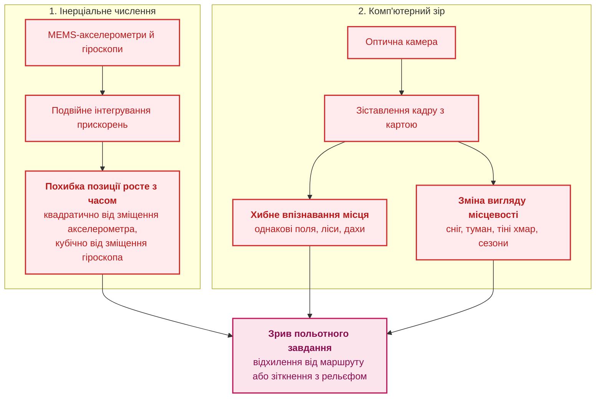
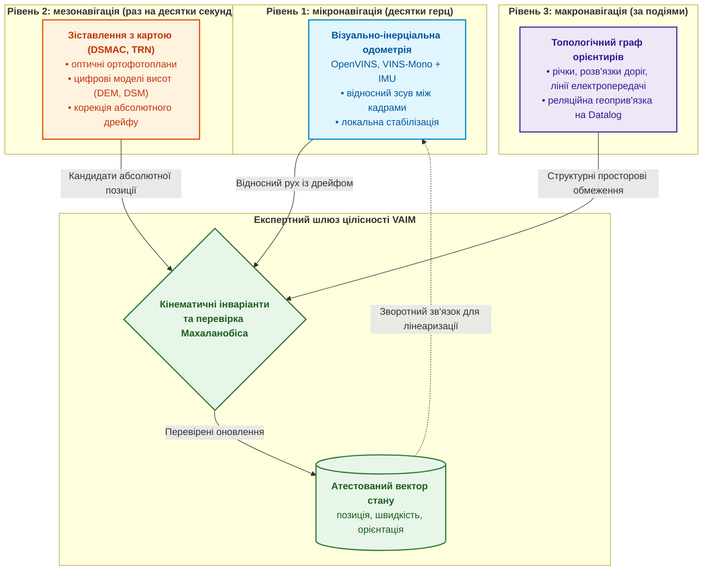
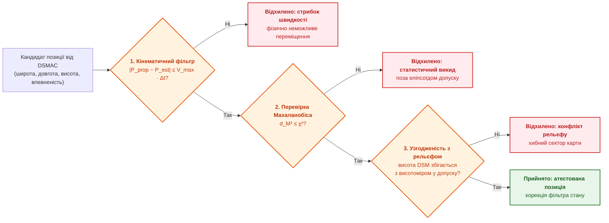
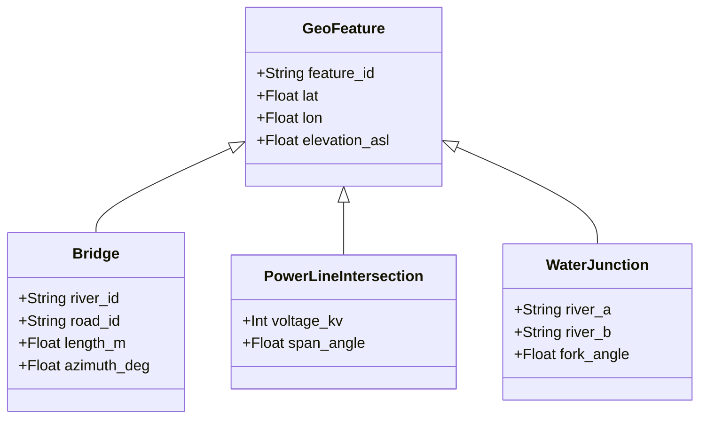
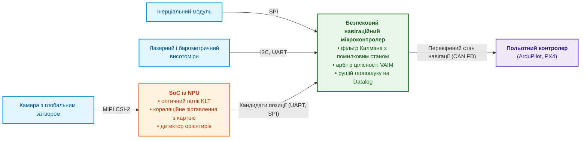
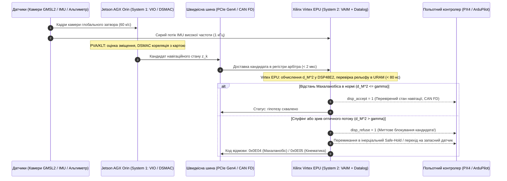

# Додаток В. Автономна навігація без GNSS: геопросторове зіставлення (TRN/DSMAC), візуальна одометрія (VIO) та експертний арбітраж сенсорного злиття

> **Книга:** [Архітектура доказових експертних систем](README.md) · Додатки  
> **Зміст книги:** [README.md](README.md)  
> **Автор:** [Микола Федчик](about-the-author.md)  
> **Рівень:** архітектори автономних безпілотних апаратів, інженери вбудованих систем, фахівці з комп'ютерного зору та інерціальної навігації  
> **Очікувані результати:** пояснювати, чому інерціальна навігація й комп'ютерний зір окремо не дають надійної позиції без GNSS; будувати трирівневий навігаційний стек; перевіряти кандидата позиції кінематичними, статистичними й рельєфними інваріантами; відокремлювати навігаційну цілісність від рішень, які належать людині.

---

## Анотація

У бойових умовах та зонах активного застосування засобів радіоелектронної боротьби (РЕБ) сигнали глобальних навігаційних систем (GNSS: GPS, Galileo) зазнають тотального придушення завадами або цілеспрямованої підміни координат (*spoofing*). Автономний безпілотний літальний апарат (БПЛА), позбавлений зовнішнього коригування оператором у режимі радіомовчання, залишається сам на сам із бортовими датчиками. Проте ізольована інерціальна система (INS) накопичує похибку за кубічним законом $\Delta\mathbf{p}(t) \propto t^3$ через дрейф гіроскопів (відхилення на понад 7 км уже за 20 хвилин польоту), а комп'ютерний зір (TRN, DSMAC, VIO) зазнає хибних зіставлень на монотонній місцевості (однакові поля, лісосмуги, зміна сезонів), що спричиняє зрив польотного завдання або зіткнення з землею.

Цей додаток вирішує проблему шляхом побудови доказового експертного арбітражу сенсорного злиття. Ми проєктуємо трирівневий навігаційний стек: швидке високочастотне оцінювання на базі INS/VIO, періодичне геопросторове зіставлення оптичних орієнтирів із матрицями висот рельєфу (TRN/DSMAC) та детермінований шлюз арбітражу, який верифікує запропоновані координати за фізичними інваріантами кінематики, статистичною відстанню Махаланобіса та бар'єрами карти висот, захищаючи автономний борт від катастрофічного дрейфу та сенсорних аномалій.

---

## Чому безпілотник втрачає орієнтацію без GNSS

Глобальні навігаційні супутникові системи (*Global Navigation Satellite System*, GNSS), як-от GPS чи Galileo, більше не гарантують навігації в умовах радіоелектронної боротьби. Сигнал GNSS слабкий, тому його придушують завадами або підміняють: спуфінг транслює хибні сигнали, і приймач обчислює хибні координати й час [[1]](#src-1). Режим радіомовчання водночас не дає операторові коригувати траєкторію через радіолінію. У такій ізоляції безпілотний літальний апарат (БПЛА) залишається лише з бортовими датчиками.



Схема показує два незалежні механізми, і кожен із них окремо призводить до зриву завдання. Розгляньмо обидва.

**Дрейф інерціальної навігаційної системи.** Недорогі датчики на мікроелектромеханічних системах (MEMS) мають зміщення нуля. Постійне залишкове зміщення акселерометра $\mathbf{b}_a$ після подвійного інтегрування дає похибку позиції, що росте квадратично. Зміщення гіроскопа $\mathbf{b}_g$ спершу дає лінійно зростаючу похибку кута нахилу, через неї проєкція сили тяжіння $\mathbf{g}$ створює хибне прискорення, і після подвійного інтегрування похибка позиції росте кубічно:

```math
\Delta\mathbf{p}(t)\approx\frac{1}{2}\,\mathbf{b}_a\,t^{2}+\frac{1}{6}\,(\mathbf{b}_g\times\mathbf{g})\,t^{3}.
```

Тут:

- $\Delta\mathbf{p}(t)$ є вектором похибки позиції в момент $t$, у метрах;
- $t$ є часом, що минув від останньої корекції позиції, наприклад від останнього сигналу GNSS, у секундах;
- $\mathbf{b}_a$ є залишковим зміщенням нуля акселерометра, тобто хибним прискоренням, яке датчик показує навіть у спокої, у м/с²;
- $\mathbf{b}_g$ є залишковим зміщенням нуля гіроскопа, тобто хибною кутовою швидкістю, у рад/с;
- $\mathbf{g}$ є вектором прискорення вільного падіння, величиною близько $9{,}81$ м/с², напрямленим донизу;
- $\times$ є векторним добутком; вираз $\mathbf{b}_g\times\mathbf{g}$ дає хибне горизонтальне прискорення, яке з'являється, коли похибка кута нахилу частково «повертає» вектор сили тяжіння в горизонтальну площину;
- множники $\tfrac12$ і $\tfrac16$ є наслідком інтегрування: стала величина $b$ після двох інтегрувань дає $`b\,t^{2}/2`$, а хибне прискорення, яке зростає лінійно, $`c\,t`$ після двох інтегрувань дає $`c\,t^{3}/6`$.

Формула описує інерціальну навігацію без корекції за сталих зміщень і малих кутів. Справжній фільтр оцінює зміщення й частково їх компенсує, тому вираз показує швидкість зростання похибки без компенсації, а не прогноз для конкретного польоту.

Для умовного залишкового зміщення акселерометра 1 mg, тобто близько $0{,}0098$ м/с², лише перший доданок за 20 хвилин ($t=1200$ с) дає $\tfrac12\cdot0{,}0098\cdot1200^{2}\approx7$ км. Число залежить від припущеного зміщення, але квадратична залежність від часу не залежить.

**Хибне впізнавання місця.** Спроба виправляти дрейф лише ймовірнісним зіставленням поточного кадру із супутниковою картою наштовхується на одноманітні ландшафти. Огляд візуального розпізнавання місць Лоурі та співавторів описує дві пов'язані проблеми: різні місця виглядають однаково (*perceptual aliasing*), а те саме місце виглядає по-різному залежно від освітлення, погоди й сезону [[2]](#src-2). Модель зіставлення може з високою впевненістю, наприклад понад 0,95, «впізнати» лісосмугу чи поворот польової дороги, які насправді лежать за кілометри від апарата.

> [!IMPORTANT]
> **Принцип доказової навігації в цьому додатку:**
> Жодне окреме оптичне чи висотне зіставлення не вважається позицією без проходження **візуального автономного монітора цілісності** (*Visual Autonomous Integrity Monitor*, VAIM). VAIM є детермінованою експертною системою, що перевіряє кінематичні, статистичні й рельєфні інваріанти кандидата позиції.

Звідси головне запитання додатка: **як бортова експертна система може отримати позицію, якій можна довіряти, коли GNSS недоступний, а кожне окреме джерело позиції помиляється по-своєму?** Відповідь має три частини: розділити навігацію на рівні з різними часовими масштабами, перевіряти кожного кандидата позиції інваріантами й чітко обмежити повноваження навігаційної системи.

## Трирівнева архітектура навігаційного стека

Бортовий обчислювач розділяє навігацію на три рівні, які доповнюють один одного в часі й просторі.



Схема читається знизу вгору за часовим масштабом: мікрорівень дає часті відносні оцінки, мезорівень рідше дає абсолютні кандидати, макрорівень спрацьовує лише за подіями. Усі три рівні подають дані до шлюзу цілісності, а не напряму до фільтра стану.

### Мікрорівень: візуально-інерціальна одометрія

**Візуально-інерціальна одометрія** (*visual-inertial odometry*, VIO) оцінює швидкість і відносне переміщення $\Delta\mathbf{x}_{k-1\to k}$ між послідовними кадрами камери. Вона відстежує кутові ознаки зображення, обчислює пірамідальний оптичний потік методом Лукаса й Канаде та оптимізує стан у ковзному вікні разом з інтегрованими показаннями інерціального вимірювального модуля (*inertial measurement unit*, IMU). Огляд Гуочуаня Хуана систематизує методи візуально-інерціальної навігації [[3]](#src-3), а відкриті реалізації OpenVINS [[4]](#src-4) і VINS-Mono [[5]](#src-5) дають змогу почати з перевіреного коду. VIO працює з малою затримкою й частотою кадрів камери, але похибка VIO повільно накопичується з пройденою відстанню, і для конкретної системи дрейф вимірюють на еталонних траєкторіях.

### Мезорівень: зіставлення з картою

Мезорівень періодично скидає накопичений дрейф VIO, знаходячи абсолютні координати на цифровій карті. **Кореляційне зіставлення сцени** (*digital scene matching area correlator*, DSMAC) порівнює кадр з ортофотопланом нормалізованою взаємною кореляцією або контурними дескрипторами. **Навігація за рельєфом** (*terrain-referenced navigation*, TRN) зіставляє профіль висот, виміряний барометричним чи лазерним висотоміром, із цифровою моделлю рельєфу (*digital elevation model*, DEM) або поверхні (*digital surface model*, DSM). Зіставлення виконують під час прольоту над інформативними ділянками, наприклад раз на десятки секунд.

### Макрорівень: топологічні орієнтири

Макрорівень потрібен для глобальної релокалізації після повної втрати траєкторії, наприклад після тривалого прольоту крізь суцільну хмарність. Механізм шукає взаємне розташування магістралей, водойм, залізниць і берегових ліній за допомогою стратифікованих запитів Datalog над базою просторових фактів [[6]](#src-6). Розділ про топологічний геопошук нижче наводить приклад таких правил.

## Експертна система як фільтр цілісності

В авіації для супутникових приймачів давно використовують автономний контроль цілісності в приймачі (*receiver autonomous integrity monitoring*, RAIM): приймач перевіряє узгодженість надлишкових вимірювань і виявляє хибне вимірювання, а Браун показав еквівалентність трьох базових методів RAIM [[7]](#src-7). VAIM переносить ту саму ідею на оптичну навігацію й реалізується як детермінована експертна система правил.



Три перевірки на схемі впорядковано від найдешевшої до найдорожчої: кінематичний фільтр відсікає фізично неможливі стрибки, перевірка Махаланобіса відсікає статистичні викиди, а рельєфна перевірка відсікає хибні сектори карти, які пройшли дві попередні перевірки.

### Відстань Махаланобіса як статистичний допуск

Нехай $\hat{\mathbf{x}}_k$ є оцінкою стану апарата в момент $t_k$, яку дав інерціально-візуальний фільтр, а $\mathbf{P}_k$ є відповідною коваріаційною матрицею. Підсистема зіставлення з картою пропонує вимірювання $\mathbf{z}_k$ із власною коваріацією $\mathbf{R}_k$. Шлюз обчислює інновацію $\mathbf{y}_k=\mathbf{z}_k-\mathbf{H}\hat{\mathbf{x}}_k$, де $\mathbf{H}$ вибирає зі стану вимірювані компоненти, і квадрат відстані Махаланобіса:

```math
d_M^{2}=\mathbf{y}_k^{\top}\left(\mathbf{H}\mathbf{P}_k\mathbf{H}^{\top}+\mathbf{R}_k\right)^{-1}\mathbf{y}_k .
```

Тут:

- $d_M^{2}$ є квадратом відстані Махаланобіса, безрозмірним невід'ємним числом: що воно більше, то гірше інновація узгоджується із заявленою невизначеністю;
- $\mathbf{y}_k$ є інновацією, тобто різницею між результатом зіставлення з картою й тим, що очікує фільтр; для горизонтальної позиції це вектор із двох компонент (північ і схід) у метрах;
- $\mathbf{y}_k^{\top}$ є транспонованим вектором (рядок замість стовпця), завдяки чому добуток двох векторів і матриці дає одне число;
- $\mathbf{P}_k$ є коваріаційною матрицею оцінки стану: на діагоналі стоять дисперсії (квадрати типових похибок) кожної компоненти стану, а поза діагоналлю кореляції між компонентами;
- $\mathbf{R}_k$ є коваріаційною матрицею похибки вимірювання, яку підсистема зіставлення з картою заявляє для свого результату;
- $\mathbf{H}$ є матрицею вимірювання, яка вибирає зі вектора стану ті компоненти, що їх вимірює підсистема зіставлення, наприклад лише горизонтальну позицію;
- $\mathbf{H}\mathbf{P}_k\mathbf{H}^{\top}+\mathbf{R}_k$ є коваріацією інновації: вона додає невизначеність фільтра, перенесену у простір вимірювання, до невизначеності самого вимірювання;
- $(\cdot)^{-1}$ є оберненою матрицею; множення на неї переводить розбіжність із метрів в одиниці невизначеності.

Практичний зміст формули такий: розбіжність у метрах оцінюють не сама по собі, а відносно невизначеності, яку заявили фільтр і зіставлення. Нехай інновація $`\mathbf{y}_k=(12;\,5)`$ м, а коваріація інновації дорівнює $`\mathrm{diag}(25;\,25)`$ м², тобто типова похибка кожної компоненти становить 5 м. Тоді $d_M^{2}=12^{2}/25+5^{2}/25=6{,}76$. Якщо ж невизначеність заявлено удвічі меншою, $`\mathrm{diag}(4;\,4)`$ м², то $d_M^{2}=(144+25)/4=42{,}25$. Розбіжність в обох випадках однакова, 13 м, але в першому вона узгоджується з заявленою точністю, а в другому ні. Числа припущені для ілюстрації.

Якщо модель похибок правильна, $d_M^{2}$ має розподіл хі-квадрат із кількістю ступенів свободи, що дорівнює розмірності вимірювання, тому поріг допуску беруть як квантиль цього розподілу; такий допуск (*gating*) описують Бар-Шалом, Лі й Кірубараджан [[8]](#src-8). Для горизонтальної позиції (два ступені свободи) з імовірністю 99 % поріг дорівнює $`\chi^{2}_{2;0{,}99}\approx9{,}21`$, а для тривимірної позиції $`\chi^{2}_{3;0{,}99}\approx11{,}34`$. Для прикладу вище поріг 9,21 пропускає перший випадок, бо $6{,}76$ менше за $9{,}21$, і відкидає другий, бо $42{,}25$ більше за $9{,}21$. Кандидата приймають, якщо

```math
\text{ValidMeasurement}(\mathbf{z}_k)\iff d_M^{2}\le\chi^{2}_{m;1-\alpha}\ \land\ \left|h_{\text{baro}}-h_{\text{DEM}}(\mathbf{z}_k)-h_{\text{range}}\right|\le\epsilon_{\text{alt}}.
```

Тут:

- $\text{ValidMeasurement}(\mathbf{z}_k)$ є логічним значенням: «істина», якщо кандидат $\mathbf{z}_k$ приймають, і «хиба», якщо відкидають;
- $\iff$ читається як «тоді й лише тоді, коли»;
- $\land$ є логічним «і»: кандидата приймають, лише коли виконуються обидві умови, статистична й висотна;
- $d_M^{2}$ є квадратом відстані Махаланобіса з попередньої формули;
- $\chi^{2}_{m;1-\alpha}$ є квантилем розподілу хі-квадрат із $m$ ступенями свободи рівня $1-\alpha$, тобто порогом, який правильний кандидат перевищує лише з імовірністю $\alpha$;
- $m$ є розмірністю вимірювання: 2 для горизонтальної позиції, 3 для тривимірної;
- $\alpha$ є рівнем значущості, тобто допустимою часткою правильних кандидатів, які шлюз помилково відкине; для порога 99 % значення $\alpha=0{,}01$;
- $`h_{\text{baro}}`$ є барометричною висотою апарата, у метрах;
- $`h_{\text{DEM}}(\mathbf{z}_k)`$ є висотою рельєфу під кандидатом $\mathbf{z}_k$ за цифровою моделлю рельєфу (DEM), у метрах;
- $`h_{\text{range}}`$ є показом висотоміра, тобто відстанню від апарата до поверхні, у метрах;
- $\epsilon_{\text{alt}}$ є допуском на розбіжність висот, у метрах; його вибирають за сумою похибок барометра, висотоміра й моделі рельєфу;
- $\lvert\cdot\rvert$ є модулем, тобто абсолютною величиною числа.

Висотна умова зіставляє три незалежні джерела: барометр, висотомір і карту. Якщо апарат справді перебуває над точкою кандидата, різниця між барометричною висотою й висотою рельєфу має дорівнювати показу висотоміра. Обидві висоти потрібно звести до однієї базової поверхні, наприклад до рівня моря. Нехай $h_{\text{baro}}=620$ м, а висотомір показує 212 м. Для кандидата, під яким рельєф лежить на висоті 410 м, маємо $\lvert620-410-212\rvert=2$ м, і за допуску 10 м кандидата приймають. Для хибного кандидата на схилі, де за картою рельєф сягає 470 м, маємо $\lvert620-470-212\rvert=62$ м, і кандидата відкидають, навіть якщо статистична перевірка його пропустила. Числа припущені для ілюстрації. Прийнятий кандидат оновлює фільтр стану, наприклад фільтр Калмана з помилковим станом (*error-state Kalman filter*) [[9]](#src-9) або оптимізацію на графі факторів [[10]](#src-10).

## Топологічний геопошук на стратифікованому Datalog

Якщо апарат виходить із зони хмарності після тривалого сліпого польоту, невизначеність позиції $\mathbf{P}_k$ стає завеликою для кореляційного зіставлення з картою. Тоді вмикається топологічний геопошук. Бортова база знань містить граф характерних просторових орієнтирів району польоту.



Діаграма задає типи орієнтирів і атрибути, за якими спостереження зіставляють з базою: координати, висоту, кут і довжину. Припустімо, що комп'ютерний зір виділив у кадрі перетин річки й автомобільної дороги під кутом близько $60^\circ$, а висота поверхні близька до 135 м. Правила нижче записано мовою Datalog із вбудованими арифметичними порівняннями:

```prolog
% Кандидат: міст із бази знань, що узгоджується зі спостереженням
candidate_bridge(ID, Lat, Lon) :-
    detected_bridge(VisAngle, VisLen),
    kb_bridge(ID, Lat, Lon, TrueAngle, TrueLen, Elev),
    abs(VisAngle - TrueAngle) < 10,
    abs(VisLen - TrueLen) < 15,
    estimated_position(EstLat, EstLon, MaxRadius),
    geo_distance(EstLat, EstLon, Lat, Lon, Dist),
    Dist < MaxRadius,
    surface_elevation_asl(SurfAlt),
    abs(SurfAlt - Elev) < 25.

% Неоднозначність: у радіусі пошуку є інший кандидат
ambiguous_candidate(ID) :-
    candidate_bridge(ID, _, _),
    candidate_bridge(Other, _, _),
    Other != ID.

% Позицію затверджують лише за єдиного кандидата
verified_relocalization(Lat, Lon) :-
    candidate_bridge(ID, Lat, Lon),
    not ambiguous_candidate(ID).
```

Правило `verified_relocalization` залежить від `ambiguous_candidate` через заперечення, а `ambiguous_candidate` залежить від `candidate_bridge` без заперечення, тому програма стратифікована й має однозначну семантику. Механізм відкидає зіставлення з однотипними об'єктами: якщо в колі невизначеності знайшлися два схожі мости, позицію не затверджують, і апарат продовжує пошук.

## Межі навігаційної експертної системи

Навігаційна експертна система відповідає на два запитання: де перебуває апарат і наскільки ця оцінка достовірна. Рішення про застосування сили не належить до її повноважень. Шість принципів відповідального використання штучного інтелекту в обороні, які схвалили союзники по НАТО, включають законність, відповідальність і підзвітність, пояснюваність і простежуваність, надійність, керованість і зменшення упередженості [[11]](#src-11). Британський документ JSP 936 вимагає, щоб можливості на основі штучного інтелекту мали належний рівень людського нагляду [[12]](#src-12).

Для навігаційного стека з цього випливають три інженерні правила. Перше: VAIM передає далі не лише позицію, а й статус цілісності та невизначеність, щоб людина, яка ухвалює рішення, бачила межі оцінки. Друге: за втрати цілісності навігації апарат переходить лише до заздалегідь погоджених безпечних дій, як-от утримання позиції, повернення за перевіреним маршрутом чи посадка в дозволеній зоні; такий автомат режимів описує [Додаток Б](appendix-b-robotics-and-cyber-physical-systems.md). Третє: будь-які дії з незворотними наслідками проходять контроль повноважень, описаний у [Главі 21](ch21-from-recommendation-to-action.md), і правову оцінку, яка виходить за межі цієї книги.

## Апаратна реалізація бортового навігаційного вузла

Практичний вузол розподіляє задачі між спеціалізованими апаратними блоками.



Нейронний процесор (*neural processing unit*, NPU) виконує важкі й імовірнісні обчислення зору, а безпековий мікроконтролер виконує детерміновані перевірки й веде фільтр стану. Польотний контролер отримує вже перевірений стан навігації, а не сирі кандидати позиції.

---

### 1. Дослідницька програма для оптично-навігаційного вузла на базі NVIDIA Jetson AGX Orin (Тракт зорового сприйняття — System 1)

Базовою апаратною платформою для досліджень оптичної навігації без GNSS є промисловий комп'ютер **Seeed Studio reServer Industrial J501** на базі модуля **NVIDIA Jetson AGX Orin 64GB** (до 275 TOPS, 2048-ядерний GPU Ampere, два рушії NVDLA v2, прискорювач зору PVA v2, 12 ядер ARM Cortex-A78AE, пам'ять LPDDR5 204,8 ГБ/с у захищеному корпусі).

Програмно-апаратний стек об'єднує **NVIDIA JetPack 6.2** (ядро Linux 5.15 PREEMPT_RT, CUDA 12.6, TensorRT 10) та спеціалізовані конвеєри обробки потоків камер:

1. **Апаратний оптичний потік KLT та візуальна одометрія (VIO):**
   * Перенесення обчислення пірамід Лукаса-Канаде (KLT) на програмований прискорювач зору **PVA v2** (*Programmable Vision Accelerator*), що розвантажує основні тензорні ядра та GPU.
   * Отримання сирих кадрів із двох камер глобального затвора (*global shutter*) через інтерфейс **GMSL2 / MIPI CSI-2** у кільцеві буфери DMA із фіксованою затримкою доставки кадру $< 1{,}5\ \text{мс}$.
2. **Кореляційне зіставлення з пірамідою тайлів карти (DSMAC / TRN):**
   * Прискорення просторової 2D-кореляції контурних карт перепадів яскравості з рельєфними тайлами COG через рушій **TensorRT 10** у форматі FP8/INT8.
   * Використання 64 ГБ уніфікованої пам'яті для кешування мультиспектральних цифрових моделей рельєфу (DEM/DTM) площею до $10^4\ \text{км}^2$ без затримок звернення до повільних накопичувачів NVMe.
3. **Детекція топологічних орієнтирів та локальний SLM-триаж:**
   * Запуск локальних квантованих моделей зорового сприйняття (VLM) через локальний рантайм **Ollama** для семантичної класифікації складних орієнтирів (мости, русла річок, перехрестя магістралей, висотні споруди).
4. **Виведення кандидатів навігаційного стану через CAN FD:**
   * Передавання сформованих гіпотез позиції через один з ізольованих портів **CAN FD** на частоті 50–100 Гц у бінарному форматі з контрольною сумою CRC32.

> [!NOTE]
> **Теоретичне та інженерне підґрунтя навігаційного тракту сприйняття в главах книги:**
> - [Глава 12. Лінгвістичний аналіз та локальні моделі](ch12-linguistic-analysis-and-local-models.md) — локальні SLM/VLM для екстракції семантичних маркерів із зорових даних.
> - [Глава 18. Інфраструктура виконання](ch18-execution-infrastructure.md) — бюджетування затримок обробки сенсорики за моделлю Roofline, конфігурація ядра Linux PREEMPT_RT та мінімізація джитеру.
> - [Глава 22. Кібернетичний цикл керування: сенсори, периферія та зворотний зв'язок](ch22-cybernetics-edge-to-backend.md) — потокове захоплення сенсорних даних через GMSL2, шина CAN FD та зворотний зв'язок у реальному часі.
> - [Глава 37. Оцінка достовірності вхідної інформації: алгоритмічний скептицизм і сенсорне злиття](ch37-input-information-assessment-and-algorithmic-skepticism.md) — фільтр цілісності VAIM, алгоритмічний скептицизм щодо аномалій датчиків і статистичний допуск за відстанню Махаланобіса.

---

### 2. Дослідницька програма для апаратного арбітра цілісності на FPGA (Xilinx Virtex — System 2)

Матриці **AMD / Xilinx Virtex** (Virtex UltraScale+ / UltraScale) реалізують детермінований периметр захисту та арбітражу цілісності, де час відгуку гарантується на рівні наносекунд:

1. **Апаратний обчислювач відстані Махаланобіса на блоках DSP48E2:**
   * Синтез конвеєризованого матричного помножувача:
     $$d_M^2 = (\mathbf{z} - \hat{\mathbf{z}})^\top \mathbf{S}^{-1} (\mathbf{z} - \hat{\mathbf{z}})$$
     із фіксованим часом обчислення у **24 такти ($< 60\ \text{нс}$ @ 400 МГц)**.
   * Апаратне порівняння з порогом $\gamma = 9{,}21$ без залучення процесорних інструкцій.
2. **Апаратна машина запитів над топологічними графами (UltraRAM Zero-Copy):**
   * Розміщення векторної бази орієнтирів та правил стратифікованого Datalog безпосередньо у внутрішніх матрицях UltraRAM обсягом до 36 МБ.
   * Виконання предикатів просторового взаєморозміщення (`visible_landmark`, `corridor_bound`, `prohibited_zone`) за 1–3 такти тактової частоти.
3. **Апаратний замок безпеки (Fail-Closed Safety Veto):**
   * Прямі апаратні лінії вето (`disp_accept`, `disp_refuse`), виведені на оптоізольовані ключі переривання керування польотного контролера (Pixhawk / PX4). Якщо інновація вимірювання перевищує поріг або VIO суперечить кінематиці апарата, лінія `disp_refuse` миттєво активує режим утримання позиції (*Safe Hold*) за $< 5\ \text{нс}$.

> [!NOTE]
> **Теоретичне та інженерне підґрунтя апаратного навігаційного арбітра в главах книги:**
> - [Глава 16. Архітектура експертних систем](ch16-expert-systems-architecture.md) — символьний арбітраж, детермінована пам'ять та відокремлення фактів від правил.
> - [Глава 21. Від рекомендації до дії: контроль повноважень і безпечне виконання у виробничому середовищі](ch21-from-recommendation-to-action.md) — апаратні шлюзи допуску, контроль фізичних повноважень бортових підсистем.
> - [Глава 31. Виведення за нормами: ієрархії предикатів, винятки та чинність](ch31-syllogistic-reasoning-and-relation-lattices.md) — просторові предикати та заборони відхилення від маршруту в деонтичній логіці.
> - [Глава 39. Активний експерт-тестувальник: попперівська фальсифікація, нормативний комплаєнс та автономне проєктування випробувань](ch39-active-compliance-auditor-and-popperian-testing.md) — попперівська фальсифікація безпекових навігаційних гіпотез.

---

### 3. Дослідження тандему «Jetson AGX Orin + Xilinx Virtex» у режимі радіомовчання

Комплекс досліджує стійкість навігації під час повної втрати або зловмисного спуфінгу GNSS:



**Критерій фальсифікації безпеки автономного польоту (Popperian Falsification):**
Навігаційна гіпотеза вважається спростованою (непридатною до автономного застосування), якщо за умови внесення штучних завад у зображення (імітація диму, перепадів освітлення чи хибних текстур) або імітації стрибка позиції GNSS:
1. Максимальна затримка циклу допуску перевищує ліміт реального часу:
   $$T_{\text{loop}} = T_{\text{infer}} + T_{\text{comm}} + T_{\text{arbiter}} > 20\ \text{мс}\quad (\text{для циклу керування 50 Гц});$$
2. Апарат допускає хоча б одне хибне вимірювання ($d_M^2 > \gamma$), що спричиняє просторове відхилення траєкторії понад 5 метрів ($P(\text{uncontained error}) > 10^{-6}\ \text{на польотну годину}$).

---

### Формат бортових геоданих

Щоб геодані вмістилися у флешпам'ять бортового одноплатного комп'ютера, їх оптимізують:

- **Піраміда тайлів у форматі Cloud Optimized GeoTIFF** (COG), який стандартизував Відкритий геопросторовий консорціум (*Open Geospatial Consortium*, OGC) [[13]](#src-13): грубий базовий шар для всього маршруту й детальніші тайли для районів, де потрібне точне зіставлення.
- **Контурні карти перепадів яскравості** замість повних зображень: такі карти займають менше місця й менше залежать від освітлення; виграш в обсязі для конкретного району вимірюють.
- **Векторні шари орієнтирів** у форматах FlatBuffers або SQLite із розширенням SpatiaLite для швидкого доступу до просторових об'єктів.

## Робочий код навігаційного арбітра на Go

Код нижче реалізує ядро VAIM: перевірку впевненості, кінематичний інваріант, узгодженість із рельєфом і відстань Махаланобіса для горизонтальної позиції. Вертикальну складову перевіряє рельєфний інваріант, тому статистичний допуск має два ступені свободи й поріг 9,21. Пакет використовує лише стандартну бібліотеку Go.

<details>
<summary>Приклад мовою Go: навігаційний арбітр VAIM</summary>

```go
package navigation

import (
	"errors"
	"fmt"
	"math"
)

// Position3D задає точку в локальній системі NED (північ, схід, вниз), у метрах.
type Position3D struct {
	North, East, Down float64
}

// NavState є поточною оцінкою навігаційного фільтра.
type NavState struct {
	Pos        Position3D
	Covariance [2][2]float64 // коваріація горизонтальної позиції (N, E), м²
	Timestamp  float64       // секунди від старту
}

// VisualFixProposal є кандидатом позиції від зіставлення з картою.
type VisualFixProposal struct {
	Pos         Position3D
	MeasureCov  [2][2]float64 // коваріація вимірювання (N, E), м²
	Confidence  float64       // впевненість моделі зіставлення, від 0 до 1
	DemAltitude float64       // висота рельєфу під кандидатом за DEM, м
	Timestamp   float64
}

// VAIMConfig задає пороги шлюзу цілісності.
type VAIMConfig struct {
	MaxSpeed          float64 // максимальна фізична швидкість апарата, м/с
	Chi2Limit         float64 // квантиль χ² для 2 ступенів свободи, 9.21 для p = 0.01
	MaxAltDiscrepancy float64 // допустима розбіжність висот, м
	MinConfidence     float64 // мінімальна впевненість моделі зіставлення
}

// Verdict пояснює рішення шлюзу.
type Verdict struct {
	Accepted bool
	Code     string
	Detail   string
}

var ErrSingularCovariance = errors.New("singular innovation covariance")

// ValidateVisualFix перевіряє кандидата позиції за чотирма інваріантами.
func ValidateVisualFix(cfg VAIMConfig, cur NavState, p VisualFixProposal, rangeAlt float64) (Verdict, error) {
	if p.Confidence < cfg.MinConfidence {
		return Verdict{false, "REJECT_LOW_CONFIDENCE",
			fmt.Sprintf("confidence %.2f < %.2f", p.Confidence, cfg.MinConfidence)}, nil
	}
	dt := p.Timestamp - cur.Timestamp
	if dt <= 0 {
		return Verdict{false, "REJECT_INVALID_TIMESTAMP", fmt.Sprintf("dt = %.3f s", dt)}, nil
	}
	dN, dE := p.Pos.North-cur.Pos.North, p.Pos.East-cur.Pos.East
	if speed := math.Hypot(dN, dE) / dt; speed > cfg.MaxSpeed {
		return Verdict{false, "REJECT_KINEMATIC_VIOLATION",
			fmt.Sprintf("implied speed %.1f m/s > %.1f m/s", speed, cfg.MaxSpeed)}, nil
	}
	// Барометрична висота має дорівнювати висоті рельєфу під кандидатом плюс показ висотоміра.
	if diff := math.Abs(-cur.Pos.Down - (p.DemAltitude + rangeAlt)); diff > cfg.MaxAltDiscrepancy {
		return Verdict{false, "REJECT_TERRAIN_CONFLICT",
			fmt.Sprintf("altitude discrepancy %.1f m > %.1f m", diff, cfg.MaxAltDiscrepancy)}, nil
	}
	d2, err := mahalanobis2(dN, dE, cur.Covariance, p.MeasureCov)
	if err != nil {
		return Verdict{false, "REJECT_MATH_ERROR", err.Error()}, err
	}
	if d2 > cfg.Chi2Limit {
		return Verdict{false, "REJECT_MAHALANOBIS_OUTLIER",
			fmt.Sprintf("d² = %.2f > %.2f", d2, cfg.Chi2Limit)}, nil
	}
	return Verdict{true, "ACCEPT_VERIFIED_FIX", fmt.Sprintf("d² = %.2f", d2)}, nil
}

// mahalanobis2 обчислює d² = yᵀ(P+R)⁻¹y для горизонтальної інновації y = (dN, dE).
func mahalanobis2(dN, dE float64, P, R [2][2]float64) (float64, error) {
	s00, s01 := P[0][0]+R[0][0], P[0][1]+R[0][1]
	s10, s11 := P[1][0]+R[1][0], P[1][1]+R[1][1]
	det := s00*s11 - s01*s10
	if math.Abs(det) < 1e-9 {
		return 0, ErrSingularCovariance
	}
	return (dN*(s11*dN-s01*dE) + dE*(s00*dE-s10*dN)) / det, nil
}
```

</details>

Щоб перевірити арбітра, додамо до пакета приклад у файлі `example_test.go`. Приклад подає чотири кандидати: узгоджений, зі стрибком на 5 км за 10 с, з неузгодженим рельєфом і зі статистичним викидом. Команда `go test -run Example -v` виконує приклад і звіряє надруковане з очікуваним виводом у коментарі `// Output:`.

<details>
<summary>Приклад мовою Go: перевірка арбітра на чотирьох кандидатах позиції</summary>

```go
package navigation

import "fmt"

func ExampleValidateVisualFix() {
	cfg := VAIMConfig{MaxSpeed: 60, Chi2Limit: 9.21, MaxAltDiscrepancy: 25, MinConfidence: 0.6}
	cur := NavState{
		Pos:        Position3D{North: 1000, East: 2000, Down: -450},
		Covariance: [2][2]float64{{900, 0}, {0, 900}},
		Timestamp:  100,
	}
	fix := func(north, east, dem float64) VisualFixProposal {
		return VisualFixProposal{
			Pos:         Position3D{North: north, East: east},
			MeasureCov:  [2][2]float64{{400, 0}, {0, 400}},
			Confidence:  0.9,
			DemAltitude: dem,
			Timestamp:   110,
		}
	}
	for _, p := range []VisualFixProposal{
		fix(1040, 1970, 130), // узгоджений кандидат
		fix(6000, 2000, 130), // стрибок на 5 км за 10 с
		fix(1040, 1970, 180), // рельєф під кандидатом не збігається з висотами
		fix(1150, 2000, 130), // статистичний викид
	} {
		v, _ := ValidateVisualFix(cfg, cur, p, 320)
		fmt.Println(v.Code, v.Detail)
	}
	// Output:
	// ACCEPT_VERIFIED_FIX d² = 1.92
	// REJECT_KINEMATIC_VIOLATION implied speed 500.0 m/s > 60.0 m/s
	// REJECT_TERRAIN_CONFLICT altitude discrepancy 50.0 m > 25.0 m
	// REJECT_MAHALANOBIS_OUTLIER d² = 17.31 > 9.21
}
```

</details>

Приклад проходить (перевірено з Go 1.27). Числа легко перевірити вручну. Узгоджений кандидат зміщений на 40 м на північ і 30 м на захід, а сумарна дисперсія дорівнює $900+400=1300$ м² за кожною віссю, тому $d_M^{2}=(40^{2}+30^{2})/1300\approx1{,}92$. Кандидат зі зміщенням 150 м дає $d_M^{2}=150^{2}/1300\approx17{,}31$, що перевищує поріг 9,21, хоча кінематично таке зміщення за 10 с можливе. Саме тому кінематичний і статистичний фільтри потрібні разом: перший відсікає неможливе, другий відсікає малоймовірне.

## Перелік перевірок перед польотом у режимі радіомовчання

Перед завантаженням польотного завдання інженерна група перевіряє навігаційний комплект:

| № | Перевірка цілісності | Механізм контролю | Статус |
| :-: | :--- | :--- | :-: |
| 1 | **Покриття тайлами карти** | Маршрут повністю покритий ортофотопланами з бічним запасом, визначеним для завдання | [ ] |
| 2 | **Актуальність моделі висот** | Модель рельєфу перевірена за контрольними геодезичними точками | [ ] |
| 3 | **Калібрування камери** | Внутрішні параметри, дисторсія й зміщення камери відносно IMU зафіксовані й перевірені | [ ] |
| 4 | **Глобальний затвор** | Камера працює з глобальним затвором, без спотворень рядкового затвора від вібрацій | [ ] |
| 5 | **Пороги шлюзу цілісності** | Поріг χ² відповідає розмірності вимірювання: 9,21 для горизонтальної позиції, 11,34 для тривимірної ($p=0{,}01$) | [ ] |
| 6 | **Безпечні дії за втрати цілісності** | Налаштовано й випробувано перехід до утримання позиції, повернення або посадки в дозволеній зоні | [ ] |
| 7 | **Межі польотної зони** | Межі дозволеної зони завантажено й підписано | [ ] |
| 8 | **Стійкість до засліплення** | Випробувано політ на чистому інерціальному численні під час перекриття об'єктива на заданий час | [ ] |
| 9 | **Підпис навігаційного маніфесту** | Польотне завдання, тайли карт і пороги правил підписані ключем розробника (Ed25519) | [ ] |

Кожен рядок переліку відповідає одному з механізмів додатка, тож заповнений перелік є частиною пакета доказів готовності навігаційного комплекту.

## Висновок

Додаток почався із запитання, як отримати позицію, якій можна довіряти без GNSS, коли кожне окреме джерело помиляється по-своєму. Відповідь така. Інерціальне числення дає неперервну, але дрейфуючу оцінку, похибка якої росте квадратично й кубічно з часом. Комп'ютерний зір дає абсолютні кандидати, але плутає схожі місця. Трирівневий стек поєднує обидва джерела й топологічні орієнтири, а експертний шлюз VAIM допускає кандидата до фільтра стану лише після кінематичної, статистичної й рельєфної перевірок. Робочий приклад на Go показав, що кінематичний і статистичний фільтри відсікають різні помилки й тому потрібні разом.

Межі теж визначені. Пороги й допуски в прикладах є ілюстраціями, а для конкретного апарата їх встановлюють випробування. Статистичний допуск правильний лише тоді, коли правильна модель похибок, тому коваріації фільтра й вимірювань перевіряють на еталонних польотах. Навігаційна експертна система відповідає за достовірність позиції, а не за рішення, які належать людині. Апаратні основи бортових обчислень продовжує [Додаток Г](appendix-d-analog-expert-systems-and-neuromorphic-computing.md).

## Словник

| Український термін | Англійський відповідник | Коротке пояснення |
|---|---|---|
| Інерціальне числення | *dead reckoning* | Оцінка позиції інтегруванням прискорень і кутових швидкостей |
| Зміщення нуля датчика | *sensor bias* | Постійна складова похибки акселерометра чи гіроскопа |
| Хибне впізнавання місця | *perceptual aliasing* | Ситуація, коли різні місця виглядають однаково для системи зору |
| Візуально-інерціальна одометрія | *visual-inertial odometry* | Оцінка руху за камерою й інерціальним модулем разом |
| Кореляційне зіставлення сцени | *scene matching area correlation* | Пошук положення кадру на ортофотоплані за кореляцією |
| Навігація за рельєфом | *terrain-referenced navigation* | Визначення позиції зіставленням профілю висот із моделлю рельєфу |
| Контроль цілісності | *integrity monitoring* | Виявлення хибних вимірювань за узгодженістю надлишкових даних |
| Інновація | *innovation* | Різниця між вимірюванням і його прогнозом за оцінкою стану |
| Допуск за Махаланобісом | *Mahalanobis gating* | Прийняття вимірювання лише тоді, коли квадрат відстані Махаланобіса не перевищує квантиля χ² |
| Фільтр Калмана з помилковим станом | *error-state Kalman filter* | Варіант фільтра Калмана, що оцінює малу похибку номінального стану |
| Граф факторів | *factor graph* | Двочастковий граф змінних і обмежень для оцінювання стану оптимізацією |
| Стратифікована програма | *stratified program* | Логічна програма, у якій заперечення не створює циклічних залежностей |
| Глобальний затвор | *global shutter* | Режим камери, у якому всі пікселі експонуються одночасно |

## Абревіатури

| Скорочення | Розшифрування | Значення |
|---|---|---|
| БПЛА | безпілотний літальний апарат | літальний апарат без пілота на борту |
| CAN FD | Controller Area Network Flexible Data-Rate | шина CAN зі змінною швидкістю передавання даних |
| COG | Cloud Optimized GeoTIFF | формат GeoTIFF, оптимізований для часткового читання |
| DEM | Digital Elevation Model | цифрова модель висот рельєфу |
| DSM | Digital Surface Model | цифрова модель поверхні з об'єктами на ній |
| DSMAC | Digital Scene Matching Area Correlator | кореляційне зіставлення сцени з картою |
| GNSS | Global Navigation Satellite System | глобальна навігаційна супутникова система |
| IMU | Inertial Measurement Unit | інерціальний вимірювальний модуль |
| KLT | Kanade–Lucas–Tomasi | метод відстеження ознак за оптичним потоком |
| MEMS | Micro-Electro-Mechanical Systems | мікроелектромеханічні системи |
| MIPI CSI-2 | Mobile Industry Processor Interface Camera Serial Interface 2 | послідовний інтерфейс камери |
| NPU | Neural Processing Unit | нейронний процесор |
| OGC | Open Geospatial Consortium | Відкритий геопросторовий консорціум |
| RAIM | Receiver Autonomous Integrity Monitoring | автономний контроль цілісності в приймачі GNSS |
| SoC | System on Chip | система на кристалі |
| TRN | Terrain-Referenced Navigation | навігація за рельєфом |
| VAIM | Visual Autonomous Integrity Monitor | візуальний автономний монітор цілісності |
| VIO | Visual-Inertial Odometry | візуально-інерціальна одометрія |

## Джерела

1. <a id="src-1"></a>Mark L. Psiaki, Todd E. Humphreys. [*GNSS Spoofing and Detection*](https://doi.org/10.1109/JPROC.2016.2526658). *Proceedings of the IEEE*, 104(6), 1258–1270, 2016.
2. <a id="src-2"></a>Stephanie Lowry, Niko Sünderhauf, Paul Newman, John J. Leonard та ін. [*Visual Place Recognition: A Survey*](https://doi.org/10.1109/TRO.2015.2496823). *IEEE Transactions on Robotics*, 32(1), 1–19, 2016.
3. <a id="src-3"></a>Guoquan Huang. [*Visual-Inertial Navigation: A Concise Review*](https://doi.org/10.1109/ICRA.2019.8793604). *2019 International Conference on Robotics and Automation (ICRA)*, 9572–9582, 2019.
4. <a id="src-4"></a>Patrick Geneva, Kevin Eckenhoff, Woosik Lee, Yulin Yang та ін. [*OpenVINS: A Research Platform for Visual-Inertial Estimation*](https://doi.org/10.1109/ICRA40945.2020.9196524). *2020 IEEE International Conference on Robotics and Automation (ICRA)*, 4666–4672, 2020.
5. <a id="src-5"></a>Tong Qin, Peiliang Li, Shaojie Shen. [*VINS-Mono: A Robust and Versatile Monocular Visual-Inertial State Estimator*](https://doi.org/10.1109/TRO.2018.2853729). *IEEE Transactions on Robotics*, 34(4), 1004–1020, 2018.
6. <a id="src-6"></a>S. Ceri, G. Gottlob, L. Tanca. [*What You Always Wanted to Know About Datalog (and Never Dared to Ask)*](https://doi.org/10.1109/69.43410). *IEEE Transactions on Knowledge and Data Engineering*, 1(1), 146–166, 1989.
7. <a id="src-7"></a>R. Grover Brown. [*A Baseline GPS RAIM Scheme and a Note on the Equivalence of Three RAIM Methods*](https://doi.org/10.1002/j.2161-4296.1992.tb02278.x). *Navigation*, 39(3), 301–316, 1992.
8. <a id="src-8"></a>Yaakov Bar-Shalom, X.-Rong Li, Thiagalingam Kirubarajan. [*Estimation with Applications to Tracking and Navigation*](https://doi.org/10.1002/0471221279). Wiley, 2001.
9. <a id="src-9"></a>Joan Solà. [*Quaternion Kinematics for the Error-State Kalman Filter*](https://arxiv.org/abs/1711.02508). arXiv:1711.02508, 2017.
10. <a id="src-10"></a>Frank Dellaert, Michael Kaess. [*Factor Graphs for Robot Perception*](https://doi.org/10.1561/2300000043). *Foundations and Trends in Robotics*, 6(1–2), 1–139, 2017.
11. <a id="src-11"></a>NATO. [*Summary of NATO's Revised Artificial Intelligence (AI) Strategy*](https://www.nato.int/en/about-us/official-texts-and-resources/official-texts/2024/07/10/summary-of-natos-revised-artificial-intelligence-ai-strategy). 10 липня 2024 року.
12. <a id="src-12"></a>UK Ministry of Defence. [*JSP 936: Dependable Artificial Intelligence (AI) in Defence, Part 1: Directive*](https://www.gov.uk/government/publications/jsp-936-dependable-artificial-intelligence-ai-in-defence-part-1-directive). 13 листопада 2024 року.
13. <a id="src-13"></a>Open Geospatial Consortium. [*OGC Cloud Optimized GeoTIFF Standard*](https://docs.ogc.org/is/21-026/21-026.html). OGC 21-026.

---

[← Додаток Б](appendix-b-robotics-and-cyber-physical-systems.md) | [Зміст книги](README.md) | [Додаток Г →](appendix-d-analog-expert-systems-and-neuromorphic-computing.md)
