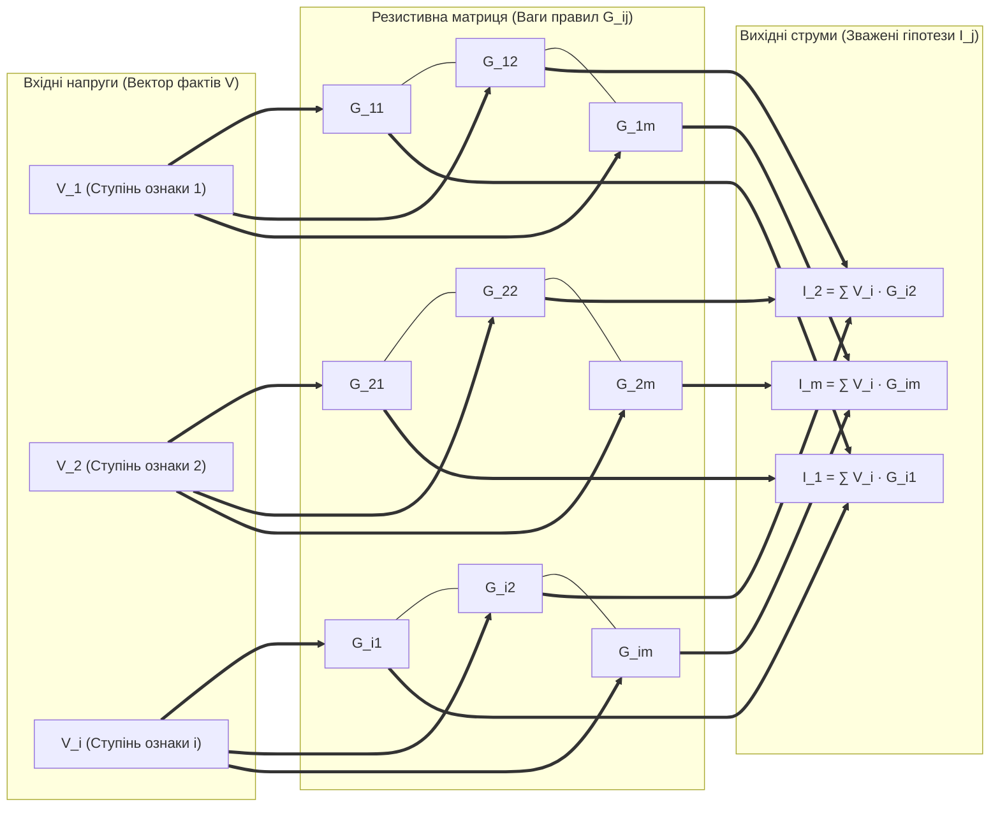
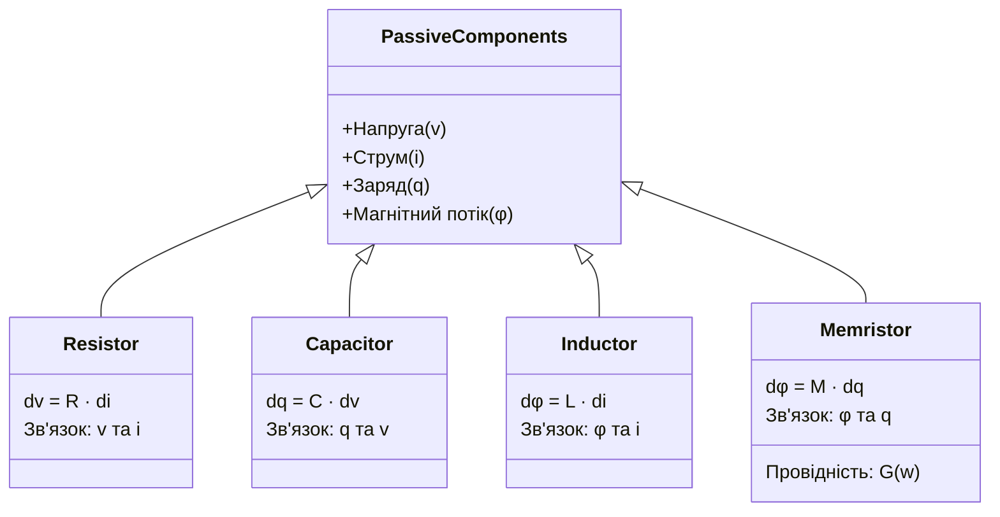
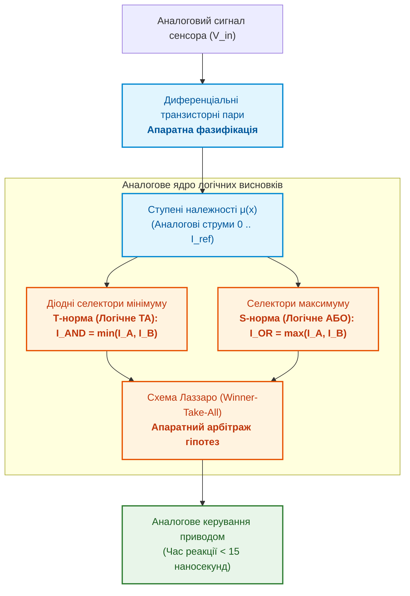
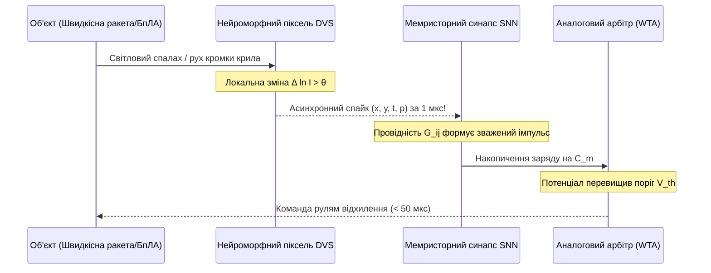
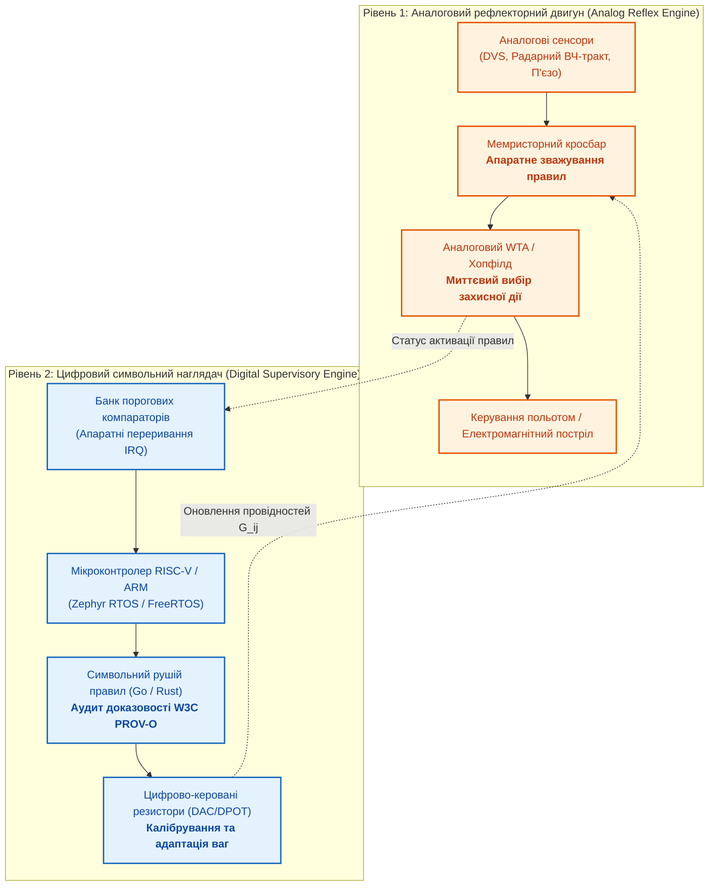
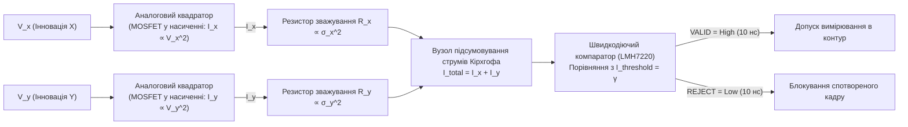

# Додаток Г. Аналогові експертні системи, нейроморфні обчислення та апаратне логічне виведення

> **Книга:** [Архітектура доказових експертних систем](README.md) · Додатки  
> **Попередній додаток:** [Додаток В. Автономна навігація без GNSS: геопросторове зіставлення (TRN/DSMAC), візуальна одометрія (VIO) та експертний арбітраж сенсорного злиття](appendix-c-autonomous-navigation-and-geosearch.md)  
> **Зміст книги:** [README.md](README.md)  
> **Пов'язані глави книги:** [Глава 6. Прикладна математика експертних систем](ch06-applied-mathematics-for-expert-systems.md) · [Глава 18. Інфраструктура виконання](ch18-execution-infrastructure.md) · [Глава 22. Кібернетичний контур Edge-to-Backend](ch22-cybernetics-edge-to-backend.md) · [Глава 29. Нейро-символьна архітектура](ch29-neuro-symbolic-architecture.md)  
> **Суміжні дослідження автора:** [Військові експертні системи: БПЛА, ППО, РЕР/РЕБ](../MilTech/Military-Expert-Systems-UAS-AD-ELINT-EW-UA.md) · [Військова кібернетика](../MilTech/Ukrainian-Military-Cybernetics-UA.md)  
> **Рівень:** системні архітектори, апаратні розробники (Analog/Mixed-Signal ASIC, FPGA), фахівці з нейроморфних обчислень, інженери оборонних і вбудованих комплексів  
> **Призначення:** комплексний інженерно-математичний аналіз проєктування експертних систем і рефлекторних контурів прийняття рішень на аналоговій та змішаній елементній базі: від фундаментальних законів Кірхгофа та мемристорних кросбарів до апаратної нечіткої логіки, спайкових мереж (SNN) і наносекундної релаксації Хопфілда в умовах жорстких обмежень SWaP-C, активного РЕБ та іонізуючого випромінювання.

---

## 1. Проблема: Глухий кут цифрової архітектури фон Неймана на тактичному Edge

Переважна більшість сучасних експертних систем та алгоритмів штучного інтелекту розгортаються на базі класичної цифрової обчислювальної моделі Джона фон Неймана — на серверах або периферійних модулях із CPU, GPU чи цифровими NPU. Проте під час перенесення інтелектуальних контурів у критичні кіберфізичні системи — високошвидкісні дрони-перехоплювачі, боєголовки самонаведення, системи активного радіоелектронного захисту, автономні роботизовані турелі та аерокосмічні комплекси — інженери зіштовхуються з непереборними фізичними бар'єрами цифрової парадигми:

```mermaid
flowchart TD
    accTitle: Фізичні обмеження цифрових обчислювачів у критичних контурах
    accDescr: Пляшкове горло фон Неймана, затримка АЦП, енергетичний колапс та вразливість до випромінювання.

    subgraph VonNeumannBottleneck["1. Пляшкове горло фон Неймана (Memory Wall)"]
        ALU["Арифметико-логічний блок / Тензорні ядра"]
        BUS["Системна шина пам'яті (PCIe / NoC)"]
        MEM["Пам'ять DRAM / SRAM (Ваги, Правила)"]
        MEM <-->|"90% енергії витрачається<br/>на пересилання байтів"| BUS <--> ALU
    end

    subgraph DomainMismatch["2. Сенсорно-цифровий розрив (ADC/DAC Penalty)"]
        PHY["Фізичний світ:<br/>Радіоефір, Світло, Прискорення"] -->|"Аналоговий сигнал"| ADC["Високошвидкісний АЦП<br/>(Гігаватне живлення, затримка)"]
        ADC -->|"Потік бітів"| DSP["Цифрове обчислення"]
        DSP -->|"ШІМ / ЦАП"| ACT["Сервопривід / Антена"]
    end

    subgraph EnvironmentHazards["3. Екстремальні фактори (MilTech/Space)"]
        EMP["Електромагнітний імпульс (EMP / РЕБ)"] --> SEU["Збій бітів у регістрах (Single Event Upsets)"]
        RAD["Іонізуюча радіація / Гамма-сплески"] --> SEU
        SEU --> CRASH["Зависання ОС або колапс стека пам'яті"]
    end

    VonNeumannBottleneck --> SWAP["<b>Криза SWaP-C</b>: Живлення 30-100 Вт,<br/>вага радіаторів, тепловий тротлінг"]
    DomainMismatch --> LATENCY["<b>Фатальна затримка</b>: Мілісекунди замість наносекунд"]
    EnvironmentHazards --> CRASH

    classDef prob fill:#ffebee,stroke:#d32f2f,stroke-width:2px,color:#b71c1c;
    classDef fail fill:#fce4ec,stroke:#c2185b,stroke-width:2px,color:#880e4f;

    class ALU,BUS,MEM,ADC,DSP,ACT,EMP,RAD,SEU prob;
    class SWAP,LATENCY,CRASH fail;
```

### Чотири виміри обмежень цифрового логічного виведення

1. **«Стіна пам'яті» (Von Neumann Memory Wall):**  
   Щоб перевірити одне продукційне правило або помножити вектор ознак на вагову матрицю, процесор повинен зчитати коефіцієнти з оперативної пам'яті, завантажити їх у регістри, виконати арифметику та записати результат назад. До $90\%$ загального енергоспоживання цифрового прискорювача витрачається не на самі обчислення, а на паразитне перезаряджання ємностей шин даних при перекачуванні бітів.
2. **Енергетичний колапс (SWaP-C):**  
   Сучасні відеопроцесори (наприклад, NVIDIA Jetson Orin) споживають від 15 до 60 Вт. Для компактного безпілотника вагою до 1 кг або керованого снаряда це означає додаткові сотні грамів акумуляторів та масивні радіатори з примусовим охолодженням, які перегріваються в герметичних відсіках.
3. **Втрати на квантування та дискретизацію (ADC/DAC Overhead):**  
   Радіосигнали пеленгатора, світловий потік квадрантного фотодетектора чи напруга п'єзодатчика тиску за своєю природою неперервні. Перш ніж цифрова експертна система розпізнає сигнал ворожого радара, аналого-цифровий перетворювач (АЦП) повинен квантувати його з частотою в гігагерци, споживаючи вати електроенергії та вносячи затримку буферизації.
4. **Радіаційна та електромагнітна вразливість (SEU & Latch-up):**  
   Цифрові кремнієві тригери в нанометрових техпроцесах (7 нм, 4 нм) мають критично малий заряд затвора. Вплив високих рівнів іонізуючого випромінювання (космос, зона ядерного інциденту) або близьких потужних мікрохвильових випромінювачів (HPM / РЕБ) призводить до інверсії окремих бітів у пам'яті (*Single Event Upsets — SEU*), спричиняючи аварійне падіння ядра або фатальне спотворення бази знань.

---

## 2. Фізичні принципи аналогових обчислень: закони Кірхгофа як обчислювальний оператор

Аналогова схемотехніка усуває штучний бар'єр між даними та обчислювачем: **тут фізичний стан провідника одночасно є і носієм інформації, і математичним оператором**.

### 2.1. Матрично-векторне множення за $O(1)$ часу: закони Ома та Кірхгофа

Базовою операцією зважування фактів, обчислення ступенів довіри та виведення правил є скалярний добуток або множення вектора на матрицю. У цифровій системі множення вектора розмірності $N$ на матрицю $N \times M$ вимагає $O(N \cdot M)$ тактових циклів (або тисяч паралельних помножувачів MAC).

В аналоговій резистивній сітці (Crossbar Array) ця операція виконується **миттєво за законами фізики**:

#### Математичний формалізм:

1. **Закон Ома (локальне множення):**  
   Струм $I_{ij}$, що протікає через вузол перетину $i$-го рядка та $j$-го стовпця, дорівнює добутку вхідної напруги $V_i$ на електричну провідність вузла $G_{ij} = \frac{1}{R_{ij}}$:

   $$
   I_{ij} = G_{ij} \cdot V_i
   $$

2. **Перший закон Кірхгофа (апаратне сумування):**  
   Алгебраїчна сума струмів у вузлі $j$-ї вертикальної шини дорівнює нулю. Відповідно, вихідний сумарний струм стовпця становить:

   $$
   I_j = \sum_{i=1}^N G_{ij} \cdot V_i
   $$

> [!NOTE]
> Час виконання операції матричного множення в аналоговому кросбарі визначається винятково часом релаксації $RC$-ланцюга ліній зв'язку і становить **від 100 пікосекунд до кількох наносекунд**, незалежно від розмірності матриці ($N = 10$ чи $N = 1000$). Складність за часом становить константу:
> 
> $$
> T_{\text{infer}} = O(1)
> $$

### 2.2. Операційні підсилювачі як розв'язувачі інтегро-диференціальних рівнянь

На відміну від чисельних методів Ейлера чи Рунге-Кутти, які вимагають мільйонів кроків розрахунку та страждають від накопичення похибок апроксимації, аналогова операційна схема здійснює інтегрування та диференціювання в неперервному часі без жодної дискретизації:

$$
V_{\text{out}}(t) = -\frac{1}{R C} \int_0^t V_{\text{in}}(\tau)\,d\tau + V_{\text{initial}}
$$

У контурах кінематичної екстраполяції цілі (наприклад, у головках самонаведення ракет) два каскади операційних підсилювачів на пасивних $RC$-ланцюгах забезпечують безперервне подвійне інтегрування прискорень за наносекунди з нульовою алгоритмічною затримкою.

---

## 3. Мемристорні матриці та концепція обчислень у пам'яті (Compute-in-Memory)

Ключовим технологічним рушієм сучасного аналогового ренесансу є **мемристор** (від *memory resistor*) — четвертий фундаментальний пасивний елемент електричного кола поряд із резистором, конденсатором та індуктивністю (теоретично обґрунтований Леоном Чуа у 1971 році та фізично реалізований лабораторією HP Labs у 2008 році).

### 3.1. Фізична природа та типи енергонезалежної пам'яті (NVM)

Мемристор змінює свою провідність $G$ залежно від величини та напрямку електричного заряду, що пройшов крізь нього, і **зберігає цей стан за повної відсутності напруги живлення**:

$$
V(t) = M(q(t)) \cdot I(t), \quad \text{де } M(q) = \frac{d\varphi(q)}{dq}
$$

Сучасна промисловість виготовляє кросбари енергонезалежних аналогових елементів трьох основних типів:
1. **ReRAM (Resistive RAM):** Провідність регулюється утворенням або руйнуванням металевих/кисневих провідних ниток (філаментів) у шарі діелектрика (наприклад, $\text{HfO}_x$, $\text{TaO}_x$).
2. **PCM (Phase-Change Memory):** Зміна фазового стану халькогенідного скла ($\text{Ge}_2\text{Sb}_2\text{Te}_5$) між аморфним (високий опір) та кристалічним (низький опір).
3. **FeFET (Ferroelectric Field-Effect Transistor):** Використання сегнетоелектричного шару затвора для неперервного регулювання струму каналу польового транзистора.

### 3.2. Апаратне кодування правил і ваг довіри

У традиційній експертній системі правило має вигляд:
$$\text{IF } X_1 \land X_2 \dots \text{ THEN } Y \text{ WITH CONFIDENCE } w$$

В аналоговому мемристорному масиві ваговий коефіцієнт $w_{ij} \in [-1; +1]$ кодується диференційною парою двох суміжних мемристорів:

$$
w_{ij} \propto (G_{ij}^+ - G_{ij}^-)
$$

* Позитивна провідність $G_{ij}^+$ підсумовує струм підтримки гіпотези.
* Негативна провідність $G_{ij}^-$ підсумовує струм спростування гіпотези (інгібуючий вплив).

Така диференційна схема повністю нівелює температурний дрейф провідності та початкову технологічну неоднорідність нанокристалів.

---

## 4. Апаратна нечітка логіка та схеми селекції максимуму (Winner-Take-All)

Експертні системи реального часу часто оперують нечіткою логікою Заде (*Fuzzy Logic*), яка безпосередньо транслюється в аналогові напівпровідникові каскади.

### 4.1. Апаратна генерація функцій належності

Функції належності нечітких множин $\mu_A(x)$ (гаусові, трикутні або трапецієподібні) формуються безпосередньо на вольт-амперних характеристиках диференціальних пар транзисторів MOS у підпороговому (субпороговому) режимі:

$$
I_d \approx I_0 \cdot \exp\left(\frac{\kappa (V_{gs} - V_{th})}{U_T}\right)
\left(1 - \exp\left(-\frac{V_{ds}}{U_T}\right)\right)
$$

Зміщенням опорних напруг на затворах формуються плавні колоколоподібні криві ступеня істинності ознаки («Висока швидкість», «Небезпечна дистанція», «Рівень завади») без єдиного рядка програмного коду.

### 4.2. Схема Winner-Take-All (WTA) Лаззаро: селекція найвищого пріоритету за наносекунди

У конфліктних ситуаціях експертна система повинна обрати одну домінуючу дію серед десятків конкуруючих гіпотез. У цифровій програмі для цього потрібен пошук аргументу максимуму $\arg\max_j (c_j)$, який виконується перебором масиву за час $O(K)$.

Аналогова схема Лаззаро (*Lazzaro Winner-Take-All Circuit*) на парі транзисторів для кожного каналу з єдиною спільною лінією зміщення реалізує жорстку конкуренцію струмів за рахунок нелінійного зворотного зв'язку:

$$
I_{\text{out},k} = \begin{cases}
I_{\text{bias}}, & \text{якщо } k \in \arg\max_j I_{\text{in},j} \\
0, & \text{якщо } k \notin \arg\max_j I_{\text{in},j}
\end{cases}
$$

Якщо вхідний струм гіпотези переважає інші канали хоча б на $1\%$, схема лавиноподібно насичує цей канал, одночасно придушуючи напругу на затворах усіх конкурентів до нуля. Час вибору цілі або правила становить **менше 10 наносекунд** при сумарному енергоспоживанні менше $50\text{ мкВт}$.

---

## 5. Нейроморфні спайкові процесори (SNN) та подієвий зір

Спайкові нейроморфні архітектури (*Spiking Neural Networks — SNN*) об'єднують переваги аналогового часового інтегрування з енергетичною ефективністю імпульсної передачі сигналів біологічного мозку.

### 5.1. Модель нейрона Leaky Integrate-and-Fire (LIF)

Аналоговий апаратний нейрон накопичує вхідні струмові імпульси на інтегруючому конденсаторі мембрани $C_m$. Динаміка потенціалу мембрани описується лінійним диференціальним рівнянням:

$$
\tau_m \frac{du(t)}{dt} = -(u(t) - u_{\text{rest}}) + R_m I_{\text{syn}}(t)
$$

Коли мембранний потенціал перевищує критичний поріг $V_{\text{th}}$ у момент $t_{\text{spike}}$, компаратор генерує короткий дельта-імпульс (спайк), скидає потенціал до $u_{\text{reset}}$ та блокує канал на час рефрактерного періоду $\tau_{\text{ref}}$:

$$
\mathrm{IF}\; u(t) \ge V_{\text{th}} \implies \mathrm{EMIT\ SPIKE}\; s(t) = \delta(t - t_{\text{spike}}), \quad u(t^+) = u_{\text{reset}}
$$

У такій системі інформація кодується не рівнем напруги й не 64-бітними числами з рухомою комою, а **часовим інтервалом між окремими спайками** (*Time-to-First-Spike / Spike Rate*). Якщо події в середовищі відсутні, енергія не витрачається взагалі ($P_{\text{idle}} \approx 0$).

### 5.2. Подієві камери (Event Cameras / Dynamic Vision Sensors)

Традиційна камера фіксує кадри з фіксованою частотою (30–120 Гц), генеруючи терабайти надлишкової інформації та страждаючи від розмиття на високих кутових швидкостях (*Motion Blur*).

Нейроморфний сенсор DVS (Dynamic Vision Sensor) містить незалежні аналогові пікселі, кожен з яких реагує винятково на логарифмічну зміну інтенсивності світла:

$$
\left|\Delta \ln I(x, y, t)\right| = \left|\ln I(x, y, t) - \ln I(x, y, t - \Delta t)\right| \ge \theta_{\text{threshold}}
$$

Подієві камери здатні розрізняти рух цілей із кутовими швидкостями понад 1000°/с, забезпечують динамічний діапазон понад 140 дБ (від яскравого сонця до глибокої темряви) і безпосередньо з'єднуються з аналоговими нейроморфними процесорами (такими як SynSense Speck, DYNAP-SE або Intel Loihi).

---

## 6. Мережі Хопфілда як аналогові оптимізатори: релаксація за Ляпуновим

Багато критичних завдань експертних систем зводяться до задач дискретної оптимізації та задоволення обмежень:
- Розподіл засобів ураження по цілях (Weapon-Target Assignment — WTA);
- Оптимальне трасування кабелів чи маршруту польоту в тривимірному рельєфі;
- Зіставлення радіолокаційних відміток із банків формулярів цілей.

У цифрових комп'ютерах такі задачі є NP-повними і вимагають комбінаторного перебору або наближених евристик. Аналогова неперервна мережа Хопфілда розв'язує їх за рахунок **природної термодинамічної релаксації схеми до мінімуму фізичної енергії**.

### 6.1. Математична модель динамічної системи Хопфілда

Розглянемо схему з $N$ операційних підсилювачів із взаємними зворотними зв'язками через резистивну матрицю провідностей $T_{ij}$:

$$
C_i \frac{dU_i}{dt} = -\frac{U_i}{R_i} + \sum_{j=1}^N T_{ij} V_j + I_i
$$

де:
- $U_i$ — вхідна напруга на конденсаторі $i$-го нейрона;
- $V_i = g(U_i) = \frac{1}{1 + e^{-U_i / V_0}}$ — вихідна напруга підсилювача із сигмоїдною передатною характеристикою;
- $I_i$ — зовнішній вхідний струм (апріорні факти або цільові вказівки);
- $T_{ij}$ — матриця ваг (провідностей), яка кодує інженерні обмеження та критерії оптимальності ($T_{ij} = T_{ji}$, $T_{ii} = 0$).

### 6.2. Доведення стійкості за Ляпуновим

Функція енергії Ляпунова для такої аналогової схеми має вигляд:

$$
E = -\frac{1}{2} \sum_{i=1}^N \sum_{j=1}^N T_{ij} V_i V_j - \sum_{i=1}^N I_i V_i + \sum_{i=1}^N \frac{1}{R_i} \int_0^{V_i} g^{-1}(V)\,dV
$$

Диференціюючи функцію енергії за часом:

$$
\frac{dE}{dt} = \sum_{i=1}^N \frac{\partial E}{\partial V_i} \frac{dV_i}{dt}
$$

З урахуванням того, що $\frac{\partial E}{\partial V_i} = - \left( \sum_{j=1}^N T_{ij} V_j + I_i - \frac{U_i}{R_i} \right) = - C_i \frac{dU_i}{dt}$, маємо:

$$
\frac{dE}{dt} = -\sum_{i=1}^N C_i \left( \frac{dU_i}{dt} \right) \left( \frac{dV_i}{dt} \right) = -\sum_{i=1}^N C_i g'(U_i) \left( \frac{dU_i}{dt} \right)^2
$$

Оскільки функція активації $g(U)$ монотонно зростає, її похідна $g'(U_i) > 0$. Конденсатори мають додатну ємність $C_i > 0$. Отже:

$$
\frac{dE}{dt} \le 0
$$

> [!IMPORTANT]
> **Фізичний інваріант збіжності:**  
> Енергія електричного кола строго спадає з часом, поки система не досягне локального мінімуму ($\frac{dU_i}{dt} = 0$). Аналогове коло не може «зациклитися» або переповнити стек викликів. Час знаходження субоптимального рішення NP-складної задачі визначається постійною часу $\tau = R C$ і становить **від 20 до 80 наносекунд**.

---

## 7. Гібридний копроцесор (Mixed-Signal Co-Processor): надшвидкий аналоговий рефлекс + цифровий символьний наглядач

Аналогові системи володіють неперевершеною швидкістю та енергоефективністю, але мають два органічні недоліки: відсутність довготривалої пам'яті для довільних структур знань та накопичення апаратного шуму (точність аналогових обчислень зазвичай обмежена 8–10 бітами ефективної розрядності — ENOB).

Тому доказова експертна система нового покоління будується як **дворівнева асиметрична змішана система (Mixed-Signal Architecture)**:

### Розподіл обов'язків у контурі:

1. **Аналоговий шар (Fast / Reflex Path):**
   - **Затримка:** $< 50\text{ наносекунд}$.
   - **Енергоспоживання:** $< 5\text{ мВт}$.
   - **Завдання:** Аварійне ухилення від виявленого дрона-камікадзе, відсікання радарного імпульсу високої потужності, утримання польотного інваріанта при зриві потоку.
2. **Цифровий шар (Slow / Supervisory Path):**
   - **Затримка:** $10\dots100\text{ мікросекунд}$.
   - **Енергоспоживання:** $100\dots500\text{ мВт}$.
   - **Завдання:** Перевірка formal safety cases (GSN), формування криптографічного журналу доказів, виявлення дрейфу характеристик мемристорів через перепади температури та їх періодичне апаратне калібрування через цифрово-керовані джерела струму (DAC).

---

## 8. Інженерний розрахунковий лист: Аналоговий шлюз валідації сенсорних інновацій

### 8.1. Постановка проблеми
У додатку В ([Додаток В](appendix-c-autonomous-navigation-and-geosearch.md)) та главі 6 ([Глава 6](ch06-applied-mathematics-for-expert-systems.md)) ми розробили алгоритм валідації сенсорного вимірювання за відстанню Махаланобіса:

$$
d_M^2 = (\mathbf{z} - \hat{\mathbf{z}})^T \mathbf{S}^{-1} (\mathbf{z} - \hat{\mathbf{z}}) \le \gamma_{\text{threshold}}
$$

У цифровому мікроконтролері обчислення цієї матричної форми для двовимірного вектора спостереження ($\mathbf{z} = [x, y]^T$) вимагає обчислення оберненої коваріаційної матриці $\mathbf{S}^{-1}$, операцій множення матриці на вектор та порівняння з порогом, що займає сотні машинних інструкцій. Потрібно реалізувати цей селектор допуску в чистому аналоговому тракті.

### 8.2. Схемотехнічна реалізація на аналогових компонентах

Нехай інновація вимірювання $\Delta \mathbf{z} = \mathbf{z} - \hat{\mathbf{z}}$ представлена парою диференційних напруг: $V_x = (z_x - \hat{z}_x)$ та $V_y = (z_y - \hat{z}_y)$.  
Для некорельованих вимірювань коваріаційна матриця діагональна: $\mathbf{S} = \text{diag}(\sigma_x^2, \sigma_y^2)$. Тоді:

$$
d_M^2 = \frac{V_x^2}{\sigma_x^2} + \frac{V_y^2}{\sigma_y^2} \le \gamma
$$

#### Розрахунок параметрів компонентів:
1. **Квадратор:** Пара узгоджених польових транзисторів (наприклад, ALD1101), включених за схемою мультиплікатора Гілберта. Струм стоку:
   $$I_{\text{sqr}} = k \cdot V_{\text{in}}^2$$
2. **Зважувальні резистори:** Значення провідностей задаються прецизійними тонкими плівковими резисторами або каліброваними мемристорами:
   $$G_x = \frac{1}{R_x} = \frac{k_0}{\sigma_x^2}, \quad G_y = \frac{1}{R_y} = \frac{k_0}{\sigma_y^2}$$
3. **Компаратор порогу допуску:** Надваріантний компаратор із затримкою розповсюдження 2.9 нс (наприклад, Texas Instruments LMH7220) та пороговою напругою $V_{\text{gate}} = \gamma \cdot I_{\text{ref}} \cdot R_{\text{load}}$.

**Результат:** Перевірка гіпотези про достовірність сенсорного кадру виконується за **6.5 наносекунд** при потужності споживання схеми **3.8 міліват**. Цифровий процесор повністю звільняється від холостого обчислення тригонометрії та матриць.

---

## 9. Порівняльний аналіз: Архітектура фон Неймана проти аналогових матриць

| Параметр | Цифровий CPU (ARM Cortex-M4 / A53) | Цифровий GPU / NPU (Jetson Orin) | Аналоговий кросбар (ReRAM / PCM) | Оцінка переваги аналогової бази |
| :--- | :--- | :--- | :--- | :--- |
| **Час затримки виведення ($T_{\text{infer}}$)** | $100\dots1000\text{ мкс}$ | $1\dots10\text{ мс}$ | **$0.001\dots0.05\text{ мкс}$ ($1\dots50\text{ нс}$)** | **У $10\,000\dots100\,000$ разів швидше** |
| **Енергія на одне логічне виведення** | $10\dots100\text{ мкДж}$ | $1\dots50\text{ мДж}$ | **$0.01\dots0.5\text{ нДж}$** | **Зниження споживання на 5–6 порядків** |
| **Розсіювана потужність на борту** | $0.5\dots3\text{ Вт}$ | $15\dots60\text{ Вт}$ | **$< 0.05\text{ Вт}$ (мілівати)** | **Мінімальна маса, відсутність радіаторів** |
| **Стійкість до іонізуючого випромінювання (TID / SEU)** | Низька (збої тригерів пам'яті SRAM) | Дуже низька (нанометровий кремній) | **Висока (фізична стабільність провідності)** | **Критично для космосу та ядерних зон** |
| **Стійкість до потужного РЕБ / HPM** | Вразливий (наведення збивають тактовий генератор) | Вразливий (зрив фазової автопідстройки PLL) | **Висока (немає високочастотного тактування)** | **Асинхронна робота в умовах завад** |
| **Числова точність (ENOB)** | 32 / 64 біти (абсолютна) | 8 / 16 бітів (фіксована/плаваюча) | $6\dots10$ бітів (достатня для нечітких евристик) | Цифрові системи переважають |
| **Гнучкість перепрограмування** | Необмежена (завантаження нового коду) | Необмежена (оновлення ваг тензорів) | Обмежена (калібрування провідностей DAC) | Цифрові системи переважають |

---

## 10. Перспективи для української інженерної та оборонної школи

Ідея аналогового обчислення та логічного моделювання не є чужою для вітчизняної кібернетичної науки. Навпаки, українська кібернетична школа під керівництвом академіка В. М. Глушкова стояла біля витоків створення як універсальних ЕОМ, так і спеціалізованих аналогових та комбінованих (гібридних) обчислювальних машин:
- Серії аналогових обчислювальних комплексів **МН-7, ЕМУ-8, ЕМУ-10**, розроблені в середині XX століття, забезпечували моделювання динаміки ракетних та авіаційних систем у реальному масштабі часу.
- Концепція апаратної реалізації мов високого рівня та первинних структур знань (машини серії **«МІР»**) закладала фундамент прямого апаратного виконання семантичних виразів.

Сьогодні перед новим поколінням українських інженерів відкривається унікальне вікно можливостей:

1. **Мікросхеми перехоплення для дронів-винищувачів ППО:**  
   Використання змішаних ASIC (подієвий аналоговий сенсор DVS + мемристорний класифікатор) дозволяє створити головку самонаведення вартістю до $100$, яка здійснює селекцію та захват ворожого ударного дрона за десятки мікросекунд без використання важких і дорогих цифрових процесорів.
2. **Стійкість до тотального РЕБ:**  
   Аналогове логічне ядро не має системної шини з тактовою частотою гігагерцового діапазону і не покладається на зовнішній радіообмін або супутникові навігаційні сигнали. Воно фізично імунне до радіоелектронного спуфінгу та імпульсних завад.
3. **Вітчизняне проєктування Mixed-Signal на відкритих процесах (Open-Source Silicon):**  
   Завдяки глобальній доступності відкритих бібліотек PDK (наприклад, SkyWater 130nm, IHP 130nm BiCMOS) та середовищ розробки (Magic, KLayout, Ngspice), проєктування спеціалізованих аналогових матриць знань і схем Winner-Take-All більше не вимагає мільярдних фабрик нанометрового рівня. Техпроцес 130–90 нм є ідеальним для високовольтної, стійкої до завад і радіації аналогової схемотехніки.

---

## Питання для самоперевірки та інженерних дискусій

1. Чому матрично-векторне множення на основі першого закону Кірхгофа виконується за час $O(1)$, і які фізичні фактори реально обмежують мінімальну затримку схеми?
2. Яким чином диференційна пара мемристорів ($G^+ - G^-$) компенсує технологічний розкид параметрів виготовлення та температурний дрейф напівпровідника?
3. Чому аналогова схема селекції максимуму (Winner-Take-All Лаззаро) має лавиноподібний характер перемикання, і як розраховується її чутливість до мінімальної різниці вхідних струмів?
4. За рахунок яких математичних властивостей неперервна мережа Хопфілда гарантує збіжність до мінімуму енергії Ляпунова, і як це застосовується для задачі розподілу цілей у ППО?
5. У яких саме вузлах автономного БпЛА доцільно встановлювати аналоговий рефлекторний шлюз, а де безальтернативним залишається цифровий детермінований процесор з ОС реального часу?

---

[← Попередній додаток: Автономна навігація без GNSS](appendix-c-autonomous-navigation-and-geosearch.md) · [Зміст книги](README.md) · [Про автора →](about-the-author.md)
