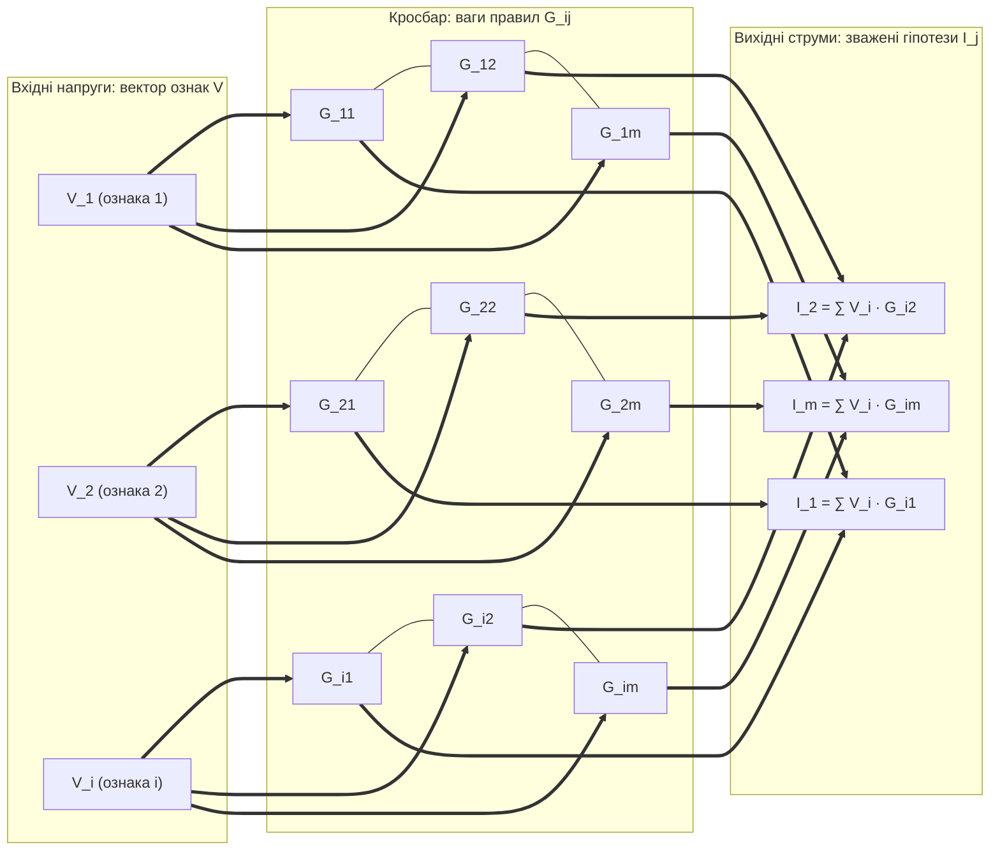
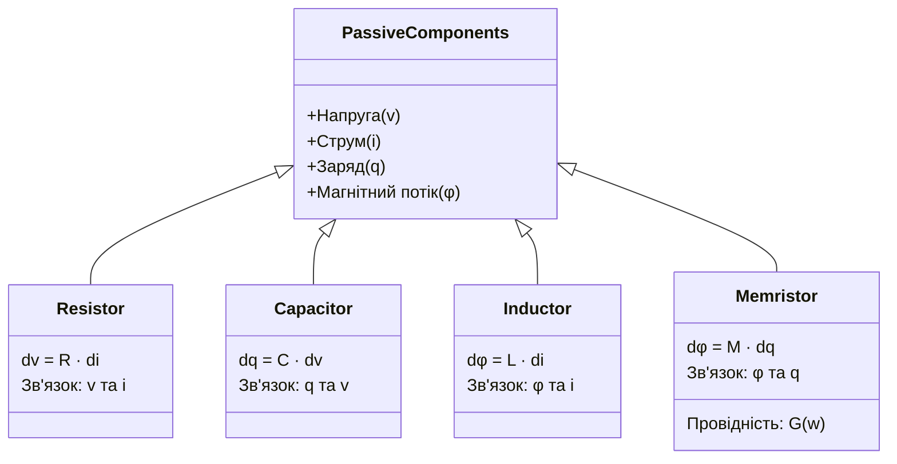
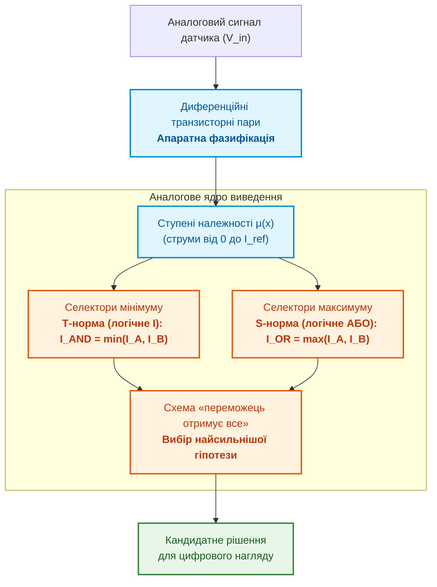
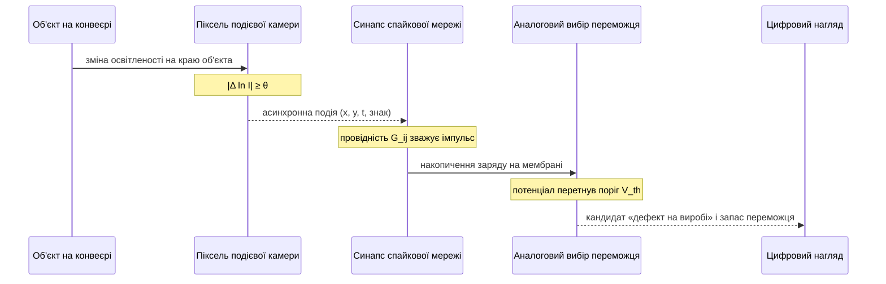
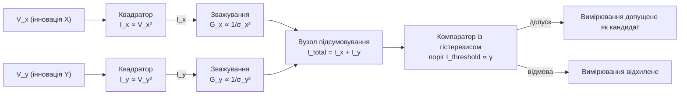
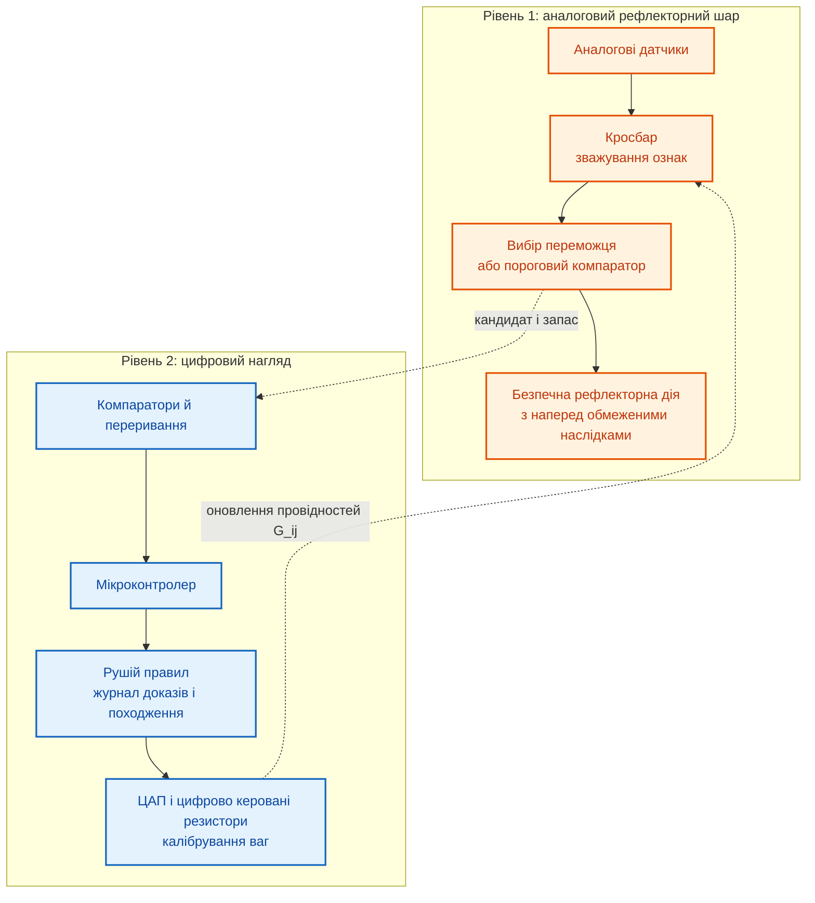

# Додаток Г. Аналогові експертні системи, нейроморфні обчислення та апаратне логічне виведення

> **Книга:** [Архітектура доказових експертних систем](README.md) · Додатки  
> **Попередній додаток:** [Додаток В. Автономна навігація без GNSS: геопросторове зіставлення (TRN/DSMAC), візуальна одометрія (VIO) та експертний арбітраж сенсорного злиття](appendix-c-autonomous-navigation-and-geosearch.md)  
> **Наступний додаток:** [Додаток Д. Змішані аналого-цифрові експертні системи](appendix-e-mixed-signal-neuromorphic-expert-systems.md)  
> **Зміст книги:** [README.md](README.md)  
> **Пов'язані глави книги:** [Глава 6. Прикладна математика експертних систем](ch06-applied-mathematics-for-expert-systems.md) · [Глава 18. Інфраструктура виконання](ch18-execution-infrastructure.md) · [Глава 22. Кібернетичний контур XXI століття](ch22-cybernetics-edge-to-backend.md) · [Глава 29. Нейро-символьна архітектура](ch29-neuro-symbolic-architecture.md)  
> **Суміжні дослідження автора:** [Військові експертні системи: БПЛА, ППО, РЕР/РЕБ](../MilTech/Military-Expert-Systems-UAS-AD-ELINT-EW-UA.md) · [Військова кібернетика](../MilTech/Ukrainian-Military-Cybernetics-UA.md)  
> **Автор:** [Микола Федчик](about-the-author.md)  
> **Рівень:** поглиблений інженерний: системні архітектори, розробники аналогових і змішаних інтегральних схем, фахівці з нейроморфних обчислень, інженери вбудованих систем  
> **Очікувані результати:** пояснювати, які операції логічного виведення аналогова схема виконує безпосередньо фізичними законами; оцінювати ціну аналогового обчислення: точність, розкид, дрейф і калібрування; відрізняти перевірені результати досліджень від перебільшених обіцянок; розуміти, чому аналогова частина експертної системи працює лише під цифровим наглядом.

Цифрова експертна система зберігає правила й факти в пам'яті, а виконує їх на процесорі. Кожне зважування ознак чи перевірка правила вимагає перенести числа з пам'яті до арифметичного блока і назад. Аналогова схема пропонує інший шлях: обчислювати там, де зберігаються ваги, і використовувати фізичні закони як обчислювальні операції. Цей додаток пояснює фізику такого підходу, а [Додаток Д](appendix-e-mixed-signal-neuromorphic-expert-systems.md) показує, як вбудувати аналогову частину в доказову експертну систему.

Головне запитання додатка: **які операції логічного виведення аналогова схема виконує природно і якою ціною?** Теза додатка: аналогова схема безпосередньо обчислює зважену суму, мінімум і максимум, вибір найсильнішого сигналу, інтегрування в часі й релаксацію до мінімуму енергії, але платить обмеженою точністю, розкидом і дрейфом елементів, потребою в калібруванні та в перетворенні сигналів на межі з цифровою частиною. Тому аналогова частина придатна як швидкий шар кандидатних рішень і рефлексів під цифровим наглядом, а не як носій бази знань.

## Чому аналогові обчислення знову цікаві для експертних систем

Перше запитання просте: де цифрова експертна система витрачає енергію. Марк Горовіц у доповіді про енергетичну проблему обчислень навів оцінки для технології 45 нм: 32-бітне множення з рухомою комою коштує близько 3,7 пДж, а зчитування 64 бітів із динамічної пам'яті з довільним доступом (*dynamic random-access memory*, DRAM) від 1,3 до 2,6 нДж [[1]](#src-1). Отже, доступ до зовнішньої пам'яті дорожчий за саму арифметику в сотні разів. Для правила, яке зважує сотні ознак на кожному вимірюванні, енергію визначає пересилання ваг, а не множення.

Обчислення в пам'яті (*in-memory computing*) усуває це пересилання: операцію виконують там, де зберігаються ваги [[2]](#src-2). Карвер Мід у статті про нейроморфні електронні системи пояснював ефективність біологічних рішень тим, що вони використовують елементарні фізичні явища як обчислювальні примітиви й кодують інформацію відносними значеннями аналогових сигналів [[3]](#src-3). Тут же Мід назвав ціну: аналогова система мусить адаптуватися до розкиду параметрів своїх компонентів [[3]](#src-3). Ця пара, фізичний примітив і потреба в калібруванні, проходить через увесь додаток.

Для прикладу візьмемо вузол моніторингу підшипника насоса з [Додатка Д](appendix-e-mixed-signal-neuromorphic-expert-systems.md). Вузол живиться від батареї й має обчислювати оцінку ризику дефекту, тобто зважену суму ознак вібрації, на кожному вікні вимірювань. Наступні розділи показують, якими фізичними засобами аналогова схема може виконати таке обчислення і що при цьому втрачається.

## Закони Ома й Кірхгофа як множення вектора на матрицю

Базова операція зважування фактів і пошуку схожих випадків є множенням вектора на матрицю. У цифровому процесорі для вектора довжини $N$ і матриці $N \times M$ потрібно $N \cdot M$ операцій множення з накопиченням, які виконуються послідовно або на багатьох паралельних блоках. В аналоговому **кросбарі** (*crossbar*), тобто матриці провідних елементів на перетинах рядків і стовпців, ту саму операцію виконують закони Ома й Кірхгофа.



Схема читається зліва направо. За законом Ома струм через елемент на перетині $i$-го рядка й $j$-го стовпця дорівнює добутку вхідної напруги $V_i$ на провідність елемента $G_{ij}=1/R_{ij}$:

```math
I_{ij}=G_{ij}\,V_i .
```

За першим законом Кірхгофа струми, що сходяться на лінії стовпця, додаються, тому вихідний струм стовпця $j$ дорівнює

```math
I_j=\sum_{i=1}^{N}G_{ij}\,V_i .
```

Усі добутки й суми для цілої матриці утворюються одночасно. Проте це не означає нескінченно швидкого обчислення: тривалість одного кроку визначають встановлення напруг у ланцюгах опорів і ємностей ліній, цифро-аналогові перетворювачі (ЦАП) на входах і аналого-цифрові перетворювачі (АЦП) на виходах. Тому коректно говорити про паралельний крок для всієї матриці, а продуктивність реальних чипів вимірювати разом із перетворювачами. Програмування кросбара для прискорення множення вектора на матрицю описали Ху та співавтори [[4]](#src-4), а огляд Ієльміні й Вонга систематизує обчислення в пам'яті на елементах з резистивним перемиканням [[5]](#src-5). Ціну перетворень і способи її врахувати розбирає [Додаток Д](appendix-e-mixed-signal-neuromorphic-expert-systems.md).

Провідність не буває від'ємною, а ваги правил бувають. Тому вагу $w_{ij}$ зазвичай кодують різницею провідностей двох елементів:

```math
w_{ij}\propto G_{ij}^{+}-G_{ij}^{-},
```

де струм через $G_{ij}^{+}$ підтримує гіпотезу, а струм через $G_{ij}^{-}$ її спростовує. Диференційне кодування компенсує зсуви, спільні для обох елементів, але не усуває дрейфу, який у двох елементах відрізняється.

## Інтегратор на операційному підсилювачі

Друга аналогова операція є інтегруванням у неперервному часі. Для ідеального операційного підсилювача з резистором $R$ на вході й конденсатором $C$ у зворотному зв'язку вихідна напруга дорівнює

```math
V_{\text{out}}(t)=-\frac{1}{RC}\int_{0}^{t}V_{\text{in}}(\tau)\,d\tau+V_{\text{out}}(0).
```

Схема інтегрує без дискретизації за часом, тому для неї немає кроку чисельного методу. Натомість реальний підсилювач має напругу зміщення й вхідні струми, які теж інтегруються й повільно зсувають результат, а вихід обмежений напругою живлення. Тому аналоговий інтегратор, наприклад для інтегрування сигналу прискорення в інерціальному вузлі, потребує періодичного скидання й калібрування. Знову працює та сама пара: фізичний примітив і потреба в цифровому нагляді.

## Мемристори та енергонезалежна аналогова пам'ять

Щоб кросбар зберігав ваги правила без живлення, його елементи мають пам'ятати провідність. Леон Чуа 1971 року теоретично ввів **мемристор** як четвертий базовий елемент кола, що пов'язує заряд і потокозчеплення [[6]](#src-6), а дослідники HP Labs 2008 року повідомили про фізичний пристрій, який вони ідентифікували як мемристор [[7]](#src-7).



Діаграма показує, що кожен елемент пов'язує свою пару величин, а мемристор пов'язує заряд $q$ і потокозчеплення $\varphi$. Звідси опір мемристора залежить від заряду, що пройшов крізь нього:

```math
V(t)=M\bigl(q(t)\bigr)\,I(t),\qquad M(q)=\frac{d\varphi(q)}{dq}.
```

У ширшому інженерному значенні мемристивними називають енергонезалежні елементи пам'яті, провідність яких можна програмувати й зчитувати. Резистивна пам'ять з довільним доступом (*resistive random-access memory*, RRAM) змінює провідність утворенням і руйнуванням провідних ниток у шарі оксиду [[5]](#src-5). Пам'ять зі зміною фазового стану (*phase-change memory*, PCM) перемикає халькогенідний матеріал між аморфною фазою з високим опором і кристалічною з низьким [[8]](#src-8). Огляд Себастьяна та співавторів порівнює ці й інші технології пам'яті, зокрема сегнетоелектричні, з погляду обчислень у пам'яті [[2]](#src-2).

Лабораторні демонстрації вже вийшли за межі окремих елементів. Презіозо та співавтори навчили й запустили інтегровану нейроморфну мережу на мемристорах із оксидів металів [[9]](#src-9), а Яо та співавтори повністю апаратно реалізували згорткову нейронну мережу на мемристорах [[10]](#src-10). Для правил експертної системи важливий інший результат: Джоші та співавтори зберігали кожну вагу мережі у двох елементах PCM у диференційному з'єднанні, тобто саме за схемою $G^{+}-G^{-}$, і утримали точність протягом доби завдяки навчанню з урахуванням апаратури та компенсації дрейфу [[11]](#src-11). Провідність PCM з часом дрейфує, і модель цього дрейфу [[8]](#src-8) разом із наслідками для доказів розглядає [Додаток Д](appendix-e-mixed-signal-neuromorphic-expert-systems.md).

Правило з вагою довіри

```math
\text{IF } X_1 \land X_2 \text{ THEN } Y \text{ WITH CONFIDENCE } w
```

в аналоговому кросбарі стає парою провідностей, а оновлення правила стає процедурою перепрограмування з перевіркою записаного значення. Такий запис уже не є рядком у репозиторії, тому версія правила в базі знань і фактичні провідності мають звірятися.

## Апаратна нечітка логіка й вибір переможця

Чимало експертних систем реального часу використовують нечітку логіку, запропоновану Лотфі Заде: належність значення до множини описують ступенем від 0 до 1, а не так чи ні [[12]](#src-12). Нечітке виведення природно відображається на аналогові схеми. Такеші Ямакава у своєму огляді описав рушій нечіткого виведення в нелінійному аналоговому режимі; нечіткий регулятор на такій апаратурі, зокрема, утримував келих вина, поставлений на перевернутий маятник [[13]](#src-13).



Схема повторює кроки нечіткого виведення. Спершу вхідна напруга перетворюється на ступені належності, потім оператори мінімуму й максимуму реалізують логічні «І» та «АБО», а наприкінці схема вибору переможця залишає найсильнішу гіпотезу. Вихід схеми є кандидатним рішенням, яке перевіряє цифрова частина.

Функції належності формують вольт-амперні характеристики транзисторів. У підпороговому режимі струм стоку транзистора зі структурою метал-оксид-напівпровідник (МОН) експоненційно залежить від напруги на затворі:

```math
I_d\approx I_0\exp\!\left(\frac{\kappa\,(V_{gs}-V_{th})}{U_T}\right)\left(1-\exp\!\left(-\frac{V_{ds}}{U_T}\right)\right),
```

де $U_T$ є тепловою напругою, а $\kappa$ є коефіцієнтом зв'язку затвора з каналом. Цей режим і побудовані на ньому аналогові схеми докладно описує книга Міда про аналогові схеми надвеликої інтеграції й нейронні системи [[14]](#src-14). Диференційна пара транзисторів у такому режимі дає плавну S-подібну передатну характеристику, а зміщенням опорних напруг задають, де саме ознака «висока вібрація» переходить від 0 до 1.

Коли кілька правил конкурують, експертна система має вибрати одне. Цифрова програма шукає аргумент максимуму перебором за час, пропорційний кількості кандидатів $K$. Аналогова схема «переможець отримує все» (*winner-take-all*, WTA) Лаццаро та співавторів використовує для кожного входу пару транзисторів і одну спільну лінію, тому складність з'єднань зростає лінійно з кількістю входів [[15]](#src-15). Нелінійний зворотний зв'язок через спільну лінію підсилює канал із найбільшим струмом і пригнічує інші:

```math
I_{\text{out},k}\approx\begin{cases}
I_{\text{bias}}, & k=\arg\max_j I_{\text{in},j},\\
0, & \text{інакше.}
\end{cases}
```

Роздільність такого вибору обмежує розкид параметрів транзисторів: якщо два вхідні струми майже рівні, переможця визначає не правило, а випадкова асиметрія схеми. Цифрова частина тому має перевіряти запас між переможцем і другим кандидатом, так само як шлюз запасу з [Додатка Д](appendix-e-mixed-signal-neuromorphic-expert-systems.md) перевіряє запас до порога.

## Спайкові нейрони та подієві датчики

Спайкові нейронні мережі (*spiking neural networks*, SNN) передають інформацію імпульсами в часі; Вольфганг Маас назвав їх третім поколінням моделей нейронних мереж [[16]](#src-16). Найпростіша модель нейрона, інтегратор із витоком і порогом (*leaky integrate-and-fire*, LIF), описує мембранний потенціал $u(t)$ рівнянням

```math
\tau_m\frac{du(t)}{dt}=-\bigl(u(t)-u_{\text{rest}}\bigr)+R_m\,I_{\text{syn}}(t),
```

де $\tau_m$ є сталою часу мембрани, $u_{\text{rest}}$ є потенціалом спокою, $R_m$ є опором мембрани, а $I_{\text{syn}}(t)$ є вхідним синаптичним струмом [[17]](#src-17). Коли потенціал досягає порога $V_{\text{th}}$, нейрон генерує імпульс і скидає потенціал до $u_{\text{reset}}$. В аналоговій реалізації роль мембрани виконує конденсатор, а порога компаратор. Інформацію кодують моменти й частота імпульсів, тому енергію на обчислення схема витрачає лише тоді, коли є події; статичне споживання схеми при цьому залишається.

Природним джерелом подій є подієва камера. Кожен її піксель незалежно реагує на зміну логарифма освітленості:

```math
\bigl|\ln I(x,y,t)-\ln I(x,y,t-\Delta t)\bigr|\ge\theta ,
```

і видає подію з координатами, часом і знаком зміни. Перший такий датчик Ліхтштайнера, Поша й Дельбрюка мав 128 × 128 пікселів, динамічний діапазон 120 дБ і затримку 15 мкс [[18]](#src-18). Огляд подієвого зору Гальєго та співавторів називає часову роздільність порядку мікросекунд, динамічний діапазон 140 дБ проти 60 дБ у звичайних камер і мале споживання [[19]](#src-19).



Діаграма показує повний шлях без кадрів: подія виникає лише там, де змінилася освітленість, спайкова мережа накопичує події, а схема вибору переможця передає цифровій частині кандидата разом із запасом, за яким цифрова частина вирішує, чи приймати кандидата.

Для таких потоків є змішані нейроморфні процесори. DYNAP-SE2 поєднує аналогові схеми нейронної динаміки з асинхронною цифровою маршрутизацією подій і має інтерфейси для подієвих датчиків і датчиків неперервного сигналу [[20]](#src-20). Для порівняння, цифровий чип IBM TrueNorth інтегрує мільйон програмованих спайкових нейронів і 256 мільйонів синапсів і споживає 63 мВт на відео 400 × 240 пікселів із частотою 30 кадрів за секунду [[21]](#src-21), а цифровий процесор Intel Loihi підтримує навчання на кристалі [[22]](#src-22). Отже, спайкова модель обчислень не прив'язана до аналогової фізики, і вибір між аналоговою та цифровою реалізацією є інженерним компромісом між енергією, точністю й відтворюваністю.

## Мережі Хопфілда: релаксація до мінімуму енергії

Частина задач експертної системи зводиться до оптимізації з обмеженнями: розподілити ремонтні бригади між об'єктами, прокласти маршрут, зіставити вимірювання датчиків із відомими об'єктами. Джон Гопфілд показав, що мережа нейронів із неперервною характеристикою має функцію енергії, яка не зростає з часом [[23]](#src-23), а разом із Девідом Танком застосував такі мережі до задач оптимізації, зокрема до задачі комівояжера [[24]](#src-24).

Розглянемо схему з $N$ підсилювачів, пов'язаних матрицею провідностей $T_{ij}$:

```math
C_i\frac{dU_i}{dt}=-\frac{U_i}{R_i}+\sum_{j=1}^{N}T_{ij}V_j+I_i ,
```

де $U_i$ є напругою на вході $i$-го підсилювача, $V_i=g(U_i)$ є вихідною напругою з монотонно зростаючою S-подібною характеристикою $g$, $I_i$ є зовнішнім струмом, що кодує вхідні факти, а матриця $T_{ij}$ кодує обмеження й критерій якості, причому $T_{ij}=T_{ji}$ і $T_{ii}=0$. Функція енергії Ляпунова для такої схеми має вигляд

```math
E=-\frac{1}{2}\sum_{i=1}^{N}\sum_{j=1}^{N}T_{ij}V_iV_j-\sum_{i=1}^{N}I_iV_i+\sum_{i=1}^{N}\frac{1}{R_i}\int_{0}^{V_i}g^{-1}(V)\,dV .
```

Оскільки $\partial E/\partial V_i=-\left(\sum_j T_{ij}V_j+I_i-U_i/R_i\right)=-C_i\,dU_i/dt$, похідна енергії за часом дорівнює

```math
\frac{dE}{dt}=\sum_{i=1}^{N}\frac{\partial E}{\partial V_i}\frac{dV_i}{dt}=-\sum_{i=1}^{N}C_i\,g'(U_i)\left(\frac{dU_i}{dt}\right)^{2}\le 0,
```

бо $C_i>0$, а $g'(U_i)>0$ для монотонно зростаючої характеристики. Енергія не зростає, поки схема не досягне стаціонарного стану, де $dU_i/dt=0$.

Цей результат гарантує збіжність, але не якість розв'язку. Схема зупиняється в локальному мінімумі, який може бути далеким від найкращого розв'язку, а якість залежить від того, як обмеження закодовано в $T_{ij}$. Час релаксації визначають сталі $RC$ схеми. Тому розв'язок мережі Гопфілда для експертної системи є кандидатом: цифрова частина перевіряє всі обмеження знайденого розв'язку, і лише перевірений розв'язок стає фактом. Сучасних нащадків цієї ідеї, машини Ізінга та імовірнісні біти, розглядає [Додаток Д](appendix-e-mixed-signal-neuromorphic-expert-systems.md).

## Інженерний приклад: аналоговий шлюз Махаланобіса

### Постановка задачі

У [Главі 6](ch06-applied-mathematics-for-expert-systems.md) та [Додатку В](appendix-c-autonomous-navigation-and-geosearch.md) вимірювання датчика допускають до злиття лише тоді, коли відстань Махаланобіса між вимірюванням і прогнозом не перевищує порога:

```math
d_M^{2}=(\mathbf{z}-\hat{\mathbf{z}})^{\top}\mathbf{S}^{-1}(\mathbf{z}-\hat{\mathbf{z}})\le\gamma ,
```

де $\mathbf{z}$ є вимірюванням, $\hat{\mathbf{z}}$ є прогнозом, $\mathbf{S}$ є коваріаційною матрицею інновації, а $\gamma$ є порогом. Мікроконтролер обчислює цю форму за кілька десятків або сотень інструкцій. Постає запитання: чи можна виконати цей допуск аналоговою схемою, і що тоді треба перевіряти.

### Схема для некорельованих вимірювань

Нехай інновація подана двома диференційними напругами $V_x=z_x-\hat z_x$ і $V_y=z_y-\hat z_y$, а вимірювання некорельовані, тобто $\mathbf{S}=\operatorname{diag}(\sigma_x^{2},\sigma_y^{2})$. Тоді

```math
d_M^{2}=\frac{V_x^{2}}{\sigma_x^{2}}+\frac{V_y^{2}}{\sigma_y^{2}}\le\gamma .
```



Схема складається з трьох каскадів. **Квадратор** можна побудувати на квадратичній залежності струму стоку МОН-транзистора від напруги в режимі насичення, $I\propto(V_{gs}-V_{th})^{2}$, або на перемножувачі Гілберта. **Зважування** задають провідностями $G_x=k_0/\sigma_x^{2}$ і $G_y=k_0/\sigma_y^{2}$, де $k_0$ є масштабним коефіцієнтом; провідності реалізують каліброваними резисторами, цифрово керованими резисторами або мемристорами. **Компаратор** порівнює сумарний струм із порогом, пропорційним $\gamma$, а гістерезис не дає рішенню коливатися, коли $d_M^{2}$ близька до порога.

### Що треба перевірити

Затримку й споживання такої схеми визначають квадратори й компаратор, і для конкретної схеми їх отримують моделюванням SPICE на всіх кутах технологічного процесу й вимірюванням виготовлених зразків, а не оцінкою за довідковими даними окремих компонентів. Коваріація $\mathbf{S}$ змінюється разом з умовами руху й станом датчиків, тому ваги $G_x$ і $G_y$ перезаписує цифрова частина, і кожен такий запис є версійованим калібруванням. Нарешті, вимірювання з $d_M^{2}$ поблизу $\gamma$ схема допускає або відхиляє майже випадково, тому рішення в цій зоні цифрова частина перевіряє повторним обчисленням. Аналоговий шлюз звільняє процесор від більшості однозначних випадків, але не знімає з цифрової частини відповідальності за межові.

## Цифрові й аналогові обчислювачі: порівняння без перебільшень

Попередні розділи показали фізичні примітиви. Таблиця зводить їхні властивості до того, що важить для експертної системи.

| Властивість | Цифровий процесор | Аналоговий кросбар | Що з цього випливає для експертної системи |
|---|---|---|---|
| Енергія доступу до ваг | доступ до DRAM у сотні разів дорожчий за множення [[1]](#src-1) | ваги не пересилаються [[2]](#src-2) | виграш існує там, де домінує множення на незмінну матрицю |
| Точність | задана форматом числа | обмежена шумом і дрейфом; дослідницькі чипи показують точність, порівнянну з програмними моделями з 4-бітними вагами [[25]](#src-25), і множення з 8-бітними входами й виходами [[26]](#src-26) | точні перевірки версій, порогів і обмежень залишаються цифровими |
| Відтворюваність | повторюваність біт у біт | статистична, залежить від температури й часу | потрібні модель похибки й канаркові обчислення ([Додаток Д](appendix-e-mixed-signal-neuromorphic-expert-systems.md)) |
| Оновлення знань | завантаження нової версії | перепрограмування провідностей із перевіркою | оновлення правила стає процедурою калібрування |
| Поодинокі збої від випромінювання | заряджена частинка може перевернути біт у тригері чи пам'яті | залежить від конкретного проєкту; окремі проєкти повідомляють про стійкість до таких збоїв [[27]](#src-27) | стійкість треба випробовувати, а не припускати |

Таблиця не дає переможця. Аналоговий кросбар виграє в енергії на повторюваному множенні й програє в точності та відтворюваності. Звідси архітектурний висновок наступного розділу.

## Від аналогового рефлексу до змішаної архітектури

Аналогова схема не може бути носієм бази знань. Вона не зберігає довільних структур із версіями й походженням, має обмежену точність і потребує калібрування. Зате вона здатна швидко й економно виконувати окремі ядра: зважувати ознаки, вибирати переможця, перевіряти порогові умови. Тому практична експертна система з аналоговою частиною має два рівні.



Аналоговий рівень може самостійно виконувати лише дії з наперед обмеженими наслідками: аварійне вимкнення за перевищення порога вібрації, обмеження струму, пробудження цифрової частини. Усі інші рішення аналоговий рівень передає як кандидатів із запасом, а цифровий рівень перевіряє їх правилами, записує в журнал доказів і калібрує аналогові ваги. Межі повноважень автоматичних дій розглядає [Глава 21](ch21-from-recommendation-to-action.md), а модель похибки, канаркові обчислення, шлюз запасу й аудит пропусків, тобто доказовий контракт аналогової частини, описує [Додаток Д](appendix-e-mixed-signal-neuromorphic-expert-systems.md).

## Українська інженерна школа й відкрита мікроелектроніка

Дослідження апаратно зручних подань знань мають в Україні власну історію. Дмитро Рачковський із Кібернетичного центру імені В. М. Глушкова в Києві разом з Ернстом Куссулем розробили спосіб зв'язування й нормалізації бінарних розріджених розподілених подань [[28]](#src-28). Такі подання стійкі до шуму, і тому їхні сучасні нащадки, гіпервимірні обчислення, добре переносяться на аналогову пам'ять; цей зв'язок розглядає [Додаток Д](appendix-e-mixed-signal-neuromorphic-expert-systems.md).

Для прототипування аналогових і змішаних схем більше не потрібна власна фабрика. Google разом із SkyWater відкрили набір проєктування технології (*process design kit*, PDK) для 130-нанометрового процесу SkyWater [[29]](#src-29), IHP відкрив PDK для 130-нанометрового процесу BiCMOS, що поєднує біполярні й МОН-транзистори та призначений для аналогових, змішаних і радіочастотних схем [[30]](#src-30), топологію можна редагувати у відкритому редакторі KLayout [[31]](#src-31), а програма Tiny Tapeout пропонує швидший, простіший і дешевший шлях до виготовлення власного чипа [[32]](#src-32). Відкриті PDK знижують поріг входу для навчання й прототипування схем вибору переможця, нечітких компараторів чи невеликих кросбарів. Проте вони не знімають потреби у вимірюваннях виготовлених зразків і в кваліфікації для відповідального застосування.

Для оборонних застосувань той самий підхід стосується вузлів спостереження й діагностики техніки з обмеженим живленням. Аналогова частина тут дає економію енергії й швидку реакцію, а рішення з тяжкими наслідками залишаються за цифровою частиною й людиною, як вимагає [Глава 21](ch21-from-recommendation-to-action.md).

## Висновок

Додаток почався із запитання, які операції логічного виведення аналогова схема виконує природно і якою ціною. Відповідь така. Закони Ома й Кірхгофа виконують зважене підсумовування за один паралельний крок для всієї матриці. Транзисторні схеми реалізують мінімум, максимум і вибір переможця, операційний підсилювач інтегрує в неперервному часі, спайкові нейрони обробляють лише події, а мережа Гопфілда релаксує до мінімуму енергії. Мемристивні елементи зберігають ваги правил без живлення.

Ціна теж визначена. Точність обмежують шум і дрейф, результат повторюється лише статистично, кожен крок потребує перетворень на межі з цифровою частиною, а мережа Гопфілда гарантує збіжність, але не найкращий розв'язок. Замість обіцянок на кшталт «обчислення за нульовий час» додаток показав механізми, на яких тримаються реальні результати досліджень, і межі цих результатів.

Звідси архітектурний висновок: аналогова частина працює як швидкий шар кандидатних рішень і рефлексів з обмеженими наслідками, а цифрова частина зберігає базу знань, перевіряє кандидатів і калібрує аналогові ваги. Як перетворити цей поділ на перевірюваний доказовий контракт, пояснює [Додаток Д](appendix-e-mixed-signal-neuromorphic-expert-systems.md).

## Словник

| Український термін | Англійський відповідник | Коротке пояснення |
|---|---|---|
| Кросбар | *crossbar* | Матриця провідних елементів на перетинах рядків і стовпців, що множить вектор на матрицю |
| Обчислення в пам'яті | *in-memory computing* | Виконання операції там, де зберігаються дані |
| Провідність | *conductance* | Величина, обернена до опору; в кросбарі кодує вагу |
| Мемристор | *memristor* | Елемент кола, опір якого залежить від заряду, що пройшов крізь нього |
| Дрейф провідності | *conductance drift* | Повільна зміна провідності елемента після програмування |
| Диференційне кодування ваги | *differential weight encoding* | Подання ваги різницею провідностей двох елементів |
| Нечітка множина | *fuzzy set* | Множина, належність до якої описують ступенем від 0 до 1 |
| Функція належності | *membership function* | Залежність ступеня належності від значення ознаки |
| Т-норма, S-норма | *t-norm, s-norm* | Нечіткі аналоги логічних «І» та «АБО», наприклад мінімум і максимум |
| Схема «переможець отримує все» | *winner-take-all circuit* | Схема, що підсилює найбільший вхідний сигнал і пригнічує інші |
| Підпороговий режим | *subthreshold operation* | Режим МОН-транзистора з експоненційною залежністю струму від напруги затвора |
| Спайкова нейронна мережа | *spiking neural network* | Мережа, нейрони якої обмінюються імпульсами в часі |
| Модель LIF | *leaky integrate-and-fire* | Модель нейрона, що інтегрує вхід із витоком і генерує імпульс за порогом |
| Подієва камера | *event camera* | Датчик, пікселі якого незалежно видають події зміни освітленості |
| Мережа Гопфілда | *Hopfield network* | Рекурентна мережа з функцією енергії, що не зростає з часом |
| Функція Ляпунова | *Lyapunov function* | Функція стану, що не зростає вздовж траєкторій системи й доводить її збіжність |
| Відстань Махаланобіса | *Mahalanobis distance* | Відстань, що враховує коваріацію похибок вимірювань |
| Калібрування | *calibration* | Вимірювання й компенсація відхилень аналогової схеми від номінальної поведінки |

## Абревіатури

| Скорочення | Розшифрування | Значення |
|---|---|---|
| АЦП | аналого-цифровий перетворювач | перетворює аналоговий сигнал на числа |
| ЦАП | цифро-аналоговий перетворювач | перетворює числа на аналоговий сигнал |
| МОН | метал-оксид-напівпровідник | структура польового транзистора |
| BiCMOS | Bipolar CMOS | технологія, що поєднує біполярні й комплементарні МОН-транзистори |
| DRAM | Dynamic Random-Access Memory | динамічна пам'ять з довільним доступом |
| GNSS | Global Navigation Satellite System | глобальна навігаційна супутникова система |
| LIF | Leaky Integrate-and-Fire | модель нейрона з витоком і порогом |
| PCM | Phase-Change Memory | пам'ять зі зміною фазового стану |
| PDK | Process Design Kit | набір проєктування технології виготовлення мікросхем |
| RRAM | Resistive Random-Access Memory | резистивна пам'ять з довільним доступом |
| SNN | Spiking Neural Network | спайкова нейронна мережа |
| SPICE | Simulation Program with Integrated Circuit Emphasis | програма моделювання електричних кіл |
| WTA | Winner-Take-All | схема «переможець отримує все» |

## Джерела

1. <a id="src-1"></a>Mark Horowitz. [*Computing's Energy Problem (and What We Can Do About It)*](https://doi.org/10.1109/ISSCC.2014.6757323). *2014 IEEE International Solid-State Circuits Conference Digest of Technical Papers (ISSCC)*, 10–14, 2014.
2. <a id="src-2"></a>Abu Sebastian, Manuel Le Gallo, Riduan Khaddam-Aljameh, Evangelos Eleftheriou. [*Memory Devices and Applications for In-Memory Computing*](https://doi.org/10.1038/s41565-020-0655-z). *Nature Nanotechnology*, 15(7), 529–544, 2020.
3. <a id="src-3"></a>Carver Mead. [*Neuromorphic Electronic Systems*](https://doi.org/10.1109/5.58356). *Proceedings of the IEEE*, 78(10), 1629–1636, 1990.
4. <a id="src-4"></a>Miao Hu, John Paul Strachan, Zhiyong Li, Emmanuelle M. Grafals та ін. [*Dot-Product Engine for Neuromorphic Computing: Programming 1T1M Crossbar to Accelerate Matrix-Vector Multiplication*](https://doi.org/10.1145/2897937.2898010). *Proceedings of the 53rd Annual Design Automation Conference (DAC)*, 1–6, 2016.
5. <a id="src-5"></a>Daniele Ielmini, H.-S. Philip Wong. [*In-Memory Computing with Resistive Switching Devices*](https://doi.org/10.1038/s41928-018-0092-2). *Nature Electronics*, 1(6), 333–343, 2018.
6. <a id="src-6"></a>Leon O. Chua. [*Memristor: The Missing Circuit Element*](https://doi.org/10.1109/TCT.1971.1083337). *IEEE Transactions on Circuit Theory*, 18(5), 507–519, 1971.
7. <a id="src-7"></a>Dmitri B. Strukov, Gregory S. Snider, Duncan R. Stewart, R. Stanley Williams. [*The Missing Memristor Found*](https://doi.org/10.1038/nature06932). *Nature*, 453(7191), 80–83, 2008.
8. <a id="src-8"></a>Manuel Le Gallo, Abu Sebastian. [*An Overview of Phase-Change Memory Device Physics*](https://doi.org/10.1088/1361-6463/ab7794). *Journal of Physics D: Applied Physics*, 53(21), 213002, 2020.
9. <a id="src-9"></a>M. Prezioso, F. Merrikh-Bayat, B. D. Hoskins, G. C. Adam та ін. [*Training and Operation of an Integrated Neuromorphic Network Based on Metal-Oxide Memristors*](https://doi.org/10.1038/nature14441). *Nature*, 521(7550), 61–64, 2015.
10. <a id="src-10"></a>Peng Yao, Huaqiang Wu, Bin Gao, Jianshi Tang та ін. [*Fully Hardware-Implemented Memristor Convolutional Neural Network*](https://doi.org/10.1038/s41586-020-1942-4). *Nature*, 577(7792), 641–646, 2020.
11. <a id="src-11"></a>Vinay Joshi, Manuel Le Gallo, Simon Haefeli, Irem Boybat та ін. [*Accurate Deep Neural Network Inference Using Computational Phase-Change Memory*](https://doi.org/10.1038/s41467-020-16108-9). *Nature Communications*, 11, 2473, 2020.
12. <a id="src-12"></a>L. A. Zadeh. [*Fuzzy Sets*](https://doi.org/10.1016/S0019-9958(65)90241-X). *Information and Control*, 8(3), 338–353, 1965.
13. <a id="src-13"></a>T. Yamakawa. [*A Fuzzy Inference Engine in Nonlinear Analog Mode and Its Application to a Fuzzy Logic Control*](https://doi.org/10.1109/72.217192). *IEEE Transactions on Neural Networks*, 4(3), 496–522, 1993.
14. <a id="src-14"></a>Carver Mead. [*Analog VLSI and Neural Systems*](https://openlibrary.org/works/OL4625990W). Addison-Wesley, 1989.
15. <a id="src-15"></a>J. Lazzaro, S. Ryckebusch, M. A. Mahowald, C. A. Mead. [*Winner-Take-All Networks of O(N) Complexity*](https://doi.org/10.21236/ADA451466). *Advances in Neural Information Processing Systems 1* (NIPS 1988), 1989; технічний звіт DTIC ADA451466.
16. <a id="src-16"></a>Wolfgang Maass. [*Networks of Spiking Neurons: The Third Generation of Neural Network Models*](https://doi.org/10.1016/S0893-6080(97)00011-7). *Neural Networks*, 10(9), 1659–1671, 1997.
17. <a id="src-17"></a>Wulfram Gerstner, Werner M. Kistler. [*Spiking Neuron Models: Single Neurons, Populations, Plasticity*](https://doi.org/10.1017/CBO9780511815706). Cambridge University Press, 2002.
18. <a id="src-18"></a>Patrick Lichtsteiner, Christoph Posch, Tobi Delbruck. [*A 128×128 120 dB 15 μs Latency Asynchronous Temporal Contrast Vision Sensor*](https://doi.org/10.1109/JSSC.2007.914337). *IEEE Journal of Solid-State Circuits*, 43(2), 566–576, 2008.
19. <a id="src-19"></a>Guillermo Gallego, Tobi Delbruck, Garrick Orchard, Chiara Bartolozzi та ін. [*Event-Based Vision: A Survey*](https://doi.org/10.1109/TPAMI.2020.3008413). *IEEE Transactions on Pattern Analysis and Machine Intelligence*, 44(1), 154–180, 2022.
20. <a id="src-20"></a>Ole Richter, Chenxi Wu, Adrian M. Whatley, German Köstinger та ін. [*DYNAP-SE2: A Scalable Multi-Core Dynamic Neuromorphic Asynchronous Spiking Neural Network Processor*](https://doi.org/10.1088/2634-4386/ad1cd7). *Neuromorphic Computing and Engineering*, 4(1), 014003, 2024.
21. <a id="src-21"></a>Paul A. Merolla, John V. Arthur, Rodrigo Alvarez-Icaza, Andrew S. Cassidy та ін. [*A Million Spiking-Neuron Integrated Circuit with a Scalable Communication Network and Interface*](https://doi.org/10.1126/science.1254642). *Science*, 345(6197), 668–673, 2014.
22. <a id="src-22"></a>Mike Davies, Narayan Srinivasa, Tsung-Han Lin, Gautham Chinya та ін. [*Loihi: A Neuromorphic Manycore Processor with On-Chip Learning*](https://doi.org/10.1109/MM.2018.112130359). *IEEE Micro*, 38(1), 82–99, 2018.
23. <a id="src-23"></a>J. J. Hopfield. [*Neurons with Graded Response Have Collective Computational Properties like Those of Two-State Neurons*](https://doi.org/10.1073/pnas.81.10.3088). *Proceedings of the National Academy of Sciences*, 81(10), 3088–3092, 1984.
24. <a id="src-24"></a>J. J. Hopfield, D. W. Tank. [*"Neural" Computation of Decisions in Optimization Problems*](https://doi.org/10.1007/BF00339943). *Biological Cybernetics*, 52(3), 141–152, 1985.
25. <a id="src-25"></a>Weier Wan, Rajkumar Kubendran, Clemens Schaefer, Sukru Burc Eryilmaz та ін. [*A Compute-in-Memory Chip Based on Resistive Random-Access Memory*](https://doi.org/10.1038/s41586-022-04992-8). *Nature*, 608(7923), 504–512, 2022.
26. <a id="src-26"></a>Manuel Le Gallo, Riduan Khaddam-Aljameh, Milos Stanisavljevic, Athanasios Vasilopoulos та ін. [*A 64-Core Mixed-Signal In-Memory Compute Chip Based on Phase-Change Memory for Deep Neural Network Inference*](https://doi.org/10.1038/s41928-023-01010-1). *Nature Electronics*, 6(9), 680–693, 2023.
27. <a id="src-27"></a>Kamel-Eddine Harabi, Tifenn Hirtzlin, Clément Turck, Elisa Vianello та ін. [*A Memristor-Based Bayesian Machine*](https://doi.org/10.1038/s41928-022-00886-9). *Nature Electronics*, онлайн-публікація 19 грудня 2022 року; препринт [arXiv:2112.10547](https://arxiv.org/abs/2112.10547).
28. <a id="src-28"></a>Dmitri A. Rachkovskij, Ernst M. Kussul. [*Binding and Normalization of Binary Sparse Distributed Representations by Context-Dependent Thinning*](https://doi.org/10.1162/089976601300014592). *Neural Computation*, 13(2), 411–452, 2001.
29. <a id="src-29"></a>Google, SkyWater Technology. [*SkyWater SKY130 Open Source PDK*](https://github.com/google/skywater-pdk). Репозиторій GitHub.
30. <a id="src-30"></a>IHP. [*IHP Open PDK: 130nm BiCMOS Open Source PDK for Analog, Mixed Signal and RF Design*](https://github.com/IHP-GmbH/IHP-Open-PDK). Репозиторій GitHub.
31. <a id="src-31"></a>KLayout. [*KLayout: Layout Viewer and Editor*](https://www.klayout.de/). Офіційний сайт.
32. <a id="src-32"></a>Tiny Tapeout. [*Tiny Tapeout*](https://tinytapeout.com/). Офіційний сайт програми.

---

[← Додаток В. Автономна навігація без GNSS](appendix-c-autonomous-navigation-and-geosearch.md) | [Зміст книги](README.md) | [Додаток Д. Змішані аналого-цифрові експертні системи →](appendix-e-mixed-signal-neuromorphic-expert-systems.md)
