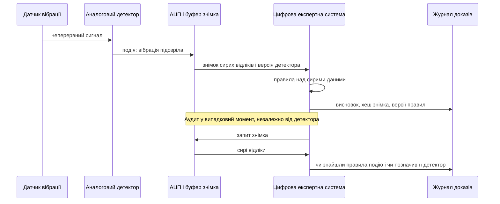
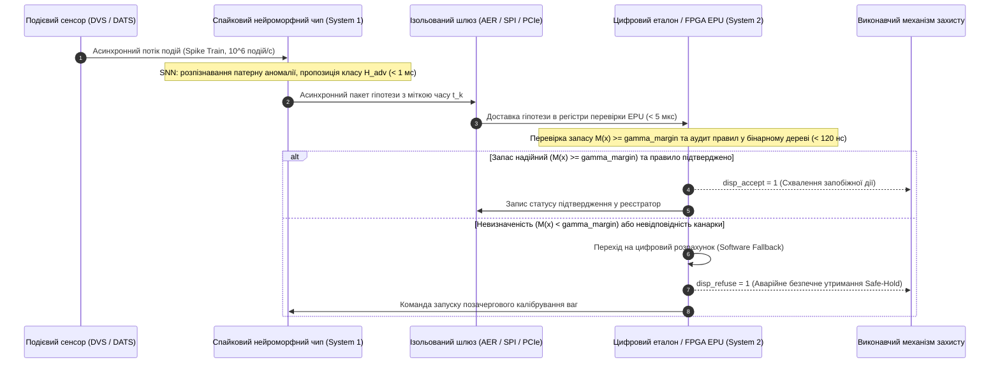

# Додаток Д. Змішані аналого-цифрові експертні системи: нейроморфні, аналогові та інші нетрадиційні обчислювачі під доказовим контролем

> **Книга:** [Архітектура доказових експертних систем](README.md) · Додатки  
> **Зміст книги:** [README.md](README.md)  
> **Автор:** [Микола Федчик](about-the-author.md)  
> **Рівень:** поглиблений інженерний: системні архітектори, розробники вбудованих і змішаних аналого-цифрових систем, інженери знань  
> **Очікувані результати:** розрізняти два напрями поєднання аналогових і цифрових обчислень в експертній системі; оцінювати, які операції виведення має сенс переносити на аналогові, нейроморфні чи інші нетрадиційні обчислювачі; будувати доказовий контракт для наближеного результату: модель похибки, калібрування, шлюз запасу, цифрове перерахування й аудит пропусків.

---

## Анотація

У промислових системах вібромоніторингу, газоаналізу та автономного контролю критичної інфраструктури безперервна робота цифрового тракту оцифрування (АЦП + мікроконтролер) швидко вичерпує батарейне живлення, унеможливлюючи тривалу експлуатацію без обслуговування. Застосування наднизькоспоживаючих аналогових та нейроморфних детекторів для асинхронного пробудження системи (*wake-up trigger*) несе приховану небезпеку: через шум, нелінійність та розкид компонентів аналоговий шар може мовчки пропустити зародження дефекту підшипника чи витік газу, а цифрова експертна система ніколи не дізнається про пропущену катастрофу через втрату побайтової відтворюваності доказів.

Цей додаток розв'язує задачу збереження повної верифікованості та надійності у змішаних аналого-цифрових архітектурах. Ми розглядаємо два зустрічні напрями інтеграції (аналог $\to$ цифра та цифра $\to$ аналог) і формалізуємо **доказовий контракт змішаних обчислень**: математичну модель похибки та температурного калібрування, контрольно-пропускний шлюз запасу ($M(\mathbf{x}) \ge \gamma_{\text{margin}}$), політику обов'язкового цифрового перерахування в зоні сумніву та статистичний аудит пропусків (протокол подвійного вимірювання), що гарантує збереження сертифікаційного рівня безпеки за радикального зниження енергоспоживання.

---

[Додаток Г](appendix-d-analog-expert-systems-and-neuromorphic-computing.md) описує фізику аналогових обчислень: як закони Ома й Кірхгофа множать вектор на матрицю, як транзисторні схеми виконують нечітке виведення й вибирають найсильніший сигнал. Цей додаток відповідає на наступне інженерне запитання: як вбудувати аналогові й нейроморфні обчислювачі в доказову експертну систему так, щоб висновок залишився перевірюваним. Відповідь шукатимемо на одному прикладі, а наприкінці визначимо, що з неї переноситься на інші галузі й де вона перестає працювати.

## Одне завдання, два обчислювальні світи

Уявімо вузол моніторингу підшипника промислового насоса. Вузол прикріплений до корпусу насоса, живиться від батареї й має працювати без обслуговування цілий рік. Датчик вібрації видає неперервний аналоговий сигнал. Експертна система, якій вузол передає дані, має відповісти на запитання: чи з'явилися ознаки дефекту підшипника, і якщо так, то на яких вимірюваннях і правилах тримається висновок.

Цифровий підхід очевидний: аналого-цифровий перетворювач (АЦП) безперервно оцифровує вібрацію, мікроконтролер обчислює спектр і ознаки, а рушій правил порівнює ознаки з порогами. Припустімо, що енергетичний бюджет вузла не дозволяє тримати АЦП і мікроконтролер увімкненими постійно. Тоді з'являються дві пропозиції. Перша пропозиція ставить перед АЦП аналоговий або нейроморфний детектор, який постійно стежить за сигналом із малим споживанням і будить цифрову частину лише тоді, коли вібрація стала підозрілою. Друга пропозиція обчислює оцінку ризику дефекту, тобто зважену суму ознак, в аналоговій матриці пам'яті, де ваги правила зберігаються як електричні провідності.

Обидві пропозиції обіцяють виграш в енергії, але обидві змінюють природу доказу. Цифрове обчислення можна повторити біт у біт, а аналогове дає наближений результат, на який впливають шум, температура й старіння елементів. Нейроморфний детектор, який вирішує, коли будити цифрову частину, може пропустити подію, і цифрова частина про пропуск навіть не дізнається.

Звідси головне запитання додатка: **за яких умов частину роботи експертної системи можна перенести на аналогові, нейроморфні чи інші нетрадиційні обчислювачі так, щоб виграш в енергії та затримці не зруйнував перевірюваності висновку?** Теза додатка така: змішана експертна система виправдана там, де нетрадиційний обчислювач дає кандидатний результат із виміряною моделлю похибки, а цифрова частина зберігає повноваження над правилами, походженням, калібруванням і рішенням прийняти результат, перерахувати його чи відмовитися від відповіді. Межа між аналоговою й цифровою частинами, тобто АЦП і цифро-аналоговий перетворювач (ЦАП), є місцем, де цей доказовий контракт виконується.

## Що таке змішана експертна система

Спершу потрібні кілька означень. **Аналоговий сигнал** неперервно змінюється в часі й за значенням, як напруга датчика вібрації. **Цифровий сигнал** набуває скінченної кількості значень у дискретні моменти часу. АЦП (*analog-to-digital converter*, ADC) перетворює аналоговий сигнал на послідовність чисел, а ЦАП (*digital-to-analog converter*, DAC) виконує зворотне перетворення. Схеми, у яких аналогові й цифрові блоки працюють разом на одному кристалі чи одній платі, називають **змішаними** (*mixed-signal*).

**Нейроморфним** називають обчислювач, побудований за принципами нервової системи. Карвер Мід у статті «Neuromorphic Electronic Systems» пояснював перевагу біологічних рішень тим, що вони використовують елементарні фізичні явища як обчислювальні примітиви й кодують інформацію відносними значеннями аналогових сигналів, а не абсолютними значеннями цифрових [[1]](#src-1). Мід одразу назвав і ціну такого підходу: аналогові системи потребують адаптації, яка компенсує розкид параметрів компонентів [[1]](#src-1). Ця ціна стане центральною темою додатка.

**Обчислення в пам'яті** (*in-memory computing*) виконують операцію там, де зберігаються дані, замість того щоб пересилати дані до процесора [[2]](#src-2). Типовий приклад: ваги записують як провідності елементів пам'яті на перетинах рядків і стовпців матриці, яку називають **кросбаром** (*crossbar*); напруги на рядках кодують вхідний вектор, а струми стовпців дають добуток вектора на матрицю. Фізику такого множення розглядає [Додаток Г](appendix-d-analog-expert-systems-and-neuromorphic-computing.md).

Слово «нейроморфний» не означає «аналоговий». Дослідницький нейроморфний процесор Intel Loihi побудований на цифрових схемах [[3]](#src-3), а архітектура IBM NorthPole переплітає цифрові обчислення з пам'яттю на кристалі й обходиться без зовнішньої пам'яті [[4]](#src-4). Змішаними є, наприклад, BrainScaleS-2, де аналогове ядро фізично емулює спайкові нейрони, а поруч працюють цифровий процесор і цифрова мережа маршрутизації подій [[5]](#src-5), і DYNAP-SE2, де аналогові схеми відтворюють динаміку нейронів, а асинхронні цифрові схеми маршрутизують події [[6]](#src-6). Додаток зосереджується на змішаних обчислювачах, а цифрові нейроморфні процесори використовує як точку порівняння.

**Змішана експертна система** в цьому додатку означає експертну систему, у якій частину виведення або підготовки фактів виконує аналоговий чи нейроморфний обчислювач, а решту виконує цифрова частина. Поєднання має два напрями, показані на схемі.

```mermaid
flowchart LR
    accTitle: Два напрями змішаної експертної системи
    accDescr: Аналоговий детектор передає події цифровій експертній системі, а цифрова експертна система доручає ядро обчислень аналоговому прискорювачу; обидва шляхи проходять через АЦП і ЦАП.

    subgraph AD["Напрям аналог → цифра"]
        S["Датчик<br/>неперервний сигнал"] --> DET["Аналоговий або<br/>нейроморфний детектор"]
        DET -->|"подія + знімок сирих даних"| ADC1["АЦП"]
    end

    subgraph DIG["Цифрова експертна система"]
        RULES["Правила, факти,<br/>походження"]
        GATE["Доказовий контракт:<br/>модель похибки, шлюз,<br/>перерахування, аудит"]
        RULES --> GATE
    end

    subgraph DA["Напрям цифра → аналог"]
        DAC["ЦАП"] --> XBAR["Аналоговий прискорювач<br/>у пам'яті"]
        XBAR --> ADC2["АЦП"]
    end

    ADC1 --> RULES
    GATE -->|"вхідний вектор"| DAC
    ADC2 -->|"наближений результат"| GATE
```



У напрямі **аналог → цифра** аналоговий або нейроморфний каскад стоїть біля датчика й вирішує, коли й що передати цифровій частині. У напрямі **цифра → аналог** цифрова експертна система доручає аналоговому прискорювачу обчислювальне ядро, наприклад зважування ознак чи пошук схожих випадків, і отримує наближений результат назад через АЦП. В обох напрямах доказовий контракт виконує цифрова частина, бо лише вона може зберегти версії, повторити обчислення й записати походження висновку. Ширше питання розподілу обчислень між датчиками й серверною частиною розглядає [Глава 22](ch22-cybernetics-edge-to-backend.md), а поєднання нейронних і символьних компонентів [Глава 29](ch29-neuro-symbolic-architecture.md).

## Які операції експертної системи можна перенести на аналогову частину

Означення показують, що змішаність сама по собі нічого не гарантує. Тепер треба з'ясувати, яку саме роботу експертної системи має сенс віддавати аналоговому обчислювачу. Рушій правил із версіями, походженням і журналом рішень аналоговим не стане. Проте кілька обчислювальних ядер, на яких тримається виведення, мають природні аналогові відповідники.

### Зважування ознак і пошук схожих випадків

Оцінка ризику в прикладі з підшипником є скалярним добутком вектора ознак на вектор ваг, а пошук схожого випадку в базі знань зводиться до множення вектора запиту на матрицю збережених векторів. Саме цю операцію виконують чипи аналогових обчислень у пам'яті (*analog in-memory computing*, AIMC). Чип IBM на пам'яті зі зміною фазового стану (*phase-change memory*, PCM), виготовлений за технологією 14 нм, містить 64 ядра розміром 256 × 256 і виконує на кристалі також цифрові функції активації; для множення з 8-бітними входами й виходами автори повідомляють пропускну здатність до 63,1 трильйона операцій за секунду (*tera-operations per second*, TOPS) за енергоефективності 9,76 TOPS на ват [[7]](#src-7). Інший чип IBM містить 35 мільйонів елементів PCM у 34 блоках і досягає до 12,4 TOPS на ват; на п'яти таких чипах автори розмістили понад 45 мільйонів ваг моделі розпізнавання мовлення й отримали точність, близьку до програмної [[8]](#src-8). Чип NeuRRAM на резистивній пам'яті з довільним доступом (*resistive random-access memory*, RRAM) показав точність, порівнянну з програмними моделями з 4-бітними вагами [[9]](#src-9).

Для експертної системи з цих результатів важливі не рекордні числа, а два спостереження. По-перше, жоден із цих чипів не є суто аналоговим: автори 64-ядерного чипа прямо пишуть, що для наскрізного виграшу в затримці й енергії аналогові обчислення треба поєднати з цифровими операціями та зв'язком на кристалі [[7]](#src-7). По-друге, точність описують як «близьку до програмної», тобто результат наближений, і межу наближення треба виміряти для конкретної задачі, а не переносити з іншої.

### Порогові правила й дерева рішень

Умовне правило «якщо амплітуда вібрації на характерній частоті дефекту зовнішнього кільця лежить у межах від 0,8 до 1,5 g і температура корпусу вища за 70 °C, то підозра на дефект підшипника» перевіряє, чи потрапляє кожна ознака в заданий інтервал. Аналогова асоціативна пам'ять (*content-addressable memory*, CAM) на мемристорах зберігає дані в програмованих провідностях, приймає аналогові або цифрові значення пошуку й порівнює вхід з усіма рядками паралельно [[10]](#src-10). Педретті та співавтори записали кожен шлях від кореня до листка дерева рішень в окремий рядок такої пам'яті, тобто кожен рядок зберігає набір інтервалів, і оцінили зростання пропускної здатності приблизно в тисячу разів порівняно зі звичайними підходами [[11]](#src-11).

Для рушія правил це найприродніший відповідник: рядок аналогової CAM є продукційним правилом з інтервальними умовами, а збіг рядка означає, що правило спрацювало. Формально рядок $r$ збігається з вхідним вектором $\mathbf{x}$, якщо кожна ознака потрапляє у свій інтервал:

```math
\text{match}_r(\mathbf{x})=\bigwedge_{j=1}^{d}\left(l_{rj}\le x_j\le u_{rj}\right).
```

Тут:

- $\text{match}_r(\mathbf{x})$ є логічним значенням: «істина», якщо рядок $r$ збігається з вхідним вектором, і «хиба» в іншому випадку;
- $r$ є номером рядка аналогової CAM, тобто однієї умови правила;
- $\mathbf{x}$ є вектором вхідних ознак, наприклад амплітуди вібрації й температури корпуса;
- $x_j$ є значенням $j$-ї ознаки;
- $d$ є кількістю ознак;
- $l_{rj}$ і $u_{rj}$ є нижньою й верхньою межами $j$-ї ознаки в рядку $r$;
- $\bigwedge_{j=1}^{d}$ є логічним «і» за всіма ознаками від першої до $d$-ї: рядок збігається, лише коли виконуються всі умови.

Для правила про підшипник вище $d=2$: для вібрації $l_{r1}=0{,}8$ g і $u_{r1}=1{,}5$ g, для температури корпуса $`l_{r2}=70\,^\circ\text{C}`$, а $u_{r2}$ дорівнює верхній межі діапазону датчика температури. Межі зберігаються як провідності, тому дрейф провідності зсуває межі правила. Цифрова частина має періодично перевіряти, чи відповідають фактичні межі записаним у базі знань, інакше правило в пам'яті непомітно розійдеться з правилом у репозиторії.

### Баєсове виведення

Баєсові мережі та інші ймовірнісні моделі становлять класичний шар експертних систем, який описує [Глава 6](ch06-applied-mathematics-for-expert-systems.md). Харабі та співавтори побудували гібридну систему з мемристорів і комплементарних транзисторних схем метал-оксид-напівпровідник (*complementary metal-oxide-semiconductor*, CMOS), яка виконує баєсове виведення: закон Баєса записано так, щоб обчислення використовували лише локальну пам'ять і стохастичні обчислення [[12]](#src-12). Виготовлений зразок має 2 048 мемристорів і 30 080 транзисторів, а проєкт масштабованої версії, за оцінкою авторів, розпізнає жест, витрачаючи в 5 000 разів менше енергії, ніж мікроконтролер [[12]](#src-12). Автори наголошують і на пояснюваності баєсового рішення, а для доказової експертної системи ця властивість важить не менше за енергію.

Ще раніше Лоелігер і співавтори показали, що алгоритм сум і добутків (*sum-product algorithm*), тобто поширення ймовірностей, природно відображається на аналогові транзисторні схеми, і побудували на цій основі аналогові декодери завадостійких кодів [[13]](#src-13). Для експертних систем цей результат важливий тому, що алгоритм поширення переконань Перла для баєсових мереж є частинним випадком того самого алгоритму сум і добутків [[14]](#src-14). Отже, аналогова схема поширення ймовірностей є кандидатом на апаратне виконання ймовірнісного виведення, хоча демонстрації в джерелах стосуються декодування, а не експертних систем.

### Часові події

Для потоку подій від датчиків природним обчислювачем є спайкова нейронна мережа (*spiking neural network*, SNN): модель нейрона накопичує вхідні імпульси й сама генерує імпульс після досягнення порога. Змішані процесори BrainScaleS-2 і DYNAP-SE2 реалізують динаміку таких нейронів аналоговими схемами [[5]](#src-5), [[6]](#src-6), а DYNAP-SE2 має прямі інтерфейси для подієвих датчиків і датчиків неперервного сигналу [[6]](#src-6). Огляд результатів цифрового процесора Loihi дає корисну тверезу оцінку: звичайні прямі глибокі нейронні мережі отримують на ньому скромний виграш або не отримують жодного, а мережі з рекурентністю, точним часом імпульсів, пластичністю, стохастичністю й розрідженістю виконують деякі обчислення із затримкою й енергією на порядки меншими, ніж звичайні підходи [[3]](#src-3). Нейроморфний обчислювач корисний експертній системі там, де задача справді часова й розріджена, як виявлення подій у вібрації, а не там, де треба просто прискорити вже навчену щільну мережу.

### Символьні структури у векторах

Гіпервимірні обчислення (*hyperdimensional computing*, HDC), які також називають векторними символьними архітектурами (*vector symbolic architectures*, VSA), кодують символи й зв'язки між ними випадковими векторами з тисяч компонентів і виконують над цими векторами операції зв'язування та об'єднання [[15]](#src-15), [[16]](#src-16). Для експертної системи такий підхід є мостом між символами й фізикою: факт «підшипник → має стан → дефект зовнішнього кільця» можна подати одним вектором, а пошук схожого факту зводиться до порівняння векторів. Карунаратне та співавтори реалізували повну систему гіпервимірних обчислень на двох мемристорних кросбарах із периферійними цифровими схемами CMOS, використали 760 000 елементів PCM і отримали точність, порівнянну з програмною реалізацією; автори пояснюють цей результат стійкістю гіпервимірного подання до недосконалостей фізичного носія [[17]](#src-17).

Напрям має українське коріння. Дмитро Рачковський із Кібернетичного центру імені В. М. Глушкова в Києві разом з Ернстом Куссулем запропонував спосіб зв'язування й нормалізації бінарних розріджених розподілених подань [[18]](#src-18), а систематичний огляд Клейка, Рачковського, Осипова й Рахімі охоплює моделі гіпервимірних обчислень і способи перетворення даних у вектори [[16]](#src-16).

### Підсумок: де аналогова частина корисна

Таблиця зводить розглянуті ядра до одного формату. Для кожного ядра вказано джерело похибки й перевірку, яку виконує цифрова частина.

| Операція експертної системи | Аналоговий або нейроморфний примітив | Що дає | Головне джерело похибки | Що перевіряє цифрова частина |
|---|---|---|---|---|
| зважування ознак, пошук схожих випадків | множення вектора на матрицю в пам'яті | паралельне множення без пересилання ваг | шум читання, дрейф провідності, квантування АЦП | запас до порога, перерахування в зоні невизначеності |
| порогові правила, дерева рішень | аналогова CAM з інтервальними рядками | паралельна перевірка всіх правил | зсув меж інтервалів | відповідність фактичних меж записаним у базі знань |
| баєсове виведення | мемристорна баєсова машина, аналогове поширення ймовірностей | локальні обчислення ймовірностей | стохастичний шум, обмежена точність | порівняння з цифровим еталоном на контрольних випадках |
| виявлення часових подій | спайкова мережа на змішаному процесорі | робота лише за наявності подій | розкид параметрів нейронів, пропуски подій | аудит пропусків на вибіркових записах |
| символьні структури й асоціативний пошук | гіпервимірні вектори в пам'яті | стійкість до недосконалостей носія | накопичення шуму в зв'язаних векторах | перевірка знайденого факту в базі знань |
| комбінаторна оптимізація | машини Ізінга, імовірнісні біти (розділ «Інші нетрадиційні обчислювачі») | швидкий пошук добрих розв'язків | локальні мінімуми, стохастичність | перевірка всіх обмежень знайденого розв'язку |

Остання колонка таблиці важливіша за першу. Кожен аналоговий примітив приносить власний тип похибки, і цифрова частина повинна мати для цього типу окрему перевірку. Щоб побудувати таку перевірку, треба спершу зрозуміти, де саме похибка виникає.

## Межа доменів: звідки береться похибка і скільки коштує точність

Аналогове обчислення в пам'яті виконує множення вектора на матрицю лише наближено, бо його неідеальності часто недетерміновані або нелінійні [[19]](#src-19). Раш і співавтори, досліджуючи навчання з урахуванням апаратури, виявили важливу закономірність: найбільше на точність впливає шум, що додається до входів і виходів, а не шум у вагах [[19]](#src-19). Входи й виходи кросбара проходять через ЦАП і АЦП. Отже, межа доменів є не допоміжною деталлю, а головним місцем виникнення похибки.

Перше джерело похибки на межі доменів є квантуванням. АЦП із розрядністю $b$ і діапазоном $[-R, R)$ має крок

```math
q=\frac{2R}{2^{b}},\qquad \sigma_q=\frac{q}{\sqrt{12}}.
```

Тут:

- $q$ є кроком квантування, тобто різницею між сусідніми рівнями АЦП, в одиницях вимірюваної величини;
- $R$ є половиною діапазону АЦП: перетворювач розрізняє значення від $-R$ до $R$;
- $b$ є розрядністю АЦП, тобто кількістю бітів вихідного коду;
- $2^{b}$ є кількістю рівнів, на які АЦП ділить діапазон;
- $\sigma_q$ є стандартним відхиленням похибки квантування за припущення, що ця похибка рівномірно розподілена в межах одного кроку;
- $\sqrt{12}$ виникає з дисперсії рівномірного розподілу на інтервалі довжиною $q$, яка дорівнює $q^{2}/12$.

Для $R=12$ і $b=6$ крок дорівнює $q=0{,}375$, а $\sigma_q\approx0{,}108$ одиниці оцінки ризику. Ці числа використовує модельний приклад нижче.

Здавалося б, похибку квантування легко зменшити, додавши розрядів. Проте кожен додатковий розряд дорогий. Напруга на конденсаторі вибірки АЦП містить тепловий шум із дисперсією

```math
\overline{v_n^{2}}=\frac{k_B T}{C}.
```

Тут:

- $\overline{v_n^{2}}$ є середнім квадратом шумової напруги на конденсаторі, тобто дисперсією шуму, у вольтах у квадраті;
- $k_B$ є сталою Больцмана, приблизно $1{,}38\cdot10^{-23}$ Дж/К;
- $T$ є абсолютною температурою, у кельвінах;
- $C$ є ємністю конденсатора вибірки АЦП, у фарадах.

Наприклад, за температури $T=300$ К і ємності $C=1$ пФ середньоквадратична шумова напруга $\sqrt{k_B T/C}\approx64$ мкВ. Чим менша ємність, тим більший шум, тому стримати його можна лише збільшенням ємності. Щоб додати один розряд, крок $q$ треба зменшити вдвічі, отже й шумову напругу вдвічі, а дисперсію шуму вчетверо. Для цього ємність $C$ доводиться збільшити вчетверо, і вчетверо зростає енергія $CV^{2}$, потрібна для заряджання конденсатора до тієї самої напруги $V$. У режимі, де роздільність обмежує тепловий шум, кожен додатковий розряд коштує приблизно вчетверо більше енергії; на цьому співвідношенні побудовано поширений показник якості АЦП, тенденції якого аналізує огляд Бориса Мурманна [[20]](#src-20). Ще раніше огляд Волдена показав, що за частот дискретизації нижчих приблизно за 2 мільйони відліків за секунду роздільність АЦП обмежує саме тепловий шум, а від 2 мільйонів до 4 мільярдів відліків за секунду роздільність спадає приблизно на один біт за кожного подвоєння частоти через невизначеність моменту вибірки [[21]](#src-21).

Для обчислень у пам'яті з цього випливає незручний наслідок: перетворення може поглинути виграш аналогового множення. Автори прискорювача ISAAC, які вказують, що до них ніхто не спроєктував повного прискорювача на кросбарах, мусили винаходити спеціальні способи кодування даних саме для того, щоб зменшити великі накладні витрати аналого-цифрового перетворення [[22]](#src-22). Тому розрядність АЦП є не технічною дрібницею, а рішенням про ціну точності, яке ухвалюють разом із вимогою до похибки правила.

Друге джерело похибки міститься в самих елементах пам'яті. Провідність PCM після програмування повільно зменшується з часом; цей дрейф зазвичай описують степеневим законом

```math
G(t)=G(t_0)\left(\frac{t}{t_0}\right)^{-\nu}.
```

Позначення в моделі дрейфу [[23]](#src-23):

- $G(t)$ є провідністю елемента PCM в момент $t$, у сіменсах;
- $t$ є часом, що минув після програмування елемента;
- $t_0$ є опорним моментом після програмування, коли виміряно початкову провідність $G(t_0)$;
- $\nu$ є коефіцієнтом дрейфу: чим він більший, тим швидше спадає провідність;
- степінь $-\nu$ означає степеневе, а не експоненційне спадання: провідність зменшується швидко одразу після запису й дедалі повільніше.

Наприклад, для умовного значення $\nu=0{,}05$ за час, що у 100 разів перевищує $t_0$, провідність зменшиться до $100^{-0{,}05}\approx0{,}79$ початкової. Джоші та співавтори показали, що навчання з урахуванням апаратури й компенсація через параметри пакетної нормалізації дають змогу зберегти точність згорткової мережі ResNet-32 на наборі CIFAR-10 вище 93,5 % протягом доби, хоча кожна вага зберігається лише у двох елементах PCM у диференційному з'єднанні [[24]](#src-24). Результат обнадійливий, але має часову межу: доба спостереження не доводить поведінки за рік роботи вузла.

Мід передбачав таку проблему ще 1990 року: аналогова система мусить адаптуватися до розкиду своїх компонентів [[1]](#src-1). Для доказової експертної системи з цього випливає практичне правило: стан калібрування аналогової частини є таким самим версійованим артефактом, як версія правила чи документа. Якщо висновок спирався на аналоговий результат, пакет обґрунтування повинен містити версію калібрування, час після програмування ваг і температуру, так само як [Глава 9](ch09-engineering-knowledge-graph-traceability.md) вимагає версій і походження для вузлів інженерного графа.

| Джерело похибки | Як проявляється | Як виміряти | Що записати в пакет обґрунтування |
|---|---|---|---|
| квантування АЦП | ступінчаста похибка до половини кроку $q$ | за розрядністю й діапазоном | розрядність, діапазон, крок |
| шум читання | розкид повторних результатів | повторні канаркові обчислення | оцінку $\hat\sigma$, кількість канарок, час оцінки |
| дрейф провідності | повільний зсув результату з часом | канарки в різний час після програмування | час після програмування, модель дрейфу, поправку |
| температура | зсув результату й зміна шуму | вимірювання за крайніх температур | температуру під час обчислення |
| розкид між кристалами | різні похибки на різних зразках | калібрування кожного кристала | ідентифікатор кристала, версію калібрування |

Таблиця показує, що більшість похибок можна виміряти канарковими обчисленнями, тобто контрольними обчисленнями з відомою цифровою відповіддю. Наступний розділ перетворює ці вимірювання на правило прийняття аналогового результату.

## Доказовий контракт аналогового результату

Повернімося до оцінки ризику в прикладі з підшипником. Цифровий еталон обчислив би точне значення $s=\mathbf{w}^{\top}\mathbf{x}$, де $\mathbf{w}$ є вектором ваг правила з бази знань, а $\mathbf{x}$ є вектором нормованих ознак вібрації. Аналоговий прискорювач повертає наближене значення $\tilde s=s+\varepsilon$ з похибкою $\varepsilon$. Правило спрацьовує, якщо $s\ge\theta$, де $\theta$ є порогом правила. Нехай похибку можна описати нормальним розподілом із нульовим середнім і стандартним відхиленням $\sigma$. Тоді цифрова частина приймає аналогове рішення лише за достатнього запасу до порога:

```math
\left|\tilde s-\theta\right|\ge k\sigma.
```

Тут:

- $\tilde s$ є значенням, яке повернув аналоговий прискорювач, тобто оцінкою ризику з похибкою;
- $\theta$ є порогом правила;
- $\lvert\tilde s-\theta\rvert$ є відстанню аналогового значення від порога, тобто запасом;
- $\sigma$ є стандартним відхиленням похибки аналогового обчислення, у тих самих одиницях, що й $s$;
- $k$ є обраним запасом у стандартних відхиленнях: чим більше $k$, тим менше хибних рішень, але тим частіше доводиться перераховувати цифрово.

Наприклад, якщо $\tilde s=6{,}41$, $\theta=5$ і $\sigma=0{,}272$, то запас дорівнює $1{,}41$, а $k\sigma=3\cdot0{,}272=0{,}816$ при $k=3$. Нерівність виконано, і рішення приймають без перерахунку. Цю перевірку далі називаємо **шлюзом запасу**.

Чому шлюз працює, видно з простого міркування. Нехай правдиве значення лежить не нижче порога, $s\ge\theta$, а шлюз прийняв хибне рішення «нижче порога». Прийняття означає, що $\tilde s\le\theta-k\sigma$, тому похибка $\varepsilon=\tilde s-s\le-k\sigma$. Для правдивого значення нижче порога міркування симетричне. Отже, для будь-якого правдивого $s$

```math
P\left(\text{шлюз прийняв хибне рішення}\right)\le P\left(\varepsilon\le-k\sigma\right)=\Phi(-k).
```

Тут:

- $P(\cdot)$ є імовірністю події, записаної в дужках;
- $\varepsilon$ є похибкою аналогового обчислення, $\varepsilon=\tilde s-s$;
- $\Phi$ є функцією розподілу стандартного нормального розподілу, тобто імовірністю того, що нормальна величина з нульовим середнім і одиничним відхиленням не перевищить задане значення;
- $\Phi(-k)$ є імовірністю того, що нормальна похибка виявиться меншою за $-k$ стандартних відхилень.

Для $k=3$ маємо $\Phi(-3)\approx1{,}35\cdot10^{-3}$, а для випадків, далеких від порога, фактична ймовірність набагато менша. Якщо запас недостатній, тобто запас $\lvert\tilde s-\theta\rvert$ менший за $k\sigma$, експертна система не приймає аналогового рішення: вона перераховує оцінку цифрово, повторює вимірювання або відповідає «даних недостатньо».

Межа $\Phi(-k)$ спирається на відому $\sigma$, а $\sigma$ змінюється з дрейфом і температурою. Тому $\sigma$ не записують у документацію один раз, а вимірюють **канарковими обчисленнями**: прискорювач періодично отримує $m$ контрольних векторів, для яких цифровий еталон знає точну відповідь, і цифрова частина оцінює

```math
\hat\sigma=\sqrt{\frac{1}{m}\sum_{i=1}^{m}\left(\tilde s_i-s_i\right)^{2}}.
```

Тут:

- $\hat\sigma$ є оцінкою стандартного відхилення похибки, отриманою з контрольних вимірювань;
- $m$ є кількістю канаркових обчислень;
- $\tilde s_i$ є аналоговим результатом для $i$-го контрольного вектора;
- $s_i$ є точним цифровим результатом для того самого вектора;
- $\sum_{i=1}^{m}$ є сумою за всіма контрольними векторами від першого до $m$-го.

Формула є середньоквадратичною похибкою: різниці відводять у квадрат, усереднюють і витягають корінь. Нехай для $m=4$ контрольних векторів різниці $\tilde s_i-s_i$ дорівнюють $0{,}2$, $-0{,}3$, $0{,}1$ і $-0{,}4$. Тоді $\hat\sigma=\sqrt{(0{,}04+0{,}09+0{,}01+0{,}16)/4}=\sqrt{0{,}075}\approx0{,}27$. Число контрольних векторів тут умовне, у роботі їх беруть більше, наприклад 512, щоб оцінка була стабільною.

Назва походить від канарок, яких шахтарі брали в шахту як ранній сигнал небезпеки: канаркове обчислення першим показує, що аналогова частина вже не відповідає своєму калібруванню.

Щоб побачити, скільки дає шлюз і що відбувається, коли калібрування застаріває, змоделюємо аналоговий скалярний добуток. Модель свідомо спрощена: вона враховує лише випадковий шум читання провідності, пропорційний повній шкалі ваги, і квантування 6-бітного АЦП. Статичні похибки програмування, нелінійність, падіння напруги на лініях і температура в модель не входять. Вектор має 64 ознаки, ознаки рівномірно розподілені від −1 до 1, а поріг $\theta=5$ відповідає рідкісній події: більшість векторів лежить далеко від порога. Для прийнятих параметрів дисперсія похибки приблизно дорівнює

```math
\sigma^{2}\approx\sigma_w^{2}\sum_{j=1}^{n}x_j^{2}+\sigma_q^{2}\approx0{,}05^{2}\cdot\frac{64}{3}+0{,}108^{2}.
```

Тут:

- $\sigma^{2}$ є дисперсією похибки аналогового скалярного добутку;
- $\sigma_w$ є стандартним відхиленням шуму провідності як часткою повної шкали ваги; у моделі $\sigma_w=0{,}05$;
- $x_j$ є $j$-ю ознакою вектора;
- $n=64$ є довжиною вектора ознак;
- $\sum_{j=1}^{n}x_j^{2}$ є сумою квадратів ознак: чим більша норма вектора, тим більший шум; для ознак, рівномірно розподілених від $-1$ до $1$, середнє $x_j^{2}$ дорівнює $1/3$, тому сума приблизно $64/3$;
- $\sigma_q$ є похибкою квантування АЦП з формули вище, $0{,}108$.

Звідси $\sigma\approx0{,}26$ для свіжого кристала. Програма порівнює п'ять сценаріїв по мільйону векторів у кожному. Приклад потребує лише стандартної бібліотеки Go й запускається командою `go run main.go`.

<details>
<summary>Приклад мовою Go: модель аналогового скалярного добутку й шлюзу запасу</summary>

```go
package main

import (
	"fmt"
	"math"
	"math/rand"
)

const (
	n      = 64      // довжина вектора ознак
	theta  = 5.0     // поріг правила «ймовірний дефект»
	adcMax = 12.0    // діапазон АЦП: [-adcMax, adcMax)
	bits   = 6       // розрядність АЦП
	k      = 3.0     // запас у стандартних відхиленнях для прийняття аналогового результату
	trials = 1000000 // кількість перевірених векторів у кожному сценарії
)

// crossbar моделює аналоговий скалярний добуток: шум читання провідності плюс квантування АЦП.
type crossbar struct {
	w     []float64 // точні ваги з цифрової бази знань
	sigma float64   // шум провідності як частка повної шкали ваги
	rng   *rand.Rand
}

func (c *crossbar) dot(x []float64) float64 {
	s := 0.0
	for i, xi := range x {
		s += (c.w[i] + c.rng.NormFloat64()*c.sigma) * xi
	}
	return quantize(s)
}

func quantize(s float64) float64 {
	step := 2 * adcMax / math.Pow(2, bits)
	s = math.Max(-adcMax, math.Min(adcMax-step, s))
	return (math.Floor(s/step) + 0.5) * step
}

func exact(w, x []float64) float64 {
	s := 0.0
	for i := range w {
		s += w[i] * x[i]
	}
	return s
}

// randomVec повертає нормовані відхилення ознак від норми в діапазоні [-1, 1).
func randomVec(rng *rand.Rand) []float64 {
	x := make([]float64, n)
	for i := range x {
		x[i] = rng.Float64()*2 - 1
	}
	return x
}

// estimateSigma проганяє канаркові вектори, для яких цифрова відповідь відома.
func estimateSigma(c *crossbar, rng *rand.Rand, m int) float64 {
	sum2 := 0.0
	for i := 0; i < m; i++ {
		x := randomVec(rng)
		d := c.dot(x) - exact(c.w, x)
		sum2 += d * d
	}
	return math.Sqrt(sum2 / float64(m))
}

// run повертає кількість хибних рішень і кількість випадків, перерахованих цифрово.
// gateSigma = 0 означає, що аналоговий результат приймають без перевірки запасу.
func run(c *crossbar, gateSigma float64, rng *rand.Rand) (errors, recomputed int) {
	for t := 0; t < trials; t++ {
		x := randomVec(rng)
		truth := exact(c.w, x) >= theta
		a := c.dot(x)
		decision := a >= theta
		if gateSigma > 0 && math.Abs(a-theta) < k*gateSigma {
			decision = truth // цифрове перерахування дає точний результат
			recomputed++
		}
		if decision != truth {
			errors++
		}
	}
	return errors, recomputed
}

func main() {
	rng := rand.New(rand.NewSource(7))
	w := make([]float64, n)
	for i := range w {
		w[i] = rng.Float64()*2 - 1
	}
	fresh := &crossbar{w: w, sigma: 0.05, rng: rng}
	drifted := &crossbar{w: w, sigma: 0.10, rng: rng}

	calibrated := estimateSigma(fresh, rng, 512)
	recalibrated := estimateSigma(drifted, rng, 512)

	scenarios := []struct {
		name string
		c    *crossbar
		gate float64
	}{
		{"свіжий кристал, без шлюзу", fresh, 0},
		{"свіжий кристал, шлюз за калібруванням", fresh, calibrated},
		{"дрейф, без шлюзу", drifted, 0},
		{"дрейф, шлюз зі старим калібруванням", drifted, calibrated},
		{"дрейф, шлюз після нових канарок", drifted, recalibrated},
	}
	fmt.Printf("%-40s %8s %8s %10s\n", "сценарій", "σ шлюзу", "хибних", "цифрою, %")
	for _, s := range scenarios {
		e, r := run(s.c, s.gate, rng)
		fmt.Printf("%-40s %8.3f %8d %10.1f\n", s.name, s.gate, e, 100*float64(r)/trials)
	}
}
```

</details>

Програма друкує таку таблицю (Go 1.27, фіксоване початкове значення генератора):

```text
сценарій                                  σ шлюзу   хибних  цифрою, %
свіжий кристал, без шлюзу                   0.000     6718        0.0
свіжий кристал, шлюз за калібруванням       0.272        1        5.4
дрейф, без шлюзу                            0.000    11960        0.0
дрейф, шлюз зі старим калібруванням         0.272      235        5.5
дрейф, шлюз після нових канарок             0.467       25        8.1
```

Без шлюзу аналоговий шлях помиляється в 6 718 випадках на мільйон. Шлюз зі свіжим калібруванням, для якого 512 канарок дали $\hat\sigma\approx0{,}272$, залишає одне хибне рішення на мільйон, а платою за це є цифрове перерахування 5,4 % випадків, що лежать поблизу порога. Для рідкісних подій така плата прийнятна: 94,6 % векторів обробляє аналоговий шлях.

Далі модель подвоює шум провідності, імітуючи дрейф. Без шлюзу кількість помилок зростає до 11 960 на мільйон. Шлюз зі старим калібруванням ще допомагає і дає 235 хибних рішень на мільйон, але вже не виконує обіцянки: межа $\Phi(-3)$ виводилася для відомої $\sigma$, а фактична $\sigma$ удвічі більша. Нові канарки оцінюють $\hat\sigma\approx0{,}467$, і шлюз повертає 25 хибних рішень на мільйон ціною 8,1 % цифрових перерахувань.

Залишкові 25 помилок теж мають пояснення. Дисперсія шуму залежить від вхідного вектора через доданок $\sum x_j^{2}$, а шлюз використовує одну середню оцінку $\hat\sigma$. Для векторів із великою нормою фактичний шум більший за середній, і шлюз для них надто поблажливий. Точніший шлюз обчислює $\sigma(\mathbf{x})$ для кожного входу за моделлю похибки. Головний висновок моделі стосується не конкретних чисел, а механізму: **гарантія шлюзу дійсна лише доти, доки дійсне калібрування, тому канаркові обчислення є частиною виведення, а не обслуговуванням**. Самі числа описують спрощену модель і не передбачають поведінки конкретного кристала; для реального прискорювача модель похибки будують за вимірюваннями.

Шлюз запасу є найпростішим випадком ширшого принципу змішаної точності. Ле Галло та співавтори запропонували обчислення в пам'яті зі змішаною точністю: кросбар виконує основну частину обчислень, а звичайний цифровий процесор ітеративно уточнює розв'язок; так автори точно розв'язали систему з 5 000 лінійних рівнянь, використавши 998 752 елементи PCM [[25]](#src-25). Шлюз запасу застосовує той самий поділ праці до рішень правила: аналогова частина обробляє більшість випадків, а цифрова уточнює лише ті, де наближення може змінити висновок.

Шлюз має ціну, і виграш змішаного шляху треба рахувати разом із нею. Змішаний шлях вигідний, якщо виконується нерівність

```math
(1+c)\,E_{\text{ан}}+r\,E_{\text{ц}}<E_{\text{ц}}.
```

Тут:

- $E_{\text{ан}}$ є енергією одного аналогового обчислення разом із ЦАП і АЦП, у джоулях;
- $E_{\text{ц}}$ є енергією цифрового обчислення того самого результату, у джоулях;
- $r$ є часткою рішень, які шлюз передає на цифрове перерахування, числом від 0 до 1;
- $c$ є кількістю канаркових обчислень на одне корисне обчислення; наприклад, $c=0{,}01$, якщо одна канарка припадає на 100 корисних обчислень;
- ліва частина нерівності є середніми витратами енергії змішаного шляху на одне рішення: аналогове обчислення з канарками та цифрове перерахування в частці випадків; права частина є витратами чисто цифрового шляху.

Для сценарію з дрейфом ($r=0{,}081$) аналогове обчислення має бути щонайменше на 8,1 % дешевшим за цифрове навіть без канарок, а з урахуванням канарок ще дешевшим. Ту саму дисципліну вимірювання [Глава 10](ch10-knowledge-acquisition-systems.md#розподіл-навантаження-між-cpu-gpu-і-npu) застосовує до цифрового нейронного процесора (*neural processing unit*, NPU): там вигоду прискорювача оцінюють за виміряними часом старту й пропускною здатністю, а для аналогового прискорювача до цих величин додаються частка перерахувань і вартість канарок.

Щоб результат аналогового шляху можна було перевірити пізніше, пакет обґрунтування експертної системи доповнюють полями з наступної таблиці.

| Поле пакета обґрунтування | Приклад значення | Навіщо поле потрібне |
|---|---|---|
| ідентифікатор кристала й версія прошивки | `xbar-07`, `fw 2.3.1` | відтворити, на якому апаратному зразку отримано результат |
| версія калібрування й час останніх канарок | `cal-2026-09-30T08:00Z` | перевірити, чи не застаріла оцінка похибки |
| оцінка $\hat\sigma$ і кількість канарок $m$ | 0,272; 512 | відновити межу похибки, на якій тримався шлюз |
| аналогове значення, поріг, запас і коефіцієнт $k$ | 6,41; 5,0; 1,41; 3 | показати, чому рішення прийняте без перерахування |
| шлях рішення | «прийнято аналогово», «перераховано цифрово» або «даних недостатньо» | відрізнити наближений результат від точного |
| час після програмування ваг і температура | 41 доба; 38 °C | оцінити вплив дрейфу й температури |
| версія цифрового еталона й правила | `rule-bearing-outer-race v4` | пов'язати апаратний результат із правилом у базі знань |

Без цих полів аналоговий результат нічим не відрізняється від числа, яке неможливо відтворити. З ними рецензент може перевірити, чи виконувався доказовий контракт у момент рішення. Залишається зворотний напрям, де похибка має іншу природу.

## Зворотний напрям: аналоговий детектор вирішує, коли дивитися

У першій пропозиції з прикладу аналоговий або нейроморфний детектор будить цифрову частину лише за підозрілої вібрації. Рішення детектора відрізняється від рішення аналогового прискорювача: детектор не обчислює факт для правила, а вибирає, які дані експертна система взагалі побачить. Помилки детектора мають два типи. Хибна тривога коштує небагато: цифрова частина прокидається, аналізує сирі дані, нічого не знаходить, а випадок залишається в журналі. Пропуск коштує дорого, бо цифрова частина пропущеної події не бачить, і журнал про неї мовчить.

Звідси два правила. Перше правило: під час кожного пробудження детектор передає не лише вердикт, а й знімок сирих даних, тобто вікно оцифрованих відліків навколо події. Експертна система застосовує власні правила до сирих даних, а детектор лише вказує, куди дивитися; хеш знімка потрапляє до пакета обґрунтування. Друге правило: частку пропусків вимірюють окремим аудитом. У випадкові моменти, незалежно від детектора, цифрова частина прокидається, записує вікно й перевіряє його власними правилами. Якщо цифрові правила знаходять подію, якої детектор не позначив, аудит фіксує пропуск.

Скільки аудиту потрібно, підказує просте міркування. Якщо серед $n$ подій, знайдених аудитом, детектор не пропустив жодної, верхня межа 95-відсоткового довірчого інтервалу для ймовірності пропуску $p$ визначається умовою

```math
(1-p)^{n}=0{,}05\;\Rightarrow\;p=1-0{,}05^{1/n}\approx\frac{3}{n}.
```

Тут:

- $p$ є імовірністю того, що детектор пропустить подію, яку знайшов аудит; тут шукають її верхню межу;
- $n$ є кількістю подій, знайдених аудитом, серед яких детектор не пропустив жодної;
- $(1-p)^{n}$ є імовірністю того, що детектор помітить усі $n$ подій, якщо імовірність пропуску для кожної події дорівнює $p$, а події незалежні;
- $0{,}05$ є рівнем значущості, що відповідає довірі 95 %;
- $\Rightarrow$ читається «звідси випливає»;
- $3/n$ є наближенням, яке випливає з $\ln0{,}05\approx-3$ і малості $p$.

Це «правило трьох», яке Генлі й Ліппман-Генд пояснювали для нульових чисельників у медичних дослідженнях [[26]](#src-26). Щоб стверджувати ймовірність пропуску нижче 1 % з довірою 95 %, потрібно близько 300 знайдених аудитом подій без жодного пропуску. Для рідкісних дефектів підшипника зібрати 300 подій у полі важко, тому аудит доповнюють випробуваннями на стенді з відомими дефектами.

Той самий принцип стосується подієвих камер. Подієва камера асинхронно вимірює зміну яскравості в кожному пікселі й видає потік подій із часом, координатами й знаком зміни; огляд Гальєго та співавторів називає часову роздільність порядку мікросекунд, динамічний діапазон 140 дБ проти 60 дБ у звичайних камер і мале споживання [[27]](#src-27). Поріг зміни яскравості в пікселі виконує роль детектора: зміна, яка не перетнула поріг, для подальшої обробки не існує. Тому пороги подієвої камери й параметри спайкової мережі за нею належать до версійованих знань експертної системи так само, як правила.



Схема показує, що аудит проходить повз детектор і тому бачить саме ті випадки, які детектор міг пропустити. Для оборонних вузлів спостереження з обмеженим живленням діє той самий механізм, а межі повноважень, за яких вузол може лише повідомляти, а не діяти, описує [Глава 21](ch21-from-recommendation-to-action.md).

## Інші нетрадиційні обчислювачі

Крім електронних аналогових і нейроморфних схем, дослідники розвивають інші фізичні способи обчислень. Для кожного з них корисно поставити ті самі два запитання: яке ядро експертної системи обчислювач може виконати і як цифрова частина перевірить результат.

**Фотонні обчислювачі.** Огляд Шастрі та співавторів розглядає фотоніку як основу для штучного інтелекту й нейроморфних обчислень [[28]](#src-28), а Фельдманн і співавтори продемонстрували інтегроване фотонне тензорне ядро для паралельної згорткової обробки [[29]](#src-29). Для експертної системи фотонний обчислювач є ще одним виконавцем множення вектора на матрицю, тому до нього застосовний той самий шлюз запасу з канарками.

**Стохастичні обчислення** подають числа як імовірності в потоках бітів. Цей підхід запропонували ще в 1960-х роках; він має дуже прості арифметичні блоки й природну стійкість до помилок, але платить довгим часом обчислення й низькою точністю [[30]](#src-30). Для експертної системи стохастичні обчислення придатні там, де треба наближено поєднувати ймовірності у вузлі з дуже малим живленням, а точність обмежує довжина потоку бітів.

**Імовірнісні біти й машини Ізінга.** Імовірнісний біт, або p-біт, випадково флуктуює між 0 і 1. Теоретична робота Камсарі та співавторів показує, що схеми з p-бітів можна запускати «у зворотному напрямі», і тоді помножувач працює як розкладач на множники [[31]](#src-31). Аадіт та співавтори описали масово паралельні імовірнісні обчислення на розріджених машинах Ізінга [[32]](#src-32), а огляд Мохсені, Макмагона й Бірнса розглядає машини Ізінга як апаратні розв'язувачі задач комбінаторної оптимізації [[33]](#src-33). Для експертної системи такі обчислювачі є кандидатами на задачі планування з обмеженнями, наприклад на складання розкладу технічного обслуговування. Перевірка тут дешева: цифрова частина перевіряє, чи задовольняє знайдений розклад усі обмеження. Оптимальності ж ніхто не гарантує, тому експертна система має подавати результат як «знайдено допустимий розклад», а не «знайдено найкращий розклад».

**Термодинамічні обчислення.** Айфер та співавтори пов'язали розв'язання лінійних систем, обернення матриць і обчислення визначників із вибіркою з рівноважного розподілу системи зв'язаних гармонічних осциляторів і за розумних припущень довели асимптотичне прискорення, що лінійно зростає з розмірністю матриці [[34]](#src-34). Для експертної системи це кандидат на обернення коваріаційних матриць, потрібне, наприклад, для відстані Махаланобіса з [Глави 6](ch06-applied-mathematics-for-expert-systems.md). Перевірка знову дешевша за обчислення: цифрова частина обчислює нев'язку $\lVert A\mathbf{x}-\mathbf{b}\rVert$ для знайденого розв'язку $\mathbf{x}$.

**Фізичні резервуарні обчислення.** Резервуар відображає вхідний сигнал у простір високої розмірності, а навчають лише лінійний зчитувальний шар; оскільки резервуар не змінюється, його можна реалізувати на різних фізичних носіях [[35]](#src-35). Для експертної системи резервуар може виділяти часові ознаки із сигналу датчика, а зчитувальний шар залишається цифровим, перевірюваним і версійованим.

| Обчислювач | Ядро експертної системи | Дешева цифрова перевірка | Стан за наведеними джерелами |
|---|---|---|---|
| фотонний | множення вектора на матрицю | шлюз запасу з канарками | експериментальне інтегроване тензорне ядро [[29]](#src-29) |
| стохастичний | наближене поєднання ймовірностей | перерахування поблизу порога | відомий з 1960-х, обмежений швидкодією й точністю [[30]](#src-30) |
| p-біти, машини Ізінга | планування з обмеженнями | перевірка всіх обмежень розв'язку | теоретичні й експериментальні дослідження, огляд [[31]](#src-31), [[32]](#src-32), [[33]](#src-33) |
| термодинамічний | лінійні системи, обернення матриць | нев'язка розв'язку | алгоритми з асимптотичними оцінками [[34]](#src-34) |
| фізичний резервуар | часові ознаки сигналу | цифровий зчитувальний шар і канарки | реалізації на різних фізичних носіях [[35]](#src-35) |

Таблиця підсумовує спільну властивість: для більшості цих обчислювачів перевірити результат дешевше, ніж обчислити його. На цій асиметрії тримається вся змішана архітектура: дорогу частину роботи виконує нетрадиційний обчислювач, а дешеву й точну перевірку виконує цифрова частина, яка й відповідає за висновок.

## Програмний шар: як описати й відтворити змішану модель

Доказова експертна система вимагає, щоб висновок можна було відтворити. Для змішаної системи це складно, бо та сама спайкова мережа на різних платформах може поводитися по-різному. Нейроморфне проміжне подання (*Neuromorphic Intermediate Representation*, NIR) задає набір примітивів як гібридних систем, що поєднують динаміку в неперервному часі з дискретними подіями; автори відтворили три спайкові мережі різної складності на 7 симуляторах і 4 цифрових апаратних платформах [[36]](#src-36). Для експертної системи опис у такому поданні є вихідним кодом нейроморфної частини, і його версію зберігають разом із версіями правил.

Відкритий програмний каркас Lava призначений для розроблення застосунків нейроморфних обчислень [[37]](#src-37). Для аналогових кросбарів IBM відкрила набір інструментів Analog Hardware Acceleration Kit, який моделює аналогові матриці в PyTorch через поняття «аналогового блока», відтворює розкид елементів, шум ваг і виходів і містить моделі шуму програмування й дрейфу, відкалібровані на апаратурі PCM [[38]](#src-38). Навчання з урахуванням апаратури на реалістичній моделі кросбара дає змогу багатьом великим мережам досягти точності, рівної реалізації з рухомою комою [[19]](#src-19).

З цих інструментів випливає робочий принцип: кожне аналогове чи нейроморфне ядро має **цифровий еталон**, тобто програмну реалізацію з тими самими вагами й тією самою семантикою. Цифровий еталон виконує чотири ролі. Він дає відповіді для канарок, служить мірилом у диференційному тестуванні, виконує перерахування в зоні невизначеності й пояснює рішення людині, бо механізм пояснення з [Глави 20](ch20-explanation-engine.md) працює із символьними правилами, а не з провідностями. Тому випуск змішаної експертної системи містить не лише правила, а й опис аналогової моделі, ваги, калібрування, пороги детекторів і версію цифрового еталона.

## Як випробовувати змішану експертну систему

Випробування змішаної експертної системи відрізняється від випробування цифрової тим, що той самий вхід дає різні виходи. Тому випробування будують як послідовність кроків, кожен з яких спирається на попередній.

1. **Диференційне тестування.** Той самий набір вхідних векторів обчислюють аналоговий шлях і цифровий еталон. Розподіл різниць дає емпіричну модель похибки: середнє, стандартне відхилення, важкі хвости й залежність від норми входу.
2. **Крайні умови.** Модель похибки вимірюють за крайніх температур, напруг живлення й різного часу після програмування ваг, бо дрейф провідності залежить від часу [[23]](#src-23). Результатом є не одне число $\sigma$, а функція умов роботи.
3. **Введення несправностей.** У модель або на стенд вводять застряглі елементи пам'яті, зміщення АЦП і непрацездатні нейрони. Експертна система має виявити несправність через канарки й перейти на цифровий шлях, а не видати впевнений хибний висновок.
4. **Статистичне приймання.** Частку хибних прийнятих рішень і частку пропусків детектора оцінюють із довірчими межами; для нульової кількості помилок діє правило трьох [[26]](#src-26).
5. **Розділення повноважень.** Аналоговий чи нейроморфний результат не запускає незворотної дії без цифрової перевірки. Контракти дій описує [Глава 21](ch21-from-recommendation-to-action.md), а [Глава 27](ch27-safety-case-gsn-synthesis.md) показує, як оформити модель похибки й записи калібрування як докази в обґрунтуванні безпеки.

Останній крок пов'язує змішану апаратуру з рештою книги: модель похибки стає таким самим доказом, як результат тесту чи версія вимоги, і її можна переглянути, оскаржити й оновити.

---

### 1. Дослідницька програма для змішаного нейроморфно-символьного стенду (BrainScaleS-2 / Loihi / Dynap-SE / FPGA EPU)

Експериментальне дослідження нетрадиційних обчислювачів у ролі швидких генераторів семантичних гіпотез (System 1) спирається на сучасні дослідницькі та серійні апаратні платформи:

1. **Спайкові нейроморфні матриці та подієві датчики (DVS / Event-Based Sensing):**
   * Підключення подієвої камери (*Dynamic Vision Sensor*, DVS) через асинхронний інтерфейс AER (*Address-Event Representation*) безпосередньо до спайкового процесора (BrainScaleS-2, Dynap-SE або FPGA-емулятора спайкової мережі SNN).
   * Дослідження розпізнавання швидких фізичних аномалій (іскріння контактів, зрив полум'я, високочастотні вібрації підшипників) за час менше **$1\ \text{мс}$** при споживанні енергії в межах міліватів.
2. **Мемристивні кросбари аналогової пам'яті (In-Memory Computing RRAM/PCM):**
   * Вимірювання енергетичної ціни множення вектора на матрицю ваг у порівнянні з класичною цифровою архітектурою фон Неймана на базі набору інструментів IBM Analog Hardware Acceleration Kit.
   * Оцінка деградації точності за рахунок шуму зчитування (*read noise*), випадкового телеграфного шуму (RTN) та структурного дрейфу провідності в часі ($G(t) \propto t^{-\nu}$).

> [!NOTE]
> **Теоретичне та інженерне підґрунтя нейроморфних ядер у главах книги:**
> - [Глава 18. Інфраструктура виконання](ch18-execution-infrastructure.md) — енергетичний баланс операцій (FLOPs vs J/op), бар'єр пам'яті фон Неймана та модель Roofline для нетрадиційних обчислювачів.
> - [Глава 29. Нейро-символьна архітектура](ch29-neuro-symbolic-architecture.md) — когнітивний тандем ймовірнісного нейроморфного препроцесора та детермінованого символьного верифікатора.
> - [Глава 35. Синергетика самоорганізації експертних систем і середовище виконання NPU](ch35-self-organizing-expert-systems-synergetics-and-npu-runtime.md) — самоорганізація, мінімізація вільної енергії та синергетичні атрактори в динамічних аналогових мережах.

---

### 2. Дослідницька програма верифікації доказового контракту (Evidence-Governed Neuromorphic Contract)

Перенесення частини обчислень на нетрадиційні ядра вимагає збереження суворого математичного доведення рішень:

1. **Стенд диференційного тестування із цифровим еталоном (Digital Twin Runtime):**
   * Паралельний прогін мільйонів тестових векторів через фізичний нейроморфний чип та цифровий еталон у форматі FP64/FP32.
   * Побудова емпіричного ядра розподілу похибок $f(\epsilon)$, виявлення важких хвостів розподілу (*heavy tails*) та оцінка критичного порога запасу:
     $$M(\mathbf{x}) \ge \gamma_{\text{margin}}.$$
2. **Апаратний генератор канарок та періодичний аудит пропусків:**
   * Автоматичне впровадження канаркових тестових стимулів у вхідний потік через кожні 50 циклів роботи. Якщо аналоговий блок дає збій на канарці, цифровий замок (Safety Interlock) миттєво ізолює аналоговий тракт і передає керування детермінованій машині правил на базі FPGA/MCU.

> [!NOTE]
> **Теоретичне та інженерне підґрунтя доказового контракту в главах книги:**
> - [Глава 20. Механізм пояснення](ch20-explanation-engine.md) — трансляція підтверджених висновків у структуроване людиночитане дерево аргументів на базі цифрового еталона.
> - [Глава 23. Верифікація бази знань](ch23-knowledge-base-verification.md) — аналіз повноти й несуперечливості правил при поєднанні з нечіткими аналоговими порогами.
> - [Глава 27. Обґрунтування безпеки: синтез і перевірка аргументів](ch27-safety-case-gsn-synthesis.md) — оформлення моделі похибки аналогового тракту, калібрувальних протоколів та канаркових логів як формальних доказів безпеки за нотацією GSN.
> - [Глава 36. Піраміда тестування знань та варіаційне калібрування](ch36-knowledge-testing-pyramid-and-variational-calibration.md) — варіаційне калібрування порогів та стрес-тестування моделей в умовах завад і деградації.
> - [Глава 39. Активний експерт-тестувальник: попперівська фальсифікація, нормативний комплаєнс та автономне проєктування випробувань](ch39-active-compliance-auditor-and-popperian-testing.md) — попперівські протоколи фальсифікації для гібридних апаратно-програмних комплексів.

---

### 3. Тандем «Нейроморфний препроцесор + Символьний верифікатор (EPU)» та попперівська фальсифікація

Схема взаємодії між нейроморфним трактом надшвидкої реакції та детермінованим цифровим арбітром:



**Критерій фальсифікації безпеки змішаного комплексу (Popperian Falsification):**
Гіпотеза про допустимість використання змішаного нейроморфно-символьного комплексу в системах функціональної безпеки (ISO 26262 ASIL-D / IEC 61508 SIL-3) вважається спростованою, якщо:
1. Ймовірність непоміченої помилки аналогового ядра внаслідок накладання шуму та температурного дрейфу перевищує нормативну межу відмови:
   $$P(\text{undetected error}) > 10^{-9}\ \text{на годину безперервної експлуатації};$$
2. Час виявлення деградації точності або відмови канаркового тесту перевищує гарантований часовий інтервал безпеки (Fault Tolerant Time Interval, FTTI):
   $$T_{\text{detect}} > \tau_{\text{FTTI}}.$$

---

## Межі змішаного підходу

Перша межа стосується енергетичних заяв. Показники чипа в TOPS на ват не дорівнюють енергії одного рішення експертної системи, бо до рішення входять перетворення, цифрові перерахування, канарки й калібрування. Оцінка баєсової машини, що витрачає в 5 000 разів менше енергії, ніж мікроконтролер, стосується проєкту масштабованої версії на конкретній задачі розпізнавання жестів [[12]](#src-12), а не будь-якого виведення.

Друга межа стосується доступності. Більшість наведених чипів, зокрема чипи IBM на PCM [[7]](#src-7), [[8]](#src-8), NeuRRAM [[9]](#src-9) і BrainScaleS-2 [[5]](#src-5), описано в наукових публікаціях, а не в документації серійних виробів. Для конкретного проєкту доступність, підтримку й тривалість постачання треба перевіряти окремо.

Третя межа стосується самих задач. Там, де висновок вимагає точності (перевірка версій, хешів, прав доступу, дат набрання чинності норм чи фінансових сум), аналогова частина нічого не дає, і ці перевірки залишаються детермінованими цифровими, як пояснює [Додаток А](appendix-a-evidence-governed-framework.md). Юридична галузь із п'яти галузей книги майже не має задач, які виграють від змішаної апаратури.

Четверта межа стосується доказової практики. У джерелах, розглянутих у цьому додатку, немає загальноприйнятого формату доказів для аналогових обчислень у безпекових обґрунтуваннях. Модель похибки, канарки, шлюз запасу й аудит пропусків, описані вище, є інженерною пропозицією цієї книги, а не чинним стандартом, і кожен проєкт має обґрунтувати їх для своєї галузі.

## Висновок

Додаток почався із запитання, за яких умов частину роботи експертної системи можна перенести на аналогові, нейроморфні чи інші нетрадиційні обчислювачі без утрати перевірюваності. Відповідь складається з п'яти умов. Нетрадиційний обчислювач виконує ядро, результат якого цифрова частина може дешево перевірити. Похибка ядра має виміряну модель, а калібрування підтримують свіжим за допомогою канаркових обчислень. Шлюз запасу вирішує, чи прийняти аналогове рішення, чи перерахувати його цифрово, чи відмовитися від відповіді. Для детекторів у напрямі «аналог → цифра» аудит пропусків обмежує помилки, яких інакше не видно. Пакет обґрунтування зберігає стан апаратури разом із версіями правил.

Модель на Go показала механізм у числах: шлюз зменшив кількість хибних рішень із 6 718 до одного на мільйон ціною цифрового перерахування 5,4 % випадків, застаріле калібрування підняло помилки до 235 на мільйон, а нові канарки повернули їх до 25 ціною 8,1 % перерахувань. Джерела показали, що змішаність уже стала нормою для чипів обчислень у пам'яті й нейроморфних процесорів і що найбільше на точність впливає шум на межі перетворення.

Межі теж визначені. Модель спрощена й не передбачає поведінки конкретного кристала, енергетичні заяви треба перевіряти на рівні всієї експертної системи, а наведені чипи здебільшого описані як дослідницькі. Фізику аналогових примітивів описує [Додаток Г](appendix-d-analog-expert-systems-and-neuromorphic-computing.md), розподіл обчислень між датчиками й серверною частиною [Глава 22](ch22-cybernetics-edge-to-backend.md), а оформлення доказів для безпекового обґрунтування [Глава 27](ch27-safety-case-gsn-synthesis.md).

## Словник

| Український термін | Англійський відповідник | Коротке пояснення |
|---|---|---|
| Аналоговий сигнал | *analog signal* | Сигнал, що неперервно змінюється в часі й за значенням |
| Змішана схема | *mixed-signal circuit* | Схема, у якій аналогові й цифрові блоки працюють разом |
| Змішана експертна система | *mixed-signal expert system* | Експертна система, частину виведення якої виконує аналоговий чи нейроморфний обчислювач |
| Нейроморфний обчислювач | *neuromorphic processor* | Обчислювач, побудований за принципами нервової системи; буває аналоговим, цифровим або змішаним |
| Обчислення в пам'яті | *in-memory computing* | Виконання операції там, де зберігаються дані, без пересилання даних до процесора |
| Кросбар | *crossbar* | Матриця елементів пам'яті на перетинах рядків і стовпців, що множить вектор на матрицю |
| Дрейф провідності | *conductance drift* | Повільна зміна провідності елемента пам'яті після програмування |
| Канаркове обчислення | *canary computation* | Контрольне обчислення з відомою цифровою відповіддю для оцінки поточної похибки |
| Шлюз запасу | *margin gate* | Правило, що приймає аналогове рішення лише за достатньої відстані до порога |
| Цифровий еталон | *digital reference model* | Програмна реалізація аналогового ядра з тими самими вагами й семантикою |
| Змішана точність | *mixed-precision computing* | Поділ праці, за якого наближений обчислювач виконує основну роботу, а точний уточнює результат |
| Аудит пропусків | *miss audit* | Незалежна від детектора вибіркова перевірка, що вимірює частку пропущених подій |
| Аналогова асоціативна пам'ять | *analog content-addressable memory* | Пам'ять, що паралельно порівнює вхід з усіма збереженими рядками діапазонів |
| Спайкова нейронна мережа | *spiking neural network* | Мережа, нейрони якої накопичують вхідні імпульси й обмінюються імпульсами |
| Гіпервимірні обчислення | *hyperdimensional computing* | Обчислення над випадковими векторами великої розмірності, що кодують символи й зв'язки |
| Імовірнісний біт | *p-bit* | Елемент, що випадково флуктуює між 0 і 1 |
| Машина Ізінга | *Ising machine* | Фізичний обчислювач, що шукає низькоенергетичний стан моделі Ізінга для задач оптимізації |
| Стохастичні обчислення | *stochastic computing* | Подання чисел імовірностями в потоках бітів |
| Резервуарні обчислення | *reservoir computing* | Схема з незмінним резервуаром і навчуваним лінійним зчитувальним шаром |
| Подієва камера | *event camera* | Датчик, що видає події зміни яскравості в окремих пікселях замість кадрів |
| Правило трьох | *rule of three* | Наближена 95-відсоткова верхня межа ймовірності, що дорівнює 3/n за нуля подій у n спробах |

## Абревіатури

| Скорочення | Розшифрування | Значення |
|---|---|---|
| АЦП | аналого-цифровий перетворювач | англійською ADC |
| ЦАП | цифро-аналоговий перетворювач | англійською DAC |
| ADC | Analog-to-Digital Converter | аналого-цифровий перетворювач |
| AIMC | Analog In-Memory Computing | аналогові обчислення в пам'яті |
| CAM | Content-Addressable Memory | асоціативна пам'ять |
| CMOS | Complementary Metal-Oxide-Semiconductor | комплементарна структура метал-оксид-напівпровідник |
| DAC | Digital-to-Analog Converter | цифро-аналоговий перетворювач |
| HDC | Hyperdimensional Computing | гіпервимірні обчислення |
| NIR | Neuromorphic Intermediate Representation | нейроморфне проміжне подання |
| NPU | Neural Processing Unit | нейронний процесор |
| PCM | Phase-Change Memory | пам'ять зі зміною фазового стану |
| RRAM | Resistive Random-Access Memory | резистивна пам'ять з довільним доступом |
| SNN | Spiking Neural Network | спайкова нейронна мережа |
| TOPS | Tera-Operations Per Second | трильйон операцій за секунду |
| VSA | Vector Symbolic Architectures | векторні символьні архітектури |

## Джерела

Джерела описують дослідницькі прототипи й методи. Числа з модельного прикладу на Go отримано спрощеною моделлю цього додатка, і джерела їх не підтверджують.

1. <a id="src-1"></a>Carver Mead. [*Neuromorphic Electronic Systems*](https://doi.org/10.1109/5.58356). *Proceedings of the IEEE*, 78(10), 1629–1636, 1990.
2. <a id="src-2"></a>Abu Sebastian, Manuel Le Gallo, Riduan Khaddam-Aljameh, Evangelos Eleftheriou. [*Memory Devices and Applications for In-Memory Computing*](https://doi.org/10.1038/s41565-020-0655-z). *Nature Nanotechnology*, 15(7), 529–544, 2020.
3. <a id="src-3"></a>Mike Davies, Andreas Wild, Garrick Orchard, Yulia Sandamirskaya та ін. [*Advancing Neuromorphic Computing With Loihi: A Survey of Results and Outlook*](https://doi.org/10.1109/JPROC.2021.3067593). *Proceedings of the IEEE*, 109(5), 911–934, 2021.
4. <a id="src-4"></a>Dharmendra S. Modha, Filipp Akopyan, Alexander Andreopoulos, Rathinakumar Appuswamy та ін. [*Neural Inference at the Frontier of Energy, Space, and Time*](https://doi.org/10.1126/science.adh1174). *Science*, 382(6668), 329–335, 2023.
5. <a id="src-5"></a>Christian Pehle, Sebastian Billaudelle, Benjamin Cramer, Jakob Kaiser та ін. [*The BrainScaleS-2 Accelerated Neuromorphic System With Hybrid Plasticity*](https://doi.org/10.3389/fnins.2022.795876). *Frontiers in Neuroscience*, 16, 795876, 2022.
6. <a id="src-6"></a>Ole Richter, Chenxi Wu, Adrian M. Whatley, German Köstinger та ін. [*DYNAP-SE2: A Scalable Multi-Core Dynamic Neuromorphic Asynchronous Spiking Neural Network Processor*](https://doi.org/10.1088/2634-4386/ad1cd7). *Neuromorphic Computing and Engineering*, 4(1), 014003, 2024.
7. <a id="src-7"></a>Manuel Le Gallo, Riduan Khaddam-Aljameh, Milos Stanisavljevic, Athanasios Vasilopoulos та ін. [*A 64-Core Mixed-Signal In-Memory Compute Chip Based on Phase-Change Memory for Deep Neural Network Inference*](https://doi.org/10.1038/s41928-023-01010-1). *Nature Electronics*, 6(9), 680–693, 2023. Числа наведено за анотацією препринту [arXiv:2212.02872](https://arxiv.org/abs/2212.02872).
8. <a id="src-8"></a>S. Ambrogio, P. Narayanan, A. Okazaki, A. Fasoli та ін. [*An Analog-AI Chip for Energy-Efficient Speech Recognition and Transcription*](https://doi.org/10.1038/s41586-023-06337-5). *Nature*, 620(7975), 768–775, 2023.
9. <a id="src-9"></a>Weier Wan, Rajkumar Kubendran, Clemens Schaefer, Sukru Burc Eryilmaz та ін. [*A Compute-in-Memory Chip Based on Resistive Random-Access Memory*](https://doi.org/10.1038/s41586-022-04992-8). *Nature*, 608(7923), 504–512, 2022.
10. <a id="src-10"></a>Can Li, Catherine E. Graves, Xia Sheng, Darrin Miller та ін. [*Analog Content-Addressable Memories with Memristors*](https://doi.org/10.1038/s41467-020-15254-4). *Nature Communications*, 11, 1638, 2020.
11. <a id="src-11"></a>Giacomo Pedretti, Catherine E. Graves, Sergey Serebryakov, Ruibin Mao та ін. [*Tree-Based Machine Learning Performed In-Memory with Memristive Analog CAM*](https://doi.org/10.1038/s41467-021-25873-0). *Nature Communications*, 12, 5806, 2021.
12. <a id="src-12"></a>Kamel-Eddine Harabi, Tifenn Hirtzlin, Clément Turck, Elisa Vianello та ін. [*A Memristor-Based Bayesian Machine*](https://doi.org/10.1038/s41928-022-00886-9). *Nature Electronics*, онлайн-публікація 19 грудня 2022 року. Числа наведено за анотацією препринту [arXiv:2112.10547](https://arxiv.org/abs/2112.10547).
13. <a id="src-13"></a>H.-A. Loeliger, F. Lustenberger, M. Helfenstein, F. Tarköy. [*Probability Propagation and Decoding in Analog VLSI*](https://doi.org/10.1109/18.910594). *IEEE Transactions on Information Theory*, 47(2), 837–843, 2001.
14. <a id="src-14"></a>F. R. Kschischang, B. J. Frey, H.-A. Loeliger. [*Factor Graphs and the Sum-Product Algorithm*](https://doi.org/10.1109/18.910572). *IEEE Transactions on Information Theory*, 47(2), 498–519, 2001.
15. <a id="src-15"></a>Pentti Kanerva. [*Hyperdimensional Computing: An Introduction to Computing in Distributed Representation with High-Dimensional Random Vectors*](https://doi.org/10.1007/s12559-009-9009-8). *Cognitive Computation*, 1(2), 139–159, 2009.
16. <a id="src-16"></a>Denis Kleyko, Dmitri A. Rachkovskij, Evgeny Osipov, Abbas Rahimi. [*A Survey on Hyperdimensional Computing aka Vector Symbolic Architectures, Part I: Models and Data Transformations*](https://doi.org/10.1145/3538531). *ACM Computing Surveys*, 55(6), 1–40, 2022.
17. <a id="src-17"></a>Geethan Karunaratne, Manuel Le Gallo, Giovanni Cherubini, Luca Benini та ін. [*In-Memory Hyperdimensional Computing*](https://doi.org/10.1038/s41928-020-0410-3). *Nature Electronics*, 3(6), 327–337, 2020.
18. <a id="src-18"></a>Dmitri A. Rachkovskij, Ernst M. Kussul. [*Binding and Normalization of Binary Sparse Distributed Representations by Context-Dependent Thinning*](https://doi.org/10.1162/089976601300014592). *Neural Computation*, 13(2), 411–452, 2001.
19. <a id="src-19"></a>Malte J. Rasch, Charles Mackin, Manuel Le Gallo, An Chen та ін. [*Hardware-Aware Training for Large-Scale and Diverse Deep Learning Inference Workloads Using In-Memory Computing-Based Accelerators*](https://doi.org/10.1038/s41467-023-40770-4). *Nature Communications*, 14, 5282, 2023.
20. <a id="src-20"></a>Boris Murmann. [*The Race for the Extra Decibel: A Brief Review of Current ADC Performance Trajectories*](https://doi.org/10.1109/MSSC.2015.2442393). *IEEE Solid-State Circuits Magazine*, 7(3), 58–66, 2015. Оновлювані дані: [ADC Performance Survey](https://github.com/bmurmann/ADC-survey).
21. <a id="src-21"></a>R. H. Walden. [*Analog-to-Digital Converter Survey and Analysis*](https://doi.org/10.1109/49.761034). *IEEE Journal on Selected Areas in Communications*, 17(4), 539–550, 1999.
22. <a id="src-22"></a>Ali Shafiee, Anirban Nag, Naveen Muralimanohar, Rajeev Balasubramonian та ін. [*ISAAC: A Convolutional Neural Network Accelerator with In-Situ Analog Arithmetic in Crossbars*](https://doi.org/10.1109/ISCA.2016.12). *2016 ACM/IEEE 43rd Annual International Symposium on Computer Architecture (ISCA)*, 14–26, 2016.
23. <a id="src-23"></a>Manuel Le Gallo, Abu Sebastian. [*An Overview of Phase-Change Memory Device Physics*](https://doi.org/10.1088/1361-6463/ab7794). *Journal of Physics D: Applied Physics*, 53(21), 213002, 2020.
24. <a id="src-24"></a>Vinay Joshi, Manuel Le Gallo, Simon Haefeli, Irem Boybat та ін. [*Accurate Deep Neural Network Inference Using Computational Phase-Change Memory*](https://doi.org/10.1038/s41467-020-16108-9). *Nature Communications*, 11, 2473, 2020.
25. <a id="src-25"></a>Manuel Le Gallo та ін. [*Mixed-Precision In-Memory Computing*](https://doi.org/10.1038/s41928-018-0054-8). *Nature Electronics*, 1, 246–253, 2018.
26. <a id="src-26"></a>James A. Hanley, Abby Lippman-Hand. [*If Nothing Goes Wrong, Is Everything All Right? Interpreting Zero Numerators*](https://doi.org/10.1001/jama.1983.03330370053031). *JAMA*, 249(13), 1983.
27. <a id="src-27"></a>Guillermo Gallego, Tobi Delbruck, Garrick Orchard, Chiara Bartolozzi та ін. [*Event-Based Vision: A Survey*](https://doi.org/10.1109/TPAMI.2020.3008413). *IEEE Transactions on Pattern Analysis and Machine Intelligence*, 44(1), 154–180, 2022.
28. <a id="src-28"></a>Bhavin J. Shastri, Alexander N. Tait, T. Ferreira de Lima, Wolfram H. P. Pernice та ін. [*Photonics for Artificial Intelligence and Neuromorphic Computing*](https://doi.org/10.1038/s41566-020-00754-y). *Nature Photonics*, 15(2), 102–114, 2021.
29. <a id="src-29"></a>J. Feldmann, N. Youngblood, M. Karpov, H. Gehring та ін. [*Parallel Convolutional Processing Using an Integrated Photonic Tensor Core*](https://doi.org/10.1038/s41586-020-03070-1). *Nature*, 589(7840), 52–58, 2021.
30. <a id="src-30"></a>Armin Alaghi, John P. Hayes. [*Survey of Stochastic Computing*](https://doi.org/10.1145/2465787.2465794). *ACM Transactions on Embedded Computing Systems*, 12(2s), 1–19, 2013.
31. <a id="src-31"></a>Kerem Yunus Camsari, Rafatul Faria, Brian M. Sutton, Supriyo Datta. [*Stochastic p-Bits for Invertible Logic*](https://doi.org/10.1103/PhysRevX.7.031014). *Physical Review X*, 7(3), 031014, 2017.
32. <a id="src-32"></a>Navid Anjum Aadit, Andrea Grimaldi, Mario Carpentieri, Luke Theogarajan та ін. [*Massively Parallel Probabilistic Computing with Sparse Ising Machines*](https://doi.org/10.1038/s41928-022-00774-2). *Nature Electronics*, 5(7), 460–468, 2022.
33. <a id="src-33"></a>Naeimeh Mohseni, Peter L. McMahon, Tim Byrnes. [*Ising Machines as Hardware Solvers of Combinatorial Optimization Problems*](https://doi.org/10.1038/s42254-022-00440-8). *Nature Reviews Physics*, 4(6), 363–379, 2022.
34. <a id="src-34"></a>Maxwell Aifer, Kaelan Donatella, Max Hunter Gordon, Samuel Duffield та ін. [*Thermodynamic Linear Algebra*](https://doi.org/10.1038/s44335-024-00014-0). *npj Unconventional Computing*, 1, 13, 2024.
35. <a id="src-35"></a>Gouhei Tanaka, Toshiyuki Yamane, Jean Benoit Héroux, Ryosho Nakane та ін. [*Recent Advances in Physical Reservoir Computing: A Review*](https://doi.org/10.1016/j.neunet.2019.03.005). *Neural Networks*, 115, 100–123, 2019.
36. <a id="src-36"></a>Jens E. Pedersen, Steven Abreu, Matthias Jobst, Gregor Lenz та ін. [*Neuromorphic Intermediate Representation: A Unified Instruction Set for Interoperable Brain-Inspired Computing*](https://doi.org/10.1038/s41467-024-52259-9). *Nature Communications*, 15, 8122, 2024. Специфікація: [neuroir.org](https://neuroir.org/).
37. <a id="src-37"></a>Lava. [*Lava: A Software Framework for Neuromorphic Computing*](https://github.com/lava-nc/lava). Репозиторій GitHub.
38. <a id="src-38"></a>Malte J. Rasch, Diego Moreda, Tayfun Gokmen, Manuel Le Gallo та ін. [*A Flexible and Fast PyTorch Toolkit for Simulating Training and Inference on Analog Crossbar Arrays*](https://doi.org/10.1109/AICAS51828.2021.9458494). *2021 IEEE 3rd International Conference on Artificial Intelligence Circuits and Systems (AICAS)*, 1–4, 2021. Код: [IBM/aihwkit](https://github.com/IBM/aihwkit).

---

[← Додаток Г. Аналогові експертні системи](appendix-d-analog-expert-systems-and-neuromorphic-computing.md) | [Зміст книги](README.md) | [Про автора →](about-the-author.md)
