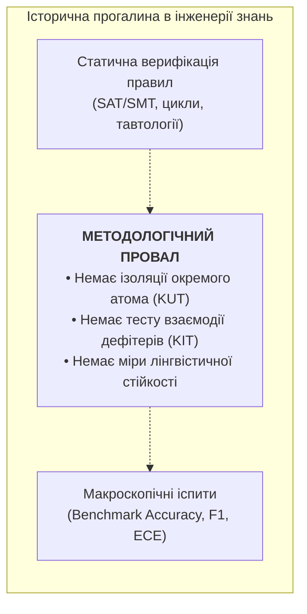
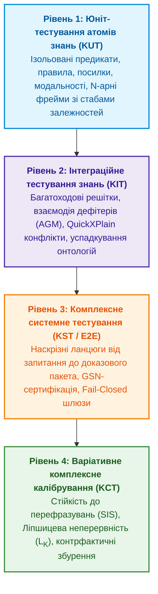
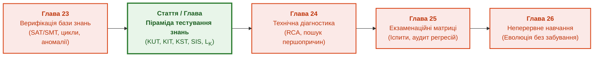

# Піраміда тестування знань: від ізольованих юніт-тестів атомів (KUT) та інтеграційних решіток (KIT) до комплексного калібрування варіативних запитань і висновків

> **Книга:** [Архітектура доказових експертних систем](README.md) · [Частина V: Верифікація, діагностика та неперервне навчання](part-05-verification-and-learning.md)  
> **Попередня глава:** [Глава 24. Технічна діагностика: як не сплутати симптом із першопричиною в умовах неповноти](ch24-system-diagnosis.md)  
> **Наступна глава:** [Глава 25. Як навчати експертну систему: екзаменаційні матриці, аудит знань та контроль регресій](ch25-how-expert-systems-learn.md)  
> **Зміст книги:** [README.md](README.md)  
> **Автор:** [Микола Федчик](about-the-author.md)  
> **Рівень:** системні архітектори, інженери знань, інженери верифікації (QA/QE), математики: поглиблений  
> **Очікувані результати:** проєктувати повний багаторівневий цикл тестування знань (Knowledge Testing Lifecycle, KTL); реалізовувати ізольовані юніт-тести атомів знань (Knowledge Unit Testing, KUT) із фіктивними посилками (mocks) та детекцією пастки вакуумної істинності; будувати інтеграційні тести композиції знань (Knowledge Integration Testing, KIT) для перевірки багатокрокових дедуктивних ланцюгів, дефітерів (AGM) та конфліктів онтологій; оцінювати стійкість експертної системи до варіативних запитань за допомогою метрики семантичної інваріантності (Semantic Invariance Score, SIS); розраховувати константу Ліпшицевої стійкості знання ($L_K$) для запобігання катастрофічним розривам довіри при мікрозбуреннях даних; застосовувати специфічні тестові інваріанти для різних парадигм виведення (дедукція, індукція під PAC-межами, абдукція за критерієм Оккама, CBR).

---

## Вступ: Прогалина між формальним аналізом та макроскопічними матрицями

У класичній інженерії програмного забезпечення забезпечення надійності спирається на піраміду тестування:
$$\text{Unit Tests} \to \text{Integration Tests} \to \text{System / E2E Tests}$$
Жоден досвідчений розробник не випустить сервіс у реліз лише на підставі того, що компілятор не видав синтаксичних помилок (статичний аналіз) або що загальна система опрацювала кілька демонстраційних запитів користувачів. Кожен метод тестується в ізоляції з фіктивними залежностями (stubs, mocks), граничні значення перевіряються на екстремумах, а міжмодульна взаємодія атестується на рівні інтеграційних контрактів.

Натомість в інженерії знань (Knowledge Engineering) та галузі штучного інтелекту десятиліттями існувала методологічна прогалина. Інженери знань традиційно переходили від статичної верифікації правил (пошук синтаксичних циклів або суперечностей через SMT-розв'язувачі, як описано в [Главі 23](ch23-knowledge-base-verification.md)) безпосередньо до загальних екзаменаційних матриць та інтегральних метрик (F1-score, Brier score на 1000 випадках, як описано в [Главі 25](ch25-how-expert-systems-learn.md)).



Якщо система видає хибне рішення, розробник без атомарних тестів не здатен відповісти на базові діагностичні запитання:
1. Помилка виникла в логіці самого правила (дефект антецедента)?
2. Помилка спричинена невірним успадкуванням типу в онтологічній решітці?
3. Помилка сталася через небажане спрацьовування підривного дефітера (*Undercutting Defeater*)?
4. Чи формулювання запиту зазнало незначного лінгвістичного перефразування, яке збило семантичний парсер?

Ця стаття формалізує **авторську інженерну концепцію Миколи Федчика — Піраміду тестування знань (Knowledge Testing Pyramid)**, розширює класичне калібрування математичним апаратом варіативної стійкості та впроваджує строгі критерії атестації для всіх парадигм логічного виведення.

---

## 1. Концептуальна модель: Піраміда тестування знань

Піраміда тестування знань структурує верифікацію бази знань за чотирма рівнями гранулярності та ізоляції:



---

## 2. Рівень 1: Knowledge Unit Testing (KUT) — Тестування атомів знань

### 2.1. Визначення та об'єкт тестування
**Knowledge Unit Testing (KUT)** — це ізольоване тестування найменшої неподільної одиниці знання без залучення глобальної бази фактів та без рекурсивного розгортання правил виведення.

Об'єктом KUT є:
- Окреме продукційне правило $R: \text{Antecedent} \to \text{Consequent}$.
- Окремий $N$-арний семантичний фрейм (ролі виконавця, дії, об'єкта, деонтичної модальності та контексту).
- Окремий предикат онтології з граничними числовими обмеженнями.

### 2.2. Метод фіктивних посилок (Premise Mocking)
У звичайній системі правило запитує базу знань:
```go
if kb.Query("connection_state") == "ESTABLISHED" && kb.Query("checksum_valid") == true { ... }
```
Під час KUT база знань підміняється ізольованим контекстом-стабом (`PremiseMock`):
```go
mock := knowledgetest.NewPremiseMock()
mock.Set("connection_state", "ESTABLISHED")
mock.Set("checksum_valid", true)
verdict, err := rule.Evaluate(mock)
```

### 2.3. Пастка вакуумної істинності (The Vacuous Truth Trap)
У класичній логіці висловлювань матеріальна імплікація $P \to Q$ еквівалентна $\neg P \lor Q$. Якщо антецедент $P$ є хибним, вираз формально істинний незалежно від $Q$.  
В інженерних експертних системах це призводить до критичних інцидентів: правило вважається «успішно виконаним», хоча жодна з реальних інженерних передумов не була збуджена.

**Інваріант KUT #1 (Relevant Implication Invariant):**
Тестовий сьют KUT для правила $P \to Q$ зобов'язаний містити щонайменше:
1. **Позитивний активуючий тест:** $P \equiv \text{True} \implies Q \equiv \text{True}$.
2. **Контрфактичний блокуючий тест:** $P \equiv \text{False} \implies Q$ не повинно генеруватися як підтверджений наслідок (повертається статус `Inactive` або `Refusal`, а не вакуумний успіх).
3. **Невизначений тризначний тест (Kleene 3VL):** $P \equiv \text{Unknown} \implies$ правило зобов'язане повернути `Unknown` і запросити докази, а не схвалювати дію за замовчуванням.

### 2.4. Аналіз граничних значень (Boundary Value Analysis, BVA)
Для предикатів із неперервними або дискретними діапазонами генерується 6-точкова матриця BVA:
$$\mathcal{T}_{\text{BVA}} = \{V_{\min} - \epsilon,\; V_{\min},\; V_{\min} + \epsilon,\; V_{\max} - \epsilon,\; V_{\max},\; V_{\max} + \epsilon\}$$
Наприклад, для правила валідності порту TCP ($[1, 65535]$) KUT перевіряє точки $0, 1, 2, 65534, 65535, 65536$, гарантуючи строге відхилення значень поза діапазоном на рівні атома.

---

## 3. Рівень 2: Knowledge Integration Testing (KIT) — Інтеграційні решітки

### 3.1. Визначення та мета
**Knowledge Integration Testing (KIT)** перевіряє правильність композиції кількох одиниць знань, що взаємодіють між собою через виведення, ієрархії понять або конкуренцію норм.

### 3.2. Багатоходові дедуктивні ланцюги (Multi-Hop Integrity)
Якщо правило $R_1$ виводить факт $F_1$, який є посилкою для $R_2$, що виводить $F_2$, тест KIT перевіряє передачу контексту без смислового зсуву (*Equivocation Defect*).
Наприклад, якщо $R_1$ визначає «тайм-аут сокета», а $R_2$ очікує «тайм-аут з'єднання», пряме з'єднання без явного зв'язку в онтології блокується.

### 3.3. Тестування взаємодії дефітерів (Defeater Dynamics under AGM)
У спростовних міркуваннях (*Defeasible Reasoning*) поява нового факту не скасовує аксіом, але може заблокувати конкретний висновок:
1. **Підривний дефітер (Undercutting Defeater):** факт $D_{\text{under}}$ підриває зв'язок між посилкою та наслідком (наприклад: «Датчик температури не калібрований, тому показник 95°C не доводить перегріву»). KIT перевіряє, що висновок «Перегрів» інвалідується, але значення датчика залишається в журналі.
2. **Спростовний дефітер (Rebutting Defeater):** факт $D_{\text{rebut}}$ стверджує протилежне ($\neg Q$). KIT перевіряє детермінований арбітраж норм за решіткою переваг:
   - *Lex Superior:* норма міжнародного стандарту або директиви безпеки переважає локальну евристику.
   - *Lex Specialis:* конкретний профіль безпеки (наприклад, аварійне гальмування) переважає загальне правило енергозбереження.
   - *Lex Posterior:* пізніша редакція стандарту за наявності графа заміщення (ADR-156) витісняє застарілу.

### 3.4. Виявлення мінімальних конфліктів (QuickXPlain Invariant)
KIT інтегрує алгоритм QuickXPlain (Юнкер, 2004) для перевірки здатності системи локалізувати суперечності. Якщо тестовий сценарій містить несумісні обмеження $\mathcal{C}$, система зобов'язана виділити мінімальну конфліктну підмножину $\mathrm{MUC} \subseteq \mathcal{C}$ ($\mathrm{MUC} \models \bot$ та $\forall c \in \mathrm{MUC}: \mathrm{MUC} \setminus \{c\} \not\models \bot$).

---

## 4. Рівень 3: Knowledge System Testing (KST) — Комплексне наскрізне тестування

**Knowledge System Testing (KST)** атестує повний контур від неструктурованого запиту до сертифікаційного пакета:
1. **Host Evidence Gate:** перевірка, що жодне стверджувальне рішення не приймається без валідації побайтових хешів у першоджерелі (`internal/hostevidence`).
2. **Proof DAG Synthesis:** перевірка побудови простежуваного орієнтованого ациклічного графа виведення.
3. **Fail-Closed Gate:** подача зловмисно модифікованого запиту з відсутнім засновком. Тест проходить успішно лише тоді, коли система повертає типізовану відмову (`refusal`), а не наближену чи галюциновану відповідь.

---

## 5. Математичне обґрунтування варіативного калібрування (Level 4: KCT)

Класичне калібрування моделей ШІ за формулою Едварда Брієра (1950) або калібрувальною кривою Платта оцінює ймовірність $P(\hat{y} = y \mid \hat{p} = p)$. Для доказових експертних систем ця метрика є недостатньою, оскільки вона не враховує лінгвістичну варіативність запиту та чутливість логічного простору до мікрозбурень.

### 5.1. Метрика семантичної інваріантності (Semantic Invariance Score, SIS)

Нехай $q_0$ — канонічне інженерне запитання.  
Многовид лінгвістичних перефразувань $\mathcal{Q}(q_0) = \{q_0, q_1, q_2, \dots, q_m\}$ генерується шляхом синонімічних підстановок, зміни синтаксичної структури речення та двомовного перекладу.

Нехай $\text{Verdict}(q)$ — логічне рішення системи, а $\text{ProofDAG}(q)$ — граф обґрунтування з точними цитатами.

**Означення 1 (Показник семантичної інваріантності):**
$$\text{SIS}(\mathcal{Q}) = 1 - \frac{1}{|\mathcal{Q}|} \sum_{i=1}^{m} \left[ \alpha \cdot \mathbb{I}\Big(\text{Verdict}(q_i) \neq \text{Verdict}(q_0)\Big) + (1 - \alpha) \cdot d_{\text{DAG}}\Big(\text{ProofDAG}(q_i), \text{ProofDAG}(q_0)\Big) \right]$$
де:
- $\mathbb{I}(\cdot)$ — булева функція, що дорівнює 1 при зміні кінцевого вердикту (критичний дефект стійкості);
- $d_{\text{DAG}}$ — нормалізована відстань між графами доведення (Tree Edit Distance);
- $\alpha \in [0, 1]$ — коефіцієнт штрафу за зміну висновку (рекомендовано $\alpha = 0{,}8$).

**Критерій допуску до критичної експлуатації:**
$$\text{SIS}(\mathcal{Q}) \ge 0{,}98 \quad \text{та} \quad \forall q_i \in \mathcal{Q}: \text{Verdict}(q_i) \equiv \text{Verdict}(q_0)$$
Якщо хоча б одне перефразування призводить до зміни висновку або втрати посилання на джерело, база знань не проходить варіативну атестацію.

### 5.2. Ліпшицева неперервність та епістемічна стійкість висновків

Як експертна система реагує на мікрозбурення емпіричних сенсорних спостережень $\mathcal{E}$?
Нехай простір вхідних свідчень оснащено метрикою $d_{\mathcal{E}}(E_1, E_2)$ (наприклад, нормованою відстанню між векторами телеметрії), а простір результуючих рішень — метрикою $d_{\mathcal{B}}(B_1, B_2)$.

**Означення 2 (Ліпшицева стійкість бази знань):**
База знань $\mathcal{K}$ володіє епістемічною стійкістю на області допустимих станів $\Omega$, якщо існує скінченна константа $L_{\mathcal{K}} < \infty$, така що:
$$\forall E_1, E_2 \in \Omega: \quad d_{\mathcal{B}}\Big(\text{Infer}(E_1 \mid \mathcal{K}),\; \text{Infer}(E_2 \mid \mathcal{K})\Big) \le L_{\mathcal{K}} \cdot d_{\mathcal{E}}(E_1, E_2)$$

**Фізичний та інженерний зміст:**
Якщо при зміні температури теплоносія на $0{,}001^\circ\text{C}$ або відхиленні тайм-ауту на $1\,\text{ns}$ система без наявності дефітера стрибкоподібно переходить від статусу «Штатний режим» до «Аварійна зупинка реактора», константа $L_{\mathcal{K}} \to \infty$. Це свідчить про наявність неперевіреного розривного предиката без гістерезису, що створює ризик високочастотних брязкотів (*Chattering*) у кіберфізичних контурах. Варіативне калібрування KCT вимагає моделювання гістерезису та згладжування довірчих інтервалів.

---

## 6. Тестування різних парадигм логічного виведення

Спроба тестувати всі типи знань за єдиним шаблоном призводить до хибних вердиктів. Тестовий фреймворк зобов'язаний розрізняти епістемічну природу виведення:

| Парадигма виведення | Що є джерелом істини | Математичний критерій тесту (Test Assertion) | Що фіксується як дефект (Bug) |
|---|---|---|---|
| **Дедукція (Deductive)** | Формальна тавтологія, аксіоми | **Soundness & Completeness:**<br/>$\mathcal{K} \models \varphi \iff \forall \mathcal{M} \models \mathcal{K}: \mathcal{M} \models \varphi$. Резолюційна замкненість. | Виведення $\varphi$ при хибних посилках; тавтологія з порожнім антецедентом; недетермінізм. |
| **Індукція (Inductive)** | Емпіричні спостереження, майнінг правил | **PAC-межа (Valiant, 1984):**<br/>$N \ge \frac{1}{\epsilon} \left( \ln \lvert\mathcal{H}\rvert + \ln \frac{1}{\delta} \right)$. Похибка генералізації $\le \epsilon$ з довірою $1 - \delta$. | Перенавчання на шумі; вироджене правило з нульовим покриттям; порушення інваріантів на контрприкладах. |
| **Абдукція (Abductive)** | Найбільш економне пояснення аномалії | **Occam Parsimony (Pierce / AGM):**<br/>$H \cup \mathcal{K} \models O$, $H \cup \mathcal{K} \not\models \bot$, $\text{Complexity}(H) \to \min$. | Висування тривіальних або неперевірюваних гіпотез; порушення відомих дефітерів. |
| **Спростовні міркування (Defeasible)** | Раціональне переконання за відсутності заперечень | **Dung Grounded Semantics (1995):**<br/>Аргумент входить у базис переконань тоді й лише тоді, коли всі контраргументи спростовані захищеними підставами. | Використання спростованого засновку; ігнорування блокувального винятку; нерозв'язана симетрична атака. |
| **Прецедентні міркування (CBR)** | Структурна та метрична аналогія | **Metric Monotonicity & Negative Barrier:**<br/>$d(x, x_{\text{pos}}) < d(x, x_{\text{neg}})$. Наявність негативного прецеденту блокує автоматичне перенесення рішення. | Некоректне перенесення розв'язку через збій метрики близькості; ігнорування застереження прецеденту. |

---

## 7. Програмна реалізація мовою Go: пакет `knowledgetest`

Нижче наведено робочу реалізацію фреймворку тестування знань на мові Go, яка демонструє юніт-тестування атомів (KUT), ізоляцію посилок через моки, детекцію вакуумної істинності та розрахунок показника семантичної інваріантності (SIS).

```go
package knowledgetest

import (
	"errors"
	"fmt"
	"math"
)

// DeonticModality задає нормативну силу правила
type DeonticModality string

const (
	ModalityMust   DeonticModality = "MUST"
	ModalityShould DeonticModality = "SHOULD"
	ModalityMay    DeonticModality = "MAY"
)

// PremiseMock забезпечує повну ізоляцію атома знання під час тестування KUT
type PremiseMock struct {
	values map[string]any
}

func NewPremiseMock() *PremiseMock {
	return &PremiseMock{values: make(map[string]any)}
}

func (m *PremiseMock) Set(name string, val any) {
	m.values[name] = val
}

func (m *PremiseMock) GetBool(name string) (bool, bool) {
	v, ok := m.values[name]
	if !ok {
		return false, false
	}
	b, ok := v.(bool)
	return b, ok
}

func (m *PremiseMock) GetFloat(name string) (float64, bool) {
	v, ok := m.values[name]
	if !ok {
		return 0, false
	}
	switch num := v.(type) {
	case float64:
		return num, true
	case int:
		return float64(num), true
	default:
		return 0, false
	}
}

// RuleResult містить результат виконання правила
type RuleResult struct {
	Fired        bool
	Consequent   string
	VacuousTruth bool
}

// KnowledgeUnitRule описує ізольований атом знання
type KnowledgeUnitRule struct {
	ID        string
	Modality  DeonticModality
	Predicate string
	Evaluate  func(ctx *PremiseMock) (RuleResult, error)
}

// CheckVacuousTruth перевіряє правило на відсутність пастки вакуумної істинності
func (r *KnowledgeUnitRule) CheckVacuousTruth(negativeCtx *PremiseMock) error {
	res, err := r.Evaluate(negativeCtx)
	if err != nil {
		return err
	}
	if res.Fired && res.VacuousTruth {
		return fmt.Errorf("KUT-FAIL: rule %q exhibited vacuous truth on negative premises", r.ID)
	}
	return nil
}

// SemanticInvarianceCalculator розраховує метрику SIS для варіативних запитань
type SemanticInvarianceCalculator struct {
	Alpha float64 // вага зміни вердикту (0.8)
}

func NewSemanticInvarianceCalculator(alpha float64) *SemanticInvarianceCalculator {
	return &SemanticInvarianceCalculator{Alpha: alpha}
}

type QueryEvaluation struct {
	Query     string
	Verdict   string
	ProofTree []string
}

// CalculateSIS обчислює показник семантичної інваріантності
func (c *SemanticInvarianceCalculator) CalculateSIS(baseline QueryEvaluation, variations []QueryEvaluation) (float64, error) {
	if len(variations) == 0 {
		return 1.0, nil
	}

	totalPenalty := 0.0
	for _, v := range variations {
		verdictDiff := 0.0
		if v.Verdict != baseline.Verdict {
			verdictDiff = 1.0
		}

		// Відстань Хеммінга між кроками доведення
		treeDiff := calculateTreeDivergence(baseline.ProofTree, v.ProofTree)

		penalty := c.Alpha*verdictDiff + (1.0-c.Alpha)*treeDiff
		totalPenalty += penalty
	}

	sis := 1.0 - (totalPenalty / float64(len(variations)))
	return math.Max(0.0, sis), nil
}

func calculateTreeDivergence(base, target []string) float64 {
	if len(base) == 0 && len(target) == 0 {
		return 0.0
	}
	diffCount := 0
	set := make(map[string]bool)
	for _, b := range base {
		set[b] = true
	}
	for _, t := range target {
		if !set[t] {
			diffCount++
		}
	}
	total := math.Max(float64(len(base)), float64(len(target)))
	if total == 0 {
		return 0.0
	}
	return float64(diffCount) / total
}
```

---

## 8. Модульні тести: верифікація тестового фреймворку знань

Наведений модульний тест демонструє, як KUT виявляє хибне правило з вакуумною істинністю та як калькулятор SIS оцінює стійкість системи до перефразувань.

```go
package knowledgetest

import (
	"testing"
)

func TestKnowledgeUnitTesting_VacuousTruthDetection(t *testing.T) {
	// Створюємо правило з дефектом вакуумної істинності:
	// Якщо MTU > 1500, то вимагати фрагментації.
	// Дефект: при хибному MTU правило повертає Fired: true з вакуумним прапорцем.
	defectiveRule := &KnowledgeUnitRule{
		ID:        "rule:tcp_fragmentation",
		Modality:  ModalityMust,
		Predicate: "fragmentation_required",
		Evaluate: func(ctx *PremiseMock) (RuleResult, error) {
			mtu, ok := ctx.GetFloat("mtu")
			if !ok {
				return RuleResult{Fired: false}, nil
			}
			if mtu > 1500 {
				return RuleResult{Fired: true, Consequent: "FRAG_ON", VacuousTruth: false}, nil
			}
			// Помилка: вакуумне спрацьовування замість вимкнення
			return RuleResult{Fired: true, Consequent: "FRAG_OFF", VacuousTruth: true}, nil
		},
	}

	mock := NewPremiseMock()
	mock.Set("mtu", 1400) // Умова MTU > 1500 не виконується

	err := defectiveRule.CheckVacuousTruth(mock)
	if err == nil {
		t.Fatal("expected KUT to fail on vacuous truth, but it passed")
	}
}

func TestSemanticInvarianceScore_Evaluation(t *testing.T) {
	calc := NewSemanticInvarianceCalculator(0.8)

	baseline := QueryEvaluation{
		Query:     "Який максимальний розмір вікна TCP?",
		Verdict:   "65535 байт (без Window Scale)",
		ProofTree: []string{"RFC 9293 §3.1", "HeaderField:Window", "BitSize:16"},
	}

	// 1-ша варіація: повний збіг
	v1 := QueryEvaluation{
		Query:     "Скільки байт становить ліміт вікна в заголовку TCP?",
		Verdict:   "65535 байт (без Window Scale)",
		ProofTree: []string{"RFC 9293 §3.1", "HeaderField:Window", "BitSize:16"},
	}

	// 2-га варіація: правильний вердикт, але трохи інший шлях доведення
	v2 := QueryEvaluation{
		Query:     "TCP window header maximum value",
		Verdict:   "65535 байт (без Window Scale)",
		ProofTree: []string{"RFC 9293 §3.1", "BitSize:16"},
	}

	// 3-тя варіація: катастрофічний збій семантики (хибний вердикт)
	v3 := QueryEvaluation{
		Query:     "TCP window size limit",
		Verdict:   "1073725440 байт", // сплутано з Window Scale опцією
		ProofTree: []string{"RFC 7323"},
	}

	sis, err := calc.CalculateSIS(baseline, []QueryEvaluation{v1, v2})
	if err != nil || sis < 0.95 {
		t.Fatalf("expected high SIS for robust variations, got %f (err: %v)", sis, err)
	}

	sisWithFail, err := calc.CalculateSIS(baseline, []QueryEvaluation{v1, v2, v3})
	if err != nil {
		t.Fatal(err)
	}
	// Присутність помилки повинна різко знизити показник інваріантності
	if sisWithFail >= 0.95 {
		t.Fatalf("expected low SIS when catastrophic failure is present, got %f", sisWithFail)
	}
}
```

---

## 9. Місце статті в архітектурному плані монографії

Ця стаття формує відсутній концептуальний та інженерний міст у **Частині V («Верифікація, діагностика та неперервне навчання»)**:



Впровадження цієї дисципліни дозволяє:
1. Забезпечити висхідну верифікацію знань від атома (KUT) до цілісної системи (KST).
2. Захистити інженерні бази правил від пасток вакуумної істинності.
3. Математично верифікувати інваріантність відповідей на лінгвістичні варіації запитів перед сертифікаційним аудитом за GSN ([Глава 27](ch27-safety-case-gsn-synthesis.md)).

---

## Висновки

1. **Повна піраміда тестування знань:** Інженерія знань повинна наслідувати зрілість інженерії програмного забезпечення. Впровадження чотирирівневої піраміди (KUT $\to$ KIT $\to$ KST $\to$ KCT) ліквідує розрив між сухим статичним аналізом та макроскопічними оцінками.
2. **Ізоляція посилок (KUT):** Тестування окремого правила за допомогою `PremiseMock` усуває взаємний вплив правил та унеможливлює непомітне проходження тестів за рахунок вакуумної істинності матеріальної імплікації.
3. **Метрика семантичної інваріантності (SIS):** Класичне калібрування довіри доповнюється вимірюванням стабільності виведення на многовиді лінгвістичних перефразувань, забезпечуючи $\text{SIS} \ge 0{,}98$ для систем високої відповідальності.
4. **Ліпшицева стійкість висновку:** Перевірка константи Ліпшиця $L_{\mathcal{K}} < \infty$ запобігає катастрофічним стрибкам вердикту при незначних сенсорних коливаннях, гарантуючи відсутність розривів довіри.
5. **Диференційовані тестові контракти:** Дедукція перевіряється на резолюційну повноту, індукція — на PAC-межі узагальнення, абдукція — на мінімальну складність за Оккамом, а спростовні міркування — на стійкість базису за Дунгом.

---

## Запитання до читачів

1. Чому наявність високої точності (Accuracy > 95%) на статичному тестовому наборі не гарантує захисту від лінгвістичної крихкості при перефразуванні запитання?
2. У чому полягає небезпека вакуумної істинності ($P \to Q$ при $P \equiv \text{False}$) для систем прийняття рішень у критичних галузях?
3. Як за допомогою техніки Premise Mocking протестувати окремий $N$-арний семантичний фрейм без розгортання повної онтології?
4. Яка математична залежність існує між константою Ліпшиця $L_{\mathcal{K}}$ бази знань та явищем брязкоту (*Chattering*) у кіберфізичних виконавчих механізмах?
5. Чим відрізняється тестування підривного дефітера (*Undercutting*) від спростовного дефітера (*Rebutting*) у термінах решіток переваг?
6. Як розраховується показник семантичної інваріантності (SIS) та яку роль у ньому відіграє відстань між графами доведення (Proof DAG)?
7. Чому індуктивно видобуті правила вимагають оцінки розміру вибірки за межами Валіанта (PAC-Learning)?

---

## Словник

| Український термін | Англійський відповідник | Коротке пояснення |
|---|---|---|
| **Knowledge Unit Testing (KUT)** | Knowledge Unit Testing | Ізольоване тестування одиничного неподільного атома знання (правила, поняття, фрейму) зі стабами посилок. |
| **Knowledge Integration Testing (KIT)** | Knowledge Integration Testing | Тестування взаємодії пов'язаної групи правил, ієрархій понять, решіток переваг та спростовних дефітерів. |
| **Knowledge System Testing (KST)** | Knowledge System Testing | Наскрізне комплексне тестування експертної системи від сирого запиту до верифікованого доказового пакета. |
| **Семантична інваріантність (SIS)** | Semantic Invariance Score | Метрика стійкості висновків та дерева доведення при лінгвістичних варіаціях та перефразуваннях запитання. |
| **Ліпшицева стійкість знання** | Knowledge Lipschitz Continuity | Властивість бази знань зберігати обмежену зміну висновків при малих збуреннях вхідних сенсорних свідчень ($L_{\mathcal{K}} < \infty$). |
| **Вакуумна істинність** | Vacuous Truth | Формальна істинність імплікації $P \to Q$ внаслідок хибності антецедента $P$, що є дефектом верифікації правил. |
| **Фіктивна посилка (Mock)** | Premise Mock | Ізольований тестовий контекст, що підставляє контрольовані значення передумов для тестування правила без звернення до сховища. |
| **Мінімальна конфліктна підмножина** | Minimal Unsatisfiable Core (MUC) | Найменша підмножина несумісних правил або обмежень, що спричиняє логічну суперечність. |

---

## Абревіатури

| Абревіатура | Повна назва | Значення в контексті глави |
|---|---|---|
| **AGM** | Alchourrón, Gärdenfors, Makinson | Стандартна логічна теорія ревізії переконань при отриманні спростувань |
| **BVA** | Boundary Value Analysis | Аналіз граничних значень для перевірки числових діапазонів предикатів |
| **CBR** | Case-Based Reasoning | Міркування на основі прецедентів |
| **ECE** | Expected Calibration Error | Очікувана похибка калібрування ймовірнісних оцінок |
| **GSN** | Goal Structuring Notation | Графічна нотація структурування аргументів безпеки |
| **KIT** | Knowledge Integration Testing | Інтеграційне тестування взаємодії та композиції знань |
| **KST** | Knowledge System Testing | Комплексне наскрізне тестування експертної системи |
| **KUT** | Knowledge Unit Testing | Модульне ізольоване тестування атомів знань |
| **MUC** | Minimal Unsatisfiable Core | Мінімальна несумісна підмножина правил у задачі діагностики |
| **PAC** | Probably Approximately Correct | Ймовірнісно приблизно коректне машинне навчання за Леслі Валіантом |
| **SIS** | Semantic Invariance Score | Показник семантичної інваріантності висновків на варіаціях запитів |

---

## Джерела

1. **Boehm, B. W.** (1981). *Software Engineering Economics*. Prentice-Hall. (Класичне розмежування верифікації та валідації).
2. **Cohn, M.** (2009). *Succeeding with Agile: Software Development Using Scrum*. Addison-Wesley Professional. (Фундамент концепції піраміди тестування ПЗ).
3. **Valiant, L. G.** (1984). A theory of the learnable. *Communications of the ACM*, 27(11), 1134–1142. (Теорія PAC-навчання для індуктивних висновків).
4. **Dung, P. M.** (1995). On the acceptability of arguments and its fundamental role in nonmonotonic reasoning, logic programming and n-person games. *Artificial Intelligence*, 77(2), 321–357. (Теорія абстрактних аргументаційних рамок та обґрунтованих розширень).
5. **Junker, U.** (2004). QUICKXPLAIN: Preferred explanations and relaxations for over-constrained problems. In *AAAI* (Vol. 4, pp. 167–172). (Алгоритм пошуку мінімальних конфліктних підмножин MUC).
6. **Alchourrón, C. E., Gärdenfors, P., & Makinson, D.** (1985). On the logic of theory change: Partial meet contraction and revision functions. *Journal of Symbolic Logic*, 50(2), 510–530. (Постулати AGM для динаміки переконань).
7. **Brier, G. W.** (1950). Verification of forecasts expressed in terms of probability. *Monthly Weather Review*, 78(1), 1–3. (Класична метрика калібрування Brier Score).
8. **Guo, C., Pleiss, G., Sun, Y., & Weinberger, K. Q.** (2017). On calibration of modern neural networks. In *ICML* (PMLR 70, pp. 1321–1330). (Оцінка Expected Calibration Error та температурне масштабування).
9. **Ribeiro, M. T., Wu, T., Guestrin, C., & Singh, S.** (2020). Beyond Accuracy: Behavioral Testing of NLP Models with CheckList. In *ACL* (pp. 4902–4912). (Методологія поведінкового та інваріантного тестування мовних систем).
10. **Kelly, T., & Weaver, R.** (2004). The Goal Structuring Notation – A Safety Argumentation Grid. In *Dependable Systems and Networks*. (Синтез структурованих доказів безпеки).

---

[← Глава 24. Технічна діагностика: як не сплутати симптом із першопричиною](ch24-system-diagnosis.md) | [Зміст книги](README.md) | [Частина V](part-05-verification-and-learning.md) | [Глава 25. Як навчати експертну систему: екзаменаційні матриці →](ch25-how-expert-systems-learn.md)
